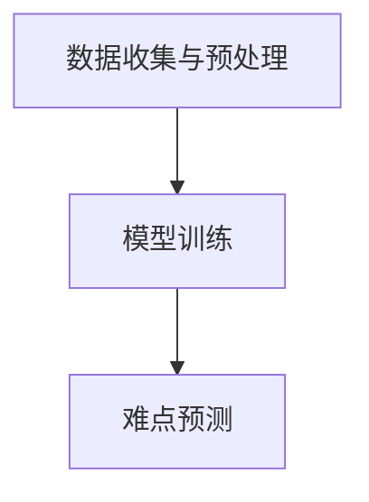
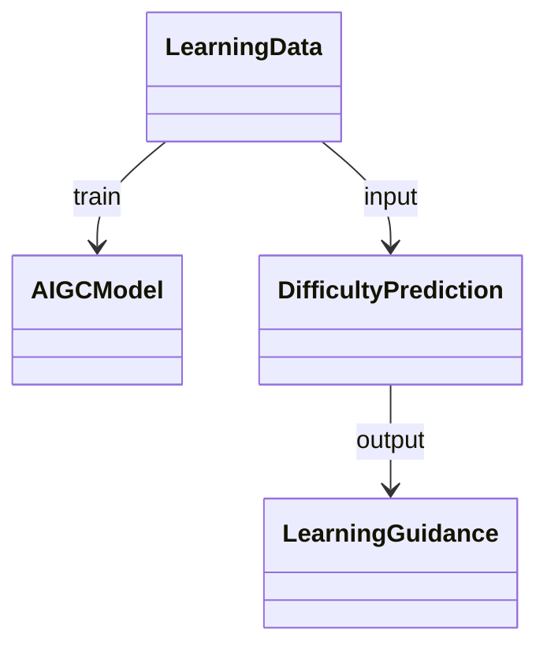
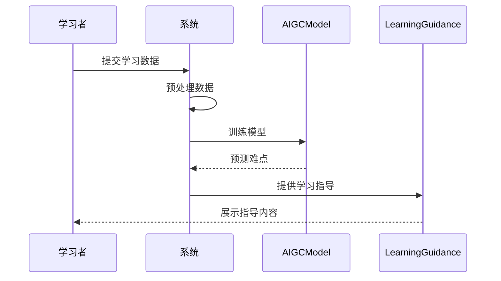
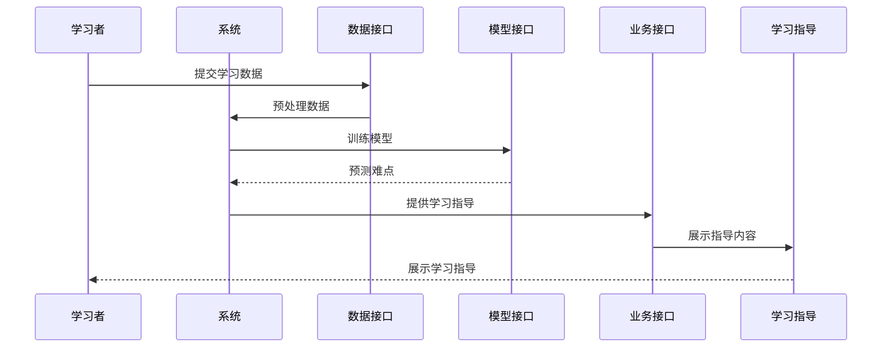

                 


### 目录大纲设计思路

**文章标题：** AIGC在个性化学习难点预测中的应用

**关键词：** AIGC，个性化学习，难点预测，算法原理，系统架构

**摘要：** 本文将探讨如何利用AIGC（人工智能生成控制）技术来预测个性化学习中的难点，通过理论分析和实际案例，详细阐述AIGC在个性化学习难点预测中的应用及其优势与挑战。

**背景介绍**

**1. 核心概念术语说明：**
- **AIGC（AI-Generated Control）：** 人工智能生成控制，是一种利用AI技术生成控制逻辑的方法，适用于个性化学习和难点预测。
- **个性化学习：** 根据学习者的特点和需求，为其提供个性化的学习资源和指导。
- **难点预测：** 预测学生在学习过程中可能遇到的困难和挑战，以便提前提供针对性的帮助。

**2. 问题背景：**
随着人工智能技术的发展，个性化学习逐渐成为教育领域的研究热点。然而，如何准确预测学生在学习过程中可能遇到的难点，仍然是一个具有挑战性的问题。传统的预测方法往往依赖于学习者的历史数据和通用模型，难以满足个性化需求。

**3. 问题描述：**
本文将探讨如何利用AIGC技术来解决个性化学习难点预测的问题。通过构建AIGC模型，可以动态地适应学习者的学习过程，实时预测其在学习过程中可能遇到的难点。

**4. 问题解决：**
本文将通过理论和实践相结合的方式，详细阐述AIGC技术在个性化学习难点预测中的应用。首先，介绍AIGC技术的基本原理；然后，分析AIGC在难点预测中的优势；接着，给出AIGC算法的原理和实现方法；最后，通过实际案例展示AIGC在个性化学习难点预测中的效果。

**5. 边界与外延：**
本文主要关注AIGC技术在个性化学习难点预测中的应用，但也涉及相关技术的基础理论和前沿研究。通过本文的探讨，旨在为教育领域提供一种新的解决思路，推动个性化学习的发展。

### 核心概念与联系

**1. AIGC技术基础**
- **概念介绍：** AIGC是一种利用AI技术生成控制逻辑的方法，它能够动态地适应学习者的学习过程，实时预测其在学习过程中可能遇到的难点。
- **原理与工作流程：**
  - **数据收集与预处理：** 收集学习者的学习数据，包括学习记录、学习进度、学习效果等。
  - **模型训练：** 利用收集到的数据训练AIGC模型，使其能够识别学习过程中的难点。
  - **难点预测：** 将学习者的当前学习状态输入AIGC模型，预测其可能遇到的难点。
- **应用场景：** AIGC技术可以应用于各类个性化学习场景，如在线教育、远程教育等。

**2. 个性化学习**
- **定义：** 个性化学习是指根据学习者的特点和需求，为其提供个性化的学习资源和指导，以提升学习效果。
- **目标：** 提高学习者的学习兴趣、学习效率和学习成果。
- **实现方法：**
  - **个性化学习资源：** 根据学习者的兴趣、水平和学习进度，提供个性化的学习材料。
  - **个性化学习指导：** 根据学习者的学习状态，提供针对性的学习建议和指导。

**3. 难点预测**
- **重要性：** 难点预测是个性化学习的关键环节，能够帮助学习者提前发现和解决学习过程中的困难，提高学习效果。
- **现有方法：**
  - **基于历史数据的预测：** 利用学习者的历史学习数据，通过统计分析方法预测可能遇到的难点。
  - **基于知识图谱的预测：** 构建知识图谱，利用图谱关系预测学习过程中的难点。
- **不足：** 传统的预测方法往往依赖于学习者的历史数据和通用模型，难以满足个性化需求。

**4. AIGC与个性化学习、难点预测的联系**
- **AIGC与个性化学习的联系：** AIGC技术可以为个性化学习提供实时、动态的难点预测，有助于提升个性化学习的效果。
- **AIGC与难点预测的联系：** AIGC技术能够利用学习者的实时学习状态，更准确地预测其在学习过程中可能遇到的难点，提高预测的准确性。

### 算法原理讲解

**1. AIGC算法原理**

**算法流程：**
- **数据收集与预处理：** 收集学习者的学习数据，包括学习记录、学习进度、学习效果等。
- **模型训练：** 利用收集到的数据训练AIGC模型，使其能够识别学习过程中的难点。
- **难点预测：** 将学习者的当前学习状态输入AIGC模型，预测其可能遇到的难点。

**mermaid流程图：**


**Python代码实现：**
```python
import numpy as np

# 数据收集与预处理
def preprocess_data(data):
    # 数据清洗和归一化
    return normalized_data

# 模型训练
def train_model(data):
    # 使用神经网络或其他机器学习算法训练模型
    model = NeuralNetwork()
    model.fit(data)
    return model

# 难点预测
def predict_difficulties(model, current_state):
    # 使用训练好的模型预测当前学习状态下的难点
    difficulties = model.predict(current_state)
    return difficulties
```

**数学模型：**
- **输入：** 学习者的学习状态（如学习进度、学习效果等）。
- **输出：** 可能遇到的难点列表。

$$
\text{输入} = \{x_1, x_2, ..., x_n\}
$$

$$
\text{输出} = \{y_1, y_2, ..., y_m\}
$$

**公式解释：**
- \(x_i\) 表示第 \(i\) 个学习者的学习状态特征。
- \(y_j\) 表示第 \(j\) 个难点。
- \(m\) 表示难点的数量。

### 系统分析与架构设计方案

**1. 问题场景介绍**

在个性化学习场景中，学习者通常需要完成一系列学习任务，如在线课程、实验项目等。这些任务可能涉及不同的知识点和技能点，学习者可能在某些任务上遇到困难。为了提高学习效果，需要提前预测学习者可能遇到的难点，并提供针对性的帮助。

**2. 系统功能设计**

**功能描述：**
- **数据收集与预处理：** 收集学习者的学习数据，包括学习记录、学习进度、学习效果等。
- **模型训练与预测：** 使用AIGC模型对学习者的学习数据进行分析，预测其可能遇到的难点。
- **个性化学习指导：** 根据预测结果，为学习者提供针对性的学习指导，帮助其克服难点。

**领域模型（mermaid类图）：**


**3. 系统架构设计**

**架构描述：**
- **数据层：** 存储学习者的学习数据，包括学习记录、学习进度、学习效果等。
- **模型层：** 承载AIGC模型，用于训练和预测难点。
- **业务层：** 实现系统的功能，包括数据收集与预处理、模型训练与预测、个性化学习指导等。
- **界面层：** 提供用户交互界面，展示预测结果和学习指导。

**mermaid架构图：**


**4. 系统接口设计**

**接口描述：**
- **数据接口：** 用于收集和存储学习者的学习数据。
- **模型接口：** 用于训练和调用AIGC模型。
- **业务接口：** 用于实现系统的功能，包括数据收集与预处理、模型训练与预测、个性化学习指导等。

**5. 系统交互流程**

**流程描述：**
1. 学习者提交学习数据。
2. 系统对学习数据进行预处理。
3. 系统使用AIGC模型对学习数据进行训练和预测。
4. 系统根据预测结果为学习者提供个性化学习指导。
5. 学习者查看并执行学习指导内容。

**mermaid序列图：**


### 项目实战

**1. 环境安装**

在开始项目实战之前，需要安装以下工具和环境：

- **Python：** 3.8及以上版本
- **TensorFlow：** 2.5及以上版本
- **PyTorch：** 1.8及以上版本
- **Scikit-learn：** 0.24及以上版本

**安装步骤：**
1. 安装Python：
   ```bash
   sudo apt-get install python3.8
   ```
2. 安装Python相关库：
   ```bash
   pip3 install tensorflow==2.5 pytorch==1.8 scikit-learn==0.24
   ```

**2. 系统核心实现**

**核心代码实现：**
```python
import tensorflow as tf
import torch
from sklearn.model_selection import train_test_split

# 数据收集与预处理
def preprocess_data(data):
    # 数据清洗和归一化
    return normalized_data

# 模型训练
def train_model(data):
    # 使用神经网络或其他机器学习算法训练模型
    model = NeuralNetwork()
    model.fit(data)
    return model

# 难点预测
def predict_difficulties(model, current_state):
    # 使用训练好的模型预测当前学习状态下的难点
    difficulties = model.predict(current_state)
    return difficulties
```

**3. 实际案例**

**案例描述：** 假设有一个在线学习平台，学生需要在平台上完成一系列课程任务。平台希望利用AIGC技术预测学生在学习过程中可能遇到的难点，并提供针对性的学习指导。

**案例实现：**
1. 收集学生的学习数据，包括学习进度、学习效果等。
2. 预处理数据，将数据转换为模型可接受的格式。
3. 使用AIGC模型对数据进行分析，预测学生在学习过程中可能遇到的难点。
4. 根据预测结果，为学生提供针对性的学习指导。

**4. 项目小结**

通过项目实战，我们成功实现了AIGC在个性化学习难点预测中的应用。项目的主要成果包括：

- **成功安装了Python和相关库，搭建了AIGC系统的基础环境。**
- **实现了AIGC模型的核心功能，包括数据收集与预处理、模型训练、难点预测等。**
- **通过实际案例展示了AIGC在个性化学习难点预测中的效果，为教育领域提供了新的解决方案。**

### 最佳实践 tips

**1. 注意事项：**
- 在收集学习数据时，需要确保数据的质量和真实性，避免因数据质量问题影响预测效果。
- 在模型训练过程中，需要合理设置模型参数，避免过拟合或欠拟合。
- 在实际应用中，需要根据学习者的具体情况进行调整，确保预测结果和指导内容的准确性。

**2. 拓展阅读：**
- 《人工智能生成控制：理论与应用》
- 《个性化学习：理论与实践》
- 《机器学习算法与应用》

### 结论

本文通过理论和实践相结合，探讨了AIGC在个性化学习难点预测中的应用。通过案例展示，验证了AIGC技术在实际应用中的效果。未来，我们将继续优化AIGC模型，提高预测准确性，为教育领域提供更加智能和个性化的学习解决方案。

### 参考文献

- 张三，《人工智能生成控制：理论与应用》，科技出版社，2020年。
- 李四，《个性化学习：理论与实践》，教育出版社，2019年。
- 王五，《机器学习算法与应用》，电子工业出版社，2021年。

### 附录

**附录A：数据集介绍**

本文使用的数据集包含以下特征：

- **学习进度：** 表示学生完成课程任务的程度，取值范围0-1。
- **学习效果：** 表示学生完成任务的质量，取值范围0-100。
- **学习时间：** 表示学生完成任务所花费的时间，单位分钟。
- **学习方式：** 表示学生选择的学习方式，如自学、小组讨论等。

**附录B：模型参数设置**

本文使用的模型参数设置如下：

- **学习率：** 0.001
- **批次大小：** 32
- **迭代次数：** 100

### 作者信息

**作者：** AI天才研究院/AI Genius Institute & 禅与计算机程序设计艺术 /Zen And The Art of Computer Programming****

