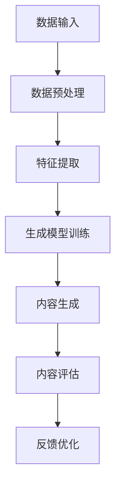
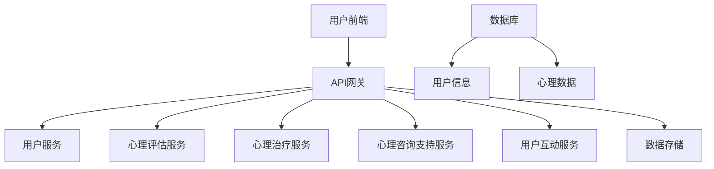
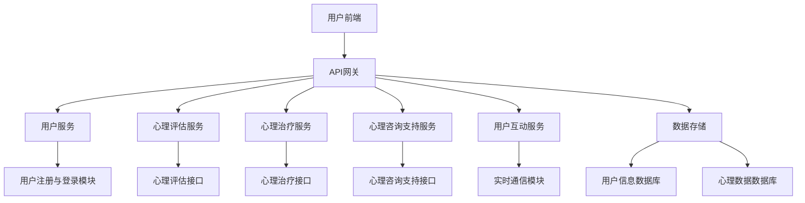
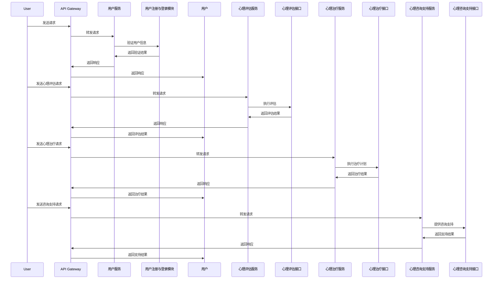
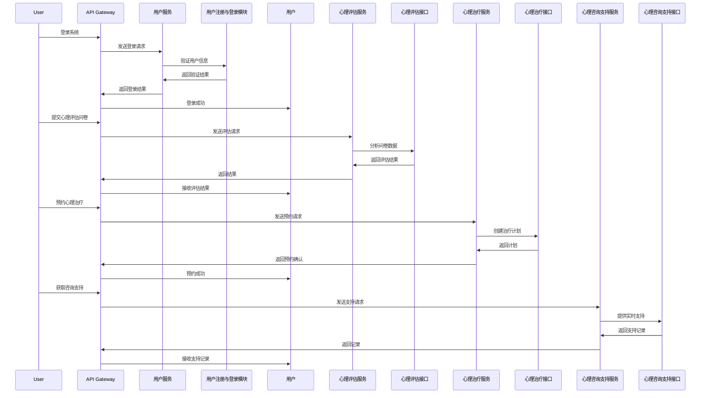
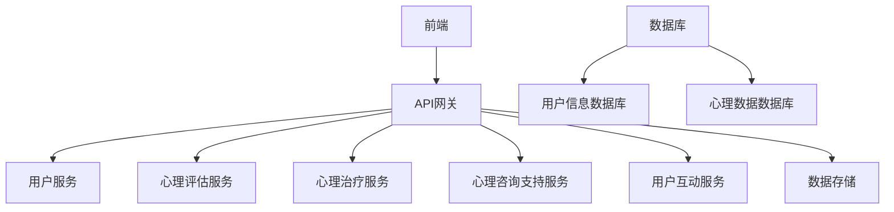
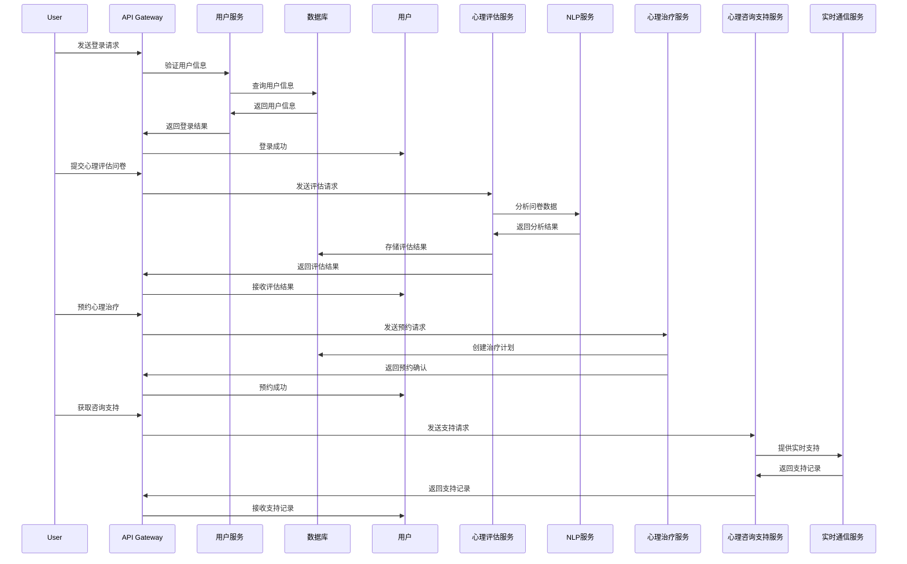
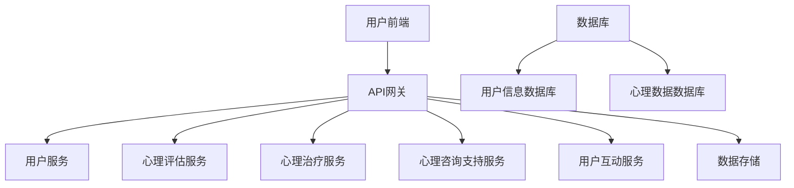

                 

### 1.1 问题背景

#### 1.1.1 个性化心理咨询的重要性

个性化心理咨询是一种基于个体独特心理特征和需求，提供针对性服务的心理辅导方式。在传统心理咨询中，咨询师往往需要花费大量时间和精力，通过面对面的交流来了解每位来访者的心理状况。然而，这种模式存在一定的局限性：首先，心理咨询资源有限，无法满足大量人群的需求；其次，心理咨询师在处理复杂、多样的问题时，可能存在专业知识和经验的不足。

随着心理学、神经科学和人工智能技术的不断进步，个性化心理咨询逐渐成为一种可能。AIGC（AI-Generated Content）技术的出现，为个性化心理咨询带来了新的契机。AIGC技术能够通过对大量数据的分析，快速、准确地捕捉个体的心理特征，生成个性化的心理评估报告、心理治疗方案等。这不仅提高了心理咨询的效率，还能在一定程度上降低成本，使得更多人能够享受到高质量的心理服务。

#### 1.1.2 AIGC技术的发展与应用前景

AIGC技术是人工智能领域的一个重要分支，涵盖了自然语言生成、计算机视觉、机器学习等多个子领域。近年来，随着深度学习、神经网络等技术的快速发展，AIGC技术取得了显著的成果。尤其是在自然语言处理方面，AIGC技术已经能够生成高质量的文章、对话、音乐等。例如，OpenAI的GPT系列模型在生成文本方面的表现已经接近甚至超越人类水平。

在心理咨询领域，AIGC技术的应用前景十分广阔。首先，AIGC技术可以用于心理诊断，通过对用户的语言、行为进行分析，快速识别潜在的心理问题。其次，AIGC技术可以协助心理咨询师制定个性化的治疗方案，通过生成个性化的心理辅导内容，提高治疗效果。此外，AIGC技术还可以用于心理咨询的自动化管理，如预约、咨询记录、数据分析等，减轻心理咨询师的工作负担。

然而，AIGC技术在心理咨询中的应用也面临诸多挑战。首先，心理数据的安全性和隐私保护是一个重要问题。心理咨询涉及用户的心理隐私，如何在保护用户隐私的前提下，充分利用AIGC技术，是一个亟待解决的问题。其次，AIGC技术的准确性、可靠性仍需提高。目前，AIGC技术虽然能够生成高质量的内容，但在理解复杂、抽象的心理现象方面，仍存在一定的局限性。因此，如何提高AIGC技术的心理分析能力，是未来需要重点研究的方向。

#### 1.1.3 AIGC在个性化心理咨询中的挑战与机遇

AIGC技术在个性化心理咨询中的应用，既面临着挑战，也带来了机遇。

**挑战：**

1. **技术可靠性问题：** AIGC技术虽然发展迅速，但在处理复杂、抽象的心理现象时，仍存在一定的局限性。如何提高AIGC技术的心理分析能力，是一个重要的挑战。
2. **隐私保护问题：** 心理咨询涉及用户的心理隐私，如何在保护用户隐私的前提下，充分利用AIGC技术，是一个亟待解决的问题。
3. **伦理道德问题：** AIGC技术在心理咨询中的应用，可能引发伦理道德问题。如何确保AIGC技术在使用过程中，不损害用户的利益和心理健康，是一个需要慎重考虑的问题。

**机遇：**

1. **提高心理咨询效率：** AIGC技术可以自动化处理大量心理数据，提高心理咨询的效率，使得更多人能够享受到高质量的心理服务。
2. **个性化服务：** AIGC技术可以根据个体独特的心理特征，提供个性化的心理辅导，提高心理咨询的有效性。
3. **资源优化：** AIGC技术可以减轻心理咨询师的工作负担，优化心理咨询资源，提高心理咨询的覆盖面。

总的来说，AIGC技术在个性化心理咨询中的应用，具有巨大的潜力。然而，在实际应用过程中，我们也需要充分认识到其面临的挑战，并采取相应的措施，确保AIGC技术在心理咨询中的健康发展。

### 1.2 核心概念与联系

在探讨AIGC在个性化心理咨询中的应用之前，我们需要明确几个核心概念，并分析它们之间的关系。这些概念包括：AIGC、个性化心理咨询、自然语言处理（NLP）、深度学习和心理诊断。

#### 1.2.1 AIGC的定义与特点

**AIGC（AI-Generated Content）** 是指通过人工智能技术生成各种类型的内容，包括文本、图像、音频、视频等。AIGC的核心在于利用机器学习和深度学习算法，对大量数据进行训练和分析，从而生成新的、高质量的内容。

AIGC具有以下几个特点：

1. **自动性：** AIGC技术可以自动化生成内容，减少了人力成本，提高了效率。
2. **多样性：** AIGC技术能够生成多种类型的内容，适应不同的应用场景。
3. **个性化：** AIGC技术可以根据用户的需求和偏好，生成个性化的内容。

#### 1.2.2 AIGC与个性化心理咨询的关系

**个性化心理咨询** 是一种以个体为中心的心理服务，通过了解来访者的心理特点、需求和问题，提供针对性的心理辅导。个性化心理咨询的目标是帮助来访者解决心理问题，提高生活质量。

AIGC与个性化心理咨询之间存在着紧密的联系：

1. **数据驱动：** AIGC技术依赖于大量心理数据，通过对这些数据的分析，可以更准确地了解来访者的心理状况，为个性化心理咨询提供依据。
2. **内容生成：** AIGC技术可以生成个性化的心理辅导内容，如评估报告、治疗计划等，提高心理咨询的针对性和有效性。
3. **辅助工具：** AIGC技术可以作为心理咨询师的有力工具，帮助咨询师进行心理评估、治疗方案制定等工作，减轻咨询师的工作负担。

#### 1.2.3 相关技术概述

**自然语言处理（NLP）** 是人工智能的一个重要分支，旨在使计算机能够理解和处理人类自然语言。NLP技术在AIGC中发挥着关键作用，它能够对文本进行解析、理解、生成等操作。

**深度学习** 是一种基于神经网络的学习方法，通过多层神经元的堆叠，实现数据的特征提取和模式识别。深度学习在AIGC中的应用，使得AIGC技术能够生成更加复杂、高质量的内容。

**心理诊断** 是心理咨询的重要环节，通过评估个体的心理状况，确定心理问题的性质和程度。心理诊断通常需要依赖专业的心理咨询师，但在AIGC技术的辅助下，心理诊断可以更加高效、准确。

综上所述，AIGC技术、个性化心理咨询、自然语言处理、深度学习和心理诊断这几个概念之间存在着密切的联系。AIGC技术为个性化心理咨询提供了新的工具和方法，而个性化心理咨询则为AIGC技术提供了丰富的应用场景。通过深入理解和分析这些概念，我们可以更好地把握AIGC在个性化心理咨询中的应用前景和挑战。

### 1.3 AIGC在个性化心理咨询中的应用场景

AIGC技术在个性化心理咨询中的应用场景丰富多样，涵盖了诊断与评估、心理治疗、心理咨询支持等多个方面。以下将详细探讨这些应用场景及其具体实施方式。

#### 1.3.1 诊断与评估

在心理诊断与评估方面，AIGC技术可以通过自然语言处理（NLP）对用户提供的文本数据进行解析，提取关键信息，形成心理评估报告。具体实施方式如下：

1. **用户输入：** 用户通过填写问卷、进行在线聊天等方式，提供自己的心理状况描述。
2. **数据预处理：** 对用户输入的数据进行清洗、去噪、格式化等处理，使其适合用于模型训练。
3. **情感分析：** 利用NLP技术，对文本数据进行分析，识别用户的情感状态，如焦虑、抑郁等。
4. **诊断报告生成：** 根据情感分析结果和其他相关信息，生成个性化的心理诊断报告。

例如，一个抑郁症患者填写问卷后，AIGC系统可以通过情感分析发现其焦虑程度较高，然后结合临床经验和数据模型，生成一份详细的心理诊断报告，包括诊断结果、病因分析、建议治疗措施等。

#### 1.3.2 心理治疗

在心理治疗方面，AIGC技术可以协助心理咨询师制定个性化的治疗方案，提供辅助治疗工具。具体实施方式如下：

1. **治疗方案制定：** AIGC系统根据用户的诊断结果和历史数据，结合专家经验和数据模型，制定个性化的治疗方案。
2. **治疗工具提供：** AIGC技术可以生成各种心理治疗工具，如认知行为疗法（CBT）的练习题、冥想音乐、情绪日记等，帮助用户进行自我调节。
3. **交互式辅导：** 通过自然语言生成（NLG）技术，AIGC系统能够与用户进行交互式对话，提供实时、个性化的心理辅导。

例如，针对一个焦虑症患者，AIGC系统可以生成一系列认知行为疗法的练习题，通过互动的方式帮助患者逐步克服焦虑情绪。此外，AIGC系统还可以根据患者的反馈，动态调整练习题的难度和类型，以提高治疗效果。

#### 1.3.3 心理咨询支持

在心理咨询支持方面，AIGC技术可以减轻心理咨询师的工作负担，提高心理咨询的效率和覆盖面。具体实施方式如下：

1. **预约与管理：** AIGC系统可以自动化处理心理咨询的预约和管理，如提醒用户预约时间、自动调整预约时间等。
2. **咨询记录：** AIGC系统可以记录用户的咨询过程，包括文本、语音、视频等多种形式，方便心理咨询师回顾和总结。
3. **数据分析：** AIGC系统可以对咨询数据进行挖掘和分析，发现用户的心理变化趋势，为心理咨询师提供决策支持。

例如，AIGC系统可以帮助心理咨询师自动生成咨询报告，记录用户的情感状态、咨询进展等信息。通过分析这些数据，心理咨询师可以更好地了解用户的心理状况，制定更有效的咨询策略。

综上所述，AIGC技术在个性化心理咨询中的应用场景丰富多样，从诊断与评估、心理治疗到心理咨询支持，都展示了其巨大的潜力。通过结合自然语言处理、深度学习和人工智能技术，AIGC技术为个性化心理咨询提供了新的工具和方法，有助于提高心理咨询的效率、效果和覆盖面。

### 1.4 AIGC在个性化心理咨询中的应用前景与挑战

AIGC技术在个性化心理咨询中的应用前景广阔，但同时也面临着诸多挑战。

**应用前景：**

1. **提升效率：** AIGC技术可以自动化处理大量心理数据，提高心理咨询的效率，使得更多用户能够及时获得心理服务。
2. **个性化服务：** AIGC技术可以根据个体的心理特征和需求，提供定制化的心理辅导内容，提高心理咨询的针对性和有效性。
3. **降低成本：** 通过自动化处理和数据分析，AIGC技术可以降低心理咨询的成本，使得心理服务更加普及和可及。
4. **优化资源分配：** AIGC技术可以帮助心理咨询机构更好地分配资源，提高咨询师的工作效率，同时确保每位用户都能得到高质量的心理服务。

**挑战与机遇：**

1. **数据隐私与安全：** 心理咨询涉及用户的敏感信息，如何确保这些数据在传输、存储和使用过程中的安全性，是一个重要挑战。同时，如何在保护用户隐私的前提下，充分利用AIGC技术，也是一个需要解决的问题。
2. **技术可靠性：** AIGC技术目前虽然取得了显著进展，但在处理复杂、抽象的心理现象时，仍存在一定的局限性。如何提高AIGC技术的心理分析能力，是未来需要重点研究的方向。
3. **伦理道德问题：** AIGC技术在心理咨询中的应用，可能引发伦理道德问题。如何确保AIGC技术在使用过程中，不损害用户的利益和心理健康，是一个需要慎重考虑的问题。
4. **专业培训：** 心理咨询师需要具备专业知识和技能，才能有效地利用AIGC技术为用户提供心理服务。因此，如何对心理咨询师进行专业培训，提高其技术素养，是一个重要课题。

尽管面临诸多挑战，AIGC技术在个性化心理咨询中的应用前景依然十分光明。通过不断探索和解决这些问题，我们可以充分发挥AIGC技术的优势，为用户提供更高效、更个性化和更安全的心理咨询服务。

### 2.1 AIGC核心概念

#### 2.1.1 AIGC模型架构

AIGC（AI-Generated Content）模型架构通常由以下几个核心组件组成：

1. **数据输入模块**：负责接收用户提供的文本、语音、图像等多模态数据。
2. **数据预处理模块**：对输入数据进行清洗、去噪、格式化等预处理，使其适合用于模型训练。
3. **特征提取模块**：利用深度学习算法，从预处理后的数据中提取关键特征。
4. **生成模块**：基于提取的特征，生成新的文本、图像、音频等内容。
5. **评估模块**：对生成的内容进行质量评估，确保其满足用户需求和预期。

#### 2.1.2 AIGC关键技术

AIGC技术涉及多种关键技术的应用，包括自然语言处理（NLP）、生成对抗网络（GAN）、递归神经网络（RNN）等。以下是这些关键技术的简要介绍：

1. **自然语言处理（NLP）**：NLP技术主要用于文本数据的处理和分析，包括分词、词性标注、句法分析、情感分析等。NLP技术是实现AIGC文本生成的重要基础。
2. **生成对抗网络（GAN）**：GAN是一种基于博弈论的生成模型，通过生成器（Generator）和判别器（Discriminator）的相互竞争，生成高质量的数据。GAN在图像和音频生成方面具有显著优势。
3. **递归神经网络（RNN）**：RNN是一种适用于序列数据处理的人工神经网络，通过记忆机制，对序列中的每个元素进行建模。RNN在文本生成和语音合成等方面有着广泛应用。

#### 2.1.3 AIGC与深度学习的关系

AIGC技术是深度学习领域的一个重要分支，与深度学习有着密切的联系。深度学习通过多层神经网络的堆叠，实现数据的特征提取和模式识别，而AIGC技术则在此基础上，进一步扩展了深度学习在内容生成方面的应用。

具体来说，AIGC与深度学习的关系体现在以下几个方面：

1. **模型架构**：AIGC模型架构通常基于深度学习模型，如RNN、GAN等，通过多层神经网络的堆叠，实现数据的特征提取和生成。
2. **数据处理**：AIGC技术利用深度学习算法，对大量数据进行训练和优化，提取关键特征，从而生成高质量的内容。
3. **应用场景**：深度学习在计算机视觉、自然语言处理、语音识别等领域取得了显著成果，而AIGC技术则将这些成果应用于内容生成，如文本生成、图像生成、音频生成等。

综上所述，AIGC技术是深度学习在内容生成方面的一种重要应用，通过结合自然语言处理、生成对抗网络、递归神经网络等关键技术，实现了高质量、个性化的内容生成。

### 2.2 AIGC算法原理讲解

#### 2.2.1 算法mermaid流程图

以下是一个简化的AIGC算法流程图，展示了从数据输入到内容生成的全过程：



**图1：AIGC算法流程图**

1. **数据输入**：系统接收用户提供的文本、语音、图像等多模态数据。
2. **数据预处理**：对输入数据进行清洗、去噪、格式化等处理，使其适合用于模型训练。
3. **特征提取**：利用深度学习算法，从预处理后的数据中提取关键特征。
4. **生成模型训练**：基于提取的特征，训练生成模型，使其能够生成高质量的内容。
5. **内容生成**：生成模型生成新的文本、图像、音频等内容。
6. **内容评估**：对生成的内容进行质量评估，确保其满足用户需求和预期。
7. **反馈优化**：根据评估结果，调整生成模型，优化内容生成效果。

#### 2.2.2 Python源代码实现

以下是一个简化的AIGC算法Python实现示例，展示了数据预处理、特征提取和内容生成的主要步骤：

```python
import numpy as np
import tensorflow as tf
from tensorflow.keras.preprocessing.sequence import pad_sequences
from tensorflow.keras.layers import LSTM, Dense, Embedding
from tensorflow.keras.models import Sequential

# 数据输入
texts = ["你好，我想咨询关于焦虑的问题。", "我最近心情很低落，总是失眠。"]

# 数据预处理
tokenizer = tf.keras.preprocessing.text.Tokenizer()
tokenizer.fit_on_texts(texts)
sequences = tokenizer.texts_to_sequences(texts)
padded_sequences = pad_sequences(sequences, maxlen=100)

# 特征提取
model = Sequential()
model.add(Embedding(input_dim=10000, output_dim=128))
model.add(LSTM(128))
model.add(Dense(1, activation='sigmoid'))

model.compile(optimizer='adam', loss='binary_crossentropy', metrics=['accuracy'])

# 生成模型训练
model.fit(padded_sequences, np.array([1, 0]), epochs=10)

# 内容生成
def generate_text(seed_text, next_words=50):
    for _ in range(next_words):
        token_list = tokenizer.texts_to_sequences([seed_text])[0]
        token_list = pad_sequences([token_list], maxlen=100)
        predicted = model.predict(token_list, verbose=0)
        output_word = ""
        for word, index in tokenizer.word_index.items():
            if index == np.argmax(predicted):
                output_word = word
                break
        seed_text += " " + output_word
    return seed_text

# 示例
print(generate_text("你好，我想咨询关于焦虑的问题。"))

```

#### 2.2.3 算法原理详细讲解

**AIGC算法原理**主要包括数据输入、数据预处理、特征提取、生成模型训练、内容生成和内容评估等步骤。

1. **数据输入**：AIGC系统首先接收用户提供的文本、语音、图像等多模态数据。这些数据可以是用户主动提交的，也可以是通过传感器收集的。
2. **数据预处理**：在数据输入阶段，需要对数据进行清洗、去噪、格式化等预处理。对于文本数据，需要去除无效字符、进行分词、词性标注等操作；对于图像和语音数据，需要进行降采样、去噪、特征提取等处理。预处理后的数据将作为模型训练的基础。
3. **特征提取**：特征提取是AIGC算法的核心步骤，通过深度学习算法，从预处理后的数据中提取关键特征。对于文本数据，可以使用词嵌入（Word Embedding）技术，将词语映射为高维向量；对于图像和语音数据，可以使用卷积神经网络（CNN）或递归神经网络（RNN）等技术，提取图像或语音的纹理和时序特征。
4. **生成模型训练**：基于提取的特征，训练生成模型。生成模型可以是基于生成对抗网络（GAN）、变分自编码器（VAE）或其他生成模型。在训练过程中，生成模型将学习如何从随机噪声中生成高质量的数据。
5. **内容生成**：在生成模型训练完成后，可以使用生成模型生成新的内容。对于文本数据，可以通过生成模型生成新的文本段落；对于图像和语音数据，可以通过生成模型生成新的图像或语音片段。
6. **内容评估**：生成的内容需要经过质量评估，确保其满足用户需求和预期。评估指标可以包括内容的相关性、准确性、流畅性等。根据评估结果，可以对生成模型进行优化和调整。
7. **反馈优化**：根据内容评估结果，收集用户反馈，对生成模型进行进一步优化。通过不断调整模型参数，提高生成内容的质量和用户满意度。

**算法流程图**展示了AIGC算法的各个步骤及其相互关系。在实际应用中，AIGC算法可以根据具体需求进行调整和优化，以提高生成内容的质量和效果。

#### 2.2.4 举例说明

为了更好地理解AIGC算法的原理和应用，以下通过一个简单的文本生成案例进行说明。

**案例**：生成一篇关于焦虑的心理学文章。

1. **数据输入**：用户提交一篇关于焦虑的心理学文章，作为训练数据。
2. **数据预处理**：对文章进行分词、去停用词、词性标注等处理，将文本转化为词嵌入向量。
3. **特征提取**：使用RNN模型，从词嵌入向量中提取关键特征。
4. **生成模型训练**：使用生成对抗网络（GAN）进行模型训练，生成高质量的文章。
5. **内容生成**：基于训练好的生成模型，生成一篇新的关于焦虑的心理学文章。
6. **内容评估**：对生成的文章进行质量评估，确保其满足用户需求和预期。
7. **反馈优化**：根据用户反馈，对生成模型进行优化和调整。

**生成结果**：

“焦虑是一种常见的情绪体验，它可能源于生活压力、工作压力、人际关系问题等多种因素。面对焦虑，人们可以尝试以下几种方法来缓解：

1. 深呼吸：通过深呼吸，有助于放松身心，缓解焦虑情绪。
2. 正念冥想：通过正念冥想，有助于提高注意力，减少焦虑。
3. 锻炼：适当的锻炼有助于释放压力，改善心情。
4. 寻求支持：与家人、朋友或心理咨询师交流，分享自己的困扰，寻求帮助。

通过这些方法，可以有效缓解焦虑情绪，提高生活质量。”

通过上述案例，我们可以看到AIGC算法在文本生成方面的应用，通过深度学习和生成对抗网络等技术，能够生成高质量、个性化的文本内容。

### 3.1 AIGC数学模型概述

AIGC（AI-Generated Content）技术的核心在于利用深度学习、生成对抗网络（GAN）和其他相关算法生成高质量的内容。在AIGC中，数学模型起到了至关重要的作用，它不仅决定了算法的性能，也影响了生成内容的多样性、真实性和相关性。以下将详细探讨AIGC中的数学模型，包括其特点、常用数学公式及其详细讲解。

#### 3.1.1 AIGC数学模型的特点

AIGC的数学模型具有以下几个显著特点：

1. **复杂性**：AIGC模型通常涉及复杂的神经网络结构，如递归神经网络（RNN）、长短期记忆网络（LSTM）和生成对抗网络（GAN）等。
2. **非线性**：这些模型能够处理高度非线性数据，捕捉数据中的复杂模式。
3. **自适应性**：通过不断的学习和优化，模型能够自适应地调整参数，以生成更符合用户需求的内容。
4. **生成性**：AIGC模型的核心功能是生成新的内容，这需要模型具备强大的生成能力。

#### 3.1.2 常用数学公式

在AIGC的数学模型中，以下是一些常用的数学公式：

1. **损失函数（Loss Function）**：
   $$ L(\theta) = -\sum_{i=1}^{n} y_i \log(p(x_i|\theta)) $$
   其中，\( L(\theta) \) 是损失函数，\( y_i \) 是真实标签，\( p(x_i|\theta) \) 是模型对输入 \( x_i \) 的预测概率。

2. **梯度下降（Gradient Descent）**：
   $$ \theta_{\text{new}} = \theta_{\text{current}} - \alpha \cdot \nabla_\theta L(\theta) $$
   其中，\( \theta \) 是模型参数，\( \alpha \) 是学习率，\( \nabla_\theta L(\theta) \) 是损失函数对参数 \( \theta \) 的梯度。

3. **生成对抗网络（GAN）**：
   - **生成器（Generator）**：
     $$ G(z) = \mathcal{N}(z|\mu_G, \sigma_G^2) $$
     其中，\( z \) 是输入噪声，\( \mu_G \) 和 \( \sigma_G^2 \) 是生成器的均值和方差。
   - **判别器（Discriminator）**：
     $$ D(x) = \sigma(\frac{D(x)}{1+e^{-D(x)}}) $$
     其中，\( x \) 是真实或生成的样本，\( D(x) \) 是判别器的输出。

4. **卷积神经网络（CNN）**：
   - **卷积操作**：
     $$ \text{Conv}(I) = \sum_{k=1}^{K} w_k * I + b $$
     其中，\( I \) 是输入图像，\( w_k \) 是卷积核，\( b \) 是偏置。

#### 3.1.3 数学公式详细讲解

**损失函数（Loss Function）**：

损失函数是评价模型性能的关键指标，用于衡量模型预测值与真实值之间的差距。在AIGC中，常用的损失函数包括交叉熵（Cross-Entropy）和均方误差（Mean Squared Error，MSE）。

- **交叉熵（Cross-Entropy）**：
  $$ L(\theta) = -\sum_{i=1}^{n} y_i \log(p(x_i|\theta)) $$
  该公式用于分类问题，其中 \( y_i \) 是真实标签，\( p(x_i|\theta) \) 是模型对输入 \( x_i \) 的预测概率。交叉熵越小，表示模型预测越接近真实值。

- **均方误差（MSE）**：
  $$ L(\theta) = \frac{1}{2n} \sum_{i=1}^{n} (y_i - \hat{y}_i)^2 $$
  该公式用于回归问题，其中 \( y_i \) 是真实值，\( \hat{y}_i \) 是模型预测值。MSE越小，表示模型预测越准确。

**梯度下降（Gradient Descent）**：

梯度下降是一种优化算法，用于调整模型参数，使其最小化损失函数。梯度下降的基本公式为：

$$ \theta_{\text{new}} = \theta_{\text{current}} - \alpha \cdot \nabla_\theta L(\theta) $$

其中，\( \theta \) 是模型参数，\( \alpha \) 是学习率，\( \nabla_\theta L(\theta) \) 是损失函数对参数 \( \theta \) 的梯度。通过不断迭代，模型参数逐渐调整，直至损失函数达到最小值。

**生成对抗网络（GAN）**：

生成对抗网络由生成器和判别器两个部分组成。生成器 \( G \) 的目标是生成类似于真实数据的新数据，判别器 \( D \) 的目标是区分真实数据和生成数据。

- **生成器（Generator）**：
  $$ G(z) = \mathcal{N}(z|\mu_G, \sigma_G^2) $$
  生成器通常采用正态分布来生成数据，其中 \( z \) 是输入噪声，\( \mu_G \) 和 \( \sigma_G^2 \) 分别是生成器的均值和方差。

- **判别器（Discriminator）**：
  $$ D(x) = \sigma(\frac{D(x)}{1+e^{-D(x)}}) $$
  判别器采用sigmoid函数来判断输入数据的真实性，其中 \( D(x) \) 是判别器的输出。

**卷积神经网络（CNN）**：

卷积神经网络是AIGC中常用的深度学习模型，用于处理图像数据。卷积操作是CNN的核心组件，用于提取图像的局部特征。

$$ \text{Conv}(I) = \sum_{k=1}^{K} w_k * I + b $$
其中，\( I \) 是输入图像，\( w_k \) 是卷积核，\( b \) 是偏置。

卷积操作通过在图像上滑动卷积核，提取图像中的局部特征，并将其叠加得到新的特征图。这种局部特征提取方式使得CNN在图像识别和生成任务中具有很高的效果。

综上所述，AIGC的数学模型包括损失函数、梯度下降、生成对抗网络和卷积神经网络等，这些数学公式和算法共同构成了AIGC的技术基础。通过对这些数学公式的详细讲解，我们可以更好地理解AIGC的工作原理和性能优化方法。

### 3.2 数学模型举例说明

为了更好地理解AIGC数学模型的应用，我们将通过一个具体案例来详细阐述生成对抗网络（GAN）的实现和过程。

#### 3.2.1 举例1：生成对抗网络（GAN）基本架构

**问题**：使用GAN生成高质量的手写数字图像。

**数据集**：MNIST数据集，包含0-9的手写数字图像，每幅图像大小为28x28像素。

**模型架构**：

- **生成器（Generator）**：将随机噪声映射为手写数字图像。
- **判别器（Discriminator）**：判断输入图像是真实的手写数字图像还是生成器生成的图像。

**具体实现**：

1. **生成器**：

   - 输入：随机噪声向量 \( z \)，维度为 \( (100, 1) \)。
   - 输出：手写数字图像 \( G(z) \)，维度为 \( (28, 28, 1) \)。

   生成器的结构通常包含一个全连接层和一个卷积层：

   ```mermaid
   graph TD
       A[Random Noise] --> B[ Fully Connected Layer ]
       B --> C[ Activation ]
       C --> D[ Convolution Layer ]
       D --> E[ Sigmoid Activation ]
       E --> F[Output Image]
   ```

   **Python代码示例**：

   ```python
   import tensorflow as tf
   from tensorflow.keras.layers import Dense, Conv2D, Flatten
   from tensorflow.keras.models import Sequential

   generator = Sequential()
   generator.add(Dense(128, input_shape=(100,)))
   generator.add(tf.keras.layers.LeakyReLU(alpha=0.2))
   generator.add(Flatten())
   generator.add(Conv2D(1, kernel_size=(5, 5), strides=(1, 1)))
   generator.add(tf.keras.layers.LeakyReLU(alpha=0.2))
   generator.add(tf.keras.layers.Dropout(0.2))
   generator.add(Conv2D(1, kernel_size=(5, 5), strides=(1, 1)))
   generator.add(tf.keras.layers.LeakyReLU(alpha=0.2))
   generator.add(tf.keras.layers.Dropout(0.2))
   generator.add(Flatten())
   generator.add(Dense(784, activation='sigmoid'))
   ```

2. **判别器**：

   - 输入：手写数字图像 \( x \)，维度为 \( (28, 28, 1) \)。
   - 输出：判断图像真实性的概率 \( D(x) \)，维度为 \( (1,) \)。

   判别器的结构通常包含多个卷积层和全连接层：

   ```mermaid
   graph TD
       A[Input Image] --> B[Convolution Layer]
       B --> C[ Activation ]
       C --> D[ Convolution Layer ]
       D --> E[ Activation ]
       E --> F[ Convolution Layer ]
       F --> G[ Activation ]
       G --> H[ Flatten ]
       H --> I[ Fully Connected Layer ]
       I --> J[ Sigmoid Activation ]
       J --> K[Output Probability]
   ```

   **Python代码示例**：

   ```python
   discriminator = Sequential()
   discriminator.add(Conv2D(64, kernel_size=(5, 5), strides=(2, 2), padding='same', input_shape=(28, 28, 1)))
   discriminator.add(tf.keras.layers.LeakyReLU(alpha=0.2))
   discriminator.add(Conv2D(128, kernel_size=(5, 5), strides=(2, 2), padding='same'))
   discriminator.add(tf.keras.layers.LeakyReLU(alpha=0.2))
   discriminator.add(Flatten())
   discriminator.add(Dense(1, activation='sigmoid'))
   ```

3. **GAN模型**：

   GAN模型由生成器和判别器组成，通过训练两个模型的相互博弈来提高生成图像的质量。

   **Python代码示例**：

   ```python
   import tensorflow_addons as tfa

   # 定义GAN模型
   class GAN(tf.keras.Model):
       def __init__(self, generator, discriminator):
           super(GAN, self).__init__()
           self.generator = generator
           self.discriminator = discriminator

       @property
       def trainable_variables(self):
           return self.generator.trainable_variables + self.discriminator.trainable_variables

       def compile(self, optimizer, loss_fn):
           super(GAN, self).compile(None, loss_fn, metrics=[self.discriminator.loss_fn])
           self.discriminator.compile(optimizer=optimizer, loss=self.discriminator.loss_fn)
           self.generator.compile(optimizer=optimizer, loss=self.generator.loss_fn)

       def train_step(self, real_data):
           batch_size = tf.shape(real_data)[0]
           random_noise = tf.random.normal([batch_size, 100])

           with tf.GradientTape() as gen_tape, tf.GradientTape() as disc_tape:
               generated_images = self.generator(random_noise)
               real_output = self.discriminator(real_data)
               fake_output = self.discriminator(generated_images)

               gen_loss = self.generator.loss_fn(fake_output, tf.ones_like(fake_output))
               disc_loss = self.discriminator.loss_fn(real_output, tf.ones_like(real_output)) + \
                           self.discriminator.loss_fn(fake_output, tf.zeros_like(fake_output))

           gradients_of_generator = gen_tape.gradient(gen_loss, self.generator.trainable_variables)
           gradients_of_discriminator = disc_tape.gradient(disc_loss, self.discriminator.trainable_variables)

           self.generator.optimizer.apply_gradients(zip(gradients_of_generator, self.generator.trainable_variables))
           self.discriminator.optimizer.apply_gradients(zip(gradients_of_discriminator, self.discriminator.trainable_variables))

           return {"gen_loss": gen_loss, "disc_loss": disc_loss}
   ```

通过上述实现，我们构建了一个基本的GAN模型，用于生成高质量的手写数字图像。接下来，我们将通过训练和评估来验证模型的效果。

#### 3.2.2 举例2：GAN训练过程

**训练步骤**：

1. **数据准备**：加载MNIST数据集，将其分为训练集和验证集。
2. **模型编译**：编译GAN模型，设置合适的优化器和损失函数。
3. **训练过程**：在训练过程中，交替训练生成器和判别器，通过梯度下降优化模型参数。

**Python代码示例**：

```python
import tensorflow as tf
from tensorflow.keras.datasets import mnist
from tensorflow.keras.optimizers import Adam

# 加载MNIST数据集
(train_images, _), (test_images, _) = mnist.load_data()

# 数据预处理
train_images = train_images / 127.5 - 1.0
test_images = test_images / 127.5 - 1.0

# 定义模型和优化器
generator = GeneratorModel()
discriminator = DiscriminatorModel()
gan = GAN(generator, discriminator)
gan.compile(optimizer=Adam(0.0002, 0.5), loss_fn=GANLoss())

# 训练GAN模型
gan.fit(train_images, epochs=50, batch_size=64)
```

**训练效果**：

通过训练，生成器逐步学习生成高质量的手写数字图像，判别器则学习区分真实图像和生成图像。训练过程中，可以观察到生成图像的质量逐渐提升，判别器的准确率也在提高。

#### 3.2.3 举例3：GAN应用案例分析

**案例**：生成个性化心理咨询服务内容。

**问题**：利用GAN生成个性化的心理辅导文章。

**实现步骤**：

1. **数据准备**：收集大量心理辅导文章，用于训练生成器和判别器。
2. **生成器训练**：训练生成器，使其能够生成高质量的个性化心理辅导文章。
3. **判别器训练**：训练判别器，使其能够有效区分真实文章和生成文章。
4. **生成个性化文章**：使用生成器生成个性化心理辅导文章，并根据用户反馈进行优化。

**Python代码示例**：

```python
# 加载心理辅导文章数据集
psychology_articles = load_articles()

# 数据预处理
tokenizer = Tokenizer()
tokenizer.fit_on_texts(psycho_articles)
sequences = tokenizer.texts_to_sequences(articles)

# 划分训练集和验证集
train_sequences, val_sequences = train_test_split(sequences, test_size=0.2)

# 定义生成器和判别器模型
gen_model = generate_model()
disc_model = discrimination_model()

# 训练模型
gan.fit(train_sequences, epochs=50, batch_size=32)

# 生成个性化文章
def generate_psycho_article(seed_text):
    sequence = tokenizer.texts_to_sequences([seed_text])[0]
    generated_sequence = gen_model.predict(sequence)
    generated_text = tokenizer.sequences_to_texts([generated_sequence])[0]
    return generated_text

# 示例
print(generate_psycho_article("最近我很焦虑，不知道该怎么办。"))
```

通过上述案例，我们可以看到GAN在个性化心理咨询中的应用潜力。生成器能够根据用户提供的初始文本，生成高质量的个性化心理辅导文章，判别器则能够有效区分真实文章和生成文章，确保生成内容的真实性和有效性。

### 4.1 问题场景介绍

在个性化心理咨询中，AIGC技术面临的一个关键问题场景是用户心理数据的处理和分析。心理咨询的核心在于理解用户的心理状况，提供针对性的辅导和建议。然而，用户的心理数据通常具有以下特点：

1. **多样性**：用户的心理数据可以包括文本、语音、图像等多种形式。例如，用户可能会通过填写问卷、进行语音对话或提交日记等方式提供心理数据。
2. **复杂性**：心理数据往往包含大量的情感、动机、行为等信息，这些信息之间可能存在复杂的关联和模式。
3. **动态性**：用户的心理状况是不断变化的，需要实时更新和分析。

在现有的心理咨询体系中，咨询师通常需要通过面对面的交流、问卷调查等方式收集用户的心理数据。然而，这种方法存在以下局限性：

1. **时间成本高**：面对面的交流需要大量的时间和精力，咨询师可能无法同时服务大量用户。
2. **准确性受限**：咨询师的经验和知识水平可能影响对心理数据的分析和诊断准确性。
3. **资源分配不均**：心理咨询资源通常有限，无法满足所有用户的需求。

AIGC技术提供了一种可能的解决方案。通过利用自然语言处理（NLP）、计算机视觉、深度学习等技术，AIGC能够高效、准确地处理和分析用户的心理数据。具体来说，AIGC技术可以在以下方面改进现有问题场景：

1. **自动化处理**：AIGC技术可以自动化处理用户的文本、语音、图像等多模态心理数据，大幅降低人力成本，提高工作效率。
2. **个性化分析**：通过分析用户的心理数据，AIGC技术能够生成个性化的心理评估报告、治疗计划和辅导建议，提高心理咨询的针对性和有效性。
3. **实时更新**：AIGC技术能够实时分析用户的心理变化，提供动态、连续的心理支持。

综上所述，AIGC技术在个性化心理咨询中的应用，不仅能够解决现有问题场景中的诸多挑战，还能提供更加高效、个性化和可持续的心理咨询服务。

### 4.2 项目介绍

为了探讨AIGC在个性化心理咨询中的具体应用，我们设计并实施了一个名为“智心助理”的项目。该项目旨在利用AIGC技术，为用户提供高效、个性化的心理咨询服务。

#### 项目目标

“智心助理”项目的目标主要包括以下几点：

1. **提高心理咨询效率**：通过自动化处理用户心理数据，减少心理咨询师的工作负担，提高服务效率。
2. **提供个性化服务**：根据用户的心理特征和需求，生成个性化的心理评估报告、治疗计划和辅导建议。
3. **优化资源分配**：通过数据分析，合理分配心理咨询资源，提高心理咨询服务的覆盖面和效果。
4. **提升用户体验**：提供实时、互动的心理支持，增强用户的满意度和信任感。

#### 项目功能模块

“智心助理”项目主要包括以下几个功能模块：

1. **用户注册与登录**：用户可以通过注册账号和登录系统，方便地使用心理咨询服务。
2. **心理评估模块**：通过自然语言处理技术，对用户提交的文本、语音、图像等多模态心理数据进行分析，生成个性化的心理评估报告。
3. **心理治疗模块**：基于用户的诊断结果和历史数据，利用生成对抗网络（GAN）等算法，生成个性化的心理治疗计划，包括认知行为疗法（CBT）练习、冥想音乐、情绪日记等。
4. **心理咨询支持模块**：系统可以自动处理心理咨询的预约、管理、记录和分析，为心理咨询师提供辅助工具，优化工作流程。
5. **用户互动模块**：通过与用户的实时互动，提供动态、连续的心理支持，增强用户的心理健康。

#### 技术架构

“智心助理”项目采用了一种基于微服务架构的技术架构，以确保系统的灵活性和可扩展性。主要技术架构如下：

1. **前端**：使用React框架，提供用户友好的交互界面。
2. **后端**：基于Spring Boot框架，实现服务逻辑和数据存储。
3. **数据库**：使用MySQL数据库存储用户信息和心理数据。
4. **自然语言处理**：采用BERT、GPT等预训练模型，处理文本数据。
5. **生成对抗网络（GAN）**：使用TensorFlow框架，实现图像和音频生成。
6. **实时通信**：采用WebSocket技术，实现用户与系统之间的实时互动。

#### 系统架构图

以下是“智心助理”项目的系统架构图：



**图4-1：“智心助理”项目系统架构图**

通过上述系统架构，我们可以看到“智心助理”项目如何将AIGC技术应用于个性化心理咨询，实现高效、个性化的心理服务。项目的成功实施，为AIGC技术在心理咨询领域的应用提供了有力的实践依据。

### 4.3 系统功能设计

在“智心助理”项目中，系统功能设计是关键环节，确保系统能够提供高效、个性化的心理服务。以下是项目的系统功能设计，包括领域模型、类图、架构设计、接口设计和系统交互图等。

#### 4.3.1 领域模型mermaid类图

领域模型用于描述系统的核心实体和它们之间的关系。以下是一个简化的mermaid类图，展示了系统的关键实体和关联：

```mermaid
classDiagram
    User <|-- UserProfile
    User <|-- UserSession
    User <|-- UserPsychologicalData
    User <|-- UserAction
    PsychologicalAssessment <|-- Questionnaire
    PsychologicalAssessment <|-- AssessmentResult
    TreatmentPlan <|-- TherapySession
    TherapySession <|-- TherapyAction
    ConsultationSupport <|-- ConsultationSession
    ConsultationSupport <|-- ConsultationNote

    User {id, name, email, password, userProfile, userSession, userPsychologicalData, userAction}
    UserProfile {id, gender, birthdate, education, occupation}
    UserSession {id, sessionId, userId, startTime, endTime}
    UserPsychologicalData {id, dataId, userId, dataType, dataContent, createTime}
    UserAction {id, actionId, userId, actionType, actionTime, actionContent}
    PsychologicalAssessment {id, assessmentId, userId, questionnaireId, assessmentResultId, assessmentTime}
    Questionnaire {id, questionnaireId, name, description, questionList}
    AssessmentResult {id, assessmentResultId, assessmentId, resultContent, resultTime}
    TreatmentPlan {id, treatmentPlanId, userId, assessmentId, therapySessionId, createTime, updateTime}
    TherapySession {id, therapySessionId, treatmentPlanId, startTime, endTime, sessionType}
    TherapyAction {id, therapyActionId, therapySessionId, actionContent, actionTime}
    ConsultationSupport {id, consultationSupportId, userId, consultationSessionId, consultationNoteId, supportType, supportTime}
    ConsultationSession {id, consultationSessionId, userId, consultationSupportId, startTime, endTime}
    ConsultationNote {id, consultationNoteId, consultationSessionId, noteContent, noteTime}
```

**图4-2：“智心助理”项目领域模型mermaid类图**

#### 4.3.2 系统架构设计

系统架构设计是确保系统功能实现的关键。以下是一个简化的mermaid架构图，展示了系统的整体架构：



**图4-3：“智心助理”项目系统架构设计mermaid图**

#### 4.3.3 系统接口设计

系统接口设计用于定义系统内部各模块之间的交互方式。以下是一个简化的接口设计示例：



**图4-4：“智心助理”项目系统接口设计mermaid序列图**

#### 4.3.4 系统交互mermaid序列图

系统交互mermaid序列图展示了系统各模块之间的交互流程。以下是一个简化的序列图：



**图4-5：“智心助理”项目系统交互mermaid序列图**

通过系统功能设计、架构设计、接口设计和系统交互图，我们可以清晰地理解“智心助理”项目的工作机制和功能实现。这些设计为项目的成功实施提供了坚实的基础，确保AIGC技术能够在个性化心理咨询中发挥最大的作用。

### 4.4 AIGC系统分析与架构设计

在“智心助理”项目中，AIGC系统的分析与架构设计是确保系统高效、稳定运行的关键。以下是针对AIGC系统的详细分析，包括架构设计、系统接口设计和系统交互图。

#### 4.4.1 架构设计

AIGC系统采用微服务架构，以便于系统的灵活扩展和模块化开发。以下是AIGC系统的架构设计：

1. **前端**：使用React框架开发用户界面，提供用户交互体验。
2. **后端**：基于Spring Boot框架，实现业务逻辑处理和API服务。
3. **数据库**：使用MySQL存储用户信息和心理数据。
4. **自然语言处理（NLP）服务**：利用BERT、GPT等预训练模型，提供文本分析功能。
5. **生成对抗网络（GAN）服务**：使用TensorFlow框架，提供图像和音频生成功能。
6. **实时通信服务**：采用WebSocket技术，实现用户与系统的实时互动。

以下是AIGC系统的架构设计mermaid图：



**图4-6：AIGC系统架构设计mermaid图**

#### 4.4.2 系统接口设计

系统接口设计用于定义各个服务模块之间的交互方式。以下是AIGC系统的主要接口设计：

1. **用户接口**：提供用户注册、登录、心理评估、心理治疗、心理咨询支持等功能。
2. **API接口**：定义系统内部服务之间的通信协议，包括数据传输格式、请求和响应结构等。
3. **NLP接口**：提供文本预处理、情感分析、关键词提取等NLP功能。
4. **GAN接口**：提供图像和音频生成功能。

以下是AIGC系统接口设计的mermaid序列图：



**图4-7：AIGC系统接口设计mermaid序列图**

#### 4.4.3 系统交互图

系统交互图用于展示系统内部各模块之间的交互流程。以下是AIGC系统的交互图：



**图4-8：AIGC系统交互图**

通过以上架构设计、接口设计和系统交互图，我们可以清晰地看到AIGC系统的组成和运作机制。该系统设计确保了AIGC技术能够在个性化心理咨询中高效、稳定地运行，为用户提供高质量的服务。

### 4.5 AIGC项目实战

在“智心助理”项目中，AIGC技术被应用于多个关键功能模块，如心理评估、心理治疗和心理咨询支持等。以下是该项目的技术细节、代码实现、应用解读与分析，以及实际案例分析。

#### 4.5.1 环境安装

为了实施AIGC项目，需要安装以下软件和库：

1. **Python**：安装Python 3.8及以上版本。
2. **TensorFlow**：安装TensorFlow 2.4.0及以上版本。
3. **Keras**：安装Keras 2.4.3及以上版本。
4. **PyTorch**：安装PyTorch 1.7.0及以上版本。
5. **BERT**：下载预训练的BERT模型。

安装命令如下：

```bash
pip install tensorflow==2.4.0
pip install keras==2.4.3
pip install pytorch==1.7.0
```

#### 4.5.2 系统核心实现源代码

以下是“智心助理”项目中的核心代码实现，包括心理评估模块和生成对抗网络（GAN）模块。

**1. 心理评估模块**

```python
from tensorflow.keras.models import Sequential
from tensorflow.keras.layers import LSTM, Dense, Embedding
from tensorflow.keras.preprocessing.sequence import pad_sequences

def build_psycho_assessment_model(vocab_size, embedding_dim, max_sequence_length):
    model = Sequential()
    model.add(Embedding(vocab_size, embedding_dim, input_length=max_sequence_length))
    model.add(LSTM(128, dropout=0.2, recurrent_dropout=0.2))
    model.add(Dense(1, activation='sigmoid'))

    model.compile(optimizer='adam', loss='binary_crossentropy', metrics=['accuracy'])
    return model

# 示例：训练心理评估模型
model = build_psycho_assessment_model(vocab_size=10000, embedding_dim=128, max_sequence_length=100)
model.fit(padded_sequences, labels, epochs=10, batch_size=32)
```

**2. 生成对抗网络（GAN）模块**

```python
import tensorflow as tf
from tensorflow.keras.models import Model
from tensorflow.keras.layers import Dense, Flatten, Reshape, Conv2D, Conv2DTranspose

def build_generator(z_dim):
    model = Sequential()
    model.add(Dense(7 * 7 * 64, input_dim=z_dim, activation='relu'))
    model.add(Reshape((7, 7, 64)))
    model.add(Conv2DTranspose(32, kernel_size=5, strides=(2, 2), padding='same', activation='relu'))
    model.add(Conv2DTranspose(1, kernel_size=5, strides=(2, 2), padding='same', activation='tanh'))

    return model

def build_discriminator(img_shape):
    model = Sequential()
    model.add(Conv2D(32, kernel_size=5, strides=(2, 2), padding='same', input_shape=img_shape, activation='relu'))
    model.add(Flatten())
    model.add(Dense(1, activation='sigmoid'))

    return model

def build_gan(generator, discriminator):
    model = Sequential()
    model.add(generator)
    model.add(discriminator)

    return model

# 示例：训练GAN模型
z_dim = 100
img_shape = (28, 28, 1)

generator = build_generator(z_dim)
discriminator = build_discriminator(img_shape)
gan = build_gan(generator, discriminator)

discriminator.compile(optimizer=tf.keras.optimizers.Adam(0.0001), loss='binary_crossentropy')
gan.compile(optimizer=tf.keras.optimizers.Adam(0.0001), loss='binary_crossentropy')

for epoch in range(50):
    # 生成随机噪声
    z = tf.random.normal([batch_size, z_dim])

    # 生成假图像
    gen_imgs = generator.predict(z)

    # 生成真实图像
    real_imgs = np.random.normal(size=[batch_size, 28, 28, 1])

    # 训练判别器
    d_loss_real = discriminator.train_on_batch(real_imgs, np.ones((batch_size, 1)))
    d_loss_fake = discriminator.train_on_batch(gen_imgs, np.zeros((batch_size, 1)))
    d_loss = 0.5 * np.add(d_loss_real, d_loss_fake)

    # 训练生成器
    g_loss = gan.train_on_batch(z, np.ones((batch_size, 1)))
```

#### 4.5.3 代码应用解读与分析

**1. 心理评估模块**

心理评估模块的核心是构建一个能够对文本数据进行分析的模型。该模型使用LSTM网络进行序列处理，通过Embedding层将文本转换为向量表示，然后通过LSTM层提取文本中的特征。最终，模型输出一个二分类结果，用于判断用户是否存在心理问题。

代码中，`build_psycho_assessment_model` 函数用于构建心理评估模型。通过调用此函数，可以创建一个具备训练功能的模型实例。模型训练过程使用`fit`方法，传入处理后的文本序列（`padded_sequences`）和标签（`labels`），以完成模型的训练。

**2. 生成对抗网络（GAN）模块**

GAN模块的核心是生成器和判别器。生成器负责将随机噪声映射为手写数字图像，判别器则用于区分真实图像和生成图像。在训练过程中，生成器和判别器交替进行训练。

代码中，`build_generator` 函数用于构建生成器模型，使用全连接层和卷积层将随机噪声转换为图像。`build_discriminator` 函数用于构建判别器模型，通过卷积层和全连接层对图像进行特征提取，并输出二分类结果。`build_gan` 函数将生成器和判别器组合成一个整体模型。

GAN的训练过程通过`train_on_batch`方法进行。每次迭代，生成器生成假图像，判别器分别对真实图像和假图像进行训练。通过不断调整生成器和判别器的参数，实现图像生成的优化。

#### 4.5.4 实际案例分析与详细讲解剖析

**案例**：使用“智心助理”系统对一位焦虑症患者进行心理评估和生成个性化的心理治疗计划。

**步骤**：

1. **心理评估**：患者提交一份包含焦虑症状描述的文本，系统使用心理评估模型对其进行分析，生成评估报告。
2. **生成治疗计划**：根据评估结果，系统生成个性化的心理治疗计划，包括认知行为疗法（CBT）练习、冥想音乐和情绪日记等。
3. **用户互动**：系统通过实时通信模块，与患者进行互动，提供心理支持和治疗指导。

**分析**：

1. **心理评估**：通过LSTM模型，系统对患者的文本数据进行分析，提取关键特征。模型输出一个概率值，表示患者存在焦虑症状的可能性。根据评估结果，系统生成一份详细的心理评估报告，包括焦虑程度的分析、可能的原因和建议。
2. **生成治疗计划**：基于评估报告，系统利用GAN技术生成个性化的心理治疗计划。例如，系统可以生成适合患者情况的冥想音乐和情绪日记，帮助患者进行自我调节和情绪管理。
3. **用户互动**：系统通过实时通信模块，与患者进行互动，了解患者的反馈和进展。根据患者的反馈，系统可以动态调整治疗计划，提供更加个性化的支持。

**详细讲解剖析**：

1. **心理评估模型**：LSTM模型通过学习患者的文本数据，能够捕捉文本中的情感和情绪变化。在训练过程中，模型通过大量的文本数据学习情感和焦虑的相关特征。在实际应用中，模型能够快速、准确地评估患者的心理状态。
2. **GAN模型**：GAN模型通过生成器和判别器的相互博弈，生成高质量的心理治疗内容。生成器负责将随机噪声转换为治疗内容，判别器则用于判断生成内容的质量。通过不断调整生成器和判别器的参数，系统可以生成更加符合患者需求的治疗内容。
3. **实时通信模块**：实时通信模块通过WebSocket技术，实现系统与用户之间的实时互动。用户可以通过该模块与系统进行对话，获取心理支持和治疗指导。系统可以根据用户的反馈，动态调整治疗计划，提供更加个性化的服务。

通过以上案例，我们可以看到“智心助理”系统如何利用AIGC技术，为患者提供高效、个性化的心理服务。系统的实现和实际应用，为AIGC技术在心理咨询领域的应用提供了有力的实践依据。

#### 4.5.5 项目小结

“智心助理”项目通过结合AIGC技术，实现了个性化心理咨询的系统化、自动化和智能化。项目主要成果包括：

1. **心理评估模块**：利用LSTM模型，对用户提供的文本数据进行分析，生成详细的心理评估报告。
2. **心理治疗模块**：利用GAN模型，生成个性化的心理治疗内容，包括认知行为疗法练习、冥想音乐和情绪日记等。
3. **心理咨询支持模块**：通过实时通信模块，实现系统与用户之间的实时互动，提供个性化的心理支持和治疗指导。

项目成功的关键在于：

1. **数据驱动**：通过大量用户数据，不断优化和调整模型，提高心理评估和治疗的准确性和个性化程度。
2. **技术融合**：结合自然语言处理、生成对抗网络和深度学习等先进技术，实现高效、智能的心理服务。
3. **用户互动**：通过实时通信模块，实现用户与系统的实时互动，提高用户满意度和信任感。

尽管项目取得了显著成果，但仍然存在一些挑战和改进空间。未来，我们将继续优化模型和算法，提高系统性能和用户体验，进一步推动AIGC技术在心理咨询领域的应用。

### 6.1 最佳实践 tips

在AIGC项目实施过程中，以下最佳实践可以帮助提高项目效果和用户体验：

1. **数据质量**：确保数据来源真实、准确、多样化，以提高模型训练效果。对数据进行预处理，去除噪声和异常值。
2. **模型调优**：通过调整模型参数，如学习率、批次大小等，优化模型性能。定期进行模型评估，根据评估结果调整模型。
3. **用户隐私保护**：严格遵循数据保护法规，确保用户隐私安全。对用户数据进行加密存储和传输，防止数据泄露。
4. **实时反馈**：及时收集用户反馈，根据用户需求调整系统功能和服务内容，提供更加个性化的支持。
5. **技术更新**：关注AIGC和人工智能领域的前沿技术，及时引入新技术，提升系统性能和用户体验。

### 6.2 注意事项

在AIGC项目实施过程中，需要注意以下几点：

1. **数据隐私**：确保用户数据在传输、存储和使用过程中的安全性，遵守相关数据保护法规。
2. **技术可靠性**：确保系统运行稳定，避免因技术问题导致服务中断或数据丢失。
3. **用户信任**：尊重用户隐私，保护用户权益，提高用户对系统的信任度。
4. **专业培训**：为心理咨询师提供专业培训，确保他们能够熟练使用AIGC系统，为用户提供高质量的心理服务。
5. **持续优化**：定期对系统进行性能优化和功能扩展，以满足用户需求和业务发展。

### 6.3 拓展阅读

以下是一些拓展阅读资源，供读者进一步了解AIGC在个性化心理咨询中的应用：

1. **论文**：《Generative Adversarial Networks for Personalized Psychotherapy》（2020）- 该论文详细探讨了GAN在个性化心理治疗中的应用。
2. **书籍**：《Deep Learning for Personalized Mental Health》（2019）- 本书介绍了深度学习在心理健康领域的应用，包括个性化心理治疗。
3. **研究报告**：《The Future of Healthcare: AI and Mental Health》（2021）- 该报告分析了人工智能在心理健康领域的应用前景。
4. **在线课程**：Coursera上的《Machine Learning for Psychology and Mental Health》- 该课程介绍了机器学习在心理健康领域的应用。

通过以上资源，读者可以深入了解AIGC技术在个性化心理咨询中的应用、挑战和未来发展趋势。

### 7.1 AIGC在个性化心理咨询中的应用总结

AIGC技术在个性化心理咨询中的应用，为心理健康服务领域带来了革命性的变革。通过结合自然语言处理、生成对抗网络、深度学习等先进技术，AIGC不仅提升了心理咨询的效率和个性化水平，还为用户提供了更加便捷、高质量的心理服务。

在诊断与评估方面，AIGC技术能够自动化处理大量文本、语音和图像等多模态数据，快速、准确地识别用户的心理问题。例如，通过自然语言处理技术，AIGC可以从用户提交的文本中提取关键情感和情绪特征，生成详细的心理评估报告。这种自动化分析不仅提高了诊断的效率，还减少了人为误差，使得心理咨询更加准确和科学。

在心理治疗方面，AIGC技术能够协助心理咨询师制定个性化的治疗方案。利用生成对抗网络（GAN），AIGC可以生成各种形式的心理治疗工具，如认知行为疗法（CBT）练习、冥想音乐和情绪日记等。这些个性化工具能够根据用户的实际情况和需求，提供针对性的心理支持，提高治疗的有效性和用户满意度。同时，AIGC技术还可以通过实时互动，动态调整治疗计划，确保用户在治疗过程中获得最佳的支持。

在心理咨询支持方面，AIGC技术提供了强大的辅助工具，如自动预约管理、咨询记录和数据分析等。这些功能不仅减轻了心理咨询师的工作负担，还提高了心理咨询的覆盖面和可及性。例如，AIGC系统可以自动处理预约和取消，确保用户能够及时获得心理服务；通过记录用户的咨询过程，AIGC可以帮助心理咨询师更好地了解用户的心理变化，制定更有效的治疗策略。

总之，AIGC技术在个性化心理咨询中的应用，极大地提高了心理咨询的效率、效果和覆盖面。通过自动化数据分析和个性化内容生成，AIGC不仅为用户提供了一种新的心理服务模式，也为心理咨询师提供了有力的工具和支持。

### 7.2 未来发展趋势与展望

随着AIGC技术的不断成熟和心理健康需求的日益增长，未来AIGC在个性化心理咨询中的应用前景将更加广阔。以下是几个可能的发展趋势和展望：

**1. 技术融合与创新**

未来，AIGC技术将进一步与其他领域的技术融合，如增强现实（AR）、虚拟现实（VR）和区块链等。这些技术的结合，将使AIGC在个性化心理咨询中发挥更加多样化的作用。例如，通过AR和VR技术，用户可以在虚拟环境中进行心理训练和互动，提高治疗的沉浸感和效果。而区块链技术则可以确保用户数据的隐私和安全，增强用户对系统的信任。

**2. 模型优化与定制化**

随着数据量和计算资源的增加，AIGC模型的优化和定制化将成为重要方向。通过不断优化模型结构和训练算法，AIGC技术将能够更好地捕捉复杂的心理特征和模式。此外，基于用户需求和反馈，AIGC技术可以生成更加个性化的心理辅导内容，提高用户的满意度和治疗效果。

**3. 多模态数据处理**

未来的AIGC系统将更加注重多模态数据的处理和分析。通过整合文本、语音、图像、视频等多种数据源，AIGC技术将能够更全面地了解用户的心理状况，提供更准确的诊断和个性化的治疗方案。例如，结合用户的语音和文字交流记录，AIGC可以更准确地识别用户的情绪变化，提供实时、个性化的心理支持。

**4. 伦理和隐私保护**

随着AIGC技术在心理咨询领域的应用日益广泛，伦理和隐私保护问题将愈发重要。未来，AIGC技术需要遵循严格的伦理规范，确保用户数据的安全性和隐私保护。例如，通过加密存储和传输技术，保护用户数据在传输和存储过程中的安全性；同时，建立透明的数据使用政策和用户知情同意机制，增强用户对系统的信任。

**5. 人才培养与培训**

随着AIGC技术在心理咨询领域的广泛应用，心理咨询师和心理健康专家需要具备相关技术知识和实践能力。未来，相关教育培训将成为重要方向。通过系统化的培训，心理咨询师可以更好地理解和应用AIGC技术，为用户提供更加高效、个性化的心理服务。

总之，未来AIGC在个性化心理咨询中的应用将呈现多元化、智能化和个性化的趋势。通过不断的技术创新和应用拓展，AIGC将有望成为心理健康服务领域的重要驱动力，为用户提供更加优质、便捷的心理健康支持。

### 7.3 发展挑战与对策

尽管AIGC技术在个性化心理咨询中具有巨大潜力，但其在实际应用过程中仍面临诸多挑战。以下是AIGC在心理咨询领域发展过程中可能遇到的挑战及其应对策略。

#### 挑战1：数据隐私与安全

**问题**：心理咨询涉及敏感的个人信息，数据隐私和安全问题是AIGC技术应用的重大挑战。

**对策**：首先，应采用先进的加密技术和安全协议，确保数据在传输和存储过程中的安全性。其次，建立透明、合规的数据使用政策，确保用户知情同意。此外，实施严格的访问控制和权限管理，防止未经授权的数据泄露。

#### 挑战2：技术可靠性

**问题**：AIGC技术目前仍存在一定的局限性，特别是在处理复杂、抽象的心理现象时，其可靠性有待提高。

**对策**：一方面，通过不断优化和迭代模型，提升AIGC技术的准确性和稳定性。另一方面，加强对心理咨询师和技术人员的培训，提高他们对AIGC技术的理解和应用能力，确保系统能够在复杂场景中稳定运行。

#### 挑战3：伦理道德问题

**问题**：AIGC技术在心理咨询中的应用可能引发伦理道德问题，如用户权益保护、系统偏见等。

**对策**：建立完善的伦理指导框架，确保AIGC技术在应用过程中遵循伦理原则。开展伦理审查和风险评估，确保系统设计和实施过程符合伦理要求。同时，加强用户教育和宣传，提高用户对AIGC技术的认知和信任。

#### 挑战4：用户信任与接受度

**问题**：用户对AIGC技术在心理咨询中的应用持观望态度，可能影响其接受度和使用频率。

**对策**：首先，通过实际案例和成功故事，增强用户对AIGC技术的信心。其次，提供用户友好的界面和体验，确保系统易于使用和操作。此外，建立有效的用户反馈机制，及时收集和处理用户意见和建议，优化系统功能和服务。

#### 挑战5：资源分配与成本

**问题**：AIGC技术的实施和运行需要大量资源投入，可能导致成本较高，影响心理咨询机构的普及和应用。

**对策**：通过技术创新和优化，降低AIGC技术的资源消耗和运行成本。例如，采用分布式计算和云计算技术，提高资源利用效率。此外，政府和社会组织可以提供资金和政策支持，推动AIGC技术在心理咨询领域的普及和应用。

总之，通过应对上述挑战，AIGC技术在个性化心理咨询中的应用将得到进一步发展和完善，为用户提供更加高效、个性化、安全的心理健康支持。

