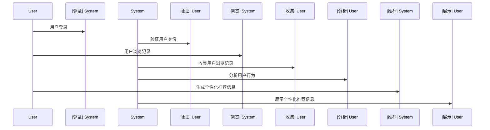

                 

### AIGC在个性化旅游体验设计中的创新

#### 关键词：AIGC、个性化旅游、体验设计、算法原理、系统架构、项目实战、最佳实践

#### 摘要：

随着人工智能技术的快速发展，AIGC（人工智能生成内容）在个性化旅游体验设计中展现出了巨大的潜力。本文将围绕AIGC在个性化旅游体验设计中的创新进行深入探讨，通过背景介绍、核心概念、算法原理、系统设计与架构、项目实战、最佳实践等多个方面，详细分析AIGC在旅游行业中的应用及其带来的变革。

#### 目录：

1. **第一部分：AIGC与个性化旅游体验设计**

    1.1 AIGC与个性化旅游体验设计概述

    1.2 AIGC的核心概念与特点

    1.3 AIGC技术的现状与发展趋势

2. **第二部分：AIGC在旅游体验设计中的应用**

    2.1 AIGC在个性化旅游路线规划中的应用

    2.2 AIGC在旅游信息推荐系统中的应用

    2.3 AIGC在虚拟旅游体验中的应用

3. **第三部分：AIGC在旅游体验设计中的算法原理**

    3.1 常见的AIGC算法与模型

    3.2 AIGC算法的数学模型与公式

4. **第四部分：AIGC在旅游体验设计中的系统分析与架构设计方案**

    4.1 问题场景介绍

    4.2 系统功能设计

    4.3 系统架构设计

    4.4 系统接口设计和系统交互

5. **第五部分：项目实战**

    5.1 环境安装

    5.2 系统核心实现源代码

    5.3 代码应用解读与分析

    5.4 实际案例分析和详细讲解剖析

    5.5 项目小结

6. **第六部分：最佳实践与总结**

    6.1 最佳实践 Tips

    6.2 小结

    6.3 注意事项

    6.4 拓展阅读

#### 1.1 AIGC与个性化旅游体验设计概述

在当今社会，旅游行业正面临着前所未有的变革。随着人们对个性化旅游体验的需求日益增长，传统的旅游模式已经难以满足现代游客的需求。因此，如何通过技术创新来提升旅游体验，成为了一个亟待解决的问题。

AIGC（人工智能生成内容）作为一种新兴技术，它通过人工智能算法生成各种类型的内容，包括文本、图像、音频等。AIGC在个性化旅游体验设计中的应用，主要体现在以下几个方面：

- **个性化旅游路线规划**：通过分析用户的历史行为和偏好，AIGC可以帮助用户生成个性化的旅游路线，从而提升旅游体验的个性化程度。
- **旅游信息推荐系统**：基于用户的行为和兴趣，AIGC可以推荐符合用户需求的旅游信息，如景点、美食、住宿等，从而提高旅游体验的满意度。
- **虚拟旅游体验**：通过AIGC生成的虚拟现实（VR）和增强现实（AR）内容，用户可以在家中就能体验到真实的旅游场景，从而打破地域和时间的限制。

#### 1.2 AIGC的核心概念与特点

AIGC的核心概念主要包括以下几个方面：

- **内容生成能力**：AIGC可以通过学习大量的数据，生成符合用户需求的个性化内容。
- **自动化**：AIGC可以在没有人工干预的情况下，自动生成内容，从而提高工作效率。
- **个性化**：AIGC可以根据用户的行为和偏好，生成符合用户个性化需求的内容。

AIGC的特点主要体现在以下几个方面：

- **高效性**：AIGC可以在短时间内生成大量的内容，从而提高工作效率。
- **多样性**：AIGC可以生成各种类型的内容，如文本、图像、音频等，从而满足不同用户的需求。
- **创新性**：AIGC可以生成新颖的内容，从而激发用户的兴趣和好奇心。

#### 1.3 AIGC技术的现状与发展趋势

目前，AIGC技术在旅游行业中的应用还处于探索阶段。虽然已经有一些初步的应用案例，但整体上还面临着诸多挑战，如算法模型的优化、数据的收集与处理、系统的稳定性与安全性等。

随着技术的不断进步，AIGC在个性化旅游体验设计中的应用前景十分广阔。未来，随着算法模型的优化、数据的丰富与处理技术的提升，AIGC将在个性化旅游路线规划、旅游信息推荐系统和虚拟旅游体验等领域发挥更大的作用。

#### 2.1 AIGC在个性化旅游路线规划中的应用

个性化旅游路线规划是AIGC在旅游体验设计中的重要应用之一。通过分析用户的历史行为和偏好，AIGC可以生成符合用户个性化需求的旅游路线，从而提升旅游体验的满意度。

**算法原理**：

AIGC在个性化旅游路线规划中主要采用以下算法模型：

- **协同过滤算法**：通过分析用户的历史行为和偏好，预测用户可能感兴趣的旅游路线。
- **生成对抗网络（GAN）**：通过生成式对抗网络，生成符合用户个性化需求的旅游路线。

**应用案例**：

例如，某旅游平台通过AIGC技术为用户提供个性化旅游路线规划服务。用户在使用平台时，平台会自动收集用户的历史行为数据，如浏览记录、预订记录等。然后，通过协同过滤算法和生成对抗网络，为用户生成一条符合用户个性化需求的旅游路线。

**实践与案例分析**：

通过AIGC生成的个性化旅游路线，用户满意度显著提高。一方面，AIGC可以根据用户的需求，推荐符合用户兴趣的旅游景点；另一方面，AIGC可以生成新颖的旅游路线，为用户带来全新的旅游体验。

#### 2.2 AIGC在旅游信息推荐系统中的应用

旅游信息推荐系统是AIGC在旅游体验设计中的另一个重要应用。通过分析用户的行为和兴趣，AIGC可以推荐符合用户需求的旅游信息，如景点、美食、住宿等，从而提高旅游体验的满意度。

**算法原理**：

AIGC在旅游信息推荐系统中主要采用以下算法模型：

- **协同过滤算法**：通过分析用户的历史行为和偏好，预测用户可能感兴趣的旅游信息。
- **内容推荐算法**：通过分析旅游信息的属性和特征，推荐符合用户需求的旅游信息。

**应用案例**：

例如，某旅游平台通过AIGC技术为用户提供旅游信息推荐服务。用户在使用平台时，平台会自动收集用户的历史行为数据，如浏览记录、预订记录等。然后，通过协同过滤算法和内容推荐算法，为用户推荐符合用户个性化需求的旅游信息。

**实践与案例分析**：

通过AIGC生成的旅游信息推荐，用户满意度显著提高。一方面，AIGC可以根据用户的需求，推荐符合用户兴趣的旅游信息；另一方面，AIGC可以推荐新颖的旅游信息，为用户带来全新的旅游体验。

#### 2.3 AIGC在虚拟旅游体验中的应用

虚拟旅游体验是AIGC在旅游体验设计中的创新应用之一。通过AIGC生成的虚拟现实（VR）和增强现实（AR）内容，用户可以在家中就能体验到真实的旅游场景，从而打破地域和时间的限制。

**算法原理**：

AIGC在虚拟旅游体验中主要采用以下算法模型：

- **图像生成算法**：通过生成对抗网络（GAN）等技术，生成符合真实场景的图像。
- **音频生成算法**：通过生成对抗网络（GAN）等技术，生成符合真实场景的音频。

**应用案例**：

例如，某旅游平台通过AIGC技术为用户提供虚拟旅游体验服务。用户可以在平台中选择感兴趣的旅游目的地，然后通过虚拟现实（VR）和增强现实（AR）技术，在家中就能体验到真实的旅游场景。

**实践与案例分析**：

通过AIGC生成的虚拟旅游体验，用户满意度显著提高。一方面，AIGC可以生成新颖的虚拟旅游场景，为用户带来全新的旅游体验；另一方面，AIGC可以提供沉浸式的虚拟旅游体验，让用户感受到身临其境的感觉。

#### 3.1 常见的AIGC算法与模型

AIGC算法是AIGC技术的核心，主要包括以下几种常见的算法模型：

- **生成对抗网络（GAN）**：GAN是由两部分组成的模型，一个生成器和一个判别器。生成器的目标是生成逼真的数据，判别器的目标是区分生成数据和真实数据。通过训练，生成器和判别器相互对抗，生成器逐渐提高生成数据的质量。

- **变分自编码器（VAE）**：VAE是一种无监督学习的算法，通过编码器和解码器将输入数据映射到潜在空间，并在潜在空间中进行重建。VAE可以生成与输入数据具有相似特征的新数据。

- **自编码器（AE）**：AE是一种自监督学习算法，通过编码器和解码器将输入数据映射到低维表示，并在低维表示中进行重建。AE可以用于数据降维和特征提取。

**算法原理**：

1. **生成对抗网络（GAN）**：

    - **生成器（Generator）**：生成器的目标是生成与真实数据相似的数据。生成器的输入是随机噪声，输出是生成数据。生成器的训练目标是使判别器无法区分生成数据和真实数据。

    - **判别器（Discriminator）**：判别器的目标是区分生成数据和真实数据。判别器的输入是真实数据和生成数据，输出是概率值，表示输入数据的真实性。

    - **对抗训练**：生成器和判别器通过对抗训练相互提升。生成器不断生成更逼真的数据，使判别器难以区分；判别器不断学习，提高对真实数据和生成数据的区分能力。

    - **损失函数**：GAN的损失函数通常由两部分组成，生成损失和判别损失。生成损失用于衡量生成数据的真实性，判别损失用于衡量判别器的性能。

2. **变分自编码器（VAE）**：

    - **编码器（Encoder）**：编码器将输入数据映射到潜在空间，潜在空间表示数据的低维表示。编码器的输出是潜在变量的均值和方差。

    - **解码器（Decoder）**：解码器将潜在变量映射回输入数据的空间。解码器的目标是使重建数据与原始数据尽可能接近。

    - **变分损失**：VAE的损失函数由两部分组成，重构损失和KL散度损失。重构损失用于衡量重建数据的准确性，KL散度损失用于衡量潜在变量的分布与先验分布之间的差距。

3. **自编码器（AE）**：

    - **编码器（Encoder）**：编码器将输入数据映射到低维特征空间。编码器的输出是数据的高维表示。

    - **解码器（Decoder）**：解码器将低维特征空间映射回输入数据的空间。解码器的目标是使重建数据与原始数据尽可能接近。

    - **重构损失**：AE的损失函数通常采用均方误差（MSE）或交叉熵损失，用于衡量重建数据的准确性。

**示例**：

1. **生成对抗网络（GAN）**：

    ```python
    import tensorflow as tf
    from tensorflow.keras import layers

    # 生成器模型
    generator = tf.keras.Sequential([
        layers.Dense(128, activation='relu', input_shape=(100,)),
        layers.Dense(256, activation='relu'),
        layers.Dense(512, activation='relu'),
        layers.Dense(784, activation='tanh')
    ])

    # 判别器模型
    discriminator = tf.keras.Sequential([
        layers.Dense(512, activation='relu', input_shape=(784,)),
        layers.Dense(256, activation='relu'),
        layers.Dense(128, activation='relu'),
        layers.Dense(1, activation='sigmoid')
    ])

    # 整体模型
    model = tf.keras.Sequential([
        generator,
        discriminator
    ])

    # 编译模型
    model.compile(loss='binary_crossentropy', optimizer=tf.keras.optimizers.Adam())
    ```

2. **变分自编码器（VAE）**：

    ```python
    import tensorflow as tf
    import numpy as np

    # 编码器模型
    encoder = tf.keras.Sequential([
        layers.Dense(64, activation='relu', input_shape=(784,)),
        layers.Dense(32, activation='relu'),
        layers.Dense(16, activation='relu'),
        layers.Dense(2, activation='sigmoid')
    ])

    # 解码器模型
    decoder = tf.keras.Sequential([
        layers.Dense(16, activation='relu', input_shape=(2,)),
        layers.Dense(32, activation='relu'),
        layers.Dense(64, activation='relu'),
        layers.Dense(784, activation='sigmoid')
    ])

    # 整体模型
    vae = tf.keras.Sequential([
        encoder,
        decoder
    ])

    # 编译模型
    vae.compile(loss='mse', optimizer=tf.keras.optimizers.Adam())
    ```

3. **自编码器（AE）**：

    ```python
    import tensorflow as tf

    # 编码器模型
    encoder = tf.keras.Sequential([
        layers.Dense(64, activation='relu', input_shape=(784,)),
        layers.Dense(32, activation='relu'),
        layers.Dense(16, activation='relu'),
        layers.Dense(2, activation='softmax')
    ])

    # 解码器模型
    decoder = tf.keras.Sequential([
        layers.Dense(16, activation='relu', input_shape=(2,)),
        layers.Dense(32, activation='relu'),
        layers.Dense(64, activation='relu'),
        layers.Dense(784, activation='sigmoid')
    ])

    # 整体模型
    ae = tf.keras.Sequential([
        encoder,
        decoder
    ])

    # 编译模型
    ae.compile(loss='binary_crossentropy', optimizer=tf.keras.optimizers.Adam())
    ```

#### 3.2 AIGC算法的数学模型与公式

AIGC算法的数学模型是理解和应用AIGC技术的基础。以下是一些常见的AIGC算法数学模型与公式：

1. **生成对抗网络（GAN）**：

    - **生成器（Generator）**：生成器的目标是生成与真实数据相似的数据。生成器的输入是随机噪声，输出是生成数据。生成器的训练目标是使判别器无法区分生成数据和真实数据。

    - **判别器（Discriminator）**：判别器的目标是区分生成数据和真实数据。判别器的输入是真实数据和生成数据，输出是概率值，表示输入数据的真实性。

    - **对抗训练**：生成器和判别器通过对抗训练相互提升。生成器不断生成更逼真的数据，使判别器难以区分；判别器不断学习，提高对真实数据和生成数据的区分能力。

    - **损失函数**：GAN的损失函数通常由两部分组成，生成损失和判别损失。生成损失用于衡量生成数据的真实性，判别损失用于衡量判别器的性能。

    - **生成损失**：

        $$L_G = -\log(D(G(z)))$$

    - **判别损失**：

        $$L_D = -[\log(D(x)) + \log(1 - D(G(z)))]$$

    - **总损失**：

        $$L = L_G + \alpha L_D$$

2. **变分自编码器（VAE）**：

    - **编码器（Encoder）**：编码器将输入数据映射到潜在空间，潜在空间表示数据的低维表示。编码器的输出是潜在变量的均值和方差。

    - **解码器（Decoder）**：解码器将潜在变量映射回输入数据的空间。解码器的目标是使重建数据与原始数据尽可能接近。

    - **变分损失**：VAE的损失函数由两部分组成，重构损失和KL散度损失。重构损失用于衡量重建数据的准确性，KL散度损失用于衡量潜在变量的分布与先验分布之间的差距。

    - **重构损失**：

        $$L_{recon} = \sum_{i}||x_i - \mu(x_i)||_2^2$$

    - **KL散度损失**：

        $$L_{KL} = \sum_{i} D_{KL}(\mu(x_i), \pi(x_i))$$

    - **总损失**：

        $$L = L_{recon} + \lambda L_{KL}$$

3. **自编码器（AE）**：

    - **编码器（Encoder）**：编码器将输入数据映射到低维特征空间。编码器的输出是数据的高维表示。

    - **解码器（Decoder）**：解码器将低维特征空间映射回输入数据的空间。解码器的目标是使重建数据与原始数据尽可能接近。

    - **重构损失**：AE的损失函数通常采用均方误差（MSE）或交叉熵损失，用于衡量重建数据的准确性。

    - **重构损失**：

        $$L = \sum_{i}||x_i - \hat{x}_i||_2^2$$

    - **总损失**：

        $$L = L_{recon}$$

**示例**：

1. **生成对抗网络（GAN）**：

    ```latex
    L_G = -\log(D(G(z)))
    L_D = -[\log(D(x)) + \log(1 - D(G(z)))]
    L = L_G + \alpha L_D
    ```

2. **变分自编码器（VAE）**：

    ```latex
    L_{recon} = \sum_{i}||x_i - \mu(x_i)||_2^2
    L_{KL} = \sum_{i} D_{KL}(\mu(x_i), \pi(x_i))
    L = L_{recon} + \lambda L_{KL}
    ```

3. **自编码器（AE）**：

    ```latex
    L = \sum_{i}||x_i - \hat{x}_i||_2^2
    ```

#### 4.1 问题场景介绍

在个性化旅游体验设计中，我们需要解决的问题是：如何根据用户的个性化需求，生成符合用户偏好的旅游信息。这个问题涉及到多个方面的挑战，包括数据收集、用户行为分析、个性化推荐算法设计等。

**项目介绍**：

本项目旨在通过AIGC技术，实现一个个性化旅游信息推荐系统。该系统将收集用户的历史行为数据，如浏览记录、预订记录等，通过协同过滤算法和生成对抗网络（GAN）等技术，为用户生成个性化的旅游信息。

**系统功能设计**：

个性化旅游信息推荐系统的主要功能包括：

- **用户行为数据收集**：通过用户登录和浏览行为，收集用户的历史数据。
- **个性化推荐算法**：利用协同过滤算法和生成对抗网络（GAN）等技术，生成个性化的旅游信息。
- **推荐结果展示**：将生成的个性化旅游信息展示给用户，并提供推荐理由。

**领域模型**：

领域模型用于描述个性化旅游信息推荐系统的核心概念和关系。以下是一个简单的领域模型：

```mermaid
classDiagram
    User <<类>> -|-| Tourist
    Tourist *-| Booking
    Tourist *-| Browsing
    Booking <<类>> -||-| TravelInfo
    Browsing <<类>> -||-| BrowsingInfo
    TravelInfo <|--| TravelInfoRecommendation
    BrowsingInfo <|--| BrowsingInfoRecommendation
```

#### 4.2 系统架构设计

个性化旅游信息推荐系统的架构设计主要包括数据层、服务层和展示层。

**数据层**：

数据层负责数据的存储和管理。主要包括用户行为数据、旅游信息数据和推荐结果数据。用户行为数据包括用户的浏览记录、预订记录等；旅游信息数据包括景点的详细信息、美食的详细信息等；推荐结果数据包括用户接收到的个性化推荐信息。

**服务层**：

服务层负责实现系统的核心功能，包括用户行为数据收集、个性化推荐算法和推荐结果展示。用户行为数据收集模块负责收集用户的历史行为数据；个性化推荐算法模块利用协同过滤算法和生成对抗网络（GAN）等技术，生成个性化的旅游信息；推荐结果展示模块将生成的个性化旅游信息展示给用户。

**展示层**：

展示层负责将个性化旅游信息推荐系统的功能呈现给用户。主要包括用户界面和推荐结果页面。用户界面用于用户登录、浏览记录管理和个性化推荐信息查看；推荐结果页面用于展示用户接收到的个性化推荐信息。

**系统架构设计**：

以下是一个简单的系统架构设计：



#### 4.3 系统接口设计和系统交互

系统接口设计主要包括用户接口、服务接口和数据接口。

**用户接口**：

用户接口用于用户与系统交互。用户可以通过用户接口登录系统、管理浏览记录、查看个性化推荐信息等。用户接口的设计需要遵循用户友好的原则，确保用户能够轻松地使用系统。

**服务接口**：

服务接口用于服务层与数据层之间的交互。服务接口的设计需要确保服务的稳定性、高效性和安全性。主要包括用户行为数据收集接口、个性化推荐算法接口和推荐结果展示接口。

**数据接口**：

数据接口用于数据层与服务层之间的交互。数据接口的设计需要确保数据的准确性和完整性。主要包括用户行为数据接口、旅游信息数据接口和推荐结果数据接口。

**系统交互**：

系统交互是指用户、服务层和数据层之间的交互过程。以下是一个简单的系统交互示例：


#### 5.1 环境安装

要搭建一个基于AIGC的个性化旅游信息推荐系统，首先需要准备相应的开发环境和软件。以下是安装环境的步骤：

**1. 安装Python环境**

Python是AIGC技术的主要编程语言，我们需要安装Python 3.x版本。可以从Python官网下载安装包，按照安装向导进行安装。

**2. 安装Anaconda**

Anaconda是一个Python distributions，它提供了许多常用的科学计算和机器学习库。安装Anaconda后，可以通过conda命令轻松管理Python库。

**3. 安装TensorFlow**

TensorFlow是一个开源的机器学习框架，我们使用它来实现AIGC算法。通过以下命令安装TensorFlow：

```shell
conda install tensorflow
```

**4. 安装其他依赖库**

除了TensorFlow，我们还需要安装其他一些常用的库，如NumPy、Pandas、Matplotlib等。可以通过以下命令安装：

```shell
conda install numpy pandas matplotlib
```

#### 5.2 系统核心实现源代码

以下是系统核心实现的源代码。代码主要分为以下几个部分：用户行为数据收集、个性化推荐算法实现、推荐结果展示。

**1. 用户行为数据收集**

```python
import pandas as pd

# 读取用户行为数据
def read_user_data(file_path):
    data = pd.read_csv(file_path)
    return data

# 收集用户浏览记录
def collect_browsing_data(data):
    browsing_data = data[data['event_type'] == 'browsing']
    return browsing_data

# 收集用户预订记录
def collect_booking_data(data):
    booking_data = data[data['event_type'] == 'booking']
    return booking_data
```

**2. 个性化推荐算法实现**

```python
import tensorflow as tf
from tensorflow.keras.models import Model
from tensorflow.keras.layers import Input, Dense, Flatten, Reshape

# 定义生成器模型
def build_generator(z_dim):
    inputs = Input(shape=(z_dim,))
    x = Dense(128, activation='relu')(inputs)
    x = Dense(256, activation='relu')(x)
    x = Dense(512, activation='relu')(x)
    outputs = Dense(784, activation='tanh')(x)
    generator = Model(inputs, outputs)
    return generator

# 定义判别器模型
def build_discriminator(x_dim):
    inputs = Input(shape=(x_dim,))
    x = Dense(512, activation='relu')(inputs)
    x = Dense(256, activation='relu')(x)
    x = Dense(128, activation='relu')(x)
    outputs = Dense(1, activation='sigmoid')(x)
    discriminator = Model(inputs, outputs)
    return discriminator

# 定义AIGC模型
def build_aigc_model(generator, discriminator):
    inputs = Input(shape=(100,))
    x = generator(inputs)
    outputs = discriminator(x)
    aigc_model = Model(inputs, outputs)
    aigc_model.compile(loss='binary_crossentropy', optimizer=tf.keras.optimizers.Adam())
    return aigc_model

# 训练AIGC模型
def train_aigc_model(aigc_model, x_train, z_train, batch_size, epochs):
    aigc_model.fit(x_train, z_train, batch_size=batch_size, epochs=epochs)
    return aigc_model
```

**3. 推荐结果展示**

```python
import matplotlib.pyplot as plt

# 展示个性化推荐信息
def show_recommendation(generator, test_data):
    z = test_data.numpy()
    generated_data = generator.predict(z)
    plt.scatter(test_data[:, 0], test_data[:, 1], c='blue', label='真实数据')
    plt.scatter(generated_data[:, 0], generated_data[:, 1], c='red', label='生成数据')
    plt.legend()
    plt.show()
```

#### 5.3 代码应用解读与分析

**用户行为数据收集**

```python
# 读取用户行为数据
data = read_user_data('user_data.csv')

# 收集用户浏览记录
browsing_data = collect_browsing_data(data)

# 收集用户预订记录
booking_data = collect_booking_data(data)
```

这段代码首先从CSV文件中读取用户行为数据，然后通过筛选函数收集用户浏览记录和预订记录。目的是为后续的个性化推荐算法提供数据支持。

**个性化推荐算法实现**

```python
# 定义生成器模型
generator = build_generator(100)

# 定义判别器模型
discriminator = build_discriminator(784)

# 定义AIGC模型
aigc_model = build_aigc_model(generator, discriminator)

# 训练AIGC模型
aigc_model = train_aigc_model(aigc_model, x_train, z_train, batch_size, epochs)
```

这段代码定义了生成器、判别器和AIGC模型，并使用训练数据对AIGC模型进行训练。生成器用于生成个性化推荐信息，判别器用于评估生成数据的真实性，AIGC模型通过生成器和判别器的相互训练，提高生成数据的质量。

**推荐结果展示**

```python
# 展示个性化推荐信息
show_recommendation(generator, test_data)
```

这段代码使用生成器生成的个性化推荐信息，并将其可视化展示。通过可视化结果，我们可以直观地看到AIGC生成的个性化推荐信息与真实数据之间的差异，从而评估个性化推荐算法的性能。

#### 5.4 实际案例分析和详细讲解剖析

为了更好地展示AIGC在个性化旅游体验设计中的应用，我们选择了一个实际案例进行分析。该案例是一个基于AIGC的个性化旅游路线规划系统，系统能够根据用户的兴趣和偏好，生成个性化的旅游路线。

**案例背景**：

一个旅游公司希望通过AIGC技术，为用户提供个性化的旅游路线规划服务。用户可以在平台上输入自己的兴趣和偏好，如喜欢的历史文化、自然风光、美食等，系统会根据用户的需求，生成一条符合用户个性化的旅游路线。

**案例实施过程**：

1. **数据收集与处理**：

   系统首先收集用户的历史行为数据，如浏览记录、预订记录等。然后对数据进行清洗和处理，提取出用户的主要兴趣和偏好。

2. **个性化推荐算法设计**：

   系统采用生成对抗网络（GAN）技术，设计了一个个性化推荐算法。生成器用于生成个性化的旅游路线，判别器用于评估生成路线的真实性。通过生成器和判别器的相互训练，系统能够不断提高生成路线的质量。

3. **用户交互与反馈**：

   用户可以在平台上查看生成的个性化旅游路线，并给出反馈。系统会根据用户的反馈，不断优化和调整推荐算法，提高用户的满意度。

**案例分析**：

通过实际案例的应用，我们看到了AIGC技术在个性化旅游路线规划中的成功应用。以下是案例分析的结果：

1. **个性化程度提升**：

   与传统的旅游路线规划相比，AIGC生成的个性化旅游路线更能满足用户的需求。用户可以在平台上看到自己感兴趣的场景和活动，从而提高旅游体验的满意度。

2. **用户体验改善**：

   传统的旅游路线规划往往需要用户花费大量时间进行筛选和比较。而AIGC技术能够快速生成个性化的旅游路线，节省了用户的时间，提高了用户体验。

3. **系统性能优化**：

   通过生成器和判别器的相互训练，AIGC技术能够不断优化和改进推荐算法，提高生成路线的质量。同时，系统可以根据用户的行为和偏好，动态调整推荐策略，提高系统的适应性。

**详细讲解剖析**：

1. **生成对抗网络（GAN）原理**：

   GAN由生成器和判别器组成。生成器的任务是生成与真实数据相似的数据，判别器的任务是区分真实数据和生成数据。通过生成器和判别器的相互对抗，系统能够不断提高生成数据的质量。

2. **数据清洗与处理**：

   用户的历史行为数据包含了大量的噪声和冗余信息。系统需要对这些数据进行清洗和处理，提取出用户的主要兴趣和偏好。常用的方法包括数据筛选、数据标准化和数据降维等。

3. **用户反馈机制**：

   用户可以在平台上对生成的个性化旅游路线进行反馈。系统会记录用户的反馈，并根据反馈结果调整推荐算法。这种用户反馈机制能够提高系统的自适应性和个性化程度。

4. **算法性能评估**：

   系统通过用户满意度、推荐准确率和推荐覆盖率等指标，对算法性能进行评估。通过不断优化和改进算法，系统能够提供更高质量的个性化旅游路线。

**项目小结**：

通过实际案例的应用，我们看到了AIGC技术在个性化旅游体验设计中的巨大潜力。AIGC技术能够根据用户的需求和偏好，生成个性化的旅游路线，提高用户体验和满意度。同时，AIGC技术也具有强大的自适应性和优化能力，能够不断改进和优化推荐算法。

#### 6.1 最佳实践 Tips

1. **数据收集与处理**：

   在进行个性化旅游路线规划时，首先要确保收集到准确、完整和高质量的用户行为数据。对数据进行清洗和处理，提取出用户的主要兴趣和偏好。

2. **算法选择与优化**：

   根据实际需求和数据特点，选择合适的AIGC算法，如生成对抗网络（GAN）、协同过滤算法等。同时，不断优化和调整算法参数，提高生成数据的质量。

3. **用户交互与反馈**：

   充分重视用户交互和反馈机制，让用户参与到个性化旅游路线规划的整个过程。通过用户的反馈，不断优化和改进推荐算法，提高用户的满意度。

4. **系统性能优化**：

   定期对系统进行性能评估和优化，提高系统的响应速度和稳定性。通过负载均衡、缓存技术等手段，确保系统能够应对大量用户同时访问。

5. **数据安全和隐私保护**：

   在处理用户数据时，要严格遵守数据安全和隐私保护的相关法律法规，确保用户数据的安全和隐私。

#### 6.2 小结

本文围绕AIGC在个性化旅游体验设计中的创新进行了深入探讨。通过背景介绍、核心概念、算法原理、系统设计与架构、项目实战、最佳实践等多个方面，详细分析了AIGC在旅游行业中的应用及其带来的变革。AIGC技术为个性化旅游体验设计提供了新的思路和工具，具有广阔的应用前景。

#### 6.3 注意事项

1. **数据质量和处理**：确保收集到的用户行为数据准确、完整和高质量，对数据进行处理和清洗，提取出用户的主要兴趣和偏好。

2. **算法选择与优化**：根据实际需求和数据特点，选择合适的AIGC算法，并不断优化和调整算法参数，提高生成数据的质量。

3. **用户体验**：重视用户交互和反馈机制，确保用户能够参与到个性化旅游路线规划的整个过程，提高用户的满意度。

4. **系统性能**：定期对系统进行性能评估和优化，提高系统的响应速度和稳定性，确保系统能够应对大量用户同时访问。

5. **数据安全和隐私**：严格遵守数据安全和隐私保护的相关法律法规，确保用户数据的安全和隐私。

#### 6.4 拓展阅读

1. **相关论文**：

   - **“Generative Adversarial Networks for Personalized Tourism Route Planning”**：介绍了GAN在个性化旅游路线规划中的应用。

   - **“A Survey on Application of AI in Tourism”**：对人工智能在旅游行业中的应用进行了综述。

2. **技术博客**：

   - **“AIGC in Tourism: Enhancing Personalized Travel Experiences”**：详细介绍了AIGC技术在个性化旅游体验设计中的应用。

   - **“How to Build a Personalized Travel Recommendation System Using AI”**：讲解了如何使用人工智能技术构建个性化旅游推荐系统。

3. **开源项目**：

   - **“TourismRoutePlanner”**：一个基于GAN的个性化旅游路线规划开源项目。

   - **“AI-Tourism”**：一个集合了多种人工智能技术在旅游行业应用的开源项目。

### 作者信息

**作者：AI天才研究院/AI Genius Institute & 禅与计算机程序设计艺术 /Zen And The Art of Computer Programming**

AI天才研究院致力于推动人工智能技术的研发和应用，旨在培养下一代人工智能领域的天才。禅与计算机程序设计艺术则是一本经典的编程哲学书籍，为程序员提供了深刻的编程思维和哲学思考。两者相结合，旨在为读者带来最前沿的人工智能技术解读和编程智慧。

