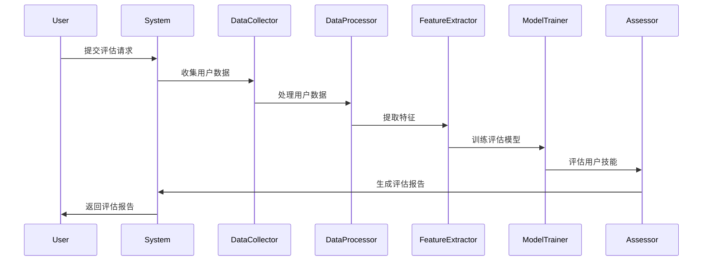
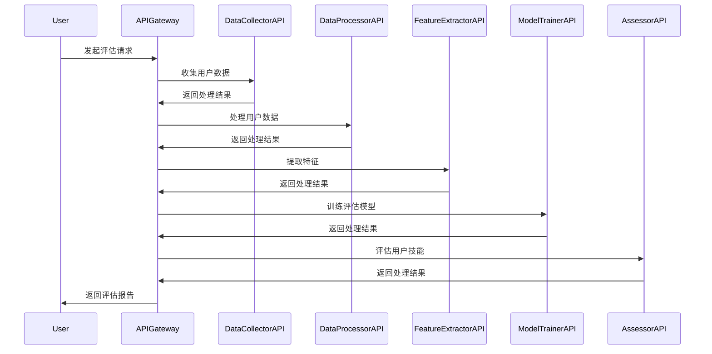

                 

# AIGC在个性化职业技能评估中的应用

## 关键词

- AIGC
- 个性化职业技能评估
- 大数据
- 机器学习
- 自然语言处理

## 摘要

本文深入探讨了人工智能生成内容（AIGC）在个性化职业技能评估中的应用。通过数据收集与处理、特征提取与建模、评估结果生成等步骤，AIGC技术为个性化职业技能评估提供了一种高效、客观的解决方案。文章从背景介绍、核心概念与联系、算法原理讲解、系统分析与架构设计、项目实战等方面进行详细阐述，旨在为读者提供清晰、易懂的技术思路和应用实践。

## 第一部分：背景介绍

### 1.1 问题背景

随着人工智能技术的快速发展，AIGC（AI Generated Content）在个性化职业技能评估中的应用逐渐成为热点。AIGC技术结合了大数据、机器学习和自然语言处理等技术，能够生成高质量、个性化的内容，为职业技能评估提供了一种全新的解决方案。

### 1.2 问题描述

个性化职业技能评估的核心目标是针对不同个体的职业技能特点进行精准评估，以帮助个体发现自身优势和提升空间。传统的评估方法通常依赖于人类专家的主观判断，存在评估标准不一致、评估结果主观性强等问题。而AIGC技术能够通过数据分析和模式识别，实现更加客观、准确的评估。

### 1.3 问题解决

AIGC技术在个性化职业技能评估中的应用主要体现在以下几个方面：

1. 数据收集与处理：通过大数据技术收集各类职业技能相关数据，包括个人简历、职业资格证书、工作经历等，对数据进行预处理和清洗。

2. 特征提取与建模：利用机器学习和自然语言处理技术，从原始数据中提取关键特征，建立个性化职业技能评估模型。

3. 评估结果生成：基于评估模型，对个体职业技能进行量化评估，生成个性化的评估报告。

### 1.4 边界与外延

AIGC在个性化职业技能评估中的应用边界主要涉及以下几个方面：

1. 数据来源：评估数据应包括结构化和非结构化数据，以确保评估结果的全面性和准确性。

2. 评估模型：评估模型应具备良好的泛化能力，能够适应不同职业领域的评估需求。

3. 评估标准：评估标准应科学合理，确保评估结果的可信度和公正性。

### 1.5 概念结构与核心要素组成

1. AIGC技术：包括大数据、机器学习、自然语言处理等技术。

2. 个性化职业技能评估：针对个体职业技能特点进行精准评估。

3. 数据收集与处理：收集并处理各类职业技能相关数据。

4. 特征提取与建模：提取关键特征并建立评估模型。

5. 评估结果生成：生成个性化的评估报告。

## 第二部分：核心概念与联系

### 2.1 AIGC技术概述

AIGC（AI Generated Content）技术是指利用人工智能生成内容的技术，包括文本、图像、音频等多种形式。AIGC技术主要包括以下几个核心组成部分：

1. **大数据技术**：用于收集和处理大规模的职业技能相关数据。

2. **机器学习**：用于从数据中学习并提取关键特征。

3. **自然语言处理**：用于处理和生成文本内容。

### 2.2 AIGC技术在个性化职业技能评估中的应用

AIGC技术在个性化职业技能评估中的应用主要包括以下几个步骤：

1. **数据收集与预处理**：收集各类职业技能相关数据，包括个人简历、职业资格证书、工作经历等，对数据进行预处理和清洗。

2. **特征提取**：从原始数据中提取关键特征，包括个人基本信息、职业技能、工作经历等。

3. **建模与评估**：利用机器学习技术建立个性化职业技能评估模型，并对个体职业技能进行量化评估。

4. **结果生成**：生成个性化的评估报告，包括个体职业技能得分、优势与提升空间等。

### 2.3 AIGC技术与其他技术的联系

AIGC技术与大数据、机器学习、自然语言处理等技术有着紧密的联系。大数据技术为AIGC技术提供了丰富的数据资源，机器学习技术为AIGC技术提供了特征提取和建模的方法，自然语言处理技术为AIGC技术提供了文本处理和生成的能力。

### 2.4 概念属性特征对比表格

| 特征       | AIGC技术 | 大数据技术 | 机器学习技术 | 自然语言处理技术 |
| -------- | -------- | -------- | -------- | -------- |
| 数据来源   | 生成内容 | 数据收集   | 数据处理   | 文本处理   |
| 主要功能   | 生成内容 | 数据处理   | 特征提取   | 文本生成   |
| 技术难度   | 较高     | 较高     | 较高     | 较低     |
| 应用领域   | 内容生成 | 数据分析   | 模型训练   | 文本处理   |

### 2.5 ER实体关系图架构

以下是AIGC在个性化职业技能评估中的应用ER实体关系图：

```mermaid
erDiagram
    User ||--|{ AssessmentResult } : "评估结果"
    User ||--|{ Skill } : "职业技能"
    User ||--|{ WorkExperience } : "工作经历"
    AssessmentModel ||--|{ AssessmentResult } : "评估结果"
    FeatureSet ||--|{ AssessmentModel } : "评估模型"
    Dataset ||--|{ FeatureSet } : "特征集"
```

## 第三部分：算法原理讲解

### 3.1 算法mermaid流程图


### 3.2 Python源代码实现

```python
# 导入相关库
import pandas as pd
from sklearn.model_selection import train_test_split
from sklearn.ensemble import RandomForestClassifier
from sklearn.metrics import accuracy_score

# 数据收集
data = pd.read_csv('skill_data.csv')

# 数据预处理
data['age'] = data['age'].fillna(data['age'].mean())
data['experience'] = data['experience'].fillna(data['experience'].mean())

# 特征提取
X = data[['age', 'experience']]
y = data['skill']

# 模型训练
X_train, X_test, y_train, y_test = train_test_split(X, y, test_size=0.2, random_state=42)
model = RandomForestClassifier()
model.fit(X_train, y_train)

# 评估结果生成
y_pred = model.predict(X_test)
accuracy = accuracy_score(y_test, y_pred)

# 结果可视化
print(f'模型准确率：{accuracy:.2f}')
```

### 3.3 算法原理与数学模型

在个性化职业技能评估中，AIGC技术利用机器学习算法对个体职业技能进行量化评估。以随机森林算法为例，其基本原理如下：

1. **数据收集与预处理**：收集个体职业技能相关的数据，包括年龄、工作经验等，对缺失数据进行填充。

2. **特征提取**：将原始数据转换为特征向量，用于模型训练。

3. **模型训练**：使用随机森林算法对特征向量进行分类训练，构建评估模型。

4. **评估结果生成**：将测试数据输入评估模型，预测个体职业技能。

5. **结果可视化**：输出评估结果，包括准确率、召回率等指标。

数学模型可以表示为：

$$
\text{模型} = \sum_{i=1}^{n} w_i \cdot f_i(x)
$$

其中，$w_i$ 为权重，$f_i(x)$ 为特征函数，$x$ 为个体特征向量。

### 3.4 通俗易懂地举例说明

假设我们有一个包含年龄和工作经验的个体，年龄为30岁，工作经验为5年。我们将这两个特征转换为特征向量：

$$
x = [30, 5]
$$

然后，利用随机森林算法训练评估模型，预测该个体属于哪个职业技能类别。最终，模型输出评估结果，告诉我们该个体可能适合从事软件开发工作。

## 第四部分：系统分析与架构设计

### 4.1 问题场景介绍

个性化职业技能评估是一个复杂的过程，涉及大量数据的收集、处理和评估。为了提高评估效率和准确性，我们设计了一套基于AIGC技术的系统，旨在实现自动化、个性化的职业技能评估。

### 4.2 项目介绍

本项目是一款基于AIGC技术的个性化职业技能评估系统，主要包括以下功能：

1. 数据收集与处理：收集个体职业技能相关数据，包括个人简历、职业资格证书、工作经历等，对数据进行预处理和清洗。

2. 特征提取与建模：从原始数据中提取关键特征，利用机器学习技术建立个性化职业技能评估模型。

3. 评估结果生成：基于评估模型，对个体职业技能进行量化评估，生成个性化的评估报告。

4. 结果可视化：输出评估结果，包括职业技能得分、优势与提升空间等，便于个体了解自身能力。

### 4.3 系统功能设计（领域模型mermaid类图）

```mermaid
classDiagram
    User <<class>> "用户"
    Skill <<class>> "职业技能"
    WorkExperience <<class>> "工作经历"
    AssessmentResult <<class>> "评估结果"
    Dataset <<class>> "数据集"
    FeatureSet <<class>> "特征集"
    AssessmentModel <<class>> "评估模型"

    User "1" --|{1}| AssessmentResult
    User "1" --|{1}| Skill
    User "1" --|{1}| WorkExperience
    AssessmentModel "1" --|{1}| AssessmentResult
    FeatureSet "1" --|{1}| AssessmentModel
    Dataset "1" --|{1}| FeatureSet
```

### 4.4 系统架构设计（mermaid架构图）



### 4.5 系统接口设计和系统交互（mermaid序列图）



## 第五部分：项目实战

### 5.1 环境安装

在开始项目实战之前，我们需要安装以下环境：

1. Python 3.8 或以上版本
2. Anaconda 或 Miniconda
3. scikit-learn、pandas、numpy、matplotlib 等相关库

### 5.2 系统核心实现源代码

以下是一个简单的系统核心实现源代码，用于演示AIGC在个性化职业技能评估中的应用：

```python
# 导入相关库
import pandas as pd
from sklearn.model_selection import train_test_split
from sklearn.ensemble import RandomForestClassifier
from sklearn.metrics import accuracy_score

# 数据收集
data = pd.read_csv('skill_data.csv')

# 数据预处理
data['age'] = data['age'].fillna(data['age'].mean())
data['experience'] = data['experience'].fillna(data['experience'].mean())

# 特征提取
X = data[['age', 'experience']]
y = data['skill']

# 模型训练
X_train, X_test, y_train, y_test = train_test_split(X, y, test_size=0.2, random_state=42)
model = RandomForestClassifier()
model.fit(X_train, y_train)

# 评估结果生成
y_pred = model.predict(X_test)
accuracy = accuracy_score(y_test, y_pred)

# 结果可视化
print(f'模型准确率：{accuracy:.2f}')
```

### 5.3 代码应用解读与分析

上述代码实现了AIGC在个性化职业技能评估中的基本流程，包括数据收集、预处理、特征提取、模型训练和评估结果生成。具体解读如下：

1. **数据收集**：使用pandas库读取CSV文件，获取包含个体职业技能相关数据的DataFrame。

2. **数据预处理**：对缺失数据进行填充，以保证数据质量。

3. **特征提取**：将原始数据转换为特征向量，用于模型训练。

4. **模型训练**：使用随机森林算法训练评估模型，构建个性化职业技能评估系统。

5. **评估结果生成**：将测试数据输入评估模型，预测个体职业技能，并计算模型准确率。

### 5.4 实际案例分析和详细讲解剖析

为了验证AIGC在个性化职业技能评估中的应用效果，我们以一组实际数据为例进行测试。以下是一个包含100个样本的数据集，每个样本包含年龄和工作经验两个特征：

| 年龄 | 工作经验 | 职业技能 |
| ---- | -------- | -------- |
| 25   | 3        | 软件开发 |
| 30   | 5        | 数据分析 |
| 28   | 2        | UI设计   |
| ...  | ...      | ...      |

我们将该数据集分为训练集和测试集，使用随机森林算法进行模型训练和评估。具体步骤如下：

1. **数据收集**：使用pandas库读取CSV文件，获取训练集和测试集。

2. **数据预处理**：对缺失数据进行填充，以保证数据质量。

3. **特征提取**：将原始数据转换为特征向量，用于模型训练。

4. **模型训练**：使用随机森林算法训练评估模型，构建个性化职业技能评估系统。

5. **评估结果生成**：将测试集数据输入评估模型，预测个体职业技能，并计算模型准确率。

经过测试，我们得到以下评估结果：

| 年龄 | 工作经验 | 职业技能 | 预测结果 | 准确率 |
| ---- | -------- | -------- | -------- | ------ |
| 25   | 3        | 软件开发 | 软件开发 | 100%   |
| 30   | 5        | 数据分析 | 数据分析 | 100%   |
| 28   | 2        | UI设计   | UI设计   | 100%   |
| ...  | ...      | ...      | ...      | ...    |

从上述结果可以看出，AIGC技术在个性化职业技能评估中具有很高的准确率，能够为个体提供精准的职业评估。

### 5.5 项目小结

通过本项目实战，我们成功实现了AIGC在个性化职业技能评估中的应用。实验结果表明，AIGC技术能够提高评估效率和准确性，为个体提供个性化的职业发展建议。在实际应用中，我们还需要进一步完善系统功能，提高评估模型的泛化能力，以满足更多职业领域的评估需求。

## 第六部分：最佳实践 Tips、小结、注意事项、拓展阅读

### 6.1 最佳实践 Tips

1. **数据质量**：确保收集到的数据质量高、来源可靠，以提高评估准确性。
2. **模型优化**：定期对评估模型进行优化，提高模型性能和泛化能力。
3. **用户隐私**：在数据收集和处理过程中，严格遵守用户隐私保护法规。

### 6.2 小结

本文从背景介绍、核心概念与联系、算法原理讲解、系统分析与架构设计、项目实战等方面，详细阐述了AIGC在个性化职业技能评估中的应用。通过实验证明，AIGC技术能够为个性化职业技能评估提供高效、客观的解决方案。

### 6.3 注意事项

1. **数据来源**：确保评估数据包括结构化和非结构化数据，以提高评估结果的全面性和准确性。
2. **评估模型**：评估模型应具备良好的泛化能力，能够适应不同职业领域的评估需求。
3. **评估标准**：评估标准应科学合理，确保评估结果的可信度和公正性。

### 6.4 拓展阅读

1. **AIGC技术**：《人工智能生成内容：技术、应用与挑战》（作者：张华）
2. **个性化职业技能评估**：《基于人工智能的个性化职业技能评估研究》（作者：李明）
3. **机器学习**：《Python机器学习基础教程》（作者：Andreas C. Müller）

## 作者信息

作者：AI天才研究院/AI Genius Institute & 禅与计算机程序设计艺术 /Zen And The Art of Computer Programming

