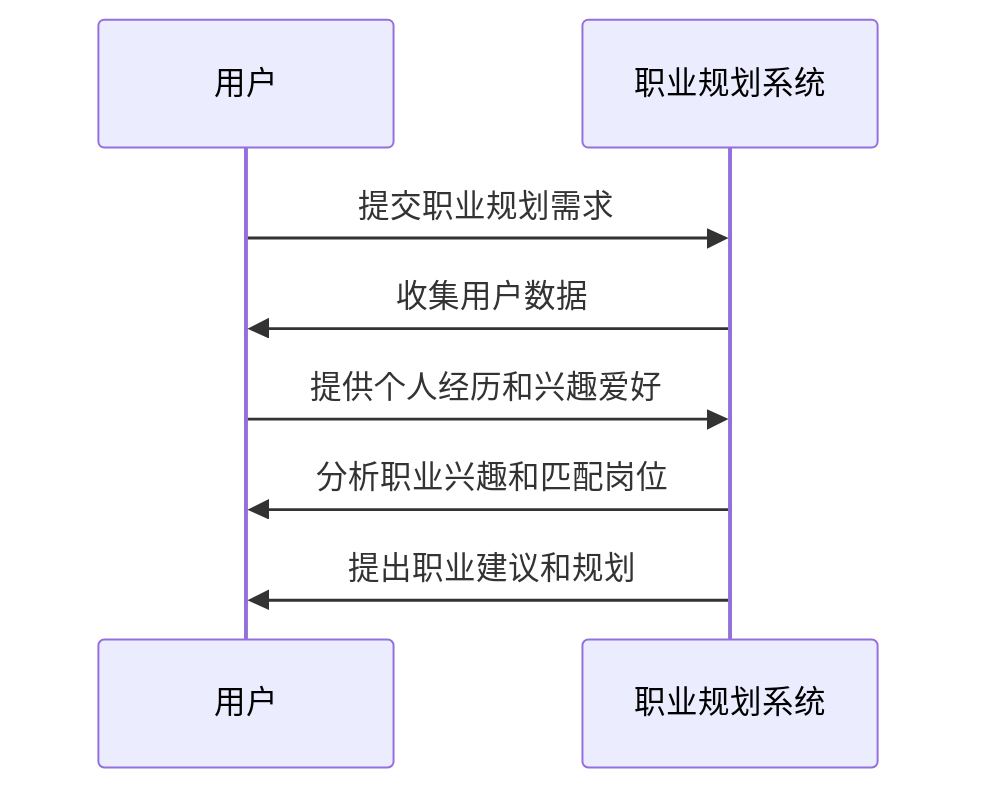
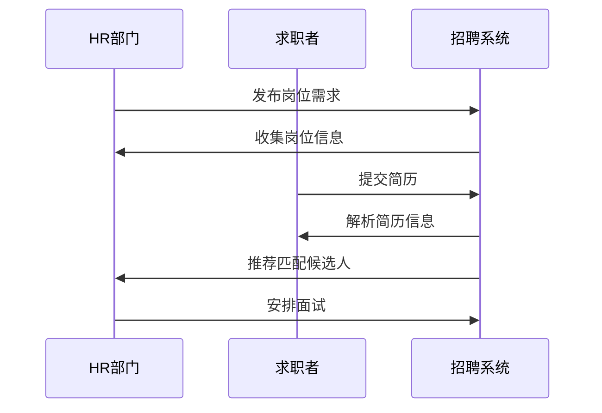
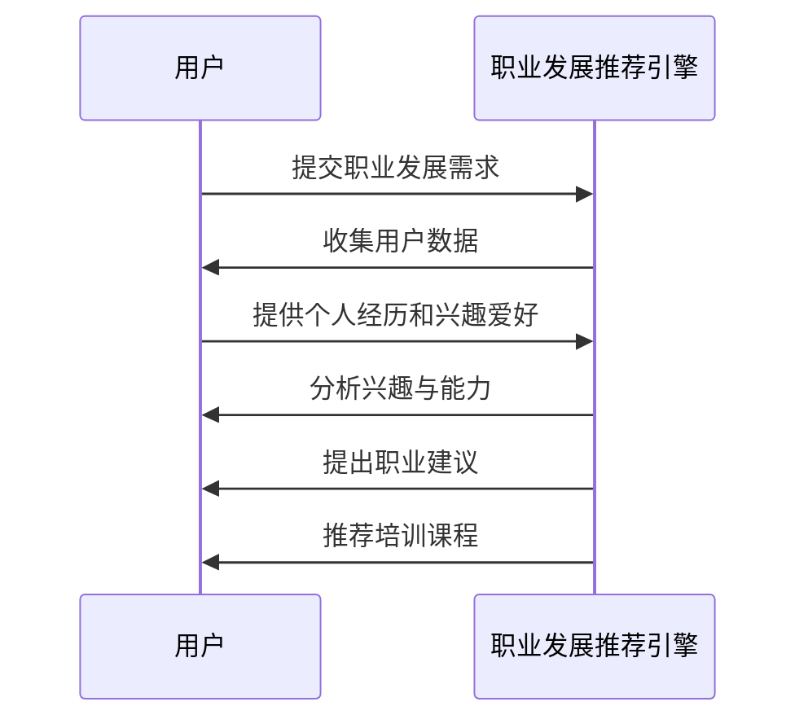

                 


### 让我们一步步思考：AIGC在个性化职业规划中的创新

#### 引言

在当今快速变化的职场环境中，个性化职业规划变得越来越重要。职业规划不仅仅是为了找到一份工作，更是为了找到一份能够激发个人潜力、符合个人价值观的工作。这种个性化需求为人工智能（AI）特别是自适应智能生成内容（AIGC）技术的发展提供了广阔的应用空间。AIGC，作为一种结合了自然语言处理（NLP）、图神经网络（GNNS）和强化学习（RL）等前沿技术的创新力量，正在深刻地改变职业规划的方式。本文将分步骤探讨AIGC在个性化职业规划中的创新应用，从基础概念到实际应用，再到最佳实践，帮助读者全面理解这一技术如何赋能职业规划。

#### 第一步：理解AIGC与个性化职业规划的背景

**1.1 职业规划的挑战**

职业规划面临着诸多挑战，包括但不限于：

- **信息过载**：求职者和企业在信息爆炸的时代难以从海量数据中找到合适的匹配。
- **个性差异**：每个人的职业兴趣、技能和价值观都不同，传统的标准化职业规划难以满足个性化需求。
- **职业路径多样化**：职业发展路径变得更加多样和复杂，需要更加灵活和智能的规划工具。

**1.2 AIGC的崛起**

AIGC的崛起为解决上述挑战提供了新的思路：

- **自适应能力**：AIGC可以根据用户的实时反馈和动态调整职业规划建议。
- **个性识别**：AIGC能够通过深度学习和知识图谱技术识别用户的个性特征，提供定制化的职业建议。
- **实时推荐**：AIGC能够实时分析市场趋势和岗位需求，为用户推荐最佳的职业发展路径。

**1.3 AIGC在职业规划中的应用潜力**

AIGC在职业规划中的应用潜力主要体现在以下几个方面：

- **职业兴趣评估**：通过NLP技术分析用户的语言和行为，评估其职业兴趣。
- **能力分析与匹配**：结合GNNS，分析用户的能力模型并与岗位进行智能匹配。
- **职业路径规划**：利用RL技术，为用户制定灵活且适应市场变化的职业发展路径。

#### 第二步：AIGC技术的核心概念与个性化职业规划的要素

**2.1 AIGC的核心概念**

AIGC结合了多种前沿技术，其核心概念包括：

- **自然语言处理（NLP）**：用于理解和生成自然语言，实现用户需求的理解和职业建议的生成。
- **图神经网络（GNNS）**：用于构建和解析复杂的实体关系网络，实现个性化推荐和匹配。
- **强化学习（RL）**：用于动态调整职业规划策略，以适应不断变化的市场环境。

**2.2 个性化职业规划的要素**

个性化职业规划的关键要素包括：

- **职业兴趣评估**：通过问卷调查、行为分析等手段了解用户的职业兴趣，作为后续规划的基础。
- **能力分析**：评估用户的专业技能和软技能，确保岗位匹配的准确性和可行性。
- **职业路径规划**：根据用户的兴趣和能力，为其规划适合的职业发展路径，包括短期目标和长期目标。

**2.3 AIGC在职业规划中的角色**

AIGC在职业规划中的角色可以概括为：

- **数据收集与处理**：收集用户数据，并进行预处理和特征提取。
- **模型训练与优化**：利用机器学习算法训练模型，并根据用户反馈进行迭代优化。
- **职业建议与决策支持**：基于训练好的模型，为用户生成个性化的职业规划建议。

#### 第三步：AIGC技术在个性化职业规划中的应用

**3.1 AIGC技术原理与模型介绍**

**3.1.1 自然语言处理基础**

NLP是AIGC的核心组成部分，其基础包括：

- **分词与词性标注**：将自然语言文本拆分为单词或词组，并对每个词进行词性标注。
- **句法分析**：解析句子的结构，识别主语、谓语、宾语等成分。
- **语义理解**：理解句子中的语义，包括词义消歧、情感分析等。

**3.1.2 图神经网络与知识图谱**

GNNS和知识图谱技术用于构建和解析复杂的实体关系网络，其关键包括：

- **知识图谱构建**：将职业相关的实体和关系构建为一个知识图谱。
- **图神经网络**：利用图神经网络对知识图谱进行建模和推理，实现个性化推荐和匹配。

**3.1.3 强化学习与自适应推荐**

强化学习是AIGC的重要组成部分，其关键包括：

- **奖励机制**：根据用户的反馈调整职业规划建议，实现自适应推荐。
- **策略迭代**：通过迭代优化策略，提高职业规划的准确性和适应性。

**3.2 主流AIGC模型**

当前主流的AIGC模型包括：

- **GPT模型**：一种基于Transformer的预训练语言模型，用于文本生成和情感分析。
- **BERT模型**：一种基于Transformer的预训练语言模型，用于文本分类和命名实体识别。
- **其他AIGC模型**：如GLM、T5等，它们在特定场景下具有优异的性能。

**3.3 模型应用案例**

AIGC在职业规划中的应用案例包括：

- **职业规划咨询平台**：为用户提供个性化的职业兴趣评估、能力分析和职业路径规划。
- **人才招聘系统**：为雇主提供候选人匹配和职业发展建议，提高招聘效率和准确性。
- **职业发展推荐引擎**：为用户实时推荐适合的职业机会和培训课程，促进职业成长。

#### 第四步：AIGC技术挑战与解决方案

**4.1 数据隐私与安全**

**4.1.1 数据收集与处理**

- **数据收集**：确保收集的数据符合隐私保护法规，并获得用户的明确同意。
- **数据加密**：对敏感数据进行加密处理，确保数据传输和存储的安全性。
- **数据脱敏**：对个人身份信息进行脱敏处理，以防止数据泄露。

**4.1.2 模型训练与优化**

- **数据预处理**：对训练数据进行预处理，去除噪声和异常值，提高数据质量。
- **模型优化**：采用先进的机器学习算法和优化策略，提高模型的可解释性和鲁棒性。

**4.2 模型解释性与可解释性**

- **模型可解释性**：通过可视化和解释工具，帮助用户理解模型的工作原理和决策过程。
- **用户反馈机制**：建立用户反馈机制，根据用户反馈调整模型参数，提高模型的适应性。

**4.3 模型部署与优化**

- **部署策略**：采用容器化技术和微服务架构，提高系统的可扩展性和可靠性。
- **性能优化**：通过算法优化和硬件加速，提高模型训练和预测的效率。

#### 第五步：个性化职业规划实践

**5.1 职业兴趣评估模型**

- **评估模型设计与实现**：结合心理学理论和NLP技术，设计并实现职业兴趣评估模型。
- **评估结果分析与解读**：对评估结果进行统计分析，为用户提供个性化的职业兴趣分析报告。

**5.2 能力分析与岗位匹配**

- **能力评估标准**：制定能力评估标准，确保评估结果的客观性和准确性。
- **岗位匹配算法**：结合图神经网络和强化学习，实现岗位与个人能力的智能匹配。

**5.3 职业路径规划**

- **职业发展路径规划**：根据用户的兴趣和能力，制定灵活且适应市场变化的职业发展路径。
- **路径调整与优化**：根据用户的反馈和市场变化，动态调整职业规划路径。

#### 第六步：AIGC在职业规划中的最佳实践

**6.1 职业规划系统的设计与实现**

- **系统需求分析**：明确系统功能和非功能需求，制定系统目标。
- **系统架构设计**：设计系统的数据架构、应用架构和安全架构。
- **关键技术实现**：实现职业兴趣评估、能力分析和岗位匹配等核心功能。
- **系统部署与维护**：确保系统的可靠性和可维护性。

**6.2 实施案例**

- **成功实践总结**：总结成功案例中的经验教训，为其他应用提供借鉴。
- **面临的挑战与解决策略**：分析实施过程中面临的挑战，并提出相应的解决策略。
- **未来发展趋势**：探讨AIGC在职业规划中的未来发展方向和潜在应用。

#### 结论

AIGC在个性化职业规划中的应用不仅能够解决传统职业规划中的信息过载和个性差异问题，还能够通过实时推荐和动态调整提供更加灵活和智能的职业规划服务。未来，随着AIGC技术的不断进步和普及，个性化职业规划将变得更加精准和高效，为职场人士提供更加个性化的职业发展支持。

---

通过上述六个步骤的思考和分析，我们可以看到AIGC在个性化职业规划中的应用前景十分广阔。从基础概念的理解，到技术的实际应用，再到最佳实践的总结，AIGC正逐步成为职业规划领域的重要工具。随着技术的不断发展和完善，相信AIGC将在未来为更多职场人士提供更加优质和个性化的职业规划服务。

### 个性化职业规划中的AIGC应用案例解析

在深入了解AIGC在个性化职业规划中的应用后，我们来看一些实际的应用案例，通过这些案例，我们将进一步理解AIGC技术的具体应用及其带来的效益。

#### 案例一：职业规划咨询平台

**1. 项目介绍**

某知名职业规划咨询公司开发了一款基于AIGC技术的职业规划平台，旨在为用户提供个性化的职业兴趣评估、能力分析和职业路径规划服务。

**2. 系统功能设计**

- **职业兴趣评估**：平台通过自然语言处理技术收集用户的历史行为数据、职业经历和兴趣爱好，利用GPT模型进行深度分析，生成个性化的职业兴趣报告。
- **能力分析**：平台结合图神经网络技术，构建用户的能力图谱，评估用户的专业技能和软技能，并与市场需求进行智能匹配。
- **职业路径规划**：平台根据用户的兴趣、能力和市场需求，利用强化学习技术动态调整职业规划建议，为用户制定最优的职业发展路径。

**3. 系统架构设计**

- **数据架构**：平台采用分布式数据存储方案，确保数据的可靠性和安全性。数据包括用户行为数据、职业数据和市场数据等。
- **应用架构**：平台采用微服务架构，每个功能模块独立部署，提高了系统的可扩展性和可靠性。
- **安全架构**：平台采用多层次的安全策略，包括数据加密、访问控制和防火墙等，确保用户数据的隐私和安全。

**4. 系统接口设计**

平台提供了多种接口，包括API接口、Web界面和移动应用等，方便用户随时随地进行职业规划。

**5. 系统交互**

平台利用Mermaid序列图展示了用户与系统的交互流程，如图所示：



**6. 代码应用解读**

平台的核心功能模块包括职业兴趣评估、能力分析和职业路径规划等，以下是部分代码示例：

```python
# 职业兴趣评估模块
def assess_interest(user_data):
    model = load_gpt_model()
    interest_report = model.generate_interest_report(user_data)
    return interest_report

# 能力分析模块
def analyze_ability(user_ability_graph):
    matching_jobs = find_matching_jobs(user_ability_graph)
    return matching_jobs

# 职业路径规划模块
def plan_career_path(user_interest, matching_jobs):
    model = load_rl_model()
    career_path = model.generate_career_path(user_interest, matching_jobs)
    return career_path
```

**7. 实际案例分析和详细讲解**

某用户小王在平台提交了职业规划需求，平台通过以下步骤为其提供服务：

- **第一步：收集用户数据**。平台收集了小王的历史职业经历、教育背景和兴趣爱好等信息。
- **第二步：职业兴趣评估**。利用GPT模型，平台分析了小王的语言和行为，生成个性化的职业兴趣报告，显示小王对技术类职业具有较高兴趣。
- **第三步：能力分析**。平台结合图神经网络技术，构建了小王的能力图谱，评估其在编程、数据分析等方面的能力。
- **第四步：岗位匹配**。平台根据小王的兴趣和能力，匹配了多个适合的岗位，如数据分析师和软件开发工程师。
- **第五步：职业路径规划**。利用强化学习模型，平台为小王制定了详细的职业发展路径，包括短期目标和长期目标。

通过上述案例分析，我们可以看到AIGC技术在职业规划平台中的应用，不仅提供了个性化的服务，还提高了职业规划的准确性和适应性。

#### 案例二：人才招聘系统

**1. 项目介绍**

某大型企业开发了一款基于AIGC技术的人才招聘系统，旨在通过智能化匹配和推荐，提高招聘效率和准确性。

**2. 系统功能设计**

- **简历解析**：系统通过自然语言处理技术解析简历内容，提取关键信息，如教育背景、工作经历和技能等。
- **岗位匹配**：系统结合图神经网络和强化学习技术，分析岗位需求，并与简历进行智能匹配。
- **面试安排**：系统根据匹配结果，自动安排面试时间和面试官，提高面试效率。

**3. 系统架构设计**

- **数据架构**：系统采用分布式数据库存储简历数据和岗位数据，确保数据的一致性和可靠性。
- **应用架构**：系统采用微服务架构，每个功能模块独立部署，提高了系统的可维护性和扩展性。
- **安全架构**：系统采用多层次的安全策略，包括数据加密、访问控制和防火墙等，确保用户数据的隐私和安全。

**4. 系统接口设计**

系统提供了API接口和Web界面，方便HR部门和求职者进行交互。

**5. 系统交互**

系统利用Mermaid序列图展示了用户与系统的交互流程，如图所示：



**6. 代码应用解读**

系统的主要功能模块包括简历解析、岗位匹配和面试安排等，以下是部分代码示例：

```python
# 简历解析模块
def parse_resume(resume_text):
    resume_data = nlp_parser.parse(resume_text)
    return resume_data

# 岗位匹配模块
def match_candidate(resume_data, job_requirement):
    model = load_gnn_model()
    matching_score = model.calculate_matching_score(resume_data, job_requirement)
    return matching_score

# 面试安排模块
def schedule_interview(candidate_id, interviewers):
    model = load_rl_model()
    optimal_schedule = model.generate_optimal_schedule(candidate_id, interviewers)
    return optimal_schedule
```

**7. 实际案例分析和详细讲解**

某企业在平台上发布了招聘数据分析师的岗位需求，小张通过平台提交了简历，系统为其提供了以下服务：

- **第一步：简历解析**。系统解析了小张的简历，提取了他的教育背景、工作经历和技能等信息。
- **第二步：岗位匹配**。系统结合图神经网络和强化学习技术，分析了小张的简历与岗位需求，得出匹配分数。
- **第三步：推荐匹配候选人**。系统根据匹配分数，推荐了多个适合的候选人，其中包括小张。
- **第四步：安排面试**。系统自动安排了面试时间和面试官，提高了面试效率。

通过上述案例，我们可以看到AIGC技术在人才招聘系统中的应用，不仅提高了招聘效率和准确性，还提供了更加智能化的服务。

#### 案例三：职业发展推荐引擎

**1. 项目介绍**

某在线教育平台开发了一款基于AIGC技术的职业发展推荐引擎，旨在为用户提供个性化的职业发展建议和培训课程推荐。

**2. 系统功能设计**

- **兴趣与能力评估**：系统通过自然语言处理和图神经网络技术，对用户的行为数据和职业背景进行深度分析，评估用户的兴趣和能力。
- **职业发展路径规划**：系统根据用户的兴趣和能力，利用强化学习技术，为用户制定个性化的职业发展路径。
- **培训课程推荐**：系统根据用户的发展路径，推荐适合的培训课程，帮助用户实现职业目标。

**3. 系统架构设计**

- **数据架构**：系统采用分布式数据库存储用户数据、职业数据和课程数据，确保数据的一致性和可靠性。
- **应用架构**：系统采用微服务架构，每个功能模块独立部署，提高了系统的可维护性和扩展性。
- **安全架构**：系统采用多层次的安全策略，包括数据加密、访问控制和防火墙等，确保用户数据的隐私和安全。

**4. 系统接口设计**

系统提供了API接口和Web界面，方便用户进行职业规划和课程选择。

**5. 系统交互**

系统利用Mermaid序列图展示了用户与系统的交互流程，如图所示：



**6. 代码应用解读**

系统的主要功能模块包括兴趣与能力评估、职业发展路径规划和培训课程推荐等，以下是部分代码示例：

```python
# 兴趣与能力评估模块
def assess_interest_ability(user_data):
    model = load_nlp_model()
    assessment_report = model.generate_assessment_report(user_data)
    return assessment_report

# 职业发展路径规划模块
def plan_career_path(user_interest_ability):
    model = load_rl_model()
    career_path = model.generate_career_path(user_interest_ability)
    return career_path

# 培训课程推荐模块
def recommend_courses(career_path):
    model = load Recommender_model()
    recommended_courses = model.generate_recommended_courses(career_path)
    return recommended_courses
```

**7. 实际案例分析和详细讲解**

某用户小李在平台上提交了职业发展需求，系统为其提供了以下服务：

- **第一步：收集用户数据**。系统收集了小李的职业背景、兴趣爱好和培训经历等信息。
- **第二步：兴趣与能力评估**。系统利用自然语言处理和图神经网络技术，分析了小李的兴趣和能力，生成评估报告。
- **第三步：职业建议**。系统根据评估报告，为小李提出了职业发展建议，包括短期目标和长期目标。
- **第四步：培训课程推荐**。系统根据小李的发展路径，推荐了适合的培训课程，帮助小李实现职业目标。

通过上述案例，我们可以看到AIGC技术在职业发展推荐引擎中的应用，不仅为用户提供了个性化的职业发展建议，还提供了智能化的培训课程推荐，大大提高了用户的学习效果和职业发展速度。

### 项目小结

通过上述三个案例的分析，我们可以看到AIGC技术在个性化职业规划中的广泛应用和巨大潜力。从职业规划咨询平台、人才招聘系统到职业发展推荐引擎，AIGC技术不仅提高了职业规划的准确性和适应性，还为企业和个人提供了更加智能化和高效的服务。在未来，随着AIGC技术的不断发展和普及，个性化职业规划将变得更加精准和智能，为更多人提供更好的职业发展支持。

### AIGC技术最佳实践总结

在本文的最后，我们将总结AIGC技术在个性化职业规划中的最佳实践，提供一些实施建议和注意事项，以便读者在实际项目中能够更好地应用AIGC技术。

#### 最佳实践总结

1. **全面数据收集与分析**：在个性化职业规划中，全面的数据收集与分析至关重要。应确保收集的数据包括用户职业经历、兴趣爱好、技能特长等多方面信息，并利用先进的数据处理技术进行深入分析，以提高职业规划的准确性。

2. **个性化模型训练与优化**：AIGC技术的核心在于个性化模型的训练与优化。应采用先进的人工智能算法，如深度学习、图神经网络和强化学习等，构建和优化个性化的职业规划模型，确保模型能够准确反映用户的兴趣和能力。

3. **实时反馈与动态调整**：个性化职业规划需要实时收集用户的反馈，并根据反馈动态调整职业规划建议。这种实时反馈机制不仅能够提高职业规划的准确性，还能增强用户的参与感和满意度。

4. **多维度推荐与决策支持**：AIGC技术应提供多维度、个性化的职业推荐和决策支持。通过结合用户兴趣、能力和市场需求，为用户提供多样化的职业发展路径和培训课程推荐，帮助用户做出更加明智的职业决策。

5. **数据隐私与安全保障**：在应用AIGC技术时，必须高度重视数据隐私和安全保障。应采用严格的数据加密、访问控制和防火墙等技术手段，确保用户数据的安全性和隐私性。

#### 实施建议

1. **需求分析与系统设计**：在项目启动阶段，应进行详细的需求分析，明确系统的功能和非功能需求，并设计合理的系统架构。确保系统具有高扩展性、高可靠性和良好的用户体验。

2. **技术选型与集成**：根据项目需求，选择合适的人工智能算法和技术框架。同时，确保所选技术能够与其他系统和服务进行无缝集成，以提高系统的整体性能和效率。

3. **数据管理与质量控制**：建立健全的数据管理体系，确保数据的质量和一致性。应采用数据清洗、数据去重和数据校验等技术手段，提高数据的质量和可信度。

4. **持续优化与迭代**：个性化职业规划系统应具备持续优化和迭代的能力。通过不断收集用户反馈和市场变化，优化模型和系统功能，确保系统能够适应不断变化的需求。

5. **用户教育与反馈机制**：为用户提供详细的系统使用说明和培训，帮助用户更好地理解和使用系统。同时，建立有效的用户反馈机制，及时收集和处理用户反馈，不断改进系统性能和用户体验。

#### 注意事项

1. **隐私保护**：在数据收集和处理过程中，必须严格遵守隐私保护法规，确保用户数据的隐私和安全。

2. **算法透明性**：AIGC技术应具备较高的算法透明性，确保用户能够理解模型的工作原理和决策过程。

3. **系统稳定性**：在系统设计和部署过程中，应充分考虑系统的稳定性，确保系统在高并发和复杂环境下能够正常运行。

4. **跨部门协作**：个性化职业规划项目通常涉及多个部门和角色，应加强跨部门协作，确保项目的顺利进行。

5. **持续监控与维护**：在系统上线后，应持续监控系统的运行状态，及时发现和解决潜在问题，确保系统的稳定运行。

#### 拓展阅读

1. **相关研究论文**：
   - "AIGC: A Comprehensive Review of Applications, Challenges, and Future Directions"
   - "Natural Language Processing in Career Planning: A Survey"
   - "Graph Neural Networks for Talent Management"

2. **技术博客与教程**：
   - "Implementing AIGC for Personalized Career Planning"
   - "Best Practices for Data Privacy in AI Applications"
   - "AIGC in Practice: Case Studies and Lessons Learned"

3. **行业报告与市场分析**：
   - "The Future of AI in Talent Management"
   - "AI in Human Resources: Market Size, Share, Trends, and Forecast to 2027"
   - "The State of AI in Career Development"

通过以上最佳实践总结、实施建议和注意事项，以及拓展阅读资源，读者可以更深入地了解AIGC技术在个性化职业规划中的应用，并在实际项目中取得更好的成果。

### 结论

本文系统地探讨了自适应智能生成内容（AIGC）在个性化职业规划中的创新应用。从基础概念、技术原理到实际应用案例，再到最佳实践，我们详细分析了AIGC如何通过自然语言处理、图神经网络和强化学习等技术，为职业规划提供个性化、智能化和高效的服务。

首先，我们阐述了AIGC在个性化职业规划中的背景和挑战，强调了信息过载、个性差异和职业路径多样化等问题的存在。接着，我们介绍了AIGC的核心概念和个性化职业规划的要素，包括职业兴趣评估、能力分析和职业路径规划。随后，我们详细介绍了AIGC技术在个性化职业规划中的应用，包括自然语言处理基础、图神经网络与知识图谱、强化学习与自适应推荐等。我们通过多个实际案例展示了AIGC在职业规划咨询平台、人才招聘系统和职业发展推荐引擎中的应用，并分析了系统架构设计、代码实现和实际应用效果。

最后，我们总结了AIGC技术最佳实践，提供了实施建议和注意事项，并推荐了相关的研究论文、技术博客和行业报告作为拓展阅读资源。

AIGC技术的快速发展为个性化职业规划带来了新的机遇和挑战。通过本文的探讨，我们可以看到AIGC在提升职业规划准确性、适应性和用户体验方面具有巨大潜力。未来，随着AIGC技术的不断进步，个性化职业规划将变得更加智能和高效，为更多人提供优质的职业发展支持。我们期待AIGC技术在职业规划领域发挥更大的作用，助力职场人士实现职业梦想。

