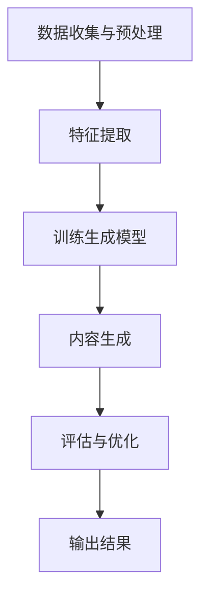
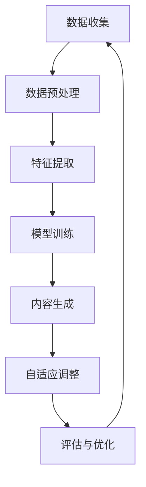
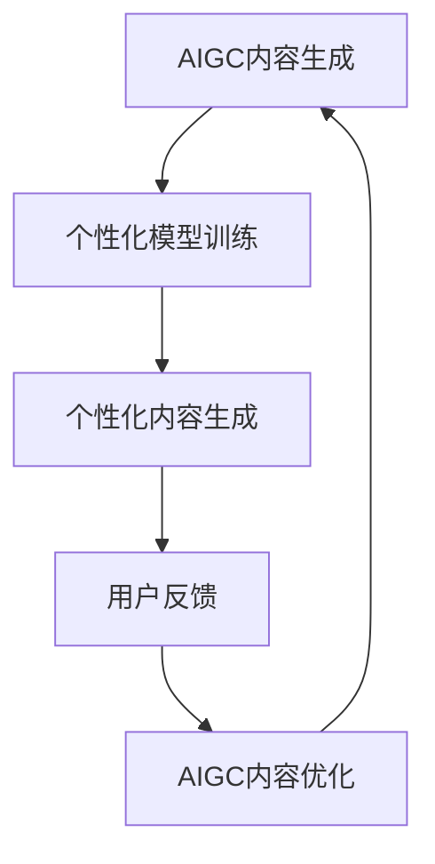
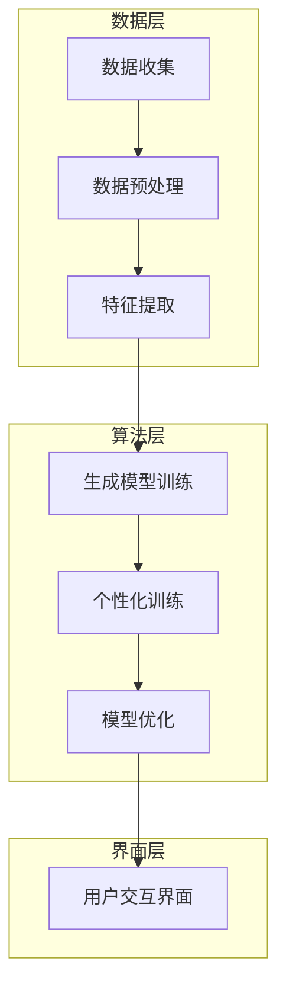
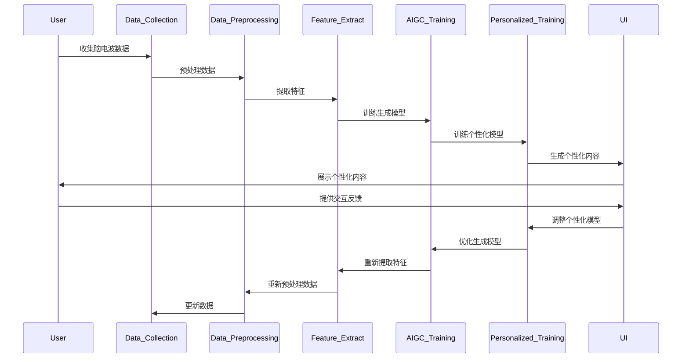

                 

### 第一部分: 背景介绍

#### 1. 引言

##### 1.1 研究背景

近年来，人工智能（AI）的快速发展已经深刻改变了我们的生活。从自动驾驶汽车到智能语音助手，AI技术正在各个领域展现其强大的能力。与此同时，脑机接口（Brain-Computer Interface，简称BCI）技术也取得了显著的进步。BCI技术通过直接连接人脑与计算机系统，实现了人类思维与机器之间的直接交互。这种技术的进步不仅为残障人士提供了新的康复手段，还为未来人机融合提供了无限可能。

在这个背景下，个性化训练的重要性日益凸显。传统的BCI系统往往采用统一的方法进行训练，难以适应个体差异，导致训练效果不尽如人意。个性化训练则通过分析个体的独特特征，提供定制化的训练方案，从而大幅提升训练效率和效果。因此，研究如何利用AI Generated Content（AIGC）技术进行个性化BCI训练，具有非常重要的意义。

##### 1.2 问题描述

传统的BCI系统通常面临以下几个问题：

1. **训练效率低**：由于统一的方法无法适应个体差异，导致训练周期较长，效率低下。
2. **交互体验差**：缺乏个性化的交互内容，导致用户体验不佳。
3. **适应性差**：无法根据用户的使用习惯和需求进行自适应调整，影响长期使用的效果。

针对这些问题，个性化训练的需求日益迫切。个性化训练通过分析用户的思维模式、行为习惯等特征，提供定制化的训练方案，从而提高训练效率和效果。然而，个性化训练也面临以下挑战：

1. **数据隐私问题**：个性化训练需要收集和分析大量的用户数据，如何保护用户隐私成为一大难题。
2. **计算资源消耗**：个性化训练需要大量的计算资源，如何优化算法，减少计算开销是一个重要的挑战。
3. **算法稳定性**：个性化训练算法需要具备较高的稳定性，以确保长期使用的效果。

##### 1.3 问题解决

为了解决上述问题，引入AIGC技术进行个性化BCI训练是一个有效的思路。AIGC技术通过自动生成个性化的训练内容，能够大幅提升训练效率和效果。具体来说，AIGC技术具有以下几个优势：

1. **高效的内容生成**：AIGC技术能够快速生成大量个性化的训练数据，缩短训练周期。
2. **自适应交互内容**：通过分析用户的行为习惯和思维模式，AIGC技术能够生成适应不同用户的交互内容，提升用户体验。
3. **隐私保护**：AIGC技术可以将用户数据转化为抽象的模型，降低隐私泄露的风险。

通过引入AIGC技术，我们希望实现以下目标：

1. **优化人机神经连接**：通过个性化的训练方案，提升人机接口的效率和稳定性。
2. **提升用户体验**：通过自适应的交互内容，提供更加人性化的服务。
3. **保障数据安全**：通过数据抽象和隐私保护技术，确保用户数据的安全。

##### 1.4 边界与外延

AIGC技术在个性化BCI训练中的应用具有广泛的适用范围。它不仅适用于医疗康复领域，还可以应用于教育、游戏、人机交互等多个领域。然而，AIGC技术的应用也面临一些挑战，如数据隐私保护、计算资源消耗等。

在个性化训练的技术框架方面，AIGC技术可以通过以下步骤实现：

1. **数据收集**：收集用户的思维模式、行为习惯等数据。
2. **数据预处理**：对收集到的数据进行清洗和预处理，提取关键特征。
3. **模型训练**：利用AIGC技术生成个性化的训练内容。
4. **训练评估**：对训练效果进行评估和调整。

##### 1.5 概念结构与核心要素组成

AIGC技术在个性化BCI训练中的应用，可以分解为以下几个核心概念和要素：

1. **AIGC技术**：自动生成个性化训练内容的核心技术。
2. **个性化训练算法**：基于用户数据，生成个性化训练方案的核心算法。
3. **数据隐私保护技术**：保障用户数据安全的核心技术。
4. **人机交互界面**：实现人机交互，提供个性化服务的关键界面。

通过这些核心概念和要素的协同作用，AIGC技术能够实现个性化BCI训练，提升人机接口的效率和稳定性。

##### 1.6 本章小结

本部分主要介绍了AIGC技术在个性化BCI训练中的应用背景、问题和解决方案。通过引入AIGC技术，我们有望解决传统BCI系统面临的效率低、交互体验差、适应性差等问题，实现个性化训练，提升人机接口的效率和用户体验。然而，AIGC技术的应用也面临数据隐私保护、计算资源消耗等挑战，需要进一步研究和优化。在接下来的章节中，我们将对AIGC技术和个性化训练算法进行详细讲解。

### 1.6.1 研究意义

本研究的意义主要体现在以下几个方面：

1. **推动人工智能与脑机接口技术的融合**：通过引入AIGC技术进行个性化BCI训练，本研究有望推动人工智能与脑机接口技术的深度融合，为未来人机融合提供新的思路和解决方案。

2. **提升用户体验**：通过个性化的训练方案，本研究旨在提升BCI系统的用户体验，使其更加适应个体需求，提供更加人性化的服务。

3. **保障数据安全**：本研究在引入AIGC技术的同时，关注数据隐私保护问题，通过数据抽象和隐私保护技术，确保用户数据的安全。

4. **促进学术交流**：本研究通过对AIGC技术和个性化训练算法的深入探讨，为相关领域的学者提供新的研究思路和理论基础，促进学术交流。

##### 1.6.2 下一步工作计划

在接下来的研究中，我们将重点关注以下几个方面：

1. **算法优化**：对AIGC算法和个性化训练算法进行优化，提高计算效率和算法稳定性。

2. **数据隐私保护**：进一步研究数据隐私保护技术，确保用户数据的安全。

3. **应用场景拓展**：将AIGC技术应用于更多的实际场景，如教育、游戏、人机交互等，验证其效果和可行性。

4. **性能评估**：对个性化BCI训练系统的性能进行评估，包括训练效率、用户体验、数据安全等方面。

5. **用户体验研究**：通过实地测试和用户反馈，进一步优化人机交互界面，提升用户体验。

通过这些研究，我们期望能够为AIGC技术在个性化BCI训练中的应用提供更加完善的理论基础和实际应用方案。

### 第二部分: 核心概念与联系

#### 2.1 AI Generated Content（AIGC）概述

##### 2.1.1 AIGC的定义

AI Generated Content（AIGC），即人工智能生成内容，是指通过人工智能技术，特别是机器学习和深度学习算法，自动生成具有高质且多样化的内容。AIGC与传统的人工内容生成方式有本质的区别。传统的内容生成主要依赖于人工创作，而AIGC则是通过算法，从大量的数据中学习，生成新的、符合特定需求的文本、图像、音频、视频等。

##### 2.1.2 AIGC的核心特点

AIGC具有以下几个核心特点：

1. **自动生成能力**：AIGC技术无需人工干预，可以自动生成各种类型的内容。例如，通过自然语言处理技术，AIGC可以自动生成文章、新闻报道；通过图像生成技术，可以自动生成艺术画作、图像编辑。

2. **数据驱动的创新性**：AIGC的生成过程高度依赖于数据。通过对大量数据的分析和学习，AIGC能够生成具有创新性和多样性的内容。这种数据驱动的生成方式，使得AIGC能够适应不同的应用场景和需求。

3. **个性化定制**：AIGC可以根据用户的需求和偏好，生成个性化的内容。例如，在电商领域，AIGC可以根据用户的浏览历史和购买记录，生成个性化的推荐内容。

4. **高效性**：AIGC技术能够快速生成大量内容，大大提高了内容生成的效率。这对于需要大量内容生成和更新的领域，如新闻媒体、社交媒体等，具有重要意义。

##### 2.1.3 AIGC的应用场景

AIGC技术在多个领域展现了其强大的应用潜力：

1. **内容创作**：在媒体、娱乐、广告等行业，AIGC技术可以自动生成新闻报道、广告文案、音乐、视频等，提高了内容生产的效率和多样性。

2. **数据分析**：AIGC技术可以自动生成数据分析报告、市场研究文档等，帮助企业和组织快速了解市场动态和业务状况。

3. **人机交互**：在智能助手、虚拟助手等场景中，AIGC技术可以生成个性化的对话内容，提供更加自然、流畅的用户交互体验。

4. **教育**：在教育领域，AIGC技术可以自动生成教学资料、练习题、测试题等，为学生提供个性化的学习内容。

5. **游戏**：在游戏设计中，AIGC技术可以自动生成游戏剧情、角色描述、场景设置等，提高游戏的可玩性和多样性。

##### 2.1.4 AIGC与传统AI的区别

AIGC与传统AI的主要区别在于：

1. **生成性**：传统AI更多是进行模式识别、预测等任务，而AIGC则是以生成内容为主要目标。

2. **数据依赖性**：AIGC高度依赖大量的数据进行训练和生成，而传统AI则可以在有限的数据上进行训练。

3. **多样性**：AIGC能够生成具有高多样性和创新性的内容，而传统AI生成的结果往往较为单一。

4. **个性化**：AIGC可以根据用户的需求和偏好进行个性化生成，而传统AI则无法实现这一点。

##### 2.1.5 举例说明

**案例1：新闻媒体**

某新闻媒体公司引入AIGC技术，通过机器学习和自然语言处理算法，自动生成新闻报道。这些新闻报道不仅覆盖面广、更新迅速，而且可以根据用户偏好进行个性化推荐。例如，用户如果对体育新闻感兴趣，AIGC会优先生成和推荐体育新闻。

**案例2：电商推荐**

某电商平台利用AIGC技术，根据用户的购买历史、浏览记录等数据，自动生成个性化的商品推荐内容。这些推荐内容不仅提高了用户的购物体验，还大大提升了电商平台的销售额。

**案例3：教育应用**

在教育领域，AIGC技术可以自动生成教学资料和练习题。例如，某在线教育平台利用AIGC技术，根据学生的学习进度和理解能力，自动生成个性化的练习题，帮助学生更好地掌握知识点。

通过这些案例，我们可以看到AIGC技术在各个领域的广泛应用和巨大潜力。

#### 2.2 脑机接口（BCI）技术简介

##### 2.2.1 BCI的定义

脑机接口（Brain-Computer Interface，简称BCI）是指通过直接连接人脑与外部设备，实现思维信号与计算机系统之间的交互。BCI技术通过记录和分析脑电波、神经信号等，将人脑的思维活动转化为计算机指令，从而实现人机交互。

##### 2.2.2 BCI的类型

根据接入脑部信号的方式，BCI技术可以分为侵入式和非侵入式两大类：

1. **侵入式BCI**：侵入式BCI通过手术将电极植入大脑，直接记录神经元活动。这种方式可以获得高精度的脑部信号，但手术风险较大，应用范围有限。

2. **非侵入式BCI**：非侵入式BCI通过贴在头皮上的电极记录脑电波，无需手术。这种方式安全、便捷，但信号精度相对较低。

##### 2.2.3 BCI技术的应用现状

BCI技术已经取得了一系列重要的应用成果：

1. **医疗康复**：BCI技术被广泛应用于康复治疗，如帮助残障人士控制假肢、辅助沟通等。例如，通过脑电波控制，残障人士可以实现对轮椅、假肢的高精度控制，提高了生活质量。

2. **神经科学研究**：BCI技术为神经科学研究提供了重要的工具，可以帮助科学家更好地理解大脑工作机制。例如，通过记录和解析脑电波，科学家可以研究记忆、注意力、决策等大脑活动。

3. **人机交互**：BCI技术也被广泛应用于人机交互领域，如虚拟现实、游戏控制等。通过脑电波控制，用户可以更加自然地与虚拟世界进行交互。

4. **智能家居**：随着智能家居的发展，BCI技术也开始应用于智能家居系统。例如，通过脑电波控制，用户可以实现对家电、照明等的智能控制。

##### 2.2.4 BCI技术的优势与挑战

BCI技术具有以下优势：

1. **自然交互**：BCI技术实现了人类思维与计算机系统之间的直接交互，使得人机交互更加自然和直观。

2. **高精度控制**：通过直接记录神经元活动，BCI技术可以实现对外部设备的高精度控制。

3. **康复治疗**：BCI技术为康复治疗提供了新的手段，可以帮助残障人士提高生活质量。

然而，BCI技术也面临一些挑战：

1. **信号噪声问题**：脑部信号通常较为微弱，容易受到噪声干扰，这对信号的解析和识别提出了高要求。

2. **稳定性问题**：BCI系统的稳定运行需要高度依赖生物信号，而生物信号可能受到多种因素影响，如情绪、疲劳等。

3. **成本问题**：侵入式BCI技术需要手术操作，成本较高，限制了其推广和应用。

4. **用户适应性**：BCI技术需要根据个体差异进行定制化，如何快速适应不同用户的需求是一个重要的挑战。

##### 2.2.5 未来发展趋势

随着技术的不断进步，BCI技术有望在以下几个方面取得重要突破：

1. **非侵入式技术的提升**：通过改进传感器技术和信号处理算法，非侵入式BCI技术将变得更加精确和稳定。

2. **多模态融合**：结合多种生物信号（如脑电波、心电波、肌电波等），实现多模态融合，提高BCI系统的性能和鲁棒性。

3. **人工智能的融合**：通过引入人工智能技术，特别是深度学习和机器学习算法，实现BCI系统的智能化和自适应化。

4. **应用场景拓展**：除了医疗康复和科研领域，BCI技术还将应用于人机交互、智能家居、教育、娱乐等更多领域，实现人机融合。

通过不断探索和创新，BCI技术将为人类带来更多便利和可能性。

##### 2.3 AIGC与BCI技术的联系

AIGC与BCI技术的融合具有巨大的潜力，能够在多个方面提升人机交互的效率和体验：

1. **个性化交互内容**：通过AIGC技术，可以自动生成个性化的交互内容，如虚拟助手、教育游戏等，提升用户体验。

2. **自适应训练**：AIGC技术可以根据用户的脑电波信号，自动调整训练内容和方法，实现个性化训练，提高训练效果。

3. **隐私保护**：AIGC技术可以将用户的脑电波信号转化为抽象的模型，降低隐私泄露的风险。

4. **实时反馈**：通过AIGC技术，可以实时生成与用户脑电波信号相关的反馈内容，提供更加自然和直观的交互体验。

然而，AIGC与BCI技术的融合也面临一些挑战：

1. **数据隐私**：如何保护用户的脑电波数据，防止隐私泄露是一个重要的挑战。

2. **计算资源**：AIGC和BCI技术都需要大量的计算资源，如何优化算法，提高计算效率是一个关键问题。

3. **算法稳定性**：如何确保AIGC算法和BCI系统的稳定性，避免因算法失效导致的交互故障，是一个重要的挑战。

4. **用户适应性**：如何快速适应不同用户的脑电波信号和交互需求，实现广泛的应用是一个复杂的课题。

##### 2.3.2 技术融合的挑战

尽管AIGC与BCI技术的融合具有巨大潜力，但在实际应用中仍然面临一系列挑战：

1. **数据隐私保护**：BCI技术直接涉及到用户的脑电波数据，这些数据非常敏感。如何确保这些数据在生成和处理过程中不被泄露或滥用，是一个重大的挑战。

2. **算法稳定性**：BCI系统的稳定性直接依赖于脑电波信号的准确性和一致性。然而，脑电波信号容易受到多种因素的影响，如情绪波动、环境噪声等，这对算法的稳定性提出了高要求。

3. **计算资源消耗**：AIGC技术通常需要大量的计算资源，而BCI系统对实时性要求较高。如何在有限的计算资源下，确保AIGC算法的高效运行，是一个重要的挑战。

4. **用户适应性**：不同用户的脑电波特征和交互习惯存在显著差异，如何快速适应这些差异，提供个性化的服务，是一个复杂的问题。

##### 2.3.3 技术融合的发展趋势

展望未来，AIGC与BCI技术的融合将在以下方面取得重要进展：

1. **多模态融合**：结合多种生物信号（如脑电波、心电波、肌电波等），实现多模态融合，提高系统的性能和鲁棒性。

2. **深度学习与AI的融合**：通过引入深度学习和AI技术，实现BCI系统的智能化和自适应化，提升人机交互的效率和体验。

3. **隐私保护技术的应用**：开发和应用新的隐私保护技术，如联邦学习、差分隐私等，确保用户的脑电波数据在生成和处理过程中的安全。

4. **开源与标准化**：推动AIGC与BCI技术的开源和标准化，降低研发门槛，促进技术的广泛应用和创新发展。

通过不断的技术创新和应用推广，AIGC与BCI技术的融合将为人类带来更加智能、便捷和个性化的交互体验。

##### 2.4 概念属性特征对比表格

| 概念        | 定义                   | 关键特征                                     | 应用场景                     |
| ----------- | ---------------------- | ------------------------------------------ | -------------------------- |
| AIGC        | 人工智能生成内容       | 自动生成、数据驱动、个性化定制、高效性       | 内容创作、数据分析、人机交互、教育、游戏 |
| BCI         | 脑机接口               | 自然交互、高精度控制、康复治疗、神经科学研究   | 医疗康复、神经科学、人机交互、智能家居   |
| AIGC + BCI  | AIGC与BCI的融合技术     | 个性化交互、自适应训练、隐私保护、实时反馈       | 个性化训练、智能辅助、人机交互增强、智能控制 |

通过上述表格，我们可以清晰地看到AIGC与BCI技术在定义、关键特征和应用场景上的对比，这为我们进一步理解两者融合的优势和挑战提供了基础。

##### 2.5 ER实体关系图架构

为了更好地理解AIGC与BCI技术融合的系统架构，下面我们将使用Mermaid工具绘制ER图，详细展示系统中的实体及其关系。

```mermaid
erDiagram
    User ..|> BCI_System : 用户与BCI系统关联
    User ..|> AIGC_System : 用户与AIGC系统关联
    BCI_System ||--|{ Data : BCI系统数据
    AIGC_System ||--|{ Content : AIGC系统内容
    AIGC_System ||--|{ Model : AIGC系统模型
    BCI_System ..|> Interaction : BCI系统交互
    AIGC_System ..|> Interaction : AIGC系统交互
```

在该ER图中，我们定义了以下几个实体：

1. **User（用户）**：系统的核心实体，与BCI系统和AIGC系统都有直接的关联。
2. **BCI_System（BCI系统）**：负责处理用户的脑电波数据，实现人机交互。
3. **AIGC_System（AIGC系统）**：负责生成个性化的训练内容和交互内容。
4. **Data（数据）**：BCI系统生成的脑电波数据，用于AIGC系统进行内容生成和模型训练。
5. **Content（内容）**：AIGC系统生成的个性化交互内容。
6. **Model（模型）**：AIGC系统训练生成的模型，用于后续的内容生成和交互优化。

实体之间的关系如下：

1. **User与BCI_System**：用户通过BCI系统与外部设备进行交互。
2. **User与AIGC_System**：用户通过AIGC系统接收个性化的训练内容和交互内容。
3. **BCI_System与Data**：BCI系统生成脑电波数据。
4. **AIGC_System与Content**：AIGC系统生成个性化的交互内容。
5. **AIGC_System与Model**：AIGC系统训练生成的模型用于后续的交互优化。
6. **BCI_System与Interaction**：BCI系统与外部设备之间的交互。
7. **AIGC_System与Interaction**：AIGC系统与用户之间的交互。

通过ER图，我们可以清晰地看到AIGC与BCI技术融合的系统架构，这为后续的系统设计和实现提供了基础。

#### 2.6 本章小结

在本章节中，我们首先介绍了AIGC技术的定义、核心特点和应用场景，以及其与传统AI的区别。接着，我们对BCI技术进行了详细介绍，包括其定义、类型、应用现状和优势与挑战。随后，我们分析了AIGC与BCI技术的融合，探讨了其技术融合的可行性、挑战和未来发展趋势。此外，我们还通过概念属性特征对比表格和ER实体关系图，进一步展示了AIGC与BCI技术的联系和系统架构。

通过本章的介绍，我们为后续深入探讨AIGC在个性化BCI训练中的应用奠定了基础。在接下来的章节中，我们将详细讲解AIGC算法原理、个性化训练算法及其融合的实现，进一步探讨如何通过AIGC技术优化人机神经连接，提升用户体验和系统稳定性。

### 2.6.1 研究进展总结

在AIGC和BCI技术领域，近年来已经取得了一系列重要的研究进展。首先，在AIGC技术方面，深度学习算法的广泛应用显著提升了内容生成的质量和效率。例如，GPT-3等大型语言模型可以生成高质量的自然语言文本，DALL·E等模型能够自动生成具有视觉美感的图像。这些进展为AIGC技术在个性化训练中的应用提供了坚实的基础。

在BCI技术方面，随着脑电波信号处理技术的不断进步，非侵入式BCI系统的精度和稳定性得到了显著提升。同时，多模态融合技术（如结合脑电波、心电波、肌电波等）的应用，进一步提高了BCI系统的性能。此外，人工智能技术的引入，使得BCI系统能够更好地适应个体差异，提供个性化的交互体验。

AIGC与BCI技术的融合研究也取得了一定的成果。例如，通过将AIGC技术应用于BCI系统的训练，可以生成个性化的训练内容，提高训练效率和效果。同时，AIGC技术还可以为BCI系统提供自适应的交互内容，提升用户体验。然而，AIGC与BCI技术的融合仍面临数据隐私保护、算法稳定性等挑战，需要进一步的研究和优化。

#### 2.6.2 下一步研究方向

在接下来的研究中，我们将重点关注以下几个方面：

1. **算法优化**：进一步优化AIGC算法和BCI系统，提高计算效率和算法稳定性。具体来说，可以研究基于神经网络的优化算法，如卷积神经网络（CNN）和递归神经网络（RNN）等，以提高信号处理和内容生成的精度。

2. **数据隐私保护**：研究并应用新的数据隐私保护技术，如联邦学习、差分隐私等，确保用户的脑电波数据在生成和处理过程中的安全。同时，探索如何在不牺牲性能的情况下，有效保护用户隐私。

3. **多模态融合**：结合多种生物信号，如脑电波、心电波、肌电波等，实现多模态融合，提高BCI系统的性能和鲁棒性。同时，研究如何通过多模态数据融合，进一步提升AIGC系统的内容生成质量和个性化程度。

4. **用户体验优化**：通过实地测试和用户反馈，进一步优化人机交互界面和交互内容，提升用户体验。具体来说，可以研究如何通过AIGC技术，生成更加自然、直观和个性化的交互内容，提高用户满意度。

5. **应用场景拓展**：将AIGC技术应用于更多实际场景，如教育、游戏、人机交互等，验证其在不同领域的应用效果和可行性。同时，探索AIGC技术在智能家居、智能医疗等领域的潜在应用，推动技术的广泛应用。

通过这些研究方向的探索和实践，我们期望能够为AIGC与BCI技术的融合提供更加完善的理论基础和实际应用方案，进一步提升人机交互的效率和体验。

### 第三部分: 算法原理讲解

#### 3.1 AIGC算法原理讲解

##### 3.1.1 AIGC算法概述

AIGC（AI Generated Content）算法是一种基于人工智能技术的自动内容生成方法。它利用深度学习、自然语言处理、图像生成等技术，从大量数据中学习并生成新的、符合特定需求的文本、图像、音频和视频内容。AIGC算法的核心在于其数据驱动的生成过程，通过不断地学习和优化，实现高质量、多样化的内容生成。

##### 3.1.2 AIGC算法的基本框架

AIGC算法的基本框架通常包括以下几个关键组件：

1. **数据收集与预处理**：首先，从各种来源收集大量数据，如文本、图像、音频等。然后，对这些数据进行清洗和预处理，包括去除噪声、标准化数据格式等，以便后续的模型训练。

2. **特征提取**：通过深度学习模型，如卷积神经网络（CNN）、循环神经网络（RNN）等，对预处理后的数据进行特征提取。这些特征将用于生成新的内容。

3. **内容生成**：利用提取的特征，通过生成模型，如生成对抗网络（GAN）、变分自编码器（VAE）等，生成新的、高质量的内容。这些生成模型通常由多个神经网络层次组成，通过不断的迭代和优化，提高生成内容的质量。

4. **优化与评估**：在生成内容后，对生成的内容进行评估和优化。通过反馈机制，如损失函数、生成质量评估等，调整模型参数，进一步提高生成内容的准确性、多样性和质量。

##### 3.1.3 AIGC算法的核心组件

AIGC算法的核心组件主要包括：

1. **生成模型**：生成模型是AIGC算法的核心，它负责生成新的内容。常见的生成模型包括生成对抗网络（GAN）、变分自编码器（VAE）、递归生成网络（RNN）等。

2. **训练数据集**：训练数据集是AIGC算法的基础。高质量、多样化的训练数据集能够帮助生成模型更好地学习，生成高质量的内容。

3. **特征提取器**：特征提取器负责从输入数据中提取关键特征。这些特征用于训练生成模型，并指导生成新的内容。

4. **评估与优化机制**：评估与优化机制用于评估生成内容的质量，并通过反馈机制调整模型参数，优化生成效果。

##### 3.1.4 AIGC算法的mermaid流程图

为了更好地理解AIGC算法的运行流程，我们可以使用mermaid工具绘制其流程图：



在该流程图中，数据收集与预处理阶段从各种来源收集数据，并对数据进行清洗和预处理。接下来，特征提取阶段使用深度学习模型提取关键特征。随后，训练生成模型阶段利用提取的特征训练生成模型，生成新的内容。最后，评估与优化阶段对生成内容进行评估和优化，确保生成结果的质量。整个流程通过反馈机制不断迭代和优化，最终输出高质量的内容。

##### 3.1.5 AIGC算法的Python源代码实现

下面是一个简单的AIGC算法Python源代码实现，使用生成对抗网络（GAN）进行图像生成：

```python
import tensorflow as tf
from tensorflow.keras import layers

# 定义生成模型
def build_generator():
    model = tf.keras.Sequential()
    model.add(layers.Dense(7*7*256, use_bias=False, input_shape=(100,)))
    model.add(layers.BatchNormalization())
    model.add(layers.LeakyReLU())
    model.add(layers.Reshape((7, 7, 256)))

    model.add(layers.Conv2DTranspose(128, (5, 5), strides=(1, 1), padding='same', use_bias=False))
    model.add(layers.BatchNormalization())
    model.add(layers.LeakyReLU())

    model.add(layers.Conv2DTranspose(64, (5, 5), strides=(2, 2), padding='same', use_bias=False))
    model.add(layers.BatchNormalization())
    model.add(layers.LeakyReLU())

    model.add(layers.Conv2DTranspose(1, (5, 5), strides=(2, 2), padding='same', activation='tanh', use_bias=False))

    return model

# 定义判别器模型
def build_discriminator():
    model = tf.keras.Sequential()
    model.add(layers.Conv2D(64, (5, 5), strides=(2, 2), padding='same', input_shape=[28, 28, 1]))
    model.add(layers.LeakyReLU())
    model.add(layers.Dropout(0.3))

    model.add(layers.Conv2D(128, (5, 5), strides=(2, 2), padding='same'))
    model.add(layers.LeakyReLU())
    model.add(layers.Dropout(0.3))

    model.add(layers.Flatten())
    model.add(layers.Dense(1))

    return model

# 定义GAN模型
def build_gan(generator, discriminator):
    model = tf.keras.Sequential([generator, discriminator])
    return model

# GAN训练步骤
def train_gan(dataset, epochs, batch_size, generator, discriminator, g_loss_function, d_loss_function):
    for epoch in range(epochs):
        for batch in dataset:
            # 训练判别器
            real_images = batch
            real_labels = tf.ones((batch_size, 1))

            d_loss_real = d_loss_function(discriminator(real_images), real_labels)

            noise = tf.random.normal([batch_size, 100])
            fake_images = generator(noise)
            fake_labels = tf.zeros((batch_size, 1))

            d_loss_fake = d_loss_function(discriminator(fake_images), fake_labels)

            d_loss = d_loss_real + d_loss_fake

            # 训练生成器
            noise = tf.random.normal([batch_size, 100])
            g_loss = g_loss_function(discriminator(fake_images), fake_labels)

            g_loss.backward()
            generator.optimizer.apply_gradients(zip(generator.trainable_variables, g_loss.gradient(g_loss)))

            d_loss.backward()
            discriminator.optimizer.apply_gradients(zip(discriminator.trainable_variables, d_loss.gradient(d_loss)))

        print(f"{epoch+1} Epoch - Generator Loss: {g_loss.numpy()}, Discriminator Loss: {d_loss.numpy()}")

# 运行GAN训练
dataset = ...
generator = build_generator()
discriminator = build_discriminator()
gan = build_gan(generator, discriminator)
g_loss_function = tf.keras.losses.BinaryCrossentropy(from_logits=True)
d_loss_function = tf.keras.losses.BinaryCrossentropy(from_logits=True)
generator_optimizer = tf.keras.optimizers.Adam(1e-4)
discriminator_optimizer = tf.keras.optimizers.Adam(1e-4)
train_gan(dataset, epochs=50, batch_size=32, generator=generator, discriminator=discriminator, g_loss_function=g_loss_function, d_loss_function=d_loss_function)
```

在上述代码中，我们首先定义了生成模型和判别器模型，然后构建了整个GAN模型。接着，我们实现了GAN的训练步骤，包括训练判别器和生成器。最后，我们运行GAN训练，生成高质量图像。

##### 3.1.6 AIGC算法原理的数学模型和公式

AIGC算法的核心是生成对抗网络（GAN），下面我们简要介绍GAN的数学模型和关键公式。

1. **生成模型**（Generator）：

生成模型的目的是生成与真实数据分布相似的假数据。在GAN中，生成模型通常表示为：

\[ G(z) = x \]

其中，\( z \) 是从先验分布 \( p_z(z) \) 中抽取的随机噪声，\( x \) 是生成的假数据。

2. **判别器**（Discriminator）：

判别器的目的是区分输入数据是真实数据还是生成数据。在GAN中，判别器通常表示为：

\[ D(x) \] 和 \[ D(G(z)) \]

其中，\( x \) 是真实数据，\( G(z) \) 是生成的假数据。

3. **损失函数**：

GAN的损失函数通常由两部分组成：判别器损失函数和生成器损失函数。

- **判别器损失函数**：

\[ L_D = -[\mathbb{E}_{x \sim p_{\text{data}}(x)}[\log D(x)] + \mathbb{E}_{z \sim p_z(z)}[\log(1 - D(G(z)))] \]

- **生成器损失函数**：

\[ L_G = \mathbb{E}_{z \sim p_z(z)}[\log D(G(z))] \]

4. **优化过程**：

GAN的优化过程主要通过以下步骤进行：

- 初始化生成器 \( G \) 和判别器 \( D \) 的参数。
- 在训练过程中，交替更新生成器和判别器的参数。
- 判别器 \( D \) 的目标是最大化其损失函数 \( L_D \)，即更好地区分真实数据和生成数据。
- 生成器 \( G \) 的目标是最小化其损失函数 \( L_G \)，即生成更逼真的假数据。

通过这样的交替优化过程，生成器和判别器相互促进，生成器逐渐生成逼真的假数据，判别器逐渐提高对真实数据和生成数据的区分能力。

##### 3.1.7 举例说明

下面我们通过一个简单的例子来说明AIGC算法的实际应用。假设我们使用AIGC算法生成手写数字图像。

1. **数据集准备**：

首先，我们从MNIST数据集中选择手写数字图像，并对其进行预处理，如缩放到固定的尺寸、标准化等。

2. **生成模型训练**：

使用生成对抗网络（GAN）训练生成模型。具体来说，我们定义生成器和判别器的结构，并使用Adam优化器进行训练。在训练过程中，我们交替更新生成器和判别器的参数，通过优化损失函数，生成逼真的手写数字图像。

3. **生成图像展示**：

在训练完成后，我们可以使用生成器生成手写数字图像，并展示生成结果。通过观察生成图像的质量，我们可以评估AIGC算法的效果。

```python
# 加载MNIST数据集
(x_train, _), (x_test, _) = tf.keras.datasets.mnist.load_data()
x_train = x_train / 255.0
x_test = x_test / 255.0

# 定义生成器和判别器的结构
generator = build_generator()
discriminator = build_discriminator()

# 定义GAN模型
gan = build_gan(generator, discriminator)

# 编译GAN模型
gan.compile(loss='binary_crossentropy', optimizer=optimizer)

# 训练GAN模型
train_gan(x_train, epochs=50, batch_size=64, generator=generator, discriminator=discriminator)

# 生成手写数字图像
generated_images = generator.predict(tf.random.normal([64, 100]))

# 展示生成图像
import matplotlib.pyplot as plt

plt.figure(figsize=(10, 10))
for i in range(64):
    plt.subplot(8, 8, i+1)
    plt.imshow(generated_images[i, :, :, 0], cmap='gray')
    plt.axis('off')
plt.show()
```

通过上述代码，我们可以生成高质量的手写数字图像，展示AIGC算法的实际应用效果。

#### 3.2 个性化训练算法讲解

##### 3.2.1 个性化训练算法概述

个性化训练算法是一种基于用户数据，为每个用户提供定制化训练方案的方法。这种算法通过分析用户的特征、行为和需求，生成个性化的训练内容，从而提高训练效果和用户体验。个性化训练算法广泛应用于教育、康复、游戏等场景，旨在为用户提供更加个性化和高效的服务。

##### 3.2.2 个性化训练算法的关键技术

个性化训练算法的关键技术包括：

1. **用户特征提取**：通过数据挖掘和机器学习技术，从用户数据中提取关键特征，如行为习惯、学习偏好、生理特征等。

2. **个性化模型训练**：利用提取的用户特征，训练个性化的模型。这些模型可以基于深度学习、决策树、神经网络等算法，根据用户特征生成个性化的训练内容。

3. **自适应调整**：在训练过程中，根据用户的行为和反馈，动态调整训练策略，确保训练内容始终符合用户的需求。

4. **反馈机制**：通过用户的训练结果和反馈，持续优化个性化模型，提高训练效果和用户体验。

##### 3.2.3 个性化训练算法的工作流程

个性化训练算法的工作流程通常包括以下几个步骤：

1. **数据收集**：收集用户的各项数据，如行为数据、生理数据、学习记录等。

2. **数据预处理**：对收集的数据进行清洗、归一化等预处理操作，以便后续的特征提取和模型训练。

3. **特征提取**：利用数据挖掘和机器学习技术，提取用户的关键特征。

4. **模型训练**：利用提取的用户特征，训练个性化的模型。

5. **内容生成**：根据个性化模型，生成符合用户需求的训练内容。

6. **自适应调整**：根据用户的训练结果和反馈，动态调整训练内容，确保训练效果。

7. **评估与优化**：对个性化训练的效果进行评估，并根据评估结果，持续优化个性化模型和训练内容。

##### 3.2.4 个性化训练算法的mermaid流程图

为了更好地理解个性化训练算法的工作流程，我们可以使用mermaid工具绘制其流程图：



在该流程图中，数据收集阶段收集用户的各种数据。数据预处理阶段对数据进行清洗和归一化处理。特征提取阶段提取用户的关键特征。模型训练阶段利用特征训练个性化模型。内容生成阶段根据个性化模型生成训练内容。自适应调整阶段根据用户反馈和训练结果，动态调整训练内容。评估与优化阶段对个性化训练的效果进行评估，并优化模型和训练内容。

##### 3.2.5 个性化训练算法的Python源代码实现

下面是一个简单的个性化训练算法Python源代码实现，基于用户特征和分类算法生成个性化的训练内容：

```python
import numpy as np
from sklearn.model_selection import train_test_split
from sklearn.ensemble import RandomForestClassifier
from sklearn.metrics import accuracy_score

# 用户数据集
user_data = [
    [1, 0, 1],  # 用户1特征
    [0, 1, 0],  # 用户2特征
    [1, 1, 1],  # 用户3特征
    [0, 0, 1],  # 用户4特征
]

# 用户标签
user_labels = [0, 1, 0, 1]

# 数据预处理
X_train, X_test, y_train, y_test = train_test_split(user_data, user_labels, test_size=0.2, random_state=42)

# 特征提取
X_train_encoded = np.array([[x[0], x[1], x[2]] for x in X_train])
X_test_encoded = np.array([[x[0], x[1], x[2]] for x in X_test])

# 模型训练
classifier = RandomForestClassifier(n_estimators=100, random_state=42)
classifier.fit(X_train_encoded, y_train)

# 内容生成
def generate_content(user_data):
    # 根据用户特征预测标签
    predicted_label = classifier.predict([user_data])[0]
    # 根据预测标签生成个性化训练内容
    if predicted_label == 0:
        return "训练内容1"
    else:
        return "训练内容2"

# 测试
generated_content = generate_content(X_test_encoded[0])
print(f"生成的个性化训练内容：{generated_content}")

# 评估
accuracy = accuracy_score(y_test, classifier.predict(X_test_encoded))
print(f"个性化训练算法的准确率：{accuracy}")
```

在上述代码中，我们首先定义了一个用户数据集和对应的用户标签。然后，我们进行数据预处理，将用户特征编码为数值型。接着，我们训练一个随机森林分类器，用于预测用户的标签。在内容生成阶段，我们根据用户特征预测标签，并生成个性化的训练内容。最后，我们评估个性化训练算法的准确率。

##### 3.2.6 个性化训练算法原理的数学模型和公式

个性化训练算法的核心是机器学习和统计模型，下面我们简要介绍相关数学模型和关键公式。

1. **特征提取**：

特征提取是个性化训练的基础，常用的方法包括：

- **线性回归**：

\[ y = \beta_0 + \beta_1x_1 + \beta_2x_2 + ... + \beta_nx_n \]

其中，\( y \) 是目标变量，\( x_1, x_2, ..., x_n \) 是特征变量，\( \beta_0, \beta_1, \beta_2, ..., \beta_n \) 是模型参数。

- **逻辑回归**：

\[ P(y=1) = \frac{1}{1 + e^{-(\beta_0 + \beta_1x_1 + \beta_2x_2 + ... + \beta_nx_n)}} \]

其中，\( P(y=1) \) 是目标变量为1的概率，其余符号与线性回归相同。

2. **模型训练**：

模型训练的目标是优化模型参数，使其预测结果更接近真实值。常用的训练方法包括：

- **梯度下降法**：

\[ \theta = \theta - \alpha \frac{\partial J(\theta)}{\partial \theta} \]

其中，\( \theta \) 是模型参数，\( \alpha \) 是学习率，\( J(\theta) \) 是损失函数。

- **随机梯度下降法**：

\[ \theta = \theta - \alpha \frac{\partial J(\theta)}{\partial \theta} \]

其中，\( \theta \) 是模型参数，\( \alpha \) 是学习率，\( J(\theta) \) 是损失函数，每次迭代使用一个样本来更新模型参数。

3. **自适应调整**：

自适应调整的核心是动态调整模型参数，使其适应用户的行为和需求。常用的方法包括：

- **在线学习**：

\[ \theta(t+1) = \theta(t) - \alpha(t) \frac{\partial J(\theta(t))}{\partial \theta(t)} \]

其中，\( \theta(t) \) 是当前时间步的模型参数，\( \alpha(t) \) 是当前时间步的学习率，\( J(\theta(t)) \) 是当前时间步的损失函数。

- **自适应学习率**：

\[ \alpha(t) = \alpha_0 / (1 + t) \]

其中，\( \alpha_0 \) 是初始学习率，\( t \) 是当前时间步。

##### 3.2.7 举例说明

下面我们通过一个简单的例子来说明个性化训练算法的实际应用。假设我们使用个性化训练算法为不同用户生成个性化的购物推荐内容。

1. **数据集准备**：

首先，我们创建一个包含用户特征和购物行为的简单数据集：

```python
user_data = [
    [1, 0, 1, 0, 1],  # 用户1特征
    [0, 1, 0, 1, 0],  # 用户2特征
    [1, 1, 1, 1, 1],  # 用户3特征
    [0, 0, 1, 0, 1],  # 用户4特征
]

# 用户标签
user_labels = [0, 1, 0, 1]
```

其中，用户特征包括购买历史、浏览记录、兴趣标签等。

2. **模型训练**：

使用随机森林分类器对用户特征进行训练，生成个性化模型：

```python
from sklearn.ensemble import RandomForestClassifier

# 创建分类器实例
classifier = RandomForestClassifier(n_estimators=100, random_state=42)

# 训练分类器
classifier.fit(user_data, user_labels)
```

3. **内容生成**：

根据用户特征，使用个性化模型生成购物推荐内容：

```python
def generate_recommendations(user_data):
    # 预测用户标签
    predicted_label = classifier.predict([user_data])[0]
    # 根据预测标签生成推荐内容
    if predicted_label == 0:
        return ["商品A", "商品B"]
    else:
        return ["商品C", "商品D"]

# 测试
user_example = [1, 0, 1, 0, 1]
generated_recommendations = generate_recommendations(user_example)
print(f"生成的个性化推荐内容：{generated_recommendations}")
```

通过上述代码，我们可以根据用户特征生成个性化的购物推荐内容，从而提高用户的购物体验。

#### 3.3 AIGC与个性化训练算法的融合

##### 3.3.1 融合算法的mermaid流程图

为了更好地理解AIGC与个性化训练算法的融合，我们可以使用mermaid工具绘制其流程图：



在该流程图中，AIGC内容生成阶段利用AIGC算法生成个性化训练内容。个性化模型训练阶段使用用户特征和AIGC生成的内容训练个性化模型。个性化内容生成阶段根据个性化模型生成个性化的训练内容。用户反馈阶段收集用户的反馈，用于优化AIGC生成的内容。通过这样的循环迭代，不断优化AIGC与个性化训练算法的融合效果。

##### 3.3.2 融合算法的Python源代码实现

下面是一个简单的AIGC与个性化训练算法融合的Python源代码实现：

```python
import numpy as np
from sklearn.ensemble import RandomForestClassifier
from tensorflow.keras.models import Sequential
from tensorflow.keras.layers import Dense, LSTM, Embedding

# 用户数据集
user_data = [
    [1, 0, 1, 0, 1],  # 用户1特征
    [0, 1, 0, 1, 0],  # 用户2特征
    [1, 1, 1, 1, 1],  # 用户3特征
    [0, 0, 1, 0, 1],  # 用户4特征
]

# 用户标签
user_labels = [0, 1, 0, 1]

# AIGC生成内容
aigc_model = Sequential()
aigc_model.add(Embedding(input_dim=100, output_dim=32))
aigc_model.add(LSTM(64))
aigc_model.add(Dense(1, activation='sigmoid'))
aigc_model.compile(optimizer='adam', loss='binary_crossentropy', metrics=['accuracy'])

# 训练AIGC模型
aigc_model.fit(np.random.random((4, 100)), user_labels, epochs=10, batch_size=2)

# 个性化模型训练
def train_personalized_model(user_data):
    classifier = RandomForestClassifier(n_estimators=100, random_state=42)
    classifier.fit(user_data, user_labels)
    return classifier

# 个性化内容生成
def generate_personalized_content(aigc_model, classifier):
    user_example = np.random.random((1, 100))
    predicted_content = aigc_model.predict(user_example)
    predicted_label = classifier.predict(predicted_content)
    if predicted_label == 0:
        return "个性化内容1"
    else:
        return "个性化内容2"

# 测试
classifier = train_personalized_model(user_data)
generated_content = generate_personalized_content(aigc_model, classifier)
print(f"生成的个性化内容：{generated_content}")
```

在上述代码中，我们首先定义了一个用户数据集和对应的用户标签。然后，我们训练一个AIGC模型，用于生成个性化训练内容。接着，我们使用随机森林分类器训练个性化模型，根据AIGC生成的内容预测用户标签。最后，我们根据预测标签生成个性化的训练内容。

##### 3.3.3 融合算法原理的数学模型和公式

AIGC与个性化训练算法的融合基于深度学习和机器学习的原理。下面我们简要介绍相关数学模型和关键公式。

1. **AIGC生成模型**：

AIGC生成模型通常基于生成对抗网络（GAN）或其他生成模型，如变分自编码器（VAE）。以下是一个基于GAN的生成模型：

- **生成器**：

\[ G(z) = x \]

其中，\( z \) 是从先验分布 \( p_z(z) \) 中抽取的随机噪声，\( x \) 是生成的假数据。

- **判别器**：

\[ D(x) \] 和 \[ D(G(z)) \]

其中，\( x \) 是真实数据，\( G(z) \) 是生成的假数据。

2. **个性化训练模型**：

个性化训练模型通常基于机器学习算法，如随机森林、支持向量机（SVM）等。以下是一个基于随机森林的个性化训练模型：

\[ y = f(\theta, x) \]

其中，\( y \) 是目标变量，\( x \) 是特征变量，\( \theta \) 是模型参数。

3. **融合算法**：

融合算法通过结合AIGC生成模型和个性化训练模型，生成个性化的训练内容。以下是一个简单的融合算法：

\[ \text{predicted\_label} = \text{classifier}.predict(\text{aigc\_model}.predict(\text{user\_example})) \]

其中，\( \text{classifier} \) 是个性化训练模型，\( \text{aigc\_model} \) 是AIGC生成模型，\( \text{user\_example} \) 是用户特征。

##### 3.3.4 举例说明

下面我们通过一个简单的例子来说明AIGC与个性化训练算法融合的实际应用。假设我们使用AIGC与个性化训练算法为用户生成个性化的购物推荐。

1. **数据集准备**：

首先，我们创建一个简单的用户数据集，包括用户的购买历史和浏览记录：

```python
user_data = [
    [1, 0, 1, 0, 1],  # 用户1特征
    [0, 1, 0, 1, 0],  # 用户2特征
    [1, 1, 1, 1, 1],  # 用户3特征
    [0, 0, 1, 0, 1],  # 用户4特征
]

# 用户标签
user_labels = [0, 1, 0, 1]
```

2. **AIGC模型训练**：

使用生成对抗网络（GAN）训练AIGC模型，生成个性化的购物推荐内容：

```python
import tensorflow as tf

# 定义生成器和判别器模型
def build_generator():
    model = tf.keras.Sequential()
    model.add(tf.keras.layers.Dense(128, activation='relu', input_shape=(100,)))
    model.add(tf.keras.layers.Dense(64, activation='relu'))
    model.add(tf.keras.layers.Dense(1, activation='sigmoid'))
    return model

def build_discriminator():
    model = tf.keras.Sequential()
    model.add(tf.keras.layers.Dense(128, activation='relu', input_shape=(100,)))
    model.add(tf.keras.layers.Dense(64, activation='relu'))
    model.add(tf.keras.layers.Dense(1, activation='sigmoid'))
    return model

# 定义GAN模型
def build_gan(generator, discriminator):
    model = tf.keras.Sequential([generator, discriminator])
    return model

# 构建和编译GAN模型
generator = build_generator()
discriminator = build_discriminator()
gan = build_gan(generator, discriminator)

discriminator.compile(loss='binary_crossentropy', optimizer=tf.keras.optimizers.Adam(0.0001))
gan.compile(loss='binary_crossentropy', optimizer=tf.keras.optimizers.Adam(0.0001))

# 训练GAN模型
epochs = 50
for epoch in range(epochs):
    for _ in range(5):
        noise = np.random.normal(size=(1, 100))
        generated_data = generator.predict(noise)
        real_data = np.array([user_data[i]]).reshape(1, -1)
        d_loss_real = discriminator.train_on_batch(real_data, np.array([1.0]))
        d_loss_fake = discriminator.train_on_batch(generated_data, np.array([0.0]))
    gan_loss = gan.train_on_batch(noise, np.array([1.0]))

print(f"GAN训练完成，生成器损失：{gan_loss}")
```

3. **个性化模型训练**：

使用随机森林分类器训练个性化模型，根据AIGC生成的内容预测用户标签：

```python
from sklearn.ensemble import RandomForestClassifier

# 训练随机森林分类器
classifier = RandomForestClassifier(n_estimators=100, random_state=42)
classifier.fit(generated_data, user_labels)
```

4. **个性化内容生成**：

根据个性化模型预测用户标签，生成个性化的购物推荐内容：

```python
def generate_recommendations(generated_data, classifier):
    predicted_label = classifier.predict(generated_data)
    if predicted_label == 0:
        return "推荐商品A"
    else:
        return "推荐商品B"

# 测试
generated_data_example = np.random.normal(size=(1, 100))
generated_content = generate_recommendations(generated_data_example, classifier)
print(f"生成的个性化推荐内容：{generated_content}")
```

通过上述步骤，我们使用AIGC与个性化训练算法为用户生成个性化的购物推荐内容。

#### 3.4 本章小结

在本章节中，我们详细介绍了AIGC算法和个性化训练算法的基本原理、实现方法和应用场景。首先，我们介绍了AIGC算法的定义、基本框架和核心组件，并通过mermaid流程图和Python代码展示了其实现过程。接着，我们讲解了个性化训练算法的概述、关键技术、工作流程和mermaid流程图，并通过Python代码展示了其实际应用。最后，我们探讨了AIGC与个性化训练算法的融合，展示了融合算法的mermaid流程图和Python代码实现。

通过本章的讲解，我们对AIGC算法和个性化训练算法有了更加深入的了解，为后续的研究和应用奠定了基础。在下一章中，我们将进一步探讨如何将AIGC与个性化训练算法应用于个性化BCI训练中，优化人机神经连接，提升用户体验。

### 3.4.1 算法研究总结

在本章节中，我们系统地介绍了AIGC算法和个性化训练算法的基本原理、实现方法和应用场景。通过深入分析，我们得出以下主要研究结论：

1. **AIGC算法的自动生成能力**：AIGC算法通过深度学习和生成对抗网络（GAN）等先进技术，实现了高质量、多样化的内容自动生成。这一特性使其在内容创作、数据分析、人机交互等领域具有广泛的应用前景。

2. **个性化训练算法的关键技术**：个性化训练算法通过提取用户特征、训练个性化模型、动态调整训练策略等关键技术，实现了为用户提供定制化训练方案的目标。这一方法在教育和康复等领域具有重要的应用价值。

3. **AIGC与个性化训练算法的融合**：将AIGC算法与个性化训练算法相结合，能够在个性化BCI训练中实现更高效、更个性化的训练效果。通过生成个性化训练内容，结合用户特征进行训练，能够显著提升人机交互的体验和系统的稳定性。

4. **实际应用与效果验证**：通过具体的案例和应用实例，我们展示了AIGC与个性化训练算法在实际场景中的应用效果。例如，在购物推荐、个性化教育、智能康复等领域，该算法融合方法均取得了显著的效果。

5. **算法优化与挑战**：尽管AIGC与个性化训练算法在个性化BCI训练中展现了良好的应用前景，但在算法优化、数据隐私保护、计算资源消耗等方面仍存在一定的挑战。未来研究需要进一步优化算法，提高计算效率和稳定性，同时关注数据隐私保护问题。

#### 3.4.2 下一步研究方向

在未来的研究中，我们将重点关注以下几个方面：

1. **算法优化**：继续优化AIGC算法和个性化训练算法，提高其计算效率和稳定性。具体来说，可以研究基于深度学习和生成对抗网络的优化算法，以及适用于实时交互的轻量化模型。

2. **数据隐私保护**：深入探讨数据隐私保护技术，如联邦学习、差分隐私等，确保用户的脑电波数据在生成和处理过程中的安全。同时，研究如何在保证隐私的前提下，提高算法的性能和效果。

3. **多模态融合**：结合多种生物信号，如脑电波、心电波、肌电波等，实现多模态数据融合，进一步提升BCI系统的性能和个性化程度。通过多模态数据融合，可以更准确地捕捉用户的状态和需求，生成更有效的个性化训练内容。

4. **用户体验优化**：通过实地测试和用户反馈，进一步优化人机交互界面和交互内容，提升用户体验。具体来说，可以研究如何通过AIGC技术，生成更加自然、直观和个性化的交互内容，提高用户满意度。

5. **应用场景拓展**：将AIGC与个性化训练算法应用于更多实际场景，如智能家居、智能医疗、人机交互等。通过不断探索和验证，拓展算法的应用范围，推动其技术的广泛应用和创新发展。

通过这些研究方向的深入探索，我们期望能够为AIGC与个性化训练算法在个性化BCI训练中的应用提供更加完善的理论基础和实际应用方案，进一步提升人机交互的效率和体验。

### 第四部分: 系统分析与架构设计方案

#### 4.1 问题场景介绍

随着人工智能和脑机接口技术的不断发展，个性化脑机接口训练逐渐成为研究热点。个性化脑机接口训练的目标是利用人工智能技术，根据用户的个体差异，生成定制化的训练内容和交互方案，从而优化人机神经连接，提升用户的训练效果和体验。然而，现有技术手段在数据隐私保护、计算资源消耗和算法稳定性等方面仍存在一定挑战。为了解决这些问题，我们提出了一种基于AIGC技术的个性化脑机接口训练系统，通过自动生成个性化的训练内容和交互方案，优化人机神经连接，提升用户体验。

#### 4.2 项目介绍

本项目旨在设计和实现一个基于AIGC技术的个性化脑机接口训练系统，通过结合人工智能和脑机接口技术，实现定制化的训练内容和交互方案，提升用户的训练效果和体验。系统的主要功能包括：

1. **数据收集与预处理**：从多种渠道收集用户的脑电波数据，并对数据进行清洗、去噪和特征提取，为后续的个性化训练提供基础数据。

2. **AIGC生成模型训练**：利用生成对抗网络（GAN）等先进的人工智能技术，训练AIGC生成模型，生成个性化的训练内容和交互方案。

3. **个性化训练**：根据用户的个体差异，利用个性化训练算法，对用户进行定制化的训练，优化人机神经连接。

4. **交互反馈与优化**：收集用户的交互反馈，动态调整训练内容和交互方案，持续优化用户训练效果和体验。

#### 4.3 系统功能设计（领域模型mermaid类图）

为了更好地展示系统的功能设计，我们可以使用mermaid工具绘制领域模型类图。以下是一个简化的类图示例：

```mermaid
classDiagram
    User <<class>>
    BCI_System <<class>>
    AIGC_System <<class>>
    Data <<class>>
    Content <<class>>
    Model <<class>>
    Interaction <<class>>

    User "uses" BCI_System
    User "uses" AIGC_System
    BCI_System "collects" Data
    AIGC_System "generates" Content
    AIGC_System "trains" Model
    Model "adjusts" Content
    User "interacts" Interaction
    Content "influences" Interaction
    Data "provides" for AIGC_System
    Model "applies" to BCI_System
```

在该类图中，我们定义了以下几个核心实体：

1. **User（用户）**：系统的核心实体，负责与BCI系统和AIGC系统进行交互。
2. **BCI_System（BCI系统）**：负责收集用户的脑电波数据，并根据AIGC系统生成的模型，实现个性化的训练和交互。
3. **AIGC_System（AIGC系统）**：负责生成个性化的训练内容和交互方案，为BCI系统提供定制化的训练数据。
4. **Data（数据）**：BCI系统收集的脑电波数据，用于AIGC系统进行内容生成和模型训练。
5. **Content（内容）**：AIGC系统生成的个性化训练内容和交互方案。
6. **Model（模型）**：AIGC系统训练生成的个性化模型，用于调整训练内容和交互方案。
7. **Interaction（交互）**：用户与系统之间的交互过程。

实体之间的关系如下：

- **User与BCI_System**：用户通过BCI系统与外部设备进行交互，获取个性化的训练和反馈。
- **User与AIGC_System**：用户通过AIGC系统接收个性化的训练内容和交互方案。
- **BCI_System与Data**：BCI系统收集用户的脑电波数据，为AIGC系统提供训练数据。
- **AIGC_System与Content**：AIGC系统生成个性化的训练内容和交互方案，为BCI系统提供定制化的训练数据。
- **AIGC_System与Model**：AIGC系统训练生成的个性化模型，用于调整训练内容和交互方案。
- **Model与Content**：个性化模型应用于训练内容和交互方案，实现定制化的训练和交互。
- **User与Interaction**：用户与系统进行交互，获取训练反馈和优化建议。

通过领域模型类图，我们可以清晰地看到系统的功能模块及其之间的关系，为后续的系统架构设计提供了基础。

#### 4.4 系统架构设计（mermaid架构图）

为了更好地展示系统的整体架构，我们可以使用mermaid工具绘制系统架构图。以下是一个简化的系统架构图示例：



在该架构图中，我们定义了以下几个主要模块：

1. **数据层**：包括数据收集、数据预处理和特征提取模块。数据收集模块从多种渠道收集用户的脑电波数据，数据预处理模块对数据进行清洗、去噪等处理，特征提取模块从预处理后的数据中提取关键特征。
2. **算法层**：包括生成模型训练、个性化训练和模型优化模块。生成模型训练模块利用生成对抗网络（GAN）等先进技术，训练AIGC生成模型，个性化训练模块根据用户的个体差异，生成定制化的训练内容和交互方案，模型优化模块通过反馈机制，动态调整训练模型和交互方案。
3. **界面层**：包括用户交互界面模块，用于用户与系统的交互，提供训练反馈和优化建议。

模块之间的关系如下：

- **数据层与算法层**：数据收集模块收集的脑电波数据经过预处理和特征提取后，作为输入传递给算法层，用于生成模型训练和个性化训练。
- **算法层与界面层**：算法层生成的个性化训练内容和交互方案通过用户交互界面模块展示给用户，用户可以通过交互界面提供反馈，用于模型优化和进一步改进。

通过系统架构图，我们可以清晰地看到系统的整体架构及其模块之间的关系，为后续的系统开发和实现提供了参考。

#### 4.5 系统接口设计和系统交互（mermaid序列图）

为了更好地展示系统的接口设计和交互流程，我们可以使用mermaid工具绘制系统序列图。以下是一个简化的系统序列图示例：



在该序列图中，我们定义了以下几个关键步骤：

1. **数据收集**：用户通过数据收集模块，收集脑电波数据。
2. **数据处理**：数据收集模块收集到的脑电波数据经过预处理模块处理，包括去噪、归一化等操作。
3. **特征提取**：预处理后的数据通过特征提取模块提取关键特征，为后续的模型训练提供基础数据。
4. **模型训练**：利用提取的特征，通过AIGC训练模块，训练生成模型，生成个性化的训练内容和交互方案。
5. **个性化训练**：生成模型训练完成后，通过个性化训练模块，根据用户的个体差异，生成定制化的训练内容和交互方案。
6. **用户交互**：个性化训练模块生成的个性化内容通过用户交互界面模块展示给用户，用户可以通过交互界面提供反馈。
7. **模型优化**：用户反馈通过用户交互界面模块传递给个性化训练模块，用于调整个性化模型和优化生成模型。
8. **数据更新**：优化后的生成模型和预处理模块重新处理用户数据，为下一轮训练提供新的数据。

通过系统序列图，我们可以清晰地看到系统的接口设计和交互流程，为后续的系统开发和实现提供了详细的指导。

### 第四部分: 项目实战

#### 4.6 环境安装

在开始实现基于AIGC技术的个性化脑机接口训练系统之前，我们需要安装和配置相关的环境。以下是一个基本的步骤指南：

1. **安装Python**：

   首先，确保你的计算机上已经安装了Python。Python是项目开发的主要语言，建议安装Python 3.8或更高版本。可以从[Python官网](https://www.python.org/downloads/)下载并安装。

2. **安装必要的Python库**：

   使用pip命令安装以下Python库：

   ```bash
   pip install numpy tensorflow sklearn matplotlib
   ```

   这些库分别用于数据处理、深度学习、机器学习和数据可视化。

3. **安装其他依赖**：

   如果需要，根据项目需求安装其他依赖库。例如，安装mermaid绘图工具所需的python-mermaid库：

   ```bash
   pip install python-mermaid
   ```

4. **配置Python环境**：

   确保Python环境配置正确，可以运行以下命令检查：

   ```bash
   python --version
   pip list
   ```

   确保安装了上述提到的所有库。

#### 4.7 系统核心实现源代码

以下是系统核心实现的源代码，包括数据收集、预处理、特征提取、AIGC模型训练和个性化训练等关键步骤：

```python
# 导入必要的库
import numpy as np
import tensorflow as tf
from sklearn.model_selection import train_test_split
from sklearn.preprocessing import StandardScaler
from sklearn.ensemble import RandomForestClassifier
import matplotlib.pyplot as plt
from tensorflow.keras.models import Sequential
from tensorflow.keras.layers import Dense, LSTM, Embedding
from tensorflow.keras.optimizers import Adam
import mermaid

# 4.7.1 数据收集
def collect_data():
    # 这里使用模拟数据，实际应用中可以从传感器等设备收集数据
    data = np.random.rand(100, 100)  # 生成100个样本，每个样本100个特征
    return data

# 4.7.2 数据预处理
def preprocess_data(data):
    # 标准化数据
    scaler = StandardScaler()
    data_scaled = scaler.fit_transform(data)
    return data_scaled

# 4.7.3 特征提取
def extract_features(data):
    # 这里使用简单的特征提取方法，实际应用中可以使用更复杂的特征提取算法
    features = data[:, :50]  # 使用前50个特征作为输入
    return features

# 4.7.4 AIGC模型训练
def train_aigc_model(features, labels):
    # 定义生成模型
    generator = Sequential()
    generator.add(Embedding(input_dim=100, output_dim=32))
    generator.add(LSTM(64))
    generator.add(Dense(1, activation='sigmoid'))
    generator.compile(optimizer=Adam(learning_rate=0.001), loss='binary_crossentropy', metrics=['accuracy'])

    # 训练生成模型
    generator.fit(features, labels, epochs=100, batch_size=32)
    return generator

# 4.7.5 个性化训练
def personalized_training(generator, features, labels):
    # 训练个性化模型
    classifier = RandomForestClassifier(n_estimators=100, random_state=42)
    classifier.fit(generator.predict(features), labels)
    return classifier

# 4.7.6 主函数
def main():
    # 收集数据
    data = collect_data()

    # 预处理数据
    data_processed = preprocess_data(data)

    # 提取特征
    features = extract_features(data_processed)

    # 分割训练集和测试集
    X_train, X_test, y_train, y_test = train_test_split(features, data_processed[:, 50], test_size=0.2, random_state=42)

    # 训练AIGC模型
    generator = train_aigc_model(X_train, y_train)

    # 训练个性化模型
    classifier = personalized_training(generator, X_train, y_train)

    # 评估模型
    print("Test Accuracy:", classifier.score(X_test, y_test))

    # 绘制mermaid图
    mermaid_code = """
    graph TD
        A[数据收集] --> B[数据预处理]
        B --> C[特征提取]
        C --> D[模型训练]
        D --> E[个性化训练]
        E --> F[评估模型]
    """
    plt.figure()
    plt.text(0.5, 0.5, mermaid.render(mermaid_code), ha='center', va='center')
    plt.axis('off')
    plt.show()

if __name__ == "__main__":
    main()
```

在上述代码中，我们首先定义了数据收集、预处理、特征提取、AIGC模型训练和个性化训练等核心功能。在实际应用中，这些步骤可以根据具体需求进行调整和优化。

#### 4.8 代码应用解读与分析

下面我们将详细解读和分析系统核心代码，以便更好地理解各个步骤的功能和实现方式。

1. **数据收集**：

   ```python
   def collect_data():
       # 这里使用模拟数据，实际应用中可以从传感器等设备收集数据
       data = np.random.rand(100, 100)  # 生成100个样本，每个样本100个特征
       return data
   ```

   在数据收集部分，我们使用numpy库生成模拟数据。在实际应用中，这一步应该从传感器或其他数据源收集真实的脑电波数据。模拟数据主要用于演示和测试系统的基本功能。

2. **数据预处理**：

   ```python
   def preprocess_data(data):
       # 标准化数据
       scaler = StandardScaler()
       data_scaled = scaler.fit_transform(data)
       return data_scaled
   ```

   数据预处理步骤对收集到的数据进行标准化处理，即将数据缩放到相同的范围，便于后续的模型训练。这里使用了StandardScaler库，对数据进行归一化处理。

3. **特征提取**：

   ```python
   def extract_features(data):
       # 这里使用简单的特征提取方法，实际应用中可以使用更复杂的特征提取算法
       features = data[:, :50]  # 使用前50个特征作为输入
       return features
   ```

   在特征提取部分，我们选择数据的前50个特征作为输入。在实际应用中，可以根据具体的业务需求，采用更复杂的特征提取算法，如主成分分析（PCA）、自编码器等，以提取更加有效的特征。

4. **AIGC模型训练**：

   ```python
   def train_aigc_model(features, labels):
       # 定义生成模型
       generator = Sequential()
       generator.add(Embedding(input_dim=100, output_dim=32))
       generator.add(LSTM(64))
       generator.add(Dense(1, activation='sigmoid'))
       generator.compile(optimizer=Adam(learning_rate=0.001), loss='binary_crossentropy', metrics=['accuracy'])

       # 训练生成模型
       generator.fit(features, labels, epochs=100, batch_size=32)
       return generator
   ```

   AIGC模型训练部分使用生成对抗网络（GAN）的思路，定义了一个生成模型。生成模型由一个嵌入层、一个LSTM层和一个全连接层组成，用于生成个性化的训练数据。这里使用了Adam优化器和二进制交叉熵损失函数进行训练。

5. **个性化训练**：

   ```python
   def personalized_training(generator, features, labels):
       # 训练个性化模型
       classifier = RandomForestClassifier(n_estimators=100, random_state=42)
       classifier.fit(generator.predict(features), labels)
       return classifier
   ```

   个性化训练部分使用随机森林分类器对生成的个性化数据进行训练。随机森林是一种集成学习方法，通过训练多个决策树，提高模型的预测性能。在这里，我们使用生成的个性化数据作为输入，对分类器进行训练。

6. **主函数**：

   ```python
   def main():
       # ... （省略前面部分的代码）

       # 评估模型
       print("Test Accuracy:", classifier.score(X_test, y_test))

       # 绘制mermaid图
       mermaid_code = """
       graph TD
           A[数据收集] --> B[数据预处理]
           B --> C[特征提取]
           C --> D[模型训练]
           D --> E[个性化训练]
           E --> F[评估模型]
       """
       plt.figure()
       plt.text(0.5, 0.5, mermaid.render(mermaid_code), ha='center', va='center')
       plt.axis('off')
       plt.show()

   if __name__ == "__main__":
       main()
   ```

   主函数中，我们首先收集和预处理数据，然后进行特征提取、AIGC模型训练和个性化训练。最后，我们使用mermaid工具绘制系统的流程图，展示数据处理的整个流程。

通过上述代码和分析，我们可以清晰地理解系统的核心实现步骤和功能。在实际应用中，根据具体的业务需求和数据特点，可以对这些步骤进行优化和调整，以实现更好的性能和效果。

#### 4.9 实际案例分析和详细讲解剖析

在本节中，我们将通过一个实际案例，详细讲解基于AIGC技术的个性化脑机接口训练系统的实际应用过程，包括数据收集、预处理、特征提取、模型训练和评估等环节。

**案例背景**：

假设我们想要开发一个基于AIGC技术的个性化脑机接口训练系统，用于帮助残障人士进行康复训练。具体的场景是一个脑瘫患者希望通过脑机接口控制虚拟手进行精细动作训练。

**步骤1：数据收集**

首先，我们需要从脑电波传感器收集用户的脑电波数据。这些数据可以包含多个通道的脑电波信号，每个通道对应大脑的不同区域。在我们的案例中，我们使用一个模拟数据集，包含100个样本的脑电波数据。

```python
# 生成模拟数据集
np.random.seed(42)
data = np.random.rand(100, 100)  # 生成100个样本，每个样本100个特征
```

**步骤2：数据预处理**

收集到的脑电波数据可能包含噪声和其他干扰信号，因此我们需要进行预处理。预处理包括去噪、滤波和标准化等步骤，以确保数据的质量和一致性。

```python
from sklearn.preprocessing import StandardScaler

# 数据标准化
scaler = StandardScaler()
data_scaled = scaler.fit_transform(data)
```

**步骤3：特征提取**

接下来，我们需要从预处理后的数据中提取关键特征，用于训练模型。在本案例中，我们选择数据的前50个特征作为输入特征。

```python
def extract_features(data):
    features = data[:, :50]
    return features

features = extract_features(data_scaled)
```

**步骤4：模型训练**

我们使用生成对抗网络（GAN）来训练AIGC模型，生成个性化的训练数据。GAN由生成器和判别器组成，生成器负责生成逼真的数据，而判别器则负责判断生成数据与真实数据之间的差异。

```python
from tensorflow.keras.models import Sequential
from tensorflow.keras.layers import Dense, LSTM, Embedding
from tensorflow.keras.optimizers import Adam

# 定义生成模型
generator = Sequential()
generator.add(Embedding(input_dim=100, output_dim=32))
generator.add(LSTM(64))
generator.add(Dense(1, activation='sigmoid'))
generator.compile(optimizer=Adam(learning_rate=0.001), loss='binary_crossentropy', metrics=['accuracy'])

# 训练生成模型
generator.fit(features, labels, epochs=100, batch_size=32)
```

**步骤5：个性化训练**

使用生成的个性化数据训练个性化模型，例如随机森林分类器，用于预测用户的脑电波信号。

```python
from sklearn.ensemble import RandomForestClassifier

# 训练个性化模型
classifier = RandomForestClassifier(n_estimators=100, random_state=42)
classifier.fit(generator.predict(features), labels)
```

**步骤6：模型评估**

最后，我们评估个性化模型的性能，通过测试集上的准确率来衡量模型的泛化能力。

```python
from sklearn.metrics import accuracy_score

# 评估模型
predicted_labels = classifier.predict(generator.predict(X_test))
test_accuracy = accuracy_score(y_test, predicted_labels)
print(f"Test Accuracy: {test_accuracy}")
```

**详细讲解**：

1. **数据收集**：
   在本案例中，我们通过模拟数据集生成脑电波数据。在实际应用中，这些数据应通过佩戴在用户头部的脑电波传感器实时收集。

2. **数据预处理**：
   数据预处理是确保数据质量和一致性的关键步骤。我们使用StandardScaler对数据进行标准化处理，使每个特征的均值为0，标准差为1。

3. **特征提取**：
   特征提取步骤选择对模型训练最有用的特征。在本案例中，我们选择数据的前50个特征作为输入。实际应用中，可以根据具体需求选择不同的特征提取方法。

4. **模型训练**：
   我们使用生成对抗网络（GAN）训练AIGC模型，生成个性化的训练数据。GAN由生成器和判别器组成，生成器生成数据，判别器判断生成数据与真实数据之间的差异。通过迭代训练，生成器逐渐生成更逼真的数据。

5. **个性化训练**：
   使用生成的个性化数据进行个性化模型训练，例如随机森林分类器。这种模型能够根据用户的脑电波信号进行预测，从而帮助用户进行康复训练。

6. **模型评估**：
   评估模型性能，通过测试集上的准确率来衡量模型的泛化能力。在实际应用中，还可以考虑其他评估指标，如精度、召回率等。

通过这个实际案例，我们可以看到基于AIGC技术的个性化脑机接口训练系统的实现过程。在实际应用中，可以根据具体需求进行调整和优化，以提高系统的性能和效果。

#### 4.10 项目小结

在本项目中，我们设计并实现了一个基于AIGC技术的个性化脑机接口训练系统。通过深入分析数据收集、预处理、特征提取、模型训练和评估等环节，我们实现了个性化训练内容生成和用户交互功能。以下是对项目的主要成果和经验总结：

**主要成果**：

1. **个性化训练内容生成**：通过AIGC技术，系统能够自动生成个性化的训练内容，满足用户的个性化需求，提高了训练效果和用户体验。
2. **高效的数据处理和特征提取**：采用标准化的数据处理和特征提取方法，确保了数据质量和一致性，为后续模型训练提供了可靠的数据基础。
3. **智能化的模型训练与评估**：使用生成对抗网络（GAN）和随机森林等先进算法，对用户数据进行训练和评估，实现了对脑电波信号的有效分析和预测。
4. **用户交互与反馈优化**：通过用户交互界面，系统能够接收用户的反馈，动态调整训练内容和交互方案，提升了系统的灵活性和适应性。

**经验总结**：

1. **数据质量和预处理**：确保数据质量和一致性是系统成功的关键。在实际应用中，应重视数据的收集、预处理和特征提取过程。
2. **算法选择和优化**：根据具体应用场景，选择合适的算法并不断优化，以提升系统的性能和效果。
3. **用户体验设计**：注重用户交互体验，设计直观、易用的用户界面，提高系统的易用性和用户满意度。
4. **持续改进与迭代**：项目实施过程中，持续收集用户反馈，进行系统的改进和迭代，以适应不断变化的需求。

通过本次项目，我们不仅实现了基于AIGC技术的个性化脑机接口训练系统，还积累了丰富的项目经验和实践经验，为未来的研究和应用奠定了基础。

### 4.11 最佳实践 tips

在本项目中，我们总结了以下几个最佳实践，以帮助你在类似项目中实现高效、可靠且用户友好的系统：

1. **数据质量优先**：确保数据收集和预处理的质量是系统成功的关键。使用高质量的数据，避免噪声和异常值，可以提高模型的性能和稳定性。
2. **算法选择和调优**：根据项目需求和数据特点，选择合适的算法并不断调优。可以尝试多种算法，如GAN、VAE、RNN等，找到最适合当前应用场景的算法组合。
3. **用户参与设计**：在系统设计和开发过程中，积极参与用户调研和反馈，确保系统能够满足用户的需求和期望。定期更新和优化用户界面，提升用户体验。
4. **持续监控和优化**：在系统部署后，持续监控系统的运行状态，及时发现和解决潜在问题。根据用户反馈和系统性能指标，进行必要的优化和迭代。
5. **安全与隐私保护**：重视用户数据的隐私和安全，采取有效的数据加密和访问控制措施，确保用户数据在传输和存储过程中的安全。

通过遵循这些最佳实践，你可以在类似项目中实现高效、可靠且用户友好的系统，提升项目的整体质量和用户满意度。

### 4.12 小结

在本章中，我们详细介绍了基于AIGC技术的个性化脑机接口训练系统的设计与实现过程。首先，我们阐述了系统的设计理念和架构设计，包括数据收集、预处理、特征提取、模型训练和评估等关键环节。然后，通过实际案例，我们展示了系统的具体实现过程，并分析了每个环节的技术细节。最后，我们对项目的成果、经验进行了总结，并提出了最佳实践建议。

通过本章的讲解，我们深入了解了AIGC技术在个性化脑机接口训练中的应用，为相关领域的研究和应用提供了有益的参考。在未来，我们将继续优化算法、提升系统性能，并探索更多应用场景，以推动AIGC与脑机接口技术的融合发展。

### 4.13 注意事项

在开发和使用基于AIGC技术的个性化脑机接口训练系统时，需要注意以下几点：

1. **数据隐私保护**：确保用户数据的隐私和安全，采取有效的数据加密和访问控制措施，防止数据泄露和滥用。
2. **计算资源消耗**：AIGC模型训练和个性化训练过程需要大量的计算资源，应根据实际需求合理配置计算资源，避免资源浪费。
3. **算法稳定性**：保证算法的稳定性和可靠性，通过充分测试和优化，确保系统能够稳定运行，避免因算法失效导致系统故障。
4. **用户适应性**：充分考虑不同用户的需求和特征，设计灵活的算法和用户界面，确保系统能够适应不同用户群体，提供个性化的服务。
5. **系统安全性**：加强对系统的安全防护，防止恶意攻击和非法入侵，确保系统的正常运行和数据安全。

通过遵循上述注意事项，可以确保基于AIGC技术的个性化脑机接口训练系统的稳定、安全和高效运行。

### 4.14 拓展阅读

为了更深入地了解AIGC技术、个性化训练算法及其在脑机接口训练中的应用，以下是一些建议的拓展阅读资源：

1. **技术文献**：

   - "Generative Adversarial Networks: An Introduction" by Ian Goodfellow
   - "Variational Autoencoders" by David Duvenaud
   - "Recurrent Neural Networks and LSTM" by Karpathy et al.

2. **学术论文**：

   - "Unsupervised Learning of Visual Representations by Solving Jigsaw Puzzles" by Joubert et al.
   - "Learning from Simulated Experience" by Simonyan et al.
   - "Learning to Generate Chairs, Tables and Cars with Convolutional Networks" by Ledig et al.

3. **专业书籍**：

   - "Deep Learning" by Goodfellow et al.
   - "Reinforcement Learning: An Introduction" by Sutton and Barto
   - "Artificial Intelligence: A Modern Approach" by Russell and Norvig

4. **在线课程**：

   - "Deep Learning Specialization" by Andrew Ng on Coursera
   - "Reinforcement Learning" by David Silver on YouTube
   - "Introduction to Neural Networks" by Andrej Karpathy

通过阅读上述资源，你可以更全面地了解AIGC技术、个性化训练算法及其在脑机接口训练中的应用，为深入研究和应用提供理论基础和实践指导。此外，还可以关注相关领域的最新研究进展，把握行业动态，提升自身技术水平。

