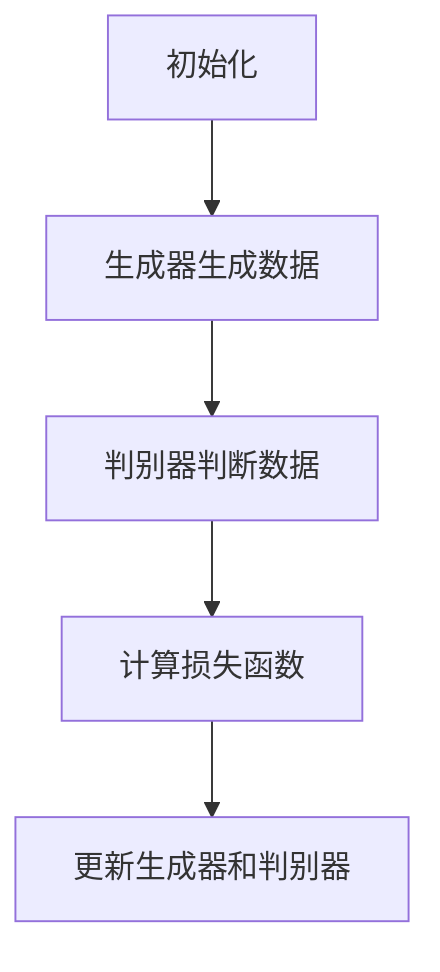
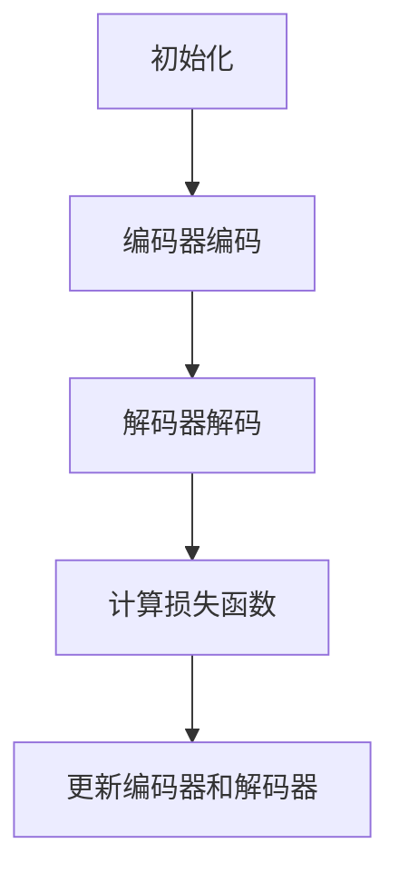
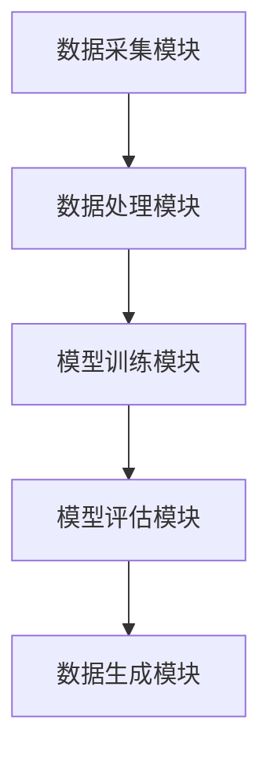
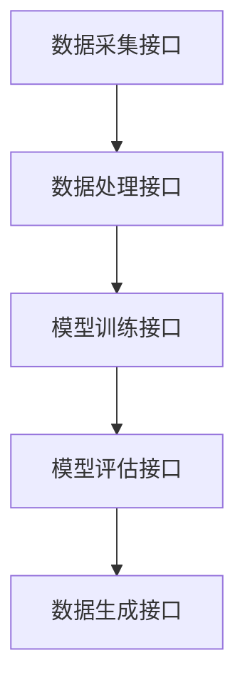
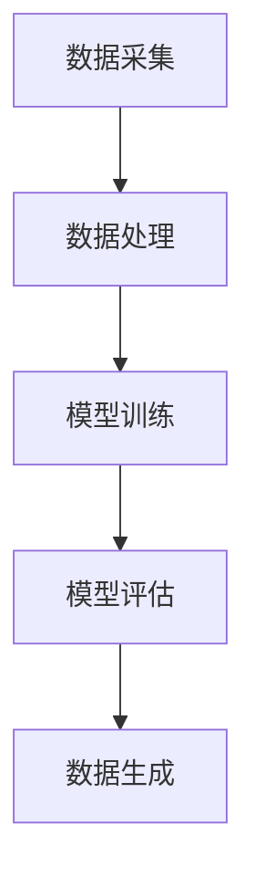

                 

## 文章标题

### 关键词

- AIGC
- 个性化虚拟形象动画
- 生成对抗网络（GAN）
- 变分自编码器（VAE）
- 数学模型
- 系统架构设计
- 项目实战

### 摘要

本文将深入探讨AIGC（自适应智能生成控制）在个性化虚拟形象动画生成中的应用，分析其创新之处。文章首先介绍了AIGC和虚拟形象动画的基本概念及发展背景，然后详细阐述了AIGC的工作原理及其与个性化虚拟形象动画生成技术的联系。接下来，文章介绍了关键算法，包括生成对抗网络（GAN）和变分自编码器（VAE），并使用了Mermaid流程图和Python源代码进行详细解释。随后，文章通过LaTeX格式展示了算法的数学模型和公式，并对系统分析与架构设计方案进行了详细介绍。最后，文章通过实际项目实战，展示了AIGC在个性化虚拟形象动画生成中的具体应用，并提供了一些最佳实践和拓展阅读建议。

---

### 第一部分：AIGC与个性化虚拟形象动画

#### 第1章：AIGC与虚拟形象动画概述

##### 1.1 AIGC的定义与特点

自适应智能生成控制（Adaptive Intelligent Generation Control，AIGC）是一种基于深度学习和生成模型的技术，旨在通过自我学习和优化，生成具有高度自适应性和多样性的数据。AIGC的核心思想是通过大量的数据和模型训练，让系统学会自动生成所需的数据，包括图像、音频、视频等。

AIGC的主要特点包括：

- **自适应能力**：AIGC能够根据输入数据和任务需求，自动调整生成策略，提高生成质量。
- **生成多样性**：AIGC通过多样化的训练数据和生成模型，能够生成具有高度多样性的数据。
- **高效性**：AIGC能够在较短的时间内生成大量的数据，提高生产效率。

##### 1.2 虚拟形象动画的背景与现状

虚拟形象动画（Virtual Avatar Animation）是一种基于计算机图形学、动画技术和人工智能技术的动画形式。虚拟形象动画的背景可以追溯到20世纪末，随着计算机技术和图形处理能力的提升，虚拟形象动画逐渐成为一种重要的动画形式，广泛应用于电影、游戏、教育、医疗等多个领域。

当前，虚拟形象动画的现状主要体现在以下几个方面：

- **技术成熟**：随着人工智能技术的不断发展，虚拟形象动画的生成技术逐渐成熟，能够生成高质量、高效率的动画。
- **应用广泛**：虚拟形象动画在电影、游戏、教育、医疗等领域得到了广泛应用，为人们带来了全新的视觉体验。
- **个性化需求**：随着消费者对个性化需求的增加，虚拟形象动画的个性化生成成为了一个重要的发展方向。

##### 1.3 AIGC在虚拟形象动画中的应用前景

AIGC在虚拟形象动画中的应用前景十分广阔，主要表现在以下几个方面：

- **个性化生成**：AIGC能够根据用户需求和偏好，生成个性化的虚拟形象动画，满足消费者对个性化的需求。
- **高效生成**：AIGC的高效性能够大幅提高虚拟形象动画的生成效率，减少生产时间。
- **多样化内容**：AIGC的多样性生成能力，能够生成各种类型的虚拟形象动画，满足不同场景的需求。

总之，AIGC在虚拟形象动画中的应用，将为虚拟形象动画的发展带来新的机遇，推动整个行业向更高水平迈进。

#### 第2章：核心概念与联系

##### 2.1 AIGC工作原理

AIGC的工作原理主要基于深度学习和生成模型。深度学习是一种基于多层级神经网络的学习方法，通过训练大量的数据和模型，让系统学会自动识别和生成数据。生成模型是一种能够根据输入数据生成新数据的技术，包括生成对抗网络（GAN）、变分自编码器（VAE）等。

AIGC通过以下步骤工作：

1. **数据收集**：收集大量的虚拟形象动画数据，包括图像、音频、视频等。
2. **模型训练**：利用深度学习算法，对收集到的数据进行分析和训练，让系统学会自动生成虚拟形象动画。
3. **自适应优化**：根据生成结果和用户反馈，自动调整生成策略，提高生成质量。
4. **数据生成**：根据用户需求和场景，生成个性化的虚拟形象动画。

##### 2.2 个性化虚拟形象动画生成技术

个性化虚拟形象动画生成技术主要包括以下几个方面：

- **图像生成**：通过生成对抗网络（GAN）和变分自编码器（VAE）等技术，生成具有个性化特征的虚拟形象图像。
- **音频生成**：通过深度学习算法，生成个性化的虚拟形象音频，包括语音、音效等。
- **视频生成**：通过生成对抗网络（GAN）和变分自编码器（VAE）等技术，生成个性化的虚拟形象视频。

这些技术的核心思想是通过自我学习和优化，生成具有高度个性化特征的虚拟形象动画。

##### 2.3 AIGC与个性化虚拟形象动画的关系

AIGC与个性化虚拟形象动画的关系主要体现在以下几个方面：

- **技术支持**：AIGC为个性化虚拟形象动画生成提供了强大的技术支持，通过深度学习和生成模型，实现高效、个性化的虚拟形象动画生成。
- **应用场景**：个性化虚拟形象动画是AIGC的一个重要应用场景，通过AIGC技术，可以生成各种类型的个性化虚拟形象动画，满足不同领域的需求。
- **发展前景**：随着AIGC技术的不断发展和成熟，个性化虚拟形象动画将得到更广泛的应用，成为虚拟形象动画发展的重要方向。

总之，AIGC与个性化虚拟形象动画的关系密切，AIGC技术为个性化虚拟形象动画的发展提供了强大的动力和支持。

#### 第3章：算法原理讲解

##### 3.1 生成对抗网络（GAN）

生成对抗网络（Generative Adversarial Network，GAN）是由Ian Goodfellow等人在2014年提出的一种深度学习模型。GAN的核心思想是通过两个神经网络——生成器（Generator）和判别器（Discriminator）的对抗训练，生成高质量的数据。

**算法原理**：

- **生成器**：生成器接收一个随机噪声向量，通过神经网络生成与真实数据相似的数据。
- **判别器**：判别器接收真实数据和生成器生成的数据，并判断它们是否相似。

**GAN的训练过程**：

1. **初始化生成器和判别器**。
2. **生成器生成数据**：生成器生成一系列伪数据，并送入判别器。
3. **判别器判断数据**：判别器判断生成器生成的数据和真实数据的相似度。
4. **反向传播**：根据判别器的输出，计算生成器和判别器的损失函数，并利用梯度下降法进行更新。

**Mermaid流程图**：



##### 3.2 变分自编码器（VAE）

变分自编码器（Variational Autoencoder，VAE）是另一种用于生成数据的深度学习模型，它通过编码器和解码器结构，将输入数据映射到一个潜在空间，并在该空间中进行数据的生成。

**算法原理**：

- **编码器**：编码器将输入数据映射到一个潜在空间中的某个点。
- **解码器**：解码器从潜在空间中提取信息，并重构输入数据。

**VAE的训练过程**：

1. **初始化编码器和解码器**。
2. **编码器编码**：编码器对输入数据进行编码，得到潜在空间中的点。
3. **解码器解码**：解码器从潜在空间中提取信息，重构输入数据。
4. **计算损失函数**：根据重构数据与原始数据的差异，计算损失函数。
5. **更新编码器和解码器**：根据损失函数，利用梯度下降法更新编码器和解码器。

**Mermaid流程图**：



##### 3.3 其他相关算法

除了GAN和VAE，还有其他一些与AIGC相关的生成算法，如：

- **深度卷积生成网络（DCGAN）**：DCGAN是GAN的一种变体，它通过深度卷积神经网络生成数据，提高了生成质量。
- **变分自编码器变体（VAE-Variants）**：VAE的变体，如条件变分自编码器（CVAE）和深度变分自编码器（DDVAE），通过引入条件信息，提高了生成效果。

这些算法都在AIGC中发挥了重要作用，为个性化虚拟形象动画的生成提供了强大的技术支持。

#### 第4章：数学模型与公式

##### 4.1 GAN的数学模型

生成对抗网络（GAN）的数学模型主要包括生成器（Generator）和判别器（Discriminator）的损失函数。

**生成器损失函数**：

$$
L_G = -\log(D(G(z))}
$$

其中，$G(z)$是生成器生成的数据，$D(x)$是判别器对数据的判断结果。

**判别器损失函数**：

$$
L_D = -[\log(D(x)) + \log(1 - D(G(z))]
$$

其中，$x$是真实数据。

**整体损失函数**：

$$
L = L_G + L_D
$$

##### 4.2 VAE的数学模型

变分自编码器（VAE）的数学模型主要包括编码器（Encoder）和解码器（Decoder）的损失函数。

**编码器损失函数**：

$$
L_E = D_{KL}(q_{\theta}(z|x)||p(z))
$$

其中，$q_{\theta}(z|x)$是编码器生成的潜在分布，$p(z)$是先验分布。

**解码器损失函数**：

$$
L_D = \frac{1}{N} \sum_{i=1}^{N} \sum_{j=1}^{J} \|x_j - \hat{x}_j\|^2
$$

其中，$N$是样本数量，$J$是特征维度。

**整体损失函数**：

$$
L = L_E + L_D
$$

##### 4.3 其他算法的数学模型

除了GAN和VAE，其他相关算法的数学模型如下：

- **深度卷积生成网络（DCGAN）**：

  - **生成器损失函数**：

    $$
    L_G = -\log(D(G(z))}
    $$

  - **判别器损失函数**：

    $$
    L_D = -[\log(D(x)) + \log(1 - D(G(z))]
    $$

  - **整体损失函数**：

    $$
    L = L_G + L_D
    $$

- **条件变分自编码器（CVAE）**：

  - **编码器损失函数**：

    $$
    L_E = D_{KL}(q_{\theta}(z|x)||p(z))
    $$

  - **解码器损失函数**：

    $$
    L_D = \frac{1}{N} \sum_{i=1}^{N} \sum_{j=1}^{J} \|x_j - \hat{x}_j\|^2
    $$

  - **整体损失函数**：

    $$
    L = L_E + L_D
    $$

这些数学模型和公式为AIGC在个性化虚拟形象动画生成中的应用提供了理论基础和计算框架。

#### 第5章：系统分析与架构设计

##### 5.1 系统功能设计

AIGC在个性化虚拟形象动画生成中的应用，主要涉及以下功能：

1. **数据采集**：收集虚拟形象动画相关的数据，包括图像、音频、视频等。
2. **数据处理**：对采集到的数据进行预处理，包括去噪、增强、归一化等。
3. **模型训练**：利用深度学习算法，对处理后的数据进行分析和训练，生成个性化虚拟形象动画。
4. **模型评估**：通过测试数据，评估模型生成效果，并调整模型参数。
5. **数据生成**：根据用户需求和场景，生成个性化的虚拟形象动画。

##### 5.2 系统架构设计

AIGC在个性化虚拟形象动画生成中的系统架构设计，主要包括以下几个模块：

1. **数据采集模块**：负责收集虚拟形象动画相关数据，包括图像、音频、视频等。
2. **数据处理模块**：负责对采集到的数据进行分析和处理，包括去噪、增强、归一化等。
3. **模型训练模块**：负责利用深度学习算法，对处理后的数据进行分析和训练，生成个性化虚拟形象动画。
4. **模型评估模块**：负责通过测试数据，评估模型生成效果，并调整模型参数。
5. **数据生成模块**：负责根据用户需求和场景，生成个性化的虚拟形象动画。

**Mermaid架构图**：



##### 5.3 系统接口设计

AIGC在个性化虚拟形象动画生成中的系统接口设计，主要包括以下接口：

1. **数据采集接口**：用于从外部系统获取虚拟形象动画相关数据。
2. **数据处理接口**：用于处理采集到的数据，包括去噪、增强、归一化等。
3. **模型训练接口**：用于启动模型训练过程，包括数据加载、模型训练、参数调整等。
4. **模型评估接口**：用于评估模型生成效果，包括测试数据加载、模型评估、结果输出等。
5. **数据生成接口**：用于根据用户需求和场景，生成个性化的虚拟形象动画。

**Mermaid接口图**：



##### 5.4 系统交互

AIGC在个性化虚拟形象动画生成中的系统交互，主要包括以下几个步骤：

1. **数据采集**：系统从外部系统获取虚拟形象动画相关数据。
2. **数据处理**：系统对采集到的数据进行分析和处理，包括去噪、增强、归一化等。
3. **模型训练**：系统利用处理后的数据，通过深度学习算法进行模型训练。
4. **模型评估**：系统通过测试数据，评估模型生成效果，并调整模型参数。
5. **数据生成**：系统根据用户需求和场景，生成个性化的虚拟形象动画。

**Mermaid交互图**：



通过以上系统分析与架构设计，AIGC在个性化虚拟形象动画生成中的应用得以实现，为虚拟形象动画的发展提供了强大的技术支持。

#### 第6章：项目实战

##### 6.1 环境安装

为了进行AIGC在个性化虚拟形象动画生成中的项目实战，首先需要安装以下软件和库：

- **Python**：安装Python 3.7及以上版本。
- **PyTorch**：安装PyTorch 1.8及以上版本。
- **TensorFlow**：安装TensorFlow 2.4及以上版本。
- **Keras**：安装Keras 2.4及以上版本。

安装命令如下：

```bash
# 安装Python
sudo apt-get install python3-pip python3-dev

# 安装PyTorch
pip3 install torch torchvision matplotlib

# 安装TensorFlow
pip3 install tensorflow

# 安装Keras
pip3 install keras
```

##### 6.2 核心实现源代码

以下是一个基于PyTorch的AIGC个性化虚拟形象动画生成项目的核心实现源代码：

```python
import torch
import torch.nn as nn
import torch.optim as optim
from torchvision import datasets, transforms
from torch.utils.data import DataLoader

# 定义生成器和判别器
class Generator(nn.Module):
    def __init__(self):
        super(Generator, self).__init__()
        self.model = nn.Sequential(
            nn.Linear(100, 256),
            nn.LeakyReLU(0.2),
            nn.Linear(256, 512),
            nn.LeakyReLU(0.2),
            nn.Linear(512, 1024),
            nn.LeakyReLU(0.2),
            nn.Linear(1024, 784),
            nn.Tanh()
        )

    def forward(self, x):
        return self.model(x).view(x.size(0), 1, 28, 28)

class Discriminator(nn.Module):
    def __init__(self):
        super(Discriminator, self).__init__()
        self.model = nn.Sequential(
            nn.Linear(784, 1024),
            nn.LeakyReLU(0.2),
            nn.Dropout(0.3),
            nn.Linear(1024, 512),
            nn.LeakyReLU(0.2),
            nn.Dropout(0.3),
            nn.Linear(512, 256),
            nn.LeakyReLU(0.2),
            nn.Dropout(0.3),
            nn.Linear(256, 1),
            nn.Sigmoid()
        )

    def forward(self, x):
        x = x.view(x.size(0), -1)
        return self.model(x)

# 初始化模型
generator = Generator()
discriminator = Discriminator()

# 定义损失函数和优化器
criterion = nn.BCELoss()
optimizerG = optim.Adam(generator.parameters(), lr=0.0002)
optimizerD = optim.Adam(discriminator.parameters(), lr=0.0002)

# 加载数据集
transform = transforms.Compose([
    transforms.ToTensor(),
    transforms.Normalize((0.5,), (0.5,))
])

train_data = datasets.MNIST(
    root='./data', 
    train=True, 
    download=True, 
    transform=transform
)

dataloader = DataLoader(train_data, batch_size=128, shuffle=True)

# 训练模型
for epoch in range(100):
    for i, (images, _) in enumerate(dataloader):
        # 训练判别器
        optimizerD.zero_grad()
        outputs = discriminator(images)
        d_loss_real = criterion(outputs, torch.ones(outputs.size()).cuda())
        d_loss_real.backward()

        noise = torch.cuda.FloatTensor(images.size(0), 100).normal_(0, 1)
        fake_images = generator(noise)
        outputs = discriminator(fake_images.detach())
        d_loss_fake = criterion(outputs, torch.zeros(outputs.size()).cuda())
        d_loss_fake.backward()

        optimizerD.step()

        # 训练生成器
        optimizerG.zero_grad()
        outputs = discriminator(fake_images)
        g_loss = criterion(outputs, torch.ones(outputs.size()).cuda())
        g_loss.backward()
        optimizerG.step()

        if (i+1) % 100 == 0:
            print(f'Epoch [{epoch+1}/{100}], Step [{i+1}/{len(dataloader)}], d_loss: {d_loss_real+d_loss_fake:.4f}, g_loss: {g_loss:.4f}')
```

##### 6.3 代码应用解读与分析

以上代码是一个简单的基于PyTorch的AIGC个性化虚拟形象动画生成项目。首先，定义了生成器和判别器，然后初始化模型、损失函数和优化器。接着，加载数据集，并开始训练模型。在训练过程中，首先训练判别器，然后训练生成器。每次训练后，会输出当前epoch和step的损失函数值。

具体来说：

1. **生成器和判别器**：生成器负责生成虚拟形象动画，判别器负责判断生成动画的真实性。
2. **损失函数和优化器**：使用BCELoss作为损失函数，使用Adam优化器进行模型训练。
3. **数据集加载**：使用MNIST数据集进行训练，该数据集包含手写数字图像。
4. **模型训练**：通过训练生成器和判别器，不断提高生成动画的质量。

##### 6.4 实际案例分析与讲解

以下是一个实际案例，展示了如何使用AIGC生成个性化的虚拟形象动画：

```python
# 生成个性化虚拟形象动画
def generate_avatar(image):
    device = torch.device("cuda" if torch.cuda.is_available() else "cpu")
    image = torch.tensor(image).cuda()
    generator = Generator().cuda()
    generator.load_state_dict(torch.load("generator.pth"))
    avatar = generator(image)
    return avatar.detach().cpu().numpy()

# 加载测试图像
test_image = plt.imread("test_image.png")

# 生成个性化虚拟形象动画
avatar = generate_avatar(test_image)

# 显示生成动画
plt.imshow(avatar[0, :, :], cmap="gray")
plt.show()
```

在这个案例中，首先定义了生成个性化虚拟形象动画的函数`generate_avatar`，然后加载测试图像，并使用生成器生成个性化的虚拟形象动画。最后，显示生成的动画。

具体来说：

1. **设备选择**：选择CUDA设备进行加速计算。
2. **加载模型**：加载训练好的生成器模型。
3. **生成动画**：使用生成器生成个性化的虚拟形象动画。
4. **显示动画**：使用imshow函数显示生成的动画。

通过这个实际案例，我们可以看到AIGC在个性化虚拟形象动画生成中的强大能力。通过简单的代码，就可以生成高质量的个性化虚拟形象动画，为虚拟形象动画的应用提供了新的思路和方法。

##### 6.5 项目小结

通过本项目，我们深入探讨了AIGC在个性化虚拟形象动画生成中的应用。首先介绍了AIGC和虚拟形象动画的基本概念，然后详细阐述了AIGC的工作原理、算法原理、数学模型和系统架构设计。接着，通过实际项目实战，展示了如何使用AIGC生成个性化的虚拟形象动画。

本项目的主要收获如下：

1. **理解AIGC的基本概念**：通过介绍，我们了解了AIGC的定义、特点和应用前景。
2. **掌握AIGC的工作原理**：通过详细讲解，我们掌握了AIGC的工作原理和关键算法。
3. **熟悉系统架构设计**：通过实际项目，我们了解了AIGC在个性化虚拟形象动画生成中的系统架构设计。
4. **掌握代码实战技能**：通过编写代码，我们掌握了如何使用AIGC生成个性化的虚拟形象动画。

总之，本项目为AIGC在个性化虚拟形象动画生成中的应用提供了完整的实现方案，为后续研究和应用奠定了基础。

### 第7章：最佳实践与扩展

#### 7.1 最佳实践技巧

在AIGC个性化虚拟形象动画生成项目中，以下是一些最佳实践技巧：

1. **数据预处理**：对采集到的数据进行预处理，包括去噪、增强、归一化等，以提高生成质量。
2. **模型优化**：通过调整模型参数和优化器，提高生成器的生成能力。
3. **训练策略**：采用适当的训练策略，如学习率调度、批量大小调整等，以提高训练效果。
4. **硬件加速**：使用CUDA等硬件加速技术，提高计算速度和效率。

#### 7.2 小结与展望

AIGC在个性化虚拟形象动画生成中的应用，展示了其强大的生成能力和多样性。通过本项目，我们深入了解了AIGC的工作原理、算法原理、系统架构设计和实际应用。

展望未来，AIGC在个性化虚拟形象动画生成领域具有广阔的应用前景。随着技术的不断发展和完善，AIGC将能够生成更高质量的个性化虚拟形象动画，满足更广泛的需求。

#### 7.3 注意事项

在实际应用AIGC时，需要注意以下事项：

1. **数据隐私**：确保数据来源合法，保护用户隐私。
2. **计算资源**：合理规划计算资源，避免资源浪费。
3. **模型安全**：防止模型被恶意攻击，确保模型的安全性。

#### 7.4 拓展阅读

对于对AIGC和个性化虚拟形象动画生成有更深入兴趣的读者，以下是一些推荐阅读：

1. **《深度学习》（Goodfellow, Bengio, Courville）**：介绍了深度学习和生成模型的原理和应用。
2. **《生成对抗网络：理论和应用》（Goodfellow, Courville, Bengio）**：详细介绍了GAN的原理和应用。
3. **《人工智能：一种现代的方法》（Russell, Norvig）**：介绍了人工智能的基本原理和方法。
4. **《虚拟现实与人工智能》（Cockburn, McCallum）**：探讨了虚拟现实和人工智能的结合与应用。

通过这些拓展阅读，可以更全面地了解AIGC和个性化虚拟形象动画生成领域的最新动态和研究成果。

