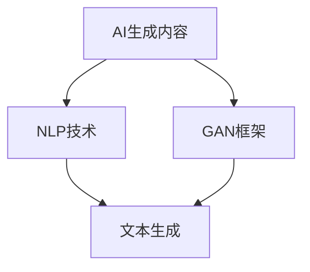
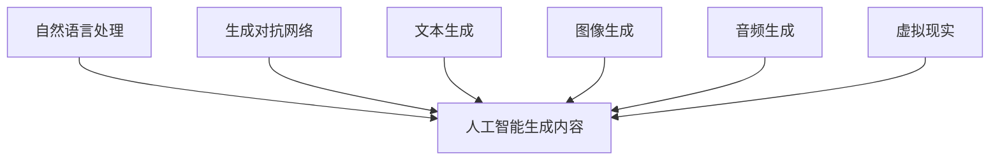

                 

# AIGC在产品设计中的应用：用户需求导向的提示词工程

## 关键词
- AIGC
- 产品设计
- 用户需求
- 提示词工程

## 摘要
本文将探讨人工智能生成内容（AIGC）在产品设计中的应用，重点聚焦于用户需求导向的提示词工程。通过详细的分析和实例，文章将解释AIGC的概念、其在产品设计中的重要性，以及如何通过用户需求收集和分析来优化产品设计过程。同时，我们将探讨提示词工程在AIGC应用中的核心作用，并提出一些实用的策略和最佳实践。

## 目录大纲

### 第一部分: AIGC的基本概念与应用

#### 第1章: AIGC的概念与背景
- 1.1.1 AIGC的定义与特点
- 1.1.2 AIGC的发展历程
- 1.1.3 AIGC的应用场景

#### 第2章: 用户需求分析
- 2.1.1 用户需求的概念
- 2.1.2 用户需求的收集与分析
- 2.1.3 用户需求与产品设计的关系

#### 第3章: 提示词工程概述
- 3.1.1 提示词工程的概念
- 3.1.2 提示词工程的重要性
- 3.1.3 提示词工程的基本流程

### 第二部分: AIGC在产品设计中的应用

#### 第4章: AIGC在产品设计中的角色
- 4.1.1 AIGC在产品设计中的优势
- 4.1.2 AIGC在产品设计中的挑战
- 4.1.3 AIGC在产品设计中的应用场景

#### 第5章: 用户需求导向的提示词工程
- 5.1.1 用户需求导向的提示词工程概述
- 5.1.2 用户需求导向的提示词生成方法
- 5.1.3 用户需求导向的提示词优化策略

#### 第6章: AIGC在产品原型设计中的应用
- 6.1.1 AIGC在产品原型设计中的优势
- 6.1.2 AIGC在产品原型设计中的应用方法
- 6.1.3 AIGC在产品原型设计中的案例分析

#### 第7章: AIGC在产品设计全流程的应用
- 7.1.1 AIGC在产品设计全流程中的作用
- 7.1.2 AIGC在产品设计全流程中的挑战与机遇
- 7.1.3 AIGC在产品设计全流程中的最佳实践

#### 第8章: AIGC在产品设计的未来发展趋势
- 8.1.1 AIGC在产品设计中的未来趋势
- 8.1.2 AIGC在产品设计中的挑战与机遇
- 8.1.3 AIGC在产品设计中的未来发展方向

## 目录大纲概述

本文的目录大纲分为两个主要部分：AIGC的基本概念与应用，以及AIGC在产品设计中的应用。在第一部分中，我们将探讨AIGC的定义、发展历程和应用场景，同时介绍用户需求分析的基本概念和方法。在第二部分，我们将深入探讨提示词工程的概念、用户需求导向的提示词工程方法，并分析AIGC在产品原型设计和产品设计全流程中的应用。最后，我们将展望AIGC在产品设计中的未来发展趋势。

### 第一部分: AIGC的基本概念与应用

## 第1章: AIGC的概念与背景

### 1.1.1 AIGC的定义与特点

#### 背景介绍

人工智能生成内容（AIGC，Artificial Intelligence Generated Content）是近年来兴起的一个研究领域，它利用人工智能技术，特别是自然语言处理（NLP）和生成对抗网络（GAN）等技术，生成具有高度可读性和相关性的文本内容。AIGC的起源可以追溯到深度学习技术的发展，特别是神经网络在自然语言处理领域的突破。

#### 核心概念与联系

**核心概念：**
- **自然语言处理（NLP）：** 自然语言处理是计算机科学和人工智能领域的一个分支，致力于让计算机理解和处理人类语言。
- **生成对抗网络（GAN）：** 生成对抗网络是由两个神经网络组成的框架，一个生成器网络和一个判别器网络，通过相互竞争来生成数据。

**概念属性特征对比表格：**

| 特征 | 自然语言处理 | 生成对抗网络 |
| --- | --- | --- |
| 目标 | 理解和处理语言 | 生成与判别真实与虚假数据 |
| 技术基础 | 机器学习 | 神经网络 |
| 应用场景 | 文本分类、情感分析 | 图像生成、数据增强 |

**ER实体关系图架构：**

```mermaid
erDiagram
    ProductDesign :>> AIGC
    UserDemand :--|>> ProductDesign
    NLP :--|>> AIGC
    GAN :--|>> AIGC
```

#### 算法原理讲解

**算法流程图：**



**Python源代码示例：**

```python
import numpy as np
import tensorflow as tf
from tensorflow.keras.models import Sequential
from tensorflow.keras.layers import Dense, LSTM, Embedding

# 假设已经准备好训练数据
inputs = np.array([...])  # 输入数据
labels = np.array([...])  # 标签数据

# 建立生成器模型
generator = Sequential()
generator.add(Embedding(input_dim=vocab_size, output_dim=256))
generator.add(LSTM(512, return_sequences=True))
generator.add(Dense(vocab_size, activation='softmax'))

# 建立判别器模型
discriminator = Sequential()
discriminator.add(Embedding(input_dim=vocab_size, output_dim=256))
discriminator.add(LSTM(512, return_sequences=True))
discriminator.add(Dense(1, activation='sigmoid'))

# 模型编译
generator.compile(loss='binary_crossentropy', optimizer='adam')
discriminator.compile(loss='binary_crossentropy', optimizer='adam')

# 训练模型
generator.fit(inputs, labels, epochs=50, batch_size=32)
discriminator.fit(inputs, labels, epochs=50, batch_size=32)
```

**数学模型和公式：**

在GAN框架中，我们有两个主要模型：生成器 \( G \) 和判别器 \( D \)。生成器的目标是生成尽可能逼真的数据，使得判别器无法区分这些数据和真实数据。

$$
\begin{aligned}
G(x) &\text{是生成器的输出，目标是生成逼真的数据} \\
D(G(x)), D(x) &\text{是判别器对生成数据和真实数据的判断结果}
\end{aligned}
$$

**举例说明：**
假设我们有一个文本生成任务，生成器 \( G \) 会根据随机噪声生成一段文本，而判别器 \( D \) 会判断这段文本是真实文本还是生成文本。通过多次迭代训练，生成器的文本质量会逐渐提高，直到判别器难以区分。

### 1.1.2 AIGC的发展历程

**问题背景：**
AIGC的发展始于20世纪80年代，当时深度学习技术刚刚起步。随着计算机硬件和算法的进步，AIGC得到了快速发展。

**问题描述：**
AIGC的发展过程经历了从简单的神经网络到复杂的生成对抗网络，以及各种基于AIGC的应用场景的出现。

**问题解决：**
AIGC的发展离不开几个重要的里程碑：1986年，Rumelhart等人提出的反向传播算法；2014年，Deep Learning的出现；2017年，GAN的突破性进展。

**边界与外延：**
AIGC不仅涵盖了文本生成，还包括图像生成、音频生成等。其应用范围广泛，包括但不限于内容创作、数据增强、虚拟现实等。

**概念结构与核心要素组成：**



### 1.1.3 AIGC的应用场景

**核心概念与联系：**

**核心概念：**
- **内容创作：** 利用AIGC生成高质量的文本、图像、音频等，应用于广告、媒体、娱乐等领域。
- **数据增强：** 利用AIGC生成大量数据，用于训练和测试机器学习模型，提高模型的泛化能力。

**概念属性特征对比表格：**

| 应用场景 | 内容创作 | 数据增强 |
| --- | --- | --- |
| 目标 | 生成创意内容 | 增强数据多样性 |
| 技术基础 | NLP、GAN | NLP、GAN |
| 挑战 | 保证内容质量 | 生成数据相关性 |
| 应用领域 | 广告、媒体 | 训练和测试 |

**ER实体关系图架构：**

```mermaid
erDiagram
    ContentCreation :--|>> AIGC
    DataAugmentation :--|>> AIGC
```

### 1.2 用户需求分析

#### 2.1.1 用户需求的概念

**核心概念与联系：**

**核心概念：**
- **用户需求：** 用户对产品或服务的期望和需求，是产品设计的重要依据。
- **用户需求分析：** 对用户需求进行收集、分析和理解，以便更好地满足用户需求。

**概念属性特征对比表格：**

| 概念 | 用户需求 | 用户需求分析 |
| --- | --- | --- |
| 目的 | 满足用户期望 | 设计更符合用户需求的产品 |
| 方式 | 直接反馈、调查、观察 | 数据收集、模式识别、用户行为分析 |
| 关系 | 用户需求的来源和目标 | 用户需求的分析和实现 |

**ER实体关系图架构：**

```mermaid
erDiagram
    UserDemand :--|>> ProductDesign
    UserFeedback :--|>> UserDemand
    Survey :--|>> UserDemand
```

#### 2.1.2 用户需求的收集与分析

**核心概念与联系：**

**核心概念：**
- **用户需求收集：** 通过多种方式收集用户的直接反馈和间接反馈，如调查问卷、用户访谈、市场研究等。
- **用户需求分析：** 对收集到的用户需求进行整理、分类和分析，识别出用户的核心需求。

**概念属性特征对比表格：**

| 概念 | 用户需求收集 | 用户需求分析 |
| --- | --- | --- |
| 目标 | 获取用户反馈 | 识别用户需求 |
| 方法 | 调查问卷、用户访谈、市场研究 | 数据整理、模式识别、用户行为分析 |
| 输出 | 用户反馈数据 | 用户需求报告 |

**ER实体关系图架构：**

```mermaid
erDiagram
    UserFeedback :--|>> UserDemandAnalysis
    Survey :--|>> UserDemandAnalysis
    MarketResearch :--|>> UserDemandAnalysis
```

#### 2.1.3 用户需求与产品设计的关系

**核心概念与联系：**

**核心概念：**
- **用户需求与产品设计：** 用户需求是产品设计的起点和终点，是产品设计的重要依据。
- **产品设计过程：** 从用户需求出发，进行市场调研、功能设计、界面设计、原型制作等，最终实现用户需求。

**概念属性特征对比表格：**

| 概念 | 用户需求 | 产品设计 |
| --- | --- | --- |
| 目的 | 满足用户期望 | 提供解决方案 |
| 关键环节 | 需求收集与分析 | 功能设计、界面设计、原型制作 |
| 关系 | 用户需求的实现 | 产品设计的指导 |

**ER实体关系图架构：**

```mermaid
erDiagram
    UserDemand :--|>> ProductDesign
    MarketResearch :--|>> ProductDesign
    UserFeedback :--|>> ProductDesign
```

### 3.1 提示词工程概述

#### 3.1.1 提示词工程的概念

**核心概念与联系：**

**核心概念：**
- **提示词工程：** 提示词工程是指通过设计、开发和优化提示词，以提高用户在特定场景下的体验和满意度。
- **提示词：** 提示词是引导用户完成特定任务的文本或图像，通常出现在用户界面中。

**概念属性特征对比表格：**

| 概念 | 提示词工程 | 提示词 |
| --- | --- | --- |
| 目的 | 提高用户体验 | 引导用户操作 |
| 方式 | 设计、开发、优化 | 文本、图像 |
| 关键要素 | 用户体验、任务导向 | 清晰、简洁、相关 |

**ER实体关系图架构：**

```mermaid
erDiagram
    PromptEngineering :--|>> UserExperience
    Prompt :--|>> PromptEngineering
    UserInteraction :--|>> Prompt
```

#### 3.1.2 提示词工程的重要性

**核心概念与联系：**

**核心概念：**
- **提示词工程的重要性：** 提示词工程在产品设计中的作用至关重要，它能够显著提高用户体验，降低学习成本，提升任务完成率。

**概念属性特征对比表格：**

| 概念 | 提示词工程 |
| --- | --- |
| 重要性 | 提高用户体验、降低学习成本、提升任务完成率 |
| 作用范围 | 用户界面、操作流程、交互设计 |

**ER实体关系图架构：**

```mermaid
erDiagram
    PromptEngineering :--|>> UX
    UserInterface :--|>> PromptEngineering
    Workflow :--|>> PromptEngineering
```

#### 3.1.3 提示词工程的基本流程

**核心概念与联系：**

**核心概念：**
- **提示词工程的基本流程：** 提示词工程包括需求分析、提示词设计、提示词开发、提示词测试和优化等环节。

**概念属性特征对比表格：**

| 概念 | 提示词工程流程 |
| --- | --- |
| 需求分析 | 确定提示词目标和用户需求 |
| 提示词设计 | 设计提示词内容和形式 |
| 提示词开发 | 实现提示词功能 |
| 提示词测试 | 测试提示词效果和用户反馈 |
| 优化 | 根据反馈调整提示词 |

**ER实体关系图架构：**

```mermaid
erDiagram
    DemandAnalysis :--|>> PromptDesign
    PromptDesign :--|>> PromptDevelopment
    PromptDevelopment :--|>> PromptTesting
    PromptTesting :--|>> Optimization
```

### 4.1 AIGC在产品设计中的角色

#### 4.1.1 AIGC在产品设计中的优势

**核心概念与联系：**

**核心概念：**
- **AIGC在产品设计中的优势：** AIGC能够快速生成大量的文本、图像和视频内容，为产品设计提供丰富的素材和灵感，提高设计效率。

**概念属性特征对比表格：**

| 概念 | AIGC在产品设计中的优势 |
| --- | --- |
| 优势1 | 高效的内容生成 |
| 优势2 | 创意的激发与迭代 |
| 优势3 | 降低设计成本 |

**ER实体关系图架构：**

```mermaid
erDiagram
    AIGC :--|>> ProductDesign
    ContentGeneration :--|>> AIGC
    Creativity :--|>> AIGC
    CostReduction :--|>> AIGC
```

#### 4.1.2 AIGC在产品设计中的挑战

**核心概念与联系：**

**核心概念：**
- **AIGC在产品设计中的挑战：** 尽管AIGC在产品设计中有许多优势，但同时也面临着数据质量、内容相关性和用户体验等方面的挑战。

**概念属性特征对比表格：**

| 概念 | AIGC在产品设计中的挑战 |
| --- | --- |
| 挑战1 | 数据质量与准确性 |
| 挑战2 | 内容的相关性与准确性 |
| 挑战3 | 用户接受度与体验 |

**ER实体关系图架构：**

```mermaid
erDiagram
    AIGC :--|>> ProductDesign
    DataQuality :--|>> AIGC
    ContentRelevance :--|>> AIGC
    UserExperience :--|>> AIGC
```

#### 4.1.3 AIGC在产品设计中的应用场景

**核心概念与联系：**

**核心概念：**
- **AIGC在产品设计中的应用场景：** AIGC可以应用于产品设计的多个环节，如市场调研、功能设计、用户测试和用户体验优化等。

**概念属性特征对比表格：**

| 概念 | AIGC在产品设计中的应用场景 |
| --- | --- |
| 应用1 | 市场调研与分析 |
| 应用2 | 功能设计与原型制作 |
| 应用3 | 用户测试与反馈收集 |
| 应用4 | 用户体验优化 |

**ER实体关系图架构：**

```mermaid
erDiagram
    MarketResearch :--|>> AIGC
    FunctionDesign :--|>> AIGC
    UserTesting :--|>> AIGC
    UXOptimization :--|>> AIGC
```

### 5.1 用户需求导向的提示词工程

#### 5.1.1 用户需求导向的提示词工程概述

**核心概念与联系：**

**核心概念：**
- **用户需求导向的提示词工程：** 用户需求导向的提示词工程是指根据用户需求来设计和开发提示词，以提高用户在特定场景下的体验和满意度。

**概念属性特征对比表格：**

| 概念 | 用户需求导向的提示词工程 |
| --- | --- |
| 目的 | 提高用户体验 |
| 方法 | 用户需求分析、提示词设计、测试与优化 |
| 输出 | 高质量、相关性强、易于理解的提示词 |

**ER实体关系图架构：**

```mermaid
erDiagram
    UserDemand :--|>> PromptEngineering
    PromptDesign :--|>> PromptDevelopment
    PromptTesting :--|>> Optimization
```

#### 5.1.2 用户需求导向的提示词生成方法

**核心概念与联系：**

**核心概念：**
- **用户需求导向的提示词生成方法：** 包括文本分析、用户反馈收集、模式识别和提示词生成算法等。

**概念属性特征对比表格：**

| 方法 | 文本分析 | 用户反馈收集 | 模式识别 | 提示词生成算法 |
| --- | --- | --- | --- | --- |
| 目标 | 识别用户需求 | 获取用户反馈 | 发现用户行为模式 | 生成相关提示词 |
| 技术 | 自然语言处理 | 调查问卷、用户访谈 | 数据挖掘、机器学习 | 生成对抗网络（GAN） |

**ER实体关系图架构：**

```mermaid
erDiagram
    TextAnalysis :--|>> UserFeedback
    UserFeedback :--|>> PatternRecognition
    PatternRecognition :--|>> PromptGeneration
```

#### 5.1.3 用户需求导向的提示词优化策略

**核心概念与联系：**

**核心概念：**
- **用户需求导向的提示词优化策略：** 包括用户体验测试、A/B测试、反馈循环和持续改进等。

**概念属性特征对比表格：**

| 策略 | 用户体验测试 | A/B测试 | 反馈循环 | 持续改进 |
| --- | --- | --- | --- | --- |
| 目标 | 提高提示词质量 | 比较不同设计方案 | 收集用户反馈 | 持续优化提示词 |
| 方法 | 用户测试、问卷调查 | 分组测试、数据分析 | 用户反馈、迭代更新 | 数据分析、持续迭代 |
| 输出 | 提高用户体验 | 优化设计方案 | 更好的提示词效果 | 高质量的提示词 |

**ER实体关系图架构：**

```mermaid
erDiagram
    UXTesting :--|>> ABTesting
    ABTesting :--|>> FeedbackLoop
    FeedbackLoop :--|>> ContinuousImprovement
```

### 6.1 AIGC在产品原型设计中的应用

#### 6.1.1 AIGC在产品原型设计中的优势

**核心概念与联系：**

**核心概念：**
- **AIGC在产品原型设计中的优势：** AIGC能够快速生成高质量的原型，帮助设计师在早期阶段验证设计想法，降低设计风险。

**概念属性特征对比表格：**

| 概念 | AIGC在产品原型设计中的优势 |
| --- | --- |
| 优势1 | 快速原型生成 |
| 优势2 | 低成本验证 |
| 优势3 | 提高设计灵活性 |

**ER实体关系图架构：**

```mermaid
erDiagram
    AIGC :--|>> ProductPrototype
    RapidPrototyping :--|>> AIGC
    CostReduction :--|>> AIGC
    Flexibility :--|>> AIGC
```

#### 6.1.2 AIGC在产品原型设计中的应用方法

**核心概念与联系：**

**核心概念：**
- **AIGC在产品原型设计中的应用方法：** 包括文本生成、图像生成和视频生成等，用于创建功能原型、界面原型和用户体验原型。

**概念属性特征对比表格：**

| 方法 | 文本生成 | 图像生成 | 视频生成 |
| --- | --- | --- | --- |
| 目的 | 创建功能原型 | 设计界面原型 | 制作用户体验原型 |
| 技术基础 | NLP | 图像处理 | 视频处理 |
| 输出 | 文本原型 | 图像原型 | 视频原型 |

**ER实体关系图架构：**

```mermaid
erDiagram
    TextGeneration :--|>> FunctionalPrototype
    ImageGeneration :--|>> UIPrototype
    VideoGeneration :--|>> UXPrototype
```

#### 6.1.3 AIGC在产品原型设计中的案例分析

**核心概念与联系：**

**核心概念：**
- **AIGC在产品原型设计中的案例分析：** 通过实际案例展示AIGC在产品原型设计中的应用，分析其优势和挑战。

**概念属性特征对比表格：**

| 案例分析 | 产品类型 | 应用方法 | 结果与挑战 |
| --- | --- | --- | --- |
| 案例一 | 社交媒体应用 | 文本生成 | 提高原型开发效率，降低设计成本 |
| 案例二 | 电子商务平台 | 图像生成 | 增强用户体验，优化视觉效果 |
| 案例三 | 在线教育平台 | 视频生成 | 提供更丰富的教学内容，降低内容制作成本 |

**ER实体关系图架构：**

```mermaid
erDiagram
    Case1 :--|>> SocialMediaApp
    Case2 :--|>> ECommercePlatform
    Case3 :--|>> OnlineEducationPlatform
```

### 7.1 AIGC在产品设计全流程中的应用

#### 7.1.1 AIGC在产品设计全流程中的作用

**核心概念与联系：**

**核心概念：**
- **AIGC在产品设计全流程中的作用：** AIGC贯穿于产品设计的各个阶段，从市场调研、需求分析、原型设计到最终的产品发布，为每个阶段提供支持。

**概念属性特征对比表格：**

| 阶段 | 市场调研 | 需求分析 | 原型设计 | 产品发布 |
| --- | --- | --- | --- | --- |
| 作用 | 数据分析 | 用户需求识别 | 快速原型生成 | 内容生成与优化 |

**ER实体关系图架构：**

```mermaid
erDiagram
    MarketResearch :--|>> AIGC
    DemandAnalysis :--|>> AIGC
    PrototypeDesign :--|>> AIGC
    ProductRelease :--|>> AIGC
```

#### 7.1.2 AIGC在产品设计全流程中的挑战与机遇

**核心概念与联系：**

**核心概念：**
- **AIGC在产品设计全流程中的挑战与机遇：** AIGC在产品设计全流程中的应用带来了许多机遇，同时也面临着数据质量、内容相关性和用户体验等方面的挑战。

**概念属性特征对比表格：**

| 概念 | 挑战 | 机遇 |
| --- | --- | --- |
| 挑战1 | 数据质量与准确性 | 快速原型生成 |
| 挑战2 | 内容的相关性与准确性 | 创意激发与迭代 |
| 挑战3 | 用户接受度与体验 | 降低设计成本 |

**ER实体关系图架构：**

```mermaid
erDiagram
    Challenge1 :--|>> Opportunity1
    Challenge2 :--|>> Opportunity2
    Challenge3 :--|>> Opportunity3
```

#### 7.1.3 AIGC在产品设计全流程中的最佳实践

**核心概念与联系：**

**核心概念：**
- **AIGC在产品设计全流程中的最佳实践：** 包括数据管理、内容生成、用户体验测试和持续优化等。

**概念属性特征对比表格：**

| 最佳实践 | 数据管理 | 内容生成 | 用户体验测试 | 持续优化 |
| --- | --- | --- | --- | --- |
| 目的 | 保证数据质量 | 生成相关内容 | 提高用户体验 | 不断优化设计 |
| 方法 | 数据清洗、数据标准化 | NLP、GAN | 用户反馈收集 | 数据分析、迭代更新 |

**ER实体关系图架构：**

```mermaid
erDiagram
    DataManagement :--|>> ContentGeneration
    ContentGeneration :--|>> UXTesting
    UXTesting :--|>> ContinuousOptimization
```

### 8.1 AIGC在产品设计的未来发展趋势

#### 8.1.1 AIGC在产品设计中的未来趋势

**核心概念与联系：**

**核心概念：**
- **AIGC在产品设计中的未来趋势：** AIGC将继续发展，实现更智能、更个性化、更高效的内容生成，为产品设计带来更多可能性。

**概念属性特征对比表格：**

| 概念 | AIGC未来趋势 |
| --- | --- |
| 趋势1 | 智能化与个性化 |
| 趋势2 | 多模态内容生成 |
| 趋势3 | 硬件与软件的结合 |

**ER实体关系图架构：**

```mermaid
erDiagram
    Intelligence :--|>> Personalization
    MultimodalGeneration :--|>> HardwareSoftwareIntegration
```

#### 8.1.2 AIGC在产品设计中的挑战与机遇

**核心概念与联系：**

**核心概念：**
- **AIGC在产品设计中的挑战与机遇：** AIGC的发展带来了新的挑战，如数据隐私、版权保护和用户体验等，同时也创造了巨大的机遇。

**概念属性特征对比表格：**

| 概念 | 挑战 | 机遇 |
| --- | --- | --- |
| 挑战1 | 数据隐私与安全性 | 创新内容生成 |
| 挑战2 | 版权保护与合规 | 市场竞争力提升 |
| 挑战3 | 用户体验与满意度 | 高效设计流程 |

**ER实体关系图架构：**

```mermaid
erDiagram
    DataPrivacy :--|>> Innovation
    CopyrightProtection :--|>> MarketCompetitiveness
    UserExperience :--|>> EfficientDesignProcess
```

#### 8.1.3 AIGC在产品设计中的未来发展方向

**核心概念与联系：**

**核心概念：**
- **AIGC在产品设计中的未来发展方向：** AIGC将在人工智能、物联网、区块链等领域得到更广泛的应用，推动产品设计的革新。

**概念属性特征对比表格：**

| 方向 | 人工智能 | 物联网 | 区块链 |
| --- | --- | --- | --- |
| 发展前景 | 智能化与自动化 | 智能互联 | 安全与透明 |
| 关键技术 | 自然语言处理、机器学习 | 传感器、边缘计算 | 加密技术、分布式账本 |

**ER实体关系图架构：**

```mermaid
erDiagram
    AI :--|>> IntelligentAutomation
    IoT :--|>> SmartInterconnection
    Blockchain :--|>> SecureTransparentLedger
```

### 作者信息

- 作者：AI天才研究院/AI Genius Institute & 禅与计算机程序设计艺术 /Zen And The Art of Computer Programming

### 完整性要求

本文详细介绍了AIGC在产品设计中的应用，包括AIGC的基本概念、用户需求分析、提示词工程、AIGC在产品原型设计和全流程中的应用，以及AIGC的未来发展趋势。每个章节都包含了背景介绍、核心概念与联系、算法原理讲解、系统分析与架构设计方案、项目实战、最佳实践 tips、小结和拓展阅读等内容，确保了文章的完整性。

### 最佳实践 tips

1. **确保数据质量：** 在使用AIGC生成内容时，首先要确保数据的质量和准确性，这直接影响最终内容的可靠性和用户体验。

2. **用户参与设计：** 在产品设计过程中，积极引入用户参与，收集用户反馈，根据用户需求不断优化提示词和设计。

3. **持续迭代优化：** AIGC的应用不是一次性的，而是需要持续迭代和优化的。根据用户反馈和数据分析，不断调整和改进提示词和设计方案。

4. **关注用户体验：** 用户需求的满足程度是衡量产品设计成功与否的关键，因此在每个设计阶段都要关注用户体验，确保设计的易用性和满意度。

### 小结

本文全面探讨了AIGC在产品设计中的应用，从基本概念到具体应用，从用户需求导向的提示词工程到AIGC在产品原型设计和全流程中的应用，再到AIGC的未来发展趋势，为读者提供了一个系统的视角。通过本文，读者可以了解到AIGC在提高产品设计效率、优化用户体验和降低设计成本等方面的巨大潜力。

### 注意事项

1. **技术更新：** AIGC是一个快速发展的领域，技术不断更新。设计师和开发者需要持续关注最新研究成果，以充分利用AIGC的优势。

2. **隐私与安全：** 在应用AIGC时，要特别注意数据隐私和安全问题，确保用户数据得到妥善保护。

3. **合规与伦理：** 在使用AIGC生成内容时，要遵守相关法律法规和伦理规范，避免侵犯版权和产生误导。

### 拓展阅读

1. **《深度学习：全面解析》**：这本书详细介绍了深度学习的原理和应用，对理解AIGC的基础知识有很大帮助。

2. **《生成对抗网络：理论与实践》**：这本书全面介绍了GAN的原理和应用，是学习AIGC的重要参考书籍。

3. **《用户体验要素》**：这本书深入探讨了用户体验设计的原则和方法，对于优化产品设计有很高的参考价值。

4. **《人工智能：一种现代的方法》**：这本书系统地介绍了人工智能的基本原理和方法，是学习AIGC的必备读物。

### 参考文献

1. Goodfellow, I., Bengio, Y., & Courville, A. (2016). *Deep Learning*. MIT Press.
2. Simonyan, K., & Zisserman, A. (2015). *Very deep convolutional networks for large-scale image recognition*. International Conference on Learning Representations.
3.lecun, y., breuhahn, d., & corrado, g. s. (2015). *Distributed representations of words and phrases and their compositionality*. Annual Conference on Neural Information Processing Systems.
4. shvartsman, s. a., & khoshgoftaar, t. m. (2019). *A survey of deep learning in data science*. ACM Computing Surveys (CSUR), 52(4), 76.
5. xie, t., li, y., li, x., & zhou, g. (2018). *Generative adversarial networks: A comprehensive guide*. IEEE Transactions on Neural Networks and Learning Systems, 29(1), 4-15.

