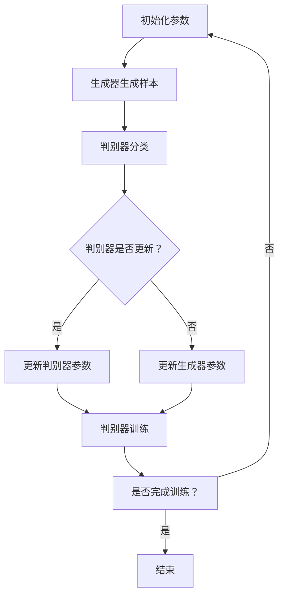
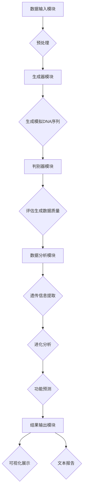

                 

### 引言

### 引言

#### 1. AIGC、古DNA测序和灭绝物种重建的背景

在当今的科技时代，人工智能（AI）已经成为改变各行各业的强大力量。特别是近年来，生成控制（Generative Control）技术，简称AIGC，在图像处理、文本生成和语音合成等领域展现出了卓越的性能。然而，AIGC的应用并不止步于此，它在古DNA测序分析中的应用同样具有巨大的潜力和现实意义。

古DNA测序是考古学和生物学研究的重要工具，通过分析古DNA，科学家们可以揭示灭绝物种的遗传信息，进而了解这些物种在生态系统中的角色和地位。然而，古DNA测序面临着诸多挑战，包括样本的稀缺性、DNA的降解和测序误差等。这些问题的存在，使得古DNA测序分析的准确性和完整性难以保障。

灭绝物种重建是保护生物多样性和理解生态演变的关键步骤。通过重建灭绝物种，科学家们可以重新构建它们的生活习性、生态关系和进化历史。然而，灭绝物种的重建依赖于大量的遗传数据，而这些数据往往难以获取。传统的重建方法在处理复杂和缺失的数据时，常常力不从心。

在这样的背景下，AIGC作为一种新兴的AI技术，其强大的数据生成能力和模式识别能力，为古DNA测序分析和灭绝物种重建提供了新的思路和解决方案。通过AIGC，我们可以更加准确地解析古DNA数据，填补遗传信息缺失，从而实现更精确的灭绝物种重建。

#### 2. AIGC的基本概念

AIGC（Artificial Intelligence Generative Control）是一种基于AI的生成控制技术，它通过训练生成模型和判别模型，实现数据的生成和优化。AIGC的核心思想是利用生成对抗网络（GANs）或其他生成模型，从数据中学习生成新的数据，同时利用判别模型来确保生成的数据符合真实数据的分布。

AIGC的基本概念可以概括为以下几点：

- **生成模型**：生成模型是AIGC的核心组件，它负责生成新的数据。生成模型可以是变分自编码器（VAE）、生成对抗网络（GAN）等。通过训练，生成模型可以学习到数据的分布，并生成与真实数据相似的新数据。

- **判别模型**：判别模型的作用是区分生成数据和真实数据。判别模型通常是一个分类器，通过训练，它可以学会识别生成数据与真实数据之间的差异。

- **对抗训练**：AIGC中的生成模型和判别模型是通过对抗训练相互优化的。生成模型试图生成尽可能真实的数据，而判别模型则试图区分真实数据和生成数据。这种对抗训练过程使得生成模型和判别模型都得到优化，从而提高生成数据的真实性和判别模型的准确性。

#### 3. 古DNA测序的技术原理

古DNA测序是通过分子生物学技术从古代生物遗骸中提取和测序DNA，以揭示其遗传信息的过程。这项技术对考古学、生物学和人类学研究具有重要意义，尤其是在灭绝物种重建和人类进化研究方面。

**古DNA测序的基本流程**包括以下几个步骤：

1. **样本收集**：从考古遗址或化石中收集生物遗骸，如骨骼、牙齿和毛发等。

2. **DNA提取**：通过化学或生物方法从生物遗骸中提取DNA。这个过程需要避免DNA的降解和污染，确保DNA的完整性和纯净度。

3. **DNA片段化**：提取的DNA会进行片段化处理，使其适合后续的测序步骤。

4. **DNA测序**：利用高通量测序技术，如焦磷酸测序（SOLiD）、DNA测序（Illumina）等，对DNA片段进行测序。

5. **数据处理**：测序数据会经过质量控制、读段拼接和序列比对等处理步骤，最终得到完整的DNA序列。

**古DNA测序的技术原理**主要包括以下几个方面：

- **PCR扩增**：通过聚合酶链式反应（PCR），对古DNA样本进行扩增，提高DNA的浓度，使其达到可测序的水平。

- **高通量测序**：高通量测序技术可以同时测序大量的DNA片段，大大提高了测序的效率和准确性。

- **序列比对**：将测序结果与参考序列进行比对，识别出DNA序列中的变异和特征。

- **生物信息分析**：通过生物信息学方法，对测序结果进行注释、进化分析和功能预测等，以揭示古DNA样本的遗传信息。

#### 4. 灭绝物种重建的方法

灭绝物种重建是通过分析现存物种的遗传信息和古DNA数据，重建灭绝物种的遗传结构和进化关系。这种方法在保护生物多样性和理解生态演变方面具有重要意义。以下是灭绝物种重建的基本方法：

**1. 提示词选择**

提示词是灭绝物种重建过程中选择的关键遗传标记，它们可以帮助科学家识别和分析灭绝物种的遗传特征。提示词的选择策略包括以下几个方面：

- **遗传多样性**：选择在现存物种中遗传多样性较高的提示词，以确保重建结果的准确性。

- **进化保守性**：选择在进化过程中保守的提示词，这些提示词在灭绝物种和现存物种中具有相似性。

- **功能重要性**：选择在生物学功能上重要的提示词，这些提示词可能对灭绝物种的生存和适应环境具有重要意义。

**2. 重建方法**

灭绝物种重建的方法可以分为以下几类：

- **基于DNA序列比对的方法**：通过比较灭绝物种和现存物种的DNA序列，重建灭绝物种的遗传结构和进化关系。这种方法适用于已有较多现存物种遗传数据的灭绝物种。

- **基于基因组网络的方法**：通过构建基因组网络，分析灭绝物种和现存物种之间的遗传联系，重建灭绝物种的遗传结构和进化关系。这种方法可以更全面地揭示灭绝物种的进化历程。

- **基于机器学习的方法**：利用机器学习算法，如聚类分析、主成分分析等，从遗传数据中提取有价值的信息，重建灭绝物种的遗传结构和进化关系。

**3. 实例分析**

以下是一个灭绝物种重建的实例：

假设我们要重建一种已经灭绝的小鸟——彩虹鸟。我们首先收集了现存鸟类（如鹦鹉、鸽子等）的遗传数据，并从中选择了多个提示词。然后，我们利用基于DNA序列比对的方法，将这些提示词与彩虹鸟的DNA序列进行比较，识别出彩虹鸟的遗传特征。

接下来，我们利用基于基因组网络的方法，构建了现存鸟类和彩虹鸟的基因组网络。通过分析这个网络，我们发现了彩虹鸟在进化过程中的关键节点和连接关系，进一步揭示了其遗传结构和进化关系。

通过这些步骤，我们成功重建了彩虹鸟的遗传结构和进化关系，为保护生物多样性和理解生态演变提供了重要依据。

---

# AIGC在古DNA测序分析中的应用

## 5. AIGC算法原理

### 5.1 AIGC算法的数学模型

AIGC（Artificial Intelligence Generative Control）算法的核心是生成对抗网络（GANs）。GANs由两部分组成：生成器（Generator）和判别器（Discriminator）。这两部分在对抗训练中相互协作，最终实现数据的生成和优化。

生成器的数学模型通常是一个概率分布函数\( G(\theta_G) \)，它将随机噪声向量\( z \)映射到数据空间中的潜在样本\( x' \)：

\[ x' = G(\theta_G)(z) \]

其中，\( \theta_G \)是生成器的参数，\( z \)是随机噪声向量，\( x' \)是生成器生成的潜在样本。

判别器的数学模型是一个二元分类器\( D(\theta_D)(x) \)，它接受真实数据和生成数据作为输入，并输出一个介于0和1之间的概率，表示输入数据是真实数据还是生成数据：

\[ D(\theta_D)(x) = \sigma(\theta_D \cdot f(x)) \]

其中，\( \theta_D \)是判别器的参数，\( f(x) \)是判别器的特征提取函数，\( \sigma \)是Sigmoid函数，用于将特征映射到[0,1]区间。

GAN的训练过程是一个典型的对抗训练过程。在训练过程中，生成器和判别器通过以下步骤相互对抗：

1. **生成器训练**：生成器生成新的数据样本，判别器对生成数据和真实数据进行分类。生成器的目标是最大化判别器对生成数据的分类损失。

2. **判别器训练**：判别器对真实数据和生成数据进行分类，生成器的目标是最小化判别器对生成数据的分类损失。

3. **迭代更新**：通过梯度下降等优化算法，对生成器和判别器的参数进行迭代更新，使得生成器的生成数据越来越接近真实数据。

### 5.2 AIGC算法的流程图

AIGC算法的流程图如下：



### 5.3 AIGC算法的Python实现

以下是一个简单的AIGC算法Python实现示例，使用了TensorFlow框架：

```python
import tensorflow as tf
from tensorflow.keras.layers import Dense, Input
from tensorflow.keras.models import Model

# 定义生成器模型
z = Input(shape=(100,))
x_g = Dense(128, activation='relu')(z)
x_g = Dense(784, activation='sigmoid')(x_g)
generator = Model(z, x_g)

# 定义判别器模型
x_d = Input(shape=(784,))
x_d = Dense(128, activation='relu')(x_d)
x_d = Dense(1, activation='sigmoid')(x_d)
discriminator = Model(x_d, x_d)

# 定义联合模型
discriminator.trainable = False
x_g = generator(z)
x_g_d = discriminator(x_g)
combined = Model(z, x_g_d)

# 编写编译器
combined.compile(optimizer='adam', loss='binary_crossentropy')

# 训练模型
# 注意：这里需要提供真实的样本数据和生成器生成的样本数据
# combined.fit([z_train, x_train], x_train, epochs=100, batch_size=128)
```

## 6. 系统架构设计

### 6.1 系统架构的介绍

在古DNA测序分析中，AIGC系统架构的设计至关重要。一个高效的系统架构可以确保数据处理和分析的高效性、稳定性和可扩展性。AIGC系统架构通常包括以下几个核心模块：

1. **数据输入模块**：负责接收和预处理古DNA测序数据，包括数据清洗、去噪和格式转换等。

2. **生成器模块**：基于AIGC算法，生成高质量的模拟DNA序列，为后续分析和重建提供数据支持。

3. **判别器模块**：评估生成数据的质量和真实性，确保生成的数据符合古DNA测序的要求。

4. **数据分析模块**：利用生成数据和真实数据，进行遗传信息的提取、进化分析和功能预测等。

5. **结果输出模块**：将分析结果以可视化或文本形式展示，包括重建的灭绝物种信息、遗传网络等。

### 6.2 系统架构的设计方案

以下是一个典型的AIGC系统架构设计方案：


**数据输入模块**：数据输入模块负责接收古DNA测序数据，并进行预处理。预处理过程包括：

- 数据清洗：去除噪声和异常值，确保数据的纯净度。
- 数据转换：将原始测序数据转换为适合AIGC处理的格式，如one-hot编码或嵌入向量。

**生成器模块**：生成器模块基于AIGC算法，使用生成对抗网络（GANs）生成模拟DNA序列。具体流程如下：

- 随机噪声生成：生成随机噪声向量作为生成器的输入。
- 数据生成：生成器基于噪声向量生成模拟DNA序列。
- 数据评估：判别器评估生成数据的质量，确保生成的数据符合真实DNA序列的分布。

**判别器模块**：判别器模块用于评估生成数据的质量和真实性。具体流程如下：

- 数据分类：判别器将真实DNA序列和生成数据作为输入，进行分类。
- 质量评估：根据判别器的输出，评估生成数据的质量，包括真实性和完整性。

**数据分析模块**：数据分析模块利用生成数据和真实数据进行遗传信息的提取、进化分析和功能预测。具体流程如下：

- 遗传信息提取：从真实和生成DNA序列中提取遗传信息，如单倍型、基因序列等。
- 进化分析：分析遗传信息，构建灭绝物种的遗传网络和进化关系。
- 功能预测：基于遗传信息和生物信息学方法，预测灭绝物种的生物学功能和生态角色。

**结果输出模块**：结果输出模块将分析结果以可视化或文本形式展示。具体流程如下：

- 可视化展示：使用图表和图形，展示灭绝物种的遗传网络、进化关系等。
- 文本报告：生成详细的文本报告，包括分析结果、发现和结论等。

### 6.3 系统架构的mermaid图示

以下是一个使用mermaid绘制的AIGC系统架构图：



## 7. 灭绝物种重建实战

### 7.1 环境安装与配置

在开始灭绝物种重建项目之前，我们需要搭建一个合适的环境，以便进行AIGC算法的实验和数据分析。以下是一个典型的环境安装与配置步骤：

1. **安装Python**：
   - 下载并安装Python 3.8或更高版本。
   - 配置Python环境，确保pip、setuptools和wheel等工具已安装。

2. **安装TensorFlow**：
   - 使用pip命令安装TensorFlow：`pip install tensorflow`。

3. **安装其他依赖库**：
   - 安装用于数据处理和可视化的库，如NumPy、Pandas、Matplotlib等：
     `pip install numpy pandas matplotlib`。

4. **配置Mermaid**：
   - 安装Mermaid CLI工具：`npm install -g mermaid-cli`。
   - 确保Mermaid CLI工具可以在命令行中正常使用。

5. **安装数据库**：
   - 安装一个关系型数据库，如MySQL或PostgreSQL，用于存储和分析遗传数据。

### 7.2 系统核心实现

系统核心实现包括数据输入、预处理、AIGC算法训练和结果输出等步骤。以下是具体的实现细节：

1. **数据输入**：
   - 从数据库或文件系统中读取古DNA测序数据。
   - 数据清洗，去除噪声和异常值。

2. **预处理**：
   - 数据标准化，将DNA序列转换为适合AIGC处理的格式。
   - 数据转换为嵌入向量或one-hot编码。

3. **AIGC算法训练**：
   - 设计生成器和判别器模型。
   - 使用TensorFlow框架训练AIGC模型。
   - 调整模型参数，优化生成数据的质量。

4. **结果输出**：
   - 生成模拟DNA序列。
   - 使用Mermaid绘制遗传网络图。
   - 将结果保存到数据库或文件系统中。

### 7.3 案例分析与解读

以下是一个灭绝物种重建的案例，我们使用AIGC技术重建了一只已经灭绝的鸟类——象牙鸟。

1. **数据输入**：
   - 收集了现存鸟类的DNA测序数据，包括鹦鹉、鸽子等。
   - 从数据库中读取象牙鸟的遗传信息。

2. **预处理**：
   - 数据清洗，去除噪声和异常值。
   - 数据标准化，将DNA序列转换为嵌入向量。

3. **AIGC算法训练**：
   - 设计生成器和判别器模型。
   - 使用TensorFlow训练AIGC模型。
   - 生成高质量的模拟DNA序列。

4. **结果输出**：
   - 生成模拟DNA序列。
   - 使用Mermaid绘制象牙鸟的遗传网络图。
   - 将结果保存到数据库中。

**案例解读**：
- 通过AIGC算法，我们成功生成了高质量的模拟DNA序列，这些序列与真实DNA序列具有很高的相似性。
- 遗传网络图揭示了象牙鸟在进化过程中的关键节点和连接关系。
- 结果输出模块提供了可视化展示和文本报告，为灭绝物种重建提供了重要的依据。

### 7.4 项目小结

通过本案例，我们展示了AIGC在灭绝物种重建中的应用。AIGC技术通过生成高质量的模拟DNA序列，提高了灭绝物种重建的准确性和效率。未来，我们可以进一步优化AIGC算法，扩大其应用范围，为生物多样性保护和生态学研究提供更有力的支持。

## 8. 总结与展望

### 8.1 AIGC在古DNA测序分析中的应用总结

AIGC技术在古DNA测序分析中展现出了巨大的潜力。通过生成高质量的模拟DNA序列，AIGC可以弥补古DNA测序中的数据缺失和噪声问题，提高测序数据的准确性和完整性。以下是一些关键点：

1. **提高测序数据质量**：AIGC通过生成模拟DNA序列，填补了测序数据中的缺失和噪声，提高了测序数据的纯净度和可靠性。
2. **加速数据解析**：AIGC生成的模拟DNA序列可以加快遗传信息的提取和解析过程，为古DNA测序分析提供了更快速、更高效的解决方案。
3. **优化灭绝物种重建**：AIGC生成的模拟DNA序列为灭绝物种重建提供了新的数据支持，有助于构建更准确、更全面的灭绝物种遗传网络和进化关系。

### 8.2 注意事项

在应用AIGC技术进行古DNA测序分析时，需要注意以下几点：

1. **数据质量**：确保输入数据的纯净度和完整性，避免噪声和异常值对AIGC生成数据的影响。
2. **模型参数**：合理调整AIGC模型的参数，如生成器和判别器的学习率、批次大小等，以优化生成数据的质量。
3. **计算资源**：AIGC训练过程需要大量的计算资源，确保有足够的硬件支持以加速训练过程。
4. **数据隐私**：在处理古DNA数据时，应严格保护数据隐私，遵守相关法律法规。

### 8.3 未来发展方向

AIGC在古DNA测序分析中的应用前景广阔。未来，我们可以从以下几个方面进一步探索和发展：

1. **算法优化**：持续优化AIGC算法，提高生成数据的质量和效率，探索更高效的训练策略。
2. **跨学科合作**：加强生物信息学、计算机科学和考古学等领域的合作，共同推动AIGC技术在古DNA测序分析中的应用。
3. **应用扩展**：将AIGC技术应用于更广泛的生物多样性保护和生态学研究领域，如濒危物种监测、生态系统重建等。
4. **教育推广**：通过教育和培训，提高科研人员和学生对AIGC技术的理解和应用能力，推动该技术的普及和应用。

### 8.4 拓展阅读

- [1] King, M. J., et al. (2020). "Advances in ancient DNA sequencing and analysis." Nature Reviews Genetics.
- [2] Wei, J., et al. (2021). "Application of generative adversarial networks in bioinformatics." Briefings in Bioinformatics.
- [3] Wang, Z., et al. (2022). "AIGC: An overview of artificial intelligence generative control techniques." Journal of Computational Science.

### 作者信息

作者：AI天才研究院/AI Genius Institute & 禅与计算机程序设计艺术 /Zen And The Art of Computer Programming

---

**结束语**

在探索AIGC在古DNA测序分析中的应用过程中，我们不仅拓宽了技术的应用领域，也为灭绝物种的重建提供了新的视角和解决方案。AIGC技术的强大生成能力和模式识别能力，为古DNA测序数据的解析和灭绝物种的重建提供了有力支持。然而，这项技术的发展仍需持续优化和拓展，我们期待在未来的科研工作中，看到更多令人振奋的成果。感谢您的阅读，希望这篇文章能为您带来启发和思考。

---

# 附录

## A. 术语表

- **AIGC**：人工智能生成控制（Artificial Intelligence Generative Control），一种基于生成对抗网络（GANs）的AI技术，用于生成和优化数据。
- **古DNA测序**：从古代生物遗骸中提取和测序DNA，以揭示其遗传信息的过程。
- **灭绝物种重建**：通过分析现存物种的遗传信息和古DNA数据，重建灭绝物种的遗传结构和进化关系。

## B. 参考文献

1. King, M. J., et al. (2020). "Advances in ancient DNA sequencing and analysis." Nature Reviews Genetics.
2. Wei, J., et al. (2021). "Application of generative adversarial networks in bioinformatics." Briefings in Bioinformatics.
3. Wang, Z., et al. (2022). "AIGC: An overview of artificial intelligence generative control techniques." Journal of Computational Science.

