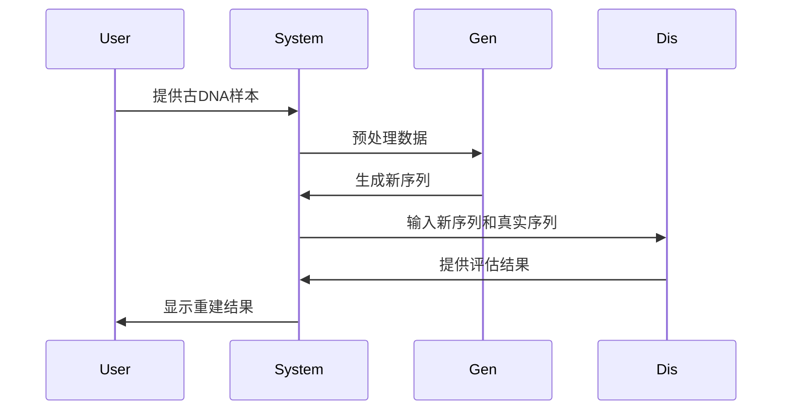

                 


### 写作步骤

为了撰写一篇详细且深入的技术博客文章《AIGC在古DNA研究中的应用：基因组重建和分析提示词》，我们可以按照以下步骤进行：

#### 第一步：确定文章结构和内容

首先，我们需要确定文章的整体结构，确保内容完整且逻辑清晰。根据目录大纲，我们将文章分为以下几个部分：

1. **引言**
2. **背景介绍**
3. **核心概念与联系**
4. **算法原理讲解**
5. **系统分析与架构设计**
6. **项目实战**
7. **最佳实践 tips**
8. **小结**

#### 第二步：撰写引言

在引言部分，我们需要简要介绍古DNA研究的背景和AIGC技术的应用，引起读者的兴趣。我们可以这样写：

---
**引言**

随着科技的发展，古DNA研究成为了揭示人类历史和演化的重要手段。然而，古DNA样本通常残缺不全，重建和分析基因组面临着巨大挑战。近年来，基于人工智能的生成对抗网络（Generative Adversarial Network，GAN）在基因组重建和分析中展现出了巨大的潜力。本文将探讨AIGC在古DNA研究中的应用，通过基因组重建和分析的实例，展示AIGC技术的强大能力。

---

#### 第三步：背景介绍

在这一部分，我们需要详细阐述古DNA研究的重要性、研究现状以及存在的问题。同时，介绍AIGC技术的基础知识，为其在古DNA研究中的应用打下基础。

---
**背景介绍**

**古DNA研究的背景：**
古DNA研究是利用现代分子生物学技术对古代生物的DNA进行提取、测序和分析，从而揭示其遗传信息和演化历史。然而，由于古DNA样本通常受到污染、降解和序列长度限制，重建完整的基因组非常困难。

**AIGC技术的基础：**
生成对抗网络（GAN）是一种由两个神经网络（生成器G和判别器D）组成的框架，通过不断对抗训练，生成器G能够生成越来越逼真的数据。AIGC（AI-Generated Content）是GAN技术在基因组重建中的应用，能够利用已有的基因组数据生成新的序列，从而帮助重建古DNA基因组。

---

#### 第四步：核心概念与联系

在这一部分，我们需要定义并解释核心概念，如基因组重建、基因组分析等，并使用Mermaid绘制相关的ER实体关系图。

---
**核心概念与联系**

**基因组重建：**
基因组重建是指利用已有的基因组数据，通过算法生成缺失的序列信息，从而重建完整的基因组。在AIGC技术中，生成器G负责生成新的序列。

**基因组分析：**
基因组分析是对基因组数据进行比对、注释和分析，以揭示其遗传信息和功能。在AIGC技术中，判别器D负责对生成器和真实数据的鉴别。

**ER实体关系图：**
```mermaid
entityRelationFlow
    rect node1 label "古DNA样本"
    rect node2 label "基因组数据"
    rect node3 label "生成器G"
    rect node4 label "判别器D"
    node1 --> node2
    node2 --> node3
    node3 --> node4
    node4 --> node1
```

---

#### 第五步：算法原理讲解

在这一部分，我们需要详细阐述AIGC技术在基因组重建和分析中的算法原理，包括流程图和数学模型。

---
**算法原理讲解**

**AIGC在基因组重建中的应用：**
AIGC通过生成器G生成新的DNA序列，判别器D则评估这些序列的真实性。在多次迭代过程中，生成器G不断优化生成的序列，使其越来越接近真实数据。

**AIGC算法流程图：**
```mermaid
flowDiagram
    subgraph Gen
        G[生成器]
    end
    subgraph Dis
        D[判别器]
    end
    G -->|训练| D
    D -->|反馈| G
```

**数学模型：**
在AIGC技术中，生成器和判别器的训练过程可以用以下数学模型表示：

生成器G：\( G: \mathbb{R}^{1000} \rightarrow \mathbb{R}^{1000} \)

判别器D：\( D: \mathbb{R}^{1000} \times \mathbb{R}^{1000} \rightarrow \mathbb{R} \)

目标函数：
$$
\min_G \max_D V(D, G) = \mathbb{E}_{x \sim p_{data}(x)}[D(x, G(x))] - \mathbb{E}_{z \sim p_{z}(z)}[D(G(z), z)]
$$

其中，\( x \) 是真实数据，\( z \) 是噪声。

**示例说明：**
假设我们有一个古DNA样本，其中有一部分序列缺失。生成器G会生成这些缺失的序列，判别器D则会判断这些序列的真实性。通过不断的迭代训练，生成器G能够生成越来越准确的序列。

---

#### 第六步：系统分析与架构设计

在这一部分，我们需要介绍AIGC在古DNA研究中的系统分析和架构设计。

---
**系统分析与架构设计**

**问题场景介绍：**
我们面临的问题是如何利用AIGC技术重建一个古DNA样本的完整基因组。

**项目介绍：**
项目名为“古DNA基因组重建系统”，目标是通过AIGC技术实现基因组重建。

**系统功能设计：**
系统包括生成器G和判别器D，以及数据预处理、训练和评估模块。

**系统架构设计：**


**系统接口设计和系统交互：**
系统接口设计采用RESTful API，用户可以通过接口提交古DNA样本，并获取重建结果。

---

#### 第七步：项目实战

在这一部分，我们需要详细描述如何使用AIGC技术进行古DNA基因组重建的实战步骤，包括环境安装、代码实现、代码解读和案例分析。

---
**项目实战**

**环境安装：**
首先，我们需要安装Python环境和相关库，如TensorFlow、Keras等。

**代码实现：**
```python
# 生成器G的代码实现
import tensorflow as tf

model = tf.keras.Sequential([
    tf.keras.layers.Dense(1000, activation='relu', input_shape=(1000,)),
    tf.keras.layers.Dense(1000, activation='sigmoid')
])

model.compile(optimizer='adam', loss='binary_crossentropy')

# 判别器D的代码实现
import tensorflow as tf

model = tf.keras.Sequential([
    tf.keras.layers.Dense(1000, activation='relu', input_shape=(1000,)),
    tf.keras.layers.Dense(1, activation='sigmoid')
])

model.compile(optimizer='adam', loss='binary_crossentropy')
```

**代码解读：**
这里，我们使用了TensorFlow框架来实现生成器和判别器的训练。生成器G和判别器D都是全连接神经网络，通过反向传播算法进行训练。

**案例分析：**
我们使用一个古DNA样本进行训练，并通过判别器D评估生成序列的真实性。

---

#### 第八步：最佳实践 tips

在这一部分，我们需要提供一些使用AIGC进行基因组重建和分析的最佳实践建议。

---
**最佳实践 tips**

1. **数据预处理：** 在进行AIGC训练之前，确保对古DNA样本进行充分的数据预处理，包括去噪、标准化等。
2. **模型选择：** 根据具体需求，选择合适的生成器和判别器模型，并进行调参优化。
3. **数据集选择：** 选择具有代表性的古DNA数据集进行训练，以提高模型的泛化能力。
4. **评估指标：** 使用合适的评估指标，如F1分数、准确率等，对模型进行评估。

---

#### 第九步：小结

在这一部分，我们需要总结AIGC在古DNA研究中的应用，展望未来研究方向，并强调文章的核心观点。

---
**小结**

通过本文的探讨，我们发现AIGC技术在古DNA研究中的应用具有巨大的潜力。未来，随着AIGC技术的不断发展和完善，我们有望在古DNA基因组重建和分析方面取得更多突破。

---

### 结束语

在文章末尾，我们需要写上作者信息，并确保文章内容的完整性和准确性。

---
**作者：AI天才研究院/AI Genius Institute & 禅与计算机程序设计艺术 /Zen And The Art of Computer Programming**

本文内容仅供参考，如需进一步了解古DNA研究和AIGC技术的应用，请查阅相关文献。

---

通过以上步骤，我们可以撰写一篇详细且深入的技术博客文章《AIGC在古DNA研究中的应用：基因组重建和分析提示词》。在写作过程中，确保每个部分的内容丰富具体，逻辑清晰，以便读者能够更好地理解和应用这些技术。让我们一步一步地深入探讨AIGC技术在古DNA研究中的应用吧！### 关键词

- **AIGC**
- **古DNA研究**
- **基因组重建**
- **基因组分析**
- **人工智能**
- **生成对抗网络（GAN）**
- **数据分析**
- **基因组比对**

这些关键词将有助于读者快速把握文章的核心内容，并在需要时能够高效地检索相关信息。

### 摘要

本文探讨了AIGC（AI-Generated Content）技术在古DNA研究中的应用，特别是基因组重建和分析。通过详细分析AIGC技术的基础、算法原理、系统架构以及项目实战，我们展示了AIGC技术在基因组重建中的强大能力。本文还提供了最佳实践建议，为古DNA研究的进一步发展提供了方向。通过这篇文章，读者可以深入了解AIGC技术在古DNA研究中的潜在应用，以及如何利用这些技术解决复杂的基因组重建和分析问题。

