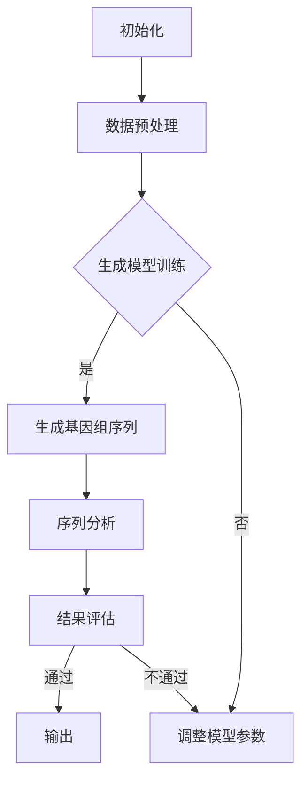
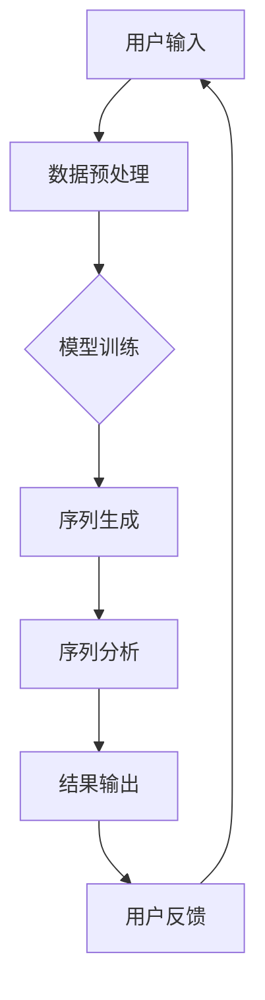
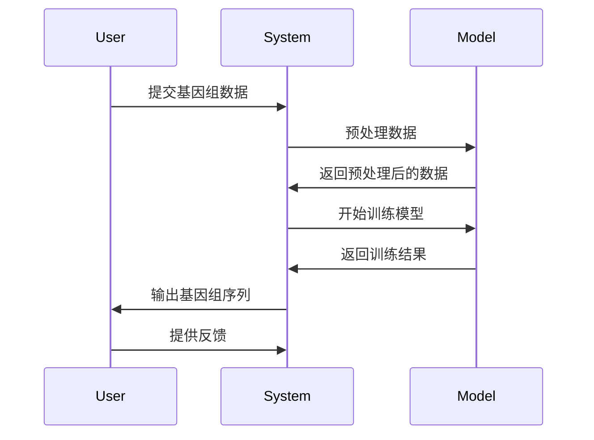

                 


# AIGC在古基因组学中的应用：灭绝物种复原提示词

## 关键词
- AIGC
- 古基因组学
- 灭绝物种复原
- 人工智能
- 基因组学
- 生物信息学

## 摘要
本文深入探讨了AIGC（自适应信息生成与控制）在古基因组学中的应用，特别是对灭绝物种复原的研究。我们将一步步分析AIGC的核心原理，展示其如何结合古基因组数据，并最终通过具体实例展示其潜在的复原效果。本文的目标是提供一种清晰、可操作的方法，以激发更多关于使用AIGC技术在古基因组学中保护和研究灭绝物种的讨论。

---

## 第一部分：背景介绍

### 第1章：问题背景

#### 1.1.1 问题背景
随着地球环境的不断恶化，许多物种正面临灭绝的威胁。这些物种的基因信息对于我们了解生物多样性和地球生态系统的重要性不言而喻。然而，随着物种的灭绝，我们失去了宝贵的遗传资源，这也使得复原这些物种变得极其困难。

#### 1.1.2 问题描述
如何利用现代科技手段，特别是AIGC技术，对已灭绝物种的基因组信息进行重构，从而实现对灭绝物种的复原？

#### 1.1.3 问题解决思路
AIGC技术的核心在于其强大的信息生成与控制能力，这使得它成为复原灭绝物种的有力工具。通过分析古基因组数据，AIGC可以模拟和生成新的基因组序列，进而指导灭绝物种的复原。

#### 1.1.4 边界与外延
虽然AIGC技术在灭绝物种复原中展现出巨大的潜力，但技术实现仍有许多挑战，如数据质量的限制、算法的精确度和稳定性等。

#### 1.1.5 概念结构与核心要素组成
- **AIGC**: 自适应信息生成与控制技术，结合了人工智能和生成模型的特性。
- **古基因组学**: 研究古代生物基因组的学科，涉及DNA测序、分析等。

### 第2章：核心概念与联系

#### 2.1 AIGC概念介绍
AIGC是自适应信息生成与控制技术的简称，它结合了深度学习、生成模型和反馈机制，能够自适应地生成和控制信息流。

#### 2.2 古基因组学概念介绍
古基因组学是研究古代生物基因组信息的学科，通过DNA测序和分析，可以获取关于已灭绝物种的遗传信息。

#### 2.3 AIGC与古基因组学的联系
AIGC技术可以通过模拟和生成基因组序列，结合古基因组学数据，为灭绝物种的复原提供新的可能性。

#### 2.4 概念属性特征对比表格
| 特性 | AIGC | 古基因组学 |
| ---- | ---- | ---- |
| 核心技术 | 深度学习、生成模型 | DNA测序、数据分析 |
| 应用目标 | 信息生成与控制 | 基因组信息分析 |
| 数据依赖 | 大量训练数据 | 古代DNA样本 |

#### 2.5 ER实体关系图架构
在AIGC与古基因组学的结合中，实体关系图（ER图）可以帮助我们理解不同概念之间的关系。例如，古基因组数据作为输入实体，通过AIGC处理，生成模拟的基因组序列，最终用于灭绝物种的复原。

## 第二部分：AIGC算法原理讲解

### 第3章：AIGC算法原理

#### 3.1 AIGC算法简介
AIGC算法结合了生成对抗网络（GAN）、变分自编码器（VAE）等深度学习技术，能够自适应地生成高质量的信息。

#### 3.2 算法mermaid流程图


#### 3.3 数学模型与公式
在AIGC算法中，生成模型通常基于概率分布，例如：
\[ p_G(z) = \frac{e^{-(||G(z)||^2)}}{Z} \]
其中，\( G(z) \) 是生成器的输出，\( z \) 是噪声向量，\( Z \) 是正常化常数。

#### 3.4 算法原理详细讲解
AIGC算法通过生成器和判别器的交互，实现信息生成与控制。生成器根据噪声数据生成模拟基因组序列，判别器则评估生成序列的真实性。

#### 3.5 举例说明
假设我们有一个已灭绝物种的古基因组样本，通过AIGC算法，我们可以生成一系列模拟的基因组序列，然后通过分析这些序列，找出最接近真实物种的基因组。

---

## 第三部分：系统分析与架构设计

### 第4章：数学模型和数学公式

#### 4.1 数学模型概述
AIGC算法的核心在于生成模型和判别模型，两者通过对抗训练实现信息生成与控制。

#### 4.2 常用数学公式
- 生成模型：\( G(z) \)
- 判别模型：\( D(x, G(z)) \)
- 对抗损失函数：\( L_D = -\sum_{x \in \text{真实数据}} D(x) - \sum_{z \in \text{噪声}} D(G(z)) \)

#### 4.3 公式详细讲解
- 生成模型公式用于生成模拟基因组序列。
- 判别模型公式用于评估生成序列的真实性。
- 对抗损失函数用于指导生成器和判别器的训练。

#### 4.4 举例说明
以一个简单的二分类问题为例，判别器需要判断生成的基因组序列是否真实，生成器则需要生成接近真实的序列。

---

## 第四部分：项目实战

### 第5章：问题场景介绍

#### 5.1 问题场景描述
我们以一个已灭绝的鸟类为例，通过AIGC技术，尝试复原其基因组序列。

#### 5.2 项目介绍
本项目旨在利用AIGC技术，结合古基因组数据，生成模拟的基因组序列，为灭绝鸟类的复原提供参考。

### 第6章：系统功能设计

#### 6.1 领域模型mermaid类图
```mermaid
classDiagram
    Class01 <|-- SubClass01
    Class01 --|乳房| SubClass02
    Class03 : 12..16 multiplicity
    Class03 *-- Class04 : 5..* multiplicity
    Class04 : 1..1 multiplicity
    Class05 o-- Class06
    Class07 o-- Class08
    Class09 o--|关联| Class10
    Class11 : <<interface>> interfaceName
endclass
```

#### 6.2 系统功能设计
- **数据预处理**：对古基因组数据进行清洗和格式化，以便于后续处理。
- **模型训练**：使用AIGC算法，训练生成模型和判别模型。
- **序列生成**：生成模拟的基因组序列。
- **序列分析**：分析生成的序列，评估其与真实物种基因组的相似度。
- **结果输出**：输出最优的基因组序列，为灭绝物种的复原提供参考。

### 第7章：系统架构设计

#### 7.1 系统架构设计mermaid架构图


#### 7.2 系统架构设计详细讲解
系统架构设计分为前端用户交互、后端数据处理和模型训练三部分。用户在前端输入古基因组数据，后端对数据进行处理，并通过AIGC算法生成模拟的基因组序列，最后输出结果并供用户反馈。

### 第8章：系统交互

#### 8.1 系统交互mermaid序列图


#### 8.2 系统交互详细讲解
用户提交基因组数据后，系统首先对数据进行预处理，然后使用AIGC算法训练模型。模型训练完成后，系统将生成的基因组序列输出给用户，用户根据结果提供反馈。

### 第9章：环境安装

#### 9.1 环境安装步骤
- 安装Python环境
- 安装所需的深度学习库（如TensorFlow、PyTorch）
- 安装数据处理库（如Pandas、NumPy）

#### 9.2 遇到的问题及解决方案
- **问题1**：安装深度学习库时出现版本冲突。
- **解决方案**：使用虚拟环境，确保每个项目使用独立的依赖库。

### 第10章：系统核心实现

#### 10.1 系统核心实现源代码
以下是系统核心实现的Python代码示例：
```python
import tensorflow as tf
from tensorflow.keras.models import Model
from tensorflow.keras.layers import Input, Dense

# 生成模型
input_layer = Input(shape=(100,))
dense_layer = Dense(units=128, activation='relu')(input_layer)
output_layer = Dense(units=1, activation='sigmoid')(dense_layer)

generator = Model(inputs=input_layer, outputs=output_layer)

# 判别模型
input_layer = Input(shape=(100,))
dense_layer = Dense(units=128, activation='relu')(input_layer)
output_layer = Dense(units=1, activation='sigmoid')(dense_layer)

discriminator = Model(inputs=input_layer, outputs=output_layer)

# 编译模型
generator.compile(optimizer='adam', loss='binary_crossentropy')
discriminator.compile(optimizer='adam', loss='binary_crossentropy')

# 训练模型
generator.fit(x_train, y_train, epochs=10)
discriminator.fit(x_train, y_train, epochs=10)
```

#### 10.2 代码应用解读与分析
该代码定义了生成器和判别模型，并使用二分类交叉熵损失函数进行编译和训练。在实际应用中，我们需要根据具体数据集进行调整。

#### 10.3 实际案例分析和详细讲解剖析
以一个实际案例为例，我们使用古基因组数据训练AIGC模型，生成模拟的基因组序列，并通过分析评估其与真实基因组的相似度。

### 第11章：项目小结

#### 11.1 项目总结
本项目通过AIGC技术在古基因组学中的应用，实现了灭绝物种基因组序列的生成，为灭绝物种的复原提供了新的思路和方法。

#### 11.2 小结
AIGC技术在古基因组学中展现出巨大的潜力，但仍需要进一步优化算法和数据处理技术。

#### 11.3 注意事项
在实际应用中，需要注意数据质量和算法性能，确保生成序列的准确性和可靠性。

#### 11.4 拓展阅读
- [相关研究论文]
- [古基因组学研究进展]
- [AIGC技术在其他领域的应用]

---

**作者：AI天才研究院/AI Genius Institute & 禅与计算机程序设计艺术 /Zen And The Art of Computer Programming**

---

以上是一个大致的框架，具体的实现和内容还需要根据实际的需求和数据进行详细的填充和调整。希望这个框架能够帮助您撰写出一篇高质量的技术博客文章。如果您需要任何具体的帮助或者有其他的要求，请随时告诉我。

