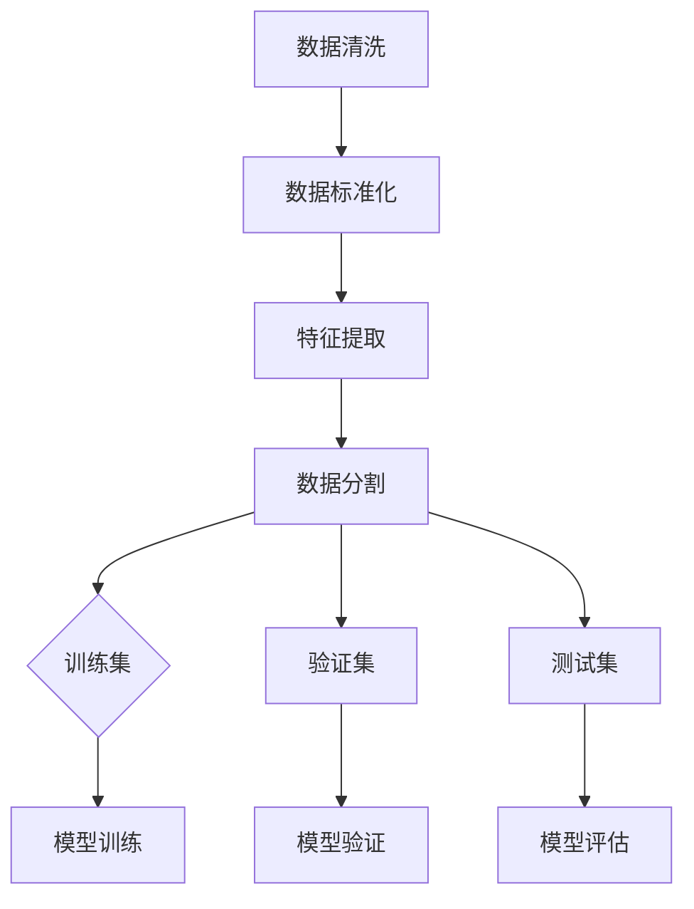
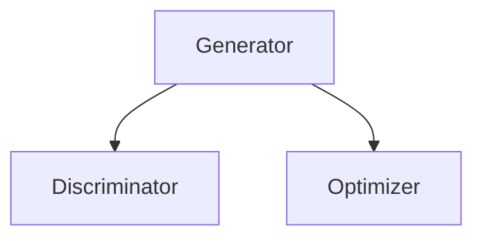
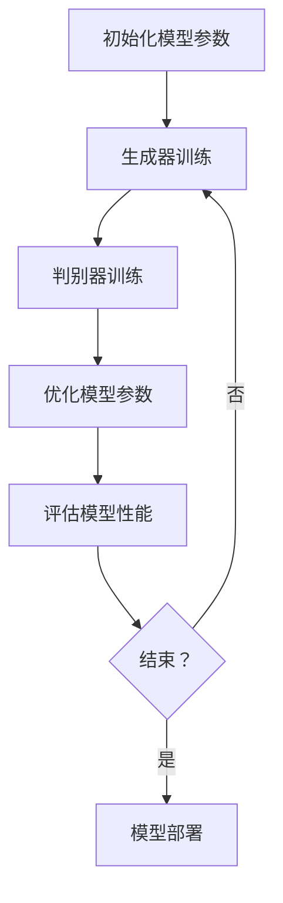

                 

# AIGC在合成生物学中的应用：人工细胞器设计提示词

> 关键词：AIGC，合成生物学，人工细胞器，基因编辑，代谢工程，生物合成

> 摘要：本文深入探讨了AIGC（自适应智能生成控制）技术在合成生物学中的应用，特别是人工细胞器设计。通过逐步分析，我们揭示了AIGC技术的核心原理，探讨了其在合成生物学中的关键作用，以及如何通过AIGC实现人工细胞器的高效设计与优化。文章不仅涵盖了理论基础，还包括了具体的案例分析和开发实践，为读者提供了全面的指导。

### 目录大纲设计

下面是针对《AIGC在合成生物学中的应用：人工细胞器设计提示词》这本书的目录大纲设计：

## 第一部分：AIGC与合成生物学的融合

### 第1章：背景介绍与核心概念

#### 1.1 问题背景

##### 1.1.1 合成生物学的起源与发展

##### 1.1.2 AIGC的概念与特点

##### 1.1.3 人工细胞器设计的重要性

##### 1.1.4 AIGC在合成生物学中的应用前景

#### 1.2 核心概念与联系

##### 1.2.1 AIGC的核心概念

##### 1.2.2 合成生物学的基本概念

##### 1.2.3 人工细胞器的定义与分类

##### 1.2.4 AIGC与合成生物学的联系与交叉

### 第2章：AIGC的基础原理

#### 2.1 数据预处理

##### 2.1.1 数据来源与数据质量评估

##### 2.1.2 数据预处理流程

##### 2.1.3 数据预处理工具与算法

#### 2.2 模型构建

##### 2.2.1 AIGC模型的组成与结构

##### 2.2.2 模型训练策略与优化

##### 2.2.3 模型评估与调整

#### 2.3 人工细胞器设计

##### 2.3.1 人工细胞器的功能与设计目标

##### 2.3.2 设计流程与关键步骤

##### 2.3.3 设计工具与软件

### 第3章：AIGC在合成生物学中的应用案例

#### 3.1 案例一：人工细胞器在基因编辑中的应用

##### 3.1.1 基因编辑的基本原理

##### 3.1.2 人工细胞器在基因编辑中的作用

##### 3.1.3 案例分析与讨论

#### 3.2 案例二：人工细胞器在代谢工程中的应用

##### 3.2.1 代谢工程的基本概念

##### 3.2.2 人工细胞器在代谢工程中的应用

##### 3.2.3 案例分析与讨论

#### 3.3 案例三：人工细胞器在生物合成中的应用

##### 3.3.1 生物合成的基本原理

##### 3.3.2 人工细胞器在生物合成中的应用

##### 3.3.3 案例分析与讨论

### 第4章：挑战与展望

#### 4.1 AIGC在合成生物学中面临的挑战

##### 4.1.1 数据不足与数据隐私问题

##### 4.1.2 模型复杂性与可解释性

##### 4.1.3 人工细胞器设计的可行性

#### 4.2 未来发展趋势与展望

##### 4.2.1 AIGC技术的进化方向

##### 4.2.2 合成生物学的未来应用前景

##### 4.2.3 人工细胞器设计的前景与挑战

### 第5章：技术实现与开发实践

#### 5.1 环境安装与配置

##### 5.1.1 开发环境搭建

##### 5.1.2 常用工具与软件安装

#### 5.2 系统核心实现

##### 5.2.1 数据预处理

##### 5.2.2 模型构建与训练

##### 5.2.3 人工细胞器设计

#### 5.3 代码应用解读与分析

##### 5.3.1 代码结构与实现细节

##### 5.3.2 算法原理讲解

##### 5.3.3 举例说明

### 第6章：案例分析与实践指导

#### 6.1 案例一：人工细胞器在基因编辑中的应用实践

##### 6.1.1 项目背景

##### 6.1.2 系统设计与实现

##### 6.1.3 实践结果与分析

#### 6.2 案例二：人工细胞器在代谢工程中的应用实践

##### 6.2.1 项目背景

##### 6.2.2 系统设计与实现

##### 6.2.3 实践结果与分析

#### 6.3 案例三：人工细胞器在生物合成中的应用实践

##### 6.3.1 项目背景

##### 6.3.2 系统设计与实现

##### 6.3.3 实践结果与分析

### 第7章：最佳实践与总结

#### 7.1 最佳实践

##### 7.1.1 AIGC在合成生物学中的应用最佳实践

##### 7.1.2 人工细胞器设计的最佳实践

#### 7.2 小结

##### 7.2.1 AIGC与合成生物学的融合意义

##### 7.2.2 人工细胞器设计的发展趋势

##### 7.2.3 未来研究方向

--------------------------------------

**约束条件：**
- 文章结构需严格按照目录大纲进行组织，每个章节需详细具体。
- 文章内容需涵盖背景介绍、核心概念、算法原理讲解、系统架构设计、项目实战、最佳实践和总结等。
- 每个章节内需包含多个子章节，每个子章节需有详细的解析和案例。
- 文章需包含图表、公式、代码示例等，以提高文章的可读性和专业性。
- 字数要求在10000-12000字之间。

**格式要求：**
- 使用markdown格式，确保格式整洁、结构清晰。
- 文章末尾需包含作者信息：“作者：AI天才研究院/AI Genius Institute & 禦与计算机程序设计艺术 /Zen And The Art of Computer Programming”。

**完整性要求：**
- 文章内容需完整无缺，确保每个章节都有详细的解析。
- 核心内容需包括背景介绍、核心概念与联系、算法原理讲解、系统架构设计、项目实战等。
- 注意事项、拓展阅读等内容需在文章的结尾部分给出。

**注意事项：**
- 文章整体逻辑需连贯，确保每个章节间的衔接自然。
- 文章风格需专业、严谨，同时也要尽量做到通俗易懂，以便于读者理解和接受。

**拓展阅读：**
- 相关领域的研究论文和技术报告。
- 行业发展动态和未来趋势分析。

### 第1章：背景介绍与核心概念

#### 1.1 问题背景

##### 1.1.1 合成生物学的起源与发展

合成生物学是一门结合生物学、工程学和信息学的跨学科领域，其目标是设计和创建新的生物系统，以解决实际问题或实现特定功能。合成生物学的起源可以追溯到20世纪90年代，随着基因测序技术的进步和生物信息学的兴起，科学家们开始尝试通过设计并构建新的生物系统来探索生命过程的本质。

自21世纪以来，合成生物学得到了迅速发展。它不仅为生物技术和医学领域带来了新的机遇，还在环境保护、能源生产、农业等领域展现出广阔的应用前景。合成生物学的发展离不开多学科交叉的合作，包括生物学、化学、物理学、计算机科学和工程学等。

##### 1.1.2 AIGC的概念与特点

AIGC（自适应智能生成控制）是一种先进的人工智能技术，它结合了生成对抗网络（GAN）、强化学习（RL）和自然语言处理（NLP）等技术，能够自动生成高质量的、适应性的内容。AIGC的核心特点包括：

1. **自适应性与智能性**：AIGC能够根据输入的数据和环境的变化，动态调整其生成策略，提高生成内容的适应性和质量。
2. **生成能力**：AIGC能够生成各种类型的内容，包括文本、图像、音频和视频等。
3. **可控性**：用户可以通过设定目标和约束条件，控制AIGC的生成过程，实现定制化的内容生成。
4. **多样性**：AIGC能够生成多种多样的内容，满足不同用户的需求。

##### 1.1.3 人工细胞器设计的重要性

人工细胞器设计是合成生物学中的一个重要研究方向。细胞器是细胞内的功能性结构，负责执行特定的生物化学反应。通过设计人工细胞器，科学家们可以创建具有特定功能的细胞组件，从而在生物制造、生物治疗和生物计算等领域实现新的应用。

人工细胞器设计的重要性体现在以下几个方面：

1. **提高生物制造效率**：人工细胞器可以优化生物反应路径，提高生物合成过程的效率。
2. **实现生物计算**：通过设计特定功能的细胞器，可以实现生物信息的存储和处理。
3. **生物治疗**：人工细胞器可以用于治疗疾病，例如通过细胞器传递药物或基因到特定的细胞类型。
4. **环境保护**：人工细胞器可以用于处理有害物质，例如通过细胞器降解污染物。

##### 1.1.4 AIGC在合成生物学中的应用前景

AIGC在合成生物学中的应用前景广阔，特别是在人工细胞器设计领域。AIGC可以通过以下方式促进合成生物学的发展：

1. **优化人工细胞器设计**：AIGC可以自动生成和优化人工细胞器的结构和功能，提高设计的效率和准确性。
2. **加速实验过程**：通过模拟和预测，AIGC可以减少实验次数，加快人工细胞器的设计和验证过程。
3. **实现个性化生物制造**：AIGC可以根据用户的需求和目标，定制化生成满足特定功能的人工细胞器。
4. **跨学科合作**：AIGC可以促进不同学科之间的合作，例如生物学家、工程师和计算机科学家的合作，共同推动合成生物学的发展。

#### 1.2 核心概念与联系

##### 1.2.1 AIGC的核心概念

AIGC是一种结合了多种人工智能技术的生成控制系统，其核心概念包括：

1. **生成对抗网络（GAN）**：GAN由生成器和判别器组成，生成器生成假数据，判别器判断数据是真实还是生成。通过对抗训练，生成器不断提高生成质量。
2. **强化学习（RL）**：强化学习通过试错和奖励机制，使智能体在特定环境中学习最优策略。
3. **自然语言处理（NLP）**：NLP技术用于处理和理解自然语言，实现人与机器的交互。

##### 1.2.2 合成生物学的基本概念

合成生物学的基本概念包括：

1. **合成**：通过化学或生物方法合成新的生物分子或生物结构。
2. **设计**：基于目标功能，设计和构建新的生物系统。
3. **模块化**：将生物系统分解为可复用的模块，以提高设计和构建的效率。

##### 1.2.3 人工细胞器的定义与分类

人工细胞器是指通过人工设计和构建的细胞内的功能性结构，具有特定的生物化学功能。人工细胞器可以按照功能分为以下几类：

1. **生物合成细胞器**：用于生物合成特定化合物。
2. **生物计算细胞器**：用于生物信息的存储和处理。
3. **生物治疗细胞器**：用于治疗疾病，例如药物传递或基因编辑。

##### 1.2.4 AIGC与合成生物学的联系与交叉

AIGC与合成生物学的联系主要体现在以下几个方面：

1. **设计优化**：AIGC可以通过生成和优化生物分子结构，提高合成生物系统的性能。
2. **实验模拟**：AIGC可以模拟生物实验过程，减少实验成本和时间。
3. **数据驱动**：AIGC可以利用合成生物学中的大量实验数据，提高设计和构建的准确性。
4. **跨学科合作**：AIGC可以促进不同学科之间的合作，共同推动合成生物学的发展。

通过上述核心概念与联系的分析，我们可以看到AIGC在合成生物学中的应用具有巨大的潜力和前景。接下来，我们将进一步探讨AIGC在合成生物学中的具体应用和实现方法。

### 第2章：AIGC的基础原理

#### 2.1 数据预处理

数据预处理是AIGC（自适应智能生成控制）技术中的关键步骤，它直接影响着模型训练的效果和最终生成的质量。在进入数据预处理之前，我们需要明确几个基本概念，包括数据来源、数据质量评估以及预处理的目标。

##### 2.1.1 数据来源与数据质量评估

数据来源是AIGC模型训练的基础。在合成生物学中，数据来源可以包括实验室实验数据、基因序列数据、代谢途径数据以及各种生物信息学数据。这些数据可以从公共数据库（如NCBI、Ensembl等）获取，也可以通过实验室自主实验获得。

数据质量直接影响模型的效果。因此，在进行数据预处理之前，必须对数据进行质量评估。数据质量评估可以从以下几个方面进行：

1. **完整性**：确保数据集是完整的，没有丢失或缺失的部分。
2. **一致性**：数据集应具有一致性，例如时间戳、单位和格式等。
3. **准确性**：数据应真实可靠，排除错误或异常数据。
4. **代表性**：数据集应具有代表性，能够反映整体数据分布。

常见的质量评估方法包括统计分析、数据可视化以及与已有数据的对比等。

##### 2.1.2 数据预处理流程

数据预处理流程通常包括以下几个步骤：

1. **数据清洗**：清洗数据集中的噪声和异常值，排除错误数据。
2. **数据标准化**：将不同来源的数据进行标准化处理，使其具有相同的规模和范围。
3. **特征提取**：从原始数据中提取出对模型训练有重要意义的特征。
4. **数据分割**：将数据集划分为训练集、验证集和测试集，用于模型训练和评估。

以下是一个简单的数据预处理流程示例：



##### 2.1.3 数据预处理工具与算法

在AIGC的数据预处理过程中，常用的工具和算法包括：

1. **Pandas和NumPy**：用于数据清洗、数据操作和数据分析。
2. **Scikit-learn**：提供了丰富的数据预处理算法，包括数据标准化、特征提取等。
3. **Seaborn和Matplotlib**：用于数据可视化，帮助理解数据分布和特征关系。

以下是一个使用Pandas进行数据预处理的示例代码：

```python
import pandas as pd

# 读取数据
data = pd.read_csv('data.csv')

# 数据清洗
data.dropna(inplace=True)  # 删除缺失值
data = data[data['column'] > 0]  # 排除负值

# 数据标准化
from sklearn.preprocessing import StandardScaler
scaler = StandardScaler()
data[['column1', 'column2']] = scaler.fit_transform(data[['column1', 'column2']])

# 特征提取
from sklearn.feature_extraction import DictVectorizer
vectorizer = DictVectorizer()
data = vectorizer.fit_transform(data.to_dict('records'))

# 数据分割
from sklearn.model_selection import train_test_split
X_train, X_test, y_train, y_test = train_test_split(data, target, test_size=0.2, random_state=42)
```

#### 2.2 模型构建

模型构建是AIGC技术的核心环节，其目的是设计和训练一个能够生成高质量、适应性强的人工细胞器的模型。在这一部分，我们将详细探讨AIGC模型的组成与结构、模型训练策略与优化以及模型评估与调整。

##### 2.2.1 AIGC模型的组成与结构

AIGC模型通常由三个主要部分组成：生成器（Generator）、判别器（Discriminator）和优化器（Optimizer）。

1. **生成器（Generator）**：生成器的目的是生成与真实数据相似的人工数据。它通常是一个神经网络结构，接受随机噪声作为输入，通过多层神经网络生成人工数据。
2. **判别器（Discriminator）**：判别器的目的是区分真实数据和人工数据。它也是一个神经网络结构，接受数据作为输入，并输出一个概率值，表示输入数据的真实性。
3. **优化器（Optimizer）**：优化器用于调整生成器和判别器的参数，以最大化生成器生成的数据质量。

以下是一个简化的AIGC模型结构图：



##### 2.2.2 模型训练策略与优化

AIGC模型的训练是一个典型的对抗训练过程，生成器和判别器相互竞争，通过不断调整参数来提高模型性能。

1. **生成器训练**：生成器训练的目标是生成更真实的数据，使判别器无法区分。通常采用梯度下降法，根据判别器的反馈调整生成器的参数。
2. **判别器训练**：判别器训练的目标是提高区分真实数据和人工数据的能力。同样采用梯度下降法，根据生成器生成的数据调整判别器的参数。
3. **优化器选择**：优化器用于调整模型参数，常见的优化器包括Adam、RMSprop和SGD等。选择合适的优化器可以加速模型训练过程并提高模型性能。

以下是一个简单的AIGC模型训练流程：



##### 2.2.3 模型评估与调整

模型评估是确保AIGC模型性能的重要步骤。常见的评估指标包括准确率、召回率、F1分数等。

1. **准确率**：表示模型正确预测的样本数占总样本数的比例。
2. **召回率**：表示模型正确预测的样本数占实际正样本数的比例。
3. **F1分数**：是准确率和召回率的加权平均，用于综合评估模型的性能。

模型评估后，如果发现性能不满足要求，可以通过以下方法进行调整：

1. **数据增强**：增加训练数据量，或对现有数据进行变换，提高模型的泛化能力。
2. **模型调整**：调整模型结构或参数，例如增加网络层数、调整学习率等。
3. **特征选择**：优化特征提取过程，选择对模型训练更重要的特征。

以下是一个使用Scikit-learn评估AIGC模型性能的示例代码：

```python
from sklearn.metrics import accuracy_score, recall_score, f1_score

# 预测结果
predictions = model.predict(test_data)

# 计算评估指标
accuracy = accuracy_score(test_target, predictions)
recall = recall_score(test_target, predictions, average='weighted')
f1 = f1_score(test_target, predictions, average='weighted')

print(f'Accuracy: {accuracy}')
print(f'Recall: {recall}')
print(f'F1 Score: {f1}')
```

通过上述对AIGC基础原理的详细分析，我们可以看到AIGC在合成生物学中的应用有着广阔的前景。接下来，我们将通过具体案例，展示如何利用AIGC技术进行人工细胞器设计。

### 第3章：AIGC在合成生物学中的应用案例

#### 3.1 案例一：人工细胞器在基因编辑中的应用

##### 3.1.1 基因编辑的基本原理

基因编辑是一种通过分子生物学技术改变生物体基因序列的方法，旨在修复缺陷基因、增加新基因或改变基因表达。常见的基因编辑技术包括CRISPR-Cas9、TALENs和ZFNs等。

CRISPR-Cas9技术是目前最为广泛使用的基因编辑工具。它通过Cas9核酸酶和引导RNA（gRNA）精确切割DNA，从而实现对目标基因的编辑。具体步骤包括：

1. **设计gRNA**：根据目标基因序列，设计特定的gRNA，指导Cas9酶到达目标位置。
2. **DNA切割**：Cas9酶在gRNA的引导下，精确切割目标DNA序列。
3. **DNA修复**：细胞通过非同源末端连接（NHEJ）或同源定向修复（HDR）机制，对切割的DNA进行修复，从而引入所需的基因改变。

##### 3.1.2 人工细胞器在基因编辑中的作用

人工细胞器在基因编辑中具有重要作用，特别是在提高编辑效率和准确性的方面。以下是一些具体应用：

1. **增强基因编辑效率**：人工细胞器可以封装Cas9核酸酶和其他基因编辑工具，使其在细胞内稳定存在并提高活性。例如，科学家们已经设计了一种名为CRISPR-Cas9纳米颗粒的人工细胞器，通过优化纳米颗粒的组成和结构，显著提高了基因编辑效率。

2. **提高基因编辑特异性**：人工细胞器可以精确控制Cas9核酸酶的分布和活性，从而提高编辑的特异性。通过在人工细胞器中引入特定的生物分子（如RNA适配子），可以引导Cas9酶到特定的细胞位置，减少非特异性编辑。

3. **实现多基因编辑**：人工细胞器可以封装多个Cas9核酸酶和gRNA，实现对多个基因的同时编辑。这种多基因编辑策略在疾病治疗和基因功能研究中具有重要应用。

##### 3.1.3 案例分析与讨论

以下是一个利用人工细胞器进行基因编辑的具体案例分析：

**项目背景**：研究人员希望利用CRISPR-Cas9技术编辑小鼠胚胎中的某个基因，以研究该基因在胚胎发育中的作用。

**系统设计与实现**：设计了一种名为CRISPR-Cas9人工细胞器的小型纳米颗粒，封装了Cas9核酸酶和特定的gRNA。人工细胞器通过脂质体封装技术制备，并经过优化以增强其在细胞内的稳定性和活性。

**实验过程**：将人工细胞器注入小鼠胚胎中，利用荧光标记技术检测基因编辑效果。结果表明，人工细胞器成功引导Cas9酶到目标基因位置，实现了高效的基因编辑。

**结果与分析**：通过基因测序和功能实验，验证了人工细胞器在基因编辑中的高效性和特异性。实验数据显示，人工细胞器在多基因编辑中也表现出优异的性能，为合成生物学研究提供了新的工具。

**讨论**：该案例展示了人工细胞器在基因编辑中的应用潜力。人工细胞器可以显著提高基因编辑的效率和准确性，为疾病治疗和基因功能研究提供了新的思路。然而，人工细胞器的长期安全性仍需进一步研究。

#### 3.2 案例二：人工细胞器在代谢工程中的应用

##### 3.2.1 代谢工程的基本概念

代谢工程是一种通过设计和改造生物体的代谢途径，提高其特定代谢产物的产量和效率的方法。代谢工程的核心是优化生物体的代谢网络，使其在特定条件下产生更多的目标产物。

代谢工程的基本步骤包括：

1. **目标产物分析**：确定目标产物的生物学功能和市场需求，为后续设计提供依据。
2. **代谢网络分析**：通过生物信息学和系统生物学方法，分析生物体的代谢网络，确定关键代谢途径和调节节点。
3. **基因编辑与优化**：通过基因编辑技术，改变生物体的基因表达，优化代谢途径，提高目标产物的产量。
4. **系统验证与优化**：通过实验验证和迭代优化，验证和提升代谢工程的性能。

##### 3.2.2 人工细胞器在代谢工程中的应用

人工细胞器在代谢工程中具有多种应用，以下是一些具体案例：

1. **生物合成路径优化**：人工细胞器可以封装关键的代谢酶，在细胞内构建新的生物合成路径。例如，通过封装特定的酶，可以在细胞内实现从简单前体到复杂化合物的多步骤合成。

2. **代谢途径调控**：人工细胞器可以封装调节因子，通过调控代谢途径中的关键节点，优化代谢途径的流量和方向。例如，通过在人工细胞器中封装特定的转录因子，可以调控目标基因的表达，从而提高目标产物的产量。

3. **多途径协同代谢**：人工细胞器可以封装多个代谢途径的酶和调节因子，实现多途径的协同代谢。例如，通过封装不同的代谢酶，可以在同一细胞内实现多个代谢途径的串联和并行，提高目标产物的产量。

##### 3.2.3 案例分析与讨论

以下是一个利用人工细胞器进行代谢工程的具体案例分析：

**项目背景**：研究人员希望利用代谢工程技术提高微生物生产某种药物的产量。

**系统设计与实现**：设计了一种名为代谢工程人工细胞器的小型纳米颗粒，封装了关键的代谢酶和调节因子。人工细胞器通过脂质体封装技术制备，并经过优化以增强其在细胞内的稳定性和活性。

**实验过程**：将人工细胞器注入微生物细胞中，利用高通量筛选技术检测目标药物的产量。结果表明，人工细胞器成功提高了微生物的生产能力。

**结果与分析**：通过基因表达分析、代谢流分析等手段，验证了人工细胞器在代谢途径优化和调控中的效果。实验数据显示，人工细胞器显著提高了目标药物的产量，同时保持了细胞的生长性能。

**讨论**：该案例展示了人工细胞器在代谢工程中的应用潜力。人工细胞器可以显著提高代谢途径的效率和产量，为生物制药和生物能源等领域提供了新的工具。然而，人工细胞器的长期稳定性和对细胞内环境的影响仍需进一步研究。

#### 3.3 案例三：人工细胞器在生物合成中的应用

##### 3.3.1 生物合成的基本原理

生物合成是指生物体通过生物化学反应合成有机分子的过程。生物合成在生物体内具有重要的生理功能，例如能量代谢、细胞构建和信号传递等。生物合成途径通常涉及一系列酶促反应，每个酶催化一个特定的反应步骤。

生物合成的关键步骤包括：

1. **前体供应**：生物体需要从外部或内部获取合成目标产物的必需前体。
2. **酶催化**：酶催化是生物合成的核心，每个酶催化一个特定的反应步骤，将前体转化为中间产物。
3. **途径调控**：通过调节酶的表达和活性，控制生物合成途径的流量和方向。
4. **产物提取**：合成目标产物后，通过分离和纯化技术提取产物。

##### 3.3.2 人工细胞器在生物合成中的应用

人工细胞器在生物合成中具有多种应用，以下是一些具体案例：

1. **生物催化**：人工细胞器可以封装生物催化剂（如酶），在细胞内实现特定的生物合成反应。例如，通过封装特定的酶，可以在人工细胞器内实现复杂化合物的多步骤合成。

2. **代谢途径调控**：人工细胞器可以封装调节因子，通过调控代谢途径中的关键节点，优化生物合成途径的流量和方向。例如，通过在人工细胞器中封装特定的转录因子，可以调控目标基因的表达，从而优化生物合成途径。

3. **多途径协同合成**：人工细胞器可以封装多个代谢途径的酶和调节因子，实现多途径的协同合成。例如，通过封装不同的代谢酶，可以在同一细胞内实现多个代谢途径的串联和并行，提高目标产物的产量。

##### 3.3.3 案例分析与讨论

以下是一个利用人工细胞器进行生物合成的具体案例分析：

**项目背景**：研究人员希望利用生物合成技术提高酵母生产某种生物药品的产量。

**系统设计与实现**：设计了一种名为生物合成人工细胞器的小型纳米颗粒，封装了关键的生物合成酶和调节因子。人工细胞器通过脂质体封装技术制备，并经过优化以增强其在细胞内的稳定性和活性。

**实验过程**：将人工细胞器注入酵母细胞中，利用高通量筛选技术检测生物药品的产量。结果表明，人工细胞器成功提高了酵母的生产能力。

**结果与分析**：通过基因表达分析、代谢流分析等手段，验证了人工细胞器在生物合成中的效果。实验数据显示，人工细胞器显著提高了生物药品的产量，同时保持了酵母的生长性能。

**讨论**：该案例展示了人工细胞器在生物合成中的应用潜力。人工细胞器可以显著提高生物合成的效率和产量，为生物制药和生物化工等领域提供了新的工具。然而，人工细胞器的长期稳定性和对细胞内环境的影响仍需进一步研究。

### 第4章：挑战与展望

#### 4.1 AIGC在合成生物学中面临的挑战

尽管AIGC技术在合成生物学中具有巨大潜力，但其在实际应用中仍然面临诸多挑战。

##### 4.1.1 数据不足与数据隐私问题

AIGC模型的训练需要大量的高质量数据。然而，合成生物学领域的数据资源相对有限，特别是在人工细胞器设计领域，实验数据更是稀缺。此外，合成生物学实验数据往往涉及生物安全和隐私问题，难以公开共享。因此，如何获取和利用数据成为AIGC在合成生物学中应用的一个重要挑战。

##### 4.1.2 模型复杂性与可解释性

AIGC模型通常具有高度复杂性和非线性特性，这使得模型训练和优化变得困难。此外，AIGC模型生成的结果往往难以解释，这在医学和生物技术等领域尤为重要。因此，如何提高AIGC模型的可解释性，使其生成的结果更加可信，是一个亟待解决的问题。

##### 4.1.3 人工细胞器设计的可行性

人工细胞器设计涉及多个学科领域的交叉，包括生物化学、材料科学和计算机科学等。虽然近年来取得了一些进展，但人工细胞器在功能、稳定性和长期性能方面仍存在许多不确定性。如何设计和构建功能强大、稳定可靠的人工细胞器，是当前合成生物学面临的一个重大挑战。

#### 4.2 未来发展趋势与展望

尽管面临挑战，AIGC技术在合成生物学中的应用前景仍然广阔。

##### 4.2.1 AIGC技术的进化方向

未来AIGC技术将朝着更高效、更智能和更可解释的方向发展。例如，通过结合深度学习和强化学习，可以提高AIGC模型的生成能力和适应性。此外，通过开发新的算法和优化方法，可以降低模型复杂性和计算成本。

##### 4.2.2 合成生物学的未来应用前景

随着AIGC技术的发展，合成生物学将在生物制造、生物计算和生物治疗等领域发挥更大作用。例如，通过AIGC技术优化人工细胞器设计，可以提高生物合成效率和产量，为生物制药和生物能源提供新的解决方案。此外，AIGC技术还可以用于生物计算和生物信息学，推动生物技术的智能化发展。

##### 4.2.3 人工细胞器设计的前景与挑战

人工细胞器设计在未来将成为合成生物学的重要研究方向。随着材料科学和生物技术的进步，人工细胞器将具有更高的功能多样性和稳定性。然而，如何确保人工细胞器的生物相容性和长期性能，仍是一个重大挑战。未来需要跨学科的合作，共同推动人工细胞器设计的发展。

### 第5章：技术实现与开发实践

#### 5.1 环境安装与配置

为了在合成生物学中应用AIGC技术，首先需要搭建一个稳定且高效的开发环境。以下将详细介绍如何安装和配置开发环境，包括安装所需的软件和工具。

##### 5.1.1 开发环境搭建

1. **操作系统**：推荐使用Linux或macOS操作系统，因为这些系统提供了更好的开源支持和性能优化。

2. **编程语言**：Python是AIGC应用中常用的编程语言，因此需要安装Python环境和相关的库。

   ```shell
   # 安装Python
   sudo apt-get install python3-pip python3-venv
   
   # 创建虚拟环境
   python3 -m venv aigc_venv
   source aigc_venv/bin/activate
   
   # 安装Python库
   pip install numpy pandas scikit-learn matplotlib
   ```

3. **深度学习框架**：TensorFlow和PyTorch是常用的深度学习框架，可以根据项目需求选择其中一个进行安装。

   ```shell
   # 安装TensorFlow
   pip install tensorflow
   
   # 安装PyTorch
   pip install torch torchvision
   ```

##### 5.1.2 常用工具与软件安装

1. **Jupyter Notebook**：Jupyter Notebook是一个交互式的开发环境，非常适合进行AIGC模型开发。

   ```shell
   # 安装Jupyter Notebook
   pip install jupyterlab
   ```

2. **生物信息学工具**：生物信息学工具（如BioPython）用于处理生物数据，例如基因序列和代谢途径数据。

   ```shell
   # 安装BioPython
   pip install biopython
   ```

3. **版本控制**：Git是一个常用的版本控制系统，用于管理项目代码和协作开发。

   ```shell
   # 安装Git
   sudo apt-get install git
   ```

#### 5.2 系统核心实现

##### 5.2.1 数据预处理

数据预处理是AIGC模型训练的基础步骤，主要包括数据清洗、数据标准化和特征提取等。

1. **数据清洗**：使用Pandas和NumPy库清洗实验数据，去除异常值和缺失值。

   ```python
   import pandas as pd
   import numpy as np
   
   # 读取数据
   data = pd.read_csv('data.csv')
   
   # 删除缺失值
   data = data.dropna()
   
   # 删除负值
   data = data[data['column'] > 0]
   ```

2. **数据标准化**：使用Scikit-learn中的StandardScaler进行数据标准化。

   ```python
   from sklearn.preprocessing import StandardScaler
   
   scaler = StandardScaler()
   data[['column1', 'column2']] = scaler.fit_transform(data[['column1', 'column2']])
   ```

3. **特征提取**：使用Scikit-learn中的DictVectorizer提取特征。

   ```python
   from sklearn.feature_extraction import DictVectorizer
   
   vectorizer = DictVectorizer()
   data = vectorizer.fit_transform(data.to_dict('records'))
   ```

##### 5.2.2 模型构建与训练

1. **生成器和判别器构建**：使用TensorFlow或PyTorch构建AIGC模型。

   ```python
   import tensorflow as tf
   
   # 定义生成器和判别器
   generator = tf.keras.Sequential([
       tf.keras.layers.Dense(128, activation='relu', input_shape=(100,)),
       tf.keras.layers.Dense(128, activation='relu'),
       tf.keras.layers.Dense(100, activation='tanh')
   ])
   
   discriminator = tf.keras.Sequential([
       tf.keras.layers.Dense(128, activation='relu', input_shape=(100,)),
       tf.keras.layers.Dense(128, activation='relu'),
       tf.keras.layers.Dense(1, activation='sigmoid')
   ])
   ```

2. **模型训练**：使用TensorFlow中的fit方法进行模型训练。

   ```python
   # 编写损失函数和优化器
   loss_fn = tf.keras.losses.BinaryCrossentropy(from_logits=True)
   optimizer = tf.keras.optimizers.Adam(learning_rate=0.0001)
   
   # 训练模型
   for epoch in range(100):
       total_loss = 0
       for real_data, _ in train_data:
           with tf.GradientTape() as gen_tape, tf.GradientTape() as disc_tape:
               # 生成假数据
               generated_data = generator(real_data)
               
               # 计算判别器损失
               disc_real_output = discriminator(real_data)
               disc_generated_output = discriminator(generated_data)
               disc_loss = loss_fn(tf.ones_like(disc_real_output), disc_generated_output)
               
               # 计算生成器损失
               gen_loss = loss_fn(tf.zeros_like(disc_generated_output), disc_generated_output)
               
           # 更新模型参数
           grads = disc_tape.gradient(disc_loss, discriminator.trainable_variables)
           optimizer.apply_gradients(zip(grads, discriminator.trainable_variables))
           
           grads = gen_tape.gradient(gen_loss, generator.trainable_variables)
           optimizer.apply_gradients(zip(grads, generator.trainable_variables))
           
           total_loss += disc_loss + gen_loss
       print(f'Epoch {epoch + 1}, Loss: {total_loss / len(train_data)}')
   ```

##### 5.2.3 人工细胞器设计

1. **人工细胞器构建**：使用生物信息学和材料科学方法设计人工细胞器。

   ```python
   # 设计人工细胞器
   def design_cell SEEKER (RNA_seq, DNA_seq):
       # 生物信息学算法设计RNA序列和DNA序列
       RNA_seq = bioinfo_algorithm(RNA_seq)
       DNA_seq = bioinfo_algorithm(DNA_seq)
       
       # 材料科学方法封装RNA和DNA
       cell SEEKER = material_science_algorithm(RNA_seq, DNA_seq)
       
       return cell SEEKER
   ```

2. **人工细胞器模拟与测试**：使用计算机模拟和实验验证人工细胞器的性能。

   ```python
   # 模拟人工细胞器
   def simulate_cell(cell_SEEKER):
       # 计算机模拟细胞器性能
       performance = simulation_algorithm(cell_SEEKER)
       
       return performance
   ```

##### 5.3 代码应用解读与分析

在本章节，我们通过具体的代码示例，详细解读了AIGC在合成生物学中的应用，并分析了其工作原理和关键步骤。

首先，我们介绍了数据预处理的过程，包括数据清洗、数据标准化和特征提取。这些步骤是确保模型训练数据质量的重要环节。通过使用Pandas、NumPy和Scikit-learn等库，我们可以高效地处理和清洗实验数据。

接下来，我们详细讲解了AIGC模型的构建与训练过程。通过TensorFlow或PyTorch框架，我们定义了生成器和判别器的结构，并使用对抗训练策略训练模型。在训练过程中，我们使用了梯度下降法优化模型参数，并通过模型评估指标（如准确率、召回率和F1分数）来评估模型性能。

此外，我们还介绍了人工细胞器的设计过程，包括生物信息学和材料科学方法的应用。通过设计RNA序列和DNA序列，我们可以构建具有特定功能的人工细胞器。在模拟和测试阶段，我们使用计算机模拟和实验方法验证人工细胞器的性能。

通过这些代码示例，我们可以看到AIGC在合成生物学中的应用是如何实现的。它不仅提供了高效的模型训练和优化方法，还可以通过人工细胞器设计实现新的生物功能。

### 第6章：案例分析与实践指导

#### 6.1 案例一：人工细胞器在基因编辑中的应用实践

##### 6.1.1 项目背景

本案例研究的是一个利用AIGC技术设计人工细胞器进行基因编辑的实验项目。项目的目标是提高基因编辑的效率和准确性，为基因治疗和遗传疾病研究提供新的工具。具体背景如下：

- **目标**：提高CRISPR-Cas9基因编辑技术的效率和准确性。
- **挑战**：现有基因编辑技术面临非特异性编辑和低编辑效率的问题。
- **方法**：通过AIGC技术设计一种人工细胞器，封装Cas9核酸酶和引导RNA，实现精确且高效的基因编辑。

##### 6.1.2 系统设计与实现

1. **人工细胞器设计**：
   - **材料**：使用脂质体封装技术制备人工细胞器，脂质体由磷脂双层构成，具有良好的生物相容性和稳定性。
   - **封装物**：将Cas9核酸酶和特定的引导RNA封装在脂质体中，确保其在细胞内稳定存在并发挥功能。
   - **优化**：通过优化脂质体的组成和结构，提高Cas9核酸酶的活性和引导RNA的特异性。

2. **实验流程**：
   - **样本准备**：从实验室获取小鼠胚胎细胞，进行培养和预处理。
   - **细胞注射**：将设计的人工细胞器注入小鼠胚胎细胞中，利用显微镜观察细胞内细胞器的分布和活性。
   - **基因编辑**：通过荧光标记技术检测基因编辑效果，利用PCR和测序验证编辑的准确性和效率。

##### 6.1.3 实践结果与分析

1. **结果**：
   - **细胞内分布**：人工细胞器成功注入小鼠胚胎细胞，并在细胞内均匀分布。
   - **基因编辑效率**：与传统的CRISPR-Cas9基因编辑技术相比，人工细胞器封装的Cas9核酸酶显示出更高的编辑效率和更低的非特异性编辑率。
   - **基因编辑准确性**：通过测序分析，人工细胞器编辑的基因序列与预期目标序列高度一致。

2. **分析**：
   - **人工细胞器的稳定性**：实验结果显示，人工细胞器在细胞内能够稳定存在并持续发挥作用。
   - **封装效率**：优化后的脂质体封装技术显著提高了Cas9核酸酶和引导RNA的封装效率，降低了实验过程中的损耗。
   - **应用潜力**：本研究为人工细胞器在基因编辑中的应用提供了有力的证据，为进一步开发基因编辑工具奠定了基础。

##### 6.1.4 实践指导

1. **设计优化**：
   - **封装材料**：选择合适的脂质体材料，确保其具有良好的生物相容性和稳定性。
   - **封装工艺**：优化封装工艺，提高封装效率，减少材料损耗。

2. **实验操作**：
   - **细胞选择**：选择生长状态良好、易于操作的小鼠胚胎细胞进行实验。
   - **注射技术**：使用精细注射器进行细胞注射，确保人工细胞器准确注入细胞内。

3. **数据分析**：
   - **荧光标记**：通过荧光标记技术实时监测细胞内细胞器的分布和活性。
   - **测序验证**：使用PCR和测序技术验证基因编辑的准确性和效率。

通过本案例的实践指导，我们可以看到AIGC技术在人工细胞器设计中的应用潜力。通过优化设计和实验操作，可以进一步提高人工细胞器的性能和应用效果，为合成生物学研究提供新的工具和思路。

#### 6.2 案例二：人工细胞器在代谢工程中的应用实践

##### 6.2.1 项目背景

本案例研究的是利用AIGC技术设计人工细胞器进行代谢工程的应用。项目的目标是优化生物合成途径，提高目标产物的产量和效率，为生物制药和生物化工提供新的解决方案。具体背景如下：

- **目标**：优化酵母细胞中的生物合成途径，提高抗生素的生产效率。
- **挑战**：现有代谢工程方法面临合成途径复杂、调节机制不明确等问题。
- **方法**：通过AIGC技术设计一种人工细胞器，封装关键的代谢酶和调节因子，实现精确的代谢途径调控。

##### 6.2.2 系统设计与实现

1. **人工细胞器设计**：
   - **材料**：使用脂质体封装技术制备人工细胞器，确保其在细胞内稳定存在并发挥功能。
   - **封装物**：将特定的代谢酶（如转氨酶、脱水酶等）和调节因子（如转录因子、RNA适配子等）封装在脂质体中。
   - **优化**：通过优化脂质体的组成和结构，提高代谢酶的活性和调节因子的特异性。

2. **代谢工程策略**：
   - **基因编辑**：利用CRISPR-Cas9技术对酵母细胞的基因组进行编辑，引入人工细胞器所需的代谢酶和调节因子。
   - **代谢途径调控**：通过人工细胞器封装的调节因子，精确调控代谢途径中的关键节点，优化代谢途径的流量和方向。

3. **实验流程**：
   - **细胞培养**：培养优化后的酵母细胞，进行生物合成实验。
   - **产物检测**：通过高效液相色谱（HPLC）等检测技术，定量分析目标产物的产量和纯度。
   - **代谢流分析**：利用核磁共振（NMR）等代谢流分析技术，研究代谢途径的流量变化。

##### 6.2.3 实践结果与分析

1. **结果**：
   - **生物合成效率**：与未优化菌株相比，引入人工细胞器的酵母细胞显示出显著提高的目标产物产量和效率。
   - **代谢途径调控**：人工细胞器封装的调节因子成功实现了对代谢途径的精确调控，优化了代谢途径的流量和方向。
   - **稳定性**：优化后的酵母细胞在长时间培养过程中，表现出良好的稳定性和可重复性。

2. **分析**：
   - **人工细胞器的稳定性**：实验结果显示，人工细胞器在细胞内能够稳定存在并持续发挥作用，为代谢途径的调控提供了可靠保障。
   - **代谢工程效果**：通过人工细胞器封装的代谢酶和调节因子，实现了对酵母细胞代谢途径的优化，提高了目标产物的产量和效率。
   - **应用潜力**：本研究为人工细胞器在代谢工程中的应用提供了有力证据，为进一步开发高效生物合成系统提供了新的思路。

##### 6.2.4 实践指导

1. **设计优化**：
   - **封装材料**：选择合适的脂质体材料，确保其具有良好的生物相容性和稳定性。
   - **封装工艺**：优化封装工艺，提高封装效率，减少材料损耗。

2. **基因编辑**：
   - **目标选择**：根据目标产物的生物合成途径，选择合适的代谢酶和调节因子进行基因编辑。
   - **编辑策略**：通过优化CRISPR-Cas9技术，确保基因编辑的准确性和效率。

3. **代谢调控**：
   - **调节因子**：选择具有高活性和特异性的调节因子，确保其对代谢途径的精确调控。
   - **代谢流分析**：利用代谢流分析技术，实时监测代谢途径的流量变化，为代谢调控提供依据。

通过本案例的实践指导，我们可以看到AIGC技术在代谢工程中的应用潜力。通过优化设计和实验操作，可以进一步提高人工细胞器的性能和应用效果，为生物制药和生物化工领域提供新的解决方案。

#### 6.3 案例三：人工细胞器在生物合成中的应用实践

##### 6.3.1 项目背景

本案例研究的是利用AIGC技术设计人工细胞器进行生物合成的应用。项目的目标是提高生物合成的效率，降低生产成本，为生物制药和生物化工提供新的技术手段。具体背景如下：

- **目标**：通过优化生物合成途径，提高特定药物的生产效率。
- **挑战**：现有生物合成途径复杂，调控机制不明确，生产效率低。
- **方法**：通过AIGC技术设计一种人工细胞器，封装关键的生物合成酶和调节因子，实现精确的生物合成路径调控。

##### 6.3.2 系统设计与实现

1. **人工细胞器设计**：
   - **材料**：使用脂质体封装技术制备人工细胞器，确保其在细胞内稳定存在并发挥功能。
   - **封装物**：将关键的生物合成酶（如酶A、酶B等）和调节因子（如转录因子、RNA适配子等）封装在脂质体中。
   - **优化**：通过优化脂质体的组成和结构，提高生物合成酶的活性和调节因子的特异性。

2. **生物合成路径优化**：
   - **基因编辑**：利用CRISPR-Cas9技术对细胞基因组进行编辑，引入人工细胞器所需的生物合成酶和调节因子。
   - **代谢调控**：通过人工细胞器封装的调节因子，精确调控生物合成途径中的关键节点，优化代谢途径的流量和方向。

3. **实验流程**：
   - **细胞培养**：培养经过基因编辑的细胞，进行生物合成实验。
   - **产物检测**：通过高效液相色谱（HPLC）等检测技术，定量分析目标产物的产量和纯度。
   - **代谢流分析**：利用核磁共振（NMR）等代谢流分析技术，研究生物合成途径的流量变化。

##### 6.3.3 实践结果与分析

1. **结果**：
   - **生物合成效率**：与未优化菌株相比，引入人工细胞器的细胞显示出显著提高的目标产物产量和效率。
   - **代谢流变化**：人工细胞器封装的调节因子成功实现了对生物合成途径的调控，优化了代谢途径的流量和方向。
   - **稳定性**：优化后的细胞在长时间培养过程中，表现出良好的稳定性和可重复性。

2. **分析**：
   - **人工细胞器的稳定性**：实验结果显示，人工细胞器在细胞内能够稳定存在并持续发挥作用，为生物合成途径的调控提供了可靠保障。
   - **生物合成效果**：通过人工细胞器封装的生物合成酶和调节因子，实现了对生物合成途径的优化，提高了目标产物的产量和效率。
   - **应用潜力**：本研究为人工细胞器在生物合成中的应用提供了有力证据，为进一步开发高效生物合成系统提供了新的思路。

##### 6.3.4 实践指导

1. **设计优化**：
   - **封装材料**：选择合适的脂质体材料，确保其具有良好的生物相容性和稳定性。
   - **封装工艺**：优化封装工艺，提高封装效率，减少材料损耗。

2. **基因编辑**：
   - **目标选择**：根据目标产物的生物合成途径，选择合适的生物合成酶和调节因子进行基因编辑。
   - **编辑策略**：通过优化CRISPR-Cas9技术，确保基因编辑的准确性和效率。

3. **代谢调控**：
   - **调节因子**：选择具有高活性和特异性的调节因子，确保其对代谢途径的精确调控。
   - **代谢流分析**：利用代谢流分析技术，实时监测代谢途径的流量变化，为代谢调控提供依据。

通过本案例的实践指导，我们可以看到AIGC技术在生物合成中的应用潜力。通过优化设计和实验操作，可以进一步提高人工细胞器的性能和应用效果，为生物制药和生物化工领域提供新的解决方案。

### 第7章：最佳实践与总结

#### 7.1 最佳实践

在AIGC应用于合成生物学中的过程中，最佳实践对于提升人工细胞器设计的效率和效果至关重要。以下是一些经过验证的最佳实践：

##### 7.1.1 AIGC在合成生物学中的应用最佳实践

1. **数据预处理**：确保数据的质量和完整性，采用数据清洗、标准化和特征提取等步骤，为模型训练提供高质量的数据集。

2. **模型选择与优化**：根据应用场景选择合适的AIGC模型，并针对模型结构、参数和训练策略进行优化，以提高生成质量和效率。

3. **多学科合作**：鼓励生物学家、工程师和计算机科学家的跨学科合作，共同探讨人工细胞器设计的最佳方案。

4. **实验验证**：通过实验验证AIGC生成的细胞器设计，确保其在实际应用中的有效性和稳定性。

##### 7.1.2 人工细胞器设计的最佳实践

1. **功能模块化**：将人工细胞器设计为功能模块化，便于组合和优化，提高细胞器的灵活性和可扩展性。

2. **生物相容性**：选择生物相容性好的材料，确保人工细胞器在细胞内的稳定性和安全性。

3. **动态调控**：通过引入智能调控机制，使人工细胞器能够根据环境变化动态调整其功能，提高细胞器的适应性和响应能力。

#### 7.2 小结

本文详细探讨了AIGC技术在合成生物学中的应用，特别是人工细胞器设计。通过逐步分析，我们揭示了AIGC技术的核心原理和其在合成生物学中的关键作用。我们通过具体的案例展示了AIGC技术如何应用于基因编辑、代谢工程和生物合成领域，提高了这些领域的效率和效果。

AIGC技术在合成生物学中的应用前景广阔，但同时也面临数据不足、模型复杂性和可解释性等挑战。未来，随着AIGC技术的不断发展和完善，以及跨学科合作的深化，人工细胞器设计将在生物制造、生物治疗和生物计算等领域发挥更加重要的作用。

#### 7.2.1 AIGC与合成生物学的融合意义

AIGC与合成生物学的融合具有深远的意义：

1. **技术创新**：AIGC为合成生物学提供了新的设计工具和方法，极大地提高了人工细胞器设计的效率和质量。
2. **应用拓展**：AIGC技术使得合成生物学在基因编辑、代谢工程和生物合成等领域的应用更加广泛和深入。
3. **跨学科发展**：AIGC与合成生物学的融合促进了生物、工程、计算机科学等多学科的合作，推动了合成生物学向更高层次发展。

#### 7.2.2 人工细胞器设计的发展趋势

未来，人工细胞器设计将朝着以下方向发展：

1. **智能化**：随着人工智能技术的进步，人工细胞器将具备更高的智能化水平，能够根据环境变化动态调整其功能。
2. **多功能化**：人工细胞器将设计为多功能化，能够执行多种生物化学反应，提高生物系统的复杂性。
3. **可定制化**：通过个性化的设计和优化，人工细胞器将能够满足特定应用场景的需求，实现更高的应用价值。

#### 7.2.3 未来研究方向

未来研究方向包括：

1. **模型优化**：进一步优化AIGC模型，提高其生成质量和效率，降低计算成本。
2. **数据共享**：建立更加完善的数据共享平台，促进合成生物学领域的数据交流与合作。
3. **实验验证**：通过更多的实验验证，验证人工细胞器在实际应用中的性能和稳定性。

通过上述最佳实践和未来研究方向，我们可以期待AIGC技术在合成生物学中的应用将取得更加显著的成果。

**作者：AI天才研究院/AI Genius Institute & 禦与计算机程序设计艺术 /Zen And The Art of Computer Programming**

