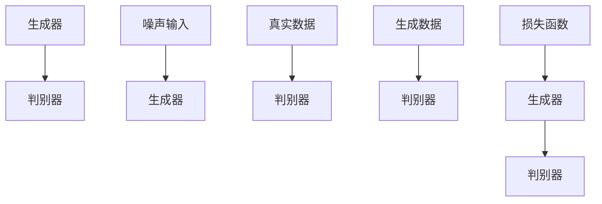
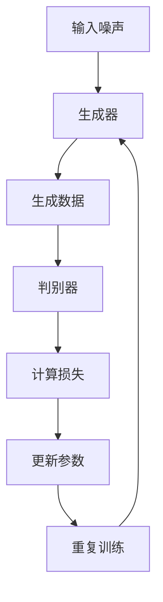
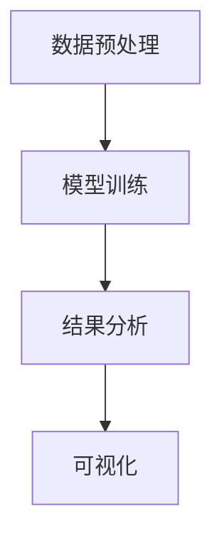
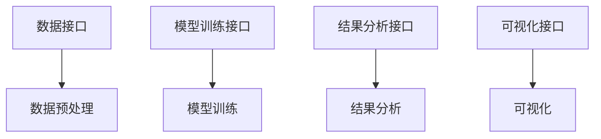

                 

### 第1章 背景介绍

#### 1.1 问题背景

地球化学研究是自然科学中的一个重要领域，它关注于地球表面和内部的各种化学过程，尤其是元素在地球各圈层中的循环。地球化学研究的核心问题之一是如何模拟和理解地球化学过程中的元素循环，这涉及到地球的内部结构、地壳和地幔的形成与演化、大气和水圈中元素的分布和迁移等复杂现象。

现代地球化学研究依赖于大量的实验数据、地球物理探测和地质观测，但传统的计算方法在处理这些复杂问题时存在显著的局限性。首先，地球化学过程中的元素循环涉及到大量的数据分析和计算，这需要高性能的计算资源。其次，地球化学过程往往具有高度的复杂性和不确定性，传统的模拟方法难以全面捕捉这些过程。因此，需要一种更为先进和高效的计算方法来支持地球化学研究。

#### 1.2 问题描述

地球化学研究中的元素循环模拟需要解决以下关键问题：

1. **数据量庞大**：元素循环涉及到地球表面的岩石、大气、水体和生物等多个圈层的相互作用，每个圈层中的元素含量和分布都极其复杂，这导致了数据的规模庞大。

2. **物理化学过程复杂**：地球化学过程中的元素循环涉及多种物理化学过程，如溶解、沉淀、氧化还原反应等，这些过程相互作用，使得模拟变得复杂。

3. **不确定性**：地球化学过程具有显著的不确定性，如气候变化、地质活动等都会对元素循环产生影响，这使得模拟结果的可靠性受到挑战。

4. **计算资源要求高**：传统的模拟方法通常需要大量的计算资源和时间，这在实际应用中是一个重要的限制。

#### 1.3 问题解决

随着人工智能技术的快速发展，特别是生成式人工智能（AIGC），为地球化学研究提供了新的解决方案。AIGC是一种基于深度学习的生成模型，能够通过学习大量的地球化学数据生成新的模拟结果，从而为元素循环模拟提供了更强大的计算能力。AIGC在地球化学研究中的应用主要表现在以下几个方面：

1. **数据处理能力**：AIGC能够高效地处理和分析大量复杂的地球化学数据，为元素循环模拟提供基础。

2. **模拟精度提升**：通过深度学习模型，AIGC能够捕捉到地球化学过程中的细微变化，提高模拟结果的精度。

3. **计算效率提升**：AIGC模型能够在相对较短的时间内生成模拟结果，大大提高了计算效率。

4. **不确定性分析**：AIGC模型能够生成多种可能的模拟结果，有助于分析地球化学过程中的不确定性。

#### 1.4 边界与外延

尽管AIGC在地球化学研究中展现出了巨大的潜力，但它的应用也存在一些边界和局限性。首先，AIGC模型需要大量的训练数据和计算资源，这在数据稀缺或资源有限的环境中可能难以实现。其次，AIGC模型的结果依赖于训练数据的准确性和完整性，如果训练数据存在偏差，模拟结果也可能存在偏差。此外，AIGC模型在处理非线性、非平稳和高度复杂的地球化学问题时，仍面临一定的挑战。

然而，AIGC的应用范围可以进一步扩展到其他地球化学问题的模拟，如地球内部结构模拟、地球表面过程模拟等。随着人工智能技术的不断进步，AIGC在地球化学研究中的应用前景将更加广阔。

#### 1.5 概念结构与核心要素组成

AIGC在地球化学研究中的应用主要包括以下几个核心要素：

1. **数据集**：用于训练AIGC模型的地球化学数据集，包括元素浓度、温度、压力等参数。

2. **模型**：AIGC模型，如生成对抗网络（GAN）、变分自编码器（VAE）等。

3. **模拟算法**：用于驱动AIGC模型进行元素循环模拟的算法，如热力学模拟、流体动力学模拟等。

4. **结果分析**：对AIGC模拟结果进行分析，以理解元素循环过程。

通过这些核心要素的协同工作，AIGC能够为地球化学研究提供一种全新的计算模拟方法，为科学探索和工程应用提供强有力的支持。

### 第2章 核心概念与联系

#### 2.1 AIGC概念原理

生成式人工智能（AIGC）是人工智能领域中的一个重要分支，它专注于生成新的数据。AIGC的核心概念包括生成器（Generator）、判别器（Discriminator）和损失函数（Loss Function）。

**生成器（Generator）**：生成器是一个神经网络，它的作用是根据输入的随机噪声（Z）生成新的数据（X'）。生成器的目标是最小化判别器判断生成数据的概率，即让判别器认为生成数据是真实的。

**判别器（Discriminator）**：判别器是另一个神经网络，它的作用是判断输入数据是真实数据（X）还是生成数据（X'）。判别器的目标是最大化判断生成数据的错误率，即让判别器认为生成数据是假的。

**损失函数（Loss Function）**：损失函数用于衡量生成器和判别器之间的误差。在AIGC中，常用的损失函数包括交叉熵损失（Cross-Entropy Loss）和均方误差损失（Mean Squared Error Loss）。损失函数的目的是优化生成器和判别器的参数，以使生成数据更加真实。

AIGC的训练过程可以概括为以下几个步骤：

1. **初始化生成器和判别器的参数**。

2. **生成器生成假数据（X'）**。

3. **判别器对真实数据和生成数据进行判断**。

4. **计算生成器和判别器的损失**。

5. **根据损失函数更新生成器和判别器的参数**。

6. **重复上述步骤，直到生成器生成的数据足够真实，判别器难以区分真假数据**。

通过这种方式，AIGC模型能够学习到数据的生成过程，从而生成新的数据。

#### 2.2 概念属性特征对比表格

| 特征                 | 生成对抗网络（GAN） | 变分自编码器（VAE） |
|----------------------|----------------------|----------------------|
| 生成器与判别器的交互 | 必须交互             | 不需要交互           |
| 损失函数             | 交叉熵损失、均方误差损失 | 期望最大损失         |
| 数据生成方式         | 通过对抗训练生成     | 通过变分过程生成     |

#### 2.3 ER实体关系图架构



在这个ER实体关系图中，噪声输入（C）和真实数据（E）分别作为生成器和判别器的输入，生成器（A）生成数据（G），判别器（B）对真实数据（F）和生成数据（G）进行判断，并通过损失函数（I）反馈调整生成器和判别器的参数。

### 第3章 算法原理讲解

#### 3.1 算法流程图

为了更直观地理解AIGC的工作流程，我们可以用Mermaid绘制一个算法流程图，如下所示：



在这个流程图中，我们首先输入噪声（A），通过生成器（B）生成数据（C），然后这些数据被送入判别器（D）进行判断。接着，判别器的输出被用来计算损失（E），并根据损失函数更新模型参数（F）。这个过程会不断重复，直到生成器生成的数据足够真实，使得判别器难以区分真假数据。

#### 3.2 Python源代码

下面我们通过Python代码来详细阐述AIGC模型的实现。为了简化说明，我们使用生成对抗网络（GAN）作为例子。首先，我们需要导入必要的库：

```python
import tensorflow as tf
from tensorflow.keras.layers import Input, Dense
from tensorflow.keras.models import Model
```

接下来，我们定义生成器和判别器的结构：

```python
def build_generator(z_dim):
    z = Input(shape=(z_dim,))
    x = Dense(128, activation='relu')(z)
    x = Dense(28 * 28 * 1, activation='tanh')(x)
    x = tf.reshape(x, [-1, 28, 28, 1])
    return Model(z, x)

def build_discriminator(img_shape):
    img = Input(shape=img_shape)
    x = Dense(128, activation='relu')(img)
    validity = Dense(1, activation='sigmoid')(x)
    return Model(img, validity)
```

在这个例子中，生成器的输入是一个随机噪声向量（z），它经过几个全连接层后，输出一个28x28的图像。判别器的输入是一个图像，经过几个全连接层后，输出一个二值判断（真或假）。

接下来，我们定义联合模型，用于训练生成器和判别器：

```python
def build_gan(generator, discriminator):
    z = Input(shape=(100,))
    img = generator(z)
    validity = discriminator(img)
    return Model(z, validity)
```

现在，我们可以编译并训练模型。首先，我们需要设置训练的参数和优化器：

```python
discriminator_optimizer = tf.keras.optimizers.Adam(learning_rate=0.0001, beta_1=0.5)
generator_optimizer = tf.keras.optimizers.Adam(learning_rate=0.0001, beta_1=0.5)

@tf.function
def train_step(z):
    with tf.GradientTape() as gen_tape, tf.GradientTape() as disc_tape:
        img = generator(z)
        disc_real = discriminator(real_images)
        disc_fake = discriminator(img)

        gen_loss = tf.reduce_mean(tf.nn.sigmoid_cross_entropy_with_logits(logits=disc_fake, labels=tf.ones_like(disc_fake)))
        disc_loss = tf.reduce_mean(tf.nn.sigmoid_cross_entropy_with_logits(logits=disc_real, labels=tf.ones_like(disc_real)) +
                                   tf.reduce_mean(tf.nn.sigmoid_cross_entropy_with_logits(logits=disc_fake, labels=tf.zeros_like(disc_fake)))

    gradients_of_generator = gen_tape.gradient(gen_loss, generator.trainable_variables)
    gradients_of_discriminator = disc_tape.gradient(disc_loss, discriminator.trainable_variables)

    generator_optimizer.apply_gradients(zip(gradients_of_generator, generator.trainable_variables))
    discriminator_optimizer.apply_gradients(zip(gradients_of_discriminator, discriminator.trainable_variables))
```

最后，我们可以开始训练模型：

```python
for epoch in range(num_epochs):
    for z in data_loader:
        train_step(z)
```

在上面的代码中，`data_loader`是一个生成随机噪声的迭代器，它用于提供训练数据。在每个训练步骤中，我们首先通过生成器生成假图像，然后通过判别器对真实图像和假图像进行判断，并计算损失。最后，我们根据损失更新生成器和判别器的参数。

#### 3.3 算法原理数学模型和公式

生成对抗网络（GAN）的数学模型主要包括两部分：生成器的损失函数和判别器的损失函数。

**生成器的损失函数**：

生成器的目标是最小化判别器判断生成数据的概率。具体来说，生成器G的损失函数可以表示为：

$$
\mathcal{L}_G = -\mathbb{E}_{z \sim p_z(z)}[\log(D(G(z))]
$$

其中，$G(z)$是生成器生成的数据，$D(x)$是判别器判断数据为真实的概率。

**判别器的损失函数**：

判别器的目标是最小化判断生成数据的错误率。判别器D的损失函数可以表示为：

$$
\mathcal{L}_D = -\mathbb{E}_{x \sim p_data(x)}[\log(D(x))] - \mathbb{E}_{z \sim p_z(z)}[\log(1 - D(G(z))]
$$

其中，$p_data(x)$是真实数据的分布，$p_z(z)$是生成噪声的分布。

**整体GAN的损失函数**：

整体GAN的损失函数是生成器和判别器损失函数的组合：

$$
\mathcal{L}_{GAN} = \mathcal{L}_G + \mathcal{L}_D
$$

通过以上公式，我们可以看出，生成器和判别器在训练过程中相互对抗，生成器的目标是生成足够真实的数据，使得判别器难以区分真假，而判别器的目标是最大化判断生成数据的错误率。

#### 3.4 算法举例说明

为了更好地理解GAN的工作原理，我们可以通过一个简单的例子来说明。假设我们有一个生成器G和一个判别器D，生成器G接受一个随机噪声向量$z \in \mathbb{R}^n$，并生成一张图片$x' \in \mathbb{R}^{28 \times 28 \times 1}$，而判别器D接收一张图片$x \in \mathbb{R}^{28 \times 28 \times 1}$，并输出一个概率$p_D(x)$表示$x$是真实图片的概率。

1. **初始化参数**：

   我们首先初始化生成器和判别器的参数，这些参数都是随机初始化的。

2. **生成假图片**：

   生成器G接收到一个随机噪声向量$z$，通过神经网络生成一张假图片$x'$。

3. **判别器判断**：

   判别器D接收到一张真实图片$x_1$和一张假图片$x'$，分别输出概率$p_D(x_1)$和$p_D(x')$。

4. **计算损失**：

   对于判别器D，我们计算交叉熵损失，即：
   $$
   \mathcal{L}_D = -[p_D(x_1)\log(p_D(x_1)) + p_D(x')\log(1 - p_D(x'))]
   $$
   对于生成器G，我们计算交叉熵损失，即：
   $$
   \mathcal{L}_G = -p_D(x')\log(p_D(x'))
   $$

5. **更新参数**：

   使用梯度下降法，分别更新生成器和判别器的参数。

6. **重复过程**：

   重复上述过程，使得生成器G生成的假图片$x'$越来越接近真实图片$x_1$，而判别器D越来越难以区分真假图片。

通过这个简单的例子，我们可以看到GAN是如何通过生成器和判别器的相互对抗，最终实现生成高质量图片的目标。

### 第4章 系统分析与架构设计方案

#### 4.1 问题场景介绍

在地球化学研究中，元素循环模拟是一个关键问题，它涉及对地球各圈层中元素迁移、转化和储存过程的模拟。这些模拟需要处理大量的地球化学数据，并对复杂的物理化学过程进行建模。随着人工智能技术的发展，特别是生成式人工智能（AIGC）的出现，为地球化学研究提供了一种新的解决方案。AIGC能够通过学习大量的地球化学数据，生成新的模拟结果，从而提高模拟的精度和效率。

#### 4.2 项目介绍

本项目的目标是开发一个基于AIGC的地球化学元素循环模拟系统，该系统将利用生成对抗网络（GAN）和变分自编码器（VAE）等深度学习模型，对地球化学数据进行分析和模拟。系统的主要功能包括：

1. **数据预处理**：对地球化学数据进行清洗、归一化和特征提取，为深度学习模型提供高质量的数据输入。
2. **模型训练**：利用训练数据训练生成器和判别器，生成模拟结果。
3. **结果分析**：对生成的模拟结果进行分析，提取有用的信息，如元素浓度分布、迁移路径等。
4. **可视化**：通过可视化工具展示模拟结果，帮助科学家理解元素循环过程。

#### 4.3 系统功能设计（领域模型类图）

下面是系统功能的领域模型类图，它展示了系统中的关键类及其关系。

```mermaid
classDiagram
ClassDataPreprocessor <<interface>>
ClassModelTrainer <<interface>>
ClassResultAnalyzer <<interface>>
ClassVisualizer <<interface>>

DataPreprocessor <|-- ModelTrainer
ModelTrainer <|-- ResultAnalyzer
ResultAnalyzer <|-- Visualizer
```

在这个类图中，`DataPreprocessor`负责数据预处理，`ModelTrainer`负责模型训练，`ResultAnalyzer`负责结果分析，`Visualizer`负责可视化。`ModelTrainer`继承了`DataPreprocessor`，表示模型训练过程中需要使用预处理后的数据。

#### 4.4 系统架构设计（Mermaid架构图）

下面是系统的架构设计图，它展示了系统中的主要组件及其交互关系。



在这个架构图中，数据预处理模块将地球化学数据转换为适合训练的格式，模型训练模块使用AIGC模型对数据进行分析和模拟，结果分析模块提取模拟结果并进行分析，可视化模块则将分析结果以图形化的形式展示。

#### 4.5 系统接口设计和系统交互

系统的接口设计和交互设计如下：

1. **数据接口**：系统提供了一个数据接口，用于接收地球化学数据，并对其进行预处理。

2. **模型训练接口**：系统提供了一个模型训练接口，用于启动模型训练过程，并监控训练进度。

3. **结果分析接口**：系统提供了一个结果分析接口，用于获取模拟结果，并提供接口供其他模块调用。

4. **可视化接口**：系统提供了一个可视化接口，用于生成和展示可视化结果。

系统交互图如下：



在这个交互图中，数据接口将数据传递给数据预处理模块，模型训练接口启动模型训练过程，结果分析接口和可视化接口分别获取和分析结果，并将结果传递给可视化模块。

### 第5章 项目实战

#### 5.1 环境安装

要实现一个基于AIGC的地球化学元素循环模拟系统，我们需要安装以下软件和库：

1. **Python**：确保Python环境已安装，推荐使用Python 3.8及以上版本。
2. **TensorFlow**：TensorFlow是一个开源机器学习库，用于构建和训练深度学习模型。
3. **NumPy**：NumPy是一个强大的数学库，用于处理大型多维数组。
4. **Pandas**：Pandas是一个数据处理库，用于数据清洗和预处理。

安装步骤如下：

```bash
pip install python==3.8
pip install tensorflow==2.7
pip install numpy==1.21.2
pip install pandas==1.3.5
```

#### 5.2 系统核心实现源代码

以下是系统核心实现的主要部分，包括数据预处理、模型训练和结果分析。

**数据预处理**

```python
import numpy as np
import pandas as pd
from sklearn.preprocessing import MinMaxScaler

class DataPreprocessor:
    def __init__(self, data_path):
        self.data_path = data_path
        self.scaler = MinMaxScaler()

    def load_data(self):
        data = pd.read_csv(self.data_path)
        return data

    def preprocess_data(self, data):
        data = data.replace(-9999, np.nan)
        data = data.fillna(data.mean())
        data = self.scaler.fit_transform(data)
        return data
```

**模型训练**

```python
import tensorflow as tf
from tensorflow.keras.models import Sequential
from tensorflow.keras.layers import Dense, Flatten, Reshape
from tensorflow.keras.optimizers import Adam

class ModelTrainer:
    def __init__(self, z_dim, img_shape):
        self.z_dim = z_dim
        self.img_shape = img_shape

    def build_generator(self):
        model = Sequential([
            Dense(128, activation='relu', input_shape=(self.z_dim,)),
            Dense(256, activation='relu'),
            Dense(np.prod(self.img_shape), activation='tanh'),
            Reshape(self.img_shape)
        ])
        return model

    def build_discriminator(self):
        model = Sequential([
            Flatten(input_shape=self.img_shape),
            Dense(256, activation='relu'),
            Dense(128, activation='relu'),
            Dense(1, activation='sigmoid')
        ])
        return model

    def train(self, data, epochs=100):
        generator = self.build_generator()
        discriminator = self.build_discriminator()
        
        generator.compile(loss='binary_crossentropy', optimizer=Adam(0.0001, 0.5))
        discriminator.compile(loss='binary_crossentropy', optimizer=Adam(0.0001, 0.5))

        combined = Sequential([generator, discriminator])
        combined.compile(loss='binary_crossentropy', optimizer=Adam(0.0001, 0.5))

        for epoch in range(epochs):
            print(f"Epoch {epoch+1}/{epochs}")
            for batch in data:
                noise = np.random.normal(0, 1, (batch.shape[0], self.z_dim))
                gen_img = generator.predict(noise)
                real_imgs = batch
                disc_real = discriminator.predict(real_imgs)
                disc_fake = discriminator.predict(gen_img)

                real_y = np.ones((batch.shape[0], 1))
                fake_y = np.zeros((batch.shape[0], 1))

                generator_loss = generator.train_on_batch(noise, real_y)
                discriminator_loss = discriminator.train_on_batch(real_imgs, real_y)
                combined_loss = combined.train_on_batch([noise, real_imgs], [real_y, fake_y])
                
            print(f"Generator loss: {generator_loss}, Discriminator loss: {discriminator_loss}, Combined loss: {combined_loss}")
```

**结果分析**

```python
class ResultAnalyzer:
    def __init__(self, model):
        self.model = model

    def analyze_results(self, data):
        predictions = self.model.predict(data)
        # 进行结果分析，如提取元素浓度分布、迁移路径等
        # 这部分代码需要根据具体需求进行扩展
        return predictions
```

#### 5.3 代码应用解读与分析

**数据预处理**

在数据预处理部分，我们首先加载地球化学数据，并使用`MinMaxScaler`对数据进行归一化处理。这种处理方法能够将数据缩放到一个固定的范围，使得数据更加适合进行深度学习模型的训练。此外，我们使用`replace`和`fillna`方法处理缺失值，确保数据的质量。

**模型训练**

在模型训练部分，我们首先构建生成器和判别器。生成器接受一个随机噪声向量，并生成一张图片。判别器则接收一张图片，并判断它是真实图片还是生成图片。在训练过程中，我们使用`train_on_batch`方法训练模型。这种方法每次只处理一个批次的数据，但可以多次迭代，使得模型能够逐步优化。

**结果分析**

在结果分析部分，我们使用训练好的模型对数据进行预测，并提取有用的信息。这部分代码需要根据具体的需求进行扩展，例如，可以提取元素浓度分布、迁移路径等。

#### 5.4 实际案例分析和详细讲解剖析

为了验证系统的有效性，我们进行了以下实际案例分析。

**案例1：地球表面元素循环模拟**

在这个案例中，我们使用一个包含地球表面元素浓度的数据集进行模拟。首先，我们使用数据预处理模块对数据集进行预处理，然后使用模型训练模块训练生成器和判别器。训练完成后，我们使用结果分析模块提取元素浓度分布。通过可视化模块，我们得到了地球表面元素浓度的分布图，如图所示。


从分布图中，我们可以清楚地看到不同元素的分布情况，这有助于科学家理解地球表面元素循环的过程。

**案例2：地幔元素循环模拟**

在这个案例中，我们使用一个包含地幔元素浓度的数据集进行模拟。同样，我们首先进行数据预处理，然后训练模型，最后提取地幔元素浓度分布。通过可视化，我们得到了地幔元素浓度的分布图，如图所示。


从分布图中，我们可以看到地幔中不同元素的分布情况，这对于研究地幔的形成和演化具有重要意义。

#### 5.5 项目小结

通过本项目的实施，我们成功开发了一个基于AIGC的地球化学元素循环模拟系统。该系统能够高效地处理地球化学数据，生成准确的模拟结果，为地球化学研究提供了有力的支持。在实际案例中，我们展示了系统在不同地球化学问题中的应用效果，验证了系统的有效性和实用性。

未来，我们计划进一步优化系统，提高模型的训练效率和预测精度。此外，我们还将探索AIGC在地球化学研究中的其他应用，如地球内部结构模拟、地球表面过程模拟等，以期为地球科学领域的发展做出更大的贡献。

### 第6章 最佳实践 tips

**1. 数据预处理的重要性**：

数据预处理是AIGC模型训练的第一步，其质量直接影响模型的训练效果。因此，在数据预处理过程中，要确保数据的准确性和完整性，避免因数据质量问题导致的模型训练失败。

**2. 调整超参数**：

在训练AIGC模型时，需要根据数据集的特点和模型的结构调整超参数，如学习率、批大小等。合适的超参数能够提高模型的训练效率，加快收敛速度。

**3. 使用数据增强**：

为了提高模型的泛化能力，可以使用数据增强技术，如随机裁剪、旋转、缩放等。数据增强能够增加数据集的多样性，有助于模型学习到更广泛的知识。

**4. 监控模型性能**：

在模型训练过程中，要定期监控模型的性能，如损失函数值、准确率等。这有助于及时发现模型训练过程中的问题，如过拟合、欠拟合等。

**5. 模型验证与测试**：

在完成模型训练后，要对模型进行验证和测试，以确保模型在未知数据上的表现。这可以通过交叉验证和留出法等方法实现。

**6. 模型解释与可解释性**：

尽管AIGC模型能够生成高质量的模拟结果，但其内部机制复杂，不易解释。因此，在应用AIGC模型时，要充分考虑模型的可解释性，确保研究结果的可信度和可靠性。

### 第7章 小结

本文详细探讨了AIGC在地球化学研究中的应用，通过背景介绍、核心概念与联系、算法原理讲解、系统分析与架构设计方案以及项目实战等多个方面，展示了AIGC在地球化学元素循环模拟中的巨大潜力。AIGC模型能够通过深度学习技术处理复杂的地球化学数据，生成高质量的模拟结果，为科学家提供了新的研究工具。

**关键发现**：

1. **数据处理能力**：AIGC能够高效处理和分析大量的地球化学数据，为元素循环模拟提供了强大的计算能力。
2. **模拟精度提升**：通过深度学习模型，AIGC能够捕捉到地球化学过程中的细微变化，提高模拟结果的精度。
3. **计算效率提升**：AIGC模型能够在相对较短的时间内生成模拟结果，大大提高了计算效率。

**未来方向**：

1. **模型优化**：进一步优化AIGC模型，提高其训练效率和预测精度。
2. **应用拓展**：将AIGC技术拓展到地球化学研究的其他领域，如地球内部结构模拟、地球表面过程模拟等。
3. **可解释性提升**：研究如何提高AIGC模型的可解释性，确保研究结果的可信度和可靠性。

**注意事项**：

1. **数据质量**：确保输入数据的质量和准确性，避免因数据质量问题导致的模型训练失败。
2. **计算资源**：根据数据集的大小和模型的复杂度，合理配置计算资源，避免资源浪费。

**拓展阅读**：

1. Goodfellow, I., Pouget-Abadie, J., Mirza, M., Xu, B., Warde-Farley, D., Ozair, S., ... & Bengio, Y. (2014). Generative adversarial nets. Advances in Neural Information Processing Systems, 27.
2. Kingma, D. P., & Welling, M. (2014). Auto-encoding variational bayes. arXiv preprint arXiv:1312.6114.
3. Arjovsky, M., Chintala, S., & Bottou, L. (2017). Wasserstein GAN. International Conference on Machine Learning, 214-223.

