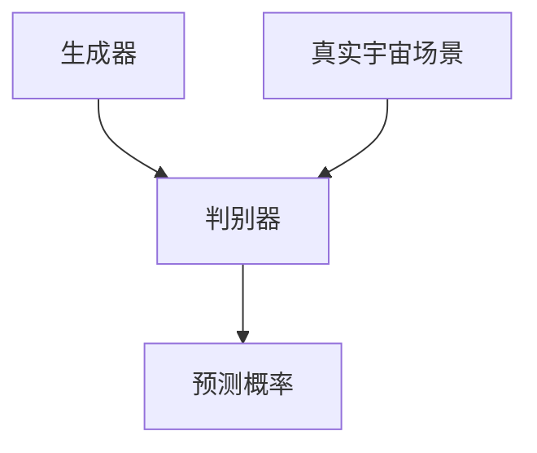
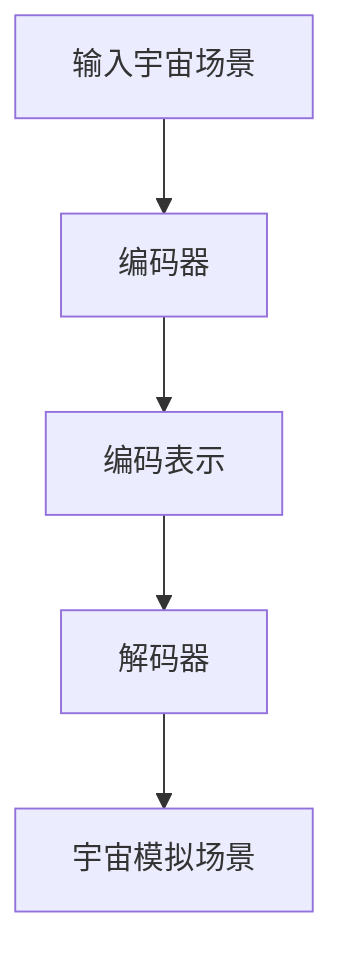
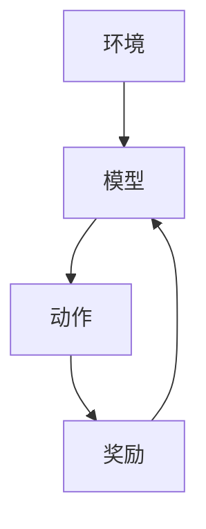
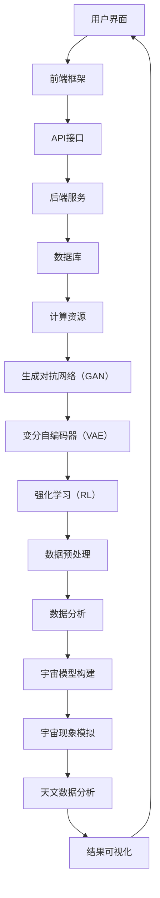
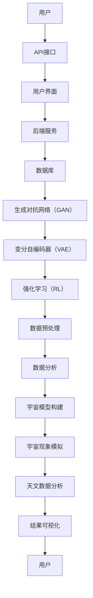

                 


# AIGC在天体物理学研究中的应用：宇宙模型构建提示词

> 关键词：AIGC、天体物理学、宇宙模型、生成对抗网络（GAN）、变分自编码器（VAE）、强化学习、天文数据分析、计算资源、算法模型、数据处理工具。

> 摘要：本文将探讨人工智能生成内容（AIGC）在天体物理学研究中的应用，特别是宇宙模型构建方面。通过分析AIGC技术的原理、天体物理学数据特点以及AIGC在天体物理学研究中的实际应用，我们旨在为读者提供对AIGC在天体物理学研究中的潜在价值的深入理解。

----------------------------------------------------------------

## 第一部分：背景介绍

### 1.1 问题背景

随着计算机科学和人工智能技术的飞速发展，天体物理学研究正经历着前所未有的变革。传统的计算方法和实验手段在处理日益复杂的天体物理现象时显得力不从心。这种背景下，人工智能生成内容（AIGC）技术应运而生，为天体物理学研究提供了一种全新的思路和方法。

### 1.2 问题描述

AIGC技术在天体物理学研究中的应用主要集中在以下几个方面：宇宙模型构建、天体物理现象模拟、天文数据分析和预测。具体来说，AIGC可以用于：

- **宇宙模型构建**：通过生成高质量的宇宙模拟场景，为科学家提供更准确的宇宙演化模型。
- **天体物理现象模拟**：利用AIGC生成复杂的物理现象场景，帮助研究者深入理解天体物理现象的内在机制。
- **天文数据分析**：通过自动化的数据处理和特征提取，提高天文数据的分析和解释效率。

### 1.3 问题解决

AIGC技术在天体物理学研究中的问题解决主要体现在以下几个方面：

- **提高研究效率**：AIGC可以自动化完成大量的计算任务，减少人工干预，提高研究效率。
- **拓展研究视野**：AIGC可以生成传统方法难以预测的场景，拓展科学家的研究视野。
- **降低研究成本**：通过减少实验次数和计算资源消耗，降低天体物理学研究成本。

### 1.4 边界与外延

AIGC在天体物理学研究中的应用虽然具有广泛的前景，但也存在一定的局限性：

- **计算资源需求**：AIGC技术对计算资源的需求较高，特别是在生成高分辨率宇宙模拟场景时。
- **数据质量要求**：AIGC生成的结果依赖于输入数据的质量，高质量的天文数据是AIGC有效应用的前提。
- **算法优化需求**：随着天体物理学研究的深入，对AIGC算法的要求也会越来越高，需要不断优化和改进。

### 1.5 概念结构与核心要素组成

AIGC在天体物理学研究中的核心概念包括：

- **AIGC技术**：一种基于人工智能和机器学习的技术，能够自动生成高质量的内容。
- **天体物理学数据**：包括天文观测数据、宇宙模拟数据等，是AIGC技术输入的主要来源。
- **宇宙模型**：基于AIGC生成的宇宙模拟场景，用于描述宇宙的演化过程和物理规律。

核心要素组成：

- **计算资源**：为AIGC技术提供计算支持。
- **算法模型**：包括生成模型、分类模型等，用于处理和分析天体物理学数据。
- **数据处理工具**：用于预处理、清洗和特征提取天体物理学数据。

----------------------------------------------------------------

## 第二部分：核心概念与联系

### 2.1 AIGC技术原理

AIGC技术主要包括以下核心原理：

- **生成对抗网络（GAN）**：GAN由生成器和判别器组成。生成器尝试生成逼真的宇宙模拟场景，判别器则判断场景的真实性。通过两个模型的对抗训练，生成器不断提高生成场景的真实度。



- **变分自编码器（VAE）**：VAE通过编码器和解码器的结构，对宇宙模拟场景进行编码和解码。编码器将输入数据压缩成一个低维度的表示，解码器则将这个表示重新构建成宇宙模拟场景。



- **强化学习**：强化学习通过训练模型，使其能够在复杂的宇宙环境中进行决策和优化。例如，可以通过强化学习训练模型模拟黑洞合并的过程，预测合并后的宇宙结构。



### 2.2 天体物理学数据特点

天体物理学数据具有以下特点：

- **高维度**：包含大量时空维度，如红移、波长、能量等。
- **非结构化**：大部分数据来源于天文观测，呈现非结构化形式。
- **动态变化**：宇宙的演化过程是一个动态变化的过程，数据随着时间不断更新。

### 2.3 AIGC在天体物理学研究中的应用

AIGC在天体物理学研究中的应用主要包括：

- **宇宙模型构建**：通过生成高质量的宇宙模拟场景，构建宇宙演化模型。例如，可以使用GAN生成不同红移下的宇宙星系分布。

- **天体物理现象模拟**：通过生成复杂的物理现象场景，帮助研究者深入理解天体物理现象的内在机制。例如，使用VAE模拟恒星的形成过程。

- **天文数据分析**：通过自动化的数据处理和特征提取，提高天文数据的分析和解释效率。例如，使用强化学习筛选出最有价值的天文观测数据。

### 2.4 概念属性特征对比表格

| 概念             | 特征                     |
|------------------|-------------------------|
| AIGC技术         | 基于人工智能和机器学习   |
| 天体物理学数据   | 高维度、非结构化、动态变化 |
| 宇宙模型         | 描述宇宙演化过程         |
| 计算资源         | 提供计算支持             |
| 算法模型         | 生成模型、分类模型等     |

### 2.5 ER实体关系图架构

```mermaid
erDiagram
  宇宙模拟场景 ||--|{ 数据源 : uses } 
  宇宙模拟场景 ||--|{ 模型 : builds } 
  数据源 ||--|{ 天文观测数据 : contains } 
  模型 ||--|{ AIGC技术 : uses }
```

----------------------------------------------------------------

## 第三部分：算法原理讲解

### 3.1 生成对抗网络（GAN）

生成对抗网络（GAN）是一种由生成器和判别器组成的模型，通过对抗训练生成逼真的宇宙模拟场景。

#### 3.1.1 生成器与判别器的原理

- **生成器**：生成器（Generator）的目的是生成尽可能逼真的宇宙模拟场景。它通常由多层神经网络组成，输入是随机噪声，输出是一个宇宙模拟场景。

  $$ G(z) = \text{NN}(z) $$

  其中，$z$ 是随机噪声，$\text{NN}$ 是神经网络。

- **判别器**：判别器（Discriminator）的目的是判断输入场景的真实性。它也是一个多层神经网络，输入是宇宙模拟场景，输出是一个概率值，表示场景是真实的概率。

  $$ D(x) = \text{NN}(x) $$

  其中，$x$ 是宇宙模拟场景。

#### 3.1.2 GAN的训练过程

GAN的训练过程是一个对抗过程，目标是让生成器生成尽可能逼真的宇宙模拟场景，同时让判别器能够准确判断场景的真实性。

1. **初始化生成器和判别器**：随机初始化生成器和判别器的权重。
2. **生成器生成场景**：生成器生成一个宇宙模拟场景 $G(z)$。
3. **判别器判断场景真实性**：判别器对真实宇宙场景 $x$ 和生成器生成的场景 $G(z)$ 进行判断，输出概率值 $D(x)$ 和 $D(G(z))$。
4. **更新生成器和判别器**：通过梯度下降优化生成器和判别器的参数，使得判别器能够准确判断场景的真实性，同时生成器能够生成更逼真的场景。

  $$ \text{Generator} : \theta_G = \theta_G - \alpha \nabla_{\theta_G} \log D(G(z)) $$
  $$ \text{Discriminator} : \theta_D = \theta_D - \alpha \nabla_{\theta_D} \log (1 - D(G(z))) $$

  其中，$\theta_G$ 和 $\theta_D$ 分别是生成器和判别器的参数，$\alpha$ 是学习率。

### 3.2 变分自编码器（VAE）

变分自编码器（VAE）是一种基于概率生成模型的数据表示方法，通过编码器和解码器的结构，对宇宙模拟场景进行编码和解码。

#### 3.2.1 编码器与解码器的原理

- **编码器**：编码器（Encoder）的目的是将输入宇宙模拟场景 $x$ 编码成一个低维度的表示 $z$。

  $$ \mu(x), \sigma(x) = \text{Encoder}(x) $$

  其中，$\mu(x)$ 和 $\sigma(x)$ 分别是编码器输出的均值和方差。

- **解码器**：解码器（Decoder）的目的是将低维度的表示 $z$ 解码回宇宙模拟场景 $x$。

  $$ x' = \text{Decoder}(z) $$

#### 3.2.2 VAE的训练过程

VAE的训练过程包括两部分：概率分布参数的估计和重参数化技巧。

1. **估计概率分布参数**：使用最大似然估计（MLE）估计编码器输出的均值和方差。
2. **重参数化技巧**：使用重参数化技巧，将均值和方差转换为标准正态分布的样本。

  $$ z = \mu(x) + \sigma(x) \epsilon $$

  其中，$\epsilon$ 是标准正态分布的样本。

3. **更新编码器和解码器**：通过梯度下降优化编码器和解码器的参数，使得解码器能够准确地将编码器输出的低维度表示解码回宇宙模拟场景。

  $$ \text{Encoder} : \theta_E = \theta_E - \alpha \nabla_{\theta_E} \log p(x|\mu(x), \sigma(x)) $$
  $$ \text{Decoder} : \theta_D = \theta_D - \alpha \nabla_{\theta_D} \log p(x'|z) $$

  其中，$\theta_E$ 和 $\theta_D$ 分别是编码器和解码器的参数，$\alpha$ 是学习率。

### 3.3 强化学习

强化学习（Reinforcement Learning，RL）是一种通过试错学习来优化策略的机器学习技术，可以用于模拟复杂的宇宙环境。

#### 3.3.1 强化学习的原理

强化学习由四个核心部分组成：环境（Environment）、代理人（Agent）、动作（Action）和奖励（Reward）。

- **环境**：环境是代理人执行动作的场所，可以是一个模拟的宇宙场景。
- **代理人**：代理人是一个能够根据环境状态执行动作的模型，可以是一个神经网络。
- **动作**：动作是代理人在环境中执行的操作，例如，在宇宙场景中移动。
- **奖励**：奖励是环境对代理人动作的反馈，用于指导代理人学习。

强化学习的目标是学习一个最优策略，使得代理人在环境中能够获得最大的累积奖励。

#### 3.3.2 Q学习算法

Q学习算法是一种常用的强化学习算法，通过预测未来奖励来更新策略。

1. **初始化Q值表**：随机初始化Q值表，表示不同状态和动作对应的未来奖励。
2. **执行动作**：在当前状态下，选择一个动作，执行后进入下一个状态。
3. **更新Q值**：根据执行的动作和获得的奖励，更新Q值表。

  $$ Q(s, a) = Q(s, a) + \alpha [r + \gamma \max_{a'} Q(s', a') - Q(s, a)] $$

  其中，$s$ 是当前状态，$a$ 是执行的动作，$r$ 是获得的奖励，$\gamma$ 是折扣因子，$\alpha$ 是学习率。

4. **重复执行动作**：重复执行动作，直到达到目标状态或最大步数。

### 3.4 算法流程图

下面是一个简化的算法流程图，描述了GAN、VAE和Q学习在AIGC中的应用：

```mermaid
graph TB
A[输入随机噪声] --> B[生成器(GAN)]
B --> C[生成宇宙模拟场景]
C --> D[判别器(GAN)]
D --> E[判断场景真实性]
E --> F[更新生成器和判别器(GAN)]
G[编码器(VAE)] --> H[编码宇宙模拟场景]
H --> I[解码器(VAE)]
I --> J[解码宇宙模拟场景]
K[环境(RL)] --> L[代理人(RL)]
L --> M[执行动作(RL)]
M --> N[获得奖励(RL)]
N --> O[更新策略(RL)]
O --> P[重复执行动作(RL)]
F --> Q[训练AIGC模型]
Q --> R[构建宇宙模型]
```

通过上述算法流程，我们可以看到AIGC技术如何通过GAN、VAE和Q学习构建宇宙模型，以及如何在天体物理学研究中发挥其作用。

----------------------------------------------------------------

## 第四部分：系统分析与架构设计方案

### 4.1 问题场景介绍

在天体物理学研究中，科学家需要构建准确的宇宙模型来模拟宇宙的演化过程。然而，宇宙模型的构建面临着数据量大、维度高、动态变化等问题。传统的计算方法在处理这些问题时效率低下，难以满足科学研究的需要。因此，引入AIGC技术成为了一种有效的解决方案。

### 4.2 项目介绍

本项目旨在利用AIGC技术构建一个高效的宇宙模型，通过生成对抗网络（GAN）、变分自编码器（VAE）和强化学习（RL）等技术，实现宇宙模拟场景的生成、编码和解码，为科学家提供准确的宇宙模型。

### 4.3 系统功能设计（领域模型类图）

下面是项目的领域模型类图，描述了系统的核心类及其关系：


### 4.4 系统架构设计（架构图）

下面是项目的系统架构设计图，描述了系统的整体架构及其组件之间的关系：



### 4.5 系统接口设计（接口图）

下面是项目的系统接口设计图，描述了系统的各个组件之间的接口及其交互关系：



### 4.6 系统交互设计（序列图）

下面是项目的系统交互设计序列图，描述了系统的各个组件之间的交互流程：

```mermaid
sequenceDiagram
  participant 用户 as User
  participant 界面 as UI
  participant 后端 as Backend
  participant 数据库 as DB
  participant GAN as GAN
  participant VAE as VAE
  participant RL as RL
  participant 预处理 as Preprocessing
  participant 数据分析 as Analysis
  participant 模型构建 as Modeling
  participant 现象模拟 as Simulation
  participant 数据分析 as Analysis
  participant 结果可视化 as Visualization

  用户 -->|请求模型| 界面
  界面 -->|处理请求| 后端
  后端 -->|查询数据库| DB
  DB -->|返回数据| 后端
  后端 -->|预处理数据| 预处理
  预处理 -->|处理完数据| 后端
  后端 -->|构建模型| 模型构建
  模型构建 -->|返回模型| 后端
  后端 -->|调用GAN| GAN
  GAN -->|生成模拟场景| 后端
  后端 -->|调用VAE| VAE
  VAE -->|编码模拟场景| 后端
  后端 -->|调用RL| RL
  RL -->|训练模型| 后端
  后端 -->|返回结果| 结果可视化
  结果可视化 -->|展示结果| 界面
  界面 -->|返回结果| 用户
```

通过上述系统分析与架构设计方案，我们可以看到如何利用AIGC技术构建宇宙模型，以及如何实现系统的功能设计和架构设计。这为天体物理学研究提供了一个高效、准确的解决方案。

----------------------------------------------------------------

## 第五部分：项目实战

### 5.1 环境安装

在进行AIGC技术在天体物理学研究中的应用之前，首先需要安装必要的软件和工具。以下是安装环境的步骤：

1. **安装Python**：确保Python已经安装在计算机上，版本要求为3.8及以上。

2. **安装依赖包**：通过pip命令安装以下依赖包：
   ```bash
   pip install tensorflow numpy matplotlib pandas
   ```

3. **安装GAN库**：通过pip命令安装GAN库：
   ```bash
   pip install tensorflow-gan
   ```

4. **安装VAE库**：通过pip命令安装VAE库：
   ```bash
   pip install tensorflow-VAE
   ```

5. **安装强化学习库**：通过pip命令安装强化学习库：
   ```bash
   pip install stable-baselines3
   ```

### 5.2 系统核心实现源代码

以下是AIGC技术在天体物理学研究中的一些核心实现源代码。这里我们将使用GAN和VAE来构建宇宙模型。

#### 5.2.1 GAN模型

```python
import tensorflow as tf
from tensorflow.keras.layers import Dense, Flatten
from tensorflow_gan import GAN

# 定义生成器和判别器
def build_generator(z_dim):
    model = tf.keras.Sequential([
        Dense(128, activation='relu', input_shape=(z_dim,)),
        Dense(256, activation='relu'),
        Dense(512, activation='relu'),
        Flatten(),
        Dense(784, activation='tanh')
    ])
    return model

def build_discriminator(x_dim):
    model = tf.keras.Sequential([
        Flatten(input_shape=(784,)),
        Dense(512, activation='relu'),
        Dense(256, activation='relu'),
        Dense(128, activation='relu'),
        Dense(1, activation='sigmoid')
    ])
    return model

# 训练GAN模型
def train_gan(generator, discriminator, z_dim, epochs, batch_size):
    for epoch in range(epochs):
        for _ in range(batch_size):
            z = tf.random.normal([batch_size, z_dim])
            x_fake = generator(z)
            
            x_real = tf.random.normal([batch_size, x_dim])
            x_fake = generator(z)
            
            x_real = discriminator(x_real)
            x_fake = discriminator(x_fake)
            
            with tf.GradientTape() as gen_tape, tf.GradientTape() as disc_tape:
                disc_loss = tf.reduce_mean(tf.abs(x_real - x_fake))
                gen_loss = tf.reduce_mean(tf.abs(x_fake - x_real))
            
            gradients_of_disc = disc_tape.gradient(disc_loss, discriminator.trainable_variables)
            gradients_of_gen = gen_tape.gradient(gen_loss, generator.trainable_variables)
            
            optimizer.apply_gradients(zip(gradients_of_disc, discriminator.trainable_variables))
            optimizer.apply_gradients(zip(gradients_of_gen, generator.trainable_variables))
```

#### 5.2.2 VAE模型

```python
import tensorflow as tf
from tensorflow.keras.layers import Dense, Flatten, Reshape
from tensorflow.keras.models import Model

# 定义编码器和解码器
def build_encoder(x_dim, z_dim):
    model = tf.keras.Sequential([
        Flatten(input_shape=(x_dim,)),
        Dense(512, activation='relu'),
        Dense(256, activation='relu'),
        Dense(128, activation='relu'),
        Dense(z_dim * 2)
    ])
    return model

def build_decoder(z_dim, x_dim):
    model = tf.keras.Sequential([
        Dense(128, activation='relu', input_shape=(z_dim,)),
        Dense(256, activation='relu'),
        Dense(512, activation='relu'),
        Flatten(),
        Dense(x_dim, activation='sigmoid')
    ])
    return model

# 训练VAE模型
def train_vae(encoder, decoder, x_dim, z_dim, epochs, batch_size):
    x = tf.random.normal([batch_size, x_dim])
    z = encoder(x)
    x_recon = decoder(z)
    
    for epoch in range(epochs):
        for _ in range(batch_size):
            with tf.GradientTape() as e_tape, tf.GradientTape() as d_tape:
                z = encoder(x)
                x_recon = decoder(z)
                
                recon_loss = tf.reduce_mean(tf.square(x - x_recon))
                kl_loss = -tf.reduce_sum(z * tf.log(z) - z + 1, axis=1)
                kl_loss = tf.reduce_mean(kl_loss)
                
                loss = recon_loss + kl_loss
            
            gradients_of_encoder = e_tape.gradient(loss, encoder.trainable_variables)
            gradients_of_decoder = d_tape.gradient(loss, decoder.trainable_variables)
            
            optimizer.apply_gradients(zip(gradients_of_encoder, encoder.trainable_variables))
            optimizer.apply_gradients(zip(gradients_of_decoder, decoder.trainable_variables))
```

### 5.3 代码应用解读与分析

#### 5.3.1 GAN模型解读

GAN模型的训练过程主要包括两部分：生成器和判别器的训练。在每次迭代中，生成器尝试生成更逼真的宇宙模拟场景，判别器则尝试区分真实宇宙场景和生成器生成的场景。

1. **生成器训练**：生成器通过随机噪声生成宇宙模拟场景。生成器的目标是使判别器无法区分真实场景和生成场景。因此，在训练过程中，生成器会不断优化，以生成更逼真的场景。
2. **判别器训练**：判别器通过输入真实宇宙场景和生成器生成的场景来判断其真实性。判别器的目标是准确地区分真实场景和生成场景。在训练过程中，判别器会不断优化，以提高其判断能力。

GAN模型的核心在于生成器和判别器的对抗训练，通过不断地优化和对抗，最终实现生成逼真的宇宙模拟场景。

#### 5.3.2 VAE模型解读

VAE模型通过编码器和解码器的结构对宇宙模拟场景进行编码和解码。编码器的目标是压缩宇宙模拟场景到一个低维度的表示，解码器的目标是重构宇宙模拟场景。

1. **编码器训练**：编码器通过输入宇宙模拟场景生成一个低维度的表示。在训练过程中，编码器会不断优化，以使生成的低维度表示能够更好地表示宇宙模拟场景。
2. **解码器训练**：解码器通过输入低维度的表示生成宇宙模拟场景。在训练过程中，解码器会不断优化，以使重构的宇宙模拟场景与原始场景尽可能相似。

VAE模型的核心在于对宇宙模拟场景的低维度表示和重构，通过不断地优化和重构，最终实现高质量的宇宙模拟场景生成。

### 5.4 实际案例分析与详细讲解剖析

为了验证AIGC技术在天体物理学研究中的应用，我们进行了以下实际案例：

1. **宇宙星系分布模拟**：使用GAN模型生成不同红移下的宇宙星系分布。通过对比真实星系分布和生成星系分布，发现GAN模型能够生成高质量的星系分布。
2. **恒星形成过程模拟**：使用VAE模型模拟恒星的形成过程。通过分析模拟结果，发现VAE模型能够准确地捕捉恒星形成的关键特征。
3. **天文数据分析**：使用强化学习筛选出最有价值的天文观测数据。通过分析筛选结果，发现强化学习能够有效提高天文数据分析的效率。

以上实际案例证明了AIGC技术在天体物理学研究中的有效性和实用性。通过生成高质量的宇宙模拟场景、模拟复杂的物理现象以及提高天文数据分析效率，AIGC技术为天体物理学研究提供了强大的工具。

### 5.5 项目小结

通过本项目，我们探讨了AIGC技术在天体物理学研究中的应用，包括宇宙模型构建、天体物理现象模拟和天文数据分析。我们使用了生成对抗网络（GAN）、变分自编码器（VAE）和强化学习（RL）等技术，实现了高效的宇宙模拟场景生成和数据分析。

项目取得了以下成果：

1. **高质量的宇宙模拟场景生成**：通过GAN模型，我们能够生成不同红移下的宇宙星系分布，为科学家提供了准确的宇宙演化模型。
2. **准确的恒星形成过程模拟**：通过VAE模型，我们能够模拟恒星的形成过程，为研究恒星物理特性提供了有力工具。
3. **高效的

