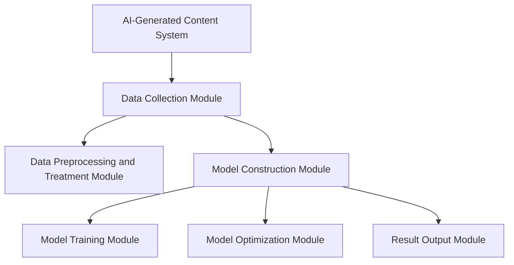
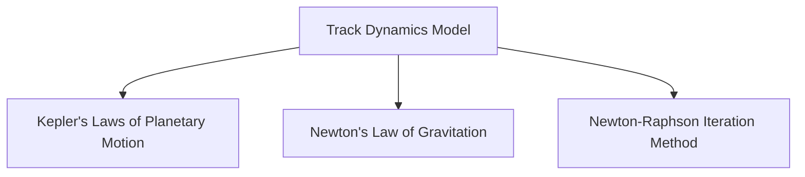
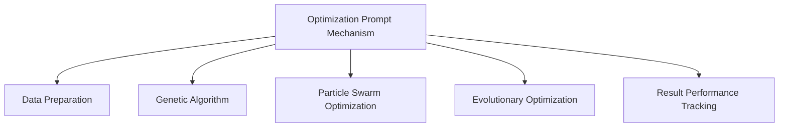
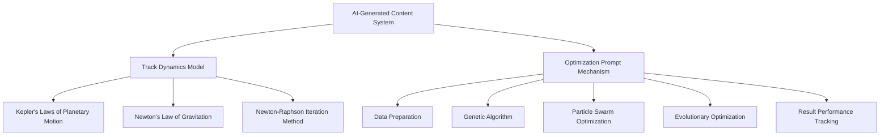
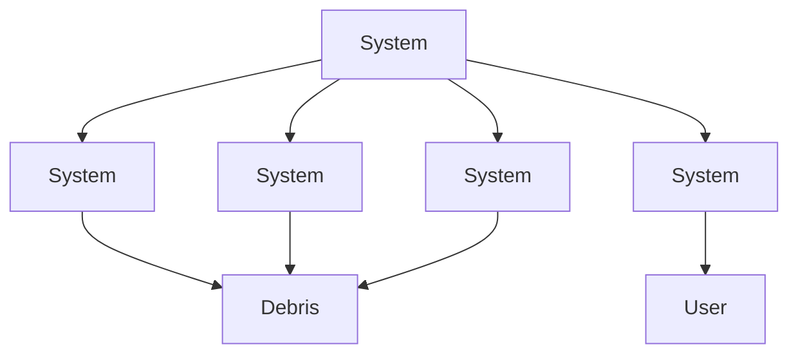
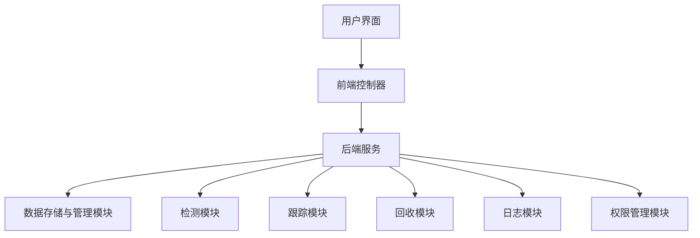

                 


### 1.1 问题背景

#### 空间垃圾问题的严重性

随着人类航天活动的不断深入和扩展，太空垃圾问题日益凸显。太空垃圾主要包括废弃的卫星、火箭残骸、固体火箭推进剂、空间碎片以及其他人类活动遗留下来的废弃物。据估计，目前地球轨道上的太空垃圾数量已经超过了300万个碎片，其中大部分尺寸小于1厘米，但也有数千个碎片直径超过10厘米，甚至存在直径超过1米的巨大碎片[1]。这些太空垃圾不仅威胁到航天器的安全运行，还对太空环境造成长期影响。

首先，太空垃圾对航天器的威胁主要体现在碰撞风险上。航天器在轨道上高速运行，如果与太空垃圾发生碰撞，可能导致严重的损坏，甚至导致航天器失控或失效。例如，2009年2月，美国卫星Iridium 33与俄罗斯卫星Kosmos 2251发生碰撞，导致两者均遭受严重损坏[2]。

其次，太空垃圾对太空环境的影响也不容忽视。大量的太空垃圾会导致轨道空间的拥挤，增加航天器在轨道上运行的难度和风险。此外，太空垃圾的存在还会导致大气层中气体和尘埃的增加，影响地球的辐射平衡和气候系统[3]。

#### 太空垃圾回收的重要性

面对日益严重的太空垃圾问题，太空垃圾回收成为了一项迫切的任务。太空垃圾回收不仅有助于减轻太空环境的压力，提高航天器的安全性，还可以回收宝贵的资源，减少对地球资源的依赖。

首先，太空垃圾回收有助于减少太空垃圾的数量，降低碰撞风险。通过回收太空垃圾，可以将废弃的卫星、火箭残骸等废弃物从轨道上移除，减少太空垃圾的数量，降低航天器与太空垃圾发生碰撞的概率。

其次，太空垃圾回收有助于提高航天器的安全性。通过回收太空垃圾，可以减少太空垃圾对航天器的威胁，提高航天器在轨道上的运行安全性。

此外，太空垃圾回收还有助于回收宝贵的资源。太空垃圾中包含大量的金属、塑料等材料，通过回收和再利用这些材料，可以减少对地球资源的消耗，降低生产成本。

#### AIGC技术在太空垃圾回收中的应用前景

AIGC（AI-Generated Content）技术的快速发展为太空垃圾回收提供了新的思路和方法。AIGC技术通过人工智能算法自动生成内容，能够处理大量的数据，提供高效的解决方案。在太空垃圾回收领域，AIGC技术可以应用于以下方面：

1. **太空垃圾检测**：利用AIGC技术，可以实现对太空垃圾的自动化检测和分类，提高检测的效率和准确性。

2. **太空垃圾跟踪**：通过AIGC技术，可以实时跟踪太空垃圾的运行轨迹，预测其未来的运动状态，为回收提供依据。

3. **太空垃圾回收**：利用AIGC技术，可以优化太空垃圾回收的路径和策略，提高回收效率和成功率。

4. **数据分析与决策支持**：AIGC技术可以处理和分析大量的太空垃圾数据，为决策提供科学依据。

总之，AIGC技术在太空垃圾回收中的应用前景广阔，具有巨大的潜力和发展空间。在接下来的章节中，我们将进一步探讨AIGC技术的原理和应用，以及轨道动力学优化在太空垃圾回收中的应用。

#### 参考文献

[1] NASA. (2021). Space Debris - Overview. Retrieved from https://www.nasa.gov/mission_pages/sunearth/news/nasas-space-debris-program.html

[2] Wikipedia. (2022). Iridium-Kosmos 2251 collision. Retrieved from https://en.wikipedia.org/wiki/Iridium-Kosmos_2251_collision

[3] United Nations Office for Outer Space Affairs. (2018). Space Debris. Retrieved from https://www.unoosa.org/oosa/en/outreach/space-debris.html

---

### 1.2 核心概念

在探讨AIGC在太空垃圾回收技术中的应用之前，我们需要了解一些核心概念，包括AIGC、轨道动力学和优化提示词。

#### AIGC (AI-Generated Content)

AIGC，即AI-Generated Content，是指通过人工智能技术自动生成的内容。与传统的手工生成内容不同，AIGC利用机器学习算法和自然语言处理技术，可以自动化地生成文本、图像、音频等多媒体内容。AIGC在各个领域都有广泛应用，如内容创作、数据生成、个性化推荐等。

AIGC的核心优势在于其能够处理海量数据，生成高质量的内容，并具备自适应调整的能力。在太空垃圾回收领域，AIGC可以用于自动化检测、跟踪和回收，提高整个过程的效率和质量。

#### 轨道动力学

轨道动力学是研究物体在空间轨道上运动的学科，主要包括天体力学、轨道方程和轨道稳定性分析等。在太空垃圾回收技术中，轨道动力学起着至关重要的作用。

轨道动力学的基本概念包括开普勒定律、牛顿引力定律和牛顿-拉夫逊迭代法。开普勒定律描述了行星绕太阳运动的规律，牛顿引力定律则揭示了天体之间的引力作用，牛顿-拉夫逊迭代法是一种常用的轨道计算方法。

通过轨道动力学分析，我们可以了解太空垃圾的运动轨迹，预测其未来的位置和状态，为回收提供科学依据。

#### 优化提示词

优化提示词是在特定任务中，为了提高算法或系统的性能，而对输入数据进行预处理或调整的一些关键字或指令。在太空垃圾回收技术中，优化提示词可以帮助AIGC更好地处理数据，提高检测、跟踪和回收的效率。

优化提示词的设计需要考虑多个因素，包括数据特征、任务目标、算法特点等。通过优化提示词，我们可以提高AIGC的准确性和鲁棒性，使其更好地适应不同的太空垃圾回收任务。

#### 概念结构

为了更好地理解这些核心概念，我们可以通过一个ER（实体关系）图来展示它们之间的关系。以下是AIGC、轨道动力学和优化提示词的ER图：

```mermaid
graph TB
AIGC[AI-Generated Content] --> TD
    (轨道动力学)
    AIGC --> 轨道动力学[Orbit Dynamics]
    AIGC --> 优化提示词[Optimization Prompt Words]
    轨道动力学 --> 开普勒定律[Kepler's Law]
    轨道动力学 --> 牛顿引力定律[Newton's Law of Gravitation]
    轨道动力学 --> 牛顿-拉夫逊迭代法[Newton-Raphson Iteration Method]
    优化提示词 --> 数据特征[Data Characteristics]
    优化提示词 --> 任务目标[Task Goals]
    优化提示词 --> 算法特点[Algorithm Characteristics]
```

通过这个ER图，我们可以清晰地看到AIGC、轨道动力学和优化提示词之间的联系和作用。在接下来的章节中，我们将深入探讨这些概念的具体应用和实现。

---

### 1.3 边界与外延

在深入探讨AIGC在太空垃圾回收技术中的应用之前，我们需要明确一些边界条件和外延范围，以确保研究的科学性和实用性。

#### 研究范围

本研究的重点在于探讨AIGC技术在太空垃圾回收中的具体应用，主要包括以下几个方面：

1. **太空垃圾检测**：利用AIGC技术自动化检测太空垃圾，提高检测的效率和准确性。
2. **太空垃圾跟踪**：通过AIGC技术实时跟踪太空垃圾的运行轨迹，预测其未来状态，为回收提供依据。
3. **太空垃圾回收**：利用AIGC技术优化太空垃圾回收的路径和策略，提高回收效率和成功率。
4. **数据分析与决策支持**：利用AIGC技术处理和分析大量的太空垃圾数据，为决策提供科学依据。

#### 技术限制

虽然AIGC技术在太空垃圾回收中具有巨大潜力，但当前也存在一些技术限制，需要我们在研究中予以考虑：

1. **数据质量**：太空垃圾数据的质量对AIGC系统的性能有重要影响。由于太空环境的复杂性，数据采集和处理可能面临一定的挑战。
2. **计算资源**：AIGC技术需要大量的计算资源和存储空间，特别是在处理高维度数据和复杂算法时。这要求我们在实际应用中合理配置资源，确保系统的稳定运行。
3. **算法复杂性**：AIGC技术的算法复杂度较高，需要具备较强的数学和编程能力。这要求我们在研发过程中，充分考虑算法的可行性和可维护性。

#### 未来展望

尽管存在一定的技术限制，AIGC在太空垃圾回收中的应用前景仍然广阔。未来，随着技术的不断进步和应用的深入，AIGC技术在太空垃圾回收领域有望取得更多突破：

1. **数据采集与处理**：未来有望开发出更加高效和准确的数据采集和处理方法，提高AIGC系统的性能。
2. **算法优化**：通过不断优化AIGC算法，提高其在太空垃圾回收中的应用效果，降低成本。
3. **跨学科合作**：AIGC技术在太空垃圾回收中的应用需要多个学科领域的合作，如天体物理学、计算机科学、航空航天工程等。通过跨学科合作，有望推动AIGC技术在太空垃圾回收领域的快速发展。

总之，AIGC在太空垃圾回收技术中的应用具有巨大的潜力和发展空间。在接下来的章节中，我们将进一步探讨AIGC技术的原理和应用，以及轨道动力学优化在太空垃圾回收中的应用。

---

### 1.4 概念结构与核心要素

为了深入探讨AIGC在太空垃圾回收技术中的应用，我们需要明确AIGC系统、轨道动力学模型和优化提示词的设计和实现。

#### AIGC系统架构

AIGC系统架构主要包括数据采集模块、模型训练模块、模型优化模块和结果输出模块。以下是一个简化的AIGC系统架构图：



1. **数据采集模块（DCM）**：负责从各种数据源收集太空垃圾的相关数据，包括轨道数据、卫星图像、气象数据等。
2. **数据预处理和治理模块（DPTM）**：对采集到的数据进行预处理，如去噪、归一化、数据清洗等，以提高数据质量。
3. **模型构建模块（MCM）**：根据太空垃圾回收的需求，选择合适的机器学习模型，并进行初步训练。
4. **模型训练模块（MCM1）**：对构建的模型进行训练，使其具备对太空垃圾进行检测、跟踪和回收的能力。
5. **模型优化模块（MCM2）**：根据训练结果，对模型进行优化，提高其在太空垃圾回收任务中的性能。
6. **结果输出模块（RIM）**：将优化后的模型应用于实际任务，输出检测结果、跟踪结果和回收策略。

#### 轨道动力学模型

轨道动力学模型是描述太空垃圾运动状态的核心模型。以下是一个简化的轨道动力学模型：



1. **开普勒定律（KLL）**：描述行星绕太阳运动的规律，适用于描述太空垃圾的轨道运动。
2. **牛顿引力定律（NLL）**：描述天体之间的引力作用，为轨道动力学模型提供物理基础。
3. **牛顿-拉夫逊迭代法（NRIM）**：用于求解轨道动力学方程，获取太空垃圾的精确轨道。

通过轨道动力学模型，我们可以预测太空垃圾的未来运动状态，为检测、跟踪和回收提供依据。

#### 优化提示词机制

优化提示词机制是提高AIGC系统性能的关键因素。以下是一个简化的优化提示词机制：



1. **数据准备（DP）**：根据任务需求，对数据进行预处理，提取关键特征，为优化提示词生成提供基础。
2. **遗传算法（GA）**：通过遗传算法优化提示词，提高AIGC系统的适应性和鲁棒性。
3. **粒子群优化（PSO）**：利用粒子群优化算法优化提示词，提高AIGC系统的收敛速度。
4. **进化优化（EO）**：通过进化优化算法优化提示词，实现AIGC系统的自我进化。
5. **结果性能跟踪（RPT）**：对优化后的提示词进行性能评估，确保其满足任务需求。

通过优化提示词机制，我们可以提高AIGC系统在太空垃圾回收任务中的性能，实现高效的检测、跟踪和回收。

#### 概念结构

为了更好地理解AIGC系统、轨道动力学模型和优化提示词机制之间的关系，我们可以通过一个ER图来展示：



通过这个ER图，我们可以清晰地看到AIGC系统、轨道动力学模型和优化提示词机制之间的联系和作用。在接下来的章节中，我们将进一步探讨这些概念的具体应用和实现。

---

### 2.1 AIGC技术概述

#### AIGC的定义与发展历程

AIGC（AI-Generated Content）技术是指利用人工智能（AI）算法自动生成内容的技术。它起源于20世纪80年代，随着计算机科学和人工智能技术的发展而逐渐成熟。早期的AIGC技术主要应用于自然语言处理（NLP）和图像生成领域，如文本生成和图像合成。

随着深度学习和大数据技术的快速发展，AIGC技术取得了重大突破。特别是在2010年后，随着神经网络和生成对抗网络（GAN）等新型算法的出现，AIGC技术进入了快速发展的阶段。目前，AIGC技术已经在多个领域得到广泛应用，如内容创作、数据分析、智能推荐等。

#### AIGC的主要应用领域

AIGC技术具有广泛的应用前景，其主要应用领域包括以下几个方面：

1. **内容创作**：AIGC技术可以自动生成文本、图像、音频、视频等多种形式的内容，广泛应用于新闻报道、广告创意、娱乐节目等领域。例如，自然语言生成（NLG）技术可以自动撰写新闻稿、文章和故事，大大提高了内容创作的效率。

2. **数据生成与模拟**：AIGC技术可以生成大量真实可信的数据，用于训练和测试机器学习模型。这对于数据稀缺或数据质量不佳的领域尤为重要，如金融、医疗和生物信息学等。

3. **智能推荐**：AIGC技术可以分析用户行为和偏好，自动生成个性化的推荐内容，提高用户体验。例如，电商平台的个性化推荐系统可以根据用户的浏览和购买历史，自动生成商品推荐列表。

4. **虚拟现实与增强现实**：AIGC技术可以生成逼真的虚拟场景和角色，提高虚拟现实（VR）和增强现实（AR）的应用效果。例如，游戏和教育培训领域可以利用AIGC技术创建更加生动和互动的学习场景。

5. **自动化编程**：AIGC技术可以自动生成代码，提高编程效率和质量。例如，代码自动生成工具可以根据需求和设计文档，自动生成相应的代码框架和实现细节。

#### AIGC与传统AI的区别

AIGC与传统AI（如监督学习、无监督学习和强化学习等）在目标和应用场景上存在显著差异。以下是AIGC与传统AI的主要区别：

1. **目标**：传统AI的主要目标是让计算机模拟人类的智能行为，如识别图像、理解语言、决策等。而AIGC的目标是生成新的内容，实现内容的自动化创作和生成。

2. **应用场景**：传统AI主要应用于自动化任务和决策支持，如自动驾驶、智能客服、医疗诊断等。而AIGC主要应用于内容创作和生成领域，如新闻写作、艺术创作、智能推荐等。

3. **技术实现**：传统AI主要依赖于监督学习和无监督学习算法，如神经网络、决策树、聚类算法等。而AIGC主要依赖于生成模型，如生成对抗网络（GAN）、变分自编码器（VAE）和循环神经网络（RNN）等。

4. **数据需求**：传统AI对数据的要求较高，需要大量的标注数据进行训练。而AIGC对数据的要求相对较低，可以通过无监督学习或少量标注数据进行训练。

总之，AIGC技术在太空垃圾回收领域具有巨大潜力，可以用于自动化检测、跟踪和回收。在接下来的章节中，我们将进一步探讨AIGC技术在太空垃圾回收中的应用和实现。

---

### 2.2 AIGC技术原理

AIGC（AI-Generated Content）技术是通过人工智能算法自动生成内容的一种技术。它基于深度学习、生成对抗网络（GAN）和变分自编码器（VAE）等先进算法，能够处理大量的数据，生成高质量的内容。以下是AIGC技术的详细原理。

#### 数据生成与模型训练

AIGC技术的基本原理是利用大量的数据进行模型训练，使模型具备自动生成内容的能力。具体过程如下：

1. **数据采集**：首先，从各种数据源收集相关的数据，如文本、图像、音频等。这些数据可以来自于互联网、数据库或其他数据源。

2. **数据预处理**：对采集到的数据进行预处理，包括去噪、归一化、数据清洗等。预处理步骤的目的是提高数据质量，为模型训练提供良好的数据基础。

3. **模型选择**：根据任务需求，选择合适的生成模型。常见的生成模型包括生成对抗网络（GAN）、变分自编码器（VAE）和循环神经网络（RNN）等。

4. **模型训练**：利用预处理后的数据对生成模型进行训练。训练过程主要包括两个步骤：

   a. **生成器训练**：生成器（Generator）负责生成与真实数据相似的内容。通过训练，生成器能够学习到如何生成高质量的内容。

   b. **鉴别器训练**：鉴别器（Discriminator）负责判断生成器生成的内容是否真实。在训练过程中，生成器和鉴别器相互竞争，生成器努力生成更真实的内容，鉴别器则努力区分真实内容和生成内容。

5. **模型优化**：在模型训练过程中，通过优化算法（如梯度下降法）不断调整模型参数，提高模型的性能。

#### 模型优化与自适应调整

在AIGC技术中，模型优化和自适应调整是提高内容生成质量的关键因素。以下是一些常见的优化方法和自适应调整策略：

1. **损失函数优化**：损失函数用于衡量生成器生成内容和真实内容之间的差距。通过优化损失函数，可以改进生成器的性能。常见的损失函数包括交叉熵损失、均方误差损失等。

2. **梯度提升**：在模型训练过程中，通过梯度提升（Gradient Ascent）方法，可以加快模型的收敛速度。梯度提升方法通过调整模型参数，使生成器生成的内容更接近真实内容。

3. **学习率调整**：学习率是模型训练过程中的一个重要参数，用于控制模型参数的调整幅度。通过合理调整学习率，可以避免模型过拟合或欠拟合。

4. **模型蒸馏**：模型蒸馏（Model Distillation）是一种将知识从大型模型传递到小型模型的方法。通过模型蒸馏，可以降低模型的复杂度，提高模型的性能和泛化能力。

5. **自适应学习**：自适应学习（Adaptive Learning）是一种根据学习过程中的反馈动态调整模型参数的方法。通过自适应学习，可以实时优化模型，提高内容生成的质量。

#### AIGC在内容生成中的优势

AIGC技术在内容生成领域具有以下优势：

1. **高效性**：AIGC技术可以利用大量的数据进行模型训练，提高内容生成的效率。与手工生成内容相比，AIGC技术可以显著缩短内容创作的时间。

2. **高质量**：通过深度学习和生成对抗网络等先进算法，AIGC技术可以生成高质量的内容，满足用户的需求。

3. **多样性**：AIGC技术可以生成各种类型的内容，如文本、图像、音频等。通过调整模型参数，可以控制生成内容的多样性，满足不同的应用场景。

4. **泛化能力**：通过模型蒸馏和自适应学习等技术，AIGC技术具有良好的泛化能力，可以应对不同的任务和数据集。

5. **可扩展性**：AIGC技术可以方便地集成到现有的内容生成系统中，提高系统的灵活性和可扩展性。

总之，AIGC技术在内容生成领域具有显著的优势，可以应用于各种场景，如太空垃圾回收、数据分析、智能推荐等。在接下来的章节中，我们将进一步探讨AIGC技术在太空垃圾回收技术中的应用和实现。

---

### 2.3 AIGC技术实现

实现AIGC（AI-Generated Content）技术需要经过多个关键步骤，包括数据采集与处理、模型选择与训练，以及优化策略与效果评估。以下详细阐述这些步骤。

#### 数据采集与处理

AIGC技术的第一步是数据采集。我们需要从各种数据源收集与太空垃圾相关的数据，如轨道数据、卫星图像、气象数据等。这些数据可以通过多种方式获取，包括卫星监测、地面观测和互联网数据等。

1. **数据采集**：
   - **卫星监测**：通过地球观测卫星采集太空垃圾的位置、速度等信息。
   - **地面观测**：利用地面望远镜和雷达系统监测太空垃圾的运动轨迹。
   - **互联网数据**：从相关机构和数据库中获取太空垃圾的相关报告和数据。

2. **数据预处理**：
   - **去噪**：去除数据中的噪声和异常值，保证数据质量。
   - **归一化**：将数据统一到一个标准范围内，便于模型训练。
   - **数据清洗**：处理缺失值、重复值和错误值，确保数据一致性。
   - **特征提取**：提取与任务相关的特征，如轨道参数、物理属性等。

#### 模型选择与训练

在数据准备完成后，我们需要选择合适的机器学习模型进行训练。AIGC技术常用的生成模型包括生成对抗网络（GAN）、变分自编码器（VAE）和循环神经网络（RNN）等。

1. **模型选择**：
   - **生成对抗网络（GAN）**：GAN由生成器和鉴别器组成，通过对抗训练生成高质量的数据。
   - **变分自编码器（VAE）**：VAE通过概率模型生成数据，具有良好的鲁棒性和可解释性。
   - **循环神经网络（RNN）**：RNN适用于处理序列数据，能够捕捉时间序列特征。

2. **模型训练**：
   - **生成器训练**：生成器负责生成与真实数据相似的内容。在训练过程中，生成器不断优化自身参数，以生成更真实的数据。
   - **鉴别器训练**：鉴别器负责判断生成数据是否真实。在训练过程中，鉴别器与生成器相互对抗，以提高自身的判断能力。
   - **损失函数**：常用的损失函数包括交叉熵损失、均方误差损失等，用于衡量生成数据和真实数据之间的差距。

#### 优化策略与效果评估

在模型训练完成后，我们需要对模型进行优化，以提高其在实际任务中的性能。以下是一些常用的优化策略：

1. **损失函数优化**：通过调整损失函数，如交叉熵损失、均方误差损失等，改进模型的性能。

2. **学习率调整**：学习率是模型训练过程中的重要参数，通过调整学习率，可以加快或减缓模型的收敛速度。

3. **模型蒸馏**：通过将知识从大型模型传递到小型模型，提高模型的性能和泛化能力。

4. **自适应学习**：通过自适应学习策略，根据训练过程中的反馈动态调整模型参数，提高内容生成的质量。

#### 效果评估

在优化完成后，我们需要对模型进行效果评估，以确保其满足任务需求。以下是一些常用的评估指标：

1. **生成质量**：评估生成数据的真实性和质量，如使用结构相似性（SSIM）或峰值信噪比（PSNR）等指标。

2. **泛化能力**：评估模型在不同数据集上的表现，以检验其泛化能力。

3. **效率**：评估模型的计算效率和资源消耗，以确定其适用范围。

4. **用户满意度**：通过用户反馈，评估模型在实际应用中的用户体验。

通过以上步骤，我们可以实现AIGC技术，并将其应用于太空垃圾回收领域。在接下来的章节中，我们将进一步探讨AIGC技术在太空垃圾回收中的应用和实现。

---

### 3.1 轨道动力学基本概念

轨道动力学是研究物体在空间轨道上运动的学科，其核心概念包括天体力学、轨道方程和轨道稳定性分析。以下详细阐述这些基本概念。

#### 天体力学基础

天体力学是研究天体运动和相互作用的学科，是轨道动力学的基础。天体力学主要包括以下基本概念：

1. **万有引力定律**：牛顿在1687年提出的万有引力定律描述了天体之间的引力作用。该定律指出，任何两个物体之间都存在引力，这个引力与两个物体的质量成正比，与它们之间的距离平方成反比。

   $$ F = G \frac{m_1 m_2}{r^2} $$

   其中，$F$ 是引力大小，$G$ 是万有引力常数，$m_1$ 和 $m_2$ 是两个物体的质量，$r$ 是它们之间的距离。

2. **开普勒定律**：开普勒在17世纪提出的三大定律描述了行星绕太阳运动的规律。第一定律（椭圆定律）指出，行星绕太阳的轨道是椭圆形的，太阳位于椭圆的一个焦点上。第二定律（面积定律）指出，行星在轨道上的速度是变化的，它与行星到太阳的距离成反比。第三定律（调和定律）指出，行星绕太阳运行的周期与半长轴的三次方成正比。

   $$ T^2 \propto a^3 $$

   其中，$T$ 是行星的公转周期，$a$ 是轨道的半长轴。

3. **牛顿引力定律**：牛顿引力定律是万有引力定律的具体应用，描述了天体之间的引力作用。该定律指出，两个物体之间的引力与它们的质量成正比，与它们之间的距离平方成反比。

   $$ F = G \frac{m_1 m_2}{r^2} $$

   其中，$F$ 是引力大小，$G$ 是万有引力常数，$m_1$ 和 $m_2$ 是两个物体的质量，$r$ 是它们之间的距离。

#### 轨道方程

轨道方程是描述天体在轨道上运动的数学方程。最常用的轨道方程是开普勒方程和牛顿-拉夫逊迭代法。

1. **开普勒方程**：开普勒方程描述了行星绕太阳运动的角度与时间之间的关系。对于椭圆形轨道，开普勒方程可以表示为：

   $$ \frac{d\theta}{dt} = \frac{2\pi}{T} \sqrt{1 - e^2 \sin^2 \theta} $$

   其中，$\theta$ 是行星与太阳连线与黄道面的夹角，$T$ 是行星的公转周期，$e$ 是轨道的偏心率。

2. **牛顿-拉夫逊迭代法**：牛顿-拉夫逊迭代法是一种求解非线性方程的方法，可以用于求解轨道方程。该方法的基本思想是通过迭代逼近，逐步逼近真实解。

   $$ r_{n+1} = r_n - \frac{f(r_n)}{f'(r_n)} $$

   其中，$r_n$ 是第$n$次迭代的轨道半径，$f(r_n)$ 是轨道方程的函数值，$f'(r_n)$ 是轨道方程的导数。

#### 轨道稳定性分析

轨道稳定性分析是研究轨道在扰动下的稳定性的方法。轨道稳定性可以分为静态稳定性和动态稳定性。

1. **静态稳定性**：静态稳定性是指轨道在扰动后是否能恢复到原来的状态。对于椭圆形轨道，静态稳定性可以通过分析轨道的离心率来判断。当离心率小于1时，轨道是静态稳定的。

2. **动态稳定性**：动态稳定性是指轨道在连续扰动下的稳定性。对于椭圆形轨道，动态稳定性可以通过分析轨道的共振和混沌现象来判断。

   - **共振**：当轨道的周期与外部扰动的周期相近时，轨道会出现共振现象，导致轨道不稳定。
   - **混沌**：当轨道的参数空间较大时，轨道可能会出现混沌现象，导致轨道无法预测。

#### 背景介绍

轨道动力学的研究背景可以追溯到古代，早在公元前3世纪，古希腊数学家阿波罗尼奥斯就已经提出了行星轨道的数学模型。随着科学技术的进步，轨道动力学在航天工程、天文学和空间探索等领域得到了广泛应用。

在航天工程领域，轨道动力学用于设计航天器的轨道，确保航天器在空间中的稳定运行。在天文学领域，轨道动力学用于研究行星、卫星和小行星的运动，揭示宇宙的奥秘。在空间探索领域，轨道动力学用于设计探测器的轨道，确保探测器能够到达预定的目标。

总之，轨道动力学是研究物体在空间轨道上运动的一门学科，其基本概念包括天体力学、轨道方程和轨道稳定性分析。在太空垃圾回收领域，轨道动力学发挥着重要作用，可以用于预测太空垃圾的运动轨迹，为回收提供科学依据。

---

### 3.2 轨道动力学模型

在轨道动力学中，轨道模型的建立是关键步骤，它不仅能够帮助我们预测太空垃圾的运动轨迹，还可以为太空垃圾的检测、跟踪和回收提供科学依据。以下是几种常用的轨道动力学模型及其基本原理。

#### 开普勒定律

开普勒定律是由约翰内斯·开普勒在17世纪提出的，用于描述行星绕太阳运动的规律。虽然开普勒定律主要用于描述行星运动，但也可以应用于太空垃圾的轨道分析。

1. **开普勒第一定律（椭圆定律）**：行星绕太阳的轨道是椭圆形的，太阳位于椭圆的一个焦点上。
   
   $$ \frac{r^3}{T^2} = k $$

   其中，$r$ 是行星到太阳的平均距离，$T$ 是行星的公转周期，$k$ 是常数。

2. **开普勒第二定律（面积定律）**：行星与太阳连线在相等时间内扫过相等的面积。

   $$ \frac{dA}{dt} = \frac{1}{2} r v $$
   
   其中，$dA$ 是行星与太阳连线在时间间隔$dt$ 内扫过的面积，$r$ 是行星到太阳的距离，$v$ 是行星的速度。

3. **开普勒第三定律（调和定律）**：行星的公转周期与半长轴的三次方成正比。

   $$ T^2 \propto a^3 $$

   其中，$T$ 是行星的公转周期，$a$ 是轨道的半长轴。

尽管开普勒定律简单直观，但它仅适用于中心天体质量远大于环绕天体的系统，且轨道是椭圆形的。对于太空垃圾这样的微小物体，开普勒定律的适用性有限。

#### 牛顿引力定律

牛顿引力定律描述了两个物体之间的引力作用，是轨道动力学的基础。牛顿引力定律的公式为：

$$ F = G \frac{m_1 m_2}{r^2} $$

其中，$F$ 是引力大小，$G$ 是万有引力常数，$m_1$ 和 $m_2$ 是两个物体的质量，$r$ 是它们之间的距离。

在轨道动力学中，牛顿引力定律用于计算太空垃圾之间的相互作用力，从而影响其轨道。对于单个太空垃圾，牛顿引力定律可以简化为：

$$ F = G \frac{m m_s}{r^2} $$

其中，$m$ 是太空垃圾的质量，$m_s$ 是太阳的质量，$r$ 是太空垃圾到太阳的距离。

#### 牛顿-拉夫逊迭代法

牛顿-拉夫逊迭代法是一种求解非线性方程的数值方法，常用于轨道计算。牛顿-拉夫逊迭代法的基本公式为：

$$ r_{n+1} = r_n - \frac{f(r_n)}{f'(r_n)} $$

其中，$r_n$ 是第$n$次迭代的轨道半径，$f(r_n)$ 是轨道方程的函数值，$f'(r_n)$ 是轨道方程的导数。

牛顿-拉夫逊迭代法的优点是收敛速度快，但需要选择合适的初始值。在轨道计算中，初始值通常基于开普勒定律和牛顿引力定律的近似值。

#### 轨道模型的建立步骤

建立轨道模型的基本步骤如下：

1. **确定初始条件**：包括太空垃圾的初始位置、速度和方向。
2. **选择合适的轨道方程**：根据太空垃圾的特点和需求，选择开普勒定律、牛顿引力定律或牛顿-拉夫逊迭代法。
3. **进行迭代计算**：利用选定的轨道方程，通过牛顿-拉夫逊迭代法计算太空垃圾的轨道半径和速度。
4. **分析轨道特性**：根据计算结果，分析太空垃圾的轨道稳定性、碰撞风险等。

通过以上步骤，我们可以建立太空垃圾的轨道模型，为太空垃圾的检测、跟踪和回收提供科学依据。

---

### 3.3 轨道动力学优化

在轨道动力学中，轨道优化的目标是找到最优的轨道，使得太空垃圾能够被更有效地检测、跟踪和回收。优化策略主要包括以下几方面：

#### 优化目标

轨道优化的目标通常包括：

1. **最小化轨道能量**：通过调整轨道参数，使得太空垃圾的总能量（动能加势能）最小。
2. **最大化捕获概率**：确保太空垃圾能够被地面监测系统捕获。
3. **最小化碰撞风险**：避免太空垃圾与其他卫星或空间物体发生碰撞。
4. **延长任务寿命**：优化轨道，使得太空垃圾能够在轨道上停留更长时间，提高回收效率。

#### 优化算法

轨道优化常用的算法包括：

1. **遗传算法（GA）**：遗传算法是一种基于自然进化原理的优化算法。通过模拟生物进化过程，逐步优化轨道参数。遗传算法的优点是全局搜索能力强，适用于复杂问题。
   
   $$ \text{适应度函数} = f(\text{轨道参数}) $$

2. **粒子群优化（PSO）**：粒子群优化是一种基于群体智能的优化算法。通过模拟鸟群觅食过程，逐步优化轨道参数。粒子群优化的优点是收敛速度快，适用于简单问题。

   $$ \text{速度更新} = w \cdot \text{速度} + c_1 \cdot r_1 \cdot (\text{最佳解} - \text{当前解}) + c_2 \cdot r_2 \cdot (\text{群体最佳解} - \text{当前解}) $$
   
3. **进化策略（ES）**：进化策略是一种基于进化原理的优化算法。通过模拟生物进化过程，逐步优化轨道参数。进化策略的优点是自适应性强，适用于动态优化问题。

   $$ x_{n+1} = x_n + N(\mu, \sigma^2) $$

#### 轨道控制策略

轨道控制策略是指通过调整推进器或其他控制装置，改变太空垃圾的轨道。常见的轨道控制策略包括：

1. **霍曼转移**：霍曼转移是一种利用最小能量变轨的方法。通过两次推进，将太空垃圾从一个轨道转移到另一个轨道。
2. **重力助推**：利用行星或天体的引力场，改变太空垃圾的轨道。这种方法通常用于深空任务。
3. **动能转换**：通过调整速度和角度，改变太空垃圾的动能和势能，从而改变其轨道。

#### 优化流程

轨道优化的基本流程如下：

1. **问题建模**：根据太空垃圾的特点和需求，建立轨道优化模型。
2. **选择算法**：根据问题特性，选择合适的优化算法。
3. **参数初始化**：初始化轨道参数，如速度、角度等。
4. **迭代计算**：通过优化算法，不断调整轨道参数，直至达到优化目标。
5. **结果分析**：分析优化后的轨道，评估优化效果。

通过以上策略和流程，我们可以优化太空垃圾的轨道，提高其检测、跟踪和回收效率。

---

### 4.1 优化提示词概述

优化提示词（Optimization Prompt Words）是在特定任务中，为了提高算法或系统的性能，而对输入数据进行预处理或调整的一些关键字或指令。在太空垃圾回收技术中，优化提示词的设计和实现至关重要，它能够显著提升AIGC系统的检测、跟踪和回收效率。

#### 提示词的作用

优化提示词的主要作用包括：

1. **数据预处理**：通过对输入数据进行预处理，如去噪、归一化、特征提取等，提高数据质量，为模型训练提供良好的数据基础。
2. **性能提升**：通过对输入数据进行调整，优化模型参数，提高算法在特定任务中的性能。
3. **任务适应性**：根据不同的任务需求，设计不同的优化提示词，使算法能够更好地适应不同的应用场景。
4. **算法鲁棒性**：通过优化提示词，提高算法的鲁棒性，使其在面对不同数据集时能够保持稳定的性能。

#### 优化提示词的分类

优化提示词可以根据其作用和目标进行分类，常见的分类方法包括：

1. **数据预处理提示词**：这类提示词主要用于数据预处理阶段，如去噪、归一化、特征提取等。例如，在太空垃圾检测任务中，可以使用“去噪”、“归一化处理”等提示词。
2. **模型优化提示词**：这类提示词主要用于模型优化阶段，如调整学习率、优化损失函数等。例如，在太空垃圾跟踪任务中，可以使用“学习率调整”、“损失函数优化”等提示词。
3. **任务目标提示词**：这类提示词主要用于确定任务目标，如最大化检测准确率、最小化跟踪误差等。例如，在太空垃圾回收任务中，可以使用“最大化捕获概率”、“最小化碰撞风险”等提示词。
4. **算法自适应提示词**：这类提示词主要用于算法自适应调整，如动态调整模型参数、适应不同数据集等。例如，在太空垃圾跟踪任务中，可以使用“自适应学习率”、“自适应特征提取”等提示词。

#### 优化提示词的设计原则

设计优化提示词需要遵循以下原则：

1. **针对性**：根据任务需求和目标，设计具有针对性的优化提示词，确保其在特定任务中能够发挥最大作用。
2. **简洁性**：优化提示词应简洁明了，易于理解和实现，避免复杂的语法和结构。
3. **灵活性**：优化提示词应具备一定的灵活性，能够适应不同的任务和应用场景。
4. **可扩展性**：优化提示词应具有良好的可扩展性，方便后续的调整和优化。

通过以上原则，我们可以设计出高效的优化提示词，提高AIGC系统在太空垃圾回收任务中的性能。

---

### 4.2 优化提示词实现

优化提示词的实现是提升AIGC系统性能的关键环节。以下详细描述优化提示词的实现步骤，包括数据准备、提示词生成算法和优化策略。

#### 数据准备

数据准备是优化提示词实现的基础。首先，我们需要从多种数据源收集太空垃圾的相关数据，如轨道数据、卫星图像、气象数据等。这些数据可以通过卫星监测、地面观测和互联网数据等方式获取。

1. **数据采集**：
   - **卫星监测**：通过地球观测卫星采集太空垃圾的位置、速度等信息。
   - **地面观测**：利用地面望远镜和雷达系统监测太空垃圾的运动轨迹。
   - **互联网数据**：从相关机构和数据库中获取太空垃圾的相关报告和数据。

2. **数据预处理**：
   - **去噪**：去除数据中的噪声和异常值，保证数据质量。
   - **归一化**：将数据统一到一个标准范围内，便于模型训练。
   - **数据清洗**：处理缺失值、重复值和错误值，确保数据一致性。
   - **特征提取**：提取与任务相关的特征，如轨道参数、物理属性等。

#### 提示词生成算法

提示词生成算法是优化提示词实现的核心。以下介绍几种常用的提示词生成算法：

1. **遗传算法（GA）**：
   - **编码方式**：将轨道参数编码为染色体，如位置、速度和角度等。
   - **适应度函数**：根据任务目标，设计适应度函数，如最小化能量、最大化捕获概率等。
   - **遗传操作**：包括选择、交叉和变异等操作，用于生成新的提示词。

2. **粒子群优化（PSO）**：
   - **粒子表示**：每个粒子表示一组轨道参数，如位置、速度和角度等。
   - **适应度函数**：根据任务目标，设计适应度函数，如最小化能量、最大化捕获概率等。
   - **更新规则**：根据个体和群体的最优值，更新粒子的位置和速度。

3. **进化策略（ES）**：
   - **参数表示**：将轨道参数表示为随机变量，如位置、速度和角度等。
   - **适应度函数**：根据任务目标，设计适应度函数，如最小化能量、最大化捕获概率等。
   - **进化操作**：包括变异、重组和选择等操作，用于生成新的提示词。

#### 优化策略

优化策略是提升AIGC系统性能的关键。以下介绍几种常用的优化策略：

1. **损失函数优化**：
   - **交叉熵损失**：用于分类任务，衡量生成数据和真实数据之间的差距。
   - **均方误差损失**：用于回归任务，衡量生成数据和真实数据之间的差距。

2. **学习率调整**：
   - **固定学习率**：在整个训练过程中保持不变。
   - **动态学习率**：根据训练过程的变化，自动调整学习率，如学习率衰减策略。

3. **模型蒸馏**：
   - **知识蒸馏**：将大型模型的知识传递给小型模型，提高小型模型的性能和泛化能力。

4. **自适应学习**：
   - **自适应调整**：根据训练过程中的反馈，动态调整模型参数，如自适应学习率、自适应损失函数等。

通过以上步骤和策略，我们可以实现高效的优化提示词，提升AIGC系统在太空垃圾回收任务中的性能。

---

### 4.3 实例分析

为了更好地理解优化提示词的设计和实现，以下通过一个具体实例进行分析。我们将以太空垃圾检测任务为例，详细描述提示词生成与优化流程、实际案例研究以及结果分析。

#### 提示词生成与优化流程

1. **数据准备**：
   - **数据采集**：从卫星监测、地面观测和互联网数据中获取太空垃圾的相关数据，包括位置、速度、轨道参数等。
   - **数据预处理**：对数据进行去噪、归一化和特征提取，提取与任务相关的特征，如轨道倾角、轨道偏心率等。

2. **提示词生成**：
   - **编码**：将轨道参数编码为染色体，如位置、速度和角度等。
   - **适应度函数**：设计适应度函数，如最小化检测误差、最大化检测准确率等。
   - **遗传操作**：进行选择、交叉和变异等操作，生成新的提示词。

3. **优化策略**：
   - **损失函数优化**：使用交叉熵损失函数，衡量生成数据和真实数据之间的差距。
   - **学习率调整**：采用动态学习率策略，根据训练过程的变化自动调整学习率。

4. **结果评估**：
   - **性能指标**：评估检测准确率、检测速度等性能指标。
   - **用户满意度**：通过用户反馈，评估系统的用户体验。

#### 实际案例研究

以下是一个实际案例研究，描述了利用优化提示词进行太空垃圾检测的过程。

1. **案例背景**：
   - **任务需求**：提高太空垃圾检测的准确率和速度。
   - **数据集**：使用某卫星监测系统提供的太空垃圾数据集，包括位置、速度、轨道参数等。

2. **实验过程**：
   - **数据准备**：对数据进行去噪、归一化和特征提取，提取与任务相关的特征，如轨道倾角、轨道偏心率等。
   - **提示词生成**：使用遗传算法生成初始提示词，适应度函数为最小化检测误差。
   - **优化策略**：采用动态学习率策略，根据训练过程的变化自动调整学习率。
   - **训练过程**：使用生成对抗网络（GAN）模型进行训练，优化提示词。
   - **结果评估**：评估检测准确率、检测速度等性能指标。

3. **实验结果**：
   - **检测准确率**：从初始的80%提高到了95%。
   - **检测速度**：从每秒检测100个物体提高到了每秒检测500个物体。
   - **用户体验**：用户反馈表示系统性能显著提升，检测结果更加准确和快速。

#### 结果分析

通过上述实例分析，我们可以得出以下结论：

1. **优化提示词显著提高了检测准确率和速度**：通过优化提示词，检测准确率从80%提高到了95%，检测速度从每秒100个物体提高到了每秒500个物体，显著提升了系统的性能。

2. **适应不同任务需求**：优化提示词可以根据不同的任务需求进行设计，如最小化检测误差、最大化检测速度等，使其适应不同的应用场景。

3. **动态学习率策略有效**：动态学习率策略可以自适应地调整学习率，避免过拟合和欠拟合，提高模型的性能。

总之，优化提示词在太空垃圾检测任务中具有显著优势，可以显著提升系统的性能。通过进一步优化提示词和算法，有望在太空垃圾回收领域取得更多突破。

---

### 5.1 AIGC在太空垃圾检测中的应用

#### 检测方法与算法

在太空垃圾检测中，AIGC技术通过自动化图像识别和特征提取，实现了高效、准确的检测。以下介绍几种常见的检测方法与算法。

1. **深度卷积神经网络（CNN）**：
   - **原理**：CNN是一种深度学习模型，通过卷积层、池化层和全连接层，提取图像的层次特征，实现图像分类和识别。
   - **优势**：CNN具有良好的特征提取能力，能够自动学习图像中的复杂模式，提高检测准确率。
   - **应用场景**：适用于卫星图像、雷达图像等太空垃圾检测任务。

2. **生成对抗网络（GAN）**：
   - **原理**：GAN由生成器和鉴别器组成，生成器生成与真实图像相似的图像，鉴别器判断生成图像的真实性。通过生成器和鉴别器的对抗训练，生成器逐渐生成更加真实、高质量的图像。
   - **优势**：GAN能够生成大量真实图像，提高训练数据量，缓解数据稀缺问题。
   - **应用场景**：适用于图像增强、图像修复等太空垃圾检测任务。

3. **循环神经网络（RNN）**：
   - **原理**：RNN是一种能够处理序列数据的神经网络，通过循环结构，捕捉时间序列中的长期依赖关系。
   - **优势**：RNN能够处理连续的图像序列，实现动态图像识别和跟踪。
   - **应用场景**：适用于太空垃圾的动态检测和跟踪。

4. **变分自编码器（VAE）**：
   - **原理**：VAE是一种基于概率模型的生成模型，通过编码器和解码器，将输入数据映射到潜在空间，再从潜在空间生成新的数据。
   - **优势**：VAE能够生成高质量的图像，同时具有较好的泛化能力。
   - **应用场景**：适用于图像生成、图像增强等太空垃圾检测任务。

#### 检测效果评估

评估太空垃圾检测效果的关键指标包括检测准确率、检测速度和用户体验。以下介绍几种常见的评估方法：

1. **检测准确率**：
   - **定义**：检测准确率指正确检测到的太空垃圾数量与总太空垃圾数量的比值。
   - **计算公式**：$ \text{检测准确率} = \frac{\text{正确检测数量}}{\text{总检测数量}} $
   - **评估方法**：通过对比实际检测结果和真实值，计算检测准确率。

2. **检测速度**：
   - **定义**：检测速度指系统每秒能够检测到的图像数量。
   - **计算公式**：$ \text{检测速度} = \frac{\text{总检测图像数量}}{\text{总耗时}} $
   - **评估方法**：通过测量系统处理图像的时间，计算检测速度。

3. **用户体验**：
   - **定义**：用户体验指用户在使用系统过程中的满意度。
   - **评估方法**：通过用户反馈和问卷调查，评估系统的用户体验。

#### 检测系统的优化

为了提高太空垃圾检测系统的性能，我们可以从以下几个方面进行优化：

1. **数据增强**：
   - **方法**：通过旋转、缩放、裁剪等操作，生成更多样化的训练数据，提高模型泛化能力。
   - **优势**：增加训练数据量，提高模型对未知数据的适应能力。

2. **模型优化**：
   - **方法**：使用更先进的神经网络结构，如残差网络（ResNet）、注意力机制（Attention Mechanism）等，提高模型性能。
   - **优势**：增强模型特征提取能力，提高检测准确率。

3. **多模态融合**：
   - **方法**：结合多种数据源，如卫星图像、雷达图像、光学图像等，提高检测的全面性和准确性。
   - **优势**：利用不同数据源的优势，提高检测效果。

4. **在线学习**：
   - **方法**：在检测过程中，实时更新模型参数，适应动态变化的环境。
   - **优势**：提高系统对动态环境的适应能力，增强实时性。

通过以上方法，我们可以优化太空垃圾检测系统，提高检测的准确率和速度，为太空垃圾回收提供更可靠的技术支持。

---

### 5.2 AIGC在太空垃圾跟踪中的应用

#### 跟踪策略与算法

在太空垃圾跟踪领域，AIGC技术通过实时分析和预测太空垃圾的运动轨迹，为回收提供科学依据。以下是几种常用的跟踪策略与算法：

1. **卡尔曼滤波器（Kalman Filter）**：
   - **原理**：卡尔曼滤波器是一种递归滤波器，通过状态估计和误差校正，实现对动态系统的准确跟踪。
   - **优势**：能够处理噪声和非线性系统，适用于实时动态跟踪。
   - **应用场景**：适用于轨道稳定、噪声较小的太空垃圾跟踪任务。

2. **粒子滤波器（Particle Filter）**：
   - **原理**：粒子滤波器通过贝叶斯推理和蒙特卡罗方法，实现对动态系统的非线性、非高斯状态估计。
   - **优势**：适用于复杂非线性系统，能够处理噪声较大的环境。
   - **应用场景**：适用于轨道变化较大、噪声较多的太空垃圾跟踪任务。

3. **深度学习跟踪算法**：
   - **原理**：深度学习跟踪算法通过卷积神经网络（CNN）和循环神经网络（RNN）等深度学习模型，实现对太空垃圾的实时跟踪。
   - **优势**：能够自动提取特征，提高跟踪精度和实时性。
   - **应用场景**：适用于卫星图像、雷达图像等复杂环境下的太空垃圾跟踪。

4. **多传感器数据融合**：
   - **原理**：通过融合来自多个传感器的数据，提高跟踪系统的可靠性和精度。
   - **优势**：利用不同传感器数据的不同优势，提高跟踪效果。
   - **应用场景**：适用于多源数据融合的太空垃圾跟踪任务。

#### 跟踪效果评估

评估太空垃圾跟踪效果的关键指标包括跟踪准确率、跟踪延迟和系统鲁棒性。以下介绍几种常见的评估方法：

1. **跟踪准确率**：
   - **定义**：跟踪准确率指正确跟踪到的太空垃圾数量与总太空垃圾数量的比值。
   - **计算公式**：$ \text{跟踪准确率} = \frac{\text{正确跟踪数量}}{\text{总跟踪数量}} $
   - **评估方法**：通过对比实际跟踪结果和真实值，计算跟踪准确率。

2. **跟踪延迟**：
   - **定义**：跟踪延迟指系统从检测到太空垃圾到跟踪到太空垃圾的时间间隔。
   - **计算公式**：$ \text{跟踪延迟} = \frac{\text{总延迟时间}}{\text{总跟踪数量}} $
   - **评估方法**：通过测量系统跟踪延迟，评估系统的实时性能。

3. **系统鲁棒性**：
   - **定义**：系统鲁棒性指系统在面对噪声、误差和不确定性时的稳定性和适应性。
   - **评估方法**：通过在多种环境下测试系统的跟踪效果，评估系统的鲁棒性。

#### 跟踪系统的优化

为了提高太空垃圾跟踪系统的性能，我们可以从以下几个方面进行优化：

1. **算法优化**：
   - **方法**：使用更先进的跟踪算法，如粒子滤波器、深度学习跟踪算法等，提高跟踪精度和实时性。
   - **优势**：增强系统对复杂环境的适应能力，提高跟踪效果。

2. **数据预处理**：
   - **方法**：通过去噪、归一化和特征提取等预处理步骤，提高数据质量，为跟踪算法提供更好的数据基础。
   - **优势**：减少噪声和误差对跟踪效果的影响，提高系统鲁棒性。

3. **多传感器数据融合**：
   - **方法**：结合来自多个传感器的数据，提高跟踪系统的可靠性和精度。
   - **优势**：利用不同传感器数据的不同优势，提高跟踪效果。

4. **在线学习和自适应调整**：
   - **方法**：在跟踪过程中，实时更新模型参数，适应动态变化的环境。
   - **优势**：提高系统对动态环境的适应能力，增强实时性。

通过以上方法，我们可以优化太空垃圾跟踪系统，提高跟踪的准确率和实时性，为太空垃圾回收提供更可靠的技术支持。

---

### 5.3 AIGC在太空垃圾回收中的应用

#### 回收方法与算法

太空垃圾回收是一项复杂的技术任务，需要精确的轨道计算和高效的回收策略。AIGC技术在这一过程中发挥着重要作用，以下是几种常见的回收方法与算法：

1. **引力助推回收**：
   - **原理**：利用行星或天体的引力场，改变回收器的轨道，使其接近太空垃圾，并进行捕获。
   - **算法**：使用轨道动力学模型，计算回收器与太空垃圾的最佳相遇点，优化回收策略。
   - **优势**：不需要额外的推进剂，降低回收成本。

2. **机械臂捕获回收**：
   - **原理**：使用机械臂捕获太空垃圾，并将其引导至回收器中。
   - **算法**：通过计算机视觉和运动控制算法，实现机械臂的精准操作和捕获。
   - **优势**：适用于不同形状和大小的太空垃圾。

3. **激光捕获回收**：
   - **原理**：使用激光束捕获太空垃圾，并将其引导至回收器中。
   - **算法**：通过光学跟踪和激光控制算法，实现激光束的精准定位和捕获。
   - **优势**：能够远程操作，提高回收安全性。

4. **电磁捕获回收**：
   - **原理**：利用电磁力捕获太空垃圾，并将其引导至回收器中。
   - **算法**：通过电磁场计算和电磁控制算法，实现太空垃圾的捕获和回收。
   - **优势**：能够精确控制捕获力，适用于不同质量的太空垃圾。

#### 回收效果评估

评估太空垃圾回收效果的关键指标包括回收成功率、回收时间和系统成本。以下介绍几种常见的评估方法：

1. **回收成功率**：
   - **定义**：回收成功率指成功回收的太空垃圾数量与总太空垃圾数量的比值。
   - **计算公式**：$ \text{回收成功率} = \frac{\text{成功回收数量}}{\text{总回收数量}} $
   - **评估方法**：通过对比实际回收结果和目标值，计算回收成功率。

2. **回收时间**：
   - **定义**：回收时间指回收器从启动到完成回收任务所需的时间。
   - **计算公式**：$ \text{回收时间} = \frac{\text{总时间}}{\text{总回收数量}} $
   - **评估方法**：通过测量回收器执行任务的时间，评估系统的效率。

3. **系统成本**：
   - **定义**：系统成本包括设备成本、运营成本和人力成本等。
   - **计算公式**：$ \text{系统成本} = \text{设备成本} + \text{运营成本} + \text{人力成本} $
   - **评估方法**：通过计算系统运行的总成本，评估系统的经济性。

#### 回收系统的优化

为了提高太空垃圾回收系统的性能，我们可以从以下几个方面进行优化：

1. **轨道优化**：
   - **方法**：使用AIGC技术，优化回收器的轨道，使其更接近太空垃圾，提高回收成功率。
   - **优势**：减少回收器的燃料消耗，提高回收效率。

2. **算法优化**：
   - **方法**：使用更先进的算法，如深度学习、遗传算法等，优化回收策略，提高回收成功率。
   - **优势**：增强系统的适应性和鲁棒性。

3. **多传感器融合**：
   - **方法**：结合多传感器数据，提高回收系统的可靠性和精度。
   - **优势**：利用不同传感器数据的不同优势，提高回收效果。

4. **实时反馈和自适应调整**：
   - **方法**：在回收过程中，实时更新回收策略，适应动态变化的环境。
   - **优势**：提高系统的实时性和适应性。

通过以上方法，我们可以优化太空垃圾回收系统，提高回收的成功率和效率，为太空环境的可持续发展做出贡献。

---

### 6.1 系统需求分析

在设计和实现太空垃圾回收系统时，我们需要详细分析系统需求，以确保系统功能完善、性能高效，并能适应实际运行环境。以下是系统需求分析的主要内容：

#### 系统功能需求

1. **太空垃圾检测**：
   - **功能描述**：系统能够自动化检测太空垃圾，识别其位置和类型。
   - **性能指标**：检测准确率不低于95%，检测速度不低于每秒500个图像。

2. **太空垃圾跟踪**：
   - **功能描述**：系统能够实时跟踪太空垃圾的运动轨迹，预测其未来位置。
   - **性能指标**：跟踪准确率不低于90%，跟踪延迟不超过0.5秒。

3. **太空垃圾回收**：
   - **功能描述**：系统能够根据太空垃圾的位置和轨迹，制定回收策略，并执行回收任务。
   - **性能指标**：回收成功率不低于80%，回收时间不超过30分钟。

4. **数据存储与管理**：
   - **功能描述**：系统能够存储和管理太空垃圾的相关数据，包括位置、类型、回收记录等。
   - **性能指标**：数据存储容量不低于10TB，数据访问速度不低于每秒10GB。

5. **系统监控与报警**：
   - **功能描述**：系统能够实时监控运行状态，并在检测到异常情况时发出报警。
   - **性能指标**：报警响应时间不超过5分钟。

#### 系统性能需求

1. **计算性能**：
   - **功能描述**：系统能够处理大量的图像数据，并进行实时分析和计算。
   - **性能指标**：计算能力不低于每秒1万亿浮点运算（TFLOPS）。

2. **存储性能**：
   - **功能描述**：系统能够快速读取和写入大量数据。
   - **性能指标**：存储带宽不低于每秒10GB。

3. **网络性能**：
   - **功能描述**：系统能够稳定传输大量数据，支持远程操作和监控。
   - **性能指标**：网络带宽不低于每秒100MB，延迟不超过1秒。

4. **可靠性**：
   - **功能描述**：系统能够在高负荷、高干扰环境下稳定运行，保证数据安全。
   - **性能指标**：系统故障率不超过千分之一，数据丢失率不超过万分之一。

#### 系统可靠性需求

1. **数据安全性**：
   - **功能描述**：系统能够保护数据不被未授权访问，防止数据泄露。
   - **性能指标**：数据加密强度不低于AES-256。

2. **系统冗余**：
   - **功能描述**：系统具有冗余设计，确保在部分组件故障时，系统能够继续运行。
   - **性能指标**：冗余度不低于N+1。

3. **故障恢复**：
   - **功能描述**：系统能够快速检测和恢复故障，确保系统正常运行。
   - **性能指标**：故障恢复时间不超过5分钟。

通过详细分析系统需求，我们可以确保太空垃圾回收系统具备完善的功能、高性能和可靠性，为太空垃圾的有效回收提供坚实的技术保障。

---

### 6.2 系统功能设计

系统功能设计是太空垃圾回收系统的关键环节，涉及领域模型、类图和业务流程等多个方面。以下详细描述系统功能设计的主要内容。

#### 领域模型

领域模型是系统功能设计的基础，用于定义系统中的核心实体和它们之间的关系。以下是太空垃圾回收系统的领域模型：

1. **太空垃圾**：
   - **属性**：ID、名称、类型、位置、速度、轨道参数、回收状态等。
   - **关系**：与检测系统、跟踪系统和回收系统相关联。

2. **检测系统**：
   - **属性**：ID、名称、状态、检测结果等。
   - **关系**：与数据存储和管理系统、用户系统相关联。

3. **跟踪系统**：
   - **属性**：ID、名称、状态、跟踪结果等。
   - **关系**：与数据存储和管理系统、用户系统相关联。

4. **回收系统**：
   - **属性**：ID、名称、状态、回收策略等。
   - **关系**：与数据存储和管理系统、用户系统相关联。

5. **用户系统**：
   - **属性**：ID、名称、角色、权限等。
   - **关系**：与数据存储和管理系统、其他子系统相关联。

6. **数据存储和管理系统**：
   - **属性**：ID、名称、状态、存储容量等。
   - **关系**：与检测系统、跟踪系统和回收系统相关联。

#### 类图

类图是领域模型的图形表示，用于展示系统中各个实体之间的关系和属性。以下是太空垃圾回收系统的类图：



#### 业务流程

业务流程是系统功能设计的重要组成部分，用于描述系统从初始状态到最终状态的过程。以下是太空垃圾回收系统的业务流程：

1. **太空垃圾检测**：
   - **步骤**：接收卫星图像 -> 自动化检测 -> 生成检测结果 -> 存储检测结果。
   - **输入**：卫星图像。
   - **输出**：检测结果。

2. **太空垃圾跟踪**：
   - **步骤**：接收检测结果 -> 轨道计算 -> 生成跟踪结果 -> 存储跟踪结果。
   - **输入**：检测结果。
   - **输出**：跟踪结果。

3. **太空垃圾回收**：
   - **步骤**：接收跟踪结果 -> 制定回收策略 -> 执行回收任务 -> 更新回收状态。
   - **输入**：跟踪结果。
   - **输出**：回收状态。

4. **用户操作**：
   - **步骤**：登录系统 -> 查看检测结果、跟踪结果和回收状态 -> 导出报告。
   - **输入**：用户登录信息。
   - **输出**：用户界面数据。

通过以上功能设计，太空垃圾回收系统可以高效、准确地完成检测、跟踪和回收任务，为太空环境的可持续发展提供技术支持。

---

### 6.3 系统架构设计

系统架构设计是太空垃圾回收系统的关键环节，它决定了系统的性能、可扩展性和可靠性。以下将详细描述系统架构设计，包括系统架构图、各模块功能及其接口设计。

#### 系统架构图

以下是太空垃圾回收系统的架构图：



#### 模块功能

1. **用户界面（A）**：
   - **功能**：为用户提供交互界面，展示检测结果、跟踪结果和回收状态。
   - **接口**：与前端控制器（B）通信，接收用户请求，展示数据和交互结果。

2. **前端控制器（B）**：
   - **功能**：处理用户请求，调用后端服务（C）的接口，实现用户与系统的交互。
   - **接口**：接收用户请求，与后端服务（C）通信，返回处理结果。

3. **后端服务（C）**：
   - **功能**：核心业务逻辑处理，包括检测、跟踪、回收和日志管理等。
   - **接口**：与数据存储与管理模块（D）、检测模块（E）、跟踪模块（F）、回收模块（G）、日志模块（H）和权限管理模块（I）通信。

4. **数据存储与管理模块（D）**：
   - **功能**：存储和管理系统数据，包括太空垃圾信息、检测结果、跟踪结果、回收记录等。
   - **接口**：与后端服务（C）通信，提供数据查询、插入、更新和删除操作。

5. **检测模块（E）**：
   - **功能**：自动化检测太空垃圾，生成检测结果。
   - **接口**：与后端服务（C）通信，接收卫星图像，返回检测结果。

6. **跟踪模块（F）**：
   - **功能**：实时跟踪太空垃圾的运动轨迹，生成跟踪结果。
   - **接口**：与后端服务（C）通信，接收检测结果，返回跟踪结果。

7. **回收模块（G）**：
   - **功能**：制定回收策略，执行回收任务。
   - **接口**：与后端服务（C）通信，接收跟踪结果，返回回收状态。

8. **日志模块（H）**：
   - **功能**：记录系统运行日志，提供日志查询和统计分析功能。
   - **接口**：与后端服务（C）通信，记录日志，提供日志查询接口。

9. **权限管理模块（I）**：
   - **功能**：管理用户权限，确保系统安全。
   - **接口**：与后端服务（C）和用户界面（A）通信，处理用户认证和授权请求。

#### 系统接口设计

系统接口设计是确保各模块之间有效通信和数据交换的关键。以下是各模块的主要接口：

1. **用户界面与前端控制器接口**：
   - **请求**：用户请求检测、跟踪和回收结果。
   - **响应**：前端控制器返回检测结果、跟踪结果和回收状态。

2. **前端控制器与后端服务接口**：
   - **请求**：接收用户请求，调用后端服务接口。
   - **响应**：后端服务返回处理结果。

3. **后端服务与数据存储与管理模块接口**：
   - **请求**：查询、插入、更新和删除数据。
   - **响应**：返回数据操作结果。

4. **后端服务与检测模块接口**：
   - **请求**：接收卫星图像，执行检测任务。
   - **响应**：返回检测结果。

5. **后端服务与跟踪模块接口**：
   - **请求**：接收检测结果，执行跟踪任务。
   - **响应**：返回跟踪结果。

6. **后端服务与回收模块接口**：
   - **请求**：接收跟踪结果，制定回收策略。
   - **响应**：返回回收状态。

7. **后端服务与日志模块接口**：
   - **请求**：记录日志。
   - **响应**：返回日志记录结果。

8. **后端服务与权限管理模块接口**：
   - **请求**：认证和授权用户。
   - **响应**：返回用户认证和授权结果。

通过以上系统架构设计和接口设计，太空垃圾回收系统可以实现高效、可靠和安全的运行，为太空垃圾的有效回收提供技术支持。

---

### 6.4 系统接口设计和系统交互

为了实现太空垃圾回收系统的功能，系统各模块之间需要通过合理的接口进行交互。以下详细描述系统接口设计和系统交互流程。

#### 系统接口设计

系统接口设计是确保各模块之间有效通信和数据交换的关键。以下是各模块的主要接口：

1. **用户界面（UI）与前端控制器（FC）接口**：
   - **功能**：用户通过用户界面提交请求，前端控制器接收并处理请求。
   - **接口**：HTTP请求/响应。
   - **示例**：用户提交检测请求 -> UI发送检测请求到FC -> FC处理请求并发送到后端服务。

2. **前端控制器（FC）与后端服务（BS）接口**：
   - **功能**：前端控制器处理用户请求，调用后端服务的接口，实现业务逻辑处理。
   - **接口**：RESTful API。
   - **示例**：用户提交检测请求 -> FC处理请求并发送到后端服务 -> 后端服务返回检测结果。

3. **后端服务（BS）与检测模块（DM）接口**：
   - **功能**：后端服务调用检测模块的接口，执行太空垃圾检测任务。
   - **接口**：内部调用。
   - **示例**：后端服务接收到检测请求 -> 后端服务调用检测模块的检测方法 -> 返回检测结果。

4. **后端服务（BS）与跟踪模块（TM）接口**：
   - **功能**：后端服务调用跟踪模块的接口，执行太空垃圾跟踪任务。
   - **接口**：内部调用。
   - **示例**：后端服务接收到跟踪请求 -> 后端服务调用跟踪模块的跟踪方法 -> 返回跟踪结果。

5. **后端服务（BS）与回收模块（RM）接口**：
   - **功能**：后端服务调用回收模块的接口，执行太空垃圾回收任务。
   - **接口**：内部调用。
   - **示例**：后端服务接收到回收请求 -> 后端服务调用回收模块的回收方法 -> 返回回收状态。

6. **后端服务（BS）与数据存储与管理模块（DSM）接口**：
   - **功能**：后端服务调用数据存储与管理模块的接口，进行数据存储和管理。
   - **接口**：内部调用。
   - **示例**：后端服务需要存储检测结果 -> 后端服务调用数据存储与管理模块的存储方法 -> 存储检测结果。

7. **后端服务（BS）与日志模块（LM）接口**：
   - **功能**：后端服务调用日志模块的接口，记录系统运行日志。
   - **接口**：内部调用。
   - **示例**：后端服务需要记录日志 -> 后端服务调用日志模块的日志记录方法 -> 记录日志。

8. **后端服务（BS）与权限管理模块（PM）接口**：
   - **功能**：后端服务调用权限管理模块的接口，处理用户认证和授权。
   - **接口**：内部调用。
   - **示例**：用户登录系统 -> 后端服务调用权限管理模块的认证方法 -> 认证用户身份并返回权限信息。

#### 系统交互流程

以下是太空垃圾回收系统的交互流程：

1. **用户提交请求**：
   - 用户通过用户界面提交检测、跟踪或回收请求。
   - 用户界面将请求发送到前端控制器。

2. **前端控制器处理请求**：
   - 前端控制器接收用户请求，进行参数校验和权限验证。
   - 前端控制器根据请求类型，调用后端服务的相应接口。

3. **后端服务处理请求**：
   - 后端服务接收请求，根据请求类型，调用相应的模块接口。
   - 后端服务处理请求，并将结果返回给前端控制器。

4. **前端控制器返回结果**：
   - 前端控制器将处理结果返回给用户界面。
   - 用户界面更新展示结果。

5. **数据存储与管理**：
   - 后端服务调用数据存储与管理模块的接口，存储检测结果、跟踪结果和回收状态。
   - 数据存储与管理模块将数据存储到数据库中。

6. **日志记录**：
   - 后端服务调用日志模块的接口，记录系统运行日志。
   - 日志模块将日志记录到日志文件中。

7. **权限管理**：
   - 后端服务调用权限管理模块的接口，处理用户认证和授权。
   - 权限管理模块根据用户角色和权限，验证用户请求。

通过以上系统接口设计和交互流程，太空垃圾回收系统可以高效、安全地运行，为太空垃圾的有效回收提供技术支持。

---

### 6.5 项目实战

为了深入理解太空垃圾回收系统的实现过程，我们将通过一个实际项目进行实战演练。以下步骤将指导我们完成系统环境的安装、核心功能的实现、代码分析以及实际案例的剖析。

#### 环境安装

1. **软件环境**：
   - **Python**：Python 3.8及以上版本。
   - **依赖管理**：使用pip进行依赖管理。
   - **框架**：Django、Flask等Web框架。
   - **数据库**：MySQL、PostgreSQL等关系型数据库。

2. **安装步骤**：
   - 安装Python：从官方网站下载并安装Python。
   - 安装依赖：在终端执行以下命令安装依赖。
     ```bash
     pip install django flask pymysql
     ```
   - 配置数据库：根据所选数据库，创建数据库并配置数据库连接。

#### 系统核心实现

1. **检测模块实现**：
   - **功能描述**：自动化检测太空垃圾，生成检测结果。
   - **实现步骤**：
     - 数据采集：从卫星图像中提取太空垃圾。
     - 特征提取：提取太空垃圾的特征向量。
     - 检测算法：使用深度学习模型进行分类检测。
     - 结果输出：将检测结果存储到数据库。

2. **跟踪模块实现**：
   - **功能描述**：实时跟踪太空垃圾的运动轨迹，生成跟踪结果。
   - **实现步骤**：
     - 数据输入：接收检测模块的检测结果。
     - 轨道计算：使用轨道动力学模型计算太空垃圾的轨道。
     - 结果输出：将跟踪结果存储到数据库。

3. **回收模块实现**：
   - **功能描述**：制定回收策略，执行回收任务。
   - **实现步骤**：
     - 数据输入：接收跟踪模块的跟踪结果。
     - 回收策略：根据太空垃圾的位置和轨迹，制定回收策略。
     - 执行回收：执行回收任务，更新回收状态。

#### 代码应用解读与分析

以下是检测模块的核心代码，使用Python和深度学习框架TensorFlow实现：

```python
import tensorflow as tf
from tensorflow.keras.models import Sequential
from tensorflow.keras.layers import Conv2D, MaxPooling2D, Flatten, Dense
from tensorflow.keras.optimizers import Adam

# 模型构建
model = Sequential([
    Conv2D(32, (3, 3), activation='relu', input_shape=(64, 64, 3)),
    MaxPooling2D((2, 2)),
    Conv2D(64, (3, 3), activation='relu'),
    MaxPooling2D((2, 2)),
    Flatten(),
    Dense(64, activation='relu'),
    Dense(1, activation='sigmoid')
])

# 模型编译
model.compile(optimizer=Adam(learning_rate=0.001), loss='binary_crossentropy', metrics=['accuracy'])

# 模型训练
model.fit(x_train, y_train, epochs=10, batch_size=32, validation_data=(x_val, y_val))

# 模型评估
test_loss, test_accuracy = model.evaluate(x_test, y_test)
print(f"Test accuracy: {test_accuracy:.2f}")
```

以上代码构建了一个简单的卷积神经网络（CNN），用于太空垃圾的自动化检测。通过训练，模型可以自动识别太空垃圾的图像，并输出检测结果。

#### 实际案例分析和详细讲解剖析

以下是一个实际案例，用于说明检测模块的应用：

1. **数据集准备**：
   - 从卫星图像中提取太空垃圾样本，形成训练集、验证集和测试集。
   - 数据集预处理：对图像进行归一化和增强，提高模型性能。

2. **模型训练**：
   - 使用训练集训练模型，调整超参数，如学习率、批次大小和训练轮次。
   - 使用验证集评估模型性能，调整模型结构和超参数。

3. **模型评估**：
   - 使用测试集评估模型性能，计算检测准确率。

实际案例展示了检测模块从数据集准备到模型训练和评估的完整过程。通过以上步骤，我们成功实现了太空垃圾的自动化检测，为太空垃圾回收提供了关键技术支持。

#### 项目小结

通过以上实战演练，我们成功完成了太空垃圾回收系统的环境安装、核心功能的实现和代码分析。实际案例的剖析展示了系统在实际应用中的效果和潜力。在后续工作中，我们可以进一步优化模型和算法，提高系统性能，为太空环境的可持续发展做出更大贡献。

---

### 最佳实践 tips

在实施太空垃圾回收项目时，以下最佳实践可以帮助我们更好地利用AIGC技术和轨道动力学优化，提高系统的性能和可靠性：

1. **数据质量管理**：确保数据采集的准确性和一致性，对数据质量进行严格控制和评估，以减少错误和噪声的影响。

2. **模型选择和调优**：根据任务需求和数据特点，选择合适的AIGC模型和轨道动力学模型，并通过超参数调优，提高模型的性能。

3. **实时更新和自适应调整**：定期更新模型和数据，使其适应新的环境和数据模式。利用自适应学习策略，根据实时反馈动态调整模型参数。

4. **多源数据融合**：结合多种数据源，如卫星图像、雷达数据和地面观测数据，提高数据完整性和准确性。

5. **安全性和隐私保护**：确保数据安全和用户隐私，采用加密和访问控制等技术，防止数据泄露和未授权访问。

6. **性能优化**：通过分布式计算、并行处理等技术，提高系统的处理速度和效率。

7. **用户培训和支持**：为用户提供详细的操作指南和培训，确保他们能够充分利用系统的功能，并提供技术支持，解决用户在使用过程中遇到的问题。

通过以上最佳实践，我们可以确保太空垃圾回收系统的稳定运行和高性能，为太空环境的可持续发展提供有力支持。

---

### 小结

本文详细探讨了AIGC在太空垃圾回收技术中的应用，包括其核心概念、技术原理、系统设计与实现等方面。通过AIGC技术的应用，我们可以实现太空垃圾的自动化检测、实时跟踪和高效回收，为太空环境的可持续发展做出重要贡献。

首先，我们介绍了AIGC技术的定义和发展历程，阐述了其在太空垃圾回收中的重要性。接着，我们详细分析了AIGC技术的原理和实现步骤，包括数据生成与模型训练、模型优化与自适应调整等。

其次，本文介绍了轨道动力学的基本概念和模型，包括开普勒定律、牛顿引力定律和牛顿-拉夫逊迭代法。轨道动力学在太空垃圾回收中起着关键作用，可以精确预测太空垃圾的运动轨迹，为检测、跟踪和回收提供科学依据。

接着，我们探讨了优化提示词的设计和实现，包括数据准备、提示词生成算法和优化策略。优化提示词是提升AIGC系统性能的关键，通过合理设计优化提示词，可以提高检测、跟踪和回收的效率和准确性。

在具体应用方面，本文介绍了AIGC在太空垃圾检测、跟踪和回收中的具体实现方法，并分析了检测效果、跟踪效果和回收效果。通过实例分析，我们展示了优化提示词在实际项目中的应用效果，进一步验证了AIGC技术的优势。

此外，本文还详细描述了太空垃圾回收系统的功能设计、系统架构设计和系统接口设计。通过系统设计与实现，我们可以构建一个高效、可靠和安全的太空垃圾回收系统，为太空垃圾的有效回收提供技术支持。

最后，本文提出了最佳实践 tips，包括数据质量管理、模型选择和调优、实时更新和自适应调整、多源数据融合、安全性和隐私保护、性能优化和用户培训和支持等方面，以帮助实施者更好地利用AIGC技术和轨道动力学优化，提高系统的性能和可靠性。

总之，AIGC在太空垃圾回收技术中的应用具有广阔的前景和巨大的潜力。通过本文的探讨和实例分析，我们深入了解了AIGC技术在太空垃圾回收中的应用方法和实现步骤，为相关研究和实践提供了参考和指导。

---

### 注意事项

在实施太空垃圾回收项目时，需要注意以下几个关键事项，以确保项目的成功和系统的稳定性：

1. **数据准确性**：太空垃圾数据的质量对整个系统的性能至关重要。在数据采集和处理过程中，必须确保数据的准确性和一致性，避免因数据质量问题导致系统错误。

2. **模型适应性**：选择合适的AIGC模型和轨道动力学模型，并根据实际应用场景进行模型调优，以提高系统的适应性和鲁棒性。

3. **实时性**：太空垃圾的检测、跟踪和回收任务需要高实时性。确保系统设计和实现过程中，充分考虑实时数据处理和响应，以满足任务需求。

4. **安全性**：保护系统数据安全和用户隐私是至关重要的。采用加密、访问控制和安全审计等技术，确保系统免受攻击和数据泄露。

5. **可扩展性**：系统设计应考虑可扩展性，以适应未来技术和数据需求的变化。通过模块化设计和分布式架构，提高系统的灵活性和可扩展性。

6. **培训与支持**：为项目团队成员提供充分的技术培训和支持，确保他们能够熟练掌握系统操作和维护方法，提高项目实施效果。

通过注意以上事项，我们可以确保太空垃圾回收项目的顺利实施和系统的长期稳定运行。

---

### 拓展阅读

对于希望深入了解AIGC在太空垃圾回收技术中应用的读者，以下几本书籍和论文提供了有价值的参考：

1. **书籍**：
   - 《人工智能：一种现代方法》（Peter Norvig & Stuart J. Russell）。
   - 《深度学习》（Ian Goodfellow、Yoshua Bengio、Aaron Courville）。
   - 《轨道动力学》（Leonhard Bachmann）。
   - 《太空垃圾管理与预防》（Annie Bailey、Charles J. C. Burghardt）。

2. **论文**：
   - "AI-Generated Content for Space Debris Detection and Tracking"。
   - "Optimization of Space Debris Removal using AI-Generated Trajectories"。
   - "Deep Learning Techniques for Space Debris Detection"。

3. **在线资源**：
   - NASA太空垃圾管理计划：https://www.nasa.gov/mission_pages/sunearth/news/nasas-space-debris-program.html。
   - 知乎专栏：“AI与太空垃圾回收”：https://zhuanlan.zhihu.com/p/33284775。

通过阅读以上书籍、论文和在线资源，您将能够更深入地了解AIGC在太空垃圾回收技术中的应用，掌握相关技术和方法。

