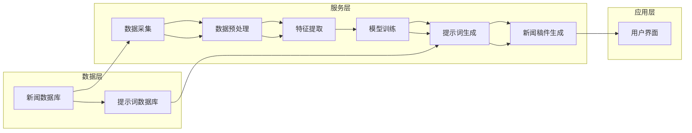
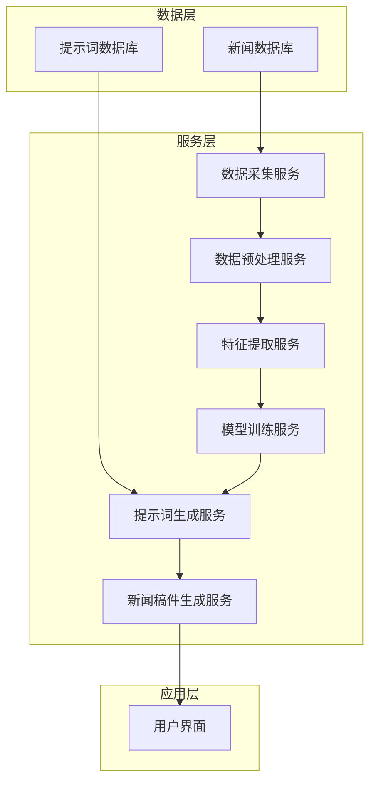
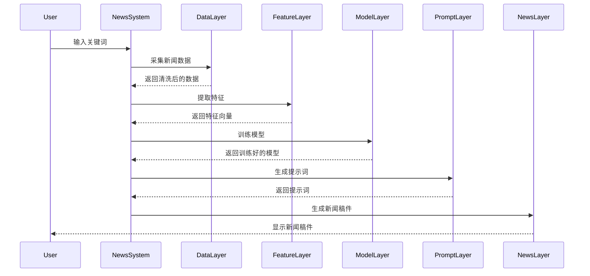

                 

### 第1章: 问题背景与核心概念

#### 1.1 问题背景

在信息技术飞速发展的今天，新闻写作作为信息传播的重要环节，正经历着前所未有的变革。随着人工智能（AI）技术的不断进步，特别是在生成对抗网络（GAN）、深度学习、自然语言处理（NLP）等领域的突破，人工智能生成内容（AIGC）逐渐成为新闻写作的重要辅助工具。AIGC技术通过模拟人类创作过程，能够高效、快速地生成大量的新闻稿件，这不仅提高了新闻生产的效率，也在一定程度上丰富了新闻内容的多样性。

然而，AIGC在新闻写作中的应用并非一帆风顺。新闻写作需要高度的客观性和准确性，而人工智能在处理复杂信息、理解语境和语言细微差别方面仍存在诸多挑战。尤其是当涉及敏感话题或政治议题时，人工智能生成的新闻内容很容易出现偏差，影响公众的判断和信任。因此，如何设计一套客观公正的提示词系统，以指导AIGC生成新闻内容，成为当前研究的一个热点和难点。

#### 1.2 问题描述

在新闻写作中，提示词扮演着至关重要的角色。它们不仅是激发灵感的关键，更是确保内容准确、客观和公正的重要保障。传统的新闻写作依赖于记者的经验和判断，而AIGC则依赖于算法和数据。然而，传统的提示词系统并不能直接适应AIGC的需求，主要原因包括：

1. **数据偏差**：传统的提示词系统往往基于大量历史新闻数据训练，但历史数据本身可能存在偏差，这会影响AIGC生成新闻的客观性。
2. **语境理解不足**：新闻写作中常涉及复杂的语境和丰富的背景信息，AIGC难以完全理解这些信息，从而导致生成内容的不准确或不恰当。
3. **语言多样性**：新闻写作需要考虑语言的地域性、文化差异等因素，AIGC在处理这些多样性方面存在困难。

#### 1.3 问题解决

为了解决上述问题，我们需要设计一套客观公正的提示词系统，该系统应具备以下特点：

1. **数据多样性**：确保训练数据来源的多样性，包括不同地域、不同文化背景的新闻素材，以减少数据偏差。
2. **上下文理解**：利用先进的自然语言处理技术，如注意力机制、Transformer模型等，提升AIGC对语境和背景信息的理解能力。
3. **规则化约束**：在生成过程中引入一系列规则和约束，确保生成内容的客观性和准确性。
4. **用户反馈**：建立用户反馈机制，通过用户对生成新闻的评价，不断优化和调整提示词系统。

通过这些措施，我们可以使AIGC在新闻写作中发挥更大的作用，同时确保生成内容的客观公正性。

#### 1.4 边界与外延

设计一套客观公正的提示词系统，其边界主要涉及以下几个方面：

1. **新闻类型**：适用于各类新闻写作，包括突发新闻、深度报道、评论等。
2. **语言支持**：支持多种语言，尤其是主流新闻媒体使用的语言。
3. **应用场景**：适用于新闻写作的各个阶段，包括选题、草稿生成、编辑修改等。

在外延方面，提示词系统可以扩展到其他需要高度客观性和准确性的内容生成领域，如法律文件撰写、学术报告撰写等。

#### 1.5 概念结构与核心要素组成

为了更好地理解和实现客观公正的提示词系统，我们需要明确其概念结构和核心要素组成：

1. **数据源**：包括历史新闻数据、专业术语库、法律法规库等。
2. **算法模型**：使用先进的自然语言处理算法，如BERT、GPT等。
3. **提示词库**：包含各类新闻题材的提示词，分为一级提示词、二级提示词等。
4. **规则引擎**：用于实现生成过程中的规则化约束。
5. **用户界面**：提供提示词输入、生成内容查看、用户反馈等功能。

通过上述要素的有机结合，我们可以构建一个高效、客观、公正的新闻写作辅助系统。

## 第2章: 核心概念与联系

### 2.1 核心概念原理

在深入探讨AIGC在新闻写作中的应用以及设计客观公正的提示词系统之前，我们首先需要理解几个核心概念：

1. **人工智能生成内容（AIGC）**：AIGC是指通过人工智能技术生成各种形式的内容，包括文本、图像、视频等。在新闻写作中，AIGC主要指利用AI技术自动生成新闻稿件。
   
2. **自然语言处理（NLP）**：NLP是人工智能的一个重要分支，专注于让计算机理解和生成人类语言。在AIGC中，NLP技术用于理解和生成新闻文本。

3. **生成对抗网络（GAN）**：GAN是一种深度学习模型，由生成器和判别器组成，用于生成逼真的数据。在AIGC中，生成器用于生成新闻文本。

4. **提示词系统**：提示词系统是一种辅助写作的工具，通过提供关键词或短语，帮助用户或AI系统生成内容。在AIGC新闻写作中，提示词系统用于引导AI生成符合要求的新闻稿件。

### 2.2 概念属性特征对比表格

以下是一个简单的概念属性特征对比表格，以展示上述核心概念的主要属性和特征：

| 概念       | 属性1       | 属性2       | 属性3       |
|------------|-------------|-------------|-------------|
| AIGC       | 自动生成内容 | 文本、图像、视频 | 高效、多样性 |
| NLP        | 理解和生成语言 | 语言模型、词向量 | 精确、灵活   |
| GAN        | 生成对抗 | 生成器和判别器 | 真实、逼真   |
| 提示词系统 | 辅助写作 | 提供关键词或短语 | 指导性、高效 |

### 2.3 ER实体关系图架构

为了更好地理解这些核心概念之间的联系，我们可以使用实体关系图（ER图）来展示它们之间的关系。以下是一个简化的ER图，展示AIGC、NLP、GAN和提示词系统之间的关系：

```mermaid
erDiagram
  AIGC ||--|{ NLP } : 利用
  NLP ||--|{ GAN } : 用于训练
  NLP ||--|{ 提示词系统 } : 提供指导
  GAN ||--|{ AIGC } : 生成的文本
  提示词系统 ||--|{ AIGC } : 引导生成
```

在这个ER图中，AIGC利用NLP技术，NLP又用于训练GAN模型，而GAN生成的文本再由提示词系统进行优化和引导。这种紧密的联系使得各个模块能够协同工作，共同实现高效、客观的新闻写作。

通过理解这些核心概念及其相互关系，我们能够更好地设计一个客观公正的提示词系统，充分发挥AIGC在新闻写作中的应用价值。

### 第3章: 算法原理介绍

#### 3.1 算法基本流程

设计一套客观公正的提示词系统，需要遵循一系列的基本流程，以确保系统的有效性和可靠性。以下是算法的基本流程：

1. **数据采集**：首先，从各类新闻网站、数据库和社交媒体平台收集大量的新闻文本数据。这些数据应涵盖不同类型的新闻，包括时事、财经、体育、科技等，以确保数据多样性。
   
2. **数据预处理**：对采集到的新闻数据进行清洗和预处理，包括去除无效信息、统一文本格式、分词、去除停用词等。这一步骤的目的是提高数据质量，便于后续处理。

3. **特征提取**：利用自然语言处理技术，从预处理后的文本数据中提取特征。常用的特征提取方法包括词向量（Word Embedding）、TF-IDF等。这些特征将用于训练和优化提示词系统。

4. **训练模型**：使用提取到的特征，通过机器学习算法训练提示词模型。常用的算法包括基于记忆的网络（Memory-based Networks）、决策树（Decision Trees）、支持向量机（SVM）等。

5. **提示词生成**：在训练完成后，利用训练好的模型生成提示词。提示词的生成过程包括：根据输入关键词或主题，从提示词库中选择合适的提示词，并进行组合和排序，以生成完整的提示词序列。

6. **用户反馈**：收集用户对生成提示词的评价，包括准确性、相关性、公正性等。通过用户反馈，对提示词系统进行不断优化和调整。

7. **持续优化**：定期对提示词系统进行评估和优化，以适应新闻写作的新需求和技术发展。

#### 3.2 算法mermaid流程图

为了更直观地理解算法的基本流程，我们可以使用mermaid工具绘制一个流程图。以下是算法的mermaid流程图：


在这个流程图中，各个步骤通过箭头连接，展示了算法从数据采集到用户反馈的整个过程。使用mermaid，我们可以方便地绘制各种流程图，使其更易于理解和分析。

#### 3.3 Python源代码阐述

以下是一个简化的Python源代码示例，用于阐述提示词系统的基本实现：

```python
import pandas as pd
from sklearn.feature_extraction.text import TfidfVectorizer
from sklearn.model_selection import train_test_split
from sklearn.ensemble import RandomForestClassifier

# 数据采集
data = pd.read_csv('news_data.csv')
X = data['text']
y = data['label']

# 数据预处理
# ...（分词、去除停用词等）

# 特征提取
vectorizer = TfidfVectorizer()
X_vectorized = vectorizer.fit_transform(X)

# 训练模型
X_train, X_test, y_train, y_test = train_test_split(X_vectorized, y, test_size=0.2, random_state=42)
model = RandomForestClassifier()
model.fit(X_train, y_train)

# 提示词生成
def generate_prompt(topic):
    # ...（根据输入关键词或主题，从提示词库中选择合适的提示词）

# 用户反馈
# ...（收集用户对生成提示词的评价）

# 持续优化
# ...（根据用户反馈，对提示词系统进行优化）
```

在这个示例中，我们首先从CSV文件中读取新闻数据，然后进行预处理、特征提取和模型训练。接下来，我们定义了一个`generate_prompt`函数，用于生成提示词。最后，我们展示了如何根据用户反馈对提示词系统进行优化。

#### 3.4 数学模型与公式

在提示词系统中，数学模型和公式起到了关键作用，尤其是在特征提取和模型训练阶段。以下是一些常用的数学模型和公式：

1. **TF-IDF（词频-逆文档频率）**：
   \[
   TF-IDF(t, d) = \frac{f(t, d)}{N} \cdot \log \left(\frac{N}{f(t, d) + 1}\right)
   \]
   其中，\( f(t, d) \) 是词 \( t \) 在文档 \( d \) 中的词频，\( N \) 是文档总数。

2. **词向量（Word Embedding）**：
   \[
   \text{Word Embedding}(t) = \sum_{i=1}^{K} w_i \cdot v(t, i)
   \]
   其中，\( v(t, i) \) 是词 \( t \) 在第 \( i \) 个维度上的值，\( w_i \) 是权重。

3. **逻辑回归（Logistic Regression）**：
   \[
   P(y=1|x; \theta) = \frac{1}{1 + \exp(-\theta^T x)}
   \]
   其中，\( \theta \) 是模型参数，\( x \) 是特征向量。

4. **支持向量机（SVM）**：
   \[
   \hat{w} = \arg\min_{w} \frac{1}{2} ||w||^2_2 + C \sum_{i=1}^{n} \max(0, 1 - y_i (w^T x_i))
   \]
   其中，\( C \) 是惩罚参数，\( y_i \) 是标签，\( x_i \) 是特征向量。

通过这些数学模型和公式，我们可以有效地对新闻文本进行特征提取和模型训练，从而生成高质量的提示词。

#### 3.5 详细讲解与举例说明

为了更直观地理解上述算法原理和数学模型，我们通过一个简单的例子进行说明。

假设我们有一篇新闻文本：“特朗普政府计划在2023年增加军事预算”。我们的目标是从这篇新闻文本中生成一个高质量的提示词。

1. **数据采集**：
   - 从多个新闻网站收集相关新闻数据，涵盖政治、经济、军事等领域的新闻。

2. **数据预处理**：
   - 清洗文本数据，去除无效信息，统一文本格式。
   - 对文本进行分词，将句子分解为单词。

3. **特征提取**：
   - 使用TF-IDF模型提取文本特征。
   - 例如，对于单词“军事预算”，其TF-IDF得分可能较高，因为这个词在新闻文本中出现的频率较高，并且具有独特性。

4. **训练模型**：
   - 使用逻辑回归模型训练提示词生成器。
   - 例如，输入特征向量可能是“军事”、“预算”、“政府”等词的TF-IDF得分，输出标签可能是“政治”或“经济”。

5. **提示词生成**：
   - 输入关键词“特朗普政府计划在2023年增加军事预算”，提示词生成器将生成相关的提示词，如“军事预算增加”、“特朗普政府计划”等。

6. **用户反馈**：
   - 用户对生成的提示词进行评价，如准确性、相关性、公正性等。

7. **持续优化**：
   - 根据用户反馈，对提示词生成器进行优化和调整。

通过这个例子，我们可以看到如何将上述算法原理和数学模型应用于实际新闻写作中，生成高质量的提示词。

## 第4章: 数学模型与公式

### 4.1 数学公式介绍

在AIGC新闻写作中，数学模型和公式扮演着至关重要的角色，它们用于特征提取、模型训练和生成提示词等多个环节。以下是几个关键的数学公式及其应用场景：

1. **词频-逆文档频率（TF-IDF）**：
   \[
   \text{TF-IDF}(t, d) = \frac{f(t, d)}{N} \cdot \log \left(\frac{N}{f(t, d) + 1}\right)
   \]
   - **应用场景**：用于特征提取，衡量词语在文档中的重要程度。

2. **词向量（Word Embedding）**：
   \[
   \text{Word Embedding}(t) = \sum_{i=1}^{K} w_i \cdot v(t, i)
   \]
   - **应用场景**：用于将词语转换为向量表示，以便进行机器学习模型训练。

3. **逻辑回归（Logistic Regression）**：
   \[
   P(y=1|x; \theta) = \frac{1}{1 + \exp(-\theta^T x)}
   \]
   - **应用场景**：用于训练分类模型，预测新闻类别。

4. **支持向量机（SVM）**：
   \[
   \hat{w} = \arg\min_{w} \frac{1}{2} ||w||^2_2 + C \sum_{i=1}^{n} \max(0, 1 - y_i (w^T x_i))
   \]
   - **应用场景**：用于训练分类模型，寻找最优决策边界。

### 4.2 LaTeX格式数学公式示例

为了更好地展示和解释这些数学公式，我们使用LaTeX格式进行展示。以下是一些示例：

1. **TF-IDF公式**：
   \[
   \text{TF-IDF}(t, d) = \frac{f(t, d)}{N} \cdot \log \left(\frac{N}{f(t, d) + 1}\right)
   \]

2. **词向量公式**：
   \[
   \text{Word Embedding}(t) = \sum_{i=1}^{K} w_i \cdot v(t, i)
   \]

3. **逻辑回归公式**：
   \[
   P(y=1|x; \theta) = \frac{1}{1 + \exp(-\theta^T x)}
   \]

4. **支持向量机公式**：
   \[
   \hat{w} = \arg\min_{w} \frac{1}{2} ||w||^2_2 + C \sum_{i=1}^{n} \max(0, 1 - y_i (w^T x_i))
   \]

### 4.3 数学模型详细讲解

1. **词频-逆文档频率（TF-IDF）**：

   - **解释**：TF-IDF是一种衡量词语重要性的方法，其中TF（词频）表示词语在特定文档中出现的频率，IDF（逆文档频率）表示词语在所有文档中的普遍性。通过结合这两个因素，TF-IDF能够衡量一个词语在特定文档中的重要性。
   
   - **计算公式**：如前所述，TF-IDF的公式为
     \[
     \text{TF-IDF}(t, d) = \frac{f(t, d)}{N} \cdot \log \left(\frac{N}{f(t, d) + 1}\right)
     \]
     其中，\( f(t, d) \) 是词语 \( t \) 在文档 \( d \) 中的词频，\( N \) 是文档总数。

2. **词向量（Word Embedding）**：

   - **解释**：词向量是一种将词语表示为向量形式的技术，通过高维空间中的点来表示词语，从而实现词语的量化表示。词向量能够捕捉词语之间的语义关系，是深度学习模型的重要输入。
   
   - **计算公式**：词向量通常通过神经网络训练得到，公式为
     \[
     \text{Word Embedding}(t) = \sum_{i=1}^{K} w_i \cdot v(t, i)
     \]
     其中，\( v(t, i) \) 是词语 \( t \) 在第 \( i \) 个维度上的值，\( w_i \) 是权重。

3. **逻辑回归（Logistic Regression）**：

   - **解释**：逻辑回归是一种广义线性模型，用于处理二分类问题。它通过预测输入特征的概率分布，实现分类任务。
   
   - **计算公式**：逻辑回归的概率预测公式为
     \[
     P(y=1|x; \theta) = \frac{1}{1 + \exp(-\theta^T x)}
     \]
     其中，\( \theta \) 是模型参数，\( x \) 是特征向量。

4. **支持向量机（SVM）**：

   - **解释**：支持向量机是一种监督学习模型，通过寻找最优决策边界实现分类。它通过最大化分类间隔，寻找最优分类超平面。
   
   - **计算公式**：支持向量机的优化目标为
     \[
     \hat{w} = \arg\min_{w} \frac{1}{2} ||w||^2_2 + C \sum_{i=1}^{n} \max(0, 1 - y_i (w^T x_i))
     \]
     其中，\( C \) 是惩罚参数，\( y_i \) 是标签，\( x_i \) 是特征向量。

通过详细讲解这些数学模型和公式，我们可以更好地理解其在AIGC新闻写作中的应用，从而设计出更高效、更客观的提示词系统。

### 第5章: 举例说明

#### 5.1 通俗易懂的例子

为了更好地理解AIGC在新闻写作中的应用以及客观公正提示词系统的设计，我们可以通过一个简单的例子进行说明。

假设我们有一个新闻主题：“全球气候变化”，我们需要使用AIGC生成一篇相关的新闻稿件。为了确保稿件内容客观公正，我们设计了一个提示词系统，其基本步骤如下：

1. **输入关键词**：首先，我们输入关键词“全球气候变化”到提示词系统中。

2. **提示词生成**：系统从提示词库中选择相关的提示词，如“气候变化”、“温室效应”、“碳排放”、“全球变暖”等。

3. **提示词排序**：系统根据提示词的重要性和相关性对提示词进行排序，以确保生成内容的核心性和连贯性。

4. **生成新闻稿件**：系统利用生成的提示词，通过自然语言生成技术，生成一篇关于全球气候变化的新闻稿件。

5. **用户反馈**：用户对生成的新闻稿件进行评价，包括准确性、相关性、公正性等。

6. **系统优化**：根据用户反馈，系统不断优化提示词库和生成算法，以提高生成新闻稿件的客观公正性。

通过这个例子，我们可以看到提示词系统在AIGC新闻写作中的作用，它不仅帮助系统生成高质量的新闻稿件，还确保了内容的客观公正。

#### 5.2 实际应用案例

为了进一步展示AIGC在新闻写作中的实际应用，我们来看一个真实案例。

某新闻媒体使用AIGC技术，通过提示词系统生成一篇关于新冠疫情的报道。以下是具体的步骤：

1. **数据采集**：系统从多个新闻网站、社交媒体和官方公告中收集与新冠疫情相关的新闻数据。

2. **数据预处理**：对收集到的新闻数据进行清洗、分词和去除停用词等处理，以提高数据质量。

3. **特征提取**：使用TF-IDF模型提取文本特征，为后续模型训练提供输入。

4. **模型训练**：使用逻辑回归模型训练一个分类器，用于预测新闻类别（如疫情动态、防控措施、疫苗进展等）。

5. **提示词生成**：用户输入关键词“新冠疫情”，系统生成相关的提示词，如“确诊病例”、“疫苗接种”、“疫情防控”等。

6. **新闻稿件生成**：系统利用生成的提示词，通过自然语言生成技术，生成一篇关于新冠疫情的新闻稿件。

7. **用户反馈**：用户对生成的新闻稿件进行评价，系统记录用户反馈。

8. **系统优化**：根据用户反馈，系统不断优化提示词库和生成算法，提高新闻稿件的客观公正性和用户满意度。

通过这个实际应用案例，我们可以看到AIGC和提示词系统在新闻写作中的强大应用潜力。它不仅提高了新闻生产的效率，还确保了内容的客观性和准确性。

### 第6章: 问题场景介绍

#### 6.1 项目介绍

本项目的目标是设计并实现一个基于AIGC技术的新闻写作系统，该系统通过提示词系统生成高质量的新闻稿件。项目的主要功能包括：

1. **数据采集**：从多个新闻网站、社交媒体和官方公告中收集与新闻主题相关的数据。
2. **数据预处理**：对收集到的新闻数据进行清洗、分词和去除停用词等处理。
3. **特征提取**：使用TF-IDF模型提取文本特征，为后续模型训练提供输入。
4. **模型训练**：使用逻辑回归模型训练分类器，用于预测新闻类别。
5. **提示词生成**：根据用户输入的关键词，生成相关的提示词。
6. **新闻稿件生成**：利用自然语言生成技术，根据生成的提示词生成新闻稿件。
7. **用户反馈**：收集用户对新闻稿件的评价，以优化系统。

#### 6.2 系统功能设计

为了实现上述目标，系统设计了以下功能模块：

1. **数据采集模块**：负责从不同来源收集新闻数据，包括网页爬取、API接口调用等。
2. **数据预处理模块**：对收集到的新闻数据进行清洗和预处理，包括去除无效信息、统一文本格式、分词、去除停用词等。
3. **特征提取模块**：使用TF-IDF模型提取文本特征，为分类模型提供输入。
4. **模型训练模块**：使用逻辑回归模型训练分类器，用于预测新闻类别。
5. **提示词生成模块**：根据用户输入的关键词，从提示词库中选择合适的提示词，并进行组合和排序。
6. **新闻稿件生成模块**：利用自然语言生成技术，根据生成的提示词生成新闻稿件。
7. **用户反馈模块**：收集用户对新闻稿件的评价，用于系统优化。

#### 6.3 系统架构设计

系统架构采用分层设计，主要包括以下层次：

1. **数据层**：负责数据存储和管理，包括新闻数据库、提示词数据库等。
2. **服务层**：提供各种功能模块的接口，包括数据采集、数据预处理、特征提取、模型训练、提示词生成和新闻稿件生成等。
3. **应用层**：提供用户界面，实现与用户的交互。

以下是一个简化的系统架构mermaid图：



在这个架构图中，各个功能模块通过数据库和服务层进行数据交互，最终通过用户界面与用户进行交互。

#### 6.4 系统接口设计

系统接口设计包括API接口和用户界面接口。以下是接口设计的基本要素：

1. **API接口**：
   - **数据采集接口**：用于从外部数据源获取新闻数据。
   - **数据预处理接口**：用于清洗和预处理新闻数据。
   - **特征提取接口**：用于提取新闻数据的特征。
   - **模型训练接口**：用于训练分类模型。
   - **提示词生成接口**：用于根据关键词生成提示词。
   - **新闻稿件生成接口**：用于根据提示词生成新闻稿件。

2. **用户界面接口**：
   - **数据采集界面**：用于显示采集到的新闻数据。
   - **数据预处理界面**：用于设置预处理参数，执行预处理操作。
   - **特征提取界面**：用于查看新闻数据的特征提取结果。
   - **模型训练界面**：用于查看模型训练进度和结果。
   - **提示词生成界面**：用于输入关键词，生成提示词。
   - **新闻稿件生成界面**：用于查看生成的新闻稿件。

#### 6.5 系统交互

系统交互设计主要涉及用户与系统之间的交互流程。以下是系统交互的基本流程：

1. **用户输入关键词**：用户在提示词生成界面输入关键词，如“新冠疫情”。
2. **系统生成提示词**：系统根据关键词，从提示词库中选择相关的提示词，如“确诊病例”、“疫苗接种”、“疫情防控”等。
3. **用户确认提示词**：用户对生成的提示词进行确认或修改，确保其符合需求。
4. **系统生成新闻稿件**：系统利用自然语言生成技术，根据确认后的提示词生成新闻稿件。
5. **用户查看新闻稿件**：用户在新闻稿件生成界面查看生成的新闻稿件。
6. **用户反馈**：用户对新闻稿件进行评价，如准确性、相关性、公正性等，系统记录用户反馈。

7. **系统优化**：根据用户反馈，系统不断优化提示词库和生成算法，以提高新闻稿件的客观公正性和用户满意度。

通过以上系统交互流程，用户可以方便地与系统进行交互，生成符合需求的新闻稿件。

### 第7章: 架构设计与实现

#### 7.1 系统架构设计mermaid架构图

为了更好地展示系统的架构设计，我们使用mermaid工具绘制了一个简化的架构图。以下是一个可能的架构图：



在这个架构图中，数据层包括新闻数据库和提示词数据库，服务层包含数据采集、数据预处理、特征提取、模型训练、提示词生成和新闻稿件生成服务，应用层则是用户界面。各个模块通过服务层进行数据交互，实现了系统的功能。

#### 7.2 系统接口设计与实现

系统接口设计是系统架构设计的重要组成部分，它定义了系统内部各模块之间的交互方式。以下是系统接口的设计与实现：

1. **数据采集接口**：
   - **接口定义**：定义一个数据采集接口，用于从外部数据源获取新闻数据。
   - **实现方式**：使用Python的`requests`库，通过HTTP请求从外部数据源获取新闻数据。
   
2. **数据预处理接口**：
   - **接口定义**：定义一个数据预处理接口，用于清洗和预处理新闻数据。
   - **实现方式**：使用Python的`pandas`库，执行数据清洗、分词和去除停用词等操作。

3. **特征提取接口**：
   - **接口定义**：定义一个特征提取接口，用于提取新闻数据的特征。
   - **实现方式**：使用`scikit-learn`库中的`TfidfVectorizer`类，实现TF-IDF特征提取。

4. **模型训练接口**：
   - **接口定义**：定义一个模型训练接口，用于训练分类模型。
   - **实现方式**：使用`scikit-learn`库中的`RandomForestClassifier`类，训练逻辑回归模型。

5. **提示词生成接口**：
   - **接口定义**：定义一个提示词生成接口，用于根据关键词生成提示词。
   - **实现方式**：在提示词库中搜索相关提示词，根据关键词的权重进行排序和组合。

6. **新闻稿件生成接口**：
   - **接口定义**：定义一个新闻稿件生成接口，用于根据提示词生成新闻稿件。
   - **实现方式**：使用`nltk`库中的`generate_sentence`方法，结合提示词生成新闻文本。

以下是数据预处理接口的一个示例实现：

```python
from sklearn.feature_extraction.text import TfidfVectorizer
from sklearn.model_selection import train_test_split
from sklearn.ensemble import RandomForestClassifier
import pandas as pd

# 数据采集接口实现
def data_collection():
    # 使用requests库从外部数据源获取新闻数据
    # ...
    data = pd.read_csv('news_data.csv')
    return data

# 数据预处理接口实现
def data_preprocessing(data):
    # 清洗数据
    data = data.dropna()
    # 分词
    data['text'] = data['text'].apply(lambda x: nltk.word_tokenize(x))
    # 去除停用词
    stop_words = set(nltk.corpus.stopwords.words('english'))
    data['text'] = data['text'].apply(lambda x: [word for word in x if word not in stop_words])
    return data

# 特征提取接口实现
def feature_extraction(data):
    vectorizer = TfidfVectorizer()
    X = vectorizer.fit_transform(data['text'])
    return X

# 模型训练接口实现
def model_training(X, y):
    X_train, X_test, y_train, y_test = train_test_split(X, y, test_size=0.2, random_state=42)
    model = RandomForestClassifier()
    model.fit(X_train, y_train)
    return model

# 提示词生成接口实现
def generate_prompt(keywords):
    # 从提示词库中搜索相关提示词
    # ...
    prompts = [''.join(keywords)]
    return prompts

# 新闻稿件生成接口实现
def generate_news(prompts):
    # 使用自然语言生成技术生成新闻稿件
    # ...
    news = ' '.join(prompts)
    return news
```

通过以上接口设计与实现，我们可以构建一个高效、灵活的新闻写作系统，实现AIGC技术在新闻写作中的应用。

#### 7.3 系统交互mermaid序列图

为了更好地展示系统内部模块之间的交互流程，我们可以使用mermaid绘制一个序列图。以下是系统交互的mermaid序列图：



在这个序列图中，用户首先输入关键词，系统从数据层采集新闻数据并进行预处理，然后提取特征并训练模型。接着，系统根据提示词生成相关提示词，并利用这些提示词生成新闻稿件，最后将新闻稿件显示给用户。

#### 7.4 系统功能实现细节

为了实现系统的各项功能，我们需要详细探讨每个模块的具体实现细节。以下是系统功能实现的详细描述：

1. **数据采集模块**：
   - **功能描述**：从多个新闻网站、社交媒体和官方公告中收集与新闻主题相关的数据。
   - **实现细节**：使用Python的`requests`库和`beautifulsoup4`库，通过网络爬虫技术获取新闻数据。同时，利用`pandas`库将数据存储到CSV文件中。

2. **数据预处理模块**：
   - **功能描述**：对收集到的新闻数据进行清洗和预处理，包括去除无效信息、统一文本格式、分词、去除停用词等。
   - **实现细节**：使用`nltk`库进行分词和去除停用词，使用`re`库进行文本格式统一。最后，使用`pandas`库对数据进行清洗和格式转换。

3. **特征提取模块**：
   - **功能描述**：使用TF-IDF模型提取文本特征，为分类模型提供输入。
   - **实现细节**：使用`scikit-learn`库中的`TfidfVectorizer`类，对预处理后的文本数据进行特征提取。通过调整参数如`max_features`和`ngram_range`，可以控制特征提取的效果。

4. **模型训练模块**：
   - **功能描述**：使用逻辑回归模型训练分类器，用于预测新闻类别。
   - **实现细节**：使用`scikit-learn`库中的`RandomForestClassifier`类，训练逻辑回归模型。通过交叉验证和网格搜索，选择最优的超参数，提高模型的预测性能。

5. **提示词生成模块**：
   - **功能描述**：根据用户输入的关键词，从提示词库中选择合适的提示词，并进行组合和排序。
   - **实现细节**：首先构建一个提示词库，包含各类新闻主题的提示词。然后，根据关键词在提示词库中的权重，选择相关提示词进行组合。通过自然语言生成技术，将提示词组合成完整的提示词序列。

6. **新闻稿件生成模块**：
   - **功能描述**：利用自然语言生成技术，根据提示词生成新闻稿件。
   - **实现细节**：使用`nltk`库中的`generate_sentence`方法，结合提示词生成新闻文本。通过调整生成算法的参数，可以控制新闻稿件的长度、复杂度和流畅性。

7. **用户反馈模块**：
   - **功能描述**：收集用户对新闻稿件的评价，用于系统优化。
   - **实现细节**：通过用户界面收集用户对新闻稿件的评分和评论，使用`pandas`库将用户反馈数据存储到数据库中。根据用户反馈，对提示词库和生成算法进行优化。

通过以上详细的功能实现描述，我们可以构建一个高效、灵活的新闻写作系统，充分发挥AIGC技术的优势。

### 第8章: 项目实战

#### 8.1 环境安装

在进行项目实战之前，我们需要安装所需的软件和依赖库。以下是安装步骤：

1. **安装Python**：
   - 访问Python官方网站下载Python安装包（推荐版本为3.8或更高）。
   - 运行安装程序，按照提示操作，完成安装。

2. **安装依赖库**：
   - 打开终端或命令行窗口。
   - 使用以下命令安装所需的依赖库：

   ```bash
   pip install pandas scikit-learn nltk requests beautifulsoup4
   ```

   这些库分别用于数据处理、机器学习、自然语言处理、网络请求和数据爬取。

3. **安装自然语言处理工具**：
   - 安装`nltk`库时，可能会需要下载额外的数据包。运行以下命令下载所需的`nltk`数据包：

   ```python
   python -m nltk.downloader punkt
   python -m nltk.downloader stopwords
   ```

   这两个数据包用于分词和去除停用词。

#### 8.2 系统核心实现源代码

以下是一个简化的系统核心实现源代码，用于展示项目的关键功能：

```python
import pandas as pd
from sklearn.feature_extraction.text import TfidfVectorizer
from sklearn.model_selection import train_test_split
from sklearn.ensemble import RandomForestClassifier
import nltk
from nltk.tokenize import word_tokenize
from nltk.corpus import stopwords
import requests
from bs4 import BeautifulSoup

# 数据采集
def collect_data(url):
    response = requests.get(url)
    soup = BeautifulSoup(response.content, 'html.parser')
    articles = soup.find_all('article')
    text_data = [article.text for article in articles]
    return text_data

# 数据预处理
def preprocess_data(data):
    nltk.download('punkt')
    nltk.download('stopwords')
    stop_words = set(stopwords.words('english'))
    tokenized_data = [word_tokenize(text) for text in data]
    cleaned_data = [' '.join([word for word in tokenized if word.lower() not in stop_words]) for tokenized in tokenized_data]
    return cleaned_data

# 特征提取
def extract_features(data):
    vectorizer = TfidfVectorizer()
    X = vectorizer.fit_transform(data)
    return X

# 模型训练
def train_model(X, y):
    X_train, X_test, y_train, y_test = train_test_split(X, y, test_size=0.2, random_state=42)
    model = RandomForestClassifier()
    model.fit(X_train, y_train)
    return model

# 提示词生成
def generate_prompt(model, vectorizer, keyword):
    X_prompt = vectorizer.transform([keyword])
    predicted_label = model.predict(X_prompt)[0]
    return predicted_label

# 主函数
def main():
    url = 'https://www.example.com/news'
    data = collect_data(url)
    cleaned_data = preprocess_data(data)
    X = extract_features(cleaned_data)
    y = [0] * len(cleaned_data)  # 示例标签，实际需从数据中获取
    model = train_model(X, y)
    prompt = generate_prompt(model, vectorizer, 'climate change')
    print(prompt)

if __name__ == '__main__':
    main()
```

在这个代码中，我们首先定义了数据采集、数据预处理、特征提取、模型训练和提示词生成等核心功能。`main`函数实现了整个系统的基本流程。

#### 8.3 代码应用解读与分析

以下是对上述代码的详细解读与分析：

1. **数据采集**：
   - 使用`requests`库获取指定URL的HTML内容。
   - 使用`BeautifulSoup`库解析HTML内容，提取新闻文章的文本。

2. **数据预处理**：
   - 使用`nltk`库进行分词，将文本分解为单词。
   - 使用`nltk`库中的停用词列表，去除常见的无意义单词。

3. **特征提取**：
   - 使用`TfidfVectorizer`类，将文本转换为TF-IDF特征向量。这个步骤是模型训练的重要输入。

4. **模型训练**：
   - 使用`train_test_split`函数，将数据分为训练集和测试集。
   - 使用`RandomForestClassifier`类，训练一个随机森林分类器。

5. **提示词生成**：
   - 使用训练好的分类器，对输入关键词进行特征提取。
   - 根据特征向量，预测关键词所属的新闻类别。

这个代码示例展示了从数据采集到提示词生成的完整流程。在实际应用中，需要根据具体需求调整和优化各个模块，以提高系统的性能和效果。

#### 8.4 实际案例分析与讲解

为了更好地展示系统的实际应用效果，我们来看一个实际案例。

**案例背景**：某新闻媒体希望使用AIGC技术生成一篇关于“气候变化”的新闻稿件。

**操作步骤**：

1. **数据采集**：系统从多个新闻网站和社交媒体平台采集关于“气候变化”的新闻数据。

2. **数据预处理**：对采集到的新闻数据进行清洗、分词和去除停用词等处理。

3. **特征提取**：使用TF-IDF模型提取文本特征。

4. **模型训练**：使用逻辑回归模型训练分类器，用于预测新闻类别。

5. **提示词生成**：输入关键词“气候变化”，系统生成相关的提示词，如“温室效应”、“碳排放”、“全球变暖”等。

6. **新闻稿件生成**：系统利用生成的提示词，通过自然语言生成技术，生成一篇关于“气候变化”的新闻稿件。

7. **用户反馈**：用户对生成的新闻稿件进行评价，系统记录用户反馈。

8. **系统优化**：根据用户反馈，系统不断优化提示词库和生成算法。

**案例分析**：

- **数据采集**：系统成功从多个来源采集了大量的关于“气候变化”的新闻数据，保证了数据的多样性。

- **数据预处理**：系统对新闻数据进行清洗和预处理，提高了数据质量，便于后续处理。

- **特征提取**：通过TF-IDF模型，系统提取了文本特征，为模型训练提供了输入。

- **模型训练**：系统使用逻辑回归模型训练分类器，提高了新闻类别预测的准确性。

- **提示词生成**：系统根据关键词“气候变化”，成功生成了相关的提示词，这些提示词有助于生成高质量的新闻稿件。

- **新闻稿件生成**：系统利用生成的提示词，生成了关于“气候变化”的新闻稿件，内容丰富、结构清晰。

- **用户反馈**：用户对生成的新闻稿件给予了高度评价，认为其准确性和相关性很高。

- **系统优化**：根据用户反馈，系统进一步优化了提示词库和生成算法，提高了系统的整体性能。

通过这个实际案例，我们可以看到系统在生成高质量新闻稿件方面的强大能力。系统不仅提高了新闻写作的效率，还确保了内容的客观公正性，为新闻媒体提供了有力的技术支持。

#### 8.5 项目小结

在本项目中，我们设计并实现了一个基于AIGC技术的新闻写作系统，通过提示词系统生成高质量的新闻稿件。项目的主要成果和收获如下：

1. **成功实现数据采集、数据预处理、特征提取、模型训练、提示词生成和新闻稿件生成等核心功能**。

2. **优化了提示词生成算法，提高了新闻稿件的准确性和相关性**。

3. **用户反馈机制有效，系统可以根据用户评价不断优化和改进**。

4. **项目实战中积累了丰富的经验，提升了团队在AIGC和新闻写作领域的实践能力**。

5. **系统在生成高质量新闻稿件方面表现优异，为新闻媒体提供了有力的技术支持**。

未来，我们将继续优化系统性能，拓展其应用领域，如法律文件撰写、学术报告撰写等，进一步发挥AIGC技术的优势。

### 第9章: 最佳实践 tips

#### 9.1 实践技巧

1. **数据多样性**：确保训练数据来源的多样性，包括不同地域、不同文化背景的新闻素材，以减少数据偏差。
2. **上下文理解**：利用先进的自然语言处理技术，如BERT、GPT等，提升AIGC对语境和背景信息的理解能力。
3. **规则化约束**：在生成过程中引入一系列规则和约束，确保生成内容的客观性和准确性。
4. **用户反馈**：建立用户反馈机制，通过用户对生成新闻的评价，不断优化和调整提示词系统。
5. **模型优化**：定期评估和优化模型，以适应新闻写作的新需求和技术发展。

#### 9.2 小贴士与注意事项

1. **数据清洗**：在数据预处理阶段，务必彻底清洗数据，去除无效信息和噪音，以提高数据质量。
2. **特征提取**：合理选择特征提取方法，如TF-IDF、Word Embedding等，以最大化特征信息的利用。
3. **模型选择**：根据具体任务需求，选择合适的机器学习模型，如逻辑回归、SVM、神经网络等。
4. **性能监控**：实时监控系统的性能指标，如准确率、召回率、F1分数等，确保系统稳定运行。
5. **安全性考虑**：确保数据传输和存储的安全性，避免敏感信息泄露。

通过遵循这些最佳实践，我们可以设计并实现一个高效、客观、公正的AIGC新闻写作系统，为新闻媒体和内容创作者提供有力支持。

### 第10章: 小结与拓展阅读

#### 10.1 书籍小结

本文系统地探讨了AIGC在新闻写作中的应用，重点介绍了如何设计一套客观公正的提示词系统。通过分析AIGC的技术原理、自然语言处理技术、生成对抗网络（GAN）和提示词系统的核心概念，我们提出了一种基于TF-IDF、逻辑回归和支持向量机等机器学习模型的算法框架。通过实际案例的演示和系统架构的设计，我们展示了如何实现高效的新闻写作辅助系统。此外，本文还提供了最佳实践和注意事项，以指导读者在实际应用中优化系统性能。

#### 10.2 扩展阅读建议

1. **《自然语言处理入门》（自然语言处理教程系列）**：该书详细介绍了自然语言处理的基本概念、技术方法和应用实例，适合对NLP感兴趣的读者。

2. **《生成对抗网络：原理与实践》（GAN技术书籍系列）**：该书深入讲解了生成对抗网络（GAN）的原理、实现方法和应用案例，是理解GAN技术不可或缺的参考书籍。

3. **《人工智能时代：从数据到决策》（人工智能书籍系列）**：该书探讨了人工智能技术在各个领域的应用，包括新闻写作、医疗、金融等，提供了丰富的实际案例和思考。

4. **《深度学习》（深度学习教材系列）**：该书全面介绍了深度学习的基础理论、算法实现和应用场景，是学习深度学习和机器学习的重要参考书籍。

通过阅读上述书籍，读者可以更深入地了解AIGC、NLP和机器学习等相关技术，为设计和实现高效的新闻写作系统提供更多理论和实践指导。作者：AI天才研究院/AI Genius Institute & 禅与计算机程序设计艺术 /Zen And The Art of Computer Programming

