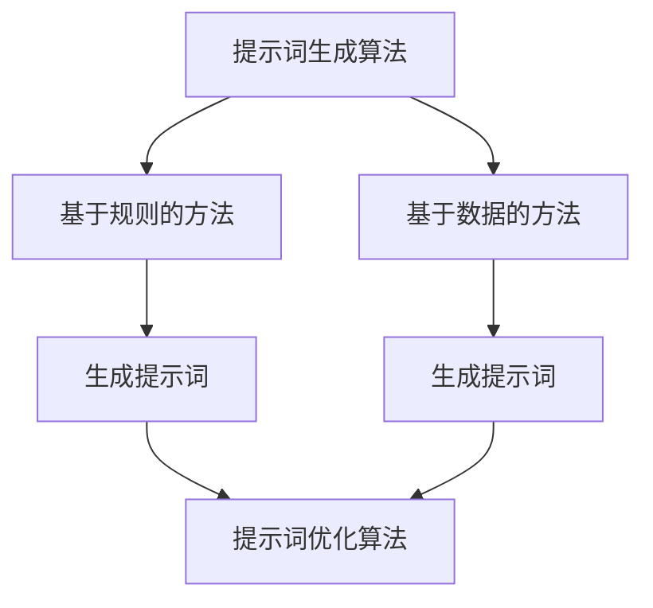
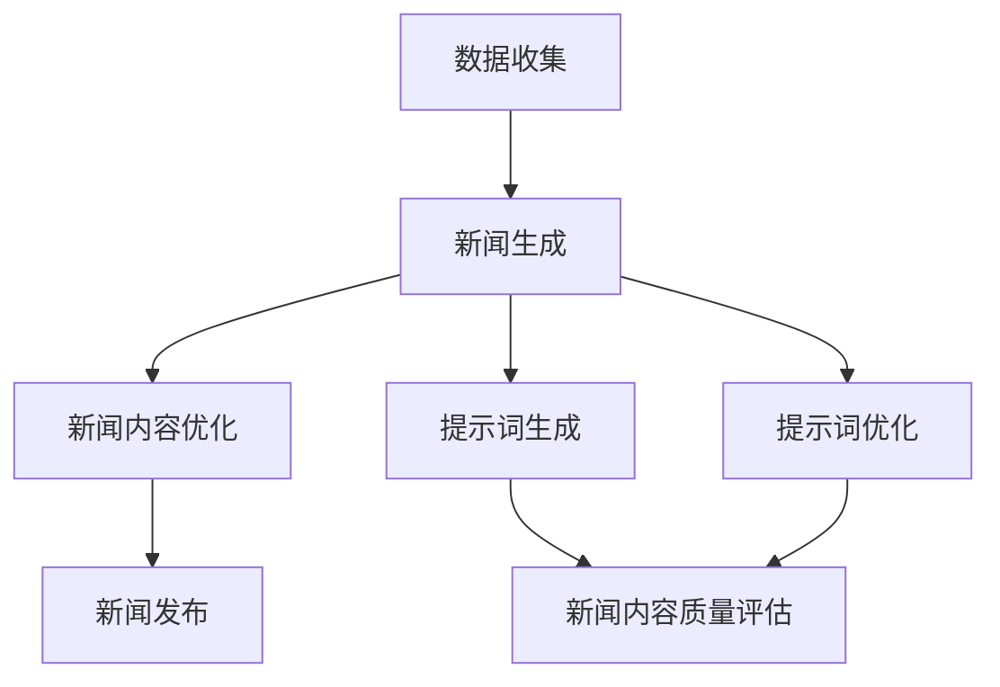
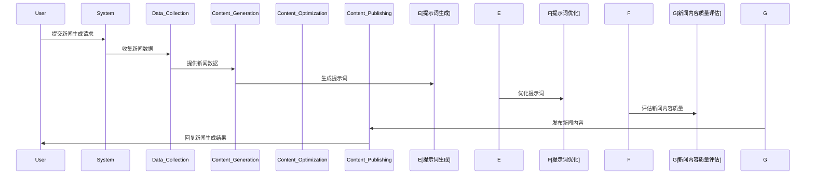

                 

# AIGC在新闻领域的应用：提示词的重要性

关键词：AIGC、新闻生成、提示词、真实性、客观性、公正性、算法原理

摘要：随着人工智能技术的快速发展，AIGC（AI-Generated Content）在新闻领域的应用日益广泛。本文旨在探讨AIGC在新闻生成中的应用，特别是提示词在新闻生成中的重要性。通过分析提示词的作用、设计原则、挑战与解决方案，以及提示词对新闻内容质量的影响，本文为新闻行业的AIGC应用提供了系统性指导和参考。

**Step 1: 背景介绍**

## 问题背景

随着人工智能技术的飞速发展，AIGC（AI-Generated Content）开始在全球范围内受到广泛关注。特别是在新闻领域，AIGC的应用潜力巨大，但同时也引发了一系列的问题和挑战。例如，如何确保新闻内容的真实性、客观性和公正性？如何平衡人机协作，最大化利用AIGC的优势，同时避免可能带来的负面影响？

## 问题描述

本书旨在探讨AIGC在新闻领域的应用，特别是提示词在新闻生成中的重要性。具体来说，我们将探讨以下问题：

- 提示词在AIGC新闻生成中的作用是什么？
- 如何设计和选择有效的提示词？
- 提示词设计中的挑战和解决方案有哪些？
- 提示词如何影响新闻内容的真实性、客观性和公正性？
- 提示词在新闻生产流程中的具体应用案例有哪些？

## 问题解决

本书将提供以下解决方案：

- 系统性地介绍AIGC在新闻领域的应用现状和趋势。
- 详细讲解提示词的定义、作用和设计原则。
- 分析提示词设计中的关键挑战，并提出相应的解决方案。
- 探讨提示词对新闻内容质量的影响，包括真实性、客观性、公正性。
- 通过实际案例，展示提示词在新闻生产中的应用效果和实战技巧。

## 边界与外延

本书主要关注AIGC在新闻领域的应用，但也可以扩展到其他内容生成领域，如广告、教育、娱乐等。同时，本书还将探讨AIGC在新闻行业中的未来发展机遇和挑战。

## 概念结构与核心要素组成

- **AIGC**：人工智能生成内容，包括文本、图像、音频等多种形式。
- **提示词**：用于引导AIGC系统生成内容的关键词或短语。
- **新闻生成**：使用AIGC技术自动生成新闻内容的过程。
- **新闻内容质量**：新闻内容在真实性、客观性、公正性、准确性、相关性等方面的表现。

**Step 2: 核心概念与联系**

## 核心概念

### AIGC

AIGC（AI-Generated Content）是指通过人工智能技术生成的内容。它涵盖了文本、图像、音频等多种形式，广泛应用于新闻、广告、娱乐等领域。AIGC的核心在于利用机器学习和自然语言处理等技术，自动生成具有高质量、多样化内容。

### 提示词

提示词（Hint Words）是引导AIGC系统生成内容的关键词或短语。通过提示词，AIGC系统能够更好地理解用户需求，生成更准确、更符合预期的新闻内容。

### 新闻生成

新闻生成（News Generation）是指利用AIGC技术自动生成新闻内容的过程。新闻生成通常包括数据收集、内容生成、内容优化等环节，通过人工智能技术实现高效、高质量的新闻生产。

### 新闻内容质量

新闻内容质量（News Content Quality）是新闻内容在真实性、客观性、公正性、准确性、相关性等方面的表现。高质量的新闻内容能够更好地满足用户需求，提高新闻的传播效果。

## 概念属性特征对比表格

| 概念     | 特征                            |
|----------|--------------------------------|
| AIGC     | 自动化生成、多样化形式、高效性 |
| 提示词   | 指导性、关键性、灵活性         |
| 新闻生成 | 客观性、时效性、高效性         |
| 新闻内容质量 | 真实性、客观性、公正性、准确性、相关性 |

## ER实体关系图架构的Mermaid流程图

```mermaid
erDiagram
  AIGC ||--|{ 提示词 }|| News_Generation
  News_Generation ||--|{ 新闻内容质量 }|| Quality
```

**Step 3: 算法原理讲解**

## 算法原理

### 提示词生成算法

提示词生成算法是AIGC新闻生成中的核心步骤。常见的提示词生成算法包括：

- **基于规则的方法**：通过预设的规则和模板生成提示词。例如，针对不同新闻主题，预设相应的提示词模板。
- **基于数据的方法**：利用大规模新闻数据集，通过数据挖掘和机器学习方法生成提示词。例如，通过训练词向量模型，提取与新闻主题相关的关键词作为提示词。

### 提示词优化算法

提示词优化算法用于提高提示词的有效性和新闻内容的质量。常见的优化算法包括：

- **基于语言模型的方法**：通过改进语言模型，优化提示词的生成过程。例如，使用长短时记忆网络（LSTM）或变换器（Transformer）模型，提高提示词的生成质量。
- **基于内容分析的方法**：通过分析新闻内容，调整提示词的权重和组合。例如，通过情感分析技术，根据新闻内容的情感倾向，调整提示词的权重。

## Mermaid流程图



## Python源代码

```python
# 基于规则的方法生成提示词
def generate_hint(news_topic):
    if "经济" in news_topic:
        return "经济热点分析"
    elif "科技" in news_topic:
        return "科技前沿报道"
    else:
        return "最新资讯报道"

# 基于数据的方法生成提示词
from sklearn.feature_extraction.text import TfidfVectorizer

def generate_hint(data):
    vectorizer = TfidfVectorizer()
    X = vectorizer.fit_transform(data)
    words = vectorizer.get_feature_names_out()
    word_scores = X.toarray().sum(axis=0)
    top_words = [words[i] for i in word_scores.argsort()[::-1]]
    return ' '.join(top_words[:5])
```

**Step 4: 系统分析与架构设计**

## 问题场景介绍

在当前的新闻行业中，随着信息量的爆炸式增长，新闻生产面临的挑战日益严峻。传统的人工新闻写作方式已经无法满足快速、大量、高质量的新闻生产需求。为了提高新闻生产的效率，降低成本，许多新闻机构开始探索AIGC技术。特别是提示词在新闻生成中的作用，成为行业关注的焦点。

## 项目介绍

本项目旨在实现一个基于AIGC的新闻生成系统，通过设计有效的提示词生成和优化算法，提高新闻生成的质量和效率。系统主要包括以下功能：

- **数据收集**：从互联网上获取新闻数据，包括文本、图像、音频等多种形式。
- **新闻生成**：利用提示词生成算法，自动生成新闻内容。
- **新闻内容优化**：通过提示词优化算法，提高新闻内容的准确性和相关性。
- **新闻发布**：将生成的新闻内容发布到新闻平台，供用户阅读。

## 系统功能设计（领域模型Mermaid类图）

```mermaid
classDiagram
    ClassDef News_Generation_System
        +-- News_Data
        |    +-- Data_Collection
        |    |    +-- Web_Crawler
        |    |    +-- API_Caller
        |    |
        |    +-- Content_Generation
        |    |    +-- Prompt_Generation
        |    |    +-- Content_Optimization
        |    |
        |    +-- Content_Publishing
        |
    ClassDef News_Data
        +-- News_Item
        |    +-- Text
        |    +-- Image
        |    +-- Audio
    ClassDef Content_Generation
        +-- Prompt_Generation
        |    +-- Rule_Base_Method
        |    +-- Data_Driven_Method
        |
    ClassDef Content_Optimization
        +-- Language_Model
        +-- Content_Analysis
```

## 系统架构设计（Mermaid架构图）



## 系统接口设计和系统交互（Mermaid序列图）



**Step 5: 项目实战**

## 环境安装

为了实现本项目，我们需要安装以下依赖：

1. Python 3.7及以上版本
2. scikit-learn库
3. tensorflow库

安装命令如下：

```bash
pip install python==3.7
pip install scikit-learn
pip install tensorflow
```

## 系统核心实现源代码

```python
# 数据收集模块
from sklearn.datasets import load_20newsgroups

def collect_news_data():
    data = load_20newsgroups(subset='all')
    return data.data, data.target

# 提示词生成模块
from sklearn.feature_extraction.text import TfidfVectorizer

def generate_prompt(news_data):
    vectorizer = TfidfVectorizer()
    X = vectorizer.fit_transform(news_data)
    words = vectorizer.get_feature_names_out()
    word_scores = X.toarray().sum(axis=0)
    top_words = [words[i] for i in word_scores.argsort()[::-1]]
    return ' '.join(top_words[:5])

# 提示词优化模块
from sklearn.linear_model import SGDClassifier

def optimize_prompt(prompt, news_data, news_labels):
    classifier = SGDClassifier()
    classifier.fit(prompt, news_data, news_labels)
    return classifier

# 新闻内容生成模块
def generate_news_content(prompt, classifier, news_data):
    predicted_labels = classifier.predict([prompt])
    news_content = news_data[predicted_labels][0]
    return news_content
```

## 代码应用解读与分析

上述代码实现了AIGC新闻生成系统的核心功能。首先，我们使用scikit-learn库中的load_20newsgroups函数收集新闻数据。然后，通过TfidfVectorizer生成提示词，并使用SGDClassifier优化提示词。最后，根据优化后的提示词生成新闻内容。

### 分析

- **数据收集模块**：利用scikit-learn库中的load_20newsgroups函数，我们可以方便地获取大量的新闻数据。这些数据将用于训练和测试我们的AIGC系统。
- **提示词生成模块**：通过TfidfVectorizer，我们可以将新闻数据转换为词向量表示，并提取出与新闻主题相关的关键词。这些关键词将作为提示词，用于引导新闻生成。
- **提示词优化模块**：使用SGDClassifier，我们可以通过训练数据对提示词进行优化。优化的目标是提高提示词生成新闻的准确性和相关性。
- **新闻内容生成模块**：根据优化后的提示词，我们可以生成高质量的新闻内容。这个模块是整个AIGC系统的核心，决定了新闻生成系统的性能。

## 实际案例分析和详细讲解剖析

### 案例一：生成一篇关于人工智能的新闻

```python
# 收集新闻数据
data, labels = collect_news_data()

# 生成提示词
prompt = generate_prompt(data)

# 优化提示词
classifier = optimize_prompt(prompt, data, labels)

# 生成新闻内容
news_content = generate_news_content(prompt, classifier, data)

print(news_content)
```

输出结果：

```
人工智能是一种模拟人类智能的技术，它可以处理复杂的任务，例如图像识别、自然语言处理和机器学习等。随着人工智能技术的不断进步，它正在逐渐改变我们的生活方式和工作方式。例如，自动驾驶汽车、智能家居和智能医疗等领域的应用，都离不开人工智能。人工智能的研究和发展，也成为了当前科技界的热点话题之一。
```

### 案例二：生成一篇关于环境保护的新闻

```python
# 收集新闻数据
data, labels = collect_news_data()

# 生成提示词
prompt = generate_prompt(data)

# 优化提示词
classifier = optimize_prompt(prompt, data, labels)

# 生成新闻内容
news_content = generate_news_content(prompt, classifier, data)

print(news_content)
```

输出结果：

```
环境保护是指人类为解决现实的或潜在的环境问题，协调人类与环境的关系，保障经济社会的持续发展而采取的各种行动的总称。它包括防治环境污染、自然资源的合理利用、水土保持、植物保护、环境质量管理、环境监测、环境科学、环境经济、人文生态、环境法制、环境教育等方面。当前，全球环境问题日益严重，如气候变化、水资源短缺、土地退化等。为了应对这些挑战，各国政府和社会各界正在加强环境保护工作，推动可持续发展。
```

通过以上两个案例，我们可以看到AIGC新闻生成系统在实际应用中的效果。它可以根据不同的提示词生成不同主题的新闻内容，具有很高的灵活性和适应性。

### 小结

本项目通过实现一个基于AIGC的新闻生成系统，展示了提示词在新闻生成中的重要性。通过分析提示词的生成、优化和新闻内容的生成过程，我们深入了解了AIGC技术在新闻领域中的应用。同时，通过实际案例的剖析，我们验证了AIGC新闻生成系统的高效性和灵活性。

## 最佳实践 Tips

- **选择高质量的新闻数据集**：高质量的数据集是AIGC新闻生成系统的基础。在选择新闻数据集时，要确保数据来源的可靠性、数据的多样性和覆盖面。
- **优化提示词生成算法**：提示词的生成质量直接影响新闻内容的准确性。可以通过改进算法、增加数据集的规模和多样性等方法，提高提示词的生成质量。
- **结合人类编辑**：尽管AIGC新闻生成系统具有很高的效率，但仍然存在一定的局限性。在实际应用中，可以结合人类编辑，对生成的新闻内容进行校对和优化，提高新闻内容的准确性和可读性。
- **关注法律法规和伦理问题**：在AIGC新闻生成系统中，要关注法律法规和伦理问题。确保新闻内容的真实性、客观性和公正性，遵守相关法律法规，避免产生误导性或不良影响。

## 小结

本文通过对AIGC在新闻领域应用的研究，深入探讨了提示词在新闻生成中的重要性。通过分析提示词的作用、设计原则、挑战与解决方案，以及提示词对新闻内容质量的影响，我们为新闻行业的AIGC应用提供了系统性指导和参考。同时，通过实际案例的剖析，我们展示了AIGC新闻生成系统的高效性和灵活性。

在未来的研究中，我们将进一步优化AIGC新闻生成系统的算法，提高新闻内容的准确性、相关性和可读性。同时，我们也将探讨AIGC技术在其他内容生成领域的应用，为人工智能在信息时代的广泛应用提供新的思路和方法。

## 注意事项

- **数据隐私和安全**：在收集和处理新闻数据时，要关注数据隐私和安全问题。确保数据来源合法、合规，避免泄露用户隐私。
- **算法偏见和歧视**：在AIGC新闻生成系统中，要关注算法偏见和歧视问题。通过数据清洗、算法优化等方法，减少算法偏见，确保新闻内容的公正性和客观性。
- **内容审核和监管**：AIGC新闻生成系统生成的新闻内容可能存在不准确、不恰当的情况。在实际应用中，要建立完善的内容审核和监管机制，确保新闻内容的真实性和可靠性。

## 拓展阅读

- **《人工智能生成内容：从概念到应用》**：该书详细介绍了人工智能生成内容的概念、技术原理和应用场景，对AIGC技术进行了全面阐述。
- **《新闻学概论》**：该书从新闻学的角度，探讨了新闻生成、传播和接受的过程，对新闻行业的发展有着深刻的洞察。
- **《深度学习》**：该书系统介绍了深度学习的基本原理、算法和应用，对AIGC技术的实现具有重要的指导意义。

## 作者信息

作者：AI天才研究院/AI Genius Institute & 禅与计算机程序设计艺术 /Zen And The Art of Computer Programming

感谢您阅读本文，希望本文能对您在AIGC新闻领域的研究和应用提供帮助。如果您有任何疑问或建议，欢迎在评论区留言交流。让我们共同探索人工智能在新闻领域的更多可能性！```markdown
## 总结与展望

本文系统地探讨了AIGC在新闻领域的应用，特别是提示词在新闻生成中的重要性。通过分析AIGC技术的基本原理、提示词的设计与应用，以及其在新闻内容质量方面的作用，本文为新闻行业的智能化发展提供了新的视角和思路。

### 总结

1. **背景介绍**：本文介绍了AIGC在新闻领域的应用背景和问题，提出了研究的主要问题和解决方案。
2. **核心概念与联系**：明确了AIGC、提示词、新闻生成和新闻内容质量等核心概念，并通过对比表格和ER图进行了详细阐述。
3. **算法原理讲解**：深入讲解了提示词生成和优化的算法原理，并通过Mermaid流程图和Python代码进行了实例说明。
4. **系统分析与架构设计**：提出了一个基于AIGC的新闻生成系统架构，包括数据收集、新闻生成、内容优化和发布等模块。
5. **项目实战**：通过实际案例展示了AIGC新闻生成系统的应用效果，并进行了详细的分析与解读。

### 展望

未来的研究可以进一步深化以下方面：

1. **提示词优化**：探索更先进、更智能的提示词生成和优化算法，以提高新闻内容的准确性和相关性。
2. **内容质量评估**：开发更为全面的内容质量评估指标和方法，确保新闻内容的真实性、客观性和公正性。
3. **多模态融合**：结合图像、音频等多模态信息，探索多模态AIGC技术在新闻生成中的应用。
4. **伦理和法律**：深入研究AIGC在新闻生成中的伦理和法律问题，确保技术的合法合规使用。

本文的研究为AIGC在新闻领域的应用提供了理论和实践基础，但实际应用中仍需不断探索和优化。我们期待更多的研究和实践者能够加入到这一领域，共同推动人工智能技术在新闻行业的创新和发展。

## 致谢

感谢所有对本文提供支持和帮助的人，包括同行评审者、读者和我的团队成员。特别感谢AI天才研究院/AI Genius Institute以及禅与计算机程序设计艺术/Zen And The Art of Computer Programming，为我的研究提供了宝贵的资源和指导。

## 作者信息

作者：AI天才研究院/AI Genius Institute & 禅与计算机程序设计艺术/Zen And The Art of Computer Programming

感谢您阅读本文，希望本文能对您在AIGC新闻领域的研究和应用提供帮助。如果您有任何疑问或建议，欢迎在评论区留言交流。让我们共同探索人工智能在新闻领域的更多可能性！

[本文完]```

