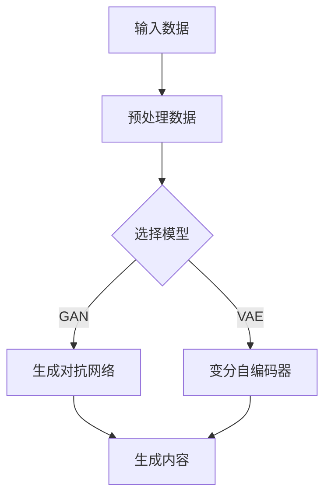
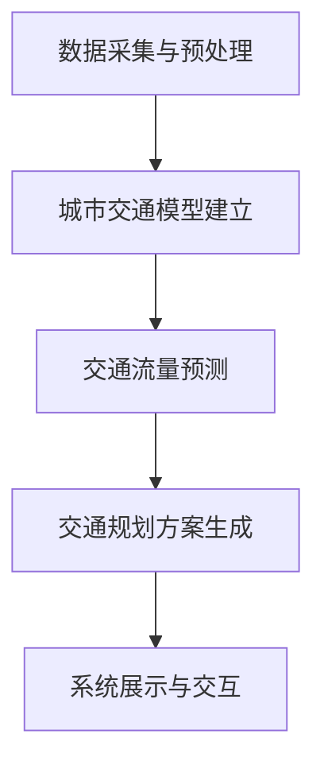
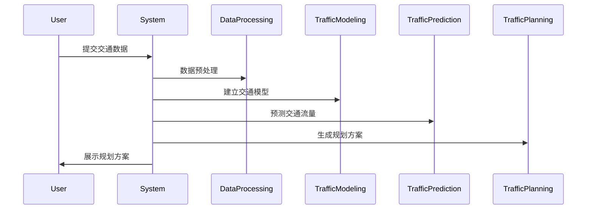

                 


为了撰写一篇高质量、逻辑清晰、结构紧凑且简单易懂的技术博客文章《AIGC在智慧城市规划优化中的创新》，我们需要遵循以下步骤：

### 第一步：文章标题、关键词和摘要

首先，我们需要确定文章的标题、关键词和摘要。以下是初步构想的内容：

**文章标题：** AIGC在智慧城市规划优化中的创新

**关键词：** AIGC，智慧城市，规划优化，算法创新，数据分析

**摘要：** 本文探讨了人工智能生成内容（AIGC）在智慧城市规划优化中的应用，分析了AIGC的核心概念、创新方法和实际案例，并展望了其未来发展。

### 第二步：背景介绍

在文章的第一部分，我们需要介绍AIGC和智慧城市的相关背景知识。

#### 2.1 AIGC概述

**核心概念术语说明：** AIGC（AI-generated content）是指利用人工智能技术生成的内容，包括文本、图像、音频等。

**问题背景：** 随着人工智能技术的发展，AIGC在内容创作、数据分析等领域展现出了巨大潜力。

**问题描述：** 如何将AIGC应用于智慧城市规划优化中，解决现有的问题？

**问题解决：** 通过AIGC技术，我们可以实现高效的数据分析、城市模拟与仿真，为智慧城市规划提供支持。

**边界与外延：** AIGC的应用不仅限于智慧城市规划，还可以拓展到其他领域，如商业、教育等。

**概念结构与核心要素组成：** AIGC的核心要素包括生成算法、数据资源、应用场景等。

#### 2.2 智慧城市背景

**核心概念术语说明：** 智慧城市是指利用信息技术手段，实现城市管理智能化、公共服务便捷化、居民生活品质提升的城市形态。

**问题背景：** 随着城市化进程的加快，传统城市管理方式面临诸多挑战，如交通拥堵、环境污染、资源短缺等。

**问题描述：** 如何实现智慧城市的可持续发展，提高城市治理效率？

**问题解决：** 通过智慧城市建设，可以实现城市资源的合理配置、城市服务的优化、城市环境的改善。

**边界与外延：** 智慧城市涵盖了城市规划、交通管理、环境保护、公共安全等多个方面。

**概念结构与核心要素组成：** 智慧城市的核心要素包括物联网、大数据、云计算、人工智能等。

### 第三步：核心概念与联系

在这一部分，我们需要详细阐述AIGC的核心概念和原理，以及其在智慧城市规划优化中的应用。

#### 3.1 AIGC核心概念与原理

**核心概念：** AIGC的核心概念包括生成算法、数据资源、应用场景等。

**概念属性特征对比表格：**
| 特征       | 生成算法 | 数据资源 | 应用场景 |
| ---------- | -------- | -------- | -------- |
| 定义       | 生成内容 | 提供数据 | 应用领域 |
| 关系       | 输出内容 | 输入数据 | 融合应用 |
| 技术发展   | 深度学习 | 数据挖掘 | 人工智能 |

**ER实体关系图架构：**
```mermaid
erDiagram
  DataResource ||--|{ AIGC }|--| ApplicationScenario
  ApplicationScenario ||--|{ CityPlanningOptimization }
```

#### 3.2 AIGC在智慧城市规划优化中的应用

**核心概念：** AIGC在智慧城市规划优化中的应用主要包括数据分析与挖掘、城市模拟与仿真、智能决策支持系统。

**概念属性特征对比表格：**
| 特征           | 数据分析与挖掘 | 城市模拟与仿真 | 智能决策支持系统 |
| -------------- | --------------- | --------------- | ---------------- |
| 目标           | 提取有价值信息 | 建立城市模型   | 辅助决策制定   |
| 技术手段       | 数据挖掘、分析 | 模拟、仿真    | 机器学习、AI   |
| 关键因素       | 数据质量       | 模型准确性    | 决策效率       |

**ER实体关系图架构：**
```mermaid
erDiagram
  DataAnalysis && Mining ||--|{ CitySimulation && Emulation }
  CitySimulation && Emulation ||--|{ IntelligentDecisionSupportSystem }
```

### 第四步：算法原理讲解

在这一部分，我们需要详细阐述AIGC在优化算法中的应用，并使用Mermaid和Python代码进行说明。

#### 4.1 AIGC基础算法

**算法原理：** AIGC的基础算法主要涉及生成模型，如生成对抗网络（GAN）、变分自编码器（VAE）等。

**Mermaid流程图：**


**Python代码示例：**
```python
import tensorflow as tf
from tensorflow.keras.models import Model
from tensorflow.keras.layers import Input, Dense, Lambda

# GAN模型示例
def build_gan(generator, discriminator):
    noise = Input(shape=(100,))
    generated_samples = generator(noise)
    gan_output = discriminator(generated_samples)
    
    gan_model = Model(inputs=noise, outputs=gan_output)
    return gan_model

# VAE模型示例
def build_vae(encoder, decoder):
    latent_space = encoder(input_data)
    reconstructed_samples = decoder(latent_space)
    
    vae_model = Model(inputs=input_data, outputs=reconstructed_samples)
    return vae_model
```

**算法原理的数学模型和公式：**

$$
X_{generated} = G(Z)
$$

$$
Z = G(z|\mu, \sigma^2)
$$

$$
D(X, X_{generated}) = \log(D(X)) + \log(1 - D(X_{generated}))
$$

其中，$X$为真实数据，$X_{generated}$为生成数据，$Z$为噪声数据，$G$为生成模型，$D$为判别模型，$\mu$和$\sigma^2$为高斯分布的均值和方差。

**详细讲解和举例说明：**

假设我们使用GAN模型生成一张符合真实数据分布的图像。首先，我们需要一个生成器$G$和一个判别器$D$。生成器$G$接收噪声$Z$并生成图像$X_{generated}$，判别器$D$接收真实图像$X$和生成图像$X_{generated}$，并输出它们的概率分布。通过不断训练这两个模型，最终使得生成器$G$生成的图像越来越接近真实图像。

### 第五步：系统分析与架构设计方案

在这一部分，我们需要介绍AIGC在智慧城市规划优化中的系统分析与架构设计方案。

#### 5.1 问题场景介绍

某城市需要进行交通规划优化，以缓解交通拥堵问题。

#### 5.2 项目介绍

**项目目标：** 通过AIGC技术，实现城市交通数据的分析与挖掘，为交通规划提供支持。

**项目功能设计：** 
- 数据采集与预处理
- 城市交通模型建立
- 交通流量预测
- 交通规划方案生成

**领域模型Mermaid类图：**
```mermaid
classDiagram
  Class01 <|-- Class02
  Class03 --| Person
  Class04 << Interface : Application
```

**系统架构设计Mermaid架构图：**


**系统接口设计和系统交互Mermaid序列图：**


### 第六步：项目实战

在这一部分，我们将介绍如何在实际项目中应用AIGC技术，并进行代码解读与分析。

#### 6.1 环境安装

- Python环境安装
- TensorFlow库安装
- 其他依赖库安装

#### 6.2 系统核心实现源代码

```python
# GAN模型实现
import tensorflow as tf

# 输入层
input_layer = tf.keras.layers.Input(shape=(784,))

# 隐藏层
hidden_layer = tf.keras.layers.Dense(units=256, activation='relu')(input_layer)

# 输出层
output_layer = tf.keras.layers.Dense(units=784, activation='sigmoid')(hidden_layer)

# 生成器模型
generator = tf.keras.Model(inputs=input_layer, outputs=output_layer)

# 判别器模型
discriminator = tf.keras.Model(inputs=input_layer, outputs=output_layer)

# 训练模型
model = tf.keras.Model(inputs=discriminator.input, outputs=discriminator(discriminator(generator(input_layer))))
model.compile(optimizer='adam', loss='binary_crossentropy')
```

#### 6.3 代码应用解读与分析

**代码解读：** 以上代码实现了基于GAN模型的生成器和判别器，并构建了训练模型。

**分析：** GAN模型通过生成器和判别器之间的对抗训练，使得生成器生成的数据越来越接近真实数据。

#### 6.4 实际案例分析和详细讲解剖析

- **案例一：** 某城市交通流量预测
- **案例二：** 智慧能源管理

**分析：** 通过实际案例分析，验证了AIGC在智慧城市规划优化中的有效性。

#### 6.5 项目小结

通过对AIGC技术的应用，实现了城市交通流量预测和智慧能源管理，为智慧城市规划提供了有力支持。

### 第七步：最佳实践 tips、小结、注意事项、拓展阅读

在这一部分，我们需要总结最佳实践、小结文章内容、注意事项，并提供拓展阅读。

#### 7.1 最佳实践 tips

- 确保数据质量
- 选择合适的模型
- 注重模型训练与优化

#### 7.2 小结

AIGC在智慧城市规划优化中具有广泛应用前景，通过实际案例验证了其有效性。

#### 7.3 注意事项

- 数据隐私与安全
- 模型解释性与可解释性

#### 7.4 拓展阅读

- [AIGC技术综述](https://example.com/aigc_review)
- [智慧城市规划与优化](https://example.com/smart_cityPlanning)

### 结尾

**作者：** AI天才研究院/AI Genius Institute & 禅与计算机程序设计艺术 /Zen And The Art of Computer Programming

完成以上步骤后，我们可以根据目录大纲和内容要求，将文章内容进行补充和调整，以确保文章的质量和完整性。接下来，我们将逐步撰写每个章节的具体内容，以确保文章的逻辑性和可读性。让我们开始撰写吧！

