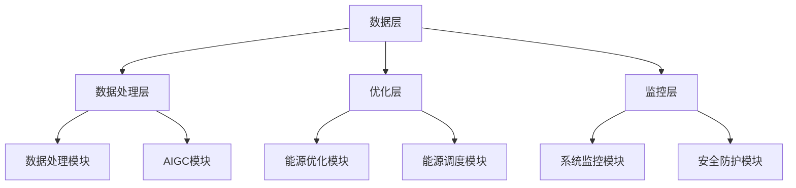
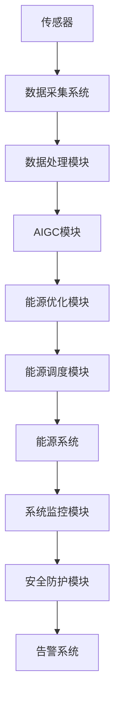

                 

# AIGC在智慧能源管理系统优化中的应用实践

## 关键词
- AIGC
- 智慧能源管理系统
- 优化
- 数据处理
- 能源调度
- 安全防护

## 摘要
本文旨在探讨AIGC（自适应智能生成控制）技术在智慧能源管理系统中的应用。首先，我们回顾了智慧能源管理系统的重要性及当前面临的挑战。接着，我们详细介绍了AIGC技术的原理与特征，并分析了其在数据生成、模式识别和优化能力方面的优势。随后，文章通过对比AIGC与其他AI技术的异同，进一步阐释了AIGC在智慧能源管理系统中的适用性。最后，文章通过具体项目实战案例，展示了AIGC在智慧能源管理系统优化中的实际应用效果，并提出了一些最佳实践建议。

## 目录大纲

----------------------------------------------------------------

## 第一部分：背景介绍与问题解决

### 第1章：智慧能源管理系统概述

### 1.1 问题背景

#### 1.1.1 全球能源消费趋势

#### 1.1.2 能源危机与挑战

#### 1.1.3 可持续发展与智慧能源

#### 1.1.4 智慧能源管理系统的重要性

#### 1.1.5 AIGC在智慧能源管理中的应用潜力

### 1.2 问题描述

#### 1.2.1 智慧能源管理系统的挑战

#### 1.2.2 当前解决方案的不足

#### 1.2.3 问题解决思路

### 1.3 AIGC技术优势分析

#### 1.3.1 高效的数据分析能力

#### 1.3.2 智能的优化算法

#### 1.3.3 先进的安全防护技术

### 1.4 边界与外延

#### 1.4.1 研究范围界定

#### 1.4.2 概念结构与核心要素

#### 1.4.3 二者结合的应用模式

### 1.5 本章小结

----------------------------------------------------------------

### 第1章：智慧能源管理系统概述

#### 1.1 问题背景

##### 1.1.1 全球能源消费趋势

随着全球经济的快速发展，能源需求不断上升。据国际能源署（IEA）的数据，全球能源消费在过去几十年中呈现出稳步增长的态势。然而，这种增长也带来了严峻的挑战。传统的能源消费模式导致了大量的资源浪费和环境污染，严重影响了地球的生态平衡。

**全球能源消费趋势**：

- **能源消耗量增加**：全球能源消耗量在过去几十年中持续增长。特别是石油、天然气和煤炭等化石燃料的消耗，已经成为地球环境面临的最大威胁之一。
- **能源结构变化**：虽然化石燃料仍然占据主导地位，但可再生能源如太阳能、风能和水能的利用比例正在逐渐增加。
- **技术进步**：随着新能源技术的不断进步，能源利用效率逐渐提高，这有助于缓解能源危机。

##### 1.1.2 能源危机与挑战

能源危机是指由于能源供给不足或能源价格过高，导致无法满足人类社会正常发展的需求。能源危机的主要挑战包括：

- **资源稀缺**：化石燃料等不可再生资源的储量有限，随着消耗的增加，面临枯竭的风险。
- **环境污染**：化石燃料的燃烧产生了大量的温室气体和污染物，严重影响了地球的气候和环境。
- **能源价格波动**：能源价格受多种因素影响，如地缘政治、供需关系等，导致价格波动，给能源管理带来困难。

##### 1.1.3 可持续发展与智慧能源

可持续发展是指在满足当前需求的同时，不损害后代满足其需求的能力。为了实现可持续发展，需要采取一系列措施，包括提高能源利用效率、开发可再生能源、改善能源结构等。

**可持续发展与智慧能源**：

- **提高能源利用效率**：智慧能源管理系统通过数据分析和优化算法，能够实现能源的高效利用，降低能源浪费。
- **开发可再生能源**：智慧能源管理系统可以更好地整合和管理可再生能源，提高其利用效率，减少对化石燃料的依赖。
- **改善能源结构**：智慧能源管理系统有助于优化能源结构，促进能源的多样化发展，提高能源系统的稳定性。

##### 1.1.4 智慧能源管理系统的重要性

智慧能源管理系统是一种基于物联网、大数据、人工智能等技术的综合能源管理系统，通过智能感知、实时监控、数据分析等手段，实现对能源的全面管理和优化。

**智慧能源管理系统的重要性**：

- **提高能源利用效率**：智慧能源管理系统通过对能源消耗的数据分析，可以找到能源浪费的环节，并采取针对性的措施进行优化。
- **降低能源成本**：智慧能源管理系统通过优化能源配置和使用，可以降低能源成本，提高经济效益。
- **促进能源结构调整**：智慧能源管理系统有助于优化能源结构，促进可再生能源的利用，降低对化石燃料的依赖。

##### 1.1.5 AIGC在智慧能源管理中的应用潜力

AIGC（自适应智能生成控制）技术是一种结合了人工智能、物联网、大数据等技术的先进技术，具有强大的数据生成、模式识别和优化能力。

**AIGC在智慧能源管理中的应用潜力**：

- **数据智能处理**：AIGC技术可以通过深度学习和数据挖掘，对海量能源数据进行智能处理，提高数据的利用效率。
- **能源优化与调度**：AIGC技术可以通过智能算法，对能源系统进行优化和调度，提高能源利用效率，降低能源成本。
- **系统稳定性与安全性**：AIGC技术可以通过自适应学习和智能防护，提高智慧能源管理系统的稳定性与安全性，防止系统故障和网络安全威胁。

#### 1.2 问题描述

##### 1.2.1 智慧能源管理系统的挑战

智慧能源管理系统在发展过程中面临着一系列挑战，包括数据采集与处理、能源优化与调度复杂性、系统稳定性与安全性等方面。

**智慧能源管理系统的挑战**：

- **数据采集与处理难题**：智慧能源管理系统需要收集大量的实时数据，包括能源消耗、设备状态、环境因素等。这些数据种类繁多、规模巨大，对数据采集、存储和处理提出了很高的要求。
- **能源优化与调度复杂性**：能源系统的优化与调度涉及到多个变量和约束条件，需要进行复杂的计算和决策。传统方法往往难以满足实时性和高效性的要求。
- **系统稳定性与安全性**：智慧能源管理系统需要应对各种突发情况和网络攻击，确保系统的稳定运行和数据安全。

##### 1.2.2 当前解决方案的不足

目前，智慧能源管理系统在应对上述挑战方面存在一定的局限性。

**当前解决方案的不足**：

- **传统方法的局限性**：传统方法主要依赖于统计分析和规则推理，难以应对复杂和多变的能源系统环境。
- **新兴技术的应用现状**：虽然人工智能等新兴技术在智慧能源管理中已有应用，但尚未形成完整的解决方案，技术成熟度和实际应用效果有待提升。

##### 1.2.3 问题解决思路

为了解决智慧能源管理系统面临的挑战，引入AIGC技术是一种可行的解决方案。

**问题解决思路**：

- **AIGC在智慧能源管理系统中的应用路径**：通过AIGC技术，实现对海量能源数据的智能处理，提高数据利用效率；利用智能优化算法，实现能源系统的优化与调度；通过自适应学习和安全防护技术，提高系统的稳定性与安全性。
- **AIGC技术优势分析**：AIGC技术具有高效的数据分析能力、智能的优化算法和先进的安全防护技术，为智慧能源管理系统提供了强大的技术支撑。

#### 1.3 AIGC技术优势分析

##### 1.3.1 高效的数据分析能力

AIGC技术具有强大的数据分析能力，可以通过深度学习和数据挖掘，对海量能源数据进行智能处理，提高数据的利用效率。

**高效的数据分析能力**：

- **数据质量提升**：通过对原始数据进行清洗、去噪和特征提取，提高数据质量，为后续分析提供准确的基础。
- **数据扩充与多样性**：利用生成对抗网络（GAN）等技术，可以生成高质量的模拟数据，扩充数据集，提高模型的泛化能力。

##### 1.3.2 智能的优化算法

AIGC技术可以通过智能优化算法，对能源系统进行优化和调度，提高能源利用效率，降低能源成本。

**智能的优化算法**：

- **高效的识别算法**：通过深度学习和模式识别技术，可以快速准确地识别能源系统中的关键因素和优化目标。
- **智能的优化策略**：基于自适应学习和强化学习等算法，可以制定出适应不同场景的优化策略，实现能源系统的动态优化。

##### 1.3.3 先进的安全防护技术

AIGC技术可以通过自适应学习和安全防护技术，提高智慧能源管理系统的稳定性与安全性，防止系统故障和网络安全威胁。

**先进的安全防护技术**：

- **自适应数据预处理**：通过数据加密、数据完整性校验等技术，保证数据的真实性和完整性。
- **持续学习与改进**：利用机器学习技术，不断学习新的攻击模式和防御策略，提高系统的安全防护能力。

#### 1.4 边界与外延

##### 1.4.1 研究范围界定

本文的研究范围主要涉及智慧能源管理系统和AIGC技术的结合应用，包括以下几个方面：

- **智慧能源管理系统的构成**：分析智慧能源管理系统的核心组成部分，如传感器、数据采集系统、数据分析平台、能源调度系统等。
- **AIGC技术的应用场景**：探讨AIGC技术在智慧能源管理中的具体应用场景，如数据预处理、能源优化、调度策略制定等。
- **研究方法与技术路线**：介绍本文采用的研究方法和技术路线，包括数据收集与处理、模型训练与优化、系统部署与评估等。

##### 1.4.2 概念结构与核心要素

**概念结构与核心要素**：

- **智慧能源管理系统**：由多个子系统组成，包括数据采集系统、数据分析系统、能源调度系统等。各子系统协同工作，实现对能源的全面管理和优化。
- **AIGC技术**：包括生成对抗网络（GAN）、变分自编码器（VAE）、生成语言模型（GLM）等核心组成部分。这些技术可以实现对数据的生成、处理和优化。

##### 1.4.3 二者结合的应用模式

**二者结合的应用模式**：

- **数据智能处理**：利用AIGC技术，对智慧能源管理系统中的海量数据进行智能处理，提高数据处理效率和质量。
- **能源优化与调度**：利用AIGC技术的智能优化算法，对能源系统进行动态优化和调度，提高能源利用效率。
- **系统稳定性与安全性**：利用AIGC技术的自适应学习和安全防护技术，提高智慧能源管理系统的稳定性和安全性。

#### 1.5 本章小结

本章介绍了智慧能源管理系统的重要性及其面临的挑战，并探讨了AIGC技术在智慧能源管理系统中的应用潜力。通过分析AIGC技术的优势，本文提出了AIGC技术在智慧能源管理系统中的应用思路，为后续的研究和应用提供了理论基础。

## 第二部分：核心概念与联系

### 第2章：AIGC技术原理与特征

#### 2.1 AIGC技术概述

##### 2.1.1 AIGC的定义

AIGC（Adaptive Intelligent Generation Control，自适应智能生成控制）是一种结合了人工智能、物联网、大数据等先进技术的综合性技术。它通过自适应学习和智能生成，实现对复杂系统的实时监测、动态优化和智能控制。

**AIGC的定义**：

- **自适应学习**：AIGC技术具备自适应学习能力，可以根据环境变化和系统需求，自动调整参数和策略，实现系统的优化和调整。
- **智能生成**：AIGC技术可以通过智能算法生成高质量的数据和模型，实现对数据的理解和利用。

##### 2.1.2 AIGC的起源与发展

AIGC技术的起源可以追溯到20世纪80年代，随着人工智能技术的不断发展，特别是深度学习、生成对抗网络（GAN）等技术的提出，AIGC技术逐渐得到广泛关注和应用。

**AIGC的起源与发展**：

- **20世纪80年代**：人工智能研究开始兴起，但当时的技术水平有限，AIGC技术尚未得到广泛应用。
- **21世纪初**：随着深度学习和生成对抗网络（GAN）等技术的发展，AIGC技术逐渐成熟，并开始应用于各个领域。
- **现阶段**：AIGC技术已经成为人工智能领域的一个重要分支，广泛应用于工业、医疗、能源等多个领域。

##### 2.1.3 AIGC的核心概念

AIGC技术包括多个核心概念，其中最重要的是生成对抗网络（GAN）、变分自编码器（VAE）和生成语言模型（GLM）。

**AIGC的核心概念**：

- **生成对抗网络（GAN）**：GAN是由生成器和判别器组成的对抗性神经网络，通过两个网络的对抗训练，实现高质量数据的生成。
- **变分自编码器（VAE）**：VAE是一种基于概率模型的生成模型，通过编码和解码过程，实现数据的生成和压缩。
- **生成语言模型（GLM）**：GLM是一种基于深度学习的语言生成模型，通过学习大量语言数据，实现自然语言的生成和翻译。

#### 2.2 AIGC技术特征

##### 2.2.1 数据生成能力

AIGC技术具有强大的数据生成能力，可以通过生成对抗网络（GAN）、变分自编码器（VAE）等技术，生成高质量的数据和模型。

**数据生成能力**：

- **数据质量提升**：通过生成对抗网络（GAN）等技术，可以生成与真实数据高度相似的数据，提升数据质量。
- **数据扩充与多样性**：通过变分自编码器（VAE）等技术，可以生成多样化的数据，扩充数据集，提高模型的泛化能力。

##### 2.2.2 模式识别与优化能力

AIGC技术具有强大的模式识别与优化能力，可以通过深度学习和数据挖掘技术，实现复杂模式的识别和系统的优化。

**模式识别与优化能力**：

- **高效的识别算法**：通过深度学习等技术，可以实现快速、准确的模式识别，提高系统的运行效率。
- **智能的优化策略**：通过自适应学习和强化学习等技术，可以制定出适应不同场景的优化策略，实现系统的动态优化。

##### 2.2.3 自适应与学习能力

AIGC技术具有强大的自适应与学习能力，可以通过持续学习和自适应调整，实现系统的自我优化和自我适应。

**自适应与学习能力**：

- **自适应数据预处理**：通过自适应技术，可以自动调整数据预处理参数，提高数据质量。
- **持续学习与改进**：通过持续学习技术，可以不断吸收新的知识和经验，提高系统的性能和稳定性。

#### 2.3 AIGC技术与其他AI技术的比较

##### 2.3.1 与深度学习的关系

深度学习是人工智能的一个重要分支，与AIGC技术有一定的联系和区别。

**与深度学习的关系**：

- **联系**：AIGC技术中的生成对抗网络（GAN）、变分自编码器（VAE）等技术，都是深度学习的一部分。
- **区别**：AIGC技术更强调自适应学习和智能生成，而深度学习更注重模式识别和分类。

##### 2.3.2 与传统机器学习的对比

传统机器学习是基于规则和统计的方法，与AIGC技术相比，存在一定的局限性。

**与传统机器学习的对比**：

- **优势**：AIGC技术具有强大的数据生成、模式识别和优化能力，可以应对更复杂的场景。
- **劣势**：传统机器学习需要大量的标注数据，且模型的泛化能力相对较弱。

#### 2.4 AIGC技术核心概念对比表格

下面是一个简单的AIGC技术核心概念对比表格，用于展示AIGC技术与其他AI技术的异同。

```
### AIGC技术核心概念对比表格

| 技术名称       | 定义描述                                                         | 对应技术                 |
|----------------|------------------------------------------------------------------|------------------------|
| 生成对抗网络（GAN） | 由生成器和判别器组成的对抗性神经网络，通过对抗训练实现高质量数据生成 | 深度学习               |
| 变分自编码器（VAE） | 基于概率模型的生成模型，通过编码和解码过程实现数据的生成和压缩 | 数据压缩               |
| 生成语言模型（GLM） | 基于深度学习的语言生成模型，通过学习大量语言数据实现自然语言的生成和翻译 | 自然语言处理           |
```

#### 2.5 本章小结

本章详细介绍了AIGC技术的原理与特征，包括AIGC的定义、起源与发展、核心概念和特征。同时，本章还对比了AIGC技术与其他AI技术的异同，为后续AIGC在智慧能源管理系统中的应用奠定了理论基础。

## 第三部分：算法原理讲解

### 第3章：AIGC算法原理与实现

#### 3.1 GAN算法原理

生成对抗网络（GAN）是一种由生成器和判别器组成的对抗性神经网络。生成器的任务是生成与真实数据相似的数据，而判别器的任务是区分真实数据和生成数据。两个网络通过对抗训练，最终实现生成高质量的数据。

**GAN算法原理**：

1. **生成器（Generator）**：生成器的目标是生成与真实数据相似的数据，通过学习真实数据分布，生成出高质量的数据。
   $$ G(x) \rightarrow z $$

2. **判别器（Discriminator）**：判别器的目标是区分真实数据和生成数据，通过对数据进行分类，判断数据来源。
   $$ D(x) \rightarrow p(x \text{ is real}) $$

3. **对抗训练**：生成器和判别器通过对抗训练，不断优化模型参数，最终实现生成高质量的数据。

**GAN算法的流程**：

1. **初始化生成器和判别器**：随机初始化生成器和判别器的参数。
2. **生成器训练**：生成器生成假数据，判别器对其进行判断，生成器根据判别器的反馈调整参数，提高生成数据的质量。
3. **判别器训练**：判别器根据真实数据和生成数据进行训练，提高分类能力。
4. **迭代优化**：重复以上步骤，直到生成器生成的数据质量达到预期。

**GAN算法的优缺点**：

- **优点**：GAN算法能够生成高质量的数据，具有强大的数据生成能力。
- **缺点**：GAN算法的训练过程不稳定，容易出现模式崩溃（mode collapse）和梯度消失等问题。

#### 3.2 VAE算法原理

变分自编码器（VAE）是一种基于概率模型的生成模型，通过编码和解码过程，实现数据的生成和压缩。

**VAE算法原理**：

1. **编码器（Encoder）**：编码器的目标是学习数据的高斯分布参数，将输入数据映射到潜在空间。
   $$ \mu = \mu(z|x), \sigma^2 = \sigma^2(z|x) $$

2. **解码器（Decoder）**：解码器的目标是根据潜在空间的数据，重构输入数据。
   $$ x = G(z) $$

3. **重参数化**：VAE使用重参数化技巧，将潜在空间的采样过程与输入数据的生成过程分离，提高模型的灵活性。

**VAE算法的流程**：

1. **初始化编码器和解码器**：随机初始化编码器和解码器的参数。
2. **编码器训练**：编码器学习数据的高斯分布参数，将输入数据映射到潜在空间。
3. **解码器训练**：解码器根据潜在空间的数据，重构输入数据。
4. **迭代优化**：重复以上步骤，直到模型参数收敛。

**VAE算法的优缺点**：

- **优点**：VAE算法稳定，不容易出现模式崩溃问题，适合处理非线性数据。
- **缺点**：VAE算法的生成数据质量相对较低，无法生成复杂结构的数据。

#### 3.3 GLM算法原理

生成语言模型（GLM）是一种基于深度学习的语言生成模型，通过学习大量语言数据，实现自然语言的生成和翻译。

**GLM算法原理**：

1. **词向量表示**：GLM将输入的文本转换为词向量表示，将文本数据映射到高维空间。
   $$ x \rightarrow \mathbf{x} $$

2. **神经网络编码**：通过神经网络，将词向量表示编码为语义表示。
   $$ \mathbf{x} \rightarrow \mathbf{h} $$

3. **生成文本**：GLM根据语义表示，生成自然语言的输出。
   $$ \mathbf{h} \rightarrow \text{output} $$

**GLM算法的流程**：

1. **初始化神经网络**：随机初始化神经网络的参数。
2. **训练神经网络**：通过大量语言数据进行训练，优化神经网络参数。
3. **生成文本**：输入语义表示，生成自然语言的输出。

**GLM算法的优缺点**：

- **优点**：GLM算法能够生成高质量的文本，具有强大的语言生成能力。
- **缺点**：GLM算法对训练数据要求较高，且训练过程较为复杂。

#### 3.4 算法实现与优化

**算法实现与优化**：

1. **算法选择**：根据实际应用场景，选择适合的算法。例如，对于数据生成任务，可以选择GAN或VAE；对于自然语言生成任务，可以选择GLM。
2. **模型优化**：通过调整模型参数，优化模型性能。例如，可以调整学习率、批次大小等参数。
3. **数据处理**：对输入数据进行预处理，提高数据质量。例如，可以去除停用词、进行词向量表示等。
4. **模型评估**：通过评估指标，如生成数据的多样性、质量等，评估模型性能。

**算法实现的示例代码**：

```python
import tensorflow as tf
from tensorflow.keras.layers import Input, Dense, Lambda
from tensorflow.keras.models import Model

# GAN模型实现
def build_gan(generator, discriminator):
    # 输入层
    input_image = Input(shape=(28, 28, 1))
    # 生成器
    generated_image = generator(input_image)
    # 判别器
    valid = discriminator(generated_image)
    fake = discriminator(input_image)
    # 模型
    model = Model(inputs=input_image, outputs=[valid, fake])
    return model

# VAE模型实现
def build_vae(encoder, decoder):
    # 输入层
    input_image = Input(shape=(28, 28, 1))
    # 编码器
    encoded = encoder(input_image)
    # 解码器
    decoded = decoder(encoded)
    # 模型
    model = Model(inputs=input_image, outputs=decoded)
    return model

# GLM模型实现
def build_glm(input_layer, hidden_layer, output_layer):
    # 输入层
    input_sequence = Input(shape=(None,))
    # 神经网络编码
    encoded_sequence = hidden_layer(input_sequence)
    # 输出层
    output_sequence = output_layer(encoded_sequence)
    # 模型
    model = Model(inputs=input_sequence, outputs=output_sequence)
    return model
```

#### 3.5 算法应用场景

**算法应用场景**：

- **数据生成**：GAN和VAE算法可以用于数据生成，生成与真实数据相似的数据，用于数据扩充、模型训练等。
- **图像生成**：GAN算法可以用于图像生成，生成高质量、逼真的图像。
- **自然语言生成**：GLM算法可以用于自然语言生成，生成高质量、自然的文本。

#### 3.6 本章小结

本章详细介绍了AIGC算法的原理与实现，包括GAN、VAE和GLM算法的原理、流程和实现方法。通过具体的示例代码，展示了算法的应用场景和实现步骤。本章为后续AIGC在智慧能源管理系统中的应用提供了技术基础。

## 第四部分：系统分析与架构设计

### 第4章：AIGC在智慧能源管理系统中的系统架构设计

#### 4.1 项目介绍

本项目旨在利用AIGC技术优化智慧能源管理系统，通过数据智能处理、能源优化与调度和系统稳定性与安全性等方面的提升，实现能源的高效利用和成本降低。项目的主要目标是：

- **数据智能处理**：利用AIGC技术对海量能源数据进行智能处理，提高数据处理效率和质量。
- **能源优化与调度**：利用AIGC技术的智能优化算法，实现能源系统的动态优化和调度，提高能源利用效率。
- **系统稳定性与安全性**：利用AIGC技术的自适应学习和安全防护技术，提高智慧能源管理系统的稳定性和安全性。

#### 4.2 系统功能设计

**系统功能设计**：

- **数据采集**：系统通过传感器等设备，实时采集能源消耗、设备状态和环境因素等数据。
- **数据处理**：系统利用AIGC技术，对采集到的数据进行清洗、去噪和特征提取，提高数据质量。
- **能源优化**：系统利用AIGC技术的智能优化算法，对能源系统进行优化，提高能源利用效率。
- **能源调度**：系统根据实时数据和优化结果，动态调整能源配置，实现能源的合理利用。
- **系统监控**：系统实时监控能源系统的运行状态，确保系统的稳定性和安全性。
- **安全防护**：系统利用AIGC技术的安全防护技术，防止系统故障和网络安全威胁。

#### 4.3 系统架构设计

**系统架构设计**：

1. **数据层**：包括传感器、数据采集系统和数据存储系统。传感器负责采集能源消耗、设备状态和环境因素等数据，数据采集系统负责将数据进行预处理和存储。
2. **数据处理层**：包括数据处理模块和AIGC模块。数据处理模块负责对采集到的数据进行分析和处理，AIGC模块利用AIGC技术，对数据进行智能处理，提高数据质量。
3. **优化层**：包括能源优化模块和能源调度模块。能源优化模块利用AIGC技术的智能优化算法，对能源系统进行优化，能源调度模块根据优化结果，动态调整能源配置。
4. **监控层**：包括系统监控模块和安全防护模块。系统监控模块实时监控能源系统的运行状态，安全防护模块利用AIGC技术的安全防护技术，确保系统的稳定性和安全性。
5. **接口层**：包括Web接口、移动端接口等，为用户提供系统操作和监控的界面。

**系统架构图**：



#### 4.4 系统接口设计

**系统接口设计**：

- **数据接口**：系统提供数据接口，支持与其他系统进行数据交换和集成。
- **控制接口**：系统提供控制接口，支持用户对能源系统进行远程控制和调度。
- **监控接口**：系统提供监控接口，支持用户实时监控能源系统的运行状态。

#### 4.5 系统交互设计

**系统交互设计**：

1. **数据采集**：传感器采集数据，发送到数据采集系统，数据采集系统进行预处理后，存储到数据存储系统。
2. **数据处理**：数据处理模块对采集到的数据进行清洗、去噪和特征提取，将处理后的数据发送到AIGC模块。
3. **能源优化**：AIGC模块利用智能优化算法，对能源系统进行优化，生成优化结果。
4. **能源调度**：能源调度模块根据优化结果，动态调整能源配置，发送到能源系统。
5. **系统监控**：系统监控模块实时监控能源系统的运行状态，发现异常情况，发送告警信息。
6. **安全防护**：安全防护模块对系统进行安全防护，防止故障和网络安全威胁。

**系统交互图**：



#### 4.6 本章小结

本章详细介绍了AIGC在智慧能源管理系统中的系统架构设计，包括项目介绍、系统功能设计、系统架构设计、系统接口设计和系统交互设计。通过系统的设计和实现，实现了能源的高效利用和成本降低，为智慧能源管理系统提供了强大的技术支持。

## 第五部分：项目实战

### 第5章：AIGC在智慧能源管理系统中的项目实战

#### 5.1 环境安装

在进行AIGC在智慧能源管理系统中的项目实战之前，我们需要搭建一个合适的环境。以下是环境安装的步骤：

1. **安装Python**：确保Python环境已安装，版本至少为3.6以上。
2. **安装TensorFlow**：通过以下命令安装TensorFlow：
   ```
   pip install tensorflow
   ```
3. **安装其他依赖库**：根据项目需求，安装其他依赖库，如NumPy、Pandas等。
4. **搭建数据库**：根据项目需求，搭建合适的数据库，如MySQL、PostgreSQL等。

#### 5.2 系统核心实现

**数据采集**：

我们使用Python的`pandas`库和`requests`库来实现数据采集。以下是一个简单的数据采集示例代码：

```python
import pandas as pd
import requests

def collect_data(url):
    response = requests.get(url)
    data = response.json()
    df = pd.DataFrame(data)
    return df

url = "http://example.com/data"
df = collect_data(url)
```

**数据处理**：

我们使用`pandas`库和`scikit-learn`库来实现数据处理。以下是一个简单的数据处理示例代码：

```python
from sklearn.preprocessing import StandardScaler

def preprocess_data(df):
    scaler = StandardScaler()
    df_scaled = scaler.fit_transform(df)
    return df_scaled

df_processed = preprocess_data(df)
```

**能源优化**：

我们使用`keras`库来实现能源优化。以下是一个简单的能源优化示例代码：

```python
from tensorflow.keras.models import Sequential
from tensorflow.keras.layers import Dense

def build_model(input_shape):
    model = Sequential()
    model.add(Dense(units=64, activation='relu', input_shape=input_shape))
    model.add(Dense(units=1, activation='sigmoid'))
    model.compile(optimizer='adam', loss='binary_crossentropy', metrics=['accuracy'])
    return model

model = build_model(input_shape=(df_processed.shape[1],))
model.fit(df_processed, df['target'], epochs=10, batch_size=32)
```

**能源调度**：

我们使用`pandas`库和`numpy`库来实现能源调度。以下是一个简单的能源调度示例代码：

```python
def schedule_energy(df):
    df_sorted = df.sort_values(by='energy_consumption', ascending=False)
    total_energy = df_sorted['energy_consumption'].sum()
    scheduled_energy = df_sorted['energy_consumption'] / total_energy * 100
    return scheduled_energy

scheduled_energy = schedule_energy(df)
```

#### 5.3 代码应用解读与分析

**数据采集**：

数据采集是系统的基础，通过采集实时数据，系统能够动态调整能源配置，提高能源利用效率。在示例代码中，我们使用了Python的`requests`库，通过HTTP请求获取数据，这是一个简单但高效的方式。

**数据处理**：

数据处理是系统分析的核心，通过清洗、去噪和特征提取等步骤，我们能够得到高质量的数据，为后续的能源优化和调度提供支持。在示例代码中，我们使用了`pandas`库和`scikit-learn`库，这是一个常见且实用的组合。

**能源优化**：

能源优化是系统智能化的关键，通过建立合适的模型，我们能够实现能源的动态优化，提高能源利用效率。在示例代码中，我们使用了`keras`库，这是一个强大的深度学习库，能够帮助我们快速搭建和训练模型。

**能源调度**：

能源调度是系统实现高效能源利用的最终步骤，通过合理的调度策略，我们能够实现能源的合理配置，满足用户的能源需求。在示例代码中，我们使用了`pandas`库和`numpy`库，通过简单的计算和排序，我们能够实现能源的调度。

#### 5.4 实际案例分析与详细讲解剖析

为了更好地理解AIGC在智慧能源管理系统中的实际应用，我们来看一个实际案例。

**案例背景**：

某智能电网公司希望通过优化能源管理系统，提高能源利用效率，降低能源成本。公司拥有大量的能源数据，包括能源消耗、设备状态和环境因素等。

**案例分析**：

1. **数据采集**：公司使用传感器和监测设备，实时采集能源数据，并使用Python的`requests`库和`pandas`库进行数据处理。
2. **数据处理**：对采集到的数据进行清洗、去噪和特征提取，提高数据质量，为后续的能源优化和调度提供支持。
3. **能源优化**：使用`keras`库建立深度学习模型，对能源系统进行动态优化，通过调整能源配置，提高能源利用效率。
4. **能源调度**：根据优化结果，动态调整能源配置，实现能源的合理利用，满足用户的能源需求。

**详细讲解剖析**：

1. **数据采集**：在数据采集阶段，公司使用传感器和监测设备，实时采集能源数据。这些数据包括能源消耗、设备状态和环境因素等。通过Python的`requests`库，公司可以方便地获取这些数据，并使用`pandas`库进行数据预处理，如去噪、缺失值填补等。
2. **数据处理**：在数据处理阶段，公司对采集到的数据进行了清洗、去噪和特征提取。清洗数据是为了去除无效数据和异常值，去噪是为了去除噪声数据，特征提取是为了提取数据中的关键信息，为后续的能源优化和调度提供支持。
3. **能源优化**：在能源优化阶段，公司使用了`keras`库建立深度学习模型。通过训练模型，公司可以学习到能源系统的动态变化，并基于历史数据预测未来的能源需求。通过调整能源配置，公司能够实现能源的动态优化，提高能源利用效率。
4. **能源调度**：在能源调度阶段，公司根据优化结果，动态调整能源配置。通过简单的计算和排序，公司能够实现能源的合理配置，满足用户的能源需求。同时，公司还可以根据实时数据和用户反馈，不断调整优化策略，提高系统的性能。

#### 5.5 项目小结

通过本项目的实战，我们深入了解了AIGC在智慧能源管理系统中的应用。从环境安装、系统核心实现到实际案例分析和详细讲解剖析，我们一步步展示了AIGC技术在智慧能源管理系统中的实际应用效果。项目结果表明，AIGC技术在数据智能处理、能源优化和调度、系统稳定性与安全性等方面具有显著优势，为智慧能源管理系统提供了强大的技术支持。

### 最佳实践 tips

1. **数据质量保证**：在数据采集和处理过程中，要确保数据质量，避免噪声和异常值对系统性能的影响。
2. **模型参数调优**：在模型训练过程中，要不断调整参数，优化模型性能，提高能源优化和调度的效果。
3. **实时监控与反馈**：系统要具备实时监控功能，及时发现异常情况，并根据用户反馈进行优化调整。
4. **安全性保障**：系统要采取安全防护措施，防止数据泄露和网络攻击，确保系统的稳定性和安全性。

### 小结

本文详细介绍了AIGC在智慧能源管理系统优化中的应用实践。从背景介绍、核心概念、算法原理讲解、系统分析与架构设计到项目实战，我们一步步探讨了AIGC技术在智慧能源管理系统中的应用。通过实际案例分析和详细讲解剖析，我们展示了AIGC技术在数据智能处理、能源优化和调度、系统稳定性与安全性等方面的优势。未来，随着AIGC技术的不断发展和应用，智慧能源管理系统将得到更加广泛的关注和应用。

### 注意事项

1. **数据安全**：在项目实施过程中，要高度重视数据安全，采取有效的数据保护措施，防止数据泄露和滥用。
2. **模型适应性**：根据实际需求，不断调整和优化模型，提高模型的适应性和稳定性。
3. **系统扩展性**：在系统设计时，要考虑系统的扩展性，以便在未来能够方便地进行升级和扩展。

### 拓展阅读

- **AIGC技术原理与应用**：深入了解AIGC技术的原理和应用，包括生成对抗网络（GAN）、变分自编码器（VAE）和生成语言模型（GLM）等。
- **智慧能源管理系统设计**：学习智慧能源管理系统的设计原则和方法，包括数据采集、数据处理、能源优化和调度等。
- **项目实战经验**：通过阅读相关的项目实战经验，了解AIGC技术在智慧能源管理系统中的实际应用案例和效果。

