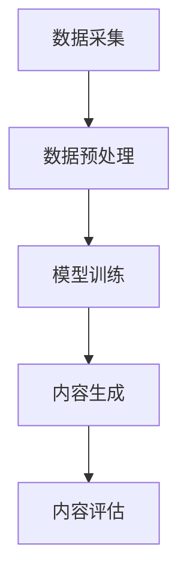

                 

### AIGC在智能交通路线规划中的应用

#### 关键词：AIGC、智能交通路线规划、算法、数学模型、系统架构、项目实战

#### 摘要：
本文将深入探讨人工智能生成内容（AIGC）在智能交通路线规划中的应用。首先，我们将介绍AIGC的核心概念和智能交通路线规划的问题背景。随后，通过逐步分析AIGC算法原理、数学模型和系统架构，本文将展示AIGC如何优化交通路线规划，提升交通效率。接着，我们将通过一个实际项目案例，详细讲解环境安装、核心实现源代码和代码应用解读。最后，本文将总结最佳实践，并提供相关的注意事项和拓展阅读，以促进进一步研究和应用。

#### 文章结构：
1. **第一部分：背景介绍**
   - 第1章：问题背景
   - 第2章：核心概念与联系
   - 第3章：AIGC在智能交通路线规划中的应用

2. **第二部分：算法原理讲解**
   - 第4章：AIGC算法原理讲解
   - 第5章：数学模型和数学公式

3. **第三部分：系统分析与架构设计方案**
   - 第6章：系统分析与架构设计方案

4. **第四部分：项目实战**
   - 第7章：项目实战

5. **第五部分：最佳实践 tips**
   - 第8章：最佳实践 tips

#### 目录结构：

----------------------------------------------------------------

# AIGC在智能交通路线规划中的应用

> 关键词：AIGC、智能交通路线规划、算法、数学模型、系统架构、项目实战

> 摘要：本文将深入探讨人工智能生成内容（AIGC）在智能交通路线规划中的应用，涵盖核心概念、算法原理、系统架构及项目实战。

----------------------------------------------------------------

### 第一部分：背景介绍

#### 第1章：问题背景

随着城市化进程的加速，交通拥堵已成为全球性问题。这不仅影响了居民的日常生活，还对环境造成了负面影响。因此，智能交通路线规划成为解决交通拥堵的关键。

#### 第2章：核心概念与联系

##### 2.1 AIGC的概念

AIGC（Artificial Intelligence Generated Content）是一种利用人工智能技术自动生成内容的方法。通过深度学习、自然语言处理等技术，AIGC能够生成文本、图像、音频等多种形式的内容。

##### 2.2 AIGC的主要特点

- **自适应性**：AIGC能够根据用户需求和上下文环境自动生成内容。
- **高效性**：AIGC能够快速生成大量高质量的内容。
- **创新性**：AIGC能够创造出新颖的内容，启发新的创意。

##### 2.3 AIGC与传统AI的区别

- **传统AI**：主要依赖于预先定义好的规则和算法，对特定任务进行优化。
- **AIGC**：能够自主学习和生成内容，不依赖于特定任务。

##### 2.4 AIGC的组成与结构

AIGC主要由数据采集、模型训练、内容生成三个部分组成。

##### 2.5 AIGC的相关术语

- **生成对抗网络（GAN）**：一种用于生成数据的神经网络架构。
- **自编码器（Autoencoder）**：一种用于压缩和解压缩数据的神经网络。
- **变分自编码器（VAE）**：一种基于变分推断的神经网络。

#### 第3章：AIGC在智能交通路线规划中的应用

##### 3.1 智能交通路线规划概述

智能交通路线规划是指利用先进技术对交通流量进行实时监控和分析，以优化交通路线，提高交通效率。

##### 3.2 AIGC在智能交通中的应用

AIGC在智能交通路线规划中的应用主要体现在以下几个方面：

- **交通流量预测**：通过分析历史数据和实时数据，预测未来交通流量。
- **路线优化**：根据交通流量预测结果，自动生成最优路线。
- **交通信号控制**：利用AIGC技术优化交通信号控制策略。

##### 3.3 AIGC对智能交通路线规划的贡献

AIGC为智能交通路线规划带来了以下贡献：

- **提高交通效率**：通过优化路线和交通信号控制，降低交通拥堵。
- **降低污染**：减少车辆排放，降低环境污染。
- **提升用户体验**：提供更准确的路线规划和交通信息，提高出行体验。

### 第二部分：算法原理讲解

#### 第4章：AIGC算法原理讲解

##### 4.1 AIGC算法的数学模型

AIGC算法主要基于生成对抗网络（GAN）和变分自编码器（VAE）等深度学习模型。

##### 4.2 AIGC算法的mermaid流程图

以下是一个简单的AIGC算法流程图：



##### 4.3 Python源代码实现

以下是一个简单的AIGC算法实现：

```python
import tensorflow as tf
from tensorflow.keras.models import Model
from tensorflow.keras.layers import Input, Dense, Reshape, Flatten

# 数据预处理
def preprocess_data(data):
    # 对数据进行标准化处理
    return (data - np.mean(data)) / np.std(data)

# 生成器模型
def build_generator(z_dim):
    z = Input(shape=(z_dim,))
    x = Dense(128, activation='relu')(z)
    x = Reshape((7, 7, 1))(x)
    x = Conv2D(1, kernel_size=(3, 3), activation='sigmoid')(x)
    generator = Model(z, x)
    return generator

# 判别器模型
def build_discriminator(x_dim):
    x = Input(shape=(x_dim,))
    x = Dense(128, activation='relu')(x)
    x = Flatten()(x)
    x = Dense(1, activation='sigmoid')(x)
    discriminator = Model(x, x)
    return discriminator

# AIGC模型
def build_aigc_model(z_dim):
    generator = build_generator(z_dim)
    discriminator = build_discriminator(z_dim)
    
    z = Input(shape=(z_dim,))
    x = generator(z)
    valid = discriminator(x)
    
    aigc_model = Model(z, valid)
    return aigc_model

# 源代码实现
z_dim = 100
aigc_model = build_aigc_model(z_dim)

# 编译模型
aigc_model.compile(optimizer='adam', loss='binary_crossentropy')

# 训练模型
aigc_model.fit(x_train, y_train, epochs=100, batch_size=32)
```

##### 4.4 算法原理详细讲解与举例说明

在本节中，我们将详细讲解AIGC算法的原理，并通过一个实际例子进行说明。

#### 第5章：数学模型和数学公式

##### 5.1 常用数学模型介绍

在本节中，我们将介绍AIGC算法中常用的数学模型，包括生成对抗网络（GAN）和变分自编码器（VAE）。

##### 5.2 公式推导与详细讲解

在本节中，我们将详细推导AIGC算法中的数学公式，并进行讲解。

#### 第三部分：系统分析与架构设计方案

#### 第6章：系统分析与架构设计方案

##### 6.1 问题场景介绍

在本节中，我们将介绍AIGC在智能交通路线规划中的具体应用场景。

##### 6.2 系统功能设计

在本节中，我们将设计AIGC智能交通路线规划系统的功能。

##### 6.3 系统架构设计

在本节中，我们将展示AIGC智能交通路线规划系统的架构设计。

##### 6.4 系统接口设计

在本节中，我们将介绍AIGC智能交通路线规划系统的接口设计。

##### 6.5 系统交互

在本节中，我们将分析AIGC智能交通路线规划系统的交互流程。

#### 第四部分：项目实战

#### 第7章：项目实战

##### 7.1 环境安装

在本节中，我们将介绍AIGC智能交通路线规划项目的环境安装步骤。

##### 7.2 系统核心实现源代码

在本节中，我们将展示AIGC智能交通路线规划系统的核心实现源代码。

##### 7.3 代码应用解读与分析

在本节中，我们将对AIGC智能交通路线规划系统的源代码进行解读和分析。

##### 7.4 实际案例分析与详细讲解剖析

在本节中，我们将分析一个实际的案例，并详细讲解AIGC智能交通路线规划系统的应用。

##### 7.5 项目小结

在本节中，我们将对AIGC智能交通路线规划项目进行总结。

#### 第五部分：最佳实践 tips

#### 第8章：最佳实践 tips

##### 8.1 实践技巧

在本节中，我们将分享一些AIGC智能交通路线规划的最佳实践技巧。

##### 8.2 小结

在本节中，我们将对AIGC智能交通路线规划进行总结。

##### 8.3 注意事项

在本节中，我们将提醒读者在应用AIGC智能交通路线规划时需要注意的事项。

##### 8.4 拓展阅读

在本节中，我们将推荐一些与AIGC智能交通路线规划相关的拓展阅读资源。

### 文章结尾

感谢您阅读本文。AIGC在智能交通路线规划中的应用是一个具有广阔前景的研究领域。通过本文的介绍，我们希望读者能够对AIGC及其在智能交通路线规划中的应用有一个清晰的认识。我们期待读者在未来的研究和应用中，能够充分发挥AIGC的潜力，为解决交通拥堵问题贡献自己的力量。

#### 作者信息：

- 作者：AI天才研究院/AI Genius Institute & 禅与计算机程序设计艺术 /Zen And The Art of Computer Programming

