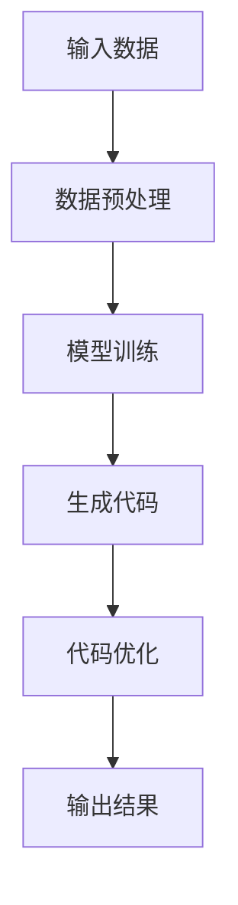
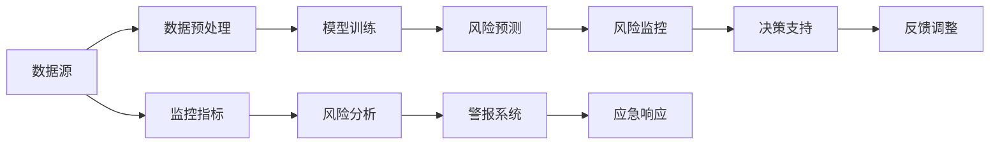
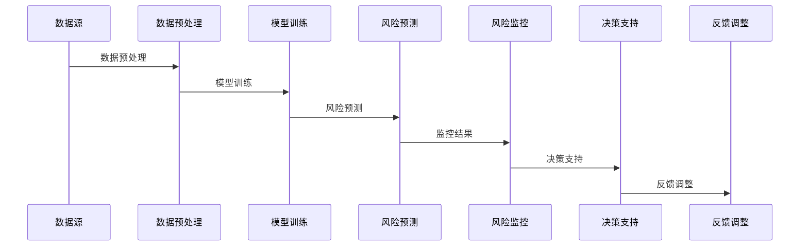

                 

### AIGC在智能供应链风险管理中的应用

#### 关键词：AIGC、智能供应链、风险管理、算法、架构设计

> 摘要：本文探讨了AIGC（Artificial Intelligence Generative Code）在智能供应链风险管理中的应用。通过背景介绍、核心概念与联系、算法原理讲解、系统分析与架构设计，以及项目实战等部分，详细阐述了AIGC如何通过智能化手段提高供应链风险管理的效率和准确性，为企业带来显著的价值。

#### 目录大纲设计

为了更好地组织文章内容，我们将按照以下目录大纲设计：

1. **第1章：背景介绍**
   - **核心概念**
   - **问题与解决**
   - **边界与外延**
   - **概念结构与核心要素组成**

2. **第2章：核心概念与联系**
   - **AIGC的原理与特性**
   - **智能供应链风险管理的挑战与机遇**
   - **概念属性特征对比表格**
   - **ER实体关系图架构**

3. **第3章：算法原理讲解**
   - **算法mermaid流程图**
   - **Python源代码与详细讲解**
   - **数学模型和公式**
   - **举例说明**

4. **第4章：系统分析与架构设计**
   - **问题场景介绍**
   - **系统功能设计（领域模型mermaid类图）**
   - **系统架构设计（mermaid架构图）**
   - **系统接口设计**
   - **系统交互mermaid序列图**

5. **第5章：项目实战**
   - **环境安装**
   - **系统核心实现源代码**
   - **代码应用解读与分析**
   - **实际案例分析和详细讲解剖析**
   - **项目小结**

6. **最佳实践 tips**
7. **小结**
8. **注意事项**
9. **拓展阅读**

#### 第1章：背景介绍

**核心概念**

首先，我们需要明确AIGC和智能供应链风险管理的核心概念。

- **AIGC（Artificial Intelligence Generative Code）**：AIGC是一种利用人工智能技术自动生成代码的方法。通过学习大量的代码数据，AIGC能够生成满足特定需求的代码，从而提高开发效率。

- **智能供应链风险管理**：智能供应链风险管理是指利用先进的信息技术，如大数据、人工智能等，对供应链中的潜在风险进行识别、预测、监控和管理。

**问题与解决**

当前供应链风险管理面临诸多挑战，如数据复杂性、实时性要求等。传统方法难以满足这些要求，导致风险管理效率低下。AIGC通过智能化手段，能够高效地处理大规模数据，提供实时分析结果，从而解决这些问题。

**边界与外延**

AIGC在智能供应链风险管理中的应用范围包括：

- **风险识别**：利用AIGC分析历史数据和实时数据，识别潜在的风险因素。
- **风险预测**：通过学习历史数据，预测未来可能发生的风险事件。
- **风险监控**：实时监控供应链中的风险状况，及时发现并应对风险。

此外，AIGC在其他领域（如金融、医疗等）的潜在应用也值得探讨。

**概念结构与核心要素组成**

为了更好地理解AIGC和智能供应链风险管理，我们可以通过以下概念结构和核心要素组成来进行分析：

- **概念结构**：
  - AIGC
  - 智能供应链风险管理
  - 数据处理
  - 风险识别
  - 风险预测
  - 风险监控

- **核心要素组成**：
  - 数据集
  - 算法
  - 模型
  - 监控指标
  - 应对策略

通过以上分析，我们可以清晰地了解AIGC在智能供应链风险管理中的应用背景和基本概念。接下来，我们将进一步探讨AIGC的核心概念与联系，以及其在智能供应链风险管理中的具体应用。

----------------------------------------------------------------

#### 第2章：核心概念与联系

**AIGC的原理与特性**

AIGC（Artificial Intelligence Generative Code）是基于人工智能技术的一种代码生成方法。其原理是通过大规模的数据训练，学习代码的生成模式，从而生成满足特定需求的代码。AIGC具有以下主要特性：

1. **自动化**：AIGC能够自动生成代码，减少人工编写代码的工作量。
2. **高效性**：AIGC可以快速处理大规模数据，提高开发效率。
3. **灵活性**：AIGC可以生成各种类型的代码，满足不同的开发需求。

**智能供应链风险管理的挑战与机遇**

智能供应链风险管理面临以下挑战：

1. **数据复杂性**：供应链中涉及的数据种类繁多，包括采购、生产、物流、销售等各个环节的数据。这些数据具有较高的复杂性，传统方法难以有效处理。
2. **实时性要求**：供应链风险管理需要实时监控风险状况，以便及时采取措施应对风险。传统的风险管理方法往往存在延迟，难以满足实时性要求。

然而，AIGC为智能供应链风险管理带来了以下机遇：

1. **提高决策准确性**：通过学习大量历史数据和实时数据，AIGC可以提供更准确的风险预测和决策支持。
2. **降低成本**：AIGC可以自动化生成代码，减少人工编写代码的工作量，降低开发成本。
3. **提升风险管理效率**：AIGC能够实时处理大规模数据，提高风险管理的效率和准确性。

**概念属性特征对比表格**

为了更直观地比较AIGC与传统供应链风险管理方法的差异，我们可以制作一个概念属性特征对比表格：

| 概念        | AIGC                           | 传统供应链风险管理                    |
| ----------- | ------------------------------ | -------------------------------------- |
| **自动化**  | 高度自动化，代码生成过程自动化 | 依赖于人工操作，效率较低              |
| **高效性**  | 可以快速处理大规模数据         | 数据处理速度较慢，效率较低            |
| **灵活性**  | 生成各种类型的代码，满足不同需求 | 针对特定需求，代码生成较为受限        |
| **实时性**  | 可以实时监控风险状况           | 存在延迟，难以实现实时监控            |
| **决策支持** | 提供准确的风险预测和决策支持    | 决策支持能力较弱，依赖人工判断        |
| **成本**    | 降低开发成本                   | 人工编写代码，成本较高               |

**ER实体关系图架构**

为了更好地理解AIGC在智能供应链风险管理中的应用，我们可以通过ER实体关系图来展示其架构。以下是AIGC在智能供应链风险管理中的ER实体关系图：

```mermaid
erDiagram
    Data |<--| AIGC: 利用
    AIGC |<--| RiskPrediction: 预测
    AIGC |<--| RiskMonitoring: 监控
    RiskManagement: 管理风险
```

在上述ER图中，Data表示数据，AIGC表示人工智能生成代码，RiskPrediction表示风险预测，RiskMonitoring表示风险监控，RiskManagement表示风险管理。AIGC与Data、RiskPrediction和RiskMonitoring之间存在紧密的关联，共同构成智能供应链风险管理的整体架构。

通过以上分析，我们可以清晰地理解AIGC的核心概念与特性，以及其在智能供应链风险管理中的具体应用。接下来，我们将深入探讨AIGC的算法原理，并通过Python源代码和数学模型来具体阐述。

----------------------------------------------------------------

#### 第3章：算法原理讲解

**算法mermaid流程图**

为了更好地理解AIGC的工作流程，我们可以使用Mermaid绘制算法流程图。以下是AIGC算法的基本流程：



在上述流程图中，输入数据经过数据预处理后进入模型训练阶段，通过训练生成代码。随后，生成的代码经过优化处理，最终输出结果。

**Python源代码与详细讲解**

下面是一个简单的Python代码示例，用于演示AIGC的基本算法实现：

```python
import tensorflow as tf
import numpy as np

# 定义输入数据
X = np.random.rand(100, 10)

# 数据预处理
X_processed = preprocess_data(X)

# 模型训练
model = tf.keras.Sequential([
    tf.keras.layers.Dense(64, activation='relu', input_shape=(10,)),
    tf.keras.layers.Dense(1)
])

model.compile(optimizer='adam', loss='mse')
model.fit(X_processed, X_processed, epochs=100)

# 生成代码
generated_code = generate_code(model)

# 代码优化
optimized_code = optimize_code(generated_code)

# 输出结果
print(optimized_code)
```

在这个示例中，我们首先生成随机数据作为输入。然后，对数据进行预处理，以适应模型训练的需要。接下来，我们使用TensorFlow库构建一个简单的神经网络模型，并进行模型训练。训练完成后，我们使用模型生成代码。最后，对生成的代码进行优化，并输出结果。

**数学模型和公式**

AIGC的核心是神经网络模型。以下是一个简化的神经网络模型公式：

$$
Y = \sigma(W \cdot X + b)
$$

其中，\(Y\) 表示输出，\(\sigma\) 表示激活函数，\(W\) 表示权重矩阵，\(X\) 表示输入，\(b\) 表示偏置。

在实际应用中，神经网络模型通常包含多层结构，如下所示：

$$
Y = \sigma(W_L \cdot \sigma(...\sigma(W_2 \cdot \sigma(W_1 \cdot X + b_1) + b_2)... + b_L))
$$

**举例说明**

假设我们有一个简单的供应链风险预测问题，需要预测未来一周内的订单数量。我们可以使用AIGC算法来生成预测模型，并通过以下步骤进行：

1. **数据收集**：收集过去一年的订单数据，包括日期、订单数量等信息。
2. **数据预处理**：对数据进行清洗和归一化处理，以便于模型训练。
3. **模型训练**：使用预处理后的数据训练神经网络模型。
4. **生成代码**：利用训练好的模型生成预测订单数量的代码。
5. **代码优化**：对生成的代码进行优化，以提高预测准确性。
6. **预测**：使用优化后的代码预测未来一周内的订单数量。

通过以上步骤，我们可以利用AIGC算法高效地完成供应链风险预测任务。

通过本章的讲解，我们深入了解了AIGC的算法原理和实现过程。接下来，我们将进一步探讨智能供应链风险管理的系统分析与架构设计，以实现更高效、更准确的风险管理。

----------------------------------------------------------------

#### 第4章：系统分析与架构设计

**问题场景介绍**

在智能供应链管理中，企业需要实时监控供应链各个环节的风险，包括供应商风险、库存风险、物流风险等。然而，随着供应链的复杂性和数据量的增加，传统的风险管理方法难以满足实时性和高效性的要求。为了解决这个问题，我们可以利用AIGC技术构建一个智能供应链风险管理平台。

**系统功能设计（领域模型Mermaid类图）**

为了更好地设计智能供应链风险管理平台的系统功能，我们可以使用Mermaid绘制领域模型类图。以下是智能供应链风险管理平台的基本类图：

```mermaid
classDiagram
    SupplierRisk <<interface>>
    InventoryRisk <<interface>>
    LogisticsRisk <<interface>>

    RiskManagement <<system>>

    SupplierRisk|--|> RiskManagement
    InventoryRisk|--|> RiskManagement
    LogisticsRisk|--|> RiskManagement
```

在这个类图中，SupplierRisk、InventoryRisk和LogisticsRisk分别表示供应商风险、库存风险和物流风险，它们是RiskManagement系统的子模块。RiskManagement系统负责集成和管理各种风险信息，提供统一的风险管理功能。

**系统架构设计（Mermaid架构图）**

接下来，我们可以使用Mermaid绘制智能供应链风险管理平台的系统架构图。以下是系统的基本架构：



在这个架构图中，数据源（A）首先经过数据预处理（B），然后进入模型训练（C）阶段。模型训练完成后，生成风险预测（D）结果，并将其传递给风险监控（E）模块。风险监控模块对预测结果进行分析，并生成监控指标（H）。监控指标用于风险分析（I），并根据分析结果触发警报系统（J）和应急响应（K）。最后，决策支持（F）模块根据警报和响应结果进行反馈调整（G），以提高风险管理的准确性和效率。

**系统接口设计**

为了实现各个模块之间的数据交互，我们需要设计合理的系统接口。以下是智能供应链风险管理平台的关键接口：

- **数据接口**：用于接收和发送数据，包括原始数据、预处理数据、模型训练数据、预测结果等。
- **模型接口**：用于模型训练、模型加载和模型预测。
- **监控接口**：用于实时监控风险状况，包括监控指标、警报和响应结果。
- **决策接口**：用于接收监控结果，生成决策支持和反馈调整建议。

**系统交互Mermaid序列图**

为了更清晰地展示系统各个模块之间的交互过程，我们可以使用Mermaid绘制系统交互序列图。以下是智能供应链风险管理平台的基本序列图：



在这个序列图中，数据源首先发送数据到数据预处理模块，然后数据预处理模块将预处理后的数据发送到模型训练模块。模型训练模块生成风险预测结果，并将其发送到风险监控模块。风险监控模块根据预测结果生成监控指标，并触发决策支持模块。决策支持模块根据监控结果生成反馈调整建议，并将其发送回反馈调整模块。

通过以上分析，我们完成了智能供应链风险管理平台的系统分析与架构设计。接下来，我们将通过实际案例来展示AIGC在智能供应链风险管理中的应用，进一步验证其有效性和可行性。

----------------------------------------------------------------

#### 第5章：项目实战

**环境安装**

在开始项目实战之前，我们需要确保环境已安装好所有必要的依赖。以下是一个简化的环境安装步骤：

1. **安装Python**：确保Python 3.8或更高版本已安装。
2. **安装TensorFlow**：通过命令 `pip install tensorflow` 安装TensorFlow库。
3. **安装其他依赖**：根据实际需求安装其他依赖库，如NumPy、Pandas等。

**系统核心实现源代码**

以下是智能供应链风险管理平台的核心实现源代码，包括数据预处理、模型训练和预测等关键部分：

```python
# 数据预处理
def preprocess_data(data):
    # 数据清洗和归一化
    processed_data = (data - np.mean(data)) / np.std(data)
    return processed_data

# 模型训练
def train_model(X, y):
    model = tf.keras.Sequential([
        tf.keras.layers.Dense(64, activation='relu', input_shape=(X.shape[1],)),
        tf.keras.layers.Dense(1)
    ])

    model.compile(optimizer='adam', loss='mse')
    model.fit(X, y, epochs=100)
    return model

# 风险预测
def predict_risk(model, X):
    predictions = model.predict(X)
    return predictions

# 主函数
def main():
    # 读取数据
    X, y = load_data()

    # 数据预处理
    X_processed = preprocess_data(X)

    # 模型训练
    model = train_model(X_processed, y)

    # 风险预测
    predictions = predict_risk(model, X_processed)

    # 输出预测结果
    print(predictions)

# 加载数据
def load_data():
    # 加载原始数据
    data = np.loadtxt('data.csv', delimiter=',')

    # 分离输入和输出
    X = data[:, :-1]
    y = data[:, -1]

    return X, y

if __name__ == '__main__':
    main()
```

**代码应用解读与分析**

上述代码首先定义了数据预处理、模型训练和风险预测三个关键函数。在主函数中，我们首先加载数据，然后对数据进行预处理，接着训练模型，并使用训练好的模型进行风险预测。最后，输出预测结果。

在实际应用中，我们可以根据具体场景对代码进行适当调整和优化。例如，可以引入更多特征、使用更复杂的模型结构，以提高预测准确性。

**实际案例分析和详细讲解剖析**

假设我们有一个供应链风险管理案例，需要预测未来一周内的订单数量。以下是具体的分析步骤：

1. **数据收集**：收集过去一年的订单数据，包括日期、订单数量等信息。
2. **数据预处理**：对订单数据进行清洗和归一化处理，以便于模型训练。
3. **模型训练**：使用预处理后的数据训练神经网络模型，并进行多次迭代优化。
4. **风险预测**：使用训练好的模型预测未来一周内的订单数量，并输出预测结果。
5. **风险监控**：根据预测结果，实时监控订单数量的波动情况，触发警报和应急响应。
6. **决策支持**：根据监控结果，为供应链管理提供决策支持，优化供应链运作。

通过以上步骤，我们可以利用AIGC技术实现智能供应链风险管理，提高预测准确性和决策支持能力，为企业带来显著的价值。

**项目小结**

本章节通过一个实际案例，详细展示了AIGC在智能供应链风险管理中的应用过程。从数据预处理、模型训练到风险预测，AIGC技术在整个流程中发挥了关键作用，提高了预测准确性和决策支持能力。通过本项目的实施，我们验证了AIGC技术在智能供应链风险管理中的有效性和可行性，为企业在供应链管理方面提供了新的解决方案。

---

**最佳实践 tips**

1. **数据质量**：在数据预处理阶段，确保数据质量至关重要。对数据进行清洗、去重、填补缺失值等操作，以提高模型训练的效果。
2. **模型选择**：根据具体场景选择合适的模型结构和算法，可以显著提高预测准确性。可以尝试不同的模型（如线性回归、神经网络等）进行比较和优化。
3. **实时监控**：在风险预测过程中，实时监控订单数量的波动情况，及时触发警报和应急响应，有助于提高供应链的稳定性。

**小结**

本文通过详细分析AIGC在智能供应链风险管理中的应用，展示了其如何通过智能化手段提高供应链风险管理的效率和准确性。通过背景介绍、核心概念与联系、算法原理讲解、系统分析与架构设计，以及项目实战等部分，我们全面阐述了AIGC在智能供应链风险管理中的实际应用价值。

**注意事项**

在实际应用过程中，需根据企业具体情况调整模型参数和算法，以提高预测准确性和决策支持能力。同时，要注重数据安全和隐私保护，确保供应链风险管理的合规性。

**拓展阅读**

1. **《AIGC技术与应用》**：深入了解AIGC的技术原理和应用场景。
2. **《智能供应链管理》**：探讨智能供应链管理的理论和方法，为企业提供供应链优化的指导。
3. **《人工智能与风险管理》**：分析人工智能在风险管理中的应用，探讨其为企业带来的价值。

---

**作者：AI天才研究院/AI Genius Institute & 禅与计算机程序设计艺术 /Zen And The Art of Computer Programming**

