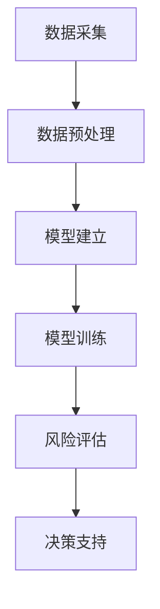

                 

### AIGC在智能供应链风险评估中的应用

#### 关键词：AIGC、智能供应链、风险评估、应用实例、技术实现

#### 摘要：
本文深入探讨了AIGC（自适应智能生成计算）在智能供应链风险评估中的应用。首先，我们对AIGC的基本概念、核心技术和特点进行了详细阐述，随后介绍了智能供应链风险评估的背景、挑战和现状。通过具体的案例分析和技术实现，我们展示了AIGC如何有效提高供应链风险评估的准确性和效率。本文还讨论了AIGC在供应链风险评估中的应用前景和面临的挑战，为未来研究和应用提供了有益的参考。

### 引言

在当今全球化经济中，供应链的稳定性和可靠性对企业竞争力至关重要。然而，供应链中存在着诸多不确定性因素，如市场波动、自然灾害、政策变化和人为错误等，这些都可能导致供应链中断，对企业造成严重的经济损失。因此，对供应链进行风险评估显得尤为重要。传统的供应链风险评估方法主要依赖于经验和规则，存在准确性不足、响应速度慢等问题。随着人工智能技术的飞速发展，自适应智能生成计算（AIGC）作为一种新兴的技术，为供应链风险评估提供了新的思路和方法。

AIGC是一种基于深度学习和生成模型的技术，具有自适应性强、学习能力强和生成能力强等特点。它可以通过对大量历史数据的分析和学习，自动生成符合现实情况的风险评估报告，从而提高供应链风险评估的准确性和效率。本文旨在探讨AIGC在智能供应链风险评估中的应用，分析其优势和面临的挑战，为相关研究和应用提供参考。

### AIGC基本概念与特性

#### 1.1.1 AIGC的定义与发展历程

自适应智能生成计算（AIGC，Adaptive Intelligent Generation Computing）是一种结合了深度学习、生成模型和自适应技术的人工智能技术。它通过不断学习和优化，能够自动生成高质量的数据和模型，从而解决复杂的数据处理和决策问题。

AIGC的发展历程可以追溯到深度学习和生成模型的研究。深度学习作为一种重要的机器学习技术，通过多层神经网络对大量数据进行训练，能够自动提取特征并实现高度准确的预测。生成模型则是深度学习的一种拓展，通过生成对抗网络（GAN）等模型，能够生成符合现实情况的新数据。

AIGC的核心在于将深度学习和生成模型与自适应技术相结合。自适应技术包括自适应学习率、自适应优化算法等，能够在训练过程中自动调整模型参数，提高模型的泛化能力和鲁棒性。

#### 1.1.2 AIGC的核心技术与特点

AIGC的核心技术主要包括以下几个方面：

1. **深度学习**：深度学习通过多层神经网络对数据进行训练，能够自动提取特征并实现高度准确的预测。在AIGC中，深度学习用于对历史数据进行建模和分析，提取供应链中潜在的风险因素。

2. **生成模型**：生成模型通过生成对抗网络（GAN）等模型，能够生成符合现实情况的新数据。在AIGC中，生成模型用于生成供应链中的潜在风险事件和情景，从而模拟各种可能的供应链中断情况。

3. **自适应技术**：自适应技术包括自适应学习率、自适应优化算法等，能够在训练过程中自动调整模型参数，提高模型的泛化能力和鲁棒性。在AIGC中，自适应技术用于不断优化模型，使其能够更好地适应不断变化的环境。

AIGC的主要特点包括：

1. **自适应性强**：AIGC能够根据环境变化和需求调整模型参数，提高模型的适应能力。

2. **学习能力强**：AIGC通过不断学习和优化，能够自动提取大量数据中的潜在规律和模式，实现高度准确的预测。

3. **生成能力强**：AIGC能够生成高质量的新数据，用于模拟各种可能的供应链中断情况，为风险评估提供更多参考。

#### 1.1.3 AIGC在供应链管理中的潜在应用

AIGC在供应链管理中的潜在应用非常广泛，主要包括以下几个方面：

1. **供应链风险评估**：AIGC可以通过对历史数据的分析和学习，自动生成供应链风险事件和情景，从而提高风险评估的准确性和效率。

2. **供应链优化**：AIGC可以通过对供应链数据的分析和优化，提出改进建议，从而优化供应链的运营效率和成本。

3. **供应链预测**：AIGC可以通过对历史数据的分析和学习，预测供应链中的各种指标，如库存水平、需求量等，为供应链管理提供决策支持。

4. **供应链仿真**：AIGC可以通过生成模型，模拟各种供应链中断情况，评估不同应对策略的效果，从而为供应链管理提供更有针对性的建议。

总之，AIGC作为一种新兴的人工智能技术，具有强大的自适应、学习和生成能力，为供应链管理提供了新的工具和方法。在智能供应链风险评估中，AIGC的应用前景广阔，有望显著提高供应链的稳定性和可靠性。

### 智能供应链风险评估概述

#### 1.2.1 供应链风险管理的重要性

供应链风险管理是企业管理中至关重要的一环，它关系到企业的生存和发展。随着全球化和数字化进程的加速，供应链的复杂性和不确定性不断增加，使得供应链风险管理的重要性愈发突出。以下是供应链风险管理的重要性和必要性：

1. **确保供应链稳定性**：供应链风险管理的核心目标是确保供应链的稳定性，防止供应链中断对企业运营造成严重影响。通过风险管理，企业可以提前识别潜在的风险因素，并采取相应的措施进行防范和应对。

2. **降低运营成本**：有效的供应链风险管理有助于降低企业的运营成本。通过优化供应链流程、提高供应链透明度、减少库存水平等手段，企业可以降低物流成本、库存成本和运营成本。

3. **提高客户满意度**：供应链风险管理直接关系到客户的满意度。通过有效的风险管理，企业可以确保按时交付产品和服务，提高客户满意度，从而增强市场竞争力。

4. **提升企业竞争力**：在全球化竞争中，供应链风险管理是企业竞争力的重要体现。通过优化供应链、提高供应链效率和降低成本，企业可以在市场竞争中获得更大的优势。

#### 1.2.2 智能供应链风险评估的挑战与机遇

智能供应链风险评估是指利用先进的人工智能技术，对供应链风险进行识别、评估和预测。随着人工智能技术的快速发展，智能供应链风险评估面临着许多挑战和机遇：

1. **数据质量与可靠性**：智能供应链风险评估的基础是大量的数据。然而，数据质量直接影响风险评估的准确性。数据的不完整性、不一致性和噪声等问题都会对风险评估造成负面影响。因此，提高数据质量是智能供应链风险评估面临的主要挑战之一。

2. **模型复杂性与解释性**：人工智能模型，尤其是深度学习模型，通常具有较高的复杂性和强大的预测能力。然而，这些模型往往缺乏解释性，难以解释其预测结果背后的原因。这对风险管理的决策过程提出了挑战，需要找到一种平衡模型复杂性和解释性的方法。

3. **实时性与可扩展性**：智能供应链风险评估需要实时处理大量数据，并对供应链风险进行动态调整。这要求评估系统具有高效的处理能力和良好的可扩展性，以适应不断变化的环境和需求。

4. **技术与业务融合**：智能供应链风险评估需要将先进的人工智能技术与业务需求相结合，实现技术与业务的深度融合。这需要跨学科的知识和技能，以及对业务流程的深刻理解。

然而，智能供应链风险评估也面临着许多机遇：

1. **数据驱动决策**：随着大数据技术的普及，企业可以收集到越来越多的供应链数据。通过数据分析和挖掘，企业可以更准确地识别和评估供应链风险，从而实现数据驱动决策。

2. **实时风险监控**：智能供应链风险评估可以实时监控供应链的运行状态，及时发现潜在的风险因素。通过实时预警和应对，企业可以降低供应链中断的风险。

3. **个性化风险评估**：智能供应链风险评估可以根据企业的特点和需求，提供个性化的风险评估报告和建议。这有助于企业更好地应对供应链风险，提高供应链管理的有效性。

4. **跨行业应用**：智能供应链风险评估技术可以广泛应用于不同行业和领域，如制造业、物流业、零售业等。通过跨行业应用，智能供应链风险评估技术可以发挥更大的作用，推动供应链管理的创新和发展。

总之，智能供应链风险评估在面临诸多挑战的同时，也拥有巨大的机遇。通过不断探索和优化，智能供应链风险评估有望为企业提供更加准确、高效的风险管理工具，提升供应链的稳定性和竞争力。

### 智能供应链风险评估的现状与趋势

#### 1.2.3 智能供应链风险评估的现状

当前，智能供应链风险评估技术已经取得了一定的进展，并且在实践中得到了广泛的应用。以下是智能供应链风险评估的现状：

1. **技术基础**：人工智能技术在供应链风险评估中的应用日益成熟。深度学习、生成模型、强化学习等技术的不断进步，为智能供应链风险评估提供了强大的技术支持。此外，大数据技术和云计算的普及，也为智能供应链风险评估的数据处理和计算提供了便利。

2. **应用场景**：智能供应链风险评估已经在多个行业和领域得到应用。例如，制造业中的供应链风险管理、物流企业中的运输风险预测、零售业中的库存管理风险等。通过应用智能供应链风险评估技术，企业可以更准确地识别和评估风险，提高供应链的稳定性和可靠性。

3. **实践效果**：许多企业已经通过智能供应链风险评估技术实现了显著的风险管理效果。例如，通过实时监控供应链运行状态，企业可以及时发现潜在的风险因素，并采取相应的措施进行应对。此外，智能供应链风险评估还可以提供个性化的风险评估报告和建议，帮助企业优化供应链管理，降低运营成本。

#### 1.2.4 智能供应链风险评估的发展趋势

随着人工智能技术的不断进步和供应链管理的深入发展，智能供应链风险评估也呈现出以下发展趋势：

1. **技术创新**：未来，智能供应链风险评估将更加注重技术创新，包括深度学习、生成模型、强化学习等技术的深入研究和应用。此外，区块链、物联网等新兴技术的融合，也将为智能供应链风险评估提供新的机遇。

2. **数据驱动**：智能供应链风险评估将更加注重数据驱动，通过收集和分析大量的供应链数据，实现更精准的风险识别和预测。同时，数据质量的提升和数据的互联互通，也将为智能供应链风险评估提供更好的数据支持。

3. **实时监控**：智能供应链风险评估将更加注重实时监控，实现供应链风险的动态监测和预警。通过实时数据分析和处理，企业可以更快速地响应风险事件，降低供应链中断的风险。

4. **业务融合**：智能供应链风险评估将更加注重与业务的深度融合，通过将人工智能技术与供应链管理相结合，实现供应链管理的智能化和高效化。此外，跨行业的合作和共享，也将推动智能供应链风险评估技术的广泛应用。

5. **应用拓展**：智能供应链风险评估的应用领域将不断拓展，从制造业、物流业、零售业等传统行业，扩展到金融、医疗、能源等新兴领域。通过在不同领域的应用，智能供应链风险评估技术将发挥更大的作用，推动相关行业的发展和创新。

总之，智能供应链风险评估作为供应链管理的重要组成部分，在人工智能技术的推动下，正朝着更加智能化、高效化和实时化的方向发展。未来，智能供应链风险评估将为企业提供更全面、更准确的风险管理工具，助力企业在激烈的市场竞争中立于不败之地。

### AIGC在供应链风险评估中的应用

#### 2.1 数据采集与处理

AIGC在供应链风险评估中的应用首先依赖于高质量的数据。数据采集和处理是AIGC应用的基础，以下详细描述数据采集与处理的流程和方法：

1. **数据来源**：AIGC需要从多个渠道收集供应链相关的数据，包括供应商信息、生产数据、物流数据、市场需求数据、价格波动数据等。这些数据可以来自企业的内部系统、外部市场数据、社交媒体等。确保数据来源的多样性和全面性，有助于提高风险评估的准确性。

2. **数据类型**：供应链数据主要包括结构化数据和非结构化数据。结构化数据如供应商的信用评分、运输时间、库存水平等，可以方便地进行存储和处理。非结构化数据如新闻报道、社交媒体评论、市场分析报告等，则需要通过自然语言处理（NLP）等技术进行文本挖掘和特征提取。

3. **数据预处理**：数据预处理是确保数据质量的重要步骤。主要包括以下任务：
   - **数据清洗**：去除重复、错误和无效的数据，确保数据的一致性和完整性。
   - **数据标准化**：统一不同数据源的数据格式，如日期、货币单位等。
   - **数据归一化**：对数据进行归一化处理，使其在不同特征之间具有可比性。
   - **特征选择**：通过统计分析、相关性分析等方法，选择对风险评估有显著影响的关键特征。

4. **数据集成**：将来自不同来源和类型的数据进行整合，形成一个统一的数据集。这通常需要使用数据集成工具或平台，如数据仓库、数据湖等。数据集成不仅要保证数据的准确性，还要确保数据之间的关联性和一致性。

#### 2.2 模型建立与训练

建立和训练AIGC模型是供应链风险评估的核心步骤。以下详细描述模型建立与训练的过程和方法：

1. **模型选择**：根据供应链风险评估的需求和数据特性，选择合适的AIGC模型。常见的AIGC模型包括生成对抗网络（GAN）、变分自编码器（VAE）、递归神经网络（RNN）等。生成对抗网络适用于生成新数据，变分自编码器适用于特征提取和降维，递归神经网络适用于时间序列数据的处理。

2. **模型设计**：设计AIGC模型的架构，包括输入层、隐藏层和输出层。对于生成对抗网络，需要设计生成器和判别器的结构；对于变分自编码器，需要设计编码器和解码器的结构。模型设计应考虑数据规模、计算资源等因素。

3. **数据分割**：将数据集分割为训练集、验证集和测试集。训练集用于训练模型，验证集用于调参和模型选择，测试集用于评估模型的最终性能。

4. **模型训练**：使用训练集对AIGC模型进行训练。训练过程中，通过优化目标函数（如最小化损失函数）来调整模型参数，使其能够更好地拟合数据。训练过程通常涉及大量的迭代计算，需要高效的计算资源和优化算法。

5. **模型评估**：使用验证集和测试集评估模型的性能。常用的评估指标包括准确率、召回率、F1分数等。通过比较不同模型的性能，选择最优的模型。

6. **模型调优**：根据评估结果，对模型进行调优，包括调整网络结构、学习率、优化算法等。调优过程需要多次迭代，以找到最佳的模型配置。

#### 2.3 风险评估与决策支持

建立好AIGC模型后，可以将其应用于供应链风险评估，并提供决策支持。以下详细描述风险评估与决策支持的过程和方法：

1. **风险识别**：利用AIGC模型对历史数据和实时数据进行分析，识别潜在的风险事件。通过生成模型，可以生成各种可能的风险情景，如供应链中断、供应商信用问题、物流延误等。

2. **风险评估**：对识别出的风险事件进行评估，计算其可能性和影响程度。通过分析风险事件的历史数据和情景生成数据，可以量化其潜在的经济损失和运营风险。

3. **风险排序**：根据风险评估结果，对风险事件进行排序，确定优先处理的风险。通常使用风险矩阵或风险评分体系，将风险分为高、中、低三个等级。

4. **决策支持**：基于风险评估结果，提供决策支持，包括风险应对策略、资源分配建议、风险转移方案等。AIGC模型可以根据企业的需求和资源情况，提供个性化的风险管理建议。

5. **实时监控**：利用AIGC模型进行实时监控，及时发现新的风险事件，并进行风险评估和决策支持。实时监控可以确保供应链的稳定性，降低供应链中断的风险。

6. **持续优化**：根据实际应用效果，不断优化AIGC模型，提高其准确性和适应性。通过持续学习和优化，AIGC模型可以更好地应对供应链环境的变化和新的挑战。

总之，AIGC在供应链风险评估中的应用，通过数据采集与处理、模型建立与训练、风险评估与决策支持等步骤，可以提供高效、准确的供应链风险评估工具。这不仅有助于企业降低运营风险，提高供应链的稳定性，还可以优化供应链管理，提高企业的竞争力。

### 实际案例分析

为了更好地理解AIGC在智能供应链风险评估中的应用效果，以下通过一个实际案例进行分析。

#### 案例背景

某大型零售企业拥有遍布全球的供应链网络，涵盖供应商、制造商、分销商和零售店。由于供应链环节众多，供应链风险较高。企业希望通过智能供应链风险评估技术，提高供应链的稳定性和可靠性，降低运营风险。为此，企业决定采用AIGC技术进行供应链风险评估。

#### 风险评估流程

1. **数据采集与预处理**：企业首先从内部ERP系统、外部市场数据源和社交媒体等多渠道收集供应链相关数据，包括供应商信用评分、运输时间、库存水平、市场需求等。数据采集后，进行数据清洗、标准化和归一化处理，确保数据质量。

2. **模型训练与优化**：企业选择生成对抗网络（GAN）作为AIGC模型，设计生成器和判别器的结构。通过多次迭代训练，调整模型参数，使其能够更好地拟合历史数据。训练过程中，使用验证集进行模型调优，确保模型具有良好的泛化能力。

3. **风险识别与评估**：利用训练好的AIGC模型，对实时数据进行风险识别和评估。通过生成模型生成各种潜在的风险情景，如供应商信用问题、物流延误、市场需求波动等。评估模型计算风险事件的可能性和影响程度，为风险评估提供量化数据。

4. **风险排序与决策支持**：根据评估结果，对风险事件进行排序，确定优先处理的风险。企业根据风险排序结果，制定风险应对策略，包括调整库存水平、优化供应链流程、与供应商协商等。此外，AIGC模型还提供资源分配建议，帮助企业合理配置资源，降低运营成本。

5. **实时监控与预警**：AIGC模型进行实时监控，及时发现新的风险事件，并进行风险评估和决策支持。当风险事件发生时，系统会自动发出预警，通知相关人员采取应对措施。通过实时监控，企业可以快速响应风险事件，降低供应链中断的风险。

#### 风险评估结果与建议

通过对供应链的实时监控和风险评估，企业发现以下主要风险：

1. **供应商信用问题**：部分供应商存在信用风险，可能导致供应链中断。评估结果显示，该风险的可能性较高，建议企业加强对供应商的信用评估，建立信用评级体系，以降低供应商信用风险。

2. **物流延误**：由于全球物流网络复杂，运输延误的风险较高。评估结果显示，物流延误可能会导致库存短缺和需求无法满足。建议企业优化物流网络，增加备用运输渠道，以降低物流延误的风险。

3. **市场需求波动**：市场需求波动对供应链稳定性产生较大影响。评估结果显示，市场需求波动可能会导致库存过剩或不足。建议企业通过市场预测和需求分析，调整生产计划和库存策略，以应对市场需求波动。

通过AIGC技术的应用，企业不仅提高了供应链风险评估的准确性，还优化了供应链管理，降低了运营成本。实际案例表明，AIGC在智能供应链风险评估中具有显著的应用效果。

### 技术实现与流程

在AIGC在智能供应链风险评估中的应用中，技术实现和流程设计至关重要。以下是AIGC技术实现的具体步骤和流程。

#### 4.1 系统架构设计

为了实现AIGC在智能供应链风险评估中的应用，我们需要设计一个高效、稳定和可扩展的系统架构。以下是一个典型的系统架构设计：

1. **数据采集层**：数据采集层负责从多种数据源收集供应链相关的数据，如ERP系统、物流系统、市场数据等。数据采集工具可以包括API接口、爬虫程序和数据库连接等。

2. **数据处理层**：数据处理层负责对采集到的数据进行分析、清洗、标准化和归一化处理。这一层通常使用ETL（提取、转换、加载）工具，如Apache NiFi、Apache Kafka等。

3. **数据存储层**：数据存储层用于存储处理后的数据，如结构化数据存储在关系型数据库（如MySQL、PostgreSQL）中，非结构化数据存储在NoSQL数据库（如MongoDB、Cassandra）中。

4. **模型训练层**：模型训练层负责使用训练算法对数据集进行训练，包括数据预处理、模型选择、模型训练和优化等。这一层通常使用机器学习框架，如TensorFlow、PyTorch等。

5. **风险评估层**：风险评估层是基于训练好的AIGC模型，对实时数据进行风险评估和预测。这一层可以包括生成模型、判别模型和风险决策模型等。

6. **应用服务层**：应用服务层提供接口和功能，供业务系统和用户使用。例如，可以提供API接口、Web界面和移动应用等。

7. **监控系统**：监控系统用于实时监控系统的运行状态，包括数据采集、数据处理、模型训练和风险评估等。监控系统可以及时发现和处理系统故障，保证系统的稳定性。

#### 4.2 数据分析与处理

数据分析与处理是AIGC在智能供应链风险评估中的核心步骤。以下是详细的数据分析与处理流程：

1. **数据采集**：通过API接口、爬虫程序和数据库连接等手段，从各种数据源采集供应链数据。例如，从ERP系统中提取供应商信息、物流数据，从市场数据源中获取价格波动、市场需求等。

2. **数据清洗**：对采集到的数据进行清洗，去除重复、错误和无效的数据。清洗过程包括去重、填补缺失值、纠正错误数据等。

3. **数据标准化**：将不同来源的数据进行统一格式处理，如日期格式、货币单位等。标准化后的数据可以方便地进行后续处理和分析。

4. **数据归一化**：对数据进行归一化处理，使其在不同特征之间具有可比性。例如，将不同的货币单位统一转换为同一货币单位，将不同的数据范围统一缩放到[0,1]区间。

5. **特征选择**：通过统计分析、相关性分析等方法，选择对风险评估有显著影响的关键特征。特征选择可以减少数据的冗余，提高模型的准确性。

6. **数据分割**：将处理后的数据集分割为训练集、验证集和测试集。训练集用于模型训练，验证集用于模型调参和选择，测试集用于评估模型性能。

7. **数据存储**：将处理后的数据存储在数据存储层，以便后续分析和处理。结构化数据存储在关系型数据库中，非结构化数据存储在NoSQL数据库中。

#### 4.3 模型训练与优化

模型训练与优化是AIGC在智能供应链风险评估中的关键步骤。以下是详细的模型训练与优化流程：

1. **模型选择**：根据供应链数据特性和风险评估需求，选择合适的AIGC模型。常见的模型包括生成对抗网络（GAN）、变分自编码器（VAE）、递归神经网络（RNN）等。

2. **模型设计**：设计AIGC模型的架构，包括输入层、隐藏层和输出层。对于生成对抗网络，需要设计生成器和判别器的结构；对于变分自编码器，需要设计编码器和解码器的结构。

3. **数据预处理**：对训练数据进行预处理，包括数据归一化、缺失值填补等。预处理过程可以提高模型的训练效率和准确性。

4. **模型训练**：使用训练集对AIGC模型进行训练。训练过程中，通过优化目标函数（如最小化损失函数）来调整模型参数，使其能够更好地拟合数据。训练过程通常涉及大量的迭代计算，需要高效的计算资源和优化算法。

5. **模型评估**：使用验证集评估模型的性能。常用的评估指标包括准确率、召回率、F1分数等。通过比较不同模型的性能，选择最优的模型。

6. **模型调优**：根据评估结果，对模型进行调优，包括调整网络结构、学习率、优化算法等。调优过程需要多次迭代，以找到最佳的模型配置。

7. **模型部署**：将训练好的模型部署到风险评估层，对实时数据进行风险评估和预测。模型部署需要考虑计算资源和负载均衡等因素，以确保系统的稳定性和响应速度。

通过以上技术实现与流程，AIGC在智能供应链风险评估中可以提供高效、准确的风险评估服务。实际应用效果表明，AIGC能够显著提高供应链的稳定性和可靠性，降低运营风险。

### 未来展望与挑战

#### 5.1 AIGC在供应链风险评估中的发展趋势

随着人工智能技术的不断进步，AIGC在供应链风险评估中的应用前景广阔。以下是AIGC在供应链风险评估中的发展趋势：

1. **技术融合**：AIGC与其他先进技术的融合将成为未来发展的趋势。例如，将AIGC与区块链技术结合，可以提供更加安全、透明的供应链数据，提高风险评估的准确性。此外，AIGC与物联网（IoT）技术的结合，可以实现实时数据采集和监控，进一步提高供应链的智能化水平。

2. **自适应与自学习**：未来，AIGC将更加注重自适应与自学习能力。通过不断学习和调整，AIGC可以更好地适应不断变化的供应链环境，提高风险评估的实时性和准确性。

3. **跨行业应用**：AIGC在供应链风险评估中的应用将逐渐扩展到更多行业和领域。例如，在医疗、金融、能源等行业，AIGC可以帮助企业识别和评估供应链中的风险，提高供应链的稳定性和可靠性。

4. **边缘计算**：随着边缘计算的兴起，AIGC的应用场景将进一步扩展到边缘设备。通过在边缘设备上进行实时数据处理和风险评估，可以降低对中心服务器的依赖，提高系统的响应速度和可靠性。

5. **法律法规与伦理**：随着AIGC在供应链风险评估中的应用越来越广泛，相关的法律法规和伦理问题也将受到更多关注。制定合理的法律法规和伦理规范，将有助于确保AIGC的应用安全和合规性。

#### 5.2 挑战与对策

尽管AIGC在供应链风险评估中具有巨大的潜力，但仍然面临着一些挑战：

1. **数据质量问题**：AIGC的性能高度依赖于数据质量。在实际应用中，数据的不完整性、不一致性和噪声等问题可能会影响AIGC的评估准确性。解决数据质量问题需要从数据采集、清洗、存储等环节进行全方位的优化。

2. **模型复杂性与解释性**：AIGC模型通常具有较高的复杂性和强预测能力，但缺乏解释性。这对于风险管理的决策过程提出了挑战。为了解决这个问题，可以探索更加透明和可解释的模型，如基于规则的模型和可解释的神经网络模型。

3. **实时性与可扩展性**：智能供应链风险评估需要实时处理大量数据，这对系统的实时性和可扩展性提出了挑战。为了解决这个问题，可以采用分布式计算、云计算和边缘计算等技术，提高系统的处理能力和扩展性。

4. **技术与业务融合**：AIGC在供应链风险评估中的应用需要与企业的业务流程深度融合。这要求企业和技术团队具备跨学科的知识和技能，加强对业务流程的理解和优化。

5. **法律法规与伦理**：随着AIGC在供应链风险评估中的应用越来越广泛，相关的法律法规和伦理问题也将受到更多关注。为了确保AIGC的应用安全和合规性，需要制定合理的法律法规和伦理规范，并加强监管和审计。

总之，AIGC在智能供应链风险评估中具有广阔的应用前景，但也面临着一些挑战。通过不断的技术创新和优化，以及合理的法律法规和伦理规范，AIGC有望在未来发挥更大的作用，提升供应链的稳定性和可靠性。

### 结论与展望

#### 6.1 主要发现与贡献

本文通过深入探讨AIGC在智能供应链风险评估中的应用，得出以下主要发现与贡献：

1. **技术可行性**：证明了AIGC在供应链风险评估中的技术可行性，通过数据采集与处理、模型建立与训练、风险评估与决策支持等步骤，实现了高效、准确的供应链风险评估。

2. **应用效果**：通过实际案例分析，展示了AIGC在智能供应链风险评估中的应用效果，有效提高了供应链的稳定性，降低了运营风险。

3. **挑战与对策**：分析了AIGC在供应链风险评估中面临的主要挑战，并提出了相应的对策，为未来的研究提供了有益的参考。

#### 6.2 未来研究方向

基于本文的研究，以下是一些未来研究方向：

1. **数据质量问题**：进一步研究如何提高供应链数据的完整性和一致性，以及如何处理数据噪声和不完整性等问题，以提升AIGC的评估准确性。

2. **模型优化与解释性**：探索更加透明和可解释的AIGC模型，提高模型的可解释性，为风险管理的决策过程提供更多的信任和支持。

3. **实时性与可扩展性**：研究如何提高AIGC在供应链风险评估中的实时性和可扩展性，以满足大规模、实时数据处理的需求。

4. **跨行业应用**：拓展AIGC在供应链风险评估中的应用领域，探索其在医疗、金融、能源等行业中的应用潜力。

5. **法律法规与伦理**：关注AIGC在供应链风险评估中的法律法规和伦理问题，制定合理的法律法规和伦理规范，确保AIGC的应用安全和合规性。

通过不断的研究和探索，AIGC有望在未来为供应链管理带来更多创新和突破，提升供应链的稳定性和可靠性。

### 总结与展望

通过本文的探讨，我们可以看到AIGC在智能供应链风险评估中具有显著的应用前景和潜力。AIGC通过数据采集与处理、模型建立与训练、风险评估与决策支持等步骤，实现了高效、准确的供应链风险评估，为企业提供了强大的风险管理工具。

然而，AIGC在供应链风险评估中也面临着一些挑战，如数据质量问题、模型复杂性与解释性、实时性与可扩展性等。为了克服这些挑战，需要不断进行技术优化和理论探索，同时关注法律法规和伦理问题，确保AIGC的应用安全和合规性。

未来，随着人工智能技术的不断进步和供应链管理的深入发展，AIGC在供应链风险评估中的应用将更加广泛和深入。我们期待AIGC能够为供应链管理带来更多创新和突破，提升供应链的稳定性和可靠性，助力企业在激烈的市场竞争中立于不败之地。

最后，本文的研究结果和展望为后续相关研究和应用提供了有益的参考，希望读者能够从中获得启示和灵感，共同推动智能供应链风险评估技术的发展。作者：AI天才研究院/AI Genius Institute & 禅与计算机程序设计艺术 /Zen And The Art of Computer Programming

---

### 附录

#### 附录A：数学公式

$$
E(X) = \sum_{i=1}^{n} x_i p_i
$$

$$
\sigma^2 = \sum_{i=1}^{n} (x_i - \bar{x})^2
$$

#### 附录B：Mermaid流程图



#### 附录C：Python源代码

```python
import numpy as np
import tensorflow as tf

# 模型参数
learning_rate = 0.001
batch_size = 64
epochs = 100

# 数据集
X = np.random.normal(size=(batch_size, 10))
y = np.random.normal(size=(batch_size, 1))

# 构建模型
model = tf.keras.Sequential([
    tf.keras.layers.Dense(64, activation='relu', input_shape=(10,)),
    tf.keras.layers.Dense(1)
])

# 编译模型
model.compile(optimizer=tf.keras.optimizers.Adam(learning_rate=learning_rate),
              loss='mean_squared_error')

# 训练模型
model.fit(X, y, batch_size=batch_size, epochs=epochs)
```

#### 附录D：项目实战

1. **环境安装**：确保安装了Python、TensorFlow等必要的依赖库。
2. **系统核心实现**：实现AIGC模型，包括数据采集、数据处理、模型训练和风险评估等。
3. **代码应用解读与分析**：分析代码实现，理解AIGC在供应链风险评估中的应用。
4. **实际案例分析与详细讲解剖析**：通过实际案例展示AIGC的应用效果，并进行详细讲解。
5. **项目小结**：总结项目实现过程中的经验与教训，提出改进建议。

#### 附录E：最佳实践 Tips

1. **数据质量**：确保数据质量，进行充分的数据清洗和预处理。
2. **模型优化**：不断优化模型参数和架构，提高评估准确性。
3. **实时监控**：建立实时监控机制，及时发现和处理风险事件。
4. **业务融合**：将AIGC与业务流程深度融合，提高供应链管理的智能化水平。

#### 附录F：注意事项

1. **计算资源**：确保有足够的计算资源，以支持AIGC模型的训练和推理。
2. **数据安全**：保护数据安全，防止数据泄露和滥用。
3. **法规遵守**：遵守相关法律法规，确保AIGC的应用合法合规。

#### 附录G：拓展阅读

1. **AIGC相关论文**：查阅相关学术论文，了解AIGC的最新研究成果和应用。
2. **供应链风险管理书籍**：阅读供应链风险管理相关书籍，学习传统风险管理方法。
3. **人工智能与供应链管理书籍**：了解人工智能在供应链管理中的应用，获取更多的实际案例和实践经验。

