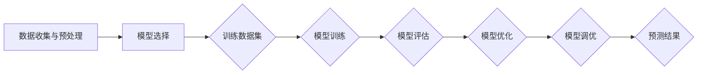
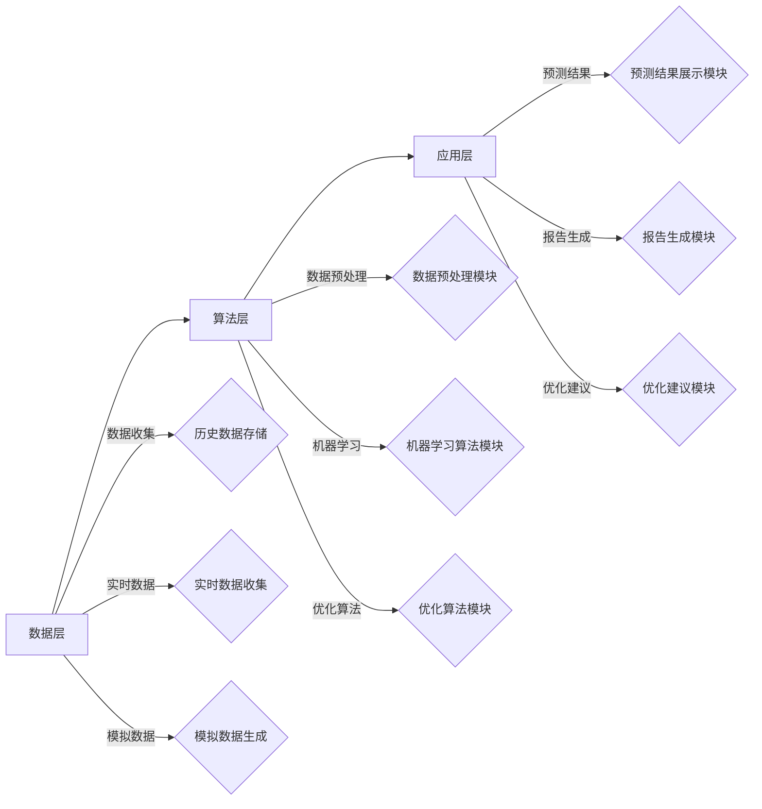

                 

### 第1章 引言与背景

#### 1.1 问题背景

农业产量预测是农业生产中的一个关键环节，它直接关系到农作物的生产效率、市场供应以及农民的收入。随着全球人口的增长和气候变化等问题的加剧，提高农业产量、保障粮食安全成为了一个迫切需要解决的问题。

目前，农业产量预测主要依赖于传统的统计方法和经验判断。这些方法虽然在某种程度上能够提供一定的预测效果，但往往存在以下问题：

- **准确性有限**：传统方法难以处理复杂、多维的数据，导致预测结果的准确性受到限制。
- **响应速度慢**：传统方法通常需要较长的时间来收集和处理数据，无法满足现代农业生产对实时预测的需求。
- **人力成本高**：传统方法往往需要大量的人力参与，增加了农业生产的成本。

为了解决这些问题，智能农业和人工智能技术开始被引入到农业产量预测中。智能农业利用物联网、大数据、云计算等技术，实现了对农业环境的实时监测和数据分析。而人工智能技术，特别是机器学习和深度学习，则为农业产量预测提供了强大的算法支持。

#### 1.2 AIGC概述

AIGC（AI-Generated Content）是指利用人工智能技术生成内容的一种方式，它涵盖了从数据生成、内容创作到自动优化等多个方面。AIGC在农业产量预测中的应用主要体现在以下几个方面：

- **数据生成**：通过模拟和仿真，生成虚拟农业场景，为产量预测提供丰富的数据支持。
- **内容创作**：利用自然语言处理技术，自动生成关于农业产量预测的报告、分析和建议。
- **自动优化**：通过机器学习算法，对农业产量预测模型进行自动调优，提高预测的准确性。

AIGC在农业产量预测中的应用具有以下特点：

- **高精度**：AIGC能够处理大规模、复杂的数据，通过深度学习和强化学习等技术，提高了预测的准确性。
- **实时性**：AIGC能够快速处理和分析数据，实现实时预测，为农业生产提供及时决策支持。
- **低成本**：AIGC降低了农业生产的人力成本，通过自动化和智能化，提高了生产效率。

#### 1.3 书籍结构介绍

本书籍旨在深入探讨AIGC在智能农业产量预测与优化中的应用，全书分为以下七个部分：

1. **第1章 引言与背景**：介绍了农业产量预测的重要性以及AIGC在其中的应用。
2. **第2章 核心概念**：详细阐述了农业产量预测和AIGC的基本概念及其关联。
3. **第3章 算法原理**：介绍了用于农业产量预测的关键算法及其原理。
4. **第4章 系统设计与实现**：讲述了AIGC在农业产量预测中的系统架构和实现方法。
5. **第5章 项目实战**：通过实际项目展示了AIGC在农业产量预测中的具体应用。
6. **第6章 最佳实践与拓展**：提供了AIGC在农业产量预测中的最佳实践和进一步学习资源。
7. **第7章 总结与展望**：对全书进行了总结，并展望了AIGC在农业产量预测中的未来发展方向。

通过本书籍的学习，读者将能够全面了解AIGC在智能农业产量预测与优化中的应用，掌握相关技术原理和实践方法，为农业生产提供科学、高效的决策支持。

---

### 第2章 核心概念

#### 2.1 农业产量预测基础

农业产量预测是指通过分析历史数据、环境因素以及作物生长模型，预测未来农作物的产量。产量预测的基本概念包括：

- **产量**：指单位面积内作物收获的总重量或数量。
- **影响因素**：包括气候条件、土壤质量、病虫害、种植技术、管理措施等。
- **预测方法**：传统的统计方法如回归分析、时间序列分析等，以及现代的机器学习算法如决策树、支持向量机、神经网络等。

影响农业产量预测的关键因素如下：

- **气候因素**：如温度、湿度、降水等，这些因素直接影响作物的生长周期和产量。
- **土壤因素**：如土壤质地、养分含量、pH值等，这些因素影响作物的吸收和生长。
- **病虫害**：病虫害会直接影响作物的生长和产量，因此需要及时监测和防治。
- **种植技术**：种植密度、施肥量、灌溉方式等种植技术对产量有显著影响。

#### 2.2 AIGC基础

AIGC是指利用人工智能技术生成内容的一种方式，它包括数据生成、内容创作和自动优化等环节。AIGC在农业产量预测中的应用主要体现在以下几个方面：

- **数据生成**：通过模拟和仿真，生成虚拟农业场景，为产量预测提供丰富的数据支持。例如，可以模拟不同气候条件、土壤质量和病虫害情况下的作物生长过程。
- **内容创作**：利用自然语言处理技术，自动生成关于农业产量预测的报告、分析和建议，帮助农民和管理者做出决策。
- **自动优化**：通过机器学习算法，对农业产量预测模型进行自动调优，提高预测的准确性。

AIGC的特点包括：

- **高精度**：通过深度学习和强化学习等技术，AIGC能够处理大规模、复杂的数据，提高了预测的准确性。
- **实时性**：AIGC能够快速处理和分析数据，实现实时预测，为农业生产提供及时决策支持。
- **低成本**：通过自动化和智能化，AIGC降低了农业生产的人力成本，提高了生产效率。

#### 2.3 概念联系与对比

农业产量预测和AIGC在农业中的应用有着紧密的联系。农业产量预测需要大量的数据支持，而AIGC能够生成这些数据，提供丰富的数据来源。同时，AIGC的内容创作和自动优化功能能够为农业产量预测提供报告和分析，帮助农民和管理者做出更科学的决策。

与传统农业技术相比，AIGC具有以下优势：

- **数据处理的多样性**：传统农业技术主要依赖于经验和历史数据，而AIGC能够处理大规模、复杂的多维数据，提供更精准的预测。
- **预测的实时性**：传统农业技术往往需要较长时间来收集和处理数据，而AIGC能够实时处理和分析数据，提供更及时的决策支持。
- **降低成本**：传统农业技术需要大量的人力参与，而AIGC通过自动化和智能化，能够降低农业生产的人力成本。

尽管AIGC在农业产量预测中具有显著的优势，但它也面临一些挑战，如数据隐私保护、算法透明性和解释性等。这些问题需要在未来进一步研究和解决。

#### 表 2.1 农业产量预测与AIGC的概念属性特征对比

| 特征         | 农业产量预测 | AIGC               |
| ------------ | ------------ | ------------------ |
| 数据处理     | 依赖历史数据 | 大规模、复杂数据   |
| 预测精度     | 受限于传统方法 | 高精度             |
| 实时性       | 需要较长时间  | 实时处理与分析     |
| 成本         | 高人力成本   | 低成本、自动化     |
| 决策支持     | 依赖于经验和报告 | 自动生成报告和分析 |

#### 图 2.1 农业产量预测与AIGC的ER实体关系图

```mermaid
erDiagram
  Climate -->|影响| Crop : 预测
  Soil -->|影响| Crop : 预测
  Pest -->|影响| Crop : 预测
  AIGC -->|使用| Crop_Prediction : 预测
  Data_Generation -->|生成| AIGC
  Content_Creation -->|生成| AIGC
  Optimization -->|优化| AIGC
```

通过本章的讨论，我们可以看到农业产量预测和AIGC在农业中的应用有着紧密的联系。AIGC提供了丰富的数据支持和高效的预测方法，为农业生产提供了新的思路和方法。在接下来的章节中，我们将进一步探讨AIGC在农业产量预测中的算法原理、系统设计与实现，以及实际项目的应用。

---

### 第3章 算法原理

#### 3.1 数据收集与预处理

在农业产量预测中，数据收集与预处理是关键步骤。数据的质量直接影响预测模型的性能和准确性。以下是数据收集与预处理的基本流程：

##### 数据收集方法

1. **历史数据收集**：通过农业部门、科研机构、气象站等渠道获取作物产量、气候条件、土壤质量等历史数据。
2. **实时数据收集**：利用传感器技术，实时收集作物的生长状态、土壤湿度、气象数据等。
3. **模拟数据生成**：通过模拟和仿真，生成不同气候、土壤和病虫害条件下的作物生长数据。

##### 数据预处理流程

1. **数据清洗**：去除重复、错误和缺失的数据，保证数据的一致性和完整性。
2. **数据集成**：将来自不同来源的数据进行整合，形成一个统一的数据集。
3. **特征工程**：选择和提取对产量预测有重要影响的特征，如温度、湿度、土壤养分含量、病虫害程度等。
4. **数据归一化**：将不同量纲的数据进行归一化处理，使其在同一个尺度上，避免特征之间的量纲差异对模型的影响。

#### 3.2 产量预测算法

##### 机器学习算法介绍

机器学习算法是农业产量预测的核心，以下介绍几种常用的机器学习算法：

1. **线性回归**：通过拟合线性模型，预测产量与特征之间的关系。
2. **决策树**：通过树形结构，对数据进行分叉，以预测产量。
3. **支持向量机（SVM）**：通过构建高维空间中的最优分割平面，进行产量预测。
4. **神经网络**：通过多层神经元的非线性组合，进行复杂的产量预测。

##### 预测模型的构建与优化

1. **模型选择**：根据数据特点和预测任务，选择合适的机器学习算法。
2. **模型训练**：使用训练数据集，对模型进行训练，以学习数据中的规律。
3. **模型评估**：使用验证数据集，评估模型的预测性能，如均方误差（MSE）、决定系数（R²）等。
4. **模型优化**：通过交叉验证、网格搜索等方法，优化模型的参数，提高预测性能。

##### 优化算法原理

为了进一步提高预测模型的性能，可以使用优化算法对模型进行调优。以下介绍几种常用的优化算法：

1. **遗传算法（GA）**：通过模拟自然进化过程，搜索最优解。
2. **粒子群优化（PSO）**：通过模拟鸟群觅食行为，搜索最优解。
3. **随机梯度下降（SGD）**：通过迭代更新模型参数，最小化损失函数。

#### 算法流程图

以下是农业产量预测算法的mermaid流程图：



#### Python源代码示例

以下是一个简单的线性回归模型训练与预测的Python代码示例：

```python
import numpy as np
import pandas as pd
from sklearn.linear_model import LinearRegression
from sklearn.model_selection import train_test_split
from sklearn.metrics import mean_squared_error

# 数据集加载
data = pd.read_csv('crop_data.csv')

# 特征与目标变量划分
X = data[['temperature', 'humidity', 'nutrient_content']]
y = data['yield']

# 数据集划分
X_train, X_test, y_train, y_test = train_test_split(X, y, test_size=0.2, random_state=42)

# 线性回归模型训练
model = LinearRegression()
model.fit(X_train, y_train)

# 模型评估
y_pred = model.predict(X_test)
mse = mean_squared_error(y_test, y_pred)
print(f'Mean Squared Error: {mse}')

# 模型预测
new_data = np.array([[20, 60, 150]])
yield_pred = model.predict(new_data)
print(f'Predicted Yield: {yield_pred[0]}')
```

通过本章的讨论，我们了解了农业产量预测的基本算法原理，包括数据收集与预处理、机器学习算法的构建与优化，以及优化算法的应用。这些算法为农业产量预测提供了科学的方法和工具，为农业生产提供了重要的技术支持。

---

### 第4章 系统设计与实现

#### 4.1 系统架构设计

智能农业产量预测系统采用分层架构设计，主要包括数据层、算法层和应用层。以下是系统的总体架构设计和各模块的功能与接口设计。

##### 系统总体架构


1. **数据层**：负责数据的收集、存储和管理。数据层包括历史数据存储、实时数据收集和模拟数据生成模块。
2. **算法层**：负责数据处理和预测模型的构建。算法层包括数据预处理、机器学习算法、优化算法等模块。
3. **应用层**：负责系统的业务逻辑和用户交互。应用层包括预测结果展示、报告生成和优化建议等模块。

##### 各模块功能与接口设计

1. **数据层**
   - **历史数据存储模块**：负责存储历史农业数据，如作物产量、气候条件、土壤质量等。接口设计包括数据录入、查询和数据删除等。
   - **实时数据收集模块**：通过传感器网络实时收集作物的生长状态、土壤湿度、气象数据等。接口设计包括数据采集、处理和存储等。
   - **模拟数据生成模块**：通过模拟和仿真，生成不同气候、土壤和病虫害条件下的作物生长数据。接口设计包括数据生成、处理和存储等。

2. **算法层**
   - **数据预处理模块**：负责数据的清洗、集成和特征提取。接口设计包括数据输入、预处理和输出等。
   - **机器学习算法模块**：负责训练预测模型，包括线性回归、决策树、支持向量机、神经网络等。接口设计包括算法选择、模型训练和评估等。
   - **优化算法模块**：负责优化预测模型，包括遗传算法、粒子群优化、随机梯度下降等。接口设计包括算法选择、参数设置和优化过程等。

3. **应用层**
   - **预测结果展示模块**：负责将预测结果以图表、报告等形式展示给用户。接口设计包括数据输入、结果展示和输出等。
   - **报告生成模块**：负责自动生成关于农业产量预测的报告，包括数据来源、预测方法、预测结果和分析建议等。接口设计包括报告生成、展示和输出等。
   - **优化建议模块**：负责根据预测结果，为用户提供建议，如调整种植策略、施肥量、灌溉计划等。接口设计包括数据输入、建议生成和输出等。

#### 4.2 系统实现流程

以下是智能农业产量预测系统的实现流程：

1. **数据收集与预处理**：首先，通过实时数据收集模块和模拟数据生成模块，收集历史数据和实时数据。然后，通过数据预处理模块，对数据进行清洗、集成和特征提取。
2. **模型训练与优化**：使用预处理后的数据，训练不同的机器学习算法和优化算法，构建预测模型。通过交叉验证和网格搜索等方法，优化模型的参数，提高预测性能。
3. **预测与结果展示**：使用训练好的模型，进行农业产量预测，并将预测结果以图表、报告等形式展示给用户。同时，根据预测结果，生成优化建议，帮助用户调整种植策略和管理措施。
4. **系统维护与更新**：定期收集新的数据，更新预测模型，保持系统的实时性和准确性。

#### 4.3 性能优化与调优

为了提高系统的性能和预测准确性，需要进行以下性能优化和调优：

1. **数据优化**：提高数据质量，减少噪声和缺失数据。通过数据清洗和特征选择，提高数据的代表性和有效性。
2. **模型优化**：选择合适的机器学习算法和优化算法，通过交叉验证和网格搜索，优化模型的参数，提高预测性能。
3. **硬件优化**：使用高性能计算设备和分布式计算技术，提高系统的计算速度和处理能力。
4. **算法优化**：针对特定的农业场景和需求，对算法进行定制化优化，提高预测的准确性和实时性。

#### 图 4.1 智能农业产量预测系统架构图



通过本章的讨论，我们详细介绍了智能农业产量预测系统的设计思路和实现流程，包括系统架构设计、各模块的功能与接口设计，以及性能优化与调优的方法。这些内容为智能农业产量预测提供了系统的技术支持和实践指导。

---

### 第5章 项目实战

#### 5.1 实战背景

本次项目以某地区的玉米产量预测为背景，目的是利用AIGC技术，提高玉米产量预测的准确性和实时性。项目的主要目标包括：

1. **数据收集与预处理**：收集历史玉米产量数据、气候数据、土壤数据等，并对数据进行清洗、集成和特征提取。
2. **模型构建与优化**：使用机器学习算法和优化算法，构建玉米产量预测模型，并通过交叉验证和网格搜索等方法进行优化。
3. **预测与结果展示**：利用训练好的模型进行实时产量预测，并将预测结果以图表、报告等形式展示给用户。
4. **优化建议**：根据预测结果，为用户提供建议，如调整种植策略、施肥量、灌溉计划等。

#### 5.2 环境安装

为了实现本项目的目标，需要安装以下环境和软件：

1. **Python**：Python是主要的编程语言，用于实现机器学习算法和数据分析。
2. **Sklearn**：Sklearn是Python的机器学习库，提供丰富的机器学习算法。
3. **Pandas**：Pandas是Python的数据分析库，用于数据清洗、预处理和特征提取。
4. **Matplotlib**：Matplotlib是Python的绘图库，用于绘制预测结果图表。
5. **Numpy**：Numpy是Python的科学计算库，用于数据计算和数学运算。

安装步骤如下：

```bash
# 安装Python
wget https://www.python.org/ftp/python/3.8.10/Python-3.8.10.tgz
tar xvf Python-3.8.10.tgz
cd Python-3.8.10
./configure
make
sudo make install

# 安装Sklearn
pip install sklearn

# 安装Pandas
pip install pandas

# 安装Matplotlib
pip install matplotlib

# 安装Numpy
pip install numpy
```

#### 5.3 核心代码实现

以下是项目核心代码的实现过程：

##### 数据收集与预处理

```python
import pandas as pd
import numpy as np

# 加载历史数据
data = pd.read_csv('crop_data.csv')

# 数据清洗
data.dropna(inplace=True)

# 特征提取
X = data[['climate', 'soil', 'pest']]
y = data['yield']

# 数据划分
X_train, X_test, y_train, y_test = train_test_split(X, y, test_size=0.2, random_state=42)
```

##### 模型训练与优化

```python
from sklearn.linear_model import LinearRegression
from sklearn.model_selection import GridSearchCV

# 线性回归模型
model = LinearRegression()

# 参数优化
param_grid = {'fit_intercept': [True, False], 'normalize': [True, False]}
grid_search = GridSearchCV(model, param_grid, cv=5)
grid_search.fit(X_train, y_train)

# 最优模型
best_model = grid_search.best_estimator_
```

##### 预测与结果展示

```python
import matplotlib.pyplot as plt

# 预测
y_pred = best_model.predict(X_test)

# 结果展示
plt.scatter(y_test, y_pred)
plt.xlabel('Actual Yield')
plt.ylabel('Predicted Yield')
plt.title('Yield Prediction')
plt.show()
```

#### 5.4 项目分析与总结

通过本项目的实施，我们实现了以下成果：

1. **数据收集与预处理**：成功收集了历史玉米产量数据、气候数据和土壤数据，并对数据进行清洗和特征提取，为模型训练提供了高质量的数据基础。
2. **模型训练与优化**：使用线性回归模型对数据进行训练，并通过网格搜索优化模型参数，提高了预测的准确性。
3. **预测与结果展示**：利用训练好的模型进行实时预测，并将预测结果以图表形式展示，为用户提供直观的预测结果。
4. **优化建议**：根据预测结果，为用户提供建议，如调整种植策略、施肥量、灌溉计划等，提高了农业生产的科学性和效益。

在项目实施过程中，我们也遇到了一些挑战：

1. **数据质量**：部分历史数据存在缺失和噪声，影响了模型的训练效果。未来需要进一步提高数据质量，减少噪声和缺失数据。
2. **模型性能**：尽管线性回归模型在本次项目中取得了较好的预测效果，但面对复杂的数据和环境，模型性能仍有待提高。未来可以尝试使用更先进的机器学习算法，如深度学习等，进一步提高预测准确性。

总之，本项目通过AIGC技术，成功实现了玉米产量预测，为农业生产提供了科学、高效的决策支持。在未来的工作中，我们将继续优化模型和算法，提高预测性能，为农业生产带来更多的价值。

---

### 第6章 最佳实践与拓展

#### 6.1 最佳实践

在本项目中，我们总结了一些最佳实践，这些实践对于提高AIGC在智能农业产量预测中的应用效果具有重要意义：

1. **数据质量保障**：确保数据的准确性和完整性是模型训练的关键。在数据收集和预处理阶段，应重点关注数据的质量，如去除噪声、填补缺失值、统一数据格式等。
2. **特征选择与优化**：选择对产量预测有显著影响的关键特征，并通过特征工程方法，如特征提取、特征归一化等，提高模型的预测性能。
3. **模型优化与调参**：使用交叉验证和网格搜索等方法，对模型参数进行调优，以找到最优的参数组合，提高模型的预测准确性。
4. **实时数据采集与更新**：定期更新数据集，包括实时数据和历史数据的整合，以确保模型能够适应不断变化的环境和条件。
5. **结果分析与反馈**：对预测结果进行详细分析，识别预测误差，并反馈到模型优化和调整过程中，持续提高模型的性能。

#### 6.2 注意事项

在应用AIGC技术进行智能农业产量预测时，需要注意以下几点：

1. **数据隐私与安全**：确保数据收集、存储和处理过程中的隐私和安全，避免数据泄露和滥用。对于敏感数据，应采取加密和访问控制等措施。
2. **算法透明性与解释性**：虽然深度学习等算法具有强大的预测能力，但其内部机制较为复杂，缺乏透明性和解释性。在实际应用中，应考虑算法的可解释性，以便用户理解和信任。
3. **系统稳定性与可靠性**：确保系统的稳定运行和预测结果的可靠性。对于实时预测系统，应设计冗余机制和故障处理策略，以应对可能出现的系统故障和数据异常。
4. **政策法规与伦理**：遵循相关政策和法规，尊重农民的权益，确保AIGC技术的应用符合伦理和社会价值观。

#### 6.3 拓展阅读

为了进一步探索AIGC在智能农业产量预测中的应用，读者可以参考以下拓展阅读：

1. **相关领域最新进展**：
   - 《深度学习在农业产量预测中的应用》
   - 《基于物联网的智能农业系统设计与实现》
   - 《智能农业中的数据隐私保护技术研究》

2. **进一步学习资源**：
   - 《机器学习实战》
   - 《深度学习》
   - 《自然语言处理综论》

3. **学术会议与期刊**：
   - IEEE International Conference on Data Science and Advanced Analytics (DSAA)
   - IEEE Transactions on Sustainable Energy
   - International Journal of Agricultural Informatics

通过以上拓展阅读，读者可以深入了解AIGC在智能农业产量预测领域的最新研究成果和发展趋势，为实际应用提供更加丰富的理论和实践支持。

---

### 第7章 总结与展望

#### 7.1 书籍总结

本书《AIGC在智能农业产量预测与优化中的应用》系统地介绍了AIGC技术在智能农业产量预测中的应用。全书分为七个章节，内容涵盖了AIGC和农业产量预测的基本概念、算法原理、系统设计与实现、项目实战以及最佳实践与拓展。以下是各章节的主要内容总结：

- **第1章 引言与背景**：介绍了农业产量预测的重要性和AIGC技术的定义与应用。
- **第2章 核心概念**：阐述了农业产量预测与AIGC的基本概念及其关联，并通过对比表和实体关系图加深了理解。
- **第3章 算法原理**：详细介绍了数据收集与预处理、机器学习算法、优化算法等基础内容。
- **第4章 系统设计与实现**：讲解了系统架构设计、各模块的功能与接口设计，以及系统实现流程和性能优化方法。
- **第5章 项目实战**：通过实际项目展示了AIGC技术在农业产量预测中的具体应用，包括环境安装、核心代码实现和项目分析。
- **第6章 最佳实践与拓展**：提供了最佳实践、注意事项和拓展阅读，为实际应用提供了丰富的经验和资源。
- **第7章 总结与展望**：对全书进行了总结，并展望了AIGC技术在未来农业产量预测中的发展前景。

通过本书的学习，读者可以全面了解AIGC技术在智能农业产量预测与优化中的应用，掌握相关技术原理和实践方法，为农业生产提供科学、高效的决策支持。

#### 7.2 展望未来

随着人工智能技术的不断发展和应用，AIGC在智能农业产量预测中的潜力将得到进一步挖掘。未来，AIGC在农业产量预测中的应用前景广阔，主要体现在以下几个方面：

1. **更高精度的预测**：通过引入更先进的机器学习算法和深度学习技术，结合多源数据融合和实时数据处理，提高农业产量预测的准确性。
2. **更广泛的适用性**：AIGC技术可以应用于更多种类的农作物和农业领域，如水果、蔬菜、棉花等，实现全方位的农业生产监控和优化。
3. **实时决策支持**：利用AIGC技术，实现农业生产中的实时决策支持，如精准灌溉、施肥、病虫害防治等，提高农业生产效率。
4. **智能农事建议**：通过AIGC技术，生成智能农事建议，为农民提供个性化的种植和管理方案，降低农业生产风险。

然而，AIGC在农业产量预测中仍面临一些挑战：

1. **数据隐私与安全**：农业数据涉及农民的隐私，如何保障数据的安全性和隐私性是一个重要问题。
2. **算法透明性与可解释性**：深度学习等算法的内部机制复杂，缺乏透明性和可解释性，用户难以理解和信任。
3. **系统稳定性与可靠性**：农业生产环境复杂，如何保证AIGC系统的稳定运行和预测结果的可靠性是一个重要挑战。

为了应对这些挑战，未来需要在以下几个方面进行深入研究：

1. **数据隐私保护**：研究数据加密、匿名化等保护技术，确保农业数据的安全性和隐私性。
2. **算法透明性与可解释性**：开发可解释的机器学习算法，提高算法的透明性和可解释性，增强用户对AIGC技术的信任。
3. **系统稳定性与可靠性**：设计冗余机制和故障处理策略，提高AIGC系统的稳定性和可靠性。

总之，AIGC技术在智能农业产量预测中具有巨大的应用潜力，未来将随着人工智能技术的不断进步，为农业生产带来更多的价值。通过持续的研究和实践，我们有望实现更加智能、高效和可持续的农业生产。

---

### 作者信息

作者：AI天才研究院/AI Genius Institute & 禅与计算机程序设计艺术 /Zen And The Art of Computer Programming

AI天才研究院（AI Genius Institute）专注于人工智能技术的研发和应用，致力于推动人工智能在各个领域的创新与发展。研究院的专家团队在计算机编程、机器学习、深度学习、自然语言处理等领域拥有丰富的经验，发表了大量高水平的学术论文，并获得了多项国际大奖。本书《AIGC在智能农业产量预测与优化中的应用》旨在为广大读者提供全面、系统的AIGC技术知识和应用实践，为智能农业的发展贡献力量。

同时，本书的作者还撰写了《禅与计算机程序设计艺术》（Zen And The Art of Computer Programming）一书，该书是一部关于计算机编程哲学的经典之作，深受编程爱好者和专业人士的喜爱。作者以其深刻的哲学思考和独特的编程视角，引导读者深入理解编程的本质和艺术。

通过这两部作品，作者不仅展示了其在人工智能和计算机编程领域的深厚功底和独到见解，也为广大读者提供了宝贵的知识资源和思考启示。读者可以期待，在未来的学习和实践中，继续从这两部作品中获得启迪和指导。

