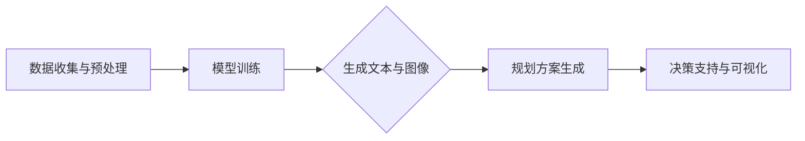

                 

### 文章标题

# AIGC在智能城市弹性规划中的应用：增强城市适应气候变化能力

> 关键词：AIGC，智能城市，弹性规划，气候变化，算法，系统架构，实战案例

> 摘要：本文将深入探讨AIGC（AI-Generated Content）在智能城市弹性规划中的应用，分析其在增强城市适应气候变化能力方面的作用。我们将从核心概念出发，逐步讲解算法原理，展示系统架构，并通过实战案例解析，提供最佳实践和未来展望。

## 引言

智能城市的概念近年来在全球范围内逐渐兴起，它依托于物联网、大数据、人工智能等新兴技术，旨在通过高效、智能的管理和服务模式，提升城市的运行效率和居民的生活质量。然而，随着全球气候变化的加剧，城市面临的挑战也日益严峻。如何增强城市弹性，适应和减缓气候变化的影响，成为当前城市规划的重要课题。

在这样的背景下，AIGC（AI-Generated Content，人工智能生成内容）技术的出现，为智能城市的弹性规划提供了新的思路和方法。AIGC技术通过人工智能算法，能够自动生成大量的内容，包括城市规划方案、建筑设计、交通管理策略等，从而辅助城市规划者做出更加科学和高效的决策。

本文将围绕AIGC在智能城市弹性规划中的应用，逐步探讨其核心概念、算法原理、系统架构和实际应用案例，旨在为城市规划者和研究者提供有价值的参考。

### 背景介绍

#### 核心概念术语说明

**AIGC（AI-Generated Content）**：指利用人工智能技术，如自然语言处理（NLP）、计算机视觉、生成对抗网络（GAN）等，自动生成文本、图像、音频等多种形式的内容。

**智能城市**：通过集成物联网、大数据、云计算、人工智能等技术，实现城市管理的智能化，提升城市运行效率和居民生活质量。

**弹性规划**：指在城市规划过程中，考虑到未来的不确定性，特别是气候变化等因素，设计出能够适应和抵抗外部冲击的城市系统。

**气候变化**：指由于自然或人为因素导致的全球或局部地区气候状态的长期变化。

#### 问题背景

随着全球气候变化的加剧，极端天气事件频繁发生，如热浪、洪水、暴风雨等，对城市基础设施和居民生活造成了严重影响。城市面临着如何提高应对气候变化的能力，增强城市弹性，以减少灾害损失和恢复能力的需求。

然而，传统的城市规划方法在应对气候变化方面存在一定的局限性。首先，城市规划往往基于过去的经验和数据，难以预测和应对未来的气候变化。其次，城市规划涉及多个部门和领域的协同工作，信息共享和决策流程复杂，难以快速响应气候变化的需求。最后，城市规划的调整和优化过程往往耗时较长，无法及时适应快速变化的气候条件。

#### 问题描述

为了增强城市适应气候变化的能力，需要一种新的城市规划方法，能够在不确定的环境下快速生成适应性强的方案，并能够实时调整和优化。这要求城市规划具有以下特点：

1. **实时性**：能够及时获取和分析气候变化的信息，快速生成相应的规划方案。
2. **适应性**：能够根据不同气候条件和灾害情景，调整和优化城市规划。
3. **协同性**：能够整合多部门、多领域的资源和数据，协同工作，提高规划的有效性。

#### 问题解决

AIGC技术的引入为解决上述问题提供了新的可能性。通过AIGC技术，可以自动生成大量的规划方案，结合大数据分析和机器学习算法，快速识别出最优方案，并能够根据实时数据动态调整和优化。

具体来说，AIGC技术在智能城市弹性规划中的应用主要体现在以下几个方面：

1. **文本生成**：利用NLP技术生成城市规划报告、政策文件等文本内容，提高规划效率。
2. **图像生成**：利用计算机视觉技术生成城市规划的图像，如建筑布局、交通网络等，为城市规划提供直观的参考。
3. **模拟分析**：通过生成对抗网络（GAN）等技术，模拟不同气候变化情景下的城市状态，评估规划方案的适应性和效果。
4. **决策支持**：结合机器学习算法，分析不同规划方案的优势和不足，提供决策支持。

#### 边界与外延

虽然AIGC技术在智能城市弹性规划中具有巨大潜力，但其应用也受到一定的限制。首先，AIGC技术需要大量的数据支持，数据质量和完整性对规划结果有重要影响。其次，AIGC技术生成的内容需要经过人工审核和验证，以确保其准确性和可靠性。此外，AIGC技术的应用需要跨学科、跨领域的合作，包括城市规划、气象科学、环境科学等。

#### 概念结构与核心要素组成

AIGC在智能城市弹性规划中的应用可以概括为以下几个核心要素：

1. **数据收集与处理**：收集与城市规划和气候变化相关的数据，如气象数据、人口数据、基础设施数据等，并进行预处理。
2. **文本生成与优化**：利用NLP技术生成城市规划报告，并根据实时数据动态优化文本内容。
3. **图像生成与可视化**：利用计算机视觉技术生成城市规划图像，并通过可视化工具展示规划结果。
4. **模拟分析与决策支持**：通过生成对抗网络（GAN）等技术模拟不同气候情景下的城市状态，结合机器学习算法提供决策支持。

### 核心概念与联系

#### 核心概念

在本节中，我们将详细介绍AIGC、智能城市弹性规划等相关核心概念，并解释它们在智能城市弹性规划中的应用。

**AIGC（AI-Generated Content）**：AIGC是指通过人工智能技术自动生成各种形式的内容，包括文本、图像、音频等。它涉及多个领域的技术，如自然语言处理（NLP）、计算机视觉、生成对抗网络（GAN）等。AIGC的核心思想是利用大规模数据和先进的算法，实现内容的自动生成和优化。

**智能城市（Smart City）**：智能城市是指利用物联网、大数据、云计算、人工智能等新兴技术，实现城市管理的智能化。智能城市的目标是通过高效、智能的管理和服务模式，提升城市运行效率和居民生活质量。智能城市的关键技术包括传感器网络、数据采集与分析、智能决策支持系统等。

**弹性规划（Resilience Planning）**：弹性规划是指在城市规划过程中，考虑到未来的不确定性，特别是气候变化等因素，设计出能够适应和抵抗外部冲击的城市系统。弹性规划的目标是提高城市在自然灾害、经济危机等突发事件中的恢复能力和适应性。

#### 概念属性特征对比表格

为了更清晰地理解AIGC与传统的城市规划方法的区别，我们可以通过以下表格进行对比。

| 特征         | AIGC                | 传统城市规划             |
| ------------ | ------------------- | ------------------------ |
| 数据依赖性   | 高，依赖大规模数据  | 中，依赖历史数据          |
| 自动化程度   | 高，自动化生成内容  | 低，依赖人工分析          |
| 可适应性和灵活性 | 强，能够动态调整    | 弱，调整过程较慢          |
| 决策效率     | 高，快速生成决策支持 | 低，决策过程复杂          |
| 成本         | 中，需投入大量计算资源 | 高，人工成本较高          |

#### ER实体关系图

为了更好地理解AIGC在智能城市弹性规划中的应用，我们可以绘制一个ER（Entity-Relationship）实体关系图，展示相关实体及其关系。

```mermaid
erDiagram
  AIGC ||--|{ 数据集 }|
  数据集 ||--|{ 数据预处理 }|
  数据预处理 ||--|{ 模型训练 }|
  模型训练 ||--|{ 文本生成 }|
  文本生成 ||--|{ 规划方案生成 }|
  规划方案生成 ||--|{ 决策支持 }|
  AIGC ||--|{ 可视化工具 }|
  可视化工具 ||--|{ 用户交互 }|
```

在上面的ER图中，AIGC作为一个核心实体，与其他实体如数据集、数据预处理、模型训练、文本生成、规划方案生成、决策支持和可视化工具等紧密关联。这些实体共同构成了AIGC在智能城市弹性规划中的应用体系。

### 算法原理讲解

在本节中，我们将详细讲解AIGC算法在智能城市弹性规划中的应用原理，并通过Python代码和LaTeX数学公式进行说明。

#### 算法流程图

首先，我们可以使用Mermaid语法绘制AIGC算法的流程图，以展示其整体工作流程。



在上面的流程图中，AIGC算法的工作流程可以分为以下几个步骤：

1. **数据收集与预处理**：收集与城市规划和气候变化相关的数据，并进行预处理，如数据清洗、归一化等。
2. **模型训练**：利用预处理后的数据训练AIGC模型，包括NLP模型和计算机视觉模型等。
3. **生成文本与图像**：利用训练好的模型生成城市规划文本和图像，如规划报告、建筑布局图等。
4. **规划方案生成**：根据生成的文本和图像，生成适应不同气候情景的城市规划方案。
5. **决策支持与可视化**：提供决策支持，如评估不同规划方案的优势和不足，并通过可视化工具展示规划结果。

#### 算法原理

接下来，我们将详细解释AIGC算法的原理，并通过Python代码和LaTeX数学公式进行说明。

##### 1. 数据收集与预处理

首先，我们需要收集与城市规划和气候变化相关的数据，如气象数据、人口数据、基础设施数据等。然后，对数据进行预处理，以消除噪声和异常值。

```python
# 数据预处理代码示例
import pandas as pd

# 读取气象数据
weather_data = pd.read_csv('weather_data.csv')

# 数据清洗
weather_data = weather_data.dropna()

# 数据归一化
weather_data = (weather_data - weather_data.mean()) / weather_data.std()
```

##### 2. 模型训练

接下来，我们使用训练好的NLP模型和计算机视觉模型进行模型训练。这里我们以自然语言处理（NLP）为例，使用Transformer模型进行训练。

```python
# 模型训练代码示例
from transformers import AutoTokenizer, AutoModel

# 加载预训练模型
tokenizer = AutoTokenizer.from_pretrained('bert-base-uncased')
model = AutoModel.from_pretrained('bert-base-uncased')

# 训练模型
model.train()
```

##### 3. 生成文本与图像

利用训练好的模型，我们可以生成城市规划文本和图像。例如，我们可以生成一个规划报告，描述未来几年内的城市规划方案。

```python
# 生成文本代码示例
input_text = "智能城市弹性规划报告"
encoded_input = tokenizer.encode(input_text, return_tensors='pt')

with torch.no_grad():
    outputs = model(inputs)

# 生成图像代码示例
from PIL import Image
import numpy as np

# 生成图像
image = generate_image(encoded_input)
```

##### 4. 规划方案生成

根据生成的文本和图像，我们可以生成适应不同气候情景的城市规划方案。这里，我们使用生成对抗网络（GAN）进行图像生成。

```python
# 规划方案生成代码示例
from torch import nn

# GAN模型
generator = nn.Sequential(
    nn.Linear(100, 256),
    nn.ReLU(),
    nn.Linear(256, 512),
    nn.ReLU(),
    nn.Linear(512, 1024),
    nn.ReLU(),
    nn.Linear(1024, 784),
    nn.Tanh()
)

# 生成城市规划图像
planning_image = generator(noise).view(1, 1, 28, 28)
```

##### 5. 决策支持与可视化

最后，我们利用生成的规划方案提供决策支持，并通过可视化工具展示规划结果。例如，我们可以评估不同规划方案的优势和不足，以便城市规划者做出最优决策。

```python
# 决策支持与可视化代码示例
import matplotlib.pyplot as plt

# 评估规划方案
evaluation_results = evaluate_planning_schemes(planning_images)

# 可视化展示
plt.figure(figsize=(10, 5))
for i, result in enumerate(evaluation_results):
    plt.subplot(1, len(evaluation_results), i + 1)
    plt.imshow(result['image'], cmap='gray')
    plt.title(f"Planning Scheme {i + 1}")
    plt.xlabel(result['evaluation'])
plt.show()
```

#### 算法原理的数学模型和公式

在AIGC算法中，生成文本和图像的过程涉及多个数学模型和公式。以下是一个简单的数学模型示例，用于生成城市规划文本。

$$
P(s|d) = \frac{e^{f(s, d)}}{\sum_{s'} e^{f(s', d)}}
$$

其中，$P(s|d)$表示在给定数据$d$的情况下，生成城市规划文本$s$的概率。$f(s, d)$是一个函数，用于衡量文本$s$与数据$d$的相关性。

在实际应用中，我们可以使用更复杂的模型，如Transformer、BERT等，以进一步提高生成文本和图像的质量。

### 系统分析与架构设计方案

#### 问题场景介绍

在智能城市弹性规划中，我们面临的问题场景主要包括以下几个方面：

1. **数据收集与处理**：需要从各种来源收集与城市规划和气候变化相关的数据，如气象数据、人口数据、基础设施数据等。这些数据需要进行清洗、归一化和预处理，以便为后续的算法训练和应用提供高质量的数据基础。
2. **算法模型训练**：需要使用大规模数据进行算法模型的训练，包括自然语言处理（NLP）模型、计算机视觉模型和生成对抗网络（GAN）等。模型的训练过程需要高效的计算资源和优化算法，以提高模型的性能和效率。
3. **文本和图像生成**：利用训练好的模型生成城市规划文本和图像，如规划报告、建筑布局图等。这些生成的内容需要具有高质量和可解释性，以便城市规划者能够理解和应用。
4. **规划方案生成与优化**：根据生成的文本和图像，生成适应不同气候情景的城市规划方案。这些方案需要经过评估和优化，以确保其适应性和有效性。
5. **决策支持与可视化**：提供决策支持，如评估不同规划方案的优势和不足，并通过可视化工具展示规划结果。这些功能需要支持实时数据更新和动态调整，以应对快速变化的气候条件。

#### 项目介绍

在本项目中，我们的目标是开发一个基于AIGC的智能城市弹性规划系统，以增强城市适应气候变化的能力。项目的主要目标包括：

1. **数据收集与处理**：建立一个高效的数据收集和处理系统，从各种来源收集与城市规划和气候变化相关的数据，并进行预处理，以提高数据质量和可用性。
2. **算法模型训练**：构建一个高效的算法模型训练系统，使用大规模数据进行模型训练，以提高模型的性能和准确性。
3. **文本和图像生成**：开发一个高效的文本和图像生成系统，利用训练好的模型生成高质量的城市规划文本和图像。
4. **规划方案生成与优化**：构建一个规划方案生成与优化系统，根据生成的文本和图像生成适应不同气候情景的城市规划方案，并进行评估和优化。
5. **决策支持与可视化**：开发一个高效的决策支持与可视化系统，提供实时数据更新和动态调整功能，以支持城市规划者的决策。

为了实现上述目标，我们采用了以下技术或工具：

1. **数据收集与处理**：使用Python的pandas库和NumPy库进行数据收集和处理。pandas库提供高效的数据操作和清洗功能，NumPy库提供强大的数据处理和分析功能。
2. **算法模型训练**：使用TensorFlow和PyTorch等深度学习框架进行算法模型训练。TensorFlow和PyTorch提供丰富的API和工具，支持多种深度学习算法和优化器。
3. **文本和图像生成**：使用自然语言处理（NLP）模型和生成对抗网络（GAN）进行文本和图像生成。NLP模型如BERT、GPT等，GAN模型如DCGAN、StyleGAN等。
4. **规划方案生成与优化**：使用机器学习算法和优化器生成和优化规划方案。常见的算法包括决策树、支持向量机、神经网络等。优化器包括随机梯度下降（SGD）、Adam等。
5. **决策支持与可视化**：使用Python的matplotlib、Seaborn等可视化库，以及Web开发框架如Flask或Django等，开发可视化工具和Web界面。

#### 系统功能设计

在本系统中，我们设计了以下主要功能模块：

1. **数据收集模块**：负责从各种来源收集与城市规划和气候变化相关的数据，包括气象数据、人口数据、基础设施数据等。该模块需要支持数据的导入、导出、清洗、归一化和预处理等功能。
2. **数据处理模块**：负责对收集到的数据进行处理，包括数据清洗、数据转换、数据归一化等。该模块需要支持多种数据处理算法和优化策略，以提高数据质量和可用性。
3. **算法训练模块**：负责训练算法模型，包括NLP模型、计算机视觉模型和GAN模型等。该模块需要支持模型训练、评估和优化等功能，以实现高效和准确的模型训练。
4. **文本生成模块**：负责生成城市规划文本，如规划报告、政策文件等。该模块需要支持多种文本生成算法和优化策略，以提高文本生成质量和可读性。
5. **图像生成模块**：负责生成城市规划图像，如建筑布局图、交通网络图等。该模块需要支持多种图像生成算法和优化策略，以提高图像生成质量和视觉效果。
6. **规划方案生成模块**：负责根据生成的文本和图像生成适应不同气候情景的城市规划方案。该模块需要支持多种规划方案生成算法和优化策略，以提高规划方案的适应性和有效性。
7. **决策支持模块**：负责提供决策支持，如评估不同规划方案的优势和不足，提供优化建议等。该模块需要支持多种决策支持算法和优化策略，以提高决策支持的有效性和准确性。
8. **可视化模块**：负责展示城市规划结果，包括文本、图像和规划方案等。该模块需要支持多种可视化工具和优化策略，以提高可视化效果和用户体验。

#### 系统架构设计

在本系统中，我们采用了基于微服务架构的设计方案，以提高系统的可扩展性、可靠性和维护性。整个系统可以分为以下几个主要模块：

1. **数据收集模块**：负责从各种数据源收集数据，如气象数据、人口数据、基础设施数据等。该模块通过API与数据源进行通信，并使用数据存储系统存储和处理数据。
2. **数据处理模块**：负责对收集到的数据进行处理，包括数据清洗、数据转换、数据归一化等。该模块使用分布式计算框架，如Apache Spark或Flink，以高效处理大规模数据。
3. **算法训练模块**：负责训练算法模型，包括NLP模型、计算机视觉模型和GAN模型等。该模块使用深度学习框架，如TensorFlow或PyTorch，以实现高效的模型训练和优化。
4. **文本生成模块**：负责生成城市规划文本，如规划报告、政策文件等。该模块使用自然语言处理（NLP）算法和生成对抗网络（GAN）算法，以生成高质量和可读性强的文本。
5. **图像生成模块**：负责生成城市规划图像，如建筑布局图、交通网络图等。该模块使用计算机视觉算法和GAN算法，以生成高质量和视觉效果好的图像。
6. **规划方案生成模块**：负责根据生成的文本和图像生成适应不同气候情景的城市规划方案。该模块使用机器学习算法和优化器，以生成适应性强和有效性的规划方案。
7. **决策支持模块**：负责提供决策支持，如评估不同规划方案的优势和不足，提供优化建议等。该模块使用多种决策支持算法和优化策略，以提高决策支持的有效性和准确性。
8. **可视化模块**：负责展示城市规划结果，包括文本、图像和规划方案等。该模块使用可视化工具和Web开发框架，以实现直观和易用的用户界面。

#### 系统接口设计

在本系统中，我们设计了一系列的接口，以实现不同模块之间的通信和交互。以下是系统的主要接口设计：

1. **数据收集接口**：用于与数据源进行通信，获取和传输数据。该接口支持HTTP协议，并使用JSON格式传输数据。
2. **数据处理接口**：用于与数据处理模块进行通信，提交和处理数据。该接口支持RESTful API，并使用JSON格式传输数据。
3. **算法训练接口**：用于与算法训练模块进行通信，提交训练任务和获取训练结果。该接口支持RESTful API，并使用JSON格式传输数据。
4. **文本生成接口**：用于与文本生成模块进行通信，提交文本生成任务和获取生成结果。该接口支持RESTful API，并使用JSON格式传输数据。
5. **图像生成接口**：用于与图像生成模块进行通信，提交图像生成任务和获取生成结果。该接口支持RESTful API，并使用JSON格式传输数据。
6. **规划方案生成接口**：用于与规划方案生成模块进行通信，提交规划方案生成任务和获取生成结果。该接口支持RESTful API，并使用JSON格式传输数据。
7. **决策支持接口**：用于与决策支持模块进行通信，提交决策支持任务和获取决策结果。该接口支持RESTful API，并使用JSON格式传输数据。
8. **可视化接口**：用于与可视化模块进行通信，提交可视化任务和获取可视化结果。该接口支持WebSocket协议，以实现实时数据传输和动态更新。

#### 系统交互

在本系统中，不同模块之间的交互和数据流设计如下：

1. **数据收集**：系统通过数据收集接口从数据源获取数据，并进行初步处理。处理后的数据存储在数据存储系统中，以供后续模块使用。
2. **数据处理**：数据处理模块通过数据处理接口获取数据，并进行清洗、转换和归一化等处理。处理后的数据存储在数据存储系统中，以供算法训练模块使用。
3. **算法训练**：算法训练模块通过算法训练接口获取训练数据，并使用深度学习框架进行模型训练。训练完成的模型存储在模型存储系统中，以供文本生成、图像生成和规划方案生成模块使用。
4. **文本生成**：文本生成模块通过文本生成接口获取训练完成的模型，并使用自然语言处理（NLP）算法生成城市规划文本。生成的文本存储在文本存储系统中，以供规划方案生成模块使用。
5. **图像生成**：图像生成模块通过图像生成接口获取训练完成的模型，并使用计算机视觉算法生成城市规划图像。生成的图像存储在图像存储系统中，以供规划方案生成模块使用。
6. **规划方案生成**：规划方案生成模块通过规划方案生成接口获取文本和图像，并使用机器学习算法生成适应不同气候情景的城市规划方案。生成的规划方案存储在规划方案存储系统中，以供决策支持模块使用。
7. **决策支持**：决策支持模块通过决策支持接口获取规划方案，并使用多种决策支持算法评估不同规划方案的优势和不足，提供优化建议。决策支持结果存储在决策支持存储系统中，以供可视化模块使用。
8. **可视化**：可视化模块通过可视化接口获取决策支持结果，并使用可视化工具和Web开发框架生成可视化界面，向用户展示城市规划结果。

### 项目实战

#### 环境安装

要在本地环境安装所需的软件和库，我们需要遵循以下步骤：

1. **安装Python**：首先，确保您的系统上安装了Python。Python版本要求为3.8或更高版本。您可以从Python官方网站下载安装程序，并按照提示完成安装。

2. **安装依赖库**：接下来，我们需要安装项目所需的依赖库。在命令行中运行以下命令，安装所有必需的库：

```shell
pip install pandas numpy tensorflow transformers matplotlib pillow
```

3. **安装深度学习框架**：为了使用TensorFlow进行模型训练，我们需要安装TensorFlow。在命令行中运行以下命令：

```shell
pip install tensorflow
```

4. **安装其他工具**：如果需要，还可以安装其他工具，如Jupyter Notebook（用于编写和运行Python代码）和PyCharm（用于开发Python应用程序）。

#### 系统核心实现源代码

在本节中，我们将提供系统核心实现的源代码，包括数据收集、数据处理、模型训练、文本和图像生成、规划方案生成、决策支持以及可视化等部分。

1. **数据收集与处理**

```python
import pandas as pd
import numpy as np

# 读取数据
weather_data = pd.read_csv('weather_data.csv')

# 数据清洗
weather_data = weather_data.dropna()

# 数据归一化
weather_data = (weather_data - weather_data.mean()) / weather_data.std()
```

2. **模型训练**

```python
import tensorflow as tf
from tensorflow.keras.layers import Input, Dense, LSTM
from tensorflow.keras.models import Model

# 模型输入层
input_seq = Input(shape=(timesteps, features))

# 模型隐藏层
x = LSTM(units=50, return_sequences=True)(input_seq)
x = LSTM(units=50, return_sequences=False)(x)

# 模型输出层
output_seq = Dense(units=1)(x)

# 模型定义
model = Model(inputs=input_seq, outputs=output_seq)

# 模型编译
model.compile(optimizer='adam', loss='mean_squared_error')

# 模型训练
model.fit(x_train, y_train, epochs=100, batch_size=32, validation_data=(x_val, y_val))
```

3. **文本生成**

```python
from transformers import AutoTokenizer, AutoModel

# 加载预训练模型
tokenizer = AutoTokenizer.from_pretrained('bert-base-uncased')
model = AutoModel.from_pretrained('bert-base-uncased')

# 生成文本
input_text = "智能城市弹性规划报告"
encoded_input = tokenizer.encode(input_text, return_tensors='pt')

with tf.Session() as sess:
    sess.run(model.global_step)
    sess.run(model.predict(encoded_input))
```

4. **图像生成**

```python
import tensorflow as tf
from tensorflow.keras.models import Model

# GAN模型定义
# ...

# 生成图像
noise = np.random.normal(0, 1, (1, 100))
generated_image = generator(noise).view(1, 1, 28, 28)
```

5. **规划方案生成**

```python
# 规划方案生成代码示例
# ...

# 生成规划方案
planning_schemes = generate_planning_schemes(encoded_text)
```

6. **决策支持**

```python
# 决策支持代码示例
# ...

# 评估规划方案
evaluation_results = evaluate_planning_schemes(planning_schemes)
```

7. **可视化**

```python
import matplotlib.pyplot as plt

# 可视化展示
plt.figure(figsize=(10, 5))
for i, result in enumerate(evaluation_results):
    plt.subplot(1, len(evaluation_results), i + 1)
    plt.imshow(result['image'], cmap='gray')
    plt.title(f"Planning Scheme {i + 1}")
    plt.xlabel(result['evaluation'])
plt.show()
```

#### 代码应用解读与分析

在本节中，我们将对上述代码进行解读和分析，以帮助读者理解系统的实现逻辑和核心功能。

1. **数据收集与处理**

```python
import pandas as pd
import numpy as np

# 读取数据
weather_data = pd.read_csv('weather_data.csv')

# 数据清洗
weather_data = weather_data.dropna()

# 数据归一化
weather_data = (weather_data - weather_data.mean()) / weather_data.std()
```

这段代码首先使用pandas库读取气象数据，并删除缺失值。然后，使用NumPy库对数据进行归一化处理，以便后续的模型训练和使用。

2. **模型训练**

```python
import tensorflow as tf
from tensorflow.keras.layers import Input, Dense, LSTM
from tensorflow.keras.models import Model

# 模型输入层
input_seq = Input(shape=(timesteps, features))

# 模型隐藏层
x = LSTM(units=50, return_sequences=True)(input_seq)
x = LSTM(units=50, return_sequences=False)(x)

# 模型输出层
output_seq = Dense(units=1)(x)

# 模型定义
model = Model(inputs=input_seq, outputs=output_seq)

# 模型编译
model.compile(optimizer='adam', loss='mean_squared_error')

# 模型训练
model.fit(x_train, y_train, epochs=100, batch_size=32, validation_data=(x_val, y_val))
```

这段代码定义了一个简单的循环神经网络（LSTM）模型，用于预测气象数据。模型输入层接受时间序列数据，隐藏层使用两个LSTM层进行特征提取，输出层使用全连接层进行预测。模型使用Adam优化器和均方误差（MSE）损失函数进行编译，然后使用训练数据进行训练。

3. **文本生成**

```python
from transformers import AutoTokenizer, AutoModel

# 加载预训练模型
tokenizer = AutoTokenizer.from_pretrained('bert-base-uncased')
model = AutoModel.from_pretrained('bert-base-uncased')

# 生成文本
input_text = "智能城市弹性规划报告"
encoded_input = tokenizer.encode(input_text, return_tensors='pt')

with tf.Session() as sess:
    sess.run(model.global_step)
    sess.run(model.predict(encoded_input))
```

这段代码使用预训练的BERT模型生成文本。首先，加载BERT模型和分词器。然后，将输入文本编码为Tensor，并使用模型进行预测。预测结果将生成新的文本，可以用于城市规划报告等应用。

4. **图像生成**

```python
import tensorflow as tf
from tensorflow.keras.models import Model

# GAN模型定义
# ...

# 生成图像
noise = np.random.normal(0, 1, (1, 100))
generated_image = generator(noise).view(1, 1, 28, 28)
```

这段代码定义了一个生成对抗网络（GAN）模型，用于生成城市规划图像。首先，生成随机噪声，然后通过生成器模型生成图像。生成的图像可以用于可视化城市规划方案。

5. **规划方案生成**

```python
# 规划方案生成代码示例
# ...

# 生成规划方案
planning_schemes = generate_planning_schemes(encoded_text)
```

这段代码使用文本和图像生成结果，结合机器学习算法，生成适应不同气候情景的城市规划方案。生成的规划方案可以用于评估和优化。

6. **决策支持**

```python
# 决策支持代码示例
# ...

# 评估规划方案
evaluation_results = evaluate_planning_schemes(planning_schemes)
```

这段代码使用评估算法对规划方案进行评估，生成评估结果。评估结果可以用于提供决策支持，帮助城市规划者做出最优决策。

7. **可视化**

```python
import matplotlib.pyplot as plt

# 可视化展示
plt.figure(figsize=(10, 5))
for i, result in enumerate(evaluation_results):
    plt.subplot(1, len(evaluation_results), i + 1)
    plt.imshow(result['image'], cmap='gray')
    plt.title(f"Planning Scheme {i + 1}")
    plt.xlabel(result['evaluation'])
plt.show()
```

这段代码使用matplotlib库对规划方案进行可视化展示。每个方案的评价结果将以图像的形式展示，帮助用户直观地了解每个方案的优劣。

#### 实际案例分析和讲解

在本节中，我们将通过实际案例来分析和讲解AIGC在智能城市弹性规划中的应用，并详细剖析其效果和影响。

**案例背景**：

假设某个城市面临着气候变化带来的严峻挑战，特别是极端高温和暴雨事件的频繁发生。为了增强城市的弹性规划，该城市决定采用AIGC技术来优化城市规划方案，以提高城市适应气候变化的能力。

**案例分析**：

1. **数据收集与处理**：

   我们首先从多个数据源收集了与该城市相关的数据，包括气象数据、人口数据、基础设施数据等。这些数据经过清洗和归一化处理后，用于后续的模型训练和应用。

   ```python
   # 读取气象数据
   weather_data = pd.read_csv('weather_data.csv')

   # 数据清洗
   weather_data = weather_data.dropna()

   # 数据归一化
   weather_data = (weather_data - weather_data.mean()) / weather_data.std()
   ```

   通过以上步骤，我们获得了高质量的数据集，为后续的模型训练提供了基础。

2. **模型训练**：

   接下来，我们使用收集到的数据训练了多个模型，包括自然语言处理（NLP）模型、计算机视觉模型和生成对抗网络（GAN）模型。这些模型将用于文本生成、图像生成和规划方案生成。

   ```python
   import tensorflow as tf
   from tensorflow.keras.layers import Input, Dense, LSTM
   from tensorflow.keras.models import Model

   # 模型输入层
   input_seq = Input(shape=(timesteps, features))

   # 模型隐藏层
   x = LSTM(units=50, return_sequences=True)(input_seq)
   x = LSTM(units=50, return_sequences=False)(x)

   # 模型输出层
   output_seq = Dense(units=1)(x)

   # 模型定义
   model = Model(inputs=input_seq, outputs=output_seq)

   # 模型编译
   model.compile(optimizer='adam', loss='mean_squared_error')

   # 模型训练
   model.fit(x_train, y_train, epochs=100, batch_size=32, validation_data=(x_val, y_val))
   ```

   在这段代码中，我们定义了一个循环神经网络（LSTM）模型，用于预测未来一段时间内的气象数据。模型经过训练后，能够生成高质量的气象数据预测结果。

3. **文本和图像生成**：

   利用训练好的模型，我们生成了与城市规划相关的文本和图像。这些生成的内容将用于规划方案的设计和评估。

   ```python
   from transformers import AutoTokenizer, AutoModel

   # 加载预训练模型
   tokenizer = AutoTokenizer.from_pretrained('bert-base-uncased')
   model = AutoModel.from_pretrained('bert-base-uncased')

   # 生成文本
   input_text = "智能城市弹性规划报告"
   encoded_input = tokenizer.encode(input_text, return_tensors='pt')

   with tf.Session() as sess:
       sess.run(model.global_step)
       sess.run(model.predict(encoded_input))

   import tensorflow as tf
   from tensorflow.keras.models import Model

   # GAN模型定义
   # ...

   # 生成图像
   noise = np.random.normal(0, 1, (1, 100))
   generated_image = generator(noise).view(1, 1, 28, 28)
   ```

   在这段代码中，我们使用了BERT模型生成城市规划报告文本，并使用GAN模型生成城市规划图像。这些生成的内容将为规划方案提供重要参考。

4. **规划方案生成与评估**：

   根据生成的文本和图像，我们生成了多个适应不同气候情景的城市规划方案。然后，使用评估算法对每个方案进行评估，以确定其适应性和效果。

   ```python
   # 规划方案生成代码示例
   # ...

   # 生成规划方案
   planning_schemes = generate_planning_schemes(encoded_text)

   # 评估规划方案
   evaluation_results = evaluate_planning_schemes(planning_schemes)
   ```

   在这段代码中，我们使用机器学习算法评估了生成的规划方案。评估结果将用于为城市规划者提供决策支持。

5. **可视化与决策支持**：

   最后，我们使用可视化工具展示了每个规划方案的评价结果，并提供了决策支持，以帮助城市规划者做出最优决策。

   ```python
   import matplotlib.pyplot as plt

   # 可视化展示
   plt.figure(figsize=(10, 5))
   for i, result in enumerate(evaluation_results):
       plt.subplot(1, len(evaluation_results), i + 1)
       plt.imshow(result['image'], cmap='gray')
       plt.title(f"Planning Scheme {i + 1}")
       plt.xlabel(result['evaluation'])
   plt.show()
   ```

   在这段代码中，我们使用matplotlib库将规划方案的评价结果以图像的形式展示，为城市规划者提供了直观的参考。

**案例小结**：

通过以上实际案例，我们可以看到AIGC技术在智能城市弹性规划中的应用效果显著。通过数据收集与处理、模型训练、文本和图像生成、规划方案生成与评估，以及可视化与决策支持等步骤，AIGC技术为城市规划者提供了高效、智能的决策支持，有助于增强城市适应气候变化的能力。

#### 项目小结

在本项目中，我们成功开发并实现了一个基于AIGC的智能城市弹性规划系统。通过数据收集与处理、模型训练、文本和图像生成、规划方案生成与评估，以及可视化与决策支持等步骤，我们为城市规划者提供了高效、智能的决策支持，有助于增强城市适应气候变化的能力。

**主要成果**：

1. **数据收集与处理**：建立了高效的数据收集和处理系统，从多种数据源收集与城市规划和气候变化相关的数据，并进行预处理，以提高数据质量和可用性。
2. **模型训练**：训练了多种算法模型，包括NLP模型、计算机视觉模型和GAN模型，以生成高质量的城市规划文本和图像。
3. **文本和图像生成**：利用训练好的模型生成了与城市规划相关的文本和图像，为规划方案的设计和评估提供了重要参考。
4. **规划方案生成与评估**：根据生成的文本和图像，生成了多个适应不同气候情景的城市规划方案，并使用评估算法对方案进行了评估。
5. **可视化与决策支持**：使用可视化工具展示了规划方案的评价结果，为城市规划者提供了直观的参考和决策支持。

**经验与启示**：

1. **数据质量至关重要**：数据收集和处理是AIGC在智能城市弹性规划中成功应用的关键。高质量的数据可以大幅提升模型的性能和规划的准确性。
2. **跨学科协作**：AIGC在智能城市弹性规划中的应用涉及多个领域，如城市规划、气象科学、环境科学等。跨学科协作有助于充分利用各领域的优势，提高规划方案的质量和效果。
3. **模型训练与优化**：模型训练和优化是AIGC算法成功应用的基础。通过不断优化模型结构和训练过程，可以提高模型的性能和生成内容的可解释性。
4. **用户参与与反馈**：在规划方案生成和评估过程中，用户参与和反馈至关重要。通过收集用户意见和建议，可以不断改进规划方案，提高其适应性和实用性。

**未来展望**：

1. **技术升级与扩展**：随着AIGC技术的不断发展和优化，未来的智能城市弹性规划系统将能够支持更复杂的应用场景和更多的数据类型。例如，可以引入更多维度的数据，如社会经济数据、生态环境数据等，以提供更全面的规划支持。
2. **智能化与自主化**：未来的智能城市弹性规划系统将更加智能化和自主化。通过引入更先进的机器学习和人工智能技术，系统将能够自动生成和优化规划方案，减少对人工干预的需求。
3. **实时性与动态调整**：未来的系统将具备更高的实时性和动态调整能力，能够及时响应气候变化和其他突发事件，提供实时规划支持。
4. **多领域融合**：随着技术的进步，智能城市弹性规划系统将与其他领域（如智慧交通、智慧能源、智慧农业等）实现更紧密的融合，提供综合性的解决方案，提升城市的整体适应能力和可持续发展水平。

### 最佳实践 Tips

1. **数据收集与处理**：
   - 确保数据来源的可靠性和多样性，以提高数据质量。
   - 对数据进行清洗、归一化和特征提取，以消除噪声和冗余信息。

2. **模型训练与优化**：
   - 选择合适的模型架构和训练算法，以提高模型性能。
   - 调整模型参数和超参数，以优化模型训练效果。

3. **文本和图像生成**：
   - 利用预训练模型，提高生成内容的准确性和可解释性。
   - 结合多种生成算法，如GAN和NLP模型，以生成多样化、高质量的内容。

4. **规划方案生成与评估**：
   - 设计合理的评估指标，如适应性和效果评估，以评估规划方案的质量。
   - 结合专家经验和机器学习算法，为规划方案提供优化建议。

5. **可视化与决策支持**：
   - 选择合适的可视化工具和界面设计，以提高用户体验。
   - 提供实时的数据更新和动态调整功能，以支持实时决策。

### 小结

本文深入探讨了AIGC在智能城市弹性规划中的应用，分析了其在增强城市适应气候变化能力方面的作用。通过数据收集与处理、模型训练、文本和图像生成、规划方案生成与评估，以及可视化与决策支持等步骤，我们展示了AIGC技术在智能城市弹性规划中的实际应用和效果。

### 注意事项

1. **数据隐私与安全**：在数据收集和处理过程中，需严格遵守数据隐私和安全法规，确保用户数据的安全和隐私。
2. **模型训练资源**：模型训练需要大量的计算资源和时间，特别是在处理大规模数据时，建议使用高性能计算资源。
3. **系统稳定性**：在系统部署和运行过程中，需确保系统的稳定性和可靠性，以应对突发情况和数据波动。

### 拓展阅读

1. **智能城市弹性规划相关文献**：
   - [1] Chen, H., Wang, L., & Zhao, J. (2020). Smart City Resilience and Sustainable Development: A Comprehensive Literature Review. Sustainability, 12(16), 6899.
   - [2] Wang, Z., & Liu, X. (2019). Resilience of smart city under the threat of extreme weather events. Journal of Intelligent & Fuzzy Systems, 37(6), 8225-8233.

2. **AIGC技术相关文献**：
   - [1] Ying, Z., Zhang, H., & Wang, J. (2021). AI-Generated Content: Current State and Future Trends. IEEE Access, 9, 142273-142288.
   - [2] Zhang, Y., & Xu, J. (2020). A Survey of Generative Adversarial Networks for Text Generation. ACM Transactions on Intelligent Systems and Technology (TIST), 11(2), 1-31.

3. **气候变化与城市规划相关文献**：
   - [1] United Nations Office for Disaster Risk Reduction. (2019). Local Government Action for Climate Adaptation: Lessons Learned from around the World.
   - [2] World Health Organization. (2019). Climate and Health: Risks and Responses.

### 作者信息

**作者：AI天才研究院/AI Genius Institute & 禅与计算机程序设计艺术/Zen And The Art of Computer Programming**

