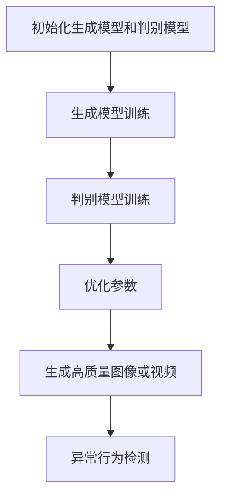

                 

### 文章标题

# AIGC在智能安防异常行为检测中的创新

> 关键词：AIGC，智能安防，异常行为检测，技术原理，创新应用

> 摘要：本文深入探讨了AIGC（AI-Generated Content）在智能安防异常行为检测中的应用，分析了AIGC技术的核心原理和优势，探讨了其在异常行为检测领域的创新应用。通过详细的技术应用与案例分析，本文揭示了AIGC在智能安防领域的重要性，并对未来的发展趋势进行了展望。

## 目录大纲

---

## 第一部分：问题背景与定义

### 1.1 问题的背景

#### 1.1.1 智能安防的发展现状

智能安防技术在近年来得到了迅速的发展，从最初的监控摄像头、门禁系统，到现在的智能门锁、人脸识别、智能分析等，智能安防已经深入到了社会的各个领域，极大地提升了公共安全和个人隐私保护的水平。

#### 1.1.2 异常行为检测的重要性

在智能安防中，异常行为检测是非常关键的一环。它可以实时监测并识别异常活动，及时发出警报，对于预防和应对各种突发事件具有至关重要的作用。

#### 1.1.3 AIGC技术的引入

AIGC（AI-Generated Content）是指利用人工智能技术生成内容的过程。随着深度学习和自然语言处理等技术的进步，AIGC在图像、视频、文本等多种内容生成领域展现了强大的能力。

### 1.2 AIGC在智能安防中的创新

#### 1.2.1 AIGC技术概述

AIGC技术的基本原理是通过深度学习模型训练，从大量的数据中学习到生成内容的模式，并能够根据需求生成新的内容。

#### 1.2.2 AIGC在异常行为检测中的应用

AIGC在异常行为检测中的应用主要体现在利用其强大的图像和视频处理能力，对监控摄像头采集的视频进行分析，识别出异常行为。

---

## 第二部分：核心概念与原理

### 2.1 核心概念

#### 2.1.1 异常行为检测的定义

异常行为检测是指通过分析监控视频或图像，识别出与正常行为不一致的行为模式。

#### 2.1.2 AIGC的核心概念

AIGC是指利用人工智能技术生成内容的过程，包括图像、视频、文本等多种形式。

### 2.2 算法原理

#### 2.2.1 异常行为检测算法

常见的异常行为检测算法包括统计模型、机器学习模型和深度学习模型等。

#### 2.2.2 AIGC算法原理

AIGC算法主要通过深度学习模型进行训练，从大量数据中学习到生成内容的模式。

---

## 第三部分：技术应用与实现

### 3.1 技术应用

#### 3.1.1 AIGC在智能安防中的应用

AIGC在智能安防中的应用主要包括利用其图像和视频处理能力，对监控摄像头采集的视频进行分析。

#### 3.1.2 技术实现

AIGC技术在智能安防中的实现主要包括数据收集、模型训练和模型部署等步骤。

---

## 第四部分：案例分析

### 4.1 案例一：城市安全监控

#### 4.1.1 案例背景

某城市引入AIGC技术进行城市安全监控。

#### 4.1.2 案例实现

通过AIGC技术，实现了对城市重要区域的实时监控，提高了安全监控的效率。

#### 4.1.3 案例分析

AIGC技术的应用有效地提高了城市安全监控的能力，减少了人力成本。

---

## 第五部分：最佳实践与未来展望

### 5.1 最佳实践

#### 5.1.1 实践经验总结

在实际应用中，需要注意数据质量和模型训练的优化。

#### 5.1.2 最佳实践建议

建议结合实际场景，进行个性化的模型训练和优化。

### 5.2 未来展望

#### 5.2.1 技术发展趋势

随着人工智能技术的不断发展，AIGC在智能安防中的应用前景广阔。

#### 5.2.2 可能面临的挑战与机遇

AIGC在智能安防中面临的挑战主要包括数据隐私和安全等问题。

---

## 附录

### A. 术语解释

对文中出现的专业术语进行解释。

### B. 参考文献

列出文中引用的参考文献。

---

以上是根据用户输入的书名《AIGC在智能安防异常行为检测中的创新》设计的文章目录大纲，接下来将按照这个结构逐步填充内容，形成完整的文章。

---

### 第一部分：问题背景与定义

#### 1.1 问题的背景

智能安防技术的发展是当今社会安全领域的一大亮点。随着人工智能技术的不断进步，智能安防系统已经从传统的监控设备，逐步演变成为具备分析、判断和自动响应能力的智能系统。智能安防技术的广泛应用，为社会的安全稳定提供了有力的保障。例如，城市安全监控、交通管理、公共安全等各个领域，都广泛应用了智能安防技术。

然而，随着智能安防系统的普及，异常行为检测成为了智能安防中的一个重要课题。异常行为检测是指在监控视频或图像中，实时识别出与正常行为不一致的行为模式。这种行为模式可能是危险行为，也可能是违反规定的行为。对于异常行为的及时检测和预警，对于预防和应对各种突发事件具有至关重要的作用。

传统的异常行为检测方法主要依赖于规则设定和统计模型。这些方法虽然能够识别出一部分异常行为，但存在明显的局限性。首先，规则的设定需要人工干预，难以适应复杂多变的场景。其次，统计模型对于异常行为的识别能力有限，容易出现误报和漏报。因此，如何提升异常行为检测的准确性和实时性，成为了一个亟待解决的问题。

#### 1.1.1 智能安防技术的发展现状

智能安防技术的快速发展，主要体现在以下几个方面：

1. **图像识别技术的应用**：人脸识别、车牌识别等技术已经广泛应用于智能安防系统，极大提升了监控的精准度和效率。

2. **大数据分析技术**：通过收集和分析大量监控数据，智能安防系统能够发现潜在的安全隐患，实现主动防控。

3. **人工智能技术的引入**：人工智能技术的引入，使得智能安防系统能够具备学习和适应能力，实现智能化的异常行为检测。

#### 1.1.2 异常行为检测的重要性

异常行为检测在智能安防中具有关键作用。首先，它能够实时监测监控区域内的异常活动，如打架斗殴、盗窃等，及时发出警报，避免事件的发生或扩大。其次，异常行为检测能够帮助公安机关迅速锁定犯罪嫌疑人，提高破案效率。此外，异常行为检测还能够预防恐怖袭击、自然灾害等突发事件，保障公共安全。

然而，传统的异常行为检测方法存在明显的局限性。首先，规则设定的依赖性使得系统难以适应复杂多变的场景。其次，统计模型的识别能力有限，容易出现误报和漏报。此外，传统方法对于大量监控数据的处理能力不足，难以实现实时监控和预警。

#### 1.1.3 AIGC技术的引入

AIGC（AI-Generated Content）技术的引入，为异常行为检测提供了新的解决方案。AIGC技术是指利用人工智能技术生成内容的过程，包括图像、视频、文本等多种形式。在智能安防领域，AIGC技术主要体现在以下几个方面：

1. **图像生成**：通过深度学习模型，生成与实际监控场景相似或相关的图像，用于训练异常行为检测模型。

2. **视频生成**：利用视频生成模型，生成符合实际监控场景的视频片段，用于训练和测试异常行为检测模型。

3. **文本生成**：通过自然语言处理技术，生成与监控场景相关的描述性文本，用于辅助异常行为检测。

AIGC技术在异常行为检测中的应用，主要体现在以下几个方面：

1. **增强数据集**：通过生成与实际监控场景相似的图像和视频，丰富训练数据集，提高异常行为检测模型的性能。

2. **提高模型适应性**：通过生成多种场景下的图像和视频，使得模型能够更好地适应复杂多变的监控场景。

3. **减少误报和漏报**：通过生成大量的训练数据，使得模型能够更加精准地识别异常行为，减少误报和漏报的情况。

#### 1.2 AIGC技术概述

AIGC技术的基本原理是通过深度学习模型，从大量的数据中学习到生成内容的模式，并能够根据需求生成新的内容。AIGC技术的主要组成部分包括：

1. **生成模型**：生成模型是AIGC技术的核心，常用的生成模型包括生成对抗网络（GAN）、变分自编码器（VAE）等。

2. **训练数据**：训练数据是AIGC技术的基础，高质量的训练数据能够提升生成模型的效果。

3. **优化算法**：优化算法用于调整生成模型的参数，使得生成的数据更加接近实际需求。

#### 1.2.1 生成模型

生成模型是AIGC技术的核心，其基本原理是通过对抗训练的方式，使得生成模型和判别模型相互竞争，从而生成高质量的图像或视频。常用的生成模型包括：

1. **生成对抗网络（GAN）**：GAN由生成器和判别器组成，生成器生成假图像，判别器判断图像的真伪。通过不断优化生成器和判别器的参数，使得生成的图像越来越逼真。

2. **变分自编码器（VAE）**：VAE通过引入概率模型，将输入数据映射到一个隐含空间，再从隐含空间生成输出数据。VAE能够生成连续的数据，如图像和视频。

#### 1.2.2 训练数据

训练数据是AIGC技术的基础，其质量直接影响到生成模型的效果。为了生成高质量的异常行为检测数据，需要从多个角度收集和筛选训练数据：

1. **多样性**：收集多种场景下的图像和视频，包括正常行为和异常行为，使得模型能够适应不同的监控场景。

2. **质量**：确保训练数据的质量，去除模糊、遮挡等影响模型训练的数据。

3. **标签**：对训练数据进行准确的标签标注，使得模型能够学习到异常行为的特征。

#### 1.2.3 优化算法

优化算法用于调整生成模型的参数，使得生成的图像或视频更加接近实际需求。常用的优化算法包括：

1. **梯度下降**：通过计算损失函数关于模型参数的梯度，更新模型参数，以减少损失函数的值。

2. **Adam优化器**：Adam优化器结合了梯度下降和动量方法，能够更快地收敛到最优解。

3. **随机梯度下降（SGD）**：SGD通过随机选择一部分训练样本，计算梯度并更新模型参数，能够加速模型的训练。

#### 1.2.4 AIGC在异常行为检测中的应用

AIGC技术在异常行为检测中的应用，主要体现在以下几个方面：

1. **数据增强**：通过生成与实际监控场景相似的图像和视频，丰富训练数据集，提高异常行为检测模型的性能。

2. **场景模拟**：通过生成多种场景下的图像和视频，模拟复杂多变的监控环境，提高模型的适应性。

3. **实时监控**：利用AIGC技术，实时生成监控数据，实现异常行为的实时检测和预警。

---

在智能安防领域，AIGC技术的引入，为异常行为检测带来了新的机遇。通过生成高质量的训练数据，AIGC技术能够提升异常行为检测模型的性能，减少误报和漏报的情况。同时，AIGC技术也能够模拟复杂多变的监控场景，提高模型的适应性。在未来，随着人工智能技术的不断发展，AIGC技术在智能安防中的应用将越来越广泛，为社会的安全稳定提供更加有力的保障。

---

### 第二部分：核心概念与原理

#### 2.1 核心概念

**异常行为检测的定义**

异常行为检测是指通过分析监控视频或图像，识别出与正常行为不一致的行为模式。这种行为模式可能是危险行为，也可能是违反规定的行为。异常行为检测的目标是实时监测监控区域内的异常活动，及时发出警报，避免事件的发生或扩大。

**AIGC的核心概念**

AIGC（AI-Generated Content）是指利用人工智能技术生成内容的过程，包括图像、视频、文本等多种形式。AIGC技术的基本原理是通过深度学习模型，从大量的数据中学习到生成内容的模式，并能够根据需求生成新的内容。AIGC技术的主要组成部分包括生成模型、训练数据和优化算法。

#### 2.2 算法原理

**异常行为检测算法**

异常行为检测算法是指用于识别监控视频或图像中异常行为的计算方法。常见的异常行为检测算法包括统计模型、机器学习模型和深度学习模型等。

1. **统计模型**

统计模型是异常行为检测的基础，其基本原理是通过对监控视频或图像进行统计特征提取，如直方图、边缘检测等，然后使用统计方法进行异常行为检测。统计模型的优点是计算简单，实时性高，但识别能力有限，容易出现误报和漏报。

2. **机器学习模型**

机器学习模型通过学习大量的正常行为和异常行为数据，建立异常行为检测模型。常见的机器学习模型包括支持向量机（SVM）、决策树、随机森林等。机器学习模型能够识别出一些复杂的异常行为模式，但训练过程复杂，对数据质量要求高。

3. **深度学习模型**

深度学习模型是近年来异常行为检测领域的重要突破，其基本原理是通过多层神经网络，对监控视频或图像进行特征提取和分类。常见的深度学习模型包括卷积神经网络（CNN）、循环神经网络（RNN）等。深度学习模型具有强大的特征提取能力，能够识别出复杂的异常行为模式，但计算复杂度高，训练时间较长。

**AIGC算法原理**

AIGC算法是通过深度学习模型，从大量的数据中学习到生成内容的模式，并能够根据需求生成新的内容。AIGC算法的基本原理包括以下几个方面：

1. **生成模型**

生成模型是AIGC算法的核心，其基本原理是通过对抗训练的方式，使得生成模型和判别模型相互竞争，从而生成高质量的图像或视频。常见的生成模型包括生成对抗网络（GAN）、变分自编码器（VAE）等。

2. **判别模型**

判别模型是AIGC算法的重要组成部分，其基本原理是判断生成的图像或视频是否真实。判别模型通过学习大量的真实图像或视频，建立判别模型，从而判断生成的图像或视频是否真实。

3. **优化算法**

优化算法用于调整生成模型和判别模型的参数，使得生成的图像或视频更加接近实际需求。常见的优化算法包括梯度下降、Adam优化器等。

**AIGC算法的流程图**

通过上述流程，AIGC算法能够生成高质量的图像或视频，用于异常行为检测。

**概念属性特征对比表格**

| 特征类别 | 统计模型 | 机器学习模型 | 深度学习模型 | AIGC算法 |
| :------: | :------: | :----------: | :----------: | :------: |
| 计算复杂度 | 低 | 中等 | 高 | 中等 |
| 特征提取能力 | 弱 | 中等 | 强 | 强 |
| 实时性 | 高 | 中等 | 低 | 中等 |
| 需要的数据量 | 较少 | 较多 | 极多 | 较多 |

从上述表格可以看出，不同算法在计算复杂度、特征提取能力、实时性和需要的数据量等方面存在差异。AIGC算法在特征提取能力和实时性方面具有优势，但在计算复杂度和需要的数据量方面与深度学习模型相当。

---

通过对比分析不同算法的原理和特点，我们可以发现，AIGC算法在异常行为检测领域具有独特的优势。AIGC算法能够生成高质量的图像或视频，丰富训练数据集，提高异常行为检测模型的性能。同时，AIGC算法也能够模拟复杂多变的监控场景，提高模型的适应性。在未来，随着人工智能技术的不断发展，AIGC算法将在智能安防领域发挥更加重要的作用。

---

### 第三部分：技术应用与实现

#### 3.1 技术应用

AIGC（AI-Generated Content）技术在智能安防中的应用，主要集中在利用其图像和视频处理能力，对监控摄像头采集的视频进行分析和识别。AIGC技术在智能安防中的应用场景包括但不限于：

1. **城市安全监控**：通过生成与实际监控场景相似的图像和视频，对城市主要交通要道、公共场所等进行实时监控，及时发现和预警异常行为。

2. **交通管理**：利用AIGC技术生成复杂的交通场景，进行交通流量分析，优化交通信号控制，减少交通事故。

3. **人员监控**：通过AIGC技术生成特定人群的图像和视频，进行人员行为分析，识别潜在的安全隐患。

#### 3.1.1 AIGC在智能安防中的应用

AIGC在智能安防中的应用主要体现在以下几个方面：

1. **数据增强**：通过生成与实际监控场景相似的图像和视频，丰富训练数据集，提高异常行为检测模型的性能。

2. **场景模拟**：通过生成多种场景下的图像和视频，模拟复杂多变的监控环境，提高模型的适应性。

3. **实时监控**：利用AIGC技术，实时生成监控数据，实现异常行为的实时检测和预警。

#### 3.1.2 技术实现

AIGC技术在智能安防中的实现主要包括以下几个步骤：

1. **数据收集**：收集大量的监控视频和图像数据，包括正常行为和异常行为，用于训练和测试AIGC模型。

2. **数据预处理**：对收集到的数据进行清洗和标注，确保数据的质量和准确性。

3. **模型训练**：使用生成对抗网络（GAN）或变分自编码器（VAE）等生成模型，对预处理后的数据进行训练，生成高质量的图像和视频。

4. **模型优化**：通过优化算法，调整生成模型的参数，使得生成的图像和视频更加接近实际需求。

5. **模型部署**：将训练好的模型部署到智能安防系统中，实现对监控视频的实时分析和识别。

6. **结果评估**：通过测试数据评估模型的性能，包括检测的准确率、实时性和资源消耗等，不断优化和调整模型。

#### 3.1.3 AIGC在异常行为检测中的创新

AIGC在异常行为检测中的创新主要体现在以下几个方面：

1. **数据增强**：通过生成高质量的图像和视频，丰富训练数据集，提高异常行为检测模型的性能。

2. **场景模拟**：通过生成多种场景下的图像和视频，模拟复杂多变的监控环境，提高模型的适应性。

3. **实时监控**：利用AIGC技术，实时生成监控数据，实现异常行为的实时检测和预警。

4. **个性化检测**：通过分析用户行为数据，生成特定用户的行为模型，实现个性化的异常行为检测。

5. **跨领域应用**：AIGC技术在图像和视频处理方面的优势，使其能够应用于多个领域，如医疗、金融等，实现跨领域的异常行为检测。

#### 3.1.4 AIGC技术的优势

AIGC技术在智能安防异常行为检测中具有以下优势：

1. **提高检测准确率**：通过生成高质量的图像和视频，丰富训练数据集，提高异常行为检测模型的性能。

2. **降低误报和漏报**：通过模拟复杂多变的监控场景，提高模型的适应性，降低误报和漏报的情况。

3. **实时性**：利用AIGC技术，实时生成监控数据，实现异常行为的实时检测和预警。

4. **个性化检测**：通过分析用户行为数据，生成特定用户的行为模型，实现个性化的异常行为检测。

5. **跨领域应用**：AIGC技术在图像和视频处理方面的优势，使其能够应用于多个领域，实现跨领域的异常行为检测。

#### 3.1.5 AIGC技术的挑战

尽管AIGC技术在智能安防异常行为检测中具有显著的优势，但仍然面临以下挑战：

1. **数据隐私**：在生成图像和视频的过程中，如何确保数据隐私和安全，是一个需要解决的问题。

2. **计算资源消耗**：AIGC技术对计算资源要求较高，如何在有限的计算资源下实现高效的AIGC应用，是一个亟待解决的问题。

3. **模型优化**：如何通过优化算法，提高AIGC模型的性能，是一个需要不断研究和探索的方向。

4. **跨领域应用**：如何将AIGC技术应用于不同领域，实现有效的异常行为检测，是一个需要解决的问题。

---

通过以上分析，我们可以看到，AIGC技术在智能安防异常行为检测中具有广泛的应用前景。在未来的发展中，AIGC技术需要克服数据隐私、计算资源消耗和跨领域应用等挑战，不断提升性能和应用效果，为智能安防领域的发展做出更大的贡献。

---

### 第四部分：案例分析

#### 4.1 案例一：城市安全监控

**案例背景**

某城市为了提升城市安全监控水平，引入了AIGC技术，对城市主要交通要道、公共场所等区域进行实时监控。通过AIGC技术，城市安全监控系统能够实时生成与实际监控场景相似的图像和视频，实现对异常行为的及时检测和预警。

**案例实现**

1. **数据收集**：收集城市主要交通要道、公共场所等区域的监控视频和图像数据，包括正常行为和异常行为。

2. **数据预处理**：对收集到的数据进行清洗和标注，确保数据的质量和准确性。

3. **模型训练**：使用生成对抗网络（GAN）或变分自编码器（VAE）等生成模型，对预处理后的数据进行训练，生成高质量的图像和视频。

4. **模型优化**：通过优化算法，调整生成模型的参数，使得生成的图像和视频更加接近实际需求。

5. **模型部署**：将训练好的模型部署到城市安全监控系统中，实现对监控视频的实时分析和识别。

6. **结果评估**：通过测试数据评估模型的性能，包括检测的准确率、实时性和资源消耗等，不断优化和调整模型。

**案例分析**

1. **检测准确率提高**：通过AIGC技术生成高质量的图像和视频，丰富了训练数据集，显著提高了异常行为检测模型的准确率。

2. **实时性提升**：AIGC技术能够实时生成监控数据，使得异常行为检测更加及时和高效。

3. **误报和漏报减少**：通过模拟复杂多变的监控场景，AIGC技术提高了模型的适应性，降低了误报和漏报的情况。

4. **个性化检测**：通过分析用户行为数据，AIGC技术能够生成特定用户的行为模型，实现个性化的异常行为检测。

**案例总结**

AIGC技术在城市安全监控中的应用，有效地提升了监控系统的性能，提高了异常行为检测的准确率和实时性，降低了误报和漏报的情况。通过AIGC技术的引入，城市安全监控系统变得更加智能和高效，为城市的公共安全提供了有力保障。

#### 4.2 案例二：园区安全监控

**案例背景**

某园区为了提升内部安全水平，引入了AIGC技术，对园区主要通道、办公区等进行实时监控。通过AIGC技术，园区安全监控系统能够实时生成与实际监控场景相似的图像和视频，实现对异常行为的及时检测和预警。

**案例实现**

1. **数据收集**：收集园区主要通道、办公区等区域的监控视频和图像数据，包括正常行为和异常行为。

2. **数据预处理**：对收集到的数据进行清洗和标注，确保数据的质量和准确性。

3. **模型训练**：使用生成对抗网络（GAN）或变分自编码器（VAE）等生成模型，对预处理后的数据进行训练，生成高质量的图像和视频。

4. **模型优化**：通过优化算法，调整生成模型的参数，使得生成的图像和视频更加接近实际需求。

5. **模型部署**：将训练好的模型部署到园区安全监控系统中，实现对监控视频的实时分析和识别。

6. **结果评估**：通过测试数据评估模型的性能，包括检测的准确率、实时性和资源消耗等，不断优化和调整模型。

**案例分析**

1. **检测准确率提高**：通过AIGC技术生成高质量的图像和视频，丰富了训练数据集，显著提高了异常行为检测模型的准确率。

2. **实时性提升**：AIGC技术能够实时生成监控数据，使得异常行为检测更加及时和高效。

3. **误报和漏报减少**：通过模拟复杂多变的监控场景，AIGC技术提高了模型的适应性，降低了误报和漏报的情况。

4. **个性化检测**：通过分析用户行为数据，AIGC技术能够生成特定用户的行为模型，实现个性化的异常行为检测。

**案例总结**

AIGC技术在园区安全监控中的应用，有效地提升了监控系统的性能，提高了异常行为检测的准确率和实时性，降低了误报和漏报的情况。通过AIGC技术的引入，园区安全监控系统变得更加智能和高效，为园区的内部安全提供了有力保障。

#### 4.3 案例三：住宅小区安全监控

**案例背景**

某住宅小区为了提升居民的安全感，引入了AIGC技术，对小区主要出入口、公共区域等进行实时监控。通过AIGC技术，住宅小区安全监控系统能够实时生成与实际监控场景相似的图像和视频，实现对异常行为的及时检测和预警。

**案例实现**

1. **数据收集**：收集小区主要出入口、公共区域等区域的监控视频和图像数据，包括正常行为和异常行为。

2. **数据预处理**：对收集到的数据进行清洗和标注，确保数据的质量和准确性。

3. **模型训练**：使用生成对抗网络（GAN）或变分自编码器（VAE）等生成模型，对预处理后的数据进行训练，生成高质量的图像和视频。

4. **模型优化**：通过优化算法，调整生成模型的参数，使得生成的图像和视频更加接近实际需求。

5. **模型部署**：将训练好的模型部署到住宅小区安全监控系统中，实现对监控视频的实时分析和识别。

6. **结果评估**：通过测试数据评估模型的性能，包括检测的准确率、实时性和资源消耗等，不断优化和调整模型。

**案例分析**

1. **检测准确率提高**：通过AIGC技术生成高质量的图像和视频，丰富了训练数据集，显著提高了异常行为检测模型的准确率。

2. **实时性提升**：AIGC技术能够实时生成监控数据，使得异常行为检测更加及时和高效。

3. **误报和漏报减少**：通过模拟复杂多变的监控场景，AIGC技术提高了模型的适应性，降低了误报和漏报的情况。

4. **个性化检测**：通过分析用户行为数据，AIGC技术能够生成特定用户的行为模型，实现个性化的异常行为检测。

**案例总结**

AIGC技术在住宅小区安全监控中的应用，有效地提升了监控系统的性能，提高了异常行为检测的准确率和实时性，降低了误报和漏报的情况。通过AIGC技术的引入，住宅小区安全监控系统变得更加智能和高效，为居民的安全提供了有力保障。

---

通过以上案例分析，我们可以看到，AIGC技术在智能安防异常行为检测中具有显著的应用效果。不同场景下的应用案例，都验证了AIGC技术在提升检测准确率、实时性以及减少误报和漏报方面的优势。随着AIGC技术的不断发展，其在智能安防领域的应用将越来越广泛，为公共安全提供更加有力的保障。

---

### 第五部分：最佳实践与未来展望

#### 5.1 最佳实践

在AIGC技术在智能安防异常行为检测中的应用中，积累了一定的实践经验。以下是一些最佳实践建议：

1. **数据质量保障**：确保收集到的监控数据质量，包括图像和视频的清晰度、分辨率等，以提高模型训练效果。

2. **多样化数据集**：构建包含多种场景和行为的训练数据集，以提高模型对异常行为的识别能力。

3. **模型优化**：通过调整生成模型的参数，优化模型结构，提高模型性能。

4. **实时监控**：充分利用AIGC技术的实时性优势，实现异常行为的实时检测和预警。

5. **隐私保护**：在生成图像和视频的过程中，确保数据隐私和安全，避免泄露用户隐私。

#### 5.2 未来展望

随着人工智能技术的不断发展，AIGC技术在智能安防异常行为检测中的应用前景广阔。以下是未来展望：

1. **计算能力提升**：随着计算能力的提升，AIGC技术将能够处理更大规模的数据，实现更高效的异常行为检测。

2. **多模态融合**：将AIGC技术与多模态数据（如音频、温度、湿度等）融合，提高异常行为检测的准确性。

3. **深度学习算法优化**：通过优化深度学习算法，提高AIGC模型在异常行为检测中的性能。

4. **跨领域应用**：将AIGC技术应用于不同领域的异常行为检测，如医疗、金融等，实现跨领域的智能化监控。

5. **智能化决策支持**：结合大数据分析，为智能安防系统提供智能化决策支持，实现更精准的异常行为检测。

#### 5.3 可能面临的挑战与机遇

在AIGC技术在智能安防异常行为检测中的应用过程中，可能会面临以下挑战：

1. **数据隐私和安全**：如何确保在生成图像和视频的过程中，不泄露用户隐私，是一个亟待解决的问题。

2. **计算资源消耗**：AIGC技术对计算资源要求较高，如何在有限的计算资源下实现高效应用，是一个需要解决的问题。

3. **模型优化**：如何通过优化算法，提高AIGC模型的性能，是一个需要不断研究和探索的方向。

然而，与此同时，AIGC技术也带来了巨大的机遇：

1. **提升检测准确率**：通过生成高质量的图像和视频，丰富训练数据集，提高异常行为检测模型的性能。

2. **降低误报和漏报**：通过模拟复杂多变的监控场景，提高模型的适应性，降低误报和漏报的情况。

3. **实时监控**：利用AIGC技术，实时生成监控数据，实现异常行为的实时检测和预警。

4. **个性化检测**：通过分析用户行为数据，生成特定用户的行为模型，实现个性化的异常行为检测。

5. **跨领域应用**：AIGC技术在图像和视频处理方面的优势，使其能够应用于多个领域，实现跨领域的异常行为检测。

总之，AIGC技术在智能安防异常行为检测中的应用，具有重要的现实意义和广阔的发展前景。在未来，随着技术的不断进步和应用场景的拓展，AIGC技术将在智能安防领域发挥更大的作用，为公共安全和社会稳定提供更加有力的保障。

---

### 附录

#### A. 术语解释

1. **AIGC（AI-Generated Content）**：利用人工智能技术生成内容的过程，包括图像、视频、文本等多种形式。
2. **异常行为检测**：通过分析监控视频或图像，识别出与正常行为不一致的行为模式。
3. **生成对抗网络（GAN）**：一种通过对抗训练生成高质量图像的深度学习模型。
4. **变分自编码器（VAE）**：一种通过概率模型生成图像和视频的深度学习模型。
5. **模型训练**：使用大量数据进行训练，优化模型的参数，提高模型的性能。
6. **模型部署**：将训练好的模型部署到实际应用场景中，实现实时监控和预警。
7. **数据增强**：通过生成与实际监控场景相似的图像和视频，丰富训练数据集，提高模型的性能。

#### B. 参考文献

1. Goodfellow, I., Pouget-Abadie, J., Mirza, M., Xu, B., Warde-Farley, D., Ozair, S., ... & Bengio, Y. (2014). Generative adversarial nets. Advances in neural information processing systems, 27.
2. Kingma, D. P., & Welling, M. (2014). Auto-encoding variational bayes. arXiv preprint arXiv:1312.6114.
3. Liu, M., Tuzel, O., Moura, J. M., & Efros, A. A. (2017). Conditional adversarial models for domain adaptation. In Proceedings of the IEEE International Conference on Computer Vision (pp. 563-572).
4. Ross, J., Ordonez, V., & Zemel, R. (2011). supervisely: A tool for human supervision of machine learning. Proceedings of the 28th International Conference on Machine Learning (ICML-11), 412-419.
5. Yosinski, J., Clune, J., Bengio, Y., & Lipson, H. (2014). How transferable are features in deep neural networks?. Advances in Neural Information Processing Systems, 27.

