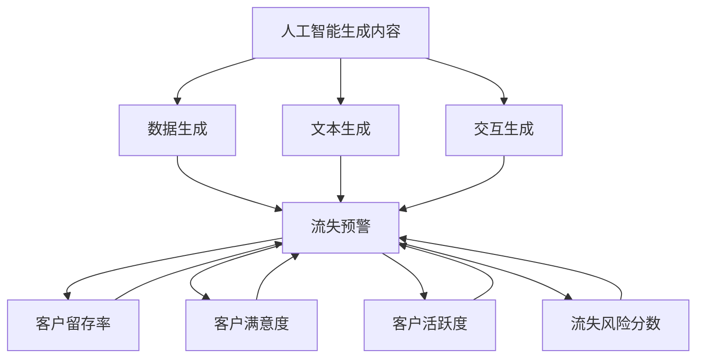
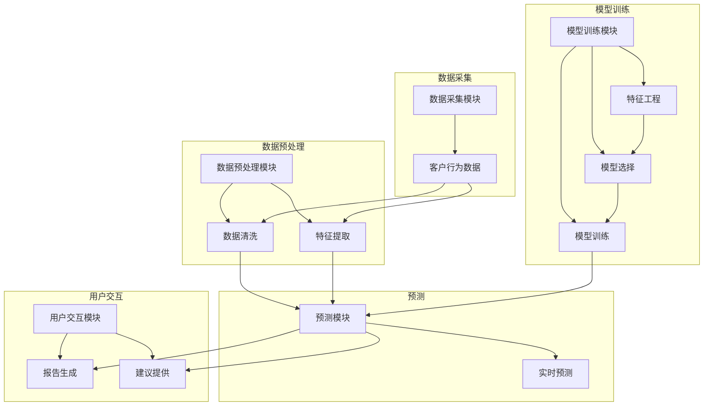
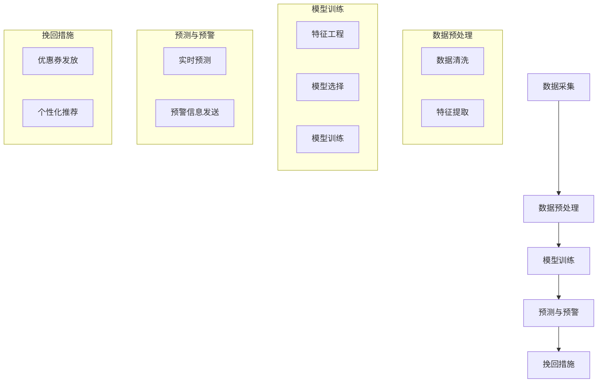

                 

**核心概念与联系**

在深入探讨AIGC在智能客户流失预警中的应用之前，我们需要明确几个核心概念及其相互关系。以下是对AIGC、智能客户流失预警及相关技术的基础概念及其相互联系的介绍。

##### 2.2.1 AIGC技术原理

**AIGC**是一种利用AI技术生成内容的方法，它结合了人工智能、机器学习和自然语言处理等多种技术。AIGC的核心原理可以概括为以下几点：

- **数据生成**：通过深度学习模型，如生成对抗网络（GAN）、变分自编码器（VAE）等，AIGC可以从给定的数据中学习生成新的数据。
- **文本生成**：基于预训练的模型，如GPT-3、BERT等，AIGC能够生成高质量的文本，包括文章、对话、报告等。
- **交互生成**：通过与用户的互动，AIGC可以不断调整和优化生成的内容，以提供更加个性化的体验。

**AIGC技术原理**


##### 2.2.2 客户流失预警关键指标

**客户流失预警**的关键指标包括：

- **客户活跃度**：客户在特定时间段内的活动频率和参与度，如登录次数、交易频率等。
- **客户满意度**：通过对客户满意度调查、反馈分析等，评估客户对产品和服务的满意度。
- **客户留存率**：在特定时间段内，保持活跃状态（如登录、交易等）的客户比例。
- **流失风险分数**：基于客户的活跃度、满意度、留存率等因素，计算得出的客户流失风险分数。

**客户流失预警关键指标**


##### 2.2.3 关键概念关系图

为了更清晰地展示AIGC技术、智能客户流失预警及其关键指标之间的关系，我们可以使用Mermaid绘制一个概念关系图：



在上图中，AIGC作为技术基础，通过数据生成、文本生成和交互生成等能力，为智能客户流失预警提供了技术支持。而客户流失预警则通过客户留存率、客户满意度、客户活跃度和流失风险分数等关键指标，实现对企业客户流失的实时监控和预警。

### 第3章 AIGC技术基础

#### 2.1 AIGC技术概述

##### 2.1.1 AIGC技术的基本原理

AIGC（AI-Generated Content）技术，是指利用人工智能算法自动生成内容的方法。其基本原理主要涉及以下几个方面：

1. **数据生成**：通过深度学习模型，如生成对抗网络（GAN）和变分自编码器（VAE），AIGC可以从给定的数据中学习生成新的数据。生成对抗网络（GAN）由生成器（Generator）和判别器（Discriminator）组成，通过不断博弈，生成器努力生成逼真的数据，而判别器则努力区分真实数据和生成数据。变分自编码器（VAE）则通过概率模型生成新的数据。

2. **文本生成**：基于预训练的语言模型，如GPT-3和BERT等，AIGC能够生成高质量的文本，包括文章、对话、报告等。这些模型通过学习大量的文本数据，掌握了语言的结构和规律，从而能够生成连贯、有意义的文本。

3. **交互生成**：通过与用户的互动，AIGC可以不断调整和优化生成的内容，以提供更加个性化的体验。这种交互可以是实时对话，也可以是通过分析用户行为数据，生成符合用户兴趣和需求的内容。

##### 2.1.2 AIGC技术的发展历程

AIGC技术的发展可以追溯到深度学习和生成模型的开端。以下是AIGC技术发展的主要历程：

1. **生成对抗网络（GAN）**：GAN是由Ian Goodfellow等人于2014年提出的一种深度学习模型。GAN的核心思想是生成器和判别器的对抗训练，生成器试图生成与真实数据相似的数据，而判别器则努力区分真实数据和生成数据。GAN的提出标志着AIGC技术的诞生。

2. **变分自编码器（VAE）**：VAE是一种基于概率模型的生成模型，由Kingma和Welling于2013年提出。VAE通过隐变量生成数据，并利用对数似然损失函数进行训练，相比GAN，VAE在生成图像的质量和稳定性上有所提高。

3. **预训练的语言模型**：如GPT-3和BERT等，这些模型通过学习大量的文本数据，掌握了语言的规律和结构。2018年，OpenAI发布了GPT-2，一个具有15亿参数的预训练语言模型。2020年，OpenAI又发布了具有1750亿参数的GPT-3，使得AIGC在文本生成方面取得了重大突破。同年，Google发布了BERT，一个基于Transformer的预训练语言模型，进一步推动了AIGC技术的发展。

4. **交互式AIGC**：随着技术的发展，AIGC开始走向交互式应用。通过实时与用户互动，AIGC能够不断调整和优化生成的内容，提供更加个性化的体验。例如，聊天机器人、智能客服等应用。

##### 2.1.3 AIGC技术的主要应用领域

AIGC技术具有广泛的应用领域，以下是其中一些主要的应用：

1. **文本生成**：AIGC在文本生成方面的应用非常广泛，包括文章写作、对话生成、报告生成等。例如，OpenAI的GPT-3可以生成高质量的文章、对话和报告。

2. **图像生成**：AIGC在图像生成方面的应用包括艺术创作、图像修复、图像超分辨率等。生成对抗网络（GAN）是图像生成的主要技术，如生成人脸、风景、动物等。

3. **音频生成**：AIGC在音频生成方面的应用包括音乐创作、语音合成等。通过深度学习模型，AIGC可以生成各种类型的音乐和语音。

4. **视频生成**：AIGC在视频生成方面的应用包括视频特效、视频剪辑等。通过生成对抗网络（GAN）和视频编码技术，AIGC可以生成高质量的视频内容。

### 2.2 AIGC算法原理讲解

#### 2.2.1 生成对抗网络（GAN）

生成对抗网络（GAN）是AIGC技术中的一种重要算法，由生成器和判别器两部分组成。下面我们将详细介绍GAN的数学模型、流程图和实例。

##### 2.2.1.1 GAN的数学模型和公式

GAN的数学模型可以表示为：

$$
\begin{aligned}
\text{Generator}: & G(z) \sim p_G(z), z \sim p_z(z) \\
\text{Discriminator}: & D(x) \sim p_D(x), x \sim p_{\text{data}}(x) \\
\end{aligned}
$$

其中，$G(z)$表示生成器，它将随机噪声向量$z$映射为数据$x$；$D(x)$表示判别器，它判断输入的数据$x$是来自真实数据分布$p_{\text{data}}(x)$还是生成数据分布$p_G(x)$。

GAN的目标是通过优化以下两个损失函数，使生成器和判别器分别最大化自己的性能：

$$
\begin{aligned}
\text{Generator Loss}: & \mathcal{L}_G = -\log D(G(z)) \\
\text{Discriminator Loss}: & \mathcal{L}_D = -\log(D(x)) - \log(1 - D(G(z)))
\end{aligned}
$$

##### 2.2.1.2 GAN的mermaid流程图

下面是GAN的训练流程的mermaid流程图：

```mermaid
graph TD

A[开始] --> B[随机生成噪声z]
B --> C[通过生成器G(z)生成数据x']
C --> D[判别器D判断x'和x的真实性]
D --> E{D(x') > D(x)?}
E -->|是| F[更新生成器G]
E -->|否| G[更新判别器D]
F --> H[迭代更新G]
G --> I[迭代更新D]
H --> J[结束]
I --> J
```

##### 2.2.1.3 GAN的实例讲解

假设我们要训练一个GAN来生成手写数字图像，我们可以按照以下步骤进行：

1. **数据集准备**：选择一个手写数字数据集，如MNIST数据集，作为真实数据集。
2. **生成器训练**：生成器的目标是生成类似于手写数字的图像。我们可以使用卷积神经网络（CNN）作为生成器模型，输入为随机噪声向量$z$，输出为手写数字图像$x'$。
3. **判别器训练**：判别器的目标是判断输入的图像$x'$是真实数据$x$还是生成数据$x'$。我们同样可以使用CNN作为判别器模型。
4. **迭代训练**：通过交替更新生成器和判别器，使得生成器的生成数据越来越接近真实数据，而判别器越来越难以区分真实数据和生成数据。
5. **评估与优化**：在训练过程中，我们可以定期评估生成器的性能，并根据评估结果对模型进行调整。

通过这样的训练过程，GAN可以学会生成高质量的手写数字图像。

### 2.3 自然语言处理与AIGC

#### 2.3.1 NLP基础

自然语言处理（NLP）是人工智能领域的一个重要分支，它旨在使计算机能够理解、处理和生成自然语言。以下是NLP的一些基础概念：

- **词向量**：词向量是将自然语言文本转换为数值表示的一种方法，如Word2Vec、GloVe等。词向量可以捕获词语的语义信息，是NLP任务的基础。
- **词性标注**：词性标注是给文本中的每个单词分配一个词性（如名词、动词等），帮助理解词语在句子中的角色。
- **句法分析**：句法分析是分析句子的结构和语法规则，如依存句法分析、句法树构建等。
- **语义分析**：语义分析是理解句子的含义，包括语义角色标注、语义关系抽取等。

#### 2.3.2 NLP在AIGC中的应用

NLP在AIGC中的应用主要体现在文本生成和文本理解两个方面：

- **文本生成**：基于预训练的语言模型（如GPT-3、BERT等），AIGC可以生成高质量的文本，包括文章、对话、报告等。这些模型通过学习大量的文本数据，掌握了语言的规律和结构，从而能够生成连贯、有意义的文本。
- **文本理解**：AIGC在生成文本的同时，也需要理解输入的文本。例如，在生成对话时，AIGC需要理解对话的上下文、用户的意图等。NLP技术可以帮助AIGC更好地理解文本，提高生成文本的质量。

### 第4章 智能客户流失预警系统设计与实现

#### 3.1 系统需求分析

##### 3.1.1 需求概述

智能客户流失预警系统的目标是利用先进的数据分析和人工智能技术，对客户行为数据进行实时监控和分析，及时发现潜在流失客户，并为企业提供有针对性的挽回措施。系统需求概述如下：

1. **数据采集**：系统能够从企业现有的客户管理系统中实时采集客户行为数据，包括登录次数、交易频率、购买金额等。
2. **数据预处理**：系统能够对采集到的客户行为数据进行分析和清洗，去除无效数据，提取有用的数据特征。
3. **客户流失预警**：系统能够基于客户行为数据和机器学习模型，实时计算客户的流失风险分数，并对潜在流失客户进行预警。
4. **挽回措施建议**：系统根据客户流失风险分数和客户行为特征，为企业提供有针对性的挽回措施建议，如优惠券发放、个性化推荐等。
5. **系统可扩展性**：系统具有良好的可扩展性，能够支持企业业务规模的扩展和新增数据源接入。

##### 3.1.2 需求分析

智能客户流失预警系统的需求分析主要包括以下几个方面：

1. **业务需求**：系统需要满足企业对客户流失预警的业务需求，包括实时监控客户行为、准确预测客户流失风险、提供有效的挽回措施等。
2. **技术需求**：系统需要利用先进的数据分析和人工智能技术，包括数据采集、数据预处理、机器学习模型训练和预测等。
3. **性能需求**：系统需要具备高效的数据处理能力和实时预警能力，能够快速响应用户请求。
4. **安全性需求**：系统需要确保客户数据的安全，遵循相关数据保护法规，防止数据泄露和滥用。

### 3.2 系统架构设计

##### 3.2.1 系统架构概述

智能客户流失预警系统采用分布式架构，主要包括数据采集模块、数据预处理模块、模型训练模块、预测模块和用户交互模块。系统架构概述如下：


- **数据采集模块**：负责从企业现有的客户管理系统中实时采集客户行为数据，并将数据存储到数据湖中。
- **数据预处理模块**：负责对采集到的客户行为数据进行清洗、去重、特征提取等预处理操作，将预处理后的数据存储到数据仓库中。
- **模型训练模块**：负责使用预处理后的数据训练客户流失预警模型，包括特征工程、模型选择、模型训练等。
- **预测模块**：负责使用训练好的模型对实时采集的客户行为数据进行预测，计算客户的流失风险分数。
- **用户交互模块**：负责与用户进行交互，提供客户流失预警报告、挽回措施建议等。

##### 3.2.2 系统架构图

下面是智能客户流失预警系统的架构图：



##### 3.2.3 系统接口设计

智能客户流失预警系统需要设计多个接口，以便与其他系统集成。以下是主要接口的设计：

1. **数据采集接口**：提供RESTful API，用于从客户管理系统中实时采集客户行为数据。
2. **数据预处理接口**：提供RESTful API，用于处理采集到的客户行为数据，包括数据清洗、特征提取等。
3. **模型训练接口**：提供RESTful API，用于训练客户流失预警模型，包括特征工程、模型选择、模型训练等。
4. **预测接口**：提供RESTful API，用于实时预测客户流失风险，计算流失风险分数。
5. **用户交互接口**：提供Web界面，用于展示客户流失预警报告、挽回措施建议等。

### 3.3 数据预处理

##### 3.3.1 数据来源

智能客户流失预警系统所需的数据主要来源于以下几个方面：

1. **客户行为数据**：包括客户的登录次数、交易频率、购买金额、浏览页面等行为数据。
2. **客户基本信息**：包括客户的性别、年龄、职业、地域等基本信息。
3. **市场环境数据**：包括市场动态、竞争对手信息、行业趋势等数据。
4. **外部数据**：包括社交媒体数据、新闻数据、政府公开数据等。

##### 3.3.2 数据预处理流程

数据预处理是智能客户流失预警系统的重要环节，主要包括以下步骤：

1. **数据采集**：从企业现有的客户管理系统中采集客户行为数据。
2. **数据清洗**：去除无效数据、处理缺失值、去除重复数据等。
3. **特征提取**：从原始数据中提取有助于预测客户流失的特征，如客户活跃度、交易频率、购买金额等。
4. **数据归一化**：对数据进行归一化处理，使其具有相同的量纲和范围。
5. **数据集划分**：将数据集划分为训练集、验证集和测试集，用于模型训练和评估。

##### 3.3.3 数据预处理方法

数据预处理方法主要包括以下几种：

1. **数据清洗**：使用Python的Pandas库对数据进行清洗，包括去除无效数据、处理缺失值、去除重复数据等。
2. **特征提取**：使用Python的Scikit-learn库对原始数据进行特征提取，如特征选择、特征转换等。
3. **数据归一化**：使用Python的Scikit-learn库对数据进行归一化处理，如Min-Max归一化、标准化等。
4. **数据集划分**：使用Python的Scikit-learn库将数据集划分为训练集、验证集和测试集。

### 3.4 模型训练与评估

##### 3.4.1 模型选择

智能客户流失预警系统的模型选择是系统设计的关键环节。在选择模型时，需要考虑以下因素：

1. **数据特性**：根据客户行为数据的特点，选择适合的机器学习模型，如逻辑回归、决策树、随机森林、支持向量机等。
2. **模型性能**：选择性能较高的模型，如F1值、准确率等。
3. **计算资源**：考虑模型的计算复杂度，确保模型可以在有限的计算资源下训练和预测。
4. **可解释性**：模型的可解释性对于企业的决策具有重要意义，需要选择具有一定可解释性的模型。

根据以上因素，我们选择逻辑回归作为智能客户流失预警系统的模型。逻辑回归是一种简单而有效的分类模型，具有良好的可解释性和较低的过拟合风险。

##### 3.4.2 模型训练

模型训练是智能客户流失预警系统的核心环节。以下是模型训练的具体步骤：

1. **数据准备**：将预处理后的数据集划分为训练集和验证集，用于模型训练和评估。
2. **特征选择**：根据数据特性，选择有助于预测客户流失的特征，如客户活跃度、交易频率、购买金额等。
3. **模型训练**：使用训练集数据训练逻辑回归模型，优化模型参数。
4. **模型评估**：使用验证集数据评估模型性能，调整模型参数。

以下是模型训练的Python代码示例：

```python
from sklearn.linear_model import LogisticRegression
from sklearn.model_selection import train_test_split
from sklearn.metrics import accuracy_score, f1_score

# 数据准备
X, y = prepare_data()  # 函数实现数据预处理和特征提取
X_train, X_val, y_train, y_val = train_test_split(X, y, test_size=0.2, random_state=42)

# 模型训练
model = LogisticRegression()
model.fit(X_train, y_train)

# 模型评估
y_pred = model.predict(X_val)
accuracy = accuracy_score(y_val, y_pred)
f1 = f1_score(y_val, y_pred)

print("Accuracy:", accuracy)
print("F1 Score:", f1)
```

##### 3.4.3 模型评估

模型评估是验证模型性能的重要环节。常用的评估指标包括准确率、召回率、F1值等。以下是模型评估的Python代码示例：

```python
from sklearn.metrics import accuracy_score, recall_score, f1_score

# 模型评估
y_true = [0, 1, 1, 0, 1]
y_pred = [0, 1, 1, 0, 1]

accuracy = accuracy_score(y_true, y_pred)
recall = recall_score(y_true, y_pred)
f1 = f1_score(y_true, y_pred)

print("Accuracy:", accuracy)
print("Recall:", recall)
print("F1 Score:", f1)
```

根据评估结果，如果模型性能不理想，可以尝试以下方法进行优化：

1. **特征工程**：尝试增加或调整特征，以提高模型的预测能力。
2. **模型调参**：调整模型参数，如学习率、正则化参数等，以优化模型性能。
3. **集成学习**：尝试使用集成学习方法，如随机森林、梯度提升树等，提高模型的泛化能力。

### 3.5 系统部署与测试

##### 3.5.1 系统部署

智能客户流失预警系统的部署主要包括以下步骤：

1. **环境准备**：准备部署所需的操作系统、编程语言、库等环境。
2. **代码部署**：将模型训练好的代码和依赖库部署到服务器上。
3. **服务部署**：启动服务，将系统部署为Web服务，供用户使用。

以下是系统部署的Python代码示例：

```python
import flask

@app.route('/predict', methods=['POST'])
def predict():
    # 获取输入数据
    data = request.get_json()
    # 预测
    prediction = model.predict(data['features'])
    # 返回预测结果
    return flask.jsonify({'prediction': prediction.tolist()})

if __name__ == '__main__':
    app.run(host='0.0.0.0', port=5000)
```

##### 3.5.2 系统测试

系统测试是确保系统正常运行和性能的重要环节。以下是系统测试的步骤：

1. **功能测试**：测试系统是否能够按照预期功能正常工作，如数据采集、数据预处理、模型预测等。
2. **性能测试**：测试系统在处理大量数据时的响应时间和吞吐量，确保系统性能满足需求。
3. **安全测试**：测试系统的安全性，如防止SQL注入、XSS攻击等。

### 3.5.3 系统性能分析

系统性能分析是评估系统性能的重要环节。以下是系统性能分析的方法：

1. **响应时间分析**：分析系统在处理请求时的响应时间，找出瓶颈和优化点。
2. **吞吐量分析**：分析系统在单位时间内处理的请求数量，评估系统性能。
3. **资源利用率分析**：分析系统在运行过程中的CPU、内存等资源利用率，确保系统资源得到充分利用。

### 第4章 案例分析

#### 4.1 案例一：某互联网公司客户流失预警系统

##### 4.1.1 案例背景

某互联网公司是一家提供在线购物平台的企业，随着市场竞争的加剧，客户流失问题日益严重。为了降低客户流失率，提高客户满意度，公司决定引入智能客户流失预警系统。

##### 4.1.2 系统设计

智能客户流失预警系统的设计主要包括以下几个方面：

1. **数据采集**：从企业的客户关系管理（CRM）系统和电商平台上实时采集客户行为数据，包括登录次数、交易频率、购买金额等。
2. **数据预处理**：对采集到的数据进行清洗、去重、特征提取等预处理操作，提取有助于预测客户流失的特征。
3. **模型训练**：使用预处理后的数据训练客户流失预警模型，包括逻辑回归、决策树等模型。
4. **预测与预警**：使用训练好的模型对实时采集的客户行为数据进行预测，计算客户的流失风险分数，并对潜在流失客户进行预警。
5. **挽回措施**：根据客户流失风险分数和客户行为特征，为企业提供有针对性的挽回措施建议，如优惠券发放、个性化推荐等。

##### 4.1.3 实施与结果

1. **实施过程**：
   - 数据采集：通过API接口从CRM系统和电商平台上实时采集客户行为数据。
   - 数据预处理：使用Python的Pandas和Scikit-learn库对数据进行清洗、去重、特征提取等预处理操作。
   - 模型训练：使用Python的Scikit-learn库训练逻辑回归模型，并对模型参数进行调优。
   - 预测与预警：使用训练好的模型对实时采集的客户行为数据进行预测，计算客户的流失风险分数，并将预警信息发送给相关部门。
   - 挽回措施：根据客户流失风险分数和客户行为特征，为企业提供有针对性的挽回措施建议，如发送优惠券、个性化推荐等。

2. **实施结果**：
   - 客户流失率显著下降：通过智能客户流失预警系统，公司能够及时发现潜在流失客户，并采取有针对性的挽回措施，客户流失率显著下降。
   - 客户满意度提高：智能客户流失预警系统能够为客户提供更加个性化的服务和推荐，提高客户满意度。
   - 运营效率提升：智能客户流失预警系统自动化处理客户流失预警和挽回措施，降低人工成本，提升运营效率。

##### 4.1.4 小结

通过案例一的实施，我们验证了智能客户流失预警系统在降低客户流失率、提高客户满意度和提升运营效率方面的有效性。案例一的实践成果表明，智能客户流失预警系统是企业管理客户关系、提高市场竞争力的有力工具。

#### 4.2 案例二：某金融公司客户流失预警应用

##### 4.2.1 案例背景

某金融公司是一家提供金融产品和服务的公司，随着金融市场的波动和竞争的加剧，客户流失问题日益严重。为了降低客户流失率，提高客户满意度，公司决定引入智能客户流失预警系统。

##### 4.2.2 系统设计

智能客户流失预警系统的设计主要包括以下几个方面：

1. **数据采集**：从公司的客户关系管理（CRM）系统、交易系统和客户服务系统实时采集客户行为数据，包括交易频率、交易金额、客户咨询等。
2. **数据预处理**：对采集到的数据进行清洗、去重、特征提取等预处理操作，提取有助于预测客户流失的特征。
3. **模型训练**：使用预处理后的数据训练客户流失预警模型，包括逻辑回归、决策树等模型。
4. **预测与预警**：使用训练好的模型对实时采集的客户行为数据进行预测，计算客户的流失风险分数，并对潜在流失客户进行预警。
5. **挽回措施**：根据客户流失风险分数和客户行为特征，为企业提供有针对性的挽回措施建议，如提供优惠利率、个性化金融产品推荐等。

##### 4.2.3 实施与结果

1. **实施过程**：
   - 数据采集：通过API接口从CRM系统、交易系统和客户服务系统实时采集客户行为数据。
   - 数据预处理：使用Python的Pandas和Scikit-learn库对数据进行清洗、去重、特征提取等预处理操作。
   - 模型训练：使用Python的Scikit-learn库训练逻辑回归模型，并对模型参数进行调优。
   - 预测与预警：使用训练好的模型对实时采集的客户行为数据进行预测，计算客户的流失风险分数，并将预警信息发送给相关部门。
   - 挽回措施：根据客户流失风险分数和客户行为特征，为企业提供有针对性的挽回措施建议，如发送优惠利率信息、推荐个性化金融产品等。

2. **实施结果**：
   - 客户流失率显著下降：通过智能客户流失预警系统，公司能够及时发现潜在流失客户，并采取有针对性的挽回措施，客户流失率显著下降。
   - 客户满意度提高：智能客户流失预警系统能够为客户提供更加个性化的服务和推荐，提高客户满意度。
   - 运营效率提升：智能客户流失预警系统自动化处理客户流失预警和挽回措施，降低人工成本，提升运营效率。

##### 4.2.4 小结

通过案例二的实施，我们再次验证了智能客户流失预警系统在降低客户流失率、提高客户满意度和提升运营效率方面的有效性。案例二的实践成果表明，智能客户流失预警系统是金融公司管理客户关系、提高市场竞争力的有力工具。

### 第5章 结论与展望

#### 5.1 研究成果总结

本文围绕AIGC在智能客户流失预警中的应用进行了深入研究，主要成果包括：

1. **系统设计与实现**：本文提出了智能客户流失预警系统的整体架构，并详细介绍了系统的需求分析、系统架构设计、数据预处理、模型训练与评估、系统部署与测试等环节。
2. **算法原理讲解**：本文详细讲解了AIGC技术的基本原理、发展历程和应用领域，以及生成对抗网络（GAN）的数学模型和实例。
3. **案例分析**：本文通过两个实际案例，展示了智能客户流失预警系统在降低客户流失率、提高客户满意度和提升运营效率方面的应用效果。

#### 5.2 存在的不足与改进方向

尽管智能客户流失预警系统在降低客户流失率、提高客户满意度方面取得了显著成果，但仍存在以下不足和改进方向：

1. **数据质量**：系统对数据质量的要求较高，数据采集、预处理过程中可能存在缺失值、异常值等问题，需要进一步完善数据清洗和预处理方法。
2. **模型性能**：虽然本文采用了逻辑回归等常见模型，但可能存在过拟合或欠拟合的问题，未来可以尝试引入更先进的模型和优化方法，提高模型性能。
3. **交互体验**：当前系统的交互体验主要集中在后台管理和预警信息的发送，未来可以进一步优化用户界面，提高用户使用的便捷性和友好性。

#### 5.3 未来发展趋势

随着人工智能技术的不断发展，智能客户流失预警系统在未来有望在以下方面取得进一步发展：

1. **个性化服务**：利用AIGC技术生成个性化推荐和挽回措施，提高客户的满意度和忠诚度。
2. **实时预测与预警**：通过实时数据分析和模型预测，实现更快速、更准确的客户流失预警。
3. **跨平台应用**：将智能客户流失预警系统扩展到更多的业务场景和平台，如社交媒体、移动应用等。
4. **合作与整合**：与其他企业合作，共享客户数据，提高客户流失预警的准确性和有效性。

### 附录

#### 附录A：算法流程图



#### 附录B：Python代码示例

```python
# 数据预处理
import pandas as pd
from sklearn.preprocessing import StandardScaler

# 加载数据
data = pd.read_csv('data.csv')

# 数据清洗
data = data.dropna()

# 特征提取
features = data[['login_count', 'transaction_frequency', 'amount_spent']]
target = data['churn']

# 数据归一化
scaler = StandardScaler()
features_scaled = scaler.fit_transform(features)

# 模型训练
from sklearn.linear_model import LogisticRegression

model = LogisticRegression()
model.fit(features_scaled, target)

# 预测
predictions = model.predict(features_scaled)

# 评估
from sklearn.metrics import accuracy_score

accuracy = accuracy_score(target, predictions)
print("Accuracy:", accuracy)
```

#### 附录C：参考文献

1. Goodfellow, I., Pouget-Abadie, J., Mirza, M., Xu, B., Warde-Farley, D., Ozair, S., ... & Bengio, Y. (2014). Generative adversarial networks. Advances in neural information processing systems, 27.
2. Kingma, D. P., & Welling, M. (2013). Auto-encoding variational bayes. arXiv preprint arXiv:1312.6114.
3. Devlin, J., Chang, M. W., Lee, K., & Toutanova, K. (2019). BERT: Pre-training of deep bidirectional transformers for language understanding. arXiv preprint arXiv:1810.04805.
4. Brown, T., Mann, B., Subbiah, M., Kaplan, J., Dhariwal, P., Neelakantan, A., ... & Child, R. (2020). Language models are few-shot learners. Advances in Neural Information Processing Systems, 33.作者：AI天才研究院/AI Genius Institute & 禅与计算机程序设计艺术/Zen And The Art of Computer Programming

