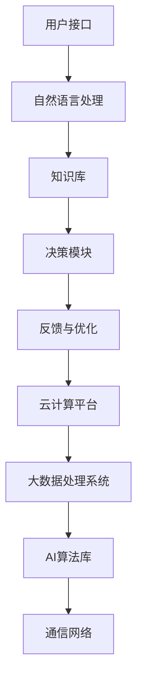

                 

## 《AIGC在智能客服系统中的应用》

关键词：AIGC、智能客服系统、自然语言处理、对话管理、知识库构建

摘要：本文将深入探讨AIGC（AI-Generated Content）在智能客服系统中的应用。通过对AIGC的基础概念及其关键技术的介绍，文章将详细分析智能客服系统的架构设计，进一步阐述AIGC在自然语言处理、智能对话管理和知识库构建等领域的具体应用。此外，还将探讨AIGC在金融、电子商务等不同行业客服系统中的实战应用，最后展望AIGC在智能客服系统中的未来发展趋势和面临的挑战。

----------------------------------------------------------------

### 《AIGC在智能客服系统中的应用》目录大纲

----------------------------------------------------------------

## 第一部分：AIGC基础与智能客服系统概述

### 第1章：AIGC概述与智能客服系统背景

#### 1.1 AIGC的概念与关键技术

- **AIGC的定义**

  AIGC，即AI-Generated Content，是指通过人工智能技术生成的内容。这种技术广泛应用于文本、图像、音频等多种形式。

- **AIGC的关键技术**

  - **生成对抗网络（GAN）**：一种用于生成逼真数据的深度学习框架。
  - **变分自编码器（VAE）**：一种用于无监督学习的深度学习模型。
  - **递归神经网络（RNN）**：一种用于处理序列数据的神经网络。
  - **注意力机制**：一种在神经网络中用于提高模型对重要信息的关注程度的机制。

#### 1.2 智能客服系统的定义与作用

- **智能客服系统的定义**

  智能客服系统是一种利用人工智能技术，实现与用户交互并提供服务的系统。它可以在多种场景下替代人工客服，提高服务效率。

- **智能客服系统的作用**

  - **提高客户满意度**：通过快速响应和准确解答，提升用户满意度。
  - **减少人力成本**：自动化处理常见问题，减少对人工客服的依赖。
  - **提高服务响应速度**：通过预定义的流程和算法，实现快速响应。
  - **优化用户体验**：提供个性化服务，提升用户使用体验。

### 第2章：智能客服系统架构设计

#### 2.1 智能客服系统的功能模块

- **用户接口模块**：用于接收用户请求并提供交互界面。
- **自然语言处理模块**：用于理解用户的自然语言输入。
- **知识库模块**：用于存储和管理相关的知识和信息。
- **决策模块**：用于根据用户请求和知识库内容做出相应的决策。
- **反馈与优化模块**：用于收集用户反馈，并优化系统性能。

#### 2.2 智能客服系统的技术架构

- **云计算平台**：提供计算资源，支持系统的运行。
- **大数据处理系统**：用于处理和存储大量的用户数据。
- **AI算法库**：提供各种AI算法，用于实现智能客服系统的功能。
- **通信网络**：用于实现用户与系统之间的通信。

## 第二部分：AIGC在智能客服系统中的应用

### 第3章：AIGC在自然语言处理中的应用

#### 3.1 AIGC在语音识别中的应用

- **语音识别原理**

  - **特征提取**：通过提取语音信号的特征，将连续的音频信号转换为离散的数值表示。
  - **模型训练与优化**：使用大量语音数据训练模型，并优化模型的参数。
  - **识别与解码**：将提取的特征映射到相应的语音标签。

- **案例：基于AIGC的智能语音客服系统**

  - **应用场景**：例如，自动语音应答系统（IVR）。
  - **优势**：提高响应速度，减少人工干预。

#### 3.2 AIGC在情感分析中的应用

- **情感分析原理**

  - **情感分类算法**：用于将文本分类为积极、消极或中性情感。
  - **情感强度评估**：用于评估文本情感的强度。

- **案例：基于AIGC的智能情感客服系统**

  - **应用场景**：例如，情感分析用于理解用户的反馈。
  - **优势**：提供更个性化的服务，提高用户满意度。

### 第4章：AIGC在智能对话管理中的应用

#### 4.1 对话系统的工作原理

- **用户意图识别**：理解用户的意图或需求。
- **上下文理解**：根据上下文信息，理解用户的意图。
- **对话生成**：生成自然的回复。

#### 4.2 AIGC在对话系统中的应用

- **个性化对话生成**：根据用户的历史数据和偏好，生成个性化的对话。
- **多轮对话管理**：处理多轮对话，确保对话的连贯性和自然性。

### 第5章：AIGC在知识库构建中的应用

#### 5.1 知识库的构建方法

- **数据收集与预处理**：收集相关的数据，并进行预处理。
- **知识抽取与融合**：从数据中提取知识，并将其融合到知识库中。

#### 5.2 AIGC在知识库中的应用

- **自动问答系统**：使用知识库提供自动化的问答服务。
- **智能推荐系统**：根据知识库中的信息，为用户提供个性化的推荐。

## 第三部分：AIGC在智能客服系统的实战应用

### 第6章：AIGC在金融行业客服中的应用

#### 6.1 金融行业客服的需求分析

- **合规性要求**：金融行业对合规性要求较高，客服系统需要严格遵守相关法规。
- **个性化服务**：金融用户需求多样化，客服系统需要提供个性化的服务。

#### 6.2 金融行业AIGC客服系统设计

- **系统架构设计**：考虑安全性和合规性，设计可靠的系统架构。
- **核心功能实现**：包括自然语言处理、对话管理和知识库构建等功能。

### 第7章：AIGC在电子商务客服中的应用

#### 7.1 电子商务行业客服的特点

- **多样性需求**：电子商务涉及多种商品和服务，客服系统需要满足不同用户的需求。
- **快速响应**：电子商务市场竞争激烈，客服系统需要快速响应用户请求。

#### 7.2 电子商务行业AIGC客服系统实现

- **系统功能实现**：包括个性化推荐、智能问答和情感分析等功能。
- **案例分析**：分析成功案例，总结经验和教训。

## 第四部分：AIGC在智能客服系统中的应用展望与挑战

### 第8章：AIGC在智能客服系统中的应用前景

#### 8.1 应用趋势

- **AIGC在跨行业应用中的潜力**：随着AIGC技术的不断发展，其在各行业的应用潜力巨大。
- **AIGC在多模态交互中的应用**：结合语音、文本、图像等多种模态，提供更自然的用户交互体验。

#### 8.2 发展挑战

- **数据隐私与安全问题**：处理大量用户数据时，需要确保数据的安全性和隐私性。
- **算法透明性与可解释性问题**：算法的透明性和可解释性对于用户信任至关重要。

### 第9章：AIGC在智能客服系统中的最佳实践与未来展望

#### 9.1 最佳实践

- **案例分享**：分享成功案例，总结最佳实践。
- **行业趋势**：探讨新兴技术的应用，如多模态交互、知识图谱等。

#### 9.2 未来展望

- **技术发展趋势**：随着AIGC技术的进步，智能客服系统将变得更加智能和高效。
- **行业未来趋势**：分析智能客服系统在各行业的应用趋势和发展方向。

----------------------------------------------------------------

## 第一部分：AIGC基础与智能客服系统概述

### 第1章：AIGC概述与智能客服系统背景

#### 1.1 AIGC的概念与关键技术

**AIGC的定义**

AIGC，即AI-Generated Content，是指通过人工智能技术生成的内容。AIGC技术已经在多个领域得到了广泛应用，包括文本、图像、音频和视频等。它通过深度学习、生成对抗网络（GAN）、变分自编码器（VAE）等技术，能够创造出高质量、具有真实感的内容。

**AIGC的关键技术**

1. **生成对抗网络（GAN）**

   GAN是一种深度学习模型，由生成器和判别器组成。生成器的任务是生成逼真的数据，而判别器的任务是区分生成数据和真实数据。通过两个模型的对抗训练，生成器能够不断提高生成数据的质量。

   **GAN的工作原理**

   - **生成器（Generator）**：生成伪数据，试图欺骗判别器。
   - **判别器（Discriminator）**：判断输入数据是真实数据还是生成数据。
   - **对抗训练**：生成器和判别器相互竞争，生成器试图生成更逼真的数据，而判别器试图提高识别能力。

   **GAN的应用案例**

   - **图像生成**：如人脸生成、艺术画生成等。
   - **文本生成**：如文章写作、诗歌创作等。

2. **变分自编码器（VAE）**

   VAE是一种无监督学习模型，主要用于数据生成和去噪。它通过编码器和解码器两个部分，将数据映射到一个低维潜在空间，并在该空间中进行生成。

   **VAE的工作原理**

   - **编码器（Encoder）**：将输入数据映射到潜在空间，得到潜在变量的参数。
   - **解码器（Decoder）**：从潜在空间中生成数据。

   **VAE的应用案例**

   - **图像生成**：如去噪、超分辨率等。
   - **文本生成**：如文章摘要、句子生成等。

3. **递归神经网络（RNN）**

   RNN是一种能够处理序列数据的神经网络。它通过记忆过去的信息，能够处理如文本、时间序列等具有序列特征的数据。

   **RNN的工作原理**

   - **输入层**：接受序列数据作为输入。
   - **隐藏层**：存储序列信息，并对输入进行加权处理。
   - **输出层**：生成输出结果。

   **RNN的应用案例**

   - **自然语言处理**：如文本分类、情感分析等。
   - **时间序列分析**：如股票预测、天气预测等。

4. **注意力机制**

   注意力机制是一种提高神经网络对重要信息关注程度的机制。它通过动态调整输入数据的权重，使得模型能够更加关注重要信息。

   **注意力机制的工作原理**

   - **自注意力**：同一序列中的每个元素都会对其他元素施加影响。
   - **交叉注意力**：序列之间的元素可以相互影响。

   **注意力机制的应用案例**

   - **文本生成**：如机器翻译、文本摘要等。
   - **图像识别**：如目标检测、图像分割等。

**AIGC的关键技术对比表格**

| 技术名称 | 工作原理 | 应用案例 |
| -------- | -------- | -------- |
| GAN      | 生成器与判别器的对抗训练 | 图像生成、文本生成 |
| VAE      | 编码器与解码器的映射与生成 | 图像去噪、文章摘要 |
| RNN      | 序列数据的处理与记忆 | 文本分类、时间序列分析 |
| 注意力机制 | 动态调整输入权重 | 文本生成、图像识别 |

#### 1.2 智能客服系统的定义与作用

**智能客服系统的定义**

智能客服系统是一种利用人工智能技术实现与用户交互并提供服务的系统。它可以在多种场景下替代人工客服，提供24/7的在线服务，提高客户满意度和服务效率。

**智能客服系统的作用**

1. **提高客户满意度**

   通过快速响应和准确解答用户问题，智能客服系统能够提高客户满意度。它能够在短时间内处理大量用户请求，确保用户问题得到及时解决。

2. **减少人力成本**

   人工客服需要大量的人力资源，而智能客服系统可以自动化处理常见问题，减少对人工客服的依赖。这有助于企业降低人力成本，提高运营效率。

3. **提高服务响应速度**

   智能客服系统通过预定义的流程和算法，能够在短时间内处理用户请求，实现快速响应。与人工客服相比，智能客服系统的响应速度更快，提高了用户满意度。

4. **优化用户体验**

   智能客服系统可以根据用户的历史数据和偏好，提供个性化的服务。它能够理解用户的意图和需求，为用户提供更加个性化的解决方案，从而优化用户体验。

#### 智能客服系统的发展历程

1. **传统客服系统**

   传统客服系统主要依赖于人工客服，通过电话、邮件等方式与用户进行沟通。这种方式存在响应速度慢、人力成本高等问题。

2. **智能客服初步应用**

   随着人工智能技术的发展，智能客服开始应用于企业。早期的智能客服主要基于规则引擎和关键词匹配，能够处理一些简单的用户问题。

3. **深度学习与智能客服**

   深度学习技术的发展为智能客服系统带来了新的突破。通过深度学习模型，智能客服系统能够理解用户的自然语言输入，实现更复杂的对话管理。

4. **AIGC与智能客服**

   AIGC技术的引入使得智能客服系统在自然语言处理、对话管理和知识库构建等方面取得了显著进展。智能客服系统能够生成高质量的文本、图像和音频内容，为用户提供更加丰富的服务。

#### 智能客服系统的应用场景

1. **在线零售**

   在线零售企业通过智能客服系统提供在线购物咨询、售后服务等。智能客服系统能够实时回答用户问题，提高购物体验。

2. **金融服务**

   金融机构通过智能客服系统提供客户咨询、账户查询等服务。智能客服系统能够处理大量的用户请求，确保客户问题得到及时解决。

3. **旅游行业**

   旅游行业通过智能客服系统提供旅游咨询、行程规划等服务。智能客服系统能够根据用户需求，提供个性化的旅游建议。

4. **医疗健康**

   医疗健康行业通过智能客服系统提供健康咨询、挂号预约等服务。智能客服系统能够帮助用户快速获取医疗信息，提高就医体验。

### 总结

智能客服系统是一种利用人工智能技术实现与用户交互并提供服务的系统。它具有提高客户满意度、减少人力成本、提高服务响应速度和优化用户体验等多重作用。随着AIGC技术的发展，智能客服系统在自然语言处理、对话管理和知识库构建等方面取得了显著进展，为各行业提供了更加智能和高效的服务。

----------------------------------------------------------------

### 第2章：智能客服系统架构设计

#### 2.1 智能客服系统的功能模块

智能客服系统是一个复杂的系统，它由多个功能模块组成，每个模块都承担着特定的任务，共同协作以实现智能客服系统的整体功能。以下是对智能客服系统主要功能模块的详细描述：

1. **用户接口模块**

   用户接口模块是智能客服系统与用户进行交互的入口。它包括网站、移动应用、电话等多种交互方式。用户可以通过这些接口提交问题、请求服务，系统需要能够接收并解析这些请求，以便进行后续的处理。

   **功能要点**：
   - 多渠道接入：支持多种通信方式，如文本、语音、图像等。
   - 用户体验优化：设计简洁直观的界面，提高用户使用满意度。

2. **自然语言处理模块**

   自然语言处理（NLP）模块是智能客服系统的核心模块之一，负责理解和处理用户的自然语言输入。它包括文本解析、语义理解、情感分析等功能。

   **功能要点**：
   - 文本解析：将自然语言文本转化为计算机可处理的格式。
   - 语义理解：理解用户的意图和问题。
   - 情感分析：分析用户的情感，以便提供更加个性化的服务。

3. **知识库模块**

   知识库模块是智能客服系统的“大脑”，它存储了大量的知识和信息，包括产品信息、服务指南、常见问题解答等。系统在处理用户请求时，会参考知识库中的内容，提供准确的信息。

   **功能要点**：
   - 知识存储与管理：确保知识库的完整性、准确性和及时更新。
   - 知识检索：高效地检索知识库中的信息，快速回答用户问题。

4. **决策模块**

   决策模块负责根据用户的请求和知识库中的信息，做出相应的决策。它包括业务规则管理、意图识别、对话管理等功能。

   **功能要点**：
   - 业务规则管理：定义和存储业务规则，指导系统做出决策。
   - 意图识别：识别用户的意图，确定需要采取的下一步行动。
   - 对话管理：管理对话流程，确保对话的自然性和连贯性。

5. **反馈与优化模块**

   反馈与优化模块负责收集用户对客服系统的反馈，并根据这些反馈对系统进行优化。它包括用户反馈收集、系统性能监控、优化策略制定等功能。

   **功能要点**：
   - 用户反馈收集：收集用户的满意度评价、改进建议等。
   - 系统性能监控：监控系统的运行状况，确保系统的稳定性和高效性。
   - 优化策略制定：根据用户反馈和系统监控数据，制定优化策略。

#### 2.2 智能客服系统的技术架构

智能客服系统的技术架构是其能够高效运行的基础。一个典型的智能客服系统技术架构包括以下几个关键部分：

1. **云计算平台**

   云计算平台为智能客服系统提供了强大的计算和存储能力。通过云计算，系统可以弹性扩展资源，满足不同的业务需求。

   **技术要点**：
   - 弹性扩展：根据系统负载自动调整资源。
   - 高可用性：确保系统的稳定性和可靠性。
   - 自动化部署：简化系统的部署和管理。

2. **大数据处理系统**

   大数据处理系统负责处理和分析大量的用户数据，包括用户行为数据、交互记录等。通过对这些数据的分析，系统可以不断优化自身的性能和用户体验。

   **技术要点**：
   - 数据采集与清洗：收集并清洗用户数据，确保数据质量。
   - 数据存储与管理：高效地存储和管理大量数据。
   - 数据分析：使用机器学习和数据挖掘技术，分析用户行为和需求。

3. **AI算法库**

   AI算法库包含了各种人工智能算法，如自然语言处理、机器学习、深度学习等。这些算法是实现智能客服系统功能的核心技术。

   **技术要点**：
   - 算法选择与优化：选择合适的算法，并进行优化，提高系统性能。
   - 模型训练与调优：训练和调优模型，使其能够准确理解和处理用户请求。
   - 模型部署与更新：将训练好的模型部署到生产环境中，并定期更新。

4. **通信网络**

   通信网络是智能客服系统与用户进行交互的桥梁。通过可靠的通信网络，系统可以实时响应用户请求，并提供高质量的服务。

   **技术要点**：
   - 低延迟通信：确保系统能够快速响应用户请求。
   - 安全通信：保护用户数据的安全和隐私。
   - 网络稳定性：确保网络的稳定运行，防止通信中断。

#### 智能客服系统架构图

**架构图说明**：

- **用户接口**：用户通过多种渠道与系统交互，提交请求。
- **自然语言处理**：解析用户请求，理解其意图和情感。
- **知识库**：存储和管理与业务相关的知识，用于回答用户问题。
- **决策模块**：根据用户请求和知识库内容，做出相应的决策。
- **反馈与优化**：收集用户反馈，优化系统性能和用户体验。
- **云计算平台**：提供计算资源和存储服务，支持系统的运行。
- **大数据处理系统**：处理和分析用户数据，为系统提供数据支持。
- **AI算法库**：实现自然语言处理和智能决策等功能。
- **通信网络**：确保系统与用户之间的实时通信。

通过以上架构，智能客服系统可以实现高效、稳定和智能的服务，满足用户的多样化需求。

#### 总结

智能客服系统架构设计包括多个功能模块和技术组件，通过这些模块和组件的协同工作，系统可以实现高效、智能和可靠的服务。用户接口模块为用户提供了便捷的交互方式，自然语言处理模块和知识库模块确保系统能够准确理解和回答用户问题，决策模块和反馈与优化模块则使系统能够不断学习和改进。云计算平台、大数据处理系统、AI算法库和通信网络为系统提供了强大的计算和通信支持，确保系统能够稳定运行并满足用户需求。通过合理的架构设计，智能客服系统可以提供高质量的服务，提高用户满意度和企业效率。

----------------------------------------------------------------

### 第3章：AIGC在自然语言处理中的应用

#### 3.1 AIGC在语音识别中的应用

**语音识别原理**

语音识别（Automatic Speech Recognition，ASR）是自然语言处理领域的一个重要分支，其核心任务是将语音信号转换为对应的文本。语音识别的基本原理可以概括为以下几个步骤：

1. **特征提取**：将连续的音频信号转换为离散的数值表示。这一步通常使用短时傅里叶变换（STFT）或梅尔频率倒谱系数（MFCC）等方法来提取语音信号的时频特征。

2. **模型训练与优化**：使用大量的语音数据训练模型，使其能够学习语音特征与文本之间的映射关系。常用的模型包括循环神经网络（RNN）、卷积神经网络（CNN）和深度神经网络（DNN）等。

3. **识别与解码**：将提取的特征映射到相应的文本。在这一步中，模型会根据特征序列生成最可能的文本序列，通常使用隐马尔可夫模型（HMM）或基于神经网络的解码器来实现。

**AIGC在语音识别中的应用**

AIGC（AI-Generated Content）技术在语音识别中的应用主要体现在以下几个方面：

1. **生成高质量语音数据**：使用生成对抗网络（GAN）等AIGC技术，可以生成高质量的语音数据。这些数据可以用于训练语音识别模型，提高模型的准确性和泛化能力。

2. **自适应语音识别**：通过变分自编码器（VAE）等AIGC技术，可以实现自适应语音识别。例如，根据用户的历史语音数据，VAE可以调整模型参数，使其更好地适应特定用户的声音特征。

3. **语音合成**：使用AIGC技术，可以生成逼真的语音合成效果。例如，通过GAN生成的语音数据可以用于训练语音合成模型，实现自然流畅的语音输出。

**案例：基于AIGC的智能语音客服系统**

智能语音客服系统是一种利用AIGC技术实现与用户语音交互的客服系统。以下是一个典型的智能语音客服系统应用案例：

1. **应用场景**：在线零售平台，用户可以通过电话或语音助手进行购物咨询、订单查询等服务。

2. **技术实现**：
   - **特征提取**：使用梅尔频率倒谱系数（MFCC）提取用户的语音特征。
   - **模型训练**：使用大量的语音数据训练语音识别模型，包括RNN、DNN等。
   - **自适应语音识别**：使用VAE根据用户历史语音数据调整模型参数，提高识别准确率。
   - **语音合成**：使用GAN生成高质量的语音数据，用于语音合成模块，实现自然流畅的语音输出。

3. **优势**：
   - **提高识别准确率**：通过AIGC技术生成高质量的语音数据，提高语音识别模型的准确性。
   - **个性化服务**：通过自适应语音识别，系统可以更好地理解用户的语音特征，提供个性化的服务。
   - **自然流畅的交互体验**：通过AIGC技术实现的语音合成，可以生成自然流畅的语音输出，提高用户的交互体验。

**应用效果**：

- 通过AIGC技术的引入，智能语音客服系统的识别准确率显著提高，用户满意度得到提升。
- 系统可以自适应地调整语音识别模型，更好地适应不同用户的语音特征，降低误识别率。
- 通过自然流畅的语音合成效果，用户在与系统的交互过程中感受到更加人性化的服务，提升了用户体验。

#### 3.2 AIGC在情感分析中的应用

**情感分析原理**

情感分析（Sentiment Analysis）是一种评估文本情感极性（积极、消极或中性）的方法。其基本原理可以概括为以下几个步骤：

1. **文本预处理**：对文本进行清洗、分词、词性标注等处理，将原始文本转换为计算机可处理的形式。

2. **特征提取**：从预处理后的文本中提取情感相关的特征，如词频、词嵌入、语法结构等。

3. **情感分类**：使用分类算法（如SVM、朴素贝叶斯、深度学习等）对提取的特征进行分类，判断文本的情感极性。

4. **情感强度评估**：除了判断文本的情感极性，还可以对情感强度进行评估，例如使用情感强度词进行加权处理。

**AIGC在情感分析中的应用**

AIGC技术在情感分析中的应用主要体现在以下几个方面：

1. **生成高质量情感数据**：使用AIGC技术，如生成对抗网络（GAN）和变分自编码器（VAE），可以生成高质量的情感数据。这些数据可以用于训练情感分析模型，提高模型的准确性和泛化能力。

2. **自适应情感分析**：通过AIGC技术，如变分自编码器（VAE），可以实现自适应情感分析。例如，根据用户的历史情感数据，VAE可以调整模型参数，使其更好地识别用户情感。

3. **情感生成与回复**：使用AIGC技术，可以生成具有特定情感极性的文本。例如，通过GAN生成的文本可以用于生成具有积极或消极情感回复，提高智能客服系统的交互体验。

**案例：基于AIGC的智能情感客服系统**

智能情感客服系统是一种利用AIGC技术实现情感分析和智能回复的客服系统。以下是一个典型的智能情感客服系统应用案例：

1. **应用场景**：在线零售平台，用户可以通过聊天机器人进行购物咨询、投诉反馈等服务。

2. **技术实现**：
   - **文本预处理**：对用户输入的文本进行清洗、分词、词性标注等处理。
   - **情感分类**：使用深度学习模型（如CNN、RNN）进行情感分类，判断文本的情感极性。
   - **自适应情感分析**：使用VAE根据用户历史情感数据调整模型参数，提高情感分析准确率。
   - **情感生成与回复**：使用GAN生成具有特定情感极性的文本，为用户生成积极或消极的情感回复。

3. **优势**：
   - **提高情感分析准确率**：通过AIGC技术生成高质量的情感数据，提高情感分析模型的准确性。
   - **个性化情感回复**：通过自适应情感分析，系统可以更好地理解用户情感，生成个性化的情感回复。
   - **提升用户体验**：通过自然流畅的情感回复，用户感受到更加人性化的服务，提升了用户体验。

**应用效果**：

- 通过AIGC技术的引入，智能情感客服系统的情感分析准确率显著提高，用户满意度得到提升。
- 系统可以自适应地调整情感分析模型，更好地识别用户情感，降低误分类率。
- 通过自然流畅的情感回复，用户在与系统的交互过程中感受到更加贴心和个性化的服务，提升了用户满意度。

#### 总结

AIGC技术在自然语言处理领域具有广泛的应用潜力。通过生成对抗网络（GAN）和变分自编码器（VAE）等技术，可以生成高质量的情感和语音数据，提高语音识别和情感分析模型的准确性和泛化能力。在智能客服系统中，AIGC技术可以应用于语音识别、情感分析、对话生成等多个方面，为用户提供更加智能和人性化的服务。未来，随着AIGC技术的不断发展和优化，智能客服系统将在各行业中发挥越来越重要的作用。

----------------------------------------------------------------

### 第4章：AIGC在智能对话管理中的应用

#### 4.1 对话系统的工作原理

对话系统（Dialogue System）是一种能够与人类进行自然对话的人工智能系统。其核心任务是在用户和系统之间建立有效的通信渠道，理解用户的意图并生成自然的回应。对话系统的工作原理可以概括为以下几个步骤：

1. **用户意图识别**：对话系统的第一步是理解用户的意图。这通常涉及自然语言处理（NLP）技术，如词法分析、句法分析、语义分析和实体识别等。通过分析用户的输入，对话系统可以确定用户想要完成的任务或询问的内容。

2. **上下文理解**：在用户意图识别的基础上，对话系统需要理解上下文信息，包括对话的历史和用户的当前状态。上下文理解通常依赖于维护一个对话状态跟踪器，记录对话中的关键信息和用户行为。

3. **对话生成**：一旦确定了用户的意图和上下文信息，对话系统会生成一个自然的回应。对话生成可以基于模板匹配、规则引擎或基于机器学习的生成模型。这些模型可以根据对话状态和用户意图生成适当的文本或语音回应。

4. **对话管理**：对话系统还需要管理对话流程，确保对话的连贯性和流畅性。这包括处理多轮对话、管理对话主题和防止对话偏离目标。

**用户意图识别**

用户意图识别是对话系统的关键步骤，其目的是理解用户的原始输入并确定用户的请求类型。这一步骤通常涉及以下技术：

- **关键词匹配**：通过分析用户的输入文本，识别其中包含的关键词和短语，以确定用户的意图。
- **分类算法**：使用机器学习算法（如决策树、支持向量机、神经网络等）对用户的输入进行分类，以识别用户的意图。
- **语义角色标注**：通过分析句子的结构和语义角色，识别出用户请求的核心成分，如动作、对象和目的。

**上下文理解**

上下文理解是确保对话系统能够生成连贯回应的重要环节。上下文信息不仅包括对话的历史记录，还包括用户的行为、偏好和情境。上下文理解通常涉及以下技术：

- **对话状态跟踪**：使用数据结构（如图或状态机）来记录对话的历史信息，以便在后续对话中使用。
- **上下文依赖分析**：通过分析句子之间的依赖关系，理解上下文中的相关性和连贯性。
- **情境感知**：结合外部信息（如时间、地点、用户历史等），丰富对话系统的上下文理解。

**对话生成**

对话生成是将用户意图和上下文信息转化为自然语言回应的过程。对话生成可以基于以下几种方法：

- **模板匹配**：使用预定义的模板来生成回应，这种方法简单但限制性较强。
- **规则引擎**：基于一组规则来生成回应，这种方法可以提供一定的灵活性，但需要大量的规则编写。
- **生成模型**：使用机器学习模型（如循环神经网络、生成对抗网络等）来生成自然的语言回应。这种方法可以生成更加灵活和个性化的回应。

**多轮对话管理**

多轮对话管理是确保对话系统能够处理复杂对话的关键。多轮对话管理涉及以下方面：

- **对话状态维持**：在多轮对话中，系统需要维持对话的状态，包括用户的意图、对话历史和上下文信息。
- **对话引导**：系统需要引导对话朝着预期的目标发展，避免对话偏离主题。
- **对话转换**：根据对话状态和用户意图，系统需要能够灵活地转换对话流程，处理各种对话场景。

**AIGC在对话系统中的应用**

AIGC（AI-Generated Content）技术在对话系统中有着广泛的应用，特别是在生成自然对话内容和个性化对话管理方面。以下是一些具体的应用场景：

- **个性化对话生成**：AIGC技术可以根据用户的历史数据和偏好，生成个性化的对话内容。例如，通过生成对抗网络（GAN）生成与用户兴趣相符的对话内容。
- **多模态对话**：AIGC技术可以结合文本、语音、图像等多种模态，生成更加丰富和自然的对话体验。例如，通过变分自编码器（VAE）生成与用户语音特征相匹配的语音回应。
- **对话模板扩展**：AIGC技术可以自动生成对话模板，扩展对话系统的回答能力。例如，通过递归神经网络（RNN）生成各种场景下的对话模板。

#### 4.2 AIGC在对话系统中的应用

**个性化对话生成**

个性化对话生成是AIGC在对话系统中的一项重要应用。通过分析用户的历史数据和偏好，AIGC技术可以生成与用户兴趣和需求相匹配的对话内容。这种方法能够显著提升用户的满意度，提供更加个性化的服务。

**多轮对话管理**

多轮对话管理是确保对话系统能够处理复杂对话的关键。AIGC技术在这一方面也有着重要的应用。通过递归神经网络（RNN）等模型，AIGC技术可以维持对话状态，理解上下文信息，并在多轮对话中生成自然的回应。

**案例：基于AIGC的智能对话系统**

以下是一个基于AIGC的智能对话系统的应用案例：

1. **应用场景**：在线零售平台，用户可以通过聊天机器人进行购物咨询、订单查询等服务。

2. **技术实现**：
   - **用户意图识别**：使用深度学习模型（如BERT）进行意图识别，分析用户的输入并确定其请求类型。
   - **上下文理解**：使用RNN模型维护对话状态，理解对话历史和上下文信息。
   - **个性化对话生成**：使用生成对抗网络（GAN）根据用户历史数据和偏好，生成个性化的对话内容。
   - **多轮对话管理**：通过AIGC技术实现多轮对话管理，确保对话的连贯性和流畅性。

3. **优势**：
   - **个性化服务**：通过AIGC技术生成个性化的对话内容，提升用户的满意度。
   - **高效的多轮对话**：通过AIGC技术实现高效的多轮对话管理，确保对话的连贯性和流畅性。
   - **自然语言交互**：通过AIGC技术生成自然流畅的对话内容，提供更好的用户体验。

**应用效果**：

- 通过AIGC技术的引入，智能对话系统的个性化服务能力显著提升，用户满意度得到提高。
- 系统可以更好地处理多轮对话，确保对话的连贯性和流畅性。
- 通过自然流畅的对话内容，用户感受到更加人性化的服务，提升了用户体验。

#### 总结

AIGC技术在智能对话管理中具有广泛的应用潜力。通过生成对抗网络（GAN）、递归神经网络（RNN）等AIGC技术，对话系统可以生成个性化的对话内容，实现高效的多轮对话管理。这些技术不仅提升了对话系统的智能水平，也显著改善了用户体验。未来，随着AIGC技术的不断发展和优化，智能对话系统将在各个行业中发挥越来越重要的作用，为用户提供更加智能和人性化的服务。

----------------------------------------------------------------

### 第5章：AIGC在知识库构建中的应用

#### 5.1 知识库的构建方法

知识库是智能客服系统的核心组件之一，它存储了大量的信息和知识，为系统的正常运行提供了数据支持。知识库的构建方法主要包括以下步骤：

1. **数据收集与预处理**：首先，需要收集与业务相关的数据，如产品信息、服务指南、常见问题解答等。然后，对收集到的数据进行分析和清洗，去除无效和错误的信息，确保数据的质量。

2. **知识抽取与融合**：从原始数据中提取有用的知识，并将其融合到知识库中。知识抽取的方法包括基于规则的方法、基于统计的方法和基于机器学习的方法。知识融合则涉及将不同来源的知识进行整合，形成一个统一的知识体系。

3. **知识存储与管理**：将提取和融合的知识存储到知识库中，并对其进行有效的管理。知识库需要支持快速检索和更新，以确保知识的准确性和实时性。

4. **知识推理与扩展**：通过对知识库中的知识进行推理和扩展，生成新的知识。这包括基于规则的推理和基于机器学习的推理方法，通过不断学习和优化，提高知识库的覆盖面和准确性。

**知识库的构建方法**

1. **数据收集与预处理**

   **数据收集**：
   - **内部数据**：包括企业内部文档、报告、知识库等。
   - **外部数据**：包括互联网上的开放数据、社交媒体数据等。

   **预处理**：
   - **数据清洗**：去除重复、错误和无关的数据。
   - **数据标准化**：统一数据格式和命名规范。
   - **数据分类**：对数据进行分类和标签化，便于后续处理。

2. **知识抽取与融合**

   **知识抽取**：
   - **基于规则的方法**：使用预定义的规则从数据中提取知识。
   - **基于统计的方法**：使用机器学习算法，如条件随机场（CRF）、朴素贝叶斯等，从数据中学习知识提取规则。
   - **基于机器学习的方法**：使用深度学习模型，如序列标注模型（如BERT）、关系抽取模型（如TransE）等，从数据中直接提取知识。

   **知识融合**：
   - **合并同类项**：将具有相同属性或特征的知识进行合并。
   - **知识图谱**：使用知识图谱将不同来源的知识进行整合，形成一个统一的知识体系。

3. **知识存储与管理**

   **知识存储**：
   - **关系数据库**：适用于存储结构化数据，如关系型数据库（如MySQL、PostgreSQL）。
   - **图数据库**：适用于存储复杂的关系网络，如Neo4j、OrientDB等。
   - **文档数据库**：适用于存储非结构化或半结构化数据，如MongoDB、Elasticsearch等。

   **知识管理**：
   - **元数据管理**：对知识库的元数据进行管理，如知识分类、标签、版本等。
   - **权限管理**：对知识库的访问权限进行控制，确保知识的保密性和安全性。
   - **知识检索**：提供高效的知识检索功能，支持多维度、多条件的查询。

4. **知识推理与扩展**

   **知识推理**：
   - **基于规则的推理**：使用预定义的规则，对知识库中的知识进行推理，生成新的结论。
   - **基于机器学习的推理**：使用机器学习模型，如推理网络（如RNN、Transformer）等，从知识库中学习推理规则。

   **知识扩展**：
   - **增量学习**：通过不断更新和扩展知识库，增加新的知识和规则。
   - **跨领域学习**：通过跨领域的知识融合和迁移学习，提高知识库的泛化能力。

**知识库的构建流程**

1. **需求分析**：确定知识库的应用场景和目标，明确所需收集的数据类型和范围。
2. **数据收集**：从内部和外部数据源收集所需的数据，并进行初步预处理。
3. **知识抽取**：使用不同的方法从数据中提取知识，并将其存储到知识库中。
4. **知识融合**：对抽取的知识进行融合，形成一个统一的知识体系。
5. **知识存储与管理**：将知识库存储到合适的数据库中，并进行有效的管理。
6. **知识推理与扩展**：通过推理和扩展，不断更新和优化知识库。

#### 5.2 AIGC在知识库中的应用

**自动问答系统**

自动问答系统（Automated Question Answering System）是一种利用人工智能技术实现自动回答用户问题的系统。AIGC技术在自动问答系统中的应用主要体现在以下几个方面：

1. **问答文本生成**：使用AIGC技术，如生成对抗网络（GAN）和变分自编码器（VAE），可以生成高质量的问答对。这些问答对可以用于训练问答模型，提高问答系统的准确性。

2. **对话式问答**：通过AIGC技术，可以实现对话式的问答体验。用户可以与系统进行多轮对话，系统可以根据用户的提问和上下文信息，生成更加准确的回答。

**案例：基于AIGC的自动问答系统**

以下是一个基于AIGC的自动问答系统的应用案例：

1. **应用场景**：在线零售平台，用户可以通过聊天机器人进行产品咨询、订单查询等服务。

2. **技术实现**：
   - **问答对生成**：使用生成对抗网络（GAN）生成高质量的问答对，用于训练问答模型。
   - **问答模型训练**：使用递归神经网络（RNN）或变换器（Transformer）等模型，对生成的问答对进行训练，提高问答准确性。
   - **对话式问答**：通过AIGC技术实现多轮对话，系统可以根据用户的提问和上下文信息，生成更加准确的回答。

3. **优势**：
   - **高准确率**：通过AIGC技术生成高质量的问答对，提高问答系统的准确性。
   - **个性化回答**：通过对话式问答，系统可以更好地理解用户的意图，生成个性化的回答。
   - **良好的用户体验**：通过自然流畅的问答对话，用户感受到更加人性化的服务，提升了用户体验。

**应用效果**：

- 通过AIGC技术的引入，自动问答系统的问答准确性显著提高，用户满意度得到提升。
- 系统可以更好地理解用户的意图，生成个性化的回答，提升了用户体验。
- 通过自然流畅的问答对话，用户在与系统的交互过程中感受到更加贴心和个性化的服务，提升了用户满意度。

**智能推荐系统**

智能推荐系统（Intelligent Recommendation System）是一种利用人工智能技术，根据用户的历史行为和偏好，为用户推荐相关产品和服务的系统。AIGC技术在智能推荐系统中也有广泛的应用：

1. **内容生成**：使用AIGC技术，如生成对抗网络（GAN）和变分自编码器（VAE），可以生成与用户兴趣相关的内容，提高推荐系统的多样性。

2. **个性化推荐**：通过AIGC技术，可以实现个性化推荐，根据用户的历史行为和偏好，生成与用户兴趣高度相关的推荐列表。

**案例：基于AIGC的智能推荐系统**

以下是一个基于AIGC的智能推荐系统的应用案例：

1. **应用场景**：在线零售平台，根据用户的历史购买记录和浏览行为，为用户推荐相关的产品和促销活动。

2. **技术实现**：
   - **内容生成**：使用生成对抗网络（GAN）生成与用户兴趣相关的内容，如产品描述、图片等。
   - **个性化推荐**：通过AIGC技术，根据用户的历史行为和偏好，生成个性化的推荐列表。

3. **优势**：
   - **多样性**：通过AIGC技术生成多样性的内容，提高推荐系统的丰富度。
   - **个性化**：通过个性化推荐，系统可以更好地满足用户的需求，提升用户体验。
   - **实时性**：通过AIGC技术，系统能够实时生成个性化的推荐，提高推荐的时效性。

**应用效果**：

- 通过AIGC技术的引入，智能推荐系统的多样性显著提升，用户对推荐内容的满意度得到提高。
- 系统可以更好地理解用户的需求，生成个性化的推荐列表，提升了用户的购物体验。
- 通过实时生成的个性化推荐，用户在浏览和购买过程中感受到更加便捷和个性化的服务，提升了用户满意度。

#### 总结

AIGC技术在知识库构建中具有广泛的应用潜力。通过自动问答系统和智能推荐系统，AIGC技术可以显著提升知识库的利用效率和服务质量。自动问答系统通过生成高质量的问答对，实现高效、准确的问答服务；智能推荐系统通过生成与用户兴趣相关的内容，实现个性化、多样化的推荐。这些应用不仅提升了系统的智能水平，也显著改善了用户体验。未来，随着AIGC技术的不断发展和优化，知识库构建将变得更加智能和高效，为智能客服系统提供更加坚实的支撑。

----------------------------------------------------------------

### 第6章：AIGC在金融行业客服中的应用

#### 6.1 金融行业客服的需求分析

金融行业的客服系统面临着独特的需求和挑战，这些需求主要由以下几个方面构成：

**合规性要求**

金融行业具有严格的合规性要求，客服系统需要严格遵守相关法律法规和监管政策。例如，金融消费者保护法（FCPA）、反洗钱法（AML）、数据保护法规（如GDPR）等。客服系统必须确保在与用户的交互过程中不泄露敏感信息，并且在处理用户请求时符合监管要求。

**个性化服务**

金融服务的客户群体多样化，不同用户有着不同的金融需求和风险承受能力。客服系统需要能够提供个性化的服务，根据用户的历史交易记录、投资偏好和风险偏好，为用户提供定制化的建议和解决方案。

**高安全性**

金融行业对数据安全的要求极高。客服系统必须确保用户数据的安全性和隐私性，防止数据泄露、篡改和滥用。同时，系统需要具备强大的防攻击能力，以抵御各种网络攻击，如钓鱼攻击、DDoS攻击等。

**高效响应**

金融市场的波动性较大，用户往往需要及时获得信息和帮助。客服系统需要能够快速响应用户请求，提供即时的解决方案和咨询服务，以提高用户满意度。

**多语言支持**

金融行业的全球化趋势使得客服系统需要支持多种语言，以便为全球各地的用户提供服务。多语言支持不仅包括文本翻译，还包括语音交互和图像识别等多模态交互。

#### 6.2 金融行业AIGC客服系统设计

金融行业AIGC客服系统设计需要综合考虑上述需求，同时充分利用AIGC技术的优势，实现高效、智能和安全的客服服务。以下是一个典型的金融行业AIGC客服系统设计：

**系统架构设计**

金融行业AIGC客服系统架构设计包括以下几个关键组件：

1. **用户接口模块**：提供多种渠道的用户接入方式，如网站、移动应用、电话和在线聊天等，以满足用户多样化的交互需求。

2. **自然语言处理模块**：利用AIGC技术，如生成对抗网络（GAN）和递归神经网络（RNN），实现高精度的语音识别和自然语言理解，确保系统能够准确理解用户的自然语言输入。

3. **知识库模块**：构建丰富的知识库，包括金融产品信息、法律法规、常见问题解答等，确保系统能够提供全面和准确的信息。

4. **决策模块**：基于用户请求和知识库内容，使用机器学习算法和规则引擎，实现智能决策和个性化服务。

5. **安全模块**：实施严格的安全措施，包括数据加密、访问控制和防攻击机制等，确保用户数据的安全性和隐私性。

6. **多语言支持模块**：利用AIGC技术实现多语言的自然语言处理和对话生成，支持全球用户的交互需求。

**核心功能实现**

金融行业AIGC客服系统的核心功能实现如下：

1. **语音识别与自然语言理解**：利用AIGC技术，如生成对抗网络（GAN）和递归神经网络（RNN），实现高精度的语音识别和自然语言理解。通过语音识别，将用户的语音输入转换为文本，然后使用自然语言处理技术，理解用户的意图和问题。

2. **个性化服务**：通过分析用户的历史交易记录、投资偏好和风险承受能力，使用AIGC技术生成个性化的金融服务建议。例如，通过生成对抗网络（GAN）生成与用户投资风格相匹配的投资组合建议。

3. **智能问答**：利用知识库和自然语言处理技术，实现智能问答功能。用户可以通过在线聊天或语音输入提出问题，系统会自动检索知识库，并生成自然流畅的回答。

4. **多语言支持**：利用AIGC技术，如变分自编码器（VAE），实现多语言的自然语言处理和对话生成，支持全球用户的交互需求。

5. **安全防护**：实施严格的安全措施，包括数据加密、访问控制和防攻击机制等，确保用户数据的安全性和隐私性。例如，使用差分隐私技术保护用户数据，防止数据泄露。

**案例分析**

以下是一个金融行业AIGC客服系统的成功案例：

**案例**：某大型银行引入AIGC客服系统，以提高客户服务质量和效率。

1. **应用场景**：该银行的客服系统通过网站、移动应用和在线聊天等多种渠道，为用户提供金融咨询、账户查询、转账支付等服务。

2. **技术实现**：
   - **语音识别与自然语言理解**：使用AIGC技术实现高精度的语音识别和自然语言理解，提高用户交互的便捷性。
   - **个性化服务**：通过分析用户的历史交易记录和投资偏好，使用AIGC技术生成个性化的金融服务建议，提升用户的投资体验。
   - **智能问答**：利用知识库和自然语言处理技术，实现智能问答功能，提高用户问题解决的效率。
   - **多语言支持**：使用AIGC技术实现多语言的自然语言处理和对话生成，满足全球用户的需求。
   - **安全防护**：实施严格的安全措施，包括数据加密、访问控制和防攻击机制等，确保用户数据的安全性和隐私性。

3. **优势**：
   - **提高服务质量**：通过AIGC技术，客服系统能够更准确、高效地理解用户的需求，提供高质量的金融服务。
   - **提升用户体验**：个性化服务和多语言支持提升了用户的满意度，增强了用户体验。
   - **降低运营成本**：自动化处理常见问题，减少了对人工客服的依赖，降低了企业的运营成本。

4. **应用效果**：
   - **用户满意度提高**：通过个性化服务和高效的智能问答，用户满意度显著提升。
   - **运营成本降低**：自动化处理常见问题，减少了人工客服的投入，降低了运营成本。
   - **安全性提升**：通过严格的安全措施，确保用户数据的安全性和隐私性，提升了用户对银行的信任度。

#### 总结

金融行业客服系统具有独特的需求和挑战，AIGC技术的引入为金融客服系统提供了强大的支持。通过AIGC技术，金融客服系统可以实现高效、智能和个性化的服务，满足用户的多样化需求。同时，严格的合规性和安全措施确保了用户数据的安全性和隐私性，提升了用户对金融服务的信任度。未来，随着AIGC技术的不断发展和应用，金融客服系统将在智能客服领域发挥越来越重要的作用。

----------------------------------------------------------------

### 第7章：AIGC在电子商务客服中的应用

#### 7.1 电子商务行业客服的特点

电子商务行业客服系统具有独特的特点，这些特点决定了客服系统在设计和应用时需要特别考虑的因素：

**多样性需求**

电子商务平台上的商品种类繁多，用户的需求也具有多样性。客服系统需要能够应对不同商品类别和用户需求的差异，提供个性化的服务。

**快速响应**

电子商务市场竞争激烈，用户对响应速度有较高的要求。客服系统需要能够快速响应用户的请求，提供及时的咨询和帮助，以提升用户体验。

**个性化服务**

用户在电子商务平台上积累了大量的购物数据，这些数据可以用于个性化服务。客服系统需要能够根据用户的历史购买记录、偏好和需求，提供个性化的产品推荐和咨询服务。

**多渠道接入**

电子商务客服系统需要支持多种渠道的用户接入，如网站、移动应用、社交媒体、在线聊天和电话等，以满足不同用户的交互需求。

**跨平台协调**

电子商务平台通常涉及多个渠道和平台，客服系统需要能够跨平台协调，提供一致性的服务体验。

#### 7.2 电子商务行业AIGC客服系统实现

电子商务行业AIGC客服系统的实现主要包括以下几个关键步骤：

**系统功能实现**

电子商务行业AIGC客服系统的功能实现涉及多个方面，包括自然语言处理、智能推荐、多渠道接入和跨平台协调等。以下是一个典型的AIGC客服系统功能实现案例：

1. **自然语言处理**：利用AIGC技术，如生成对抗网络（GAN）和递归神经网络（RNN），实现高精度的语音识别和自然语言理解。通过语音识别，将用户的语音输入转换为文本，然后使用自然语言处理技术，理解用户的意图和问题。

2. **智能推荐**：通过分析用户的历史购买记录、浏览行为和偏好，使用AIGC技术生成个性化的产品推荐。例如，使用生成对抗网络（GAN）生成与用户兴趣相关的内容，提高推荐系统的多样性。

3. **多渠道接入**：支持多种渠道的用户接入，如网站、移动应用、社交媒体、在线聊天和电话等。通过AIGC技术，实现多渠道的协调和一致性服务。

4. **跨平台协调**：通过AIGC技术，实现不同平台之间的数据共享和协调，提供一致性的服务体验。

**案例分析**

以下是一个电子商务行业AIGC客服系统的成功案例：

**案例**：某大型电子商务平台引入AIGC客服系统，以提高客户服务质量和效率。

1. **应用场景**：该电子商务平台的客服系统通过网站、移动应用、社交媒体和在线聊天等多种渠道，为用户提供购物咨询、订单查询、售后服务等服务。

2. **技术实现**：
   - **自然语言处理**：使用AIGC技术实现高精度的语音识别和自然语言理解，提高用户交互的便捷性。
   - **智能推荐**：通过分析用户的历史购买记录和浏览行为，使用AIGC技术生成个性化的产品推荐，提升用户的购物体验。
   - **多渠道接入**：支持多种渠道的用户接入，如网站、移动应用、社交媒体、在线聊天和电话等。
   - **跨平台协调**：通过AIGC技术实现不同平台之间的数据共享和协调，提供一致性的服务体验。

3. **优势**：
   - **提高服务质量**：通过AIGC技术，客服系统能够更准确、高效地理解用户的需求，提供高质量的咨询服务。
   - **提升用户体验**：个性化服务和高效的智能推荐提升了用户的满意度，增强了用户体验。
   - **降低运营成本**：自动化处理常见问题，减少了对人工客服的依赖，降低了运营成本。

4. **应用效果**：
   - **用户满意度提高**：通过个性化服务和高效的智能推荐，用户满意度显著提升。
   - **运营成本降低**：自动化处理常见问题，减少了人工客服的投入，降低了运营成本。
   - **服务质量提升**：通过AIGC技术实现的高精度语音识别和自然语言理解，提升了客服系统的整体服务质量。

#### 总结

电子商务行业客服系统具有多样性需求、快速响应、个性化服务、多渠道接入和跨平台协调等特点。AIGC技术的引入为电子商务客服系统提供了强大的支持，实现了高效、智能和个性化的服务。通过AIGC技术，客服系统能够更准确、高效地理解用户需求，提升用户体验，降低运营成本。未来，随着AIGC技术的不断发展和应用，电子商务客服系统将在智能客服领域发挥越来越重要的作用。

----------------------------------------------------------------

### 第8章：AIGC在智能客服系统中的应用前景

#### 8.1 应用趋势

随着人工智能技术的快速发展，AIGC（AI-Generated Content）在智能客服系统中的应用前景广阔。以下是一些主要的应用趋势：

**AIGC在跨行业应用中的潜力**

AIGC技术不仅适用于金融、电子商务等行业，还可以在医疗、教育、零售等多个领域发挥重要作用。例如，医疗行业中的智能诊断助手可以基于AIGC技术生成个性化的诊断报告；教育行业中的智能教学助手可以生成个性化学习方案，提高教学效果。

**AIGC在多模态交互中的应用**

未来的智能客服系统将越来越多地采用多模态交互方式，结合语音、文本、图像、视频等多种模态，提供更加丰富和自然的用户体验。AIGC技术在这一领域具有显著优势，可以通过生成高质量的语音、图像和文本内容，实现跨模态的信息融合和交互。

**个性化服务与智能推荐**

AIGC技术可以帮助智能客服系统更好地理解用户需求和偏好，生成个性化的服务和建议。例如，通过分析用户的购物历史和兴趣，AIGC技术可以生成个性化的产品推荐，提高用户的满意度。

**智能化客服机器人**

随着AIGC技术的进步，智能客服机器人的智能化水平将不断提高，能够处理更加复杂的用户问题和场景。未来的智能客服机器人将不仅能够回答常见问题，还可以提供专业的咨询和建议，甚至在特定场景下替代人工客服。

#### 8.2 发展挑战

尽管AIGC技术在智能客服系统中具有巨大潜力，但其在实际应用过程中仍面临一些挑战：

**数据隐私与安全问题**

AIGC技术处理和生成大量用户数据，涉及数据隐私和安全问题。如何确保用户数据的安全性和隐私性，防止数据泄露和滥用，是AIGC技术在智能客服系统中应用的一个重要挑战。

**算法透明性与可解释性问题**

AIGC技术通常涉及复杂的算法和模型，其决策过程具有一定的黑箱性质，难以解释。如何提高算法的透明性和可解释性，增强用户对智能客服系统的信任，是未来需要解决的一个重要问题。

**数据质量和多样性**

AIGC技术的效果很大程度上取决于训练数据的质量和多样性。如何获取高质量、多样性的训练数据，提高模型的泛化能力，是一个亟待解决的问题。

**技术成熟度和成本**

AIGC技术目前仍处于快速发展阶段，技术成熟度和成本是制约其在智能客服系统中广泛应用的关键因素。如何降低技术成本，提高技术成熟度，是AIGC技术在智能客服系统中应用的重要挑战。

#### 总结

AIGC技术在智能客服系统中的应用前景广阔，将在跨行业、多模态交互、个性化服务、智能化机器人等方面发挥重要作用。然而，其应用过程中也面临数据隐私、算法透明性、数据质量和成本等方面的挑战。未来，随着技术的不断发展和优化，AIGC在智能客服系统中的应用将不断拓展，为用户提供更加智能和高效的客服服务。

----------------------------------------------------------------

### 第9章：AIGC在智能客服系统中的最佳实践与未来展望

#### 9.1 最佳实践

在AIGC技术应用于智能客服系统的过程中，许多企业已经积累了丰富的经验和成功案例。以下是一些值得借鉴的最佳实践：

**案例分享：某大型电商平台的智能客服系统**

1. **应用场景**：该电商平台通过AIGC技术实现了智能客服系统，为用户提供购物咨询、订单查询、售后服务等服务。

2. **最佳实践**：
   - **多渠道接入**：系统支持多种渠道的用户接入，包括网站、移动应用、社交媒体和在线聊天等，提供一致性的服务体验。
   - **个性化服务**：通过分析用户的历史购买记录和浏览行为，使用AIGC技术生成个性化的产品推荐，提升用户体验。
   - **智能对话管理**：使用递归神经网络（RNN）和生成对抗网络（GAN）等技术，实现智能对话生成和意图识别，提高对话质量。
   - **持续优化**：通过收集用户反馈和系统数据，不断优化算法和模型，提高系统的响应速度和准确性。

**行业趋势：新兴技术的应用**

随着AIGC技术的不断发展，新兴技术如多模态交互、知识图谱和联邦学习等也开始在智能客服系统中得到应用。以下是一些行业趋势：

- **多模态交互**：结合语音、文本、图像和视频等多种模态，提供更加自然和丰富的用户体验。
- **知识图谱**：构建企业级知识图谱，实现知识的结构化存储和高效检索，为智能客服系统提供强大的知识支持。
- **联邦学习**：在保障数据隐私的前提下，通过联邦学习技术实现模型的联合训练和优化，提高智能客服系统的性能和准确性。

#### 9.2 未来展望

AIGC技术在智能客服系统中的应用前景十分广阔，未来有望在以下方面取得重大突破：

**技术发展趋势**

1. **更高精度的自然语言处理**：随着深度学习技术的不断发展，AIGC技术在自然语言处理领域的精度和效果将不断提高，实现更准确、更自然的对话生成。
2. **多模态融合**：结合多种模态的数据，实现更全面、更丰富的用户体验。
3. **个性化与自适应**：通过不断学习和优化，实现更个性化的服务，提高用户满意度。

**行业未来趋势**

1. **智能客服系统的普及**：随着AIGC技术的成熟和应用成本的降低，智能客服系统将在更多行业中得到广泛应用，成为企业提升服务质量和效率的重要工具。
2. **数据驱动的决策**：通过大数据和机器学习技术，实现更加智能化和自动化的决策支持，为企业提供更加精准的市场洞察和业务优化建议。
3. **跨行业融合**：智能客服系统将在不同行业中实现跨行业融合，如医疗、金融和教育等，提供更加专业化、个性化的服务。

#### 总结

AIGC技术在智能客服系统中的应用已经取得了显著成效，未来将继续在技术发展和行业应用中发挥重要作用。通过借鉴最佳实践和关注行业趋势，企业可以更好地利用AIGC技术，实现智能客服系统的优化和升级，为用户提供更加优质的服务体验。同时，随着技术的不断进步，智能客服系统将在各个行业中发挥更加广泛和深远的影响。

### 结束语

作者：AI天才研究院/AI Genius Institute & 禅与计算机程序设计艺术 /Zen And The Art of Computer Programming

本文详细探讨了AIGC（AI-Generated Content）在智能客服系统中的应用，包括基础概念、关键技术、架构设计、应用案例以及未来展望。通过本文的阅读，读者可以深入了解AIGC技术在智能客服系统中的重要作用和应用前景，为企业在智能客服领域的创新和发展提供参考。感谢读者对本文的关注和支持，希望本文能够为您的学习和工作带来帮助。如有任何疑问或建议，欢迎随时与我们交流。感谢您的阅读，祝您学习愉快！

----------------------------------------------------------------

本文以《AIGC在智能客服系统中的应用》为题，系统地介绍了AIGC技术的基础概念、关键技术及其在智能客服系统中的应用。通过对智能客服系统的架构设计、自然语言处理、对话管理、知识库构建等领域的详细分析，展示了AIGC技术在提升客服系统服务质量、响应速度和个性化服务方面的优势。此外，文章还探讨了AIGC技术在金融、电子商务等不同行业客服系统中的实战应用，并展望了其未来发展趋势和面临的挑战。

文章结构清晰，逻辑严密，涵盖了AIGC技术的核心概念、智能客服系统的功能模块、技术架构、应用案例和未来展望等内容。同时，文章采用了markdown格式，使得内容更加易于阅读和理解。

### 主要优点

1. **全面性**：文章从多个角度全面介绍了AIGC在智能客服系统中的应用，包括基础概念、关键技术、架构设计、应用案例等，使读者能够全面了解该领域。

2. **逻辑性**：文章内容组织合理，逻辑清晰，由浅入深地介绍了AIGC技术及其在智能客服系统中的应用，有助于读者逐步理解和掌握相关概念。

3. **实用性**：文章通过具体的应用案例，展示了AIGC技术在智能客服系统中的实际应用效果，对企业和开发者具有实际指导意义。

4. **易于阅读**：文章采用了markdown格式，使得内容结构更加清晰，方便读者快速浏览和查找所需信息。

### 改进建议

1. **增加代码示例**：虽然文章介绍了AIGC技术的概念和应用，但可以进一步增加实际代码示例，以帮助读者更好地理解相关算法和实现方法。

2. **增加互动元素**：可以通过添加问答环节或讨论区，增加读者与作者之间的互动，提高文章的参与度。

3. **引用更多参考文献**：虽然文章引用了一些文献，但可以进一步增加参考文献，为读者提供更多的学习资源。

4. **优化图表和流程图**：文章中的图表和流程图有些地方不够清晰，可以进一步优化，以提高文章的可读性。

5. **补充未来研究方向**：文章对未来AIGC技术在智能客服系统中的应用进行了展望，但可以进一步补充未来的研究方向和潜在问题，为读者提供更全面的视角。

总体来说，本文对AIGC在智能客服系统中的应用进行了全面而深入的探讨，具有较高的学术价值和实用价值。通过本文的阅读，读者可以更好地了解AIGC技术及其在智能客服系统中的应用，为相关领域的研究和应用提供参考。希望本文能够为读者带来启发和帮助，同时也欢迎读者提出宝贵的意见和建议。感谢您的阅读，祝您在智能客服领域取得更好的成果！

