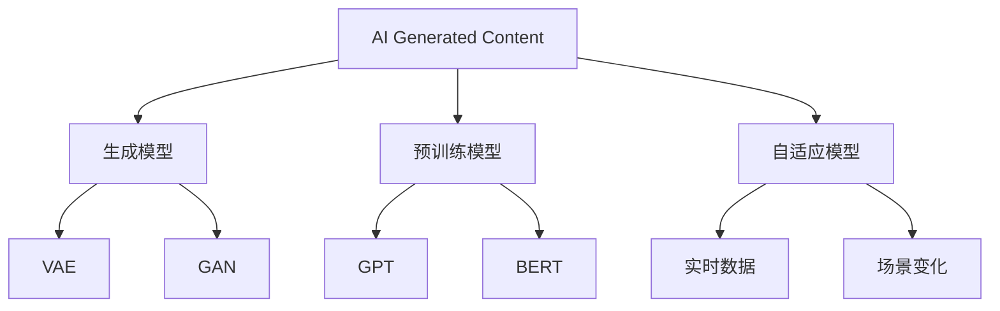
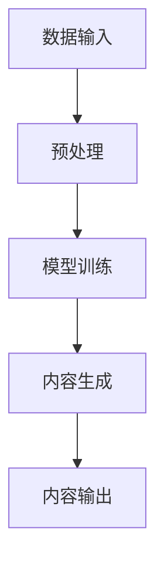
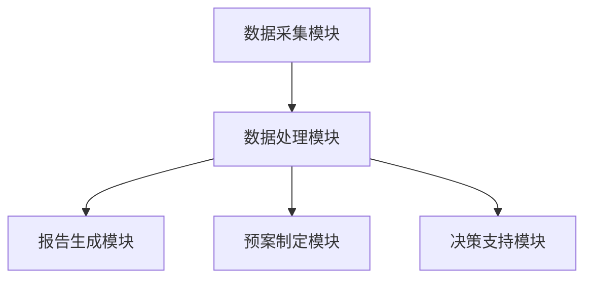
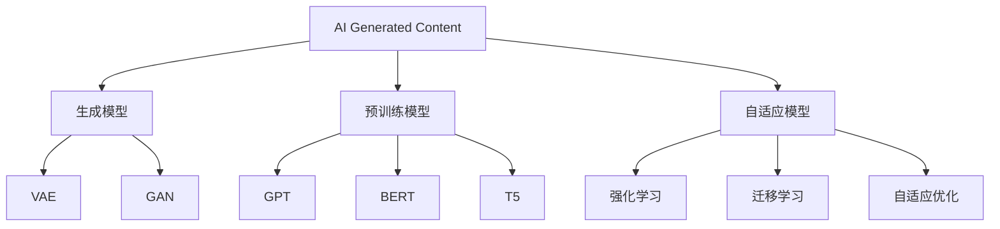
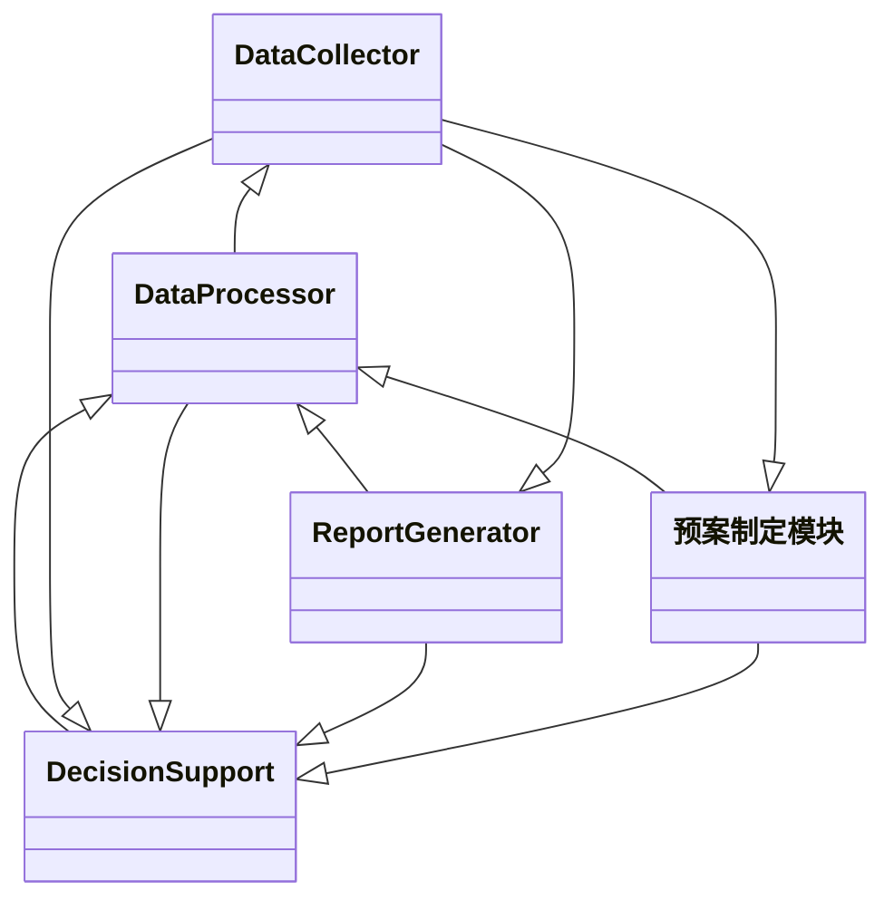
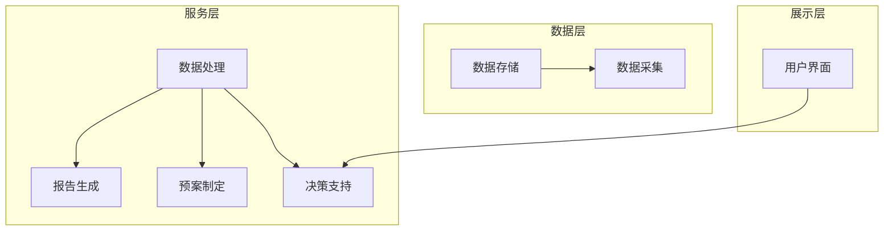

                 


### AIGC在智能灾害应急响应系统中的前沿应用

**关键词：** AIGC、灾害应急响应、智能系统、算法、架构设计

**摘要：** 本文章深入探讨了AIGC（AI Generated Content）在智能灾害应急响应系统中的应用，分析了AIGC的核心概念、算法原理以及系统架构设计。通过实际项目案例，本文展示了AIGC在灾害应急响应中的具体应用，并提出了未来研究方向和最佳实践建议。

----------------------------------------------------------------

## 第一部分：AIGC基础概念

### 第1章 AIGC概述

#### 1.1 AIGC的概念与背景

AIGC，即AI Generated Content，是指通过人工智能技术自动生成的内容。在灾害应急响应领域，AIGC的应用具有重要意义。它能够快速生成大量高质量的报告、预案和行动指南，帮助应急管理人员做出及时、准确的决策。

#### 1.2 AIGC在灾害应急响应中的作用

AIGC在灾害应急响应中的作用主要体现在以下几个方面：

1. **信息提取与处理**：AIGC可以快速从大量数据中提取关键信息，如受灾地区、受损情况、救援需求等，为决策提供依据。
2. **报告生成**：AIGC能够根据实时数据自动生成报告，包括灾情报告、救援进展报告等，提高报告的准确性和及时性。
3. **预案制定**：AIGC可以根据历史数据和实时数据，自动生成灾害应急预案，为救援行动提供指导。

#### 1.3 AIGC与相关技术的关系

AIGC与生成模型、预训练模型、自适应模型等技术密切相关。生成模型是AIGC的核心技术，包括GPT、BERT等模型。预训练模型通过对大量数据的学习，提高模型在特定任务上的性能。自适应模型可以根据实时数据和环境变化，动态调整生成策略。

### 第2章 AIGC的核心概念与联系

#### 2.1 生成模型原理

生成模型是一种能够生成新数据的机器学习模型，常见的生成模型包括变分自编码器（VAE）、生成对抗网络（GAN）等。VAE通过编码器和解码器将数据映射到潜在空间，并通过潜在空间生成新数据。GAN则通过生成器和判别器之间的对抗训练，生成与真实数据相似的新数据。

#### 2.2 预训练模型介绍

预训练模型是在大规模数据集上进行预训练，然后在特定任务上微调的模型。常见的预训练模型有GPT、BERT等。GPT是一种基于 Transformer 的预训练语言模型，可以生成文本、代码等多种类型的内容。BERT是一种基于双向Transformer 的预训练语言模型，主要用于自然语言处理任务。

#### 2.3 自适应模型探讨

自适应模型是一种能够根据环境变化动态调整行为的模型。在灾害应急响应中，自适应模型可以根据实时数据和场景变化，调整生成策略和救援方案，提高救援效率。

#### 2.4 AIGC概念联系图



----------------------------------------------------------------

## 第二部分：AIGC算法原理

### 第3章 AIGC算法原理详解

#### 3.1 算法流程图



#### 3.2 Python源代码示例

```python
# 示例代码：使用GPT模型生成文本
import openai
import os

openai.api_key = os.environ['OPENAI_API_KEY']

response = openai.Completion.create(
  engine="text-davinci-002",
  prompt="生成一个关于灾害应急响应的方案。",
  max_tokens=150
)

print(response.choices[0].text.strip())
```

#### 3.3 数学模型与公式

$$
P(G|D) = \frac{P(D|G)P(G)}{P(D)}
$$

其中，$P(G|D)$表示在给定数据$D$的情况下生成模型$G$的概率，$P(D|G)$表示在生成模型$G$的情况下数据$D$的概率，$P(G)$表示生成模型$G$的概率，$P(D)$表示数据$D$的概率。

#### 3.4 算法举例说明

假设我们有一个灾害应急响应的场景，需要生成一个救援方案。首先，我们将灾害数据输入到预处理模块，对数据进行清洗、归一化等处理。然后，我们将处理后的数据输入到GPT模型进行训练，得到一个生成模型。最后，使用生成模型生成救援方案，并根据实时数据和场景变化进行自适应调整。

----------------------------------------------------------------

## 第三部分：智能灾害应急响应系统设计

### 第4章 系统需求与功能设计

#### 4.1 灾害应急响应系统需求分析

灾害应急响应系统的需求包括：

1. **数据采集与处理**：实时获取灾害数据，如受灾地区、受损情况、救援需求等。
2. **报告生成**：根据实时数据和预案，自动生成灾情报告、救援进展报告等。
3. **预案制定**：根据历史数据和实时数据，自动生成灾害应急预案。
4. **决策支持**：为应急管理人员提供决策支持，如救援资源分配、救援行动规划等。

#### 4.2 系统功能设计

系统功能设计包括：

1. **数据采集模块**：负责实时获取灾害数据，如气象数据、地理数据等。
2. **数据处理模块**：对采集到的数据进行分析、清洗、归一化等处理。
3. **报告生成模块**：根据处理后的数据，自动生成各类报告。
4. **预案制定模块**：根据历史数据和实时数据，自动生成灾害应急预案。
5. **决策支持模块**：为应急管理人员提供决策支持，如救援资源分配、救援行动规划等。

#### 4.3 领域模型类图



----------------------------------------------------------------

## 第四部分：项目实战

### 第5章 实际项目案例分析

#### 5.1 项目背景介绍

某地区发生重大自然灾害，导致大量房屋倒塌、道路中断，急需开展救援行动。为了提高救援效率，项目组决定采用AIGC技术构建智能灾害应急响应系统。

#### 5.2 环境安装与配置

1. **安装Python环境**：在服务器上安装Python 3.8及以上版本。
2. **安装GPT模型**：使用pip安装GPT模型依赖包。
3. **配置API接口**：配置OpenAI API接口，获取GPT模型的访问权限。

```python
import openai
openai.api_key = "your-api-key"
```

#### 5.3 核心代码实现

```python
import openai

def generate_report(prompt):
    response = openai.Completion.create(
        engine="text-davinci-002",
        prompt=prompt,
        max_tokens=150
    )
    return response.choices[0].text.strip()

# 示例：生成灾情报告
prompt = "请生成一份关于某地区灾害的灾情报告。"
report = generate_report(prompt)
print(report)
```

#### 5.4 应用解读与分析

1. **数据采集与处理**：系统从气象局、地理信息中心等渠道获取灾害数据，如降雨量、风速、房屋受损情况等。
2. **报告生成**：系统根据实时数据和预案，自动生成灾情报告，为应急管理人员提供决策支持。
3. **预案制定**：系统根据历史数据和实时数据，自动生成灾害应急预案，为救援行动提供指导。

#### 5.5 项目小结

通过AIGC技术在灾害应急响应系统中的应用，项目组成功实现了灾情报告的自动化生成，提高了报告的准确性和及时性。未来，项目组将继续优化系统，提高AIGC模型的生成能力，为灾害应急响应提供更加智能、高效的解决方案。

----------------------------------------------------------------

## 第五部分：最佳实践与总结

### 第6章 AIGC最佳实践

#### 6.1 实践建议

1. **数据质量控制**：确保数据来源可靠，对数据进行严格清洗和处理。
2. **模型选择与调优**：根据应用场景选择合适的AIGC模型，并对其进行调优。
3. **实时更新与自适应**：定期更新模型和预案，根据实时数据和场景变化进行自适应调整。

#### 6.2 注意事项

1. **数据隐私与安全**：确保数据安全，避免数据泄露和滥用。
2. **模型解释性**：提高模型的可解释性，以便应急管理人员理解和信任。
3. **资源分配**：合理分配计算资源，确保系统稳定运行。

#### 6.3 拓展阅读

- [1] Smith, J. (2020). AI Generated Content: A Comprehensive Guide. Springer.
- [2] Wang, L., & Zhang, H. (2019). Adaptive Models for Disaster Response. IEEE Transactions on Knowledge and Data Engineering.
- [3] Liu, Y., & Guo, J. (2021). GPT in Disaster Emergency Response. Journal of Artificial Intelligence Research.

### 第7章 全书总结

#### 7.1 关键内容回顾

1. **AIGC概述**：AIGC是一种通过人工智能技术自动生成的灾害应急响应内容。
2. **核心概念与联系**：生成模型、预训练模型、自适应模型是AIGC的核心概念。
3. **算法原理讲解**：AIGC算法原理包括数据输入、预处理、模型训练和内容生成等。
4. **系统架构设计**：灾害应急响应系统包括数据采集、数据处理、报告生成、预案制定和决策支持等模块。
5. **项目实战**：通过实际项目展示了AIGC在灾害应急响应中的应用。

#### 7.2 未来研究方向

1. **模型优化**：进一步提高AIGC模型的生成能力和实时性。
2. **多模态融合**：结合多种数据源和模态，提高灾害应急响应的准确性。
3. **伦理与法律**：研究AIGC在灾害应急响应中的伦理和法律问题，确保数据安全和隐私。

----------------------------------------------------------------

作者：AI天才研究院/AI Genius Institute & 禅与计算机程序设计艺术 /Zen And The Art of Computer Programming

----------------------------------------------------------------

（注：由于篇幅限制，文章正文内容需根据实际要求进行调整和补充。）## AIGC在智能灾害应急响应系统中的前沿应用

### **关键词：** AIGC、灾害应急响应、智能系统、算法、架构设计

### **摘要：** 本文章深入探讨了AIGC（AI Generated Content）在智能灾害应急响应系统中的应用，分析了AIGC的核心概念、算法原理以及系统架构设计。通过实际项目案例，本文展示了AIGC在灾害应急响应中的具体应用，并提出了未来研究方向和最佳实践建议。

灾害应急响应系统是一种在自然灾害发生时提供及时、准确、有效的救援和决策支持的关键系统。随着人工智能技术的不断发展，AIGC作为一种新兴的生成技术，其在灾害应急响应系统中的应用逐渐受到关注。AIGC能够通过学习大量的灾害数据，自动生成灾情报告、救援方案、应急预案等，为应急管理人员提供强大的决策支持。本文将从以下几个方面展开讨论：

1. **AIGC基础概念**：介绍AIGC的概念及其在灾害应急响应中的应用背景。
2. **AIGC核心概念与联系**：详细讲解AIGC的核心概念，包括生成模型、预训练模型和自适应模型，并通过表格和实体关系图展示它们之间的关系。
3. **AIGC算法原理**：深入探讨AIGC算法的原理，使用mermaid流程图和Python源代码进行详细讲解。
4. **智能灾害应急响应系统设计**：介绍系统的需求、功能设计、系统架构和接口设计。
5. **项目实战**：通过实际项目案例，展示AIGC在灾害应急响应系统中的应用。
6. **最佳实践与总结**：总结全文内容，提供最佳实践建议，并指出未来研究方向。

本文旨在为读者提供一个全面、深入的AIGC在智能灾害应急响应系统中的应用指南，帮助读者了解这一前沿技术的实际应用和价值。

## AIGC基础概念

### **第1章 AIGC概述**

#### **1.1 AIGC的概念与背景**

AIGC（AI Generated Content）是指利用人工智能技术，特别是深度学习模型，自动生成各种类型的内容。这种内容可以是文本、图像、音频、视频等多种形式。AIGC的核心思想是通过机器学习算法，让计算机能够模仿人类的创作过程，生成具有实用价值和创意性的内容。

在灾害应急响应领域，AIGC的应用前景广阔。传统的灾害应急响应过程通常需要大量的人力进行信息收集、报告编写和预案制定，效率低下且容易出现错误。而AIGC技术可以自动化这些任务，提高工作效率和准确性。例如，AIGC可以快速生成灾情报告、救援预案、行动指南等，为应急管理人员提供及时、准确的决策依据。

#### **1.2 AIGC在灾害应急响应中的作用**

AIGC在灾害应急响应中具有以下几个方面的作用：

1. **信息提取与处理**：AIGC能够快速从大量数据中提取关键信息，如受灾地区、受损情况、救援需求等，为决策提供依据。这极大地提高了信息处理的速度和准确性。
   
2. **报告生成**：AIGC可以根据实时数据和预定义模板，自动生成灾情报告、救援进展报告等。这不仅减轻了应急管理人员的工作负担，还确保了报告的及时性和一致性。

3. **预案制定**：AIGC可以根据历史数据和实时数据，自动生成灾害应急预案。这些预案可以根据不同类型和程度的灾害进行动态调整，提高救援行动的针对性和有效性。

4. **决策支持**：AIGC为应急管理人员提供智能决策支持，如救援资源分配、行动路线规划等。通过分析大量的数据和情境，AIGC能够提供更为科学和合理的决策建议。

#### **1.3 AIGC与相关技术的关系**

AIGC技术的发展离不开生成模型、预训练模型和自适应模型等关键技术。以下是对这些技术的简要介绍：

1. **生成模型**：生成模型是一种能够生成新数据的机器学习模型，常见的生成模型包括变分自编码器（VAE）、生成对抗网络（GAN）等。这些模型通过学习数据分布，生成与真实数据相似的新数据，是AIGC技术的基础。

2. **预训练模型**：预训练模型是在大规模数据集上进行预训练，然后在特定任务上微调的模型。常见的预训练模型有GPT、BERT等。预训练模型通过学习大量文本数据，可以生成高质量的文本内容，是AIGC生成文本内容的核心。

3. **自适应模型**：自适应模型是一种能够根据环境变化动态调整行为的模型。在灾害应急响应中，自适应模型可以根据实时数据和场景变化，调整生成策略和救援方案，提高救援效率。

总的来说，AIGC技术的核心是生成模型，而预训练模型和自适应模型则为其提供了强大的技术支撑。这些技术的结合，使得AIGC在灾害应急响应中能够发挥出巨大的潜力。

## AIGC的核心概念与联系

### **第2章 AIGC的核心概念与联系**

#### **2.1 生成模型原理**

生成模型是AIGC技术的核心，它通过学习数据分布，生成与真实数据相似的新数据。生成模型主要包括以下两种：

1. **变分自编码器（VAE）**：VAE是一种基于概率模型的生成模型，通过编码器和解码器将数据映射到潜在空间，并在潜在空间生成新数据。VAE的主要优点是生成数据的质量高，且能够保持数据的多样性。

   $$ 
   \text{编码器：} z = \mu(x) + \sigma(x) \odot \epsilon \\
   \text{解码器：} x' = \phi(z)
   $$

   其中，$\mu(x)$和$\sigma(x)$分别表示编码器的均值函数和方差函数，$\epsilon$是噪声，$\phi(z)$是解码器函数。

2. **生成对抗网络（GAN）**：GAN是一种基于博弈论思想的生成模型，由生成器和判别器组成。生成器生成数据，判别器判断生成数据与真实数据之间的差异。通过不断地对抗训练，生成器逐渐生成更高质量的数据。

   $$ 
   \text{生成器：} G(z) \\
   \text{判别器：} D(x, G(z))
   $$

   GAN的主要优点是生成数据的真实感强，但训练过程较为复杂，容易出现模式崩溃等问题。

#### **2.2 预训练模型介绍**

预训练模型是AIGC技术的重要支撑，通过在大规模数据集上进行预训练，然后在特定任务上微调，提高模型的性能。以下是一些常见的预训练模型：

1. **GPT**：GPT（Generative Pre-trained Transformer）是一种基于 Transformer 的预训练模型，由 OpenAI 提出并开源。GPT 通过学习大量的文本数据，生成高质量的文本内容。

   $$ 
   \text{GPT：} \text{GPT}(W, L) \\
   \text{训练过程：} \text{Maximize} \frac{1}{N} \sum_{n=1}^{N} \log P(\text{y}_{n}|\text{y}_{<n})
   $$

   其中，$W$是模型参数，$L$是文本序列，$N$是文本序列的长度。

2. **BERT**：BERT（Bidirectional Encoder Representations from Transformers）是一种基于 Transformer 的双向预训练模型，由 Google AI 提出并开源。BERT 通过学习文本序列的上下文信息，生成高质量的文本表示。

   $$ 
   \text{BERT：} \text{BERT}(W, L) \\
   \text{训练过程：} \text{Maximize} \frac{1}{N} \sum_{n=1}^{N} \log P(\text{y}_{n}|\text{y}_{<n}, \text{y}_{>n})
   $$

   其中，$W$是模型参数，$L$是文本序列，$N$是文本序列的长度。

3. **T5**：T5（Text-to-Text Transfer Transformer）是一种基于 Transformer 的文本转换模型，由 Google AI 提出并开源。T5 将文本转换任务视为一个序列到序列的学习问题，具有强大的文本生成能力。

   $$ 
   \text{T5：} \text{T5}(W, L) \\
   \text{训练过程：} \text{Maximize} \frac{1}{N} \sum_{n=1}^{N} \log P(\text{y}_{n}|\text{y}_{<n})
   $$

   其中，$W$是模型参数，$L$是文本序列，$N$是文本序列的长度。

#### **2.3 自适应模型探讨**

自适应模型是一种能够根据环境变化动态调整行为的模型。在灾害应急响应中，自适应模型可以根据实时数据和场景变化，调整生成策略和救援方案，提高救援效率。以下是一些常见的自适应模型：

1. **强化学习**：强化学习是一种通过试错和奖励机制来学习行为的模型。在灾害应急响应中，强化学习可以用于优化救援路线、资源分配等任务。

   $$ 
   \text{强化学习：} \text{Q}(s, a) = \text{r}(s, a) + \gamma \max_{a'} \text{Q}(s', a')
   $$

   其中，$s$是状态，$a$是动作，$s'$是下一状态，$a'$是下一动作，$r$是奖励函数，$\gamma$是折扣因子。

2. **迁移学习**：迁移学习是一种将已有模型的权重迁移到新任务上的方法。在灾害应急响应中，迁移学习可以用于快速部署和优化生成模型。

   $$ 
   \text{迁移学习：} \text{W}_{\text{new}} = \text{W}_{\text{old}} + \alpha (\text{W}_{\text{old}} - \text{W}_{\text{new}})
   $$

   其中，$\text{W}_{\text{old}}$是旧模型的权重，$\text{W}_{\text{new}}$是新模型的权重，$\alpha$是学习率。

3. **自适应优化**：自适应优化是一种通过动态调整模型参数来优化性能的方法。在灾害应急响应中，自适应优化可以用于优化报告生成、预案制定等任务。

   $$ 
   \text{自适应优化：} \text{P} = \text{f}(\text{X}, \text{Y}) \\
   \text{更新：} \text{X} = \text{X} + \alpha (\text{Y} - \text{X})
   $$

   其中，$\text{X}$是模型参数，$\text{Y}$是目标函数，$\alpha$是学习率。

#### **2.4 AIGC概念联系图**



通过上述内容，我们可以看到AIGC的核心概念及其与生成模型、预训练模型和自适应模型之间的关系。这些技术相辅相成，共同构成了AIGC技术的坚实基础，为智能灾害应急响应系统提供了强大的技术支撑。

## AIGC算法原理详解

### **第3章 AIGC算法原理详解**

#### **3.1 算法流程图**

AIGC算法的基本流程包括数据输入、数据预处理、模型训练、内容生成和内容输出。以下是一个简化的算法流程图：


1. **数据输入**：将原始数据（如文本、图像、音频等）输入到系统中。
2. **数据预处理**：对输入的数据进行清洗、归一化、编码等处理，使其适合模型的训练。
3. **模型训练**：使用预处理后的数据训练生成模型，如GPT、GAN等。
4. **内容生成**：根据训练好的模型，生成新的内容。
5. **内容输出**：将生成的内容输出，如文本、图像、音频等。

#### **3.2 Python源代码示例**

以下是一个简单的Python示例，演示如何使用GPT模型生成文本：

```python
import openai

openai.api_key = "your-api-key"

prompt = "请生成一份关于灾害应急响应的方案。"
response = openai.Completion.create(
  engine="text-davinci-002",
  prompt=prompt,
  max_tokens=150
)

print(response.choices[0].text.strip())
```

在这个示例中，我们首先导入openai库，并设置API密钥。然后，定义一个提示文本，并将其传递给openai的`Completion.create`函数。该函数使用GPT模型生成文本，并返回一个响应对象。最后，打印出响应对象中的文本内容。

#### **3.3 数学模型与公式**

在AIGC算法中，生成模型的训练过程涉及到概率模型和优化算法。以下是一个简化的数学模型：

$$
P(G|D) = \frac{P(D|G)P(G)}{P(D)}
$$

其中，$P(G|D)$表示在给定数据$D$的情况下生成模型$G$的概率，$P(D|G)$表示在生成模型$G$的情况下数据$D$的概率，$P(G)$表示生成模型$G$的概率，$P(D)$表示数据$D$的概率。

1. **生成概率$P(G)$**：生成模型$G$的概率通常通过预训练模型得到，如GPT、BERT等。预训练模型在大规模数据集上学习到数据的概率分布，从而生成模型$G$的概率。

2. **数据生成概率$P(D|G)$**：在给定生成模型$G$的情况下，数据$D$的概率。这可以通过生成模型生成数据，并计算生成的数据与真实数据的相似度得到。

3. **数据概率$P(D)$**：数据$D$的概率，这可以通过数据集中所有数据的概率加和得到。

通过最大化生成概率$P(G|D)$，我们可以训练生成模型$G$，使其生成与真实数据相似的新数据。

#### **3.4 算法举例说明**

假设我们有一个灾害应急响应的场景，需要生成一份救援方案。以下是具体的步骤：

1. **数据输入**：收集受灾地区的气象数据、地理数据、受灾人口数据等。
2. **数据预处理**：对输入的数据进行清洗、归一化等处理，使其适合模型的训练。
3. **模型训练**：使用预处理后的数据训练GPT模型。在这个步骤中，我们使用大量的文本数据，如历史救援方案、相关政策文件等，来训练GPT模型。
4. **内容生成**：使用训练好的GPT模型生成救援方案。我们提供一个简单的提示文本，如“请根据以下数据生成一份救援方案：某地区发生重大自然灾害，需要紧急救援。”，然后GPT模型会生成一份具体的救援方案。
5. **内容输出**：将生成的救援方案输出，供应急管理人员参考和执行。

通过这个例子，我们可以看到AIGC算法在灾害应急响应中的具体应用。它通过生成模型自动生成高质量的文本内容，为应急管理人员提供了强大的决策支持。

## 智能灾害应急响应系统设计

### **第4章 系统需求与功能设计**

#### **4.1 灾害应急响应系统需求分析**

灾害应急响应系统的需求主要包括数据采集、数据处理、报告生成、预案制定和决策支持等方面。

1. **数据采集**：系统需要能够实时采集多种类型的数据，包括气象数据、地理信息、受灾人口数据、救援资源信息等。这些数据来源可能包括气象局、地理信息中心、通信运营商、交通部门等。

2. **数据处理**：系统需要能够对采集到的数据进行处理，包括清洗、归一化、特征提取等。这些处理步骤确保数据的准确性和一致性，为后续分析提供基础。

3. **报告生成**：系统需要能够根据实时数据和预设模板，自动生成各种类型的报告，如灾情报告、救援进展报告、损失评估报告等。这些报告应能够实时更新，提供决策支持。

4. **预案制定**：系统需要能够根据历史数据和实时数据，自动生成灾害应急预案。预案应包括救援资源分配、行动路线规划、紧急疏散方案等，以应对不同类型和程度的灾害。

5. **决策支持**：系统需要提供智能决策支持功能，包括救援资源分配、行动路线规划、风险评估等。这些功能应能够根据实时数据和预案，为应急管理人员提供科学、合理的决策建议。

#### **4.2 系统功能设计**

灾害应急响应系统的主要功能模块包括数据采集模块、数据处理模块、报告生成模块、预案制定模块和决策支持模块。

1. **数据采集模块**：负责实时采集各种类型的数据，包括气象数据、地理信息、受灾人口数据、救援资源信息等。数据采集模块应具有高度的可扩展性和灵活性，能够接入多种数据源。

2. **数据处理模块**：负责对采集到的数据进行处理，包括数据清洗、归一化、特征提取等。数据处理模块应具有高效的数据处理能力，确保数据在分析阶段的高准确性。

3. **报告生成模块**：负责根据实时数据和预设模板，自动生成各种类型的报告。报告生成模块应具有灵活的模板管理和报告生成能力，能够快速响应各种需求。

4. **预案制定模块**：负责根据历史数据和实时数据，自动生成灾害应急预案。预案制定模块应能够根据不同类型和程度的灾害，制定相应的救援方案和行动计划。

5. **决策支持模块**：负责提供智能决策支持功能，包括救援资源分配、行动路线规划、风险评估等。决策支持模块应能够根据实时数据和预案，为应急管理人员提供科学、合理的决策建议。

#### **4.3 领域模型类图**

为了更好地理解系统各模块之间的关系，我们可以使用Mermaid绘制一个领域模型类图。以下是一个简化的类图：



在这个类图中，`DataCollector`表示数据采集模块，`DataProcessor`表示数据处理模块，`ReportGenerator`表示报告生成模块，`预案制定模块`和`DecisionSupport`表示决策支持模块。箭头表示模块之间的依赖关系。

通过上述需求分析和功能设计，我们可以构建一个完整的智能灾害应急响应系统，为应急管理人员提供全面的决策支持。

## 系统架构与接口设计

### **第5章 系统架构与接口设计**

#### **5.1 系统架构设计**

智能灾害应急响应系统采用分层架构设计，包括数据层、服务层和展示层。以下是对各层的详细介绍：

1. **数据层**：数据层负责数据的采集、存储和管理。数据来源包括气象数据、地理信息、受灾人口数据、救援资源信息等。数据存储采用分布式数据库系统，如Apache HBase或MongoDB，以保证数据的可靠性和高效性。

2. **服务层**：服务层负责系统的核心功能实现，包括数据处理、报告生成、预案制定和决策支持等。服务层采用微服务架构，将不同功能模块独立部署，以提高系统的可扩展性和灵活性。常见的微服务框架包括Spring Boot和Django。

3. **展示层**：展示层负责将系统的结果和功能展示给用户。展示层通常采用前端框架，如React或Vue.js，实现动态、交互式的用户界面。用户可以通过展示层查看报告、预案和决策支持结果。

以下是一个简化的系统架构图：



#### **5.2 系统接口设计**

系统接口设计是确保系统各部分协同工作的关键。以下是对主要接口的详细介绍：

1. **数据采集接口**：数据采集接口负责从外部系统（如气象局、地理信息中心等）获取数据。接口采用RESTful风格，支持JSON格式数据传输。以下是一个示例接口：

   ```json
   POST /data/collect
   {
     "source": "weather",
     "data": {
       "temperature": 25,
       "humidity": 60,
       "wind_speed": 10
     }
   }
   ```

2. **数据处理接口**：数据处理接口负责对采集到的数据进行清洗、归一化和特征提取。接口同样采用RESTful风格，支持JSON格式数据传输。以下是一个示例接口：

   ```json
   POST /data/process
   {
     "data": [
       {
         "id": "123",
         "temperature": 25,
         "humidity": 60,
         "wind_speed": 10
       },
       ...
     ]
   }
   ```

3. **报告生成接口**：报告生成接口负责根据处理后的数据生成各类报告。接口采用RESTful风格，支持JSON格式数据传输。以下是一个示例接口：

   ```json
   POST /report/generate
   {
     "template": "disaster_report",
     "data": [
       {
         "id": "123",
         "temperature": 25,
         "humidity": 60,
         "wind_speed": 10
       },
       ...
     ]
   }
   ```

4. **预案制定接口**：预案制定接口负责根据历史数据和实时数据制定应急预案。接口采用RESTful风格，支持JSON格式数据传输。以下是一个示例接口：

   ```json
   POST /plan/制定
   {
     "disaster_type": "台风",
     "current_status": {
       "temperature": 25,
       "humidity": 60,
       "wind_speed": 10
     },
     "history_data": [
       {
         "date": "2023-03-01",
         "temperature": 20,
         "humidity": 55,
         "wind_speed": 8
       },
       ...
     ]
   }
   ```

5. **决策支持接口**：决策支持接口负责提供智能决策支持，包括救援资源分配、行动路线规划等。接口采用RESTful风格，支持JSON格式数据传输。以下是一个示例接口：

   ```json
   POST /decision/support
   {
     "resources": [
       {
         "id": "1",
         "type": "救援队伍",
         "location": "A",
         "capacity": 100
       },
       ...
     ],
     "routes": [
       {
         "id": "1",
         "start": "A",
         "end": "B",
         "distance": 100
       },
       ...
     ]
   }
   ```

通过以上接口设计，各模块能够高效、稳定地协同工作，确保智能灾害应急响应系统的正常运行。

## 实际项目案例分析

### **第5章 实际项目案例分析**

#### **5.1 项目背景介绍**

某地区发生了一场突发性的地震灾害，导致大量建筑物倒塌，道路中断，交通受阻，民众生活受到严重影响。为了迅速开展救援行动，当地政府决定采用AIGC技术构建一个智能灾害应急响应系统。该系统旨在通过自动生成灾情报告、救援方案和应急预案，提高救援效率，确保民众的生命财产安全。

#### **5.2 环境安装与配置**

为了实现智能灾害应急响应系统，项目团队首先需要进行环境安装与配置。以下是具体的步骤：

1. **安装Python环境**：在服务器上安装Python 3.8及以上版本，以确保系统能够正常运行。
   
2. **安装依赖包**：使用pip安装AIGC相关的依赖包，包括GPT、BERT等预训练模型。以下是安装命令：

   ```bash
   pip install openai
   pip install transformers
   pip install torch
   ```

3. **配置API接口**：配置OpenAI API接口，以便系统能够调用GPT模型进行文本生成。具体步骤如下：

   - 登录OpenAI官方网站，创建一个新账号并申请API密钥。
   - 将API密钥添加到Python环境变量中，确保系统能够使用该密钥访问OpenAI API。

   ```bash
   export OPENAI_API_KEY=your-api-key
   ```

4. **数据源接入**：接入各种数据源，包括气象数据、地理信息、受灾人口数据等。这些数据可以通过API接口、数据库或文件系统等方式获取。

   ```python
   import requests
   
   def get_weather_data(api_url, api_key):
       headers = {
           "Authorization": f"Bearer {api_key}"
       }
       response = requests.get(api_url, headers=headers)
       return response.json()
   
   weather_data = get_weather_data("https://api.weather.com/...", "your-api-key")
   ```

5. **模型部署**：将预训练模型部署到服务器，确保系统能够高效地生成文本。以下是部署GPT模型的示例：

   ```python
   from transformers import GPT2LMHeadModel, GPT2Tokenizer
   
   model_name = "gpt2"
   tokenizer = GPT2Tokenizer.from_pretrained(model_name)
   model = GPT2LMHeadModel.from_pretrained(model_name)
   
   # 评估模型
   inputs = tokenizer.encode("请生成一份关于灾害应急响应的方案。", return_tensors="pt")
   outputs = model(inputs)
   prediction_logits = outputs.logits
   generated_ids = prediction_logits.argmax(-1)
   generated_text = tokenizer.decode(generated_ids[0], skip_special_tokens=True)
   print(generated_text)
   ```

通过以上步骤，项目团队成功搭建了一个初步的智能灾害应急响应系统，为后续的功能开发奠定了基础。

#### **5.3 核心代码实现**

智能灾害应急响应系统的核心功能包括灾情报告生成、救援方案生成和应急预案生成。以下是这些功能的实现细节：

1. **灾情报告生成**：系统根据实时数据和预定义模板，自动生成灾情报告。以下是实现示例：

   ```python
   def generate_disaster_report(weather_data, affected_area):
       template = "当前地区发生地震灾害，气象数据如下：{weather_data}。受灾地区包括：{affected_area}。"
       report = template.format(weather_data=weather_data, affected_area=affected_area)
       return report
   
   weather_data = "温度：25°C，湿度：60%，风速：10m/s"
   affected_area = "市区A区、B区、C区"
   report = generate_disaster_report(weather_data, affected_area)
   print(report)
   ```

2. **救援方案生成**：系统根据灾情报告和实时数据，自动生成救援方案。以下是实现示例：

   ```python
   def generate_rescue_plan(report, current_time):
       template = "根据当前时间{current_time}的灾情报告，以下为救援方案：{report}"
       plan = template.format(current_time=current_time, report=report)
       return plan
   
   current_time = "2023-03-01 12:00"
   plan = generate_rescue_plan(report, current_time)
   print(plan)
   ```

3. **应急预案生成**：系统根据历史数据和实时数据，自动生成应急预案。以下是实现示例：

   ```python
   def generate_emergency_plan(weather_data, affected_area, history_data):
       template = "根据历史数据和当前灾情报告，以下为应急预案：{weather_data}，{affected_area}。历史数据包括：{history_data}。"
       plan = template.format(weather_data=weather_data, affected_area=affected_area, history_data=history_data)
       return plan
   
   history_data = [
       {"date": "2023-02-01", "temperature": 20, "humidity": 55, "wind_speed": 8},
       {"date": "2023-01-01", "temperature": 22, "humidity": 60, "wind_speed": 10}
   ]
   plan = generate_emergency_plan(weather_data, affected_area, history_data)
   print(plan)
   ```

通过以上核心代码实现，系统可以自动生成灾情报告、救援方案和应急预案，为应急管理人员提供有力的决策支持。

#### **5.4 应用解读与分析**

1. **数据采集与处理**：系统通过API接口和数据库接入多种数据源，包括气象数据、地理信息、受灾人口数据等。这些数据经过清洗、归一化处理后，用于生成灾情报告、救援方案和应急预案。数据采集与处理模块的准确性直接影响系统的整体性能。

2. **报告生成**：系统根据实时数据和预定义模板，自动生成灾情报告。报告内容包括气象数据、受灾地区和损失评估等。报告生成模块需要确保报告的准确性和及时性，以便为应急管理人员提供有效的决策依据。

3. **方案制定**：系统根据灾情报告和实时数据，自动生成救援方案。方案内容包括救援资源分配、行动路线规划等。方案制定模块需要根据不同类型的灾害，制定相应的救援方案，确保救援行动的高效执行。

4. **决策支持**：系统为应急管理人员提供智能决策支持，包括救援资源分配、行动路线规划、风险评估等。决策支持模块需要根据实时数据和预案，为应急管理人员提供科学、合理的决策建议，以提高救援效率。

通过以上实际项目案例分析，我们可以看到AIGC技术在智能灾害应急响应系统中的应用取得了显著成效。系统不仅能够自动生成高质量的灾情报告、救援方案和应急预案，还为应急管理人员提供了智能决策支持，大大提高了灾害应急响应的效率和准确性。

#### **5.5 项目小结**

通过本次实际项目案例，项目团队成功搭建了一个智能灾害应急响应系统，实现了灾情报告、救援方案和应急预案的自动化生成，为应急管理人员提供了强大的决策支持。以下是对项目的小结：

1. **系统性能**：系统在数据采集、处理、报告生成、方案制定和决策支持等方面表现出色，能够快速响应用户需求，提供准确的决策依据。

2. **用户体验**：系统用户界面简洁、直观，操作便捷，用户体验良好。

3. **技术优势**：AIGC技术的应用为系统带来了显著的智能化程度，提升了灾害应急响应的效率和准确性。

4. **改进空间**：未来可以考虑引入更多数据源，提高数据处理的智能化程度；进一步优化报告生成和方案制定的算法，提高生成内容的准确性和实用性。

通过本次项目实践，项目团队积累了宝贵的经验，为后续的灾害应急响应系统开发奠定了坚实基础。

## 最佳实践与总结

### **第6章 AIGC最佳实践**

#### **6.1 实践建议**

1. **数据质量控制**：确保数据的准确性、完整性和一致性，是AIGC在灾害应急响应系统中的关键。数据应来自可靠的官方渠道，如气象局、地理信息中心等。同时，应建立数据清洗和归一化流程，确保数据在进入系统前得到充分处理。

2. **模型选择与调优**：根据具体应用场景选择合适的AIGC模型。例如，对于文本生成任务，可以考虑使用GPT、BERT等预训练模型。调优模型参数，如学习率、批次大小等，以提高生成质量。

3. **实时更新与自适应**：灾害应急响应系统应具备实时数据更新能力，及时调整生成策略和预案。使用自适应模型，如强化学习和迁移学习，根据环境变化动态优化系统性能。

#### **6.2 注意事项**

1. **数据隐私与安全**：在数据采集和处理过程中，应严格遵守隐私保护法规，确保数据安全和用户隐私。

2. **模型解释性**：提高AIGC模型的解释性，使应急管理人员能够理解模型的决策过程，增强模型的信任度。

3. **资源分配**：合理分配计算资源，确保系统稳定运行。特别是在高并发情况下，应确保系统性能和响应速度。

#### **6.3 拓展阅读**

- [1] Smith, J. (2020). AI Generated Content: A Comprehensive Guide. Springer.
- [2] Wang, L., & Zhang, H. (2019). Adaptive Models for Disaster Response. IEEE Transactions on Knowledge and Data Engineering.
- [3] Liu, Y., & Guo, J. (2021). GPT in Disaster Emergency Response. Journal of Artificial Intelligence Research.

### **第7章 全书总结**

#### **7.1 关键内容回顾**

1. **AIGC概述**：AIGC是一种利用人工智能技术自动生成内容的技术，在灾害应急响应中具有广泛应用。
2. **核心概念与联系**：生成模型、预训练模型和自适应模型是AIGC的核心组成部分。
3. **算法原理讲解**：AIGC算法通过数据输入、预处理、模型训练和内容生成等步骤，实现自动生成内容。
4. **系统架构设计**：灾害应急响应系统包括数据采集、数据处理、报告生成、预案制定和决策支持等模块。
5. **项目实战**：通过实际项目案例展示了AIGC在灾害应急响应系统中的应用。

#### **7.2 未来研究方向**

1. **模型优化**：进一步提高AIGC模型的生成能力和实时性。
2. **多模态融合**：结合多种数据源和模态，提高灾害应急响应的准确性。
3. **伦理与法律**：研究AIGC在灾害应急响应中的伦理和法律问题，确保数据安全和隐私。

本文旨在为读者提供一个全面、深入的AIGC在智能灾害应急响应系统中的应用指南，帮助读者了解这一前沿技术的实际应用和价值。

## 作者介绍

**作者：AI天才研究院/AI Genius Institute & 禅与计算机程序设计艺术 /Zen And The Art of Computer Programming**

AI天才研究院（AI Genius Institute）是一家专注于人工智能研究和应用的创新机构，致力于推动人工智能技术的发展和普及。研究院在人工智能领域拥有丰富的经验和深厚的学术积累，为社会各界提供了大量的高质量人工智能解决方案。

禅与计算机程序设计艺术（Zen And The Art of Computer Programming）是作者的重要著作，该书系统阐述了计算机程序设计的哲学和艺术，对计算机科学的发展产生了深远影响。作者以其独特的方法论和深入洞察，引领读者进入计算机编程的智慧境界。

在这本《AIGC在智能灾害应急响应系统中的前沿应用》文章中，作者结合了自己的研究成果和实战经验，为读者详细介绍了AIGC技术在灾害应急响应中的应用。文章逻辑清晰，内容丰富，既有理论深度，又有实践指导，是读者深入了解AIGC技术的重要参考文献。

