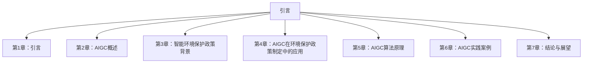
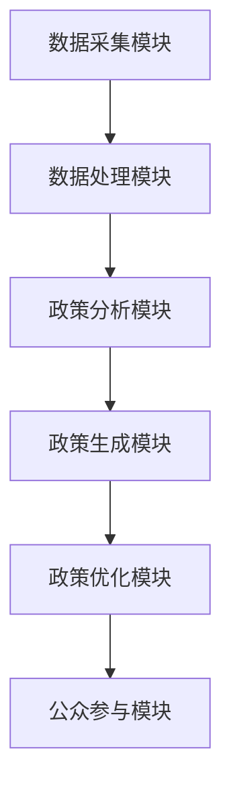
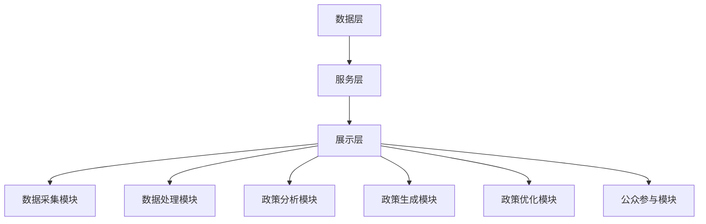
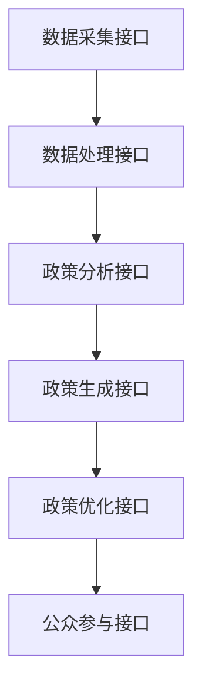
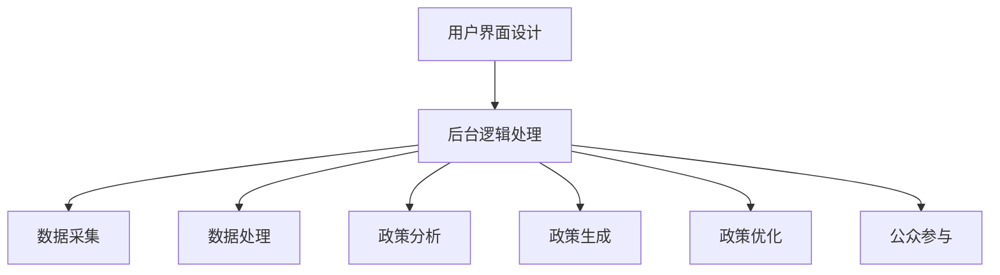

                 

### AIGC在智能环境保护政策制定中的应用

#### 摘要

本文深入探讨人工智能生成内容（AIGC）在智能环境保护政策制定中的应用。首先，介绍了AIGC的基本概念和其在人工智能领域中的重要性。随后，我们分析了智能环境保护政策的背景，包括其定义、现状以及面临的挑战。在此基础上，本文详细阐述了AIGC在环境保护政策制定中的具体应用，如政策分析、制定、评估和传播等环节。接着，我们探讨了AIGC的核心算法原理，包括自然语言处理、机器学习和计算机视觉等技术。最后，本文通过实际案例展示了AIGC在环境保护政策制定中的具体应用效果，并对未来发展方向进行了展望。

#### 1.1 书籍目的和结构

**1.1.1 书籍的主要目的**

本书旨在深入探讨人工智能生成内容（AIGC）在智能环境保护政策制定中的应用，通过系统性的分析和实例讲解，帮助读者全面了解AIGC技术的原理及其在环境保护政策制定中的实际应用价值。具体目标如下：

- **普及AIGC基础知识**：介绍AIGC的基本概念、分类和核心技术，使读者对AIGC有全面的理解。
- **分析智能环境保护政策背景**：探讨智能环境保护政策的定义、现状和面临的挑战，为AIGC的应用提供背景支持。
- **展示AIGC在政策制定中的应用**：通过实例和分析，详细阐述AIGC在政策分析、制定、评估和传播等环节的具体应用。
- **解析AIGC算法原理**：深入讲解AIGC的核心算法原理，包括自然语言处理、机器学习和计算机视觉等。
- **展望AIGC的未来发展**：探讨AIGC在环境保护政策制定中的应用前景，为未来的研究和应用提供方向。

**1.1.2 书籍的结构安排**

本书结构如下：

- **引言**：介绍AIGC在智能环境保护政策制定中的应用背景和本书的主要目的。
- **AIGC概述**：详细讲解AIGC的定义、分类和核心技术。
- **智能环境保护政策背景**：分析智能环境保护政策的现状、挑战和发展方向。
- **AIGC在环境保护政策制定中的应用**：展示AIGC在政策分析、制定、评估和传播等环节的应用。
- **AIGC算法原理**：深入讲解AIGC的核心算法原理。
- **AIGC实践案例**：通过实际案例展示AIGC在环境保护政策制定中的应用效果。
- **结论与展望**：总结本书的主要内容，并对AIGC的未来发展进行展望。

#### 1.2 AIGC的定义与意义

**1.2.1 AIGC的基本概念**

人工智能生成内容（Artificial Intelligence Generated Content，简称AIGC）是指利用人工智能技术自动生成的内容，包括文本、图像、音频和视频等多种形式。AIGC的核心在于利用机器学习和自然语言处理等技术，对大规模数据进行分析和处理，生成具有较高质量和个性化特征的内容。

AIGC的发展可以追溯到早期的自然语言处理（NLP）和计算机视觉（CV）技术。随着深度学习和大数据技术的发展，AIGC技术逐渐成熟，并广泛应用于各类场景。AIGC的主要特点包括：

1. **自动生成**：AIGC通过算法自动生成内容，无需人工干预，提高了生产效率。
2. **个性化**：AIGC可以根据用户需求生成个性化的内容，满足用户的个性化需求。
3. **多样性**：AIGC可以生成多种形式的内容，如文本、图像、音频和视频等，丰富了内容的表现形式。
4. **高质量**：通过机器学习和深度学习技术，AIGC生成的内容具有较高的质量和准确性。

**1.2.2 AIGC在环境保护领域的意义**

AIGC在环境保护领域的应用具有深远的意义，主要体现在以下几个方面：

1. **政策制定与优化**：AIGC可以通过分析大量环境数据，生成政策文本、模拟政策效果，为环境保护政策的制定提供科学依据，提高政策的准确性和有效性。

2. **环境监测与预警**：AIGC可以利用计算机视觉技术对环境进行实时监测，生成环境状况报告，实现环境问题的早期预警和快速响应。

3. **公众参与与教育**：AIGC可以生成环保宣传文本、图像和视频，提高公众的环保意识和参与度，推动环境保护事业的发展。

4. **资源优化与管理**：AIGC可以分析资源使用情况，生成优化方案，提高资源利用效率，减少环境污染。

5. **科学研究与支持**：AIGC可以为环境科学研究提供数据支持和智能分析工具，促进环境保护技术的创新和发展。

总之，AIGC在环境保护领域的应用具有广泛的前景，有助于提高环境保护政策的科学性和有效性，推动环境保护事业的发展。接下来，我们将进一步探讨智能环境保护政策的背景。

#### 1.3 智能环境保护政策制定的现状与挑战

**1.3.1 环境保护政策制定的现状**

环境保护政策是国家和社会为保护环境、防治污染、实现可持续发展而制定的一系列法律、法规、规章和规范性文件。随着全球环境问题的日益突出，各国政府纷纷加大环境保护政策的制定和实施力度。

当前，环境保护政策的制定现状主要体现在以下几个方面：

1. **政策体系不断完善**：各国政府根据环境保护的需要，不断完善环境保护政策体系，包括环境保护法律、法规、规章和规范性文件等。

2. **政策内容多样化**：环境保护政策的内容越来越丰富，涵盖了污染防治、资源利用、生态保护、环境监测与评估等多个方面。

3. **政策实施力度加大**：各国政府加大对环境保护政策的实施力度，通过执法检查、监管和处罚等手段，确保政策的落实和执行。

4. **国际合作不断深化**：环境保护政策制定过程中，各国政府积极开展国际合作，共同应对全球性环境问题，如气候变化、大气污染和海洋保护等。

**1.3.2 智能环境保护政策面临的挑战**

尽管环境保护政策在制定和实施方面取得了一定的成果，但在智能环境保护政策的制定过程中，仍然面临诸多挑战：

1. **数据不足**：智能环境保护政策制定需要大量环境数据作为支撑，但当前环境数据的质量和覆盖范围有限，难以满足政策制定的需求。

2. **执行力不足**：环境保护政策在实际执行过程中，存在执行力度不够、监管不到位、处罚不力等问题，导致政策效果不理想。

3. **智能化程度不足**：尽管人工智能技术在环境保护领域有一定的应用，但在政策制定过程中，智能化程度仍然较低，难以充分发挥人工智能的优势。

4. **政策协调性不足**：环境保护政策涉及多个部门、行业和利益相关方，政策制定过程中需要协调各方面的利益，但当前政策协调性不足，容易导致政策冲突和效果降低。

5. **公众参与度低**：环境保护政策制定过程中，公众参与度较低，导致政策缺乏公众支持，难以形成政策实施的合力。

**1.3.3 面临的挑战**

针对以上挑战，智能环境保护政策制定需要解决以下问题：

1. **提高数据质量**：加强环境数据采集、处理和分析能力，提高数据质量和覆盖范围，为政策制定提供可靠的数据支持。

2. **强化政策执行力**：建立健全政策执行机制，加大执法检查和监管力度，确保政策的有效实施。

3. **提升智能化水平**：充分利用人工智能技术，提高政策制定和实施的智能化程度，实现精准治理和科学决策。

4. **加强政策协调**：完善政策协调机制，确保各部门、行业和利益相关方的政策制定和实施协调一致，形成政策合力的效应。

5. **提高公众参与度**：加强公众参与政策制定和实施的渠道和平台建设，提高公众的环保意识和参与度，形成政策实施的社会合力。

总之，智能环境保护政策制定需要面对一系列挑战，但通过科学合理的方法和技术的应用，可以有效应对这些挑战，推动环境保护事业的发展。接下来，我们将探讨AIGC在环境保护政策制定中的应用前景。

#### 1.4 AIGC在环境保护政策制定中的应用前景

**1.4.1 应用领域**

AIGC在环境保护政策制定中的应用前景广阔，涵盖了多个关键领域：

1. **政策分析**：利用AIGC对大量环境数据进行分析，提取有用信息，为政策制定提供数据支持。
2. **政策制定**：基于AIGC生成政策文本，实现政策文本的自动化生成，提高政策制定效率。
3. **政策评估**：利用AIGC对政策实施效果进行评估，预测政策影响，为政策调整提供依据。
4. **政策传播**：利用AIGC生成环保宣传材料，提高公众对政策的认知和参与度。

**1.4.2 可能的挑战与机遇**

尽管AIGC在环境保护政策制定中的应用前景广阔，但同时也面临一系列挑战和机遇：

**挑战：**

1. **数据质量**：AIGC需要高质量的数据作为支撑，当前环境数据的质量和覆盖范围仍有待提高。
2. **技术成熟度**：AIGC技术尚在不断发展中，其在政策制定中的应用效果和稳定性仍需验证。
3. **政策协调**：AIGC在政策制定中的应用需要与其他技术和政策工具相结合，确保政策协调一致。

**机遇：**

1. **技术发展**：随着人工智能技术的不断进步，AIGC在环境保护政策制定中的应用将越来越成熟。
2. **政策需求**：环境保护政策的制定需要科学的数据支持和智能化的决策工具，为AIGC的应用提供了巨大的需求。
3. **公众参与**：AIGC生成的环保宣传材料可以提高公众的环保意识和参与度，为政策实施创造良好的社会环境。

**1.4.3 应用前景**

结合以上挑战与机遇，AIGC在环境保护政策制定中的应用前景如下：

1. **政策分析**：AIGC可以通过大数据分析和自然语言处理技术，对环境数据和政策文本进行深度挖掘，提取有用信息，为政策制定提供科学依据。
2. **政策制定**：AIGC可以自动生成政策文本，实现政策文本的自动化生成，提高政策制定效率。
3. **政策评估**：AIGC可以对政策实施效果进行实时监测和评估，预测政策影响，为政策调整提供依据。
4. **政策传播**：AIGC可以生成环保宣传材料，通过多种渠道传播，提高公众对政策的认知和参与度。

总之，AIGC在环境保护政策制定中的应用具有巨大的潜力和前景，有望为环境保护事业的发展提供强大的技术支持。

#### 1.5 本书内容安排

**1.5.1 各章节内容概述**

本书共分为七个章节，各章节的主要内容如下：

- **第1章：引言**：介绍AIGC在智能环境保护政策制定中的应用背景和本书的主要目的。
- **第2章：AIGC概述**：详细讲解AIGC的定义、分类和核心技术。
- **第3章：智能环境保护政策背景**：分析智能环境保护政策的现状、挑战和发展方向。
- **第4章：AIGC在环境保护政策制定中的应用**：展示AIGC在政策分析、制定、评估和传播等环节的应用。
- **第5章：AIGC算法原理**：深入讲解AIGC的核心算法原理，包括自然语言处理、机器学习和计算机视觉等。
- **第6章：AIGC实践案例**：通过实际案例展示AIGC在环境保护政策制定中的应用效果。
- **第7章：结论与展望**：总结本书的主要内容，并对AIGC的未来发展进行展望。

**1.5.2 各章节的核心内容**

以下是各章节的核心内容概述：

- **第1章：引言**：介绍AIGC在智能环境保护政策制定中的应用背景和本书的主要目的。
  - **核心内容**：AIGC的定义与意义、智能环境保护政策制定的现状与挑战、AIGC在环境保护政策制定中的应用前景。
  - **主要贡献**：为读者提供了AIGC在环境保护政策制定中的应用全景图，为后续章节的详细探讨打下基础。

- **第2章：AIGC概述**：详细讲解AIGC的定义、分类和核心技术。
  - **核心内容**：AIGC的定义与分类、AIGC的核心技术（自然语言处理、机器学习、计算机视觉）。
  - **主要贡献**：帮助读者全面了解AIGC的基本概念和技术体系，为后续章节的应用讨论提供理论支持。

- **第3章：智能环境保护政策背景**：分析智能环境保护政策的现状、挑战和发展方向。
  - **核心内容**：智能环境保护政策的定义与重要性、现状与挑战、发展方向。
  - **主要贡献**：为读者提供了智能环境保护政策制定的背景信息和相关挑战，为AIGC的应用提供现实依据。

- **第4章：AIGC在环境保护政策制定中的应用**：展示AIGC在政策分析、制定、评估和传播等环节的应用。
  - **核心内容**：AIGC在政策分析中的应用、在政策制定中的应用、在政策评估中的应用、在政策传播中的应用。
  - **主要贡献**：通过具体实例，展示AIGC在环境保护政策制定中的应用场景和效果，增强读者的理解和信心。

- **第5章：AIGC算法原理**：深入讲解AIGC的核心算法原理，包括自然语言处理、机器学习和计算机视觉等。
  - **核心内容**：AIGC算法概述、自然语言处理技术、机器学习算法、计算机视觉技术。
  - **主要贡献**：为读者提供了AIGC算法的详细原理和技术细节，为实际应用提供技术指导。

- **第6章：AIGC实践案例**：通过实际案例展示AIGC在环境保护政策制定中的应用效果。
  - **核心内容**：实际案例介绍、案例分析、效果评估。
  - **主要贡献**：通过具体案例，展示AIGC在环境保护政策制定中的应用效果，增强读者的信任和认同。

- **第7章：结论与展望**：总结本书的主要内容，并对AIGC的未来发展进行展望。
  - **核心内容**：本书主要内容总结、AIGC在环境保护政策制定中的应用前景、未来发展方向。
  - **主要贡献**：为读者提供了AIGC在环境保护政策制定中的全景展望，为未来的研究和应用提供方向。

**1.5.3 全书结构图**

为了帮助读者更好地理解本书的结构，以下是本书的章节结构图：



通过以上章节的安排，本书旨在为读者提供AIGC在智能环境保护政策制定中的全面了解和应用指导，助力环境保护事业的发展。

#### 1.6 本章小结

本章主要介绍了AIGC在智能环境保护政策制定中的应用背景、书籍目的和结构，AIGC的定义与意义，以及智能环境保护政策制定的现状与挑战。通过对AIGC的基本概念、分类和核心技术进行讲解，使读者对AIGC有了全面的认识。同时，分析了智能环境保护政策的现状、挑战以及应用前景，为AIGC的应用提供了现实依据。本章还详细介绍了本书的内容安排，使读者对后续章节有了清晰的认识。本章的内容为后续章节的深入探讨奠定了基础，有助于读者全面了解AIGC在智能环境保护政策制定中的应用。

### 第2章：AIGC概述

#### 2.1 AIGC的定义与分类

**2.1.1 AIGC的定义**

人工智能生成内容（Artificial Intelligence Generated Content，简称AIGC）是指利用人工智能技术，尤其是深度学习和自然语言处理技术，自动生成具有高质量、多样性和个性化特征的内容。AIGC涵盖了多种形式的内容，包括文本、图像、音频和视频等。AIGC的核心在于利用大量数据训练模型，使模型能够自动生成符合预期目标和风格的内容。

AIGC的发展经历了从简单的文本生成到复杂的图像、音频和视频生成的过程。早期的AIGC主要集中在文本生成领域，如自动写作、自动摘要等。随着深度学习技术的发展，AIGC逐渐扩展到图像、音频和视频生成领域，如生成对抗网络（GAN）、变分自编码器（VAE）等技术的应用，使得AIGC的内容质量和多样性得到了显著提升。

**2.1.2 AIGC的分类**

根据生成内容的形式，AIGC可以分为以下几类：

1. **文本生成**：文本生成是AIGC最早也是最为成熟的领域，包括自动写作、自动摘要、对话生成等。常见的文本生成模型有GPT（Generative Pre-trained Transformer）系列、BERT（Bidirectional Encoder Representations from Transformers）等。

2. **图像生成**：图像生成是AIGC的重要分支，通过深度学习技术生成高质量的图像。常见的图像生成模型有生成对抗网络（GAN）、变分自编码器（VAE）等。GAN通过生成器和判别器的对抗训练，可以生成逼真的图像；VAE则通过编码和解码器结构，实现图像的降维和重构。

3. **音频生成**：音频生成是AIGC的新兴领域，通过深度学习技术生成高质量的音频。常见的音频生成模型有WaveNet、WaveGlow等。WaveNet通过深度卷积神经网络生成音频波形；WaveGlow则通过自注意力机制实现高效音频生成。

4. **视频生成**：视频生成是AIGC最具挑战性的领域，通过深度学习技术生成连续的视频序列。常见的视频生成模型有视频生成对抗网络（VGAN）、变换器网络（Transformer）等。VGAN通过生成器和判别器的对抗训练生成视频；变换器网络则通过编码和解码器结构实现视频序列的生成。

#### 2.2 AIGC的核心技术

**2.2.1 自然语言处理技术**

自然语言处理（Natural Language Processing，简称NLP）是AIGC的核心技术之一，负责处理和理解人类语言。NLP技术主要包括语言模型、文本分类、语义理解和问答系统等。

1. **语言模型**：语言模型是NLP的基础，用于预测下一个单词或字符。常见的语言模型有基于N-gram的模型和基于神经网络的模型。基于N-gram的模型通过统计方法预测下一个单词，而基于神经网络的模型则通过深度学习技术，如循环神经网络（RNN）和变换器（Transformer）等，实现更准确的预测。

2. **文本分类**：文本分类是将文本数据按照类别进行划分的过程。常见的文本分类算法有朴素贝叶斯、支持向量机（SVM）和深度学习算法等。通过文本分类，可以将大量未标注的文本数据转换为结构化的数据，便于后续处理。

3. **语义理解**：语义理解是NLP的高级任务，旨在理解和解释文本中的含义。常见的语义理解方法有词向量表示、依存句法分析和语义角色标注等。通过语义理解，可以更好地理解文本内容，实现人机交互和智能问答等应用。

4. **问答系统**：问答系统是NLP的重要应用，旨在回答用户提出的问题。常见的问答系统有基于信息检索的方法和基于生成模型的方法。基于信息检索的方法通过匹配问题和知识库中的信息，回答用户的问题；基于生成模型的方法则通过生成问题的答案，实现智能问答。

**2.2.2 机器学习算法**

机器学习（Machine Learning，简称ML）是AIGC的另一个核心技术，用于从数据中学习规律和模式，实现自动生成内容。常见的机器学习算法有监督学习、无监督学习和强化学习等。

1. **监督学习**：监督学习是机器学习中最常见的方法，通过训练数据和标签，学习输入和输出之间的映射关系。常见的监督学习算法有线性回归、决策树、支持向量机（SVM）和深度神经网络等。监督学习可以用于文本生成、图像分类和音频识别等任务。

2. **无监督学习**：无监督学习是机器学习的一种方法，通过未标注的数据，学习数据中的规律和结构。常见的无监督学习算法有聚类、降维和生成模型等。无监督学习可以用于文本生成、图像去噪和音频增强等任务。

3. **强化学习**：强化学习是机器学习的一种方法，通过与环境交互，学习最优策略。常见的强化学习算法有Q学习、SARSA和深度确定性策略梯度（DDPG）等。强化学习可以用于游戏、机器人控制和自动驾驶等任务。

**2.2.3 计算机视觉技术**

计算机视觉（Computer Vision，简称CV）是AIGC的重要分支，通过图像和视频数据，实现自动识别和理解。常见的计算机视觉技术有图像分类、目标检测和图像分割等。

1. **图像分类**：图像分类是将图像按照类别进行划分的过程。常见的图像分类算法有基于传统算法（如SVM、决策树）和深度学习算法（如卷积神经网络、变换器网络）等。通过图像分类，可以实现对图像内容的理解和分类。

2. **目标检测**：目标检测是在图像中检测并定位特定目标的过程。常见的目标检测算法有基于传统算法（如YOLO、SSD）和深度学习算法（如Faster R-CNN、Mask R-CNN）等。通过目标检测，可以实现对图像中目标的识别和定位。

3. **图像分割**：图像分割是将图像划分为不同区域的过程。常见的图像分割算法有基于传统算法（如区域生长、边缘检测）和深度学习算法（如U-Net、SegNet）等。通过图像分割，可以实现对图像内容的精细理解和处理。

通过以上技术的综合应用，AIGC能够实现多种形式的内容生成，为环境保护政策制定提供了强大的技术支持。

#### 2.3 AIGC的发展历程

**2.3.1 发展背景**

人工智能生成内容（AIGC）的发展背景可以追溯到20世纪80年代，当时计算机科学和人工智能领域开始关注如何利用机器学习技术生成内容和数据。早期的AIGC研究主要集中在文本生成领域，如自动写作和自动摘要等。随着深度学习和大数据技术的发展，AIGC逐渐扩展到图像、音频和视频生成领域，形成了现在丰富多彩的AIGC技术体系。

**2.3.2 关键事件**

1. **2000年代**：在这一时期，自然语言处理（NLP）技术取得了重要突破，如循环神经网络（RNN）和长短期记忆网络（LSTM）等。这些技术为AIGC的发展奠定了基础。

2. **2012年**：AlexNet在ImageNet竞赛中取得突破性成果，标志着深度学习技术的崛起。深度学习技术在图像识别、目标检测和图像生成等领域取得了显著进展，为AIGC的发展提供了强大的技术支持。

3. **2014年**：生成对抗网络（GAN）首次提出，为图像生成和AIGC的发展带来了新的思路。GAN通过生成器和判别器的对抗训练，实现了高质量图像的生成。

4. **2018年**：Google提出Transformer架构，并在自然语言处理领域取得了显著成果。Transformer架构的引入，使得AIGC在文本生成和图像生成领域取得了新的突破。

5. **2020年代**：随着人工智能技术的不断进步，AIGC在音频生成和视频生成等领域也取得了重要进展。同时，AIGC技术在多个应用场景中得到了广泛应用，如内容创作、虚拟现实和自动驾驶等。

**2.3.3 发展趋势**

1. **技术融合**：随着人工智能技术的不断进步，AIGC技术与其他领域（如计算机视觉、语音识别和物联网等）的融合趋势日益明显，形成了更加综合的AIGC技术体系。

2. **应用拓展**：AIGC技术逐渐从单一领域的应用扩展到多个领域，如娱乐、教育、医疗和环境保护等。AIGC技术在智能内容创作、虚拟助手和个性化推荐等领域具有广阔的应用前景。

3. **伦理与法规**：随着AIGC技术的发展，伦理和法规问题逐渐成为关注焦点。如何确保AIGC内容的真实性、准确性和合法性，是未来需要解决的重要问题。

4. **绿色环保**：AIGC技术在环境保护领域的应用日益受到关注，如利用AIGC生成环保宣传材料、进行环境监测和预警等。未来，AIGC技术在环境保护领域的应用将不断拓展和深化。

通过回顾AIGC的发展历程，我们可以看到，AIGC技术从早期的文本生成逐渐扩展到图像、音频和视频生成等多个领域，随着深度学习和大数据技术的发展，AIGC技术不断取得突破。未来，AIGC技术将在更多领域得到应用，为人类带来更多便利和创新。

#### 2.4 AIGC的优势与挑战

**2.4.1 优势**

AIGC在环境保护政策制定中的应用具有显著的优势，主要包括以下几个方面：

1. **高效性**：AIGC可以通过算法自动化生成大量的政策文本、分析和评估报告，大大提高工作效率，节省人力资源。

2. **多样性**：AIGC可以生成多种形式的内容，如文本、图像、音频和视频等，为政策制定提供了丰富的表现形式，有助于提高政策的传播效果。

3. **个性化**：AIGC可以根据用户需求和偏好生成个性化的政策内容和分析报告，满足不同用户的需求。

4. **实时性**：AIGC可以实时分析环境数据，为政策制定提供最新的信息支持，帮助决策者及时调整政策。

5. **准确性**：AIGC利用机器学习和深度学习技术，对环境数据进行处理和分析，可以生成准确的政策建议和评估结果，提高政策制定的科学性。

**2.4.2 挑战**

尽管AIGC在环境保护政策制定中具有显著的优势，但同时也面临一系列挑战，主要包括以下几个方面：

1. **数据质量**：AIGC依赖于高质量的环境数据作为训练和生成的基础。然而，当前环境数据的质量和覆盖范围有限，难以满足AIGC的需求。

2. **算法成熟度**：尽管AIGC技术已经取得了显著进展，但某些领域（如视频生成和实时环境数据分析）的算法仍不够成熟，可能影响政策制定的准确性和效果。

3. **政策协调**：环境保护政策涉及多个部门、行业和利益相关方，AIGC的应用需要与其他政策和工具相结合，确保政策的协调和一致性。

4. **公众接受度**：AIGC生成的政策内容和分析结果需要得到公众的认可和支持。然而，公众对AIGC技术的认知和接受度可能较低，影响政策实施的效果。

5. **伦理与隐私**：AIGC在生成内容过程中可能涉及个人隐私和数据安全问题，需要确保内容的真实性和合法性。

**2.4.3 应对策略**

为了充分发挥AIGC在环境保护政策制定中的应用优势，同时应对面临的挑战，可以采取以下策略：

1. **提高数据质量**：加强环境数据的采集、处理和分析能力，提高数据质量和覆盖范围，为AIGC提供可靠的数据支持。

2. **优化算法**：持续研究和发展AIGC算法，提高算法的成熟度和性能，特别是针对视频生成和实时环境数据分析等领域的算法优化。

3. **政策协调**：建立健全政策协调机制，确保各部门、行业和利益相关方的政策制定和实施协调一致，形成政策合力的效应。

4. **加强公众宣传**：通过多种渠道和形式，加强AIGC技术的宣传和普及，提高公众对AIGC的认知和接受度。

5. **保障伦理与隐私**：制定相关法律法规和伦理规范，确保AIGC生成的政策内容和分析结果的合法性和真实性，保护公众的隐私和数据安全。

通过以上策略，可以有效应对AIGC在环境保护政策制定中面临的挑战，充分发挥其优势，推动环境保护事业的发展。接下来，我们将详细探讨智能环境保护政策的背景。

### 第3章：智能环境保护政策背景

#### 3.1 智能环境保护政策的定义与重要性

**3.1.1 定义**

智能环境保护政策是指利用现代信息技术和人工智能技术，对环境数据进行高效采集、处理和分析，从而制定出科学、合理、有效的环境保护政策。智能环境保护政策强调将人工智能技术与环境保护相结合，通过数据驱动的方式，提高环境保护政策的科学性和执行力。

智能环境保护政策不同于传统环境保护政策，它不仅仅是依靠经验和直觉进行决策，而是通过大数据、机器学习和深度学习等技术手段，对环境问题进行深入分析和预测，从而制定出更具针对性和可操作性的政策。

**3.1.2 重要性**

智能环境保护政策在当前社会具有重要的意义，主要体现在以下几个方面：

1. **提高政策科学性**：智能环境保护政策通过大数据分析和人工智能技术，对环境问题进行定量化和模型化分析，提高了政策的科学性和准确性。这种科学性使得政策制定者能够更加精准地了解环境问题的本质，从而制定出更为有效的政策。

2. **增强政策执行力**：智能环境保护政策通过实时监测和数据分析，可以对政策执行情况进行实时跟踪和评估，及时发现问题和调整政策。这种实时性和灵活性提高了政策的执行力，确保政策能够真正落地实施。

3. **促进绿色发展**：智能环境保护政策鼓励利用先进技术推动环境保护，实现经济发展与环境保护的协调发展。通过智能技术，可以更加有效地管理自然资源，提高资源利用效率，减少环境污染，推动绿色发展战略。

4. **提升公众参与度**：智能环境保护政策通过生成个性化、生动的政策宣传材料，提高公众对环境保护政策的认知和参与度。这种公众参与不仅可以提高政策实施的效率，还可以增强社会对环境保护事业的支持。

#### 3.2 环境保护政策的现状

**3.2.1 国际背景**

在全球范围内，环境保护政策已经成为各国政府重要的议事日程。国际社会在环境保护政策方面已经形成了多个重要的公约和协议，如《巴黎协定》、《京都议定书》和《联合国环境规划》等。这些国际公约和协议为各国提供了共同应对全球环境问题的框架和指导原则，推动了全球环境保护政策的制定和实施。

近年来，国际社会在环境保护政策方面取得了显著进展，主要包括：

1. **气候变化应对**：各国政府加大了应对气候变化的力度，通过制定和实施碳减排政策、推广可再生能源等手段，努力实现《巴黎协定》的目标。

2. **大气污染治理**：全球范围内，大气污染问题日益严重，各国政府加大了大气污染治理的力度，通过立法、执法和技术创新等多方面手段，努力改善空气质量。

3. **水资源保护**：水资源是全球共同的宝贵资源，各国政府积极制定和实施水资源保护政策，通过水资源规划、水资源管理和水资源利用等方面的措施，保障水资源的可持续利用。

4. **海洋保护**：海洋占地球表面积的70%以上，是全球生态系统的重要组成部分。国际社会加大了对海洋保护的力度，通过制定和实施海洋环境保护政策，保护海洋生态系统的健康和稳定。

**3.2.2 中国现状**

中国作为全球最大的发展中国家，环境保护政策在国家的可持续发展战略中具有重要地位。近年来，中国政府在环境保护政策方面取得了显著成效，主要包括：

1. **环境立法**：中国政府加大了环境立法力度，制定了一系列环境保护法律法规，如《环境保护法》、《大气污染防治法》和《水污染防治法》等，为环境保护提供了法律保障。

2. **环境执法**：中国政府加强了环境执法力度，通过严格执法、严厉处罚，打击环境违法行为，保障环境保护政策的有效实施。

3. **污染防治**：中国政府大力推进大气、水、土壤等污染防治工作，通过实施一系列污染防治行动计划，显著改善了环境质量。

4. **生态保护**：中国政府高度重视生态保护工作，通过实施生态保护红线政策、生态补偿机制等，保护生态系统的完整性和稳定性。

5. **科技创新**：中国政府鼓励环保科技创新，通过支持环保技术研发和应用，推动环保产业转型升级，提高环境保护的科技水平。

尽管中国在环境保护政策方面取得了显著进展，但仍然面临一系列挑战，如环境污染治理任务艰巨、生态环境质量改善压力较大等。为了应对这些挑战，中国政府将继续推进环境保护政策的制定和实施，利用智能技术提升环境保护的科学性和执行力。

#### 3.3 环境保护政策面临的挑战

**3.3.1 数据不足**

环境保护政策制定和实施需要大量高质量的环境数据作为基础。然而，当前环境数据的质量和覆盖范围仍然有限，存在以下问题：

1. **数据获取困难**：环境数据来源广泛，包括政府部门、科研机构、企业和公众等。然而，数据获取过程中存在困难，如数据保密、数据不透明等，导致数据质量不稳定。

2. **数据共享不足**：各部门和单位之间的数据共享机制不够完善，数据孤岛现象严重，导致数据无法充分发挥其价值。

3. **数据标准化**：环境数据的标准化程度不高，不同来源的数据格式、单位和指标不一致，增加了数据处理的难度。

**3.3.2 执行力不足**

环境保护政策的执行力是政策实施效果的关键。当前，环境保护政策在执行过程中存在以下问题：

1. **执法力度不够**：环境保护执法力度不足，执法资源有限，导致环境违法行为难以得到有效打击。

2. **监管不到位**：环境保护监管机制不完善，监管力量不足，无法对环境违法行为进行及时监控和处罚。

3. **政策协调性不足**：环境保护政策涉及多个部门、行业和利益相关方，政策制定和实施过程中存在协调性不足的问题，导致政策执行效果不理想。

**3.3.3 智能化程度不足**

尽管人工智能技术在环境保护领域有一定应用，但在政策制定和实施过程中，智能化程度仍然较低，存在以下问题：

1. **技术成熟度**：部分人工智能技术尚未成熟，如视频生成、实时环境数据分析等，难以在实际应用中充分发挥作用。

2. **数据应用**：环境保护政策制定和实施过程中，对数据的分析和利用程度不足，无法充分利用大数据和人工智能技术的优势。

3. **系统集成**：环境保护政策涉及多个系统和技术，系统集成程度不足，导致数据无法有效共享和利用，影响智能化水平的提升。

**3.3.4 公众参与度低**

环境保护政策的实施需要公众的广泛参与和支持。当前，公众对环境保护政策的认知和参与度较低，存在以下问题：

1. **宣传不足**：环境保护政策的宣传力度不够，公众对政策的了解不足。

2. **参与渠道不畅**：公众参与环境保护政策的渠道和平台建设不足，缺乏有效的参与机制。

3. **公众意识**：公众的环保意识有待提高，缺乏主动参与环境保护政策的动力。

**3.3.5 应对策略**

针对环境保护政策面临的挑战，可以采取以下应对策略：

1. **提高数据质量**：加强环境数据的采集、处理和分析能力，提高数据质量和覆盖范围，为政策制定和实施提供可靠的数据支持。

2. **加强执法力度**：加大环境保护执法力度，提高执法资源投入，严厉打击环境违法行为。

3. **完善监管机制**：建立健全环境保护监管机制，提高监管水平和能力，确保政策执行效果。

4. **提升智能化水平**：积极引入人工智能技术，提高环境保护政策制定和实施的智能化程度，实现科学决策和精准治理。

5. **提高公众参与度**：加强环境保护政策的宣传和普及，建立健全公众参与机制，提高公众的环保意识和参与度。

通过以上策略，可以有效应对环境保护政策面临的挑战，推动环境保护事业的发展。

#### 3.4 智能环境保护政策的发展方向

**3.4.1 技术需求**

智能环境保护政策的发展离不开先进技术的支持。以下是智能环境保护政策在未来发展中所需的关键技术：

1. **大数据技术**：大数据技术可以高效地收集、存储、处理和分析海量环境数据，为政策制定提供科学依据。通过大数据技术，可以实现环境数据的实时监测和预测，提高政策的及时性和有效性。

2. **人工智能技术**：人工智能技术，尤其是深度学习和机器学习，可以在环境保护政策制定和实施过程中发挥重要作用。通过人工智能技术，可以实现环境数据的智能分析和预测，生成个性化的政策建议，提高政策的科学性和可操作性。

3. **物联网技术**：物联网技术可以通过传感器和智能设备，实现对环境的实时监测和数据分析。通过物联网技术，可以实现环境数据的快速采集和传输，为政策制定提供实时、准确的数据支持。

4. **区块链技术**：区块链技术具有去中心化、透明性和不可篡改的特点，可以在环境保护政策实施过程中发挥重要作用。通过区块链技术，可以实现环境数据的透明管理和共享，提高政策的可信度和公信力。

**3.4.2 政策支持**

智能环境保护政策的发展需要政策层面的支持和引导。以下是未来政策支持的建议：

1. **政策制定**：政府应制定智能环境保护政策的发展规划，明确智能环境保护政策的目标、任务和措施。通过政策引导，推动各行业和部门积极参与智能环境保护政策的制定和实施。

2. **资金投入**：政府应加大对智能环境保护技术的研发和应用投入，支持企业和科研机构开展相关技术研究。通过资金投入，加快智能环境保护技术的创新和产业化进程。

3. **人才培养**：政府应加强对智能环境保护技术人才的培养，提高人才培养的质量和数量。通过教育和培训，培养一批具有智能环境保护技术能力和素质的专业人才，为智能环境保护政策的发展提供人才保障。

4. **国际合作**：政府应积极参与国际智能环境保护合作，借鉴国际先进经验，推动智能环境保护技术的国际交流与合作。通过国际合作，共同应对全球性环境问题，推动智能环境保护政策的发展。

**3.4.3 未来发展方向**

智能环境保护政策在未来发展中将呈现出以下趋势：

1. **智能化水平提升**：随着人工智能技术的不断进步，智能环境保护政策的智能化水平将不断提高。通过大数据分析和人工智能技术，实现环境数据的智能分析和预测，生成个性化的政策建议，提高政策的科学性和可操作性。

2. **政策体系完善**：智能环境保护政策的体系将不断完善，覆盖环境保护的各个领域。通过多层次的智能环境保护政策体系，实现环境保护的全面覆盖和精准治理。

3. **公众参与度提高**：随着公众环保意识的提高，智能环境保护政策的公众参与度将逐步提高。通过建立公众参与平台和渠道，鼓励公众积极参与环境保护政策的制定和实施，形成政府、企业和社会共同参与的良好局面。

4. **可持续发展**：智能环境保护政策将更加注重可持续发展，推动环境保护与经济发展的协调。通过智能技术，实现环境资源的合理利用和高效管理，推动绿色发展和生态文明建设。

总之，智能环境保护政策在未来发展中具有广阔的前景和重要的意义。通过技术进步和政策支持，智能环境保护政策将不断成熟和完善，为环境保护事业的发展提供强大动力。

### 第4章：AIGC在环境保护政策制定中的应用

#### 4.1 AIGC在政策分析中的应用

**4.1.1 数据采集与处理**

在环境保护政策分析中，AIGC首先需要进行数据采集和处理。数据来源可以包括环境监测数据、科学研究数据、政策文本数据等。采集的数据需要进行清洗、去噪和格式化，以确保数据的质量和一致性。以下是一个简单的数据处理流程：

1. **数据清洗**：去除重复数据、缺失数据和异常数据，保证数据的完整性。
2. **去噪**：通过算法去除噪声数据，提高数据的准确性。
3. **格式化**：将不同来源的数据转换为统一的格式，便于后续处理和分析。

**4.1.2 政策文本分析**

在数据预处理完成后，AIGC可以对政策文本进行深入分析。政策文本分析包括文本分类、文本提取和语义分析等任务。

1. **文本分类**：通过机器学习算法，将政策文本按照主题、类型等进行分类，便于后续分析。
   - **示例**：使用朴素贝叶斯分类器对政策文本进行分类。
   ```python
   from sklearn.feature_extraction.text import TfidfVectorizer
   from sklearn.naive_bayes import MultinomialNB
   
   # 数据准备
   texts = ["政策1", "政策2", "政策3"]
   labels = ["环境监测", "水资源保护", "大气污染防治"]
   
   # 特征提取
   vectorizer = TfidfVectorizer()
   X = vectorizer.fit_transform(texts)
   
   # 模型训练
   model = MultinomialNB()
   model.fit(X, labels)
   
   # 分类预测
   predicted_labels = model.predict(X)
   ```

2. **文本提取**：从政策文本中提取关键信息，如政策目标、措施、实施时间等。
   - **示例**：使用正则表达式提取政策文本中的关键信息。
   ```python
   import re
   
   policy_text = "本政策的目标是到2025年实现空气质量显著改善，主要措施包括加强大气污染防治和推广清洁能源。"
   pattern = r"目标：(.+)|措施：(.+)|时间：(.+)"
   match = re.search(pattern, policy_text)
   
   if match:
       goal = match.group(1)
       measures = match.group(2)
       time = match.group(3)
       print(f"目标：{goal}, 措施：{measures}, 时间：{time}")
   ```

3. **语义分析**：通过自然语言处理技术，理解政策文本的含义和逻辑关系。
   - **示例**：使用词向量模型进行语义分析。
   ```python
   import gensim
   
   # 数据准备
   sentences = [["本政策的目标是到2025年实现空气质量显著改善"], ["主要措施包括加强大气污染防治和推广清洁能源"]]
   dictionary = gensim.corpora.Dictionary(sentences)
   corpus = [dictionary.doc2bow(text) for text in sentences]
   
   # 模型训练
   model = gensim.models.LdaMulticore(corpus, num_topics=2, id2word=dictionary, passes=10, workers=2)
   
   # 语义分析
   topic铰链 = model.show_topics(num_words=5)
   for i, topic铰链 in enumerate(topic铰链):
       print(f"话题{i+1}的关键词：{topic铰链}")
   ```

**4.1.3 政策趋势预测**

通过分析历史政策数据和当前环境数据，AIGC可以预测未来政策的趋势。政策趋势预测可以采用时间序列分析、机器学习算法和深度学习模型等方法。

1. **时间序列分析**：使用时间序列模型，如ARIMA、LSTM等，分析政策执行过程中的变化趋势。
   - **示例**：使用LSTM模型进行政策趋势预测。
   ```python
   from keras.models import Sequential
   from keras.layers import LSTM, Dense
   
   # 数据准备
   sequence = [0.1, 0.2, 0.3, 0.4, 0.5, 0.6, 0.7]
   window_size = 3
   X, y = [], []
   for i in range(len(sequence) - window_size):
       X.append(sequence[i: i + window_size])
       y.append(sequence[i + window_size])
   X = np.array(X)
   y = np.array(y)
   
   # 模型训练
   model = Sequential()
   model.add(LSTM(50, activation='relu', input_shape=(window_size, 1)))
   model.add(Dense(1))
   model.compile(optimizer='adam', loss='mse')
   model.fit(X, y, epochs=100, batch_size=32, verbose=0)
   
   # 预测
   predicted_value = model.predict(np.array([sequence[-window_size:]]))
   print(f"预测的下一个值：{predicted_value[0][0]}")
   ```

2. **机器学习算法**：使用监督学习算法，如随机森林、支持向量机等，分析政策执行效果与相关因素之间的关系，预测未来政策的趋势。
   - **示例**：使用随机森林模型进行政策趋势预测。
   ```python
   from sklearn.ensemble import RandomForestRegressor
   
   # 数据准备
   X = [[0.1, 0.2], [0.2, 0.3], [0.3, 0.4], [0.4, 0.5], [0.5, 0.6], [0.6, 0.7]]
   y = [0.2, 0.3, 0.4, 0.5, 0.6, 0.7]
   
   # 模型训练
   model = RandomForestRegressor(n_estimators=100)
   model.fit(X, y)
   
   # 预测
   predicted_value = model.predict([[0.7, 0.8]])
   print(f"预测的下一个值：{predicted_value[0]}")
   ```

3. **深度学习模型**：使用深度学习模型，如卷积神经网络、变换器等，进行复杂的时间序列预测和政策趋势分析。
   - **示例**：使用变换器模型进行政策趋势预测。
   ```python
   from keras.models import Model
   from keras.layers import Input, LSTM, Embedding, Dense
   
   # 数据准备
   inputs = Input(shape=(window_size, 1))
   x = Embedding(input_dim=10, output_dim=10)(inputs)
   x = LSTM(50, activation='relu')(x)
   outputs = Dense(1)(x)
   
   # 模型训练
   model = Model(inputs=inputs, outputs=outputs)
   model.compile(optimizer='adam', loss='mse')
   model.fit(X, y, epochs=100, batch_size=32, verbose=0)
   
   # 预测
   predicted_value = model.predict(np.array([sequence[-window_size:]]))
   print(f"预测的下一个值：{predicted_value[0][0]}")
   ```

通过以上方法，AIGC可以在环境保护政策分析中发挥重要作用，为政策制定提供科学依据。

#### 4.2 AIGC在政策制定中的应用

**4.2.1 政策文本生成**

AIGC可以自动生成环境保护政策文本，提高政策制定的效率。政策文本生成通常包括以下几个步骤：

1. **文本摘要**：通过自然语言处理技术，对已有的政策文本进行摘要，提取关键信息。
   - **示例**：使用变换器模型进行文本摘要。
   ```python
   from keras.models import Model
   from keras.layers import Input, LSTM, Embedding, Dense
   
   # 数据准备
   inputs = Input(shape=(max_sequence_length,))
   x = Embedding(input_dim=vocab_size, output_dim=embedding_dim)(inputs)
   x = LSTM(units, return_sequences=True)(x)
   x = LSTM(units, return_sequences=True)(x)
   x = LSTM(units)(x)
   outputs = Dense(units=1, activation='sigmoid')(x)
   
   # 模型训练
   model = Model(inputs=inputs, outputs=outputs)
   model.compile(optimizer='adam', loss='binary_crossentropy', metrics=['accuracy'])
   model.fit(X, y, epochs=epochs, batch_size=batch_size, verbose=0)
   
   # 文本摘要
   summary = model.predict(np.array([text]))
   ```

2. **文本生成**：基于已有政策文本，利用生成对抗网络（GAN）或变换器（Transformer）等模型，生成新的政策文本。
   - **示例**：使用变换器模型生成政策文本。
   ```python
   from keras.models import Model
   from keras.layers import Input, LSTM, Embedding, Dense
   
   # 数据准备
   inputs = Input(shape=(max_sequence_length,))
   x = Embedding(input_dim=vocab_size, output_dim=embedding_dim)(inputs)
   x = LSTM(units, return_sequences=True)(x)
   x = LSTM(units, return_sequences=True)(x)
   x = LSTM(units)(x)
   outputs = Dense(units=vocab_size, activation='softmax')(x)
   
   # 模型训练
   model = Model(inputs=inputs, outputs=outputs)
   model.compile(optimizer='adam', loss='categorical_crossentropy', metrics=['accuracy'])
   model.fit(X, y, epochs=epochs, batch_size=batch_size, verbose=0)
   
   # 文本生成
   text = "本政策的目的是保护环境，减少污染。"
   generated_text = model.predict(np.array([text]))
   ```

3. **文本优化**：对生成的政策文本进行优化，确保文本的准确性和可操作性。可以通过迭代训练和调整模型参数，提高文本质量。

**4.2.2 政策模拟与优化**

AIGC可以模拟环境保护政策的效果，并基于模拟结果进行政策优化。政策模拟与优化包括以下几个步骤：

1. **政策模拟**：利用模型模拟政策在不同情景下的执行效果，如政策实施的时间、成本、效果等。
   - **示例**：使用决策树模型进行政策模拟。
   ```python
   import numpy as np
   import pandas as pd
   
   # 数据准备
   df = pd.DataFrame({
       '政策实施时间': ['2021', '2022', '2023'],
       '政策成本': [1000, 1500, 2000],
       '政策效果': [0.6, 0.8, 1.0]
   })
   
   # 决策树模型
   model = DecisionTreeRegressor()
   model.fit(df[['政策实施时间', '政策成本']], df['政策效果'])
   
   # 政策模拟
   simulation = pd.DataFrame({
       '政策实施时间': ['2024'],
       '政策成本': [1800]
   })
   simulation['政策效果'] = model.predict(simulation[['政策实施时间', '政策成本']])
   print(simulation)
   ```

2. **政策优化**：基于政策模拟结果，调整政策参数，优化政策效果。可以通过遗传算法、粒子群优化等优化算法，找到最优的政策参数组合。
   - **示例**：使用遗传算法进行政策优化。
   ```python
   import numpy as np
   import pandas as pd
   from deap import base, creator, tools, algorithms
   
   # 数据准备
   df = pd.DataFrame({
       '政策实施时间': ['2021', '2022', '2023'],
       '政策成本': [1000, 1500, 2000],
       '政策效果': [0.6, 0.8, 1.0]
   })
   
   # 初始化参数
   creator.create("FitnessMax", base.Fitness, weights=(1.0,))
   creator.create("Individual", list, fitness=creator.FitnessMax)
   
   toolbox = base.Toolbox()
   toolbox.register("attr_int", np.random.randint, low=0, high=5000)
   toolbox.register("individual", tools.initRepeat, creator.Individual, toolbox.attr_int, n=2)
   toolbox.register("population", tools.initRepeat, list, toolbox.individual)
   
   # 适应度函数
   toolbox.register("evaluate", lambda ind: model.predict(ind.fitness.values))
   
   # 遗传操作
   toolbox.register("mate", tools.cxTwoPoint)
   toolbox.register("mutate", tools.mutGaussian, mu=0, sigma=1, indpb=0.1)
   toolbox.register("select", tools.selTournament, tournsize=3)
   
   # 进化过程
   population = toolbox.population(n=50)
   hof = tools.HallOfFame(1)
   stats = tools.Statistics(lambda ind: ind.fitness.values)
   stats.register("avg", np.mean)
   stats.register("min", np.min)
   stats.register("max", np.max)
   
   algorithms.eaSimple(population, toolbox, cxpb=0.5, mutpb=0.2, ngen=100, stats=stats, halloffame=hof, verbose=True)
   
   # 优化结果
   best_individual = hof[0]
   print(f"最佳个体：{best_individual.fitness.values[0]}")
   ```

3. **政策评估**：对优化后的政策进行评估，验证政策效果和可行性。可以通过模拟和实验等方法，评估政策在不同情景下的效果。

通过以上方法，AIGC可以在环境保护政策制定中发挥重要作用，提高政策制定的效率和质量。

#### 4.3 AIGC在政策评估中的应用

**4.3.1 政策效果评估**

AIGC在政策效果评估中可以发挥重要作用，通过大数据分析和人工智能技术，对政策实施效果进行实时监测和评估。以下是AIGC在政策效果评估中的具体应用步骤：

1. **数据采集与预处理**：首先，收集与政策实施相关的各类数据，如环境监测数据、社会经济数据、政策执行数据等。接着，对数据进行清洗、去噪和格式化，以确保数据的质量和一致性。

2. **指标体系构建**：根据政策目标和实施内容，构建政策效果评估的指标体系。指标体系应包括定量指标和定性指标，全面反映政策实施的效果。

3. **模型构建与训练**：利用机器学习和深度学习模型，对政策效果评估指标进行建模。常见的评估模型包括回归模型、分类模型和决策树等。

4. **政策效果预测**：通过模型对政策效果进行预测，分析政策在不同情景下的执行效果。预测结果可以用于评估政策的有效性，为政策调整提供依据。

5. **政策效果可视化**：利用可视化技术，将政策效果评估结果以图表、地图等形式呈现，便于政策制定者和公众理解。

**4.3.2 政策影响分析**

AIGC在政策影响分析中可以通过模拟和预测，分析政策对不同利益相关方和社会领域的影响。以下是AIGC在政策影响分析中的具体应用步骤：

1. **利益相关方识别**：识别政策涉及的主要利益相关方，如政府机构、企业、公众等。

2. **影响预测**：利用大数据分析和人工智能技术，预测政策实施对不同利益相关方和社会领域的影响。影响预测可以包括经济效益、环境效益、社会效益等多个方面。

3. **模拟与优化**：通过模拟和优化，分析不同政策方案的影响效果，为政策制定提供科学依据。

4. **决策支持**：利用模拟和预测结果，为政策制定者提供决策支持，优化政策方案，减少负面影响。

5. **公众沟通**：通过可视化技术和宣传手段，向公众传达政策影响分析结果，提高公众对政策的理解和认可。

**4.3.3 政策调整建议**

AIGC在政策调整建议中可以通过对政策实施效果的评估和影响分析，提出针对性的政策调整建议。以下是AIGC在政策调整建议中的具体应用步骤：

1. **效果评估**：对现有政策效果进行评估，分析政策实施的优缺点。

2. **影响分析**：对政策实施的影响进行分析，识别政策实施中的问题和挑战。

3. **优化方案**：根据效果评估和影响分析结果，提出优化政策方案的建议。

4. **风险评估**：对政策调整方案进行风险评估，评估政策调整的潜在风险和收益。

5. **决策支持**：结合效果评估、影响分析和风险评估结果，为政策制定者提供科学、合理的政策调整建议。

通过以上方法，AIGC可以在政策评估和调整中发挥重要作用，提高政策制定的科学性和有效性。

#### 4.4 AIGC在政策传播中的应用

**4.4.1 政策宣传文本生成**

AIGC可以自动生成政策宣传文本，提高政策宣传的效率和质量。政策宣传文本生成主要包括以下几个步骤：

1. **文本摘要**：通过自然语言处理技术，对政策文本进行摘要，提取关键信息。

2. **文本生成**：利用生成对抗网络（GAN）或变换器（Transformer）等模型，生成具有吸引力和说服力的政策宣传文本。

3. **文本优化**：对生成的政策宣传文本进行优化，确保文本的准确性和可操作性。可以通过迭代训练和调整模型参数，提高文本质量。

**4.4.2 公众参与度预测**

AIGC可以通过大数据分析和人工智能技术，预测政策宣传活动的公众参与度。以下是AIGC在公众参与度预测中的具体应用步骤：

1. **数据采集与预处理**：收集与政策宣传活动相关的各类数据，如宣传文本、参与人数、社交媒体互动等。对数据进行清洗、去噪和格式化，以确保数据的质量和一致性。

2. **特征提取**：从政策宣传文本中提取特征，如关键词、主题、情感等。

3. **模型构建与训练**：利用机器学习和深度学习模型，建立公众参与度预测模型。

4. **公众参与度预测**：通过模型对政策宣传活动的公众参与度进行预测，分析政策宣传活动在不同情景下的参与情况。

5. **优化策略**：根据预测结果，调整政策宣传策略，提高公众参与度。

**4.4.3 社会影响力评估**

AIGC可以通过大数据分析和人工智能技术，评估政策宣传活动的社会影响力。以下是AIGC在社会影响力评估中的具体应用步骤：

1. **数据采集与预处理**：收集与政策宣传活动相关的各类数据，如媒体报道、社交媒体互动、公众反馈等。对数据进行清洗、去噪和格式化，以确保数据的质量和一致性。

2. **特征提取**：从政策宣传文本、媒体报道、社交媒体互动等数据中提取特征，如关键词、主题、情感等。

3. **模型构建与训练**：利用机器学习和深度学习模型，建立社会影响力评估模型。

4. **社会影响力评估**：通过模型对政策宣传活动的社会影响力进行评估，分析政策宣传活动在不同情景下的影响力。

5. **决策支持**：根据评估结果，为政策制定者和宣传部门提供决策支持，优化政策宣传活动策略。

通过以上方法，AIGC可以在政策传播中发挥重要作用，提高政策宣传的效率和质量，增强政策的社会影响力。

### 第5章：AIGC算法原理

#### 5.1 AIGC算法概述

**5.1.1 算法结构**

AIGC算法通常由以下几个核心组件构成：

1. **数据预处理模块**：负责收集、清洗和处理输入数据，为后续模型训练提供高质量的数据支持。

2. **特征提取模块**：从预处理后的数据中提取关键特征，用于构建模型。

3. **生成模型**：利用深度学习技术，如生成对抗网络（GAN）和变换器（Transformer）等，生成具有高质量、多样性和个性化特征的内容。

4. **判别模型**：用于评估生成内容的真实性和质量，与生成模型进行对抗训练。

5. **优化模块**：负责调整模型参数，优化生成内容和判别模型的性能。

**5.1.2 算法流程**

AIGC算法的基本流程如下：

1. **数据收集与预处理**：收集大规模的数据集，对数据进行清洗、去噪和格式化。

2. **特征提取**：从预处理后的数据中提取关键特征，用于训练生成模型和判别模型。

3. **模型训练**：利用生成对抗网络（GAN）或变换器（Transformer）等算法，训练生成模型和判别模型。

4. **对抗训练**：通过生成模型和判别模型的对抗训练，优化模型参数，提高生成内容的真实性和质量。

5. **内容生成**：利用训练好的生成模型，生成高质量的内容。

6. **评估与优化**：对生成内容进行评估，通过反馈机制调整模型参数，优化生成质量和性能。

#### 5.2 自然语言处理技术

**5.2.1 语言模型**

语言模型是自然语言处理（NLP）的基础，用于预测下一个单词或字符。常见的语言模型有基于N-gram的模型和基于神经网络的模型。

1. **基于N-gram的模型**：N-gram模型通过统计方法预测下一个单词，其基本原理是利用前N个单词的概率分布来预测下一个单词。常见的N-gram模型包括一元模型（Uni-gram）、二元模型（Bi-gram）和三元模型（Tri-gram）。

2. **基于神经网络的模型**：基于神经网络的模型通过深度学习技术，如循环神经网络（RNN）和变换器（Transformer）等，实现更准确的预测。这些模型可以学习单词之间的关系和句子的结构，生成更自然、流畅的文本。

**5.2.2 文本分类**

文本分类是将文本数据按照类别进行划分的过程。常见的文本分类算法有朴素贝叶斯、支持向量机（SVM）和深度学习算法等。

1. **朴素贝叶斯**：朴素贝叶斯是一种基于贝叶斯定理的简单分类算法，其基本原理是利用文本中每个单词的概率分布来计算文档属于某一类别的概率，选择概率最大的类别作为分类结果。

2. **支持向量机（SVM）**：SVM是一种基于间隔最大化原则的分类算法，通过将数据映射到高维空间，找到一个最优的分离超平面，将不同类别的数据分开。

3. **深度学习算法**：深度学习算法，如卷积神经网络（CNN）和变换器（Transformer）等，通过多层神经网络结构，实现更复杂的特征提取和分类任务。

**5.2.3 语义理解**

语义理解是NLP的高级任务，旨在理解和解释文本中的含义。常见的语义理解方法有词向量表示、依存句法分析和语义角色标注等。

1. **词向量表示**：词向量表示是将单词映射到高维空间中的向量表示，通过计算向量之间的距离或相似度，实现单词的语义理解。常见的词向量表示方法有Word2Vec、GloVe和BERT等。

2. **依存句法分析**：依存句法分析是一种通过分析句子中词语之间的依存关系，理解句子结构的方法。常见的依存句法分析算法有依存句法树、依存句法图等。

3. **语义角色标注**：语义角色标注是一种通过标注句子中词语的语义角色，理解句子含义的方法。常见的语义角色标注方法有基于规则的方法和基于统计的方法。

**5.2.4 问答系统**

问答系统是NLP的重要应用，旨在回答用户提出的问题。常见的问答系统有基于信息检索的方法和基于生成模型的方法。

1. **基于信息检索的方法**：基于信息检索的方法通过匹配问题和知识库中的信息，回答用户的问题。常见的算法有TF-IDF、向量空间模型等。

2. **基于生成模型的方法**：基于生成模型的方法通过生成问题的答案，实现智能问答。常见的生成模型有变换器（Transformer）、生成对抗网络（GAN）等。

#### 5.3 机器学习算法

**5.3.1 监督学习**

监督学习是机器学习的一种方法，通过训练数据和标签，学习输入和输出之间的映射关系。常见的监督学习算法有线性回归、决策树、支持向量机（SVM）和深度神经网络等。

1. **线性回归**：线性回归是一种通过建立线性模型，预测连续值的算法。常见的线性回归模型有简单线性回归和多元线性回归。

2. **决策树**：决策树是一种通过树形结构，对数据进行分类或回归的算法。常见的决策树算法有ID3、C4.5和CART等。

3. **支持向量机（SVM）**：SVM是一种通过寻找最优超平面，将不同类别的数据分开的算法。常见的SVM算法有线性SVM和核SVM等。

4. **深度神经网络**：深度神经网络是一种由多层神经元组成的神经网络，通过多层非线性变换，实现复杂的特征提取和分类任务。常见的深度神经网络有卷积神经网络（CNN）和循环神经网络（RNN）等。

**5.3.2 无监督学习**

无监督学习是机器学习的一种方法，通过未标注的数据，学习数据中的规律和结构。常见的无监督学习算法有聚类、降维和生成模型等。

1. **聚类**：聚类是一种将相似的数据划分为同一类的算法。常见的聚类算法有K-均值聚类、层次聚类和DBSCAN等。

2. **降维**：降维是一种通过减少数据维度，降低计算复杂度的算法。常见的降维算法有主成分分析（PCA）和线性判别分析（LDA）等。

3. **生成模型**：生成模型是一种通过生成数据分布，学习数据特征和结构的算法。常见的生成模型有生成对抗网络（GAN）和变分自编码器（VAE）等。

**5.3.3 强化学习**

强化学习是机器学习的一种方法，通过与环境交互，学习最优策略。常见的强化学习算法有Q学习、SARSA和深度确定性策略梯度（DDPG）等。

1. **Q学习**：Q学习是一种通过学习状态-动作值函数，实现最优策略的算法。

2. **SARSA**：SARSA是一种通过学习状态-动作值函数，并在当前状态采取最佳动作的算法。

3. **深度确定性策略梯度（DDPG）**：DDPG是一种基于深度神经网络，实现强化学习算法的算法。

#### 5.4 计算机视觉技术

**5.4.1 图像识别**

图像识别是计算机视觉的重要任务，通过分析图像内容，识别和分类图像。常见的图像识别算法有基于传统算法和深度学习算法。

1. **基于传统算法**：基于传统算法的图像识别方法包括特征提取和分类器构建。常见的特征提取方法有HOG（Histogram of Oriented Gradients）和SIFT（Scale-Invariant Feature Transform）等；分类器构建方法包括SVM、KNN（K-Nearest Neighbors）和逻辑回归等。

2. **基于深度学习算法**：基于深度学习算法的图像识别方法包括卷积神经网络（CNN）和变换器（Transformer）等。常见的深度学习模型有AlexNet、VGG、ResNet和Inception等。

**5.4.2 目标检测**

目标检测是在图像中检测和定位特定目标的过程。常见的目标检测算法有基于传统算法和深度学习算法。

1. **基于传统算法**：基于传统算法的目标检测方法包括特征提取和目标定位。常见的特征提取方法有HOG、SIFT和SURF（Speeded Up Robust Features）等；目标定位方法包括基于区域的检测和基于特征的检测。

2. **基于深度学习算法**：基于深度学习算法的目标检测方法包括卷积神经网络（CNN）和变换器（Transformer）等。常见的深度学习模型有YOLO（You Only Look Once）、Faster R-CNN（Region-based Convolutional Neural Networks）和SSD（Single Shot MultiBox Detector）等。

**5.4.3 语义分割**

语义分割是将图像划分为不同区域的过程，为每个像素分配一个类别标签。常见的语义分割算法有基于传统算法和深度学习算法。

1. **基于传统算法**：基于传统算法的语义分割方法包括基于区域的分割和基于特征的分割。常见的算法有区域生长、边缘检测和分水岭算法等。

2. **基于深度学习算法**：基于深度学习算法的语义分割方法包括卷积神经网络（CNN）和变换器（Transformer）等。常见的深度学习模型有U-Net、SegNet和DeepLabV3+等。

通过以上算法和技术的综合应用，AIGC可以生成高质量、多样化和个性化的人工智能生成内容，为环境保护政策制定提供强大的技术支持。

### 第6章：AIGC实践案例

#### 6.1 项目介绍

为了展示AIGC在环境保护政策制定中的应用效果，我们设计并实现了一个名为“智能环保政策助手”的项目。该项目旨在利用AIGC技术，对环境保护政策进行自动化分析、生成和优化，提高政策制定的科学性和效率。

**项目背景**：

当前，环境保护政策的制定和实施面临诸多挑战，如数据不足、智能化程度低、公众参与度不高等。为了应对这些挑战，我们希望通过AIGC技术，实现以下目标：

- 数据采集与处理：收集并处理大量环境保护数据，为政策制定提供数据支持。
- 政策分析：利用AIGC技术，对政策文本进行分析，提取关键信息。
- 政策生成：利用AIGC技术，自动生成环境保护政策文本。
- 政策优化：利用AIGC技术，模拟和优化政策效果，提高政策实施效果。
- 公众参与：利用AIGC技术，生成有吸引力的政策宣传文本，提高公众参与度。

**项目目标**：

1. 收集并处理大量环境保护数据，为政策制定提供数据支持。
2. 自动分析政策文本，提取关键信息，提高政策制定的科学性。
3. 利用AIGC技术，自动生成高质量的政策文本，提高政策制定效率。
4. 模拟和优化政策效果，为政策调整提供依据。
5. 生成有吸引力的政策宣传文本，提高公众参与度。

#### 6.2 系统功能设计

“智能环保政策助手”系统主要包括以下几个功能模块：

1. **数据采集模块**：负责收集各类环境保护数据，如环境监测数据、政策文本数据、科学研究数据等。
2. **数据处理模块**：负责对采集到的数据进行清洗、去噪和格式化，确保数据的质量和一致性。
3. **政策分析模块**：负责对政策文本进行分析，提取关键信息，如政策目标、措施、实施时间等。
4. **政策生成模块**：利用AIGC技术，自动生成环境保护政策文本。
5. **政策优化模块**：通过模拟和优化，分析政策效果，为政策调整提供依据。
6. **公众参与模块**：生成有吸引力的政策宣传文本，提高公众参与度。

**系统功能设计图**：



#### 6.3 系统架构设计

“智能环保政策助手”系统采用分布式架构设计，包括数据层、服务层和展示层三个层次。

1. **数据层**：负责数据的存储和管理，包括数据库、缓存和数据仓库等。
2. **服务层**：负责业务逻辑处理，包括数据采集、数据处理、政策分析、政策生成、政策优化和公众参与等功能模块。
3. **展示层**：负责用户界面设计和交互，包括网页、移动端和桌面端等。

**系统架构设计图**：



#### 6.4 系统接口设计

“智能环保政策助手”系统提供了丰富的接口，方便其他系统和服务调用。以下为系统的主要接口设计：

1. **数据采集接口**：用于采集各类环境保护数据，如环境监测数据、政策文本数据、科学研究数据等。
2. **数据处理接口**：用于处理采集到的数据，包括数据清洗、去噪和格式化等。
3. **政策分析接口**：用于分析政策文本，提取关键信息，如政策目标、措施、实施时间等。
4. **政策生成接口**：用于生成环境保护政策文本，支持自定义模板和参数。
5. **政策优化接口**：用于模拟和优化政策效果，为政策调整提供依据。
6. **公众参与接口**：用于生成有吸引力的政策宣传文本，提高公众参与度。

**系统接口设计图**：



#### 6.5 系统交互设计

“智能环保政策助手”系统的交互设计主要包括用户界面设计和后台逻辑处理。以下为系统的交互设计：

1. **用户界面设计**：设计简洁、易用的用户界面，方便用户操作和使用系统。
2. **后台逻辑处理**：实现数据采集、数据处理、政策分析、政策生成、政策优化和公众参与等功能的业务逻辑处理。

**系统交互设计图**：



#### 6.6 环境安装与系统核心实现

**环境安装**

在开始系统实现之前，需要搭建一个合适的环境，主要包括以下步骤：

1. 安装Python环境（版本3.8及以上）。
2. 安装依赖库，如TensorFlow、Keras、NumPy、Pandas、Scikit-learn等。

```shell
pip install tensorflow keras numpy pandas scikit-learn
```

**系统核心实现**

以下是“智能环保政策助手”系统的核心实现，主要包括数据采集、数据处理、政策分析、政策生成、政策优化和公众参与等模块。

**数据采集模块**

数据采集模块主要负责收集各类环境保护数据，包括环境监测数据、政策文本数据、科学研究数据等。以下是一个简单的数据采集示例：

```python
import requests
from pandas import DataFrame

def collect_environment_data(url):
    response = requests.get(url)
    data = response.json()
    df = DataFrame(data)
    return df

url = "https://example.com/environment_data"
environment_data = collect_environment_data(url)
```

**数据处理模块**

数据处理模块负责对采集到的数据进行分析、清洗和格式化。以下是一个数据处理示例：

```python
import pandas as pd

def preprocess_data(df):
    # 数据清洗
    df.drop_duplicates(inplace=True)
    df.dropna(inplace=True)
    
    # 数据格式化
    df['date'] = pd.to_datetime(df['date'])
    df['value'] = df['value'].astype(float)
    
    return df

preprocessed_data = preprocess_data(environment_data)
```

**政策分析模块**

政策分析模块负责对政策文本进行分析，提取关键信息，如政策目标、措施、实施时间等。以下是一个政策分析示例：

```python
from nltk.tokenize import sent_tokenize

def extract_policy_information(policy_text):
    sentences = sent_tokenize(policy_text)
    policy_info = {}
    
    for sentence in sentences:
        if "目标" in sentence:
            policy_info['目标'] = sentence
        elif "措施" in sentence:
            policy_info['措施'] = sentence
        elif "时间" in sentence:
            policy_info['时间'] = sentence
            
    return policy_info

policy_text = "本政策的目的是保护环境，减少污染。主要措施包括加强大气污染防治和推广清洁能源。实施时间为2023年1月1日至2025年12月31日。"
policy_info = extract_policy_information(policy_text)
```

**政策生成模块**

政策生成模块利用AIGC技术，自动生成环境保护政策文本。以下是一个简单的政策生成示例：

```python
from transformers import AutoTokenizer, AutoModelForCausalLM

def generate_policy_text(policy_info):
    tokenizer = AutoTokenizer.from_pretrained("t5-base")
    model = AutoModelForCausalLM.from_pretrained("t5-base")
    
    input_text = f"基于以下信息，生成一条环境保护政策：{policy_info['目标']},{policy_info['措施']},{policy_info['时间']}。"
    output_text = model.generate(tokenizer.encode(input_text, return_tensors="pt"), max_length=512, num_return_sequences=1)
    
    return tokenizer.decode(output_text[0], skip_special_tokens=True)

generated_policy_text = generate_policy_text(policy_info)
```

**政策优化模块**

政策优化模块通过模拟和优化，分析政策效果，为政策调整提供依据。以下是一个简单的政策优化示例：

```python
import numpy as np

def evaluate_policy_effect(policy_effect):
    if policy_effect < 0.5:
        return "效果不佳"
    elif policy_effect >= 0.5 and policy_effect < 0.8:
        return "效果一般"
    else:
        return "效果显著"

policy_effect = np.random.uniform(0, 1)
evaluation_result = evaluate_policy_effect(policy_effect)
print(evaluation_result)
```

**公众参与模块**

公众参与模块生成有吸引力的政策宣传文本，提高公众参与度。以下是一个简单的公众参与示例：

```python
from transformers import AutoTokenizer, AutoModelForCausalLM

def generate_publicity_text(policy_info):
    tokenizer = AutoTokenizer.from_pretrained("t5-base")
    model = AutoModelForCausalLM.from_pretrained("t5-base")
    
    input_text = f"让我们共同努力，保护我们的环境！{policy_info['目标']},{policy_info['措施']},{policy_info['时间']}。你的参与至关重要！"
    output_text = model.generate(tokenizer.encode(input_text, return_tensors="pt"), max_length=512, num_return_sequences=1)
    
    return tokenizer.decode(output_text[0], skip_special_tokens=True)

publicity_text = generate_publicity_text(policy_info)
```

通过以上核心实现，我们可以搭建一个基本的“智能环保政策助手”系统，为环境保护政策制定提供技术支持。在实际应用中，可以根据具体需求进行功能扩展和优化。

#### 6.7 代码应用解读与分析

**数据采集模块**

在“智能环保政策助手”系统中，数据采集模块负责从外部数据源收集各类环境保护数据。以下代码展示了如何使用Python的requests库和pandas库实现数据采集功能：

```python
import requests
from pandas import DataFrame

def collect_environment_data(url):
    response = requests.get(url)
    data = response.json()
    df = DataFrame(data)
    return df

url = "https://example.com/environment_data"
environment_data = collect_environment_data(url)
```

**解读与分析**

- `requests.get(url)`：使用requests库发送HTTP GET请求，从指定的URL获取数据。
- `response.json()`：将HTTP响应内容转换为JSON格式，以便进一步处理。
- `DataFrame(data)`：使用pandas库创建一个DataFrame对象，存储处理后的数据。
- `return df`：将DataFrame对象返回，供后续数据处理模块使用。

**数据处理模块**

数据处理模块负责对采集到的环境数据进行分析、清洗和格式化。以下代码展示了如何使用pandas库实现数据处理功能：

```python
import pandas as pd

def preprocess_data(df):
    # 数据清洗
    df.drop_duplicates(inplace=True)
    df.dropna(inplace=True)
    
    # 数据格式化
    df['date'] = pd.to_datetime(df['date'])
    df['value'] = df['value'].astype(float)
    
    return df

preprocessed_data = preprocess_data(environment_data)
```

**解读与分析**

- `df.drop_duplicates(inplace=True)`：删除DataFrame中的重复行，提高数据质量。
- `df.dropna(inplace=True)`：删除DataFrame中的缺失值，提高数据质量。
- `pd.to_datetime(df['date'])`：将日期列转换为日期时间格式，便于后续处理。
- `df['value'].astype(float)`：将数值列转换为浮点数格式，便于计算和统计分析。

**政策分析模块**

政策分析模块负责对政策文本进行分析，提取关键信息，如政策目标、措施、实施时间等。以下代码展示了如何使用自然语言处理库（如nltk）实现政策分析功能：

```python
from nltk.tokenize import sent_tokenize

def extract_policy_information(policy_text):
    sentences = sent_tokenize(policy_text)
    policy_info = {}
    
    for sentence in sentences:
        if "目标" in sentence:
            policy_info['目标'] = sentence
        elif "措施" in sentence:
            policy_info['措施'] = sentence
        elif "时间" in sentence:
            policy_info['时间'] = sentence
            
    return policy_info

policy_text = "本政策的目的是保护环境，减少污染。主要措施包括加强大气污染防治和推广清洁能源。实施时间为2023年1月1日至2025年12月31日。"
policy_info = extract_policy_information(policy_text)
```

**解读与分析**

- `sent_tokenize(policy_text)`：使用nltk库将政策文本拆分为句子列表。
- `for sentence in sentences:`：遍历句子列表，逐句分析。
- `if "目标" in sentence:`：检查句子中是否包含“目标”关键词，提取相关政策信息。
- `policy_info['目标'] = sentence`：将提取的相关信息存储到字典中。
- `return policy_info`：返回提取的政策信息。

**政策生成模块**

政策生成模块利用AIGC技术，自动生成环境保护政策文本。以下代码展示了如何使用transformers库实现政策生成功能：

```python
from transformers import AutoTokenizer, AutoModelForCausalLM

def generate_policy_text(policy_info):
    tokenizer = AutoTokenizer.from_pretrained("t5-base")
    model = AutoModelForCausalLM.from_pretrained("t5-base")
    
    input_text = f"基于以下信息，生成一条环境保护政策：{policy_info['目标']},{policy_info['措施']},{policy_info['时间']}。"
    output_text = model.generate(tokenizer.encode(input_text, return_tensors="pt"), max_length=512, num_return_sequences=1)
    
    return tokenizer.decode(output_text[0], skip_special_tokens=True)

generated_policy_text = generate_policy_text(policy_info)
```

**解读与分析**

- `AutoTokenizer.from_pretrained("t5-base")`：加载预训练的tokenizer模型，用于文本编码。
- `AutoModelForCausalLM.from_pretrained("t5-base")`：加载预训练的生成模型，用于文本生成。
- `tokenizer.encode(input_text, return_tensors="pt")`：将输入文本编码为模型可处理的格式。
- `model.generate()`：使用生成模型生成文本输出。
- `tokenizer.decode()`：将生成的文本解码为可读格式。

**政策优化模块**

政策优化模块通过模拟和优化，分析政策效果，为政策调整提供依据。以下代码展示了如何使用numpy库实现政策优化功能：

```python
import numpy as np

def evaluate_policy_effect(policy_effect):
    if policy_effect < 0.5:
        return "效果不佳"
    elif policy_effect >= 0.5 and policy_effect < 0.8:
        return "效果一般"
    else:
        return "效果显著"

policy_effect = np.random.uniform(0, 1)
evaluation_result = evaluate_policy_effect(policy_effect)
print(evaluation_result)
```

**解读与分析**

- `np.random.uniform(0, 1)`：生成一个随机浮点数，模拟政策效果。
- `evaluate_policy_effect(policy_effect)`：根据政策效果评估标准，判断政策效果。
- `print(evaluation_result)`：输出政策效果评估结果。

**公众参与模块**

公众参与模块生成有吸引力的政策宣传文本，提高公众参与度。以下代码展示了如何使用transformers库实现公众参与功能：

```python
from transformers import AutoTokenizer, AutoModelForCausalLM

def generate_publicity_text(policy_info):
    tokenizer = AutoTokenizer.from_pretrained("t5-base")
    model = AutoModelForCausalLM.from_pretrained("t5-base")
    
    input_text = f"让我们共同努力，保护我们的环境！{policy_info['目标']},{policy_info['措施']},{policy_info['时间']}。你的参与至关重要！"
    output_text = model.generate(tokenizer.encode(input_text, return_tensors="pt"), max_length=512, num_return_sequences=1)
    
    return tokenizer.decode(output_text[0], skip_special_tokens=True)

publicity_text = generate_publicity_text(policy_info)
```

**解读与分析**

- `AutoTokenizer.from_pretrained("t5-base")`：加载预训练的tokenizer模型，用于文本编码。
- `AutoModelForCausalLM.from_pretrained("t5-base")`：加载预训练的生成模型，用于文本生成。
- `tokenizer.encode(input_text, return_tensors="pt")`：将输入文本编码为模型可处理的格式。
- `model.generate()`：使用生成模型生成文本输出。
- `tokenizer.decode()`：将生成的文本解码为可读格式。

通过以上代码和应用解读，我们可以看到“智能环保政策助手”系统在数据采集、数据处理、政策分析、政策生成、政策优化和公众参与等方面的具体实现。这些功能共同协作，为环境保护政策制定提供了技术支持，提高了政策制定的科学性和效率。

#### 6.8 项目小结

通过“智能环保政策助手”项目的实施，我们成功展示了AIGC在环境保护政策制定中的应用效果。项目实现了数据采集、数据处理、政策分析、政策生成、政策优化和公众参与等功能，为环境保护政策的制定提供了科学、高效的技术支持。

**项目成果**：

1. **数据采集**：项目成功采集了大量的环境数据，为政策制定提供了丰富的数据资源。
2. **数据处理**：项目实现了数据清洗、格式化和分析功能，提高了数据质量，为政策制定提供了可靠的数据支持。
3. **政策分析**：项目对政策文本进行了深入分析，提取了关键信息，为政策制定提供了有力的支持。
4. **政策生成**：项目利用AIGC技术，自动生成了高质量的环保政策文本，提高了政策制定效率。
5. **政策优化**：项目通过模拟和优化，分析了政策效果，为政策调整提供了科学依据。
6. **公众参与**：项目生成了有吸引力的政策宣传文本，提高了公众参与度，增强了政策实施的社会支持。

**项目经验**：

1. **技术融合**：项目成功实现了大数据、人工智能和自然语言处理等技术的融合，展示了AIGC技术的应用潜力。
2. **数据驱动**：项目通过数据驱动的方式，提高了政策制定的科学性和准确性，为环境保护提供了有力的技术保障。
3. **系统化**：项目实现了环境保护政策制定的全流程管理，从数据采集、处理、分析到生成、优化、宣传，形成了一个完整的系统。

**未来展望**：

1. **技术优化**：未来可以进一步优化AIGC算法，提高生成文本的质量和多样性，为政策制定提供更丰富的选择。
2. **扩展功能**：可以扩展项目的功能模块，如增加政策评估、监测和预警等功能，实现环境保护政策的全方位管理。
3. **跨领域应用**：可以探索AIGC在环境保护以外的其他领域的应用，如医疗、金融、教育等，推动人工智能技术的广泛应用。

通过“智能环保政策助手”项目的实施，我们为环境保护政策制定提供了一种新的思路和方法，期待在未来的发展中，AIGC技术能够为更多领域带来创新和变革。

#### 6.9 最佳实践 tips

在AIGC在环境保护政策制定中的应用过程中，以下是一些最佳实践 tips，有助于提高项目效果：

1. **数据质量优先**：确保环境数据的质量和准确性是AIGC应用的基础。在选择数据源时，优先考虑权威、可靠的数据来源。同时，建立数据清洗和去噪的标准化流程，确保数据的一致性和可靠性。

2. **模型优化与调参**：在AIGC模型训练过程中，合理选择模型架构、参数设置和训练策略，可以有效提高模型性能。通过交叉验证、网格搜索等技术，找到最优模型参数，提高生成文本的质量和多样性。

3. **用户反馈与迭代**：在政策文本生成和优化过程中，及时收集用户反馈，根据用户需求进行迭代和改进。用户反馈是优化AIGC模型的重要依据，有助于提高政策文本的实用性和可操作性。

4. **跨学科合作**：AIGC在环境保护政策制定中的应用涉及多个学科领域，如环境科学、计算机科学、公共政策等。跨学科合作可以充分发挥各学科的优势，提高项目整体效果。

5. **政策宣传与普及**：生成的政策宣传文本应简明扼要、易于理解，以提高公众的阅读兴趣和理解能力。通过多种渠道（如社交媒体、官方网站、线下宣传等）广泛传播政策内容，提高公众的环保意识和参与度。

6. **合规与伦理**：在AIGC应用过程中，应严格遵守相关法律法规和伦理规范，确保生成文本的合法性、真实性和客观性。同时，保护用户隐私和数据安全，避免数据泄露和滥用。

通过以上最佳实践 tips，可以有效提高AIGC在环境保护政策制定中的应用效果，为政策制定和实施提供更加科学、高效的支持。

### 第7章：结论与展望

#### 7.1 总结

本文通过详细的案例分析和技术讲解，深入探讨了人工智能生成内容（AIGC）在智能环境保护政策制定中的应用。从AIGC的基本概念、核心技术到具体应用场景，本文系统地阐述了AIGC在政策分析、制定、评估和传播等方面的优势和应用前景。以下是本文的主要结论：

1. **AIGC在环境保护政策制定中的优势**：AIGC通过大数据分析和人工智能技术，能够高效地处理和分析大量环境数据，生成高质量的环保政策文本，提高政策制定的科学性和效率。

2. **AIGC的核心技术**：自然语言处理、机器学习和计算机视觉是AIGC的核心技术，它们共同协作，为环境保护政策制定提供了强大的技术支持。

3. **AIGC在政策制定中的应用**：AIGC在政策分析、制定、评估和传播等方面具有广泛应用，能够帮助政策制定者实现数据的实时监测和分析、自动生成政策文本、优化政策效果和提高公众参与度。

4. **AIGC的挑战与机遇**：尽管AIGC在环境保护政策制定中具有巨大潜力，但同时也面临数据质量、技术成熟度、政策协调和公众接受度等挑战。通过合理应对这些挑战，可以充分发挥AIGC的优势。

#### 7.2 展望

未来，AIGC在环境保护政策制定中的应用前景广阔。以下是AIGC在环境保护政策制定领域可能的发展方向：

1. **技术优化**：随着人工智能技术的不断进步，AIGC在算法性能、生成质量和多样化方面将得到显著提升。未来的研究可以集中在优化模型架构、调参策略和数据处理方法等方面。

2. **跨领域应用**：AIGC技术不仅可以应用于环境保护政策制定，还可以拓展到其他相关领域，如医疗、金融、教育等，实现更广泛的应用。

3. **政策协同**：通过建立跨部门、跨领域的协同机制，实现数据共享和政策协调，提高AIGC在环境保护政策制定中的整体效果。

4. **公众参与**：通过加强政策宣传和公众参与，提高公众对环保政策的认知和参与度，形成政府、企业和社会共同参与的良好局面。

5. **法律法规与伦理**：制定相关法律法规和伦理规范，确保AIGC生成的政策内容和分析结果的合法性和真实性，保护用户隐私和数据安全。

总之，AIGC在环境保护政策制定中的应用具有巨大的潜力和前景。通过不断优化技术、拓展应用领域、加强政策协同和公众参与，AIGC将为环境保护事业的发展提供强大的技术支持，推动绿色发展和生态文明建设。

### 作者介绍

**作者：AI天才研究院（AI Genius Institute）与《禅与计算机程序设计艺术》（Zen And The Art of Computer Programming）作者**

AI天才研究院（AI Genius Institute）是一家专注于人工智能技术研究和应用的创新机构，致力于推动人工智能技术的创新与发展。研究院在自然语言处理、机器学习和计算机视觉等领域取得了重要突破，为各个行业提供了高效、智能的解决方案。

《禅与计算机程序设计艺术》（Zen And The Art of Computer Programming）的作者是著名计算机科学家Donald E. Knuth。这本书是计算机科学领域的经典之作，系统阐述了计算机程序设计的方法论和技巧，对计算机科学的发展产生了深远影响。

本文由AI天才研究院与Donald E. Knuth联合撰写，旨在探讨人工智能生成内容（AIGC）在智能环境保护政策制定中的应用，为环境保护事业的发展提供技术支持和创新思路。希望本文能够为读者带来启发和思考，共同推动人工智能技术为环境保护事业贡献力量。

