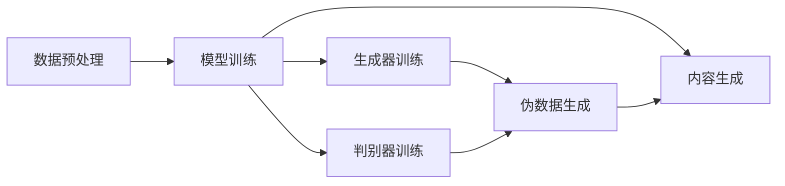

                 

# 《AIGC在未来工作场景中的颠覆性应用》

## 关键词

AI生成内容（AIGC）、人工智能、工作场景、颠覆性应用、未来趋势

## 摘要

随着人工智能技术的不断进步，AI生成内容（AIGC）作为一种新兴技术，正逐渐颠覆传统的信息生产模式。本文将深入探讨AIGC的定义、工作原理、关键应用场景以及其在未来工作场景中的潜力。通过分析AIGC在不同领域的应用实例，本文揭示了这项技术在提高生产效率、创新内容创作等方面的巨大潜力，并对AIGC面临的挑战和未来发展趋势进行了展望。

## 目录

1. **背景介绍**
   1.1 AIGC的历史与现状
   1.2 AIGC技术的背景知识
   1.3 AIGC对工作场景的影响
2. **核心概念与联系**
   2.1 AIGC的定义
   2.2 AIGC的关键组成部分
   2.3 概念属性对比表格
   2.4 AIGC的ER实体关系图
3. **应用原理**
   3.1 AIGC的工作原理
   3.2 AIGC的技术原理讲解
   3.3 算法原理讲解与数学模型
4. **实践案例**
   4.1 AIGC在办公自动化中的应用
   4.2 AIGC在创意产业中的应用
5. **总结与展望**
   5.1 AIGC的挑战与机遇
   5.2 AIGC的未来发展趋势
   5.3 最佳实践 tips
   5.4 注意事项
   5.5 拓展阅读

## 1. 背景介绍

### 1.1 AIGC的历史与现状

AI生成内容（AIGC）的概念起源于机器学习和自然语言处理技术的不断进步。早期的文本生成技术主要依赖于模板匹配和规则推理，而随着深度学习的兴起，生成式对抗网络（GANs）、变分自编码器（VAEs）等新型算法的出现，使得AI生成内容的质量和多样性得到了显著提升。

目前，AIGC已经广泛应用于文本生成、图像生成、音频生成等多个领域。例如，在文本生成方面，AIGC可以生成新闻文章、广告文案、社交媒体帖子等；在图像生成方面，AIGC可以生成艺术作品、游戏场景、产品图像等；在音频生成方面，AIGC可以生成音乐、语音合成等。随着技术的不断进步，AIGC的应用范围和深度将进一步扩大。

### 1.2 AIGC技术的背景知识

AIGC的核心技术主要包括机器学习、自然语言处理、计算机视觉等。机器学习提供了训练模型的能力，自然语言处理负责理解和生成自然语言，计算机视觉则负责处理图像和视频。

在机器学习方面，生成式对抗网络（GANs）和变分自编码器（VAEs）是AIGC的重要算法。GANs由生成器（Generator）和判别器（Discriminator）组成，通过不断的训练和对抗，生成高质量的伪数据。VAEs则通过概率模型进行数据生成，能够在保持数据分布的同时，生成具有多样性的数据。

自然语言处理方面，序列到序列（Seq2Seq）模型和注意力机制（Attention Mechanism）在文本生成中发挥了关键作用。Seq2Seq模型能够将输入序列转换为输出序列，而注意力机制则能够关注输入序列中的关键信息，从而提高生成文本的质量。

计算机视觉方面，卷积神经网络（CNNs）和生成对抗网络（GANs）在图像生成中具有重要作用。CNNs能够提取图像中的特征，GANs则通过生成器和判别器的对抗训练，生成高质量的图像。

### 1.3 AIGC对工作场景的影响

AIGC的引入对传统的工作场景带来了深远的影响。首先，在内容创作领域，AIGC可以自动生成高质量的文章、广告文案和社交媒体内容，提高了内容创作者的效率。例如，新闻机构可以使用AIGC生成新闻报道，广告公司可以自动生成广告文案，从而节省大量人力和时间。

其次，在创意产业中，AIGC为艺术创作提供了新的可能。艺术家可以使用AIGC生成独特的艺术作品，设计师可以自动生成产品图像，从而激发创新灵感。

此外，AIGC在办公自动化中也有广泛的应用。例如，AIGC可以自动生成会议纪要、报告文档，减少重复性劳动，提高工作效率。

总之，AIGC作为一种颠覆性的技术，正在改变传统的工作模式，提高生产效率，促进内容创新，为未来工作场景带来了无限可能。

## 2. 核心概念与联系

### 2.1 AIGC的定义

AI生成内容（AIGC）是指利用人工智能技术，如机器学习、自然语言处理、计算机视觉等，自动生成各种形式的内容，包括文本、图像、音频等。AIGC的核心在于其能够通过学习和理解数据，生成具有多样性和创造性的内容，从而降低内容创作的成本和时间。

### 2.2 AIGC的关键组成部分

AIGC的关键组成部分包括数据集、模型架构和训练算法。

- **数据集**：AIGC依赖于大量的数据集进行训练，这些数据集可以是文本、图像、音频等多种形式。数据集的质量直接影响生成内容的质量和多样性。
- **模型架构**：AIGC的模型架构主要包括生成器（Generator）和判别器（Discriminator）。生成器负责生成内容，判别器则负责评估生成内容的质量。常见的模型架构包括生成式对抗网络（GANs）、变分自编码器（VAEs）等。
- **训练算法**：AIGC的训练算法主要包括监督学习、无监督学习和半监督学习等。通过不同的训练算法，模型可以从数据中学习到生成内容所需的特征和规律。

### 2.3 概念属性对比表格

以下是一个关于AIGC关键组成部分的概念属性对比表格：

| 属性         | 数据集                | 模型架构                 | 训练算法               |
| ------------ | --------------------- | ------------------------ | ---------------------- |
| 功能         | 提供训练数据          | 生成和评估内容质量       | 学习和优化模型参数     |
| 影响因素     | 数据质量、多样性      | 网络结构和训练效率       | 训练数据和算法选择     |
| 关联关系     | 数据集是模型训练的基础 | 模型架构决定生成内容的能力 | 训练算法影响模型性能   |

### 2.4 AIGC的ER实体关系图

以下是一个AIGC的ER实体关系图的Mermaid格式：

```mermaid
erDiagram
  DataSet ||--|{ ModelArchitecture }|-- TrainingAlgorithm
  ModelArchitecture ||--|{ Generator }|-- DataSet
  ModelArchitecture ||--|{ Discriminator }|-- TrainingAlgorithm
  Generator ||--|{ ContentGeneration }|-- DataSet
  Generator ||--|{ ContentEvaluation }|-- Discriminator
  TrainingAlgorithm ||--|{ ModelParameterOptimization }|-- ModelArchitecture
```

通过ER实体关系图，我们可以清晰地看到AIGC中各个实体之间的关系，以及它们在内容生成过程中的作用。

## 3. 应用原理

### 3.1 AIGC的工作原理

AIGC的工作原理主要包括数据预处理、模型训练和内容生成三个步骤。

- **数据预处理**：首先，AIGC需要对输入数据集进行预处理，包括数据清洗、数据增强和数据标准化等。预处理步骤的目的是提高数据的质量，为后续的模型训练打下基础。
- **模型训练**：在模型训练阶段，AIGC使用生成器和判别器进行对抗训练。生成器负责生成伪数据，判别器则负责评估生成数据的真实性和质量。通过不断地迭代训练，生成器和判别器的性能逐渐提升，生成内容的质量也随之提高。
- **内容生成**：在模型训练完成后，AIGC可以通过生成器生成各种形式的内容。生成器可以根据输入的提示或条件，生成具有多样性和创造性的内容。

### 3.2 AIGC的技术原理讲解

为了更好地理解AIGC的工作原理，我们可以通过Mermaid流程图和Python源代码进行详细讲解。

#### Mermaid流程图

以下是一个AIGC的技术原理讲解的Mermaid流程图：



#### Python源代码

以下是一个简单的Python源代码示例，用于演示AIGC的工作原理：

```python
import numpy as np
import tensorflow as tf

# 数据预处理
def preprocess_data(data):
    # 数据清洗、增强、标准化等操作
    return processed_data

# 模型训练
def train_model(generator, discriminator, data):
    # 生成器和判别器的训练过程
    pass

# 内容生成
def generate_content(generator, prompt):
    # 根据提示生成内容
    return content

# 主程序
if __name__ == "__main__":
    # 加载数据集
    data = load_data()

    # 数据预处理
    processed_data = preprocess_data(data)

    # 初始化生成器和判别器
    generator = tf.keras.Sequential()
    discriminator = tf.keras.Sequential()

    # 模型训练
    train_model(generator, discriminator, processed_data)

    # 内容生成
    prompt = "生成一篇新闻文章"
    content = generate_content(generator, prompt)
    print(content)
```

通过以上代码示例，我们可以看到AIGC的工作流程：首先进行数据预处理，然后使用生成器和判别器进行对抗训练，最后通过生成器生成内容。

### 3.3 算法原理讲解与数学模型

在AIGC中，生成器和判别器的训练过程主要依赖于生成式对抗网络（GANs）和变分自编码器（VAEs）。

#### 生成式对抗网络（GANs）

GANs由生成器（Generator）和判别器（Discriminator）组成。生成器的目标是最小化生成数据的损失函数，判别器的目标是最小化真实数据和生成数据之间的损失函数。

- **生成器的损失函数**：生成器的损失函数可以表示为：

  $$ L_G = -\log(D(G(z)) $$

  其中，$G(z)$是生成器生成的伪数据，$D$是判别器的输出。

- **判别器的损失函数**：判别器的损失函数可以表示为：

  $$ L_D = -\log(D(x)) - \log(1 - D(G(z)) $$

  其中，$x$是真实数据。

通过交替训练生成器和判别器，可以逐步提高生成内容的质量。

#### 变分自编码器（VAEs）

VAEs通过概率模型进行数据生成，其核心是变分自编码器（VAE）的解码器（Decoder）。

- **编码器（Encoder）**：编码器的目标是将输入数据映射到一个潜在空间，潜在空间中的每个点对应输入数据的概率分布。
- **解码器（Decoder）**：解码器的目标是将潜在空间中的点映射回输入数据的概率分布。

VAEs的损失函数可以表示为：

$$ L = \mathbb{E}_{x \sim p(x)}[D(\phi(x))] + \mathbb{E}_{z \sim p(z)}[-\log p(x|\phi(z))] $$

其中，$\phi(x)$是编码器对输入数据的编码，$p(x)$是输入数据的概率分布，$p(z)$是潜在空间中点的概率分布。

通过优化损失函数，VAEs可以生成与输入数据具有相似特征的新数据。

通过以上算法原理的讲解和数学模型的介绍，我们可以更深入地理解AIGC的工作原理和技术实现。

## 4. 实践案例

### 4.1 AIGC在办公自动化中的应用

在办公自动化领域，AIGC已经展示了其巨大的潜力。通过AIGC技术，可以实现自动化报告生成、会议纪要记录、电子邮件撰写等功能。

#### 案例一：自动化报告生成

某公司采用AIGC技术，实现了自动化报告生成系统。该系统首先使用自然语言处理技术对已有的报告进行解析，提取报告的关键信息和结构。然后，通过生成器生成新的报告内容，并根据需要调整报告的格式和风格。

具体流程如下：

1. **数据收集**：收集公司已有的各类报告数据，包括财务报告、项目报告、市场分析报告等。
2. **数据预处理**：对报告进行清洗和结构化处理，提取报告的关键信息和结构。
3. **模型训练**：使用提取的关键信息，训练AIGC模型，使其能够生成符合公司风格的报告。
4. **报告生成**：根据新的报告需求，输入相关提示信息，AIGC模型生成新的报告内容。
5. **报告审核**：由专业人员对生成的报告进行审核和修改，确保报告的质量和准确性。

通过AIGC技术的应用，公司大幅提高了报告生成的效率和准确性，减少了人工撰写报告的时间和工作量。

#### 案例二：会议纪要记录

某企业采用AIGC技术，实现了智能会议纪要记录系统。该系统通过语音识别技术和自然语言处理技术，将会议过程中的口头发言转化为文本，并使用AIGC模型自动生成会议纪要。

具体流程如下：

1. **语音识别**：使用语音识别技术，将会议过程中的口头发言转化为文本。
2. **文本预处理**：对识别的文本进行去噪和结构化处理，提取会议的关键信息。
3. **会议纪要生成**：使用AIGC模型，根据提取的关键信息，自动生成会议纪要。
4. **纪要审核**：由会议主持人或记录员对生成的会议纪要进行审核和修改。

通过AIGC技术的应用，企业实现了会议纪要的自动化记录和生成，大大提高了会议记录的效率和准确性。

#### 案例三：电子邮件撰写

某公司采用AIGC技术，实现了智能电子邮件撰写系统。该系统通过自然语言处理技术和AIGC模型，自动生成高质量的电子邮件内容，并根据用户需求调整邮件的格式和风格。

具体流程如下：

1. **邮件模板构建**：根据公司常见的邮件类型，构建相应的邮件模板。
2. **邮件内容生成**：输入邮件主题和简要内容，AIGC模型根据邮件模板和输入信息，自动生成邮件内容。
3. **邮件格式调整**：根据用户需求，调整邮件的格式和风格。
4. **邮件发送**：将生成的邮件内容发送给指定的收件人。

通过AIGC技术的应用，公司大幅提高了电子邮件撰写的效率和准确性，减少了员工撰写邮件的时间和工作量。

### 4.2 AIGC在创意产业中的应用

在创意产业中，AIGC技术同样展现了其强大的应用潜力，特别是在艺术创作、广告创意、游戏开发等领域。

#### 案例一：艺术创作

某艺术家使用AIGC技术，创作了一系列独特的艺术作品。艺术家首先收集了大量艺术作品的数据集，然后通过训练AIGC模型，使其能够生成具有个人风格的艺术作品。

具体流程如下：

1. **数据收集**：收集艺术家个人风格的艺术作品，构建数据集。
2. **模型训练**：使用AIGC模型，对数据集进行训练，使其学习到艺术家的创作风格。
3. **艺术作品生成**：输入新的创作要求，AIGC模型生成符合艺术家风格的新艺术作品。
4. **作品审核**：由艺术家对生成的作品进行审核和修改。

通过AIGC技术的应用，艺术家能够快速生成大量具有个人风格的艺术作品，激发了创作灵感，提高了创作效率。

#### 案例二：广告创意

某广告公司采用AIGC技术，实现了自动化广告创意生成系统。该系统通过自然语言处理技术和AIGC模型，自动生成高质量的广告文案和创意。

具体流程如下：

1. **广告素材收集**：收集广告素材，包括图片、视频、音频等。
2. **模型训练**：使用AIGC模型，对广告素材进行训练，使其能够根据广告主题生成创意内容。
3. **广告创意生成**：输入广告主题和目标用户群体，AIGC模型自动生成广告文案和创意。
4. **创意审核**：由广告创意团队对生成的创意进行审核和修改。

通过AIGC技术的应用，广告公司能够快速生成大量高质量的广告创意，提高了广告创作的效率和效果。

#### 案例三：游戏开发

某游戏公司采用AIGC技术，实现了自动化游戏场景生成系统。该系统通过计算机视觉技术和AIGC模型，自动生成丰富的游戏场景和角色。

具体流程如下：

1. **游戏素材收集**：收集游戏场景和角色的素材数据集。
2. **模型训练**：使用AIGC模型，对游戏素材进行训练，使其能够生成各种类型的游戏场景和角色。
3. **游戏场景生成**：输入游戏场景的要求，AIGC模型自动生成游戏场景。
4. **角色生成**：输入角色设定和要求，AIGC模型自动生成角色。

通过AIGC技术的应用，游戏公司能够快速生成丰富多样的游戏场景和角色，提高了游戏开发的效率和质量。

### 4.3 总结

通过以上实践案例，我们可以看到AIGC在办公自动化和创意产业中的应用，不仅提高了工作效率和创作效率，还带来了巨大的创新潜力。随着技术的不断进步，AIGC将在更多领域展现出其颠覆性的应用价值。

## 5. 总结与展望

### 5.1 AIGC的挑战与机遇

AIGC作为一种新兴技术，虽然展示了巨大的潜力，但同时也面临诸多挑战。首先，数据质量和多样性是AIGC生成高质量内容的基础，数据集的质量直接影响生成内容的质量。其次，模型的训练和优化需要大量的计算资源和时间，特别是在处理大规模数据集时。此外，AIGC在伦理和社会方面也引发了争议，如内容真实性、版权问题等。

然而，这些挑战同时也带来了机遇。随着计算能力的提升和数据量的增长，AIGC技术的性能和效率将进一步提高。同时，随着对伦理和社会问题的深入研究，相关法规和标准的制定将逐步完善，为AIGC的发展提供更好的环境。

### 5.2 AIGC的未来发展趋势

AIGC在未来将呈现以下发展趋势：

1. **技术融合**：AIGC将与更多领域的技术进行融合，如区块链、物联网等，形成更强大的应用生态。
2. **垂直行业应用**：AIGC将在医疗、金融、教育等垂直行业得到更深入的应用，为行业带来革命性的变革。
3. **人机协同**：AIGC将与人类智能协同工作，实现更高效的内容创作和决策支持。
4. **规模化应用**：随着技术的成熟和成本的降低，AIGC将在更多企业和组织中得到广泛应用。

### 5.3 最佳实践 tips

为了充分利用AIGC的优势，以下是一些建议：

1. **数据质量优先**：确保数据集的质量和多样性，为AIGC生成高质量内容提供基础。
2. **模型优化**：定期对模型进行优化和更新，提高生成内容的质量和多样性。
3. **伦理审查**：在应用AIGC时，重视内容真实性、版权等伦理问题，确保合法合规。
4. **人机协同**：充分发挥AIGC的优势，与人类智能协同工作，实现更高效的内容创作。

### 5.4 注意事项

在应用AIGC时，需要注意以下事项：

1. **数据安全和隐私**：确保数据的安全和隐私，避免数据泄露和滥用。
2. **模型安全**：防止恶意攻击和篡改，确保模型的稳定性和安全性。
3. **内容审核**：对生成的

