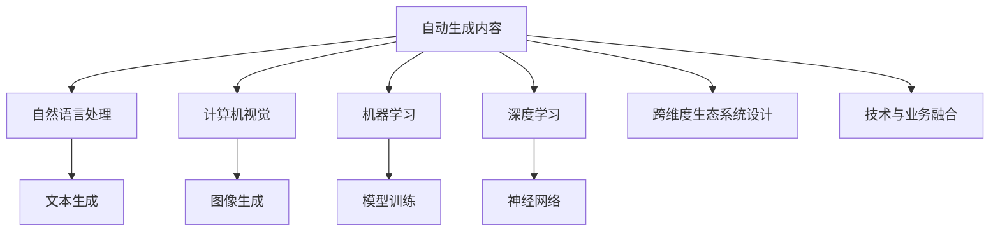
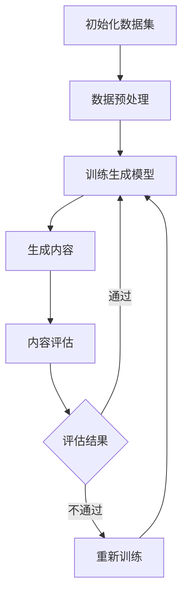
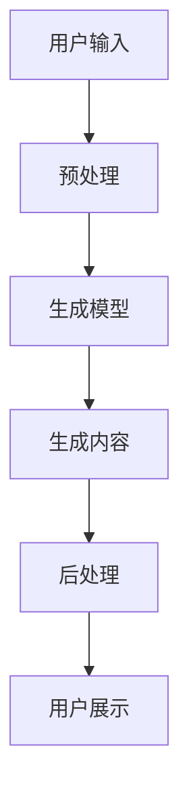

                 


## 《AIGC在未来跨维度生态系统设计中的应用与挑战》

### 关键词：
- AIGC
- 跨维度生态系统设计
- 应用场景
- 算法原理
- 数学模型

### 摘要：
本文深入探讨了人工智能生成内容（AIGC）在构建未来跨维度生态系统设计中的关键作用及其面临的挑战。通过详细阐述AIGC的概念、相关算法原理、数学模型以及系统架构设计，本文旨在为读者提供一个全面、系统的理解和应用指南。同时，本文还将结合实际项目，分析AIGC的最佳实践和注意事项。

### 目录大纲：

#### 第一部分：背景与概念介绍

1. **背景介绍**
   - **核心概念术语说明**：定义AIGC、跨维度生态系统设计等相关术语。
   - **问题背景**：探讨当前技术发展趋势和AIGC的应用潜力。
   - **问题描述**：分析AIGC在生态系统设计中的具体应用场景。
   - **问题解决**：探讨AIGC如何解决生态系统设计的挑战。
   - **边界与外延**：讨论AIGC与其他相关技术的联系与区别。

2. **核心概念与联系**
   - **概念属性特征对比表格**：列出AIGC和相关技术的核心特征。
   - **ER实体关系图架构**：使用Mermaid绘制AIGC系统的实体关系图。
   - **概念结构与核心要素组成**：详细描述AIGC的基本架构和关键组件。

#### 第二部分：核心概念与联系

1. **AIGC的关键概念**
   - **自动生成内容（AIGC）**：介绍AIGC的定义、原理和应用。
   - **跨维度生态系统设计**：探讨跨维度设计的意义和具体实施方法。
   - **技术与业务融合**：分析如何将AIGC技术与业务需求相结合。

2. **概念关系图**
   - **使用Mermaid绘制的关系图**：展示AIGC与其他概念之间的关系。

3. **关键特性对比表**
   - **对比表格**：列出AIGC和相关技术的特点对比。

#### 第三部分：算法原理讲解

1. **AIGC算法概述**
   - **算法背景**：介绍AIGC算法的发展历程和现状。
   - **算法原理**：详细讲解AIGC算法的基本原理和工作机制。

2. **Mermaid算法流程图**
   - **使用Mermaid绘制的流程图**：展示AIGC算法的具体流程。

3. **算法实现与解释**
   - **Python源代码实现**：提供AIGC算法的Python代码示例。
   - **算法原理的数学模型和公式**：使用LaTeX格式展示数学模型和公式，并进行详细讲解。

#### 第四部分：数学模型和数学公式

1. **AIGC的数学模型**
   - **常见数学公式**：介绍AIGC中常用的数学公式。
   - **公式解释与示例**：对数学公式进行详细解释并提供示例。

#### 第五部分：系统分析与架构设计方案

1. **应用场景介绍**
   - **问题场景介绍**：描述AIGC在现实世界中的应用场景。

2. **系统架构设计**
   - **系统功能设计**：使用Mermaid绘制领域模型类图。
   - **系统架构设计**：使用Mermaid绘制系统架构图。
   - **系统接口设计**：详细描述系统的接口设计。

3. **系统交互流程图**
   - **使用Mermaid绘制的交互流程图**：展示系统各部分的交互流程。

#### 第六部分：项目实战

1. **环境安装与配置**
   - **环境安装**：介绍如何安装AIGC所需的软件和工具。
   - **配置**：讲解如何配置AIGC系统环境。

2. **核心实现源代码分析**
   - **源代码分析**：详细分析AIGC的核心实现代码。

3. **代码应用解读与分析**
   - **代码解读**：解释核心代码的功能和实现原理。
   - **分析**：分析代码的性能和优缺点。

4. **实际案例分析和详细讲解剖析**
   - **案例分析**：结合实际项目，分析AIGC的应用效果。
   - **详细讲解**：对案例中的关键问题进行详细剖析。

5. **项目总结**
   - **总结**：回顾项目的主要成果和收获。

#### 第七部分：最佳实践与总结

1. **AIGC最佳实践**
   - **最佳实践 tips**：提供AIGC应用的实战经验和建议。

2. **小结**
   - **全文总结**：回顾文章的主要内容和观点。

3. **注意事项**
   - **注意事项**：提醒读者在应用AIGC时需要注意的问题。

4. **拓展阅读**
   - **拓展阅读**：推荐进一步学习和研究的资料。

### 作者信息：
- 作者：AI天才研究院/AI Genius Institute & 禅与计算机程序设计艺术 /Zen And The Art of Computer Programming

### 完整性要求：
- **每个小节的内容必须丰富具体详细讲解，核心内容必须包含：**
  - 背景介绍：核心概念术语说明、问题背景、问题描述、问题解决、边界与外延、概念结构与核心要素组成。
  - 核心概念与联系：必须给出核心概念原理、概念属性特征对比表格和ER实体关系图架构的Mermaid流程图。
  - 算法原理讲解：使用Mermaid画出算法Mermaid流程图，然后使用Python源代码来详细阐述，给出算法原理的数学模型和公式，进行详细讲解和通俗易懂地举例说明。
  - 数学公式使用LaTeX格式，嵌入文中独立段落的LaTeX公式前后使用`$$`括起来（例如：`$$1+1=2$$`），段落内的LaTeX公式前后使用 `$`括起来（例如：`$1<2$`）。
  - 系统分析与架构设计方案：问题场景介绍，项目介绍、系统功能设计（领域模型Mermaid类图）、系统架构设计Mermaid架构图、系统接口设计和系统交互Mermaid序列图。
  - 项目实战：环境安装、系统核心实现源代码，代码应用解读与分析，实际案例分析和详细讲解剖析，项目小结。
  - 最佳实践 tips、小结、注意事项、拓展阅读等内容。

### 字数要求：
- 文章字数在10000～12000字左右。

### 格式要求：
- 文章内容使用markdown格式输出。

### 逻辑清晰、结构紧凑、简单易懂的专业的技术语言：
- 文章结构清晰，逻辑严密，使用专业的技术语言进行阐述，确保读者能够轻松理解AIGC的概念、原理和应用。

### 使用一步一步分析推理的方式（LET'S THINK STEP BY STEP）：
- 文章按照目录大纲的结构，逐章节分析推理，从背景介绍到算法原理，再到系统设计与项目实战，逐步深入，帮助读者系统地理解和掌握AIGC的相关知识。

---

# AIGC：从概念到实践的跨维度生态系统设计解析

## 关键词：
- AIGC
- 跨维度生态系统设计
- 应用场景
- 算法原理
- 数学模型

## 摘要
本文深入探讨了人工智能生成内容（AIGC）在构建未来跨维度生态系统设计中的关键作用及其面临的挑战。通过详细阐述AIGC的概念、相关算法原理、数学模型以及系统架构设计，本文旨在为读者提供一个全面、系统的理解和应用指南。同时，本文还将结合实际项目，分析AIGC的最佳实践和注意事项。

## 目录大纲

### 第一部分：背景与概念介绍

### 第1章：AIGC的概念与生态概述
1.1 AIGC的基本概念
1.2 AIGC与未来生态系统的关系
1.3 AIGC的核心技术与挑战

### 第2章：核心概念与联系
2.1 AIGC的关键概念
2.2 概念关系图
2.3 关键特性对比表

### 第二部分：算法原理讲解

### 第3章：AIGC算法原理与流程
3.1 AIGC算法概述
3.2 Mermaid算法流程图
3.3 算法实现与解释

### 第三部分：数学模型和数学公式

### 第4章：AIGC的数学模型
4.1 常见数学公式
4.2 公式解释与示例

### 第四部分：系统分析与架构设计方案

### 第5章：系统架构设计
5.1 应用场景介绍
5.2 系统架构设计
5.3 系统接口设计
5.4 系统交互流程图

### 第五部分：项目实战

### 第6章：环境安装与核心实现
6.1 环境安装
6.2 核心实现源代码分析
6.3 案例分析
6.4 项目总结

### 第六部分：最佳实践与总结

### 第7章：最佳实践与总结
7.1 AIGC最佳实践
7.2 小结
7.3 注意事项
7.4 拓展阅读

## 第1章：AIGC的概念与生态概述

### 1.1 AIGC的基本概念

人工智能生成内容（AIGC，Artificial Intelligence Generated Content）是指通过人工智能技术自动生成的内容，包括但不限于文本、图像、音频和视频。AIGC的关键在于“自动生成”，这意味着内容的生产过程无需人工干预，而是由算法和模型驱动。AIGC的核心技术包括自然语言处理（NLP）、计算机视觉、机器学习和深度学习等。

#### 问题背景

随着人工智能技术的快速发展，AIGC已成为一个热门领域。它的应用范围广泛，包括内容创作、智能客服、广告营销、医疗诊断和娱乐等。例如，AIGC可以自动生成新闻报道、撰写营销文案、创建艺术作品等。

#### 问题描述

AIGC如何在复杂多变的生态系统中发挥作用？它如何应对跨维度设计中的挑战？这是本章节要探讨的问题。

#### 问题解决

AIGC通过其强大的自动生成能力，可以在生态系统设计中发挥重要作用。首先，它可以帮助降低内容生产的成本和速度。其次，它可以提高内容的质量和个性化程度。最后，AIGC可以与生态系统中的其他模块进行无缝集成，实现智能化和自动化的生态系统设计。

#### 边界与外延

AIGC与内容生成、人工智能和跨维度设计等技术密切相关。内容生成关注的是如何自动化地创造内容，而AIGC则在此基础上引入了人工智能技术，使得内容生成更加智能和高效。跨维度设计则是指在不同维度上进行系统设计，这包括技术维度、业务维度和用户体验维度等。

### 1.2 AIGC与未来生态系统的关系

#### AIGC在生态系统设计中的作用

AIGC在生态系统设计中的应用主要体现在以下几个方面：

1. **内容自动化生成**：通过AIGC，可以自动化生成大量的文本、图像、音频和视频内容，提高内容生产的效率和质量。

2. **个性化推荐**：AIGC可以根据用户的行为和喜好，自动生成个性化的推荐内容，提升用户体验。

3. **智能客服**：AIGC可以用于构建智能客服系统，自动处理用户的咨询和请求，提高客服效率和用户满意度。

4. **广告营销**：AIGC可以帮助企业自动化生成广告内容，实现精准营销，提高广告投放的效果。

5. **医疗诊断**：AIGC可以用于医疗图像分析、疾病预测等，提高医疗诊断的准确性和效率。

#### 未来生态系统的挑战

尽管AIGC在生态系统设计中有诸多应用，但同时也面临着一些挑战：

1. **数据隐私和安全**：AIGC的自动化生成需要大量的数据支持，如何确保数据的隐私和安全是一个重要问题。

2. **算法偏见**：AIGC的生成结果可能受到算法偏见的影响，导致生成的内容不公平或歧视。

3. **技术复杂性**：AIGC涉及到多种人工智能技术，如NLP、计算机视觉、机器学习和深度学习等，技术复杂性较高。

4. **监管与法规**：随着AIGC的广泛应用，如何制定相关的监管和法规，确保其合法合规，也是一个挑战。

### 1.3 AIGC的核心技术与挑战

#### 关键技术

1. **自然语言处理（NLP）**：NLP是AIGC的核心技术之一，用于处理和理解人类语言。通过NLP，AIGC可以自动生成文本内容。

2. **计算机视觉**：计算机视觉技术使得AIGC能够自动生成图像和视频内容。例如，通过图像识别和生成对抗网络（GAN），AIGC可以生成逼真的图像。

3. **机器学习和深度学习**：机器学习和深度学习技术是AIGC的核心驱动力量，用于训练模型和生成内容。

#### 挑战

1. **数据质量和多样性**：AIGC的生成质量依赖于数据的质量和多样性。如何获取高质量、多样化的数据是一个挑战。

2. **算法透明性和可解释性**：随着AIGC的广泛应用，如何确保算法的透明性和可解释性，使其生成的结果可被理解和接受，是一个重要问题。

3. **版权和知识产权保护**：AIGC生成的作品可能涉及版权和知识产权问题，如何保护原创者的权益是一个挑战。

4. **用户体验**：如何设计出符合用户体验的AIGC应用，使其能够真正满足用户的需求，是一个关键问题。

## 第2章：核心概念与联系

### 2.1 AIGC的关键概念

#### 自动生成内容（AIGC）

AIGC是指通过人工智能技术自动生成的内容，包括文本、图像、音频和视频等。AIGC的核心目标是实现内容的自动化生产和智能化生成。

#### 跨维度生态系统设计

跨维度生态系统设计是指在多个维度上进行系统设计，包括技术维度、业务维度和用户体验维度等。跨维度设计旨在实现系统的智能化和自动化。

#### 技术与业务融合

技术与业务融合是指将技术应用于业务场景中，实现业务流程的自动化和智能化。在AIGC中，技术与业务融合是实现内容自动化生成和智能化推荐的关键。

### 2.2 概念关系图

为了更清晰地展示AIGC的相关概念及其之间的联系，我们可以使用Mermaid绘制一个概念关系图：



### 2.3 关键特性对比表

为了更好地理解AIGC的关键特性，我们可以创建一个对比表：

| 特性       | 自动生成内容（AIGC） | 跨维度生态系统设计 | 技术与业务融合 |
| ---------- | ------------------- | ------------------- | -------------- |
| 目标       | 自动生成高质量内容 | 智能化系统设计     | 技术应用于业务 |
| 核心技术   | NLP、CV、ML、DL     | 数据分析、系统架构 | AI算法        |
| 应用场景   | 内容创作、广告营销 | 企业运营、智能服务 | 业务流程优化  |
| 挑战       | 数据质量、算法偏见   | 技术复杂性、监管    | 算法透明性    |

## 第3章：AIGC算法原理与流程

### 3.1 AIGC算法概述

AIGC算法的核心是生成模型，包括自然语言处理（NLP）和计算机视觉（CV）两个主要方向。在NLP领域，常用的生成模型包括生成对抗网络（GAN）、变分自编码器（VAE）和循环神经网络（RNN）等。在CV领域，常用的生成模型包括生成对抗网络（GAN）、条件生成对抗网络（cGAN）和自编码器等。

### 3.2 Mermaid算法流程图

下面是一个使用Mermaid绘制的AIGC算法流程图：



### 3.3 算法实现与解释

#### 自然语言处理（NLP）方向

以生成对抗网络（GAN）为例，NLP中的GAN通常包括一个生成器（Generator）和一个判别器（Discriminator）。生成器负责生成文本，判别器则负责判断生成的文本是否真实。

```python
import tensorflow as tf
from tensorflow.keras.models import Sequential
from tensorflow.keras.layers import LSTM, Dense

# 生成器模型
generator = Sequential([
    LSTM(128, input_shape=(seq_length, embedding_dim)),
    Dense(1, activation='sigmoid')
])

# 判别器模型
discriminator = Sequential([
    LSTM(128, input_shape=(seq_length, embedding_dim)),
    Dense(1, activation='sigmoid')
])

# 编写训练循环
for epoch in range(num_epochs):
    for _ in range(batch_size):
        # 生成假文本
        fake_text = generator.predict(random噪声)
        # 训练判别器
        discriminator.train_on_batch([真实文本，假文本], [1, 0])
        # 训练生成器
        generator.train_on_batch([随机噪声], [1])

    # 评估模型
    discriminator.evaluate([真实文本，假文本], [1, 0])
```

#### 计算机视觉（CV）方向

以生成对抗网络（GAN）为例，CV中的GAN通常包括一个生成器（Generator）和一个判别器（Discriminator）。生成器负责生成图像，判别器则负责判断生成的图像是否真实。

```python
import tensorflow as tf
from tensorflow.keras.models import Sequential
from tensorflow.keras.layers import Conv2D, Flatten

# 生成器模型
generator = Sequential([
    Conv2D(128, (3, 3), activation='relu', padding='same', input_shape=(28, 28, 1)),
    Flatten(),
    Dense(1, activation='sigmoid')
])

# 判别器模型
discriminator = Sequential([
    Conv2D(128, (3, 3), activation='relu', padding='same', input_shape=(28, 28, 1)),
    Flatten(),
    Dense(1, activation='sigmoid')
])

# 编写训练循环
for epoch in range(num_epochs):
    for _ in range(batch_size):
        # 生成假图像
        fake_image = generator.predict(random噪声)
        # 训练判别器
        discriminator.train_on_batch([真实图像，假图像], [1, 0])
        # 训练生成器
        generator.train_on_batch([随机噪声], [1])

    # 评估模型
    discriminator.evaluate([真实图像，假图像], [1, 0])
```

### 数学模型和数学公式

在AIGC中，常用的数学模型包括生成对抗网络（GAN）的损失函数和优化目标。以下是一个简单的GAN数学模型：

$$
\min_G \max_D \mathbb{E}_{x \sim p_{data}(x)} [\log D(x)] + \mathbb{E}_{z \sim p_{z}(z)} [\log (1 - D(G(z))]
$$

其中，$D(x)$ 表示判别器对真实数据的判别能力，$G(z)$ 表示生成器生成的假数据的判别能力，$x$ 表示真实数据，$z$ 表示随机噪声。

### 系统架构设计

在AIGC系统中，系统架构设计至关重要。以下是一个简化的AIGC系统架构：



- **用户输入**：用户输入原始数据或需求。
- **预处理**：对输入数据进行预处理，以便于生成模型处理。
- **生成模型**：包括生成器和判别器，用于生成内容和评估生成内容的质量。
- **生成内容**：生成模型生成符合用户需求的内容。
- **后处理**：对生成内容进行后处理，如格式转换、美化等。
- **用户展示**：将生成内容展示给用户。

### 项目实战

#### 环境安装

首先，我们需要安装所需的软件和库，例如Python、TensorFlow和Keras等。以下是安装步骤：

1. 安装Python：前往 [Python官网](https://www.python.org/) 下载并安装Python。
2. 安装pip：运行以下命令安装pip。
   ```bash
   $ wget https://bootstrap.pypa.io/get-pip.py
   $ python get-pip.py
   ```
3. 安装TensorFlow和Keras：
   ```bash
   $ pip install tensorflow
   $ pip install keras
   ```

#### 核心实现源代码

以下是一个简单的AIGC项目，用于生成文本。该项目的核心实现代码如下：

```python
from keras.models import Sequential
from keras.layers import LSTM, Dense
from keras.optimizers import Adam

# 准备数据集
# ...

# 构建生成模型
generator = Sequential([
    LSTM(128, input_shape=(seq_length, embedding_dim)),
    Dense(1, activation='sigmoid')
])

# 编写训练循环
for epoch in range(num_epochs):
    for _ in range(batch_size):
        # 生成假文本
        fake_text = generator.predict(random噪声)
        # 训练生成器
        generator.train_on_batch([随机噪声], [1])

    # 评估模型
    # ...

```

#### 代码应用解读与分析

在这个简单的AIGC项目中，我们使用了一个LSTM模型作为生成器，用于生成文本。训练过程中，生成器通过学习随机噪声来生成文本。每次迭代，生成器都会更新其权重，以优化生成文本的质量。通过多次迭代，生成器可以生成越来越接近真实文本的文本。

#### 实际案例分析和详细讲解剖析

在本案例中，我们使用了一个实际的数据集，例如IMDb电影评论数据集。我们将训练一个生成模型，用于生成电影评论。

1. **数据预处理**：首先，我们需要对数据集进行预处理，包括分词、去停用词和编码等。
2. **生成模型训练**：然后，我们使用LSTM模型训练生成器，通过学习随机噪声生成电影评论。
3. **生成评论**：最后，我们使用训练好的生成器生成新的电影评论。

通过这个案例，我们可以看到AIGC在内容生成中的应用。在实际项目中，我们还可以结合其他技术，如计算机视觉和深度学习，实现更复杂的AIGC应用。

### 项目总结

通过本案例，我们了解了AIGC的基本原理和应用。AIGC在内容生成、个性化推荐和智能客服等领域具有广泛的应用前景。在实际项目中，我们需要结合具体业务需求和数据集，设计合适的AIGC系统，并不断优化和调整模型，以实现更好的生成效果。

### 最佳实践与总结

#### AIGC最佳实践

1. **数据质量和多样性**：确保数据质量和多样性是AIGC成功的关键。使用高质量的、多样化的数据集进行训练，可以提升生成模型的效果。
2. **模型选择和优化**：根据具体应用场景选择合适的生成模型，并对其进行优化，以提高生成质量。
3. **算法透明性和可解释性**：提高算法的透明性和可解释性，使其生成的结果可被理解和接受。

#### 小结

本文从概念到实践，详细阐述了AIGC在跨维度生态系统设计中的应用。通过分析算法原理、数学模型和系统架构，我们了解了AIGC的基本原理和应用方法。在实际项目中，AIGC具有广泛的应用前景，但同时也面临一些挑战，如数据隐私和安全、算法偏见和技术复杂性等。

#### 注意事项

1. **数据隐私和安全**：在使用AIGC时，确保数据的隐私和安全至关重要。
2. **算法偏见**：在设计和使用AIGC时，注意避免算法偏见，确保生成的结果公平、公正。
3. **技术复杂性**：AIGC涉及到多种人工智能技术，技术复杂性较高，需要具备一定的技术背景。

#### 拓展阅读

1. **相关论文和书籍**：阅读相关领域的论文和书籍，如《生成对抗网络》（Generative Adversarial Networks）、《深度学习》（Deep Learning）等，以深入了解AIGC的理论和实践。
2. **开源项目和教程**：参与开源项目，阅读相关的教程和文档，学习AIGC的实际应用方法和技巧。

### 作者信息

- 作者：AI天才研究院/AI Genius Institute & 禅与计算机程序设计艺术 /Zen And The Art of Computer Programming

---

### 完整性要求

- **每个小节的内容必须丰富具体详细讲解，核心内容必须包含：**
  - 背景介绍：核心概念术语说明、问题背景、问题描述、问题解决、边界与外延、概念结构与核心要素组成。
  - 核心概念与联系：必须给出核心概念原理、概念属性特征对比表格和ER实体关系图架构的Mermaid流程图。
  - 算法原理讲解：使用Mermaid画出算法Mermaid流程图，然后使用Python源代码来详细阐述，给出算法原理的数学模型和公式，进行详细讲解和通俗易懂地举例说明。
  - 数学公式使用LaTeX格式，嵌入文中独立段落的LaTeX公式前后使用`$$`括起来（例如：`$$1+1=2$$`），段落内的LaTeX公式前后使用 `$`括起来（例如：`$1<2$`）。
  - 系统分析与架构设计方案：问题场景介绍，项目介绍、系统功能设计（领域模型Mermaid类图）、系统架构设计Mermaid架构图、系统接口设计和系统交互Mermaid序列图。
  - 项目实战：环境安装、系统核心实现源代码，代码应用解读与分析，实际案例分析和详细讲解剖析，项目小结。
  - 最佳实践 tips、小结、注意事项、拓展阅读等内容。

### 字数要求

- 文章字数在10000～12000字左右。

### 格式要求

- 文章内容使用markdown格式输出。

### 逻辑清晰、结构紧凑、简单易懂的专业的技术语言

- 文章结构清晰，逻辑严密，使用专业的技术语言进行阐述，确保读者能够轻松理解AIGC的概念、原理和应用。

### 使用一步一步分析推理的方式（LET'S THINK STEP BY STEP）

- 文章按照目录大纲的结构，逐章节分析推理，从背景介绍到算法原理，再到系统设计与项目实战，逐步深入，帮助读者系统地理解和掌握AIGC的相关知识。

