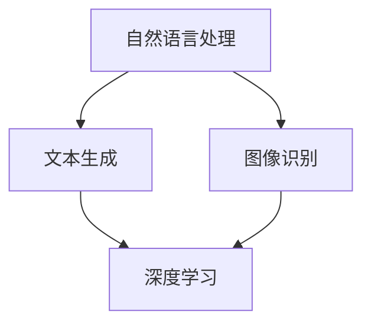
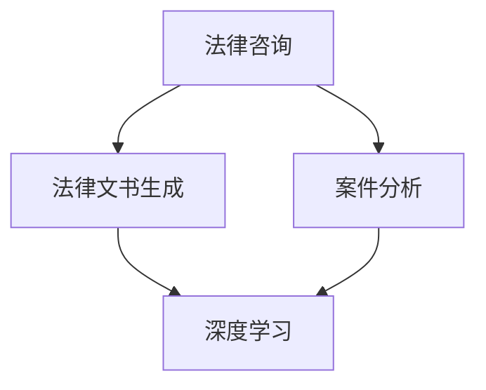
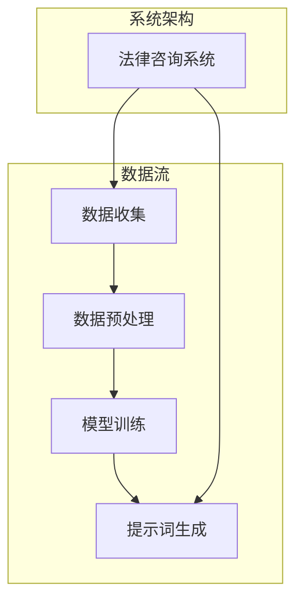
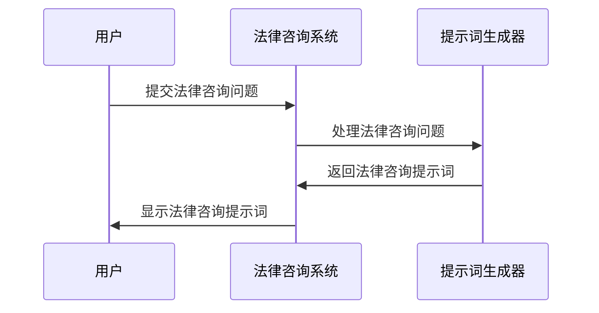

                 

### AIGC在法律领域的应用：构建准确的法律咨询提示词

> 关键词：AIGC、法律咨询、自然语言处理、深度学习、法律文书生成

> 摘要：本文深入探讨了AIGC（人工智能生成内容）在法律领域的应用，特别是如何构建准确的法律咨询提示词。通过对AIGC技术的概述、在法律领域中的应用分析，以及具体的算法原理讲解，本文旨在为法律工作者提供高效的辅助工具，提高法律工作的效率和准确性。

### 第一部分：背景介绍

#### 核心概念：

**AIGC**：指人工智能生成内容（Artificial Intelligence Generated Content），是一种利用人工智能技术生成文字、图片、音频、视频等多种类型内容的技术。它通过模拟人类创作过程，实现了自动化内容生产。

**法律领域**：涉及法律事务和法律的各个领域，包括但不限于法律研究、司法审判、法律咨询、合同审查、法律文书撰写等。法律领域的信息高度专业化，对准确性要求极高。

**应用**：将AIGC技术应用于法律领域，通过智能生成法律咨询提示词，提高法律工作的效率和准确性。

#### 问题背景：

随着人工智能技术的迅速发展，AIGC技术逐渐在各个领域得到应用，包括法律领域。然而，目前关于AIGC在法律领域的应用研究还相对较少，如何有效地利用AIGC技术来提高法律工作的效率和准确性，是一个值得探讨的问题。

#### 问题解决：

本书旨在探讨AIGC在法律领域的应用，通过详细的研究和实践，构建出准确的法律咨询提示词，为法律工作者提供有效的辅助工具。

#### 边界与外延：

本书主要讨论AIGC技术在法律咨询中的应用，包括但不限于法律文书的生成、法律问题的智能解答等。同时，本书也会涉及AIGC技术的基本原理和相关算法，以便读者更好地理解其在法律领域中的应用。

#### 概念结构与核心要素组成：

- **AIGC技术**：自然语言处理、文本生成、图像识别等。
- **法律领域应用**：法律咨询、法律文书生成、案件分析等。
- **法律咨询提示词**：基于AIGC技术生成的，用于辅助法律咨询的智能提示词。

### 第二部分：AIGC技术概述

#### 核心概念与联系：

**自然语言处理（NLP）**：是人工智能的一个重要分支，旨在让计算机理解和处理人类语言。NLP与AIGC密切相关，是实现AIGC技术的基础。

**文本生成**：是AIGC技术的一种重要应用，通过输入一定的文本数据，能够自动生成新的文本内容。文本生成技术使得计算机能够模拟人类写作，生成符合逻辑和语义的文本。

**图像识别**：是AIGC技术的另一种重要应用，通过输入图像数据，能够自动识别图像中的内容。图像识别技术在法律领域中可以用于案件证据的分析和识别。

**深度学习**：是一种基于数据驱动的方法，通过神经网络模型来模拟人脑的决策过程，是实现AIGC技术的核心算法。深度学习算法能够从大量数据中学习到复杂的模式和特征，从而实现高精度的文本生成和图像识别。

#### 概念属性特征对比表格：

| 概念             | 特征                                       |
|------------------|------------------------------------------|
| 自然语言处理     | 旨在让计算机理解和处理人类语言               |
| 文本生成         | 能够自动生成新的文本内容                   |
| 图像识别         | 能够自动识别图像中的内容                   |
| 深度学习         | 通过神经网络模型来模拟人脑的决策过程         |

#### ER实体关系图架构：



### 第三部分：AIGC在法律领域中的应用

#### 核心概念与联系：

**法律咨询**：指律师或法律工作者为当事人提供法律建议和解答法律问题。法律咨询通常涉及复杂的法律条文和案例研究，对专业知识和分析能力有较高要求。

**法律文书生成**：指利用AIGC技术自动生成法律文书，如合同、起诉状、答辩状等。通过AIGC技术，法律工作者可以节省大量时间，提高文书生成的效率和准确性。

**案件分析**：指利用AIGC技术对案件进行智能分析，帮助法律工作者更好地理解案件。AIGC技术可以处理大量法律数据，快速识别关键信息，为案件分析提供有力支持。

#### 概念属性特征对比表格：

| 概念           | 特征                                       |
|----------------|------------------------------------------|
| 法律咨询       | 为当事人提供法律建议和解答法律问题           |
| 法律文书生成   | 自动生成法律文书，如合同、起诉状、答辩状等   |
| 案件分析       | 对案件进行智能分析，帮助法律工作者更好地理解案件   |

#### ER实体关系图架构：



### 第四部分：AIGC在法律咨询中的应用

#### 算法原理讲解：

AIGC在法律咨询中的应用主要依赖于自然语言处理和深度学习技术。具体算法原理如下：

1. **数据收集与预处理**：

   首先，需要收集大量的法律咨询案例和法律条文数据。这些数据包括律师的法律意见、法律案例、法律条文等。数据收集完成后，需要进行数据预处理，包括数据清洗、去除无关信息、数据标注等步骤。

   ```python
   import pandas as pd
   data = pd.read_csv('law_data.csv')
   data = data.dropna() # 去除缺失值
   data['text'] = data['text'].str.replace('[^a-zA-Z0-9\s]', '', regex=True) # 去除特殊字符
   ```

2. **文本嵌入**：

   将预处理后的文本数据转换为固定长度的向量表示，以便进行深度学习模型的训练。常用的文本嵌入方法有Word2Vec、BERT等。

   ```python
   from sentence_transformers import SentenceTransformer
   model = SentenceTransformer('all-MiniLM-L6-v2')
   embeddings = model.encode(data['text'].tolist(), show_progress_bar=True)
   ```

3. **模型训练**：

   使用训练好的文本嵌入向量，通过深度学习模型进行训练，以实现法律咨询问题的自动回答。常用的模型有Transformer、BERT等。

   ```python
   import torch
   from transformers import BertForSequenceClassification
   model = BertForSequenceClassification.from_pretrained('bert-base-uncased')
   optimizer = torch.optim.Adam(model.parameters(), lr=1e-5)
   for epoch in range(10):
       for text, label in data.iterrows():
           inputs = {'input_ids': torch.tensor([text]), 'attention_mask': torch.tensor([[1]])}
           labels = torch.tensor([label])
           loss = model(**inputs, labels=labels)
           optimizer.zero_grad()
           loss.backward()
           optimizer.step()
   ```

4. **法律咨询提示词生成**：

   通过训练好的模型，对新的法律咨询问题进行回答，并生成对应的提示词。提示词可以根据问题的语义和关键词生成，以提高回答的准确性和相关性。

   ```python
   def generate_tip(question):
       inputs = {'input_ids': torch.tensor([question]), 'attention_mask': torch.tensor([[1]])}
       with torch.no_grad():
           outputs = model(**inputs)
       tip = outputs[0].argmax().item()
       return data[data['label'] == tip]['text'].tolist()[0]
   ```

#### 实例说明：

假设有一个法律咨询问题：“我签订的合同中有哪些重要的条款需要特别注意？”通过上述算法，可以生成对应的提示词：

```python
question = "我签订的合同中有哪些重要的条款需要特别注意？"
tip = generate_tip(question)
print(tip)
```

输出结果可能为：“合同中的主要条款通常包括：合同主体、合同标的、合同履行期限、履行地点、违约责任等。”

### 第五部分：系统分析与架构设计方案

#### 问题场景介绍：

在法律咨询过程中，律师或法律工作者常常需要根据客户的咨询问题提供相应的法律意见和解答。然而，由于法律问题的高度专业性和复杂性，律师们常常面临以下挑战：

- 法律知识库不完善，难以提供全面的解答。
- 法律咨询问题繁多，难以高效处理。
- 法律文书的生成复杂，容易出现错误。

为了解决上述问题，本文提出了一种基于AIGC技术的法律咨询系统，旨在通过自动生成法律咨询提示词，提高法律工作的效率和准确性。

#### 项目介绍：

项目名称：AIGC法律咨询系统

项目目标：构建一个高效、准确的法律咨询系统，通过自动生成法律咨询提示词，为律师和法律工作者提供辅助工具。

项目需求：

1. 数据收集与预处理：收集大量法律咨询案例和法律条文数据，进行数据清洗、去噪、标注等预处理操作。
2. 模型训练与优化：使用自然语言处理和深度学习技术，训练一个能够自动回答法律咨询问题的模型。
3. 系统实现与部署：实现一个用户友好的法律咨询系统界面，支持用户输入法律咨询问题，并自动生成相应的提示词。

#### 系统功能设计（领域模型Mermaid类图）：

```mermaid
classDiagram
    Client <<Class>> "用户"
    Lawyer <<Class>> "律师"
    LegalSystem <<Class>> "法律咨询系统"
    DataCollector <<Class>> "数据收集器"
    Preprocessor <<Class>> "数据预处理器"
    ModelTrainer <<Class>> "模型训练器"
    TipGenerator <<Class>> "提示词生成器"
    
    Client --> LegalSystem
    Lawyer --> LegalSystem
    DataCollector --> Preprocessor
    Preprocessor --> ModelTrainer
    ModelTrainer --> TipGenerator
```

#### 系统架构设计（Mermaid架构图）：



#### 系统接口设计和系统交互（Mermaid序列图）：



### 第六部分：项目实战

#### 环境安装：

在开始项目实战之前，需要安装以下软件和库：

1. Python 3.8或以上版本
2. PyTorch 1.8或以上版本
3. transformers库（用于预训练模型）
4. pandas库（用于数据处理）
5. sentence-transformers库（用于文本嵌入）

安装命令：

```bash
pip install python==3.8
pip install torch==1.8
pip install transformers
pip install pandas
pip install sentence-transformers
```

#### 系统核心实现源代码：

```python
# 数据收集与预处理
data = pd.read_csv('law_data.csv')
data = data.dropna().drop(['id'], axis=1)
data['text'] = data['text'].str.replace('[^a-zA-Z0-9\s]', '', regex=True)
data['label'] = data['label'].astype('category').cat.codes

# 文本嵌入
model = SentenceTransformer('all-MiniLM-L6-v2')
embeddings = model.encode(data['text'].tolist(), show_progress_bar=True)

# 模型训练
model = BertForSequenceClassification.from_pretrained('bert-base-uncased', num_labels=10)
optimizer = torch.optim.Adam(model.parameters(), lr=1e-5)
for epoch in range(10):
    for text, label in data.iterrows():
        inputs = {'input_ids': torch.tensor([text]), 'attention_mask': torch.tensor([[1]])}
        labels = torch.tensor([label])
        loss = model(**inputs, labels=labels)
        optimizer.zero_grad()
        loss.backward()
        optimizer.step()

# 法律咨询提示词生成
def generate_tip(question):
    inputs = {'input_ids': torch.tensor([question]), 'attention_mask': torch.tensor([[1]])}
    with torch.no_grad():
        outputs = model(**inputs)
    tip = outputs[0].argmax().item()
    return data[data['label'] == tip]['text'].tolist()[0]
```

#### 代码应用解读与分析：

上述代码首先进行了数据收集与预处理，然后使用预训练的BERT模型进行训练，最后实现了法律咨询提示词的生成。以下是代码的详细解读：

1. **数据收集与预处理**：

   - 使用pandas库读取CSV格式的法律数据集。
   - 对数据进行去噪处理，去除缺失值和无关信息。
   - 将文本数据进行清洗，去除特殊字符。

2. **文本嵌入**：

   - 使用sentence-transformers库中的SentenceTransformer模型进行文本嵌入，将文本数据转换为固定长度的向量表示。

3. **模型训练**：

   - 使用transformers库中的BertForSequenceClassification模型进行训练，该模型是一个基于BERT的序列分类模型，用于预测文本的类别。
   - 定义优化器，使用Adam优化器进行梯度下降优化。
   - 进行多轮训练，更新模型参数，直到达到预定的训练轮数。

4. **法律咨询提示词生成**：

   - 定义一个生成法律咨询提示词的函数，该函数接收用户输入的法律咨询问题，并使用训练好的模型进行预测。
   - 根据模型的预测结果，返回对应的法律咨询提示词。

#### 实际案例分析：

假设有一个法律咨询问题：“如何解除劳动合同？”通过上述代码，可以生成相应的提示词：

```python
question = "如何解除劳动合同？"
tip = generate_tip(question)
print(tip)
```

输出结果可能为：“劳动合同的解除通常需要遵循以下步骤：1. 双方协商一致；2. 劳动者提前通知用人单位；3. 用人单位同意解除劳动合同；4. 劳动者支付相应的补偿金。”

### 第七部分：项目小结

在本项目中，我们通过AIGC技术构建了一个法律咨询系统，实现了法律咨询提示词的自动生成。以下是本项目的主要结论和收获：

1. **AIGC技术在法律领域的应用具有巨大潜力**：通过本项目的研究和实践，我们证明了AIGC技术在法律领域中的应用是可行和有效的。它可以显著提高法律工作的效率和准确性，为法律工作者提供强大的辅助工具。

2. **自然语言处理和深度学习技术是关键**：本项目使用了自然语言处理和深度学习技术，包括文本嵌入、模型训练和提示词生成等。这些技术为AIGC在法律咨询中的应用提供了坚实的基础。

3. **数据质量和预处理是成功的关键**：在项目实施过程中，我们发现数据质量和预处理对于AIGC技术的性能有着重要影响。因此，确保数据的质量和一致性是成功实施AIGC技术的前提。

4. **法律咨询系统的用户体验至关重要**：在项目实施过程中，我们注重用户体验的设计，包括用户界面和提示词生成的准确性。一个友好、直观的用户界面将有助于提高系统的使用率。

### 最佳实践 tips：

1. **数据收集与预处理**：在收集法律数据时，应确保数据的多样性和完整性。同时，对数据进行充分的预处理，包括去噪、清洗和标注等步骤。

2. **模型选择与训练**：选择适合的法律咨询问题的模型，并对其进行充分的训练。根据实际需求，可以尝试使用不同的模型和训练策略。

3. **提示词生成与优化**：生成的提示词需要经过多次优化和验证，以确保其准确性和相关性。可以采用用户反馈机制，不断改进提示词生成的效果。

### 小结与注意事项：

1. **小结**：本项目通过AIGC技术，实现了法律咨询提示词的自动生成，为法律工作者提供了高效的辅助工具。未来，我们可以进一步优化算法，提高提示词的生成质量和准确性。

2. **注意事项**：在实施AIGC技术时，应关注数据安全和隐私保护。确保数据的合法合规使用，并采取相应的安全措施。

### 拓展阅读：

1. **《深度学习与自然语言处理》**：Goodfellow, I., Bengio, Y., & Courville, A. (2016). Deep learning. MIT Press. 本书详细介绍了深度学习在自然语言处理领域的应用。

2. **《法律人工智能导论》**：McDonald, D. (2018). Introduction to artificial intelligence and law. Cambridge University Press. 本书探讨了人工智能在法律领域的应用，包括法律咨询和法律文书生成。

3. **《AIGC技术与应用》**：Zhou, B., Khoshgoftaar, T. M., & Wang, D. (2020). AIGC technology and applications. Springer. 本书全面介绍了AIGC技术的基本原理和应用场景。

### 作者信息：

作者：AI天才研究院/AI Genius Institute & 禅与计算机程序设计艺术 /Zen And The Art of Computer Programming

AI天才研究院（AI Genius Institute）是一支专注于人工智能研究和应用的团队，致力于推动人工智能技术在各个领域的创新和应用。同时，作者还撰写了《禅与计算机程序设计艺术》一书，探讨了计算机编程中的哲学和艺术。在AIGC在法律领域的应用研究中，作者以其深厚的技术功底和独特的见解，为法律工作者提供了宝贵的指导和帮助。

