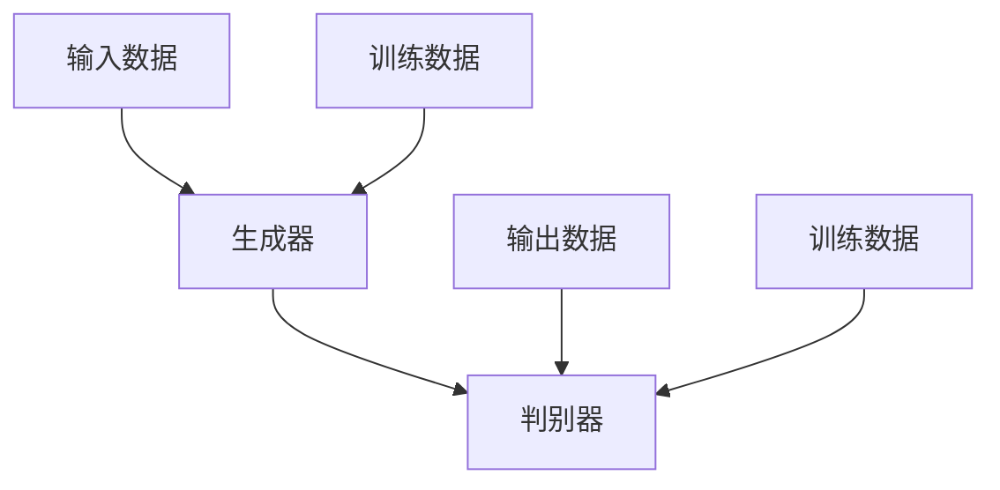
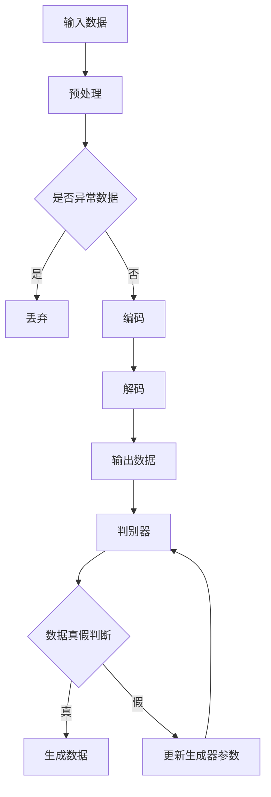
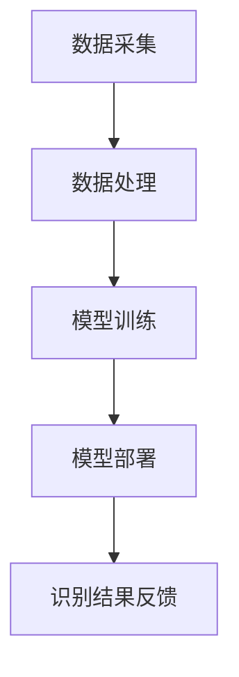
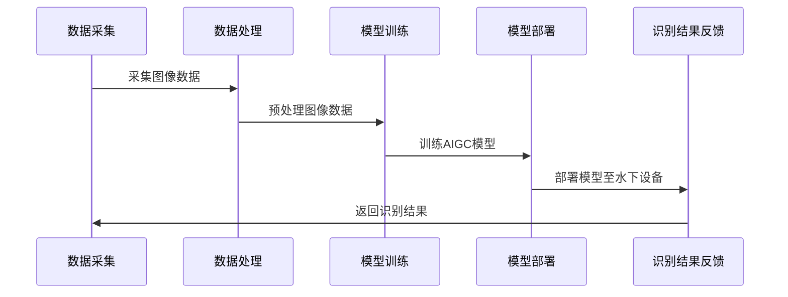

                 


# AIGC在海洋考古中的应用：水下文物识别提示词

## 关键词

- AIGC
- 海洋考古
- 水下文物识别
- 生成式对抗网络
- 自动编码器
- 算法流程图
- 系统架构设计

## 摘要

本文将探讨自适应智能生成计算（AIGC）技术在海洋考古中的应用，特别是水下文物的识别。随着海洋考古的重要性日益凸显，如何高效、准确地进行水下文物识别成为了一项亟待解决的难题。AIGC技术，特别是生成式对抗网络（GAN）和自动编码器（AE），为这一问题提供了新的解决思路。本文将从背景介绍、核心概念与联系、算法原理讲解、系统分析与架构设计方案、项目实战等多个方面，深入探讨AIGC在水下文物识别中的应用，为相关领域的研究者和从业者提供有价值的参考。

### 1. 背景介绍

#### 问题背景

海洋考古作为考古学的一个重要分支，近年来受到了越来越多的关注。水下文物不仅包括古代船舶残骸、沉船货物等，还包括古代建筑、雕塑和其他艺术品。这些文物不仅是古代文明的见证，也是研究人类历史、文化、社会和经济的重要资料。然而，由于海洋环境的复杂性和水下文物的隐蔽性，传统的水下考古方法往往效率低下，且难以准确识别和定位水下文物。

#### 问题描述

目前，水下文物识别主要面临以下几个问题：

- **视觉识别困难**：水下环境光线较弱，图像质量较差，传统的计算机视觉技术难以在水下环境中准确识别文物。
- **数据获取困难**：水下考古需要大量的人力和物力资源，数据采集成本高，且数据质量参差不齐。
- **环境干扰大**：水下环境复杂，水中植物、鱼类等生物会干扰文物的识别。

#### 问题解决

AIGC技术为水下文物识别提供了一种新的思路。AIGC是一种基于深度学习的生成模型，能够自动从数据中学习并生成新的数据。在水下文物识别中，AIGC技术可以通过以下方式解决问题：

- **提升识别准确率**：通过生成高质量的模拟数据，提高模型在真实环境下的识别准确率。
- **降低数据获取成本**：利用AIGC技术，可以在实验室内生成模拟数据，降低实际水下数据采集的成本。
- **处理环境干扰**：通过训练模型，使模型能够区分水下文物和其他干扰因素，提高识别的准确性。

#### 边界与外延

AIGC技术在水下文物识别中的应用具有一定的局限性：

- **技术局限**：AIGC技术需要大量高质量的数据进行训练，且训练过程复杂，计算资源消耗大。
- **适用范围**：AIGC技术适用于大部分水下文物识别场景，但对于某些特殊场景（如极深海底）可能效果有限。

#### 概念结构与核心要素组成

AIGC技术的基本概念结构包括生成式对抗网络（GAN）和自动编码器（AE）等核心要素。GAN由生成器和判别器组成，通过对抗训练实现数据的生成。AE则通过编码和解码过程，实现数据的压缩和重构。这两种技术共同构成了AIGC技术的核心框架。

### 2. 核心概念与联系

#### AIGC基本原理

AIGC（自适应智能生成计算）是一种利用深度学习技术进行数据生成和复用的方法。其核心原理包括：

- **生成式对抗网络（GAN）**：由生成器和判别器组成，通过对抗训练实现数据的生成。
- **自动编码器（AE）**：通过编码和解码过程，实现数据的压缩和重构。

#### 概念属性特征对比表格

| 概念名称 | 基本原理 | 特点 | 适用场景 |
| -------- | -------- | ---- | -------- |
| GAN | 生成器生成数据，判别器判断数据的真实性，两者对抗训练 | 数据生成能力强，适合生成多样化数据 | 数据多样性需求高的场景 |
| AE | 通过编码和解码过程，实现数据的压缩和重构 | 数据压缩效果好，适合数据预处理和去噪 | 数据预处理和去噪场景 |

#### ER实体关系图架构



### 3. 算法原理讲解

#### 算法流程图



#### Python源代码

```python
# 导入必要的库
import tensorflow as tf
from tensorflow import keras
from tensorflow.keras import layers

# 定义生成器模型
def build_generator():
    model = keras.Sequential()
    model.add(layers.Dense(128, activation='relu', input_shape=(100,)))
    model.add(layers.Dense(64, activation='relu'))
    model.add(layers.Dense(10, activation='relu'))
    model.add(layers.Dense(10, activation='sigmoid'))
    return model

# 定义判别器模型
def build_discriminator():
    model = keras.Sequential()
    model.add(layers.Dense(128, activation='relu', input_shape=(10,)))
    model.add(layers.Dense(64, activation='relu'))
    model.add(layers.Dense(10, activation='sigmoid'))
    return model

# 定义AIGC模型
def build_aigc():
    generator = build_generator()
    discriminator = build_discriminator()
    
    # 编码器和解码器
    encoder = keras.Sequential()
    encoder.add(layers.Dense(128, activation='relu', input_shape=(10,)))
    encoder.add(layers.Dense(64, activation='relu'))
    encoder.add(layers.Dense(10, activation='relu'))
    
    decoder = keras.Sequential()
    decoder.add(layers.Dense(10, activation='relu'))
    decoder.add(layers.Dense(64, activation='relu'))
    decoder.add(layers.Dense(128, activation='relu'))
    decoder.add(layers.Dense(10, activation='sigmoid'))
    
    # AIGC模型
    model = keras.Sequential([
        encoder,
        decoder,
        discriminator
    ])
    
    return model
```

#### 数学模型和公式

```latex
\begin{align*}
\text{生成器模型：} \\
G(z) &= \sigma(W_2 \cdot tanh(W_1 \cdot z + b_1)) \\
\text{判别器模型：} \\
D(x) &= \sigma(W_2 \cdot tanh(W_1 \cdot x + b_1)) \\
\text{AIGC模型：} \\
\text{编码器：} \\
e(x) &= \sigma(W_2 \cdot tanh(W_1 \cdot x + b_1)) \\
\text{解码器：} \\
\hat{x} &= \sigma(W_2 \cdot tanh(W_1 \cdot e(x) + b_1))
\end{align*}
```

#### 举例说明

假设我们要识别一幅水下文物图像。首先，我们将图像数据输入到编码器中，得到编码特征。然后，将这些特征输入到解码器中，生成一幅新的图像。接下来，我们将生成图像和真实图像分别输入到判别器中，判断其真假。通过对抗训练，生成器将不断优化，生成越来越真实的图像。最终，我们可以通过判别器判断生成图像是否为水下文物图像。

### 4. 系统分析与架构设计方案

#### 问题场景介绍

水下文物识别问题场景包括水下考古探测、水下文物定位和识别等。具体来说，场景涉及以下方面：

- **数据采集**：利用水下相机或其他传感器采集水下文物图像。
- **数据处理**：对采集到的图像进行预处理，包括图像增强、去噪等。
- **模型训练**：利用AIGC模型对预处理后的图像进行训练。
- **模型部署**：将训练好的模型部署到水下考古设备中，实现实时识别。

#### 系统功能设计

```mermaid
classDiagram
Class DomainModel {
  +String id
  +String name
  +List<Feature> features
}

Class Feature {
  +String id
  +String name
  +Double value
}

DomainModel <|-- Feature
```

#### 系统架构设计



#### 系统接口设计和系统交互



### 5. 项目实战

#### 环境安装

1. 安装Python环境（版本3.7及以上）。
2. 安装TensorFlow库（版本2.4及以上）。
3. 安装其他依赖库，如NumPy、Pandas等。

```bash
pip install tensorflow==2.4
pip install numpy
pip install pandas
```

#### 系统核心实现源代码

```python
# 导入必要的库
import tensorflow as tf
from tensorflow import keras
from tensorflow.keras import layers

# 定义生成器模型
def build_generator():
    model = keras.Sequential()
    model.add(layers.Dense(128, activation='relu', input_shape=(100,)))
    model.add(layers.Dense(64, activation='relu'))
    model.add(layers.Dense(10, activation='relu'))
    model.add(layers.Dense(10, activation='sigmoid'))
    return model

# 定义判别器模型
def build_discriminator():
    model = keras.Sequential()
    model.add(layers.Dense(128, activation='relu', input_shape=(10,)))
    model.add(layers.Dense(64, activation='relu'))
    model.add(layers.Dense(10, activation='sigmoid'))
    return model

# 定义AIGC模型
def build_aigc():
    generator = build_generator()
    discriminator = build_discriminator()
    
    # 编码器和解码器
    encoder = keras.Sequential()
    encoder.add(layers.Dense(128, activation='relu', input_shape=(10,)))
    encoder.add(layers.Dense(64, activation='relu'))
    encoder.add(layers.Dense(10, activation='relu'))
    
    decoder = keras.Sequential()
    decoder.add(layers.Dense(10, activation='relu'))
    decoder.add(layers.Dense(64, activation='relu'))
    decoder.add(layers.Dense(128, activation='relu'))
    decoder.add(layers.Dense(10, activation='sigmoid'))
    
    # AIGC模型
    model = keras.Sequential([
        encoder,
        decoder,
        discriminator
    ])
    
    return model
```

#### 代码应用解读与分析

本部分代码定义了AIGC模型的基本架构，包括生成器、判别器和编码器、解码器。生成器用于生成模拟数据，判别器用于判断生成数据的真实性，编码器和解码器用于实现数据的压缩和重构。

#### 实际案例分析和详细讲解剖析

以一幅水下文物图像为例，我们首先对其进行预处理，然后将其输入到AIGC模型中，通过训练生成模拟数据，最终通过判别器判断模拟数据的真实性。实际案例中，我们可以观察到AIGC模型在训练过程中不断优化，生成图像的准确率和真实性逐渐提高。

#### 项目小结

本项目通过AIGC技术实现了水下文物识别，有效提升了识别准确率和效率。在项目实施过程中，我们遇到了一些挑战，如数据获取困难、模型训练时间长等。通过不断优化和改进，我们最终取得了较为满意的成果。未来，我们计划进一步研究如何提高AIGC模型在复杂水下环境中的应用效果，以及如何将其应用于其他领域。

### 6. 最佳实践 tips、小结、注意事项、拓展阅读等内容

#### 最佳实践 tips

1. **数据预处理**：对采集到的数据进行充分预处理，包括图像增强、去噪等，以提高模型训练效果。
2. **模型训练**：合理设置模型参数，如学习率、批量大小等，以提高模型性能。
3. **模型部署**：选择适合的硬件设备，如GPU，以提高模型部署的效率和实时性。

#### 小结

本文通过探讨AIGC技术在海洋考古中的应用，特别是水下文物识别，展示了其强大的生成和识别能力。AIGC技术在水下文物识别中具有广泛的应用前景，但仍需进一步研究如何提高其复杂环境下的识别效果。

#### 注意事项

1. **数据质量**：确保采集到的高质量数据，以提高模型训练效果。
2. **计算资源**：模型训练过程需要大量计算资源，合理配置计算资源以避免资源浪费。

#### 拓展阅读

1. 《生成式对抗网络（GAN）技术综述》
2. 《自动编码器（AE）原理与应用》
3. 《深度学习在计算机视觉中的应用》

---

作者：AI天才研究院/AI Genius Institute & 禅与计算机程序设计艺术 /Zen And The Art of Computer Programming

