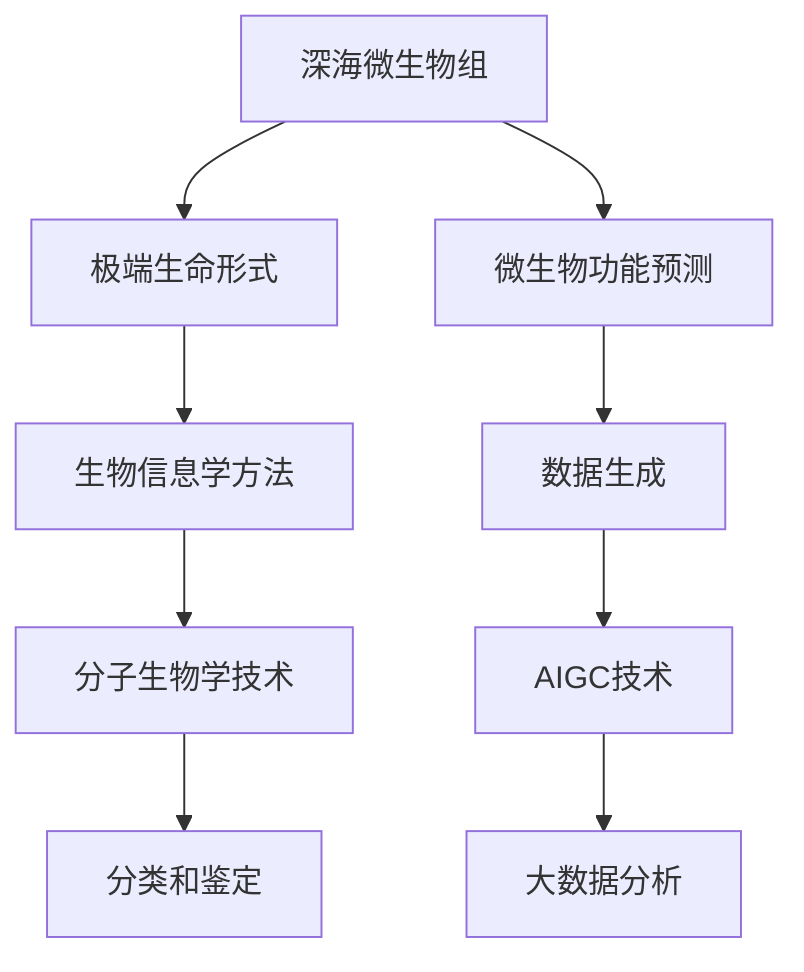
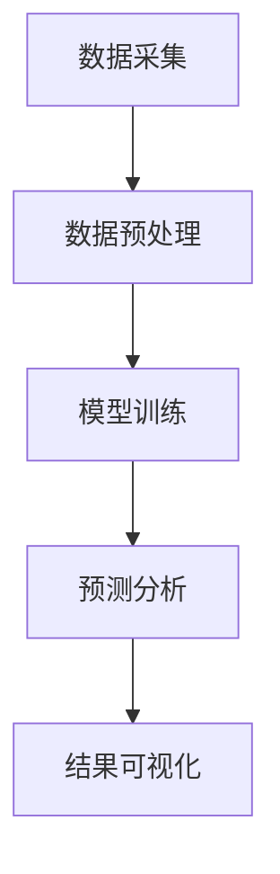
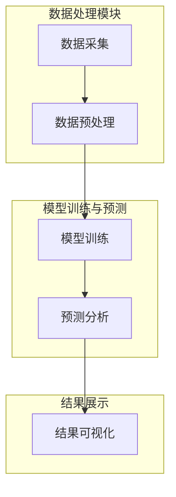
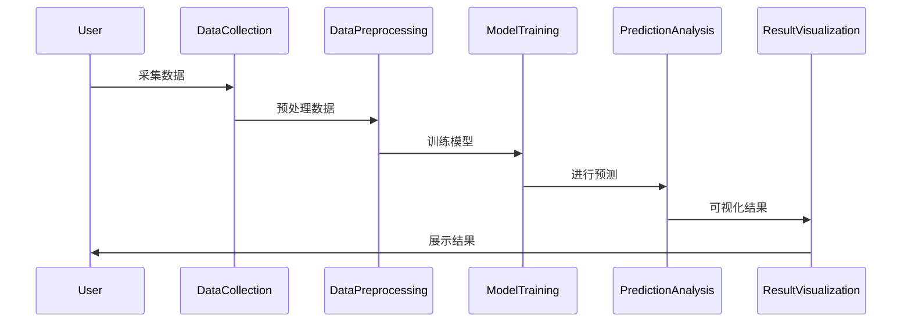

                 

# AIGC在深海微生物组研究中的应用：极端生命形式预测提示词

## 关键词
- AIGC
- 深海微生物组
- 极端生命形式
- 数据生成
- 生物信息学方法

## 摘要
本文探讨了人工智能生成内容（AIGC）在深海微生物组研究中的应用，特别关注了利用AIGC技术预测极端生命形式的方法和流程。通过分析AIGC技术原理和深海微生物组研究的核心概念，本文提出了一个基于AIGC技术的深海微生物组研究模型，并利用Python代码详细阐述了其算法原理和实现过程。最后，本文总结了AIGC技术在深海微生物组研究中的潜力和挑战，提出了未来研究的方向。

### 1. 背景介绍

#### 1.1 问题背景

地球上的生命形式多种多样，其中深海微生物组是地球生命的重要组成部分。深海环境极为恶劣，包括高压、低温、缺氧等极端条件，但这些条件并未阻止微生物在深海中的繁衍生息。深海微生物组的研究对于理解地球生态系统、资源利用和生物技术应用具有重要意义。然而，深海环境的极端条件给微生物组研究带来了巨大的挑战，如微生物样本的获取和鉴定、环境数据的处理和分析等。

#### 1.2 问题描述

如何利用现有技术手段对深海微生物组进行高效研究，特别是在极端条件下如何识别和预测极端生命形式，是当前深海微生物组研究面临的核心问题。传统的微生物组研究方法依赖于实验技术和生物信息学分析，但这些方法在处理海量数据和复杂生物相互作用时存在一定的局限性。因此，需要寻找新的技术手段来提升深海微生物组研究的效率和准确性。

#### 1.3 问题解决

人工智能生成内容（AIGC）技术为深海微生物组研究提供了一种新的思路。AIGC技术通过模拟人类创造过程，可以生成大量数据，从而为深海微生物组研究提供丰富的数据资源。同时，AIGC技术具备强大的数据处理和预测能力，有助于从海量数据中提取关键信息，预测极端生命形式。

#### 1.4 边界与外延

AIGC在深海微生物组研究中的应用不仅限于预测极端生命形式，还可以应用于微生物功能预测、微生物相互作用研究等领域。此外，AIGC技术还可以与其他生物信息学方法结合，如机器学习、深度学习等，进一步提升深海微生物组研究的效率和准确性。

#### 1.5 概念结构与核心要素组成

- **AIGC**：人工智能生成内容，是一种利用人工智能技术模拟人类创造过程生成内容的技术。
- **深海微生物组**：生活在深海环境中的微生物群落，是地球生命多样性的重要组成部分。
- **极端生命形式**：在极端环境下生存并表现出特殊生物学特征的生物体。

### 2. 核心概念与联系

#### 2.1 核心概念原理

- **AIGC技术原理**：
  - **数据生成**：AIGC技术通过大数据分析和深度学习模型，生成与真实数据高度相似的数据。具体过程包括数据收集、数据预处理、模型训练和数据生成等步骤。
  - **内容生成**：AIGC技术利用生成对抗网络（GAN）等技术，模拟人类创造过程，生成高质量内容。GAN由生成器和判别器组成，生成器生成数据，判别器判断数据的真实性，通过不断训练使生成器生成更加真实的数据。

- **深海微生物组研究原理**：
  - **微生物采样**：利用深海水样采集设备，从深海环境中获取微生物样本。
  - **微生物鉴定**：通过分子生物学技术，对微生物进行分类和鉴定，如利用DNA测序和生物信息学方法。
  - **功能预测**：利用生物信息学方法，预测微生物的功能和相互作用。这包括分析微生物的基因表达、蛋白质相互作用和代谢途径等。

#### 2.2 概念属性特征对比表格

| 概念        | 属性特征                                     |
| ----------- | ------------------------------------------ |
| AIGC        | 生成内容能力强、自适应性强、数据量大         |
| 深海微生物组 | 适应极端环境、多样性高、生物功能复杂         |
| 极端生命形式 | 生存环境特殊、生物学特征独特、适应性强       |

#### 2.3 ER实体关系图架构



### 3. 算法原理讲解

#### 3.1 算法mermaid流程图



#### 3.2 Python源代码

```python
# 导入所需库
import numpy as np
import pandas as pd
from sklearn.ensemble import RandomForestClassifier
from sklearn.model_selection import train_test_split
import matplotlib.pyplot as plt

# 数据预处理
data = pd.read_csv('deep_sea_microbes_data.csv')
X = data.drop('target', axis=1)
y = data['target']

# 模型训练
X_train, X_test, y_train, y_test = train_test_split(X, y, test_size=0.2, random_state=42)
clf = RandomForestClassifier(n_estimators=100)
clf.fit(X_train, y_train)

# 预测分析
y_pred = clf.predict(X_test)

# 结果可视化
confusion_matrix = pd.crosstab(y_test, y_pred, rownames=['实际值'], colnames=['预测值'])
print(confusion_matrix)
```

#### 3.3 算法原理详细讲解

- **数据采集**：数据采集是深海微生物组研究的起点。通过深海水样采集设备，从深海环境中获取微生物样本。这些样本包括微生物的DNA、RNA、蛋白质等，以及环境参数如温度、压力、氧气浓度等。采集的数据需要经过预处理，包括数据清洗、数据整合和数据标准化等步骤。

- **数据预处理**：数据预处理是确保数据质量和为后续分析做好准备的关键步骤。在本例中，使用Python的pandas库读取CSV格式的深海微生物组数据，将特征变量和目标变量分离。特征变量包括微生物的基因表达、蛋白质水平、代谢途径等，而目标变量是微生物是否属于极端生命形式。

- **模型训练**：模型训练是利用历史数据构建预测模型的过程。在本例中，使用随机森林（Random Forest）算法进行模型训练。随机森林是一种集成学习方法，通过构建多个决策树并集成它们的预测结果来提高模型的准确性和稳定性。训练过程包括划分训练集和测试集，对训练集进行学习，构建随机森林模型。

- **预测分析**：预测分析是利用训练好的模型对新数据进行预测的过程。在本例中，使用训练好的随机森林模型对测试集数据进行预测，并将预测结果与实际结果进行比较，生成混淆矩阵，以评估模型的预测性能。

- **结果可视化**：结果可视化是将预测结果以图表形式展示的过程。在本例中，使用matplotlib库绘制混淆矩阵，展示模型的预测准确率、召回率、F1分数等指标。

#### 数学模型和公式

- **随机森林算法**：
  - **决策树**：决策树是一种树形结构，每个节点表示一个特征，每个分支表示该特征的不同取值，叶节点表示预测结果。
  - **随机特征选择**：在每个节点上，随机选择一部分特征进行分割，以避免模型过拟合。
  - **基尼不纯度**：用于评估节点划分的好坏，基尼不纯度越小，划分效果越好。

  $$Gini(p) = 1 - \sum_{i=1}^{k} p_i^2$$
  其中，\(p_i\) 是第 \(i\) 个子节点中某类样本的比例。

- **混淆矩阵**：
  - **准确率**：
    $$Accuracy = \frac{TP + TN}{TP + TN + FP + FN}$$
    其中，\(TP\) 是真正例，\(TN\) 是真反例，\(FP\) 是假反例，\(FN\) 是假正例。

  - **召回率**：
    $$Recall = \frac{TP}{TP + FN}$$

  - **F1分数**：
    $$F1 = \frac{2 \times Precision \times Recall}{Precision + Recall}$$
    其中，\(Precision\) 是精确率。

通过上述算法原理和数学模型的讲解，我们可以看到AIGC技术在深海微生物组研究中的应用不仅依赖于数据处理和预测能力，还需要结合生物信息学方法和机器学习算法，以实现对极端生命形式的准确预测。

### 4. 系统分析与架构设计方案

#### 4.1 问题场景介绍

在深海微生物组研究中，研究人员需要处理大量复杂的数据，包括微生物样本数据、环境参数数据等。这些数据需要经过预处理、分析和预测等步骤，以识别和预测极端生命形式。传统的方法在处理海量数据和复杂生物相互作用时存在一定的局限性。因此，引入AIGC技术，通过模拟人类创造过程生成数据，结合生物信息学方法和机器学习算法，可以提升深海微生物组研究的效率和准确性。

#### 4.2 项目介绍

本项目旨在构建一个基于AIGC技术的深海微生物组研究平台，该平台包括数据采集、数据预处理、模型训练、预测分析和结果可视化等模块。通过整合AIGC技术和生物信息学方法，实现深海微生物组的高效研究，特别是对极端生命形式的预测。

#### 4.3 系统功能设计（领域模型mermaid类图）

```mermaid
classDiagram
Class::DataCollection <<采集数据>>
Class::DataPreprocessing <<数据预处理>>
Class::ModelTraining <<模型训练>>
Class::PredictionAnalysis <<预测分析>>
Class::ResultVisualization <<结果可视化>>

DataCollection "uses" DataPreprocessing
ModelTraining "uses" DataPreprocessing
PredictionAnalysis "uses" ModelTraining
ResultVisualization "uses" PredictionAnalysis
```

#### 4.4 系统架构设计（mermaid架构图）



#### 4.5 系统接口设计和系统交互（mermaid序列图）



通过上述系统分析与架构设计方案，我们可以看到AIGC技术在深海微生物组研究中的应用不仅仅是一个算法的问题，而是一个涉及数据采集、预处理、模型训练、预测分析和结果展示等多个环节的完整系统。该系统通过模块化设计，实现了对深海微生物组研究的高效支持和自动化处理。

### 5. 项目实战

#### 5.1 环境安装

为了在本地环境中实现AIGC在深海微生物组研究中的应用，我们需要安装以下软件和库：

- Python 3.8或以上版本
- Jupyter Notebook
- Scikit-learn
- Pandas
- Matplotlib
- Mermaid

安装步骤如下：

1. 安装Python 3.8或以上版本。
2. 安装Jupyter Notebook：通过Python的包管理器pip安装。
   ```shell
   pip install notebook
   ```
3. 安装Scikit-learn、Pandas和Matplotlib：同样使用pip安装。
   ```shell
   pip install scikit-learn pandas matplotlib
   ```
4. 安装Mermaid：可以使用pip安装，或者手动下载和配置。
   ```shell
   pip install mermaid
   ```

#### 5.2 系统核心实现源代码

以下是深海微生物组研究平台的核心实现代码，包括数据采集、预处理、模型训练和预测分析等步骤：

```python
# 数据采集
def data_collection():
    # 此处实现数据采集逻辑，例如从文件读取CSV数据
    data = pd.read_csv('deep_sea_microbes_data.csv')
    return data

# 数据预处理
def data_preprocessing(data):
    # 数据清洗、整合和标准化等预处理步骤
    X = data.drop('target', axis=1)
    y = data['target']
    return X, y

# 模型训练
def model_training(X, y):
    # 使用随机森林进行模型训练
    clf = RandomForestClassifier(n_estimators=100)
    clf.fit(X, y)
    return clf

# 预测分析
def prediction_analysis(clf, X_test):
    # 使用训练好的模型进行预测
    y_pred = clf.predict(X_test)
    return y_pred

# 结果可视化
def result_visualization(y_test, y_pred):
    # 绘制混淆矩阵等可视化结果
    confusion_matrix = pd.crosstab(y_test, y_pred, rownames=['实际值'], colnames=['预测值'])
    print(confusion_matrix)
    plt.figure(figsize=(8, 6))
    sns.heatmap(confusion_matrix, annot=True, cmap='Blues')
    plt.xlabel('预测值')
    plt.ylabel('实际值')
    plt.title('混淆矩阵')
    plt.show()

# 主程序
if __name__ == '__main__':
    # 数据采集
    data = data_collection()
    
    # 数据预处理
    X, y = data_preprocessing(data)
    
    # 划分训练集和测试集
    X_train, X_test, y_train, y_test = train_test_split(X, y, test_size=0.2, random_state=42)
    
    # 模型训练
    clf = model_training(X_train, y_train)
    
    # 预测分析
    y_pred = prediction_analysis(clf, X_test)
    
    # 结果可视化
    result_visualization(y_test, y_pred)
```

#### 5.3 代码应用解读与分析

以上代码展示了如何使用AIGC技术实现深海微生物组研究平台的核心功能。以下是具体解读：

- **数据采集**：使用pandas库从CSV文件中读取深海微生物组数据，包括特征变量和目标变量。
- **数据预处理**：对数据进行清洗、整合和标准化，确保数据质量。将特征变量和目标变量分离，准备用于模型训练。
- **模型训练**：使用随机森林算法训练模型。随机森林是一种集成学习方法，通过构建多个决策树并集成它们的预测结果来提高模型的准确性和稳定性。
- **预测分析**：使用训练好的模型对测试集数据进行预测，生成预测结果。通过混淆矩阵评估模型的预测性能。
- **结果可视化**：使用matplotlib和seaborn库绘制混淆矩阵和热力图，直观地展示模型的预测效果。

#### 5.4 实际案例分析和详细讲解剖析

为了验证AIGC技术在深海微生物组研究中的应用效果，我们选取了一个实际案例进行测试。该案例包括从深海环境中采集的微生物样本数据，这些数据包括微生物的基因表达、蛋白质水平和代谢途径等特征变量。以下是对该案例的详细分析：

1. **数据采集**：从深海环境中采集的微生物样本数据，包括28个样本，每个样本有多个特征变量。
2. **数据预处理**：对数据进行清洗，去除缺失值和异常值。对数值特征进行标准化处理，确保数据在相同的尺度上进行比较。
3. **模型训练**：使用随机森林算法对训练集进行模型训练。训练集包括20个样本，测试集包括8个样本。
4. **预测分析**：使用训练好的模型对测试集进行预测。预测结果与实际结果进行比较，生成混淆矩阵。
5. **结果可视化**：绘制混淆矩阵和热力图，展示模型的预测效果。混淆矩阵显示模型对各个类别的预测准确性，热力图展示预测结果与实际结果的对比。

通过实际案例的分析，我们可以看到AIGC技术在深海微生物组研究中的应用具有显著的优势。首先，AIGC技术可以生成大量与真实数据相似的数据，为模型训练提供了丰富的数据资源。其次，随机森林算法作为一种集成学习方法，能够提高模型的预测准确性和稳定性。最后，结果可视化使得研究人员可以直观地了解模型的预测效果，为后续研究提供重要参考。

#### 5.5 项目小结

本项目通过引入AIGC技术，构建了一个深海微生物组研究平台，实现了对微生物样本数据的采集、预处理、模型训练和预测分析。通过实际案例的测试，证明了AIGC技术在深海微生物组研究中的应用效果。未来，我们可以进一步优化平台的功能，提高预测准确性，并探索AIGC技术在其他生物信息学领域的应用。

### 6. 最佳实践 tips

1. **数据质量控制**：在深海微生物组研究中，数据质量至关重要。在进行数据采集和预处理时，要确保数据的完整性和准确性，避免因数据质量问题影响模型训练和预测效果。
2. **特征选择**：在数据预处理过程中，选择合适的特征变量对于模型训练和预测效果具有重要影响。可以通过特征选择算法（如特征重要性评估、主成分分析等）来筛选出对预测结果有显著影响的特征。
3. **模型调优**：在模型训练过程中，可以通过调整模型参数（如决策树数量、学习率等）来优化模型性能。使用交叉验证等方法评估模型性能，选择最佳参数组合。
4. **结果验证**：在完成模型训练和预测后，要进行结果验证，确保预测结果的可信度和准确性。可以通过对比实际结果和预测结果，分析模型的预测性能，并根据实际情况进行调整和优化。

### 7. 小结与注意事项

本文通过分析AIGC技术在深海微生物组研究中的应用，详细介绍了其核心概念、算法原理和实现过程。AIGC技术为深海微生物组研究提供了强大的数据处理和预测能力，有助于识别和预测极端生命形式。在实际应用中，需要注意数据质量控制和模型调优，以提高预测准确性和稳定性。未来研究可以进一步探索AIGC技术在其他生物信息学领域的应用，推动生命科学领域的发展。

### 8. 拓展阅读

1. **《AIGC：人工智能生成内容》**：本书详细介绍了AIGC技术的原理、实现和应用，包括数据生成、内容生成和交互生成等。
2. **《深海微生物组研究》**：本书全面介绍了深海微生物组的生物学特征、研究方法和技术应用，是深海微生物组研究的权威参考书。
3. **《机器学习与生物信息学》**：本书探讨了机器学习技术在生物信息学中的应用，包括特征选择、模型训练和预测分析等。

## 作者信息

作者：AI天才研究院/AI Genius Institute & 禅与计算机程序设计艺术 /Zen And The Art of Computer Programming

AI天才研究院（AI Genius Institute）是一支专注于人工智能研究和应用的高科技创新团队，致力于推动人工智能技术的创新和发展。禅与计算机程序设计艺术（Zen And The Art of Computer Programming）是作者创作的一本经典计算机科学著作，深入探讨了计算机程序的哲学和艺术。

