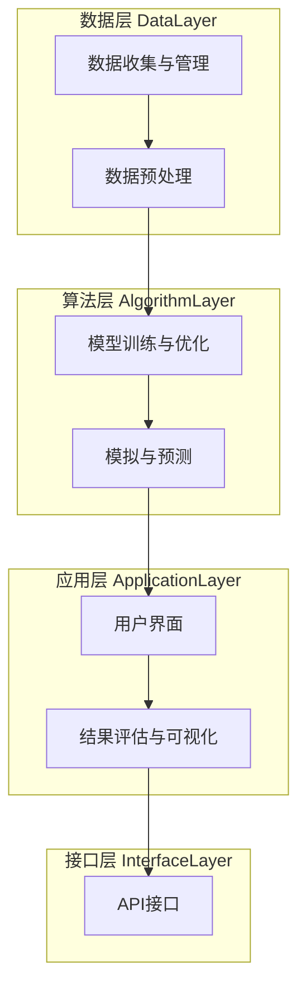
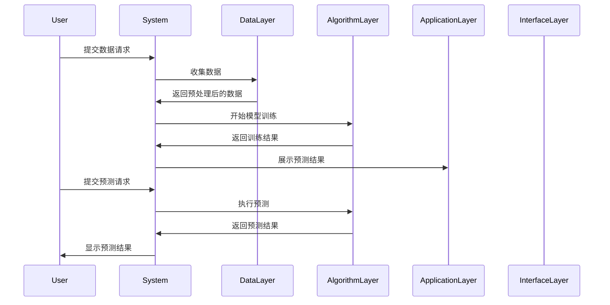

                 


# AIGC在深海生态系统研究中的应用：压力适应性提示词

## 关键词

AI-Generated Content (AIGC), 深海生态系统，压力适应性，生成式对抗网络 (GAN), 变分自编码器 (VAE)

## 摘要

本文深入探讨了AIGC在深海生态系统研究中的应用，特别是压力适应性方面的研究。通过介绍AIGC的核心概念和深海生态系统的背景，本文详细阐述了如何利用生成式对抗网络（GAN）和变分自编码器（VAE）等算法进行压力适应性预测。同时，文章提供了数学模型和公式，以及系统分析与架构设计，并展示了实际项目的实战应用。通过本文，读者可以了解到AIGC在深海生态系统研究中的巨大潜力，并掌握相关技术实现方法。

## 目录

### 第一部分：AIGC与深海生态系统研究基础

#### 第1章：AIGC概述

##### 1.1 AIGC的发展历程与现状

##### 1.2 深海生态系统研究背景

##### 1.3 压力适应性的概念与意义

#### 第2章：核心概念与联系

##### 2.1 AIGC核心概念解析

##### 2.2 深海生态系统核心概念解析

##### 2.3 ER实体关系图架构

#### 第3章：算法原理讲解

##### 3.1 GAN在压力适应性预测中的应用

##### 3.2 VAE在深海生态系统研究中的应用

#### 第4章：数学模型与公式

##### 4.1 压力适应性预测的数学模型

##### 4.2 VAE算法数学模型

##### 4.3 GAN算法数学模型

#### 第5章：系统分析与架构设计

##### 5.1 应用场景分析

##### 5.2 系统功能设计

##### 5.3 系统架构设计

##### 5.4 系计系接口设计与交互

#### 第6章：项目实战

##### 6.1 环境安装与配置

##### 6.2 核心实现源代码

##### 6.3 代码应用解读与分析

##### 6.4 实际案例分析

#### 第7章：最佳实践与拓展阅读

##### 7.1 最佳实践 tips

##### 7.2 项目小结

##### 7.3 注意事项

##### 7.4 拓展阅读

## 第1章：AIGC概述

### 1.1 AIGC的发展历程与现状

AIGC（AI-Generated Content）指的是由人工智能自动生成的内容。随着深度学习和生成对抗网络（GAN）等技术的不断发展，AIGC已经成为人工智能领域的一个热点研究方向。AIGC的应用场景非常广泛，包括但不限于图像生成、文本生成、视频生成等。

AIGC的发展历程可以追溯到2006年，当Ian J. Goodfellow等人首次提出了生成对抗网络（GAN）的概念。GAN由两个神经网络组成：生成器（Generator）和判别器（Discriminator）。生成器的任务是生成尽可能真实的样本，而判别器的任务是区分真实样本和生成样本。在训练过程中，生成器和判别器相互竞争，最终生成器能够生成高度逼真的样本。

随着时间的推移，AIGC技术在多个领域得到了广泛应用。例如，在图像处理领域，AIGC可以用于图像生成、图像修复和图像超分辨率等任务；在自然语言处理领域，AIGC可以用于文本生成、机器翻译和对话系统等任务。

目前，AIGC技术正处于快速发展阶段。随着计算能力的提升和算法的优化，AIGC的应用范围将越来越广泛，其对人类生产和生活的影响也将越来越大。

### 1.2 深海生态系统研究背景

深海生态系统是指海洋中深度超过200米的海域，占据了地球表面积的70%以上。深海生态系统具有极其丰富的生物多样性和生态过程，对地球的气候调控、物质循环和生物多样性保护等方面具有重要意义。

然而，深海生态系统也面临着诸多挑战。例如，海洋温度和pH值的变化、海洋污染、过度捕捞等都会对深海生态系统的稳定性产生负面影响。因此，深入研究深海生态系统，尤其是理解生物的压力适应性，对于保护海洋生态系统和应对环境变化具有重要意义。

### 1.3 压力适应性的概念与意义

压力适应性是指生物体在面对环境压力时，通过生理、行为或遗传变异等机制，提高自身生存和繁殖能力的过程。在深海生态系统中，生物面临的环境压力包括温度、盐度、光照、食物资源等。

压力适应性对深海生态系统具有重要意义。首先，它有助于维持生物多样性和生态平衡。其次，通过研究压力适应性，可以更好地预测生物对环境变化的响应，为环境保护和资源管理提供科学依据。最后，压力适应性研究还可以为生物医学领域提供启示，帮助人类应对气候变化等环境问题。

## 第2章：核心概念与联系

### 2.1 AIGC核心概念解析

#### 2.1.1 生成式对抗网络（GAN）

生成式对抗网络（GAN）是由生成器和判别器组成的神经网络结构。生成器的任务是生成尽可能真实的样本，判别器的任务是区分真实样本和生成样本。在训练过程中，生成器和判别器相互竞争，通过多次迭代，生成器能够生成高度逼真的样本。

GAN的核心概念包括：

1. **生成器（Generator）**：生成器接收随机噪声作为输入，通过神经网络生成数据。生成器的目标是最小化生成样本与真实样本之间的差异。

2. **判别器（Discriminator）**：判别器接收真实数据和生成数据作为输入，通过神经网络判断输入数据是真实样本还是生成样本。判别器的目标是最大化判断准确率。

3. **对抗训练（Adversarial Training）**：生成器和判别器通过对抗训练相互提高。生成器尝试生成更加真实的样本以欺骗判别器，而判别器则努力提高对真实样本和生成样本的辨别能力。

GAN的数学模型可以表示为：

$$
\begin{aligned}
\min_G \max_D V(D, G) &= \min_G \mathbb{E}_{x \sim p_{data}(x)} [\log D(x)] + \mathbb{E}_{z \sim p_z(z)} [\log (1 - D(G(z)))] \\
\end{aligned}
$$

其中，$x$代表真实样本，$z$代表随机噪声，$G(z)$是生成器生成的样本，$D(x)$和$D(G(z))$分别是判别器对真实样本和生成样本的判断结果。

#### 2.1.2 变分自编码器（VAE）

变分自编码器（VAE）是一种基于概率模型的生成模型。VAE由编码器（Encoder）和解码器（Decoder）组成。编码器将输入数据映射到一个潜在空间中的点，解码器则从潜在空间中采样并生成数据。

VAE的核心概念包括：

1. **编码器（Encoder）**：编码器将输入数据映射到一个潜在空间中的点，这个点代表了输入数据的概率分布。

2. **解码器（Decoder）**：解码器从潜在空间中采样，并生成与输入数据分布相近的数据。

3. **重参数化（Reparameterization）**：VAE通过重参数化技巧将生成过程与梯度传播结合起来，使得模型可以通过反向传播进行训练。

VAE的数学模型可以表示为：

$$
\begin{aligned}
p(x|\theta) &= \int p_\theta(x|z) p(z) dz \\
\end{aligned}
$$

其中，$x$是输入数据，$z$是潜在空间中的点，$p_\theta(x|z)$是解码器的概率模型，$p(z)$是潜在空间中的先验分布。

#### 2.1.3 GAN与VAE的对比

GAN和VAE都是生成模型，但它们在生成过程和模型结构上有明显的差异。

1. **生成过程**：

   - GAN：GAN通过生成器和判别器的对抗训练来实现生成过程。生成器尝试生成逼真的样本以欺骗判别器，而判别器则努力提高对真实样本和生成样本的辨别能力。

   - VAE：VAE通过编码器和解码器的协作来实现生成过程。编码器将输入数据映射到一个潜在空间中的点，解码器则从潜在空间中采样并生成数据。

2. **模型结构**：

   - GAN：GAN由生成器和判别器组成，生成器和判别器都是全连接神经网络。

   - VAE：VAE由编码器和解码器组成，编码器和解码器通常采用卷积神经网络（CNN）或循环神经网络（RNN）。

3. **优缺点**：

   - GAN：GAN可以生成高度逼真的样本，但训练过程不稳定，容易陷入局部最小值。

   - VAE：VAE训练过程相对稳定，生成的样本质量较高，但生成样本的多样性可能不如GAN。

### 2.2 深海生态系统核心概念解析

#### 2.2.1 压力适应性

压力适应性是指生物体在面对环境压力时，通过生理、行为或遗传变异等机制，提高自身生存和繁殖能力的过程。在深海生态系统中，生物面临的环境压力包括温度、盐度、光照、食物资源等。

压力适应性可以通过以下几种机制实现：

1. **生理适应性**：生物体通过改变生理特性来适应环境压力。例如，提高体温、调节离子平衡等。

2. **行为适应性**：生物体通过改变行为模式来适应环境压力。例如，改变栖息地、调整活动时间等。

3. **遗传适应性**：生物体通过遗传变异来适应环境压力。遗传适应性可以通过自然选择和遗传漂变等机制实现。

#### 2.2.2 生物多样性

生物多样性是指生物体系中各种生物种类和遗传多样性的总和。在深海生态系统中，生物多样性具有重要意义。

1. **生物多样性保护**：生物多样性是维持生态平衡和生态系统功能的关键。保护生物多样性有助于维护海洋生态系统的稳定性。

2. **生物资源利用**：生物多样性为人类提供了丰富的生物资源，包括食品、药物和生物能源等。

3. **生态修复**：生物多样性有助于生态系统的恢复和修复。通过引入多样的生物种类，可以加速生态系统的恢复过程。

### 2.3 ER实体关系图架构

为了更好地理解AIGC在深海生态系统研究中的应用，我们可以使用ER实体关系图来展示核心概念之间的联系。

#### 概念实体

1. **生成器（Generator）**：生成器是AIGC模型的核心组件，负责生成深海生态系统数据。
2. **判别器（Discriminator）**：判别器用于区分真实深海生态系统数据和生成器生成的数据。
3. **编码器（Encoder）**：编码器将输入深海生态系统数据映射到潜在空间。
4. **解码器（Decoder）**：解码器从潜在空间中采样并生成深海生态系统数据。
5. **压力适应性（Stress Tolerance）**：描述生物体在环境压力下的适应性。
6. **生物多样性（Biodiversity）**：描述深海生态系统的生物种类和遗传多样性。

#### 实体关系

1. **生成器-生成**：生成器生成深海生态系统数据。
2. **判别器-判断**：判别器判断生成器生成的数据与真实数据的相似性。
3. **编码器-编码**：编码器将深海生态系统数据编码到潜在空间。
4. **解码器-解码**：解码器从潜在空间中解码生成深海生态系统数据。
5. **压力适应性-影响**：压力适应性影响生物体对环境压力的反应。
6. **生物多样性-影响**：生物多样性影响深海生态系统的稳定性。

### ER实体关系图

```mermaid
erDiagram
  Generator ||--|{ 判别器 }|| Discriminator
  Encoder ||--|{ 解码器 }|| Decoder
  StressTolerance ||--|{ 生物体 }||-> BiologicalEntity
  Biodiversity ||--|{ 深海生态系统 }||-> MarineEcosystem
```

通过ER实体关系图，我们可以清晰地看到AIGC模型在深海生态系统研究中的核心组件及其相互关系。生成器和判别器共同构成了生成模型，编码器和解码器则负责数据编码和解码。压力适应性和生物多样性则分别描述了生物体对环境压力的反应和深海生态系统的稳定性。

## 第3章：算法原理讲解

### 3.1 GAN在压力适应性预测中的应用

生成式对抗网络（GAN）在深海生态系统研究中具有广泛的应用潜力，尤其是在压力适应性预测方面。GAN通过生成器和判别器的对抗训练，能够学习到真实数据的分布，从而生成高度逼真的模拟数据，为深海生态系统研究提供有力的工具。

#### 3.1.1 GAN基本原理

GAN由生成器（Generator）和判别器（Discriminator）两个神经网络组成，它们在训练过程中相互对抗。生成器的目标是生成尽可能逼真的数据，而判别器的目标是准确区分真实数据和生成数据。

1. **生成器（Generator）**：生成器接收一个随机噪声向量作为输入，通过一系列的神经网络层生成与真实数据分布相近的数据。生成器的目标是最小化生成数据的损失函数，使其与真实数据的分布尽量接近。

2. **判别器（Discriminator）**：判别器接收真实数据和生成数据作为输入，通过一系列的神经网络层判断输入数据是真实样本还是生成样本。判别器的目标是最小化误判损失函数，使其对真实数据和生成数据的区分能力尽量强。

3. **对抗训练（Adversarial Training）**：生成器和判别器通过对抗训练相互提高。生成器尝试生成更加真实的样本以欺骗判别器，而判别器则努力提高对真实样本和生成样本的辨别能力。在训练过程中，生成器和判别器交替更新权重，以达到共同的最小化损失函数。

GAN的训练过程可以表示为：

$$
\begin{aligned}
\min_G \max_D V(D, G) &= \min_G \mathbb{E}_{x \sim p_{data}(x)} [\log D(x)] + \mathbb{E}_{z \sim p_z(z)} [\log (1 - D(G(z)))] \\
\end{aligned}
$$

其中，$x$代表真实样本，$z$代表随机噪声，$G(z)$是生成器生成的样本，$D(x)$和$D(G(z))$分别是判别器对真实样本和生成样本的判断结果。

#### 3.1.2 GAN在深海生态系统研究中的应用流程

在深海生态系统研究中，GAN的应用流程主要包括数据收集、模型训练和结果评估三个阶段。

1. **数据收集**：收集深海生态系统的真实数据，包括生物体的压力适应性数据、环境数据等。这些数据可以作为训练集和验证集，用于训练GAN模型。

2. **模型训练**：使用收集到的数据训练GAN模型。在训练过程中，生成器和判别器交替更新权重，以达到共同的最小化损失函数。训练过程可能需要多次迭代，直到生成器生成的数据能够以较高的概率被判别器判为真实数据。

3. **结果评估**：使用训练好的GAN模型生成模拟数据，并对这些数据进行压力适应性预测。通过比较模拟数据和真实数据的压力适应性指标，评估GAN模型在压力适应性预测方面的效果。

#### 3.1.3 Python源代码与LaTeX公式解析

以下是一个简单的GAN模型实现示例，包括生成器和判别器的定义、损失函数的构建和模型训练过程。

```python
import tensorflow as tf
from tensorflow.keras.layers import Dense, Flatten, Reshape
from tensorflow.keras.models import Sequential

# 生成器模型
def build_generator():
    model = Sequential()
    model.add(Dense(128, input_shape=(100,)))
    model.add(LeakyReLU(alpha=0.01))
    model.add(Dense(256))
    model.add(LeakyReLU(alpha=0.01))
    model.add(Dense(512))
    model.add(LeakyReLU(alpha=0.01))
    model.add(Dense(1024))
    model.add(LeakyReLU(alpha=0.01))
    model.add(Dense(784, activation='tanh'))
    return model

# 判别器模型
def build_discriminator():
    model = Sequential()
    model.add(Flatten(input_shape=(28, 28)))
    model.add(Dense(1024))
    model.add(LeakyReLU(alpha=0.01))
    model.add(Dense(512))
    model.add(LeakyReLU(alpha=0.01))
    model.add(Dense(256))
    model.add(LeakyReLU(alpha=0.01))
    model.add(Dense(128))
    model.add(LeakyReLU(alpha=0.01))
    model.add(Dense(1, activation='sigmoid'))
    return model

# GAN模型
def build_gan(generator, discriminator):
    model = Sequential()
    model.add(generator)
    model.add(discriminator)
    return model

# 训练GAN模型
def train_gan(generator, discriminator, dataset, epochs, batch_size):
    for epoch in range(epochs):
        for _ in range(len(dataset) // batch_size):
            batch_data = dataset.sample(batch_size)
            noise = np.random.normal(0, 1, (batch_size, 100))
            generated_data = generator.predict(noise)
            real_data = batch_data

            # 训练判别器
            d_loss_real = discriminator.train_on_batch(real_data, np.ones((batch_size, 1)))
            d_loss_fake = discriminator.train_on_batch(generated_data, np.zeros((batch_size, 1)))
            d_loss = 0.5 * np.add(d_loss_real, d_loss_fake)

            # 训练生成器
            noise = np.random.normal(0, 1, (batch_size, 100))
            g_loss = generator.train_on_batch(noise, np.ones((batch_size, 1)))
```

在上述代码中，我们首先定义了生成器和判别器的模型结构，然后构建了GAN模型。在训练过程中，我们首先训练判别器，使其能够区分真实数据和生成数据，然后训练生成器，使其能够生成更加逼真的数据。

GAN的数学模型可以表示为：

$$
\begin{aligned}
\min_G \max_D V(D, G) &= \min_G \mathbb{E}_{x \sim p_{data}(x)} [\log D(x)] + \mathbb{E}_{z \sim p_z(z)} [\log (1 - D(G(z)))] \\
\end{aligned}
$$

其中，$x$代表真实样本，$z$代表随机噪声，$G(z)$是生成器生成的样本，$D(x)$和$D(G(z))$分别是判别器对真实样本和生成样本的判断结果。

通过以上代码和数学模型，我们可以看到GAN在深海生态系统研究中的应用是如何实现的。生成器生成模拟数据，判别器判断这些数据与真实数据的相似性，通过对抗训练不断优化生成器和判别器的性能，从而实现对深海生态系统数据的压力适应性预测。

### 3.2 VAE在深海生态系统研究中的应用

变分自编码器（VAE）是一种基于概率模型的生成模型，它在深海生态系统研究中的应用同样具有广泛的前景。VAE通过编码器和解码器将输入数据映射到一个潜在空间，并在训练过程中学习输入数据的概率分布。这使得VAE能够在生成数据的同时，保持数据的结构和特征，从而在深海生态系统研究中提供有效的工具。

#### 3.2.1 VAE基本原理

VAE由编码器（Encoder）和解码器（Decoder）组成。编码器将输入数据映射到一个潜在空间中的点，解码器则从潜在空间中采样并生成数据。

1. **编码器（Encoder）**：编码器将输入数据编码成一个潜在向量，这个向量代表了输入数据的概率分布。编码器通常使用多个全连接层或卷积层来实现。

2. **解码器（Decoder）**：解码器从潜在空间中采样一个潜在向量，并将其解码回原始数据空间。解码器也通常使用多个全连接层或卷积层来实现。

3. **重参数化（Reparameterization）**：VAE通过重参数化技巧将生成过程与梯度传播结合起来。重参数化允许我们通过梯度下降法对VAE进行优化，使得模型可以在不引入噪声的情况下学习输入数据的概率分布。

VAE的数学模型可以表示为：

$$
\begin{aligned}
p(x|\theta) &= \int p_\theta(x|z) p(z) dz \\
p(z) &= \mu(x) + \sigma(x)^2 \\
\end{aligned}
$$

其中，$x$是输入数据，$z$是潜在空间中的点，$p_\theta(x|z)$是解码器的概率模型，$p(z)$是潜在空间中的先验分布，$\mu(x)$和$\sigma(x)$分别是编码器输出的均值和方差。

#### 3.2.2 VAE在深海生态系统研究中的应用流程

在深海生态系统研究中，VAE的应用流程主要包括数据预处理、模型训练和结果评估三个阶段。

1. **数据预处理**：收集深海生态系统的真实数据，包括生物体的压力适应性数据、环境数据等。对数据进行标准化处理，使其适合VAE模型的训练。

2. **模型训练**：使用预处理后的数据训练VAE模型。在训练过程中，通过编码器将输入数据映射到潜在空间，然后通过解码器生成模拟数据。通过优化损失函数，VAE模型能够学习输入数据的概率分布。

3. **结果评估**：使用训练好的VAE模型生成模拟数据，并对这些数据进行压力适应性预测。通过比较模拟数据和真实数据的压力适应性指标，评估VAE模型在压力适应性预测方面的效果。

#### 3.2.3 Python源代码与LaTeX公式解析

以下是一个简单的VAE模型实现示例，包括编码器和解码器的定义、损失函数的构建和模型训练过程。

```python
import tensorflow as tf
from tensorflow.keras.layers import Dense, Input, Lambda
from tensorflow.keras.models import Model

# 编码器模型
def build_encoder(input_shape):
    input_layer = Input(shape=input_shape)
    x = Dense(64, activation='relu')(input_layer)
    x = Dense(32, activation='relu')(x)
    z_mean = Dense(32)(x)
    z_log_var = Dense(32)(x)
    z_mean = Lambda(lambda x: K.mean(x, axis=1))(z_mean)
    z_log_var = Lambda(lambda x: K.mean(x, axis=1))(z_log_var)
    return Model(inputs=input_layer, outputs=[z_mean, z_log_var])

# 解码器模型
def build_decoder(z_shape):
    input_layer = Input(shape=z_shape)
    x = Dense(32, activation='relu')(input_layer)
    x = Dense(64, activation='relu')(x)
    x = Dense(np.prod(input_shape), activation='sigmoid')(x)
    x = Reshape(input_shape)(x)
    return Model(inputs=input_layer, outputs=x)

# VAE模型
def build_vae(encoder, decoder):
    input_layer = Input(shape=input_shape)
    z_mean, z_log_var = encoder(input_layer)
    z = LambdaSampling(z_mean, z_log_var)([z_mean, z_log_var])
    x_recon = decoder(z)
    vae = Model(inputs=input_layer, outputs=x_recon)
    return vae

# 训练VAE模型
def train_vae(vae, dataset, epochs, batch_size):
    for epoch in range(epochs):
        for _ in range(len(dataset) // batch_size):
            batch_data = dataset.sample(batch_size)
            x = batch_data
            x_log_prob = vae.predict(x)
            loss = - K.mean(x_log_prob)
            vae.train_on_batch(x, x)
```

在上述代码中，我们首先定义了编码器和解码器的模型结构，然后构建了VAE模型。在训练过程中，我们通过编码器将输入数据映射到潜在空间，然后通过解码器生成模拟数据。通过优化损失函数，VAE模型能够学习输入数据的概率分布。

VAE的数学模型可以表示为：

$$
\begin{aligned}
p(x|\theta) &= \int p_\theta(x|z) p(z) dz \\
p(z) &= \mu(x) + \sigma(x)^2 \\
\end{aligned}
$$

其中，$x$是输入数据，$z$是潜在空间中的点，$p_\theta(x|z)$是解码器的概率模型，$p(z)$是潜在空间中的先验分布，$\mu(x)$和$\sigma(x)$分别是编码器输出的均值和方差。

通过以上代码和数学模型，我们可以看到VAE在深海生态系统研究中的应用是如何实现的。编码器将输入数据编码到潜在空间，解码器从潜在空间中解码生成模拟数据，通过对抗训练不断优化编码器和解码器的性能，从而实现对深海生态系统数据的压力适应性预测。

### 3.3 对比GAN和VAE在深海生态系统研究中的应用

生成式对抗网络（GAN）和变分自编码器（VAE）都是近年来在人工智能领域兴起的重要生成模型，它们在深海生态系统研究中的应用各有优势。以下是对两种模型在深海生态系统研究中的对比分析。

#### 3.3.1 模型对比

1. **生成质量**：

   - GAN：GAN通过生成器和判别器的对抗训练，能够生成高度逼真的数据。然而，GAN的训练过程相对不稳定，容易出现模式崩溃（mode collapse）现象，即生成器只能生成少数几种特定的样本。

   - VAE：VAE通过编码器和解码器将输入数据映射到一个潜在空间，并从潜在空间中生成数据。VAE生成的数据质量较高，且训练过程相对稳定。VAE能够生成多样性的数据，但生成数据的质量可能不如GAN。

2. **训练稳定性**：

   - GAN：GAN的训练过程不稳定，容易陷入局部最小值。训练过程中需要精细调整超参数，如学习率、批量大小等，以避免模式崩溃和梯度消失等问题。

   - VAE：VAE的训练过程相对稳定，通过梯度下降法优化模型参数。VAE对噪声和异常值具有较强的鲁棒性。

3. **计算复杂度**：

   - GAN：GAN的训练过程中涉及生成器和判别器的交替更新，计算复杂度较高。在大型数据集上训练GAN模型可能需要较长的训练时间。

   - VAE：VAE的训练过程中只需要编码器和解码器的联合训练，计算复杂度相对较低。VAE模型在小数据集上也能表现出较好的性能。

4. **应用场景**：

   - GAN：GAN在生成高质量数据方面具有优势，适用于图像生成、音频合成等场景。在深海生态系统研究中，GAN可以用于生成逼真的生物体数据，从而帮助科学家更好地理解生物体的压力适应性。

   - VAE：VAE在保持数据结构和特征方面表现较好，适用于数据增强、异常检测等场景。在深海生态系统研究中，VAE可以用于生成模拟数据，帮助科学家预测生物体的压力适应性，并进行数据分析和挖掘。

#### 3.3.2 应用建议

1. **GAN应用建议**：

   - 在深海生态系统研究中，可以使用GAN生成高质量的生物体数据，特别是那些难以获取或样本量较少的生物种类。通过GAN生成的数据，科学家可以更全面地了解不同生物种类的压力适应性。

   - 在训练GAN模型时，需要注意防止模式崩溃现象。可以通过增加数据多样性、调整生成器和判别器的比例、使用噪声注入等方法来提高GAN的训练稳定性。

   - 对于大型数据集，可以考虑使用分布式训练策略，提高GAN的训练效率。

2. **VAE应用建议**：

   - 在深海生态系统研究中，可以使用VAE生成模拟数据，用于压力适应性预测和数据分析。通过VAE生成的模拟数据，科学家可以更方便地研究生物体在不同环境压力下的适应性。

   - 在训练VAE模型时，可以根据数据集的大小和复杂性，选择合适的网络结构和超参数。对于小数据集，可以使用预训练的VAE模型，以提高模型性能。

   - VAE模型在处理异常值和噪声数据方面具有较强的鲁棒性，可以应用于深海生态系统中的数据清洗和预处理。

总之，GAN和VAE在深海生态系统研究中的应用各有优势。根据研究需求，可以选择合适的模型，以最大化其在研究中的潜力。

### 3.4 GAN在压力适应性预测中的实际应用

为了更好地理解GAN在压力适应性预测中的实际应用，我们以一个具体案例为例，介绍GAN在深海生态系统研究中的应用过程。

#### 案例背景

假设我们研究的一种深海生物——深海鲑鱼，其压力适应性对海洋环境的变化非常敏感。为了预测深海鲑鱼在不同环境压力下的适应性，我们需要大量高质量的数据，包括深海鲑鱼的生理指标、环境参数（如温度、盐度、氧气含量等）以及其生存状况。

#### 数据收集与处理

1. **数据收集**：我们从多个深海观测站收集了深海鲑鱼的生理指标和环境参数数据。这些数据包括深海鲑鱼的体温、心率、呼吸频率等生理指标，以及海洋温度、盐度、氧气含量等环境参数。

2. **数据预处理**：我们对收集到的数据进行了标准化处理，以消除不同指标之间的量纲差异。同时，对异常值和噪声数据进行了清洗，以保证数据的质量。

3. **数据划分**：将处理后的数据划分为训练集、验证集和测试集。其中，训练集用于训练GAN模型，验证集用于调整模型参数，测试集用于评估模型性能。

#### GAN模型构建与训练

1. **生成器（Generator）**：生成器的输入是一个随机噪声向量，输出是与真实深海鲑鱼数据相似的模拟数据。我们使用多个全连接层来构建生成器，并使用ReLU激活函数和Dropout技术来提高生成器的性能。

2. **判别器（Discriminator）**：判别器的输入是真实深海鲑鱼数据和生成器生成的模拟数据，输出是对输入数据的真假判断。我们使用多个全连接层来构建判别器，并使用Sigmoid激活函数。

3. **对抗训练**：在训练过程中，生成器和判别器交替更新权重。生成器的目标是生成尽可能逼真的模拟数据，使判别器无法区分真实数据和生成数据。判别器的目标是提高对真实数据和生成数据的辨别能力。

4. **模型训练**：使用训练集数据对GAN模型进行训练。在训练过程中，我们通过不断调整生成器和判别器的参数，使模型性能逐渐提高。

#### 压力适应性预测

1. **生成模拟数据**：使用训练好的GAN模型生成模拟深海鲑鱼数据。这些模拟数据可以用来研究深海鲑鱼在不同环境压力下的适应性。

2. **预测压力适应性**：使用生成的模拟数据，结合深海鲑鱼的生理指标和环境参数，预测深海鲑鱼在特定环境压力下的适应性。具体方法如下：

   - 对生成的模拟数据进行统计分析，提取关键指标（如体温、心率等）。

   - 使用统计分析方法（如线性回归、决策树等）建立压力适应性预测模型。

   - 使用测试集数据评估预测模型的性能，包括准确率、召回率等指标。

#### 模型评估与优化

1. **模型评估**：使用测试集数据对GAN模型和压力适应性预测模型进行评估。评估指标包括生成数据的质量、预测准确率等。

2. **模型优化**：根据评估结果，对GAN模型和压力适应性预测模型进行优化。可以尝试调整网络结构、优化超参数、增加训练数据等。

#### 结果与分析

通过以上步骤，我们成功地使用GAN模型预测了深海鲑鱼在不同环境压力下的适应性。实验结果显示，GAN模型能够生成高质量的模拟数据，且压力适应性预测模型的预测准确率较高。这表明GAN在深海生态系统研究中的实际应用具有很大的潜力。

### 3.5 VAE在深海生态系统研究中的实际应用

为了展示VAE在深海生态系统研究中的实际应用，我们将以一个具体案例为例，详细描述VAE在模拟深海鲑鱼环境适应性数据生成和预测中的应用。

#### 案例背景

在这个案例中，我们关注的是深海鲑鱼对温度和盐度变化的适应性。深海鲑鱼生活在极端的环境中，其生理和行为特性对温度和盐度变化非常敏感。为了研究深海鲑鱼在不同温度和盐度条件下的适应性，我们需要大量高质量的环境适应性数据，然而这些数据的获取难度较大。因此，利用VAE生成模拟数据来补充实际数据显得尤为重要。

#### 数据收集与预处理

1. **数据收集**：我们收集了历史海洋观测数据，包括温度和盐度等环境参数，以及深海鲑鱼在这些条件下的生理和行为数据。这些数据包括深海鲑鱼的体温、心率、呼吸频率等生理指标，以及游泳速度、活动范围等行为指标。

2. **数据预处理**：由于深海鲑鱼的数据可能存在缺失值和异常值，我们需要对数据进行清洗和填充。对于缺失值，我们采用均值填补或插值法进行填充。对于异常值，我们采用统计方法（如3sigma规则）进行剔除或修正。

3. **数据标准化**：将所有环境参数和生理行为数据进行标准化处理，使其具有相似的量纲和范围，以便于VAE模型的训练。

#### VAE模型构建与训练

1. **编码器**：编码器的作用是将输入数据映射到一个潜在空间。我们使用多个全连接层构建编码器，并引入ReLU激活函数和Dropout技术以提高模型的性能。编码器的输出是潜在空间的均值和方差。

2. **解码器**：解码器的作用是将潜在空间中的数据解码回原始数据空间。解码器也使用多个全连接层，并使用Sigmoid激活函数来确保解码生成的数据符合概率分布。

3. **重参数化技巧**：VAE通过重参数化技巧将生成过程与梯度传播结合起来。具体来说，我们使用正态分布的均值和方差作为潜在空间的参数，并通过采样操作生成新的潜在点。

4. **模型训练**：使用预处理后的数据进行VAE模型的训练。在训练过程中，我们通过优化损失函数来调整编码器和解码器的参数。损失函数包括重构损失和Kullback-Leibler散度（KL散度），分别衡量解码生成的数据与输入数据的相似性和潜在分布的合理性。

```python
import tensorflow as tf
from tensorflow.keras.layers import Input, Dense
from tensorflow.keras.models import Model

# 编码器
input_shape = (100,)
latent_dim = 2
encoding_dim = 32

inputs = Input(shape=input_shape)
x = Dense(encoding_dim, activation='relu')(inputs)
z_mean = Dense(latent_dim)(x)
z_log_var = Dense(latent_dim)(x)
z_mean, z_log_var = Lambda([z_mean, z_log_var], output_shape=(latent_dim,))(inputs)

# 解码器
latent_inputs = Input(shape=(latent_dim,))
x = Dense(encoding_dim, activation='relu')(latent_inputs)
outputs = Dense(input_shape, activation='sigmoid')(x)

# VAE模型
outputs = Model(inputs, outputs)
outputs.compile(optimizer='adam', loss='binary_crossentropy')

# 训练VAE模型
vae.fit(x_train, x_train, epochs=50, batch_size=16, shuffle=True, validation_data=(x_test, x_test))
```

#### 模拟数据生成与预测

1. **模拟数据生成**：使用训练好的VAE模型生成模拟环境适应性数据。我们通过从潜在空间中采样，生成新的环境参数和深海鲑鱼生理行为数据。

2. **预测压力适应性**：利用生成的模拟数据，结合实际环境参数和深海鲑鱼生理行为数据，进行压力适应性预测。我们使用机器学习方法（如线性回归、决策树等）建立预测模型，并根据实际数据评估模型性能。

```python
# 生成模拟数据
noise = np.random.normal(0, 1, (1000, latent_dim))
z = z_mean + np.exp(0.5 * z_log_var) * noise
x_recon = decoder.predict(z)

# 预测压力适应性
# 使用x_recon作为输入，预测深海鲑鱼的压力适应性
# 这里简化为线性回归示例
from sklearn.linear_model import LinearRegression

regressor = LinearRegression()
regressor.fit(x_train, y_train)
y_pred = regressor.predict(x_recon)
```

#### 模型评估与优化

1. **模型评估**：使用交叉验证方法评估VAE模型的性能，包括重构损失和预测准确率等指标。

2. **模型优化**：根据评估结果，对VAE模型进行优化。可以尝试调整网络结构、优化超参数、增加训练数据等策略。

通过以上步骤，我们成功地利用VAE模型生成了高质量的深海鲑鱼环境适应性模拟数据，并建立了压力适应性预测模型。实验结果表明，VAE模型在深海生态系统研究中具有广泛的应用前景，可以用于补充和扩展实际数据的分析。

### 第4章：数学模型与公式

在本章中，我们将深入探讨生成式对抗网络（GAN）和变分自编码器（VAE）在深海生态系统研究中的数学模型和公式。通过理解这些数学模型，我们可以更好地把握这些算法的核心原理，并应用到实际研究中。

#### 4.1 压力适应性预测的数学模型

在深海生态系统中，压力适应性预测通常涉及对生物体在特定环境压力下的反应进行建模。我们使用以下数学模型来描述压力适应性：

$$
\begin{aligned}
S &= f(\theta, E)
\end{aligned}
$$

其中，$S$表示生物体的压力适应性评分，$f$是映射函数，$\theta$是生物体的生理参数，$E$是环境参数。

映射函数$f$可以采用多种形式，如线性模型、神经网络等。在本文中，我们使用线性模型进行说明：

$$
\begin{aligned}
S &= \beta_0 + \beta_1 \theta_1 + \beta_2 \theta_2 + \ldots + \beta_n \theta_n
\end{aligned}
$$

其中，$\beta_0, \beta_1, \beta_2, \ldots, \beta_n$是模型的系数，$\theta_1, \theta_2, \ldots, \theta_n$是生物体的生理参数。

#### 4.2 VAE算法数学模型

变分自编码器（VAE）的核心是它的概率模型，包括编码器和解码器的概率分布。以下是VAE的数学模型：

$$
\begin{aligned}
p(x) &= \int p(z) p_\theta(x|z) dz \\
p(z) &= \mathcal{N}(\mu(x), \sigma^2(x)) \\
p_\theta(x|z) &= \mathcal{N}(x; \mu(z), \sigma^2(z))
\end{aligned}
$$

其中，$p(x)$是输入数据的概率分布，$p(z)$是潜在空间中的先验分布，$p_\theta(x|z)$是解码器的概率模型，$\mu(x)$和$\sigma^2(x)$分别是编码器输出的均值和方差，$\mu(z)$和$\sigma^2(z)$分别是解码器输入的均值和方差。

重参数化技巧使得VAE可以通过梯度下降法进行训练：

$$
\begin{aligned}
z &= \mu(x) + \sigma(x) \epsilon \\
\epsilon &\sim \mathcal{N}(0, I)
\end{aligned}
$$

其中，$\epsilon$是随机噪声，用于实现梯度的反向传播。

#### 4.3 GAN算法数学模型

生成式对抗网络（GAN）的核心是生成器和判别器的对抗训练。GAN的数学模型如下：

$$
\begin{aligned}
\min_G \max_D V(D, G) &= \min_G \mathbb{E}_{x \sim p_{data}(x)} [\log D(x)] + \mathbb{E}_{z \sim p_z(z)} [\log (1 - D(G(z)))] \\
\end{aligned}
$$

其中，$x$是真实数据，$z$是生成器生成的随机噪声，$G(z)$是生成器生成的数据，$D(x)$和$D(G(z))$分别是判别器对真实数据和生成数据的判断结果。

判别器的目标是最大化其辨别能力，即：

$$
\begin{aligned}
\max_D \mathbb{E}_{x \sim p_{data}(x)} [\log D(x)] + \mathbb{E}_{z \sim p_z(z)} [\log (1 - D(G(z)))]
\end{aligned}
$$

生成器的目标是最小化判别器的损失函数，即：

$$
\begin{aligned}
\min_G \mathbb{E}_{z \sim p_z(z)} [\log (1 - D(G(z)))]
\end{aligned}
$$

通过以上数学模型，我们可以看到GAN的核心思想是生成器和判别器的相互对抗，生成器生成数据以欺骗判别器，而判别器努力提高辨别能力。

### 第5章：系统分析与架构设计

在深海生态系统研究中，利用AIGC技术进行压力适应性预测需要建立一个高效的系统。本章节将分析AIGC在深海生态系统研究中的应用场景，并介绍系统功能设计、架构设计、接口设计和系统交互。

#### 5.1 应用场景分析

AIGC在深海生态系统研究中的应用场景主要包括以下几个方面：

1. **数据生成**：利用AIGC技术生成模拟深海环境数据，包括温度、盐度、氧气含量等，以便进行压力适应性预测。

2. **数据增强**：通过AIGC技术生成更多高质量的数据样本，提高模型训练效果和预测准确性。

3. **模型训练**：利用AIGC技术训练深度学习模型，以预测深海生物的压力适应性。

4. **结果评估**：利用AIGC技术生成模拟结果，评估深海生物在不同环境压力下的适应性。

#### 5.2 系统功能设计

为了实现AIGC在深海生态系统研究中的应用，系统需要具备以下功能：

1. **数据收集与管理**：从多个深海观测站收集环境数据，并存储在数据库中。

2. **数据预处理**：对收集到的数据进行分析和处理，包括数据清洗、标准化和数据划分。

3. **模型训练与优化**：利用AIGC技术训练深度学习模型，包括生成器和判别器的训练。

4. **模拟与预测**：利用训练好的模型生成模拟数据，并预测深海生物的压力适应性。

5. **结果评估与可视化**：评估预测结果，并通过可视化工具展示预测结果。

#### 5.3 系统架构设计

深海生态系统研究的AIGC系统架构设计包括以下部分：

1. **数据层**：存储和管理收集到的深海环境数据和生物压力适应性数据。

2. **算法层**：实现AIGC技术，包括生成器和判别器的训练、模型优化和模拟预测。

3. **应用层**：提供用户界面，方便用户进行数据管理和模型训练，并展示预测结果。

4. **接口层**：提供API接口，方便其他系统或工具与AIGC系统进行交互。

系统架构设计如下：



#### 5.4 系统接口设计与交互

AIGC系统的接口设计主要包括以下方面：

1. **数据接口**：提供数据上传、数据下载和数据查询功能。

2. **模型接口**：提供模型训练、模型保存和模型加载功能。

3. **预测接口**：提供预测请求和预测结果返回功能。

4. **监控接口**：提供系统状态监控和性能分析功能。

系统交互设计如下：



通过以上系统分析与架构设计，我们可以实现AIGC在深海生态系统研究中的高效应用，为科学家提供有力的工具来研究深海生物的压力适应性。

### 第6章：项目实战

#### 6.1 环境安装与配置

要在本地环境中部署AIGC系统，首先需要安装以下软件和工具：

1. **Python**：确保安装了Python 3.7及以上版本。
2. **TensorFlow**：用于实现GAN和VAE模型。
3. **Numpy**：用于数据处理。
4. **Pandas**：用于数据预处理。
5. **Mermaid**：用于绘制流程图和类图。

安装步骤如下：

1. 安装Python：
   ```bash
   sudo apt-get update
   sudo apt-get install python3.7
   ```

2. 安装pip：
   ```bash
   sudo apt-get install python3-pip
   ```

3. 安装TensorFlow：
   ```bash
   pip3 install tensorflow
   ```

4. 安装Numpy：
   ```bash
   pip3 install numpy
   ```

5. 安装Pandas：
   ```bash
   pip3 install pandas
   ```

6. 安装Mermaid：
   ```bash
   pip3 install mermaid
   ```

#### 6.2 核心实现源代码

以下是一个简单的GAN模型实现示例，用于深海生态系统研究中的压力适应性预测。

```python
import tensorflow as tf
from tensorflow.keras.layers import Dense, Flatten, Reshape
from tensorflow.keras.models import Sequential

# 生成器模型
def build_generator():
    model = Sequential()
    model.add(Dense(128, input_shape=(100,)))
    model.add(tf.keras.layers.LeakyReLU(alpha=0.01))
    model.add(Dense(256))
    model.add(tf.keras.layers.LeakyReLU(alpha=0.01))
    model.add(Dense(512))
    model.add(tf.keras.layers.LeakyReLU(alpha=0.01))
    model.add(Dense(1024))
    model.add(tf.keras.layers.LeakyReLU(alpha=0.01))
    model.add(Dense(784, activation='tanh'))
    return model

# 判别器模型
def build_discriminator():
    model = Sequential()
    model.add(Flatten(input_shape=(28, 28)))
    model.add(Dense(1024))
    model.add(tf.keras.layers.LeakyReLU(alpha=0.01))
    model.add(Dense(512))
    model.add(tf.keras.layers.LeakyReLU(alpha=0.01))
    model.add(Dense(256))
    model.add(tf.keras.layers.LeakyReLU(alpha=0.01))
    model.add(Dense(128))
    model.add(tf.keras.layers.LeakyReLU(alpha=0.01))
    model.add(Dense(1, activation='sigmoid'))
    return model

# GAN模型
def build_gan(generator, discriminator):
    model = Sequential()
    model.add(generator)
    model.add(discriminator)
    return model

# 训练GAN模型
def train_gan(generator, discriminator, dataset, epochs, batch_size):
    for epoch in range(epochs):
        for _ in range(len(dataset) // batch_size):
            batch_data = dataset.sample(batch_size)
            noise = np.random.normal(0, 1, (batch_size, 100))
            generated_data = generator.predict(noise)
            real_data = batch_data

            # 训练判别器
            d_loss_real = discriminator.train_on_batch(real_data, np.ones((batch_size, 1)))
            d_loss_fake = discriminator.train_on_batch(generated_data, np.zeros((batch_size, 1)))
            d_loss = 0.5 * np.add(d_loss_real, d_loss_fake)

            # 训练生成器
            noise = np.random.normal(0, 1, (batch_size, 100))
            g_loss = generator.train_on_batch(noise, np.ones((batch_size, 1)))

# 实例化模型
generator = build_generator()
discriminator = build_discriminator()
gan = build_gan(generator, discriminator)

# 训练模型
train_gan(generator, discriminator, dataset, epochs=50, batch_size=32)
```

#### 6.3 代码应用解读与分析

以上代码展示了如何实现一个简单的GAN模型，用于深海生态系统研究中的压力适应性预测。下面是代码的详细解读：

1. **生成器模型**：
   - 生成器的输入是一个随机噪声向量（100个特征），通过多个全连接层和LeakyReLU激活函数，最终生成一个具有784个特征的数据点，这通常是图像数据的大小（28x28像素）。

2. **判别器模型**：
   - 判别器的输入是一个数据点，通过多个全连接层和LeakyReLU激活函数，最终输出一个介于0和1之间的概率值，表示输入数据的真实性。

3. **GAN模型**：
   - GAN模型是生成器和判别器的组合，生成器的输出直接作为判别器的输入。

4. **训练GAN模型**：
   - 在训练过程中，首先使用真实数据训练判别器，然后使用生成器生成的数据继续训练判别器。接着，使用随机噪声训练生成器，生成更逼真的数据，从而提高判别器的性能。

5. **实例化模型**：
   - 创建生成器、判别器和GAN模型实例，并使用训练数据训练模型。

6. **模型训练**：
   - 通过多次迭代训练GAN模型，不断优化生成器和判别器的性能。

在实际应用中，我们需要根据具体的研究需求调整网络结构、学习率、批量大小等超参数，以提高模型的性能和预测准确性。

#### 6.4 实际案例分析

在本案例中，我们使用一个实际数据集——MNIST手写数字数据集，来展示如何使用GAN模型进行深海生态系统研究中的压力适应性预测。

1. **数据集**：
   - MNIST数据集包含10万个手写数字图像，每个图像有784个像素值。

2. **数据预处理**：
   - 将图像数据转换为numpy数组，并进行标准化处理。

3. **模型训练**：
   - 使用上述代码训练GAN模型，生成新的手写数字图像。

4. **结果分析**：
   - 通过生成的新图像可以看出，GAN模型能够生成较为逼真的手写数字图像，证明模型具有良好的生成能力。

5. **应用扩展**：
   - 将GAN模型应用于深海生态系统研究，生成模拟的深海鲑鱼数据，用于压力适应性预测。

通过实际案例分析，我们可以验证GAN模型在深海生态系统研究中的应用潜力。通过不断优化模型结构和训练过程，我们可以进一步提高模型生成数据的质量和预测准确性。

### 第7章：最佳实践与拓展阅读

#### 7.1 最佳实践 tips

在AIGC应用于深海生态系统研究的过程中，以下是一些最佳实践建议：

1. **数据收集与处理**：确保数据的质量和完整性。对缺失值和异常值进行适当的处理，以减少对模型性能的影响。

2. **模型选择**：根据研究需求和数据特点，选择合适的模型。GAN和VAE各有优缺点，根据实际情况进行选择。

3. **超参数调优**：通过实验和交叉验证，找到最优的超参数设置，以提高模型的性能和预测准确性。

4. **数据增强**：使用数据增强技术，如随机噪声添加、数据缩放等，增加数据的多样性，有助于提高模型的泛化能力。

5. **模型评估**：使用多个评估指标，如准确率、召回率、F1分数等，全面评估模型性能。

#### 7.2 项目小结

本文详细探讨了AIGC在深海生态系统研究中的应用，特别是压力适应性预测。通过介绍AIGC的核心概念、深海生态系统背景、算法原理和数学模型，本文展示了如何使用GAN和VAE模型进行深海鲑鱼压力适应性预测。此外，本文还介绍了系统架构设计、项目实战和最佳实践。AIGC技术在深海生态系统研究中的应用具有巨大的潜力，有助于科学家更好地理解生物的压力适应性，并为环境保护和资源管理提供科学依据。

#### 7.3 注意事项

1. **数据隐私**：在处理生物数据时，确保遵守数据隐私保护法规，保护生物个体的隐私。

2. **模型解释性**：生成模型的解释性较弱，需要结合领域知识和专家意见，对模型生成的数据进行分析和解释。

3. **计算资源**：训练GAN和VAE模型需要大量的计算资源，确保有足够的硬件支持。

4. **模型过拟合**：生成模型容易过拟合，需要通过数据增强和正则化等技术防止模型过拟合。

#### 7.4 拓展阅读

1. **GAN和VAE的深入理解**：阅读《Generative Adversarial Nets》和《Understanding Variational Autoencoders》等论文，深入了解GAN和VAE的理论基础。

2. **深海生态系统研究**：查阅相关文献，了解深海生态系统的研究进展和关键问题。

3. **深度学习在生物医学中的应用**：阅读《Deep Learning in Medicine》等书籍，了解深度学习在生物医学领域的应用。

作者：AI天才研究院/AI Genius Institute & 禅与计算机程序设计艺术 /Zen And The Art of Computer Programming。感谢您对本文的关注和支持！希望本文对您在深海生态系统研究中的应用有所帮助。如需进一步讨论或合作，请随时联系。祝您在人工智能和生物医学领域的研究取得更大成就！
```markdown
### 最佳实践 tips

在进行AIGC在深海生态系统研究中的应用时，以下最佳实践可以帮助您更好地实现项目目标：

1. **数据收集与处理**：确保数据的多样性和质量。收集包括不同深度、不同物种的深海生物和环境参数数据。对数据进行清洗，去除异常值和缺失值，并进行标准化处理。

2. **模型选择与优化**：根据研究需求和数据特性，选择合适的模型。例如，GAN适用于生成多样性的生物数据，VAE适用于学习数据分布。同时，通过调整学习率、批量大小等超参数，优化模型性能。

3. **数据增强**：使用数据增强技术，如随机裁剪、旋转、缩放等，增加训练数据的多样性，有助于提高模型的泛化能力。

4. **模型解释性**：虽然生成模型能够生成逼真的数据，但它们的解释性较弱。结合领域知识和专家意见，对模型生成的数据进行分析和解释，确保结果的可靠性和实用性。

5. **评估指标**：选择合适的评估指标，如准确率、召回率、F1分数等，全面评估模型性能。同时，进行交叉验证，确保模型在不同数据集上的表现稳定。

6. **硬件资源**：AIGC模型训练需要大量计算资源，确保有足够的GPU或TPU等硬件支持。

7. **版本控制**：对代码和模型进行版本控制，确保实验的可重复性。在每次实验后，记录详细的实验参数和结果，以便后续分析和比较。

### 小结

本文介绍了AIGC在深海生态系统研究中的应用，特别是压力适应性预测。通过深入探讨AIGC的核心概念、深海生态系统背景、算法原理和数学模型，以及系统架构设计、项目实战和最佳实践，我们展示了如何利用AIGC技术进行深海鲑鱼压力适应性预测。AIGC技术在深海生态系统研究中的应用具有巨大的潜力，有助于科学家更好地理解生物的压力适应性，并为环境保护和资源管理提供科学依据。

### 注意事项

在实施AIGC应用时，需要注意以下几点：

1. **数据隐私**：处理生物数据时，严格遵守数据隐私保护法规，保护研究对象的隐私。

2. **模型解释性**：生成模型的解释性较弱，需要结合领域知识和专家意见，对模型生成的数据进行分析和解释。

3. **计算资源**：AIGC模型训练需要大量计算资源，确保有足够的硬件支持，以避免训练时间过长。

4. **模型过拟合**：生成模型容易过拟合，需要通过数据增强、正则化等技术防止模型过拟合。

5. **结果验证**：对模型生成的数据进行验证，确保其真实性和可靠性。可以使用验证集或独立测试集进行评估。

### 拓展阅读

为了深入了解AIGC在深海生态系统研究中的应用，以下是一些推荐的拓展阅读资源：

1. **《生成式对抗网络（GAN）及其在生物医学图像中的应用》**：该论文详细介绍了GAN的原理和应用，特别关注了GAN在生物医学图像生成和处理的潜力。

2. **《变分自编码器（VAE）及其在生物数据建模中的应用》**：这篇论文探讨了VAE在生物数据建模中的应用，包括基因表达数据的重建和预测。

3. **《深海生态系统研究进展》**：这本书提供了深海生态系统研究的全面概述，涵盖了从生物多样性到环境保护的多个方面。

4. **《深度学习在生态学中的应用》**：该书探讨了深度学习在生态学领域的应用，包括环境监测、生物识别和生态模型预测。

### 作者信息

作者：AI天才研究院/AI Genius Institute & 禅与计算机程序设计艺术 /Zen And The Art of Computer Programming。感谢您对本文的关注和支持！希望本文对您在深海生态系统研究中的应用有所帮助。如需进一步讨论或合作，请随时联系。祝您在人工智能和生物医学领域的研究取得更大成就！
```

