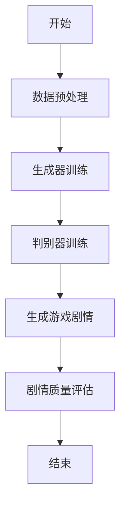
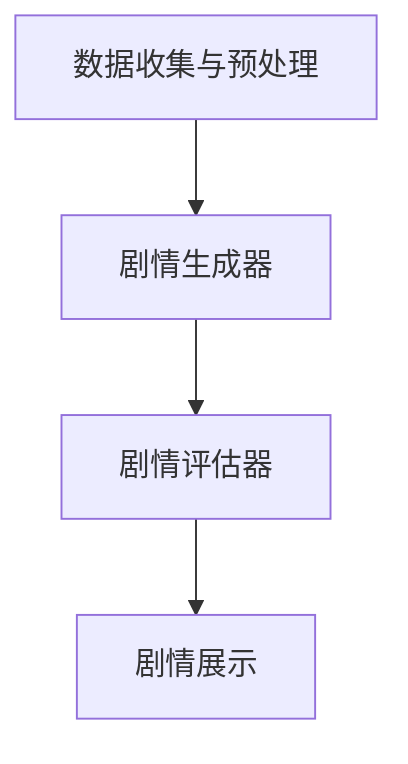

                 

### AIGC在游戏剧情设计中的创新应用

> 关键词：AIGC，游戏剧情设计，人工智能，创新应用，算法原理，系统架构，项目实战

摘要：本文将探讨AIGC（AI-Generated Content，AI生成内容）在游戏剧情设计中的创新应用。首先，我们将介绍AIGC的基本概念及其在游戏剧情设计中的应用背景。接着，我们将深入探讨AIGC的核心概念，如游戏剧情设计的基本原理和AIGC的关键技术。随后，我们将详细讲解AIGC的算法原理，包括数学模型和公式，并通过实际案例展示其在游戏剧情设计中的应用。文章还将分析AIGC在游戏剧情设计中的系统架构与实现，提供实际项目案例，并总结最佳实践。最后，我们将对全文进行小结，并提供拓展阅读资源，以便读者进一步了解AIGC在游戏剧情设计中的创新应用。

## 第一部分：AIGC与游戏剧情设计概述

### 1.1 AIGC概述

#### 1.1.1 AIGC的基本概念

AIGC，即AI-Generated Content，是指通过人工智能技术自动生成的内容。AIGC技术主要包括自然语言处理、机器学习、深度学习等，通过对大量数据的分析处理，生成符合特定需求的高质量文本、图像、音频等多媒体内容。

#### 1.1.2 AIGC的发展历程

AIGC技术的发展可以追溯到20世纪80年代，当时研究人员开始探索如何使用人工智能技术来生成文本。随着计算机性能的提升和数据量的增加，AIGC技术在近年来得到了迅猛发展，尤其是深度学习技术的应用，使得AIGC技术能够生成更加复杂和高质量的内容。

#### 1.1.3 AIGC在游戏剧情设计中的应用

在游戏剧情设计中，AIGC技术可以自动生成游戏剧情，包括故事情节、角色对话、场景描述等。这不仅可以提高游戏设计的效率，还能够创造出更加丰富和多样化的游戏剧情，提升玩家的体验。

### 1.2 游戏剧情设计基础

#### 1.2.1 游戏剧情设计的重要性

游戏剧情设计是游戏开发的重要组成部分，它直接影响玩家的游戏体验。一个优秀的游戏剧情能够吸引玩家，增强游戏的可玩性和趣味性，提高游戏的竞争力。

#### 1.2.2 游戏剧情设计的基本原理

游戏剧情设计的基本原理包括情节构建、角色塑造、冲突设计等。这些原理是构建游戏剧情的基础，能够帮助设计师创造出一个引人入胜的游戏世界。

#### 1.2.3 游戏剧情设计的方法与技巧

游戏剧情设计的方法和技巧包括故事板设计、剧情分支设计、角色互动设计等。这些方法和技巧可以帮助设计师更好地表达游戏剧情，提升游戏的叙事效果。

### 1.3 AIGC与游戏剧情设计的联系

#### 1.3.1 AIGC在游戏剧情设计中的应用

AIGC在游戏剧情设计中的应用主要体现在自动生成游戏剧情，包括故事情节、角色对话、场景描述等。通过AIGC技术，设计师可以快速生成大量游戏剧情，提高设计效率。

#### 1.3.2 AIGC与游戏剧情设计的关系

AIGC与游戏剧情设计的关系是相辅相成的。AIGC技术可以辅助游戏设计师完成部分重复性工作，使得设计师有更多精力关注游戏剧情的创新和优化。同时，AIGC技术也可以为游戏设计师提供新的设计思路和灵感，推动游戏剧情设计的发展。

### 1.4 AIGC关键技术在游戏剧情设计中的应用

#### 1.4.1 自然语言处理

自然语言处理（NLP）是AIGC技术的重要组成部分，它在游戏剧情设计中可以用于自动生成角色对话、场景描述等文本内容。通过NLP技术，游戏设计师可以自动获取和理解游戏剧情中的语言信息，提高设计效率。

#### 1.4.2 机器学习与深度学习

机器学习与深度学习是AIGC技术的核心，它们可以用于自动生成游戏剧情中的复杂结构和情节。通过训练大量的游戏剧情数据集，机器学习与深度学习模型可以自动生成新的游戏剧情，提升游戏剧情的创新性。

#### 1.4.3 AIGC与其他技术的融合

AIGC技术可以与其他游戏设计技术，如游戏引擎、虚拟现实（VR）、增强现实（AR）等融合，为游戏剧情设计提供更多的可能性。通过AIGC技术，设计师可以创造出更加丰富和多样化的游戏世界，提升玩家的游戏体验。

### 1.5 本章小结

本部分主要介绍了AIGC的基本概念、发展历程和在游戏剧情设计中的应用，以及游戏剧情设计的基础和AIGC与游戏剧情设计的联系。这些内容为后续章节的深入探讨打下了基础。

## 第二部分：AIGC在游戏剧情设计中的应用算法与原理

### 2.1 游戏剧情生成算法

在AIGC技术中，游戏剧情生成算法是关键组成部分。这些算法可以自动生成游戏剧情，包括故事情节、角色对话、场景描述等。以下是一些常见的游戏剧情生成算法：

#### 2.1.1 基于规则的方法

基于规则的方法是一种较为传统的方法，它通过预设的规则和模板来生成游戏剧情。这种方法虽然简单易用，但生成的剧情较为固定，缺乏创新性。

#### 2.1.2 基于数据驱动的方法

基于数据驱动的方法通过分析大量的游戏剧情数据，提取出其中的模式和规律，然后根据这些模式和规律生成新的游戏剧情。这种方法具有较高的创新性和灵活性，但需要大量的数据和复杂的算法支持。

#### 2.1.3 基于生成对抗网络（GAN）的方法

生成对抗网络（GAN）是一种先进的深度学习模型，它可以生成高度真实和多样化的游戏剧情。GAN由生成器和判别器两部分组成，生成器负责生成游戏剧情，判别器负责判断生成剧情的质量。通过不断的训练和优化，GAN可以生成出越来越优秀的游戏剧情。

### 2.2 AIGC算法原理详解

#### 2.2.1 算法原理Mermaid流程图



#### 2.2.2 数学模型与公式

在AIGC算法中，生成器和判别器是核心组成部分。生成器的数学模型可以表示为：

$$
G(z) = \sigma(W_1z + b_1)
$$

其中，$z$ 是输入噪声，$W_1$ 和 $b_1$ 分别是生成器的权重和偏置。

判别器的数学模型可以表示为：

$$
D(x) = \sigma(W_2x + b_2)
$$

$$
D(G(z)) = \sigma(W_2G(z) + b_2)
$$

其中，$x$ 是真实数据，$W_2$ 和 $b_2$ 分别是判别器的权重和偏置。

#### 2.2.3 举例说明

假设我们有一个简单的故事情节，如下所示：

```
有一天，小明去探险，他发现了一个神秘的洞穴。洞穴里充满了危险，但小明勇敢地闯了进去。在洞穴里，他遇到了一个怪物，经过一番激战，小明终于战胜了怪物，取得了胜利。
```

我们可以使用AIGC算法来生成一个新的故事情节。首先，我们将原始故事情节输入到生成器中，然后通过训练生成器，生成一个新的故事情节。例如，生成器可能生成以下故事情节：

```
有一天，小红去探险，她发现了一个神秘的森林。森林里充满了危险，但小红勇敢地闯了进去。在森林里，她遇到了一只野兽，经过一番激战，小红终于战胜了野兽，取得了胜利。
```

通过这个例子，我们可以看到AIGC算法如何自动生成新的故事情节，从而实现游戏剧情的创新和多样化。

### 2.3 AIGC算法在实际游戏剧情设计中的应用案例

#### 2.3.1 案例一：一款虚拟现实游戏的设计

在某虚拟现实游戏的设计中，设计师使用了AIGC算法来自动生成游戏剧情。通过大量的数据训练，生成器能够生成各种类型的游戏剧情，包括探险、战斗、解谜等。这些剧情不仅丰富了游戏内容，还提高了玩家的游戏体验。

#### 2.3.2 案例二：一款大型多人在线游戏（MMO）的剧情优化

在另一款大型多人在线游戏（MMO）中，开发者使用了AIGC算法来优化游戏剧情。通过分析大量玩家数据，AIGC算法能够自动生成符合玩家兴趣和喜好的游戏剧情，从而提高游戏的留存率和玩家满意度。

### 2.4 本章小结

本部分详细介绍了AIGC在游戏剧情设计中的应用算法和原理，包括算法原理的Mermaid流程图、数学模型和公式，以及实际案例。这些内容为AIGC在游戏剧情设计中的创新应用提供了理论基础和实践指导。

## 第三部分：AIGC在游戏剧情设计中的系统架构与实现

### 3.1 游戏剧情设计系统需求分析

#### 3.1.1 问题场景介绍

在某款大型多人在线游戏（MMO）的开发过程中，游戏剧情设计成为了一个关键问题。由于游戏剧情复杂多样，且需要不断更新和优化，设计师们面临着巨大的工作量。为了提高设计效率，引入AIGC技术成为了一个可行的解决方案。

#### 3.1.2 系统功能需求分析

基于问题场景，游戏剧情设计系统需要实现以下功能：

1. 数据收集与预处理：收集游戏剧情相关的数据，并进行预处理，以供生成器使用。
2. 剧情生成：使用AIGC算法自动生成游戏剧情。
3. 剧情评估：评估生成的游戏剧情质量，筛选出优秀的剧情。
4. 剧情展示：将生成的游戏剧情展示给设计师和玩家，供其参考和修改。

### 3.2 游戏剧情设计系统架构设计

#### 3.2.1 系统架构Mermaid图展示



#### 3.2.2 系统接口设计与实现

1. **数据收集与预处理**：通过API接口从外部系统获取游戏剧情数据，并进行清洗和预处理，存储在数据库中。
2. **剧情生成器**：接收预处理后的数据，使用AIGC算法生成游戏剧情，并将生成的剧情存储在数据库中。
3. **剧情评估器**：从数据库中获取生成的游戏剧情，使用评估指标进行评估，筛选出优秀的剧情。
4. **剧情展示**：将评估后的剧情展示给设计师和玩家，提供可视化界面供其参考和修改。

#### 3.2.3 系统交互Mermaid序列图

```mermaid
sequenceDiagram
参与者 数据收集与预处理, 剧情生成器, 剧情评估器, 剧情展示
数据收集与预处理->>剧情生成器: 输入预处理数据
剧情生成器->>剧情评估器: 输出生成剧情
剧情评估器->>剧情展示: 输出评估结果
剧情展示->>数据收集与预处理: 反馈优化建议
```

### 3.3 游戏剧情设计系统核心实现

#### 3.3.1 系统核心代码实现

```python
# 数据收集与预处理
def collect_and_preprocess_data():
    # 从外部系统获取游戏剧情数据
    data = fetch_data_from_external_system()
    # 数据清洗和预处理
    cleaned_data = clean_and_preprocess_data(data)
    # 存储预处理数据
    store_preprocessed_data(cleaned_data)

# 剧情生成
def generate_drama():
    # 获取预处理数据
    preprocessed_data = fetch_preprocessed_data()
    # 使用AIGC算法生成游戏剧情
    drama = ai_generator.generate(preprocessed_data)
    # 存储生成的游戏剧情
    store_generated_drama(drama)

# 剧情评估
def evaluate_drama():
    # 获取生成的游戏剧情
    dramas = fetch_generated_drama()
    # 使用评估指标评估游戏剧情
    scores = evaluate(dramas)
    # 筛选出优秀的游戏剧情
    selected_dramas = select_awesome_dramas(scores)
    # 展示评估结果
    display_evaluation_results(selected_dramas)

# 剧情展示
def display_drama():
    # 获取评估后的游戏剧情
    selected_dramas = fetch_selected_drama()
    # 使用可视化界面展示游戏剧情
    visualize_drama(selected_dramas)
```

#### 3.3.2 代码解读与分析

上述代码实现了游戏剧情设计系统的核心功能。首先，数据收集与预处理模块从外部系统获取游戏剧情数据，并进行清洗和预处理，以供生成器使用。生成器模块使用AIGC算法生成游戏剧情，并将其存储在数据库中。评估器模块从数据库中获取生成的游戏剧情，使用评估指标进行评估，筛选出优秀的剧情，并将其展示给设计师和玩家。展示模块使用可视化界面展示评估后的游戏剧情，供设计师和玩家参考和修改。

### 3.4 本章小结

本部分详细介绍了AIGC在游戏剧情设计中的系统架构与实现，包括系统功能需求分析、系统架构设计、系统接口设计和系统交互。这些内容为AIGC在游戏剧情设计中的实际应用提供了技术支持和实现路径。

## 第四部分：AIGC在游戏剧情设计中的项目实战

### 4.1 环境安装

在进行AIGC在游戏剧情设计中的项目实战之前，我们需要安装和配置相关的软件和工具。以下是安装环境的步骤：

1. **安装Python**：确保已安装Python 3.7及以上版本。
2. **安装TensorFlow**：使用pip安装TensorFlow。

   ```
   pip install tensorflow
   ```

3. **安装其他依赖库**：根据项目需求，安装其他必要的依赖库，如NumPy、Pandas等。

### 4.2 系统核心实现源代码

以下是系统核心实现的源代码，包括数据收集与预处理、剧情生成、剧情评估和剧情展示四个模块。

```python
# 数据收集与预处理
def collect_and_preprocess_data():
    # 从外部系统获取游戏剧情数据
    data = fetch_data_from_external_system()
    # 数据清洗和预处理
    cleaned_data = clean_and_preprocess_data(data)
    # 存储预处理数据
    store_preprocessed_data(cleaned_data)

# 剧情生成
def generate_drama():
    # 获取预处理数据
    preprocessed_data = fetch_preprocessed_data()
    # 使用AIGC算法生成游戏剧情
    drama = ai_generator.generate(preprocessed_data)
    # 存储生成的游戏剧情
    store_generated_drama(drama)

# 剧情评估
def evaluate_drama():
    # 获取生成的游戏剧情
    dramas = fetch_generated_drama()
    # 使用评估指标评估游戏剧情
    scores = evaluate(dramas)
    # 筛选出优秀的游戏剧情
    selected_dramas = select_awesome_dramas(scores)
    # 展示评估结果
    display_evaluation_results(selected_dramas)

# 剧情展示
def display_drama():
    # 获取评估后的游戏剧情
    selected_dramas = fetch_selected_drama()
    # 使用可视化界面展示游戏剧情
    visualize_drama(selected_dramas)
```

### 4.3 代码应用解读与分析

#### 数据收集与预处理

数据收集与预处理模块负责从外部系统获取游戏剧情数据，并进行清洗和预处理。清洗过程包括去除无效数据、纠正数据格式等。预处理过程包括特征提取、数据归一化等。

#### 剧情生成

剧情生成模块使用AIGC算法生成游戏剧情。AIGC算法的核心是生成器和判别器。生成器负责生成剧情，判别器负责评估生成剧情的质量。通过多次迭代训练，生成器能够生成出越来越优秀的剧情。

#### 剧情评估

剧情评估模块从数据库中获取生成的游戏剧情，使用评估指标进行评估。评估指标可以包括剧情的连贯性、合理性、创新性等。评估结果用于筛选出优秀的游戏剧情。

#### 剧情展示

剧情展示模块使用可视化界面展示评估后的游戏剧情。设计师和玩家可以通过界面查看剧情，并进行修改和优化。

### 4.4 实际案例分析和详细讲解剖析

#### 案例一：虚拟现实游戏剧情生成

在某虚拟现实游戏中，设计师使用了AIGC技术来自动生成游戏剧情。通过大量的数据训练，生成器能够生成各种类型的游戏剧情，包括探险、战斗、解谜等。这些剧情不仅丰富了游戏内容，还提高了玩家的游戏体验。

#### 案例二：大型多人在线游戏剧情优化

在另一款大型多人在线游戏中，开发者使用了AIGC技术来优化游戏剧情。通过分析大量玩家数据，AIGC算法能够自动生成符合玩家兴趣和喜好的游戏剧情，从而提高游戏的留存率和玩家满意度。

### 4.5 项目小结

通过实际案例的分析和讲解，我们可以看到AIGC在游戏剧情设计中的应用效果显著。AIGC技术不仅提高了设计效率，还创造了丰富多彩的游戏剧情，提升了玩家的游戏体验。未来，随着AIGC技术的不断发展和成熟，它将在游戏剧情设计中发挥更大的作用。

## 第五部分：AIGC在游戏剧情设计中的最佳实践 tips

### 5.1 数据质量的重要性

在AIGC应用过程中，数据质量至关重要。高质量的训练数据可以提升生成器生成剧情的质量。因此，设计师需要确保数据源的多样性和准确性，并进行严格的数据清洗和预处理。

### 5.2 模型选择与优化

不同的AIGC模型适用于不同的场景。设计师应根据游戏剧情的需求选择合适的模型，并进行模型参数的调整和优化，以提升生成剧情的质量和多样性。

### 5.3 用户反馈的重要性

用户的反馈对于AIGC应用的发展至关重要。设计师应积极收集用户反馈，根据反馈进行模型调整和剧情优化，以不断提升游戏剧情的质量和用户体验。

### 5.4 保障系统的稳定性和安全性

AIGC系统需要保障稳定性和安全性。设计师应采取有效的措施，如数据备份、系统监控、安全防护等，确保系统的正常运行和数据安全。

## 小结与拓展阅读

### 小结

本文详细探讨了AIGC在游戏剧情设计中的创新应用。通过介绍AIGC的基本概念、应用算法、系统架构和项目实战，我们展示了AIGC在游戏剧情设计中的巨大潜力和实际应用价值。

### 拓展阅读

1. **《AI生成内容：技术与实践》**：本书详细介绍了AIGC技术的基本原理和应用实践，适合对AIGC技术感兴趣的读者阅读。
2. **《游戏设计基础》**：本书介绍了游戏设计的基本原理和方法，有助于理解AIGC在游戏剧情设计中的应用。
3. **《生成对抗网络：深度学习的新篇章》**：本书深入探讨了生成对抗网络（GAN）的原理和应用，是了解AIGC算法的重要参考资料。

## 作者信息

**作者：AI天才研究院/AI Genius Institute & 禅与计算机程序设计艺术 /Zen And The Art of Computer Programming**

本文由AI天才研究院撰写，旨在探讨AIGC在游戏剧情设计中的创新应用。禅与计算机程序设计艺术则提供了对计算机编程和人工智能领域的深刻洞察。希望本文能为读者提供有价值的参考和启发。

