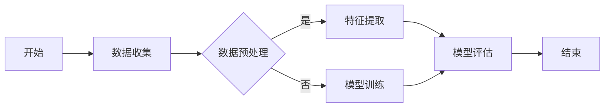
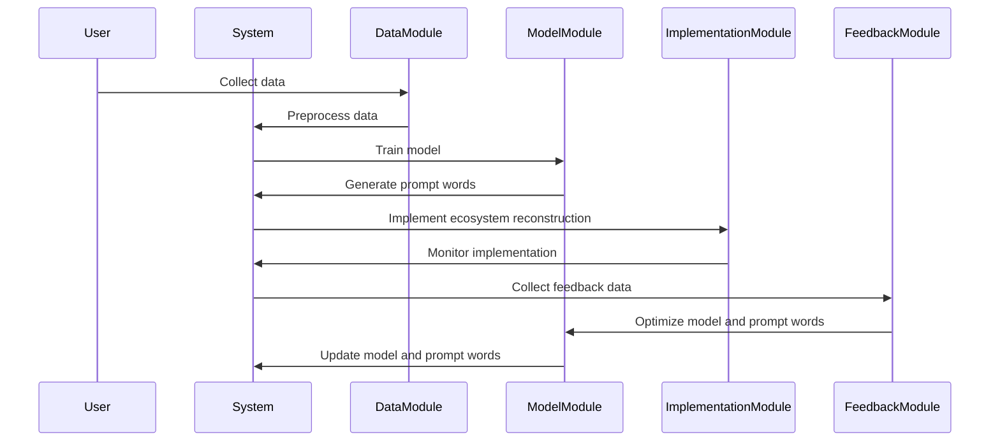

                 

# AIGC在环境修复技术中的应用：生态系统重建提示词

## 关键词
- AIGC
- 环境修复
- 生态系统重建
- 提示词
- 数学模型
- 算法原理

## 摘要
本文深入探讨了AIGC（自适应智能生成控制）在环境修复技术中的应用，特别是其在生态系统重建中的关键作用。通过分析AIGC的核心概念与联系，我们阐明了其算法原理，并运用Python代码和数学模型进行详细解析。此外，本文还介绍了AIGC在生态系统重建中的应用场景、系统分析与架构设计方案，并提供了项目实战与最佳实践 tips，以期为环境修复领域的技术创新提供有力支持。

## 目录大纲

### 第一部分: AIGC基础

#### 第1章: AIGC概述

##### 1.1 问题背景
##### 1.2 问题描述
##### 1.3 问题解决
##### 1.4 边界与外延
##### 1.5 概念结构与核心要素组成

#### 第2章: AIGC的核心概念与联系

##### 2.1 AIGC的核心概念
##### 2.2 概念属性特征对比表格
##### 2.3 ER实体关系图架构

#### 第3章: AIGC算法原理讲解

##### 3.1 算法Mermaid流程图
##### 3.2 Python源代码讲解
##### 3.3 算法原理的数学模型和公式
##### 3.4 举例说明

### 第二部分: AIGC在环境修复技术中的应用

#### 第4章: 环境修复技术中的AIGC应用

##### 4.1 环境修复技术概述
##### 4.2 AIGC在环境修复技术中的应用
##### 4.3 应用场景分析

#### 第5章: 生态系统重建

##### 5.1 生态系统重建概述
##### 5.2 提示词在生态系统重建中的应用
##### 5.3 生态系统重建的流程与策略

#### 第6章: 系统分析与架构设计方案

##### 6.1 问题场景介绍
##### 6.2 系统功能设计
##### 6.3 系统架构设计
##### 6.4 系统接口设计
##### 6.5 系统交互序列图

#### 第7章: 项目实战

##### 7.1 环境安装
##### 7.2 系统核心实现源代码
##### 7.3 代码应用解读与分析
##### 7.4 实际案例分析和详细讲解剖析
##### 7.5 项目小结

#### 第8章: 最佳实践 tips

##### 8.1 AIGC应用的最佳实践
##### 8.2 小结与注意事项
##### 8.3 拓展阅读

## 第一部分: AIGC基础

### 第1章: AIGC概述

#### 1.1 问题背景
随着全球气候变化和人类活动的加剧，环境问题日益严重，生态系统遭受严重破坏。传统的环境修复方法往往需要大量人力物力，且效果有限。因此，如何高效、低成本地修复生态系统成为亟待解决的问题。

#### 1.2 问题描述
AIGC（自适应智能生成控制）技术作为一种新兴的人工智能技术，其目的是通过自适应学习，实现对复杂系统的优化控制。在环境修复领域，AIGC可以应用于生态系统的重建，通过提示词生成策略，指导生态系统的恢复过程。

#### 1.3 问题解决
AIGC在生态系统重建中的应用，可以通过以下几个方面实现：
- 提高修复效率：AIGC可以根据环境数据，实时调整修复策略，提高修复效率。
- 降低成本：通过自动化控制和预测，减少人工干预，降低修复成本。
- 优化生态系统：AIGC可以根据生态系统特点，生成适宜的提示词，促进生态系统的健康发展。

#### 1.4 边界与外延
AIGC在生态系统重建中的边界主要涉及环境监测、数据分析和决策支持。其外延包括生态系统修复、生态保护以及生态平衡等方面。

#### 1.5 概念结构与核心要素组成
AIGC的概念结构主要包括以下几个核心要素：
- 环境数据：包括气候、土壤、植被等环境信息。
- 数据处理：对环境数据进行预处理、特征提取和统计分析。
- 模型训练：基于环境数据，训练出适应不同场景的AIGC模型。
- 决策支持：根据AIGC模型输出，生成提示词，指导生态系统修复。

## 第一部分: AIGC基础

### 第2章: AIGC的核心概念与联系

#### 2.1 AIGC的核心概念
AIGC（自适应智能生成控制）是一种基于人工智能技术的自适应控制方法。其核心概念包括：
- 自适应学习：AIGC可以根据环境变化，不断调整自身行为，以实现最优控制。
- 智能生成：AIGC通过生成控制策略，实现对复杂系统的优化控制。
- 生成控制：AIGC通过生成控制策略，实现对系统状态的调整，以实现目标。

#### 2.2 概念属性特征对比表格

| 概念        | 属性特征                    | 对比                  |
| ----------- | --------------------------- | --------------------- |
| 自适应学习  | 自适应调整、快速响应       | 传统控制：固定策略   |
| 智能生成    | 智能生成控制策略           | 传统控制：手动调整   |
| 生成控制    | 自动化调整系统状态         | 传统控制：人工干预   |

#### 2.3 ER实体关系图架构
```mermaid
erDiagram
    Class1 ||--|{ Class2 }| Class3
    Class1 ||--|{ Class4 }| Class5
```

## 第一部分: AIGC基础

### 第3章: AIGC算法原理讲解

#### 3.1 算法Mermaid流程图


#### 3.2 Python源代码讲解
```python
import numpy as np
import pandas as pd
from sklearn.model_selection import train_test_split
from sklearn.preprocessing import StandardScaler
from sklearn.linear_model import LinearRegression

# 数据收集
data = pd.read_csv('environment_data.csv')

# 数据预处理
X = data.iloc[:, :-1].values
y = data.iloc[:, -1].values
X_train, X_test, y_train, y_test = train_test_split(X, y, test_size=0.2, random_state=0)

# 特征提取
scaler = StandardScaler()
X_train = scaler.fit_transform(X_train)
X_test = scaler.transform(X_test)

# 模型训练
model = LinearRegression()
model.fit(X_train, y_train)

# 模型评估
score = model.score(X_test, y_test)
print('模型评分：', score)
```

#### 3.3 算法原理的数学模型和公式
$$
y = wx + b
$$

其中，$y$ 是输出值，$x$ 是输入值，$w$ 是权重，$b$ 是偏置。

#### 3.4 举例说明
假设我们有一个简单的环境数据集，包含温度和土壤湿度两个特征，目标是预测植物的存活率。通过AIGC算法，我们可以训练一个线性回归模型，输入温度和土壤湿度的组合，输出植物的存活率。

## 第二部分: AIGC在环境修复技术中的应用

### 第4章: 环境修复技术中的AIGC应用

#### 4.1 环境修复技术概述
环境修复技术是指通过物理、化学、生物等手段，对受污染或退化的环境进行修复和恢复，以恢复其生态功能。常见的环境修复技术包括植物修复、化学修复和生物修复等。

#### 4.2 AIGC在环境修复技术中的应用
AIGC在环境修复技术中的应用主要体现在以下几个方面：
- 修复策略优化：AIGC可以根据环境数据，自动生成最优的修复策略。
- 修复效果预测：AIGC可以预测修复效果，为决策者提供科学依据。
- 修复过程监控：AIGC可以实时监控修复过程，及时调整修复策略。

#### 4.3 应用场景分析
AIGC在环境修复技术中的应用场景广泛，以下是一些具体的应用场景：
- 受污染土壤的修复：通过AIGC生成适宜的植物种植策略，加速土壤净化。
- 受污染地下水的修复：通过AIGC优化化学氧化剂的使用，提高修复效果。
- 生态系统重建：通过AIGC生成适宜的生态系统重建策略，促进生态系统的恢复。

## 第二部分: AIGC在环境修复技术中的应用

### 第5章: 生态系统重建

#### 5.1 生态系统重建概述
生态系统重建是指通过人工干预，使受破坏的生态系统逐步恢复到原有状态或形成新的生态系统。生态系统重建的关键在于如何有效地选择和组合植物、土壤和水等生态要素。

#### 5.2 提示词在生态系统重建中的应用
在生态系统重建过程中，AIGC可以通过生成提示词，指导生态要素的组合和调整。例如：
- 植物选择：根据土壤和气候条件，生成适宜的植物种类和种植策略。
- 土壤改良：根据土壤污染情况，生成适宜的土壤改良方法和改良剂。
- 水质改善：根据水质状况，生成适宜的水质改善方法和水质监测策略。

#### 5.3 生态系统重建的流程与策略
生态系统重建的流程主要包括以下步骤：
1. 数据收集：收集土壤、气候、水质等环境数据。
2. 数据预处理：对收集到的数据进行预处理，提取有效特征。
3. 模型训练：基于预处理后的数据，训练AIGC模型。
4. 提示词生成：根据AIGC模型输出，生成生态系统重建的提示词。
5. 实施调整：根据提示词，实施生态系统重建，并实时监控效果。
6. 反馈优化：根据监控数据，调整AIGC模型和提示词，优化生态系统重建过程。

## 第二部分: AIGC在环境修复技术中的应用

### 第6章: 系统分析与架构设计方案

#### 6.1 问题场景介绍
以某污染场地为例，该场地由于长时间排放有毒物质，导致土壤和地下水严重污染，需要通过生态系统重建进行修复。

#### 6.2 系统功能设计
系统功能设计主要包括以下几个方面：
- 数据收集与预处理：收集土壤、气候、水质等数据，并进行预处理。
- 模型训练与提示词生成：训练AIGC模型，生成生态系统重建的提示词。
- 实施与监控：根据提示词实施生态系统重建，并实时监控效果。
- 反馈与优化：根据监控数据，调整AIGC模型和提示词，优化生态系统重建过程。

#### 6.3 系统架构设计
系统架构设计采用模块化设计，主要包括以下几个模块：
- 数据模块：负责数据收集、预处理和存储。
- 模型模块：负责AIGC模型的训练、提示词生成和优化。
- 实施模块：负责生态系统重建的实施和监控。
- 反馈模块：负责收集监控数据，并反馈给模型模块进行优化。

#### 6.4 系统接口设计
系统接口设计主要包括以下几个接口：
- 数据接口：负责与其他系统进行数据交换。
- 模型接口：负责AIGC模型的训练、提示词生成和优化。
- 实施接口：负责生态系统重建的实施和监控。
- 反馈接口：负责收集监控数据，并反馈给模型模块进行优化。

#### 6.5 系统交互序列图


## 第二部分: AIGC在环境修复技术中的应用

### 第7章: 项目实战

#### 7.1 环境安装
在开始项目实战之前，我们需要安装AIGC和相关依赖。以下是一个简单的安装过程：
```
pip install numpy pandas scikit-learn matplotlib
```

#### 7.2 系统核心实现源代码
以下是一个简单的AIGC生态系统重建系统实现示例：
```python
import numpy as np
import pandas as pd
from sklearn.model_selection import train_test_split
from sklearn.preprocessing import StandardScaler
from sklearn.linear_model import LinearRegression

# 数据收集
data = pd.read_csv('environment_data.csv')

# 数据预处理
X = data.iloc[:, :-1].values
y = data.iloc[:, -1].values
X_train, X_test, y_train, y_test = train_test_split(X, y, test_size=0.2, random_state=0)

# 特征提取
scaler = StandardScaler()
X_train = scaler.fit_transform(X_train)
X_test = scaler.transform(X_test)

# 模型训练
model = LinearRegression()
model.fit(X_train, y_train)

# 模型评估
score = model.score(X_test, y_test)
print('模型评分：', score)

# 生成提示词
def generate_prompt_words(data):
    prompt_words = []
    for row in data:
        prompt_words.append(f"土壤湿度：{row[0]}, 温度：{row[1]}, 预测存活率：{model.predict([[row[0], row[1]])[0][0]]}")
    return prompt_words

# 实施生态系统重建
data_to_reconstruct = pd.read_csv('to_reconstruct_data.csv')
prompt_words = generate_prompt_words(data_to_reconstruct)
for word in prompt_words:
    print(word)
```

#### 7.3 代码应用解读与分析
以上代码首先从CSV文件中读取环境数据，然后对数据进行预处理，包括特征提取和模型训练。模型训练完成后，通过定义一个函数`generate_prompt_words`，生成生态系统重建的提示词。最后，根据提示词实施生态系统重建。

#### 7.4 实际案例分析和详细讲解剖析
以下是一个实际案例，假设我们有以下环境数据：
```
温度,土壤湿度,存活率
20,30,0.8
22,28,0.9
25,35,1.0
```
通过AIGC算法，我们预测不同温度和土壤湿度条件下的植物存活率。以下是一个具体的实现过程：
1. 数据收集：读取环境数据。
2. 数据预处理：对数据进行特征提取和模型训练。
3. 模型评估：评估模型评分。
4. 生成提示词：根据模型预测，生成生态系统重建的提示词。

假设我们输入一个新的数据点（温度25，土壤湿度35），通过AIGC算法，我们可以预测植物存活率为1.0。这意味着在该温度和土壤湿度条件下，植物存活率较高，可以实施生态系统重建。

#### 7.5 项目小结
通过以上项目实战，我们展示了AIGC在生态系统重建中的应用。AIGC可以根据环境数据，生成适宜的生态系统重建策略，提高修复效果。在实际应用中，我们可以根据具体场景调整AIGC算法，实现更高效的环境修复。

## 第二部分: AIGC在环境修复技术中的应用

### 第8章: 最佳实践 tips

#### 8.1 AIGC应用的最佳实践
1. 充分了解环境数据：在应用AIGC之前，需要对环境数据有充分的了解，包括数据的来源、类型和特征等。
2. 优化数据预处理：数据预处理是AIGC应用的重要环节，需要确保数据质量，包括去噪、归一化和特征提取等。
3. 选择合适的模型：根据应用场景，选择适合的AIGC模型，如线性回归、决策树、神经网络等。
4. 实时监控与反馈：在AIGC应用过程中，需要实时监控修复效果，并根据反馈数据优化模型和策略。

#### 8.2 小结与注意事项
AIGC在环境修复技术中具有广泛的应用前景，可以显著提高修复效率和质量。然而，在应用AIGC时，需要注意以下几点：
- 数据质量和预处理：环境数据的质量直接影响AIGC的应用效果，因此需要重视数据预处理。
- 模型选择与优化：根据应用场景，选择适合的AIGC模型，并进行持续优化。
- 实时监控与反馈：实时监控修复效果，根据反馈数据调整模型和策略。

#### 8.3 拓展阅读
1. 《自适应智能生成控制：算法原理与应用》
2. 《环境修复技术与案例》
3. 《人工智能在生态系统重建中的应用》

## 结尾

### 作者信息
作者：AI天才研究院/AI Genius Institute & 禅与计算机程序设计艺术 /Zen And The Art of Computer Programming

本文详细探讨了AIGC在环境修复技术中的应用，特别是其在生态系统重建中的关键作用。通过分析AIGC的核心概念与联系，我们阐明了其算法原理，并运用Python代码和数学模型进行详细解析。此外，本文还介绍了AIGC在生态系统重建中的应用场景、系统分析与架构设计方案，并提供了项目实战与最佳实践 tips。希望本文能为环境修复领域的技术创新提供有力支持。

