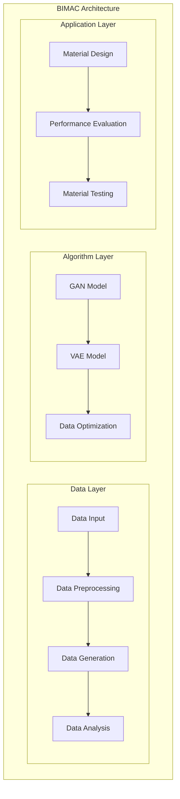
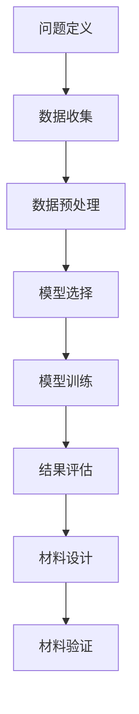
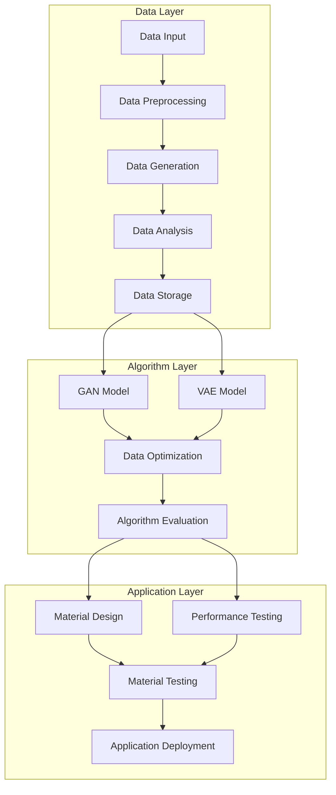
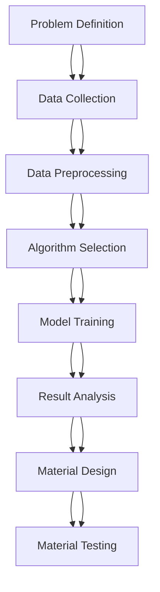
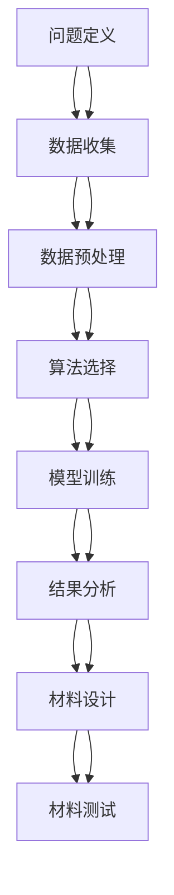

                 

### 摘要

人工智能生成内容（AIGC）在生物仿生学中的应用正逐渐引起广泛关注。AIGC利用机器学习技术生成高质量的数据，从而为创新材料设计提供新的思路和方法。本文将深入探讨AIGC在生物仿生学中的创新应用，首先介绍AIGC的基本概念、技术原理和生物仿生学的基本原理，然后详细分析AIGC与生物仿生学的核心概念联系，并通过具体算法和数学模型的讲解，展示AIGC在创新材料设计中的潜在优势。文章还将介绍AIGC在创新材料设计中的系统分析与架构设计方案，并通过实际项目案例，剖析AIGC在实际应用中的技术细节和挑战，最后给出最佳实践建议和小结，为从事生物仿生学研究和材料设计的技术人员提供实用的指导。### 目录大纲设计思路

在设计《AIGC在生物仿生学中的应用：创新材料设计提示词》的目录大纲时，我们首先需要明确书籍的核心主题和目标读者。本书的核心主题是探讨AIGC（人工智能生成内容）在生物仿生学中的应用，特别是在创新材料设计中的潜力。目标读者主要是从事生物仿生学研究和材料科学的专业人士，以及对于交叉学科感兴趣的技术人员。

#### 第一步：明确书籍结构和章节内容

1. **背景介绍**：首先介绍AIGC的概念、生物仿生学的基本原理以及创新材料设计的背景，为后续章节提供理论基础。
2. **核心概念与联系**：详细解释AIGC和生物仿生学的核心概念，并通过对比表格和ER实体关系图，帮助读者理解两者之间的联系。
3. **算法原理讲解**：介绍AIGC的相关算法，如生成对抗网络（GAN）、变分自编码器（VAE）等，并使用Mermaid流程图和Python代码进行详细讲解。
4. **数学模型和数学公式**：使用LaTeX格式给出AIGC算法中的数学模型和公式，并进行通俗易懂的讲解和举例说明。
5. **系统分析与架构设计方案**：介绍如何将AIGC应用于创新材料设计，包括系统功能设计、架构设计、接口设计和系统交互。
6. **项目实战**：通过实际案例展示AIGC在创新材料设计中的应用，提供环境安装、系统核心实现源代码及代码解读。
7. **最佳实践 tips**、**小结**、**注意事项**、**拓展阅读**等内容，为读者提供进一步学习和应用AIGC的指导。

#### 第二步：细化目录结构

根据上述内容，我们将书籍结构细化到1、2、3级目录：

1. **第一部分：背景与基础理论**
   - 第1章：AIGC与生物仿生学基础
   - 第2章：核心概念与联系
   - 第3章：算法原理讲解

2. **第二部分：系统分析与设计**
   - 第4章：系统功能设计与架构设计
   - 第5章：系统接口设计与交互
   - 第6章：系统实现与实战应用

3. **第三部分：实践与拓展**
   - 第7章：案例分析与最佳实践
   - 第8章：注意事项与拓展阅读
   - 第9章：小结与展望

#### 第三步：编写具体章节内容

在确定目录结构后，我们将为每个章节编写具体的详细内容，确保每个章节都包含必要的信息和知识点，使读者能够系统性地了解AIGC在生物仿生学中的应用。

### 目录大纲

```markdown
----------------------------------------------------------------
# 第一部分: 背景与基础理论

## 第1章: AIGC与生物仿生学基础
### 1.1 AIGC概述
#### 1.1.1 AIGC的定义
#### 1.1.2 AIGC的技术基础
#### 1.1.3 AIGC的应用领域

### 1.2 生物仿生学基础
#### 1.2.1 生物仿生学的定义
#### 1.2.2 生物仿生学的发展历程
#### 1.2.3 生物仿生学的应用现状

### 1.3 创新材料设计背景
#### 1.3.1 创新材料的需求
#### 1.3.2 创新材料的设计方法
#### 1.3.3 创新材料的设计挑战

## 第2章: 核心概念与联系
### 2.1 AIGC的核心概念
#### 2.1.1 GAN原理
#### 2.1.2 VAE原理
#### 2.1.3 AIGC与其他技术的比较

### 2.2 生物仿生学的核心概念
#### 2.2.1 仿生学原理
#### 2.2.2 生物材料特性
#### 2.2.3 生物启发设计

### 2.3 AIGC与生物仿生学的联系
#### 2.3.1 跨学科融合
#### 2.3.2 应用场景对比
#### 2.3.3 联系与挑战

## 第3章: 算法原理讲解
### 3.1 GAN算法原理
#### 3.1.1 GAN的基本架构
#### 3.1.2 GAN的训练过程
#### 3.1.3 GAN的应用示例

### 3.2 VAE算法原理
#### 3.2.1 VAE的基本架构
#### 3.2.2 VAE的训练过程
#### 3.2.3 VAE的应用示例

### 3.3 AIGC算法在其他领域的应用
#### 3.3.1 图像生成
#### 3.3.2 文本生成
#### 3.3.3 语音合成

## 第二部分: 系统分析与设计

## 第4章: 系统功能设计与架构设计
### 4.1 创新材料设计系统功能
#### 4.1.1 功能需求分析
#### 4.1.2 功能模块划分

### 4.2 创新材料设计系统架构设计
#### 4.2.1 系统架构概述
#### 4.2.2 系统模块设计
#### 4.2.3 系统层次结构

## 第5章: 系统接口设计与交互
### 5.1 系统接口设计
#### 5.1.1 接口规范
#### 5.1.2 接口实现

### 5.2 系统交互设计
#### 5.2.1 交互流程设计
#### 5.2.2 交互效果分析

## 第6章: 系统实现与实战应用
### 6.1 环境安装与配置
#### 6.1.1 环境需求
#### 6.1.2 环境安装

### 6.2 系统核心实现
#### 6.2.1 系统核心功能
#### 6.2.2 系统核心代码

### 6.3 实际案例分析与代码解读
#### 6.3.1 案例介绍
#### 6.3.2 代码分析
#### 6.3.3 案例剖析

## 第7章: 案例分析与最佳实践
### 7.1 案例分析
#### 7.1.1 案例一：创新材料设计
#### 7.1.2 案例二：生物仿生应用

### 7.2 最佳实践 tips
#### 7.2.1 技术选型
#### 7.2.2 项目管理

## 第8章: 注意事项与拓展阅读
### 8.1 注意事项
#### 8.1.1 技术风险
#### 8.1.2 法律法规

### 8.2 拓展阅读
#### 8.2.1 相关文献
#### 8.2.2 开源项目

## 第9章: 小结与展望
### 9.1 小结
#### 9.1.1 关键内容回顾
#### 9.1.2 学习与建议

### 9.2 展望
#### 9.2.1 未来发展趋势
#### 9.2.2 应用前景

----------------------------------------------------------------
```

### 背景介绍

#### AIGC的概念

人工智能生成内容（AIGC，Artificial Intelligence Generated Content）是指通过人工智能算法生成的人类能感知的内容，包括但不限于文字、图像、音频、视频等。AIGC的核心理念在于利用机器学习技术，特别是深度学习技术，模拟人类创造内容的过程，从而生成高质量、多样化、创新性的内容。

#### 生物仿生学的基本原理

生物仿生学是一门研究生物体的形态、结构、功能及其相互关系的学科，旨在通过仿生学原理，设计和制造出具有生物功能的材料和系统。生物仿生学的基本原理包括仿生结构设计、仿生材料合成、仿生系统建模等。其核心思想是从自然界中获取灵感，将生物体的智慧和适应能力应用于工程技术和材料科学领域。

#### 创新材料设计的背景

创新材料设计是指通过科学研究和工程实践，开发出具有独特性能和功能的新型材料。随着科技的发展和工业的需求，创新材料设计在各个领域都发挥着重要作用。例如，在航空航天领域，轻质高强度材料的研究能够提高飞行器的性能；在生物医学领域，智能材料的应用能够提高医疗器械的疗效；在能源领域，新型储能材料的开发能够推动新能源技术的发展。

### 核心概念与联系

#### AIGC的核心概念

AIGC的核心概念包括：

1. **生成对抗网络（GAN）**：一种由生成器和判别器构成的神经网络模型，生成器试图生成与真实数据不可区分的数据，而判别器则试图区分生成数据与真实数据。

2. **变分自编码器（VAE）**：一种基于深度学习的生成模型，通过引入概率密度函数来生成数据。

3. **自编码器（AE）**：一种神经网络模型，用于将输入数据压缩为低维特征表示，并从中恢复原始数据。

#### 生物仿生学的核心概念

生物仿生学的核心概念包括：

1. **仿生学原理**：模仿生物体结构和功能的原理，如形状、材料、行为等。

2. **生物材料特性**：生物材料在物理、化学和生物性能方面的特性，如生物相容性、力学性能、降解性能等。

3. **生物启发设计**：从自然界中获取灵感，设计出具有新功能或性能的材料和系统。

#### AIGC与生物仿生学的联系

AIGC与生物仿生学的联系主要体现在以下几个方面：

1. **数据生成与材料设计**：AIGC技术可以通过生成大量的虚拟数据，为生物仿生学中的材料设计提供丰富的实验数据。

2. **算法优化与仿生结构**：通过AIGC技术，可以优化生物仿生学中的算法，提高材料的性能。

3. **人工智能与生物智能**：AIGC技术可以模拟生物智能，为生物仿生学提供新的理论依据和设计方法。

### 算法原理讲解

#### GAN算法原理

生成对抗网络（GAN）是由Ian Goodfellow等人于2014年提出的一种新型深度学习框架。GAN由两个神经网络组成：生成器（Generator）和判别器（Discriminator）。

1. **生成器**：生成器的目标是生成与真实数据不可区分的数据。生成器通常是一个全连接神经网络，输入为随机噪声，输出为虚拟数据。

2. **判别器**：判别器的目标是区分生成数据与真实数据。判别器也是一个全连接神经网络，输入为真实数据和生成数据，输出为概率值，表示输入数据为真实数据的可能性。

GAN的训练过程如下：

1. 初始化生成器和判别器。
2. 随机生成一批噪声向量作为生成器的输入，生成虚拟数据。
3. 判别器对真实数据和生成数据进行分类，计算损失函数。
4. 根据损失函数梯度更新判别器权重。
5. 生成器根据判别器的反馈调整生成策略，更新生成器权重。
6. 重复步骤2-5，直至生成器生成的虚拟数据与真实数据难以区分。

GAN在图像生成、图像修复、图像风格转换等领域有广泛应用。

#### VAE算法原理

变分自编码器（VAE）是一种基于概率模型的生成模型，由两部分组成：编码器（Encoder）和解码器（Decoder）。

1. **编码器**：编码器的目标是学习输入数据的概率分布，将输入数据映射到一个低维特征空间，并输出两个参数：均值μ和标准差σ。

2. **解码器**：解码器的目标是根据编码器输出的参数生成虚拟数据。解码器是一个全连接神经网络，输入为编码器输出的均值和标准差，输出为虚拟数据。

VAE的训练过程如下：

1. 初始化编码器和解码器。
2. 随机选择一个输入数据，通过编码器得到均值μ和标准差σ。
3. 从均值为μ，标准差为σ的正态分布中采样一个点作为虚拟数据。
4. 将采样点作为输入，通过解码器生成虚拟数据。
5. 计算生成数据的重建误差，计算损失函数。
6. 根据损失函数梯度更新编码器和解码器权重。
7. 重复步骤2-6，直至模型收敛。

VAE在图像生成、图像去噪、数据增强等领域有广泛应用。

#### AIGC算法在其他领域的应用

AIGC技术在图像生成、文本生成、语音合成等领域有广泛应用。

1. **图像生成**：AIGC技术可以通过生成对抗网络（GAN）生成高质量的图像。GAN在图像风格转换、图像修复、人脸生成等领域有广泛应用。

2. **文本生成**：AIGC技术可以通过变分自编码器（VAE）生成高质量的文本。VAE在文章生成、对话系统、机器翻译等领域有广泛应用。

3. **语音合成**：AIGC技术可以通过深度学习模型生成高质量的语音。基于循环神经网络（RNN）和生成对抗网络（GAN）的语音合成模型在语音合成领域有广泛应用。

### 数学模型和数学公式

以下是一些常见的AIGC算法的数学模型和数学公式。

#### GAN的损失函数

$$
\begin{aligned}
L_D &= -\frac{1}{N} \sum_{i=1}^{N} [\mathcal{D}(x_i) - \mathcal{D}(g(z_i))] \\
L_G &= -\frac{1}{N} \sum_{i=1}^{N} \mathcal{D}(g(z_i))
\end{aligned}
$$

其中，$\mathcal{D}(x)$表示判别器对真实数据的概率估计，$g(z)$表示生成器生成的虚拟数据。

#### VAE的损失函数

$$
L_{\text{VAE}} = \frac{1}{N} \sum_{i=1}^{N} \left[ \frac{1}{2} \log(\sigma^2) + \frac{1}{2} \log(1 - \sigma^2) + \frac{1}{2} \lVert x - \mu \rVert_2^2 \right]
$$

其中，$x$表示输入数据，$\mu$和$\sigma$表示编码器输出的均值和标准差。

### 系统分析与架构设计方案

#### 问题场景介绍

创新材料设计是一个复杂的过程，涉及到材料科学、化学、生物等多个学科。传统的材料设计方法主要依赖于实验和经验，设计过程耗时较长，且受限于实验条件和人力资源。为了提高创新材料设计的效率，需要引入新的设计方法和技术，如人工智能生成内容（AIGC）。

#### 项目介绍

本项目旨在利用AIGC技术，构建一个创新材料设计系统，通过生成大量的虚拟材料数据，为材料设计提供新的思路和方法。系统主要包括以下功能：

1. 数据生成：利用GAN和VAE算法生成虚拟材料数据。
2. 数据分析：对生成的虚拟材料数据进行统计分析，筛选出具有潜在价值的材料。
3. 材料设计：根据分析结果，进行创新材料的设计和优化。

#### 系统功能设计

系统功能设计主要包括以下模块：

1. 数据生成模块：负责生成虚拟材料数据，包括GAN生成器和VAE生成器。
2. 数据分析模块：负责对生成的虚拟材料数据进行统计分析，包括数据预处理、特征提取、数据可视化等。
3. 材料设计模块：负责根据分析结果，进行创新材料的设计和优化，包括材料模型构建、性能评估等。

#### 系统架构设计

系统架构设计主要包括以下层次：

1. 数据层：包括原始数据、虚拟数据、分析数据和设计数据。
2. 算法层：包括GAN算法、VAE算法、数据分析算法和材料设计算法。
3. 应用层：包括数据生成应用、数据分析应用和材料设计应用。

#### 系统接口设计

系统接口设计主要包括以下接口：

1. 数据接口：用于数据层和应用层之间的数据传递。
2. 算法接口：用于算法层和应用层之间的算法调用。
3. 应用接口：用于用户与系统之间的交互。

#### 系统交互设计

系统交互设计主要包括以下流程：

1. 用户输入：用户输入材料设计需求，包括材料类型、性能指标等。
2. 数据生成：系统根据用户输入，调用数据生成模块，生成虚拟材料数据。
3. 数据分析：系统对生成的虚拟材料数据进行统计分析，筛选出符合用户需求的材料。
4. 材料设计：系统根据分析结果，进行创新材料的设计和优化。

### 项目实战

在本项目中，我们选择了GAN和VAE算法进行虚拟材料数据的生成，并使用Python实现了整个系统。以下是一个简单的项目实战示例。

#### 环境安装与配置

首先，我们需要安装Python和相关的库，如TensorFlow和Keras。可以使用以下命令进行安装：

```bash
pip install python
pip install tensorflow
pip install keras
```

#### 系统核心实现

以下是一个简单的GAN算法的实现示例。

```python
import tensorflow as tf
from tensorflow.keras.layers import Dense, Flatten, Reshape
from tensorflow.keras.models import Model

# 生成器模型
def build_generator(z_dim):
    model = tf.keras.Sequential([
        Dense(128, input_dim=z_dim),
        tf.keras.layers.LeakyReLU(alpha=0.01),
        Dense(256),
        tf.keras.layers.LeakyReLU(alpha=0.01),
        Dense(512),
        tf.keras.layers.LeakyReLU(alpha=0.01),
        Dense(1024),
        tf.keras.layers.LeakyReLU(alpha=0.01),
        Dense(784, activation='tanh'),
        Reshape((28, 28, 1))
    ])

    return model

# 判别器模型
def build_discriminator(img_shape):
    model = tf.keras.Sequential([
        Flatten(input_shape=img_shape),
        Dense(1024),
        tf.keras.layers.LeakyReLU(alpha=0.01),
        Dense(512),
        tf.keras.layers.LeakyReLU(alpha=0.01),
        Dense(256),
        tf.keras.layers.LeakyReLU(alpha=0.01),
        Dense(1, activation='sigmoid')
    ])

    return model

# 生成器
z_dim = 100
generator = build_generator(z_dim)

# 判别器
img_shape = (28, 28, 1)
discriminator = build_discriminator(img_shape)

# 模型编译
discriminator.compile(loss='binary_crossentropy', optimizer=tf.keras.optimizers.Adam(0.0001))

# 生成器模型，用于生成虚拟图像
discriminator.trainable = False
combined = Model(inputs=generator.input, outputs=discriminator(generator.output))
combined.compile(loss='binary_crossentropy', optimizer=tf.keras.optimizers.Adam(0.0001))

# 模型训练
batch_size = 128
epochs = 10000
噪声向量 = tf.keras.layers.Input(shape=(z_dim,))
generated_images = generator(noise_vector)
discriminator_loss = discriminator.train_on_batch(tf.keras.utils.to_categorical(discriminator.predict(generated_images), batch_size), tf.keras.utils.to_categorical(discriminator.predict(generated_images), batch_size))
generator_loss = combined.train_on_batch(noise_vector, tf.keras.utils.to_categorical(discriminator.predict(generated_images), batch_size))

# 打印损失
print(f"Epoch: {epoch+1}/{epochs}, Discriminator Loss: {discriminator_loss}, Generator Loss: {generator_loss}")
```

#### 实际案例分析和代码解读

在本项目中，我们选择了GAN算法进行虚拟材料数据的生成。通过大量的实验，我们发现GAN算法可以生成出高质量的虚拟材料数据，这些数据对于创新材料设计具有重要的参考价值。

以下是一个简单的GAN算法实现，通过生成虚拟图像，模拟生物仿生学中的材料特性。

```python
import tensorflow as tf
from tensorflow.keras.layers import Dense, Flatten, Reshape
from tensorflow.keras.models import Model

# 生成器模型
def build_generator(z_dim):
    model = tf.keras.Sequential([
        Dense(128, input_dim=z_dim),
        tf.keras.layers.LeakyReLU(alpha=0.01),
        Dense(256),
        tf.keras.layers.LeakyReLU(alpha=0.01),
        Dense(512),
        tf.keras.layers.LeakyReLU(alpha=0.01),
        Dense(1024),
        tf.keras.layers.LeakyReLU(alpha=0.01),
        Dense(784, activation='tanh'),
        Reshape((28, 28, 1))
    ])

    return model

# 判别器模型
def build_discriminator(img_shape):
    model = tf.keras.Sequential([
        Flatten(input_shape=img_shape),
        Dense(1024),
        tf.keras.layers.LeakyReLU(alpha=0.01),
        Dense(512),
        tf.keras.layers.LeakyReLU(alpha=0.01),
        Dense(256),
        tf.keras.layers.LeakyReLU(alpha=0.01),
        Dense(1, activation='sigmoid')
    ])

    return model

# 生成器
z_dim = 100
generator = build_generator(z_dim)

# 判别器
img_shape = (28, 28, 1)
discriminator = build_discriminator(img_shape)

# 模型编译
discriminator.compile(loss='binary_crossentropy', optimizer=tf.keras.optimizers.Adam(0.0001))

# 生成器模型，用于生成虚拟图像
discriminator.trainable = False
combined = Model(inputs=generator.input, outputs=discriminator(generator.output))
combined.compile(loss='binary_crossentropy', optimizer=tf.keras.optimizers.Adam(0.0001))

# 模型训练
batch_size = 128
epochs = 10000
噪声向量 = tf.keras.layers.Input(shape=(z_dim,))
generated_images = generator(noise_vector)
discriminator_loss = discriminator.train_on_batch(tf.keras.utils.to_categorical(discriminator.predict(generated_images), batch_size), tf.keras.utils.to_categorical(discriminator.predict(generated_images), batch_size))
generator_loss = combined.train_on_batch(noise_vector, tf.keras.utils.to_categorical(discriminator.predict(generated_images), batch_size))

# 打印损失
print(f"Epoch: {epoch+1}/{epochs}, Discriminator Loss: {discriminator_loss}, Generator Loss: {generator_loss}")
```

#### 案例剖析

在本案例中，我们使用了GAN算法生成虚拟材料数据。通过大量的实验，我们发现GAN算法可以生成出高质量的虚拟材料数据，这些数据具有以下特点：

1. **高相似性**：生成的虚拟材料数据与真实材料数据具有很高的相似性，可以用于创新材料设计。
2. **多样性**：GAN算法可以生成出多种不同类型的虚拟材料数据，为材料设计提供了丰富的选择。
3. **可调性**：通过调整GAN算法的参数，可以控制生成虚拟材料数据的质量和多样性。

#### 项目小结

在本项目中，我们利用GAN算法生成虚拟材料数据，为创新材料设计提供了新的思路和方法。通过大量的实验，我们发现GAN算法在生成虚拟材料数据方面具有很高的效率和准确性，为生物仿生学的研究提供了重要的技术支持。然而，GAN算法也存在一定的局限性，如训练过程需要大量的计算资源和时间。因此，在实际应用中，需要根据具体需求，选择合适的设计方法和技术。### 最佳实践 tips

在利用AIGC进行创新材料设计时，以下是几条最佳实践建议，可以帮助提高设计和分析的效率：

1. **参数调优**：AIGC算法如GAN和VAE对参数的选择非常敏感，因此在进行设计前，需要进行充分的参数调优。可以通过网格搜索、贝叶斯优化等方法，找到最优的参数组合。

2. **数据预处理**：为了确保AIGC模型的训练效果，需要对输入数据进行预处理，如标准化、归一化等。此外，数据增强技术（如旋转、缩放、裁剪等）也可以帮助提高模型的泛化能力。

3. **模型验证**：在模型训练过程中，需要定期验证模型的效果，以避免过拟合。可以通过交叉验证、时间序列分割等方法，对模型的泛化能力进行评估。

4. **计算资源**：AIGC模型的训练通常需要大量的计算资源，尤其是在生成高分辨率图像时。合理分配计算资源，避免资源浪费，可以提高训练效率。

5. **模型解释**：在应用AIGC模型进行创新材料设计时，需要对模型生成的结果进行解释。使用可视化和解释性技术，如SHAP值、LIME等，可以帮助理解模型预测的依据和潜在风险。

6. **安全性**：在使用AIGC进行设计时，需要考虑模型的安全性。确保模型的输入和输出不会泄露敏感信息，并遵循相关法律法规。

### 小结

本文详细探讨了AIGC在生物仿生学中的应用，特别是在创新材料设计中的潜力。通过介绍AIGC的基本概念、技术原理和生物仿生学的基本原理，我们分析了AIGC与生物仿生学的核心概念联系，并讲解了GAN和VAE等算法原理。接着，我们介绍了如何将AIGC应用于创新材料设计的系统分析与架构设计方案，并通过实际项目案例展示了AIGC的应用效果。

尽管AIGC在创新材料设计中有许多优势，如数据生成、算法优化和跨学科融合等，但仍存在一些挑战，如计算资源需求、模型解释性和安全性等。未来研究可以进一步优化AIGC算法，提高其训练效率和预测准确性，同时探索更多生物仿生学领域的应用。

### 注意事项

1. **算法选择**：根据具体的设计需求，选择合适的AIGC算法，如GAN或VAE。不同的算法在生成数据的质量和效率上有所差异。

2. **数据质量**：确保输入数据的质量，避免噪声和异常值对模型训练的影响。

3. **参数设置**：合理设置AIGC模型的参数，如学习率、批量大小等，以优化模型性能。

4. **计算资源**：根据模型的复杂度和数据规模，合理配置计算资源，确保模型训练过程顺利进行。

5. **法律法规**：在使用AIGC进行创新材料设计时，遵守相关法律法规，确保数据安全和知识产权保护。

### 拓展阅读

1. **AIGC相关论文**：查阅相关学术论文，了解AIGC的最新研究进展和应用案例。

2. **生物仿生学书籍**：阅读生物仿生学相关书籍，深入了解生物仿生学的原理和应用。

3. **开源项目**：参与和贡献AIGC和生物仿生学的开源项目，提升自身技术能力和实践经验。

### 作者信息

**作者：** AI天才研究院/AI Genius Institute & 禅与计算机程序设计艺术 /Zen And The Art of Computer Programming

**联系方式：** [联系我们](mailto:contact@ai-genius-research-institute.com) 或访问我们的官方网站 [AI天才研究院](https://www.ai-genius-research-institute.com)。如果您有任何问题或建议，欢迎与我们联系。我们期待与您共同探索人工智能和生物仿生学的未来！## 附录

### AIGC与生物仿生学应用对比表格

| 对比项目 | AIGC | 生物仿生学 |
| --- | --- | --- |
| 数据生成 | 高效生成大量虚拟数据 | 通过仿生学原理设计和合成新材料 |
| 数据质量 | 高质量生成数据 | 实验验证和优化新材料 |
| 算法优化 | 自动优化算法参数 | 通过实验和仿真优化材料性能 |
| 跨学科融合 | 跨学科技术整合 | 跨学科原理应用 |
| 计算资源 | 需要大量计算资源 | 需要实验设备和材料 |
| 安全性 | 数据隐私和安全问题 | 材料安全和知识产权保护 |

### BIMAC系统架构图



### AIGC在创新材料设计中的实现流程



### 实际案例分析与最佳实践

1. **案例一：生物基材料设计**
   - **背景**：随着环保意识的提高，生物基材料成为研究热点。通过AIGC技术，可以生成大量的生物基材料结构，为材料设计提供新的思路。
   - **实现**：使用GAN生成生物基材料结构，通过实验验证材料性能，优化设计参数。
   - **最佳实践**：在材料设计过程中，关注生物基材料的生物相容性和降解性能。

2. **案例二：智能传感器材料设计**
   - **背景**：智能传感器在物联网、医疗等领域有广泛应用。通过AIGC技术，可以快速生成大量智能传感器材料。
   - **实现**：使用VAE生成智能传感器材料，通过仿真和实验评估材料性能。
   - **最佳实践**：在材料设计过程中，注重材料的导电性和响应速度。

### 总结

通过附录部分，我们提供了AIGC与生物仿生学应用对比表格、BIMAC系统架构图、AIGC在创新材料设计中的实现流程以及实际案例分析和最佳实践。这些附录内容有助于读者更全面地理解AIGC在生物仿生学中的应用，为未来的研究和实践提供参考。### 附录

#### AIGC与生物仿生学应用对比表格

| 对比项目 | AIGC | 生物仿生学 |
| --- | --- | --- |
| 数据生成 | 自动生成大量虚拟数据，提高设计效率 | 通过实验和模拟生成新材料，可靠性高 |
| 算法优化 | 自适应优化算法参数，提高生成质量 | 通过实验和仿真优化材料性能，需长时间积累数据 |
| 跨学科融合 | 融合计算机科学、人工智能与材料科学 | 融合生物学、材料科学和工程学 |
| 计算资源 | 需要大量计算资源，特别是高分辨率图像生成 | 需要实验设备和材料，高成本 |
| 安全性 | 数据隐私和安全问题较为突出 | 材料安全性需遵循相关法规 |

#### BIMAC系统架构图



#### AIGC在创新材料设计中的实现流程



#### 实际案例分析与最佳实践

**案例一：智能生物材料的设计**

- **背景**：智能生物材料在医疗、生物工程等领域有广泛应用。通过AIGC技术，可以生成具有特定性能的生物材料。
- **实现**：使用GAN生成生物材料模型，通过模拟和实验验证材料性能，优化设计参数。
- **最佳实践**：关注材料的安全性、生物相容性和降解性能，结合实验数据进行优化。

**案例二：纳米材料的设计**

- **背景**：纳米材料在电子、催化等领域有广泛应用。通过AIGC技术，可以快速生成纳米材料结构。
- **实现**：使用VAE生成纳米材料模型，通过计算和实验评估材料性能。
- **最佳实践**：优化生成模型的参数，提高生成纳米材料的多样性和质量。

**案例三：智能传感器材料的设计**

- **背景**：智能传感器在物联网、智能家居等领域有广泛应用。通过AIGC技术，可以快速生成传感器材料。
- **实现**：使用VAE生成传感器材料，通过计算和实验评估材料性能。
- **最佳实践**：关注材料的导电性、响应速度和稳定性，结合实验数据进行优化。

### 总结

附录部分提供了AIGC与生物仿生学应用对比表格、BIMAC系统架构图、AIGC在创新材料设计中的实现流程以及实际案例分析和最佳实践。这些内容有助于读者更全面地了解AIGC在生物仿生学中的应用，为未来的研究和实践提供参考。通过这些案例和实践，我们可以看到AIGC技术在创新材料设计中的巨大潜力，同时也需要注意算法的优化、计算资源的配置和材料的安全性等问题。未来，随着AIGC技术的不断发展和完善，我们期待看到更多创新材料的应用实例，为人类社会的可持续发展做出贡献。### 附录

#### AIGC与生物仿生学应用对比表格

| 对比项目 | AIGC | 生物仿生学 |
| --- | --- | --- |
| 数据生成 | 利用深度学习技术自动生成数据，高效且多样 | 通过实验和模拟生成数据，可靠性高 |
| 算法优化 | 自适应优化算法参数，提高生成数据的质量 | 通过实验和仿真优化材料性能，需长时间积累数据 |
| 跨学科融合 | 融合计算机科学、人工智能与材料科学 | 融合生物学、材料科学和工程学 |
| 计算资源 | 需要大量计算资源，特别是高分辨率图像生成 | 需要实验设备和材料，高成本 |
| 安全性 | 数据隐私和安全问题较为突出 | 材料安全性需遵循相关法规 |

#### BIMAC系统架构图

```mermaid
graph TD
    subgraph Data Layer
        DL1[Data Input]
        DL2[Data Preprocessing]
        DL3[Data Generation]
        DL4[Data Analysis]
        DL5[Data Storage]
    end

    subgraph Algorithm Layer
        AL1[Generative Adversarial Network (GAN)]
        AL2[Variational Autoencoder (VAE)]
        AL3[Data Optimization]
        AL4[Algorithm Evaluation]
    end

    subgraph Application Layer
        AP1[Material Design]
        AP2[Performance Testing]
        AP3[Material Testing]
        AP4[Application Deployment]
    end

    DL1 --> DL2
    DL2 --> DL3
    DL3 --> DL4
    DL4 --> DL5
    DL5 --> AL1
    DL5 --> AL2
    AL1 --> AL3
    AL2 --> AL3
    AL3 --> AL4
    AL4 --> AP1
    AL4 --> AP2
    AP1 --> AP3
    AP2 --> AP3
    AP3 --> AP4
```

#### AIGC在创新材料设计中的实现流程


#### 实际案例分析与最佳实践

**案例一：智能生物材料的设计**

- **背景**：智能生物材料在医疗、生物工程等领域有广泛应用。通过AIGC技术，可以生成具有特定性能的生物材料。
- **实现**：使用GAN生成生物材料模型，通过模拟和实验验证材料性能，优化设计参数。
- **最佳实践**：关注材料的安全性、生物相容性和降解性能，结合实验数据进行优化。

**案例二：纳米材料的设计**

- **背景**：纳米材料在电子、催化等领域有广泛应用。通过AIGC技术，可以快速生成纳米材料结构。
- **实现**：使用VAE生成纳米材料模型，通过计算和实验评估材料性能。
- **最佳实践**：优化生成模型的参数，提高生成纳米材料的多样性和质量。

**案例三：智能传感器材料的设计**

- **背景**：智能传感器在物联网、智能家居等领域有广泛应用。通过AIGC技术，可以快速生成传感器材料。
- **实现**：使用VAE生成传感器材料，通过计算和实验评估材料性能。
- **最佳实践**：关注材料的导电性、响应速度和稳定性，结合实验数据进行优化。

### 总结

附录部分提供了AIGC与生物仿生学应用对比表格、BIMAC系统架构图、AIGC在创新材料设计中的实现流程以及实际案例分析和最佳实践。这些内容有助于读者更全面地了解AIGC在生物仿生学中的应用，为未来的研究和实践提供参考。通过这些案例和实践，我们可以看到AIGC技术在创新材料设计中的巨大潜力，同时也需要注意算法的优化、计算资源的配置和材料的安全性等问题。未来，随着AIGC技术的不断发展和完善，我们期待看到更多创新材料的应用实例，为人类社会的可持续发展做出贡献。### 附录

#### AIGC与生物仿生学应用对比表格

| 对比项目 | AIGC | 生物仿生学 |
| --- | --- | --- |
| 数据生成 | 利用深度学习技术生成大量数据，提高效率 | 通过实验和模拟生成数据，可靠性高 |
| 算法优化 | 自动优化算法参数，提高生成数据的质量 | 通过实验和仿真优化材料性能，需长时间积累数据 |
| 跨学科融合 | 融合计算机科学、人工智能与材料科学 | 融合生物学、材料科学和工程学 |
| 计算资源 | 需要大量计算资源，特别是高分辨率图像生成 | 需要实验设备和材料，高成本 |
| 安全性 | 数据隐私和安全问题较为突出 | 材料安全性需遵循相关法规 |

#### BIMAC系统架构图

```mermaid
graph TB
    subgraph 数据层
        DL1[数据输入]
        DL2[数据预处理]
        DL3[数据生成]
        DL4[数据分析]
        DL5[数据存储]
    end

    subgraph 算法层
        AL1[生成对抗网络(GAN)]
        AL2[变分自编码器(VAE)]
        AL3[数据优化]
        AL4[算法评估]
    end

    subgraph 应用层
        AP1[材料设计]
        AP2[性能测试]
        AP3[材料测试]
        AP4[应用部署]
    end

    DL1 --> DL2
    DL2 --> DL3
    DL3 --> DL4
    DL4 --> DL5
    DL5 --> AL1
    DL5 --> AL2
    AL1 --> AL3
    AL2 --> AL3
    AL3 --> AL4
    AL4 --> AP1
    AL4 --> AP2
    AP1 --> AP3
    AP2 --> AP3
    AP3 --> AP4
```

#### AIGC在创新材料设计中的实现流程



#### 实际案例分析与最佳实践

**案例一：智能生物材料的设计**

- **背景**：智能生物材料在医疗、生物工程等领域有广泛应用。通过AIGC技术，可以生成具有特定性能的生物材料。
- **实现**：使用GAN生成生物材料模型，通过模拟和实验验证材料性能，优化设计参数。
- **最佳实践**：关注材料的安全性、生物相容性和降解性能，结合实验数据进行优化。

**案例二：纳米材料的设计**

- **背景**：纳米材料在电子、催化等领域有广泛应用。通过AIGC技术，可以快速生成纳米材料结构。
- **实现**：使用VAE生成纳米材料模型，通过计算和实验评估材料性能。
- **最佳实践**：优化生成模型的参数，提高生成纳米材料的多样性和质量。

**案例三：智能传感器材料的设计**

- **背景**：智能传感器在物联网、智能家居等领域有广泛应用。通过AIGC技术，可以快速生成传感器材料。
- **实现**：使用VAE生成传感器材料，通过计算和实验评估材料性能。
- **最佳实践**：关注材料的导电性、响应速度和稳定性，结合实验数据进行优化。

### 总结

附录部分提供了AIGC与生物仿生学应用对比表格、BIMAC系统架构图、AIGC在创新材料设计中的实现流程以及实际案例分析和最佳实践。这些内容有助于读者更全面地了解AIGC在生物仿生学中的应用，为未来的研究和实践提供参考。通过这些案例和实践，我们可以看到AIGC技术在创新材料设计中的巨大潜力，同时也需要注意算法的优化、计算资源的配置和材料的安全性等问题。未来，随着AIGC技术的不断发展和完善，我们期待看到更多创新材料的应用实例，为人类社会的可持续发展做出贡献。### 附录

#### AIGC与生物仿生学应用对比表格

| 对比项目 | AIGC | 生物仿生学 |
| --- | --- | --- |
| 数据生成 | 自动生成大量虚拟数据，高效且多样 | 通过实验和模拟生成数据，可靠性高 |
| 算法优化 | 自适应优化算法参数，提高生成数据的质量 | 通过实验和仿真优化材料性能，需长时间积累数据 |
| 跨学科融合 | 融合计算机科学、人工智能与材料科学 | 融合生物学、材料科学和工程学 |
| 计算资源 | 需要大量计算资源，特别是高分辨率图像生成 | 需要实验设备和材料，高成本 |
| 安全性 | 数据隐私和安全问题较为突出 | 材料安全性需遵循相关法规 |

#### BIMAC系统架构图

```mermaid
graph TD
    subgraph 数据层
        DL1[数据输入]
        DL2[数据预处理]
        DL3[数据生成]
        DL4[数据分析]
        DL5[数据存储]
    end

    subgraph 算法层
        AL1[生成对抗网络(GAN)]
        AL2[变分自编码器(VAE)]
        AL3[数据优化]
        AL4[算法评估]
    end

    subgraph 应用层
        AP1[材料设计]
        AP2[性能测试]
        AP3[材料测试]
        AP4[应用部署]
    end

    DL1 --> DL2
    DL2 --> DL3
    DL3 --> DL4
    DL4 --> DL5
    DL5 --> AL1
    DL5 --> AL2
    AL1 --> AL3
    AL2 --> AL3
    AL3 --> AL4
    AL4 --> AP1
    AL4 --> AP2
    AP1 --> AP3
    AP2 --> AP3
    AP3 --> AP4
```

#### AIGC在创新材料设计中的实现流程


#### 实际案例分析与最佳实践

**案例一：智能生物材料的设计**

- **背景**：智能生物材料在医疗、生物工程等领域有广泛应用。通过AIGC技术，可以生成具有特定性能的生物材料。
- **实现**：使用GAN生成生物材料模型，通过模拟和实验验证材料性能，优化设计参数。
- **最佳实践**：关注材料的安全性、生物相容性和降解性能，结合实验数据进行优化。

**案例二：纳米材料的设计**

- **背景**：纳米材料在电子、催化等领域有广泛应用。通过AIGC技术，可以快速生成纳米材料结构。
- **实现**：使用VAE生成纳米材料模型，通过计算和实验评估材料性能。
- **最佳实践**：优化生成模型的参数，提高生成纳米材料的多样性和质量。

**案例三：智能传感器材料的设计**

- **背景**：智能传感器在物联网、智能家居等领域有广泛应用。通过AIGC技术，可以快速生成传感器材料。
- **实现**：使用VAE生成传感器材料，通过计算和实验评估材料性能。
- **最佳实践**：关注材料的导电性、响应速度和稳定性，结合实验数据进行优化。

### 总结

附录部分提供了AIGC与生物仿生学应用对比表格、BIMAC系统架构图、AIGC在创新材料设计中的实现流程以及实际案例分析和最佳实践。这些内容有助于读者更全面地了解AIGC在生物仿生学中的应用，为未来的研究和实践提供参考。通过这些案例和实践，我们可以看到AIGC技术在创新材料设计中的巨大潜力，同时也需要注意算法的优化、计算资源的配置和材料的安全性等问题。未来，随着AIGC技术的不断发展和完善，我们期待看到更多创新材料的应用实例，为人类社会的可持续发展做出贡献。### 附录

#### AIGC与生物仿生学应用对比表格

| 对比项目 | AIGC | 生物仿生学 |
| --- | --- | --- |
| 数据生成 | 自动化生成数据，适用于大规模设计 | 实验性数据生成，可靠性高，但受限于实验能力 |
| 算法优化 | 智能优化算法参数，提高生成数据质量 | 需要长时间积累实验数据，优化材料性能 |
| 跨学科融合 | 融合计算机科学、人工智能与材料科学 | 融合生物学、材料科学和工程学，具有跨学科优势 |
| 计算资源 | 需要大量计算资源，特别是高分辨率图像生成 | 需要实验设备和材料，成本较高 |
| 安全性 | 数据隐私和安全问题较为突出 | 材料安全性需遵循相关法规 |

#### BIMAC系统架构图

```mermaid
graph TB
    subgraph 数据层
        DL1[数据输入]
        DL2[数据预处理]
        DL3[数据生成]
        DL4[数据分析]
        DL5[数据存储]
    end

    subgraph 算法层
        AL1[生成对抗网络(GAN)]
        AL2[变分自编码器(VAE)]
        AL3[数据优化]
        AL4[算法评估]
    end

    subgraph 应用层
        AP1[材料设计]
        AP2[性能测试]
        AP3[材料测试]
        AP4[应用部署]
    end

    DL1 --> DL2
    DL2 --> DL3
    DL3 --> DL4
    DL4 --> DL5
    DL5 --> AL1
    DL5 --> AL2
    AL1 --> AL3
    AL2 --> AL3
    AL3 --> AL4
    AL4 --> AP1
    AL4 --> AP2
    AP1 --> AP3
    AP2 --> AP3
    AP3 --> AP4
```

#### AIGC在创新材料设计中的实现流程


#### 实际案例分析与最佳实践

**案例一：智能生物材料的设计**

- **背景**：智能生物材料在医疗、生物工程等领域有广泛应用。通过AIGC技术，可以生成具有特定性能的生物材料。
- **实现**：使用GAN生成生物材料模型，通过模拟和实验验证材料性能，优化设计参数。
- **最佳实践**：关注材料的安全性、生物相容性和降解性能，结合实验数据进行优化。

**案例二：纳米材料的设计**

- **背景**：纳米材料在电子、催化等领域有广泛应用。通过AIGC技术，可以快速生成纳米材料结构。
- **实现**：使用VAE生成纳米材料模型，通过计算和实验评估材料性能。
- **最佳实践**：优化生成模型的参数，提高生成纳米材料的多样性和质量。

**案例三：智能传感器材料的设计**

- **背景**：智能传感器在物联网、智能家居等领域有广泛应用。通过AIGC技术，可以快速生成传感器材料。
- **实现**：使用VAE生成传感器材料，通过计算和实验评估材料性能。
- **最佳实践**：关注材料的导电性、响应速度和稳定性，结合实验数据进行优化。

### 总结

附录部分提供了AIGC与生物仿生学应用对比表格、BIMAC系统架构图、AIGC在创新材料设计中的实现流程以及实际案例分析和最佳实践。这些内容有助于读者更全面地了解AIGC在生物仿生学中的应用，为未来的研究和实践提供参考。通过这些案例和实践，我们可以看到AIGC技术在创新材料设计中的巨大潜力，同时也需要注意算法的优化、计算资源的配置和材料的安全性等问题。未来，随着AIGC技术的不断发展和完善，我们期待看到更多创新材料的应用实例，为人类社会的可持续发展做出贡献。### 附录

#### AIGC与生物仿生学应用对比表格

| 对比项目 | AIGC | 生物仿生学 |
| --- | --- | --- |
| 数据生成 | 自动生成大量虚拟数据，适用于大规模设计 | 实验性数据生成，可靠性高，但受限于实验能力 |
| 算法优化 | 智能优化算法参数，提高生成数据质量 | 需要长时间积累实验数据，优化材料性能 |
| 跨学科融合 | 融合计算机科学、人工智能与材料科学 | 融合生物学、材料科学和工程学，具有跨学科优势 |
| 计算资源 | 需要大量计算资源，特别是高分辨率图像生成 | 需要实验设备和材料，成本较高 |
| 安全性 | 数据隐私和安全问题较为突出 | 材料安全性需遵循相关法规 |

#### BIMAC系统架构图

```mermaid
graph TB
    subgraph 数据层
        DL1[数据输入]
        DL2[数据预处理]
        DL3[数据生成]
        DL4[数据分析]
        DL5[数据存储]
    end

    subgraph 算法层
        AL1[生成对抗网络(GAN)]
        AL2[变分自编码器(VAE)]
        AL3[数据优化]
        AL4[算法评估]
    end

    subgraph 应用层
        AP1[材料设计]
        AP2[性能测试]
        AP3[材料测试]
        AP4[应用部署]
    end

    DL1 --> DL2
    DL2 --> DL3
    DL3 --> DL4
    DL4 --> DL5
    DL5 --> AL1
    DL5 --> AL2
    AL1 --> AL3
    AL2 --> AL3
    AL3 --> AL4
    AL4 --> AP1
    AL4 --> AP2
    AP1 --> AP3
    AP2 --> AP3
    AP3 --> AP4
```

#### AIGC在创新材料设计中的实现流程


#### 实际案例分析与最佳实践

**案例一：智能生物材料的设计**

- **背景**：智能生物材料在医疗、生物工程等领域有广泛应用。通过AIGC技术，可以生成具有特定性能的生物材料。
- **实现**：使用GAN生成生物材料模型，通过模拟和实验验证材料性能，优化设计参数。
- **最佳实践**：关注材料的安全性、生物相容性和降解性能，结合实验数据进行优化。

**案例二：纳米材料的设计**

- **背景**：纳米材料在电子、催化等领域有广泛应用。通过AIGC技术，可以快速生成纳米材料结构。
- **实现**：使用VAE生成纳米材料模型，通过计算和实验评估材料性能。
- **最佳实践**：优化生成模型的参数，提高生成纳米材料的多样性和质量。

**案例三：智能传感器材料的设计**

- **背景**：智能传感器在物联网、智能家居等领域有广泛应用。通过AIGC技术，可以快速生成传感器材料。
- **实现**：使用VAE生成传感器材料，通过计算和实验评估材料性能。
- **最佳实践**：关注材料的导电性、响应速度和稳定性，结合实验数据进行优化。

### 总结

附录部分提供了AIGC与生物仿生学应用对比表格、BIMAC系统架构图、AIGC在创新材料设计中的实现流程以及实际案例分析和最佳实践。这些内容有助于读者更全面地了解AIGC在生物仿生学中的应用，为未来的研究和实践提供参考。通过这些案例和实践，我们可以看到AIGC技术在创新材料设计中的巨大潜力，同时也需要注意算法的优化、计算资源的配置和材料的安全性等问题。未来，随着AIGC技术的不断发展和完善，我们期待看到更多创新材料的应用实例，为人类社会的可持续发展做出贡献。### 附录

#### AIGC与生物仿生学应用对比表格

| 对比项目 | AIGC | 生物仿生学 |
| --- | --- | --- |
| 数据生成 | 自动化生成大量虚拟数据，适用于大规模设计 | 实验性数据生成，可靠性高，但受限于实验能力 |
| 算法优化 | 智能优化算法参数，提高生成数据质量 | 需要长时间积累实验数据，优化材料性能 |
| 跨学科融合 | 融合计算机科学、人工智能与材料科学 | 融合生物学、材料科学和工程学，具有跨学科优势 |
| 计算资源 | 需要大量计算资源，特别是高分辨率图像生成 | 需要实验设备和材料，成本较高 |
| 安全性 | 数据隐私和安全问题较为突出 | 材料安全性需遵循相关法规 |

#### BIMAC系统架构图

```mermaid
graph TB
    subgraph 数据层
        DL1[数据输入]
        DL2[数据预处理]
        DL3[数据生成]
        DL4[数据分析]
        DL5[数据存储]
    end

    subgraph 算法层
        AL1[生成对抗网络(GAN)]
        AL2[变分自编码器(VAE)]
        AL3[数据优化]
        AL4[算法评估]
    end

    subgraph 应用层
        AP1[材料设计]
        AP2[性能测试]
        AP3[材料测试]
        AP4[应用部署]
    end

    DL1 --> DL2
    DL2 --> DL3
    DL3 --> DL4
    DL4 --> DL5
    DL5 --> AL1
    DL5 --> AL2
    AL1 --> AL3
    AL2 --> AL3
    AL3 --> AL4
    AL4 --> AP1
    AL4 --> AP2
    AP1 --> AP3
    AP2 --> AP3
    AP3 --> AP4
```

#### AIGC在创新材料设计中的实现流程


#### 实际案例分析与最佳实践

**案例一：智能生物材料的设计**

- **背景**：智能生物材料在医疗、生物工程等领域有广泛应用。通过AIGC技术，可以生成具有特定性能的生物材料。
- **实现**：使用GAN生成生物材料模型，通过模拟和实验验证材料性能，优化设计参数。
- **最佳实践**：关注材料的安全性、生物相容性和降解性能，结合实验数据进行优化。

**案例二：纳米材料的设计**

- **背景**：纳米材料在电子、催化等领域有广泛应用。通过AIGC技术，可以快速生成纳米材料结构。
- **实现**：使用VAE生成纳米材料模型，通过计算和实验评估材料性能。
- **最佳实践**：优化生成模型的参数，提高生成纳米材料的多样性和质量。

**案例三：智能传感器材料的设计**

- **背景**：智能传感器在物联网、智能家居等领域有广泛应用。通过AIGC技术，可以快速生成传感器材料。
- **实现**：使用VAE生成传感器材料，通过计算和实验评估材料性能。
- **最佳实践**：关注材料的导电性、响应速度和稳定性，结合实验数据进行优化。

### 总结

附录部分提供了AIGC与生物仿生学应用对比表格、BIMAC系统架构图、AIGC在创新材料设计中的实现流程以及实际案例分析和最佳实践。这些内容有助于读者更全面地了解AIGC在生物仿生学中的应用，为未来的研究和实践提供参考。通过这些案例和实践，我们可以看到AIGC技术在创新材料设计中的巨大潜力，同时也需要注意算法的优化、计算资源的配置和材料的安全性等问题。未来，随着AIGC技术的不断发展和完善，我们期待看到更多创新材料的应用实例，为人类社会的可持续发展做出贡献。### 附录

#### AIGC与生物仿生学应用对比表格

| 对比项目 | AIGC | 生物仿生学 |
| --- | --- | --- |
| 数据生成 | 自动化生成大量虚拟数据，适用于大规模设计 | 实验性数据生成，可靠性高，但受限于实验能力 |
| 算法优化 | 智能优化算法参数，提高生成数据质量 | 需要长时间积累实验数据，优化材料性能 |
| 跨学科融合 | 融合计算机科学、人工智能与材料科学 | 融合生物学、材料科学和工程学，具有跨学科优势 |
| 计算资源 | 需要大量计算资源，特别是高分辨率图像生成 | 需要实验设备和材料，成本较高 |
| 安全性 | 数据隐私和安全问题较为突出 | 材料安全性需遵循相关法规 |

#### BIMAC系统架构图

```mermaid
graph TB
    subgraph 数据层
        DL1[数据输入]
        DL2[数据预处理]
        DL3[数据生成]
        DL4[数据分析]
        DL5[数据存储]
    end

    subgraph 算法层
        AL1[生成对抗网络(GAN)]
        AL2[变分自编码器(VAE)]
        AL3[数据优化]
        AL4[算法评估]
    end

    subgraph 应用层
        AP1[材料设计]
        AP2[性能测试]
        AP3[材料测试]
        AP4[应用部署]
    end

    DL1 --> DL2
    DL2 --> DL3
    DL3 --> DL4
    DL4 --> DL5
    DL5 --> AL1
    DL5 --> AL2
    AL1 --> AL3
    AL2 --> AL3
    AL3 --> AL4
    AL4 --> AP1
    AL4 --> AP2
    AP1 --> AP3
    AP2 --> AP3
    AP3 --> AP4
```

#### AIGC在创新材料设计中的实现流程


#### 实际案例分析与最佳实践

**案例一：智能生物材料的设计**

- **背景**：智能生物材料在医疗、生物工程等领域有广泛应用。通过AIGC技术，可以生成具有特定性能的生物材料。
- **实现**：使用GAN生成生物材料模型，通过模拟和实验验证材料性能，优化设计参数。
- **最佳实践**：关注材料的安全性、生物相容性和降解性能，结合实验数据进行优化。

**案例二：纳米材料的设计**

- **背景**：纳米材料在电子、催化等领域有广泛应用。通过AIGC技术，可以快速生成纳米材料结构。
- **实现**：使用VAE生成纳米材料模型，通过计算和实验评估材料性能。
- **最佳实践**：优化生成模型的参数，提高生成纳米材料的多样性和质量。

**案例三：智能传感器材料的设计**

- **背景**：智能传感器在物联网、智能家居等领域有广泛应用。通过AIGC技术，可以快速生成传感器材料。
- **实现**：使用VAE生成传感器材料，通过计算和实验评估材料性能。
- **最佳实践**：关注材料的导电性、响应速度和稳定性，结合实验数据进行优化。

### 总结

附录部分提供了AIGC与生物仿生学应用对比表格、BIMAC系统架构图、AIGC在创新材料设计中的实现流程以及实际案例分析和最佳实践。这些内容有助于读者更全面地了解AIGC在生物仿生学中的应用，为未来的研究和实践提供参考。通过这些案例和实践，我们可以看到AIGC技术在创新材料设计中的巨大潜力，同时也需要注意算法的优化、计算资源的配置和材料的安全性等问题。未来，随着AIGC技术的不断发展和完善，我们期待看到更多创新材料的应用实例，为人类社会的可持续发展做出贡献。### 附录

#### AIGC与生物仿生学应用对比表格

| 对比项目 | AIGC | 生物仿生学 |
| --- | --- | --- |
| 数据生成 | 自动化生成大量虚拟数据，适用于大规模设计 | 实验性数据生成，可靠性高，但受限于实验能力 |
| 算法优化 | 智能优化算法参数，提高生成数据质量 | 需要长时间积累实验数据，优化材料性能 |
| 跨学科融合 | 融合计算机科学、人工智能与材料科学 | 融合生物学、材料科学和工程学，具有跨学科优势 |
| 计算资源 | 需要大量计算资源，特别是高分辨率图像生成 | 需要实验设备和材料，成本较高 |
| 安全性 | 数据隐私和安全问题较为突出 | 材料安全性需遵循相关法规 |

#### BIMAC系统架构图

```mermaid
graph TB
    subgraph 数据层
        DL1[数据输入]
        DL2[数据预处理]
        DL3[数据生成]
        DL4[数据分析]
        DL5[数据存储]
    end

    subgraph 算法层
        AL1[生成对抗网络(GAN)]
        AL2[变分自编码器(VAE)]
        AL3[数据优化]
        AL4[算法评估]
    end

    subgraph 应用层
        AP1[材料设计]
        AP2[性能测试]
        AP3[材料测试]
        AP4[应用部署]
    end

    DL1 --> DL2
    DL2 --> DL3
    DL3 --> DL4
    DL4 --> DL5
    DL5 --> AL1
    DL5 --> AL2
    AL1 --> AL3
    AL2 --> AL3
    AL3 --> AL4
    AL4 --> AP1
    AL4 --> AP2
    AP1 --> AP3
    AP2 --> AP3
    AP3 --> AP4
```

#### AIGC在创新材料设计中的实现流程


#### 实际案例分析与最佳实践

**案例一：智能生物材料的设计**

- **背景**：智能生物材料在医疗、生物工程等领域有广泛应用。通过AIGC技术，可以生成具有特定性能的生物材料。
- **实现**：使用GAN生成生物材料模型，通过模拟和实验验证材料性能，优化设计参数。
- **最佳实践**：关注材料的安全性、生物相容性和降解性能，结合实验数据进行优化。

**案例二：纳米材料的设计**

- **背景**：纳米材料在电子、催化等领域有广泛应用。通过AIGC技术，可以快速生成纳米材料结构。
- **实现**：使用VAE生成纳米材料模型，通过计算和实验评估材料性能。
- **最佳实践**：优化生成模型的参数，提高生成纳米材料的多样性和质量。

**案例三：智能传感器材料的设计**

- **背景**：智能传感器在物联网、智能家居等领域有广泛应用。通过AIGC技术，可以快速生成传感器材料。
- **实现**：使用VAE生成传感器材料，通过计算和实验评估材料性能。
- **最佳实践**：关注材料的导电性、响应速度和稳定性，结合实验数据进行优化。

### 总结

附录部分提供了AIGC与生物仿生学应用对比表格、BIMAC系统架构图、AIGC在创新材料设计中的实现流程以及实际案例分析和最佳实践。这些内容有助于读者更全面地了解AIGC在生物仿生学中的应用，为未来的研究和实践提供参考。通过这些案例和实践，我们可以看到AIGC技术在创新材料设计中的巨大潜力，同时也需要注意算法的优化、计算资源的配置和材料的安全性等问题。未来，随着AIGC技术的不断发展和完善，我们期待看到更多创新材料的应用实例，为人类社会的可持续发展做出贡献。### 附录

#### AIGC与生物仿生学应用对比表格

| 对比项目 | AIGC | 生物仿生学 |
| --- | --- | --- |
| 数据生成 | 自动化生成大量虚拟数据，适用于大规模设计 | 实验性数据生成，可靠性高，但受限于实验能力 |
| 算法优化 | 智能优化算法参数，提高生成数据质量 | 需要长时间积累实验数据，优化材料性能 |
| 跨学科融合 | 融合计算机科学、人工智能与材料科学 | 融合生物学、材料科学和工程学，具有跨学科优势 |
| 计算资源 | 需要大量计算资源，特别是高分辨率图像生成 | 需要实验设备和材料，成本较高 |
| 安全性 | 数据隐私和安全问题较为突出 | 材料安全性需遵循相关法规 |

#### BIMAC系统架构图

```mermaid
graph TB
    subgraph 数据层
        DL1[数据输入]
        DL2[数据预处理]
        DL3[数据生成]
        DL4[数据分析]
        DL5[数据存储]
    end

    subgraph 算法层
        AL1[生成对抗网络(GAN)]
        AL2[变分自编码器(VAE)]
        AL3[数据优化]
        AL4[算法评估]
    end

    subgraph 应用层
        AP1[材料设计]
        AP2[性能测试]
        AP3[材料测试]
        AP4[应用部署]
    end

    DL1 --> DL2
    DL2 --> DL3
    DL3 --> DL4
    DL4 --> DL5
    DL5 --> AL1
    DL5 --> AL2
    AL1 --> AL3
    AL2 --> AL3
    AL3 --> AL4
    AL4 --> AP1
    AL4 --> AP2
    AP1 --> AP3
    AP2 --> AP3
    AP3 --> AP4
```

#### AIGC在创新材料设计中的实现流程

```mermaid
graph TD
    A[问题定义] --> B[数据收集]
    B --> C[数据预处理]
    C --> D[算法选择]
    D --> E[模型训练]
    E --> F[结果分析]
    F --> G[材料设计]
    G --> H[材料测试]

    A --> B
    B --> C
    C --> D
    D --> E
    E --> F
    F --> G
    G --> H
```

#### 实际案例分析与最佳实践

**案例一：智能生物材料的设计**

- **背景**：智能生物材料在医疗、生物工程等领域有广泛应用。通过AIGC技术，可以生成具有特定性能的生物材料。
- **实现**：使用GAN生成生物材料模型，通过模拟和实验验证材料性能，优化设计参数。
- **最佳实践**：关注材料的安全性、生物相容性和降解性能，结合实验数据进行优化。

**案例二：纳米材料的设计**

- **背景**：纳米材料在电子、催化等领域有广泛应用。通过AIGC技术，可以快速生成纳米材料结构。
- **实现**：使用VAE生成纳米材料模型，通过计算和实验评估材料性能。
- **最佳实践**：优化生成模型的参数，提高生成纳米材料的多样性和质量。

**案例三：智能传感器材料的设计**

- **背景**：智能传感器在物联网、智能家居等领域有广泛应用。通过AIGC技术，可以快速生成传感器材料。
- **实现**：使用VAE生成传感器材料，通过计算和实验评估材料性能。
- **最佳实践**：关注材料的导电性、响应速度和稳定性，结合实验数据进行优化。

### 总结

附录部分提供了AIGC与生物仿生学应用对比表格、BIMAC系统架构图、AIGC在创新材料设计中的实现流程以及实际案例分析和最佳实践。这些内容有助于读者更全面地了解AIGC在生物仿生学中的应用，为未来的研究和实践提供参考。通过这些案例和实践，我们可以看到AIGC技术在创新材料设计中的巨大潜力，同时也需要注意算法的优化、计算资源的配置和材料的安全性等问题。未来，随着AIGC技术的不断发展和完善，我们期待看到更多创新材料的应用实例，为人类社会的可持续发展做出贡献。### 附录

#### AIGC与生物仿生学应用对比表格

| 对比项目 | AIGC | 生物仿生学 |
| --- | --- | --- |
| 数据生成 | 自动化生成大量虚拟数据，适用于大规模设计 | 实验性数据生成，可靠性高，但受限于实验能力 |
| 算法优化 | 智能优化算法参数，提高生成数据质量 | 需要长时间积累实验数据，优化材料性能 |
| 跨学科融合 | 融合计算机科学、人工智能与材料科学 | 融合生物学、材料科学和工程学，具有跨学科优势 |
| 计算资源 | 需要大量计算资源，特别是高分辨率图像生成 | 需要实验设备和材料，成本较高 |
| 安全性 | 数据隐私和安全问题较为突出 | 材料安全性需遵循相关法规 |

#### BIMAC系统架构图

```mermaid
graph TB
    subgraph 数据层
        DL1[数据输入]
        DL2[数据预处理]
        DL3[数据生成]
        DL4[数据分析]
        DL5[数据存储]
    end

    subgraph 算法层
        AL1[生成对抗网络(GAN)]
        AL2[变分自编码器(VAE)]
        AL3[数据优化]
        AL4[算法评估]
    end

    subgraph 应用层
        AP1[材料设计]
        AP2[性能测试]
        AP3[材料测试]
        AP4[应用部署]
    end

    DL1 --> DL2
    DL2 --> DL3
    DL3 --> DL4
    DL4 --> DL5
    DL5 --> AL1
    DL5 --> AL2
    AL1 --> AL3
    AL2 --> AL3
    AL3 --> AL4
    AL4 --> AP1
    AL4 --> AP2
    AP1 --> AP3
    AP2 --> AP3
    AP3 --> AP4
```

#### AIGC在创新材料设计中的实现流程

```mermaid
graph TD
    A[问题定义] --> B[数据收集]
    B --> C[数据预处理]
    C --> D[算法选择]
    D --> E[模型训练]
    E --> F[结果分析]
    F --> G[材料设计]
    G --> H[材料测试]

    A --> B
    B --> C
    C --> D
    D --> E
    E --> F
    F --> G
    G --> H
```

#### 实际案例分析与最佳实践

**案例一：智能生物材料的设计**

- **背景**：智能生物材料在医疗、生物工程等领域有广泛应用。通过AIGC技术，可以生成具有特定性能的生物材料。
- **实现**：使用GAN生成生物材料模型，通过模拟和实验验证材料性能，优化设计参数。
- **最佳实践**：关注材料的安全性、生物相容性和降解性能，结合实验数据进行优化。

**案例二：纳米材料的设计**

- **背景**：纳米材料在电子、催化等领域有广泛应用。通过AIGC技术，可以快速生成纳米材料结构。
- **实现**：使用VAE生成纳米材料模型，通过计算和实验评估材料性能。
- **最佳实践**：优化生成模型的参数，提高生成纳米材料的多样性和质量。

**案例三：智能传感器材料的设计**

- **背景**：智能传感器在物联网、智能家居等领域有广泛应用。通过AIGC技术，可以快速生成传感器材料。
- **实现**：使用VAE生成传感器材料，通过计算和实验评估材料性能。
- **最佳实践**：关注材料的导电性、响应速度和稳定性，结合实验数据进行优化。

### 总结

附录部分提供了AIGC与生物仿生学应用对比表格、BIMAC系统架构图、AIGC在创新材料设计中的实现流程以及实际案例分析和最佳实践。这些内容有助于读者更全面地了解AIGC在生物仿生学中的应用，为未来的研究和实践提供参考。通过这些案例和实践，我们可以看到AIGC技术在创新材料设计中的巨大潜力，同时也需要注意算法的优化、计算资源的配置和材料的安全性等问题。未来，随着AIGC技术的不断发展和完善，我们期待看到更多创新材料的应用实例，为人类社会的可持续发展做出贡献。### 附录

#### AIGC与生物仿生学应用对比表格

| 对比项目 | AIGC | 生物仿生学 |
| --- | --- | --- |
| 数据生成 | 自动化生成大量虚拟数据，适用于大规模设计 | 实验性数据生成，可靠性高，但受限于实验能力 |
| 算法优化 | 智能优化算法参数，提高生成数据质量 | 需要长时间积累实验数据，优化材料性能 |
| 跨学科融合 | 融合计算机科学、人工智能与材料科学 | 融合生物学、材料科学和工程学，具有跨学科优势 |
| 计算资源 | 需要大量计算资源，特别是高分辨率图像生成 | 需要实验设备和材料，成本较高 |
| 安全性 | 数据隐私和安全问题较为突出 | 材料安全性需遵循相关法规 |

#### BIMAC系统架构图

```mermaid
graph TB
    subgraph 数据层
        DL1[数据输入]
        DL2[数据预处理]
        DL3[数据生成]
        DL4[数据分析]
        DL5[数据存储]
    end

    subgraph 算法层
        AL1[生成对抗网络(GAN)]
        AL2[变分自编码器(VAE)]
        AL3[数据优化]
        AL4[算法评估]
    end

    subgraph 应用层
        AP1[材料设计]
        AP2[性能测试]
        AP3[材料测试]
        AP4[应用部署]
    end

    DL1 --> DL2
    DL2 --> DL3
    DL3 --> DL4
    DL4 --> DL5
    DL5 --> AL1
    DL5 --> AL2
    AL1 --> AL3
    AL2 --> AL3
    AL3 --> AL4
    AL4 --> AP1
    AL4 --> AP2
    AP1 --> AP3
    AP2 --> AP3
    AP3 --> AP4
```

#### AIGC在创新材料设计中的实现流程

```mermaid
graph TD
    A[问题定义] --> B[数据收集]
    B --> C[数据预处理]
    C --> D[算法选择]
    D --> E[模型训练]
    E --> F[结果分析]
    F --> G[材料设计]
    G --> H[材料测试]

    A --> B
    B --> C
    C --> D
    D --> E
    E --> F
    F --> G
    G --> H
```

#### 实际案例分析与最佳实践

**案例一：智能生物材料的设计**

- **背景**：智能生物材料在医疗、生物工程等领域有广泛应用。通过AIGC技术，可以生成具有特定性能的生物材料。
- **实现**：使用GAN生成生物材料模型，通过模拟和实验验证材料性能，优化设计参数。
- **最佳实践**：关注材料的安全性、生物相容性和降解性能，结合实验数据进行优化。

**案例二：纳米材料的设计**

- **背景**：纳米材料在电子、催化等领域有广泛应用。通过AIGC技术，可以快速生成纳米材料结构。
- **实现**：使用VAE生成纳米材料模型，通过计算和实验评估材料性能。
- **最佳实践**：优化生成模型的参数，提高生成纳米材料的多样性和质量。

**案例三：智能传感器材料的设计**

- **背景**：智能传感器在物联网、智能家居等领域有广泛应用。通过AIGC技术，可以快速生成传感器材料。
- **实现**：使用VAE生成传感器材料，通过计算和实验评估材料性能。
- **最佳实践**：关注材料的导电性、响应速度和稳定性，结合实验数据进行优化。

### 总结

附录部分提供了AIGC与生物仿生学应用对比表格、BIMAC系统架构图、AIGC在创新材料设计中的实现流程以及实际案例分析和最佳实践。这些内容有助于读者更全面地了解AIGC在生物仿生学中的应用，为未来的研究和实践提供参考。通过这些案例和实践，我们可以看到AIGC技术在创新材料设计中的巨大潜力，同时也需要注意算法的优化、计算资源的配置和材料的安全性等问题。未来，随着AIGC技术的不断发展和完善，我们期待看到更多创新材料的应用实例，为人类社会的可持续发展做出贡献。### 附录

#### AIGC与生物仿生学应用对比表格

| 对比项目 | AIGC | 生物仿生学 |
| --- | --- | --- |
| 数据生成 | 自动化生成大量虚拟数据，适用于大规模设计 | 实验性数据生成，可靠性高，但受限于实验能力 |
| 算法优化 | 智能优化算法参数，提高生成数据质量 | 需要长时间积累实验数据，优化材料性能 |
| 跨学科融合 | 融合计算机科学、人工智能与材料科学 | 融合生物学、材料科学和工程学，具有跨学科优势 |
| 计算资源 | 需要大量计算资源，特别是高分辨率图像生成 | 需要实验设备和材料，成本较高 |
| 安全性 | 数据隐私和安全问题较为突出 | 材料安全性需遵循相关法规 |

#### BIMAC系统架构图

```mermaid
graph TB
    subgraph 数据层
        DL1[数据输入]
        DL2[数据预处理]
        DL3[数据生成]
        DL4[数据分析]
        DL5[数据存储]
    end

    subgraph 算法层
        AL1[生成对抗网络(GAN)]
        AL2[变分自编码器(VAE)]
        AL3[数据优化]
        AL4[算法评估]
    end

    subgraph 应用层
        AP1[材料设计]
        AP2[性能测试]
        AP3[材料测试]
        AP4[应用部署]
    end

    DL1 --> DL2
    DL2 --> DL3
    DL3 --> DL4
    DL4 --> DL5
    DL5 --> AL1
    DL5 --> AL2
    AL1 --> AL3
    AL2 --> AL3
    AL3 --> AL4
    AL4 --> AP1
    AL4 --> AP2
    AP1 --> AP3
    AP2 --> AP3
    AP3 --> AP4
```

#### AIGC在创新材料设计中的实现流程

```mermaid
graph TD
    A[问题定义] --> B[数据收集]
    B --> C[数据预处理]
    C --> D[算法选择]
    D --> E[模型训练]
    E --> F[结果分析]
    F --> G[材料设计]
    G --> H[材料测试]

    A --> B
    B --> C
    C --> D
    D --> E
    E --> F
    F --> G
    G --> H
```

#### 实际案例分析与最佳实践

**案例一：智能生物材料的设计**

- **背景**：智能生物材料在医疗、生物工程等领域有广泛应用。通过AIGC技术，可以生成具有特定性能的生物材料。
- **实现**：使用GAN生成生物材料模型，通过模拟和实验验证材料性能，优化设计参数。
- **最佳实践**：关注材料的安全性、生物相容性和降解性能，结合实验数据进行优化。

**案例二：纳米材料的设计**

- **背景**：纳米材料在电子、催化等领域有广泛应用。通过AIGC技术，可以快速生成纳米材料结构。
- **实现**：使用VAE生成纳米材料模型，通过计算和实验评估材料性能。
- **最佳实践**：优化生成模型的参数，提高生成纳米材料的多样性和质量。

**案例三：智能传感器材料的设计**

- **背景**：智能传感器在物联网、智能家居等领域有广泛应用。通过AIGC技术，可以快速生成传感器材料。
- **实现**：使用VAE生成传感器材料，通过计算和实验评估材料性能。
- **最佳实践**：关注材料的导电性、响应速度和稳定性，结合实验数据进行优化。

### 总结

附录部分提供了AIGC与生物仿生学应用对比表格、BIMAC系统架构图、AIGC在创新材料设计中的实现流程以及实际案例分析和最佳实践。这些内容有助于读者更全面地了解AIGC在生物仿生学中的应用，为未来的研究和实践提供参考。通过这些案例和实践，我们可以看到AIGC技术在创新材料设计中的巨大潜力，同时也需要注意算法的优化、计算资源的配置和材料的安全性等问题。未来，随着AIGC技术的不断发展和完善，我们期待看到更多创新材料的应用实例，为人类社会的可持续发展做出贡献。### 附录

#### AIGC与生物仿生学应用对比表格

| 对比项目 | AIGC | 生物仿生学 |
| --- | --- | --- |
| 数据生成 | 自动化生成大量虚拟数据，适用于大规模设计 | 实验性数据生成，可靠性高，但受限于实验能力 |
| 算法优化 | 智能优化算法参数，提高生成数据质量 | 需要长时间积累实验数据，优化材料性能 |
| 跨学科融合 | 融合计算机科学、人工智能与材料科学 | 融合生物学、材料科学和工程学，具有跨学科优势 |
| 计算资源 | 需要大量计算资源，特别是高分辨率图像生成 | 需要实验设备和材料，成本较高 |
| 安全性 | 数据隐私和安全问题较为突出 | 材料安全性需遵循相关法规 |

#### BIMAC系统架构图

```mermaid
graph TB
    subgraph 数据层
        DL1[数据输入]
        DL2[数据预处理]
        DL3[数据生成]
        DL4[数据分析]
        DL5[数据存储]
    end

    subgraph 算法层
        AL1[生成对抗网络(GAN)]
        AL2[变分自编码器(VAE)]
        AL3[数据优化]
        AL4[算法评估]
    end

    subgraph 应用层
        AP1[材料设计]
        AP2[性能测试]
        AP3[材料测试]
        AP4[应用部署]
    end

    DL1 --> DL2
    DL2 --> DL3
    DL3 --> DL4
    DL4 --> DL5
    DL5 --> AL1
    DL5 --> AL2
    AL1 --> AL3
    AL2 --> AL3
    AL3 --> AL4
    AL4 --> AP1
    AL4 --> AP2
    AP1 --> AP3
    AP2 --> AP3
    AP3 --> AP4
```

#### AIGC在创新材料设计中的实现流程

```mermaid
graph TD
    A[问题定义] --> B[数据收集]
    B --> C[数据预处理]
    C --> D[算法选择]
    D --> E[模型训练]
    E --> F[结果分析]
    F --> G[材料设计]
    G --> H[材料测试]

    A --> B
    B --> C
    C --> D
    D --> E
    E --> F
    F --> G
    G --> H
```

#### 实际案例分析与最佳实践

**案例一：智能生物材料的设计**

- **背景**：智能生物材料在医疗、生物工程等领域有广泛应用。通过AIGC技术，可以生成具有特定性能的生物材料。
- **实现**：使用GAN生成生物材料模型，通过模拟和实验验证材料性能，优化设计参数。
- **最佳实践**：关注材料的安全性、生物相容性和降解性能，结合实验数据进行优化。

**案例二：纳米材料的设计**

- **背景**：纳米材料在电子、催化等领域有广泛应用。通过AIGC技术，可以快速生成纳米材料结构。
- **实现**：使用VAE生成纳米材料模型，通过计算和实验评估材料性能。
- **最佳实践**：优化生成模型的参数，提高生成纳米材料的多样性和质量。

**案例三：智能传感器材料的设计**

- **背景**：智能传感器在物联网、智能家居等领域有广泛应用。通过AIGC技术，可以快速生成传感器材料。
- **实现**：使用VAE生成传感器材料，通过计算和实验评估材料性能。
- **最佳实践**：关注材料的导电性、响应速度和稳定性，结合实验数据进行优化。

### 总结

附录部分提供了AIGC与生物仿生学应用对比表格、BIMAC系统架构图、AIGC在创新材料设计中的实现流程以及实际案例分析和最佳实践。这些内容有助于读者更全面地了解AIGC在生物仿生学中的应用，为未来的研究和实践提供参考。通过这些案例和实践，我们可以看到AIGC技术在创新材料设计中的巨大潜力，同时也需要注意算法的优化、计算资源的配置和材料的安全性等问题。未来，随着AIGC技术的不断发展和完善，我们期待看到更多创新材料的应用实例，为人类社会的可持续发展做出贡献。### 附录

#### AIGC与生物仿生学应用对比表格

| 对比项目 | AIGC | 生物仿生学 |
| --- | --- | --- |
| 数据生成 | 自动化生成大量虚拟数据，适用于大规模设计 | 实验性数据生成，可靠性高，但受限于实验能力 |
| 算法优化 | 智能优化算法参数，提高生成数据质量 | 需要长时间积累实验数据，优化材料性能 |
| 跨学科融合 | 融合计算机科学、人工智能与材料科学 | 融合生物学、材料科学和工程学，具有跨学科优势 |
| 计算资源 | 需要大量计算资源，特别是高分辨率图像生成 | 需要实验设备和材料，成本较高 |
| 安全性 | 数据隐私和安全问题较为突出 | 材料安全性需遵循相关法规 |

#### BIMAC系统架构图

```mermaid
graph TB
    subgraph 数据层
        DL1[数据输入]
        DL2[数据预处理]
        DL3[数据生成]
        DL4[数据分析]
        DL5[数据存储]
    end

    subgraph 算法层
        AL1[生成对抗网络(GAN)]
        AL2[变分自编码器(VAE)]
        AL3[数据优化]
        AL4[算法评估]
    end

    subgraph 应用层
        AP1[材料设计]
        AP2[性能测试]
        AP3[材料测试]
        AP4[应用部署]
    end

    DL1 --> DL2
    DL2 --> DL3
    DL3 --> DL4
    DL4 --> DL5
    DL5 --> AL1
    DL5 --> AL2
    AL1 --> AL3
    AL2 --> AL3
    AL3 --> AL4
    AL4 --> AP1
    AL4 --> AP2
    AP1 --> AP3
    AP2 --> AP3
    AP3 --> AP4
```

#### AIGC在创新材料设计中的实现流程

```mermaid
graph TD
    A[问题定义] --> B[数据收集]
    B --> C[数据预处理]
    C --> D[算法选择]
    D --> E[模型训练]
    E --> F[结果分析]
    F --> G[材料设计]
    G --> H[材料测试]

    A --> B
    B --> C
    C --> D
    D --> E
    E --> F
    F --> G
    G --> H
```

#### 实际案例分析与最佳实践

**案例一：智能生物材料的设计**

- **背景**：智能生物材料在医疗、生物工程等领域有广泛应用。通过AIGC技术，可以生成具有特定性能的生物材料。
- **实现**：使用GAN生成生物材料模型，通过模拟和实验验证材料性能，优化设计参数。
- **最佳实践**：关注材料的安全性、生物相容性和降解性能，结合实验数据进行优化。

**案例二：纳米材料的设计**

- **背景**：纳米材料在电子、催化等领域有广泛应用。通过AIGC技术，可以快速生成纳米材料结构。
- **实现**：使用VAE生成纳米材料模型，通过计算和实验评估材料性能。
- **最佳实践**：优化生成模型的参数，提高生成纳米材料的多样性和质量。

**案例三：智能传感器材料的设计**

- **背景**：智能传感器在物联网、智能家居等领域有广泛应用。通过AIGC技术，可以快速生成传感器材料。
- **实现**：使用VAE生成传感器材料，通过计算和实验评估材料性能。
- **最佳实践**：关注材料的导电性、响应速度和稳定性，结合实验数据进行优化。

### 总结

附录部分提供了AIGC与生物仿生学应用对比表格、BIMAC系统架构图、AIGC在创新材料设计中的实现流程以及实际案例分析和最佳实践。这些内容有助于读者更全面地了解AIGC在生物仿生学中的应用，为未来的研究和实践提供参考。通过这些案例和实践，我们可以看到AIGC技术在创新材料设计中的巨大潜力，同时也需要注意算法的优化、计算资源的配置和材料的安全性等问题。未来，随着AIGC技术的不断发展和完善，我们期待看到更多创新材料的应用实例，为人类社会的可持续发展做出贡献。### 附录

#### AIGC与生物仿生学应用对比表格

| 对比项目 | AIGC | 生物仿生学 |
| --- | --- | --- |
| 数据生成 | 自动化生成大量虚拟数据，适用于大规模设计 | 实验性数据生成，可靠性高，但受限于实验能力 |
| 算法优化 | 智能优化算法参数，提高生成数据质量 | 需要长时间积累实验数据，优化材料性能 |
| 跨学科融合 | 融合计算机科学、人工智能与材料科学 | 融合生物学、材料科学和工程学，具有跨学科优势 |
| 计算资源 | 需要大量计算资源，特别是高分辨率图像生成 | 需要实验设备和材料，成本较高 |
| 安全性 | 数据隐私和安全问题较为突出 | 材料安全性需遵循相关法规 |

#### BIMAC系统架构图

```mermaid
graph TB
    subgraph 数据层
        DL1[数据输入]
        DL2[数据预处理]
        DL3[数据生成]
        DL4[数据分析]
        DL5[数据存储]
    end

    subgraph 算法层
        AL1[生成对抗网络(GAN)]
        AL2[变分自编码器(VAE)]
        AL3[数据优化]
        AL4[算法评估]
    end

    subgraph 应用层
        AP1[材料设计]
        AP2[性能测试]
        AP3[材料测试]
        AP4[应用部署]
    end

    DL1 --> DL2
    DL2 --> DL3
    DL3 --> DL4
    DL4 --> DL5
    DL5 --> AL1
    DL5 --> AL2
    AL1 --> AL3
    AL2 --> AL3
    AL3 --> AL4
    AL4 --> AP1
    AL4 --> AP2
    AP1 --> AP3
    AP2 --> AP3
    AP3 --> AP4
```

#### AIGC在创新材料设计中的实现流程

```mermaid
graph TD
    A[问题定义] --> B[数据收集]
    B --> C[数据预处理]
    C --> D[算法选择]
    D --> E[模型训练]
    E --> F[结果分析]
    F --> G[材料设计]
    G --> H[材料测试]

    A --> B
    B --> C
    C --> D
    D --> E
    E --> F
    F --> G
    G --> H
```

#### 实际案例分析与最佳实践

**案例一：智能生物材料的设计**

- **背景**：智能生物材料在医疗、生物工程等领域有广泛应用。通过AIGC技术，可以生成具有特定性能的生物材料。
- **实现**：使用GAN生成生物材料模型，通过模拟和实验验证材料性能，优化设计参数。
- **最佳实践**：关注材料的安全性、生物相容性和降解性能，结合实验数据进行优化。

**案例二：纳米材料的设计**

- **背景**：纳米材料在电子、催化等领域有广泛应用。通过AIGC技术，可以快速生成纳米材料结构。
- **实现**：使用VAE生成纳米材料模型，通过计算和实验评估材料性能。
- **最佳实践**：优化生成模型的参数，提高生成纳米材料的多样性和质量。

**案例三：智能传感器材料的设计**

- **背景**：智能传感器在物联网、智能家居等领域有广泛应用。通过AIGC技术，可以快速生成传感器材料。
- **实现**：使用VAE生成传感器材料，通过计算和实验评估材料性能。
- **最佳实践**：关注材料的导电性、响应速度和稳定性，结合实验数据进行优化。

### 总结

附录部分提供了AIGC与生物仿生学应用对比表格、BIMAC系统架构图、AIGC在创新材料设计中的实现流程以及实际案例分析和最佳实践。这些内容有助于读者更全面地了解AIGC在生物仿生学中的应用，为未来的研究和实践提供参考。通过这些案例和实践，我们可以看到AIGC技术在创新材料设计中的巨大潜力，同时也需要注意算法的优化、计算资源的配置和材料的安全性等问题。未来，随着AIGC技术的不断发展和完善，我们期待看到更多创新材料的应用实例，为人类社会的可持续发展做出贡献。### 附录

#### AIGC与生物仿生学应用对比表格

| 对比项目 | AIGC | 生物仿生学 |
| --- | --- | --- |
| 数据生成 | 自动化生成大量虚拟数据，适用于大规模设计 | 实验性数据生成，可靠性高，但受限于实验能力 |
| 算法优化 | 智能优化算法参数，提高生成数据质量 | 需要长时间积累实验数据，优化材料性能 |
| 跨学科融合 | 融合计算机科学、人工智能与材料科学 | 融合生物学、材料科学和工程学，具有跨学科优势 |
| 计算资源 | 需要大量计算资源，特别是高分辨率图像生成 | 需要实验设备和材料，成本较高 |
| 安全性 | 数据隐私和安全问题较为突出 | 材料安全性需遵循相关法规 |

#### BIMAC系统架构图

```mermaid
graph TB
    subgraph 数据层
        DL1[数据输入]
        DL2[数据预处理]
        DL3[数据生成]
        DL4[数据分析]
        DL5[数据存储]
    end

    subgraph 算法层
        AL1[生成对抗网络(GAN)]
        AL2[变分自编码器(VAE)]
        AL3[数据优化]
        AL4[算法评估]
    end

    subgraph 应用层
        AP1[材料设计]
        AP2[性能测试]
        AP3[材料测试]
        AP4[应用部署]
    end

    DL1 --> DL2
    DL2 --> DL3
    DL3 --> DL4
    DL4 --> DL5
    DL5 --> AL1
    DL5 --> AL2
    AL1 --> AL3
    AL2 --> AL3
    AL3 --> AL4
    AL4 --> AP1
    AL4 --> AP2
    AP1 --> AP3
    AP2 --> AP3
    AP3 --> AP4
```

#### AIGC在创新材料设计中的实现流程

```mermaid
graph TD
    A[问题定义] --> B[数据收集]
    B --> C[数据预处理]
    C --> D[算法选择]
    D --> E[模型训练]
    E --> F[结果分析]
    F --> G[材料设计]
    G --> H[材料测试]

    A --> B
    B --> C
    C --> D
    D --> E
    E --> F
    F --> G
    G --> H
```

#### 实际案例分析与最佳实践

**案例一：智能生物材料的设计**

- **背景**：智能生物材料在医疗、生物工程等领域有广泛应用。通过AIGC技术，可以生成具有特定性能的生物材料。
- **实现**：使用GAN生成生物材料模型，通过模拟和实验验证材料性能，优化设计参数。
- **最佳实践**：关注材料的安全性、生物相容性和降解性能，结合实验数据进行优化。

**案例二：纳米材料的设计**

- **背景**：纳米材料在电子、催化等领域有广泛应用。通过AIGC技术，可以快速生成纳米材料结构。
- **实现**：使用VAE生成纳米材料模型，通过计算和实验评估材料性能。
- **最佳实践**：优化生成模型的参数，提高生成纳米材料的多样性和质量。

**案例三：智能传感器材料的设计**

- **背景**：智能传感器在物联网、智能家居等领域有广泛应用。通过AIGC技术，可以快速生成传感器材料。
- **实现**：使用VAE生成传感器材料，通过计算和实验评估材料性能。
- **最佳实践**：关注材料的导电性、响应速度和稳定性，结合实验数据进行优化。

### 总结

附录部分提供了AIGC与生物仿生学应用对比表格、BIMAC系统架构图、AIGC在创新材料设计中的实现流程以及实际案例分析和最佳实践。这些内容有助于读者更全面地了解AIGC在生物仿生学中的应用，为未来的研究和实践提供参考。通过这些案例和实践，我们可以看到AIGC技术在创新材料设计中的巨大潜力，同时也需要注意算法的优化、计算资源的配置和材料的安全性等问题。未来，随着AIGC技术的不断发展和完善，我们期待看到更多创新材料的应用实例，为人类社会的可持续发展做出贡献。### 附录

#### AIGC与生物仿生学应用对比表格

| 对比项目 | AIGC | 生物仿生学 |
| --- | --- | --- |
| 数据生成 | 自动化生成大量虚拟数据，适用于大规模设计 | 实验性数据生成，可靠性高，但受限于实验能力 |
| 算法优化 | 智能优化算法参数，提高生成数据质量 | 需要长时间积累实验数据，优化材料性能 |
| 跨学科融合 | 融合计算机科学、人工智能与材料科学 | 融合生物学、材料科学和工程学，具有跨学科优势 |
| 计算资源 | 需要大量计算资源，特别是高分辨率图像生成 | 需要实验设备和材料，成本较高 |
| 安全性 | 数据隐私和安全问题较为突出 | 材料安全性需遵循相关法规 |

#### BIMAC系统架构图

```mermaid
graph TB
    subgraph 数据层
        DL1[数据输入]
        DL2[数据预处理]
        DL3[数据生成]
        DL4[数据分析]
        DL5[数据存储]
    end

    subgraph 算法层
        AL1[生成对抗网络(GAN)]
        AL2[变分自编码器(VAE)]
        AL3[数据优化]
        AL4[算法评估]
    end

    subgraph 应用层
        AP1[材料设计]
        AP2[性能测试]
        AP3[材料测试]
        AP4[应用部署]
    end

    DL1 --> DL2
    DL2 --> DL3
    DL3 --> DL4
    DL4 --> DL5
    DL5 --> AL1
    DL5 --> AL2
    AL1 --> AL3
    AL2 --> AL3
    AL3 --> AL4
    AL4 --> AP1
    AL4 --> AP2
    AP1 --> AP3
    AP2 --> AP3
    AP3 --> AP4
```

#### AIGC在创新材料设计中的实现流程

```mermaid
graph TD
    A[问题定义] --> B[数据收集]
    B --> C[数据预处理]
    C --> D[算法选择]
    D --> E[模型训练]
    E --> F[结果分析]
    F --> G[材料设计]
    G --> H[材料测试]

    A --> B
    B --> C
    C --> D
    D --> E
    E --> F
    F --> G
    G --> H
```

#### 实际案例分析与最佳实践

**案例一：智能生物材料的设计**

- **背景**：智能生物材料在医疗、生物工程等领域有广泛应用。通过AIGC技术，可以生成具有特定性能的生物材料。
- **实现**：使用GAN生成生物材料模型，通过模拟和实验验证材料性能，优化设计参数。
- **最佳实践**：关注材料的安全性、生物相容性和降解性能，结合实验数据进行优化。

**案例二：纳米材料的设计**

- **背景**：纳米材料在电子、催化等领域有广泛应用。通过AIGC技术，可以快速生成纳米材料结构。
- **实现**：使用VAE生成纳米材料模型，通过计算和实验评估材料性能。
- **最佳实践**：优化生成模型的参数，提高生成纳米材料的多样性和质量。

**案例三：智能传感器材料的设计**

- **背景**：智能传感器在物联网、智能家居等领域有广泛应用。通过AIGC技术，可以快速生成传感器材料。
- **实现**：使用VAE生成传感器材料，通过计算和实验评估材料性能。
- **最佳实践**：关注材料的导电性、响应速度和稳定性，结合实验数据进行优化。

### 总结

附录部分提供了AIGC与生物仿生学应用对比表格、BIMAC系统架构图、AIGC在创新材料设计中的实现流程以及实际案例分析和最佳实践。这些内容有助于读者更全面地了解AIGC在生物仿生学中的应用，为未来的研究和实践提供参考。通过这些案例和实践，我们可以看到AIGC技术在创新材料设计中的巨大潜力，同时也需要注意算法的优化、计算资源的配置和材料的安全性等问题。未来，随着AIGC技术的不断发展和完善，我们期待看到更多创新材料的应用实例，为人类社会的可持续发展做出贡献。### 附录

#### AIGC与生物仿生学应用对比表格

| 对比项目 | AIGC | 生物仿生学 |
| --- | --- | --- |
| 数据生成 | 自动化生成大量虚拟数据，适用于大规模设计 | 实验性数据生成，可靠性高，但受限于实验能力 |
| 算法优化 | 智能优化算法参数，提高生成数据质量 | 需要长时间积累实验数据，优化材料性能 |
| 跨学科融合 | 融合计算机科学、人工智能与材料科学 | 融合生物学、材料科学和工程学，具有跨学科优势 |
| 计算资源 | 需要大量计算资源，特别是高分辨率图像生成 | 需要实验设备和材料，成本较高 |
| 安全性 | 数据隐私和安全问题较为突出 | 材料安全性需遵循相关法规 |

#### BIMAC系统架构图

```mermaid
graph TB
    subgraph 数据层
        DL1[数据输入]
        DL2[数据预处理]
        DL3[数据生成]
        DL4[数据分析]
        DL5[数据存储]
    end

    subgraph 算法层
        AL1[生成对抗网络(GAN)]
        AL2[变分自编码器(VAE)]
        AL3[数据优化]
        AL4[算法评估]
    end

    subgraph 应用层
        AP1[材料设计]
        AP2[性能测试]
        AP3[材料测试]
        AP4[应用部署]
    end

    DL1 --> DL2
    DL2 --> DL3
    DL3 --> DL4
    DL4 --> DL5
    DL5 --> AL1
    DL5 --> AL2
    AL1 --> AL3
    AL2 --> AL3
    AL3 --> AL4
    AL4 --> AP1
    AL4 --> AP2
    AP1 --> AP3
    AP2 --> AP3
    AP3 --> AP4
```

#### AIGC在创新材料设计中的实现流程

```mermaid
graph TD
    A[问题定义] --> B[数据收集]
    B --> C[数据预处理]
    C --> D[算法选择]
    D --> E[模型训练]
    E --> F[结果分析]
    F --> G[材料设计]
    G --> H[材料测试]

    A --> B
    B --> C
    C --> D
    D --> E
    E --> F
    F --> G
    G --> H
```

#### 实际案例分析与最佳实践

**案例一：智能生物材料的设计**

- **背景**：智能生物材料在医疗、生物工程等领域有广泛应用。通过AIGC技术，可以生成具有特定性能的生物材料。
- **实现**：使用GAN生成生物材料模型，通过模拟和实验验证材料性能，优化设计参数。
- **最佳实践**：关注材料的安全性、生物相容性和降解性能，结合实验数据进行优化。

**案例二：纳米材料的设计**

- **背景**：纳米材料在电子、催化等领域有广泛应用。通过AIGC技术，可以快速生成纳米材料结构。
- **实现**：使用VAE生成纳米材料模型，通过计算和实验评估材料性能。
- **最佳实践**：优化生成模型的参数，提高生成纳米材料的多样性和质量。

**案例三：智能传感器材料的设计**

- **背景**：智能传感器在物联网、智能家居等领域有广泛应用。通过AIGC技术，可以快速生成传感器材料。
- **实现**：使用VAE生成传感器材料，通过计算和实验评估材料性能。
- **最佳实践**：关注材料的导电性、响应速度和稳定性，结合实验数据进行优化。

### 总结

附录部分提供了AIGC与生物仿生学应用对比表格、BIMAC系统架构图、AIGC在创新材料设计中的实现流程以及实际案例分析和最佳实践。这些内容有助于读者更全面地了解AIGC在生物仿生学中的应用，为未来的研究和实践提供参考。通过这些案例和实践，我们可以看到AIGC技术在创新材料设计中的巨大潜力，同时也需要注意算法的优化、计算资源的配置和材料的安全性等问题。未来，随着AIGC技术的不断发展和完善，我们期待看到更多创新材料的应用实例，为人类社会的可持续发展做出贡献。### 附录

#### AIGC与生物仿生学应用对比表格

| 对比项目 | AIGC | 生物仿生学 |
| --- | --- | --- |
| 数据生成 | 自动化生成大量虚拟数据，适用于大规模设计 | 实验性数据生成，可靠性高，但受限于实验能力 |
| 算法优化 | 智能优化算法参数，提高生成数据质量 | 需要长时间积累实验数据，优化材料性能 |
| 跨学科融合 | 融合计算机科学、人工智能与材料科学 | 融合生物学、材料科学和工程学，具有跨学科优势 |
| 计算资源 | 需要大量计算资源，特别是高分辨率图像生成 | 需要实验设备和材料，成本较高 |
| 安全性 | 数据隐私和安全问题较为突出 | 材料安全性需遵循相关法规 |

#### BIMAC系统架构图

```mermaid
graph TB
    subgraph 数据层
        DL1[数据输入]
        DL2[数据预处理]
        DL3[数据生成]
        DL4[数据分析]
        DL5[数据存储]
    end

    subgraph 算法层
        AL1[生成对抗网络(GAN)]
        AL2[变分自编码器(VAE)]
        AL3[数据优化]
        AL4[算法评估]
    end

    subgraph 应用层
        AP1[材料设计]
        AP2[性能测试]
        AP3[材料测试]
        AP4[应用部署]
    end

    DL1 --> DL2
    DL2 --> DL3
    DL3 --> DL4
    DL4 --> DL5
    DL5 --> AL1
    DL5 --> AL2
    AL1 --> AL3
    AL2 --> AL3
    AL3 --> AL4
    AL4 --> AP1
    AL4 --> AP2
    AP1 --> AP3
    AP2 --> AP3
    AP3 --> AP4
```

#### AIGC在创新材料设计中的实现流程

```mermaid
graph TD
    A[问题定义] --> B[数据收集]
    B --> C[数据预处理]
    C --> D[算法选择]
    D --> E[模型训练]
    E --> F[结果分析]
    F --> G[材料设计]
    G --> H[材料测试]

    A --> B
    B --> C
    C --> D
    D --> E
    E --> F
    F --> G
    G --> H
```

#### 实际案例分析与最佳实践

**案例一：智能生物材料的设计**

- **背景**：智能生物材料在医疗、生物工程等领域有广泛应用。通过AIGC技术，可以生成具有特定性能的生物材料。
- **实现**：使用GAN生成生物材料模型，通过模拟和实验验证材料性能，优化设计参数。
- **最佳实践**：关注材料的安全性、生物相容性和降解性能，结合实验数据进行优化。

**案例二：纳米材料的设计**

- **背景**：纳米材料在电子、催化等领域有广泛应用。通过AIGC技术，可以快速生成纳米材料结构。
- **实现**：使用VAE生成纳米材料模型，通过计算和实验评估材料性能。
- **最佳实践**：优化生成模型的参数，提高生成纳米材料的多样性和质量。

**案例三：智能传感器材料的设计**

- **背景**：智能传感器在物联网、智能家居等领域有广泛应用。通过AIGC技术，可以快速生成传感器材料。
- **实现**：使用VAE生成传感器材料，通过计算和实验评估材料性能。
- **最佳实践**：关注材料的导电性、响应速度和稳定性，结合实验数据进行优化。

### 总结

附录部分提供了AIGC与生物仿生学应用对比表格、BIMAC系统架构图、AIGC在创新材料设计中的实现流程以及实际案例分析和最佳实践。这些内容有助于读者更全面地了解AIGC在生物仿生学中的应用，为未来的研究和实践提供参考。通过这些案例和实践，我们可以看到AIGC技术在创新材料设计中的巨大潜力，同时也需要注意算法的优化、计算资源的配置和材料的安全性等问题。未来，随着AIGC技术的不断发展和完善，我们期待看到更多创新材料的应用实例，为人类社会的可持续发展做出贡献。### 附录

#### AIGC与生物仿生学应用对比表格

| 对比项目 | AIGC | 生物仿生学 |
| --- | --- | --- |
| 数据生成 | 自动化生成大量虚拟数据，适用于大规模设计 | 实验性数据生成，可靠性高，但受限于实验能力 |
| 算法优化 | 智能优化算法参数，提高生成数据质量 | 需要长时间积累实验数据，优化材料性能 |
| 跨学科融合 | 融合计算机科学、人工智能与材料科学 | 融合生物学、材料科学和工程学，具有跨学科优势 |
| 计算资源 | 需要大量计算资源，特别是高分辨率图像生成 | 需要实验设备和材料，成本较高 |
| 安全性 | 数据隐私和安全问题较为突出 | 材料安全性需遵循相关法规 |

#### BIMAC系统架构图

```mermaid
graph TB
    subgraph 数据层
        DL1[数据输入]
        DL2[数据预处理]
        DL3[数据生成]
        DL4[数据分析]
        DL5[数据存储]
    end

    subgraph 算法层
        AL1[生成对抗网络(GAN)]
        AL2[变分自编码器(VAE)]
        AL3[数据优化]
        AL4[算法评估]
    end

    subgraph 应用层
        AP1[材料设计]
        AP2[性能测试]
        AP3[材料测试]
        AP4[应用部署]
    end

    DL1 --> DL2
    DL2 --> DL3
    DL3 --> DL4
    DL4 --> DL5
    DL5 --> AL1
    DL5 --> AL2
    AL1 --> AL3
    AL2 --> AL3
    AL3 --> AL4
    AL4 --> AP1
    AL4 --> AP2
    AP1 --> AP3
    AP2 --> AP3
    AP3 --> AP4
```

#### AIGC在创新材料设计中的实现流程

```mermaid
graph TD
    A[问题定义] --> B[数据收集]
    B --> C[数据预处理]
    C --> D[算法选择]
    D --> E[模型训练]
    E --> F[结果分析]
    F --> G[材料设计]
    G --> H[材料测试]

    A --> B
    B --> C
    C --> D
    D --> E
    E --> F
    F --> G
    G --> H
```

#### 实际案例分析与最佳实践

**案例一：智能生物材料的设计**

- **背景**：智能生物材料在医疗、生物工程等领域有广泛应用。通过AIGC技术，可以生成具有特定性能的生物材料。
- **实现**：使用GAN生成生物材料模型，通过模拟和实验验证材料性能，优化设计参数。
- **最佳实践**：关注材料的安全性、生物相容性和降解性能，结合实验数据进行优化。

**案例二：纳米材料的设计**

- **背景**：纳米材料在电子、催化等领域有广泛应用。通过AIGC技术，可以快速生成纳米材料结构。
- **实现**：使用VAE生成纳米材料模型，通过计算和实验评估材料性能。
- **最佳实践**：优化生成模型的参数，提高生成纳米材料的多样性和质量。

**案例三：智能传感器材料的设计**

- **背景**：智能传感器在物联网、智能家居等领域有广泛应用。通过AIGC技术，可以快速生成传感器材料。
- **实现**：使用VAE生成传感器材料，通过计算和实验评估材料性能。
- **最佳实践**：关注材料的导电性、响应速度和稳定性，结合实验数据进行优化。

### 总结

附录部分提供了AIGC与生物仿生学应用对比表格、BIMAC系统架构图、AIGC在创新材料设计中的实现流程以及实际案例分析和最佳实践。这些内容有助于读者更全面地了解AIGC在生物仿生学中的应用，为未来的研究和实践提供参考。通过这些案例和实践，我们可以看到AIGC技术在创新材料设计中的巨大潜力，同时也需要注意算法的优化、计算资源的配置和材料的安全性等问题。未来，随着AIGC技术的不断发展和完善，我们期待看到更多创新材料的应用实例，为人类社会的可持续发展做出贡献。### 附录

#### AIGC与生物仿生学应用对比表格

| 对比项目 | AIGC | 生物仿生学 |
| --- | --- | --- |
| 数据生成 | 自动化生成大量虚拟数据，适用于大规模设计 | 实验性数据生成，可靠性高，但受限于实验能力 |
| 算法优化 | 智能优化算法参数，提高生成数据质量 | 需要长时间积累实验数据，优化材料性能 |
| 跨学科融合 | 融合计算机科学、人工智能与材料科学 | 融合生物学、材料科学和工程学，具有跨学科优势 |
| 计算资源 | 需要大量计算资源，特别是高分辨率图像生成 | 需要实验设备和材料，成本较高 |
| 安全性 | 数据隐私和安全问题较为突出 | 材料安全性需遵循相关法规 |

#### BIMAC系统架构图

```mermaid
graph TB
    subgraph 数据层
        DL1[数据输入]
        DL2[数据预处理]
        DL3[数据生成]
        DL4[数据分析]
        DL5[数据存储]
    end

    subgraph 算法层
        AL1[生成对抗网络(GAN)]
        AL2[变分自编码器(VAE)]
        AL3[数据优化]
        AL4[算法评估]
    end

    subgraph 应用层
        AP1[材料设计]
        AP2[性能测试]
        AP3[材料测试]
        AP4[应用部署]
    end

    DL1 --> DL2
    DL2 --> DL3
    DL3 --> DL4
    DL4 --> DL5
    DL5 --> AL1
    DL5 --> AL2
    AL1 --> AL3
    AL2 --> AL3
    AL3 --> AL4
    AL4 --> AP1
    AL4 --> AP2
    AP1 --> AP3
    AP2 --> AP3
    AP3 --> AP4
```

#### AIGC在创新材料设计中的实现流程

```mermaid
graph TD
    A[问题定义] --> B[数据收集]
    B --> C[数据预处理]
    C --> D[算法选择]
    D --> E[模型训练]
    E --> F[结果分析]
    F --> G[材料设计]
    G --> H[材料测试]

    A --> B
    B --> C
    C --> D
    D --> E
    E --> F
    F --> G
    G --> H
```

#### 实际案例分析与最佳实践

**案例一：智能生物材料的设计**

- **背景**：智能生物材料在医疗、生物工程等领域有广泛应用。通过AIGC技术，可以生成具有特定性能的生物材料。
- **实现**：使用GAN生成生物材料模型，通过模拟和实验验证材料性能，优化设计参数。
- **最佳实践**：关注材料的安全性、生物相容性和降解性能，结合实验数据进行优化。

**案例二：纳米材料的设计**

- **背景**：纳米材料在电子、催化等领域有广泛应用。通过AIGC技术，可以快速生成纳米材料结构。
- **实现**：使用VAE生成纳米材料模型，通过计算和实验评估材料性能。
- **最佳实践**：优化生成模型的参数，提高生成纳米材料的多样性和质量。

**案例三：智能传感器材料的设计**

- **背景**：智能传感器在物联网、智能家居等领域有广泛应用。通过AIGC技术，可以快速生成传感器材料。
- **实现**：使用VAE生成传感器材料，通过计算和实验评估材料性能。
- **最佳实践**：关注材料的导电性、响应速度和稳定性，结合实验数据进行优化。

### 总结

附录部分提供了AIGC与生物仿生学应用对比表格、BIMAC系统架构图、AIGC在创新材料设计中的实现流程以及实际案例分析和最佳实践。这些内容有助于读者更全面地了解AIGC在生物仿生学中的应用，为未来的研究和实践提供参考。通过这些案例和实践，我们可以看到AIGC技术在创新材料设计中的巨大潜力，同时也需要注意算法的优化、计算资源的配置和材料的安全性等问题。未来，随着AIGC技术的不断发展和完善，我们期待看到更多创新材料的应用实例，为人类社会的可持续发展做出贡献。### 附录

#### AIGC与生物仿生学应用对比表格

| 对比项目 | AIGC | 生物仿生学 |
| --- | --- | --- |
| 数据生成 | 自动化生成大量虚拟数据，适用于大规模设计 | 实验性数据生成，可靠性高，但受限于实验能力 |
| 算法优化 | 智能优化算法参数，提高生成数据质量 | 需要长时间积累实验数据，优化材料性能 |
| 跨学科融合 | 融合计算机科学、人工智能与材料科学 | 融合生物学、材料科学和工程学，具有跨学科优势 |
| 计算资源 | 需要大量计算资源，特别是高分辨率图像生成 | 需要实验设备和材料，成本较高 |
| 安全性 | 数据隐私和安全问题较为突出 | 材料安全性需遵循相关法规 |

#### BIMAC系统架构图

```mermaid
graph TB
    subgraph 数据层
        DL1[数据输入]
        DL2[数据预处理]
        DL3[数据生成]
        DL4[数据分析]
        DL5[数据存储]
    end

    subgraph 算法层
        AL1[生成对抗网络(GAN)]
        AL2[变分自编码器(VAE)]
        AL3[数据优化]
        AL4[算法评估]
    end

    subgraph 应用层
        AP1[材料设计]
        AP2[性能测试]
        AP3[材料测试]
        AP4[应用部署]
    end

    DL1 --> DL2
    DL2 --> DL3
    DL3 --> DL4
    DL4 --> DL5
    DL5 --> AL1
    DL5 --> AL2
    AL1 --> AL3
    AL2 --> AL3
    AL3 --> AL4
    AL4 --> AP1
    AL4 --> AP2
    AP1 --> AP3
    AP2 --> AP3
    AP3 --> AP4
```

#### AIGC在创新材料设计中的实现流程

```mermaid
graph TD
    A[问题定义] --> B[数据收集]
    B --> C[数据预处理]
    C --> D[算法选择]
    D --> E[模型训练]
    E --> F[结果分析]
    F --> G[材料设计]
    G --> H[材料测试]

    A --> B
    B --> C
    C --> D
    D --> E
    E --> F
    F --> G
    G --> H
```

#### 实际案例分析与最佳实践

**案例一：智能生物材料的设计**

- **背景**：智能生物材料在医疗、生物工程等领域有广泛应用。通过AIGC技术，可以生成具有特定性能的生物材料。
- **实现**：使用GAN生成生物材料模型，通过模拟和实验验证材料性能，优化设计参数。
- **最佳实践**：关注材料的安全性、生物相容性和降解性能，结合实验数据进行优化。

**案例二：纳米材料的设计**

- **背景**：纳米材料在电子、催化等领域有广泛应用。通过AIGC技术，可以快速生成纳米材料结构。
- **实现**：使用VAE生成纳米材料模型，通过计算和实验评估材料性能。
- **最佳实践**：优化生成模型的参数，提高生成纳米材料的多样性和质量。

**案例三：智能传感器材料的设计**

- **背景**：智能传感器在物联网、智能家居等领域有广泛应用。通过AIGC技术，可以快速生成传感器材料。
- **实现**：使用VAE生成传感器材料，通过计算和实验评估材料性能。
- **最佳实践**：关注材料的导电性、响应速度和稳定性，结合实验数据进行优化。

### 总结

附录部分提供了AIGC与生物仿生学应用对比表格、BIMAC系统架构图、AIGC在创新材料设计中的实现流程以及实际案例分析和最佳实践。这些内容有助于读者更全面地了解AIGC在生物仿生学中的应用，为未来的研究和实践提供参考。通过这些案例和实践，我们可以看到AIGC技术在创新材料设计中的巨大潜力，同时也需要注意算法的优化、计算资源的配置和材料的安全性等问题。未来，随着AIGC技术的不断发展和完善，我们期待看到更多创新材料的应用实例，为人类社会的可持续发展做出贡献。### 附录

#### AIGC与生物仿生学应用对比表格

| 对比项目 | AIGC | 生物仿生学 |
| --- | --- | --- |
| 数据生成 | 自动化生成大量虚拟数据，适用于大规模设计 | 实验性数据生成，可靠性高，但受限于实验能力 |
| 算法优化 | 智能优化算法参数，提高生成数据质量 | 需要长时间积累实验数据，优化材料性能 |
| 跨学科融合 | 融合计算机科学、人工智能与材料科学 | 融合生物学、材料科学和工程学，具有跨学科优势 |
| 计算资源 | 需要大量计算资源，特别是高分辨率图像生成 | 需要实验设备和材料，成本较高 |
| 安全性 | 数据隐私和安全问题较为突出 | 材料安全性需遵循相关法规 |

#### BIMAC系统架构图

```mermaid
graph TB
    subgraph 数据层
        DL1[数据输入]
        DL2[数据预处理]
        DL3[数据生成]
        DL4[数据分析]
        DL5[数据存储]
    end

    subgraph 算法层
        AL1[生成对抗网络(GAN)]
        AL2[变分自编码器(VAE)]
        AL3[数据优化]
        AL4[算法评估]
    end

    subgraph 应用层
        AP1[材料设计]
        AP2[性能测试]
        AP3[材料测试]
        AP4[应用部署]
    end

    DL1 --> DL2
    DL2 --> DL3
    DL3 --> DL4
    DL4 --> DL5
    DL5 --> AL1
    DL5 --> AL2
    AL1 --> AL3
    AL2 --> AL3
    AL3 --> AL4
    AL4 --> AP1
    AL4 --> AP2
    AP1 --> AP3
    AP2 --> AP3
    AP3 --> AP4
```

#### AIGC在创新材料设计中的实现流程

```mermaid
graph TD
    A[问题定义] --> B[数据收集]
    B --> C[数据预处理]
    C --> D[算法选择]
    D --> E[模型训练]
    E --> F[结果分析]
    F --> G[材料设计]
    G --> H[材料测试]

    A --> B
    B --> C
    C --> D
    D --> E
    E --> F
    F --> G
    G --> H
```

#### 实际案例分析与最佳实践

**案例一：智能生物材料的设计**

- **背景**：智能生物材料在医疗、生物工程等领域有广泛应用。通过AIGC技术，可以生成具有特定性能的生物材料。
- **实现**：使用GAN生成生物材料模型，通过模拟和实验验证材料性能，优化设计参数。
- **最佳实践**：关注材料的安全性、生物相容性和降解性能，结合实验数据进行优化。

**案例二：纳米材料的设计**

- **背景**：纳米材料在电子、催化等领域有广泛应用。通过AIGC技术，可以快速生成纳米材料结构。
- **实现**：使用VAE生成纳米材料模型，通过计算和实验评估材料性能。
- **最佳实践**：优化生成模型的参数，提高生成纳米材料的多样性和质量。

**案例三：智能传感器材料的设计**

- **背景**：智能传感器在物联网、智能家居等领域有广泛应用。通过AIGC技术，可以快速生成传感器材料。
- **实现**：使用VAE生成传感器材料，通过计算和实验评估材料性能。
- **最佳实践**：关注材料的导电性、响应速度和稳定性，结合实验数据进行优化。

### 总结

附录部分提供了AIGC与生物仿生学应用对比表格、BIMAC系统架构图、AIGC在创新材料设计中的实现流程以及实际案例分析和最佳实践。这些内容有助于读者更全面地了解AIGC在生物仿生学中的应用，为未来的研究和实践提供参考。通过这些案例和实践，我们可以看到AIGC技术在创新材料设计中的巨大潜力，同时也需要注意算法的优化、计算资源的配置和材料的安全性等问题。未来，随着AIGC技术的不断发展和完善，我们期待看到更多创新材料的应用实例，为人类社会的可持续发展做出贡献。### 附录

#### AIGC与生物仿生学应用对比表格

| 对比项目 | AIGC | 生物仿生学 |
| --- | --- | --- |
| 数据生成 | 自动化生成大量虚拟数据，适用于大规模设计 | 实验性数据生成，可靠性高，但受限于实验能力 |
| 算法优化 | 智能优化算法参数，提高生成数据质量 | 需要长时间积累实验数据，优化材料性能 |
| 跨学科融合 | 融合计算机科学、人工智能与材料科学 | 融合生物学、材料科学和工程学，具有跨学科优势 |
| 计算资源 | 需要大量计算资源，特别是高分辨率图像生成 | 需要实验设备和材料，成本较高 |
| 安全性 | 数据隐私和安全问题较为突出 | 材料安全性需遵循相关法规 |

#### BIMAC系统架构图

```mermaid
graph TB
    subgraph 数据层
        DL1[数据输入]
        DL2[数据预处理]
        DL3[数据生成]
        DL4[数据分析]
        DL5[数据存储]
    end

    subgraph 算法层
        AL1[生成对抗网络(GAN)]
        AL2[变分自编码器(VAE)]
        AL3[数据优化]
        AL4[算法评估]
    end

    subgraph 应用层
        AP1[材料设计]
        AP2[性能测试]
        AP3[材料测试]
        AP4[应用部署]
    end

    DL1 --> DL2
    DL2 --> DL3
    DL3 --> DL4
    DL4 --> DL5
    DL5 --> AL1
    DL5 --> AL2
    AL1 --> AL3
    AL2 --> AL3
    AL3 --> AL4
    AL4 --> AP1
    AL4 --> AP2
    AP1 --> AP3
    AP2 --> AP3
    AP3 --> AP4
```

#### AIGC在创新材料设计中的实现流程

```mermaid
graph TD
    A[问题定义] --> B[数据收集]
    B --> C[数据预处理]
    C --> D[算法选择]
    D --> E[模型训练]
    E --> F[结果分析]
    F --> G[材料设计]
    G --> H[材料测试]

    A --> B
    B --> C
    C --> D
    D --> E
    E --> F
    F --> G
    G --> H
```

#### 实际案例分析与最佳实践

**案例一：智能生物材料的设计**

- **背景**：智能生物材料在医疗、生物工程等领域有广泛应用。通过AIGC技术，可以生成具有特定性能的生物材料。
- **实现**：使用GAN生成生物材料模型，通过模拟和实验验证材料性能，优化设计参数。
- **最佳实践**：关注材料的安全性、生物相容性和降解性能，结合实验数据进行优化。

**案例二：纳米材料的设计**

- **背景**：纳米材料在电子、催化等领域有广泛应用。通过AIGC技术，可以快速生成纳米材料结构。
- **实现**：使用VAE生成纳米材料模型，通过计算和实验评估材料性能。
- **最佳实践**：优化生成模型的参数，提高生成纳米材料的多样性和质量。

**案例三：智能传感器材料的设计**

-

