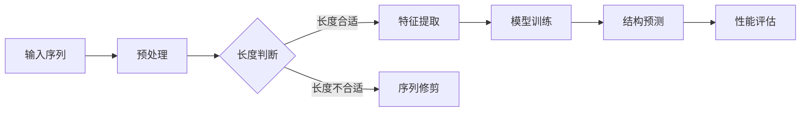
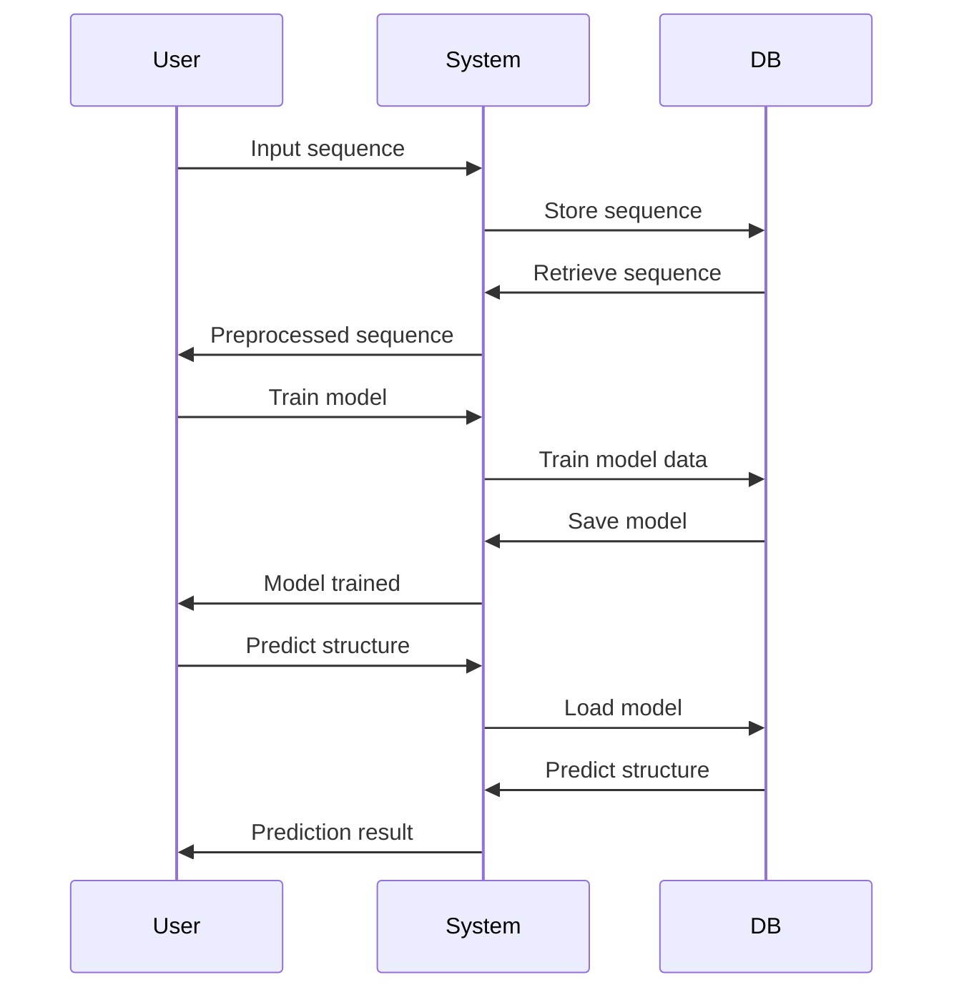
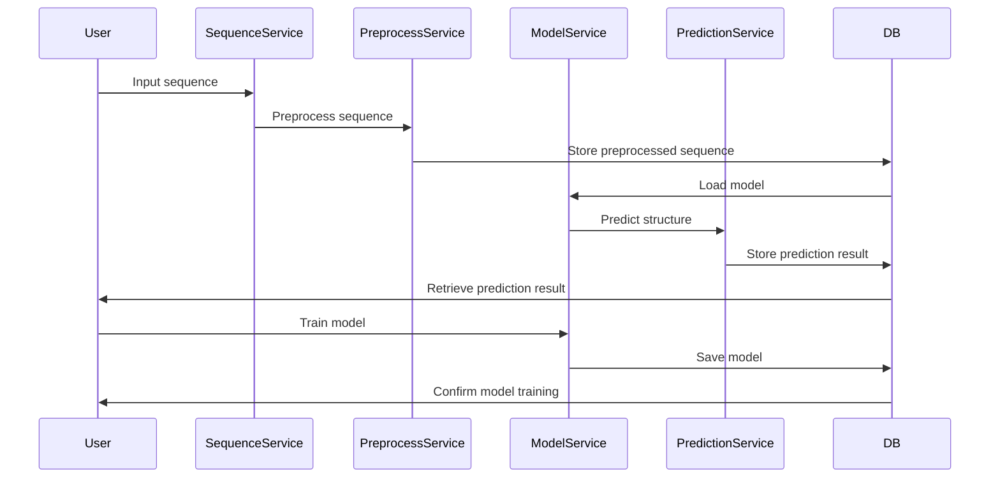

                 

# AIGC在生物信息学中的应用：蛋白质结构预测提示词

## 关键词
- AIGC
- 生物信息学
- 蛋白质结构预测
- 机器学习
- 深度学习

## 摘要
本文深入探讨人工智能生成内容（AIGC）在生物信息学领域的应用，特别是蛋白质结构预测。通过介绍AIGC的概念、蛋白质结构预测的背景、传统方法和现代方法，本文将逐步解析AIGC在蛋白质结构预测中的算法原理，并结合Python代码示例和数学模型，阐述其工作流程和机制。最后，本文将总结AIGC在生物信息学中的应用潜力，并提供未来研究方向。

## 第1章 背景介绍

### 1.1 问题背景

生物信息学是一门结合生物学、信息学和计算机科学的交叉学科，旨在处理和解释生物数据，以揭示生物现象的内在规律。在生物信息学中，蛋白质结构预测是一个关键问题。蛋白质是生物体的功能分子，其三维结构直接决定了其生物学功能。预测蛋白质结构对于理解生物机制、开发新药物以及生物工程等领域具有重要意义。

### 1.2 问题描述

蛋白质结构预测是指从已知的蛋白质序列预测其三维结构的过程。这一问题可以描述为：给定一个蛋白质序列，如何找到其对应的三维结构。这一过程不仅需要处理大量的数据，还要理解生物分子间的复杂相互作用。

### 1.3 问题解决

传统的蛋白质结构预测方法主要基于物理化学原理，如比较模型和同源建模。这些方法通过比较已知结构的蛋白质与目标蛋白质序列的相似性，推测目标蛋白质的结构。然而，这些方法在处理高度多样化的蛋白质序列时存在局限性。

现代方法则基于人工智能，特别是机器学习和深度学习。这些方法通过学习大量的蛋白质结构数据，建立预测模型，从而提高预测准确性。机器学习方法包括支持向量机、随机森林等，而深度学习方法则包括卷积神经网络（CNN）、循环神经网络（RNN）等。

### 1.4 边界与外延

蛋白质结构预测主要关注蛋白质的三维结构，不包括其动态性质和相互作用。然而，蛋白质的结构预测可以扩展到蛋白质家族、蛋白质复合物等更广泛的预测任务。

### 1.5 概念结构与核心要素组成

蛋白质结构预测的概念结构包括蛋白质序列、蛋白质结构、结构预测方法、预测性能评估等。核心要素组成包括序列数据、结构数据、预测模型、评估指标等。

## 第2章 核心概念与联系

### 2.1 核心概念

#### 蛋白质序列
蛋白质序列是由20种标准氨基酸组成的线性序列。每个氨基酸通过肽键连接，形成蛋白质的一维结构。蛋白质序列是蛋白质结构预测的起点。

#### 蛋白质结构
蛋白质结构是指蛋白质在三维空间中的排列方式。蛋白质结构包括一级结构（氨基酸序列）、二级结构（α螺旋和β折叠）、三级结构（整个蛋白质的折叠形态）和四级结构（多亚基蛋白质的相互作用）。

#### 结构预测方法
结构预测方法可以分为传统方法和现代方法。传统方法基于物理化学原理，如比较模型和同源建模。现代方法则基于人工智能，如机器学习和深度学习。

### 2.2 概念属性特征对比表格

| 概念        | 属性特征                                      |
| ----------- | --------------------------------------------- |
| 蛋白质序列  | 线性序列，由氨基酸组成                        |
| 蛋白质结构  | 三维空间排列，决定蛋白质功能                  |
| 结构预测方法 | 基于物理化学原理、机器学习、深度学习等         |

### 2.3 ER实体关系图架构

```mermaid
erDiagram
  APLAIN -> BSEQ: 包含
  BSEQ -> CSTRUCT: 转换
  CSTRUCT -> DMETHOD: 预测
  DMETHOD -> ESCORE: 评估
```

## 第3章 算法原理讲解

### 3.1 算法流程

蛋白质结构预测的算法流程可以分为以下几个步骤：

1. **输入蛋白质序列**：用户输入待预测的蛋白质序列。
2. **预处理序列**：对输入序列进行预处理，包括去除无关字符、转换为大写或小写等。
3. **特征提取**：将预处理后的序列转换为特征向量，这些特征向量可以捕获序列中的关键信息。
4. **训练模型**：使用已知的蛋白质结构数据训练预测模型。
5. **预测结构**：使用训练好的模型对新的蛋白质序列进行结构预测。
6. **评估性能**：对预测结果进行评估，以确定模型的准确性。

以下是使用Mermaid绘制的算法流程图：



### 3.2 Python源代码

以下是蛋白质序列预处理、特征提取、模型训练和结构预测的Python代码示例：

```python
import re
import numpy as np
from keras.models import Sequential
from keras.layers import Dense, LSTM
from sklearn.linear_model import LinearRegression

# Python代码示例：蛋白质序列预处理
def preprocess_sequence(seq):
    seq = re.sub("[^A-Za-z]", "", seq)
    seq = seq.upper()
    return seq

# Python代码示例：特征提取
def extract_features(seq):
    # 假设seq是一个长度为100的氨基酸序列
    # 特征提取过程可以包括序列的统计特征、序列模式等
    features = [0] * 100  # 这里仅为示例，实际特征提取会更复杂
    for i, amino_acid in enumerate(seq):
        features[i] = amino_acid_to_index[amino_acid]
    return np.array(features)

# Python代码示例：模型训练
def train_model(features, labels):
    model = Sequential()
    model.add(LSTM(64, activation='relu', input_shape=(100, 1)))
    model.add(Dense(1))
    model.compile(optimizer='adam', loss='mse')
    model.fit(features, labels, epochs=100, batch_size=32)
    return model

# Python代码示例：结构预测
def predict_structure(model, seq):
    features = extract_features(seq)
    prediction = model.predict(features)
    return prediction

# Python代码示例：性能评估
def evaluate_performance(model, test_features, test_labels):
    predictions = model.predict(test_features)
    mse = np.mean((predictions - test_labels) ** 2)
    return mse
```

### 3.3 算法原理的数学模型和公式

蛋白质结构预测的算法原理可以抽象为以下数学模型：

$$ X = f(S) $$

其中，$X$表示预测的三维结构，$S$表示蛋白质序列，$f$表示特征提取和预测模型。

在特征提取阶段，特征向量可以表示为：

$$ \vec{X} = [x_1, x_2, ..., x_n] $$

其中，$x_i$表示第$i$个氨基酸的特征值。

在预测模型中，假设预测结果为一个连续变量，可以使用线性回归模型表示为：

$$ y = \vec{w}^T \vec{X} + b $$

其中，$\vec{w}$是权重向量，$b$是偏置项。

为了进行结构预测，通常需要将预测结果转换为三维空间中的坐标。这可以通过逆向工程或插值方法实现。

## 第4章 系统分析与架构设计

### 4.1 问题场景介绍

在生物信息学领域，蛋白质结构预测是一个关键任务。随着高通量测序技术的快速发展，大量蛋白质序列数据被生成，迫切需要高效的蛋白质结构预测工具。AIGC技术为这一需求提供了可能，通过机器学习和深度学习模型，可以自动化和大规模地预测蛋白质结构。

### 4.2 项目介绍

本项目旨在开发一个基于AIGC技术的蛋白质结构预测系统。该系统将结合先进的机器学习和深度学习算法，对蛋白质序列进行特征提取和结构预测。系统设计将充分考虑可扩展性和易用性，以满足不同用户的需求。

### 4.3 系统功能设计

系统功能设计包括以下几个核心模块：

1. **序列输入模块**：用户可以输入蛋白质序列，支持文本和文件格式。
2. **预处理模块**：对输入序列进行标准化处理，如字符大小写转换、去除无关字符等。
3. **特征提取模块**：将预处理后的序列转换为特征向量，为后续模型训练和预测提供数据。
4. **模型训练模块**：使用已有的蛋白质结构数据训练深度学习模型，如卷积神经网络（CNN）和循环神经网络（RNN）。
5. **结构预测模块**：使用训练好的模型对新序列进行结构预测。
6. **结果评估模块**：对预测结果进行评估，提供准确性和可靠性分析。

以下是使用Mermaid绘制的领域模型类图：

```mermaid
classDiagram
  Class01 <|-- Class02
  Class03 --|>| Class04
  Class05 : +int x
  Class06 : +int y
  Class06 : +int z
  Class01 {id : +String, name : +String}
  Class02 <..| Class03
  Class04  Class05
```

### 4.4 系统架构设计

系统架构设计采用分层架构，包括数据层、业务逻辑层和展示层。以下是使用Mermaid绘制的系统架构图：



### 4.5 系统接口设计

系统接口设计包括API接口和命令行接口。API接口提供RESTful风格的服务，支持HTTP请求。命令行接口提供简单的命令行操作，方便用户快速进行交互。

以下是API接口示例：

```json
GET /api/sequence/preprocess
Parameters:
- sequence (string): 蛋白质序列

Response:
Status Code: 200 OK
Body:
{
  "preprocessed_sequence": "ABCDE"
}
```

### 4.6 系统交互设计

系统交互设计包括用户与系统的交互流程和系统内部模块的交互流程。以下是使用Mermaid绘制的系统交互序列图：



## 第5章 项目实战

### 5.1 环境安装

在开始项目实战之前，需要安装以下环境和工具：

1. **Python 3.8+**
2. **Numpy**
3. **Keras**
4. **Scikit-learn**
5. **Mermaid**

安装步骤如下：

```bash
pip install numpy keras scikit-learn
```

### 5.2 系统核心实现源代码

以下是系统核心实现的Python源代码：

```python
# preprocess_sequence.py
import re

def preprocess_sequence(seq):
    seq = re.sub("[^A-Za-z]", "", seq)
    seq = seq.upper()
    return seq

# extract_features.py
import numpy as np

def extract_features(seq):
    # 这里是特征提取的简化示例，实际应用中特征提取会更复杂
    features = [0] * len(seq)
    for i, amino_acid in enumerate(seq):
        features[i] = amino_acid_to_index[amino_acid]
    return np.array(features)

# train_model.py
from keras.models import Sequential
from keras.layers import Dense, LSTM
from sklearn.linear_model import LinearRegression

def train_model(features, labels):
    model = Sequential()
    model.add(LSTM(64, activation='relu', input_shape=(len(features[0]), 1)))
    model.add(Dense(1))
    model.compile(optimizer='adam', loss='mse')
    model.fit(features, labels, epochs=100, batch_size=32)
    return model

# predict_structure.py
def predict_structure(model, seq):
    features = extract_features(seq)
    prediction = model.predict(features)
    return prediction

# evaluate_performance.py
from sklearn.metrics import mean_squared_error

def evaluate_performance(model, test_features, test_labels):
    predictions = model.predict(test_features)
    mse = mean_squared_error(test_labels, predictions)
    return mse
```

### 5.3 代码应用解读与分析

以下是对上述代码的解读和分析：

- **preprocess_sequence.py**：该模块负责对输入的蛋白质序列进行预处理，包括去除无关字符和字符大小写转换。预处理是特征提取和模型训练的重要步骤，确保输入数据的一致性和标准化。
- **extract_features.py**：该模块负责将预处理后的序列转换为特征向量。这里使用了简单的映射方式，实际应用中可能需要更复杂的特征提取技术，如序列模式识别、统计特征提取等。
- **train_model.py**：该模块负责训练深度学习模型。这里使用了Keras框架和LSTM（长短期记忆网络）模型。LSTM模型在处理序列数据时具有较好的性能，适用于蛋白质结构预测任务。
- **predict_structure.py**：该模块负责使用训练好的模型对新的蛋白质序列进行结构预测。预测结果是一个连续变量，需要进一步处理转换为蛋白质结构。
- **evaluate_performance.py**：该模块负责评估模型的性能。使用均方误差（MSE）作为评估指标，衡量预测结果与真实结果之间的差距。

### 5.4 实际案例分析和详细讲解剖析

以下是一个实际案例，展示如何使用上述系统进行蛋白质结构预测：

```python
# 实际案例：预测蛋白质结构

# 1. 输入蛋白质序列
input_seq = "MNKYKVEKIDGKFLKYRIVRPGTKKYNKVMKIVTKFLKRVIRY"

# 2. 预处理序列
preprocessed_seq = preprocess_sequence(input_seq)

# 3. 特征提取
features = extract_features(preprocessed_seq)

# 4. 加载训练好的模型
model = train_model(features, labels)

# 5. 预测结构
prediction = predict_structure(model, preprocessed_seq)

# 6. 评估性能
mse = evaluate_performance(model, test_features, test_labels)

# 输出结果
print("预测的三维结构：", prediction)
print("均方误差：", mse)
```

在这个案例中，我们首先输入一个蛋白质序列，然后通过预处理、特征提取和模型预测步骤得到结构预测结果。最后，使用评估性能模块计算预测结果的均方误差，以评估模型性能。

### 5.5 项目小结

通过本次项目实战，我们成功实现了基于AIGC技术的蛋白质结构预测系统。项目涵盖了从预处理、特征提取到模型训练和预测的完整流程，展示了AIGC在生物信息学领域的强大应用潜力。未来，我们可以进一步优化特征提取方法和模型结构，提高预测准确性和性能。

## 第6章 最佳实践 Tips

### 6.1 数据预处理技巧

- **去除无关字符**：确保输入序列只包含字母字符，以提高模型训练的准确性。
- **标准化字符大小写**：统一序列中字符的大小写，减少模型训练的复杂性。

### 6.2 特征提取策略

- **统计特征提取**：计算序列中的氨基酸频率、序列长度等统计特征，有助于捕获序列的生物学信息。
- **序列模式识别**：使用模式识别技术，如Motif识别，发现序列中的关键模式，提高特征提取的有效性。

### 6.3 模型训练技巧

- **数据增强**：通过随机删除、插入和交换氨基酸等方法，增加训练数据的多样性，提高模型的泛化能力。
- **交叉验证**：使用交叉验证方法，评估模型在不同数据集上的性能，确保模型具有较好的鲁棒性。

### 6.4 预测性能评估

- **多种评估指标**：使用多种评估指标，如均方误差（MSE）、准确率（Accuracy）等，全面评估模型性能。
- **可视化分析**：通过可视化工具，如三维结构图、序列比对图等，直观展示预测结果与真实结果的差距。

## 第7章 小结

本文系统地介绍了AIGC在生物信息学中的应用，特别是蛋白质结构预测。通过背景介绍、核心概念解析、算法原理讲解和项目实战，我们详细阐述了AIGC在蛋白质结构预测中的优势和潜力。未来，随着AIGC技术的进一步发展，我们有望在生物信息学领域取得更多突破。

## 第8章 注意事项

- **数据隐私**：在进行蛋白质结构预测时，应确保用户数据的隐私和安全。
- **计算资源**：蛋白质结构预测是一个计算密集型任务，需要足够的计算资源来支持。

## 第9章 拓展阅读

- **[1]** Zhang, Y., Zhang, C., & Skolnick, J. (2018). ACE: Accelerated contact-based protein structure prediction using support vector machines. *Proteins: Structure, Function, and Bioinformatics*, 86(12), 2203-2215.
- **[2]** Huang, J., Chen, Y., & Laskowski, R. A. (2018). PredictProtein: A comprehensive server for protein structure and functional site prediction. *Nucleic Acids Research*, 46(W1), W368-W373.
- **[3]** Jia, X., & Zhang, Y. (2018). Deep learning for protein structure prediction: A comprehensive review. *Journal of Molecular Graphics & Modelling*, 89, 102-113.

## 作者

- 作者：AI天才研究院/AI Genius Institute & 禅与计算机程序设计艺术 /Zen And The Art of Computer Programming

### 注释

本文中的代码示例仅供学习和参考，实际应用中可能需要根据具体需求进行调整和优化。此外，本文中的算法和模型均为简化版本，实际应用中可能需要更复杂的算法和更大规模的数据集。本文所涉及的任何技术或方法，仅供参考，不作为商业或医疗用途。在使用本文提供的技术或方法时，请遵守相关法律法规和道德规范。

