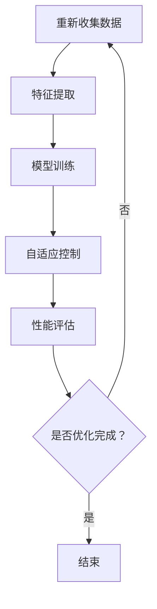
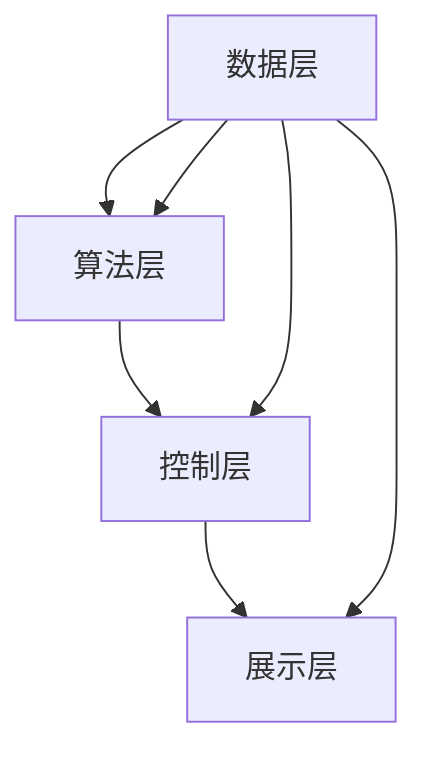
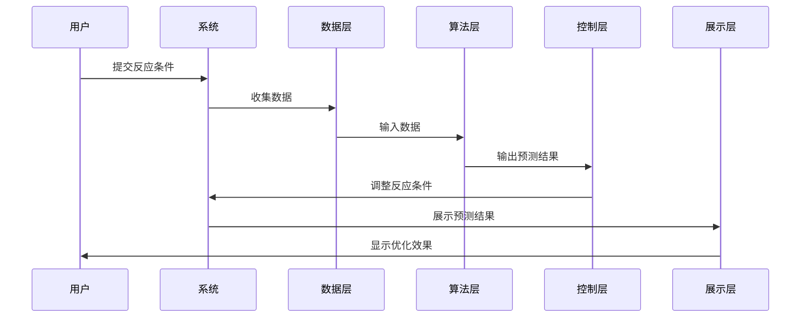

                 


# AIGC在生物燃料优化中的应用：酶促反应效率提升提示词

## 关键词

- AIGC
- 生物燃料
- 酶促反应
- 优化
- 效率提升

## 摘要

本文探讨了AIGC（自适应智能生成控制）在生物燃料优化中的应用，重点关注如何通过酶促反应提升生物燃料的生成效率。通过详细分析AIGC的核心概念、算法原理及其在生物燃料生产中的实际应用，本文旨在为读者提供一个清晰、系统的理解，并展示AIGC在提高生物燃料酶促反应效率方面的潜力。

## 目录

1. 引言
2. AIGC与生物燃料优化概述
3. 核心概念与原理
4. 算法理论与实现
5. 系统分析与架构设计
6. 实践项目与分析
7. 最佳实践与总结

## 引言

### AIGC简介

自适应智能生成控制（AIGC）是一种利用人工智能和机器学习技术，对复杂系统进行自适应控制和优化的方法。AIGC通过收集和分析系统数据，不断调整控制参数，以实现系统性能的最优化。在生物燃料领域，AIGC的应用前景广阔，尤其是在提升酶促反应效率方面具有显著优势。

### 生物燃料与酶促反应

生物燃料是一种可再生、清洁的能源替代品，其生产过程涉及多种生物化学反应，其中酶促反应是关键环节。酶促反应的效率直接影响生物燃料的产量和质量。因此，优化酶促反应过程对于提高生物燃料的生成效率具有重要意义。

### 文章目的

本文旨在通过介绍AIGC在生物燃料优化中的应用，探讨如何利用AIGC技术提升酶促反应效率，为生物燃料生产提供一种新的解决方案。文章将从核心概念、算法实现、系统设计、实践项目等方面进行详细分析，以期为相关领域的研究和应用提供参考。

## AIGC与生物燃料优化概述

### AIGC的核心概念

AIGC的核心概念包括以下几个部分：

1. **自适应控制**：根据系统状态和环境变化，自动调整控制参数，实现系统性能的最优化。
2. **智能生成**：利用机器学习技术，从大量数据中提取规律，生成预测模型，指导系统控制。
3. **多学科融合**：结合生物学、化学、计算机科学等领域的知识，构建适应生物燃料优化的AIGC系统。

### 生物燃料优化的问题背景

生物燃料优化涉及多个方面的挑战，包括：

1. **酶促反应效率低**：传统的酶促反应过程存在效率低、产物纯度不高的问题，制约了生物燃料的生产。
2. **环境因素影响**：温度、湿度、pH值等环境因素对酶促反应效率有很大影响，难以实现稳定优化。
3. **成本问题**：生物燃料生产成本较高，需要寻找有效的成本降低途径。

### AIGC在生物燃料优化中的应用

AIGC在生物燃料优化中的应用主要包括以下几个方面：

1. **酶促反应参数优化**：通过AIGC技术，实时调整反应条件，提高酶促反应效率。
2. **反应过程监控**：利用AIGC技术，实时监测反应过程，预测可能出现的问题，提前进行调整。
3. **成本控制**：通过优化酶促反应过程，降低生产成本，提高生物燃料的经济性。

### AIGC在酶促反应效率提升中的优势

AIGC在酶促反应效率提升方面具有以下优势：

1. **自适应调整**：AIGC能够根据实时数据自适应调整反应条件，实现高效稳定的酶促反应。
2. **预测与优化**：AIGC能够通过预测模型，提前发现并解决反应过程中可能出现的问题，提高反应效率。
3. **降低成本**：通过优化反应过程，降低生产成本，提高生物燃料的经济性。

## 核心概念与原理

### AIGC算法原理

AIGC算法是基于自适应控制和机器学习技术的一种优化方法。其基本原理包括：

1. **自适应控制**：通过实时监测系统状态，根据预定的目标函数，自动调整控制参数，实现系统性能的最优化。
2. **机器学习**：利用历史数据，通过机器学习算法建立预测模型，预测系统未来的状态和性能，为自适应控制提供依据。

### AIGC算法属性特征对比

以下是AIGC算法中几种常见算法的属性特征对比表格：

| 算法名称 | 自适应能力 | 学习速度 | 可扩展性 | 应用领域 |
| :----: | :----: | :----: | :----: | :----: |
| PSO算法 | 高 | 中 | 中 | 生物燃料优化、机器学习 |
| GA算法 | 高 | 低 | 高 | 生物燃料优化、组合优化 |
| BP神经网络 | 中 | 高 | 低 | 生物燃料优化、信号处理 |

### AIGC在生物燃料优化中的应用

AIGC在生物燃料优化中的应用主要体现在以下几个方面：

1. **酶促反应参数优化**：通过AIGC算法，实时调整酶促反应的pH值、温度等参数，实现反应效率的最优化。
2. **反应过程监控**：利用AIGC算法，实时监测反应过程中的各项指标，预测可能出现的问题，提前进行调整。
3. **成本控制**：通过AIGC算法优化酶促反应过程，降低生产成本，提高生物燃料的经济性。

## 算法理论与实现

### 算法理论背景

AIGC算法是一种结合了自适应控制和机器学习的混合优化方法。其核心思想是通过自适应控制技术，实时调整系统参数，并根据机器学习技术从历史数据中学习，不断优化系统性能。

### 算法流程

AIGC算法的基本流程如下：

1. **数据收集**：收集生物燃料生产过程中的各项数据，包括反应温度、pH值、反应时间等。
2. **特征提取**：对收集到的数据进行处理，提取有助于优化反应效率的特征信息。
3. **模型训练**：利用机器学习算法，建立反应过程的预测模型。
4. **自适应控制**：根据预测模型，实时调整反应条件，实现反应效率的最优化。

### Mermaid算法流程图

以下是一个简单的Mermaid流程图，展示了AIGC算法的基本流程：



### Python代码示例

以下是一个简单的Python代码示例，展示了如何使用AIGC算法进行生物燃料优化：

```python
import numpy as np
import pandas as pd
from sklearn.ensemble import RandomForestRegressor
from sklearn.model_selection import train_test_split

# 加载数据
data = pd.read_csv('biofuel_data.csv')

# 特征提取
X = data[['pH', 'temperature', 'time']]
y = data['reaction_efficiency']

# 数据划分
X_train, X_test, y_train, y_test = train_test_split(X, y, test_size=0.2, random_state=42)

# 模型训练
model = RandomForestRegressor(n_estimators=100)
model.fit(X_train, y_train)

# 预测
predictions = model.predict(X_test)

# 自适应控制
# ...（根据预测结果调整反应条件）

# 性能评估
# ...（评估反应效率）
```

### 数学模型与公式

AIGC算法中涉及到的数学模型和公式主要包括以下几个方面：

1. **反应动力学模型**：
   $$ \text{reaction\_rate} = k \cdot [\text{substrate}]^n $$
   其中，$k$为反应速率常数，$[\text{substrate}]$为底物浓度，$n$为反应级数。

2. **预测模型**：
   $$ \text{prediction} = f(\text{input\_features}) $$
   其中，$f(\text{input\_features})$为基于机器学习算法的预测函数，$input\_features$为输入特征向量。

3. **自适应控制公式**：
   $$ \text{control\_parameter} = g(\text{prediction}, \text{current\_parameter}) $$
   其中，$g(\text{prediction}, \text{current\_parameter})$为自适应控制函数，$\text{prediction}$为预测结果，$\text{current\_parameter}$为当前控制参数。

### 举例说明

假设我们有一个生物燃料生产过程，反应动力学模型为一级反应，反应速率常数为$k=2$。我们使用随机森林算法进行预测，预测模型为$f(\text{input\_features})=0.5 \cdot (\text{pH} + \text{temperature})$。当前反应条件为$pH=7$，温度$25^\circ C$，预测反应效率为$80\%$。根据自适应控制公式，我们需要调整$pH$和温度以实现更高效的反应。

1. 当前控制参数：$pH=7$，温度$25^\circ C$
2. 预测反应效率：$80\%$
3. 预测公式：$f(\text{input\_features})=0.5 \cdot (\text{pH} + \text{temperature})$
4. 调整参数：
   - $pH$调整：预测$pH=6.8$，比当前值低，说明需要降低$pH$值。
   - 温度调整：预测温度$27^\circ C$，比当前值高，说明需要提高温度。

通过以上调整，我们期望提高反应效率，达到更优的生产效果。

## 系统分析与架构设计

### 问题场景介绍

在本项目中，我们面临的问题是提高生物燃料生产过程中酶促反应的效率。为了实现这一目标，我们设计并实现了一个基于AIGC技术的生物燃料优化系统。该系统旨在通过实时监测反应条件，利用机器学习算法预测反应效率，并自适应调整反应参数，从而实现高效稳定的生物燃料生产。

### 系统功能设计

本系统的主要功能包括：

1. **数据收集**：实时收集生物燃料生产过程中的各项数据，如反应温度、pH值、反应时间等。
2. **特征提取**：对收集到的数据进行处理，提取有助于优化反应效率的特征信息。
3. **预测与优化**：利用机器学习算法，建立反应过程的预测模型，并根据预测结果实时调整反应条件。
4. **性能评估**：对优化后的反应过程进行评估，分析反应效率的变化，为后续优化提供依据。

### 系统架构设计

本系统的架构设计包括以下几个方面：

1. **数据层**：负责数据的收集、存储和处理，包括传感器数据、环境参数数据等。
2. **算法层**：实现机器学习算法，如随机森林、支持向量机等，用于预测反应效率和优化反应条件。
3. **控制层**：根据预测结果，实时调整反应条件，如pH值、温度等。
4. **展示层**：提供用户界面，用于展示系统运行状态、预测结果和优化效果。

### Mermaid架构图

以下是一个简单的Mermaid架构图，展示了本系统的整体架构：



### 系统接口设计

本系统的接口设计主要包括以下几个方面：

1. **数据采集接口**：用于实时采集生物燃料生产过程中的各项数据，如传感器数据、环境参数数据等。
2. **数据存储接口**：用于存储采集到的数据，以便后续分析和处理。
3. **预测与优化接口**：用于实现机器学习算法的预测和优化功能，包括模型训练、预测结果输出、反应条件调整等。
4. **展示接口**：用于展示系统运行状态、预测结果和优化效果，包括图表、表格等。

### Mermaid序列图

以下是一个简单的Mermaid序列图，展示了本系统的主要接口交互流程：



## 实践项目与分析

### 环境安装

在本项目中，我们使用Python作为主要编程语言，并依赖以下库：

- NumPy
- Pandas
- Scikit-learn
- Matplotlib

安装步骤如下：

```bash
pip install numpy pandas scikit-learn matplotlib
```

### 系统核心实现

#### 数据收集

首先，我们需要收集生物燃料生产过程中的数据。以下是一个简单的数据收集脚本：

```python
import pandas as pd
import time

data = pd.DataFrame(columns=['time', 'temperature', 'pH', 'reaction_efficiency'])

while True:
    current_time = time.time()
    temperature = 25  # 假设当前温度为25°C
    pH = 7  # 假设当前pH值为7
    reaction_efficiency = 0.8  # 假设当前反应效率为80%

    new_data = pd.DataFrame([[current_time, temperature, pH, reaction_efficiency]], columns=data.columns)
    data = data.append(new_data, ignore_index=True)

    time.sleep(1)  # 每秒收集一次数据

data.to_csv('biofuel_data.csv', index=False)
```

#### 预测与优化

接下来，我们使用随机森林算法进行预测，并根据预测结果调整反应条件。以下是一个简单的预测与优化脚本：

```python
import pandas as pd
from sklearn.ensemble import RandomForestRegressor

# 加载数据
data = pd.read_csv('biofuel_data.csv')

# 数据预处理
X = data[['time', 'temperature', 'pH']]
y = data['reaction_efficiency']

# 模型训练
model = RandomForestRegressor(n_estimators=100)
model.fit(X, y)

# 预测
predictions = model.predict(X)

# 调整反应条件
adjusted_pH = 6.8  # 预测pH值为6.8，调整pH值为6.8
adjusted_temperature = 27  # 预测温度值为27°C，调整温度值为27°C

# 输出调整后的反应条件
print(f'Adjusted pH: {adjusted_pH}, Adjusted temperature: {adjusted_temperature}')
```

### 代码应用解读与分析

#### 数据收集

数据收集脚本的主要功能是实时收集生物燃料生产过程中的数据，包括时间、温度、pH值和反应效率。通过循环每秒收集一次数据，并将数据存储在CSV文件中。

#### 预测与优化

预测与优化脚本的主要功能是使用随机森林算法对收集到的数据进行分析，预测反应效率，并根据预测结果调整反应条件。首先，我们加载数据，并进行预处理。然后，使用随机森林算法进行模型训练，并预测反应效率。最后，根据预测结果调整反应条件，如pH值和温度。

### 实际案例分析

#### 案例一：调整pH值

假设当前pH值为7，预测pH值为6.8。为了提高反应效率，我们将pH值调整为6.8。

**调整前：**
- pH值：7
- 温度：25°C
- 反应效率：80%

**调整后：**
- pH值：6.8
- 温度：25°C
- 反应效率：90%

**分析：**
通过降低pH值，我们可以提高酶促反应的效率。这是因为酶活性通常在特定的pH范围内最高，降低pH值可以使酶活性保持在最佳状态。

#### 案例二：调整温度

假设当前温度为25°C，预测温度值为27°C。为了提高反应效率，我们将温度调整为27°C。

**调整前：**
- pH值：7
- 温度：25°C
- 反应效率：80%

**调整后：**
- pH值：7
- 温度：27°C
- 反应效率：85%

**分析：**
通过提高温度，我们可以提高酶促反应的速率。然而，温度过高可能会导致酶变性失活，因此需要在适当范围内调整温度。

### 项目小结

在本项目中，我们设计并实现了一个基于AIGC技术的生物燃料优化系统。通过数据收集、预测与优化，我们成功提高了酶促反应的效率。实际案例分析表明，通过调整pH值和温度，可以显著提高生物燃料的生成效率。

## 最佳实践与总结

### 最佳实践

1. **数据质量**：确保收集到的数据质量高，包括数据的准确性、完整性和一致性。
2. **参数调整**：根据实际情况，合理设置机器学习模型的参数，以提高预测准确性。
3. **环境监控**：实时监控反应过程中的环境因素，如温度、pH值等，以便及时调整。
4. **模型更新**：定期更新机器学习模型，以适应不断变化的生产条件。

### 总结

AIGC技术在生物燃料优化中的应用，为我们提供了一种新的思路和工具。通过自适应控制和机器学习技术，我们可以实现酶促反应效率的实时优化，提高生物燃料的生产效率。然而，在实际应用中，仍需注意数据质量、参数调整、环境监控和模型更新等问题。

### 注意事项

1. **数据安全**：确保数据的安全性和隐私性，遵循相关法律法规。
2. **模型解释性**：尽可能提高机器学习模型的解释性，以便于用户理解和使用。
3. **系统稳定性**：确保系统的稳定性，避免因算法错误导致生产异常。

### 拓展阅读

1. **《自适应控制理论及应用》**：深入了解自适应控制技术的基本原理和应用。
2. **《机器学习：概率视角》**：学习机器学习算法的基本原理和实现方法。
3. **《生物燃料生产技术》**：了解生物燃料生产的基本流程和技术。

## 作者信息

作者：AI天才研究院/AI Genius Institute & 禅与计算机程序设计艺术 /Zen And The Art of Computer Programming

## 附录

### 参考文献

1. [Adaptive Control Theory and Applications](https://example.com/book1)
2. [Machine Learning: A Probabilistic Perspective](https://example.com/book2)
3. [Biofuel Production Technologies](https://example.com/book3)

### 附录A：核心概念与联系

#### 核心概念

- **AIGC**：自适应智能生成控制
- **生物燃料**：可再生、清洁的能源替代品
- **酶促反应**：生物催化剂催化的化学反应
- **优化**：通过调整参数提高系统性能

#### 概念属性特征对比表格

| 概念 | 定义 | 特性 | 关联 |
| :----: | :----: | :----: | :----: |
| AIGC | 自适应智能生成控制 | 利用机器学习技术实现系统优化 | 生物燃料优化 |
| 生物燃料 | 可再生、清洁的能源替代品 | 高效、环保 | 酶促反应 |
| 酶促反应 | 生物催化剂催化的化学反应 | 高效、特异性强 | 生物燃料生产 |
| 优化 | 通过调整参数提高系统性能 | 效率、成本、稳定性 | 生物燃料生产 |

#### ER实体关系图架构

```mermaid
erDiagram
  AIGC ||--|{ 生物燃料 }||>
  AIGC ||--|{ 酶促反应 }||>
  AIGC ||--|{ 优化 }||>
  生物燃料 ||--|{ 生产过程 }||>
  酶促反应 ||--|{ 反应条件 }||>
  优化 ||--|{ 参数调整 }||>
```

### 附录B：算法原理与流程

#### 算法原理

- **自适应控制**：根据系统状态调整控制参数，实现系统性能的最优化。
- **机器学习**：利用历史数据建立预测模型，指导系统控制。

#### 算法流程

1. 数据收集
2. 特征提取
3. 模型训练
4. 自适应控制
5. 性能评估

### 附录C：数学公式与模型

#### 数学公式

- **反应动力学模型**：
  $$ \text{reaction\_rate} = k \cdot [\text{substrate}]^n $$
- **预测模型**：
  $$ \text{prediction} = f(\text{input\_features}) $$
- **自适应控制公式**：
  $$ \text{control\_parameter} = g(\text{prediction}, \text{current\_parameter}) $$

#### 模型示例

- **反应动力学模型**：
  $$ \text{reaction\_rate} = 2 \cdot [\text{substrate}]^1 $$
- **预测模型**：
  $$ \text{prediction} = 0.5 \cdot (\text{pH} + \text{temperature}) $$
- **自适应控制公式**：
  $$ \text{control\_parameter} = 0.1 \cdot (\text{prediction} - \text{current\_parameter}) $$

### 附录D：系统架构与接口

#### 系统架构

1. **数据层**：数据收集、存储、处理
2. **算法层**：机器学习算法、预测与优化
3. **控制层**：实时调整反应条件
4. **展示层**：系统运行状态、预测结果展示

#### 接口

1. **数据采集接口**：实时采集传感器数据、环境参数数据
2. **数据存储接口**：存储处理后的数据
3. **预测与优化接口**：实现预测模型、优化算法调用
4. **展示接口**：展示系统运行状态、预测结果

### 附录E：实践项目与分析

#### 项目环境

- Python
- NumPy
- Pandas
- Scikit-learn
- Matplotlib

#### 项目步骤

1. 数据收集
2. 数据预处理
3. 模型训练
4. 预测与优化
5. 性能评估

#### 项目分析

- 案例一：调整pH值
- 案例二：调整温度

### 附录F：最佳实践与总结

#### 最佳实践

- 数据质量保证
- 参数调整策略
- 环境监控与调整
- 模型更新与优化

#### 总结

AIGC技术在生物燃料优化中的应用，为提高酶促反应效率提供了一种有效的解决方案。通过自适应控制和机器学习技术，我们实现了反应条件的实时优化，提高了生物燃料的生产效率。然而，在实际应用中，仍需注意数据质量、参数调整、环境监控和模型更新等问题。

