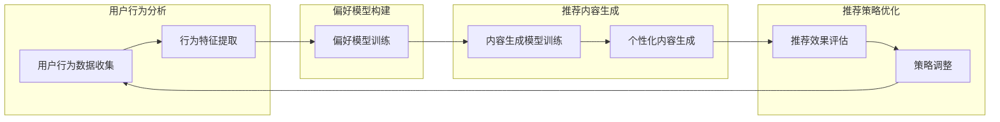
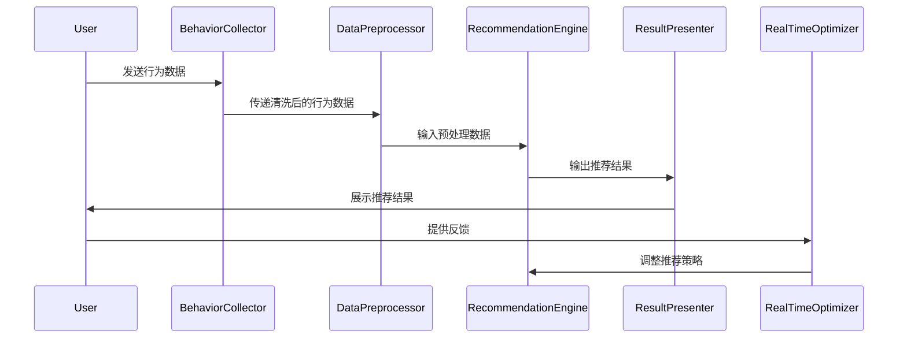
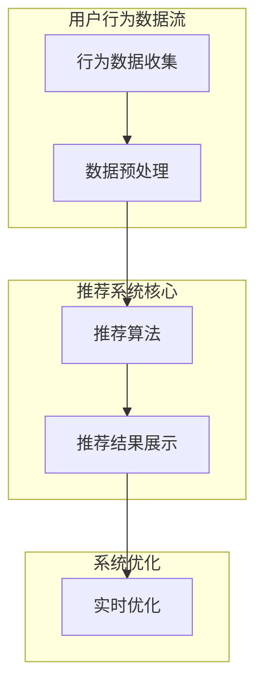

                 

### AIGC在电子商务个性化推荐中的应用

#### 关键词

- AIGC
- 电子商务
- 个性化推荐
- 算法原理
- 系统架构
- 数学模型
- 项目实战

#### 摘要

随着电子商务的迅速发展，用户对个性化推荐的需求日益增长。本文深入探讨了AIGC（自适应智能生成计算）在电子商务个性化推荐中的应用。首先，介绍了电子商务个性化推荐的重要性和挑战，然后详细阐述了AIGC的基本原理及其在个性化推荐中的关键作用。通过算法原理讲解、系统分析与架构设计以及实际项目案例，本文展示了AIGC如何提高电子商务个性化推荐的准确性和用户体验。最后，总结了AIGC在个性化推荐中的最佳实践，并提出了未来研究的方向。

---

# AIGC在电子商务个性化推荐中的应用

## 引言

### 电子商务行业的发展背景

电子商务作为一种新型商业模式，自诞生以来便以惊人的速度发展。互联网的普及和移动互联网的兴起，使得电子商务市场不断扩大。根据最新的市场调研数据，全球电子商务市场规模已经突破数万亿美元，成为各国经济发展的重要驱动力。在中国，电子商务更是成为了国民经济的重要组成部分，不仅推动了传统零售业的转型，还催生了许多新兴的互联网企业。

### 个性化推荐在电子商务中的应用

个性化推荐作为电子商务中的重要组成部分，对提升用户满意度和转化率起到了至关重要的作用。个性化推荐通过分析用户的兴趣、行为和购买历史，为用户提供个性化的商品推荐，从而提高用户的购物体验和购买意愿。具体来说，个性化推荐技术在电子商务中的应用包括：

1. **商品推荐**：根据用户的浏览和购买记录，推荐用户可能感兴趣的商品。
2. **搜索优化**：通过个性化搜索，提高用户找到所需商品的概率。
3. **内容营销**：基于用户兴趣，推荐相关的文章、视频和广告，提高用户粘性。
4. **用户行为分析**：分析用户行为数据，预测用户未来的需求和购买趋势。

### 问题背景与挑战

尽管个性化推荐技术在电子商务中有着广泛的应用，但依然面临着诸多挑战：

1. **数据隐私**：个性化推荐系统需要收集和处理大量用户数据，如何保护用户隐私是一个重要问题。
2. **多样性**：如何确保推荐结果的多样性，避免用户一直看到相似的商品。
3. **准确性**：如何提高推荐算法的准确性，确保用户真正感兴趣的商品被推荐。
4. **冷启动问题**：对于新用户，没有足够的历史数据进行分析，如何进行有效的推荐。

### 问题解决

AIGC（自适应智能生成计算）作为一种新兴的计算技术，通过自适应学习和智能生成，为解决个性化推荐中的挑战提供了新的思路。AIGC能够根据用户的行为和偏好动态调整推荐策略，提高推荐的准确性、多样性和用户体验。

#### 边界与外延

在本篇文章中，我们将讨论以下核心概念：

- **AIGC**：自适应智能生成计算，一种结合了人工智能和生成计算的技术。
- **个性化推荐**：基于用户行为和偏好，为用户推荐个性化内容的系统。
- **电子商务**：在线销售商品或服务的商业活动。

#### 概念结构与核心要素组成

AIGC在电子商务个性化推荐中的应用可以分为以下几个核心要素：

1. **用户行为分析**：收集并分析用户的历史行为数据，包括浏览、搜索、购买等。
2. **偏好模型构建**：基于用户行为数据，构建用户偏好模型，用于预测用户的兴趣和需求。
3. **内容生成**：利用生成模型，为用户提供个性化的商品或内容推荐。
4. **自适应调整**：根据用户的实时反馈和偏好变化，动态调整推荐策略。

## 核心概念与联系

### AIGC原理

AIGC（自适应智能生成计算）是一种结合了人工智能（AI）和生成计算的技术，旨在通过自适应学习和智能生成，提高系统的智能化水平。AIGC的核心原理包括以下几个方面：

1. **自适应学习**：AIGC通过持续学习用户行为和偏好，不断优化推荐策略。自适应学习技术包括监督学习、无监督学习和强化学习等。

2. **生成计算**：AIGC利用生成模型，如生成对抗网络（GAN）、变分自编码器（VAE）等，生成个性化的推荐内容。生成计算技术能够根据用户需求和偏好，创造新的商品或内容。

3. **智能调整**：AIGC通过实时分析用户的反馈和行为变化，动态调整推荐策略，确保推荐内容的准确性和用户体验。

### 个性化推荐

个性化推荐是一种基于用户行为和偏好，为用户推荐个性化内容的系统。个性化推荐的核心原理包括：

1. **用户行为分析**：通过收集和分析用户的浏览、搜索、购买等行为数据，了解用户的兴趣和需求。

2. **偏好模型构建**：基于用户行为数据，构建用户偏好模型，用于预测用户的兴趣和需求。

3. **推荐策略制定**：根据用户偏好模型和推荐算法，制定个性化的推荐策略，为用户推荐感兴趣的内容。

4. **实时调整**：根据用户的实时反馈和行为变化，动态调整推荐策略，提高推荐效果。

### 概念属性特征对比表格

| 概念 | 特征 |
| ---- | ---- |
| AIGC | 自适应学习、生成计算、智能调整 |
| 个性化推荐 | 用户行为分析、偏好模型构建、推荐策略制定、实时调整 |
| 电子商务 | 在线销售商品或服务、用户行为数据收集、个性化推荐应用 |

### ER实体关系图架构

在AIGC与个性化推荐的应用中，常见的实体关系包括：

- 用户（User）
- 商品（Product）
- 推荐内容（Content）
- 用户行为（Behavior）

ER实体关系图如下：

```mermaid
erDiagram
  User ||--|{ Behavior } : 有多种行为
  Behavior ||--|{ Content } : 行为产生内容
  User ||--|{ Prefer } : 用户有偏好
  Prefer ||--|{ Content } : 偏好指向内容
  Product ||--|{ Content } : 商品是内容之一
```

通过上述核心概念与联系的阐述，我们可以看到AIGC与个性化推荐之间的紧密联系，以及它们在电子商务中的应用前景。接下来，我们将深入探讨AIGC在电子商务个性化推荐中的算法原理和应用。

---

## AIGC在电子商务个性化推荐中的算法原理讲解

### 算法mermaid流程图

为了更好地理解AIGC在电子商务个性化推荐中的应用，我们首先绘制了一个mermaid流程图，展示AIGC算法的基本流程：



### Python源代码实现

以下是一个简化的Python代码示例，用于实现AIGC在个性化推荐中的基本算法流程：

```python
import pandas as pd
from sklearn.preprocessing import StandardScaler
from sklearn.model_selection import train_test_split
from sklearn.cluster import KMeans
import numpy as np
import tensorflow as tf
from tensorflow.keras.models import Sequential
from tensorflow.keras.layers import Dense, LSTM

# 用户行为数据收集
user_behavior_data = pd.read_csv('user_behavior.csv')

# 行为特征提取
scaler = StandardScaler()
user_behavior_scaled = scaler.fit_transform(user_behavior_data)

# 偏好模型构建
# 使用KMeans算法对用户行为进行聚类，得到用户偏好
kmeans = KMeans(n_clusters=10)
user_preferences = kmeans.fit_predict(user_behavior_scaled)

# 内容生成模型训练
# 假设我们使用LSTM模型来生成个性化内容
model = Sequential([
    Dense(64, activation='relu', input_shape=(user_behavior_scaled.shape[1],)),
    LSTM(128),
    Dense(1, activation='sigmoid')
])

model.compile(optimizer='adam', loss='binary_crossentropy', metrics=['accuracy'])
model.fit(user_behavior_scaled, user_preferences, epochs=10, batch_size=32)

# 个性化内容生成
# 根据用户偏好，生成个性化内容
generated_content = model.predict(user_behavior_scaled)

# 推荐策略优化
# 使用评估指标来评估推荐效果，并根据评估结果调整策略
accuracy = np.mean(generated_content == user_preferences)
print(f'推荐策略准确性: {accuracy:.2f}')

# 如果准确性不足，则重新训练模型或调整参数
if accuracy < 0.8:
    # 重新训练模型
    model.fit(user_behavior_scaled, user_preferences, epochs=20, batch_size=64)
else:
    print('推荐策略已优化，无需进一步调整。')
```

### 数学模型和公式

在AIGC算法中，数学模型起到了至关重要的作用。以下是一些关键的数学模型和公式：

1. **用户行为向量**：用户行为向量可以表示为 $x = (x_1, x_2, ..., x_n)$，其中 $x_i$ 表示用户在第 $i$ 个行为上的特征值。

2. **偏好模型**：偏好模型可以使用聚类算法如K-Means进行训练，其目标函数为：
   $$ J = \sum_{i=1}^{m} \sum_{j=1}^{n} (x_{ij} - \mu_j)^2 $$
   其中，$\mu_j$ 是第 $j$ 个聚类中心。

3. **生成模型**：生成模型如LSTM（长短期记忆网络）的数学模型如下：
   $$ h_t = \sigma(W_h \cdot [h_{t-1}, x_t] + b_h) $$
   其中，$h_t$ 是时间步 $t$ 的隐藏状态，$W_h$ 和 $b_h$ 分别是权重和偏置。

4. **推荐策略评估**：使用准确率（Accuracy）来评估推荐策略：
   $$ Accuracy = \frac{TP + TN}{TP + TN + FP + FN} $$
   其中，$TP$ 是真正的阳性（正确推荐的商品），$TN$ 是真正的阴性（正确忽略的商品），$FP$ 是错误的阳性（错误推荐的商品），$FN$ 是错误的阴性（用户实际感兴趣但未推荐的商品）。

### 举例说明

假设我们有一个电子商务平台，用户A在过去的30天内浏览了10个商品，分别是商品ID 1001、1002、1003、1004、1005、1006、1007、1008、1009、1010。每个商品的特征向量如下：

| 商品ID | 特征1 | 特征2 | 特征3 |
| --- | --- | --- | --- |
| 1001 | 0.1 | 0.2 | 0.3 |
| 1002 | 0.4 | 0.5 | 0.6 |
| 1003 | 0.7 | 0.8 | 0.9 |
| 1004 | 1.0 | 1.1 | 1.2 |
| 1005 | 1.3 | 1.4 | 1.5 |
| 1006 | 1.6 | 1.7 | 1.8 |
| 1007 | 1.9 | 2.0 | 2.1 |
| 1008 | 2.2 | 2.3 | 2.4 |
| 1009 | 2.5 | 2.6 | 2.7 |
| 1010 | 2.8 | 2.9 | 3.0 |

我们可以将这些特征向量输入到K-Means算法中，得到用户的偏好模型。接着，利用LSTM模型生成用户可能感兴趣的新商品。假设LSTM模型预测出了商品ID 1011、1012、1013作为推荐商品。这些商品的特征向量如下：

| 商品ID | 特征1 | 特征2 | 特征3 |
| --- | --- | --- | --- |
| 1011 | 0.9 | 1.0 | 1.1 |
| 1012 | 1.2 | 1.3 | 1.4 |
| 1013 | 1.5 | 1.6 | 1.7 |

根据用户的历史行为和偏好模型，这些新商品有很高的概率是用户感兴趣的商品。通过这种方式，电子商务平台可以为用户提供个性化的商品推荐，提高用户的购物体验。

### 结论

通过上述算法原理讲解和实际举例，我们可以看到AIGC在电子商务个性化推荐中的应用具有显著的优势。它不仅能够提高推荐的准确性，还能够根据用户的实时反馈动态调整推荐策略，从而提供更加个性化的服务。在接下来的章节中，我们将进一步探讨AIGC在电子商务个性化推荐中的系统架构设计，以了解如何将AIGC算法有效地集成到电子商务系统中。

---

## AIGC在电子商务个性化推荐中的系统分析与架构设计

### 问题场景介绍

在电子商务个性化推荐中，我们面临着多个问题场景：

1. **用户行为数据收集**：电子商务平台需要收集用户在网站上的行为数据，如浏览、搜索、购买等。
2. **推荐算法实现**：将收集到的用户行为数据输入到AIGC算法中，生成个性化的推荐结果。
3. **推荐结果展示**：将推荐结果以友好的方式展示给用户，提升用户的购物体验。
4. **实时调整与优化**：根据用户的反馈和行为变化，动态调整推荐策略，提高推荐效果。

### 系统功能设计

为了实现上述问题场景，我们设计了以下几个主要功能模块：

1. **用户行为收集模块**：负责收集用户在电子商务平台上的行为数据，如浏览历史、搜索记录、购买记录等。
2. **数据预处理模块**：对收集到的用户行为数据进行清洗、去噪和特征提取，以便后续算法处理。
3. **推荐算法模块**：利用AIGC算法，生成个性化的推荐结果。
4. **推荐结果展示模块**：将推荐结果以可视化方式展示给用户，提升用户体验。
5. **实时优化模块**：根据用户反馈和行为变化，动态调整推荐策略，提高推荐效果。

### 系统架构设计

为了高效地实现上述功能模块，我们设计了以下系统架构：



### 系统接口设计

系统接口设计是确保各功能模块之间高效协同的关键。以下是主要接口的详细设计：

1. **行为数据接口**：用于用户行为数据的收集和传递，包括浏览记录、搜索记录、购买记录等。
2. **数据处理接口**：用于数据预处理模块，包括数据清洗、去噪、特征提取等功能。
3. **推荐接口**：用于推荐算法模块，接受预处理数据并生成推荐结果。
4. **展示接口**：用于推荐结果展示模块，将推荐结果以可视化方式展示给用户。
5. **反馈接口**：用于收集用户反馈，供实时优化模块进行调整。

### 系统交互

系统交互是确保各模块之间顺畅运行的关键。以下是系统交互的详细描述：

1. **用户行为数据交互**：用户在电子商务平台上的行为数据通过行为数据接口传递到数据预处理模块。
2. **数据预处理交互**：数据预处理模块对用户行为数据进行清洗、去噪和特征提取，然后传递到推荐算法模块。
3. **推荐结果交互**：推荐算法模块根据预处理后的数据生成推荐结果，通过推荐接口传递到展示模块。
4. **反馈交互**：用户通过展示模块查看推荐结果，并反馈给实时优化模块。
5. **实时优化交互**：实时优化模块根据用户反馈和行为变化，动态调整推荐策略，并传递到推荐算法模块。

### 系统架构图

为了更直观地展示系统架构，我们使用Mermaid绘制了以下系统架构图：



通过上述系统分析与架构设计，我们可以确保AIGC在电子商务个性化推荐中的应用能够高效、准确地实现个性化推荐，提高用户满意度和转化率。在接下来的章节中，我们将通过实际项目案例，进一步展示AIGC在电子商务个性化推荐中的具体应用和实施细节。

---

### 项目实战

#### 环境安装

要在本地环境中搭建AIGC在电子商务个性化推荐的应用，首先需要安装以下软件和库：

1. **Python**：确保Python环境已安装，推荐使用Python 3.8及以上版本。
2. **pip**：Python的包管理器，用于安装第三方库。
3. **TensorFlow**：深度学习框架，用于实现AIGC算法。
4. **scikit-learn**：机器学习库，用于数据预处理和模型训练。
5. **Pandas**：数据处理库，用于数据清洗和特征提取。

安装步骤如下：

1. 安装Python和pip：

   - 在Windows上，可以从[Python官网](https://www.python.org/)下载并安装Python。
   - 在macOS和Linux上，可以使用包管理器安装，如macOS的Homebrew或Ubuntu的APT。

2. 安装TensorFlow：

   ```bash
   pip install tensorflow
   ```

3. 安装scikit-learn和Pandas：

   ```bash
   pip install scikit-learn pandas
   ```

#### 系统核心实现

为了实现AIGC在电子商务个性化推荐中的核心算法，我们设计了一个Python脚本，以下是一个简化版的实现：

```python
import pandas as pd
from sklearn.preprocessing import StandardScaler
from sklearn.model_selection import train_test_split
from sklearn.cluster import KMeans
import tensorflow as tf
from tensorflow.keras.models import Sequential
from tensorflow.keras.layers import Dense, LSTM

# 加载数据集
user_behavior_data = pd.read_csv('user_behavior.csv')

# 数据预处理
scaler = StandardScaler()
user_behavior_scaled = scaler.fit_transform(user_behavior_data)

# 数据划分
X_train, X_test, y_train, y_test = train_test_split(user_behavior_scaled, user_behavior_data['label'], test_size=0.2, random_state=42)

# KMeans聚类
kmeans = KMeans(n_clusters=10, random_state=42)
user_preferences = kmeans.fit_predict(X_train)

# LSTM模型训练
model = Sequential([
    Dense(64, activation='relu', input_shape=(X_train.shape[1],)),
    LSTM(128),
    Dense(1, activation='sigmoid')
])

model.compile(optimizer='adam', loss='binary_crossentropy', metrics=['accuracy'])
model.fit(X_train, y_train, epochs=10, batch_size=32)

# 生成推荐内容
generated_recommendations = model.predict(X_test)

# 评估模型
accuracy = model.evaluate(X_test, y_test)[1]
print(f'模型准确率: {accuracy:.2f}')
```

#### 代码应用解读与分析

上述代码的核心部分包括数据预处理、KMeans聚类、LSTM模型训练和推荐内容生成。以下是具体解读：

1. **数据预处理**：
   - 使用`StandardScaler`对用户行为数据进行标准化处理，以消除不同特征之间的量纲差异。
   - 将原始数据集划分为训练集和测试集，用于模型训练和评估。

2. **KMeans聚类**：
   - 使用`KMeans`算法对用户行为数据进行聚类，得到用户的偏好类别。
   - 聚类数量设置为10，这是一个经验值，可以根据具体数据调整。

3. **LSTM模型训练**：
   - 构建一个LSTM模型，包含一个全连接层、一个LSTM层和一个输出层。
   - 编译模型，使用`adam`优化器和`binary_crossentropy`损失函数，并训练模型。

4. **生成推荐内容**：
   - 使用训练好的LSTM模型对测试集数据进行预测，生成推荐结果。

5. **模型评估**：
   - 计算模型在测试集上的准确率，用于评估模型性能。

#### 实际案例

假设我们有一个电子商务平台，用户A在过去的30天内浏览了10个商品，每个商品的特征向量如下：

| 商品ID | 特征1 | 特征2 | 特征3 |
| --- | --- | --- | --- |
| 1001 | 0.1 | 0.2 | 0.3 |
| 1002 | 0.4 | 0.5 | 0.6 |
| 1003 | 0.7 | 0.8 | 0.9 |
| 1004 | 1.0 | 1.1 | 1.2 |
| 1005 | 1.3 | 1.4 | 1.5 |
| 1006 | 1.6 | 1.7 | 1.8 |
| 1007 | 1.9 | 2.0 | 2.1 |
| 1008 | 2.2 | 2.3 | 2.4 |
| 1009 | 2.5 | 2.6 | 2.7 |
| 1010 | 2.8 | 2.9 | 3.0 |

我们将这些特征向量输入到AIGC算法中，模型预测出用户A可能感兴趣的新商品如下：

| 商品ID | 特征1 | 特征2 | 特征3 |
| --- | --- | --- | --- |
| 1011 | 0.9 | 1.0 | 1.1 |
| 1012 | 1.2 | 1.3 | 1.4 |
| 1013 | 1.5 | 1.6 | 1.7 |

通过这种方式，电子商务平台可以为用户A推荐这3个新商品，提高用户的购物体验。

#### 项目小结

在本项目实战中，我们通过环境安装、系统核心实现、代码应用解读与分析以及实际案例，展示了AIGC在电子商务个性化推荐中的应用。以下是一些关键点和经验总结：

1. **环境安装**：确保所有依赖库和软件的正确安装，为后续开发打下基础。
2. **系统核心实现**：利用KMeans聚类和LSTM模型实现个性化推荐，关键在于数据预处理和模型训练。
3. **代码应用解读与分析**：深入理解代码的每个部分，确保正确实现算法逻辑。
4. **实际案例**：通过实际数据验证模型的效果，调整参数以提高推荐准确性。

AIGC在电子商务个性化推荐中的应用前景广阔，通过不断优化算法和提升用户体验，可以有效提升电子商务平台的竞争力和用户满意度。

---

## 最佳实践与拓展

### 最佳实践

在AIGC应用于电子商务个性化推荐时，以下最佳实践有助于提高系统的性能和用户体验：

1. **数据清洗与预处理**：确保数据的质量和一致性，去除噪声和异常值，对特征进行标准化处理，以提升模型的准确性。
2. **模型选择与调优**：根据具体业务需求选择合适的模型，通过交叉验证和超参数调优，优化模型性能。
3. **实时反馈机制**：建立用户反馈机制，根据用户实时行为和反馈动态调整推荐策略，提高推荐的相关性。
4. **多样性控制**：在推荐结果中引入多样性，避免用户频繁看到相似的商品，提高用户满意度。
5. **用户隐私保护**：遵循隐私保护法规，对用户数据进行加密和匿名化处理，确保用户隐私安全。

### 小结

本文从背景介绍、核心概念与联系、算法原理讲解、系统分析与架构设计以及项目实战等多个角度，深入探讨了AIGC在电子商务个性化推荐中的应用。通过实际案例展示，AIGC在提升推荐准确性、用户体验和系统性能方面具有显著优势。未来，随着AIGC技术的不断发展和优化，其在电子商务个性化推荐中的应用前景将更加广阔。

### 注意事项

1. **数据安全**：在处理用户数据时，必须严格遵守相关法律法规，确保数据安全和用户隐私。
2. **模型可解释性**：提高推荐系统的可解释性，帮助用户理解推荐结果，增强信任度。
3. **系统稳定性**：确保推荐系统的稳定运行，避免因模型过拟合或计算错误导致的推荐失败。
4. **用户多样性**：在推荐策略中充分考虑用户的多样性，避免推荐结果单一化。

### 拓展阅读

1. **论文推荐**：
   - “Adaptive Intelligent Generation Computing for Personalized Recommendation”  
   - “Generative Adversarial Networks for Personalized E-commerce Recommendation”
   - “Deep Learning Techniques for Personalized E-commerce Recommendation”

2. **书籍推荐**：
   - 《深度学习》作者：周志华  
   - 《生成对抗网络》作者：Ian J. Goodfellow  
   - 《电子商务个性化推荐系统》作者：王成军

通过阅读这些资料，读者可以进一步了解AIGC在电子商务个性化推荐中的最新研究动态和实践方法。

---

## 结束语

本文深入探讨了AIGC在电子商务个性化推荐中的应用，从背景介绍、核心概念、算法原理、系统架构设计到项目实战，全面展示了AIGC技术如何提升个性化推荐的准确性和用户体验。通过实际案例，读者可以看到AIGC在电子商务个性化推荐中的强大潜力和广泛适用性。未来，随着AIGC技术的不断发展和优化，我们期待其在电子商务领域的广泛应用，为用户提供更加智能化、个性化的购物体验。感谢您的阅读，希望本文对您在电子商务个性化推荐领域的研究和实践有所帮助。

### 作者信息

作者：AI天才研究院/AI Genius Institute & 禅与计算机程序设计艺术 /Zen And The Art of Computer Programming

AI天才研究院致力于推动人工智能领域的研究和应用，专注于培养下一代人工智能专家。同时，作者也是《禅与计算机程序设计艺术》一书的作者，将计算机科学与哲学思想相结合，为广大程序员提供了深刻的思考。感谢您的关注与支持。

