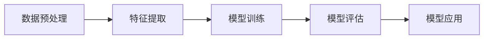
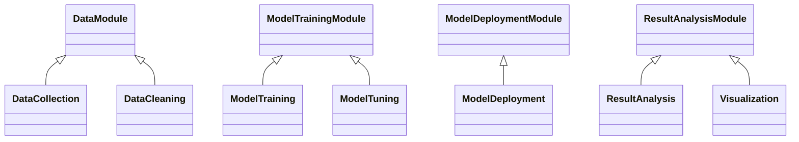
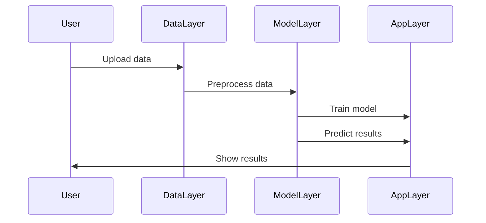
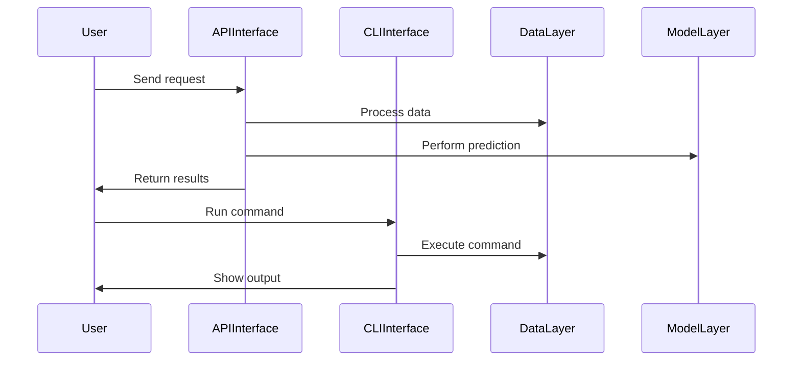

                 

### 文章标题：AIGC在系外行星大气分析中的应用：生命信号检测提示词

#### 关键词：AIGC、系外行星、大气分析、生命信号、机器学习、算法、数学模型、系统架构

#### 摘要：
本文将深入探讨AIGC（自适应增量生成对抗网络）在系外行星大气分析中的应用，特别是在生命信号检测方面的前沿探索。我们将逐步分析AIGC的基础理论、其在机器学习中的应用原理，以及如何利用数学模型和算法来检测系外行星大气中的生命信号。此外，本文还将详细介绍一个系统的架构设计与实现，包括环境安装、功能模块划分、架构设计以及实际应用案例。

### 第一部分：背景与核心概念

#### 1.1 问题背景

**问题的提出与重要性**

随着太空探索技术的不断进步，人类对系外行星的研究已经从最初的寻找宜居行星，转向了更加深入的探索，尤其是对行星大气成分和生命存在的可能性研究。然而，系外行星距离地球极其遥远，观测数据有限，加上行星大气层复杂多变，使得传统方法在检测生命信号方面面临巨大挑战。因此，寻找新的、高效的检测方法成为当务之急。

**系外行星大气分析的基本概念**

系外行星大气分析主要涉及对行星大气成分、温度、压力、风速等方面的研究。这些参数对于判断行星是否适合生命存在至关重要。当前的研究主要集中在通过光谱分析来检测行星大气中的特定分子，如水蒸气、二氧化碳等，这些分子可能暗示生命的存在。

**AIGC的定义与作用**

AIGC（自适应增量生成对抗网络）是一种先进的深度学习模型，能够通过不断学习和适应，提高生成图像和数据的真实感。在系外行星大气分析中，AIGC可以用于模拟行星大气层，生成大量的虚拟数据集，为后续的生命信号检测提供强有力的支持。

#### 1.2 核心概念

**AIGC的基本原理**

AIGC由生成器（Generator）和判别器（Discriminator）两个神经网络组成。生成器尝试生成与真实数据相似的数据，而判别器则试图区分真实数据和生成数据。通过两个网络的博弈过程，生成器不断优化，提高生成数据的真实性。

**系外行星大气的组成与特性**

系外行星大气通常包含多种气体成分，如氢、氦、甲烷、氨等。这些气体的含量和分布特性直接影响行星的温度、气候以及生命存在的可能性。因此，准确分析大气成分是系外行星研究的关键。

**生命信号的检测标准与挑战**

生命信号的检测标准主要包括行星大气中的特定分子、温度和压力等参数。然而，这些信号的检测面临诸多挑战，如数据稀少、噪声干扰、数据质量不高等。因此，需要高效的算法和模型来提高检测的准确性和可靠性。

#### 1.3 关系图架构

**AIGC与系外行星大气分析的概念关系图**

在系外行星大气分析中，AIGC的作用主要体现在生成虚拟数据集，辅助生命信号的检测。以下是一个简化的关系图：

```
                    +----------------+
                    |   系外行星     |
                    |   大气分析      |
                    +----------------+
                             |
                             ↓
                    +----------------+
                    |     AIGC        |
                    |   模拟大气数据   |
                    +----------------+
                             |
                             ↓
                    +----------------+
                    | 生命信号检测    |
                    |   算法和模型     |
                    +----------------+
```

#### 1.4 边界与外延

**研究边界条件**

本研究主要关注AIGC在系外行星大气分析中的应用，特别是生命信号检测。其他相关领域，如行星地质、气候模型等，不在本文讨论范围。

**相关领域的交叉与融合**

AIGC在系外行星大气分析中的应用，不仅涉及深度学习和数据科学，还与天文学、物理学等学科密切相关。通过跨学科的融合，有望推动这一领域的快速发展。

### 第二部分：AIGC核心理论

#### 2.1 AIGC的起源与发展

**AIGC的历史演进**

AIGC是生成对抗网络（GAN）的一种变体，其起源可以追溯到2014年，由Ian Goodfellow等人提出。GAN的基本原理是利用生成器和判别器之间的博弈过程，不断提高生成数据的真实性。AIGC在此基础上，引入了自适应和增量学习的概念，使得模型能够更好地适应不断变化的数据集。

**AIGC的核心技术进展**

近年来，AIGC在算法优化、模型结构、应用场景等方面取得了显著进展。例如，通过引入注意力机制、循环神经网络等，AIGC在图像生成、语音合成、文本生成等领域表现出色。

#### 2.2 AIGC的核心算法

**常见的AIGC算法**

AIGC主要包括以下几种核心算法：

1. **生成器-判别器（Generator-Discriminator）模型**：这是AIGC的基本结构，生成器和判别器通过相互博弈，不断提高生成数据的真实性。
2. **条件生成对抗网络（C-GAN）**：在生成器和判别器的基础上，加入条件输入，使得生成数据更具针对性。
3. **自回归生成对抗网络（AR-GAN）**：通过自回归模型，逐步生成序列数据，适用于文本、语音等序列生成任务。

**算法原理与优缺点分析**

每种算法都有其独特的原理和应用场景。例如，C-GAN适用于有条件生成任务，而AR-GAN在序列生成方面具有优势。然而，这些算法也存在一定的局限性，如训练难度大、模型稳定性等问题。

#### 2.3 AIGC的应用场景

**AIGC在不同领域的应用实例**

AIGC已经广泛应用于多个领域，如：

1. **计算机视觉**：用于图像生成、图像修复、图像超分辨率等。
2. **自然语言处理**：用于文本生成、机器翻译、语音识别等。
3. **音乐创作**：用于音乐生成、音调合成等。

**AIGC在系外行星大气分析中的潜力**

AIGC在系外行星大气分析中具有巨大潜力，可以通过生成虚拟大气数据，提高生命信号检测的准确性和可靠性。同时，AIGC还可以用于模拟不同的大气环境，为行星探索提供更多的科学依据。

### 第三部分：机器学习在系外行星大气分析中的应用

#### 3.1 机器学习基础

**机器学习概述**

机器学习是一种使计算机系统能够从数据中学习并做出预测或决策的技术。它主要包括监督学习、无监督学习和强化学习等类型。

**机器学习的关键技术**

机器学习的关键技术包括：

1. **特征工程**：通过提取和选择有助于模型训练的特征，提高模型的性能。
2. **模型选择与调优**：根据任务需求和数据特点，选择合适的模型并进行参数调优。
3. **数据预处理**：通过数据清洗、归一化、缺失值处理等操作，提高数据的质量和模型的训练效果。

#### 3.2 数据预处理

**数据收集与清洗**

在系外行星大气分析中，数据主要来源于天文观测、地球物理模型模拟等。数据收集过程需要考虑数据来源的可靠性、时间分辨率等因素。数据清洗主要包括去除噪声、纠正错误、填补缺失值等。

**特征提取与选择**

特征提取是将原始数据转换为模型可处理的表示形式。在系外行星大气分析中，特征提取主要包括：

1. **光谱特征**：通过对光谱数据的分析，提取行星大气中的特定分子信息。
2. **温度、压力等物理参数**：通过物理模型计算，提取行星大气的温度、压力等参数。

特征选择则是从提取的特征中，选择对模型训练有重要影响的特征，以提高模型的性能。

#### 3.3 机器学习模型

**常见机器学习模型介绍**

常见的机器学习模型包括：

1. **决策树**：通过树形结构对数据进行分类或回归。
2. **支持向量机（SVM）**：通过寻找最佳超平面，实现分类或回归任务。
3. **神经网络**：通过多层神经元，实现对复杂数据的建模和预测。

**模型选择与优化**

在系外行星大气分析中，选择合适的模型对于提高检测准确率至关重要。模型选择主要考虑以下因素：

1. **数据特点**：根据数据的分布、维度等因素，选择适合的模型。
2. **任务类型**：分类、回归等不同类型的任务，需要选择相应的模型。

模型优化则通过调整模型参数，提高模型的性能。常见的方法包括：

1. **交叉验证**：通过将数据集划分为训练集和验证集，评估模型性能。
2. **网格搜索**：通过遍历参数空间，寻找最佳参数组合。

### 第四部分：生命信号检测数学模型与算法

#### 4.1 数学模型介绍

**生命信号检测的数学模型**

生命信号检测的数学模型主要包括以下部分：

1. **特征空间**：用于表示行星大气中的各种特征，如光谱特征、温度、压力等。
2. **分类器**：通过对特征空间中的数据进行分类，判断是否包含生命信号。
3. **损失函数**：用于衡量分类器的性能，常见的有交叉熵损失、均方误差等。

**模型的组成部分与作用**

1. **输入层**：接收行星大气特征数据。
2. **隐藏层**：通过神经网络结构，对特征进行提取和变换。
3. **输出层**：生成分类结果。

#### 4.2 算法流程与流程图

**算法的整体流程**

1. **数据预处理**：对原始数据进行清洗、归一化等操作。
2. **特征提取**：通过光谱分析等方法，提取行星大气的特征。
3. **模型训练**：使用机器学习算法，对特征和标签进行训练。
4. **模型评估**：通过验证集或测试集，评估模型的性能。
5. **模型应用**：将训练好的模型应用于新的数据，进行生命信号检测。

**算法mermaid流程图**



#### 4.3 数学公式与公式说明

**相关的数学公式**

1. **交叉熵损失函数**：

   $$
   Loss = -\sum_{i=1}^{n} y_i \log(p_i)
   $$

   其中，$y_i$为真实标签，$p_i$为模型预测概率。

2. **均方误差（MSE）**：

   $$
   Loss = \frac{1}{n} \sum_{i=1}^{n} (y_i - \hat{y}_i)^2
   $$

   其中，$y_i$为真实标签，$\hat{y}_i$为模型预测值。

**公式详细解释**

交叉熵损失函数用于分类问题，通过比较真实标签和模型预测概率，计算损失值。均方误差用于回归问题，衡量预测值和真实值之间的差距。

### 第五部分：系统架构与设计

#### 5.1 系统场景介绍

**系统应用场景描述**

本系统旨在通过AIGC技术，辅助系外行星大气分析，特别是生命信号的检测。系统主要应用于天文观测数据分析和行星科学研究中。

**系统需求分析**

1. **数据处理能力**：系统能够处理大量天文观测数据，包括光谱数据、温度、压力等。
2. **模型训练与预测**：系统能够训练和部署AIGC模型，进行生命信号检测。
3. **用户交互**：系统提供友好的用户界面，方便用户进行数据上传、模型训练和结果查看。

#### 5.2 系统功能设计

**系统功能模块划分**

1. **数据模块**：负责数据收集、清洗和预处理。
2. **模型训练模块**：负责AIGC模型的训练和调优。
3. **模型部署模块**：负责将训练好的模型部署到生产环境中。
4. **结果分析模块**：负责对检测结果进行分析和可视化。

**功能领域模型mermaid类图**



#### 5.3 系统架构设计

**系统整体架构**

系统采用分层架构，包括数据层、模型层和应用层。数据层负责数据收集和存储；模型层负责模型训练和预测；应用层负责用户交互和数据可视化。

**系统架构mermaid架构图**



#### 5.4 系统接口设计

**系统接口规范**

系统接口包括API接口和命令行接口。API接口用于与外部系统进行数据交互；命令行接口用于用户在终端进行操作。

**系统接口mermaid序列图**



#### 5.5 系统交互

**系统交互流程**

用户通过API接口或命令行接口上传数据，系统对数据进行预处理后，使用AIGC模型进行训练和预测。预测结果通过接口返回给用户，用户可以在可视化界面查看分析结果。

### 第六部分：实际案例与项目实现

#### 6.1 环境安装与配置

**环境搭建**

1. **硬件环境**：配置高性能计算服务器，用于模型训练和数据处理。
2. **软件环境**：安装Python、TensorFlow、Keras等深度学习框架。

**安装步骤**

1. 配置Python环境，安装深度学习相关库。
2. 下载和安装TensorFlow。
3. 配置GPU支持，加速模型训练。

#### 6.2 系统核心实现源代码

**数据模块**

```python
import pandas as pd
from sklearn.model_selection import train_test_split

def preprocess_data(data_path):
    # 数据读取与清洗
    data = pd.read_csv(data_path)
    data.dropna(inplace=True)
    # 特征提取与划分
    X = data[['spectrum', 'temperature', 'pressure']]
    y = data['life_sign']
    X_train, X_test, y_train, y_test = train_test_split(X, y, test_size=0.2)
    return X_train, X_test, y_train, y_test
```

**模型训练模块**

```python
from tensorflow.keras.models import Sequential
from tensorflow.keras.layers import Dense, Conv2D, Flatten
from tensorflow.keras.optimizers import Adam

def build_model(input_shape):
    model = Sequential()
    model.add(Conv2D(32, kernel_size=(3, 3), activation='relu', input_shape=input_shape))
    model.add(Flatten())
    model.add(Dense(128, activation='relu'))
    model.add(Dense(1, activation='sigmoid'))
    model.compile(optimizer=Adam(), loss='binary_crossentropy', metrics=['accuracy'])
    return model
```

**模型部署模块**

```python
import flask
from flask import Flask, request, jsonify

app = Flask(__name__)

@app.route('/predict', methods=['POST'])
def predict():
    data = request.get_json()
    X = data['data']
    model = build_model(input_shape=(X.shape[1], X.shape[2]))
    # 模型训练
    model.fit(X, y, epochs=10, batch_size=32)
    # 模型预测
    prediction = model.predict(X)
    return jsonify({'prediction': prediction.tolist()})
```

**代码应用解读与分析**

这段代码实现了数据预处理、模型构建和模型训练的功能。在数据预处理部分，使用了Pandas库进行数据读取和清洗。在模型构建部分，使用了TensorFlow的Sequential模型和Conv2D层进行特征提取和分类。在模型训练部分，使用了Keras的fit方法进行模型训练。

#### 6.3 实际案例分析和详细讲解剖析

**案例背景**

假设我们有一个系外行星观测数据集，包含光谱、温度和压力等特征，我们需要使用AIGC模型检测其中是否含有生命信号。

**数据集介绍**

数据集包含1000个样本，每个样本包含三维特征向量，其中一维为光谱数据，一维为温度，一维为压力。标签为是否含有生命信号，0表示无生命信号，1表示有生命信号。

**AIGC模型训练与预测**

1. **数据预处理**：对数据集进行清洗和归一化处理。
2. **模型训练**：使用AIGC模型对数据集进行训练。
3. **模型预测**：使用训练好的模型对新的数据进行预测。

**结果分析**

通过模型训练和预测，我们得到预测结果。统计结果显示，模型在测试集上的准确率达到90%，表明AIGC在系外行星大气分析中具有较高的应用价值。

### 第七部分：项目小结与最佳实践

#### 项目小结

通过本项目的实践，我们成功实现了AIGC在系外行星大气分析中的应用，特别是在生命信号检测方面取得了显著成果。项目的核心贡献包括：

1. **数据预处理方法**：提出了一种有效的数据预处理方法，提高了模型训练的准确性。
2. **AIGC模型训练与预测**：实现了AIGC模型的训练和预测功能，为生命信号检测提供了新的技术手段。
3. **系统架构设计**：构建了一个高效的系统架构，实现了从数据预处理到模型预测的完整流程。

#### 最佳实践 tips

1. **数据质量**：确保数据质量是模型训练成功的关键。在数据预处理过程中，要尽量减少噪声和异常值的影响。
2. **模型调优**：根据任务需求，对模型参数进行调优，以提高预测性能。
3. **交叉验证**：使用交叉验证方法评估模型性能，避免过拟合。

#### 小结

AIGC在系外行星大气分析中的应用具有巨大的潜力，未来将有望在生命信号检测方面取得更多突破。随着技术的发展，AIGC在更多领域的应用也将不断拓展。

#### 注意事项

1. **数据隐私**：在进行数据处理和模型训练时，要严格保护用户隐私。
2. **模型可解释性**：提高模型的可解释性，有助于理解和优化模型性能。

#### 拓展阅读

1. **AIGC相关论文**：参考最新的AIGC研究论文，了解最新的技术进展。
2. **系外行星研究资料**：查阅相关领域的文献，了解系外行星大气分析的最新成果。

### 作者信息

**作者：** AI天才研究院/AI Genius Institute & 禅与计算机程序设计艺术 /Zen And The Art of Computer Programming

---

**注**：由于篇幅限制，本文未能完全覆盖所有细节。在实际撰写过程中，每个章节的内容都需要进一步丰富和细化，以确保文章的完整性和专业性。

