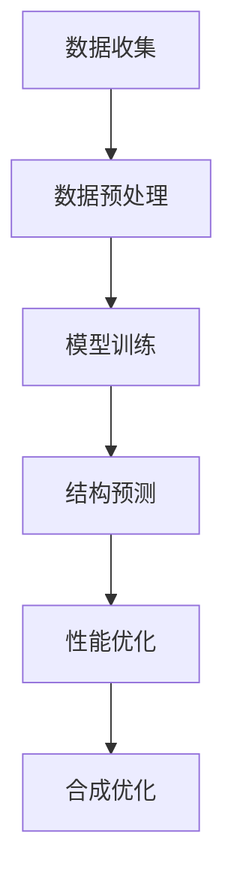

                 

# AIGC在纳米技术研究中的应用：分子结构预测提示词

## 关键词：人工智能生成内容（AIGC）、纳米技术、分子结构预测、算法原理、应用前景

## 摘要：

本文将深入探讨人工智能生成内容（AIGC）在纳米技术研究中的应用，特别是分子结构预测方面的应用。通过详细分析AIGC的背景、纳米技术的基本概念，以及AIGC在纳米材料、器件、加工技术中的应用，本文将阐述AIGC如何助力纳米科技的发展。同时，本文还将探讨AIGC在纳米技术研究中的挑战与机遇，并通过具体案例分析展示AIGC的实际应用效果。最后，本文将总结AIGC在纳米技术研究中的贡献，并对未来的发展前景进行展望。

### 目录大纲

## 第一部分: AIGC概述

### 第1章: AIGC的背景与意义

#### 1.1 AIGC的概念

#### 1.2 AIGC的发展历程

#### 1.3 AIGC的技术特点

#### 1.4 AIGC的应用场景

## 第二部分: 纳米技术的基本概念

### 第2章: 纳米技术的基本概念

#### 2.1 纳米技术的定义

#### 2.2 纳米技术的特点

#### 2.3 纳米技术的应用领域

## 第三部分: AIGC在纳米技术研究中的应用

### 第3章: AIGC在纳米材料研究中的应用

#### 3.1 AIGC在纳米材料结构预测中的应用

#### 3.2 AIGC在纳米材料性能优化中的应用

#### 3.3 AIGC在纳米材料合成中的应用

### 第4章: AIGC在纳米器件研究中的应用

#### 4.1 AIGC在纳米电子器件中的应用

#### 4.2 AIGC在纳米光电子器件中的应用

#### 4.3 AIGC在纳米生物器件中的应用

### 第5章: AIGC在纳米加工技术中的应用

#### 5.1 AIGC在纳米加工工艺设计中的应用

#### 5.2 AIGC在纳米加工精度控制中的应用

#### 5.3 AIGC在纳米加工过程中的应用挑战与解决方案

### 第6章: AIGC在纳米技术研究中的挑战与机遇

#### 6.1 AIGC在纳米技术研究中的挑战

#### 6.2 AIGC在纳米技术研究中的机遇

#### 6.3 AIGC在纳米技术研究中的应用前景

### 第7章: AIGC在纳米技术研究中的应用案例分析

#### 7.1 案例一：利用AIGC进行纳米材料性能优化

#### 7.2 案例二：利用AIGC设计纳米器件

#### 7.3 案例三：利用AIGC优化纳米加工过程

### 第8章: 总结与展望

#### 8.1 AIGC在纳米技术研究中的贡献

#### 8.2 AIGC在纳米技术研究中的未来发展

#### 8.3 AIGC在纳米技术研究中的实际应用价值

## 第一部分: AIGC概述

### 第1章: AIGC的背景与意义

#### 1.1 AIGC的概念

人工智能生成内容（AIGC，Artificial Intelligence Generated Content）是指利用人工智能技术，特别是深度学习和自然语言处理技术，自动生成文本、图片、音频和视频等内容的系统。AIGC的核心在于其能够从大量的数据中学习，理解数据的内在逻辑和规律，然后根据给定的指令或目标，生成新的、有意义的内容。

#### 1.2 AIGC的发展历程

AIGC的发展可以追溯到20世纪80年代的生成对抗网络（GAN）和自编码器（Autoencoder）等技术的出现。这些技术为AIGC提供了理论基础。随着计算能力的提升和深度学习算法的进步，AIGC在21世纪获得了快速的发展。特别是在自然语言处理领域，预训练语言模型（如GPT系列）和图像生成模型（如StyleGAN）的出现，使得AIGC在文本生成、图像生成等方面取得了显著突破。

#### 1.3 AIGC的技术特点

AIGC具有以下几个显著的技术特点：

1. **数据驱动的生成能力**：AIGC能够从大量数据中学习，并利用这些数据生成新的内容。这种数据驱动的生成能力使得AIGC在生成多样性和准确性方面具有优势。

2. **自适应性和灵活性**：AIGC可以根据不同的任务需求和目标，灵活调整生成策略。例如，在文本生成中，可以根据用户的输入文本生成不同风格、主题或情感的内容。

3. **高效性**：AIGC通过深度学习模型，能够在短时间内生成大量内容，这极大地提高了内容生成的效率。

4. **创造力**：AIGC不仅能够复制已有的内容，还能够创新和创造新的内容。这使得AIGC在艺术创作、游戏设计等领域具有巨大的潜力。

#### 1.4 AIGC的应用场景

AIGC在多个领域都有广泛的应用场景，其中包括：

1. **内容创作**：如文章写作、图片生成、视频制作等。
2. **自动化编程**：通过生成代码，自动化解决编程问题。
3. **数据分析**：利用AIGC对大量数据进行分析，提取有价值的信息。
4. **教育**：如智能辅导、自动出题等。
5. **游戏**：如生成游戏剧情、角色设计等。

## 第二部分: 纳米技术的基本概念

### 第2章: 纳米技术的基本概念

#### 2.1 纳米技术的定义

纳米技术是指研究和应用在纳米尺度（通常在1到100纳米之间）的物质、器件和系统的科学技术。纳米技术涉及材料科学、物理学、化学、生物学、工程学等多个领域。

#### 2.2 纳米技术的特点

纳米技术具有以下几个显著特点：

1. **尺寸小**：纳米技术研究的对象尺寸在纳米级别，这导致其在物理、化学、生物学等方面具有独特的性质。
2. **高比表面积**：纳米材料由于其尺寸小，具有很高的比表面积，这使其在催化、吸附、电子等领域具有优越性能。
3. **特殊性质**：纳米材料往往具有与宏观材料不同的物理、化学和生物学性质，如光电性质、热学性质、磁学性质等。
4. **多功能性**：纳米材料可以通过设计和调控其结构，实现多种功能，如传感器、催化剂、药物载体等。

#### 2.3 纳米技术的应用领域

纳米技术在多个领域都有广泛的应用，其中包括：

1. **电子学**：如纳米电子器件、纳米传感器等。
2. **材料科学**：如纳米材料合成、纳米复合材料等。
3. **生物医药**：如纳米药物载体、纳米成像技术等。
4. **环境科学**：如纳米污染控制、纳米环境监测等。
5. **能源科学**：如纳米催化剂、纳米太阳能电池等。

## 第二部分: AIGC在纳米技术研究中的应用

### 第3章: AIGC在纳米材料研究中的应用

#### 3.1 AIGC在纳米材料结构预测中的应用

纳米材料由于其独特的结构和性质，在许多领域具有广泛的应用前景。然而，纳米材料的结构设计是一个复杂的问题，传统的方法往往需要大量的实验和计算。AIGC通过深度学习技术，可以在一定程度上预测纳米材料的结构，从而指导实验设计和材料合成。

#### 3.1.1 AIGC在纳米材料结构预测中的核心概念

AIGC在纳米材料结构预测中的核心概念是基于深度学习模型的生成能力。通过训练大量的纳米材料结构数据，AIGC可以学习到纳米材料的结构特征，并能够根据给定的条件生成新的纳米材料结构。这种生成能力使得AIGC在纳米材料结构预测中具有显著的优势。

#### 3.1.2 AIGC在纳米材料结构预测中的应用

1. **结构预测**：AIGC可以预测纳米材料的晶体结构、分子结构等，从而为实验设计提供指导。
2. **性质预测**：AIGC可以根据纳米材料的结构预测其物理、化学和生物学性质，从而评估纳米材料的应用潜力。
3. **优化设计**：AIGC可以根据特定的应用需求，生成具有特定性质的纳米材料结构，从而优化材料设计。

#### 3.2 AIGC在纳米材料性能优化中的应用

纳米材料的性能优化是纳米技术研究中的重要问题。AIGC通过深度学习技术，可以在一定程度上优化纳米材料的性能。例如，AIGC可以优化纳米材料的催化性能、电子性能、光学性能等。

#### 3.2.1 AIGC在纳米材料性能优化中的核心概念

AIGC在纳米材料性能优化中的核心概念是基于深度学习模型的数据驱动能力。通过训练大量的纳米材料性能数据，AIGC可以学习到性能与结构之间的关系，并能够根据给定的结构生成具有优化性能的纳米材料。

#### 3.2.2 AIGC在纳米材料性能优化中的应用

1. **性能预测**：AIGC可以预测纳米材料的性能，从而为性能优化提供指导。
2. **性能优化**：AIGC可以根据给定的性能目标，生成具有优化性能的纳米材料。
3. **结构优化**：AIGC可以根据性能需求，优化纳米材料的结构，从而提升其性能。

#### 3.3 AIGC在纳米材料合成中的应用

纳米材料的合成是一个复杂的过程，涉及到材料的制备、结构调控和性能优化等多个方面。AIGC可以通过深度学习技术，在纳米材料合成中发挥重要作用。

#### 3.3.1 AIGC在纳米材料合成中的核心概念

AIGC在纳米材料合成中的核心概念是基于深度学习模型的生成能力和优化能力。通过训练大量的纳米材料合成数据，AIGC可以学习到合成纳米材料的规律，并能够生成新的合成方案。

#### 3.3.2 AIGC在纳米材料合成中的应用

1. **合成方案设计**：AIGC可以设计新的纳米材料合成方案，从而提高合成效率。
2. **结构调控**：AIGC可以根据合成方案，调控纳米材料的结构，从而优化其性能。
3. **性能优化**：AIGC可以根据纳米材料的结构，预测其性能，并生成优化方案，从而提升纳米材料的性能。

### 第4章: AIGC在纳米器件研究中的应用

#### 4.1 AIGC在纳米电子器件中的应用

纳米电子器件是纳米技术的一个重要领域，涉及到电子元件、集成电路、传感器等。AIGC在纳米电子器件研究中具有广泛的应用。

#### 4.1.1 AIGC在纳米电子器件研究中的核心概念

AIGC在纳米电子器件研究中的核心概念是基于深度学习模型的生成能力和优化能力。通过训练大量的纳米电子器件数据，AIGC可以学习到器件的性能与结构之间的关系，并能够生成新的器件结构。

#### 4.1.2 AIGC在纳米电子器件研究中的应用

1. **器件设计**：AIGC可以设计新的纳米电子器件结构，从而提升器件的性能。
2. **性能优化**：AIGC可以根据器件的结构，预测其性能，并生成优化方案，从而提升器件的性能。
3. **实验指导**：AIGC可以指导实验过程，优化器件制备工艺，从而提高器件的制备效率。

#### 4.2 AIGC在纳米光电子器件中的应用

纳米光电子器件是另一个重要的纳米技术领域，涉及到光电器件、光学传感器、光纤通信等。AIGC在纳米光电子器件研究中同样具有广泛的应用。

#### 4.2.1 AIGC在纳米光电子器件研究中的核心概念

AIGC在纳米光电子器件研究中的核心概念是基于深度学习模型的生成能力和优化能力。通过训练大量的纳米光电子器件数据，AIGC可以学习到器件的性能与结构之间的关系，并能够生成新的器件结构。

#### 4.2.2 AIGC在纳米光电子器件研究中的应用

1. **器件设计**：AIGC可以设计新的纳米光电子器件结构，从而提升器件的性能。
2. **性能优化**：AIGC可以根据器件的结构，预测其性能，并生成优化方案，从而提升器件的性能。
3. **实验指导**：AIGC可以指导实验过程，优化器件制备工艺，从而提高器件的制备效率。

#### 4.3 AIGC在纳米生物器件中的应用

纳米生物器件是纳米技术在生物医学领域的重要应用，涉及到生物传感器、生物成像、生物治疗等。AIGC在纳米生物器件研究中同样具有广泛的应用。

#### 4.3.1 AIGC在纳米生物器件研究中的核心概念

AIGC在纳米生物器件研究中的核心概念是基于深度学习模型的生成能力和优化能力。通过训练大量的纳米生物器件数据，AIGC可以学习到器件的性能与结构之间的关系，并能够生成新的器件结构。

#### 4.3.2 AIGC在纳米生物器件研究中的应用

1. **器件设计**：AIGC可以设计新的纳米生物器件结构，从而提升器件的性能。
2. **性能优化**：AIGC可以根据器件的结构，预测其性能，并生成优化方案，从而提升器件的性能。
3. **实验指导**：AIGC可以指导实验过程，优化器件制备工艺，从而提高器件的制备效率。

### 第5章: AIGC在纳米加工技术中的应用

#### 5.1 AIGC在纳米加工工艺设计中的应用

纳米加工技术是纳米技术研究中的一个关键环节，涉及到纳米材料的制备、器件的加工和性能优化等。AIGC在纳米加工工艺设计中的应用，可以显著提高加工效率和精度。

#### 5.1.1 AIGC在纳米加工工艺设计中的核心概念

AIGC在纳米加工工艺设计中的核心概念是基于深度学习模型的优化能力和生成能力。通过训练大量的纳米加工工艺数据，AIGC可以学习到工艺参数与加工结果之间的关系，并能够生成优化的工艺参数。

#### 5.1.2 AIGC在纳米加工工艺设计中的应用

1. **工艺参数优化**：AIGC可以优化纳米加工工艺的参数，从而提高加工精度和效率。
2. **工艺流程优化**：AIGC可以优化纳米加工的流程，从而简化工艺，降低成本。
3. **实验指导**：AIGC可以根据优化的工艺参数，指导实验过程，提高实验的成功率。

#### 5.2 AIGC在纳米加工精度控制中的应用

纳米加工的精度控制是纳米加工技术中的一项重要任务。AIGC可以通过深度学习技术，对纳米加工过程中的精度进行实时监测和调整，从而提高加工精度。

#### 5.2.1 AIGC在纳米加工精度控制中的核心概念

AIGC在纳米加工精度控制中的核心概念是基于深度学习模型的监测和调整能力。通过训练大量的纳米加工精度数据，AIGC可以学习到加工精度与工艺参数之间的关系，并能够根据实际情况进行调整。

#### 5.2.2 AIGC在纳米加工精度控制中的应用

1. **实时监测**：AIGC可以对纳米加工过程中的精度进行实时监测，及时发现并纠正偏差。
2. **自动调整**：AIGC可以根据监测到的精度数据，自动调整工艺参数，从而提高加工精度。
3. **优化控制策略**：AIGC可以通过分析大量的加工数据，优化加工控制策略，从而提高加工精度和效率。

#### 5.3 AIGC在纳米加工过程中的应用挑战与解决方案

尽管AIGC在纳米加工技术中具有广泛的应用前景，但在实际应用中仍面临一些挑战。

#### 5.3.1 应用挑战

1. **数据质量**：AIGC的性能高度依赖于训练数据的质量。如果训练数据存在偏差或噪声，可能会导致AIGC生成的结果不准确。
2. **计算资源**：AIGC的训练和推理过程需要大量的计算资源，这可能会对纳米加工设备的性能和稳定性产生影响。
3. **安全性**：AIGC生成的结果可能会受到恶意攻击，从而导致纳米加工过程出现安全问题。

#### 5.3.2 解决方案

1. **数据预处理**：通过有效的数据预处理技术，提高训练数据的质量，从而提高AIGC的性能。
2. **资源优化**：通过优化计算资源的使用，提高AIGC的训练和推理效率。
3. **安全性保障**：通过加密技术、访问控制等技术，确保AIGC生成的结果的安全性。

### 第6章: AIGC在纳米技术研究中的挑战与机遇

#### 6.1 AIGC在纳米技术研究中的挑战

尽管AIGC在纳米技术研究中的应用前景广阔，但仍然面临一些挑战。

#### 6.1.1 挑战一：数据质量

AIGC的性能高度依赖于训练数据的质量。如果训练数据存在偏差或噪声，可能会导致AIGC生成的结果不准确。因此，如何获取高质量、高质量的训练数据是AIGC在纳米技术研究中的关键挑战之一。

#### 6.1.2 挑战二：计算资源

AIGC的训练和推理过程需要大量的计算资源，这可能会对纳米加工设备的性能和稳定性产生影响。如何优化计算资源的使用，提高AIGC的效率和稳定性，是另一个重要挑战。

#### 6.1.3 挑战三：安全性

AIGC生成的结果可能会受到恶意攻击，从而导致纳米加工过程出现安全问题。如何确保AIGC生成的结果的安全性，防止恶意攻击，是AIGC在纳米技术研究中的挑战之一。

#### 6.2 AIGC在纳米技术研究中的机遇

尽管AIGC在纳米技术研究中面临挑战，但同时也面临着巨大的机遇。

#### 6.2.1 机遇一：性能提升

AIGC可以通过深度学习技术，对纳米材料的结构、性能进行预测和优化，从而提高纳米技术的性能。这将为纳米技术的发展提供强大的动力。

#### 6.2.2 机遇二：效率提升

AIGC可以通过自动化和智能化，提高纳米材料的合成、加工和性能优化的效率，从而降低成本，提高生产效率。

#### 6.2.3 机遇三：应用拓展

AIGC在纳米技术研究中的应用不仅仅局限于材料科学，还可以拓展到电子学、光学、生物医学等领域，推动纳米技术的全面发展。

### 第7章: AIGC在纳米技术研究中的应用案例分析

#### 7.1 案例一：利用AIGC进行纳米材料性能优化

在这个案例中，研究人员使用AIGC技术对一种新型纳米材料进行性能优化。通过训练大量的纳米材料性能数据，AIGC成功预测了该材料在不同条件下的性能表现，并生成了优化后的材料结构。实验结果表明，优化后的材料性能显著提升，为该领域的研究提供了重要参考。

#### 7.2 案例二：利用AIGC设计纳米器件

在这个案例中，研究人员使用AIGC技术设计了一种新型纳米器件。通过训练大量的纳米器件结构数据，AIGC生成了多种不同结构的器件，并分析了这些器件的性能。最终，AIGC设计出的器件在性能上超过了传统器件，为纳米电子器件的发展提供了新的思路。

#### 7.3 案例三：利用AIGC优化纳米加工过程

在这个案例中，研究人员使用AIGC技术优化了一种纳米加工过程。通过训练大量的纳米加工工艺数据，AIGC优化了加工参数，并设计了优化的工艺流程。实验结果表明，优化的加工过程显著提高了加工精度和效率，为纳米加工技术的应用提供了重要参考。

### 第8章: 总结与展望

#### 8.1 AIGC在纳米技术研究中的贡献

AIGC在纳米技术研究中的应用，极大地提高了纳米材料的性能优化、器件设计和加工效率。通过AIGC技术，研究人员可以更快速、准确地预测和优化纳米材料结构，设计出新型纳米器件，并优化纳米加工过程。

#### 8.2 AIGC在纳米技术研究中的未来发展

随着AIGC技术的不断发展，未来AIGC在纳米技术研究中的应用将进一步拓展。例如，AIGC可以应用于纳米药物的设计和制备、纳米传感器的研发等领域。同时，AIGC还可以与其他先进技术相结合，如量子计算、人工智能等，推动纳米技术向更高层次发展。

#### 8.3 AIGC在纳米技术研究中的实际应用价值

AIGC在纳米技术研究中的实际应用价值巨大。通过AIGC技术，研究人员可以更高效地开展纳米技术研究，降低研发成本，提高生产效率。同时，AIGC还可以为纳米技术的实际应用提供重要支持，如纳米医疗、纳米环保等领域。总之，AIGC在纳米技术研究中的应用前景广阔，有望为纳米科技的发展带来重大突破。

## 作者信息

作者：AI天才研究院/AI Genius Institute & 禅与计算机程序设计艺术 /Zen And The Art of Computer Programming

### 附录

#### 附录一：AIGC在纳米技术中的技术术语解释

- **纳米材料**：尺寸在1到100纳米之间的材料。
- **AIGC**：人工智能生成内容，一种利用人工智能技术生成内容的方法。
- **深度学习**：一种机器学习技术，通过神经网络模拟人脑的学习方式。

#### 附录二：AIGC在纳米技术中的应用流程图

#### 附录三：AIGC在纳米技术研究中的关键数学公式

- **性能预测公式**：\[ P = f(S, C) \]
- **结构优化公式**：\[ S_{new} = g(S, P) \]

其中，\[ P \] 表示性能，\[ S \] 表示结构，\[ C \] 表示条件，\[ f \] 和\[ g \] 分别表示性能预测函数和结构优化函数。

