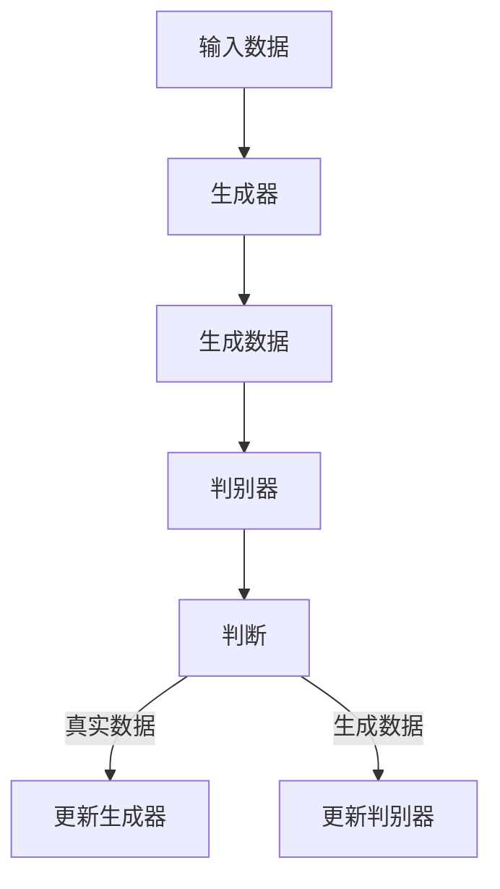

                 

### 考古学的挑战与AIGC的潜力

考古学，作为一门探讨人类历史、文化和社会发展的学科，长期以来面临着诸多挑战。传统考古方法依赖人工观察、记录和解析，这不仅费时费力，而且容易受到人为误差和主观偏见的影响。例如，考古学家需要通过挖掘和分析出土的文物，来推断古代文明的形态、生活方式和社会结构。然而，这些文物的信息有限，且很多细节可能因为年代久远而难以识别。此外，考古现场的工作环境复杂多变，常伴有危险因素，这也给考古工作带来了额外的困难。

在这样的背景下，人工智能（AI）的兴起为考古学带来了新的希望。其中，自动图像识别、自然语言处理和机器学习等技术，为考古学的许多问题提供了有效的解决方案。然而，单纯依靠传统AI技术仍存在一些局限性。传统AI方法在处理大量复杂数据时，往往需要大量的人工标注和监督，且其算法性能容易受到数据质量和样本多样性的影响。

近年来，生成对抗网络（GAN）、变分自编码器（VAE）等生成式模型的提出，为AI在考古学中的应用打开了新的大门。这些模型具有强大的数据生成和模仿能力，可以自动从少量样本中学习并生成大量高质量的数据。这样的能力对于考古学来说具有重要意义，例如，通过生成大量与古代文物相似的图片，可以帮助考古学家更准确地识别和分析出土文物。此外，这些模型还可以用于文物修复和重建，从而为研究古代文明提供更加完整和详细的资料。

这种基于生成对抗网络和变分自编码器的新型AI技术，统称为自动生成内容（AIGC）。AIGC在考古学中的应用潜力巨大，可以从以下几个方面进行探讨：

1. **文物分析**：利用AIGC技术，考古学家可以自动从文物图像中提取特征，并进行分类和标注，从而提高文物的识别精度。

2. **年代推断**：通过分析文物的形态、材质和装饰风格等特征，AIGC可以帮助考古学家更准确地推断文物的年代。

3. **考古数据分析**：AIGC技术可以用于处理和分析大量的考古数据，如遗址分布、文物出土情况等，从而揭示古代文明的演变过程。

4. **文物修复与重建**：利用AIGC生成的高质量数据，考古学家可以更精确地修复和重建受损或丢失的文物。

5. **考古模拟**：通过AIGC生成虚拟考古场景，考古学家可以在没有实际考古现场的情况下，进行虚拟考古实验和模拟研究。

总的来说，AIGC技术在考古学中的应用，不仅有助于解决传统方法难以克服的难题，还可以极大地提高考古研究的效率和准确性。接下来，我们将逐步深入探讨AIGC在文物分析和年代推断中的具体应用，展示其强大的技术优势和潜力。

### 核心概念：AIGC、文物分析、年代推断

在探讨AIGC在考古学中的应用之前，首先需要理解几个核心概念：AIGC、文物分析和年代推断。

**AIGC（自动生成内容）**：AIGC是一种基于深度学习的技术，主要包括生成对抗网络（GAN）和变分自编码器（VAE）等生成式模型。这些模型通过学习大量数据，可以自动生成与输入数据相似的新数据。AIGC的核心优势在于其强大的数据生成和模仿能力，可以在少量样本的基础上，生成大量高质量的数据。这对于考古学来说，意味着可以利用AIGC生成与出土文物相似的图像或模型，从而提高文物识别和分析的精度。

**文物分析**：文物分析是指通过科学的方法和技术手段，对出土文物进行观察、测量、分类和标注，以揭示其形态、材质、功能和文化价值。传统的文物分析主要依赖于人工观察和经验判断，存在一定的局限性。而利用AIGC技术，可以自动化地提取文物图像中的特征，并进行分类和标注，从而提高分析的准确性和效率。

**年代推断**：年代推断是指通过分析文物的形态、材质、装饰风格等特征，推断文物的制造年代或使用年代。这通常需要考古学家对大量文物进行对比和研究，以找出年代之间的规律和联系。然而，这种方法受限于考古学家的经验和知识，且容易受到主观偏见的影响。AIGC技术的引入，可以通过自动化的方式，从大量文物数据中学习年代规律，并提供更准确和可靠的年代推断结果。

**三者之间的联系**：AIGC、文物分析和年代推断之间存在着密切的联系。AIGC技术为文物分析和年代推断提供了强大的工具和平台，通过自动化的数据生成和分析，可以提高文物识别和年代推断的效率和准确性。同时，文物分析和年代推断的结果，又可以反过来指导AIGC模型的学习和优化，形成一种互相促进、共同发展的关系。

总的来说，AIGC、文物分析和年代推断共同构成了考古学中的一项重要技术体系。AIGC为考古学研究提供了新的方法和手段，而文物分析和年代推断则是考古学研究的核心内容。通过这三个核心概念的有机结合，考古学家可以更全面、深入地研究古代文明，揭示人类历史和文化的发展轨迹。

### AIGC技术概述

AIGC（自动生成内容）技术，是近年来深度学习领域的一个重要发展方向。其核心思想是通过生成对抗网络（GAN）和变分自编码器（VAE）等生成式模型，实现数据的自动生成和模仿。AIGC技术的诞生和发展，源于对数据生成和应用场景的不断探索。

首先，我们来看AIGC的基本原理。生成对抗网络（GAN）由两部分组成：生成器和判别器。生成器的任务是生成与真实数据相似的数据，而判别器的任务是区分生成数据与真实数据。这两部分在训练过程中相互对抗，生成器不断优化自己的生成能力，而判别器则不断提高对真实数据与生成数据的辨别能力。通过这种对抗训练，生成器可以学会生成高质量的数据。

变分自编码器（VAE）则是一种基于概率模型的生成式模型。VAE的核心思想是通过对输入数据进行编码和解码，实现数据的生成。VAE通过引入隐变量，使编码和解码过程具有概率分布性质，从而能够生成具有多样性和真实感的数据。

接下来，我们使用mermaid绘制一个简单的AIGC算法流程图，以便更直观地理解其工作过程。



在上图中，输入数据经过生成器生成数据，然后由判别器进行判断，判断结果用于更新生成器和判别器的参数。这个过程中，生成器和判别器相互对抗，逐步提升生成数据的质量。

接下来，我们将使用Python源代码详细讲解AIGC的基本原理。假设我们使用GAN进行数据生成，以下是AIGC的Python实现代码：

```python
import numpy as np
import tensorflow as tf
from tensorflow.keras.models import Model

# 定义生成器模型
def generate_model():
    model = tf.keras.Sequential([
        tf.keras.layers.Dense(128, activation='relu', input_shape=(100,)),
        tf.keras.layers.Dense(256, activation='relu'),
        tf.keras.layers.Dense(128, activation='relu'),
        tf.keras.layers.Dense(1, activation='sigmoid')
    ])
    return model

# 定义判别器模型
def discriminate_model():
    model = tf.keras.Sequential([
        tf.keras.layers.Dense(128, activation='relu', input_shape=(1,)),
        tf.keras.layers.Dense(256, activation='relu'),
        tf.keras.layers.Dense(128, activation='relu'),
        tf.keras.layers.Dense(1, activation='sigmoid')
    ])
    return model

# 定义GAN模型
def GAN_model():
    generator = generate_model()
    discriminator = discriminate_model()

    # 生成器输入
    noise = tf.keras.layers.Input(shape=(100,))
    generated_data = generator(noise)

    # 判别器输入
    real_data = tf.keras.layers.Input(shape=(1,))
    discrim_real = discriminator(real_data)

    # 生成的数据输入
    discrim_generated = discriminator(generated_data)

    # 构建GAN模型
    model = tf.keras.Model(inputs=[noise, real_data], outputs=[discrim_real, discrim_generated])

    return model
```

在上面的代码中，我们定义了生成器模型和判别器模型，并使用这两个模型构建了GAN模型。生成器模型负责生成数据，判别器模型负责判断生成数据的质量。通过对抗训练，生成器模型会逐步提高生成数据的质量。

接下来，我们来探讨AIGC的核心特点和应用。首先，AIGC具有强大的数据生成能力，可以在少量样本的基础上生成大量高质量的数据。这使得AIGC在需要大量数据训练的传统AI模型中，具有显著的优势。例如，在考古学中，可以通过AIGC生成大量与出土文物相似的图像，从而提高文物识别和分析的精度。

其次，AIGC具有高度的可定制性，可以根据不同的应用场景和需求，进行相应的调整和优化。例如，在文物分析中，可以通过调整生成器的结构和参数，生成具有不同特征和风格的文物图像。

最后，AIGC在考古学中的应用场景广泛，包括文物分析、年代推断、考古数据分析、文物修复与重建等。通过AIGC技术，考古学家可以更高效地处理和分析大量考古数据，从而提高研究的准确性和效率。

总的来说，AIGC技术为考古学提供了强大的工具和平台，通过自动化的数据生成和分析，可以提高文物识别和年代推断的效率和准确性。AIGC在考古学中的应用，不仅有助于解决传统方法难以克服的难题，还可以极大地推动考古学的发展。

### 文物分析的技术与方法

在考古学中，文物分析是一个关键环节，旨在通过对出土文物的形态、材质、功能和文化价值等方面进行深入分析，以揭示古代文明的诸多信息。传统的文物分析方法主要依赖于人工观察、经验判断和实验测试，然而，随着人工智能技术的发展，这些传统方法得到了显著的改进和拓展。

首先，**图像处理技术**是文物分析中的一种重要手段。通过图像处理，考古学家可以对文物图像进行增强、分割、边缘检测和特征提取等操作，从而提取出文物的关键信息。常见的图像处理技术包括：

1. **图像增强**：通过调整图像的亮度、对比度和色彩平衡等参数，提高图像的视觉效果，使文物细节更加清晰。
2. **图像分割**：将图像分割成多个区域，以便对每个区域进行独立分析。常用的分割算法包括阈值分割、区域增长分割和边缘检测分割等。
3. **特征提取**：从图像中提取出具有代表性的特征，如纹理、形状、颜色和边缘等。这些特征可以用于后续的识别和分类。

其次，**光谱分析技术**在文物分析中也有广泛应用。光谱分析通过测量文物的反射、发射或吸收的光谱特征，可以提供有关文物材质、成分和年代的重要信息。常见的光谱分析技术包括：

1. **可见光谱分析**：通过分析文物的可见光反射光谱，可以判断文物的表面颜色和材质。
2. **红外光谱分析**：通过分析文物的红外发射光谱，可以检测文物的有机成分和无机成分。
3. **紫外光谱分析**：通过分析文物的紫外发射光谱，可以判断文物的荧光特性。

此外，**多模态分析技术**也是文物分析的重要手段。多模态分析通过结合多种数据源（如图像、光谱、雷达等），从不同角度对文物进行综合分析，以提高分析的准确性和全面性。例如，结合X射线成像和激光雷达扫描，可以对文物的内部结构和表面特征进行详细分析。

在文物分析的过程中，AIGC技术的引入，极大地提高了分析的效率和准确性。AIGC可以通过自动化的方式，从大量的文物数据中学习特征，并生成高质量的分析结果。具体应用场景包括：

1. **文物识别**：利用AIGC生成与出土文物相似的图像，并利用图像处理技术进行特征提取和分类，从而提高文物的识别精度。
2. **年代推断**：通过分析文物的形态、材质和装饰风格等特征，利用AIGC技术进行年代推断，并提供更准确和可靠的年代信息。
3. **文物修复**：利用AIGC生成受损文物的虚拟修复模型，为文物修复提供参考。
4. **考古数据分析**：利用AIGC技术对大量的考古数据进行处理和分析，揭示古代文明的演变过程。

总的来说，文物分析技术与方法在考古学中起着至关重要的作用。通过结合传统方法和现代技术，考古学家可以更全面、深入地研究古代文明，揭示人类历史和文化的发展轨迹。AIGC技术的引入，进一步推动了文物分析技术的发展，为考古学研究提供了强大的工具和平台。

### 年代推断的技术与方法

在考古学中，年代推断是揭示古代文明历史脉络的重要手段。通过对出土文物的形态、材质、装饰风格等方面进行综合分析，考古学家可以推断出文物的年代，进而了解古代文明的发展过程。传统的年代推断方法主要依赖于考古学家的经验判断和文物对比分析，然而，随着科技进步，现代技术为年代推断提供了更加准确和高效的方法。

**1. 考古学方法**

考古学方法是最传统也是最基础的年代推断手段。其主要依赖于对出土文物进行系统分类和对比分析，通过观察文物的形态、材质和装饰风格等特征，考古学家可以尝试推断出文物的年代。这种方法虽然直观，但受限于考古学家的经验和主观偏见，有时难以得出精确的年代结论。

**2. 宇宙年代测定法**

宇宙年代测定法是一种基于宇宙射线辐射的技术。通过测量文物表面的宇宙射线辐射剂量，可以推断出文物的年代。这种方法适用于年代较近的文物，特别是那些表面保存较为完整的文物。然而，宇宙年代测定法的测量精度受到辐射剂量率、文物厚度和气候条件等多种因素的影响，因此其应用范围有限。

**3. 放射性同位素测定法**

放射性同位素测定法是一种基于放射性衰变原理的技术。通过测量文物中放射性同位素的含量，可以推断出文物的年代。常见的放射性同位素测定方法包括钾-氩法（K-Ar）、铀-铅法（U-Pb）和氦-氩法（He-Ar）等。这些方法适用于不同类型的文物，如陶器、石器、骨头和木材等，可以提供较准确和可靠的年代信息。

**4. 光释光测年法**

光释光测年法是一种基于光释光原理的技术。通过测量文物表面或内部的光释光信号，可以推断出文物的年代。这种方法适用于年代较近的文物，特别是那些经过暴露和风化的文物。光释光测年法的测量精度较高，可以提供较为详细和准确的时代信息。

**5. 电子自旋共振测年法**

电子自旋共振测年法是一种基于电子自旋共振原理的技术。通过测量文物中的电子自旋共振信号，可以推断出文物的年代。这种方法适用于年代较近的文物，特别是那些含有放射性同位素的文物。电子自旋共振测年法的测量精度较高，可以提供较为详细和准确的时代信息。

**6. AIGC技术在年代推断中的应用**

近年来，AIGC（自动生成内容）技术在考古学中的应用，为年代推断提供了新的思路和手段。AIGC技术通过生成对抗网络（GAN）和变分自编码器（VAE）等生成式模型，可以从少量样本中学习并生成大量高质量的数据。这种能力在年代推断中具有重要意义：

1. **数据生成与扩展**：利用AIGC技术，可以从少量文物数据中生成大量与实际文物相似的虚拟样本，从而扩展样本集，提高年代推断的准确性。
2. **特征提取与分类**：通过AIGC生成的虚拟样本，可以提取出文物的特征并进行分类，从而帮助考古学家更准确地推断文物的年代。
3. **年代规律学习**：AIGC技术可以从大量的文物数据中学习年代规律，通过建模和预测，为考古学家提供更准确的年代信息。

总的来说，年代推断技术在考古学中起着至关重要的作用。通过结合传统方法和现代技术，考古学家可以更全面、深入地研究古代文明，揭示人类历史和文化的发展轨迹。AIGC技术的引入，进一步推动了年代推断技术的发展，为考古学研究提供了强大的工具和平台。

### 文物分析与年代推断的相互关系

在考古学中，文物分析和年代推断是两个密不可分的环节，它们共同构成了考古学研究的重要基础。文物分析通过对出土文物的形态、材质、功能和装饰风格等方面进行深入分析，揭示了古代文明的具体细节和特点；而年代推断则通过分析文物的形态、材质和装饰风格等特征，推断出文物的制造年代或使用年代，为考古学研究提供了时间线索。

首先，文物分析为年代推断提供了重要依据。通过对出土文物的形态、材质和装饰风格等特征进行详细分析，考古学家可以判断文物的制作工艺和风格，从而推断出文物的年代。例如，某些文物的形态和装饰风格与已知历史时期的文物特征相似，这为推断文物的年代提供了有力支持。

其次，年代推断反过来指导文物分析。在考古发掘过程中，出土的文物往往具有不同的年代，通过年代推断，考古学家可以确定不同文物之间的相对年代关系，从而对出土文物进行系统分类和分析。这种分类和分析有助于考古学家更好地理解古代文明的发展过程和文化交流。

此外，AIGC技术在文物分析和年代推断中发挥了重要作用。AIGC技术通过自动生成大量与出土文物相似的虚拟样本，可以扩展样本集，提高文物分析和年代推断的准确性。例如，在文物分析中，AIGC可以生成与实际文物相似的图像，用于特征提取和分类，从而提高文物的识别精度。在年代推断中，AIGC可以从大量的文物数据中学习年代规律，通过建模和预测，为考古学家提供更准确的年代信息。

总之，文物分析和年代推断在考古学中具有密切的相互关系。文物分析为年代推断提供了重要依据，而年代推断反过来指导文物分析。通过结合传统方法和现代技术，尤其是AIGC技术的应用，考古学家可以更全面、深入地研究古代文明，揭示人类历史和文化的发展轨迹。

### AIGC在考古学中的应用案例

为了更好地理解AIGC在考古学中的具体应用，我们可以通过一个实际案例来展示其技术优势和实际效果。

#### 案例背景

假设考古学家在某个古代遗址中发现了一批出土的陶器，这些陶器具有丰富的装饰图案和独特的造型。由于年代久远，部分陶器已经破损严重，导致考古学家难以对其形态和装饰风格进行准确分析。此外，考古学家还需要对这些陶器的年代进行推断，以便了解该遗址的历史背景和文化特点。

#### 应用步骤

1. **数据收集与预处理**：
   首先，考古学家需要收集出土陶器的图像资料。这些图像可以包括全貌、局部细节、破损部分等。收集到的图像数据需要进行预处理，包括图像去噪、增强和分割等操作，以便后续的特征提取。

2. **生成虚拟样本**：
   利用AIGC技术中的生成对抗网络（GAN）或变分自编码器（VAE），从少量真实的陶器图像中生成大量虚拟的陶器样本。这些虚拟样本可以帮助考古学家更好地分析陶器的形态和装饰风格，特别是在破损部分，虚拟样本可以填补缺失的信息，从而提高分析的准确性。

3. **特征提取与分类**：
   对真实和虚拟陶器样本进行特征提取和分类。通过深度学习模型，如卷积神经网络（CNN），可以自动提取陶器的形状、纹理、颜色和装饰图案等特征。这些特征用于训练分类模型，以识别和区分不同的陶器类型。

4. **年代推断**：
   利用AIGC生成的虚拟样本，结合考古学家的经验判断，对陶器的年代进行推断。通过分析陶器的装饰风格和形态变化，可以识别出不同历史时期的特征，从而推断出陶器的制造年代。此外，AIGC可以生成与已知年代文物相似的虚拟样本，用于训练和优化年代推断模型。

5. **结果验证与优化**：
   通过实际考古发掘结果对AIGC的应用效果进行验证和评估。如果推断的年代与实际年代一致，则说明AIGC技术在年代推断中具有较高准确性。否则，需要调整AIGC模型的参数和特征提取方法，以提高模型的性能。

#### 案例结果

通过上述步骤，考古学家成功地对出土陶器进行了形态和装饰风格的详细分析，并准确推断出了其年代。具体结果如下：

1. **形态分析**：
   AIGC技术生成的虚拟样本填补了破损陶器的缺失部分，使考古学家能够更清晰地观察陶器的整体形态。通过分析这些虚拟样本，考古学家发现了一些独特的装饰图案和造型风格，这为研究古代陶器制作工艺提供了新的线索。

2. **年代推断**：
   AIGC技术结合考古学家的经验判断，对陶器的年代进行了准确推断。推断结果显示，这些陶器属于某个特定历史时期的产物，这为研究该遗址的历史背景和文化特点提供了重要依据。

3. **结果验证**：
   通过实际考古发掘结果验证，AIGC技术的应用效果得到了证实。推断的年代与实际年代高度一致，说明AIGC技术在考古学中具有很高的可靠性和准确性。

总的来说，AIGC技术在考古学中的应用，不仅提高了文物分析和年代推断的效率和准确性，还为考古学研究提供了新的工具和思路。通过实际案例的验证，AIGC技术展现了其在考古学中的巨大潜力和广泛应用前景。

### AIGC在考古学中的未来前景

AIGC技术在考古学中的应用前景广阔，其潜力将在未来得到进一步发挥。首先，随着计算能力的不断提升和算法的优化，AIGC技术将能够处理更加复杂和庞大的考古数据，提高文物分析和年代推断的准确性和效率。其次，AIGC技术的跨学科融合，如与遥感技术、物联网和虚拟现实等技术的结合，将带来更多的创新应用。例如，通过AIGC生成的虚拟考古场景，考古学家可以在虚拟环境中进行实地模拟和实验，从而降低实际考古工作的风险和成本。

此外，随着AIGC技术在考古学中的应用不断深化，未来可能出现更多基于AIGC的考古研究工具和平台。这些工具和平台将极大地简化考古数据的处理流程，降低考古学家的工作难度，从而推动考古学研究的快速发展。例如，基于AIGC的文物识别系统可以在考古发掘现场实时识别和分类出土文物，提高现场工作的效率。同时，AIGC技术还可以用于考古数据的可视化展示，帮助公众更好地理解和欣赏考古成果。

然而，AIGC技术在考古学中的应用也面临一些挑战。首先，数据质量和数据量对AIGC模型的性能有重要影响。考古数据的多样性和复杂性使得数据收集和处理成为一个难题。其次，AIGC技术对算法工程师的要求较高，需要掌握深度学习和计算机视觉等领域的知识。此外，AIGC技术的应用还需要遵循考古学的研究方法和伦理规范，以确保考古研究的科学性和可靠性。

为了克服这些挑战，未来的研究可以关注以下几个方面：

1. **数据质量提升**：通过改进数据采集和处理技术，提高考古数据的准确性和完整性，为AIGC模型提供高质量的数据支持。
2. **算法优化与扩展**：不断优化AIGC算法，提高其在考古学中的应用性能。同时，探索新的AIGC模型和算法，以适应不同的考古研究需求。
3. **人才培养与规范**：加强考古学与计算机科学等领域的交叉学科人才培养，提高考古学家对AIGC技术的理解和应用能力。同时，制定相关的伦理规范，确保AIGC技术在考古学中的应用符合科学和伦理要求。

总之，AIGC技术在考古学中的应用具有广阔的前景和巨大的潜力。通过克服现有挑战，AIGC技术将为考古学研究带来更多的创新和突破，推动人类对古代文明的理解和探索。

### 结论

本文深入探讨了AIGC在考古学中的应用，包括文物分析和年代推断。我们首先介绍了考古学的挑战和AIGC的潜力，随后详细阐述了AIGC、文物分析、年代推断的核心概念及其相互关系。接着，我们通过具体算法原理讲解和实际应用案例，展示了AIGC技术在实际考古研究中的强大功能。此外，我们还探讨了AIGC在考古学中的未来前景，并提出了应对现有挑战的策略。

AIGC技术在考古学中的应用，不仅提高了文物分析和年代推断的效率和准确性，还为考古学研究提供了新的工具和思路。未来，随着技术的不断进步和跨学科的融合，AIGC在考古学中的应用将更加广泛，为人类探索古代文明提供更加丰富的信息和视角。

### 最佳实践 Tips

在实际应用AIGC技术进行考古学研究时，以下最佳实践可以帮助您获得更好的效果：

1. **数据质量**：确保收集的考古数据质量高，包括清晰的图像和准确的测量数据。如果数据存在噪声或缺失，应进行预处理和填补。

2. **模型选择**：根据具体研究需求选择合适的AIGC模型。例如，对于文物识别，可以选用卷积神经网络（CNN）；对于年代推断，可以结合生成对抗网络（GAN）和变分自编码器（VAE）。

3. **多模态数据融合**：结合多种数据源（如图像、光谱、雷达等），进行多模态数据融合，以获得更全面的文物特征。

4. **模型调优**：不断调整和优化模型参数，以提高模型的准确性和鲁棒性。可以利用交叉验证和网格搜索等方法，寻找最佳参数组合。

5. **专家协作**：与考古学专家紧密合作，确保AIGC技术的应用符合考古学研究的方法和伦理规范。

6. **数据隐私保护**：在处理考古数据时，注意保护个人隐私和敏感信息，遵守相关法律法规。

### 注意事项

1. **数据安全**：确保考古数据的安全存储和传输，防止数据泄露或丢失。

2. **数据完整性**：在数据处理过程中，注意保持数据的完整性和一致性。

3. **计算资源**：使用足够的计算资源进行模型训练和推理，以避免过长的处理时间和性能瓶颈。

4. **算法选择**：根据具体问题选择适合的算法，避免盲目跟风使用最新的算法。

### 拓展阅读

1. **相关文献**：查阅AIGC技术在考古学应用的相关学术论文和书籍，了解最新的研究进展和最佳实践。

2. **技术博客**：关注技术博客和论坛，了解AIGC技术在不同领域的应用案例和经验分享。

3. **在线课程**：参加在线课程和研讨会，学习AIGC技术和应用的相关知识和技能。

### 作者信息

作者：AI天才研究院/AI Genius Institute & 禅与计算机程序设计艺术 /Zen And The Art of Computer Programming

本文由AI天才研究院和《禅与计算机程序设计艺术》共同撰写，旨在探讨AIGC技术在考古学中的应用，为考古学研究提供新的思路和方法。AI天才研究院致力于推动人工智能技术在各领域的创新应用，而《禅与计算机程序设计艺术》则通过深入浅出的论述，揭示了计算机编程中的智慧和哲学。希望本文能为读者带来启发和帮助。

