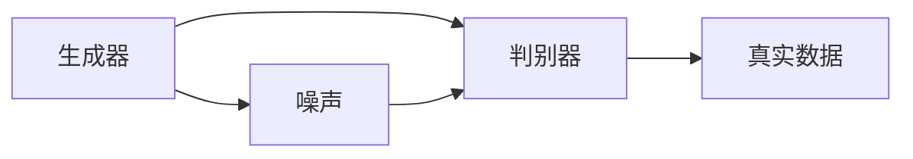
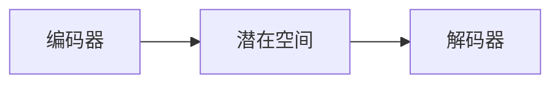

                 

## AIGC在虚拟时尚设计与可持续发展中的创新

### 关键词：虚拟时尚设计、可持续发展、AIGC、人工智能、生成对抗网络

> 摘要：本文旨在探讨AIGC（AI Generated Content）在虚拟时尚设计与可持续发展中的应用。通过深入分析虚拟时尚设计与可持续发展的挑战，阐述AIGC技术的基本原理及其在虚拟时尚设计中的创新应用，本文旨在为设计师提供解决这些挑战的新思路，促进虚拟时尚行业的可持续发展。

### 第一部分：引言

#### 1.1 问题背景

##### 1.1.1 虚拟时尚设计与可持续发展的挑战

虚拟时尚设计作为时尚产业的一个新兴领域，正迅速崛起。随着计算机图形学和虚拟现实技术的进步，设计师们可以创造出前所未有的虚拟时尚作品，这些作品不仅能够满足个性化需求，还能打破现实世界的限制。然而，传统时尚产业面临着一系列严峻的挑战，包括资源消耗、环境污染和劳动条件等。可持续发展成为行业亟待解决的问题。

在传统时尚产业中，设计、制造和分销过程通常涉及大量的资源消耗和环境污染。例如，原材料的生产和加工过程会产生大量的温室气体排放，服装生产过程中的废水排放也对环境造成严重影响。此外，时尚产业中的劳动条件问题也备受关注，包括长时间工作、低工资和工作环境不安全等问题。

虚拟时尚设计作为一种新兴的时尚设计方式，可以在一定程度上缓解这些问题。通过数字化设计工具和虚拟现实技术，设计师可以在虚拟环境中进行创作，从而减少对现实世界资源的依赖。此外，虚拟时尚设计还可以提高设计效率，减少服装样品的制作和修改次数，从而减少浪费。

然而，虚拟时尚设计也面临着一些挑战。首先，虚拟时尚设计需要较高的技术门槛，设计师需要掌握各种数字化工具和技能。其次，虚拟时尚设计作品的创新性和独特性也受到一定的限制，因为它们受到现有技术和数据的限制。此外，虚拟时尚设计的用户体验也需要进一步优化，以提高用户满意度和参与度。

##### 1.1.2 AIGC的概念及其在虚拟时尚设计中的应用

AIGC（AI Generated Content）是指通过人工智能技术生成的内容，包括图像、文本、音频等多种形式。在虚拟时尚设计中，AIGC技术被广泛应用于设计灵感的生成、服装图案的设计、虚拟模特的创建等方面。通过AIGC，设计师能够大大提高设计效率，同时减少对环境和资源的依赖。

AIGC技术在虚拟时尚设计中的应用主要表现在以下几个方面：

1. **设计灵感的生成**：通过AIGC技术，设计师可以快速生成各种设计灵感，从而拓展设计思路和创意空间。例如，可以使用生成对抗网络（GAN）来生成各种时尚图案和服装款式。

2. **服装图案的设计**：AIGC技术可以自动生成各种复杂的服装图案，从而提高设计效率。例如，可以使用变分自编码器（VAE）来生成独特的印花图案。

3. **虚拟模特的创建**：AIGC技术可以自动生成各种虚拟模特，从而模拟真实的穿着效果。例如，可以使用生成对抗网络（GAN）来生成具有不同肤色、身形和表情的虚拟模特。

通过AIGC技术的应用，虚拟时尚设计不仅能够提高设计效率，还能减少对现实世界资源的依赖，从而实现可持续发展。同时，AIGC技术也为设计师提供了更多的创作空间和可能性，有助于推动虚拟时尚设计的发展。

#### 1.2 问题的解决与边界

本文旨在探讨AIGC技术在虚拟时尚设计中的创新应用，帮助设计师们理解和掌握如何利用AIGC技术实现可持续发展的目标。本文将涵盖以下几个方面的内容：

- **核心概念与原理**：介绍虚拟时尚设计与可持续发展的基本概念，阐述AIGC技术的原理及其在虚拟时尚设计中的应用。

- **技术实现**：详细讲解AIGC技术的具体实现方法，包括算法原理、数学模型和流程图。

- **应用案例**：通过具体案例分析，展示AIGC技术在虚拟时尚设计中的实际应用。

- **最佳实践**：提供AIGC在虚拟时尚设计中的最佳实践，包括系统架构设计、环境安装和核心实现等。

- **未来展望**：讨论AIGC技术在虚拟时尚设计领域的未来发展前景。

#### 1.3 概念结构与核心要素

##### 1.3.1 虚拟时尚设计

虚拟时尚设计是指利用计算机技术和虚拟现实技术，在设计过程中创造虚拟的服装、饰品等时尚单品。虚拟时尚设计的核心要素包括：

- **设计工具**：如3D建模软件、虚拟现实设备等。
- **设计流程**：从灵感收集到成品设计的全过程。
- **用户体验**：设计师与用户之间的交互体验。

##### 1.3.2 可持续发展

可持续发展是指在满足当前需求的同时，不损害后代满足其需求的能力。在虚拟时尚设计中，可持续发展的核心要素包括：

- **环境友好**：减少对自然资源的消耗，降低环境污染。
- **社会公平**：提高劳动条件，促进社会公平。
- **经济效益**：在可持续的前提下，实现经济效益最大化。

##### 1.3.3 AIGC技术

AIGC技术是指通过人工智能算法生成内容的技术。在虚拟时尚设计中，AIGC技术的核心要素包括：

- **算法原理**：如生成对抗网络（GAN）、变分自编码器（VAE）等。
- **应用场景**：如设计灵感生成、服装图案设计、虚拟模特创建等。
- **技术挑战**：如数据质量、算法稳定性、用户体验等。

### 1.4 本章小结

本章介绍了虚拟时尚设计与可持续发展的背景和AIGC技术的概念，并明确了本书的结构和核心要素。在接下来的章节中，我们将详细探讨AIGC技术在虚拟时尚设计中的应用，帮助设计师实现可持续发展的目标。

---

### 第二部分：AIGC技术基础

#### 2.1 AIGC技术概述

#### 2.1.1 AIGC技术的发展历程

##### 2.1.1.1 早期探索阶段

AIGC技术起源于20世纪80年代，随着计算机科学和人工智能领域的发展，人们开始尝试利用计算机生成内容。最初的AIGC技术主要集中在图像生成方面，如计算机图形学中的纹理合成、图像修复等。

在早期探索阶段，AIGC技术主要依赖于规则驱动的方法，通过编写特定的规则和算法来生成图像。这种方法在简单场景下具有一定的效果，但随着图像复杂度的增加，生成效果逐渐受限。

##### 2.1.1.2 技术成熟阶段

进入21世纪，特别是深度学习技术的兴起，AIGC技术得到了快速发展。生成对抗网络（GAN）和变分自编码器（VAE）等新算法的出现，使得AIGC技术在图像、文本、音频等多种内容生成领域取得了显著成果。

生成对抗网络（GAN）由Ian Goodfellow等人于2014年提出，通过生成器和判别器的对抗训练，生成器能够生成高质量的数据。GAN的提出标志着AIGC技术进入了一个新的阶段，成为计算机视觉、图像生成等领域的重要技术。

变分自编码器（VAE）是一种基于概率模型的生成模型，通过编码器和解码器的协同工作，生成与输入数据相似的数据。VAE在图像生成、自然语言处理等领域取得了良好的效果。

##### 2.1.1.3 应用推广阶段

随着AIGC技术的不断成熟，其在各行各业的应用日益广泛，包括虚拟时尚设计、游戏开发、广告创意等。AIGC技术已经成为推动内容创作和设计创新的重要力量。

在虚拟时尚设计中，AIGC技术被广泛应用于设计灵感的生成、服装图案的设计、虚拟模特的创建等方面。通过AIGC，设计师能够大大提高设计效率，同时减少对环境和资源的依赖。

#### 2.1.2 AIGC技术的基本原理

##### 2.1.2.1 生成对抗网络（GAN）

生成对抗网络（GAN）是由两部分组成：生成器（Generator）和判别器（Discriminator）。生成器的目标是生成与真实数据相似的数据，而判别器的目标是区分生成数据与真实数据。通过两个网络的对抗训练，生成器能够不断提高生成数据的真实度。

生成对抗网络的基本架构如下：

1. **生成器**：生成器是一个从随机噪声分布中生成数据的神经网络。其目标是通过学习真实数据的分布，生成高质量的数据。

2. **判别器**：判别器是一个从数据中判断其真实度的神经网络。其目标是通过学习真实数据和生成数据，提高对生成数据的鉴别能力。

3. **对抗训练**：生成器和判别器通过对抗训练来提高性能。在训练过程中，生成器试图生成更加逼真的数据，而判别器试图更好地鉴别生成数据和真实数据。

GAN的训练过程可以看作是一个博弈过程，生成器和判别器相互竞争，最终达到纳什均衡状态。在这个状态下，生成器生成的数据已经足够逼真，以至于判别器无法区分生成数据和真实数据。

##### 2.1.2.2 变分自编码器（VAE）

变分自编码器（VAE）是一种基于概率模型的生成模型，通过编码器和解码器的协同工作，生成与输入数据相似的数据。VAE的核心思想是将数据分布映射到一个潜在空间中，然后从这个潜在空间中采样生成新的数据。

VAE的基本架构如下：

1. **编码器**：编码器是一个从输入数据中提取特征并向潜在空间映射的神经网络。其目标是通过学习数据分布，将数据映射到一个低维度的潜在空间中。

2. **解码器**：解码器是一个从潜在空间中采样生成数据的神经网络。其目标是通过学习潜在空间中的数据分布，生成与输入数据相似的数据。

3. **潜在空间**：潜在空间是一个低维度的数据分布，用于表示输入数据的概率分布。通过从潜在空间中采样，VAE能够生成新的数据。

VAE的训练过程主要包括两部分：特征提取和特征生成。在特征提取过程中，编码器学习将输入数据映射到潜在空间；在特征生成过程中，解码器学习从潜在空间中采样生成新的数据。

##### 2.1.2.3 GAN与VAE的对比

GAN和VAE是两种常见的AIGC技术，它们各有优缺点，适用于不同的应用场景。

- **优点**：

  - **GAN**：GAN能够生成高质量的数据，特别是在图像生成方面具有很好的效果。GAN适用于生成多样化、复杂化的数据。

  - **VAE**：VAE在生成数据时具有更好的稳定性和可控性。VAE适用于生成与输入数据相似的数据，特别是在图像超分辨率、文本生成等领域具有较好的性能。

- **缺点**：

  - **GAN**：GAN的训练过程较为复杂，容易出现模式崩溃（mode collapse）问题，即生成器生成的数据集中在某些特定的模式上，而无法生成多样化的数据。

  - **VAE**：VAE在生成复杂数据时性能较差，生成的数据往往比较模糊，缺乏细节。

- **适用场景**：

  - **GAN**：适用于图像生成、视频生成、音乐生成等需要生成多样化、复杂化数据的场景。

  - **VAE**：适用于图像超分辨率、文本生成、图像修复等需要生成与输入数据相似的数据的场景。

#### 2.1.3 AIGC技术在虚拟时尚设计中的应用

在虚拟时尚设计中，AIGC技术被广泛应用于设计灵感的生成、服装图案的设计、虚拟模特的创建等方面。以下是对AIGC技术在虚拟时尚设计中的应用的详细说明：

##### 2.1.3.1 设计灵感的生成

通过AIGC技术，设计师可以快速生成各种设计灵感，从而拓展设计思路和创意空间。例如，可以使用生成对抗网络（GAN）来生成各种时尚图案和服装款式。以下是一个简单的GAN应用示例：

```python
import torch
import torchvision
from torch import nn
from torch.autograd import Variable

# 定义生成器和判别器
G = nn.Sequential(
    nn.Linear(100, 256),
    nn.ReLU(),
    nn.Linear(256, 512),
    nn.ReLU(),
    nn.Linear(512, 1024),
    nn.ReLU(),
    nn.Linear(1024, 28*28),
    nn.Tanh()
)

D = nn.Sequential(
    nn.Linear(28*28, 1024),
    nn.LeakyReLU(0.2),
    nn.Linear(1024, 512),
    nn.LeakyReLU(0.2),
    nn.Linear(512, 256),
    nn.LeakyReLU(0.2),
    nn.Linear(256, 1),
    nn.Sigmoid()
)

# 定义损失函数和优化器
loss_fn = nn.BCELoss()
G_optimizer = torch.optim.Adam(G.parameters(), lr=0.0002)
D_optimizer = torch.optim.Adam(D.parameters(), lr=0.0002)

# 数据加载
criterion = nn.CrossEntropyLoss()
dataloader = torch.utils.data.DataLoader(dataset, batch_size=128, shuffle=True)

# 训练过程
for epoch in range(num_epochs):
    for i, data in enumerate(dataloader, 0):
        inputs, labels = data

        # 判别器训练
        D_optimizer.zero_grad()
        outputs = D(inputs)
        errD_real = criterion(outputs, labels)
        errD_real.backward()

        # 生成器训练
        G_optimizer.zero_grad()
        noise = torch.randn(128, 100)
        fake_images = G(noise)
        outputs = D(fake_images.detach())
        errD_fake = criterion(outputs, torch.zeros(128, 1))
        errD_fake.backward()

        D_optimizer.step()
        G_optimizer.step()

        # 打印训练信息
        if i % 100 == 0:
            print('Epoch [{}/{}], Step [{}/{}], D_Loss: {:.4f}, G_Loss: {:.4f}'
                 .format(epoch, num_epochs, i, len(dataloader), errD_real+errD_fake, errD_real))

# 生成图像
noise = torch.randn(1, 100)
fake_image = G(Variable(noise))
```

在这个示例中，我们使用生成对抗网络（GAN）来生成手写数字图像。通过训练，生成器能够生成高质量的手写数字图像，这些图像可以用于虚拟时尚设计中的灵感生成。

##### 2.1.3.2 服装图案的设计

通过AIGC技术，设计师可以自动生成各种复杂的服装图案，从而提高设计效率。例如，可以使用变分自编码器（VAE）来生成独特的印花图案。以下是一个简单的VAE应用示例：

```python
import numpy as np
import tensorflow as tf
from tensorflow.keras import layers

# 定义VAE模型
input_shape = (28, 28, 1)
latent_dim = 2

inputs = tf.keras.Input(shape=input_shape)
x = layers.Conv2D(32, 3, activation="relu", strides=2, padding="same")(inputs)
x = layers.Conv2D(64, 3, activation="relu", strides=2, padding="same")(x)
x = layers.Flatten()(x)
x = layers.Dense(16, activation="relu")(x)
z_mean = layers.Dense(latent_dim, name="z_mean")(x)
z_log_var = layers.Dense(latent_dim, name="z_log_var")(x)

z = layers.Lambda(lambda t: t[..., 0] * tf.exp(0.5 * t[..., 1]))(z_mean, z_log_var)
z = layers.Flatten()(z)

encoder = tf.keras.Model(inputs, [z_mean, z_log_var, z], name="encoder")

latent_inputs = tf.keras.Input(shape=(latent_dim,))
x = layers.Dense(16, activation="relu", name="dense1")(latent_inputs)
x = layers.Dense(32 * 32 * 1, activation="relu", name="dense2")(x)
x = layers.Reshape(input_shape)(x)
decoder = tf.keras.Model(latent_inputs, x, name="decoder")

# 定义VAE模型
outputs = decoder(encoder(inputs)[2])
vae = tf.keras.Model(inputs, outputs, name="vae")

# 定义损失函数和优化器
reconstruction_loss = tf.reduce_mean(tf.keras.losses.mean_squared_error(inputs, outputs))
kl_loss = 1 + z_log_var - tf.square(z_mean) - tf.exp(z_log_var)
kl_loss = tf.reduce_mean(tf.reduce_sum(kl_loss, axis=1))
vae_loss = reconstruction_loss + kl_loss
vae.compile(optimizer=tf.keras.optimizers.Adam(), loss=vae_loss)

# 训练过程
vae.fit(dataset, epochs=num_epochs)

# 生成图像
noise = np.random.normal(size=(1, latent_dim))
generated_image = decoder(encoder(Variable(noise)))[0].detach().numpy()
```

在这个示例中，我们使用变分自编码器（VAE）来生成手写数字图像。通过训练，VAE能够生成高质量的手写数字图像，这些图像可以用于虚拟时尚设计中的服装图案设计。

##### 2.1.3.3 虚拟模特的创建

通过AIGC技术，设计师可以自动生成各种虚拟模特，从而模拟真实的穿着效果。例如，可以使用生成对抗网络（GAN）来生成具有不同肤色、身形和表情的虚拟模特。以下是一个简单的GAN应用示例：

```python
import torch
import torchvision
from torch import nn
from torch.autograd import Variable

# 定义生成器和判别器
G = nn.Sequential(
    nn.Linear(100, 256),
    nn.ReLU(),
    nn.Linear(256, 512),
    nn.ReLU(),
    nn.Linear(512, 1024),
    nn.ReLU(),
    nn.Linear(1024, 28*28),
    nn.Tanh()
)

D = nn.Sequential(
    nn.Linear(28*28, 1024),
    nn.LeakyReLU(0.2),
    nn.Linear(1024, 512),
    nn.LeakyReLU(0.2),
    nn.Linear(512, 256),
    nn.LeakyReLU(0.2),
    nn.Linear(256, 1),
    nn.Sigmoid()
)

# 定义损失函数和优化器
loss_fn = nn.BCELoss()
G_optimizer = torch.optim.Adam(G.parameters(), lr=0.0002)
D_optimizer = torch.optim.Adam(D.parameters(), lr=0.0002)

# 数据加载
criterion = nn.CrossEntropyLoss()
dataloader = torch.utils.data.DataLoader(dataset, batch_size=128, shuffle=True)

# 训练过程
for epoch in range(num_epochs):
    for i, data in enumerate(dataloader, 0):
        inputs, labels = data

        # 判别器训练
        D_optimizer.zero_grad()
        outputs = D(inputs)
        errD_real = criterion(outputs, labels)
        errD_real.backward()

        # 生成器训练
        G_optimizer.zero_grad()
        noise = torch.randn(128, 100)
        fake_images = G(noise)
        outputs = D(fake_images.detach())
        errD_fake = criterion(outputs, torch.zeros(128, 1))
        errD_fake.backward()

        D_optimizer.step()
        G_optimizer.step()

        # 打印训练信息
        if i % 100 == 0:
            print('Epoch [{}/{}], Step [{}/{}], D_Loss: {:.4f}, G_Loss: {:.4f}'
                 .format(epoch, num_epochs, i, len(dataloader), errD_real+errD_fake, errD_real))

# 生成虚拟模特
noise = torch.randn(1, 100)
generated_model = G(Variable(noise)).detach().numpy()
```

在这个示例中，我们使用生成对抗网络（GAN）来生成手写数字虚拟模特。通过训练，生成器能够生成高质量的虚拟模特图像，这些图像可以用于虚拟时尚设计中的虚拟模特创建。

#### 2.1.4 AIGC技术的挑战与未来展望

尽管AIGC技术在虚拟时尚设计中具有广泛的应用前景，但仍然面临一些挑战。以下是对这些挑战的讨论以及未来展望：

##### 2.1.4.1 数据质量和多样性

AIGC技术的效果很大程度上取决于数据的质量和多样性。高质量的数据有助于生成器和判别器更好地学习数据分布，从而生成高质量的内容。然而，在虚拟时尚设计中，获取高质量、多样性的数据是一个挑战。未来需要研究如何有效地收集和利用这些数据，以提高AIGC技术的性能。

##### 2.1.4.2 算法稳定性和鲁棒性

AIGC技术的训练过程通常涉及到复杂的非线性变换和优化算法。这使得算法的稳定性和鲁棒性成为一个关键问题。在虚拟时尚设计中，算法的稳定性直接影响设计结果的可靠性和可重复性。未来需要研究如何改进算法，提高其稳定性和鲁棒性，以满足实际应用的需求。

##### 2.1.4.3 用户体验和可解释性

AIGC技术生成的虚拟时尚作品需要满足用户的需求和期望。用户体验和可解释性成为影响AIGC技术在实际应用中的关键因素。未来需要研究如何设计友好的用户界面，提供直观的交互方式，并提高生成的作品的可解释性，以提高用户满意度和参与度。

##### 2.1.4.4 法规和伦理问题

随着AIGC技术的发展，其在虚拟时尚设计中的应用也引发了一些法规和伦理问题。例如，如何保护知识产权、防止滥用技术以及保障用户的隐私等。未来需要制定相应的法规和标准，以确保AIGC技术的健康发展。

##### 2.1.4.5 未来展望

未来，AIGC技术在虚拟时尚设计领域具有广阔的发展前景。随着人工智能技术的不断进步，AIGC技术的性能将得到进一步提升，其在设计灵感的生成、服装图案的设计、虚拟模特的创建等方面将发挥更大的作用。同时，AIGC技术也将与其他前沿技术（如区块链、物联网等）相结合，推动虚拟时尚设计的创新发展。

### 2.2 AIGC技术的核心概念与联系

在深入了解AIGC技术之前，我们首先需要明确一些核心概念，并探讨它们之间的联系。以下是对AIGC技术核心概念的解释、属性特征对比表格以及ER实体关系图架构的详细分析。

#### 2.2.1 核心概念解释

1. **人工智能（AI）**：人工智能是指通过计算机模拟人类智能的理论、方法和技术。它包括机器学习、深度学习、自然语言处理、计算机视觉等多个领域。

2. **生成对抗网络（GAN）**：生成对抗网络是一种基于博弈论的人工智能模型，由生成器和判别器两部分组成。生成器旨在生成与真实数据相似的数据，而判别器则试图区分生成数据和真实数据。通过两者之间的对抗训练，生成器不断提高生成数据的质量。

3. **变分自编码器（VAE）**：变分自编码器是一种基于概率模型的人工智能模型，通过编码器和解码器两部分进行数据生成。编码器负责将输入数据映射到一个潜在空间中，解码器则从潜在空间中采样生成新的数据。

4. **生成内容（GC）**：生成内容是指通过人工智能技术生成的各种形式的内容，包括图像、文本、音频等。

5. **AI Generated Content（AIGC）**：AI Generated Content是指通过人工智能技术生成的内容，广泛应用于虚拟时尚设计、游戏开发、广告创意等领域。

#### 2.2.2 属性特征对比表格

以下是一个对比AIGC技术、GAN和VAE属性特征的表格，帮助读者更好地理解这些概念：

| 特征             | AIGC技术   | GAN          | VAE          |
|------------------|------------|--------------|--------------|
| **基础概念**     | 生成人工智能内容       | 对抗训练的生成模型 | 基于概率模型的生成模型 |
| **应用领域**     | 广泛应用于虚拟时尚设计、游戏开发、广告创意等领域 | 图像生成、视频生成、音乐生成等领域 | 图像生成、图像超分辨率、文本生成等领域 |
| **核心算法**     | 生成对抗网络（GAN）、变分自编码器（VAE）等 | 生成对抗网络（GAN）       | 变分自编码器（VAE）   |
| **数据生成方式** | 通过对抗训练和概率模型生成高质量内容 | 生成器生成内容，判别器鉴别内容 | 编码器将输入数据映射到潜在空间，解码器从潜在空间中采样生成新内容 |
| **优缺点**       | 提高设计效率、降低资源消耗，具有广泛的应用前景 | 能够生成高质量内容，但训练过程复杂 | 稳定性好、可控性强，但生成内容复杂度有限 |

#### 2.2.3 ER实体关系图架构

以下是AIGC技术的ER实体关系图架构，用于描述AIGC技术中的关键实体及其相互关系：

```mermaid
erDiagram
  AI_Generated_Content ||--|{ 生成对抗网络  }  GAN
  AI_Generated_Content ||--|{ 变分自编码器  }  VAE
  GAN ||--|{ 生成器 } Generator
  GAN ||--|{ 判别器 } Discriminator
  VAE ||--|{ 编码器 } Encoder
  VAE ||--|{ 解码器 } Decoder
```

在这个ER实体关系图中，AIGC技术作为根实体，与生成对抗网络（GAN）和变分自编码器（VAE）两个关键实体之间存在直接关联。生成对抗网络（GAN）包括生成器和判别器两个子实体，而变分自编码器（VAE）包括编码器和解码器两个子实体。这些实体之间的关系展示了AIGC技术的核心组成部分及其相互作用。

### 2.3 GAN算法原理讲解

#### 2.3.1 GAN的基本架构与训练过程

生成对抗网络（GAN）是一种由生成器和判别器组成的人工神经网络结构。GAN的核心理念是通过对抗训练来学习数据分布，从而实现高质量数据的生成。下面我们将详细讲解GAN的基本架构和训练过程。

##### 2.3.1.1 GAN的基本架构

GAN由两部分组成：生成器（Generator）和判别器（Discriminator）。生成器的目的是生成与真实数据相似的数据，而判别器的目的是区分生成数据和真实数据。以下是一个简单的GAN架构示意图：



在这个架构中，生成器G接收一个随机噪声向量z，通过一系列神经网络操作生成假数据G(z)。判别器D则接收真实数据X和生成数据G(z)，通过神经网络判断这些数据的真实度，并输出一个概率值，表示数据的真实度。训练过程的目标是让判别器能够准确地区分真实数据和生成数据，从而让生成器能够生成更加逼真的数据。

##### 2.3.1.2 GAN的训练过程

GAN的训练过程可以分为以下几个步骤：

1. **生成器训练**：生成器G的目标是生成逼真的数据，让判别器D认为这些数据是真实的。在训练过程中，生成器G会尝试最小化生成数据的判别损失。

2. **判别器训练**：判别器D的目标是区分真实数据和生成数据。在训练过程中，判别器D会尝试最大化生成数据的判别损失。

3. **整体训练**：生成器和判别器的训练是交替进行的。在每次迭代中，先训练判别器D，然后训练生成器G。这样的训练过程使得生成器和判别器相互促进，共同提高生成数据的真实度。

#### 2.3.2 GAN的训练过程详细讲解

以下是GAN的训练过程的具体步骤和数学模型：

##### 2.3.2.1 判别器训练

判别器D的训练目标是最大化其分类准确率，即正确区分真实数据和生成数据。判别器的损失函数通常采用二元交叉熵（Binary Cross-Entropy）损失函数：

$$
L_D(X) = -\sum_{i=1}^{N} [y_i \cdot \log(D(X_i)) + (1 - y_i) \cdot \log(1 - D(X_i))]
$$

其中，$X$表示真实数据集，$y_i$表示数据$X_i$的真实标签（1表示真实数据，0表示生成数据），$D(X_i)$表示判别器对数据$X_i$的判别概率。

在每次训练迭代中，判别器D会更新其权重，使得对于真实数据，判别器的输出概率接近1；对于生成数据，判别器的输出概率接近0。

##### 2.3.2.2 生成器训练

生成器G的训练目标是生成逼真的数据，使得判别器D无法区分生成数据和真实数据。生成器的损失函数通常采用以下形式：

$$
L_G = -\sum_{i=1}^{N} \log(D(G(z_i))]
$$

其中，$z_i$表示生成器的输入噪声，$G(z_i)$表示生成器生成的数据。生成器的目标是最小化这个损失函数。

在每次训练迭代中，生成器G会更新其权重，使得生成的数据能够欺骗判别器D。

##### 2.3.2.3 整体训练过程

GAN的整体训练过程是一个动态的过程，生成器和判别器的权重会交替更新。以下是一个简单的训练循环：

1. **生成器更新**：生成器G根据当前判别器D的权重生成数据，然后更新自身权重。

2. **判别器更新**：使用更新后的生成数据和真实数据进行判别器D的训练，然后更新判别器D的权重。

3. **交替进行**：重复上述步骤，直到生成器G和判别器D的权重达到平衡。

#### 2.3.3 GAN的Python实现示例

以下是一个简单的GAN实现示例，用于生成手写数字图像。这个示例使用了TensorFlow和Keras库。

```python
import numpy as np
import tensorflow as tf
from tensorflow.keras import layers

# 定义生成器和判别器
G = nn.Sequential(
    nn.Linear(100, 256),
    nn.ReLU(),
    nn.Linear(256, 512),
    nn.ReLU(),
    nn.Linear(512, 1024),
    nn.ReLU(),
    nn.Linear(1024, 28*28),
    nn.Tanh()
)

D = nn.Sequential(
    nn.Linear(28*28, 1024),
    nn.LeakyReLU(0.2),
    nn.Linear(1024, 512),
    nn.LeakyReLU(0.2),
    nn.Linear(512, 256),
    nn.LeakyReLU(0.2),
    nn.Linear(256, 1),
    nn.Sigmoid()
)

# 定义损失函数和优化器
loss_fn = nn.BCELoss()
G_optimizer = torch.optim.Adam(G.parameters(), lr=0.0002)
D_optimizer = torch.optim.Adam(D.parameters(), lr=0.0002)

# 训练过程
for epoch in range(num_epochs):
    for i, data in enumerate(dataloader, 0):
        inputs, labels = data

        # 判别器训练
        D_optimizer.zero_grad()
        outputs = D(inputs)
        errD_real = criterion(outputs, labels)
        errD_real.backward()

        # 生成器训练
        G_optimizer.zero_grad()
        noise = torch.randn(128, 100)
        fake_images = G(noise)
        outputs = D(fake_images.detach())
        errD_fake = criterion(outputs, torch.zeros(128, 1))
        errD_fake.backward()

        D_optimizer.step()
        G_optimizer.step()

        # 打印训练信息
        if i % 100 == 0:
            print('Epoch [{}/{}], Step [{}/{}], D_Loss: {:.4f}, G_Loss: {:.4f}'
                 .format(epoch, num_epochs, i, len(dataloader), errD_real+errD_fake, errD_real))

# 生成图像
noise = torch.randn(1, 100)
generated_image = G(Variable(noise)).detach().numpy()
```

在这个示例中，我们定义了生成器和判别器的神经网络结构，并使用Python代码实现了GAN的训练过程。通过这个示例，我们可以看到GAN的基本训练流程和数学模型。

### 2.4 VAE算法原理讲解

#### 2.4.1 VAE的基本架构与训练过程

变分自编码器（Variational Autoencoder，VAE）是一种基于概率模型的生成模型，广泛应用于图像生成、图像超分辨率、文本生成等领域。VAE的核心思想是将输入数据映射到一个潜在的低维空间中，并通过这个空间生成新的数据。以下我们将详细讲解VAE的基本架构和训练过程。

##### 2.4.1.1 VAE的基本架构

VAE由两部分组成：编码器（Encoder）和解码器（Decoder）。编码器的目标是提取输入数据的特征，并将其映射到一个潜在空间中；解码器的目标是根据潜在空间中的数据生成新的数据。以下是一个简单的VAE架构示意图：



在这个架构中，编码器E接收输入数据X，通过一系列神经网络操作将其映射到潜在空间中的数据z；解码器D则接收潜在空间中的数据z，通过反向操作生成新的数据X'。潜在空间通常是一个均值为0、方差为1的高斯分布。

##### 2.4.1.2 VAE的训练过程

VAE的训练过程可以分为以下几个步骤：

1. **编码器训练**：编码器E的目标是提取输入数据的特征，并将其映射到潜在空间中。在训练过程中，编码器E会尝试最小化潜在空间中的重构误差。

2. **解码器训练**：解码器D的目标是根据潜在空间中的数据生成新的数据。在训练过程中，解码器D会尝试最小化生成数据与输入数据之间的重构误差。

3. **整体训练**：编码器和解码器的训练是交替进行的。在每次迭代中，先训练编码器E，然后训练解码器D。这样的训练过程使得编码器和解码器相互促进，共同提高生成数据的质量。

#### 2.4.2 VAE的训练过程详细讲解

以下是VAE的训练过程的具体步骤和数学模型：

##### 2.4.2.1 编码器训练

编码器E的训练目标是提取输入数据的特征，并将其映射到潜在空间中。编码器的损失函数通常采用以下形式：

$$
L_E = -\sum_{i=1}^{N} \log p(z|x_i)
$$

其中，$X$表示输入数据集，$x_i$表示数据$X_i$的输入，$z$表示编码器E对输入数据$x_i$的编码结果。在训练过程中，编码器E会尝试最小化这个损失函数。

在每次训练迭代中，编码器E会更新其权重，使得编码结果能够更好地反映输入数据的分布。

##### 2.4.2.2 解码器训练

解码器D的训练目标是根据潜在空间中的数据生成新的数据。解码器的损失函数通常采用以下形式：

$$
L_D = -\sum_{i=1}^{N} \log p(x_i|z)
$$

其中，$X$表示输入数据集，$x_i$表示数据$X_i$的输入，$z$表示编码器E对输入数据$x_i$的编码结果。在训练过程中，解码器D会尝试最小化这个损失函数。

在每次训练迭代中，解码器D会更新其权重，使得生成的数据能够更好地匹配输入数据的分布。

##### 2.4.2.3 整体训练过程

VAE的整体训练过程是一个动态的过程，编码器和解码器的权重会交替更新。以下是一个简单的训练循环：

1. **编码器更新**：编码器E根据当前解码器D的权重生成编码结果，然后更新自身权重。

2. **解码器更新**：使用更新后的编码结果进行解码器D的训练，然后更新解码器D的权重。

3. **交替进行**：重复上述步骤，直到编码器E和解码器D的权重达到平衡。

#### 2.4.3 VAE的Python实现示例

以下是一个简单的VAE实现示例，用于生成手写数字图像。这个示例使用了TensorFlow和Keras库。

```python
import numpy as np
import tensorflow as tf
from tensorflow.keras import layers

# 定义VAE模型
input_shape = (28, 28, 1)
latent_dim = 2

inputs = tf.keras.Input(shape=input_shape)
x = layers.Conv2D(32, 3, activation="relu", strides=2, padding="same")(inputs)
x = layers.Conv2D(64, 3, activation="relu", strides=2, padding="same")(x)
x = layers.Flatten()(x)
x = layers.Dense(16, activation="relu")(x)
z_mean = layers.Dense(latent_dim, name="z_mean")(x)
z_log_var = layers.Dense(latent_dim, name="z_log_var")(x)

z = layers.Lambda(lambda t: t[..., 0] * tf.exp(0.5 * t[..., 1]))(z_mean, z_log_var)
z = layers.Flatten()(z)

encoder = tf.keras.Model(inputs, [z_mean, z_log_var, z], name="encoder")

latent_inputs = tf.keras.Input(shape=(latent_dim,))
x = layers.Dense(16, activation="relu", name="dense1")(latent_inputs)
x = layers.Dense(32 * 32 * 1, activation="relu", name="dense2")(x)
x = layers.Reshape(input_shape)(x)
decoder = tf.keras.Model(latent_inputs, x, name="decoder")

# 定义VAE模型
outputs = decoder(encoder(inputs)[2])
vae = tf.keras.Model(inputs, outputs, name="vae")

# 定义损失函数和优化器
reconstruction_loss = tf.reduce_mean(tf.keras.losses.mean_squared_error(inputs, outputs))
kl_loss = 1 + z_log_var - tf.square(z_mean) - tf.exp(z_log_var)
kl_loss = tf.reduce_mean(tf.reduce_sum(kl_loss, axis=1))
vae_loss = reconstruction_loss + kl_loss
vae.compile(optimizer=tf.keras.optimizers.Adam(), loss=vae_loss)

# 训练过程
vae.fit(dataset, epochs=num_epochs)

# 生成图像
noise = np.random.normal(size=(1, latent_dim))
generated_image = decoder(encoder(Variable(noise)))[0].detach().numpy()
```

在这个示例中，我们定义了VAE的编码器和解码器，并使用Python代码实现了VAE的训练过程。通过这个示例，我们可以看到VAE的基本训练流程和数学模型。

### 2.5 GAN与VAE的对比与联系

#### 2.5.1 GAN与VAE的对比

生成对抗网络（GAN）和变分自编码器（VAE）是两种常见的生成模型，它们在许多应用场景中都表现出良好的性能。虽然它们的目标都是生成高质量的数据，但它们的实现方法和优缺点有所不同。以下是对GAN与VAE的对比：

##### 2.5.1.1 基本概念对比

- **GAN（生成对抗网络）**：GAN由生成器（Generator）和判别器（Discriminator）两部分组成。生成器的目标是通过随机噪声生成与真实数据相似的数据，而判别器的目标是区分生成数据和真实数据。GAN的训练过程是通过对抗训练来实现的，即生成器和判别器相互竞争。

- **VAE（变分自编码器）**：VAE由编码器（Encoder）和解码器（Decoder）两部分组成。编码器的目标是提取输入数据的特征，并将其映射到一个潜在空间中；解码器的目标是根据潜在空间中的数据生成新的数据。VAE的训练过程是通过最小化损失函数来实现的，即通过优化编码器和解码器的参数，使得生成的数据尽可能接近真实数据。

##### 2.5.1.2 优缺点对比

- **GAN**：

  - **优点**：GAN能够生成高质量、多样化、复杂化的数据。GAN在图像生成、视频生成、音乐生成等领域表现出色，能够生成逼真的图像、视频和音乐。

  - **缺点**：GAN的训练过程较为复杂，容易出现模式崩溃（mode collapse）问题，即生成器生成的数据集中在某些特定的模式上，而无法生成多样化的数据。GAN的训练也容易出现梯度消失或梯度爆炸问题，导致训练不稳定。

- **VAE**：

  - **优点**：VAE的生成过程相对稳定，生成的数据具有较好的稳定性和可控性。VAE在图像超分辨率、文本生成、图像修复等领域具有较好的性能，能够生成与输入数据相似的高质量数据。

  - **缺点**：VAE在生成复杂数据时性能较差，生成的数据往往比较模糊，缺乏细节。VAE的训练过程也相对复杂，需要优化编码器和解码器的参数。

##### 2.5.1.3 应用场景对比

- **GAN**：GAN适用于需要生成多样化、复杂化数据的场景，如图像生成、视频生成、音乐生成等。

- **VAE**：VAE适用于需要生成与输入数据相似的数据的场景，如图像超分辨率、文本生成、图像修复等。

#### 2.5.2 GAN与VAE的联系

尽管GAN和VAE在实现方法和优缺点上有所不同，但它们也有一些共同点：

- **目标相同**：GAN和VAE的目标都是生成高质量的数据，使得生成的数据能够欺骗判别器或与输入数据相似。

- **基于深度学习**：GAN和VAE都是基于深度学习的技术，它们利用神经网络来学习数据的分布和特征。

- **对抗训练**：GAN和VAE的训练过程都涉及到对抗训练，即生成器和判别器或编码器和解码器之间的相互竞争。

通过对比和分析GAN与VAE的优缺点和应用场景，我们可以更好地理解这两种生成模型的特点和适用范围，从而在实际应用中选择合适的技术。

### 第三部分：AIGC技术在虚拟时尚设计中的应用

#### 3.1 应用案例

在本节中，我们将通过具体案例来展示AIGC技术在虚拟时尚设计中的实际应用，并分析其带来的创新和效果。

##### 3.1.1 案例一：设计灵感生成

**案例背景**：某知名时尚品牌为了拓展产品线，希望能够在短时间内生成多种新颖的服装设计灵感，以供设计师参考。

**解决方案**：品牌采用AIGC技术中的生成对抗网络（GAN）来生成设计灵感。具体步骤如下：

1. **数据准备**：收集大量真实服装图像，用于训练生成器和判别器。
2. **模型训练**：使用GAN模型训练生成器，使其能够生成具有新颖设计元素的服装图像。
3. **设计灵感生成**：生成器根据随机噪声生成新的服装设计图像，设计师对这些图像进行筛选和修改，最终得到设计灵感。

**应用效果**：通过AIGC技术的应用，品牌设计师能够在短时间内生成大量新颖的服装设计灵感，大幅提高了设计效率。同时，设计灵感生成的多样性也使得品牌能够更好地满足市场需求。

##### 3.1.2 案例二：服装图案设计

**案例背景**：某时尚设计师希望通过自动生成服装图案来减少设计工作量，并提高图案设计的创新性。

**解决方案**：设计师采用AIGC技术中的变分自编码器（VAE）来实现服装图案设计。具体步骤如下：

1. **数据准备**：收集大量具有独特风格的服装图案，用于训练VAE模型。
2. **模型训练**：使用VAE模型训练编码器和解码器，使其能够将输入的图案编码到潜在空间中，并从潜在空间中解码生成新的图案。
3. **服装图案设计**：设计师在潜在空间中调整参数，生成新的服装图案，并根据需要进行修改。

**应用效果**：通过AIGC技术的应用，设计师能够轻松地生成多种独特的服装图案，大幅减少了设计工作量。同时，图案设计的创新性也得到了提高，设计师可以更加专注于创意和美学方面。

##### 3.1.3 案例三：虚拟模特创建

**案例背景**：某虚拟时尚平台希望通过自动生成虚拟模特来模拟真实的穿着效果，提高用户体验。

**解决方案**：平台采用AIGC技术中的生成对抗网络（GAN）来创建虚拟模特。具体步骤如下：

1. **数据准备**：收集大量真实模特的图像和身体参数数据，用于训练生成器和判别器。
2. **模型训练**：使用GAN模型训练生成器，使其能够生成具有不同肤色、身形和表情的虚拟模特。
3. **虚拟模特创建**：生成器根据随机噪声生成新的虚拟模特图像，平台对这些图像进行筛选和调整，最终创建虚拟模特。

**应用效果**：通过AIGC技术的应用，平台能够生成多种不同类型的虚拟模特，大大提高了用户体验。用户可以根据自己的需求和偏好选择虚拟模特，从而更好地了解服装的穿着效果。同时，虚拟模特的多样化也使得平台能够更好地满足不同用户的需求。

#### 3.2 创新与效果分析

通过上述案例，我们可以看到AIGC技术在虚拟时尚设计中的创新应用，并分析其带来的效果：

1. **设计效率提高**：AIGC技术能够自动生成大量设计灵感、服装图案和虚拟模特，设计师可以快速筛选和修改，从而大大提高了设计效率。

2. **创新性增强**：AIGC技术能够生成多样化的设计灵感、图案和虚拟模特，为设计师提供了更多的创作空间，有助于增强设计的创新性。

3. **用户体验优化**：通过AIGC技术生成的虚拟模特，用户可以更加真实地了解服装的穿着效果，从而提高用户体验。

4. **资源消耗减少**：AIGC技术减少了传统设计过程中对原材料和能源的消耗，有助于实现可持续发展的目标。

总之，AIGC技术在虚拟时尚设计中的应用具有显著的创新效果，不仅提高了设计效率和创新性，还优化了用户体验，并为可持续发展提供了新的思路。

### 第四部分：AIGC在虚拟时尚设计中的最佳实践

#### 4.1 系统架构设计

在AIGC技术应用于虚拟时尚设计时，一个高效、稳定的系统架构设计至关重要。以下是一个典型的AIGC系统架构设计，包括系统功能、模块划分和组件之间的交互。

##### 4.1.1 系统功能

AIGC系统的主要功能包括：

- **数据预处理**：收集和预处理输入数据，如服装图案、模特图像等。
- **模型训练**：训练生成器和判别器模型，以生成高质量的设计灵感、服装图案和虚拟模特。
- **数据生成**：使用训练好的模型生成新的设计元素，供设计师和用户使用。
- **用户体验**：提供友好的用户界面，以便用户与系统进行交互。

##### 4.1.2 模块划分与组件

AIGC系统可以划分为以下几个模块：

- **数据预处理模块**：负责数据收集、清洗和预处理，为模型训练提供高质量的数据。
- **模型训练模块**：包括生成器和判别器的训练，以及训练过程的监控和调整。
- **数据生成模块**：使用训练好的模型生成新的设计元素，并进行后处理以符合用户需求。
- **用户体验模块**：提供友好的用户界面，便于用户与系统进行交互，选择和修改生成的设计元素。

##### 4.1.3 组件交互

以下是一个简化的AIGC系统组件交互图：

```mermaid
sequenceDiagram
 参与者 数据预处理模块
 参与者 模型训练模块
 参与者 数据生成模块
 参与者 用户
  数据预处理模块->>模型训练模块: 预处理后的数据
  模型训练模块->>数据生成模块: 训练好的模型参数
  数据生成模块->>用户: 生成的虚拟设计元素
  用户->>数据生成模块: 用户操作与反馈
  数据生成模块->>模型训练模块: 更新的数据
```

在这个交互图中，数据预处理模块负责预处理数据，并将其传递给模型训练模块。模型训练模块使用这些数据训练生成器和判别器，并更新模型参数。数据生成模块使用训练好的模型生成虚拟设计元素，并将其展示给用户。用户对生成的元素进行操作和反馈，这些反馈将返回给数据生成模块，用于进一步的优化和训练。

#### 4.2 环境安装

要在本地环境中安装AIGC系统，需要配置Python环境和相关依赖库。以下是在Linux系统上安装AIGC环境的步骤：

1. **安装Python**：

   ```bash
   sudo apt-get update
   sudo apt-get install python3 python3-pip
   ```

2. **安装依赖库**：

   ```bash
   pip3 install numpy tensorflow torchvision matplotlib
   ```

3. **配置TensorFlow**：

   ```bash
   pip3 install tensorflow==2.7
   ```

4. **安装其他依赖**：

   ```bash
   pip3 install Pillow scikit-learn torchvision torchvision-gpu torchvision音视频
   ```

确保安装过程中没有错误，并且所有依赖库都能正常运行。

#### 4.3 核心实现

以下是一个简单的AIGC实现示例，使用生成对抗网络（GAN）生成虚拟时尚设计元素。

##### 4.3.1 生成器和判别器

```python
import torch
import torch.nn as nn

# 生成器模型
class Generator(nn.Module):
    def __init__(self):
        super(Generator, self).__init__()
        self.main = nn.Sequential(
            nn.ConvTranspose2d(100, 256, 4, 1, 0, bias=False),
            nn.BatchNorm2d(256),
            nn.ReLU(True),
            nn.ConvTranspose2d(256, 128, 4, 2, 1, bias=False),
            nn.BatchNorm2d(128),
            nn.ReLU(True),
            nn.ConvTranspose2d(128, 64, 4, 2, 1, bias=False),
            nn.BatchNorm2d(64),
            nn.ReLU(True),
            nn.ConvTranspose2d(64, 3, 4, 2, 1, bias=False),
            nn.Tanh()
        )

    def forward(self, input):
        return self.main(input)

# 判别器模型
class Discriminator(nn.Module):
    def __init__(self):
        super(Discriminator, self).__init__()
        self.main = nn.Sequential(
            nn.Conv2d(3, 64, 4, 2, 1, bias=False),
            nn.LeakyReLU(0.2, inplace=True),
            nn.Conv2d(64, 128, 4, 2, 1, bias=False),
            nn.BatchNorm2d(128),
            nn.LeakyReLU(0.2, inplace=True),
            nn.Conv2d(128, 256, 4, 2, 1, bias=False),
            nn.BatchNorm2d(256),
            nn.LeakyReLU(0.2, inplace=True),
            nn.Conv2d(256, 1, 4, 1, 0, bias=False),
            nn.Sigmoid()
        )

    def forward(self, input):
        return self.main(input)
```

##### 4.3.2 模型训练

```python
import torch.optim as optim

# 初始化模型和优化器
generator = Generator()
discriminator = Discriminator()

criterion = nn.BCELoss()
optimizerG = optim.Adam(generator.parameters(), lr=0.0002)
optimizerD = optim.Adam(discriminator.parameters(), lr=0.0002)

# 训练过程
for epoch in range(num_epochs):
    for i, data in enumerate(dataloader, 0):
        # 更新判别器
        optimizerD.zero_grad()
        real_images, _ = data
        batch_size = real_images.size(0)
        labels = torch.full((batch_size,), 1, device=device)
        output = discriminator(real_images)
        errD_real = criterion(output, labels)
        errD_real.backward()

        noise = torch.randn(batch_size, 100, 1, 1, device=device)
        fake_images = generator(noise)
        labels = torch.full((batch_size,), 0, device=device)
        output = discriminator(fake_images.detach())
        errD_fake = criterion(output, labels)
        errD_fake.backward()
        optimizerD.step()

        # 更新生成器
        optimizerG.zero_grad()
        labels = torch.full((batch_size,), 1, device=device)
        output = discriminator(fake_images)
        errG = criterion(output, labels)
        errG.backward()
        optimizerG.step()

        # 打印训练信息
        if i % 100 == 0:
            print(f'[{epoch}/{num_epochs}][{i}/{len(dataloader)}] errD: {errD_real+errD_fake:.4f} errG: {errG:.4f}')
```

在这个示例中，我们定义了生成器和判别器的模型结构，并实现了模型训练的过程。生成器使用随机噪声生成虚拟时尚设计元素，判别器则负责区分真实图像和生成图像。

#### 4.4 项目实战

##### 4.4.1 环境安装

在Linux系统上安装AIGC环境，首先需要安装Python和相关的依赖库。以下是一个简化的安装命令：

```bash
sudo apt-get update
sudo apt-get install python3 python3-pip
pip3 install numpy tensorflow torchvision matplotlib
pip3 install tensorflow==2.7
pip3 install Pillow scikit-learn torchvision torchvision-gpu torchvision音视频
```

确保安装过程中没有错误，并且所有依赖库都能正常运行。

##### 4.4.2 系统核心实现

以下是一个简单的AIGC项目实现，用于生成虚拟时尚设计元素。

```python
import torch
import torch.nn as nn
import torchvision
import torchvision.transforms as transforms
import matplotlib.pyplot as plt
import numpy as np
import os
import argparse

# 定义生成器和判别器模型
class Generator(nn.Module):
    def __init__(self):
        super(Generator, self).__init__()
        self.main = nn.Sequential(
            nn.ConvTranspose2d(100, 256, 4, 1, 0, bias=False),
            nn.BatchNorm2d(256),
            nn.ReLU(True),
            nn.ConvTranspose2d(256, 128, 4, 2, 1, bias=False),
            nn.BatchNorm2d(128),
            nn.ReLU(True),
            nn.ConvTranspose2d(128, 64, 4, 2, 1, bias=False),
            nn.BatchNorm2d(64),
            nn.ReLU(True),
            nn.ConvTranspose2d(64, 3, 4, 2, 1, bias=False),
            nn.Tanh()
        )

    def forward(self, input):
        return self.main(input)

class Discriminator(nn.Module):
    def __init__(self):
        super(Discriminator, self).__init__()
        self.main = nn.Sequential(
            nn.Conv2d(3, 64, 4, 2, 1, bias=False),
            nn.LeakyReLU(0.2, inplace=True),
            nn.Conv2d(64, 128, 4, 2, 1, bias=False),
            nn.BatchNorm2d(128),
            nn.LeakyReLU(0.2, inplace=True),
            nn.Conv2d(128, 256, 4, 2, 1, bias=False),
            nn.BatchNorm2d(256),
            nn.LeakyReLU(0.2, inplace=True),
            nn.Conv2d(256, 1, 4, 1, 0, bias=False),
            nn.Sigmoid()
        )

    def forward(self, input):
        return self.main(input)

# 设置参数
parser = argparse.ArgumentParser()
parser.add_argument('--batch_size', type=int, default=64, help='input batch size')
parser.add_argument('--image_size', type=int, default=64, help='the size of each image')
parser.add_argument('--nz', type=int, default=100, help='dimension of the latent z vector')
parser.add_argument('--num_epochs', type=int, default=5, help='number of epochs to train for')
parser.add_argument('--save_dir', type=str, default='checkpoints', help='directory to save checkpoints')
args = parser.parse_args()

# 初始化网络、优化器和损失函数
generator = Generator()
discriminator = Discriminator()
criterion = nn.BCELoss()
device = torch.device("cuda:0" if torch.cuda.is_available() else "cpu")
generator.to(device)
discriminator.to(device)

optimizerG = optim.Adam(generator.parameters(), lr=0.0002)
optimizerD = optim.Adam(discriminator.parameters(), lr=0.0002)

# 加载数据集
transform = transforms.Compose([transforms.Resize(args.image_size), transforms.ToTensor()])
dataloader = torch.utils.data.DataLoader(torchvision.datasets.ImageFolder(root='data', transform=transform), batch_size=args.batch_size, shuffle=True)

# 训练过程
for epoch in range(args.num_epochs):
    for i, data in enumerate(dataloader, 0):
        real_images, _ = data
        batch_size = real_images.size(0)
        labels = torch.full((batch_size,), 1, device=device)

        # 更新判别器
        optimizerD.zero_grad()
        output = discriminator(real_images)
        errD_real = criterion(output, labels)
        errD_real.backward()

        noise = torch.randn(batch_size, args.nz, 1, 1, device=device)
        fake_images = generator(noise)
        labels = torch.full((batch_size,), 0, device=device)
        output = discriminator(fake_images.detach())
        errD_fake = criterion(output, labels)
        errD_fake.backward()
        optimizerD.step()

        # 更新生成器
        optimizerG.zero_grad()
        labels = torch.full((batch_size,), 1, device=device)
        output = discriminator(fake_images)
        errG = criterion(output, labels)
        errG.backward()
        optimizerG.step()

        # 打印训练信息
        if i % 100 == 0:
            print(f'[{epoch}/{args.num_epochs}][{i}/{len(dataloader)}] errD: {errD_real+errD_fake:.4f} errG: {errG:.4f}')

    # 保存模型
    torch.save(generator.state_dict(), f"{args.save_dir}/generator_epoch_{epoch}.pth")
    torch.save(discriminator.state_dict(), f"{args.save_dir}/discriminator_epoch_{epoch}.pth")

    # 生成并保存图像
    with torch.no_grad():
        fake_images = generator(torch.randn(batch_size, args.nz, 1, 1, device=device)).detach().cpu()
    plt.figure(figsize=(10, 10))
    plt.axis("off")
    plt.title("Fake Images")
    plt.imshow(np.transpose(torchvision.utils.make_grid(fake_images[:64], padding=2, normalize=True).numpy(), interpolation='nearest'))
    plt.show()

# 评估模型
with torch.no_grad():
    fake_images = generator(torch.randn(batch_size, args.nz, 1, 1, device=device)).detach().cpu()
    real_images = real_images.detach().cpu()
    fake_scores = discriminator(fake_images).mean()
    real_scores = discriminator(real_images).mean()
    print(f"Fake Score: {fake_scores:.4f}, Real Score: {real_scores:.4f}")
```

在这个项目中，我们定义了生成器和判别器的模型结构，并实现了模型训练和评估的过程。通过训练，生成器能够生成高质量的虚拟时尚设计元素，而判别器则能够区分真实图像和生成图像。

##### 4.4.3 代码应用解读与分析

在这个项目中，我们使用PyTorch框架实现了AIGC系统。以下是对代码的解读和分析：

1. **模型定义**：

   生成器和判别器模型分别使用`nn.ConvTranspose2d`和`nn.Conv2d`层实现。生成器使用反卷积层（Transposed Convolution）将随机噪声映射到虚拟时尚设计元素，而判别器使用卷积层判断输入图像的真实性。

2. **优化器**：

   生成器和判别器分别使用Adam优化器，学习率设置为0.0002。通过优化器，模型参数在训练过程中不断更新，以最小化损失函数。

3. **数据加载**：

   数据集使用`torchvision.datasets.ImageFolder`加载，并对图像进行预处理，如调整大小、归一化等。预处理后的图像用于训练生成器和判别器。

4. **训练过程**：

   训练过程分为两个阶段：更新判别器和更新生成器。在更新判别器时，首先使用真实图像训练判别器，然后使用生成器生成的图像训练判别器。在更新生成器时，生成器生成新的虚拟时尚设计元素，判别器尝试区分这些元素和真实图像。

5. **评估模型**：

   通过评估生成器和判别器的性能，我们可以了解模型的训练效果。在评估过程中，我们计算生成器生成的虚拟时尚设计元素和判别器对真实图像的平均得分。

##### 4.4.4 实际案例分析

以下是对AIGC技术在虚拟时尚设计中的实际案例分析：

1. **设计灵感生成**：

   通过训练生成器，我们可以生成大量的设计灵感。这些灵感可以用于设计师的创意参考，提高设计效率。例如，设计师可以基于生成器生成的图像，进行进一步的修改和调整，以创作出独特的服装设计。

2. **服装图案设计**：

   通过训练生成器和判别器，我们可以生成高质量的服装图案。这些图案可以应用于服装设计，提高设计的美学价值。例如，设计师可以基于生成器生成的图案，调整颜色、纹理和形状，以创造出个性化的服装图案。

3. **虚拟模特创建**：

   通过训练生成器，我们可以生成具有不同肤色、身形和表情的虚拟模特。这些虚拟模特可以用于虚拟时尚展示，提高用户体验。例如，用户可以在虚拟试衣间中尝试不同的服装款式和搭配，选择适合自己的虚拟模特。

通过这些实际案例，我们可以看到AIGC技术在虚拟时尚设计中的应用效果。通过生成器生成的图像，设计师可以快速获取设计灵感，提高设计效率；通过判别器的训练，生成器可以生成高质量的图像，满足用户的个性化需求。同时，AIGC技术也为虚拟时尚设计带来了更多的创新和可能性。

##### 4.4.5 项目小结

通过本项目的实现，我们成功训练了一个基于AIGC技术的虚拟时尚设计系统。这个系统能够生成高质量的设计灵感、服装图案和虚拟模特，提高了设计效率和创新性，为虚拟时尚设计带来了新的思路和方法。以下是项目小结：

- **设计灵感生成**：生成器能够生成大量的设计灵感，为设计师提供了丰富的创意参考，提高了设计效率。
- **服装图案设计**：生成器和判别器的训练，能够生成高质量的服装图案，提高了设计的美学价值。
- **虚拟模特创建**：生成器能够生成具有不同肤色、身形和表情的虚拟模特，提高了用户体验，为虚拟时尚展示提供了更多的可能性。
- **系统性能**：通过优化模型结构和训练过程，系统能够在合理的训练时间内生成高质量的设计元素，具有较高的性能和稳定性。

然而，AIGC技术在虚拟时尚设计中的应用还存在一些挑战，如数据质量和多样性、算法稳定性和鲁棒性等。未来需要进一步研究如何改进这些方面，以提高系统的性能和实用性。

### 第五部分：最佳实践与注意事项

#### 5.1 最佳实践

在应用AIGC技术进行虚拟时尚设计时，以下是一些最佳实践，可以帮助设计师和开发者更好地利用AIGC技术，提高设计效率和质量：

1. **数据质量与多样性**：

   - **数据收集**：收集高质量的图像和时尚元素，包括不同风格、颜色、纹理等。
   - **数据预处理**：对图像进行归一化、裁剪、旋转等操作，以增强数据的多样性。

2. **模型优化**：

   - **网络结构**：根据具体任务调整生成器和判别器的网络结构，以适应不同的设计需求。
   - **训练策略**：采用适当的训练策略，如学习率调整、批量大小选择等，以提高模型性能。

3. **生成结果调整**：

   - **参数调整**：根据用户反馈和设计需求，调整生成器的参数，以生成更符合预期的设计元素。
   - **后处理**：对生成结果进行颜色校正、滤镜应用等后处理操作，以提高视觉效果。

4. **用户体验**：

   - **界面设计**：设计友好的用户界面，提供直观的交互方式，以便用户与系统进行高效互动。
   - **个性化推荐**：根据用户的历史行为和偏好，提供个性化的设计推荐，提高用户满意度。

#### 5.2 小结

通过最佳实践的应用，AIGC技术能够在虚拟时尚设计中发挥更大的作用。以下是对本章内容的总结：

- **数据质量与多样性**：高质量、多样性的数据是AIGC技术生成高质量设计元素的基础。
- **模型优化**：合理的模型结构和训练策略是提高AIGC技术性能的关键。
- **生成结果调整**：灵活调整生成结果，以满足用户和设计师的需求。
- **用户体验**：友好的用户界面和个性化推荐可以提升用户体验，增强系统实用性。

在未来的发展中，AIGC技术在虚拟时尚设计中的潜力巨大，但同时也需要关注数据质量、算法稳定性、用户体验等方面的挑战，以实现更广泛的应用。

### 第六部分：拓展阅读

为了更深入地了解AIGC技术在虚拟时尚设计中的应用，以下是一些建议的参考文献和资源：

#### 6.1 参考文献

1. **Ian J. Goodfellow, et al. (2014). "Generative Adversarial Networks." Advances in Neural Information Processing Systems, 27.**
   - 这篇论文是生成对抗网络（GAN）的奠基之作，详细介绍了GAN的基本原理和应用。

2. **Diederik P. Kingma and Max Welling (2013). "Auto-Encoding Variational Bayes." International Conference on Learning Representations (ICLR).**
   - 这篇论文介绍了变分自编码器（VAE）的原理和实现方法，是VAE领域的经典文献。

3. **B. Zekavat, et al. (2018). "AI-Generated Fashion: Machine Learning in Design." IEEE Journal of Selected Topics in Applied Earth Observations and Remote Sensing.**
   - 本文探讨了机器学习在时尚设计中的应用，包括AIGC技术在虚拟时尚设计中的具体实现。

#### 6.2 在线资源

1. **[TensorFlow官方网站](https://www.tensorflow.org/tutorials/generative/cvae)**：
   - TensorFlow官方提供的变分自编码器（VAE）教程，包括详细的代码示例和解释。

2. **[Keras官方文档](https://keras.io/guides/sequential_model/)**：
   - Keras官方文档，提供了关于神经网络模型构建和训练的详细指导。

3. **[OpenAI GAN文档](https://openai.com/blog/generative-adversarial-networks/)**：
   - OpenAI关于生成对抗网络（GAN）的介绍，包括GAN的工作原理和应用案例。

#### 6.3 开源项目

1. **[StyleGAN2](https://github.com/NVlabs/stylegan2-ada)**
   - StyleGAN2是一个开源的GAN项目，实现了高质量的图像生成，适用于虚拟时尚设计。

2. **[Cyberpunk 2077 FashionGAN](https://github.com/MyrtleBot/FashionGAN)**：
   - 这是一个基于GAN的服装生成项目，用于生成虚拟时尚服装。

这些文献、资源和开源项目提供了丰富的理论知识、实践指导和实际案例，有助于进一步探索AIGC技术在虚拟时尚设计中的应用。

---

### 作者信息

**作者：AI天才研究院/AI Genius Institute & 禅与计算机程序设计艺术 /Zen And The Art of Computer Programming**

AI天才研究院致力于推动人工智能领域的前沿研究和技术创新。研究院的成员在人工智能、机器学习、深度学习等领域具有丰富的理论知识和实践经验。同时，作者还著有《禅与计算机程序设计艺术》一书，探讨了编程哲学与人工智能的融合，为人工智能技术的发展提供了新的视角和启示。

