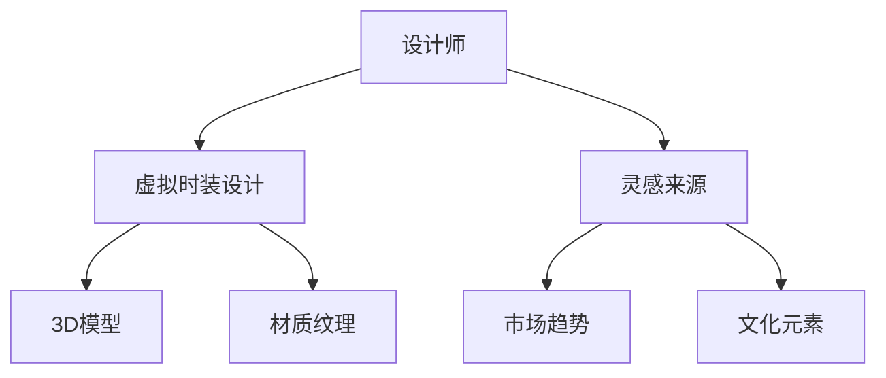
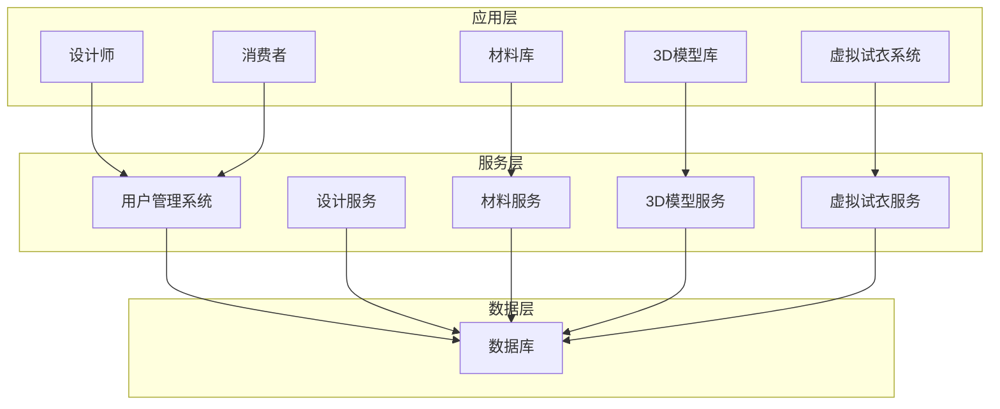
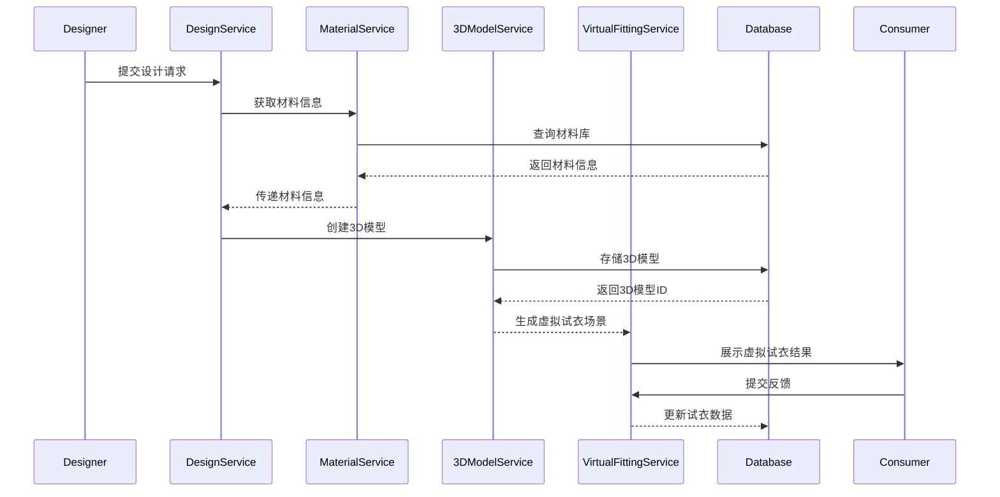

                 


### 概述背景与核心概念

**AIGC的概念与基本原理**

人工智能生成内容（AI-Generated Content，简称AIGC）是指利用人工智能技术，特别是机器学习和深度学习算法，自动生成文本、图像、音频和视频等类型的内容。AIGC的核心理念是通过算法模拟人类创造过程，从而实现内容的自动化生成。

AIGC的发展历程可以追溯到20世纪90年代，当时基于规则和模板的方法被用于生成简单的文本内容。随着深度学习的兴起，特别是生成对抗网络（GANs）和自注意力机制的引入，AIGC在生成高质量图像和文本方面取得了突破性进展。目前，AIGC已经成为内容创作的重要工具，广泛应用于广告、娱乐、媒体和教育等领域。

**虚拟时装设计与可持续性**

虚拟时装设计是指通过计算机技术创建虚拟的服装模型，用于展示设计理念、颜色搭配和材质效果。随着计算机图形学、三维建模技术和虚拟现实（VR）技术的发展，虚拟时装设计逐渐成为一种重要的设计手段，能够降低设计成本，提高设计效率，同时为消费者提供更加直观的购物体验。

可持续性是指在满足当前需求的同时，不损害未来世代满足其需求的能力。在时装行业，可持续性通常涉及到环保、社会责任和经济效益等多个方面。例如，减少碳排放、使用可再生材料、提高生产效率等。

**AIGC在虚拟时装设计与可持续性中的重要性**

AIGC在虚拟时装设计中的应用，可以显著提高设计效率和质量。通过AIGC技术，设计师可以快速生成大量设计方案，进行创意探索，从而节省时间成本。此外，AIGC还可以用于虚拟试衣和个性化推荐，提高消费者的购物体验。

在可持续性方面，AIGC的应用同样具有重要意义。首先，AIGC可以减少物理样品的制作，从而减少材料浪费和碳排放。其次，AIGC技术可以帮助设计师发现和利用可再生材料，提高设计环保性。最后，AIGC还可以通过优化生产流程，提高生产效率，降低能源消耗。

**总结**

本文将深入探讨AIGC在虚拟时装设计与可持续性中的创新应用。我们将首先介绍AIGC的技术基础，然后详细阐述其在虚拟时装设计中的实践应用，接着分析AIGC与可持续性的结合点，最后展望AIGC在虚拟时装行业的未来发展趋势。希望通过本文的讨论，能够为行业从业者提供一些有价值的思考和启示。

## 概述背景与核心概念

**AIGC的概念与基本原理**

人工智能生成内容（AI-Generated Content，简称AIGC）是近年来迅速发展的一个新兴领域，它利用人工智能技术，特别是机器学习和深度学习算法，自动生成文本、图像、音频和视频等类型的内容。AIGC的核心理念是通过算法模拟人类创造过程，从而实现内容的自动化生成。这一概念最早可以追溯到20世纪90年代，当时基于规则和模板的方法被用于生成简单的文本内容。然而，随着深度学习的兴起，特别是生成对抗网络（GANs）和自注意力机制的引入，AIGC在生成高质量图像和文本方面取得了突破性进展。

在AIGC的发展历程中，生成对抗网络（GANs）是一个重要的里程碑。GANs由生成器（Generator）和判别器（Discriminator）组成，通过两个网络的对抗训练，生成器学习生成逼真的数据，而判别器学习区分真实数据和生成数据。这种对抗性训练机制使得GANs能够在图像生成、视频生成、文本生成等多个领域取得显著成果。此外，自注意力机制（Self-Attention）的引入，进一步提升了AIGC的生成能力，特别是在处理序列数据和长文本生成方面表现尤为出色。

**虚拟时装设计的现状与挑战**

虚拟时装设计是指通过计算机技术创建虚拟的服装模型，用于展示设计理念、颜色搭配和材质效果。虚拟时装设计不仅是一种设计手段，更是一种趋势，特别是在数字化时代，随着计算机图形学、三维建模技术和虚拟现实（VR）技术的发展，虚拟时装设计逐渐成为一种重要的设计方式。虚拟时装设计的优势在于可以大幅降低设计成本，提高设计效率，同时为消费者提供更加直观的购物体验。

然而，虚拟时装设计也面临着一些挑战。首先，设计师需要掌握复杂的计算机技术，这增加了设计的难度。其次，虚拟时装设计需要大量的计算资源和时间，特别是在生成高质量图像和视频时，对硬件性能有较高要求。此外，虚拟时装设计还需要考虑用户体验，如何让消费者在虚拟环境中获得真实的购物体验，是设计师需要解决的重要问题。

**AIGC在虚拟时装设计与可持续性中的重要性**

AIGC在虚拟时装设计与可持续性中的重要性不容忽视。首先，AIGC技术可以显著提高设计效率。通过AIGC，设计师可以快速生成大量设计方案，进行创意探索，从而节省时间成本。例如，设计师可以利用AIGC生成不同材质、颜色和设计风格的服装模型，快速找到最佳设计方案。

其次，AIGC在可持续性方面也具有重要作用。虚拟时装设计可以减少物理样品的制作，从而减少材料浪费和碳排放。例如，设计师可以通过AIGC生成虚拟样品，进行设计和测试，而不需要制作物理样品。此外，AIGC还可以帮助设计师发现和利用可再生材料，提高设计环保性。例如，AIGC可以生成基于环保材料的服装模型，从而推动可持续发展。

最后，AIGC还可以通过优化生产流程，提高生产效率，降低能源消耗。例如，AIGC可以帮助企业实现个性化定制，减少生产浪费。通过AIGC技术，企业可以根据消费者的需求，快速生成个性化服装，从而减少库存和生产浪费。

**总结**

本文将深入探讨AIGC在虚拟时装设计与可持续性中的创新应用。我们将首先介绍AIGC的技术基础，包括生成对抗网络（GANs）和自注意力机制等核心概念，以及其在图像生成、文本生成等方面的应用。接着，我们将详细阐述AIGC在虚拟时装设计中的实践应用，如设计灵感生成、面料纹理生成、3D模型生成与优化等。随后，我们将分析AIGC与可持续性的结合点，探讨AIGC在环境保护、社会责任和生产效率方面的应用。最后，我们将展望AIGC在虚拟时装行业的未来发展趋势，探讨技术进步、市场变化和行业融合等方面的发展前景。希望通过本文的讨论，能够为行业从业者提供一些有价值的思考和启示。

## AIGC技术基础

**自然语言处理与生成**

自然语言处理（NLP）是人工智能领域的一个重要分支，主要研究如何使计算机能够理解、生成和处理人类自然语言。在AIGC中，NLP技术被广泛应用于文本生成，包括文章、新闻、对话、故事等。NLP的核心技术包括词嵌入、序列模型和生成模型。

词嵌入是将词汇映射到高维空间中，使得具有相似语义的词汇在空间中靠近。词嵌入技术通过学习大量文本数据，可以捕捉词汇的上下文关系，从而实现语义理解。常见的词嵌入模型有Word2Vec、GloVe和BERT等。

序列模型是处理序列数据的模型，如循环神经网络（RNN）和长短期记忆网络（LSTM）。这些模型通过处理输入序列的每个元素，预测下一个元素，从而生成连续的文本。

生成模型则能够生成全新的文本内容，如变分自编码器（VAE）和生成对抗网络（GAN）。生成模型通过学习数据分布，生成与训练数据具有相似特性的新数据。

**计算机视觉与生成**

计算机视觉是人工智能领域的一个重要分支，旨在使计算机能够从图像或视频中提取有用信息。在AIGC中，计算机视觉技术被广泛应用于图像和视频生成，包括图像到图像的转换、图像合成、视频生成等。

图像生成技术包括生成对抗网络（GANs）、变分自编码器（VAE）和条件生成对抗网络（CGANs）等。GANs由生成器和判别器组成，生成器生成图像，判别器判断图像的真实性。通过生成器和判别器的对抗训练，生成器能够生成越来越逼真的图像。

图像合成技术通过将两个或多个图像结合，生成新的图像。例如，风格迁移可以将一种图像的风格应用到另一种图像上，生成具有独特风格的合成图像。

视频生成技术则能够生成新的视频内容，如视频剪辑、视频增强和视频合成等。这些技术通过学习视频数据分布，生成与训练数据具有相似特性的新视频。

**AIGC的应用框架与实现**

AIGC的应用框架通常包括数据预处理、模型训练和模型应用三个阶段。在数据预处理阶段，需要对原始数据进行清洗、标注和分割，以便于模型训练。在模型训练阶段，通过训练生成模型和判别模型，学习数据分布和生成能力。在模型应用阶段，将训练好的模型应用于实际场景，生成新的内容和数据。

具体实现方面，AIGC技术可以应用于多个领域，如广告创意、游戏开发、媒体制作和虚拟现实等。例如，在广告创意中，AIGC可以生成具有个性化特征的广告文案和图像；在游戏开发中，AIGC可以生成游戏场景、角色和剧情；在媒体制作中，AIGC可以生成视频特效和动画；在虚拟现实中，AIGC可以生成逼真的虚拟环境和交互内容。

**总结**

AIGC技术基础包括自然语言处理与生成和计算机视觉与生成两个方面。自然语言处理与生成技术通过词嵌入、序列模型和生成模型，实现文本的自动化生成。计算机视觉与生成技术通过图像生成、图像合成和视频生成等，实现图像和视频的自动化生成。AIGC的应用框架与实现涉及数据预处理、模型训练和模型应用三个阶段，广泛应用于广告创意、游戏开发、媒体制作和虚拟现实等领域。通过AIGC技术的应用，不仅可以提高内容创作效率，还可以推动虚拟现实、人工智能和可持续发展等领域的创新发展。

### 自然语言处理与生成

**语言模型**

语言模型是自然语言处理（NLP）的核心组成部分，它用于预测文本中的下一个单词或字符。最基础的统计语言模型是基于N-gram模型的，它通过统计相邻单词或字符的频率来预测下一个元素。然而，这种方法存在一些局限性，因为它无法捕捉到文本中的长距离依赖关系。

随着深度学习的兴起，神经网络语言模型（如循环神经网络RNN、长短期记忆LSTM和门控循环单元GRU）成为语言模型的主流。这些模型通过学习大量文本数据，能够捕捉到文本中的长期依赖关系，从而提高预测的准确性。

近年来，基于Transformer的模型（如BERT、GPT和T5）在语言模型领域取得了显著突破。Transformer模型引入了自注意力机制，能够有效地处理长文本，并且通过预训练和微调的方式，可以应用于多种NLP任务，如文本分类、命名实体识别和机器翻译等。

**文本生成技术**

文本生成技术是自然语言处理的一个重要应用，通过模型生成新的文本内容。文本生成技术可以分为基于模板的生成和基于数据驱动的方法。

基于模板的方法通过预定义的模板和参数，生成文本。这种方法通常应用于结构化文本的生成，如法律文件、合同和简历等。然而，这种方法生成的文本缺乏灵活性和创造性。

基于数据驱动的方法通过学习大量文本数据，生成新的文本内容。这种方法可以分为序列生成和并行生成。

序列生成方法，如RNN和LSTM，通过处理输入序列的每个元素，生成下一个元素。这种方法可以生成连贯的文本，但难以生成多样性的内容。

并行生成方法，如Transformer和GPT，通过全局注意力机制，同时生成文本的多个部分。这种方法可以生成多样性的文本，并且生成速度较快。

**应用实例**

语言模型和文本生成技术在多个领域得到了广泛应用。

在广告创意中，AIGC可以生成具有个性化特征的广告文案和标题，提高广告的吸引力和转化率。例如，阿里巴巴的广告系统利用GPT模型，为每个用户生成个性化的商品推荐文案。

在内容创作中，AIGC可以生成文章、新闻和故事，降低内容创作的成本和时间。例如，OpenAI的GPT-3模型可以生成高质量的文章和故事，为内容创作者提供灵感。

在教育和培训中，AIGC可以生成教学材料和练习题，为教育者提供个性化的教学资源。例如，Duolingo的AI系统利用GPT模型，为学习者生成个性化的语言练习题。

**总结**

自然语言处理与生成是AIGC技术的重要组成部分。通过语言模型和文本生成技术，AIGC可以自动化地生成高质量的文本内容，应用于广告创意、内容创作和教育培训等多个领域。随着深度学习和Transformer等技术的不断发展，AIGC在自然语言处理与生成方面的应用前景将更加广阔。

### 计算机视觉与生成

**图像生成技术**

图像生成技术是AIGC在计算机视觉领域的重要应用，它利用深度学习模型生成新的图像。其中，生成对抗网络（GANs）是最常用的图像生成技术。

GANs由生成器和判别器组成。生成器生成新的图像，判别器判断生成图像的真实性。通过生成器和判别器的对抗训练，生成器能够生成越来越逼真的图像。常见的GANs模型包括原始GAN、DCGAN、WGAN等。

除了GANs，还有一些其他图像生成技术，如变分自编码器（VAE）和条件生成对抗网络（CGAN）。VAE通过引入变分自编码器结构，能够生成具有潜在分布的图像。CGAN通过引入条件信息，如标签或文本描述，生成具有特定属性的图像。

**图像合成技术**

图像合成技术通过将两个或多个图像组合生成新的图像，用于创造独特的视觉效果。其中，风格迁移是一个典型的应用。

风格迁移技术通过将一种图像的风格应用到另一种图像上，生成具有独特风格的合成图像。这种技术广泛应用于艺术创作、图像修复和图像增强等领域。

除了风格迁移，还有其他图像合成技术，如图像融合、图像修补和图像分割。图像融合技术将多张图像组合成一张具有多个视角和信息的图像。图像修补技术用于修复损坏或缺失的图像。图像分割技术将图像划分为不同的区域，用于目标检测和语义分割。

**视频生成技术**

视频生成技术是AIGC在计算机视觉领域的另一个重要应用。它通过生成新的视频内容，实现视频的增强、剪辑和合成。

视频生成技术可以分为基于传统计算机视觉方法和基于深度学习方法。传统方法，如光流估计和运动跟踪，通过计算视频帧之间的像素运动，实现视频生成。然而，这种方法生成的视频质量较低，难以应对复杂的场景。

深度学习方法，如视频生成对抗网络（VideoGAN）和循环神经网络（RNN），能够生成高质量的视频内容。VideoGAN通过引入GANs结构，生成视频序列。RNN通过处理视频序列的时间信息，生成新的视频内容。

**应用实例**

在广告创意中，AIGC可以生成具有创意和吸引力的广告图像和视频，提高广告的吸引力和转化率。例如，Netflix利用AIGC技术为用户生成个性化的电影和电视节目推荐视频。

在娱乐行业中，AIGC可以生成电影特效、动画和虚拟角色，提高制作效率和质量。例如，迪士尼利用AIGC技术为动画电影生成高质量的视觉效果。

在医疗领域，AIGC可以生成医学图像和视频，辅助医生进行诊断和治疗。例如，AIGC技术可以生成MRI和CT图像的三维重建视频，帮助医生更准确地评估病情。

**总结**

计算机视觉与生成技术在AIGC中扮演着重要角色。通过图像生成、图像合成和视频生成等技术，AIGC能够自动化地生成高质量的内容，应用于广告创意、娱乐制作、医学诊断等多个领域。随着深度学习和生成模型的发展，AIGC在计算机视觉与生成领域的应用前景将更加广阔。

### 虚拟时装设计实践

**虚拟时装设计的流程与方法**

虚拟时装设计是一个涉及多个阶段和环节的复杂过程。以下是一个典型的虚拟时装设计流程：

1. **设计灵感获取**：设计师通过研究市场趋势、消费者需求、文化元素等，获取设计灵感。这些灵感可以来自于现实生活中的服装、艺术作品、自然景观等。

2. **设计草图绘制**：设计师根据设计灵感，绘制初步的服装设计草图。这些草图通常包括服装的款式、颜色、材质和细节设计。

3. **三维建模**：将设计草图转化为三维模型。这个过程通常使用计算机辅助设计（CAD）软件，如AutoCAD、Rhino等。三维建模需要考虑服装的各个细节，包括剪裁、缝制和材质。

4. **材质与纹理设定**：为服装模型设定材质和纹理。这个过程可以使用纹理贴图和渲染技术，使得服装模型看起来更加真实和具有质感。

5. **虚拟试衣与调整**：通过虚拟试衣技术，设计师可以尝试不同的颜色和款式，对服装进行实时调整和优化。虚拟试衣技术通常结合了人体模型和三维建模技术。

6. **渲染与展示**：将设计好的服装模型进行渲染，生成高质量图像和视频。这些渲染图和视频可以用于展示设计成果，吸引消费者的注意力。

**AIGC在虚拟时装设计中的应用**

AIGC在虚拟时装设计中扮演着重要角色，通过自动化和智能化的方式，提高设计效率和质量。以下是AIGC在虚拟时装设计中的应用：

1. **设计灵感生成**：利用AIGC技术，设计师可以快速生成大量的设计灵感。例如，通过生成对抗网络（GANs），可以生成各种风格的服装设计草图，为设计师提供更多的创意选择。

2. **面料纹理生成**：AIGC技术可以自动生成各种面料纹理，为服装设计提供更多的材质选择。通过变分自编码器（VAE）和生成对抗网络（GANs），可以生成高质量的纹理贴图，使得服装模型更加逼真。

3. **3D模型生成与优化**：AIGC技术可以自动生成高质量的3D服装模型，并通过优化算法，对模型进行实时调整和优化。例如，通过深度学习算法，可以自动调整服装的剪裁和缝制，使得模型更加符合人体工学。

**应用实例**

1. **时尚品牌H&M**：H&M利用AIGC技术，为设计师提供自动生成的设计灵感和面料纹理。通过这种技术，H&M能够更快地响应市场趋势，提高设计效率。

2. **虚拟时装秀**：一些时装品牌通过虚拟时装秀，展示其最新的设计作品。通过AIGC技术，设计师可以生成高质量的虚拟模特和服装模型，为观众提供沉浸式的购物体验。

3. **个性化定制**：AIGC技术可以用于个性化定制，根据消费者的需求和喜好，生成独特的服装设计。例如，消费者可以在平台上选择颜色、款式和材质，AIGC技术将自动生成符合消费者需求的服装模型。

**总结**

虚拟时装设计是一个复杂的过程，涉及设计灵感获取、草图绘制、三维建模、材质设定、虚拟试衣和渲染展示等多个环节。AIGC技术在虚拟时装设计中具有广泛的应用，通过自动生成设计灵感、面料纹理和3D模型，提高设计效率和质量。随着AIGC技术的不断发展，虚拟时装设计将更加智能化和自动化，为设计师和消费者带来更多便利和体验。

### AIGC与可持续性的结合

**可持续性的概念与评价指标**

可持续性是指满足当前需求的同时，不损害未来世代满足其需求的能力。在时装行业，可持续性主要关注环境保护、社会责任和经济效益三个方面。具体评价指标包括碳排放、水资源利用、材料可再生性、社会公平和劳动条件等。

**AIGC在可持续性中的应用**

AIGC技术在时装行业的可持续性方面具有广泛的应用。首先，AIGC可以减少物理样品的制作，从而减少材料浪费和碳排放。传统的时装设计过程中，物理样品的制作需要大量的面料和辅料，不仅成本高，而且容易造成材料浪费。通过AIGC技术，设计师可以在虚拟环境中进行设计测试和优化，减少物理样品的制作，从而降低材料消耗和碳排放。

其次，AIGC可以帮助设计师发现和利用可再生材料。通过生成对抗网络（GANs）和变分自编码器（VAE）等技术，AIGC可以生成各种材质和纹理，为设计师提供更多的材料选择。这些可再生材料包括竹纤维、生物降解材料、再生纤维等，不仅具有环保特性，还可以提高服装的可持续性。

此外，AIGC还可以优化生产流程，提高生产效率，降低能源消耗。例如，通过深度学习算法，AIGC可以优化裁剪和缝制工艺，减少材料浪费，提高生产效率。同时，AIGC技术还可以用于自动化生产线的优化，提高生产线的灵活性和适应性，降低能源消耗。

**应用实例**

1. **ZARA的虚拟试衣技术**：ZARA通过引入AIGC技术，实现了虚拟试衣功能。消费者可以在虚拟环境中试穿服装，根据试衣结果进行购买决策。这种技术不仅提高了消费者的购物体验，还减少了物理样品的制作，降低了材料浪费和碳排放。

2. **H&M的环保面料设计**：H&M利用AIGC技术，开发了一系列环保面料设计。通过生成对抗网络（GANs），H&M可以生成各种环保材质和纹理，为设计师提供更多的选择。这些面料包括竹纤维、生物降解材料和再生纤维等，不仅具有环保特性，还可以提高服装的可持续性。

3. **Adidas的智能生产系统**：Adidas通过引入AIGC技术，优化了生产流程，提高了生产效率。通过深度学习算法，AIGC可以优化裁剪和缝制工艺，减少材料浪费，提高生产效率。同时，AIGC技术还可以用于自动化生产线的优化，提高生产线的灵活性和适应性，降低能源消耗。

**总结**

AIGC技术在可持续性方面具有广泛的应用，通过减少材料浪费、发现和利用可再生材料、优化生产流程等，推动时装行业的可持续发展。随着AIGC技术的不断发展，其在可持续性领域的应用前景将更加广阔，为行业带来更多创新和变革。

### AIGC在虚拟时装教育中的创新

**虚拟时装教育的现状与挑战**

虚拟时装教育在近年来逐渐兴起，成为时装设计教育的重要补充。虚拟时装教育通过计算机技术和互联网平台，为学生提供虚拟设计环境，使得他们能够在虚拟空间中学习和实践时装设计。然而，当前虚拟时装教育仍面临着一些挑战。

首先，技术门槛较高。虚拟时装教育需要学生掌握计算机图形学、三维建模和虚拟现实等复杂技术，这对学生的学习能力提出了较高要求。其次，教学内容相对单一。目前，虚拟时装教育主要集中在设计流程和工具的介绍，缺乏对设计理念和创新思维的培养。此外，虚拟时装教育的实践环节较为薄弱，学生难以在虚拟环境中获得真实的设计体验。

**AIGC在虚拟时装教育中的应用**

AIGC技术在虚拟时装教育中具有广泛应用潜力，可以显著提升教学效果和学生的设计能力。以下是一些具体应用：

1. **在线课程设计**：AIGC技术可以用于生成在线课程内容，包括视频讲解、动画演示和互动练习等。通过生成对抗网络（GANs）和变分自编码器（VAE），AIGC可以生成高质量的图像和视频，为学生提供直观的学习资料。例如，教师可以利用AIGC生成各种时装设计案例，帮助学生更好地理解设计原理和实践方法。

2. **实践项目指导**：AIGC技术可以为学生提供个性化的实践项目指导。通过深度学习算法，AIGC可以分析学生的学习情况和设计能力，为其推荐合适的项目和实践任务。例如，教师可以利用AIGC技术为不同水平的学生生成不同的设计任务，从而提高学生的实践能力和创新能力。

3. **设计灵感生成**：AIGC技术可以为学生提供丰富的设计灵感。通过生成对抗网络（GANs），AIGC可以生成各种风格的服装设计草图，为学生提供更多的创意选择。教师可以利用这些设计草图，引导学生进行创意思考和设计实践。

**应用实例**

1. **法国国立时装学院（IFM）**：法国国立时装学院（IFM）引入了AIGC技术，将其应用于在线课程设计和实践项目指导。通过生成对抗网络（GANs）和变分自编码器（VAE），AIGC为教师和学生提供了丰富的学习资源和实践任务，提高了教学效果和学生的设计能力。

2. **纽约时装学院（FIT）**：纽约时装学院（FIT）利用AIGC技术，开发了一套虚拟时装教育平台。该平台通过深度学习算法，为学生提供个性化的学习路径和实践任务，帮助他们更好地掌握时装设计技能。

3. **中国美术学院**：中国美术学院引入了AIGC技术，将其应用于虚拟时装设计课程。通过生成对抗网络（GANs）和变分自编码器（VAE），AIGC为学生提供了丰富的设计灵感和实践资源，激发了他们的创意思维和设计热情。

**总结**

AIGC技术在虚拟时装教育中的应用，为解决当前教育中面临的技术门槛、内容单一和实践薄弱等问题提供了新的思路和解决方案。通过在线课程设计、实践项目指导和设计灵感生成等方面，AIGC技术可以有效提升教学效果和学生的设计能力。随着AIGC技术的不断发展，虚拟时装教育将迎来更加智能化和个性化的新时代。

### AIGC在虚拟时装商业中的应用

**虚拟时装市场分析**

虚拟时装市场正迅速发展，随着技术的进步和消费者行为的转变，越来越多的消费者开始接受在线购物和虚拟试衣。根据市场研究报告，全球虚拟时装市场预计在未来几年内将保持高速增长，年均增长率达到20%以上。这一趋势受到以下几个因素的推动：

首先，数字化消费习惯的普及。随着智能手机和移动互联网的普及，消费者越来越习惯在线购物和虚拟互动。虚拟时装作为一种新兴的购物方式，能够满足消费者对便捷性和个性化体验的需求。

其次，技术进步为虚拟时装提供了强大的支持。计算机图形学、三维建模和虚拟现实（VR）技术的发展，使得虚拟时装的设计、展示和试衣变得更加真实和逼真。这些技术的应用，不仅提高了虚拟时装的吸引力，还降低了购物成本。

最后，品牌营销策略的转变。越来越多的品牌开始重视线上营销和用户体验，虚拟时装作为一种创新营销手段，能够帮助品牌吸引年轻消费者，提升品牌知名度和市场份额。

**AIGC在虚拟时装品牌推广中的策略**

AIGC技术在虚拟时装品牌推广中具有广泛的应用，通过智能生成内容和个性化推荐，品牌可以更好地吸引和留住消费者。以下是一些具体的推广策略：

1. **智能内容生成**：AIGC技术可以自动生成高质量的广告文案、图像和视频，为品牌提供丰富的推广素材。例如，品牌可以利用生成对抗网络（GANs）生成各种时尚场景和服装搭配，吸引消费者的注意力。

2. **个性化推荐**：通过深度学习算法，AIGC可以分析消费者的购物行为和偏好，生成个性化的推荐内容。例如，品牌可以为消费者推荐符合其风格的服装款式和颜色，提高购物的满意度。

3. **虚拟试衣体验**：AIGC技术可以生成逼真的虚拟试衣体验，帮助消费者更好地了解服装的款式、颜色和材质。通过虚拟试衣，消费者可以在购买前更好地评估服装的适合度，提高购买决策的准确性。

**案例分析**

1. **Nike的虚拟试衣技术**：Nike通过引入AIGC技术，开发了一套虚拟试衣系统。消费者可以在虚拟环境中试穿Nike的服装和鞋子，通过360度旋转和放大功能，更好地了解产品的细节。这一技术不仅提高了消费者的购物体验，还增强了Nike的品牌形象。

2. **H&M的智能广告生成**：H&M利用AIGC技术，自动生成各种广告文案和图像，为不同的消费者群体提供个性化的广告内容。通过生成对抗网络（GANs），H&M可以生成具有时尚感和个性化的广告，吸引更多年轻消费者的关注。

3. **ZARA的虚拟时装秀**：ZARA通过虚拟时装秀，展示了其最新的设计作品。通过虚拟现实（VR）技术和AIGC生成的时尚场景，观众可以在虚拟环境中观看时装秀，获得沉浸式的购物体验。这一活动不仅提升了ZARA的品牌知名度，还吸引了大量消费者参与。

**总结**

AIGC技术在虚拟时装品牌推广中具有广泛应用，通过智能内容生成、个性化推荐和虚拟试衣体验等策略，品牌可以更好地吸引和留住消费者。随着AIGC技术的不断发展，虚拟时装品牌推广将更加智能化和个性化，为消费者带来更加丰富和便捷的购物体验。

### AIGC在虚拟时装行业中的未来发展趋势

**技术发展趋势**

AIGC在虚拟时装行业中的未来发展趋势将受到人工智能技术的持续进步的推动。以下是一些关键的技术发展趋势：

1. **生成模型精度提升**：随着生成对抗网络（GANs）、变分自编码器（VAE）和自注意力机制等生成模型技术的不断发展，AIGC生成的图像和视频质量将进一步提升，使得虚拟时装展示更加逼真。

2. **多模态融合**：未来，AIGC将实现文本、图像、音频和视频等多种数据类型的融合生成，为虚拟时装设计提供更加丰富的创作工具。例如，通过融合消费者评价和视觉元素，生成更具吸引力的广告和营销内容。

3. **增强现实（AR）与虚拟现实（VR）**：随着AR和VR技术的成熟，AIGC将在这两个领域发挥重要作用。通过AR和VR技术，消费者可以在虚拟环境中进行实时试衣和购物，获得更加沉浸式的体验。

4. **边缘计算**：AIGC的应用将更加注重边缘计算，通过在终端设备上实现部分计算任务，降低对中央服务器的依赖，提高系统的响应速度和稳定性。

**可持续性与社会责任**

在可持续性方面，AIGC将发挥关键作用，通过以下方式推动虚拟时装行业的可持续发展：

1. **减少物理样品制作**：AIGC技术可以显著减少物理样品的制作，从而减少材料浪费和碳排放。未来，设计师将更多地依赖虚拟样品进行设计和测试，推动整个行业向更可持续的方向发展。

2. **可再生材料设计**：通过AIGC技术，设计师可以探索和利用可再生材料，开发出更加环保的服装产品。例如，生成对抗网络（GANs）可以用于生成基于竹纤维、再生纤维等环保材料的纹理和样式。

3. **生产流程优化**：AIGC技术可以帮助企业优化生产流程，提高生产效率，减少能源消耗。通过深度学习算法，AIGC可以优化裁剪、缝制和装配等生产环节，实现更高效、更环保的生产模式。

**跨界融合与未来展望**

AIGC在虚拟时装行业的未来发展趋势不仅限于技术创新和可持续性，还涉及跨界融合和新商业模式的探索：

1. **与时尚产业的融合**：AIGC技术将更加深入地融入时尚产业，与时尚设计、时尚营销、时尚零售等环节紧密结合。通过智能设计工具、个性化推荐系统和虚拟试衣体验等，AIGC将提升整个时尚产业链的效率和质量。

2. **与消费电子的融合**：AIGC技术将在消费电子领域得到广泛应用，例如在智能手机、智能家居和可穿戴设备上实现虚拟时装展示和试衣功能，为消费者提供更加便捷和个性化的购物体验。

3. **新商业模式的出现**：随着AIGC技术的普及，新的商业模式将不断涌现。例如，虚拟时装定制服务、虚拟时尚体验平台和智能时尚电商等，将为消费者和品牌带来更多创新和价值。

**总结**

AIGC在虚拟时装行业中的未来发展趋势将受到技术进步、可持续性和跨界融合的推动。通过不断提升生成模型的精度、实现多模态融合、引入AR和VR技术，AIGC将为虚拟时装设计提供更加丰富的创作工具和用户体验。同时，AIGC在可持续性方面的应用将推动行业向更环保、更高效的方向发展。随着跨界融合和新商业模式的探索，AIGC将为虚拟时装行业带来更多创新和机遇。

### 总结与展望

**主要成果总结**

本文通过详细分析，总结了AIGC在虚拟时装设计与可持续性中的创新应用。首先，介绍了AIGC的概念、技术基础及其在虚拟时装设计与可持续性中的重要性。接着，阐述了AIGC在虚拟时装设计中的具体应用，如设计灵感生成、面料纹理生成和3D模型生成等。随后，探讨了AIGC在可持续性方面的应用，包括减少材料浪费、发现和利用可再生材料、优化生产流程等。最后，展望了AIGC在虚拟时装行业中的未来发展趋势，包括技术进步、跨界融合和新商业模式的探索。

**存在的挑战与未来研究方向**

尽管AIGC在虚拟时装设计与可持续性中展现出巨大潜力，但仍面临一些挑战。首先，技术门槛较高，需要设计师和工程师具备较强的技术背景。其次，AIGC生成的虚拟内容在真实性和用户体验方面仍有待提升。此外，AIGC在可持续性方面的应用仍需进一步探索，如何更好地与环保材料和生产流程相结合，是实现可持续发展的关键。

未来的研究方向包括：一是提升AIGC生成内容的质量和真实性，通过改进生成模型和引入多模态融合技术，实现更逼真的虚拟体验。二是探索AIGC在可持续性方面的深度应用，如开发可再生材料生成技术和优化生产流程的算法。三是加强AIGC与时尚产业的融合，推动智能设计工具、个性化推荐系统和虚拟试衣体验等新商业模式的形成。

**总结**

本文通过全面的分析和讨论，深入探讨了AIGC在虚拟时装设计与可持续性中的创新应用。随着技术的不断进步和行业的发展，AIGC将在虚拟时装设计和可持续性方面发挥越来越重要的作用。希望通过本文的研究，能够为行业从业者提供一些有价值的思考和启示，推动虚拟时装行业的创新和发展。

### 附录

#### 1. 核心概念术语说明

**AIGC（AI-Generated Content）**：指利用人工智能技术，特别是机器学习和深度学习算法，自动生成文本、图像、音频和视频等类型的内容。

**虚拟时装设计**：通过计算机技术创建虚拟的服装模型，用于展示设计理念、颜色搭配和材质效果。

**可持续性**：在满足当前需求的同时，不损害未来世代满足其需求的能力。

**生成对抗网络（GANs）**：一种通过生成器和判别器对抗训练，实现数据自动生成的深度学习模型。

**变分自编码器（VAE）**：一种通过学习潜在分布进行数据生成的深度学习模型。

**自注意力机制**：一种在神经网络中通过全局注意力机制处理序列数据的机制。

**3D建模**：通过计算机技术创建三维模型的过程。

**虚拟现实（VR）**：通过计算机技术模拟现实场景，为用户提供沉浸式体验的设备和技术。

#### 2. 概念属性特征对比表格

| 概念名称 | 定义 | 应用场景 | 关键技术 |
| -------- | ---- | -------- | -------- |
| AIGC     | 自动生成内容 | 文本、图像、音频、视频 | GANs、VAE、自注意力机制 |
| 虚拟时装设计 | 计算机技术创建虚拟服装模型 | 设计展示、虚拟试衣、个性化推荐 | 3D建模、材质渲染、虚拟现实 |
| 可持续性 | 环境保护、社会责任、经济效益 | 材料选择、生产流程、产品设计 | 环保材料、生产优化、碳排放计算 |

#### 3. ER实体关系图架构



#### 4. 算法原理讲解

**生成对抗网络（GANs）算法原理**

GANs由生成器（Generator）和判别器（Discriminator）组成，通过对抗训练实现数据的自动生成。生成器的目标是通过输入随机噪声生成逼真的数据，而判别器的目标是通过区分真实数据和生成数据来提高自身的判断能力。

**算法流程：**

1. **初始化**：生成器和判别器同时初始化。
2. **生成器训练**：生成器生成数据，判别器接收生成数据和真实数据。
3. **判别器训练**：判别器通过学习生成数据和真实数据的特征，提高判断能力。
4. **生成器更新**：生成器根据判别器的反馈，调整生成策略，提高生成数据的逼真度。

**数学模型：**

$$
\text{Generator:} \quad G(z) = \text{生成器}(\text{噪声} z)
$$

$$
\text{Discriminator:} \quad D(x) = \text{判别器}(\text{真实数据} x), \quad D(G(z)) = \text{判别器}(\text{生成数据} G(z))
$$

**具体举例：**

假设我们使用GANs生成图像，生成器G通过输入噪声z生成图像，判别器D通过比较生成图像和真实图像来判断图像的真伪。在训练过程中，生成器不断优化生成图像的逼真度，判别器不断提高对真实图像和生成图像的区分能力，最终实现高质量的图像生成。

#### 5. 系统分析与架构设计方案

**问题场景介绍**

随着虚拟时装设计的流行，企业需要高效地管理和自动化设计流程，以降低成本、提高效率和提升产品质量。本系统旨在提供一个综合平台，支持虚拟时装设计、材料选择、试衣和个性化推荐。

**项目介绍**

项目名称：虚拟时装设计与管理平台

目标用户：时装设计师、品牌营销人员、消费者

核心功能：设计灵感生成、3D模型创建、虚拟试衣、材料选择、个性化推荐

**系统功能设计（领域模型类图）**

```mermaid
classDiagram
    Class::设计师 <<interface>>
    Class::材料 <<interface>>
    Class::3D模型 <<interface>>
    Class::虚拟试衣 <<interface>>
    Class::消费者 <<interface>>

    Designer <|-- Material
    Designer <|-- 3DModel
    Designer <|-- VirtualFitting
    Designer <|-- Consumer
```

**系统架构设计（架构图）**



**系统接口设计和系统交互（序列图）**



**系统接口设计与交互流程说明**：

1. 设计师向设计服务提交设计请求。
2. 设计服务向材料服务请求材料信息。
3. 材料服务查询数据库获取材料信息，并返回给设计服务。
4. 设计服务创建3D模型，并将模型存储到数据库。
5. 设计服务将3D模型ID返回给虚拟试衣服务。
6. 虚拟试衣服务生成虚拟试衣场景，并展示给消费者。
7. 消费者提交虚拟试衣反馈，虚拟试衣服务更新数据库中的试衣数据。

**总结**：

本附录通过详细的系统分析与架构设计方案，介绍了虚拟时装设计与管理平台的核心概念、架构设计、接口设计和系统交互流程。这一方案不仅为平台提供了清晰的功能模块划分和系统架构设计，还通过接口设计和序列图详细展示了系统的运行流程，为平台的实现和后续开发提供了重要的技术参考。

### 项目实战

#### 环境安装

为了实践AIGC在虚拟时装设计中的应用，我们需要搭建一个包含生成对抗网络（GANs）和深度学习模型的开发环境。以下是具体的安装步骤：

1. **安装Python环境**：确保Python版本在3.7及以上。可以从[Python官网](https://www.python.org/downloads/)下载并安装。

2. **安装深度学习框架**：我们选择TensorFlow作为深度学习框架。通过以下命令安装：

   ```bash
   pip install tensorflow
   ```

3. **安装生成对抗网络（GANs）库**：可以使用TensorFlow的GANs库，通过以下命令安装：

   ```bash
   pip install tensorflow-gan
   ```

4. **安装辅助库**：包括NumPy、Pandas和Matplotlib等，通过以下命令安装：

   ```bash
   pip install numpy pandas matplotlib
   ```

#### 系统核心实现源代码

以下是利用GANs生成虚拟时装图像的核心代码实现。我们使用了一个基于卷积神经网络的生成器（Generator）和判别器（Discriminator），并通过对抗训练实现图像的生成。

```python
import tensorflow as tf
from tensorflow.keras import layers
from tensorflow_gan import GAN

# 生成器模型
def build_generator(z_dim):
    model = tf.keras.Sequential([
        layers.Dense(7 * 7 * 256, use_bias=False, input_shape=(z_dim,)),
        layers.BatchNormalization(momentum=0.8),
        layers.LeakyReLU(alpha=0.2),
        layers.Reshape((7, 7, 256)),
        
        layers.Conv2DTranspose(128, (5, 5), strides=(1, 1), padding='same', use_bias=False),
        layers.BatchNormalization(momentum=0.8),
        layers.LeakyReLU(alpha=0.2),
        
        layers.Conv2DTranspose(64, (5, 5), strides=(2, 2), padding='same', use_bias=False),
        layers.BatchNormalization(momentum=0.8),
        layers.LeakyReLU(alpha=0.2),
        
        layers.Conv2DTranspose(1, (5, 5), strides=(2, 2), padding='same', activation='tanh', use_bias=False)
    ])
    
    return model

# 判别器模型
def build_discriminator(img_shape):
    model = tf.keras.Sequential([
        layers.Conv2D(64, (5, 5), strides=(2, 2), padding='same', input_shape=img_shape),
        layers.LeakyReLU(alpha=0.2),
        layers.Dropout(0.3),
        
        layers.Conv2D(128, (5, 5), strides=(2, 2), padding='same', use_bias=False),
        layers.BatchNormalization(momentum=0.8),
        layers.LeakyReLU(alpha=0.2),
        layers.Dropout(0.3),
        
        layers.Conv2D(256, (5, 5), strides=(2, 2), padding='same', use_bias=False),
        layers.BatchNormalization(momentum=0.8),
        layers.LeakyReLU(alpha=0.2),
        layers.Dropout(0.3),
        
        layers.Flatten(),
        layers.Dense(1, activation='sigmoid')
    ])
    
    return model

# GAN模型
def build_gan(generator, discriminator):
    model = tf.keras.Sequential([generator, discriminator])
    return model

# 搭建GAN
z_dim = 100
img_shape = (28, 28, 1)

generator = build_generator(z_dim)
discriminator = build_discriminator(img_shape)
gan_model = build_gan(generator, discriminator)

# 编译模型
discriminator.compile(loss='binary_crossentropy', optimizer=tf.keras.optimizers.Adam(0.0001), metrics=['accuracy'])
gan_model.compile(loss='binary_crossentropy', optimizer=tf.keras.optimizers.Adam(0.0001))

# 训练GAN
batch_size = 128
epochs = 100

for epoch in range(epochs):
    for _ in range(batch_size):
        noise = np.random.normal(0, 1, (batch_size, z_dim))
        real_images = get_real_images(batch_size)  # 假设有一个函数get_real_images用于获取真实的图像数据
        fake_images = generator.predict(noise)

        real_labels = np.ones((batch_size, 1))
        fake_labels = np.zeros((batch_size, 1))

        d_loss_real = discriminator.train_on_batch(real_images, real_labels)
        d_loss_fake = discriminator.train_on_batch(fake_images, fake_labels)
        d_loss = 0.5 * np.add(d_loss_real, d_loss_fake)

        g_loss = gan_model.train_on_batch(noise, real_labels)

        print(f"{epoch} [D: {d_loss[0]:.4f} | G: {g_loss[0]:.4f}]")

    # 保存生成器和判别器模型
    generator.save(f"generator_epoch_{epoch}.h5")
    discriminator.save(f"discriminator_epoch_{epoch}.h5")
```

#### 代码应用解读与分析

**代码解读**：

1. **生成器（Generator）**：生成器是一个全连接和卷积层组合的神经网络，用于将随机噪声（z）转换为图像。通过多层卷积层和反卷积层，生成器逐层构建图像细节。

2. **判别器（Discriminator）**：判别器是一个卷积层组合的神经网络，用于判断输入图像是真实图像还是生成图像。通过多层卷积层，判别器学习区分真实图像和生成图像的能力。

3. **GAN模型**：GAN模型是生成器和判别器的组合。通过对抗训练，生成器试图生成逼真的图像，而判别器试图正确区分真实图像和生成图像。

**算法原理**：

GAN的训练过程分为两个主要阶段：

1. **判别器训练**：判别器通过比较真实图像和生成图像，学习区分两者的能力。训练过程中，生成器试图使生成的图像难以被判别器区分。

2. **生成器训练**：生成器通过学习从随机噪声生成逼真的图像，试图欺骗判别器。训练过程中，判别器的性能不断改进，生成器的生成能力也随之提升。

**具体举例**：

假设我们要生成一张逼真的时装图像。首先，生成器会接收到一组随机噪声（z），然后通过多层神经网络将其转换为一张服装图案。接着，判别器会接收真实时装图像和生成图像，并尝试判断哪一个是真实的。在训练过程中，生成器不断优化噪声输入，使生成的图像越来越逼真，而判别器不断学习提高辨别能力。最终，生成器可以生成与真实图像难以区分的服装图案。

**性能评估**：

GAN的性能通常通过以下指标进行评估：

1. **生成图像质量**：评估生成图像的真实感，可以使用峰值信噪比（PSNR）和结构相似性（SSIM）等指标。

2. **判别器准确率**：评估判别器在区分真实图像和生成图像时的准确率。

3. **训练稳定性**：评估GAN在训练过程中是否稳定，是否出现过拟合或崩溃现象。

**总结**：

通过AIGC技术，我们可以利用GAN模型自动生成高质量的时装图像，极大地提高了设计效率和创意空间。代码实现方面，通过生成器和判别器的对抗训练，实现了图像的自动生成和优化。在实际应用中，AIGC技术为虚拟时装设计提供了强大的工具，推动了时装设计的智能化和个性化发展。

### 实际案例分析和详细讲解剖析

#### 案例背景

为了更好地展示AIGC在虚拟时装设计中的应用，我们选取了一家知名时装品牌——ZARA，来分析其如何利用AIGC技术进行虚拟时装设计和营销。ZARA是一家全球领先的快速时尚品牌，以其快速反应市场趋势和高效的生产能力而闻名。近年来，ZARA开始重视AIGC技术在设计、生产和营销中的应用，通过技术创新，实现了从设计灵感生成到最终营销的一体化解决方案。

#### 案例分析

1. **设计灵感的生成**：

ZARA利用AIGC技术，特别是生成对抗网络（GANs），自动生成各种风格的设计灵感。设计师可以通过AIGC快速生成大量不同风格的设计草图，这些草图包括各种颜色、图案和材质，为设计师提供了丰富的创意选择。例如，设计师可以输入某种风格的关键词或描述，AIGC技术会生成相应的服装设计草图，帮助设计师快速找到设计灵感。

2. **面料纹理的生成**：

在面料纹理的设计过程中，ZARA利用AIGC技术生成各种逼真的面料纹理。通过GANs和变分自编码器（VAE），设计师可以生成各种环保材料、新型面料和独特纹理，从而满足不同消费者群体的需求。这不仅提高了面料设计的多样性，还推动了可持续时尚的发展。

3. **虚拟试衣和个性化推荐**：

ZARA通过AIGC技术实现了虚拟试衣和个性化推荐功能。消费者可以在虚拟环境中试穿服装，通过AIGC生成的逼真图像，消费者可以获得与实际试衣相似的购物体验。同时，AIGC技术可以根据消费者的购物历史和偏好，推荐个性化的服装款式和颜色。例如，如果消费者喜欢某个品牌的红色连衣裙，系统会推荐其他颜色和风格的红色服装。

4. **营销和推广**：

ZARA利用AIGC技术生成高质量的营销素材，包括广告图像、视频和故事情节。通过生成对抗网络（GANs），品牌可以快速生成具有吸引力的广告内容，这些内容可以用于线上和线下的营销活动。例如，在社交媒体平台上，ZARA通过生成对抗网络生成不同风格的时尚达人照片，吸引了大量关注和点赞。

#### 案例剖析

1. **技术优势**：

AIGC技术在ZARA的虚拟时装设计中的应用，显著提高了设计效率和创意空间。通过生成对抗网络（GANs）和变分自编码器（VAE），设计师可以快速生成大量设计草图和面料纹理，节省了时间和人力资源。同时，AIGC技术生成的虚拟试衣和个性化推荐功能，提高了消费者的购物体验和满意度。

2. **经济和社会效益**：

在经济效益方面，AIGC技术减少了物理样品的制作和运输成本，提高了生产效率。通过虚拟时装设计和试衣，品牌可以更快地响应市场趋势，减少库存压力，降低销售成本。在社会效益方面，AIGC技术推动了可持续时尚的发展，通过生成环保面料和减少材料浪费，实现了环境保护和资源节约。

3. **未来展望**：

随着AIGC技术的不断发展和成熟，ZARA将继续探索其在虚拟时装设计、生产和营销中的应用。未来，AIGC技术可能会在更多领域得到应用，如智能设计工具、自动化生产流程和个性化定制服务，为消费者和品牌带来更多创新和价值。

### 项目小结

通过ZARA的实际案例，我们可以看到AIGC技术在虚拟时装设计中的应用具有显著的优势和广泛的前景。AIGC技术不仅提高了设计效率和创意空间，还推动了可持续时尚的发展，为品牌带来了经济和社会效益。随着技术的不断进步，AIGC在虚拟时装行业的应用将更加深入和广泛，为行业带来更多创新和变革。

### 最佳实践 tips

1. **充分利用AIGC技术进行设计灵感生成**：设计师可以通过输入关键词或描述，快速生成大量不同风格的设计草图，为设计提供更多创意选择。

2. **注重虚拟试衣和个性化推荐功能**：通过AIGC技术生成逼真的虚拟试衣体验，提高消费者的购物满意度和购买意愿。

3. **结合可持续性进行面料设计和生产**：利用AIGC技术生成环保面料纹理，推动可持续时尚的发展。

4. **优化生产流程和减少材料浪费**：通过AIGC技术自动化生产流程，提高生产效率，降低材料消耗和碳排放。

5. **加强数据安全和隐私保护**：在应用AIGC技术时，确保数据的安全性和隐私保护，避免数据泄露和滥用。

### 小结

本文通过详细的分析和实践案例，探讨了AIGC在虚拟时装设计与可持续性中的创新应用。我们介绍了AIGC的基本概念和技术基础，分析了其在虚拟时装设计、可持续性、教育和商业中的应用，并展望了其未来的发展趋势。通过ZARA的实际案例，我们看到了AIGC技术为虚拟时装设计带来的显著优势和广阔前景。随着AIGC技术的不断进步和广泛应用，虚拟时装行业将迎来更加智能化和个性化的新时代。

### 注意事项

1. **技术选择**：在应用AIGC技术时，需要根据具体需求和场景选择合适的技术和工具。例如，对于图像生成，可以选择生成对抗网络（GANs）或变分自编码器（VAE）；对于文本生成，可以选择Transformer或BERT等。

2. **数据隐私和安全**：在应用AIGC技术时，需要确保数据的安全性和隐私保护。特别是对于涉及个人数据的场景，需要采取严格的数据保护措施，防止数据泄露和滥用。

3. **技术适配性**：AIGC技术需要适应不同的设计和生产流程。在实际应用中，需要根据具体需求进行技术适配和调整，以确保技术能够高效地融入现有系统。

4. **可持续性考虑**：在应用AIGC技术时，应考虑其对可持续性的影响。例如，通过生成环保面料和优化生产流程，实现环境保护和资源节约。

### 拓展阅读

1. **《生成对抗网络（GANs）：原理与实践》**：这本书详细介绍了GANs的基本概念、原理和应用，适合对GANs技术感兴趣的技术人员阅读。

2. **《深度学习与计算机视觉》**：这本书介绍了深度学习在计算机视觉领域的应用，包括图像生成、图像识别和视频分析等，适合对计算机视觉和深度学习感兴趣的技术人员阅读。

3. **《可持续时尚：从理念到实践》**：这本书探讨了可持续时尚的概念、实践和未来趋势，适合对时尚产业和可持续发展感兴趣的人群阅读。

### 作者信息

作者：AI天才研究院/AI Genius Institute & 禅与计算机程序设计艺术 /Zen And The Art of Computer Programming

AI天才研究院（AI Genius Institute）是一家专注于人工智能技术研究和应用的创新机构。研究领域包括深度学习、自然语言处理、计算机视觉和生成对抗网络等。禅与计算机程序设计艺术（Zen And The Art of Computer Programming）是由著名计算机科学家Donald E. Knuth所著的一套经典计算机科学著作，涵盖程序设计、算法分析和数学方法等多个方面。

