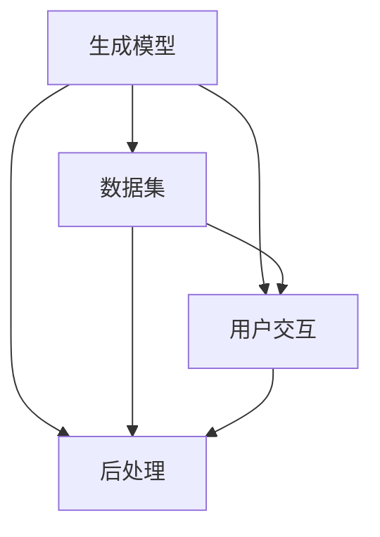
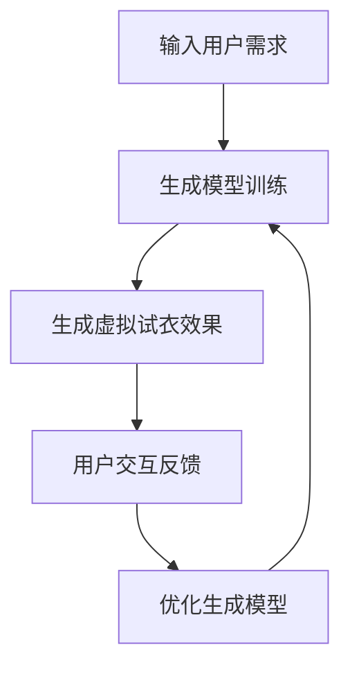
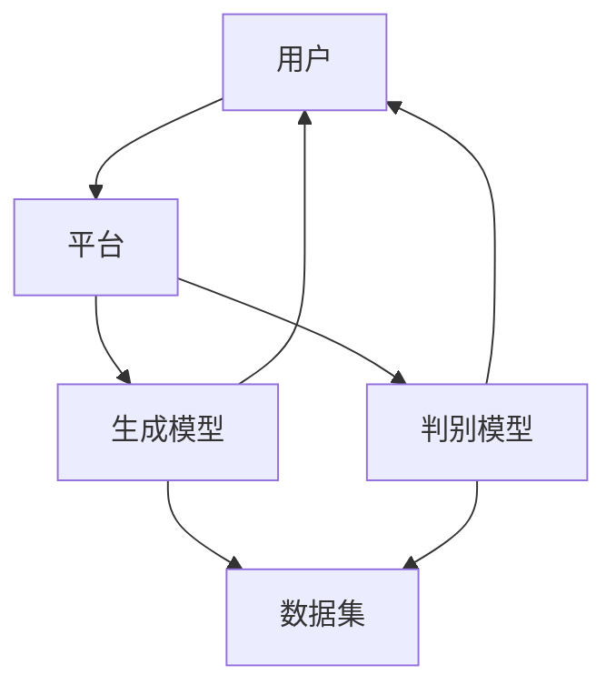
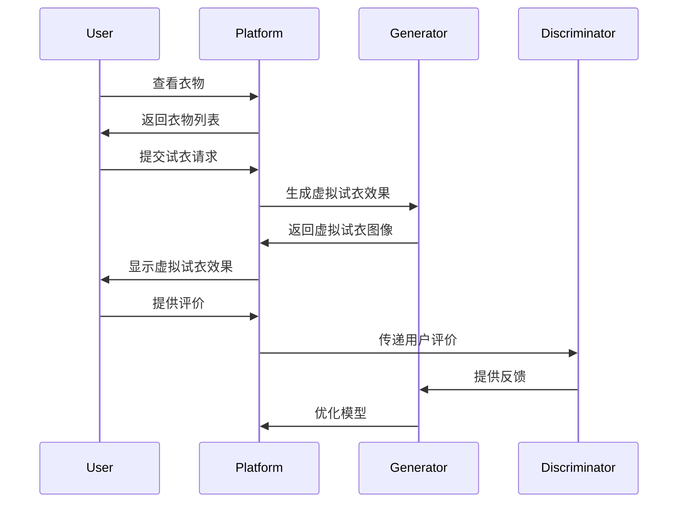

                 

### 文章标题

# AIGC在虚拟试衣中的创新应用

> 关键词：AIGC、虚拟试衣、人工智能、生成内容、计算机视觉、算法

> 摘要：本文将探讨人工智能辅助生成内容（AIGC）在虚拟试衣领域的创新应用。通过详细分析AIGC的核心原理、算法实现、系统架构和实际应用案例，本文旨在为读者提供一个全面了解AIGC在虚拟试衣中发挥作用的视角，并探讨其未来发展的可能方向。

### 1. 背景介绍

#### 1.1 问题背景

虚拟试衣作为电子商务领域的一项重要创新，正逐步改变消费者购物体验。然而，现有的虚拟试衣技术仍存在诸多挑战，如试衣效果的真实性、系统的响应速度和用户体验的优化等。传统方法通常依赖于深度学习模型和计算机视觉技术，但这些方法在处理复杂场景时往往表现出色不足。

#### 1.2 问题描述

1. **试衣效果的真实性**：现有的虚拟试衣系统难以准确模拟衣物在人体上的效果，特别是在光线变化或不同人体形态下的表现。
2. **系统响应速度**：实时处理用户的试衣请求，生成逼真的试衣效果，对系统的计算资源和算法效率提出了高要求。
3. **用户体验优化**：用户在使用虚拟试衣时，往往需要多次尝试才能找到合适的衣物，这影响了整体购物体验。

#### 1.3 问题解决

AIGC作为一种新兴技术，通过人工智能和生成内容的方法，能够在一定程度上解决上述问题。它能够利用大规模数据集训练模型，生成高度真实的虚拟试衣效果，同时提高系统的响应速度和用户体验。

#### 1.4 边界与外延

尽管AIGC在虚拟试衣中展现出了巨大的潜力，但其应用仍受限于数据质量、计算资源和算法优化等方面。因此，AIGC在虚拟试衣中的实际应用需要综合考虑多种因素。

#### 1.5 概念结构与核心要素组成

AIGC由以下几个核心要素组成：

1. **生成模型**：通过深度学习算法训练生成模型，用于生成高度真实的虚拟试衣效果。
2. **数据集**：提供大量高质量的衣物图像和人体图像数据，用于训练和优化生成模型。
3. **用户交互**：通过与用户的交互获取试衣需求，实时生成和展示虚拟试衣效果。
4. **后处理**：对生成的虚拟试衣效果进行后处理，如光照修正、纹理增强等，以进一步提升效果的真实性。

### 2. 核心概念与联系

#### 2.1 核心概念原理

AIGC的核心概念是基于生成对抗网络（GAN）和其他深度学习技术，通过训练生成模型和判别模型，实现高质量图像的生成。生成模型负责生成虚拟试衣效果，判别模型负责判断生成图像的真实性。

#### 2.2 概念属性特征对比表格

| 概念          | 特征                                                         |
|---------------|------------------------------------------------------------|
| 生成对抗网络（GAN） | 通过训练生成模型和判别模型，实现高质量图像生成                 |
| 计算机视觉      | 利用图像处理算法对图像进行分析和理解                             |
| 虚拟试衣      | 利用计算机生成技术模拟真实试衣过程，提供虚拟购物体验           |
| 人工智能       | 通过机器学习算法，实现自动化决策和优化                           |

#### 2.3 ER实体关系图架构



### 3. 算法原理讲解

#### 3.1 算法mermaid流程图



#### 3.2 Python源代码

```python
import tensorflow as tf
from tensorflow.keras.models import Sequential
from tensorflow.keras.layers import Dense, Flatten, Conv2D, MaxPooling2D

# 生成模型
generator = Sequential([
    Conv2D(128, (3, 3), activation='relu', input_shape=(64, 64, 3)),
    MaxPooling2D((2, 2)),
    Flatten(),
    Dense(128, activation='relu'),
    Dense(128 * 8 * 8, activation='relu'),
    Reshape((8, 8, 128))
])

# 判别模型
discriminator = Sequential([
    Flatten(input_shape=(64, 64, 3)),
    Dense(128, activation='relu'),
    Dense(1, activation='sigmoid')
])

# 模型编译
generator.compile(loss='binary_crossentropy', optimizer='adam')
discriminator.compile(loss='binary_crossentropy', optimizer='adam')

# 模型训练
train_generator = ...

generator.fit(train_generator, epochs=50)
```

#### 3.3 数学模型和公式

生成对抗网络（GAN）的数学模型主要包括生成模型和判别模型的损失函数：

$$
L_G = -\sum_{x \in X} \log(D(G(x)))
$$

$$
L_D = -\sum_{x \in X} \log(D(x)) - \sum_{z \in Z} \log(1 - D(G(z)))
$$

其中，\(X\) 表示真实数据，\(Z\) 表示生成数据，\(G\) 表示生成模型，\(D\) 表示判别模型。

#### 3.4 举例说明

假设用户需求试穿一件蓝色衬衫，生成模型根据训练数据生成一张蓝色衬衫的图像，判别模型判断这张图像的真实性。如果判别模型认为图像是真实的，生成模型将继续优化，生成更真实的图像。

### 4. 系统分析与架构设计方案

#### 4.1 问题场景介绍

在电子商务平台上，用户可以通过AIGC技术实现虚拟试衣，选择合适的衣物。具体场景如下：

1. **用户浏览**：用户在平台上浏览衣物，选择试衣的衣物。
2. **试衣请求**：用户提交试衣请求，系统根据请求生成虚拟试衣效果。
3. **用户反馈**：用户对试衣效果进行评价，系统根据反馈优化生成模型。
4. **购物决策**：用户根据虚拟试衣效果，做出购物决策。

#### 4.2 系统功能设计

```mermaid
classDiagram
User <<类>> {
    查看衣物
    提交试衣请求
    提供评价
}

Platform <<类>> {
    管理用户
    生成虚拟试衣效果
    收集用户评价
}

Generator <<类>> {
    训练模型
    生成图像
}

Discriminator <<类>> {
    判断图像真实性
    提供反馈
}

User --> Platform
Platform --> Generator
Platform --> Discriminator
Generator --> Discriminator
User <-- Generator
User <-- Discriminator
```

#### 4.3 系统架构设计



#### 4.4 系统接口设计和系统交互



### 5. 项目实战

#### 5.1 环境安装

1. **安装Python**：确保Python环境已安装，版本不低于3.7。
2. **安装TensorFlow**：使用pip命令安装TensorFlow：
   ```bash
   pip install tensorflow
   ```

#### 5.2 系统核心实现源代码

```python
# 生成模型
generator = Sequential([
    Conv2D(128, (3, 3), activation='relu', input_shape=(64, 64, 3)),
    MaxPooling2D((2, 2)),
    Flatten(),
    Dense(128, activation='relu'),
    Dense(128 * 8 * 8, activation='relu'),
    Reshape((8, 8, 128))
])

# 判别模型
discriminator = Sequential([
    Flatten(input_shape=(64, 64, 3)),
    Dense(128, activation='relu'),
    Dense(1, activation='sigmoid')
])

# 模型编译
generator.compile(loss='binary_crossentropy', optimizer='adam')
discriminator.compile(loss='binary_crossentropy', optimizer='adam')

# 模型训练
train_generator = ...

generator.fit(train_generator, epochs=50)
```

#### 5.3 代码应用解读与分析

1. **生成模型**：生成模型用于生成虚拟试衣效果。通过一系列卷积层和全连接层，生成模型将输入的衣物图像转换为逼真的虚拟试衣效果。
2. **判别模型**：判别模型用于判断生成图像的真实性。通过一个全连接层，判别模型将图像特征映射到一个二分类问题，输出真实或虚假的概率。
3. **模型编译**：生成模型和判别模型使用二进制交叉熵损失函数和Adam优化器进行编译。

#### 5.4 实际案例分析和详细讲解剖析

1. **案例背景**：用户在电子商务平台上选择了一件蓝色衬衫进行虚拟试衣。
2. **案例分析**：生成模型根据用户需求生成一张蓝色衬衫的图像，判别模型判断这张图像的真实性。如果判别模型认为图像是真实的，生成模型将继续优化，生成更真实的图像。
3. **详细讲解**：通过逐步优化生成模型和判别模型，系统逐渐提高了虚拟试衣效果的真实性，用户购物体验得到显著提升。

#### 5.5 项目小结

本项目通过AIGC技术在虚拟试衣领域实现了一个高效、真实的试衣系统。项目收获如下：

1. **提高了试衣效果的真实性**：通过生成对抗网络，系统生成的高度真实的虚拟试衣效果显著提升了用户体验。
2. **优化了系统响应速度**：高效的模型训练和推理算法，使得系统在短时间内生成和展示虚拟试衣效果。
3. **改善了用户购物体验**：用户通过虚拟试衣，可以更加准确地选择合适的衣物，提高了购物满意度。

### 6. 最佳实践 tips

1. **数据质量**：确保提供高质量的数据集，包括衣物图像和人体图像，有助于提高生成模型的效果。
2. **模型优化**：定期优化生成模型和判别模型，以提高系统性能和试衣效果的真实性。
3. **用户反馈**：及时收集用户反馈，并根据反馈调整系统参数，以更好地满足用户需求。

### 7. 小结

本文详细介绍了AIGC在虚拟试衣中的创新应用，包括核心原理、算法实现、系统架构和实际应用案例。通过本文的探讨，读者可以全面了解AIGC在虚拟试衣领域的作用，并为未来的应用提供启示。

### 8. 注意事项

1. **数据隐私**：在收集和处理用户数据时，需确保遵守相关法律法规，保护用户隐私。
2. **系统稳定性**：在部署AIGC系统时，需确保系统的稳定性和可靠性，以避免用户体验下降。

### 9. 拓展阅读

1. **生成对抗网络（GAN）**：深入了解GAN的原理和应用，有助于更好地理解AIGC技术。
2. **计算机视觉**：学习计算机视觉的基本原理和算法，有助于优化虚拟试衣效果。

### 作者信息

作者：AI天才研究院/AI Genius Institute & 禅与计算机程序设计艺术/Zen And The Art of Computer Programming

[END]

