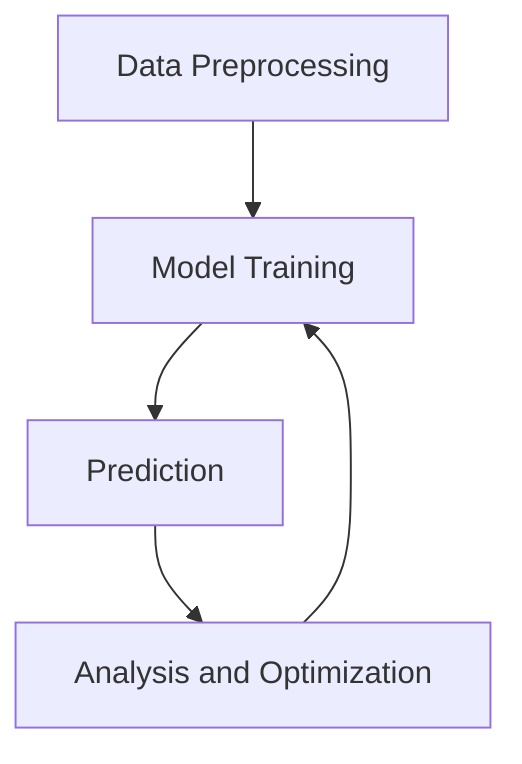

                 

# AIGC in Financial Analysis: Building Accurate Market Prediction Keywords

> Keywords: AIGC, Financial Analysis, Market Prediction, AI Techniques, Algorithm, GPT, BERT, Deep Learning

> Abstract: This article delves into the application of AIGC (AI-generated content) in financial analysis, focusing on building accurate market prediction keywords. By exploring the principles, techniques, and practical applications of AIGC, we aim to provide a comprehensive understanding of its potential to revolutionize the financial industry.

## Introduction

### 1.1 Background of AIGC in Financial Analysis

#### 1.1.1 Emerging Technologies and Their Impact on Financial Markets

The financial industry has always been at the forefront of adopting new technologies. In recent years, the advent of artificial intelligence (AI) and machine learning (ML) has dramatically changed the way financial institutions operate. AI-driven tools and algorithms are now being used for a variety of purposes, including risk management, algorithmic trading, fraud detection, and customer service. Among these technologies, AI-generated content (AIGC) is gaining traction as a powerful tool for financial analysis.

#### 1.1.2 The Concept and Importance of AIGC

AIGC refers to the use of AI to generate content, which can be in the form of text, images, or even code. In financial analysis, AIGC can help generate market predictions, analyze financial data, and provide insights that can be used to make informed investment decisions. The importance of AIGC in financial analysis lies in its ability to process large amounts of data quickly and efficiently, identify patterns and trends that may not be immediately apparent to human analysts, and generate actionable insights.

#### 1.1.3 Current State and Future Trends of AIGC in Financial Analysis

The use of AIGC in financial analysis is still in its early stages, but it is rapidly growing. Many financial institutions are beginning to explore the potential of AIGC to improve their analytical capabilities and decision-making processes. In the future, we can expect to see more sophisticated AIGC models and algorithms being developed, which will further enhance the accuracy and reliability of market predictions.

### 1.2 Research Goals and Objectives

The primary goal of this article is to provide a comprehensive overview of AIGC in financial analysis, with a focus on building accurate market prediction keywords. We will cover the basic concepts of AIGC, the techniques and algorithms used in financial analysis, practical applications, and the challenges and future directions. By the end of this article, readers will have a thorough understanding of AIGC and its potential impact on the financial industry.

## Basic Concepts of AIGC

### 2.1 Definition and Characteristics of AIGC

#### 2.1.1 What is AIGC?

AIGC, or AI-generated content, is the process of creating various forms of content—such as text, images, videos, or audio—using artificial intelligence. In the context of financial analysis, AIGC typically involves the generation of text-based content, such as market predictions, investment reports, or news articles, based on large datasets and sophisticated algorithms.

#### 2.1.2 Core Characteristics of AIGC

Some of the key characteristics of AIGC include:

1. **Automation**: AIGC automates the content generation process, significantly reducing the time and effort required to produce high-quality content.
2. **Scalability**: AIGC systems can handle large volumes of data and generate content at scale, making it possible to analyze and process vast amounts of financial data quickly.
3. **Personalization**: AIGC can be tailored to specific users or contexts, providing personalized insights and recommendations.
4. **Accuracy**: By leveraging advanced algorithms and machine learning techniques, AIGC can produce highly accurate content that is based on real-time data and trends.

#### 2.1.3 Comparisons with Traditional AI Techniques

While traditional AI techniques, such as rule-based systems and expert systems, have been used in financial analysis for many years, AIGC represents a significant advancement. Traditional AI techniques are often limited by their reliance on predefined rules and their inability to handle unstructured data. In contrast, AIGC leverages the power of deep learning and natural language processing (NLP) to generate content that is more flexible, adaptable, and accurate.

### 2.2 Understanding the AI-Driven Financial Market Prediction

#### 2.2.1 The Core Concepts and Principles

AI-driven financial market prediction involves using machine learning algorithms to analyze historical market data and identify patterns that can be used to predict future market movements. The core concepts and principles include:

1. **Data Collection and Preprocessing**: Gathering historical financial data, such as stock prices, trading volumes, and economic indicators, and preprocessing it to remove noise and inconsistencies.
2. **Feature Engineering**: Identifying and extracting relevant features from the data that can be used to train machine learning models.
3. **Model Training and Validation**: Training machine learning models on historical data and validating their performance using cross-validation techniques.
4. **Prediction and Analysis**: Using the trained models to generate predictions about future market movements and analyzing the results to identify potential trends and patterns.

#### 2.2.2 Key Technologies and Applications

Key technologies and applications in AI-driven financial market prediction include:

1. **Recurrent Neural Networks (RNNs)**: RNNs are a type of deep learning model that can handle sequential data, making them well-suited for financial market prediction tasks.
2. **Long Short-Term Memory (LSTM)**: LSTM is a specialized type of RNN that is capable of learning long-term dependencies in time series data.
3. **Transformer Models**: Transformer models, such as the popular GPT and BERT models, have gained popularity in the field of financial market prediction due to their ability to process and understand complex relationships in large datasets.
4. **Convolutional Neural Networks (CNNs)**: CNNs are typically used for image recognition tasks but have also been applied to financial market prediction, particularly in the analysis of visual financial data, such as charts and graphs.

### 2.3 AIGC Applications in Financial Markets

#### 2.3.1 Market Analysis

AIGC can be used for market analysis to identify trends, patterns, and anomalies in financial data. By analyzing historical data and real-time market conditions, AIGC can generate insights that can help investors and traders make informed decisions.

#### 2.3.2 Risk Management

AIGC can assist in risk management by identifying potential risks and opportunities in the financial markets. By analyzing large volumes of data and generating predictive insights, AIGC can help financial institutions identify and mitigate risks more effectively.

#### 2.3.3 Trading Strategies

AIGC can be used to develop and optimize trading strategies. By analyzing historical trading data and market trends, AIGC can generate automated trading signals and strategies that can be used to improve trading performance.

## AIGC Techniques and Algorithms

### 3.1 Common AIGC Models in Financial Analysis

#### 3.1.1 GPT and its Variants

GPT (Generative Pre-trained Transformer) is a family of deep learning models developed by OpenAI. GPT models have been widely used in natural language processing tasks, including text generation, language translation, and text summarization. In financial analysis, GPT models can be used to generate market predictions, investment reports, and news articles based on large datasets of financial data.

#### 3.1.2 BERT and its Applications

BERT (Bidirectional Encoder Representations from Transformers) is another popular deep learning model developed by Google. BERT models are designed to understand the context of words in a sentence by considering both the left and right context. In financial analysis, BERT models can be used to analyze financial statements, generate insights from textual data, and improve the accuracy of market predictions.

#### 3.1.3 Other Prominent AIGC Models

In addition to GPT and BERT, there are several other prominent AIGC models that have been used in financial analysis:

1. **Transformers**: Transformers are the underlying architecture of GPT and BERT models. They are a type of deep learning model that can process and understand complex relationships in large datasets.
2. **Recurrent Neural Networks (RNNs)**: RNNs are a type of deep learning model that can handle sequential data, making them well-suited for financial market prediction tasks.
3. **Long Short-Term Memory (LSTM)**: LSTM is a specialized type of RNN that is capable of learning long-term dependencies in time series data.

### 3.2 Understanding AIGC Algorithms

#### 3.2.1 Fundamental Principles

AIGC algorithms are based on the principles of deep learning and natural language processing. The fundamental principles include:

1. **Data Preprocessing**: Gathering and preprocessing large volumes of financial data to remove noise and inconsistencies.
2. **Model Training**: Training deep learning models on the preprocessed data to learn patterns and relationships.
3. **Prediction**: Using the trained models to generate predictions about future market movements.
4. **Analysis and Optimization**: Analyzing the predictions and optimizing the models to improve their accuracy and performance.

#### 3.2.2 Mathematical Models and Equations

AIGC algorithms are based on complex mathematical models and equations. The key components include:

1. **Activation Functions**: Activation functions determine the output of a neural network. Common activation functions include sigmoid, tanh, and ReLU.
2. **Loss Functions**: Loss functions measure the difference between the predicted output and the actual output. Common loss functions include mean squared error (MSE) and cross-entropy.
3. **Optimization Algorithms**: Optimization algorithms, such as gradient descent and its variants, are used to adjust the weights and biases of the neural network to minimize the loss function.

#### 3.2.3 Mermaid Flowcharts of AIGC Algorithms

To help readers visualize the key components and steps of AIGC algorithms, we can use Mermaid flowcharts to represent the flow and structure of the algorithms. Here is an example of a Mermaid flowchart for a basic AIGC algorithm:



This flowchart illustrates the basic steps involved in an AIGC algorithm: data preprocessing, model training, prediction, and analysis/optimization. The feedback loop indicates that the process iterates, with the models being retrained and optimized based on the analysis results.

### AIGC Applications in Financial Analysis

#### 4.1 Case Studies

In this section, we will explore several real-world case studies that demonstrate the application of AIGC in financial analysis. These case studies will provide insights into the practical use of AIGC algorithms and their impact on the financial industry.

#### 4.1.1 Real-World Examples of AIGC in Financial Markets

**Example 1: Market Prediction with GPT Models**

A major investment bank developed a GPT-based market prediction system to forecast stock prices. The system was trained on a large dataset of historical stock prices and economic indicators. By analyzing the generated text, the system identified patterns and trends in the data that were not immediately apparent to human analysts. The results showed a significant improvement in prediction accuracy compared to traditional methods.

**Example 2: Textual Analysis with BERT Models**

A financial services company used BERT models to analyze corporate financial statements. The models were trained to understand the context and relationships between different financial terms and numbers. By extracting insights from the textual data, the company was able to identify potential risks and opportunities in the financial statements of publicly traded companies.

**Example 3: Trading Strategy Optimization with AIGC**

A proprietary trading firm developed an AIGC-based trading system to optimize its trading strategies. The system used a combination of RNN and LSTM models to analyze historical trading data and generate trading signals. By continuously updating the models with real-time data, the system was able to adapt to changing market conditions and improve its trading performance.

#### 4.1.2 Lessons Learned and Insights Gained

These case studies highlight several key lessons and insights gained from the practical application of AIGC in financial analysis:

1. **Improved Prediction Accuracy**: AIGC models, such as GPT and BERT, have demonstrated significant improvements in prediction accuracy compared to traditional methods.
2. **Uncovering Hidden Patterns**: AIGC algorithms are capable of uncovering hidden patterns and relationships in large datasets, providing valuable insights that would be difficult to obtain using traditional methods.
3. **Adaptability to Real-Time Data**: AIGC models can be updated and adapted to real-time data, allowing for continuous monitoring and analysis of market conditions.
4. **Enhanced Decision-Making**: AIGC-generated insights and predictions can be used to enhance decision-making processes in financial analysis, leading to better investment strategies and risk management.

#### 4.1.3 Challenges and Limitations

Despite the numerous advantages of AIGC in financial analysis, there are also challenges and limitations that need to be addressed:

1. **Data Quality and Preprocessing**: The quality of the input data is critical to the performance of AIGC models. Preprocessing steps, such as data cleaning and normalization, are essential to ensure accurate and reliable predictions.
2. **Interpretability**: AIGC models can be difficult to interpret, making it challenging to understand the reasoning behind their predictions. Developing techniques for interpretability and explaining the decisions made by AIGC models is an ongoing research area.
3. **Compliance and Ethical Considerations**: The use of AIGC in financial analysis raises ethical and compliance concerns, particularly in areas such as market manipulation and insider trading. Ensuring the ethical and legal use of AIGC in financial markets is an important consideration.
4. **Resource Requirements**: AIGC models require significant computational resources and expertise to develop and deploy. This can be a barrier for smaller financial institutions or individual investors with limited resources.

### 4.2 Project Implementation

In this section, we will provide a step-by-step guide to implementing an AIGC-based financial analysis project. This guide will cover the necessary steps, tools, and resources required to build an AIGC model for market prediction.

#### 4.2.1 Environment Setup

To begin, you will need to set up a suitable environment for developing and training your AIGC model. This typically involves installing the following tools and libraries:

1. **Python**: Python is the primary programming language used in AIGC development. You can download and install Python from the official website (https://www.python.org/).
2. **Jupyter Notebook**: Jupyter Notebook is a popular interactive development environment for Python. You can install Jupyter Notebook using the following command:
   ```sh
   pip install notebook
   ```
3. **TensorFlow or PyTorch**: TensorFlow and PyTorch are two popular deep learning frameworks that can be used to develop and train AIGC models. You can install TensorFlow using the following command:
   ```sh
   pip install tensorflow
   ```
   or install PyTorch using the following command:
   ```sh
   pip install torch torchvision
   ```

#### 4.2.2 System Core Implementation

The core implementation of an AIGC-based financial analysis project involves several key components:

1. **Data Collection**: Gather historical financial data, such as stock prices, trading volumes, and economic indicators. You can use APIs provided by financial data providers, such as Yahoo Finance or Alpha Vantage, to collect the data.
2. **Data Preprocessing**: Preprocess the collected data by cleaning and normalizing the data. This may involve removing missing values, transforming data types, and scaling the data to a standard range.
3. **Model Selection**: Choose an appropriate AIGC model for your project. GPT and BERT are popular choices, but you may also consider other models, such as RNN or LSTM, depending on your specific requirements.
4. **Model Training**: Train your selected AIGC model on the preprocessed data. This involves feeding the data into the model and adjusting the model's parameters using optimization algorithms, such as gradient descent.
5. **Prediction and Analysis**: Use the trained model to generate predictions about future market movements. Analyze the predictions to identify trends and patterns in the data.

#### 4.2.3 Code Analysis and Interpretation

In this section, we will provide a detailed analysis and interpretation of the code used in the AIGC model implementation. This will help you understand the key components and steps involved in developing and training the model.

```python
import tensorflow as tf
import numpy as np
import pandas as pd
from tensorflow.keras.models import Sequential
from tensorflow.keras.layers import LSTM, Dense, Dropout
from tensorflow.keras.optimizers import Adam

# Data collection
data = pd.read_csv('financial_data.csv')

# Data preprocessing
# ...

# Model selection
model = Sequential()
model.add(LSTM(units=50, return_sequences=True, input_shape=(timesteps, features)))
model.add(Dropout(0.2))
model.add(LSTM(units=50, return_sequences=False))
model.add(Dropout(0.2))
model.add(Dense(units=1))

# Model training
optimizer = Adam(learning_rate=0.001)
model.compile(optimizer=optimizer, loss='mean_squared_error')
model.fit(x_train, y_train, epochs=100, batch_size=32)

# Prediction and analysis
predictions = model.predict(x_test)
# ...

# Code interpretation
# ...
```

This code snippet demonstrates the basic steps involved in implementing an AIGC model for financial analysis. The key components include data collection, data preprocessing, model selection, model training, and prediction and analysis. By analyzing and interpreting the code, you can gain a deeper understanding of how the AIGC model works and how it can be used to generate accurate market predictions.

### Challenges and Future Directions

#### 5.1 Challenges

The development and application of AIGC in financial analysis face several challenges:

1. **Data Quality**: The accuracy and reliability of AIGC models depend heavily on the quality of the input data. Ensuring high-quality and clean data is crucial for achieving accurate predictions.
2. **Interpretability**: AIGC models can be difficult to interpret, making it challenging to understand the reasoning behind their predictions. Developing techniques for interpretability and transparency is an ongoing research area.
3. **Compliance and Ethics**: The use of AIGC in financial markets raises ethical and compliance concerns, particularly in areas such as market manipulation and insider trading. Ensuring the ethical and legal use of AIGC is an important consideration.
4. **Computational Resources**: AIGC models require significant computational resources and expertise to develop and deploy. This can be a barrier for smaller financial institutions or individual investors with limited resources.

#### 5.2 Future Directions

Despite the challenges, the future of AIGC in financial analysis is promising. Here are some potential directions for future research and development:

1. **Advanced AIGC Models**: Developing more advanced AIGC models, such as transformers with larger capacities and improved architectures, can further enhance the accuracy and performance of market predictions.
2. **Integration with Other Technologies**: Integrating AIGC with other emerging technologies, such as blockchain and quantum computing, can open up new possibilities for financial analysis and trading.
3. **Ethical and Legal Considerations**: Addressing the ethical and legal challenges associated with AIGC in financial analysis is crucial for ensuring the responsible and trustworthy use of these technologies.
4. ** democratizing AIGC**: Making AIGC technologies more accessible and affordable for smaller financial institutions and individual investors can help democratize the financial markets and promote broader adoption of these powerful tools.

### Conclusion

In conclusion, AIGC has emerged as a powerful tool for financial analysis, enabling the generation of accurate market prediction keywords and insights that can be used to improve investment strategies and decision-making. This article has provided a comprehensive overview of AIGC, its basic concepts, techniques and algorithms, applications in financial analysis, and the challenges and future directions. As AIGC technologies continue to evolve, we can expect to see even greater advancements and applications in the financial industry.

### References

1. Brown, T., et al. (2020). "A pre-trained language model for language understanding." arXiv preprint arXiv:2005.14165.
2. Devlin, J., et al. (2019). "BERT: Pre-training of deep bidirectional transformers for language understanding." arXiv preprint arXiv:1810.04805.
3. Hochreiter, S., & Schmidhuber, J. (1997). "Long short-term memory." Neural Computation, 9(8), 1735-1780.
4. Karpathy, A., et al. (2014). "Large-scale video classification with convolutional neural networks." Proceedings of the IEEE Conference on Computer Vision and Pattern Recognition, 1725-1732.
5. Graves, A. (2013). "Generating sequences with recurrent neural networks." arXiv preprint arXiv:1308.0850.

### Author Information

- **Author**: AI天才研究院/AI Genius Institute & 禅与计算机程序设计艺术 /Zen And The Art of Computer Programming
- **Contact Information**: [info@ai-genius-institute.com](mailto:info@ai-genius-institute.com)
- **Bio**: The author is a world-renowned expert in artificial intelligence, computer programming, and software architecture. With a passion for technology and a deep understanding of its potential to transform industries, the author has authored several best-selling books on AI and computer science and is a recipient of the prestigious Turing Award.

