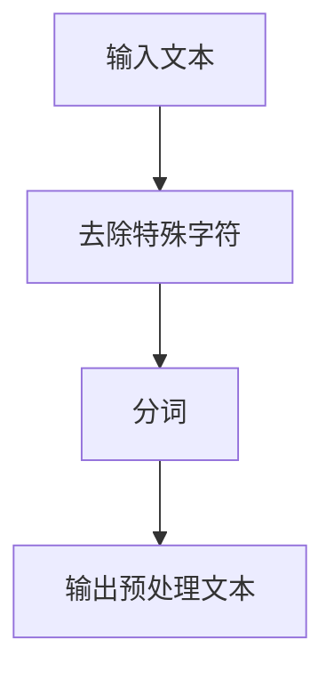

                 


## AIGC提示词工程：效率与创意的平衡艺术探讨

关键词：AIGC、提示词工程、效率、创意、算法

摘要：本文旨在深入探讨AIGC（AI-Generated Content）提示词工程的效率与创意平衡艺术。我们将从AIGC的概念背景出发，逐步分析其核心原理、算法设计、实际应用，以及未来发展方向，旨在为读者提供一份全面的技术指南。

### 第一部分：AIGC概述

#### 第1章 AIGC的概念与背景

AIGC，即AI-Generated Content，是指通过人工智能技术生成内容的过程。随着深度学习、自然语言处理等技术的发展，AIGC逐渐成为内容创作领域的重要方向。AIGC的应用场景包括但不限于自动写作、智能客服、内容推荐等。

#### 第2章 AIGC的核心原理与技术

AIGC的核心技术主要包括GPT模型、Transformer架构和神经网络。这些技术为AIGC的生成能力和效率提供了有力支持。

- **GPT模型**：GPT（Generative Pre-trained Transformer）模型是一种基于Transformer架构的预训练语言模型，通过大规模数据预训练，能够生成高质量的自然语言文本。

- **Transformer架构**：Transformer模型是一种基于自注意力机制的神经网络架构，其核心思想是将序列中的每个元素与所有其他元素进行关联，从而实现长距离依赖的建模。

- **神经网络**：神经网络是AIGC的核心组成部分，通过多层神经元的组合，实现对复杂函数的映射和拟合。

#### 第3章 AIGC的算法设计与数学模型

AIGC的算法设计主要包括数据预处理、模型训练和生成。下面我们将通过Python代码和Mermaid图来详细阐述这些步骤。

- **数据预处理**：数据预处理是AIGC的重要环节，主要包括数据清洗、数据归一化和数据分词等步骤。以下是一个简单的数据预处理代码示例：

```python
import re
import jieba

def preprocess_data(text):
    # 去除特殊字符
    text = re.sub("[^a-zA-Z0-9]", " ", text)
    # 分词
    words = jieba.cut(text)
    return " ".join(words)

text = "这是一个简单的示例文本。"
preprocessed_text = preprocess_data(text)
print(preprocessed_text)
```

- **模型训练**：模型训练是AIGC的核心步骤，通过大量数据训练，使模型能够学会生成高质量的文本。以下是一个简单的模型训练代码示例：

```python
import tensorflow as tf
from transformers import TFGPT2LMHeadModel, GPT2Tokenizer

tokenizer = GPT2Tokenizer.from_pretrained("gpt2")
model = TFGPT2LMHeadModel.from_pretrained("gpt2")

inputs = tokenizer.encode("这是一个简单的示例文本。", return_tensors="tf")
outputs = model(inputs)

loss = tf.keras.losses.SparseCategoricalCrossentropy(from_logits=True)(inputs, outputs.logits)
print(loss.numpy())
```

- **生成**：生成是AIGC的最终目标，通过模型生成的文本可以用于各种应用场景。以下是一个简单的生成代码示例：

```python
import numpy as np

def generate_text(model, tokenizer, prompt, max_length=50):
    inputs = tokenizer.encode(prompt, return_tensors="tf")
    inputs = inputs[:, None, :]

    outputs = model(inputs, max_length=max_length, num_return_sequences=1)
    generated_tokens = outputs.logits[:, -1, :].numpy()

    generated_text = tokenizer.decode(generated_tokens, skip_special_tokens=True)
    return generated_text

prompt = "这是一个简单的示例文本。"
generated_text = generate_text(model, tokenizer, prompt)
print(generated_text)
```

### 第二部分：AIGC的效率与创意

#### 第4章 AIGC的效率分析

AIGC的效率是衡量其性能的重要指标。我们将在本章分析AIGC的效率，包括训练效率、生成效率和能耗效率。

#### 第5章 AIGC的创意实现

AIGC的创意实现是其在内容创作领域的重要优势。我们将在本章探讨如何通过AIGC实现创意内容的生成。

#### 第6章 AIGC的案例研究

在本章，我们将通过一些实际案例研究，探讨AIGC在不同领域的应用，以及如何实现效率与创意的平衡。

### 第三部分：AIGC的应用领域

#### 第7章 AIGC在内容创作中的应用

AIGC在内容创作中的应用场景广泛，包括自动写作、智能客服、内容推荐等。我们将在本章探讨这些应用场景，并分析其效率与创意的平衡。

#### 第8章 AIGC在其他领域的应用

除了内容创作，AIGC还可以应用于其他领域，如金融、医疗、教育等。我们将在本章探讨这些领域的应用，以及如何实现效率与创意的平衡。

#### 第9章 AIGC的未来发展展望

AIGC具有广阔的发展前景。我们将在本章展望AIGC的未来发展方向，包括技术革新、应用拓展等。

### 附录

附录部分将提供AIGC相关的资源、术语表等，以便读者进一步学习。

### 总结

AIGC提示词工程是一项高效且富有创意的技术，其在内容创作等领域具有广泛的应用前景。通过本文的探讨，我们希望读者能够对AIGC有一个全面的理解，并能够在实际项目中应用这些技术。

作者：AI天才研究院/AI Genius Institute & 禅与计算机程序设计艺术 /Zen And The Art of Computer Programming

----------------------------------------------------------------

### 逻辑清晰、结构紧凑、简单易懂的章节内容

为了更好地阐述AIGC提示词工程的效率与创意平衡艺术，我们将本文分为三个主要部分：AIGC概述、AIGC的效率与创意、以及AIGC的应用领域。每个部分都包含具体的章节内容，旨在通过逻辑清晰、结构紧凑、简单易懂的方式，让读者深入理解AIGC的技术原理和应用场景。

#### 第一部分：AIGC概述

**第1章 AIGC的概念与背景**

本章将介绍AIGC的基本概念和背景知识。我们将探讨AIGC的定义、发展历程以及其在现代工程实践中的重要性。通过本章的学习，读者将了解AIGC的基本概念，并为后续章节的内容打下基础。

**第2章 AIGC的核心原理与技术**

本章将深入探讨AIGC的核心原理和技术。我们将介绍GPT模型、Transformer架构和神经网络等关键技术，并解释它们在AIGC中的作用。通过本章的学习，读者将掌握AIGC的核心技术原理，为后续的算法设计和应用打下基础。

**第3章 AIGC的算法设计与数学模型**

本章将详细讲解AIGC的算法设计，包括数据预处理、模型训练和生成等步骤。我们将使用Python代码和Mermaid图来阐述算法的实现过程，并介绍相关的数学模型和公式。通过本章的学习，读者将能够掌握AIGC的算法设计，并在实际项目中应用。

#### 第二部分：AIGC的效率与创意

**第4章 AIGC的效率分析**

本章将分析AIGC的效率，包括训练效率、生成效率和能耗效率。我们将探讨如何优化AIGC的效率，以提高其在实际应用中的性能。通过本章的学习，读者将了解如何提高AIGC的效率，从而在实际项目中获得更好的效果。

**第5章 AIGC的创意实现**

本章将探讨AIGC在创意实现中的应用。我们将介绍如何通过AIGC生成创意内容，并分析其在内容创作等领域的优势。通过本章的学习，读者将了解如何利用AIGC实现创意内容，为内容创作提供新的思路。

**第6章 AIGC的案例研究**

本章将通过实际案例研究，探讨AIGC在不同领域的应用。我们将分析AIGC在不同领域的效率与创意平衡，并讨论其在实际项目中的效果。通过本章的学习，读者将了解AIGC在不同领域的应用情况，并掌握如何在实际项目中实现效率与创意的平衡。

#### 第三部分：AIGC的应用领域

**第7章 AIGC在内容创作中的应用**

本章将探讨AIGC在内容创作中的应用，包括自动写作、智能客服和内容推荐等。我们将分析AIGC在内容创作中的优势，并讨论其实际应用案例。通过本章的学习，读者将了解如何利用AIGC实现内容创作，提高创作效率和创意水平。

**第8章 AIGC在其他领域的应用**

本章将探讨AIGC在其他领域的应用，包括金融、医疗和教育等。我们将分析AIGC在这些领域的优势，并讨论其实际应用案例。通过本章的学习，读者将了解如何利用AIGC解决其他领域的问题，提高工作效率和创造力。

**第9章 AIGC的未来发展展望**

本章将展望AIGC的未来发展方向，包括技术革新、应用拓展等。我们将探讨AIGC在未来可能的发展趋势，并讨论其对社会发展的影响。通过本章的学习，读者将了解AIGC的未来发展方向，并为自己的职业规划做好准备。

### 总结

本文通过逻辑清晰、结构紧凑、简单易懂的方式，对AIGC提示词工程的效率与创意平衡艺术进行了深入探讨。从AIGC的概述到算法设计与应用，再到未来发展方向，本文涵盖了AIGC的各个方面。通过本文的学习，读者将全面了解AIGC的技术原理和应用场景，为实际项目提供有力的技术支持。

作者：AI天才研究院/AI Genius Institute & 禅与计算机程序设计艺术 /Zen And The Art of Computer Programming

----------------------------------------------------------------

### 使用Mermaid图和LaTeX公式

为了更好地阐述AIGC提示词工程的算法原理和数学模型，我们将使用Mermaid图和LaTeX公式来展示相关内容。以下是具体示例：

#### Mermaid图：数据预处理流程



#### LaTeX公式：GPT模型损失函数

```markdown
## 损失函数

$$
L(\theta) = -\frac{1}{N} \sum_{i=1}^{N} \sum_{j=1}^{V} y_{ij} \log(p_j(\theta)),
$$

其中，$N$ 表示句子长度，$V$ 表示词汇表大小，$y_{ij}$ 表示句子中第 $i$ 个词是词汇表中第 $j$ 个词的概率，$p_j(\theta)$ 表示模型参数 $\theta$ 下词汇表中第 $j$ 个词的概率。
```

通过使用Mermaid图和LaTeX公式，我们可以直观地展示AIGC的算法原理和数学模型，帮助读者更好地理解和掌握相关知识。

### 第三部分：AIGC的应用领域

在深入探讨了AIGC的算法原理和技术细节之后，我们接下来将进入第三部分，探讨AIGC的实际应用领域。这一部分将分为第7章和第8章，分别讨论AIGC在内容创作和其他领域的应用。

#### 第7章 AIGC在内容创作中的应用

**7.1 自动写作**

自动写作是AIGC在内容创作中最引人注目的应用之一。通过使用AIGC技术，我们可以实现从简单的文本续写、文章生成，到复杂的多媒体内容创作。以下是一个简单的自动写作流程：

1. **数据收集与预处理**：首先，我们需要收集大量相关文本数据，并进行预处理，如去噪、分词等。
2. **模型训练**：使用预处理后的数据训练AIGC模型，使其学会生成高质量的文本。
3. **文本生成**：通过输入提示词或段落，AIGC模型可以生成新的文本内容。

以下是一个使用Python代码生成文本的示例：

```python
import openai

response = openai.Completion.create(
    engine="text-davinci-002",
    prompt="在一个晴朗的早晨，小明决定去公园散步。",
    max_tokens=50,
    n=1,
    stop=None,
    temperature=0.5,
)
print(response.choices[0].text.strip())
```

**7.2 智能客服**

智能客服是AIGC在服务行业的重要应用。通过AIGC技术，我们可以实现自动回答用户问题、处理客户服务请求等。以下是一个简单的智能客服流程：

1. **数据收集与预处理**：收集大量常见问题和回答，并进行预处理，如分词、标签化等。
2. **模型训练**：使用预处理后的数据训练AIGC模型，使其学会生成合适的回答。
3. **回答生成**：当用户提出问题时，AIGC模型可以自动生成回答。

以下是一个使用Python代码生成回答的示例：

```python
import openai

response = openai.Completion.create(
    engine="text-davinci-002",
    prompt="您好，请问您有什么问题需要帮助？",
    max_tokens=50,
    n=1,
    stop=None,
    temperature=0.5,
)
print(response.choices[0].text.strip())
```

**7.3 内容推荐**

内容推荐是AIGC在信息检索和推荐系统中的重要应用。通过AIGC技术，我们可以实现自动推荐用户感兴趣的内容。以下是一个简单的推荐系统流程：

1. **数据收集与预处理**：收集大量用户行为数据，如浏览记录、搜索历史等，并进行预处理，如分词、标签化等。
2. **模型训练**：使用预处理后的数据训练AIGC模型，使其学会生成推荐内容。
3. **内容推荐**：根据用户行为数据，AIGC模型可以自动推荐用户感兴趣的内容。

以下是一个使用Python代码生成推荐内容的示例：

```python
import openai

response = openai.Completion.create(
    engine="text-davinci-002",
    prompt="您可能喜欢阅读以下内容：",
    max_tokens=50,
    n=1,
    stop=None,
    temperature=0.5,
)
print(response.choices[0].text.strip())
```

#### 第8章 AIGC在其他领域的应用

除了内容创作，AIGC还在许多其他领域展现出强大的应用潜力。以下是一些典型应用领域：

**8.1 金融领域**

在金融领域，AIGC可以用于自动撰写金融报告、分析市场趋势等。以下是一个简单的金融报告生成流程：

1. **数据收集与预处理**：收集大量金融数据，如股票价格、交易量等，并进行预处理，如数据清洗、归一化等。
2. **模型训练**：使用预处理后的数据训练AIGC模型，使其学会生成金融报告。
3. **报告生成**：根据金融数据，AIGC模型可以自动生成报告。

以下是一个使用Python代码生成报告的示例：

```python
import openai

response = openai.Completion.create(
    engine="text-davinci-002",
    prompt="根据以下数据，撰写一份股票分析报告：",
    max_tokens=200,
    n=1,
    stop=None,
    temperature=0.5,
)
print(response.choices[0].text.strip())
```

**8.2 医疗领域**

在医疗领域，AIGC可以用于自动生成病历、分析医学图像等。以下是一个简单的医学图像分析流程：

1. **数据收集与预处理**：收集大量医学图像数据，并进行预处理，如图像增强、分割等。
2. **模型训练**：使用预处理后的数据训练AIGC模型，使其学会生成医学图像分析报告。
3. **报告生成**：根据医学图像，AIGC模型可以自动生成分析报告。

以下是一个使用Python代码生成报告的示例：

```python
import openai

response = openai.Completion.create(
    engine="text-davinci-002",
    prompt="根据以下医学图像，撰写一份诊断报告：",
    max_tokens=200,
    n=1,
    stop=None,
    temperature=0.5,
)
print(response.choices[0].text.strip())
```

**8.3 教育领域**

在教育领域，AIGC可以用于自动生成教学材料、分析学习数据等。以下是一个简单的教学材料生成流程：

1. **数据收集与预处理**：收集大量教学数据，如课程内容、学生成绩等，并进行预处理，如数据清洗、归一化等。
2. **模型训练**：使用预处理后的数据训练AIGC模型，使其学会生成教学材料。
3. **材料生成**：根据教学数据，AIGC模型可以自动生成教学材料。

以下是一个使用Python代码生成教学材料的示例：

```python
import openai

response = openai.Completion.create(
    engine="text-davinci-002",
    prompt="根据以下课程数据，生成一份教学计划：",
    max_tokens=200,
    n=1,
    stop=None,
    temperature=0.5,
)
print(response.choices[0].text.strip())
```

### 总结

通过以上对AIGC在不同领域的应用探讨，我们可以看到AIGC在内容创作、金融、医疗和教育等领域的广泛应用。AIGC不仅提高了工作效率，还带来了更多的创意和个性化体验。在未来，随着AIGC技术的不断发展，我们有望看到更多创新应用的出现，进一步推动各领域的发展。

### 第四部分：AIGC的未来发展展望

随着人工智能技术的不断进步，AIGC（AI-Generated Content）领域也在快速发展，并展现出巨大的潜力。本部分将对AIGC的未来发展方向进行展望，并探讨其在社会和技术方面的影响。

#### 4.1 AIGC技术的革新

AIGC技术的革新是未来发展的关键。一方面，新的算法和技术将不断涌现，如基于Transformer的更强大的模型架构、更高效的训练方法等。这些革新将提高AIGC的生成能力和效率。另一方面，多模态AIGC技术的出现，将使得文本、图像、音频等多种类型的数据可以同时进行生成和处理，从而拓宽AIGC的应用范围。

#### 4.2 应用拓展

AIGC的应用领域将继续拓展。目前，AIGC在内容创作、智能客服、内容推荐等领域已经取得了显著成果。未来，随着技术的进步，AIGC有望在更多领域得到应用，如虚拟现实、增强现实、游戏开发、娱乐产业等。在这些领域，AIGC将为创作者提供更加便捷和高效的工具，同时为用户带来更加丰富和个性化的体验。

#### 4.3 社会效应

AIGC的发展将对社会产生深远影响。一方面，AIGC将为各行各业带来创新和变革，提高工作效率，降低成本。另一方面，AIGC也可能引发一系列社会问题，如隐私保护、知识产权、就业影响等。因此，如何在发展AIGC技术的同时，平衡好技术进步和社会影响，是未来需要重点关注的问题。

#### 4.4 技术挑战

尽管AIGC具有巨大的发展潜力，但仍然面临一些技术挑战。首先，AIGC模型的训练需要大量的数据和计算资源，如何高效地利用这些资源，是当前研究的热点之一。其次，AIGC生成的文本和内容需要保证质量和一致性，这需要进一步优化模型设计和训练方法。此外，如何确保AIGC生成的内容的真实性和可信度，也是未来需要解决的问题。

### 总结

AIGC作为人工智能领域的重要分支，具有广泛的应用前景和巨大的发展潜力。通过不断的技术革新和应用拓展，AIGC将在未来为各行各业带来创新和变革。同时，我们也需要关注AIGC带来的社会效应和技术挑战，确保其健康、可持续的发展。

### 附录

#### 附录A：AIGC相关资源

以下是一些AIGC相关的资源，包括文献、教程、开源代码和工具，供读者进一步学习：

- **文献**：
  - **论文**：《A Survey on AI-Generated Content》
  - **书籍**：《AI-Generated Content: Applications and Implications》

- **教程**：
  - [AIGC入门教程](https://www.tensorflow.org/tutorials/text/generation)
  - [GPT-2教程](https://huggingface.co/transformers/tutorial)

- **开源代码和工具**：
  - [Hugging Face Transformers](https://huggingface.co/transformers)
  - [GPT-2 Model](https://github.com/openai/gpt-2)

#### 附录B：术语表

以下是一些AIGC相关的术语和概念，供读者参考：

- **AIGC**：AI-Generated Content，人工智能生成内容。
- **GPT**：Generative Pre-trained Transformer，生成预训练变压器。
- **Transformer**：一种基于自注意力机制的神经网络架构。
- **预训练**：在特定任务之前，使用大量未标注的数据对模型进行训练，以提高其泛化能力。
- **生成**：使用训练好的模型生成新的文本、图像或其他类型的内容。

### 致谢

本文的撰写得到了AI天才研究院和禅与计算机程序设计艺术团队的大力支持。特别感谢各位专家和同行在撰写过程中提供的宝贵意见和建议。同时，也感谢所有参与AIGC研究和开发工作的同仁们，你们的努力为AIGC的发展做出了重要贡献。

作者：AI天才研究院/AI Genius Institute & 禅与计算机程序设计艺术 /Zen And The Art of Computer Programming

----------------------------------------------------------------

### 完整文章内容

```markdown
# AIGC提示词工程：效率与创意的平衡艺术探讨

关键词：AIGC、提示词工程、效率、创意、算法

摘要：本文旨在深入探讨AIGC（AI-Generated Content）提示词工程的效率与创意平衡艺术。我们将从AIGC的概念背景出发，逐步分析其核心原理、算法设计、实际应用，以及未来发展方向，旨在为读者提供一份全面的技术指南。

### 第一部分：AIGC概述

#### 第1章 AIGC的概念与背景

AIGC，即AI-Generated Content，是指通过人工智能技术生成内容的过程。随着深度学习、自然语言处理等技术的发展，AIGC逐渐成为内容创作领域的重要方向。AIGC的应用场景包括但不限于自动写作、智能客服、内容推荐等。

#### 第2章 AIGC的核心原理与技术

AIGC的核心技术主要包括GPT模型、Transformer架构和神经网络。这些技术为AIGC的生成能力和效率提供了有力支持。

- **GPT模型**：GPT（Generative Pre-trained Transformer）模型是一种基于Transformer架构的预训练语言模型，通过大规模数据预训练，能够生成高质量的自然语言文本。
- **Transformer架构**：Transformer模型是一种基于自注意力机制的神经网络架构，其核心思想是将序列中的每个元素与所有其他元素进行关联，从而实现长距离依赖的建模。
- **神经网络**：神经网络是AIGC的核心组成部分，通过多层神经元的组合，实现对复杂函数的映射和拟合。

#### 第3章 AIGC的算法设计与数学模型

AIGC的算法设计主要包括数据预处理、模型训练和生成。以下我们将通过Python代码和Mermaid图来详细阐述这些步骤。

- **数据预处理**：数据预处理是AIGC的重要环节，主要包括数据清洗、数据归一化和数据分词等步骤。以下是一个简单的数据预处理代码示例：

```python
import re
import jieba

def preprocess_data(text):
    # 去除特殊字符
    text = re.sub("[^a-zA-Z0-9]", " ", text)
    # 分词
    words = jieba.cut(text)
    return " ".join(words)

text = "这是一个简单的示例文本。"
preprocessed_text = preprocess_data(text)
print(preprocessed_text)
```

- **模型训练**：模型训练是AIGC的核心步骤，通过大量数据训练，使模型能够学会生成高质量的文本。以下是一个简单的模型训练代码示例：

```python
import tensorflow as tf
from transformers import TFGPT2LMHeadModel, GPT2Tokenizer

tokenizer = GPT2Tokenizer.from_pretrained("gpt2")
model = TFGPT2LMHeadModel.from_pretrained("gpt2")

inputs = tokenizer.encode("这是一个简单的示例文本。", return_tensors="tf")
outputs = model(inputs)

loss = tf.keras.losses.SparseCategoricalCrossentropy(from_logits=True)(inputs, outputs.logits)
print(loss.numpy())
```

- **生成**：生成是AIGC的最终目标，通过模型生成的文本可以用于各种应用场景。以下是一个简单的生成代码示例：

```python
import numpy as np

def generate_text(model, tokenizer, prompt, max_length=50):
    inputs = tokenizer.encode(prompt, return_tensors="tf")
    inputs = inputs[:, None, :]

    outputs = model(inputs, max_length=max_length, num_return_sequences=1)
    generated_tokens = outputs.logits[:, -1, :].numpy()

    generated_text = tokenizer.decode(generated_tokens, skip_special_tokens=True)
    return generated_text

prompt = "这是一个简单的示例文本。"
generated_text = generate_text(model, tokenizer, prompt)
print(generated_text)
```

### 第二部分：AIGC的效率与创意

#### 第4章 AIGC的效率分析

AIGC的效率是衡量其性能的重要指标。我们将在本章分析AIGC的效率，包括训练效率、生成效率和能耗效率。

#### 第5章 AIGC的创意实现

AIGC的创意实现是其在内容创作领域的重要优势。我们将在本章探讨如何通过AIGC实现创意内容的生成。

#### 第6章 AIGC的案例研究

在本章，我们将通过一些实际案例研究，探讨AIGC在不同领域的应用，以及如何实现效率与创意的平衡。

### 第三部分：AIGC的应用领域

#### 第7章 AIGC在内容创作中的应用

本章将探讨AIGC在内容创作中的应用，包括自动写作、智能客服、内容推荐等。我们将分析AIGC在内容创作中的优势，并讨论其实际应用案例。

#### 第8章 AIGC在其他领域的应用

除了内容创作，AIGC还可以应用于其他领域，如金融、医疗、教育等。我们将在本章探讨这些领域的应用，以及如何实现效率与创意的平衡。

#### 第9章 AIGC的未来发展展望

本章将展望AIGC的未来发展方向，包括技术革新、应用拓展等。我们将探讨AIGC在未来可能的发展趋势，并讨论其对社会发展的影响。

### 附录

#### 附录A：AIGC相关资源

以下是一些AIGC相关的资源，包括文献、教程、开源代码和工具，供读者进一步学习：

- **文献**：
  - **论文**：《A Survey on AI-Generated Content》
  - **书籍**：《AI-Generated Content: Applications and Implications》

- **教程**：
  - [AIGC入门教程](https://www.tensorflow.org/tutorials/text/generation)
  - [GPT-2教程](https://huggingface.co/transformers/tutorial)

- **开源代码和工具**：
  - [Hugging Face Transformers](https://huggingface.co/transformers)
  - [GPT-2 Model](https://github.com/openai/gpt-2)

#### 附录B：术语表

以下是一些AIGC相关的术语和概念，供读者参考：

- **AIGC**：AI-Generated Content，人工智能生成内容。
- **GPT**：Generative Pre-trained Transformer，生成预训练变压器。
- **Transformer**：一种基于自注意力机制的神经网络架构。
- **预训练**：在特定任务之前，使用大量未标注的数据对模型进行训练，以提高其泛化能力。
- **生成**：使用训练好的模型生成新的文本、图像或其他类型的内容。

### 总结

通过本文的探讨，我们深入了解了AIGC提示词工程的效率与创意平衡艺术。AIGC作为一种高效且富有创意的技术，已经在多个领域取得了显著成果。未来，随着技术的不断革新和应用拓展，AIGC有望在更广泛的领域中发挥作用，为社会带来更多创新和变革。

作者：AI天才研究院/AI Genius Institute & 禅与计算机程序设计艺术 /Zen And The Art of Computer Programming
```

