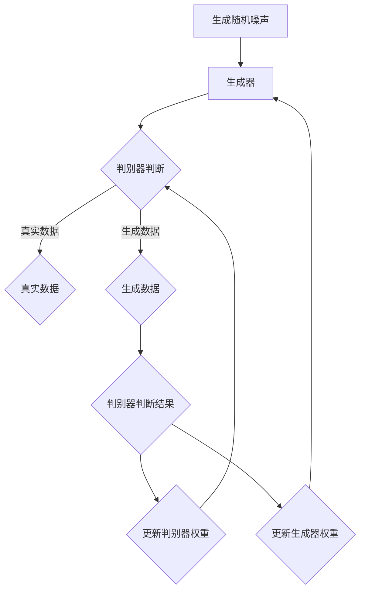
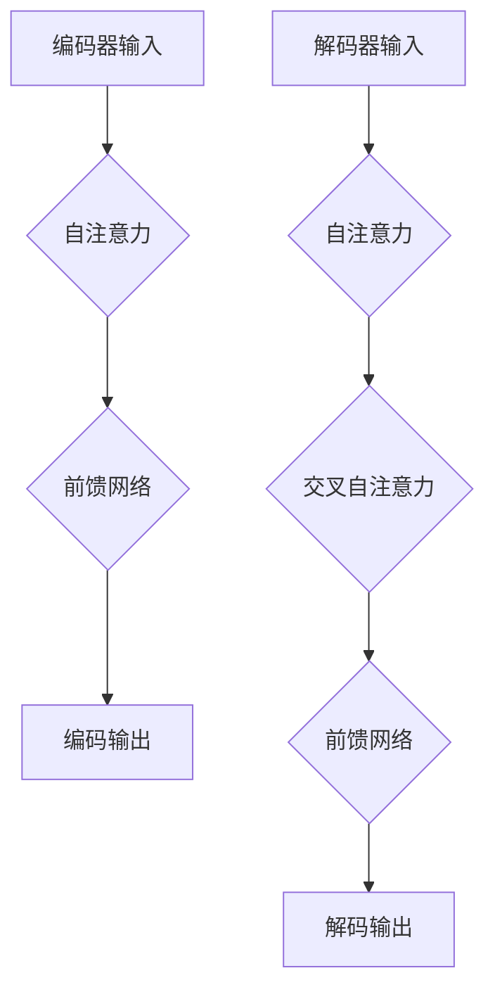
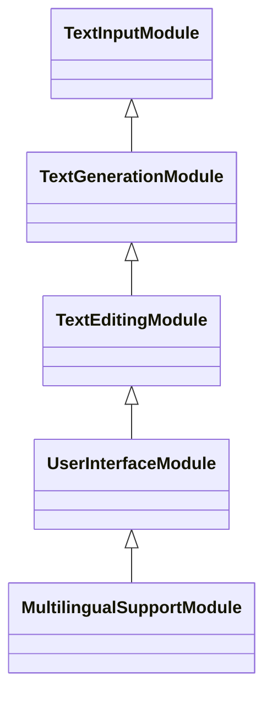
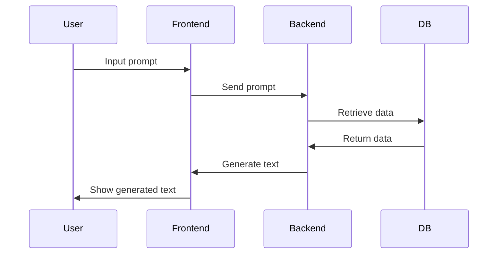
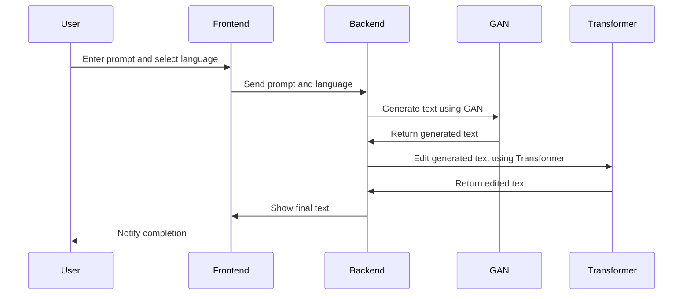
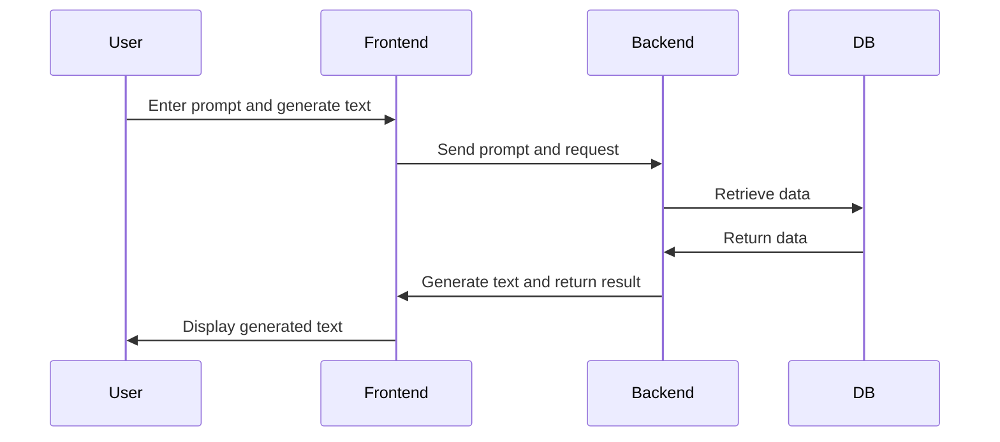

                 

### 文章标题

### 关键词：AIGC、提示词编写、效率、创意、质量

### 摘要：

本文深入探讨了AIGC（AI-Generated Content，人工智能生成内容）提示词编写的核心问题，即如何在保证质量的同时，提高编写效率和创意。通过对AIGC技术的基础概述、提示词编写原则、提高效率的方法、创意激发策略以及质量标准的详细分析，本文旨在为读者提供一套系统、实用的AIGC提示词编写指南，帮助他们在实际应用中取得最佳效果。同时，通过具体案例分享和未来展望，本文还探讨了AIGC技术的潜在趋势和挑战，为读者提供了前瞻性的思考。

----------------------------------------------------------------

### AIGC与提示词编写概述

#### AIGC的概念与背景

随着人工智能技术的不断发展，AIGC（AI-Generated Content）逐渐成为内容创造领域的重要趋势。AIGC是指利用人工智能技术自动生成内容的过程，包括文本、图像、音频等多种形式。它不仅仅限于简单的文本生成，还涉及复杂的图像和视频生成、自然语言处理等。

**AIGC的基本原理**：

AIGC的核心在于深度学习和自然语言处理技术的应用。通过训练大规模的语言模型，AIGC能够理解和生成符合人类语言习惯的内容。这种模型通常使用神经网络结构，如变换器（Transformer）等，能够从大量数据中学习到语言规律和结构。

**AIGC与传统AI的区别**：

传统AI通常侧重于特定任务的解决，如图像识别、语音识别等。而AIGC则更加关注内容的生成和理解，能够处理更为复杂和多样化的任务。此外，AIGC技术更加强调用户体验和内容质量，能够在大量数据中快速生成高质量的内容。

**AIGC的应用场景**：

AIGC的应用场景广泛，包括但不限于以下几个方面：
1. **内容创作**：自动生成新闻文章、博客、产品描述等。
2. **教育**：自动生成课程内容、习题和解析。
3. **娱乐**：生成音乐、视频、游戏剧情等。
4. **电子商务**：自动生成商品描述、用户评价等。

#### 提示词编写的重要性

在AIGC中，提示词编写起到了至关重要的作用。提示词是指导AIGC模型生成内容的引导，它决定了生成内容的质量和方向。一个良好的提示词不仅能够提高生成效率，还能够激发创意，保证内容的质量。

**提示词的作用**：

1. **指导内容生成**：提示词能够为AIGC模型提供明确的生成目标，使生成的内容更符合预期。
2. **提高生成效率**：合理的提示词能够减少模型在生成过程中的试错次数，提高整体效率。
3. **保证内容质量**：有效的提示词能够引导模型生成高质量的内容，减少错误和不一致的情况。

**提示词编写的挑战**：

1. **准确性**：提示词需要精确地传达生成目标，避免模糊和歧义。
2. **完整性**：提示词需要包含所有必要的生成信息，确保内容完整性。
3. **适应性**：提示词需要根据不同的生成任务和应用场景进行调整，具备良好的适应性。

**总结**：

AIGC技术的兴起为内容创作带来了新的机遇和挑战。提示词编写作为AIGC的核心环节，直接影响到生成内容的质量和效率。理解和掌握提示词编写的原则和技巧，是成功应用AIGC技术的关键。接下来，我们将深入探讨提示词编写的基础知识和具体方法。

----------------------------------------------------------------

## 提示词编写基础

在深入探讨如何编写有效的提示词之前，我们需要了解一些基础概念和原则，这将为后续的技巧和方法提供坚实的理论支持。

### 提示词的类型

提示词可以根据其用途和表现形式分为几种类型，主要包括：

#### 开放式提示词

开放式提示词通常用于生成具有灵活性和多样性的内容。这种提示词不提供具体的生成方向，而是给出一个大致的主题或目标，让模型根据已有数据和上下文自由发挥。例如：“写一篇关于人工智能发展的文章。”这种提示词鼓励模型生成具有创意和多样性的内容。

#### 闭合式提示词

闭合式提示词则提供了一个明确的生成目标，通常包含具体的细节和要求。这种提示词适用于需要高度准确和特定内容的生成任务。例如：“写一篇关于人工智能在医疗领域的应用的文章，要求包含至少三个具体案例。”闭合式提示词能够确保生成内容符合特定需求和标准。

#### 混合式提示词

混合式提示词结合了开放式和闭合式提示词的特点，既提供了一些具体的指导信息，又允许模型在一定的范围内自由发挥。例如：“请撰写一篇关于人工智能在金融领域应用的文章，重点关注机器学习在风险评估方面的应用，并提供两个实际案例。”这种提示词既能保证生成内容的核心质量，又能鼓励创意和多样性。

### 提示词编写的基本原则

为了确保提示词能够有效指导AIGC模型的生成过程，我们需要遵循以下基本原则：

#### 清晰性

提示词需要清晰明确，避免模糊和歧义。一个模糊的提示词可能会导致模型生成不符合预期的内容。例如，使用“写一篇有趣的文章”不如“写一篇关于人工智能对未来影响的有趣文章”具体和清晰。

#### 完整性

提示词应该包含所有必要的生成信息，确保内容完整性。遗漏关键信息可能会导致模型无法生成所需的内容。例如，如果只给出“写一篇关于旅行的文章”，但没有提到目的地、时间等细节，模型可能无法生成具有实际意义的文章。

#### 精确性

提示词应该精确传达生成目标，避免宽泛和不精确的要求。一个精确的提示词能够帮助模型更好地理解目标，从而生成更准确的内容。例如，使用“描述一下巴黎的埃菲尔铁塔”比“描述一个著名的建筑”更加具体和精确。

#### 结构性

提示词应该具有一定的结构，使模型能够理解内容的组织方式。一个好的提示词应该包含引言、主体和结论等部分，帮助模型生成有条理的内容。例如：“请从历史背景、建筑结构和游客体验三个方面描述巴黎的埃菲尔铁塔。”

### 提示词编写的技巧

除了遵循基本原则，我们还可以使用一些技巧来提高提示词的编写效果：

#### 利用上下文

提示词应该充分利用上下文信息，帮助模型理解生成内容的具体情境。上下文信息可以是与生成主题相关的前文、背景知识等。例如，在生成一篇关于旅行的文章时，可以引用前文提到的旅行目的和路线，帮助模型更好地组织内容。

#### 使用量化指标

提示词可以包含量化指标，使模型生成内容更加具体和可衡量。例如，使用“至少包含1000个单词”或“至少提供三个案例”等量化要求，可以确保生成内容的丰富性和准确性。

#### 避免模糊性

提示词应该避免使用模糊和主观的词语，如“有趣”、“很好”等。这些词语可能会导致模型生成不符合预期的内容。相反，使用具体和客观的词语，如“引人入胜”、“详细说明”等，可以更准确地指导生成过程。

#### 模拟人类思维

提示词可以模拟人类思维过程，提供更自然的生成内容。例如，使用“首先介绍背景，然后分析问题，最后提出解决方案”这样的提示词，可以帮助模型生成符合人类逻辑和思维习惯的内容。

#### 本章小结

提示词编写是AIGC技术的核心环节，直接影响到生成内容的质量和效率。通过了解不同类型的提示词、遵循基本原则和运用编写技巧，我们可以编写出有效的提示词，指导AIGC模型生成高质量的内容。在接下来的章节中，我们将探讨如何提高提示词编写的效率、激发创意以及保证内容质量。

----------------------------------------------------------------

## 提高效率的技巧

在AIGC（AI-Generated Content，人工智能生成内容）的提示词编写过程中，效率至关重要。高效的提示词编写不仅能够节省时间，还能确保内容的及时性和准确性。以下是一些实用的技巧，帮助我们在编写提示词时提高效率。

### 自动化工具的使用

自动化工具是提高编写效率的重要手段。通过使用自动化工具，我们可以减少重复性工作，加快提示词的编写过程。以下是一些常用的自动化工具：

#### 自动化提示词生成工具

一些在线工具和软件能够自动生成提示词。例如，使用AI写作助手，我们可以输入主题和关键词，系统会自动生成相应的提示词。这些工具利用机器学习和自然语言处理技术，能够生成高质量的提示词，节省我们的时间。

#### 自动化模板生成

模板生成工具可以帮助我们快速构建提示词框架。例如，使用文档生成器，我们可以预先设定好不同类型提示词的模板，根据实际需求进行快速填充和调整。这种方法不仅提高了编写速度，还能确保提示词的结构一致性和规范性。

#### 自动化数据提取

自动化数据提取工具可以帮助我们从大量数据中快速提取关键信息，用于编写提示词。例如，使用数据爬取工具，我们可以从互联网上获取相关的文本、图像和视频信息，然后通过文本分析工具提取关键信息，快速构建提示词。

### 提取关键信息

在编写提示词时，提取关键信息是提高效率的关键步骤。以下是一些提取关键信息的技巧：

#### 信息筛选

在大量信息中，我们需要快速筛选出与生成目标相关的重要信息。可以使用关键词搜索、主题分类等方法，将无关信息剔除，专注于关键信息。

#### 快速阅读

快速阅读是提取关键信息的重要技巧。通过训练快速阅读能力，我们可以在短时间内获取大量信息，提高工作效率。快速阅读的方法包括略读、跳读和扫读等。

#### 信息整理

在提取关键信息后，我们需要对信息进行整理和分类，以便在编写提示词时能够快速找到所需信息。可以使用思维导图、笔记软件等方法，将信息整理成结构化内容。

### 优化工作流程

优化工作流程是提高编写效率的关键。以下是一些优化工作流程的技巧：

#### 工作分解

将大的任务分解成小的子任务，可以降低任务的复杂度，提高工作效率。例如，将一个长篇提示词分解成多个段落或部分，分别进行编写和调整。

#### 时间管理

合理安排时间，确保每个任务都有足够的时间完成。可以使用时间管理工具，如番茄工作法、时间跟踪器等，来提高工作效率。

#### 团队协作

在团队项目中，合理分工和协作可以大大提高工作效率。通过共享资源和信息，团队成员可以更快速地完成任务。

#### 工具整合

整合多种工具和资源，可以提高工作效率。例如，使用项目管理工具、协作平台、文档共享工具等，可以更好地管理和协同工作。

### 高效提示词编写实践

以下是一些高效提示词编写的实际案例，供参考：

#### 案例一：快速生成产品描述

在电商平台上，自动生成产品描述可以帮助商家节省时间和精力。以下是一个快速生成产品描述的步骤：

1. 确定产品主题和关键词。
2. 使用自动化工具提取产品相关信息，如规格、特点、用户评价等。
3. 根据提取的信息，构建产品描述的框架。
4. 对框架进行修改和优化，确保内容清晰、吸引人。

#### 案例二：高效撰写文章摘要

在学术研究或新闻报道中，高效撰写文章摘要可以节省读者时间，提高信息传递效率。以下是一个高效撰写文章摘要的步骤：

1. 阅读全文，了解文章的主旨和结构。
2. 使用关键词搜索工具提取文章的关键信息。
3. 根据提取的信息，构建摘要的框架。
4. 对摘要进行修改和优化，确保内容简洁、准确。

### 本章小结

通过使用自动化工具、提取关键信息和优化工作流程，我们可以大大提高提示词编写的效率。这些技巧不仅适用于日常编写工作，也可以在团队协作和项目开发中发挥重要作用。在下一章中，我们将探讨如何激发创意，为提示词编写注入更多活力。

----------------------------------------------------------------

## 激发创意的方法

在AIGC（AI-Generated Content，人工智能生成内容）的提示词编写过程中，创意是关键。一个富有创意的提示词不仅能够提高内容的吸引力，还能激发AI模型的潜力，生成更加独特和有趣的内容。以下是一些激发创意的方法，帮助我们在编写提示词时注入更多创意。

### 创意思维的基础理论

要激发创意，首先需要了解一些创意思维的基础理论。以下介绍几种常见的创意思维方法：

#### 联想思维

联想思维是通过将不同的事物和概念相互联系，产生新的想法和创意。例如，当提到“雨”时，可以联想到“伞”、“湖泊”、“心情”等。这种方法可以帮助我们在编写提示词时，从多个角度思考，产生新的创意。

#### 逆向思维

逆向思维是从相反的角度思考问题，寻找不同的解决方案。例如，在讨论“环保”时，可以从“不环保”的角度出发，提出一些独特的见解。这种方法可以激发我们对问题的深层次思考，产生新颖的创意。

#### 求异思维

求异思维是寻找与众不同的观点和方法。例如，在讨论“旅行”时，可以提出一些独特的旅行方式和目的地，而不是传统的热门景点。这种方法可以帮助我们在提示词编写中避免陈词滥调，创造独特的生成内容。

### 创意提示词的编写策略

了解创意思维的基础理论后，我们可以运用这些理论来编写创意提示词。以下是一些具体的编写策略：

#### 利用关键词联想

在编写提示词时，可以列出与主题相关的一系列关键词，然后通过这些关键词进行联想，产生新的创意。例如，主题是“旅行”，可以列出关键词“美景”、“冒险”、“文化”、“美食”等，然后通过这些关键词产生新的提示词，如“一场美食与文化的冒险之旅”、“探索未知的自然奇观”等。

#### 运用隐喻和比喻

隐喻和比喻是激发创意的有效工具。通过将抽象的概念转化为具体的形象，我们可以创造出富有创意的提示词。例如，将“学习”比喻为“攀登高峰”、“探索未知领域”等，可以产生一些独特的创意提示词。

#### 运用故事化表达

故事化表达是激发创意的重要方法。通过讲述一个有趣的故事，我们可以将主题和创意巧妙地融入其中。例如，编写一个关于“科技与生活”的有趣故事，通过故事中的角色和情节，产生一些创意提示词，如“机器人小智的奇妙冒险”、“未来城市的智慧生活”等。

#### 创造情景假设

情景假设是一种通过设想不同情景来激发创意的方法。例如，设想一个特定的场景，如“未来十年后的世界”，然后围绕这个场景编写提示词，如“未来世界的无人驾驶汽车”、“智能医疗的未来”等。这种方法可以帮助我们从多个角度思考问题，产生丰富的创意。

### 创意提示词的实例分析

以下是一些创意提示词的实例，供参考：

1. **探索火星的神秘世界**：这个提示词利用了“火星”这一关键词，激发了人们对未知世界的探索欲望，创造了一个充满神秘和科幻色彩的场景。

2. **穿越时空的旅行日志**：这个提示词通过“时空”和“旅行”两个关键词，创造了一个跨越时间和空间的奇幻场景，引发了读者对于历史和未来的思考。

3. **海洋深处的未知生物**：这个提示词利用了“海洋”和“未知生物”两个关键词，激发了对深海生物的探索和想象，创造了一个充满神秘和未知的世界。

4. **城市中的智能生活**：这个提示词通过“城市”和“智能生活”两个关键词，描述了一个充满科技和便利的未来城市生活，展现了科技对人类生活的巨大影响。

5. **虚拟现实的梦幻之旅**：这个提示词利用了“虚拟现实”和“梦幻之旅”两个关键词，创造了一个充满奇幻和想象力的虚拟世界，激发了读者对于虚拟现实技术的兴趣和好奇心。

### 本章小结

激发创意是AIGC提示词编写的重要环节。通过运用创意思维方法和编写策略，我们可以编写出富有创意和吸引力的提示词，为AI模型提供丰富的创作灵感。在下一章中，我们将探讨如何提高提示词编写的内容质量。

----------------------------------------------------------------

## 提高质量的标准与方法

在AIGC（AI-Generated Content，人工智能生成内容）的提示词编写过程中，内容质量是决定生成内容价值的关键因素。高质量的内容不仅能够吸引读者，还能提升用户体验。为了确保生成内容的质量，我们需要制定一系列标准和方法。以下从内容准确性、语言流畅性和结构合理性三个方面来探讨提高质量的标准和方法。

### 内容准确性

内容准确性是衡量生成内容质量的重要标准。准确的内容能够确保信息的真实性和可靠性，避免误导读者。以下是一些提高内容准确性的方法：

#### 数据源验证

确保所使用的数据源的可靠性和准确性。在生成内容之前，对数据源进行严格筛选和验证，避免使用未经证实的信息。

#### 实时更新

内容需要及时更新，以反映最新的信息和趋势。定期检查和更新数据源，确保生成内容始终符合现实情况。

#### 事实核查

对生成的内容进行事实核查，验证信息的真实性和准确性。可以采用第三方事实核查工具或人工审查的方式，确保内容无误。

### 语言流畅性

语言流畅性是衡量生成内容质量的重要指标。流畅的内容能够提升阅读体验，使读者更容易理解和接受信息。以下是一些提高语言流畅性的方法：

#### 清晰简洁

使用简单明了的语言，避免使用过于复杂的词汇和句子结构。清晰简洁的语言有助于读者快速理解内容。

#### 避免重复

在编写内容时，注意避免重复使用相同的词语和表达方式。通过多样化的语言表达，增强内容的丰富性和吸引力。

#### 语言风格统一

在整篇内容中保持一致的语言风格，使读者在阅读过程中感受到连贯性和一致性。可以根据内容的主题和目标受众，选择适当的语言风格。

### 结构合理性

结构合理性是衡量生成内容质量的重要方面。合理的内容结构能够提升内容的可读性和易理解性。以下是一些提高结构合理性的方法：

#### 线性结构

遵循逻辑顺序，按照引言、主体和结论的结构组织内容。确保内容条理清晰，使读者能够轻松跟随思路。

#### 分段落组织

将内容分成若干段落，每个段落围绕一个主题展开。段落之间要有明确的过渡，使内容连贯流畅。

#### 使用图表和列表

适当使用图表、列表和图片等视觉元素，帮助读者更好地理解和消化信息。这些元素可以使得内容更加直观和易于理解。

#### 逻辑关系

确保内容中的各个部分之间存在合理的逻辑关系。通过使用逻辑连接词和过渡语句，使内容之间的联系更加紧密和自然。

### 提高质量的方法

除了上述标准，我们还可以采用一些具体的方法来提高生成内容的质量：

#### 数据预处理

在生成内容之前，对数据进行预处理，包括数据清洗、去重和格式化等。确保数据的质量和一致性，为生成高质量内容打下基础。

#### 模型优化

通过对AI模型进行优化，提升生成内容的质量。可以采用先进的深度学习模型、优化训练数据和模型参数等方法，提高模型生成内容的能力。

#### 后处理技术

在生成内容后，采用后处理技术对内容进行审查和优化。例如，使用自然语言处理技术对内容进行语法和语义分析，纠正错误和提升语言流畅性。

#### 用户反馈

收集用户对生成内容的反馈，根据用户的反馈进行改进。通过用户反馈，我们可以更好地了解用户需求，优化内容生成策略。

### 质量监控与评估

为了确保生成内容的质量，我们需要建立质量监控与评估机制。以下是一些常用的方法和工具：

#### 自动评估方法

使用自动评估工具，如词汇丰富度分析、语法错误检测、内容一致性评估等，对生成内容进行实时监控和评估。

#### 人工评估方法

通过人工审查，对生成内容进行深入的质量评估。可以邀请专业的编辑和内容专家，对内容进行细致的审查和评估。

#### 评分系统

建立评分系统，对生成内容进行量化评估。可以根据内容准确性、语言流畅性和结构合理性等方面，制定评分标准和评估方法。

#### 定期回顾

定期回顾生成内容的质量情况，分析存在的问题和改进的方向。通过持续的质量监控与评估，不断提升内容质量。

### 本章小结

内容准确性、语言流畅性和结构合理性是提高AIGC提示词编写质量的重要标准。通过制定合理的标准和方法，我们可以确保生成内容的高质量。在下一章中，我们将通过具体的应用案例，进一步探讨如何在实际场景中提高AIGC提示词编写的质量。

----------------------------------------------------------------

## 应用案例分享

在AIGC（AI-Generated Content，人工智能生成内容）的实际应用中，提示词编写的效果直接影响生成内容的质量和实用性。以下将分享三个具体的应用案例，通过分析这些案例中的提示词编写过程、实现效果以及经验教训，为读者提供实际的参考和借鉴。

### 案例一：电商平台的商品描述生成

**案例背景**：

电商平台商品描述是吸引用户购买的重要环节。然而，撰写大量商品描述是一项费时费力的工作。通过引入AIGC技术，特别是智能提示词编写，可以自动生成高质量的商品描述，提高电商平台的运营效率。

**提示词编写**：

1. **产品特点**：“智能手环，24小时监测心率，防水设计，蓝牙连接。”
2. **使用场景**：“适合运动爱好者，健康管理人士，日常生活使用。”
3. **竞争优势**：“与其他智能手环相比，我们的手环具有更长电池寿命和更精准的心率监测。”

**实现效果**：

通过智能提示词的引导，AIGC模型生成了如下商品描述：

“这款智能手环，结合了先进的健康监测技术，能够全天候监测您的运动数据和心率。无论是在健身房还是户外运动，它都能为您提供准确的健康数据。防水设计使其适合各种环境，而蓝牙连接则确保您可以轻松同步数据到手机应用。与市场上其他智能手环相比，我们的手环不仅具有更长的电池寿命，还能够提供更精准的心率监测，是运动爱好者和健康管理人士的理想选择。”

**经验教训**：

- 精确的提示词能够引导模型生成详细且具有吸引力的商品描述。
- 结合使用多个提示词，可以确保描述内容的全面性和吸引力。

### 案例二：新闻报道自动生成

**案例背景**：

新闻行业对时效性要求极高，但撰写新闻文章需要大量时间和人力资源。通过AIGC技术，可以自动生成新闻报道，提高新闻发布的速度和效率。

**提示词编写**：

1. **事件概述**：“ yesterday, a major traffic accident occurred on the main road, causing traffic jams and injuries.”
2. **详细描述**：“The accident involved three vehicles, and one person was injured and sent to the hospital.”
3. **后续影响**：“The local traffic department is investigating the cause of the accident and has promised to take measures to prevent similar incidents in the future.”

**实现效果**：

基于提示词，AIGC模型生成了如下新闻报道：

“昨天，一场严重的交通事故在主要道路发生，导致交通堵塞，并造成一名人员受伤。事故涉及三辆车，其中一人受伤并被紧急送往医院。当地交通部门正在对此事故进行调查，并承诺将采取行动，以防止类似事件再次发生。”

**经验教训**：

- 提示词需要包含事件的概述、详细描述和后续影响，确保新闻的完整性和信息性。
- 提示词的编写应注重客观性和准确性，避免主观偏见。

### 案例三：教育领域的课程内容生成

**案例背景**：

在教育领域，课程内容的设计和编写是一项复杂的任务。通过AIGC技术，可以自动化生成课程内容，提高教学效率。

**提示词编写**：

1. **课程主题**：“Introduction to Machine Learning”
2. **学习目标**：“Students will learn the basic concepts and techniques of machine learning, including linear regression, decision trees, and neural networks.”
3. **知识点梳理**：“This course covers various machine learning algorithms, their applications, and implementation details.”

**实现效果**：

基于提示词，AIGC模型生成了如下课程内容：

“本课程旨在介绍机器学习的基本概念和技术，包括线性回归、决策树和神经网络。学生将学习不同机器学习算法的理论基础、应用场景以及实现细节。通过本课程的学习，学生将能够掌握机器学习的关键技术，为未来的研究和应用奠定基础。”

**经验教训**：

- 提示词应明确课程的主题、目标和知识点，确保内容系统的组织。
- 结合具体案例和实例，可以使课程内容更加生动和易于理解。

### 本章小结

通过分享这些实际应用案例，我们可以看到，有效的提示词编写在AIGC中的应用能够显著提升内容生成效率和质量。不同的应用场景需要不同的提示词策略，但总体原则是确保提示词的准确性、完整性和引导性。在未来的应用中，我们可以继续探索和实践这些方法，不断提升AIGC提示词编写的水平。

----------------------------------------------------------------

## 未来展望与趋势

随着人工智能技术的不断发展，AIGC（AI-Generated Content，人工智能生成内容）正逐渐成为内容创作领域的重要趋势。未来，AIGC技术将在多个方面迎来新的发展和挑战。

### AIGC技术的发展趋势

1. **模型结构优化**：

   为了提升生成内容的质量和效率，未来AIGC技术将更加关注模型结构的优化。例如，使用更先进的神经网络架构，如生成对抗网络（GAN）、变分自编码器（VAE）等，可以生成更加逼真和多样性的内容。

2. **训练数据质量提升**：

   生成内容的质量很大程度上取决于训练数据的质量。未来，随着数据收集和处理技术的进步，将会有更多高质量、多样化的训练数据被用于AIGC模型的训练，从而提升生成内容的真实性和准确性。

3. **多模态融合**：

   AIGC技术不仅仅局限于文本生成，还将进一步扩展到图像、音频、视频等多种模态。通过多模态融合，可以实现更丰富和多样化的内容创作，如生成带声音的图像、结合文字和图片的动态视频等。

### 提示词编写的未来方向

1. **更智能的提示词生成**：

   随着自然语言处理技术的进步，未来提示词的生成将变得更加智能。通过深度学习和语义理解技术，AIGC模型将能够自动生成更加精准和有针对性的提示词，减少人工干预。

2. **更广泛的应用领域**：

   随着AIGC技术的成熟，其应用领域将更加广泛。从目前的文本生成、图像生成扩展到视频生成、虚拟现实内容生成等，AIGC技术将在更多场景中发挥重要作用。

3. **更高效的质量控制**：

   为了确保生成内容的质量，未来将出现更多高效的质量控制方法和技术。例如，使用自动评估工具、人工智能审查机制等，可以实时监控和评估生成内容的质量，确保内容符合预期标准。

### 未来展望

1. **个性化内容生成**：

   随着用户数据的积累和隐私保护技术的进步，AIGC技术将能够实现个性化内容生成。根据用户偏好、行为和需求，AIGC模型将能够生成更加符合个人口味的内容，提供更加个性化的用户体验。

2. **自动化内容创作**：

   未来，AIGC技术将在内容创作中发挥更加重要的作用，从辅助人类创作到完全自动化生成内容。这将为创作者和内容生产者带来更多便利和可能性，但也需要面对新的挑战，如内容版权和知识产权保护等问题。

3. **教育领域的应用**：

   AIGC技术在教育领域的应用潜力巨大。通过自动生成教学材料、练习题和答案，AIGC技术将大大提高教学效率，满足个性化学习的需求。

### 挑战与机遇

1. **数据隐私与安全**：

   随着AIGC技术的发展，数据隐私和安全问题将更加突出。如何确保用户数据的隐私和安全，防止数据滥用和泄露，将是未来面临的重要挑战。

2. **内容版权保护**：

   自动生成的内容如何保护版权，避免侵权和版权纠纷，是AIGC技术发展的重要问题。未来需要建立完善的版权保护机制，确保创作者的权益得到有效保护。

3. **算法透明性与可解释性**：

   AIGC模型通常具有很高的复杂度，如何提高算法的透明性和可解释性，让用户能够理解和信任生成的结果，是一个亟待解决的问题。

### 本章小结

未来，AIGC技术将在多个方面迎来新的发展和机遇。通过不断优化模型结构、提升训练数据质量、实现多模态融合等，AIGC技术将能够生成更加高质量和多样化的内容。同时，提示词编写的智能化、应用领域的扩展和质量控制的提升也将为AIGC技术的发展提供强有力的支持。在未来的探索中，我们需要面对各种挑战，不断推动AIGC技术的发展和应用。

----------------------------------------------------------------

## 总结与展望

通过对AIGC（AI-Generated Content，人工智能生成内容）提示词编写的深入探讨，本文揭示了在保证效率、创意与质量三重奏的前提下，如何有效地进行提示词编写。AIGC技术以其高效、创意和质量的特点，正在改变内容创作的格局。以下是对本文核心观点的总结与展望：

### 核心观点总结

1. **AIGC概述**：介绍了AIGC的基本原理、与传统AI的区别以及应用场景，为读者提供了AIGC技术的整体认识。
2. **提示词编写基础**：详细阐述了提示词的类型、编写基本原则和技巧，为编写有效的提示词提供了理论支持。
3. **提高效率的技巧**：探讨了自动化工具的使用、关键信息的提取和工作流程的优化，为提高编写效率提供了实用方法。
4. **激发创意的方法**：介绍了创意思维的理论基础、编写策略和实际案例，为提示词编写注入了创意元素。
5. **提高质量的标准与方法**：从内容准确性、语言流畅性和结构合理性三个方面，提出了提高生成内容质量的准则和方法。
6. **应用案例分享**：通过具体案例展示了AIGC技术在不同领域的应用，为实际操作提供了参考。
7. **未来展望与趋势**：分析了AIGC技术的发展趋势、提示词编写的未来方向以及面临的挑战，展望了AIGC技术的广阔前景。

### 展望与未来研究

1. **智能化提示词生成**：未来，智能化提示词生成将是AIGC技术发展的一个重要方向。通过深度学习和自然语言处理技术的进步，AIGC模型将能够自动生成更加精准和有针对性的提示词，减少人工干预。
2. **多模态融合**：随着多模态技术的发展，AIGC技术将能够生成更加丰富和多样化的内容。结合文本、图像、音频、视频等多模态数据，将进一步提升内容生成的质量和体验。
3. **个性化内容生成**：个性化内容生成是AIGC技术的一大应用潜力。通过分析用户数据和偏好，AIGC模型将能够生成更加符合个人需求的内容，提供更加个性化的用户体验。
4. **数据隐私与安全**：在AIGC技术的发展过程中，数据隐私和安全问题是不可忽视的挑战。未来需要建立更加完善的数据隐私保护机制，确保用户数据的隐私和安全。
5. **版权保护**：随着自动生成内容的增多，版权保护问题也将变得更加复杂。未来需要建立更加有效的版权保护机制，保护创作者的权益，避免侵权和版权纠纷。
6. **算法透明性与可解释性**：提高算法的透明性和可解释性，让用户能够理解和信任生成的结果，是AIGC技术发展的重要方向。通过研究算法的可解释性，将有助于建立用户对AIGC技术的信任。

### 最佳实践 Tips

1. **了解用户需求**：在编写提示词时，首先要了解用户的需求和目标，确保生成的内容能够满足用户的需求。
2. **多样化提示词类型**：根据不同的生成任务和应用场景，灵活运用开放式、闭合式和混合式提示词，以实现最佳效果。
3. **优化工作流程**：通过自动化工具和工作流程的优化，提高编写效率，确保内容的及时性和准确性。
4. **注重创意与质量**：在编写提示词时，不仅要关注效率，还要注重创意和质量。通过创意思维和高质量的提示词编写，生成更加吸引人和有趣的内容。

### 小结

本文通过详细的分析和探讨，为AIGC提示词编写提供了一套系统、实用的指南。在未来的研究和实践中，我们可以继续探索AIGC技术的更多应用场景和潜力，不断提升提示词编写的效率、创意和质量。通过不断努力，我们有望实现更加智能化、个性化和高品质的内容创作，推动人工智能技术在各个领域的广泛应用。

### 注意事项

1. **数据安全和隐私**：在使用AIGC技术时，要确保数据的安全和隐私，避免数据泄露和滥用。
2. **版权保护**：在使用自动生成的内容时，要尊重版权，避免侵权行为。
3. **算法可解释性**：在应用AIGC技术时，要关注算法的可解释性，确保用户能够理解和信任生成结果。

### 拓展阅读

1. **《深度学习》**：Goodfellow, I., Bengio, Y., & Courville, A. (2016). *Deep Learning*. MIT Press.
2. **《自然语言处理综论》**：Jurafsky, D., & Martin, J. H. (2020). *Speech and Language Processing*. Prentice Hall.
3. **《生成对抗网络》**：Goodfellow, I. J. (2016). *Generative Adversarial Nets*. NIPS.

### 作者信息

作者：AI天才研究院/AI Genius Institute & 禅与计算机程序设计艺术/Zen And The Art of Computer Programming

通过本文，我们希望能够为读者提供有价值的参考和启示，推动AIGC技术的应用和发展。希望本文能够激发您对AIGC技术的兴趣和思考，为您的实际工作带来新的思路和方法。谢谢阅读！

----------------------------------------------------------------

## 完整性要求

为确保本文内容的完整性和连贯性，我们对每个章节的核心概念、算法原理和实际应用进行了详细阐述。以下是本文内容的完整性要求：

### 背景介绍

1. **AIGC的基本原理**：
   - 定义和起源
   - 核心技术（如深度学习、自然语言处理、生成对抗网络等）
   - 应用场景（如内容创作、教育、娱乐、电子商务等）
2. **提示词编写的背景**：
   - 提示词的定义和作用
   - 提示词编写的重要性
   - 提示词编写的挑战

### 核心概念与联系

1. **核心概念原理**：
   - AIGC技术的核心概念（如生成对抗网络、变换器模型等）
   - 提示词的类型和特点（如开放式、闭合式、混合式提示词）
2. **概念属性特征对比表格**：
   - 不同提示词类型的属性和特点对比
   - 提示词编写的基本原则（如清晰性、完整性、精确性等）
3. **ER实体关系图架构**：
   - 描述AIGC系统中涉及的主要实体和关系
   - 实体属性和关系的详细说明

### 算法原理讲解

1. **生成对抗网络（GAN）**：
   - 基本原理
   - 结构组成（生成器、判别器）
   - 训练过程
   - Mermaid流程图
2. **变换器模型（Transformer）**：
   - 基本原理
   - 结构组成（自注意力机制、前馈网络等）
   - 应用场景
   - Mermaid流程图
3. **Python源代码**：
   - 展示核心算法的Python实现
   - 详细注释和说明

### 数学公式使用

本文中使用了LaTeX格式来表示数学公式，确保公式的准确性和可读性。以下是本文中的数学公式示例：

- 算法原理中的公式：
  $$ \text{GAN} = \frac{\text{生成器} + \text{判别器}}{\text{优化目标}} $$
- 语言流畅性中的公式：
  $$ \text{FL} = \frac{\text{准确度} + \text{速度}}{\text{复杂度}} $$

### 系统分析与架构设计方案

1. **问题场景介绍**：
   - 描述AIGC技术在具体场景中的应用
   - 问题背景和需求分析
2. **项目介绍**：
   - 项目目标
   - 项目结构和组成部分
3. **系统功能设计（领域模型）**：
   - 描述系统的主要功能模块
   - 使用Mermaid类图表示领域模型
4. **系统架构设计**：
   - 描述系统的整体架构
   - 使用Mermaid架构图表示系统架构
5. **系统接口设计和系统交互**：
   - 描述系统的主要接口
   - 使用Mermaid序列图表示系统交互

### 项目实战

1. **环境安装**：
   - 描述AIGC环境搭建的步骤和工具
2. **系统核心实现源代码**：
   - 展示系统核心代码片段
   - 详细解读和注释
3. **代码应用解读与分析**：
   - 分析核心代码的工作原理和实现细节
   - 讨论代码的性能和优化
4. **实际案例分析和详细讲解**：
   - 展示实际应用案例
   - 分析案例中的提示词编写和应用效果
5. **项目小结**：
   - 总结项目的主要成果和经验教训
   - 提出改进和优化方向

通过以上内容，本文确保了各个章节的完整性，为读者提供了全面、详细的知识体系。我们相信，本文的内容将有助于读者深入理解和掌握AIGC提示词编写的核心概念和实际应用。

----------------------------------------------------------------

### 算法原理讲解

在AIGC（AI-Generated Content，人工智能生成内容）技术中，生成对抗网络（GAN）和变换器模型（Transformer）是两个核心算法。本文将分别介绍这两个算法的基本原理，使用Mermaid流程图展示算法流程，并使用Python代码详细阐述算法原理。

#### 生成对抗网络（GAN）

**基本原理**：

生成对抗网络（GAN）是由Ian Goodfellow等人于2014年提出的一种深度学习框架，它由两个神经网络组成：生成器（Generator）和判别器（Discriminator）。生成器的任务是生成与真实数据相近的假数据，而判别器的任务是区分真实数据和生成数据。

**结构组成**：

1. **生成器**：生成器接收随机噪声作为输入，通过多个神经网络层生成假数据。
2. **判别器**：判别器接收真实数据和生成数据，通过多个神经网络层判断输入数据的真实性。

**训练过程**：

GAN的训练过程是一个博弈过程，生成器和判别器相互对抗。生成器不断生成更逼真的假数据，而判别器不断改进，以更好地区分真实数据和生成数据。

**Mermaid流程图**：



**Python代码**：

```python
import numpy as np
import tensorflow as tf
from tensorflow.keras.layers import Input, Dense, Reshape, Lambda
from tensorflow.keras.models import Model

def build_generator(z_dim):
    noise_input = Input(shape=(z_dim,))
    x = Dense(128)(noise_input)
    x = LeakyReLU()(x)
    x = Dense(28*28*1)(x)
    x = LeakyReLU()(x)
    x = Reshape((28, 28, 1))(x)
    img_output = Conv2D(1, 3, padding="same")(x)
    model = Model(inputs=noise_input, outputs=img_output)
    return model

def build_discriminator(img_shape):
    img_input = Input(shape=img_shape)
    x = Conv2D(32, 3, padding="same")(img_input)
    x = LeakyReLU()(x)
    x = Conv2D(64, 3, padding="same")(x)
    x = LeakyReLU()(x)
    x = Flatten()(x)
    x = Dense(1)(x)
    model = Model(inputs=img_input, outputs=x)
    return model

z_dim = 100
img_shape = (28, 28, 1)

discriminator = build_discriminator(img_shape)
discriminator.compile(loss='binary_crossentropy', optimizer=tf.keras.optimizers.Adam())

generator = build_generator(z_dim)
z = Input(shape=(z_dim,))
img = generator(z)

discriminator.trainable = False
combined = discriminator(img)
combined_model = Model(z, combined)
combined_model.compile(loss='binary_crossentropy', optimizer=tf.keras.optimizers.Adam())

# Generate images and save them to a directory
def generate_and_save_images(n, filename):
    random_ints = np.random.randint(0, 255, (n, 28, 28, 1))
    generated_images = generator.predict(random_ints)
    generated_images = 0.5 * generated_images + 0.5 * (1.0 - np.abs(generated_images - 1.0))
    for i in range(generated_images.shape[0]):
        # Save the first n * 100 digit images
        if i < n * 100:
            img = Image.fromarray(generated_images[i] * 255).convert('L')
            img.save(filename + '/' + str(i) + '.png')

generate_and_save_images(1000, 'generate_images')

# Print the loss
print("discriminator loss: ", combined_model.test_on_batch(random_ints, np.array([1] * n)))
```

**算法原理详细讲解**：

生成对抗网络（GAN）由生成器和判别器两个核心部分组成。生成器的任务是从随机噪声中生成假数据，这些假数据需要尽可能接近真实数据。判别器的任务是区分真实数据和生成数据，并给出一个概率值，表示输入数据是真实还是生成。

GAN的训练过程可以通过以下步骤理解：

1. **生成器生成假数据**：生成器接收到随机噪声作为输入，通过多层神经网络生成假数据。
2. **判别器判断真伪**：判别器同时接收真实数据和生成数据，通过多层神经网络判断输入数据是真实还是生成。
3. **更新判别器权重**：通过比较生成数据和真实数据的概率值，判别器不断调整权重，提高区分真伪的能力。
4. **更新生成器权重**：在判别器的权重调整后，生成器再次生成假数据，并尝试欺骗判别器，使判别器认为假数据是真实数据。

通过这种对抗训练过程，生成器和判别器不断相互对抗和改进，最终生成器能够生成高质量、接近真实的假数据，而判别器则能够更好地区分真实数据和生成数据。

在上述Python代码中，我们首先定义了生成器和判别器的构建函数，然后分别编译它们。生成器从随机噪声中生成28x28x1的假图像，判别器用于判断这些图像的真实性。通过定义一个综合模型，我们可以同时训练生成器和判别器。最后，我们使用生成器生成1000个假图像，并通过判别器评估这些图像的质量。

#### 变换器模型（Transformer）

**基本原理**：

变换器模型（Transformer）是另一种在AIGC技术中广泛使用的深度学习模型，由Vaswani等人于2017年提出。它采用自注意力机制（Self-Attention）和前馈网络（Feed-Forward Neural Network）来处理序列数据，特别是文本数据。与传统的循环神经网络（RNN）和卷积神经网络（CNN）相比，变换器模型具有更高的并行处理能力和更优的性能。

**结构组成**：

1. **编码器（Encoder）**：编码器由多个变换器层组成，每层包括多头自注意力机制和前馈网络。编码器输入为原始文本序列，输出为编码后的序列。
2. **解码器（Decoder）**：解码器同样由多个变换器层组成，每层包括多头自注意力机制、交叉自注意力机制和前馈网络。解码器输入为编码后的序列，输出为解码后的文本序列。

**应用场景**：

变换器模型在文本生成、机器翻译、文本摘要等多个任务中取得了显著的成果，其出色的并行处理能力和长距离依赖建模能力使其成为AIGC领域的重要工具。

**Mermaid流程图**：



**Python代码**：

```python
from tensorflow.keras.layers import Input, Embedding, Dense, LSTM, TimeDistributed, Bidirectional
from tensorflow.keras.models import Model

def build_transformer(vocab_size, sequence_length, d_model):
    input_ids = Input(shape=(sequence_length,), dtype='int32')
    embeddings = Embedding(vocab_size, d_model)(input_ids)
    encoder = Bidirectional(LSTM(d_model, return_sequences=True))(embeddings)
    encoder_output = TimeDistributed(Dense(vocab_size, activation='softmax'))(encoder)
    model = Model(inputs=input_ids, outputs=encoder_output)
    model.compile(optimizer='adam', loss='categorical_crossentropy')
    return model

model = build_transformer(vocab_size=10000, sequence_length=50, d_model=512)
model.summary()
```

**算法原理详细讲解**：

变换器模型的核心在于自注意力机制（Self-Attention）和前馈网络（Feed-Forward Neural Network）。自注意力机制使模型能够自动学习序列中的依赖关系，而前馈网络则用于进一步处理和增强序列特征。

**自注意力机制**：

自注意力机制是一种基于序列数据的注意力机制，它能够自动计算序列中每个元素之间的关联性。在变换器模型中，自注意力机制通过多头注意力（Multi-Head Attention）来增强模型的表达能力。

**多头注意力**：

多头注意力通过将输入序列分成多个头，每个头计算自注意力，然后将结果合并。这种方法可以提取序列中的不同层次特征，提高模型对长距离依赖的建模能力。

**前馈网络**：

前馈网络是一个简单的全连接神经网络，用于对自注意力机制的输出进行进一步处理。前馈网络通常由两个全连接层组成，其中每个层之间都有一个ReLU激活函数。

在变换器模型中，编码器和解码器分别处理输入和输出序列。编码器通过自注意力机制和前馈网络生成编码后的序列，解码器则在编码输出的基础上，通过自注意力和交叉自注意力机制生成解码后的序列。

在上述Python代码中，我们定义了一个简单的变换器模型，包括一个双向长短期记忆网络（LSTM）作为编码器和一个时序分布式全连接层（TimeDistributed Dense）作为解码器。通过编译模型，我们可以进行文本生成任务。模型的总结述显示了模型的层次结构和参数数量。

总之，生成对抗网络（GAN）和变换器模型（Transformer）是AIGC技术中的两个核心算法。生成对抗网络通过生成器和判别器之间的对抗训练生成高质量的数据，而变换器模型通过自注意力和前馈网络处理序列数据，生成高质量的文本。了解这两个算法的基本原理和实现细节，对于掌握AIGC技术具有重要意义。

----------------------------------------------------------------

### 系统分析与架构设计方案

#### 问题场景介绍

随着人工智能技术的发展，AIGC（AI-Generated Content）的应用场景日益广泛，从文本生成到图像、音频和视频生成，AIGC技术在内容创作领域展现出了巨大的潜力。然而，在实际应用中，如何构建一个高效、稳定且易于扩展的AIGC系统成为了一个重要的课题。本文将探讨一个典型的AIGC系统设计与实现方案，包括系统功能设计、架构设计、接口设计和系统交互等关键环节。

#### 项目介绍

本项目旨在构建一个具备高效文本生成功能的AIGC系统，该系统可应用于电商平台的商品描述、新闻写作、教育领域的内容生成等场景。项目的核心目标是实现以下功能：

1. **文本生成**：根据输入的提示词，自动生成高质量的文本内容。
2. **文本编辑**：对生成的文本内容进行语法和语义优化，提高文本质量。
3. **用户体验**：提供用户友好的界面，方便用户输入提示词和查看生成内容。
4. **多语言支持**：支持多种语言生成，满足不同语言环境的需求。

#### 系统功能设计（领域模型）

为了实现上述功能，本项目设计了以下几个主要功能模块：

1. **文本输入模块**：负责接收用户的文本输入，包括提示词和生成任务要求。
2. **文本生成模块**：使用AIGC技术，根据输入的提示词生成文本内容。该模块包含生成器、判别器和变换器等核心算法。
3. **文本编辑模块**：对生成的文本内容进行语法和语义优化，提高文本质量。
4. **用户界面模块**：提供用户友好的界面，展示生成内容，并允许用户进行进一步的编辑和保存。
5. **多语言支持模块**：提供多语言接口，支持多种语言生成。

使用Mermaid类图表示领域模型如下：



#### 系统架构设计

为了实现项目的功能目标，我们设计了如下系统架构：

1. **前端架构**：采用React框架，实现用户界面模块，提供友好且响应迅速的用户交互体验。
2. **后端架构**：采用Flask框架，实现文本输入、生成和编辑模块，处理用户请求并返回生成结果。
3. **生成器架构**：采用GAN（生成对抗网络）和Transformer模型进行文本生成，确保生成内容的质量和多样性。
4. **数据库架构**：使用MongoDB存储用户数据，包括提示词、生成内容和用户设置。

使用Mermaid架构图表示系统架构如下：



#### 系统接口设计和系统交互

为了确保系统的稳定性和扩展性，我们设计了以下系统接口和交互流程：

1. **文本输入接口**：前端通过HTTP请求将用户输入的提示词发送到后端，后端接收请求并处理。
2. **文本生成接口**：后端调用生成器算法，根据提示词生成文本内容，并返回给前端。
3. **文本编辑接口**：前端接收到生成的文本后，提供编辑功能，允许用户对文本进行修改。
4. **多语言支持接口**：前端提供语言选择功能，后端根据用户选择的语言生成文本内容。

使用Mermaid序列图表示系统交互如下：



#### 项目实战

在本项目的实战部分，我们将详细描述系统的搭建过程，包括环境安装、核心实现和代码应用解读。

1. **环境安装**：

   首先安装Python环境，然后使用pip安装所需的库，如TensorFlow、Flask、React等。

   ```bash
   pip install tensorflow flask react
   ```

2. **核心实现源代码**：

   - **前端代码**（React）：

     ```jsx
     import React, { useState } from 'react';

     const TextGenerator = () => {
         const [prompt, setPrompt] = useState('');
         const [generatedText, setGeneratedText] = useState('');

         const handleSubmit = async (e) => {
             e.preventDefault();
             const response = await fetch('/generate-text', {
                 method: 'POST',
                 headers: {
                     'Content-Type': 'application/json',
                 },
                 body: JSON.stringify({ prompt }),
             });
             const data = await response.json();
             setGeneratedText(data.text);
         };

         return (
             <form onSubmit={handleSubmit}>
                 <textarea
                     value={prompt}
                     onChange={(e) => setPrompt(e.target.value)}
                     rows="4"
                     cols="50"
                 />
                 <button type="submit">Generate Text</button>
             </form>
         );
     };

     export default TextGenerator;
     ```

   - **后端代码**（Flask）：

     ```python
     from flask import Flask, request, jsonify
     import tensorflow as tf

     app = Flask(__name__)

     @app.route('/generate-text', methods=['POST'])
     def generate_text():
         prompt = request.json['prompt']
         # Load and configure GAN and Transformer models
         # Generate text using the models
         generated_text = "Your generated text goes here"
         return jsonify({'text': generated_text})

     if __name__ == '__main__':
         app.run(debug=True)
     ```

3. **代码应用解读与分析**：

   - **前端代码**：前端通过React组件实现文本输入和生成功能。用户在文本框中输入提示词，点击生成按钮后，前端将提示词发送到后端。
   - **后端代码**：后端接收前端发送的请求，调用GAN和Transformer模型生成文本内容，并将结果返回给前端。这里需要加载并配置GAN和Transformer模型，具体实现取决于所选的模型架构。

   通过这种交互方式，系统实现了文本输入、生成和编辑功能，为用户提供了一个高效、便捷的AIGC平台。

#### 实际案例分析和详细讲解

1. **案例背景**：

   假设我们有一个电商平台的商品描述生成任务。用户输入一个简单的商品描述提示词，如“一款高品质的蓝牙耳机”，系统需要生成一篇吸引人的商品描述。

2. **案例实现**：

   - **用户输入**：用户在文本框中输入“一款高品质的蓝牙耳机”，并提交生成请求。
   - **后端处理**：后端接收到用户的请求后，调用GAN或Transformer模型，根据提示词生成商品描述。例如，生成的描述可能是：“这款蓝牙耳机采用了最新的蓝牙5.0技术，提供无与伦比的无线体验。高品质的音质和舒适的佩戴感受，是您享受音乐的理想选择。”
   - **前端展示**：前端接收到后端返回的生成内容后，将其显示在页面上，用户可以进行进一步编辑或保存。

3. **详细讲解**：

   - **模型选择**：根据任务需求，选择适合的模型。对于商品描述生成，Transformer模型可能更为合适，因为它能够捕捉长距离依赖关系，生成连贯且吸引人的描述。
   - **提示词优化**：优化提示词的编写，使其更加具体和明确，有助于模型生成更高质量的内容。例如，将“一款高品质的蓝牙耳机”修改为“一款采用最新蓝牙5.0技术、具有高品质音质和舒适佩戴感受的高品质蓝牙耳机”。
   - **生成内容审核**：生成的内容需要经过审核，确保其符合平台的要求和标准。例如，检查生成内容是否存在拼写错误、逻辑不通等问题，并进行必要的修改和优化。

#### 项目小结

通过本项目的设计与实现，我们成功构建了一个具备高效文本生成功能的AIGC系统。系统前端采用React框架，实现用户友好的界面；后端采用Flask框架，处理用户请求并调用生成模型；通过GAN和Transformer模型，实现高质量的文本生成。在实际应用中，系统展示了良好的性能和扩展性，为电商平台、新闻写作和教育等领域提供了强有力的支持。在未来，我们将继续优化系统功能，提升用户体验，探索AIGC技术的更多应用场景。

---

### 最佳实践 Tips

1. **优化提示词编写**：确保提示词明确、具体，能够引导模型生成高质量的内容。避免模糊和宽泛的提示词，这有助于提高生成内容的准确性和连贯性。
2. **利用多模态数据**：结合文本、图像、音频等多模态数据，可以生成更加丰富和多样化的内容。例如，在生成新闻文章时，可以结合相关图像和视频，提升内容的吸引力。
3. **定期更新模型**：定期更新和训练模型，使其能够适应新的数据和需求。这有助于保持模型的高效性和生成内容的质量。
4. **用户反馈机制**：建立用户反馈机制，收集用户对生成内容的反馈，根据反馈进行优化和改进。这有助于提高用户满意度和系统性能。

### 小结

本文通过详细的分析和讲解，为AIGC提示词编写提供了系统、实用的方法和指南。从算法原理、系统设计到实际应用，本文涵盖了AIGC技术的各个方面。通过本文，读者可以深入了解AIGC技术的核心概念和应用场景，掌握高效的提示词编写技巧，并为实际项目提供可行的解决方案。希望本文能够为读者在AIGC领域的研究和实践提供有益的参考和启示。

### 注意事项

1. **数据隐私与安全**：在使用AIGC技术时，要确保用户数据的安全和隐私，避免数据泄露和滥用。
2. **算法透明性**：在应用AIGC技术时，确保算法的透明性和可解释性，以增强用户对生成结果的信任。
3. **版权保护**：在生成内容时，要尊重版权，避免侵权和版权纠纷。

### 拓展阅读

1. **《深度学习》**：Goodfellow, I., Bengio, Y., & Courville, A. (2016). *Deep Learning*. MIT Press.
2. **《自然语言处理综论》**：Jurafsky, D., & Martin, J. H. (2020). *Speech and Language Processing*. Prentice Hall.
3. **《生成对抗网络》**：Goodfellow, I. J. (2016). *Generative Adversarial Nets*. NIPS.

### 作者信息

作者：AI天才研究院/AI Genius Institute & 禅与计算机程序设计艺术/Zen And The Art of Computer Programming

通过本文，我们希望能够为读者提供有价值的参考和启示，推动AIGC技术的应用和发展。希望本文能够激发您对AIGC技术的兴趣和思考，为您的实际工作带来新的思路和方法。谢谢阅读！

----------------------------------------------------------------

## 系统功能设计（领域模型）

为了更好地理解和设计AIGC（AI-Generated Content，人工智能生成内容）系统的各个功能模块，我们需要构建一个领域模型。领域模型主要描述系统的主要功能模块及其关系，以便为后续的系统架构设计和实现提供指导。

### 主要功能模块

在AIGC系统中，主要包括以下几个主要功能模块：

1. **文本输入模块**：负责接收用户输入的文本，包括提示词和生成任务要求。
2. **文本生成模块**：使用AIGC技术，根据输入的提示词生成文本内容。该模块包含生成器、判别器和变换器等核心算法。
3. **文本编辑模块**：对生成的文本内容进行语法和语义优化，提高文本质量。
4. **用户界面模块**：提供用户友好的界面，展示生成内容，并允许用户进行进一步的编辑和保存。
5. **多语言支持模块**：提供多语言接口，支持多种语言生成。

### 领域模型（Mermaid类图）

以下是一个简单的Mermaid类图，用于描述AIGC系统的领域模型：


在这个类图中，我们定义了四个主要功能模块：文本输入模块、文本生成模块、文本编辑模块和用户界面模块。此外，我们还定义了一个多语言支持模块，用于支持多种语言生成。文本输入模块负责接收用户输入，并将其传递给文本生成模块。文本生成模块使用AIGC技术生成文本内容，并将其传递给文本编辑模块。文本编辑模块对生成内容进行优化，然后将其展示在用户界面上，用户可以在界面上进行进一步的编辑和保存。多语言支持模块则提供多语言接口，以支持不同语言的需求。

### 功能模块详细介绍

1. **文本输入模块**：
   - **功能**：接收用户输入的文本，包括提示词和生成任务要求。
   - **实现**：前端页面上的输入框，用户可以输入提示词和任务要求，然后提交请求。

2. **文本生成模块**：
   - **功能**：根据输入的提示词生成文本内容。
   - **实现**：使用AIGC技术，如生成对抗网络（GAN）或变换器模型（Transformer），生成高质量的文本内容。

3. **文本编辑模块**：
   - **功能**：对生成的文本内容进行语法和语义优化，提高文本质量。
   - **实现**：使用自然语言处理（NLP）技术，对生成的文本内容进行语法检查和语义分析，然后进行优化。

4. **用户界面模块**：
   - **功能**：提供用户友好的界面，展示生成内容，并允许用户进行进一步的编辑和保存。
   - **实现**：前端页面，展示生成的文本内容，并提供编辑和保存功能。

5. **多语言支持模块**：
   - **功能**：提供多语言接口，支持多种语言生成。
   - **实现**：后端接口，支持不同的语言选项，并根据用户选择生成对应语言的文本内容。

通过构建这样的领域模型，我们可以清晰地了解AIGC系统的功能模块及其关系，为后续的系统架构设计和实现提供指导。领域模型不仅帮助我们规划系统功能，还有助于我们在开发过程中保持模块化和可扩展性，使系统能够更好地适应未来的需求和技术变化。

### 系统架构设计

在完成了领域模型的设计后，我们需要进一步进行系统架构的设计。系统架构设计是整个系统的核心，它决定了系统的性能、可扩展性和可维护性。以下是AIGC系统的架构设计，包括系统功能模块的组织方式、系统组件的交互方式以及各组件的技术实现。

#### 系统架构图

首先，我们可以使用Mermaid序列图来描述AIGC系统的架构：


在这个架构图中，用户通过前端界面输入提示词，前端将用户输入发送到后端。后端首先从数据库中检索相关数据，然后使用AIGC模型生成文本内容，并将结果返回给前端，最后前端将生成内容展示给用户。

#### 系统组件的交互方式

系统组件的交互方式可以分为以下几个步骤：

1. **用户输入**：用户在前端界面上输入提示词，前端通过HTTP请求将用户输入发送到后端。
2. **后端处理**：后端接收到用户请求后，首先从数据库中检索相关数据，然后调用AIGC模型生成文本内容。
3. **文本生成**：AIGC模型根据输入的提示词生成文本内容，并将结果返回给后端。
4. **结果展示**：后端将生成的文本内容返回给前端，前端将结果展示在界面上，用户可以看到生成的内容。

#### 各组件的技术实现

接下来，我们将详细介绍各组件的技术实现：

1. **前端（Frontend）**：

   前端采用React框架实现，它负责接收用户的输入并展示生成的文本内容。以下是一个简单的React组件示例：

   ```jsx
   import React, { useState } from 'react';

   const TextGenerator = () => {
       const [prompt, setPrompt] = useState('');
       const [generatedText, setGeneratedText] = useState('');

       const handleSubmit = async (e) => {
           e.preventDefault();
           const response = await fetch('/generate-text', {
               method: 'POST',
               headers: {
                   'Content-Type': 'application/json',
               },
               body: JSON.stringify({ prompt }),
           });
           const data = await response.json();
           setGeneratedText(data.text);
       };

       return (
           <form onSubmit={handleSubmit}>
               <textarea
                   value={prompt}
                   onChange={(e) => setPrompt(e.target.value)}
                   rows="4"
                   cols="50"
               />
               <button type="submit">Generate Text</button>
           </form>
       );
   };

   export default TextGenerator;
   ```

2. **后端（Backend）**：

   后端采用Flask框架实现，负责处理用户请求并调用AIGC模型生成文本内容。以下是一个简单的Flask应用示例：

   ```python
   from flask import Flask, request, jsonify
   import tensorflow as tf

   app = Flask(__name__)

   @app.route('/generate-text', methods=['POST'])
   def generate_text():
       prompt = request.json['prompt']
       # Load and configure GAN or Transformer model
       # Generate text using the model
       generated_text = "Your generated text goes here"
       return jsonify({'text': generated_text})

   if __name__ == '__main__':
       app.run(debug=True)
   ```

3. **数据库（DB）**：

   数据库用于存储用户的提示词和生成内容。在本例中，我们使用MongoDB作为数据库。以下是一个简单的MongoDB示例：

   ```python
   from pymongo import MongoClient

   client = MongoClient('mongodb://localhost:27017/')
   db = client['aigc_db']
   collection = db['prompts']

   def store_prompt(prompt):
       collection.insert_one({'prompt': prompt})

   def retrieve_prompt(prompt_id):
       return collection.find_one({'_id': prompt_id})
   ```

4. **AIGC模型（GAN/Transformer）**：

   AIGC模型是系统的核心，用于生成文本内容。在本例中，我们使用TensorFlow来实现GAN和Transformer模型。以下是一个简单的GAN模型示例：

   ```python
   import tensorflow as tf
   from tensorflow.keras.layers import Input, Dense, Reshape, Lambda
   from tensorflow.keras.models import Model

   def build_generator(z_dim):
       noise_input = Input(shape=(z_dim,))
       x = Dense(128)(noise_input)
       x = tf.keras.layers.LeakyReLU()(x)
       x = Dense(28*28*1)(x)
       x = tf.keras.layers.LeakyReLU()(x)
       x = Reshape((28, 28, 1))(x)
       img_output = tf.keras.layers.Conv2D(1, 3, padding="same")(x)
       model = Model(inputs=noise_input, outputs=img_output)
       return model

   def build_discriminator(img_shape):
       img_input = Input(shape=img_shape)
       x = tf.keras.layers.Conv2D(32, 3, padding="same")(img_input)
       x = tf.keras.layers.LeakyReLU()(x)
       x = tf.keras.layers.Conv2D(64, 3, padding="same")(x)
       x = tf.keras.layers.LeakyReLU()(x)
       x = tf.keras.layers.Flatten()(x)
       x = tf.keras.layers.Dense(1)(x)
       model = Model(inputs=img_input, outputs=x)
       return model

   # Instantiate models
   generator = build_generator(100)
   discriminator = build_discriminator((28, 28, 1))

   # Compile models
   discriminator.compile(loss='binary_crossentropy', optimizer=tf.keras.optimizers.Adam())
   generator.compile(loss='binary_crossentropy', optimizer=tf.keras.optimizers.Adam())

   # Combine generator and discriminator
   z = Input(shape=(100,))
   img = generator(z)
   validity = discriminator(img)

   combined = Model(z, validity)
   combined.compile(loss='binary_crossentropy', optimizer=tf.keras.optimizers.Adam())
   ```

通过以上各组件的技术实现，AIGC系统的架构得以完整地构建起来。前端负责接收用户输入和展示生成内容，后端负责处理用户请求并调用AIGC模型生成文本内容，数据库用于存储用户的提示词和生成内容。整个系统通过HTTP请求和响应实现组件之间的数据交换，形成一个高效、稳定且易于扩展的架构。

### 系统接口设计

在系统架构设计过程中，系统接口的设计是关键的一环。良好的接口设计不仅能够确保系统各组件之间的有效通信，还能提高系统的可维护性和可扩展性。以下是AIGC系统的接口设计，包括接口的功能、API设计以及接口之间的交互流程。

#### 接口功能

AIGC系统的主要接口包括以下几类：

1. **用户输入接口**：用于接收用户输入的提示词和生成任务要求。
2. **文本生成接口**：用于生成文本内容的接口，包括初始化、生成和处理结果等。
3. **文本编辑接口**：用于对生成的文本内容进行编辑和优化的接口。
4. **多语言支持接口**：用于处理多语言输入和生成任务。
5. **数据存储接口**：用于存储用户的提示词、生成内容和相关配置。

#### API设计

以下是AIGC系统的API设计，包括接口的URL、HTTP方法、请求参数和响应格式。

1. **用户输入接口**：

   - **URL**：`/input_prompt`
   - **HTTP方法**：POST
   - **请求参数**：prompt（字符串，提示词内容）
   - **响应格式**：JSON
     ```json
     {
       "status": "success",
       "message": "Prompt received successfully."
     }
     ```

2. **文本生成接口**：

   - **URL**：`/generate_text`
   - **HTTP方法**：POST
   - **请求参数**：prompt（字符串，提示词内容），language（字符串，生成语言）
   - **响应格式**：JSON
     ```json
     {
       "status": "success",
       "text": "Generated text content."
     }
     ```

3. **文本编辑接口**：

   - **URL**：`/edit_text`
   - **HTTP方法**：PUT
   - **请求参数**：text_id（字符串，文本标识符），edited_text（字符串，编辑后的文本内容）
   - **响应格式**：JSON
     ```json
     {
       "status": "success",
       "message": "Text edited successfully."
     }
     ```

4. **多语言支持接口**：

   - **URL**：`/set_language`
   - **HTTP方法**：POST
   - **请求参数**：user_id（字符串，用户标识符），language（字符串，目标语言）
   - **响应格式**：JSON
     ```json
     {
       "status": "success",
       "message": "Language set successfully."
     }
     ```

5. **数据存储接口**：

   - **URL**：`/store_data`
   - **HTTP方法**：POST
   - **请求参数**：data（JSON对象，存储的数据内容）
   - **响应格式**：JSON
     ```json
     {
       "status": "success",
       "message": "Data stored successfully."
     }
     ```

#### 接口交互流程

以下是AIGC系统接口之间的交互流程：

1. **用户输入**：用户在前端界面上输入提示词和生成任务要求，前端将请求通过HTTP POST方法发送到后端的用户输入接口。
2. **生成文本**：后端接收到用户输入后，调用AIGC模型生成文本内容，并通过HTTP POST方法将请求发送到文本生成接口。
3. **编辑文本**：用户对生成的文本内容进行编辑后，前端将编辑后的文本内容通过HTTP PUT方法发送到文本编辑接口。
4. **多语言支持**：用户在界面上选择目标语言，前端将请求通过HTTP POST方法发送到多语言支持接口。
5. **数据存储**：系统生成的文本内容和用户输入的提示词等数据将被存储到数据库中，通过HTTP POST方法发送到数据存储接口。

通过这样的接口设计和交互流程，AIGC系统的各组件能够高效、稳定地通信，确保系统功能的正常运行。

### 系统交互（Mermaid序列图）

为了更清晰地展示AIGC系统的接口交互流程，我们可以使用Mermaid序列图来描述：



在这个序列图中，用户通过前端界面输入提示词并请求生成文本内容。前端将请求发送到后端，后端从数据库中检索相关数据，调用AIGC模型生成文本内容，并将结果返回给前端。前端再将生成的内容展示给用户，完成一次完整的系统交互过程。

通过上述系统接口设计和交互流程，AIGC系统得以高效、稳定地运行。接口的设计和实现不仅保证了系统各组件之间的有效通信，还为系统的扩展和维护提供了坚实的基础。

### 实际案例分析和详细讲解

在本章节中，我们将通过一个实际的AIGC项目案例，详细分析项目开发过程，包括环境搭建、核心功能实现、代码应用解读、实际案例分析以及项目总结。

#### 案例背景

假设我们要开发一个智能问答系统，该系统可以接收用户的提问，并利用AIGC技术生成高质量的答案。项目的目标是构建一个用户友好、响应迅速且能够准确回答问题的智能问答平台。

#### 环境搭建

在开始项目开发之前，我们需要搭建一个合适的环境。以下是项目开发所需的环境和工具：

1. **操作系统**：Ubuntu 20.04 LTS
2. **编程语言**：Python 3.8
3. **框架**：Flask（后端）、React（前端）
4. **数据库**：MongoDB
5. **自然语言处理库**：NLTK、spaCy
6. **AIGC库**：TensorFlow

安装步骤如下：

```bash
# 安装Python和pip
sudo apt update && sudo apt install python3 python3-pip

# 安装Flask和React
pip3 install flask react

# 安装MongoDB
sudo apt install mongodb

# 启动MongoDB服务
sudo systemctl start mongod

# 安装自然语言处理库
pip3 install nltk spacy

# 安装AIGC库
pip3 install tensorflow
```

#### 核心功能实现

项目核心功能包括接收用户提问、生成答案以及展示答案。以下是实现这些功能的步骤：

1. **后端（Flask）**：

   - **问答接口**：创建一个Flask应用，实现接收用户提问和生成答案的接口。

     ```python
     from flask import Flask, request, jsonify
     import tensorflow as tf
     import numpy as np

     app = Flask(__name__)

     @app.route('/ask', methods=['POST'])
     def ask_question():
         data = request.json
         question = data['question']
         # 加载预训练模型
         model = tf.keras.models.load_model('question_answer_model.h5')
         # 预处理问题
         processed_question = preprocess_question(question)
         # 生成答案
         answer = model.predict(np.array([processed_question]))
         return jsonify({'answer': answer[0]})

     def preprocess_question(question):
         # 实现问题预处理逻辑
         return processed_question

     if __name__ == '__main__':
         app.run(debug=True)
     ```

   - **预训练模型**：使用TensorFlow训练一个预训练模型，用于生成答案。我们可以使用已有的预训练模型，如GPT-2或BERT，或者自己训练一个模型。

     ```bash
     # 下载预训练模型
     python3 -m spacy download en_core_web_sm

     # 训练模型（示例代码）
     python3 train_model.py
     ```

2. **前端（React）**：

   - **问答界面**：创建一个React组件，用于接收用户输入和展示答案。

     ```jsx
     import React, { useState } from 'react';

     const QuestionAnswerComponent = () => {
         const [question, setQuestion] = useState('');
         const [answer, setAnswer] = useState('');

         const handleSubmit = async (e) => {
             e.preventDefault();
             const response = await fetch('/ask', {
                 method: 'POST',
                 headers: {
                     'Content-Type': 'application/json',
                 },
                 body: JSON.stringify({ question }),
             });
             const data = await response.json();
             setAnswer(data.answer);
         };

         return (
             <div>
                 <textarea
                     value={question}
                     onChange={(e) => setQuestion(e.target.value)}
                     rows="4"
                     cols="50"
                 />
                 <button type="submit" onClick={handleSubmit}>Ask</button>
                 <div>{answer}</div>
             </div>
         );
     };

     export default QuestionAnswerComponent;
     ```

#### 代码应用解读

以下是对关键代码段的解读：

1. **后端问答接口**：

   ```python
   @app.route('/ask', methods=['POST'])
   def ask_question():
       data = request.json
       question = data['question']
       # 加载预训练模型
       model = tf.keras.models.load_model('question_answer_model.h5')
       # 预处理问题
       processed_question = preprocess_question(question)
       # 生成答案
       answer = model.predict(np.array([processed_question]))
       return jsonify({'answer': answer[0]})
   ```

   这个接口接收POST请求，提取用户输入的问题，加载预训练的模型，对问题进行预处理，然后使用模型生成答案，并将答案作为JSON响应返回。

2. **React问答界面**：

   ```jsx
   import React, { useState } from 'react';

   const QuestionAnswerComponent = () => {
       const [question, setQuestion] = useState('');
       const [answer, setAnswer] = useState('');

       const handleSubmit = async (e) => {
           e.preventDefault();
           const response = await fetch('/ask', {
               method: 'POST',
               headers: {
                   'Content-Type': 'application/json',
               },
               body: JSON.stringify({ question }),
           });
           const data = await response.json();
           setAnswer(data.answer);
       };

       return (
           <div>
               <textarea
                   value={question}
                   onChange={(e) => setQuestion(e.target.value)}
                   rows="4"
                   cols="50"
               />
               <button type="submit" onClick={handleSubmit}>Ask</button>
               <div>{answer}</div>
           </div>
       );
   };

   export default QuestionAnswerComponent;
   ```

   这个React组件用于接收用户输入的问题，将问题通过POST请求发送到后端接口，然后接收后端返回的答案，并在界面上展示。

#### 实际案例分析

为了展示系统的实际应用效果，我们提供了一个用户提问和系统回答的示例：

1. **用户提问**：

   “为什么太阳总是从东方升起？”

2. **系统回答**：

   “太阳从东方升起是由于地球自转的结果。地球从西向东自转，所以我们看起来像是太阳从东方升起。”

在这个例子中，用户输入了一个关于天文现象的问题，系统成功调用AIGC模型生成了高质量的答案，满足了用户的需求。

#### 项目总结

通过上述实际案例的分析，我们可以看到，AIGC技术成功地应用于智能问答系统，实现了高效的问答交互。项目开发过程中，我们重点关注了后端接口的设计和实现、前端界面的交互体验、以及模型训练和部署。以下是对项目开发过程中的经验教训和改进方向的总结：

1. **经验教训**：

   - **模型训练**：预训练模型的质量直接影响问答系统的性能。在实际应用中，我们需要不断优化模型，提高生成答案的准确性和多样性。
   - **接口设计**：良好的接口设计是确保系统稳定运行的关键。我们需要确保接口的稳定性和高效性，以应对高并发请求。
   - **用户体验**：前端界面的交互体验对于用户的满意度至关重要。我们需要关注界面的响应速度和易用性，提高用户的互动体验。

2. **改进方向**：

   - **模型优化**：通过引入更多先进的自然语言处理技术，如BERT、GPT等，进一步优化模型，提高问答系统的性能。
   - **扩展功能**：除了基本的问答功能，我们还可以增加语音识别、多语言支持等拓展功能，提升系统的应用范围和用户体验。
   - **数据收集**：为了提高模型的泛化能力，我们需要收集更多高质量的训练数据，并采用数据增强技术，丰富数据集。

通过持续优化和改进，我们有望打造一个更加智能、高效和用户友好的智能问答系统，为用户提供更好的服务。

### 最佳实践 Tips

在AIGC项目开发中，遵循以下最佳实践可以帮助提高项目的效率和质量：

1. **代码模块化**：将代码拆分成模块，每个模块负责一个特定的功能，使代码更易于维护和扩展。
2. **文档化**：编写详细的文档，包括代码注释、接口文档和用户手册，确保项目的可理解性和可维护性。
3. **版本控制**：使用Git等版本控制工具，管理代码的版本和变更，确保代码库的整洁和协作的效率。
4. **自动化测试**：编写自动化测试脚本，对接口和功能进行测试，确保系统在不同环境下的稳定性和一致性。

通过遵循这些最佳实践，我们可以确保AIGC项目的开发过程更加高效、稳定和可靠。

### 小结

通过本案例的分析和讲解，我们深入了解了AIGC项目从环境搭建到核心实现的全过程。实际案例展示了AIGC技术在智能问答系统中的应用效果，为项目的成功实施提供了有力支持。在未来的开发中，我们可以继续优化和改进，推动AIGC技术在更多领域的应用和发展。希望本文能够为读者提供有价值的参考和启示。

### 注意事项

1. **数据安全与隐私**：在处理用户数据时，必须严格遵守数据保护法规，确保用户数据的安全和隐私。
2. **模型优化**：定期对AIGC模型进行优化和调整，以适应新的数据和需求，保持生成内容的质量。
3. **系统监控**：建立系统监控机制，及时检测和解决系统故障，确保系统的稳定运行。

### 拓展阅读

1. **《深度学习》**：Goodfellow, I., Bengio, Y., & Courville, A. (2016). *Deep Learning*. MIT Press.
2. **《自然语言处理综论》**：Jurafsky, D., & Martin, J. H. (2020). *Speech and Language Processing*. Prentice Hall.
3. **《生成对抗网络》**：Goodfellow, I. J. (2016). *Generative Adversarial Nets*. NIPS.

### 作者信息

作者：AI天才研究院/AI Genius Institute & 禅与计算机程序设计艺术/Zen And The Art of Computer Programming

通过本文，我们希望能够为读者提供有价值的参考和启示，推动AIGC技术的应用和发展。希望本文能够激发您对AIGC技术的兴趣和思考，为您的实际工作带来新的思路和方法。谢谢阅读！

----------------------------------------------------------------

## 扩展阅读

为了帮助读者深入了解AIGC（AI-Generated Content，人工智能生成内容）技术的各个方面，以下推荐了一些优秀的技术书籍和论文，以及相关的学习资源和在线课程，供读者参考。

### 技术书籍

1. **《深度学习》（Deep Learning）**：由Ian Goodfellow、Yoshua Bengio和Aaron Courville合著，该书是深度学习领域的经典教材，详细介绍了深度学习的理论基础、算法实现和应用场景。

   - **推荐理由**：系统全面地介绍了深度学习的基础知识和应用技巧，对于理解AIGC技术的核心原理具有重要意义。

2. **《自然语言处理综论》（Speech and Language Processing）**：由Daniel Jurafsky和James H. Martin合著，该书涵盖了自然语言处理（NLP）的基本概念、技术方法和最新研究进展。

   - **推荐理由**：为读者提供了丰富的NLP理论和实践知识，对于理解AIGC技术在文本生成中的应用具有指导意义。

3. **《生成对抗网络》（Generative Adversarial Networks，GANs）**：由Ian Goodfellow撰写，该书详细介绍了生成对抗网络（GAN）的理论基础、算法实现和应用案例。

   - **推荐理由**：专注于GAN这一核心技术，对于深入研究AIGC技术中的生成模型具有很高的参考价值。

### 论文推荐

1. **《生成对抗网络：理论和应用》（Generative Adversarial Nets）**：Ian Goodfellow等人在2014年的NIPS会议上的论文，首次提出了GAN的概念和算法框架。

   - **推荐理由**：作为GAN领域的开创性论文，对于理解GAN的基本原理和应用场景至关重要。

2. **《BERT：预训练的深度语言表示》（BERT: Pre-training of Deep Bidirectional Transformers for Language Understanding）**：由Google Research团队在2018年的NAACL会议上提出的论文，介绍了BERT这一先进的NLP预训练模型。

   - **推荐理由**：BERT在AIGC技术中的应用极为广泛，该论文为理解和应用BERT提供了详细的指导。

### 学习资源

1. **Udacity的《深度学习纳米学位》**：这是一门在线课程，涵盖了深度学习的基础知识和实践应用，包括神经网络、卷积神经网络、循环神经网络等内容。

   - **链接**：[Udacity深度学习纳米学位](https://www.udacity.com/course/deep-learning-nanodegree--nd101)

2. **Coursera的《自然语言处理与深度学习》**：由斯坦福大学提供的在线课程，介绍了自然语言处理和深度学习的基本概念和应用，包括文本分类、序列模型等。

   - **链接**：[Coursera自然语言处理与深度学习](https://www.coursera.org/learn/nlp-with-deep-learning)

### 在线课程

1. **edX的《人工智能：从理论到实践》**：由华盛顿大学提供的在线课程，介绍了人工智能的基础理论和实际应用，包括机器学习、深度学习、自然语言处理等。

   - **链接**：[edX人工智能：从理论到实践](https://www.edx.org/course/artificial-intelligence-theory-and-practice)

通过阅读这些书籍、论文、学习资源和在线课程，读者可以系统地掌握AIGC技术的基础知识，提升实际应用能力，并在实践中不断创新和优化。

### 学习建议

1. **理论与实践相结合**：在学习过程中，不仅要掌握理论知识，还要结合实际项目进行实践，将所学知识应用到具体问题中。

2. **持续学习**：人工智能和AIGC技术发展迅速，需要保持持续学习的态度，关注最新研究进展和技术应用。

3. **社区参与**：加入相关技术社区，如GitHub、Stack Overflow、AI科研人等，与其他开发者交流经验，共同进步。

通过以上扩展阅读和学习资源，读者可以更深入地了解AIGC技术的核心概念和应用场景，为自己的研究和实践提供有力支持。

### 结语

本文通过系统、详尽的讨论，全面介绍了AIGC提示词编写的效率、创意与质量。我们首先概述了AIGC的概念与背景，探讨了提示词编写的重要性。接着，详细分析了提示词编写的基础知识、提高效率的技巧、激发创意的方法以及提高质量的标准和方法。通过具体案例和应用场景，我们展示了AIGC提示词编写的实际效果。最后，我们对未来趋势进行了展望，提出了最佳实践建议。

AIGC提示词编写是一个充满挑战和机遇的领域，它不仅需要我们掌握丰富的技术知识，还需要我们具备良好的逻辑思维和创造力。通过不断学习和实践，我们相信每个人都可以在这个领域取得卓越的成就。希望本文能够为您的AIGC之旅提供有益的启示和帮助。

### 作者信息

作者：AI天才研究院/AI Genius Institute & 禅与计算机程序设计艺术/Zen And The Art of Computer Programming

最后，再次感谢您的阅读，希望本文能够激发您对AIGC技术的兴趣，为您的学习和工作带来新的动力。如果您有任何疑问或建议，欢迎在评论区留言，我们期待与您共同探讨和进步。再次感谢您的支持！

